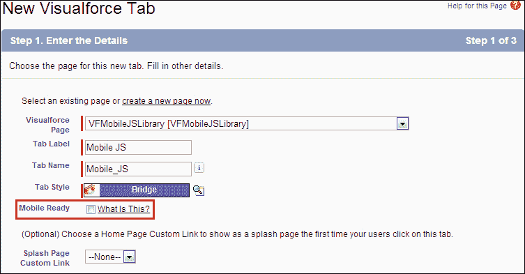

# 第七章. Visualforce for Mobile

通过使用 Visualforce 和 Apex，我们可以在 Force.com 平台上构建复杂、动态和强大的原生应用程序。如今，由于行业竞争，用户不仅满足于仅有一个 Web 应用程序。当涉及到 Force.com 平台上的应用程序时，我们可以通过使用 Visualforce Mobile 来扩展它们到移动设备。Visualforce Mobile 是客户端和按需编程的混合体。这使得我们能够通过离线数据访问的灵活性扩展移动设备的应用程序。我们可以通过使用 Visualforce 和 Apex 快速构建移动设备应用程序。

本章介绍了如何扩展在 Force.com 平台上为移动设备构建的应用程序，以及开发者如何使用 Visualforce Mobile。本章将涵盖以下主题：

+   理解 Salesforce Mobile

+   开发和移动化 Visualforce 页面

让我们构建适用于移动设备的 Visualforce。

# 理解 Salesforce Mobile

Salesforce Mobile 是由 Salesforce 提供的一款客户端应用程序。Salesforce Mobile 用于扩展在 Force.com 平台上构建的应用程序。这使得我们能够从 BlackBerry、iPhone 或 Windows Mobile 设备访问 Salesforce 数据。Salesforce Mobile 客户端应用程序具有以下功能：

+   通过无线运营商网络与 Salesforce 进行交互

+   在移动设备上存储用户数据的本地副本。它使用自己的数据库。

一组称为**移动配置**的参数由发送到移动设备的数据确定。它定义了用户 Salesforce 记录的相关子集。

### 小贴士

如果我们通过移动设备访问 Salesforce 数据，我们需要为特定用户购买单独的 Salesforce Mobile 用户许可证。开发者版和终极版只有一个移动许可证。其他人必须单独购买。

## Salesforce Mobile 和 Visualforce Mobile 支持的设备

Salesforce Mobile 支持 BlackBerry、iPhone 和 Windows Mobile。目前，Windows Mobile 不支持 Visualforce Mobile。BlackBerry 和 iPhone 设备必须满足以下要求：

+   **BlackBerry 配置如下：**

    +   支持的操作系统版本为 4.3 至 7.0，以及为了更好的性能，版本为 4.6 至 4.7

    +   设备上应至少有 5 MB 的空闲内存

    +   移动客户端应用程序支持 BlackBerry 8100 系列（Pearl）、BlackBerry 8300 系列（Curve）、BlackBerry 8800 系列、BlackBerry 8900 系列（Javelin）、BlackBerry 9000 系列（Bold）和 BlackBerry 9500 系列（Storm）

        ### 小贴士

        您不需要拥有 iPhone 或 BlackBerry 设备来开发和测试应用程序。您可以使用模拟器。

+   **iPhone 配置如下：**

    +   支持最新的 iPhone 操作系统

    +   设备上应至少有 5 MB 的空闲内存

    +   移动客户端应用程序支持 iPhone、iPhone 3G、iPhone 3GS 和 iPod Touch

## 移动应用程序的功能和限制

Salesforce Mobile 的原生客户端应用程序包含一个嵌入式浏览器，用于在客户端应用程序和 Visualforce 页面之间通信。在使用 Salesforce Mobile 时，我们需要考虑以下一些问题：

+   账户、资产、联系人、机会、任务、潜在客户、事件、价格表、产品、案例解决方案和自定义对象可以被移动化。

+   自定义链接、s-controls、混合应用、合并字段和图像字段无法移动化。

+   工作流规则、验证规则、公式字段和 Apex 触发器不适合在移动设备上运行。然而，在记录保存并提交到 Salesforce 后，它们可以在服务器端运行。

+   用户权限、记录类型和页面布局从 Salesforce 继承。然而，管理员可以更改它们以限制移动用户的权限。

+   当我们将子数据集添加到父数据集时，该对象在移动设备上成为相关列表。

+   报告仅在 BlackBerry 客户端应用程序中可用，但仪表板在 iPhone 和 BlackBerry 中均可用。

+   排序、摘要、小计或分组在移动应用程序的报告查看器中不受支持。

+   Salesforce 的自定义视图可以被 iPhone 和 BlackBerry 用户访问，但只能由 BlackBerry 用户创建自定义视图。

+   在移动应用程序中，自定义视图仅限于两列。

+   移动化的 Visualforce 标签和 Web 标签可以被 iPhone 和 BlackBerry 用户在客户端应用程序中访问。

### 小贴士

嵌入式浏览器通过设备的互联网连接与 Salesforce 通信；原生客户端应用程序通过 SOAP API 异步与 Salesforce 通信。嵌入式浏览器可以执行 JavaScript，但原生客户端应用程序不能。

## 使用 Visualforce Mobile

当我们使用移动应用程序时，它们是客户端应用程序，并且需要安装。移动应用程序需要定期连接以发送和接收数据。与移动按需应用程序相比，移动客户端应用程序依赖于网络连接和速度。移动客户端应用程序也可以用于离线工作。当我们谈到速度时，无线数据网络仍然非常慢。但是客户端应用程序响应速度很快。

有一些情况，原生客户端应用程序无法满足客户的需求。因此，我们可以在以下情况下使用 Visualforce Mobile：

+   与其他 Web API 集成，例如 Google Maps

+   重建客户端应用程序中不可用的功能，例如响应审批请求

+   将不支持在客户端应用程序中的标准 Salesforce 对象移动化

+   与外围设备集成，例如蓝牙或嵌入式 GPS

+   覆盖详细页面上的标准按钮操作

# 开发和移动化 Visualforce 页面

为 Salesforce Mobile 开发 Visualforce 页面与为 Salesforce 开发页面不同，尤其是在桌面浏览器和移动浏览器的用户体验不同的情况下。

## 为 iPhone 和 BlackBerry 构建 Visualforce Mobile 页面的最佳实践

以下是一些最佳实践：

+   **控制器**：Salesforce Mobile 支持自定义对象和许多标准对象。标准页面的标准布局和样式对于移动浏览器来说过于复杂。在为移动应用程序开发页面时，最佳实践是使用自定义控制器。如果您的控制器具有非常复杂的业务逻辑，可能会减慢页面的加载速度。

+   **页眉和侧边栏**：从 Visualforce Mobile 页面中删除页眉和侧边栏，因为它们可能会导致加载时间过长，并且在移动屏幕上没有足够的空间显示。可以通过以下代码删除：

    ```js
    <apex:page showHeader="false" sidebar="false">
    ```

+   **页面样式**：Salesforce 页面的标准样式表对于移动浏览器来说过于复杂。我们必须通过使用`<apex:page>`标签的`standardStylesheets`属性停止加载标准样式表，如下所示：

    ```js
    <apex:page showHeader="false" sidebar="false" standardStylesheets="false">
        <style type="text/css">
    <!—your custom styles here-->
        </style>
    </apex:page>
    ```

    ### 提示

    向页面添加样式表的最佳方法是在`<apex:page>`标签下方包含一个`<style>`部分。

+   **重用**：在移动客户端应用程序中，重用是一个关键组件。我们可以创建一个带有自定义样式的 Visualforce 页面，并在其他 Visualforce 页面中使用`<apex:include>`组件重用该页面。例如，如果前一页的名称是`myStylePage`并且我们在该页面上实现了自定义样式，那么我们可以按照以下方式包含带有样式的前一页：

    ```js
    <apex:page standardStylesheets="false"/>
    <apex:include pageName="myStylePage"/>
    </apex:page>
    ```

    ### 提示

    我们可以将移动优化的样式表作为静态资源创建，并在非移动页面上引用相同的样式表。使用样式表作为静态资源可能会增加页面的加载时间。

+   **查找**：在 BlackBerry 和 iPhone 上，查找功能无法正常工作。因此，最佳实践是在保存记录时验证查找条目。我们可以使用 Apex 触发器进行验证。我们还可以偶尔更改文件类型。

## iPhone 注意事项

在为 iPhone 开发页面时，我们必须考虑以下事项：

+   **页面缩放**：为了最大限度地提高与广泛网站的兼容性，iPhone 浏览器将页面宽度设置为 980 像素。使用`<meta>`标签，iPhone 浏览器可以识别显示页面的宽度。以下标签定义仅适用于 iPhone 浏览器，其他浏览器忽略此标签：

    ```js
    <meta name="viewport" content="width=device-width, initial-scale=1.0, maximum-scale=1.0, user-scalable=no" />
    ```

+   **URL 目标**：嵌入式浏览器不支持`target="_blank"`属性。带有此属性的页面将无法加载。

+   **屏幕旋转**：旋转屏幕不会导致页面翻转和调整大小。

+   **静态资源缓存**：嵌入式浏览器不支持缓存。

+   **文件访问**：嵌入式浏览器本身不提供对文件系统、相机、位置或其他设备数据的访问。

### 提示

**移动开发的通用规则**

我们不应该使用带有 JavaScript 的组件在依赖于 Salesforce 样式的组件上执行操作。如果我们能在我们页面的 HTML 源代码中看到指向 JavaScript（`.js`）文件的`<script>`标签或指向样式表（`.css`）的`<link>`标签，那么页面就可能属于前面的类别。

## BlackBerry 注意事项

在为 BlackBerry 智能手机开发页面时，以下注意事项会被应用：

+   **JavaScript 支持**：行内 DOM 事件在 BlackBerry 浏览器中不起作用。BlackBerry 浏览器对 JavaScript 的支持有限。在为 BlackBerry 开发 Visualforce 页面时，避免使用 JavaScript 是最佳选择。

+   **表单和视图状态**：如果你想在你的 Visualforce 移动页面上使用`<apex:form>`标签，请使用标准的 HTML 表单而不是`<apex:form>`。如果我们使用`<apex:form>`标签，页面的视图状态对于 BlackBerry 浏览器来说会太大。当我们使用标准的 HTML 标签时，我们必须手动完成以下操作，并且不能使用`<apex:commandLink>`标签和`<apex:commandButton>`组件：

    +   在页面之间保持状态

    +   重定向到另一个页面

        ### 小贴士

        可以使用控制器中的`ApexPages.currentPage().getParameters()`映射检索从表单发送的参数。

+   **页面样式**：我们必须遵循为 iPhone 和 BlackBerry 构建 Visualforce 移动页面的最佳实践。此外，我们必须知道 BlackBerry 浏览器会忽略一些 CSS 属性，例如`margin-left`。

+   **换行符**：除非行上有内容，否则`<br/>`标签会被忽略。

+   **导航**：在 BlackBerry 客户端应用程序的嵌入式浏览器中没有任何内置的导航。我们必须提供导航链接。

## 开发跨平台兼容的页面

当我们构建 Visualforce 移动页面以在 iPhone 和 BlackBerry 浏览器上表现良好时，我们需要遵循 Salesforce 提供的以下方法：

+   **分离和重定向**：我们可以通过使用 JavaScript 构建 Visualforce 移动页面，将其重定向到适合优化的页面（iPhone 优化的或 BlackBerry 优化的）来实现。为此，我们必须分别为 iPhone 和 BlackBerry 构建页面。当连接的设备不是 BlackBerry 设备时，页面将重定向到 iPhone 优化的页面，如下面的代码所示：

    ```js
    <apex:page>
    <language="javascript" type="text/javascript">
    if(!window.blackberry){
    window.location.href='{!$Page.iPhoneOptimizedVersion}';
    }
    </script>
       </apex:page>
    ```

+   **条件代码**: 服务器通过使用头部的用户代理字符串来识别连接的设备（iPhone 或 BlackBerry），这是浏览器传递给服务器的用户代理字符串。因此，我们可以为 iPhone 和 BlackBerry 设备上的性能良好的页面构建设备条件代码和样式。优点是标记在服务器端解释，用户只得到由条件代码选择的合适标记。缺点是由于条件代码，代码可能更复杂。以下示例显示了处理条件代码和标记的方式。标记有两个`<apex:outputPanel>`组件，每个组件为特定设备渲染标记：

    ```js
    <apex:page controller="ConditionalCodeController">
      <apex:outputPanel rendered="{!deviceType = 'BlackBerry'}">
        <apex:outputText value="This is BlackBerry"></apex:outputText>
      </apex:outputPanel>

      <apex:outputPanel rendered="{!deviceType  = 'iPhone'}">
        <apex:outputText value="This is iPhone"></apex:outputText>
      </apex:outputPanel>
    </apex:page>
    ```

    前一个标记的控制器如下，它评估用户代理并准备`deviceType`属性，以便渲染正确的输出面板：

    ```js
    public class ConditionalCodeController {
        public String deviceType { get; set; }

        public ConditionalCodeController() {
            String userAgent = ApexPages.currentPage().getHeaders().get('USER-AGENT');      
            if(userAgent.contains('iPhone')) {
                deviceType = 'iPhone';
            }
            else if(userAgent.contains('BlackBerry')) {
                deviceType = 'BlackBerry';
            }
        }
    }
    ```

+   **最低共同点**: 建设到最低共同点，仅包含最小、不干扰的 JavaScript，避免在标签中使用内联事件的脚本。根据客户组织中的设备，您可能需要完全避免 JavaScript。在较旧的 BlackBerry 智能手机上，使用任何 JavaScript 代码可能会使页面出现故障。

## 使用 JavaScript 库

JavaScript 库包含在 Salesforce 移动中触发操作命令。此 JavaScript 库可用于在本地客户端应用程序和 Visualforce 移动页面上构建无缝的用户体验。

### 小贴士

JavaScript 命令仅在启用 JavaScript 的设备上工作。

以下是在 JavaScript 库中的函数：

+   `mobileforce.device.sync()`: 此函数强制移动客户端应用程序与 Salesforce 同步，更新设备上的数据记录。

+   `mobileforce.device.close()`: 此函数关闭包含 Visualforce 页面的嵌入式浏览器，并将用户返回到原始/上一个标签或记录。

+   `mobileforce.device.syncClose()`: 此函数强制移动客户端应用程序与 Salesforce 同步，并关闭包含 Visualforce 页面的嵌入式浏览器。

+   `mobileforce.device.getLocation()`: 此函数获取设备当前位置的 GPS 坐标。

以下示例展示了 JavaScript 库中所有可用命令的使用：

```js
<apex:page showheader="false">
    <html >
      <head>
      <title>Visualforce Mobile Trigger Test</title>
      <!--  <meta name="viewport" content="width=device-width; initial-scale=1.0; maximum-scale=1.0; user-scalable=0;" />-->

      <!-- Using static resource -->
        <script type="application/x-javascript" src="img/mobileforce.js">
        </script>
        <script>
          function sync() {
            mobileforce.device.sync();
            return false;
          }
          function doClose() {
            mobileforce.device.close();
            return false;
          }
          function syncClose() {
            mobileforce.device.syncClose();
            return false;
          }
          updateLocation = function(lat,lon) {
            document.getElementById('lat').value = lat;
            document.getElementById('lon').value = lon;
          }
          function getLocation(){
            mobileforce.device.getLocation(updateLocation);
            return false;
          }
        </script>
      </head>
      <body>
        <h2>Triggers:</h2>
        <p>
          <a href="#" onclick="return sync();">JS sync</a><br/>
          <a href="#" onclick="return doClose();">JS close</a><br/>
           <a href="#" onclick="return syncClose();">JS sync and close</a><br/>
           <a href="mobileforce:///sync">HTML sync</a><br/>
           <a href="mobileforce:///close">HTML close</a><br/>
           <a href="mobileforce:///sync/close">HTML sync and close</a><br/>
        </p>
        <h2>Location:</h2>
        <p>Latitude: <input type="text" disabled="disabled" id="lat" name="lat" value=""/></p>
        <p>Logitude: <input type="text" disabled="disabled" id="lon" name="lon" value=""/></p>
        <a href="#" onclick="return getLocation();">Get location</a><br/>
      </body>
    </html>
</apex:page>
```

## 构建一个移动就绪的 Visualforce 标签

在构建 Visualforce 移动页面后，我们必须进行一些配置才能通过 Salesforce 移动访问这些页面。为了使 Visualforce 页面移动化，我们可以使用**Mobile Ready**属性创建 Web 和 Visualforce 标签。在导航到以下路径并点击 Visualforce 标签中的**新建**后，我们将被引导到一个页面，在那里我们将创建一个移动就绪的 Visualforce 标签：

**YourName** | **Setup** | **Create** | **Tab**



构建一个移动就绪的 Visualforce 标签

“**移动就绪**”复选框用于指定 Visualforce 页面是否在移动浏览器中正确显示和运行。通过选择“**移动就绪**”复选框，我们可以将选项卡添加到我们的移动配置可用选项卡列表中。

## 创建移动配置

当我们使用 Salesforce 移动时，我们必须确定移动用户的数据和授予移动用户的权限。移动配置是一组参数。一个组织可以为不同类型的移动用户拥有多个移动配置。当我们创建移动配置时，必须将特定用户分配给移动许可证。

### 小贴士

如果用户账户的“**移动用户**”复选框被勾选，那么这意味着该用户已被识别为移动用户，除非我们向用户的配置文件或权限集授予“**管理移动配置**”权限。

要创建移动配置，请导航到：

**您的姓名** | **设置** | **移动管理** | **Salesforce 移动** | **配置** | **新建移动配置**

只有活动的移动配置将可供使用。可选地，我们可以选择“**移动最近项目**”选项来标记 Salesforce 中最近使用的记录以进行设备同步，以及选择“**移动最近项目**”选项从“**最大最近项目数**”下拉列表中选择一个值。在移动配置中，我们可以添加单个用户或使用配置文件来授予权限。如果数据大小超过属性，我们将不会同步，以避免过度加载移动设备。为此，我们必须指定在此移动配置中所有数据集合并允许的最大数据大小。

### 小贴士

如果合并后的数据大小超过此限制，Salesforce.com 不会同步任何数据集。

创建移动配置后，我们可以通过添加对象和记录来定义数据集，并自动同步移动设备。

在开发完 Visualforce 移动页面后，我们必须测试它们以检查其功能和外观。为此，我们可以在 BlackBerry 或 iPhone 设备上安装移动应用程序，或者使用 iPhone 或 BlackBerry 模拟器。

# 摘要

在本章中，我们学习了 Salesforce 移动及其使用方法。我们熟悉了将基于 Force.com 平台构建的应用程序扩展到移动设备的方式，以及如何使用 Visualforce 移动。我们了解了如何开发和移动 Visualforce 页面。我们看到了 Visualforce 移动所需的移动设备支持配置。
