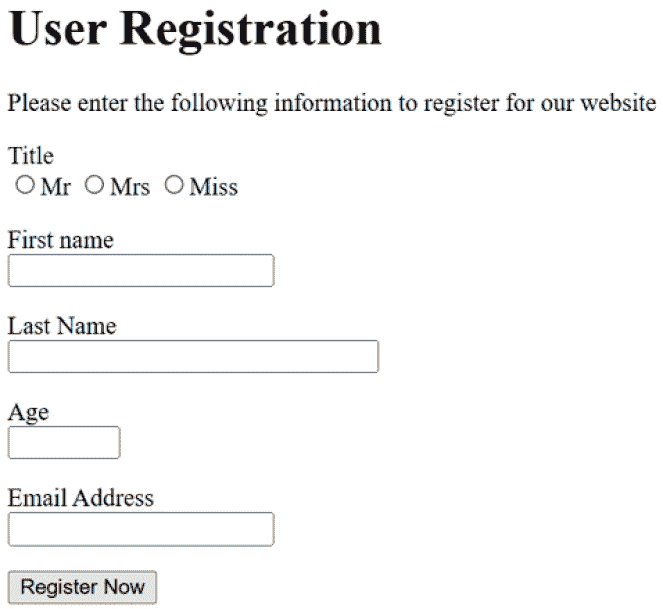
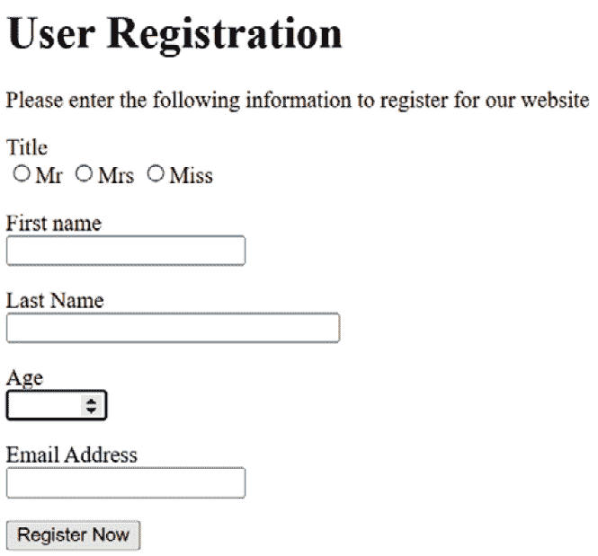
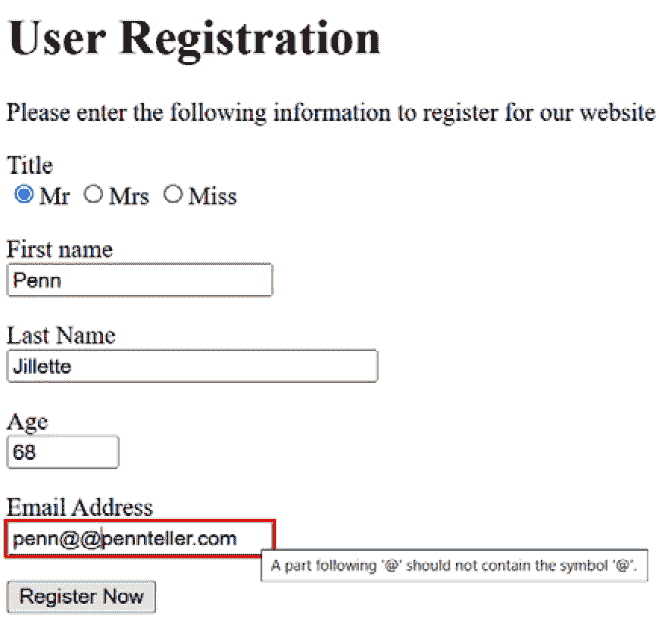
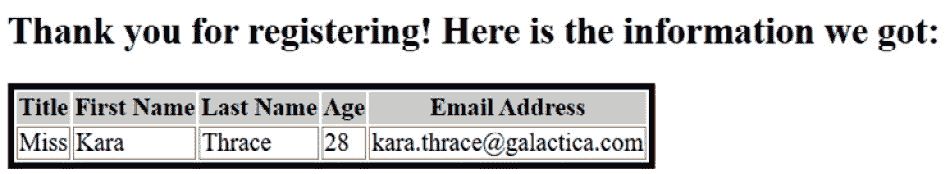
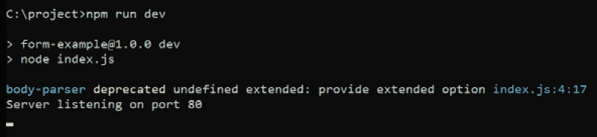
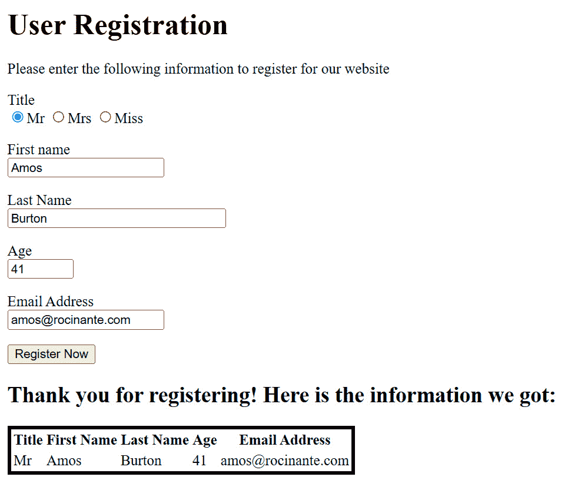
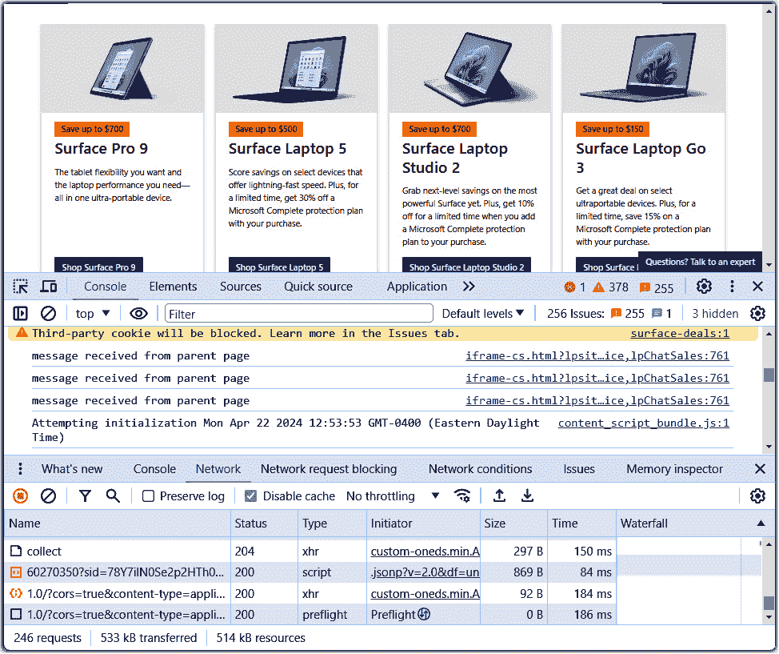
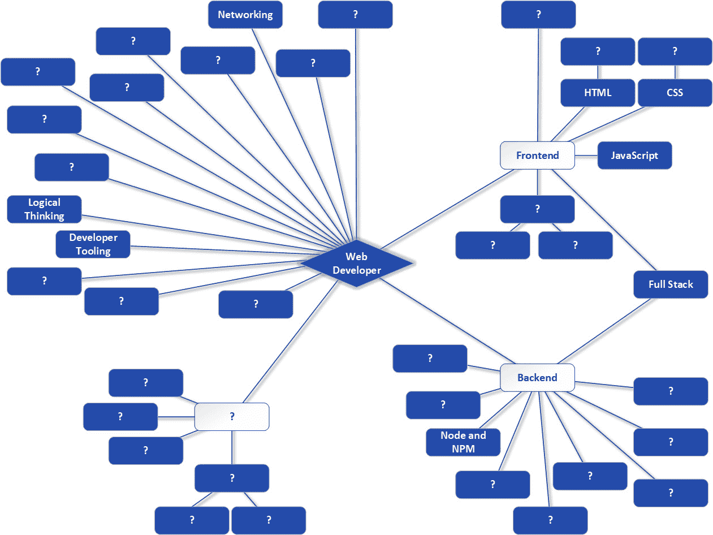

# 第三章：扩展基础——从前端到后端构建用户注册页面！

到目前为止，你已经开始构建技术基础，并对网页开发有一些背景知识。你也看到了一些前端（客户端）和后端（服务器），但到目前为止，你还没有看到它们是如何结合在一起的。现在让我们解决这个问题！

在这个过程中，你首先会了解一些关于网络的知识，因为互联网和网站都是建立在网络之上的。然后，你将接触到更多的 HTML、CSS、JS 和 Node，你将通过构建另一个简单的网页并查看它如何与服务器端通信来实现这一点。

这里的目标是了解客户端和服务器是如何连接的，信息是如何传输到服务器的，以及服务器是如何处理它并返回响应的。这是我们每天在网页开发中都会做的事情的一部分，因此显然，它非常重要。你不仅会接触到这一点，而且还会以两种不同的方式接触到，确保你能看到在网页开发中不止有一种方法可以“剥猫皮”。

你还将了解一些与你的网络浏览器一起提供的工具，以及它们的价值，因为当你努力调试并确保一切按预期工作的时候，你将不断地与这些工具互动。

在本章中，我们将涵盖以下主题：

+   通过网络连接

+   构建交互式网页应用程序——前端

+   构建交互式网页应用程序——后端

+   探索不同的方法——单页应用程序

+   爱上你的新最佳朋友——开发者工具

# 技术要求

为了本章的目的，你只需要确保已经安装并运行了 Node，这你应该在上章已经完成。你还需要确保你已经从 GitHub（[`github.com/PacktPublishing/Web-Development-Career-Master-Plan`](https://github.com/PacktPublishing/Web-Development-Career-Master-Plan)）下载了本书的所有源代码，你可以在*第二章*的*技术要求*部分找到。你可能已经注意到了，下载的代码中每个章节都有自己的目录，所以对于本章，你感兴趣的是`ch-03/1-form`和`ch-03/2-spa`目录。

这就是本章你需要了解的全部内容，所以现在，让我们自己构建一个用户注册页面吧！

# 通过网络连接

在我们真正开始编写代码之前，让我们先谈谈一些更基础的东西，即网络，以及网络是如何进行通信的。

我在上章提到了**IP**（**互联网协议**），但并没有深入细节。在这里我也不会过多地深入，因为当我们谈论包括 IP 在内的网络协议时，它很快就会变成一个广泛的话题。然而，作为一名网页开发者，你应该至少了解基础知识。

## 理解 IP

IP，正如其缩写中的第二个单词所表明的，是一个协议。协议简单来说就是两个事物之间通信的约定标准。在这种情况下，IP 描述了被称为**数据报**的小数据块如何在两台机器之间通过网络进行传输。正如你在*第二章*中看到的，它还负责为每台机器分配一个 IP 地址，该地址在网络中唯一地标识了它们。

然而，你可能惊讶地发现，IP 并不保证它传输的数据报的交付、顺序或完整性。换句话说，如果你想从一台机器发送一张图片到另一台机器，那张图片将被分成许多数据报，并且它们将使用 IP 在网络中传输，但它们可能或可能不会到达目的地，可能或可能不会以正确的顺序到达，以便其他机器可以重建图像（实际上，接收机器甚至没有一种方法知道它们应该以什么顺序到达），并且可能或可能以某种方式损坏。IP 被认为是一个“尽力而为”的协议，这意味着它将*尝试*将数据从机器 A 传输到机器 B，但它并不保证。

如果这听起来像是一场灾难的配方，你是对的！但它的好处是它非常简单且快速，而在技术中，当你拥有简单快速的东西时，几乎总是很容易扩展它或在其之上构建一些东西（我们在软件工程中非常重视层次）。这正是 TCP 的用武之地。

## 理解 TCP

**TCP**，即**传输控制协议**，通过与 IP 协同工作或在其之上工作，确保发送的信息是可靠的。它首先将需要发送的数据分解成**数据包**（然后 IP 将进一步将其分解成数据报），并确保所有数据包都到达目的地，它们是无错误的，并且它们告诉接收者一切事物的顺序。它是通过在机器之间建立连接并发送数据包来做到这一点的，接收者随后将检查这些数据包。数据包包含接收者可以使用以验证数据是否正确的数据。它们还包括序列号，告诉接收者它们的顺序。如果一个数据包损坏，或者接收者发现某些数据丢失，它可以请求发送者重新发送数据，这是 TCP 提供的另一个关键功能。

TCP/IP 是一个很好的组合，因为在拥有大量机器（如互联网）的大型网络中，它们之间有很多路由和连接，数据包可以通过这些路由传输。如果某个连接中断——可能是因为有人在修路时不小心切断了网络电缆——可以选择不同的路由。在这种情况下，IP 不提供具体保证的事实并不重要，因为 TCP 在其之上拥有所有所需的信息，可以根据需要请求发送者重试，并且这可以一直持续到所有数据都正确且按顺序接收为止。这为网络提供了冗余。是的，如果数据包必须绕地球半圈才能到达目的地，速度会稍微慢一些，但数据仍然会到达，这正是 TCP 与 IP 协同工作时提供的关键功能。

然而，尽管 TCP/IP 在概念上作为互联网的基础协议，但网络有其自己的协议，它位于 TCP/IP 之上，那就是 HTTP。

## 理解 HTTP

你可以将 **HTTP**（超文本传输协议的缩写）视为网络数据通信的基础。

HTTP 在两台机器之间作为请求-响应模型工作，一台作为客户端，另一台作为服务器。HTTP 是我们所说的无状态协议，这意味着每个请求都是独立的。换句话说，当你你在浏览器中输入一个 URL 时，从你的机器到服务器的连接就会建立，但一旦 HTML 页面返回给你，这个连接就会结束。当需要检索图片或样式表时，会建立一个新的连接。更现代的 HTTP 版本实际上会在一定程度上重用连接，但连接仍然不会永远持续，这就是我们所说的无状态——两台机器之间没有恒定的连接。

当你使用 HTTP 从一台机器连接到另一台机器时，每个请求都使用一个 HTTP 方法，它包含一组基本操作，可以用来与服务器交互。它们旨在（至少在一般情况下）向服务器传达客户端想要做什么。请注意，这与 JS 方法不同——一个附加到对象上的函数——这实际上是一种更复杂的方式来说明它告诉我们做出了什么 *类型* 的 HTTP 请求。

HTTP 定义了几个方法，其中每个方法都有一个典型的（尽管不是具体的）预期用途：

+   **GET**: 从服务器检索数据

+   **POST**: 向服务器发送要处理的数据

+   **PUT**: 更新服务器上的现有数据

+   **DELETE**: 从服务器删除数据

+   `GET` 只是一个更有限的版本

+   **OPTIONS**: 发现资源上允许的方法

当您在浏览器中输入一个 URL 时，会发起一个 `GET` 请求。如果您这样考虑，这是有道理的——您的浏览器正在请求服务器上的数据，通常是 HTML 文档。其他情况下需要其他方法——当您向服务器发送信息时，您可能会使用 `POST` 或 `PUT`，具体取决于情况——但您很快就会看到选择其他方法是如何发挥作用的。

值得注意的是，HTTP 与 HTML 密切相关，有一个类似于 HTML 中的 head 和 body 的概念，但称为 **headers** 和 body。Headers 是提供一些元数据给接收者的数据块。有大量的 headers，您也可以创建自己的，所以在这里我不会深入探讨；相反，我会在必要时介绍 headers。然而，有一件事我会告诉您，它们是以 **键值对** 的形式发送的。这是一个常见的编程思想，看起来像这样：

```js
first_name:Frank
```

或者，它也可以是这样的：

```js
first_name=Frank
```

是否使用冒号或等号（或者可能是其他字符），这取决于上下文，但关键点是您有一个键（`first_name`）和一个值（`Frank`）。值是通过键来识别的。您几乎可以将它们视为 JS 中的变量，因为您可以在需要时查找与键关联的值。

HTTP 请求的主体可以包含任意数据，无论是文本、图像、音频文件还是其他任何东西。当一个 HTTP 请求有主体并且包含数据时，几乎总是使用 `POST` 方法。您很快就会看到一个例子，作为讨论其他内容的部分——HTML 表单。

HTTP 与 HTTPS 的比较

哦，如果还不够的话，还有 HTTPS。幸运的是，这很简单——它只是加密的 HTTP，其中的 **S** 代表 **Secure**。如果您看到一个带有 HTTP 的 URL，这意味着通过该连接发送和接收的所有内容都可能被网络上的其他人看到（这并不那么容易做到，但也不是特别困难）。然而，通过 HTTPS，所有内容都是加密的，没有一些称为 *keys* 的秘密信息，拦截数据的人基本上会看到很多乱码。

曾经有一段时间，HTTPS 只用于像银行网站和购物网站这样的敏感网站。这是因为，在很长一段时间里，加密和解密过程——它基于一些复杂的数学——对计算机来说是一件昂贵的事情。从金钱的角度来看，这很昂贵，更重要的是，在性能方面也很昂贵。HTTPS 连接简单地比 HTTP 连接慢。然而，现在情况已经不再是这样了。计算机足够快，并且通常有专门用于加密/解密的硬件，所以现在大多数连接实际上都是 HTTPS。浏览器甚至会让你知道连接不安全，有些甚至完全不允许非 HTTPS 连接。

对于大多数意图和目的，你通常可以一般性地将 HTTP 和 HTTPS 连接视为相同。然而，在开发方面，设置 HTTPS 连接需要一些额外的配置，这可能相当复杂。如果你听说过*证书*这个词，那就是涉及的。这是一个完全不同的主题，可能会相当复杂，所以它不会在本书中涉及。在你自己的机器上开发时，你可以简单地使用 HTTP，这是默认情况下如果你没有明确设置 HTTPS 将会使用的，你不需要担心证书和所有那些，除非你真的需要。

在掌握了互联网（以及大多数网络）上事物如何通信的基本理解之后，我们现在可以继续构建前面提到的注册应用程序。

# 构建交互式 Web 应用程序——前端

对于本章，我们不仅仅使用之前看到的简单 HTML，而是创建一个看起来更“真实”的应用程序。我的意思是，让我们创建一些你可能在某天的工作中真正需要构建的东西——一个用户注册页面。

目标将很简单——给用户一种方式来输入一些关键信息（他们的头衔、名、姓、年龄和电子邮件地址），然后将这些信息发送到服务器，在那里我们将生成一个响应来确认用户现在已经注册。我们实际上不会以任何方式注册用户——我们甚至不会存储他们发送的信息——但这足以看到这样的客户端-服务器交互是如何工作的。

## 构建注册页面

第一步是构建一个用户可以输入信息的页面。

嗯，我收回刚才的话，因为*真正的*第一步是开始一个项目。正如你在前面的章节中学到的，这可以简单到创建一个 HTML 文件；然而，你也看到了如何使用 NPM 来创建一个新的项目。既然我们知道我们将在稍后为这个项目构建一个服务器，让我们现在就做吧。

如同之前，只需创建一个目录，进入命令提示符，导航到该目录，并执行`npm init`。现在，你可以为每个问题都按*Enter*键，因为这将满足我们的需求。

完成这些后，是时候编写一些 HTML 了，其结果将是你将在*图 3.1*中看到的内容。



图 3.1：我们正在构建的注册页面

你会从在项目目录中创建一个名为`index.html`的文件开始这个项目，然后开始编写其中的代码。当然，我已经为你完成这部分工作了！在 GitHub 仓库中，你可以在`ch-03/1-form`目录下找到这个文件。由于它比之前的例子要复杂一些，我们将逐步解决它，将其分解成可管理的块，从`<head>`开始。

### 创建头部

对于我们的注册页面，我们像之前一样，从`<html>`标签开始，然后在其中添加一个`<head>`部分：

```js
<html>
  <head>
    <title>User Registration</title>
    <link rel="stylesheet" type="text/css" href="styles.css" />
  </head>
```

到现在为止，代码应该开始对您有了一些意义，因为您之前已经见过它。

然而，与前面章节中展示的示例不同，`<head>`中没有`<style>`块。相反，所有 CSS 都在一个外部的`styles.css`文件中。我这样做的主要原因——这样我就可以暂时跳过 CSS！实际上要处理的 CSS 并不多；然而，如果您先看到 HTML 是如何应用样式的，这会更有意义，所以我们将在最后回到它。现在，只需知道样式表文件通过`<link>`标签导入，并像在前面章节中看到的那样，直接在`<head>`中的`<style>`块中起作用。

在这个项目中也没有使用 JS，所以这就是`<head>`中所有内容。现在，我们可以继续创建`<body>`。

### 创建主体

与`<head>`一样，`<body>`开始时非常简单：

```js
<body>
    <h1>User Registration</h1>
    <p>Please enter the following information to register for our website</p>
</body>
```

如您所见，我们有一个标题，下面有一段文字。当然，您知道还有更多——您在*图 3*1 中看到的那些字段，用户可以输入他们的信息，以及提交按钮——但所有这些都构成了我现在要介绍的新概念——表单。

### 了解表单

在 HTML 中，表单是我们提供用户输入信息的方式。一个表单由一个或多个表单字段组成，这些字段有多种类型。您可能没有意识到，但除非您从未真正使用过网站，否则您知道许多这些字段，即使您没有意识到您在使用。先不考虑这一点，一切从定义表单本身开始，而在 HTML 中，这意味着一个新的标签：

```js
<form action="/register" method="post">
```

`<form>`标签是我们开始表单的方式。这个标签有几个属性，但两个关键属性是`action`和`method`。

`action`属性告诉浏览器将用户输入的信息发送到哪个 URL。您可以将此 URL 表示为绝对 URL 或相对 URL。

绝对 URL 包含获取特定资源所需的所有信息。例如，www.packt.com/takeMyInfo 是一个绝对 URL，因为它以域名开头，并包含服务器上资源的完整路径。[www.packt.com/books/zammetti/forms/takeMyInfo](http://www.packt.com/books/zammetti/forms/takeMyInfo)可能另一个例子（这是虚构的，仅供参考！）绝对 URL。

那么，什么是相对 URL？相对 URL 从绝对 URL 开始，或者更准确地说，是从其*部分*开始的。/takeMyInfo 是一个相对 URL 的例子。如果使用该 URL 的文档是从[www.packt.com](http://www.packt.com)加载的，则浏览器将所有相对 URL 解释为相对于该基本 URL。因此，/takeMyInfo 指向的完整 URL 是 www.packt.com/takeMyInfo。

在一个更复杂的例子中，/books/zammetti/forms/takeMyInfo 可以是一个相对 URL。如果你从一个 HTML 文档 [www.packt.com/books/zammetti](http://www.packt.com/books/zammetti) 加载，那么你可以有一个相对 URL 为 /forms/takeMyInfo，因为这两个 URL 在浏览器幕后被合并，形成一个绝对 URL，然后浏览器将使用这个 URL 请求资源。

然而，在这个 `<form>` 中，`/register` 是表单将被发送到的 URL，你将在我们讨论这个项目的服务器部分时看到那里等待的内容。

另一个关键属性是 `method`。这是用于传输表单的 HTTP 方法，它将是 `GET` 或 `POST` 之一。区别在于当它是 `GET` 时，表单上的信息将以 `?aaa=bbb&…` 的形式添加到 URL 中，其中 `aaa` 是键，`bbb` 是值。例如，在这个表单中，我们将要求用户输入他们的名字和姓氏。如果这个信息通过 `GET` 发送，那么一个查询字符串将被附加到 URL 上，作为 `?first_name=Frank&last_name=Zammetti`。

在某些情况下这没问题，但在大多数情况下，这并不是一个好主意，因为它有安全影响，也因为 URL 有一个大小限制，信息可能比你拥有的空间要大。所以，你可以用 POST 方法发送信息，这将导致浏览器在 HTTP 请求的正文部分发送它，那里实际上没有限制，而且它对世界的暴露也不是“完全”的（它仍然很容易获取，但每一点帮助都很大）。

一旦我们有了 `<form>`，我们就可以开始向其中添加字段：

```js
<p>
  Title
  <br>
  <input type="radio" name="title" value="Mr">Mr
  <input type="radio" name="title" value="Mrs">Mrs
  <input type="radio" name="title" value="Miss">Miss
</p>
```

严格来说，`<p>` 标签在表单中不是必需的。实际上，你可以定义你自己的 HTML 和布局，但在这里，我只是想让每个字段沿着屏幕向下延伸，所以将每个字段放在 `<p>` 中简单地完成了这个任务。我还想每个字段都有一个文本标签，这就是 `Title` 文本的作用。我想让这个标签在字段本身之上，所以 `<br>`，换句话说，是一个换行符，确保了这一点。

`<input>` 标签定义了一个表单字段，用户可以在其中输入信息。在大多数情况下，屏幕上的单个输入字段在 HTML 中也是一个单个 `<input>` 标签，它有一个 `type` 属性，告诉浏览器它属于几种选择中的哪一种。然而，在单选按钮的情况下，这是一种可以从中选择一个且仅选择一个选项的控件类型，将会有多个类型为 `radio` 的 `<input>` 标签，每个选项一个。`name` 属性告诉浏览器输入值的名称（键）在表单中应该是什么。在这里，我们说在这个表单中，我们想要一个名为 `title` 的键，并且它将有一个三个可用的值（这些值由每个 `<input>` 元素的 `value` 属性直接定义）。当用户选择三个选项中的一个时，表单中的 `title` 值将反映所选的 `value`。

如果这看起来有点令人困惑，不要担心——我认为你会在本章的后面看到服务器交互时发现它更有意义。

之后是两个 `<input>` 字段，用于输入姓名的首字母和姓氏：

```js
<p>
  First name
  <br>
  <input type="text" name="first_name" size="20">
</p>
<p>
  Last Name
  <br>
  <input type="text" name="last_name" size="30">
</p>
```

在这里，我们又有另一种 `<input>` 字段——一个 `text` 字段。这允许用户输入他们想要的任何任意文本。然后，同样，`type` 属性告诉浏览器我们想要哪种字段，而 `name` 属性告诉它哪个键将保存用户输入的值。

`size` 属性告诉浏览器字段的实际大小，它定义为字段应该有多宽。当我们谈论非比例字体——意味着每个字符占据可变的空间（例如，“I”字母在水平方向上占用的空间不如“W”多）——这个值可能有些灵活。但作为一个经验法则，如果 `size` 是 `20`，那么你通常可以在其中看到大约 20 个字符，略有增减。请注意，这并不设置实际可以输入的字符数上限；如果你输入的字符数超过了 `size` 属性允许的，字段将滚动（有一个 `maxlength` 属性设置了可以输入的最大字符数）。

接下来，我们有一个不同类型的输入字段：

```js
<p>
  Age
  <br>
  <input type="number" name="age" min="13" max="100" step="1">
</p>
```

`type` 为 `number` 确保只能输入数值；如果你尝试输入字母，浏览器将不允许这样做。此外，大多数浏览器将显示上下箭头以允许用户滚动查看可用值。此标签允许我们设置输入数字的限制；在这里，通过设置 `min` 和 `max` 属性，允许输入的范围是 13–100。

接下来，`step` 属性告诉我们当使用箭头按钮时数字变化的增量（如果值是 2 而不是 1，例如，当点击向上箭头时，它将从 13 跳到 15，然后到 17）。

**图 3.2**显示了上下箭头的呈现方式，这可能会根据浏览器而有所不同（此示例来自 Chrome）：



**图 3.2**：Chrome 显示数字字段中的箭头方式

之后是最后一个输入字段：

```js
<p>
  Email Address
  <br>
  <input type="email" name="email">
</p>
```

`email` 类别确保输入的值是一个有效的电子邮件地址。如果你输入了一个无效的值（例如 `none@@@nowhere`），该字段将被突出显示，并且悬停在其上会显示一个工具提示来解释问题。请注意，这种呈现方式是浏览器特定的，但**图 3.3**显示了在 Chrome 中悬停在该字段时应看到的内容：



**图 3.3**：Chrome 显示电子邮件字段中的错误

在输入字段之后，我们需要一个按钮供用户点击以将信息发送到服务器：

```js
<button type="submit">Register Now</button>
```

有几种类型的按钮，你将在本章后面看到另一种，但 `submit` 可能是最重要的，因为它实际上告诉浏览器，当点击时，它需要将输入的信息发送到服务器。在 `<button>` 标签的打开和关闭之间的是按钮上显示的标签。

现在只剩下最后一件事，那就是正确地关闭表单：

```js
</form>
```

完成所有这些后，我们就有一个完整的 HTML 表单，当用户点击按钮时，它将发送其信息到指定的 `action` URL。但我们还没有完成；我们仍然有一个要完成的 HTML 文档！

### 完成主体和文档

当然，我们必须使用以下方式来关闭文档的主体：

```js
</body>
```

然后，我们必须使用以下方式关闭文档本身：

```js
</html>
```

完成这些任务后，我们现在有一个完整的 HTML 页面。

记得我之前说我们会跳过样式表吗？现在，是时候看看那个了！

### 添加一些样式

之前，你看到 `styles.css` 文件在 `<head>` 中被导入。这个文件的内容并不多，但它展示了一些新的 CSS 概念：

```js
input:invalid {
  outline: 2px solid red;
}
```

第一个新概念是 `<a>` 标签可以显示三种不同的状态——当用户从未点击它时（未访问），当用户之前点击过它时（已访问），以及当用户的鼠标指针悬停在其上时。如果你想使链接在未访问时为红色，在已访问时为蓝色，在悬停时为绿色，你可以创建一个名为 `a:visited`、`a:unvisited` 和 `a:hover` 的 CSS 类，并在每个类中设置适当的 `color` 属性值。冒号及其后面的单词是伪类。

在此情况下，我想确保当输入无效的电子邮件地址时，电子邮件字段将特别有一个红色边框。幸运的是，对于输入选择器有一个伪类，即 `:invalid`。因此，`input:invalid` 是用来定位无效输入字段的选择器。

第二个新概念是 `outline` 属性。这个属性允许我们在元素周围绘制边框（这是两种方法之一，你稍后会看到另一种）。这个属性实际上还展示了第三个额外概念——**缩写属性**。让我稍微解释一下。

你看，这个属性定义了三件事：

+   绘制在字段周围的边框宽度（2 像素 - `px` 是像素的缩写，它们是构成你显示器上图片的点）

+   边框的样式（这里为 `solid`）

+   边框的颜色

这些也可以由独立的属性定义——`outline-width`、`outline-style` 和 `outline-color`。然而，仅使用 `outline` 缩写属性就可以一次设置所有三个。

在 CSS 中，一些相关的属性组有这种简写属性，你稍后也会看到更多。然而，为了不让你感到悬念，其他的一些包括`margin`（`margin-top`、`margin-bottom`、`margin-left`和`margin-right`的简写）、`padding`（`padding-top`、`padding-bottom`、`padding-left`和`padding-right`的简写）、`background`（`background-color`、`background-image`、`background-repeat`、`background-attachment`和`background-position`的简写），以及`font`（`font-style`、`font-weight`、`font-variant`、`font-size`/`line-height`和`font-family`的简写）。

现在我们有了前端（客户端），让我们为它构建后端（服务器）以便与之通信。这将要求我们编写一些代码来接受用户在表单中输入的数据，并为浏览器提供一个响应以显示给用户。让我们开始工作！

# 构建交互式 Web 应用——后端

为了构建这个小型项目的服务器，我们再次使用 Node。然而，与上一章从头开始编写服务器不同，这次我们将使用 Node 最流行的包之一来处理许多基本细节——Express。

## 介绍 Express

当你从头开始编写 Node 服务器时，你必须自己处理所有细节。这意味着，例如，如果你想让服务器响应多个不同的 URL，在你的处理函数中，你需要检查请求的 URL，并根据它分支到一段代码以返回适当的响应。当应用程序足够大时，这会变成一个真正的头疼问题。

因此，我们经常会使用 Node 的附加包来处理这些事情——其中一个这样的包叫做**Express**。实际上，Express 是一个非常强大的模块，可以为我们处理各种事情，包括安全、文件上传和下载、操作日志记录以及模板化（以通用方式构建 HTML 和其他响应类型的能力，然后可以将数据插入到概要或模板中，以返回完整的响应）。

Express 也是你遇到的第一个**框架**。框架是一个预写的代码库，为构建自己的代码提供基础。它为你的代码提供了一种定义的结构，这样你就不必猜测并自己构建，而且它推动你使用最佳实践。本质上，它们旨在使软件开发更容易，并允许你编写更少的代码，这通常是一个好事情，因为它意味着你犯错误的机会更少。

更具体地说，Express 被称为“无意见”框架。而“有意见”的框架确保只有一种“正确”的方式来做事，你最好按照这种方式来做，否则你会发现自己在遇到挑战，而“无意见”框架则不会对你施加太多限制。Express 作为“无意见”框架，为你提供了更多的灵活性，在节省你大量努力的同时，仍然允许你大部分情况下按照自己的方式做事。关于“有意见”或“无意见”框架哪个更好的争论是一个由来已久的话题，我甚至不打算在这里尝试回答！

要开始使用 Express，我们必须将其添加为我们项目的依赖项，所以现在让我们来做这件事。

## 添加依赖项

记得当你运行 `npm init` 命令时创建的 `package.json` 文件吗？我说过它提供了 Node 和 NPM 关于我们项目的元数据，但我还说过我们基本上会忽略它。然而，我们现在必须查看它！

这是 `npm init` 命令的输出结果（记住，你的输出可能因你输入的值而略有不同，但应该看起来 *大体上* 相同）：

```js
{
  "name": "form-example",
  "version": "1.0.0",
  "description": "",
  "main": "index.js",
  "scripts": {
    "test": "echo \"Error: no test specified\" && exit 1"
  },
  "author": "",
  "license": "ISC",
  "dependencies": {
    "express": "4.18.2"
  }
}
```

大部分内容仍然可以忽略，但我们现在必须关注的是 `dependencies` 元素。这个元素告诉 Node 和 NPM 我们的项目依赖于哪些包。你的项目此时可能为空，但我在我的项目中已经添加了 Express 依赖，并且我还指定了确切的版本。如果你访问 [`www.npmjs.com`](https://www.npmjs.com)，你可以探索所有可用的不同包。NPM 使用这个网站来下载你添加到 `package.json` 文件中的依赖项。

但你实际上是如何将依赖项添加到 `package.json` 中的呢？好吧，鉴于这只是一个文本文件，你可以直接手动编辑它。然而，有一个更好的方法。首先，执行以下命令：

```js
npm install -save express@4.18.2
```

然后，再次打开 `package.json` 文件，你应该会找到与该命令中显示相同的依赖项条目。`npm install` 命令告诉 NPM 安装你在项目中命名的包（它会被添加到 `node_modules` 目录中）。

在这里，我指定了版本为 `@4.18.2`。你不必像这样指定版本，实际上，你通常也不需要这样做。当你不指定版本时，NPM 将安装该包的最新版本。我在这里明确指定了版本，因为，对于一本书来说，你需要确保几个月或几年后读者仍然能够获得已知与代码兼容的确切版本；否则，更新的版本可能无法与书中描述的代码兼容（我为此付出了惨痛的代价！）。

最后，为了更新`package.json`文件，我们需要指定`–save`选项。如果不这样做，NPM 将只在`node_modules`中安装 Express，但不会将其添加到`package.json`文件中的依赖项列表中。当你只是尝试一个新的包，还不知道是否会在你的项目中继续使用它时，不指定`–save`是好的，因为这样不会永久更改任何内容。但既然我们知道我们希望 Express 保留下来，我们*确实*想要更新文件，而你想更新文件的原因是你可以将你的`package.json`文件给另一位开发者，他们只需要执行这个命令：

```js
npm install
```

NPM 将接着查找`package.json`并安装列出的所有依赖项。这样，开发者就可以准备好在你的代码上工作，并将拥有与你相同的所有依赖项。

这是一种除非你亲身体验过，否则不会知道的事情，但设置新开发者的开发环境并不总是那么容易。在过去，他们必须上网并手动下载所有依赖项——这些依赖项并不总是在一个网站上——而且这还假设他们甚至有一份所需内容的清单。NPM 通过其`package.json`文件解决了所有这些问题！

我最后想提到的是，如果你查看你的项目目录，你会找到一个新目录被创建，称为`node_modules`。这是一个 NPM 创建的目录，用于保存它下载的所有包。在大多数情况下，你不需要查看这个目录或关心里面有什么；只需让 Node 和 NPM 处理它。你也应该意识到，有时它可能会变得相当大，因为如果一个包本身依赖于另一个包，那么那个包就会被下载，这种依赖链可能会持续一段时间。所以，`node_modules`将充满你不认识的包，因为它们都有依赖项。这就是它的工作方式。如果你任何时候删除`node_modules`，那没关系；你只需再次运行`npm install`，它就会被重新创建。

现在我们已经添加了所需的依赖项，让我们解决一个你可能甚至没有意识到的问题——那就是开发者效率问题——在这个过程中，你将看到`package.json`文件提供的新功能——脚本。

## 添加脚本

在过去，启动我们的服务器只需使用`node index.js`命令。然而，当另一位开发者想要在我们的项目上工作，他们可能不知道这一点。只有一个 JS 文件，猜测起来足够简单，但想象一下如果我们有成百上千个文件，这在大型项目中确实可能发生——你将如何知道从哪里开始呢？

当然，你可能会猜它是`index.js`，因为当你在一个项目中执行`npm init`时，NPM 会将默认值设置为`package.json`中的`main`属性，但 a)可能根本不存在`index.js`文件，b)即使存在，这也可能不是正确的答案，因为项目的开发者可能做出了不同的选择。我们可以告诉开发者它是哪个文件，但难道没有更好的方法来传达这个信息，而无需明确告诉某人吗？

有，这是由于`package.json`文件中另一个可用的元素——`scripts`。`scripts`元素提供了一种在某种程度上创建自定义 NPM 命令的方式。该元素中出现的任何内容都可以使用`npm run XXX`命令运行，其中`XXX`是`scripts`中的一个键。默认情况下，NPM 给我们一个`test`命令，所以你可以用`npm run tests`来运行它。

我们可以使用这个功能来提供一个启动服务器的方法：

```js
"dev": "node index.js"
```

这样，我们可以执行`npm run dev`来启动服务器，`scripts`条目知道要运行哪个文件，因此开发者不需要这样做。这是一个常见的命令，所以许多开发者会自动知道它。但即使他们不知道，他们也可以简单地查看`package.json`并查看可用的命令。在某种程度上，这是一种记录我们项目正确启动命令的方式。

现在我们已经将 Express 添加到我们的项目中，并且有一个启动脚本来运行它，让我们用它来编写我们的服务器代码。

## 编写服务器代码

我们首先在项目目录中创建一个`index.js`文件。这将是前一章中的服务器代码。

每次你向 Node 项目添加一个包时，你几乎肯定需要将其导入到你的代码中，而这确实是我们在`index.js`中的第一件事：

```js
const express = require("express");
```

这给我们一个名为`express`的对象，我们可以使用它的几个属性和方法。然而，在这个情况下，对象本身是一个函数——换句话说，`express`变量指向一个函数，因此我们可以像函数一样执行它：

```js
const app = express();
```

`express()`函数的结果是返回给我们一个服务器对象。Express 处理所有服务器的设置和创建。然而，因为对象是返回给我们的，Express 允许我们配置服务器以满足我们的特定需求，我们首先需要做的是告诉它我们想要能够处理发送的表单：

```js
app.use(express.urlencoded());
```

`app.use()`函数允许我们配置 Express 中间件。这实际上只是说我们可以告诉 Express 为每个进入的请求执行一个或多个函数。这对于记录传入的请求以简化调试、实现某种安全措施，或者在这种情况下，告诉它处理表单数据都很有用。

## 添加 Express 中间件

当一个表单通过`POST`方式发送到服务器时，它会在请求体中以独特的方式进行编码，如下所示：

```js
title=Mr&first_name=James&last_name=Kirk&age=54&email=jame.t.kirk%40starfleet.com
```

为了让服务器能够理解这一点，它必须知道如何解析它以及使用哪个中间件函数来做到这一点。Express 提供了几个预构建的中间件函数，其中之一是在我们调用 `express.urlencoded()` 函数时提供给我们的。它返回一个函数，然后我们通过将其传递给 `app.use()` 函数将其添加到 Express 作为中间件。没有这个，Express 就无法处理我们的客户端代码将发送给它的表单数据。

你可以通过调用 `app.use()` 添加零个、一个或多个中间件函数。每次调用它时，你给它一个函数的引用，无论是你自己创建的，还是 Express 提供的，或者来自第三方来源的，它会被添加到 Express 将为每个进入它的请求执行的中间件函数链中。

### 使用 JS 箭头函数创建 Express 路由

也许 Express 的关键概念是 **路由** 的想法。路由实际上只是 URL。在 Express 中定义路由意味着定义针对给定 URL 执行的函数。对于我们的小程序，我们需要两个路由，从默认路由开始：

```js
app.get("/", (inRequest, inResponse) => {
  inResponse.sendFile(`${__dirname}/index.html`);
});
```

这是默认路由，因为它是在 URL 在域名之后没有任何内容时执行的。换句话说，如果你在服务器运行时访问 [`localhost`](http://localhost)，这将是被触发的路由，因为没有域名之后的内容，在这个例子中域名是 `localhost`。`"/"` 参数等同于“域名之后没有内容”。

调用 `app.get()` 函数将一个路由注册到 Express 中，该路由将通过 HTTP `GET` 方法访问，你可能会记得这是浏览器默认使用的，所以这就是我们在这里需要的。传递给此函数的第二个参数是我们所说的 **处理函数**，它只是一个普通的 JS 函数，当通过此路由收到请求时执行。

然而，在这里，我正在使用 JS 中可用的不同形式的函数，这是你之前没有见过的 – `app.get()` 调用，这样我们就可以单独查看它，它就只是这段代码片段：

```js
(inRequest, inResponse) => {
  inResponse.sendFile(`${__dirname}/index.html`);
}
```

这与以下代码等价：

```js
function(inRequest, inResponse) {
  inResponse.sendFile(`${__dirname}/index.html`);
}
```

因此，我们可以将 `app.get()` 调用写成这样：

```js
app.get("/", function(inRequest, inResponse) {
  inResponse.sendFile(`${__dirname}/index.html`);
});
```

使用箭头函数，你实际上是在用`function`关键字交换`=>`字符。在大多数情况下，这两个是绝对等价的，但有些细微的差异在更高级的情况下可能会变得很大。我现在先跳过这一点，因为还有一些其他的概念你需要先了解，这样你才能理解解释。目前，我只能说，在写作的时候，开发者倾向于使用箭头函数更多，因为它们更短（尽管只是字符或两个）并且更美观。你的观点可能不同，但最终，你通常可以随意选择你更喜欢的（至少直到你遇到选择很重要的情况，我将在后面的章节中提到）。根据开发者的需求，箭头函数也可以以其他形式编写，但我会在我们到达其他代码时解释这些。

除了箭头函数的语法之外，该函数执行一个简单的任务——将文件发送回浏览器。发送回的文件是`index.html`，通过调用`inResponse`参数提供的`sendFile()`方法发送。`inRequest`和`inResponse`是 Express 和 Node 创建并传递给函数的对象，我们可以使用它们来构建响应。它们提供了许多方法和属性来检查传入的请求，从中获取数据，并生成响应，`sendFile()`就是其中之一。

然而，让我们谈谈传递给`sendFile()`的内容。在 JS 中，反引号字符（`` ` ``）用于定义一种特殊的字符串，称为`${}`，其中包含花括号之间的内容。那么这个“某物”是什么呢？嗯，它可以是有任何有效的 JS！发生的情况是，当 JS 遇到这样的模板字符串时，它会替换每个这样的表达式，从而在它内部执行 JS。

在这里，要执行的 JS 实际上是 Express 提供的变量名称——`__dirname`。当 JS 看到这样的变量名时，它只是将变量的当前值插入到字符串中。`__dirname`变量包含在运行时`index.js`文件所在的目录的完整路径。当我们将其与`/index.html`连接起来——这是当这个模板字符串被 JS 解释时发生的事情——我们得到指向该文件的完整路径，这恰好是`sendFile()`需要返回给浏览器文件的。

我们必须为导入的样式表文件添加另一个特定的路由；否则，你会发现样式不起作用，因为文件无法加载：

```js
app.get("/styles.css", (inRequest, inResponse) => {
  inResponse.sendFile(`${__dirname}/styles.css`);
});
```

在这种情况下，我们正在使用特定的 URL 提供特定的文件，这是在`index.html`中的`<link>`标签中指定的。记住，我们的服务器不会做我们没有特别编程它去做的事情，包括对浏览器请求该样式表文件的响应。

该路由将允许我们看到注册页面，但我们还需要一个路由来提交表单，所以我们将定义它：

```js
app.post("/register", (inRequest, inResponse) => {
  inResponse.send(`
  <html>
    <head>
      <title>User Registration - SUCCESS</title>
      <style>
        th { background-color: #e0e0e0; }
        tr { border: 1px solid #a0a0a0; }
        td { border: 1px solid #a0a0a0; }
      </style>
    </head>
    <body>
      <h2>Thank you for registering! Here is the information we got:</h2>
```

这次，记住我们将使用 HTTP `POST` 方法将表单发送到服务器，所以这次我们必须调用 `app.post()`。这次 URL 将是 [`localhost/register`](http://localhost/register)，所以路由是 `/register`（再次强调，相对于基本 URL，在这个例子中只是域名）。

我们这次传递的处理函数直接从这段代码返回内容，而不是从单独的文件中返回，`inResponse.send()` 函数允许我们这样做。我们传递一个字符串，这个字符串被返回到浏览器。在这个例子中，这个字符串是实际要返回的 HTML 文档，我们的注册确认页面。在这里，你可以看到为什么能够将模板字面量字符串扩展到多行是件好事——想象一下，如果所有的 HTML 都放在一个单一的、长行中，那我们会怎么做，因为我们只能用普通的字符串来做。

我想，到这个时候，大部分的 HTML 对你来说应该已经很直观了，除了那里定义的样式类。根据选择器，你知道这些类必须为一些名为 `th`、`tr` 和 `td` 的 HTML 元素设置样式，但到目前为止，你还不知道它们是什么。让我们通过讨论一个新的 HTML 概念——表格——来解决这个问题。

### 介绍表格

HTML 中的表格与电子表格非常相似——它们允许我们在行和列中组织数据。我们用 `<table>` 标签开始一个表格，这是意料之中的。

```js
<table style="border:4px solid black;">
```

默认情况下，表格不会有边框，但在这个例子中，我想让它有边框，所以我为它添加了内联样式。`border` 属性非常类似于你之前看到的 `outline` 属性。它也是那些我之前解释过的简写属性之一，在这种情况下，它具有与 `outline` 相同的值——边框的像素宽度、样式和颜色。

一旦我们有了表格，我们就可以开始用数据行填充它。每一行都由一个 `<tr>` 元素定义（简称**表格行**）：

```js
<tr>
  <th>Title</th>
  <th>First Name</th>
  <th>Last Name</th>
  <th>Age</th>
  <th>Email Address</th>
</tr>
```

在一行内，我们定义一个或多个列，这里我们有选择：

+   我们可以使用 `<th>` 标签，它代表 `<th>`。

+   我们可以使用 `<td>` 标签，它代表 `<td>`（或者，如果你根本不想有标题行，你可以直接从 `<td>` 开始）。

无论我们使用 `<th>` 还是 `<td>`，我们通常将它们统称为 *单元格*。

每个 `<th>` 元素定义一个列，由于这是标题行，所以 `<th>` 元素内的值是每个列的标题文本。在这种情况下，我们将在标题行之后只有一个单行：

```js
<tr>
  <td>${inRequest.body.title}</td>
  <td>${inRequest.body.first_name}</td>
  <td>${inRequest.body.last_name}</td>
  <td>${inRequest.body.age}</td>
  <td>${inRequest.body.email}</td>
</tr>
```

再次，`<tr>`创建一个行，然后对于每一列，我们都有一个`<td>`元素。记住，这个 HTML 是在 JS 代码中的模板字面量字符串内构建的，因此我们可以使用我之前提到的那些表达式。对于每个单元格，`inRequest`对象中的一个属性被使用——`body`。这将保存从表单发送到服务器的信息，然后我们可以使用表单字段的属性名来获取每条数据。

然后，我们只需关闭表格：

```js
</table>
```

这的结果在*图 3.4*中显示：



图 3.4：注册确认屏幕，使用 HTML 表格

关于表格使用的警告

表格在 HTML 中经常被使用，有时甚至被滥用，因为如果需要，表格可以用来布局页面。`<td>`元素内的内容可以是任何东西，甚至是更多的 HTML，因此可以在`<td>`元素内构建嵌套的表格，并使用所有种类的复杂 HTML，利用表格结构来定义页面的结构。然而，这种做法因性能、标记的复杂性以及更哲学的“这根本不是表格的用途”等理由而受到批评。在 CSS 中有更可取的布局方式，其中一些方式最终看起来非常像表格，但具有更多的灵活性。我之所以提到这一点，是为了让你知道——表格不应该被视为用于布局的工具，尽管它们可以（在 CSS 演变到今天这个样子之前，这样做是非常常见的）。

现在，你有了理解之前在生成`/register`路由的响应时看到的`tr`、`th`和`td`所应用的 CSS 类的上下文——这些元素是应用样式的`<tr>`、`<td>`和`<th>`标签！简单来说，它们在表头行中的`<th>`元素上设置了背景颜色，以便它们从数据中突出出来，然后每个`<tr>`和`<td>`元素周围都放置了一个边框，这主要是为了美观，以便数据不会全部连在一起。

### 完成响应

为了正确地结束，我们需要关闭由我们的响应构建的 HTML 文档的主体，以及关闭`inResponse.send()`调用和`app.post()`函数调用。这在这里完成：

```js
    </body>
  </html>
  `);
});
```

完成这些后，唯一剩下要做的就是启动服务器。

### 启动服务器

启动服务器意味着告诉 Express 返回给我们的对象开始监听请求：

```js
app.listen(80, () => {
  console.log("Server listening on port 80");
});
```

`app`对象中名为`listen()`的方法正是允许我们做到这一点。我们传递给它要监听的端口，以及可选的启动时执行的函数。由于我们不需要传递任何参数给它，所以只需要一个空的括号组（因为毕竟我们还是在定义一个函数），然后我们再次使用箭头符号来表示函数。

好吧，运行服务器（`npm run dev`）并稍微玩一下，看看它的实际效果，包括启动文本的显示，正如你在*图 3.5*中看到的那样。5：



图 3.5：console.log()的输出

弃用警告

顺便说一句，你可以在前面的屏幕截图中看到的警告可以忽略。这是一个弃用警告，这意味着服务器代码所依赖的包中有些过程发生了变化。该包的作者提醒我们，最终我们需要以某种方式更改我们的代码；否则，它将崩溃（在这个例子中，变化是，之前对`express.urlencoded()`的调用最终将需要一个带有扩展属性的对象——如果你愿意，现在可以添加`{extended:false}`作为该调用的参数来消除消息，但这还不是必要的，这就是弃用警告的目的）。

说到启动文本，在传递给`app.listen()`的函数内部，有一个调用名为`console`的对象的`log()`方法。很容易推断出`console`是一个表示命令行输出的对象，通常被称为*控制台*。而且很容易猜测`log()`是允许我们将文本写入该控制台的方法。但所有这些都开启了一个全新的知识世界，我们将在稍后的*爱上你的新最佳朋友——* *开发者工具*部分稍作探讨。

好吧，那也不是那么糟糕，对吧？编写服务器很容易！然而，到目前为止，你只编写了一种类型的服务器。现在让我们谈谈另一种编写这个服务器和注册页面的方法，这种方法稍微现代一些。

# 探索不同的方法——单页应用程序

当你点击我们的注册页面上的按钮时，表单会被发送到服务器，然后生成一个新的 HTML 文档。这个文档被发送回浏览器，浏览器用结果页面替换了整个注册页面。这通常被（至少像我这样的相对较老的）人称为“经典”的网页模型。简而言之，对于每个用户操作，服务器都会被联系，生成一个新页面来显示。

实话实说，这是一个低效的模型。想象一下，有成千上万的用户都在做同样的事情——服务器必须快速处理所有这些请求，因为用户讨厌等待！但即使它几乎是瞬间的，从用户的角度来看——屏幕一直在重绘。这看起来并不好，至少不像他们在操作系统上运行的那些应用程序。想象一下，如果你的网页浏览器每次你点击工具栏上的菜单项时都必须完全重绘自己。然而，这种情况并没有发生；菜单只是简单地出现。那么，为什么一个网站不能以同样的方式工作呢？

实际上，它可以！一种被称为*SPAs*的方法做到了。**SPA**代表**Single Page App**，这意味着你最初加载的 HTML 文档永远不会被丢弃并替换为另一个。相反，当请求发送到服务器时，服务器只响应数据，而不是完整的 HTML 文档。然后我们使用 JS 来处理这些数据。这可能只是简单地将其显示在页面上，我们可以通过 DOM 函数来实现。或者，也许我们用它来进行一些计算，并在屏幕上显示这些计算的结果，或者也许我们用它以某种方式修改页面。在所有情况下，主要观点是，最初加载的单个 HTML 文档仍然存在。

这可能现在听起来有点令人困惑，但我认为一旦你看到我们将要对我们的这个小注册页面做的事情，它就会变得很有意义。然而，在我们触摸代码之前，我想解决一个小的麻烦，让我们的生活作为开发者变得容易一些！

## 通过自动化提高开发者生产力

你可能没有注意到这一点，但如果你要对`index.js`文件进行修改，比如更改表单提交时返回的 HTML，你会发现这个更改并不会立即生效。你必须停止并重新启动服务器，以便更改“生效”，这么说吧。对我来说，这相当不方便！如果你要做出很多更改，很快就会变得烦人。幸运的是，有一个简单的解决方案——**nodemon**！

首先，由于`nodemon`是一个 NPM 包，我们需要将其添加到我们的项目中。为此，执行以下命令：

```js
npm install –save-dev nodemon
```

之前，你看到了如何使用`–save`选项添加 Express，它将其添加到`package.json`中的依赖项元素。`–save-dev`选项类似，但略有不同。你看，`package.json`中可能还有一个`devDependencies`元素。它的工作方式与`dependencies`元素相同，但有一个关键的区别——这些是我们开发期间需要的依赖项，但我们的代码本身并不依赖于它们；`nodemon`就是这样一种依赖项。因此，执行该命令后，你会发现已添加了一个`devDependencies`元素，并且`nodemon`已作为依赖项添加到其中（注意这次我没有指定显式的版本号，因此 NPM 将安装`nodemon`的最新版本——由于我们的代码不依赖于它，这是安全的，而且很可能是期望的，因为拥有最新版本可以给我们带来它可能提供的任何新功能）。

现在，`nodemon`所做的是监视（或*监控*，因此得名`nodemon`）我们的文件以检测更改，一旦检测到更改，就会为我们重新启动应用程序。然而，为了实现这一点，我们必须使用`nodemon`启动服务器。我们这样做的方式是修改之前添加到`package.json`中的`dev`脚本。现在，它应该是这样的：

```js
"dev": "npx nodemon"
```

`npx` 命令是 `npm` 的一个替代版本，基本上是这么说，“*运行我们项目中依赖提供的程序。*”在这种情况下，当然是指 `nodemon`。但请注意，作为一个开发者，你仍然会执行相同的 `npm run dev` 命令来启动服务器。这个命令就是会启动 `nodemon`，按照脚本使用 `npx`。默认情况下，`nodemon` 将简单地监控项目目录中的所有 `.js` 文件，由于我们只有一个，所以这就足够了（你可以配置 `nodemon` 只监控特定的文件、子目录或许多其他选项，但默认设置对我们来说已经足够好了）。

## 编写新的客户端类型

现在，我们将修改我们的注册页面，使其作为一个单页应用（SPA）工作。而不是列出所有代码，我只会展示所需的更改，以节省一些树木！如果我没有提到特定的更改，那么你可以假设代码与原始版本相同。

第一个更改很简单：

```js
<form id="theForm">
```

`action` 和 `method` 属性已被移除，并添加了 `id` 属性。移除 `action` 和 `method` 是一个技术上我不必做出的改变，但它清楚地表明，表单将不会像以前那样提交。相反，表单的信息将以完全不同的方式发送到服务器，我们很快就会了解到这一点。不过，添加 `id` 属性是必要的，正如你很快就会看到的。

唯一的另一个更改是按钮：

```js
<button type="button" onClick="registerNow();">Register Now</button>
```

现在，`type` 属性的值只是 `button` 而不是 `submit`。这是因为 `submit` 类型创建了一个特殊的按钮，当点击时会知道将表单提交到服务器。但既然我们不想这样，它就变成了一个普通的按钮，点击时没有固有的动作。要给它一个动作，我们需要给它附加一个事件处理器。`onClick` 处理器当然是在用户点击按钮时执行的，在这种情况下，我们需要它执行一些 JavaScript，具体是 `registerNow()` 函数，我们很快就会看到。

但首先，需要添加一些新的标记。

### 嵌入响应页面

记住，我们在这里试图实现的整体目标是提交表单数据到服务器，获取一些数据回来，并在屏幕上显示，*而不覆盖现有的内容*。因此，我们需要一个地方来显示这些数据，这就是我们接下来要发现的：

```js
<div id="theResults" style="display:none;">
  <h2>Thank you for registering! Here is the information we got:</h2>
  <table style="border:4px solid black;">
    <tr>
      <th>Title</th>
      <th>First Name</th>
      <th>Last Name</th>
      <th>Age</th>
      <th>Email Address</th>
    </tr>
    <tr>
      <td id="results_title"></td>
      <td id="results_first_name"></td>
      <td id="results_last_name"></td>
      <td id="results_age"></td>
      <td id="results_email"></td>
    </tr>
  </table>
</div>
```

这段代码应该对你来说相当熟悉——它几乎与原始版本中服务器生成的标记完全相同。关键的不同之处在于，现在所有内容都被包裹在一个带有`theResults` ID 的`<div>`中。此外，这里使用了内联样式。CSS 中的`display`属性告诉浏览器这个元素内的内容是否应该可见。将其设置为`none`，就像这里所做的那样，意味着这个整个`<div>`将不会显示，至少最初不会。实际上，如果你现在运行这段代码，你会发现它看起来与原始版本完全一样，但`<div>`内的内容都没有显示。

其次，显示数据的行中的内容也有所不同。我们不再有原始版本中的表达式，因为，记住，这不是一个模板字面量字符串，而只是普通的 HTML。相反，每个`<td>`元素现在都被赋予了一个`id`，这将允许我们稍后在代码中引用它们。并且我给`id`值加上了`results_`前缀，这样就可以一眼区分出表单中的字段。

而且，说到代码，这正是我们接下来要去的方向！

### 执行新的 JavaScript 代码

回到我之前提到的`registerNow()`函数，你会发现它被包含在一个紧接在`</html>`标签之前的`<script>`块中。这是你之前没有见过的——你之前只见过在`<head>`内部使用`<script>`标签。

如你所猜，你可以把`<script>`标签放在任何地方，因为，记住，它们不是展示给用户的内容，所以无论你把它们放在哪里，都不会影响你的标记。我把`<script>`标签放在最后，只有一个原因——这样我就可以先讨论标记变化，而不必用“我们稍后再回来”的方式处理 JavaScript 代码，如果它在`<head>`中，我就不得不这样做！

但现在，我们已经准备好查看它了，我将把它分成几个部分来更容易地消化，首先是这个：

```js
<script>
  async function registerNow() {
```

你之前见过函数的定义，但那个`async`特性是新的。通常情况下，当一个函数执行时，它会从开始到结束一次性完成。然而，有些情况下我们可能需要在函数中做一些可能需要花费一些时间的事情。一个很好的例子——这里正在使用的例子——就是调用服务器。我们需要一种方法，实际上让我们的函数“暂停”，直到服务器响应，而它通常不会这样做。`async`关键字告诉 JavaScript 我们在这里正在做类似的事情。单独来看，它只是方程的一部分，你很快就会看到另一部分。

但首先，让我们回到函数的代码：

```js
const theForm = document.getElementById("theForm");
```

`document`对象中的`getElementById()`方法，这是一个浏览器始终为我们提供的对象，允许我们根据 ID 获取一个 DOM 节点的引用。在这种情况下，表单有一个`id`为`theForm`，所以`theForm`变量现在引用了这个表单。

从那里，我们可以从表单中提取数据：

```js
const userInfo = {
  title: theForm.elements["title"].value,
  first_name: theForm.elements["first_name"].value,
  last_name: theForm.elements["last_name"].value,
  age: theForm.elements["age"].value,
  email: theForm.elements["email"].value
};
console.log("userInfo to be sent to server", userInfo);
```

表单中的每个输入字段都是名为`elements`的对象中的一个元素，这个对象是`theForm`变量引用的表单对象的属性。因此，我们可以使用括号符号访问它们，就像访问对象的任何属性一样。

我们在这里做的是创建一个对象，它为每个表单字段定义了键。我们定义一个带有开闭花括号的对象，然后以键值对的形式列出我们想要其中的属性。然后，为了证明这起作用了，使用`console.log()`在控制台显示这个对象，就像你在服务器端看到的那样。然而，在这里，你看到了这个方法的其他能力——能够传递多个参数。每个参数都会通过一些空格分开显示。如果我们传递一个对象作为参数，就像这里的第二个参数一样，`console.log()`将为我们显示该对象的内容。这不是非常有帮助吗？

我将在本章的结尾更详细地讨论`console`以及它所暗示的更广阔的世界，所以现在就把它放在心里吧。

一旦我们有了这个对象，我们就可以使用 JS 调用服务器：

```js
const response = await fetch("/register", {
  method: "POST",
  headers: { "Content-Type": "application/json" },
  body: JSON.stringify(userInfo)
});
```

这就是`async`谜题的第二部分发挥作用的地方——`await`关键字。这告诉 JS，随后的函数或代码可能需要一些时间来执行，我们不希望函数的其他部分在它执行之前执行，就像它通常那样。我们的意思是想要等待这个调用的结果。

在这个情况下，我们正在等待对`fetch()`函数的调用结果。这是一个浏览器提供的函数，允许我们向远程系统发起 HTTP 请求——在这个例子中，就是我们的服务器。`fetch()`函数可以接收大量信息来完成其任务，但在其最简单的形式中，它需要两个参数——发送请求的 URL（在这个例子中是`/register`，就像这个页面的原始版本一样）和一个包含所需数据的对象，以便进行调用。在这里，我们首先指定使用`POST`作为 HTTP `method`，就像原始表单一样。然后，我们需要提供一些`headers`。回想一下，headers 是可以在请求中发送的元数据，可以用来告诉服务器有关该请求的一些信息。在这种情况下，我们告诉它我们正在发送一种称为 JSON 的数据。`Content-Type` header 是键值对中的键，允许我们表达这一点，其值是`application/json`。

你会在 headers 中经常看到这样的字符串，当你这样做的时候，这被称为 MIME 类型，其中`application/json`值在当今特别常见，就像之前的`userInfo`对象一样，它也是 JSON！服务器需要知道客户端正在发送 JSON，所以这个 header 和那个特定的 MIME 类型就做到了这一点。

之后，我们当然必须包含`userInfo`对象，这将成为请求的`body`部分。然而，当你发起一个 HTTP 请求时，`body`始终是一个字符串。然而，在这个时候，我们只有`userInfo`作为一个 JS 对象，而不是一个字符串。幸运的是，JS 引擎提供了一个名为`JSON`的对象，它为我们提供了访问几个有用方法的能力，其中`stringify()`就是其中之一。你只需将这个函数传递给一个 JS 对象，它就会返回该对象的字符串版本，然后我们可以将其作为请求的`body`。

一旦响应返回，它将被放入`response`变量中。然而，此时它将是一个字符串，而我们想要一个 JS 对象，以便从中获取值。为此，我们可以调用`response`对象的`json()`方法。然而，这又是一个异步调用，因此我们必须再次使用`await`，之后我们就可以显示结果对象：

```js
const results = await response.json();
console.log("results from server", results);
```

最后，现在我们有了服务器返回数据的对象，最后一步是在屏幕上显示它（嗯，这是在控制台显示之后的最后一步，你可以在浏览器中这样做，就像在服务器端代码中一样）：

```js
    document.getElementById("results_title").innerHTML =
      results.title;
    document.getElementById("results_first_name").innerHTML =
      results.first_name;
    document.getElementById("results_last_name").innerHTML =
      results.last_name;
    document.getElementById("results_age").innerHTML =
      results.age;
    document.getElementById("results_email").innerHTML =
      results.email;
    document.getElementById("theResults").style.display = "";
  }
</script>
```

在这里，五个数据值被插入到页面中。同样，使用`document.getElementById()`函数，引用之前分配给`<td>`元素的 ID。这给我们返回一个 DOM 节点对象，许多 DOM 节点对象都有一个`innerHTML`属性。这允许我们在两个标签之间插入内容——在这种情况下，在对应于给定`id`值的`<td>`和`</td>`标签之间。要插入的文本只是`response.json()`给我们的`results`对象的各个属性的值。

现在，所有数据都插入到这里真是太好了，但它仍然不可见。为了使其可见，我们必须更改包含表格的`<div>`标签的显示 CSS 属性。DOM 节点几乎总是有一个`style`属性，这允许我们更改该节点上我们想要的任何 CSS 属性，因此我们可以将`display`属性设置为空字符串。这听起来可能有点奇怪，但默认情况下，`display`属性没有值，这告诉浏览器它*应该*被显示，所以我们就是这样做的。

因此，你现在可以看到服务器发送回来的数据，如图*图 3.6*所示：



图 3.6：调用服务器的结果

现在我们已经重新设计了客户端代码以适应这种新的 SPA 方法，让我们看看在服务器端需要进行哪些更改，以确保客户端和服务器能够以新的方式正确地相互通信。

## 编写一种新的服务器类型

好的，太棒了，我们已经修改了前端代码以准备这个伟大的新 SPA 版本；现在，我们需要在服务器上进行一些更改。再次提醒，我会只展示这些更改；然而，在这种情况下，我确实建议查看 GitHub 上的完整代码，因为你会发现它更短。如果你这么想，这是有道理的——原始版本中服务器返回的样式和 HTML 现在实际上是 `index.html` 源代码的一部分。

首先，我们必须告诉 Express 它需要能够处理 JSON：

```js
app.use(express.json());
```

`express.json()` 方法返回一个函数——这是 Express 中间件的一部分——它知道如何处理 JSON。太棒了，这很简单！

下一个变化出现在对 `/register` 路由的 POST 请求的处理函数中：

```js
app.post("/register", (inRequest, inResponse) => {
  console.log("Data sent from client", inRequest.body);
  const responseObj = {
    title: inRequest.body.title,
    first_name: inRequest.body.first_name,
    last_name: inRequest.body.last_name,
    age: inRequest.body.age,
    email: inRequest.body.email
  };
  inResponse.send(responseObj);
});
```

就像我说的一样，这更简洁！在这个应用中，服务器的唯一真正目的是将接收到的信息回显给客户端。通常，你可能需要以某种方式验证这些数据，将其存储在数据库中等等。但请记住，我只是在尝试演示客户端-服务器交互，这是本章的全部重点，所以这些都不需要发挥作用。

然而，我们将首先通过调用 `console.log()` 显示接收到的数据，以便在需要调试时可以使用。之后，创建了一个对象，由 `responseObj` 变量引用，就像你之前在客户端看到的。然后，这个对象被传递给 `inResponse.send()`，这导致自动调用 `JSON.stringify()`，就像你之前看到的，因为 Express 知道我们想要返回 JSON（以字符串的形式）。

让我们从头到尾梳理一下从客户端到服务器的整个流程，详细说明涉及的步骤：

+   `index.html` 中的 JS 发送了一个 JSON 字符串形式的对象到服务器。

+   Express 将那个字符串转换成了一个 JS 对象。

+   我们的服务器端代码随后利用那个 JS 对象的特性来构建另一个对象，并将发送的数据复制到其中。

+   那个对象随后以 JSON 字符串的形式返回给浏览器中的 JS。

+   浏览器中的代码将字符串转换回对象。

+   然后，我们使用那个对象中的数据来填充屏幕上隐藏的表格单元格。

+   然后，我们通过更新包含 `<table>` 的 `<div>` 的样式来显示表格。

关键的是，请注意原始注册表单仍然在那里，没有被服务器响应所触及。简而言之，这就是这个小型简单应用的新 SPA 版本的全部意义。如果你想象在一个更大更宏伟的规模上，比如 Google 的 Gmail 或 Microsoft 的 Office Online，那么你可能会很快开始看到好处。当然，涉及的代码更多，但与“经典”的 Web 方法相比，这种方法通常能带来更好的性能（通常），更少的服务器负载（通常），以及更少的网络流量（通常），这就是为什么前者实际上是今天整体上更常见的 Web 开发方法。当然，经典 Web 方法仍然有它的位置，但随着时间的推移，这个位置正在缩小。

现在你已经看到了这两种方法——“经典”的 Web 模型和 SPA 模型——让我们讨论我提到 `console.log()` 函数时暗示的话题——开发者工具。

# 爱上你的新最佳朋友——开发者工具

虽然 `console.log()` 在服务器端的 Node 代码中可用，但它只是浏览器客户端可用的更大工具集的一个极小部分。要开始探索这个工具集，请访问你选择的任意网站，比如 www.microsoft.com 或其他知名网站，页面加载完成后按 *F12*。你应该会在浏览器中打开一个新区域，看起来像 *图 3**.7*：



图 3.7：浏览器开发者工具“行动”中的样子

这些是浏览器开发者工具，它们以某种形式存在于所有现代 Web 浏览器中。在这里，你可以深入了解你正在查看的网站。正如你所看到的，有许多不同的标签页，每个标签页都包含大量数据：

+   `console.log()` 语句。你还可以在这里看到 JS 错误以及网络请求。实际上，现在是一个很好的时机，在查看我们的小型用户注册应用时打开开发者工具，看看那里输出的 `console.log()` 消息是什么，尽管请记住，你只能看到在浏览器中运行的代码的这些消息，而不是在 Node 服务器端运行的代码中的那些（那些是输出到控制台的）。

+   你最可能经常使用的另一个标签页是**网络**标签页。在这里，你同样可以看到网络请求，但你会看到比**控制台**标签页中更多的请求，以及更多关于它们的细节。实际上，假设你现在正在某个网站上查看那个标签页，就点击一个请求并检查一些细节。你可以看到诸如请求发送的头部和如果有内容的话，请求的主体内容。

+   **元素**选项卡是另一个极其重要的区域，因为在这里你可以检查 DOM，检查单个节点，甚至可以直接更改它们的样式。是的，你实际上可以更改别人的网页内容！当然不是永久性的，只是在你的浏览器中。但这是了解其他开发者是如何做事以及你可以以多种方式修改他们的工作的绝佳方式。

+   **源**选项卡是你可以看到构成网站的各个 JS 文件、CSS 文件和其他资源的区域。同样，在这里你可以实际编辑这些代码，暂时性地。

+   另一个我认为最重要的选项卡是**应用程序**选项卡。在这里你可以找到诸如 cookie（网站存储在您计算机上的小信息块）和其他一些网站在您的机器上存储的数据。

还有许多其他选项卡，其中一些默认隐藏，除非你决定需要它们，但我会说这四个可能是你发现自己最常使用的。

但让我们暂时回到那个控制台对象，因为 `log()` 不是它提供的唯一方法。虽然不是详尽的列表，但以下是一些我认为你会觉得最有趣的：

+   `clear()`: 嗯，这并不令人惊讶，但它确实清除了控制台！这在你的代码中想要关注某些消息并去除旧消息的部分非常有用。

+   `debug()`/`error()`/`info()`/`warn()`: 这些方法与 `log()` 类似，但它们输出的消息通常会根据消息的严重性以某种方式着色或突出显示。例如，你可以调用 `console.error()` 以加粗红色文本显示消息，从而使错误与仅包含信息的消息（你可能使用 `console.info()` 或 `console.log()` 输出）区分开来。

+   `time()`/`timeEnd()`/`timeLog()`: 调用 `console.time()` 就像按下秒表的开始按钮一样，然后 `console.timeEnd()` 就像再次点击它一样，此时你可以调用 `console.timeLog()` 来显示两次（虚拟）点击之间的经过时间。当你想要找出某些代码执行所需的时间时，这非常有用，通常用于性能调整。

+   `dir()`: 这个名字可能不是最好的，但它非常实用。它显示了一个指定 JS 对象属性的交互式列表。你可以展开和折叠它的部分，这使得导航更大的对象变得容易得多。

与 DevTools 中的选项卡一样，还有许多其他方法，但这些可能是最常见的。请注意，在 Node 代码中可用的 `console` 对象具有这些方法中的大多数，尽管日志函数可能不会以与浏览器中相同的样式输出消息。

作为一名网页开发者，你会发现自己在使用浏览器 DevTools 时会非常频繁，所以我非常鼓励你用它们探索一些随机的网站，看看你能用它们做什么。那里有非常多的功能——如果你愿意，你可以只写一本关于浏览器 DevTools 的书——了解它们的能力的最佳方式就是简单地跳进去实验。

为了帮助你——假设你使用的是基于 Chromium 的浏览器，如 Chrome、Edge、Opera、Vivaldi 或 Brave——直接查看源代码可能是最好的选择，这意味着 Google DevTools 团队的网站：[`developer.chrome.com/docs/devtools`](https://developer.chrome.com/docs/devtools)。请注意，非 Chromium 浏览器，如 Firefox 和 Safari，也有 DevTools，它们将非常相似，尽管肯定存在差异，也许还有它们自己的功能。

记住，你可以随意玩弄 DevTools 而不会造成任何伤害，因为你不是在为任何人的网站修改代码，而是在自己的机器上，所以没有理由不捣鼓一下！如果你陷入困境，只需重新加载页面，一切就会恢复正常。

# 检视路线图

本章结束后，我们现在可以在我们的网页开发者路线图上填入一些更多的盒子：



图 3.8：路线图，填入了一些更多的盒子

通过本章，你在路线图上打开了**网络**和**开发者工具**的盒子。当然，你也在前一章中建立了一些关于已打开的盒子的知识。希望现在你的脑海中已经开始形成一幅大图，至少是一点点。接下来的章节当然会扩展这幅图——有的稍微一点，有的很多，但总是不断扩展！

# 摘要

在本章中，你使用“经典网络”方法构建了一个简单的用户注册页面和与之配合的服务器。你首先使用一些新概念构建了前端，包括基本的 HTML 表单来展示如何通过这种方式向服务器提交数据，以及一些新的 CSS 属性，包括缩写属性。然后，你看到了如何构建一个接受这些数据并为客户端生成响应的服务器，该响应随后在浏览器中使用另一个新概念，HTML 表格，来显示表格数据。

然后，你看到了一种完全不同的将数据传输到服务器并接收响应的方法，这种方法导致更现代的 SPA 范式。这包括构建前端代码，引入了一些新的 JS 概念，包括`async`/`await`和`fetch()`。你看到了服务器如何处理来自客户端的新类型请求并使用 JSON 生成新类型的响应，允许浏览器在不覆盖整个页面的情况下显示结果。最后，你看到了你的网络浏览器为开发者提供专门用于检查页面、探索 JS 和 CSS 以及在其背后的代码级别上与任何网站交互的工具。

在下一章中，我们将稍微从代码中退后一步（但并非完全退后！）并探讨一些网络开发者应该熟悉的其它主题，包括源代码控制、Linux、安全、集成开发环境以及 Python。

# 第二部分：扩展你的知识库

在这部分，你将继续获取关于网络开发的技术知识，包括开发工具、安全顾虑、云基础设施、虚拟机和容器，以及 DevOps。

我们还将讨论现代前端框架，如 React、Angular 和 Vue，并了解它们如何用于加速开发，以及讨论前端上的响应式设计。

然后，我们将转向查看一些后端关注点和技术，包括如何使用 Node.js 和 Express、Java 和 Spring Boot、以及 PHP 和 Python 构建服务器。

最后，我们将开始讨论一些旨在让你在减少编码的同时成为一名网络开发者的技术。这些包括内容管理系统（如 WordPress 和 Drupal）以及所谓的“无代码”解决方案，例如 GoDaddy 的网站构建器。

本部分包括以下章节：

+   *第四章*，*管理、安全和处理代码*

+   *第五章*，*理解用户体验、部署选项和 DevOps*

+   *第六章*，*探索现代前端开发*

+   *第七章*，*从前端到后端 - 更多关于后端工具和技术*

+   *第八章*，*编写更少的代码 - CMS、无代码解决方案和生成式 AI*
