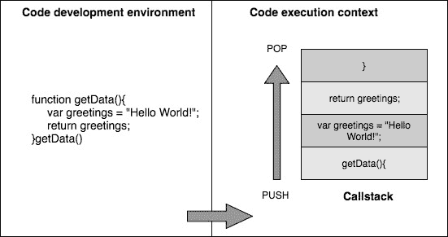
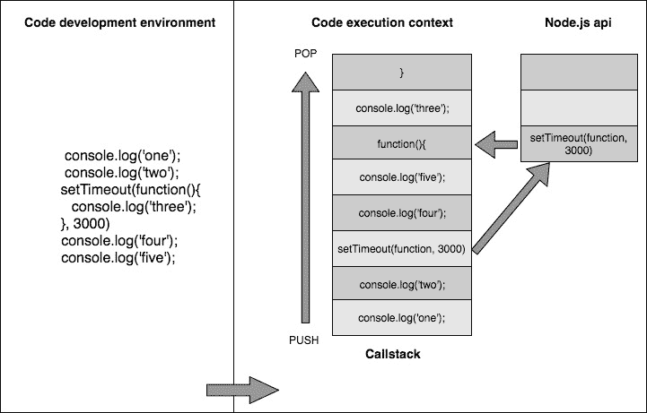
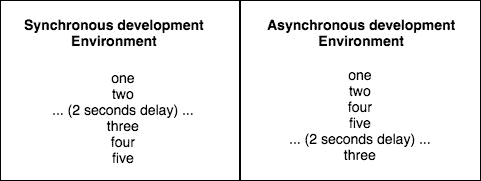

# 第一章：欢迎来到全栈 JavaScript

曾经只被认为是为网页添加增强功能和小部件的语言，现在已经发展成了一个完整的生态系统。截至 2017 年的调查（[`insights.stackoverflow.com/survey/2017`](https://insights.stackoverflow.com/survey/2017)），它是 stackoverflow 上使用量最大的语言，有大约一百万个与之相关的问题标签。有大量的框架和环境可以让 JavaScript 几乎在任何地方运行。我相信阿特伍德定律说得最好：

“任何可以用 JavaScript 编写的应用程序最终都将用 JavaScript 编写！”

尽管这句话可以追溯到 2007 年，但它在今天仍然是真实的。你不仅可以使用 JavaScript 开发完整的单页应用程序，比如 Gmail，还可以看到我们如何在本书的后续章节中使用它来实现以下项目：

+   完全使用 Node.js 和 Express.js 来支持后端

+   使用诸如 MongoDB 之类的强大的文档导向数据库来持久化数据

+   使用 Handlebars.js 编写动态 HTML 页面

+   使用 Heroku 和 Amazon Web Services（AWS）等服务将整个项目部署到云端

有了 Node.js 的引入，JavaScript 正式进入了以前甚至不可能的方向。现在，你可以在服务器上使用 JavaScript，也可以用它来开发完整的企业级应用程序。当你将这一点与 MongoDB 及其基于 JSON 的数据的强大功能结合起来时，你可以在应用程序的每一层中使用 JavaScript。

让我们快速了解一些 Node.js 和 MongoDB 的基本概念，这将有助于你理解本书后续章节的内容。

# Node.js 简介

人们在初次接触 Node.js 时最容易混淆的一件事是，要理解它究竟是什么。它是一个完全不同的语言吗，它只是 JavaScript 的一个框架，还是其他什么东西？Node.js 绝对不是一种新语言，它也不仅仅是 JavaScript 的一个框架。它可以被看作是建立在 Google 的 V8 引擎之上的 JavaScript 运行环境。因此，它为我们提供了一个上下文，我们可以在任何可以安装 Node.js 的平台上编写 JavaScript 代码。任何地方！

现在，稍微了解一下它的历史！2009 年，Ryan Dahl 在 JSConf 上做了一个演讲，彻底改变了 JavaScript。在他的演讲中，他向 JavaScript 社区介绍了 Node.js。在大约 45 分钟的演讲后，他得到了观众的起立鼓掌。他在 Flickr 上看到了一个简单的文件上传进度条后，受到启发，决定写 Node.js。他意识到该网站正在以错误的方式处理整个过程，他决定必须有更好的解决方案。

现在让我们快速了解一下 Node.js 的特点，看看它与其他服务器端编程语言有何不同。

# V8 引擎带来的优势

V8 引擎是由 Google 开发的，并于 2008 年开源。众所周知，JavaScript 是一种解释性语言，它不像编译语言那样高效，因为代码的每一行在执行时都会被逐行解释。V8 引擎带来了一个高效的模型，其中 JavaScript 代码首先被解释，然后编译成机器级代码。

新的 V8 5.9 发布了一个稳定版本，引入了 TurboFan 编译器，提供了性能和大规模优化的好处。它还推出了 Ignition 解释器，对于所有大小的设备如服务器或 IOT 设备等，它都非常高效，因为它的内存占用范围不同。由于内存占用低，它可以快速启动应用程序。我们可以在以下链接中研究基准测试：[`goo.gl/B15xB2`](https://goo.gl/B15xB2)

通过两个强大的更新，v8 团队还在开发 Orinoco，这是一个基于并行和并发压缩机制的垃圾收集器。

这样的高性能和有希望的结果是将 node 8(LTS)的发布日期从 2018 年 5 月推迟到 2018 年 10 月的原因。目前我们正在使用非 LTS 版本的 node 8。它为使用 node v4.x.x 及以上版本的用户提供了干净的替代，没有破损的库。版本 8 还具有各种内置功能，如缓冲区改进和内置的 promisify 方法等。我们可以在以下链接中学习它们：[`goo.gl/kMySCS`](https://goo.gl/kMySCS)

# Node.js 是单线程的！

随着 Web 的出现，传统的 JavaScript 旨在在浏览器中添加简单的功能和最小的运行时。因此，JavaScript 被保持为单线程脚本语言。现在，为了对单线程模型有一个简要的了解，让我们考虑以下图表：



单线程模型在执行上下文中创建一个单一的调用栈。在前面的代码中，当函数`getData()`被调用时，该函数被推入堆栈以便按顺序执行。

在 Node.js 的上下文中，JavaScript 是基础脚本语言，因此 Node.js 是单线程的。您可能会问，单线程模型如何帮助？典型的 PHP、ASP.NET、Ruby 或基于 Java 的服务器遵循的模型是每个客户端请求都会导致实例化一个新的线程甚至一个进程。

当涉及到 Node.js 时，请求在同一个线程上运行，共享资源。一个经常被问到的问题是，使用这样的模型会有什么优势？要理解这一点，我们应该了解 Node.js 试图解决的问题。它试图在单个线程上进行异步处理，以提供更高的性能和可伸缩性，以处理太多的网络流量的应用程序。想象一下处理数百万并发请求的 Web 应用程序；如果服务器为每个进来的请求创建一个新的线程，它将消耗大量资源，我们最终将不得不添加更多的服务器来增加应用程序的可伸缩性。

单线程的异步处理模型在先前的上下文中有其优势，您可以使用更少的服务器端资源处理更多的并发请求。然而，这种方法也有其缺点；Node（默认情况下）不会利用服务器上可用的 CPU 核心数量，而不使用额外的模块，如`pm2`。

Node.js 是单线程的这一点并不意味着它在内部不使用线程。只是开发人员和代码的执行上下文对 Node.js 内部使用的线程模型没有控制权。

如果您对线程和进程的概念不熟悉，我建议您阅读一些关于这些主题的初步文章。还有很多 YouTube 视频也是关于同样的主题。

以下参考资料可以作为一个起点：

[`www.cs.ucsb.edu/~rich/class/cs170/notes/IntroThreads/`](http://www.cs.ucsb.edu/~rich/class/cs170/notes/IntroThreads/)

# 非阻塞异步执行

Node.js 最强大的特性之一是它既是事件驱动的，又是异步的。那么，异步模型是如何工作的呢？想象一下你有一段代码，在第 n 行有一个耗时的操作。当这段代码被执行时，后面的行会发生什么？在正常的同步编程模型中，后面的行将不得不等到该行的操作完成。异步模型会以不同的方式处理这种情况。

让我们通过以下代码和图表来可视化这种情况：



在前面的情况下，`setTimeout()`方法由 JavaScript（Node.js）API 提供。因此，这个方法被认为是同步的，并在不同的执行上下文中执行。根据`setTimeout()`的功能，它在指定的持续时间后执行回调函数，在我们的例子中是三秒后。

此外，当前的执行永远不会被阻塞以完成一个进程。当 Node.js API 确定事件的完成已被触发时，它将立即执行你的回调函数。

在典型的同步编程语言中，执行前面的代码将产生以下输出：



如果你仍然对学习 JavaScript 中的异步模型和回调概念感兴趣，**Mozilla 开发者网络**（**MDN**）有许多文章详细解释了这些概念。

# npm - Node 包管理器

使用 Node.js 编写应用程序真的很愉快，当你意识到你可以随时使用的大量信息和工具时！使用 Node.js 内置的包管理器 npm，你可以找到成千上万的模块，只需几次按键就可以安装和在应用程序中使用！Node.js 成功的最大原因之一是 npm，它是最好的包管理器之一，学习曲线非常小。如果这是你第一次接触的包管理器，你应该觉得自己很幸运！

在一个普通的月份，npm 处理的下载量超过 10 亿次，目前有大约 15 万个包可供下载。你可以通过访问[www.npmjs.com](https://www.npmjs.com/)来查看可用模块的库。在你的应用程序中下载和安装任何模块就像执行以下命令一样简单：

```js
npm install package 
```

你写了一个想要与世界分享的模块吗？你可以使用 npm 打包并将其轻松上传到[www.npmjs.org](https://www.npmjs.com/)的公共注册表中！如果你不确定安装的模块如何工作，源代码就在你的项目的`node_modules/`文件夹中等待探索！

npm 中的模块版本遵循语义化版本控制，例如`major.minor.patch`的顺序。

# 分享和重用 JavaScript

在开发 Web 应用程序时，你总是需要对 UI 进行验证，客户端和服务器两端都需要进行验证，因为客户端验证对于更好的 UI 体验是必需的，而服务器端验证则是为了更好地保护应用程序的安全。想想两种不同的语言在行动：你将在服务器和客户端两端实现相同的逻辑。使用 Node.js，你可以考虑在服务器和客户端之间共享通用函数，大大减少代码重复。

曾经尝试过优化从模板引擎（如 Underscore）加载的**单页应用程序**（**SPA**）的客户端组件的加载时间吗？你会考虑一种方法，可以同时在服务器和客户端共享模板的渲染；有些人称之为混合模板。

Node.js 比其他任何服务器端技术更好地解决了客户端模板重复的问题，只是因为我们可以在服务器和客户端同时使用相同的 JS 模板框架和模板。

如果你对这一点持轻视态度，它解决的问题不仅仅是在服务器和客户端重用验证或模板的问题。想想正在构建的 SPA；你将需要在客户端 MV*框架中实现服务器端模型的子集。现在，想想在客户端和服务器上共享模板、模型和控制器子集。我们正在解决更高级别的代码冗余情景。

# 不仅仅用于构建 Web 服务器！

Node.js 不仅仅是用于在服务器端编写 JavaScript。是的，我们之前已经讨论过这一点。Node.js 为 JavaScript 代码在任何可以安装的地方工作设置了环境。它可以是创建命令行工具的强大解决方案，也可以是完全功能的本地运行应用程序，与 Web 或浏览器无关。Grunt.js 就是一个由 Node 驱动的命令行工具的很好例子，许多 Web 开发人员每天都在使用它来自动化任务，如构建过程、编译 CoffeeScript、启动 Node.js 服务器、运行测试等。

除了命令行工具，Node.js 在硬件领域也越来越受欢迎，尤其是 Node.js 机器人运动。`Johnny-Five`和`Cylon.js`是两个流行的 Node.js 库，用于提供与机器人工作的框架。只需在 YouTube 上搜索 Node.js 机器人，你就会看到很多例子。此外，你可能正在使用一个基于 Node.js 开发的文本编辑器。GitHub 的开源编辑器 Atom 就是一个很好的例子。

# 使用 Socket.io 进行实时 Web 应用程序

Node.js 产生的一个重要原因是支持实时 Web 应用程序。Node.js 有几个专为实时 Web 应用程序构建的框架非常受欢迎：`Socket.io`和`Sock.JS`。这些框架使构建即时协作应用程序（如 Google Drive 和 Mozilla 的 together.js）变得非常简单。在现代浏览器引入 WebSockets 之前，这是通过长轮询实现的，这对于实时体验来说并不是一个很好的解决方案。虽然 WebSockets 是现代浏览器中支持的功能，但`Socket.io`充当了一个框架，还为旧版浏览器提供了无缝的回退实现。

如果您需要了解更多关于在应用程序中使用 WebSockets 的信息，这是 MDN 上一个很好的资源，您可以探索一下：

[`developer.mozilla.org/en-US/docs/Web/API/WebSockets_API/Writing_WebSocket_client_applications`](https://developer.mozilla.org/en-US/docs/Web/API/WebSockets_API/Writing_WebSocket_client_applications)。

# 网络和文件 IO

除了 Node.js 强大的非阻塞异步特性之外，它还通过核心模块提供了强大的网络和文件系统工具。使用 Node.js 的网络模块，您可以创建接受网络连接并通过流和管道进行通信的服务器和客户端应用程序。Node 包含一个名为**fs**或文件系统的模块，它完全负责对文件执行的所有读写操作。它还利用了 Node 的流特性来执行这些操作。

# 微服务

根据功能单元划分应用程序称为**微服务**。每个微服务都成为自包含的部署单元。Node.js 基于通用 JS 模块模式，提供了应用程序结构的模块化。这种模式用于创建微服务。随着功能的增加，微服务的数量也在增加。为了管理这些服务，Node.js 生态系统提供了强大的库，如`pm2`。因此，它使应用程序的元素能够单独更新和扩展。

# 物联网（IoT）

随着**物联网**（**IoT**）的出现，Node.js 生态系统为各种设备（如传感器、信标、可穿戴设备等）提供了惊人的库支持。Node.js 被认为是管理这些设备发出的请求的理想技术，通过其强大的流和非阻塞 I/O 支撑。像 Arduino、Raspberry Pi 等流行的物联网板变种有 300 多个 Node.js 包。构建数据密集型、实时应用程序的开发人员通常会发现 Node.js 是一个自然的选择。

# 使用 Node.js 创建一个简单的服务器

要看轻量级 Node.js 可以做到什么，让我们看一下启动 HTTP 服务器并向浏览器发送 Hello World 的示例代码：

```js
var http = require('http');
http.createServer(function(req, res) {
    res.writeHead(200, { 'Content-Type': 'text/plain' });
    res.end('Hello World\n');
}).listen(8080, 'localhost');
console.log('Server running at http://localhost:8080'); 
```

只需几行基本的代码就可以编写一个完整的 Node.js 应用程序。使用简单的 Node.js `app.js`命令运行它将启动一个监听端口 8080 的 HTTP 服务器。将任何浏览器指向`http://localhost:8080`，您将在屏幕上看到简单的输出 Hello World！虽然这个示例应用程序实际上并没有做任何有用的事情，但它应该让您一窥使用 Node.js 编写 Web 应用程序时所拥有的强大功能。如果您还没有设置初始的 Node.js 开发环境，我们将在下一章中讨论它。

# 何时使用 Node.js

您可能听说过美国心理学家亚伯拉罕·马斯洛的这句谚语：

“如果你手中只有一把锤子，那么任何东西看起来都像钉子！”

在这种情况下，这是有道理的。Node.js 不是一种可以依赖解决您打算解决的所有应用程序问题的技术，如果选择不明智，使用它的决定将适得其反。Node.js 非常适合预期处理大量并发连接的应用程序。此外，应该注意，它最适合每个传入请求需要非常少的 CPU 周期的应用程序。这意味着，如果您打算在请求时执行计算密集型任务，它将阻塞事件循环，从而影响 Web 服务器同时处理的其他请求。Node.js 非常适合实时 Web 应用程序，如聊天室、协作工具、在线游戏等。因此，在决定是否使用 Node.js 时，我们应该认真分析应用程序的上下文，并弄清楚 Node.js 是否真的适合应用程序的上下文。

很难详细讨论 Node.js 的用例。然而，以下 Stack Overflow 主题有效地做到了这一点，我强烈建议您阅读这篇帖子上的答案，如果您对 Node.js 的用例更感兴趣：[`stackoverflow.com/questions/5062614/how-to-decide-when-to-use-node-js.`](http://stackoverflow.com/questions/5062614/how-to-decide-when-to-use-node-js)

由于我们已经简要介绍了 Node.js 的概念和特性，现在让我们来看看 NoSQL 和 MongoDB 方面。

# NoSQL 运动

让我们从探讨一个问题的答案开始：什么是 NoSQL 数据库？NoSQL 是数据库技术的常见术语，它偏离了传统的关系数据库管理系统（RDBMS）概念。这些数据库解决方案偏离 RDBMS 数据库标准的常见原因是为了实现和设定比传统 RDBMS 解决方案更好的可用性和分区能力标准。

为了向您介绍这个概念，我们应该看一下布鲁尔定理，也就是 CAP 定理：

分布式计算系统不可能同时提供以下三项保证：一致性、可用性和分区容错性。

传统的 RDBMS 解决方案在一致性方面表现良好，但在提供更好的可用性（数据读取）和分区能力方面会有所妥协。大多数 NoSQL 解决方案已经朝着这个方向发展，以实现更好的数据可用性和分区。

由于这是任何偏离 RDBMS 解决方案（如 MySQL、PostgreSQL 等）概念的数据库技术的常见术语，NoSQL 数据库有各种子集。最流行的 NoSQL 子集包括文档存储、键值存储和基于图的数据库解决方案。我们将要尝试的 MongoDB 属于文档存储类别。除了 MongoDB 之外，市场上还有许多其他 NoSQL 解决方案，如 Cassandra、Redis、Neo4j、HBase 等。

# MongoDB 简介

正如我们在前面的段落中讨论的，MongoDB 属于 NoSQL 数据库的文档存储类别。MongoDB 由 10gen 积极开发，该公司已更名为 MongoDB Inc. MongoDB 是开源的，其源代码可在 GitHub 等各种平台上获得。

我们将看一下 MongoDB 的以下各种特性：

+   JSON 友好的数据库

+   无模式化设计

+   各种性能方面

# JSON 友好的数据库

MongoDB 之所以如此受欢迎的一个最重要的原因是它是一个 JSON 友好的数据库。这意味着文档以 JavaScript 对象的形式存储和检索。在内部，这些 JSON 数据在持久化到系统时会转换为 BSON 格式。因此，这提供了极大的灵活性，我们可以在客户端、服务器和最终数据库中使用相同的数据格式。

MongoDB 集合（表）中的典型文档（记录）可能如下所示：

```js
$ mongo 
> db.contacts.find({email: 'jason@kroltech.com'}).pretty() 
{ 
   "email" : "jason@kroltech.com", 
   "phone" : "123-456-7890", 
   "gravatar" : "751e957d48e31841ff15d8fa0f1b0acf", 
   "_id" : ObjectId("52fad824392f58ac2452c992"), 
   "name" : { 
      "first" : "Jason", 
      "last" : "Krol" 
   }, 
   "__v" : 0 
} 
```

在检查前面的输出后，我们可以看到一个名为`_id`的关键字。这是一个必须被编码为二进制 JSON `objectID`(BSON)的 MongoDB ID。如果编码失败，MongoDB 将无法检索或更新对象。

# 无模式化设计

MongoDB 的另一个重要特性是其无模式化的特性。在关系型数据库中，您需要提前定义存储的数据的确切结构，这被称为模式。这意味着您必须定义表中每个字段的确切列数、长度和数据类型，并且每个字段必须始终符合该确切的一组标准。Mongo 提供了一种灵活的特性，使得您存储到数据库中的文档不需要遵循任何模式，除非开发人员通过应用程序级别强制执行它。这使得 MongoDB 非常适合基于敏捷开发，因为您可以在应用程序模式上进行即时修改。

# 各种性能方面

除了友好的 JavaScript 特性之外，MongoDB 和 Node.js 之间的另一个相似之处是，MongoDB 也是为高并发应用程序和大量读操作而设计的。

MongoDB 还引入了*分片*的概念，这使得可以水平和垂直扩展数据库。如果应用程序所有者需要增加数据库的能力，他们可以在堆栈中添加更多的机器。这是一个相对于投资于单台机器的 RAM 来说更便宜的选择，而这将是关系型数据库解决方案的情况。

索引化的过程创建了一个称为索引的值列表，用于选择的字段。这些索引用于查询更大的数据块。使用索引可以加快数据检索速度和性能。MongoDB 客户端提供了各种方法，比如`ensureIndex`，只有在索引不存在时才创建索引。

此外，MongoDB 还有各种命令来允许对数据进行*聚合*，比如分组、计数和返回不同的值。

我们讨论的所有优点都会对一致性产生一定影响，因为 MongoDB 不严格遵守 ACID 事务等关系型数据库标准。此外，如果您最终创建了一个可能需要太多 JOIN 操作的数据模型，那么 MongoDB 可能不适合，因为它并不是设计用于太多的聚合，尽管聚合是可能通过 MongoDB 聚合框架实现的。MongoDB 可能适合也可能不适合您的应用程序。在做出决定之前，您应该真正权衡每种技术的利弊，以确定哪种技术适合您。

# Node.js 和 MongoDB 在实际中

Node.js 和 MongoDB 在开发社区中都非常受欢迎和活跃。这对企业也是如此。财富 500 强中一些最大的公司已经完全采用 Node.js 来支持他们的 Web 应用程序。

这在很大程度上是由于 Node.js 的异步特性，使其成为高流量、高 I/O 应用程序的绝佳选择，例如电子商务网站和移动应用程序。

以下是一些正在使用 Node.js 的大公司的小列表：

+   贝宝

+   领英

+   eBay

+   沃尔玛

+   雅虎！

+   微软

+   道琼斯

+   优步

+   纽约时报

MongoDB 在企业领域的使用同样令人印象深刻和广泛，越来越多的公司采用这一领先的 NoSQL 数据库服务器。以下是一些正在使用 MongoDB 的大公司的小列表：

+   思科

+   Craigslist 公司

+   福布斯

+   FourSquare

+   财捷通

+   麦克菲

+   MTV

+   大都会人寿

+   旭通飞

+   安德玛

# 本书的预期内容

本书的其余部分将是一次引导之旅，带领您完成一个完整的数据驱动网站的创建过程。我们创建的网站将涵盖典型大型 Web 开发项目的几乎所有方面。该应用程序将使用一种名为 Express 的流行 Node.js 框架进行开发，并将使用 MongoDB 持久化数据。在最初的几章中，我们将涵盖涉及启动服务器核心并提供内容所涉及的基础工作。这包括配置您的环境，以便您可以使用 Node.js 和 MongoDB，并对这两种技术的核心概念进行基本介绍。然后，我们将从头开始编写一个由 ExpressJS 驱动的 Web 服务器，该服务器将处理为网站提供所有必要文件。然后，我们将使用 Handlebars 模板引擎来提供静态和动态 HTML 网页。更深入地进行，我们将通过添加数据层使应用程序持久化，网站的记录将通过 MongoDB 服务器保存和检索。

我们将介绍如何编写 RESTful API，以便其他人可以与您的应用程序进行交互。最后，我们将深入了解如何为您的所有代码编写和执行测试。以下部分提供了摘要。

最后，我们将进行一个简短的旁观，检查一些越来越受欢迎的前端技术，这些技术在编写单页应用程序时变得越来越受欢迎。这些技术包括 Backbone.js、Angular 和 Ember.js。

最后但同样重要的是，我们将详细介绍如何使用 Heroku 和亚马逊 Web 服务等流行的基于云的托管服务将您的新网站部署到互联网上。

# 摘要

在本章中，我们回顾了本书其余部分可以期待的内容。我们讨论了 JavaScript 目前令人惊叹的状态，以及它如何可以用于支持 Web 应用程序的整个堆栈。虽然您一开始就不需要任何说服，但我希望您对开始使用 Node.js 和 MongoDB 编写 Web 应用程序感到兴奋并准备好了！

接下来，我们将设置您的开发环境，并让您使用 Node.js、MongoDB 和 npm，并编写并启动一个使用 MongoDB 的快速 Node.js 应用程序！
