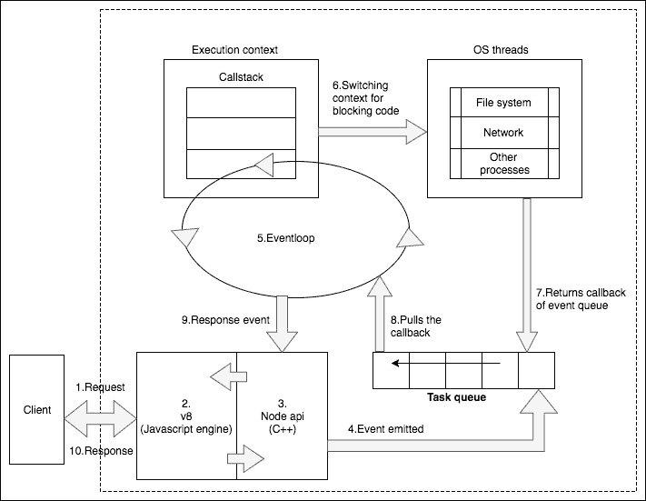

# 第三章：Node 和 MongoDB 基础知识

在我们深入研究并开始使用 Node 和 MongoDB 构建一个完整的 Web 应用程序之前，重温一些基础知识是很重要的。本章将为你提供一个关于语法和重要主题的速成课程。它分为两部分，前半部分侧重于 JavaScript 或 Node，后半部分涵盖 MongoDB。你将深入了解一些常见和强大的可用工具，并将回顾大量的示例代码，以便让你快速上手。

在本章中，我们将涵盖以下主题：

+   JavaScript 语言的基础知识

+   Node.js 的基础知识

+   Node 的包管理器 npm

+   MongoDB 的基础知识

在本章结束时，你应该对语法以及如何使用 Node 和 MongoDB 有扎实的理解。有很多内容需要涵盖，所以让我们开始吧。

# JavaScript 入门指南

正如我们所知，Node.js 不仅仅是另一种语言，而是 JavaScript。在编写浏览器上的 JavaScript 时使用的语言语法和工具将完全适用于服务器端。Node.js 具有一些仅在服务器上可用的附加工具，但语言和语法再次与 JavaScript 相同。我假设你对基本的 JavaScript 语法有一般的了解，但我会简要介绍一下 JavaScript 的语言，以防万一。

一般来说，JavaScript 在语法方面是一个相当简单的语言，你只需要了解一些重要的元素。

# 介绍 es6

es6，或者 ECMAScript 2015，是 JavaScript 语言的更新，适用于所有类型、值、对象文字、属性、函数和程序语法。es6 的全新语义（类似于其他语言如 Java、C#等）使跨平台开发人员能够轻松学习 JavaScript。它不仅改进了语言的语法方面，还提供了新的内置工具，如 promises、proper tail calls、destructuring、modules 等。由于我们已经安装了 Node 版本 8，所有 ECMAScript 6 功能或 es2017 直至今都是包括在内的。如果你使用的是低于 4.3.2 版本的 Node，你将需要安装类似 babel.js 的转译工具。我们将通过逐步在代码中实现和进行比较研究来学习 es6。

# 语法基础

在几乎任何编程语言中，你可以做的最基本的事情就是声明一个变量。与大多数其他语言不同，JavaScript 是一种动态类型的语言，这意味着当你声明一个变量时，它的值可以是任何类型，并且在其生命周期内可以改变。然而，相反，强类型语言规定，定义为`string`类型的变量必须始终是一个字符串，并且必须始终具有字符串的值。强类型特性包含在我们接下来要学习的 es6 中。目前，在 JavaScript 中声明一个变量，只需在变量名之前使用`var`关键字：

```js
var myVariable;    // declaring a variable with no value 
var myFirstName = "Jason";   
var myLastName = "Krol"; 
var myFullName = myFirstName + ' ' + myLastName;  
// => Jason Krol 
```

前面的代码片段显示了我们如何声明变量并在声明时定义它们的初始值。`+`运算符用于字符串连接。

此外，我们使用**驼峰**命名法来命名变量。使用驼峰命名法并不是强制性的，但在面向对象的语言中，遵循驼峰命名法比基于下划线的方法更常见。

JavaScript 不会因为你忘记在每个语句的末尾加上分号而抱怨。相反，如果缺少适当的语句终止，它会尝试为你添加分号。这可能导致意想不到的结果。关于分号插入的规则在这篇文章中有解释：[`bclary.com/2004/11/07/#a-7.9.1`](https://developer.mozilla.org/en-US/docs/Web/JavaScript/Introduction_to_Object-Oriented_JavaScript)。

自 es6 引入了两个更多的变量声明关键字，即`let`和`const`，使 JavaScript 变得更加优雅。首先，让我们通过以下示例学习`const`：

```js
const loopOver = [1,2,3];
```

`const`的用法与`var`相同。用`const`声明变量会使其不可变，并且不能用于重新分配新的内容。

关于`const`关键字的另一个区别是，它并不意味着某物是常量，而是强调一次赋值。

通过添加以下行来测试它：

```js
loopOver = [4,5,6];
```

它会抛出以下错误：

```js
Uncaught TypeError: Assignment to constant variable
```

那么，为什么需要呢？对于程序员来说，推荐的做法是保持简单，这意味着使用一个变量来表示一个值。然而，我们之前讨论过变量的动态性，它有自己的优点，有时需要表示一个不可变的数据。比如存储一些服务器配置的凭据或 Node 包本身。用法可能有所不同，但都会遵循一次赋值的单一规则。

要学习`let`关键字，我们首先需要了解变量的作用域，这在下一节中有所涉及。

# 理解变量的作用域

在 JavaScript 中理解变量的作用域非常重要，以更好地掌握这门语言。作用域可以被称为您的变量或函数存在的一个容器。与 Java 和其他流行的语言不同，JavaScript 遵循函数级作用域，而不是块级作用域（这在 es6 中引入）。这意味着您定义的变量将受限于其父函数绑定的作用域。

考虑以下代码片段：

```js
var outer = 10; 
function myFunction() { 
   var inner = 2; 
   console.log(inner);// 2 
   console.log(outer);// 10 
}myFunction();console.log(inner); 
```

当运行前述代码时，我们可以看到`inner`变量的作用域仅限于名为`myFunction`的父函数。它在外部是不可访问的，并且会提供一个`referenceError`通知。此外，外部作用域中的变量在函数作用域中是可用的，您无需额外的努力来访问它们，就像在前面的示例中看到的名为`outer`的变量一样。

在这种情况下需要讨论的一个重要事情是`var`关键字的使用。如果在声明新变量时漏掉了`var`，JavaScript 不会抱怨。但如果发生这种情况，情况可能会变得非常糟糕。请看以下例子：

```js
(function (){   
    (function (){  
          a = 10;   
    })();  
})();  
console.log(a);// 10 
```

在这里，由于在内部函数中跳过了`var`关键字和变量声明，JavaScript 认为应该在其父作用域中搜索该变量，然后将其附加到全局作用域，并最终使其在任何地方都可用。因此，为了避免代码中出现此类问题，通过 JSHint 等代码质量工具对代码进行检查总是很有用的。前面的代码结构可能会让你感到困惑，因为它使用了自调用函数来引入作用域。

现在，随着 es6 的到来，您可以在块级作用域中声明变量，而不仅仅是函数作用域。要理解块级作用域，让我们看下面的例子：

|

```js
for(let i=0;i<loopOver.length;i++){
console.log(`Iteration : ", i)
}
Console.log(`Let value of ${ i}`)
```

|

```js
for(var i=0;i<loopOver.length;i++){
console.log(`Iteration : ", i)
}
Console.log(`Let value of ${ i}`)
```

|

前述代码片段的唯一区别是变量`i`的声明。`i`变量在`for`循环块之外是不可访问的。

有关`let`的更多详细信息，请参考链接：[`developer.mozilla.org/en/docs/Web/JavaScript/Reference/Statements/let`](https://developer.mozilla.org/en/docs/Web/JavaScript/Reference/Statements/let)

这就是关于变量作用域的全部内容。JavaScript 支持多种数据类型。让我们来看看它们。

# 数据类型

数据类型是任何语言的基础。JavaScript 中可用的数据类型有

如下：

+   数字

+   字符串

+   布尔

+   对象

+   空值

+   未定义

+   符号（es6 中新增）

在我们的代码中，我们声明的每个变量都包含属于前述类型的值。数字、字符串和布尔类型都很容易理解。这些属于语言支持的原始数据类型。在这里，一个重要的要点是要注意，JavaScript 在类型级别上没有整数或浮点数之间的区别。

数组、函数、正则表达式和日期等类型属于对象数据类型。

它们被认为是复合数据类型。因此，您定义的函数

在您的代码中也只是对象。

Null 和 undefined 是 JavaScript 支持的两种特殊类型。Null 指向

指向故意的非值，而 undefined 指向未初始化的值。因此，当您只声明变量并尚未使用值对其进行初始化时，变量将是未定义类型。最后但同样重要的是，es6 引入了一种新的原始数据类型符号。它们用于唯一的属性键和代表概念的常量。

我们没有在我们的书中使用它们，但是您可以访问以下链接以获取更多详细信息[`exploringjs.com/es6/ch_symbols.html`](http://exploringjs.com/es6/ch_symbols.html)。

因此，在我们了解定义函数、数组和对象的各种方法之前，让我们先了解运算符和流程。

# 运算符和流程

JavaScript 支持与 C 语言系列中的其他语言类似的控制结构。条件语句使用`if`和`else`编写，并且可以使用`else-if`梯级将语句链接在一起。

```js
var a = "some value"; 
if(a === "other value") { 
  //do something 
} else if (a === "another value") { 
  //do something 
} else { 
  //do something 
} 
```

可以使用`while`、`do-while`、`for`和`switch`语句编写控制语句。在编写 JavaScript 条件时，需要考虑的一个重要事项是了解什么等于`true`和/或`false`。大于或小于零的任何值，非 null 和非 undefined 都等于`true`。诸如`0`、`null`、`undefined`或`空`字符串的字符串等于`false`。

使用`while`、`do-while`、`for`和`switch`语句的一些示例如下：

```js
// for loop example 

var myVar = 0; 
for(let i = 0; i < 100; i += 1) {  
  myVar = i; 
  console.log(myVar); // => 0 1 ... 99 
} 

// do while example 
var x = 0; 
do { 
  x += 1; 
  console.log(x); // => 1 2 ... 100 
} while (x < 100); 

// while example 
while (x > 90) { 
  x -= 1; 
  console.log(x); // => 99 98 ... 90 
} 
//switch example 

var x = 0; 
switch(x) { 
  case 1 :  
console.log(""one""); 
break; 
  case 2 :  
console.log("two""); 
break; 
  default: 
console.log("none"); 

} // => "none" 
```

另一个重要的事情是要理解

使用`==`和`===`进行比较。应该在何处使用`==`比较

变量的类型不是你关心的问题；如果还应该比较变量的数据类型，那么你应该选择`===`比较符号，如下面的代码所示：

```js
const a = '5'; 
const b = 5; 
if(a == b) { 
  //do something 
} 
if(a === b) { 
  //do something 
} 
```

在代码片段中，第一个条件评估为 true，而第二个条件不是。因此，在编写代码时，始终更安全地依赖严格的（`===`）相等检查作为最佳实践。

在批准应用程序之前，建议始终通过诸如 JSHint 之类的代码质量工具运行代码。您可以通过诸如 Grunt 之类的任务运行器自动运行代码质量检查，以便每次我们更改代码时，代码质量工具都会运行并显示代码编写中是否存在任何潜在问题。

# 理解对象

在 JavaScript 对象中，我们创建的数组甚至函数都属于相同的数据类型：`Object`。声明对象是一个非常简单的过程：

```js
var myObject = {};    // that's it! 
```

您可以向此对象添加任何类型的属性或属性。这意味着您可以将数组、函数甚至其他对象添加为此对象的属性。向此对象添加新属性可以通过以下两种方式之一完成：

```js
var person = {}; 
person.firstName = 'Jason';    // via dot operator 
person['lastName'] = 'Krol';   // via square brackets 
```

让我们看一个例子，我们将数组和函数添加为此对象的属性：

```js
var person = {}; 
person.firstName = 'Jason';    // properties 
person.lastName = 'Krol'; 
person.fullName = function() {  // methods 
  return this.firstName + ' ' + this.lastName; 
}; 
person.colors = ['red', 'blue', 'green'];  // array property 
```

您可以在前面的代码中看到，我们定义了一个名为`person`的基本对象，并为其分配了一些属性和一个函数。重要的是要注意在`fullName`函数中使用了`this`关键字。`this`关键字指的是函数所属的对象。因此，通过`this`关键字，函数将能够访问其所属对象的其他属性。

除了在对象创建后添加属性的方法之外，我们还可以在创建对象时将初始对象属性附加为其一部分，如下所示：

```js
// define properties during declaration 
var book = { 
  title: 'Web Development with MongoDB and NodeJS', 
  author: 'Jason Krol', 
  publisher: 'Packt Publishing' 
}; 
console.log(book.title); 
// => Web Development with MongoDB and NodeJS 
book.pageCount = 150;    // add new properties 
```

在前面的示例中，我们创建对象时没有指定它们应该由哪个类创建，而是使用`{}`。因此，这将导致从`Object`基类创建此新对象，其他复合类型（如数组和函数）都是从该基类扩展的。因此，当您使用`{}`时，它等同于一个新的`Object()`。

在这里，我们通过使用对象字面量`{}`创建的对象是`Object`类的实例。要为我们的应用程序定义自定义类，我们需要使用函数和原型。Mozilla 在[`developer.mozilla.org/en-US/docs/Web/JavaScript/Introduction_to_Object-Oriented_JavaScript`](https://developer.mozilla.org/en-US/docs/Web/JavaScript/Introduction_to_Object-Oriented_JavaScript)上提供了一个相当不错的教程，介绍了整个要点。es6 通过添加各种功能增强了对象属性：

首先，最重要的是**属性简写**。现在，使用 es6，我们可以使用变量分配属性。让我们使用以下示例来理解这一点：

```js
let publisher = 'Packt Publishing';
let book = { publisher };
console.log(book.publisher);
```

在前面的片段中，变量值隐式分配给对象属性，声明对象时无需指定属性。

下一个令人惊叹的功能是计算对象字面量中属性键的属性。要了解此功能，让我们向前面的对象添加一个名为`book`的属性。

```js
let edition = 3;
let book = {publisher,[ `Whats new in ${edition} ? `] : "es6 and other improvisation"}
```

es6 向我们介绍了一个最期待的功能之一，称为**模板文字**。您可能已经注意到在前面的片段中使用了`${}`占位符的一种插值操作。这只是一个字符串中变量的连接，而不使用任何运算符，例如`+`。模板文字增强了 JavaScript 中的可读性功能，这是非常重要的。有关更多信息，请访问链接[`developer.mozilla.org/en/docs/Web/JavaScript/Reference/Template_literals`](https://developer.mozilla.org/en/docs/Web/JavaScript/Reference/Template_literals)。

运行前面的代码后，我们注意到 es6 使我们能够使用方括号计算属性名称的任何计算。最后，我们可以遵循`object`属性中所有函数的方法表示的优雅特性。这可以在以下示例中看到：

```js
var person = { 
        firstName : 'Jason', 
        lastName : 'Krol', // properties 
       fullName() {  // method notation 
                      return this.firstName + ' ' + this.lastName; 
} 
}; 
```

始终记住，对象只是内存位置的地址，而不是实际存储。例如，`firstName: 'Jason'`存储在内存位置`person.firstName`的地址中。到目前为止，我们已经了解了称为变量的单个存储点，让我们进一步学习多个存储点。

# 理解数组

在 JavaScript 中，数组的工作方式与几乎任何其他语言中的工作方式相同。它们是从零开始索引的，您可以将变量声明为空数组或预填充数组。您可以操作数组中的项目，并且数组的长度不固定：

```js
var favFoods = ['pizza', 'cheeseburgers', 'french fries']; 
var stuff = [];        // empty array 
var moreStuff = new Array();       // empty array 
var firstFood = favFoods[0];    // => pizza

// array functions: 
favFoods.push('salad');    // add new item

// => ['pizza', 'cheeseburgers', 'french fries', 'salad'] 
favFoods.pop();        // remove the last item 
// => ['pizza', 'cheeseburgers', 'french fries'] 
var first = favFoods.shift();     // remove the first item 
// => first = 'pizza';  
// => favFoods = ['cheeseburgers', 'french fries'] 
```

更准确地说，您可以将数组视为基本`Object`类的扩展子类，具有`Array`函数的额外实现。

# 理解函数

在 JavaScript 中，函数是头等公民。这意味着`function`本身是一个对象，因此可以将其视为对象，并将其与基本`Object`类扩展为具有属性和附加函数。我们将看到许多情况下，我们将函数作为参数传递给其他函数，并从其他函数调用中返回函数。

在这里，我们将采用标准函数（在本例中为`myFunction`）。我们将为此函数分配一个`timesRun`属性，就像在执行任何其他对象时一样，并查看如何稍后引用该属性：

```js
var myFunction = function() { 
  if(this.timesRun) 
    this.timesRun += 1; 
  else 
    this.timesRun = 1; 
  // do some actual work 

  console.log(this.timesRun); 
}; 
myFunction(); 
// => 1; 
myFunction(); 
// => 2; 
myFunction(); 
// => 3;  
```

正如我们在前面的示例中所看到的，使用 var 关键字，我们可以以与变量相同的方式定义函数：

```js
function sayHello() {
 console.log('Hello!');
}
// or 
var sayHello = function() {
 console.log('Hello!');
};
```

在前面的示例代码中，两种方法几乎是相同的。第一种方法是定义函数的最常见方式，称为**命名函数方法**。这里讨论的第二种方法是函数表达式方法，其中您将未命名函数分配为变量的引用并保持其未命名。

这两种方法之间最重要的区别与一个叫做 JavaScript hoisting 的概念有关。基本上，不同之处在于当你采用函数表达式策略时，函数在其定义语句执行之前将不会在其包含的范围内可用。在命名函数方法中，无论你在哪个位置定义它，该函数都将在其包含的范围内可用，如下面的代码所示：

```js
one();//will display Hello  
two();//will trigger error as its definition is yet to happen. 

function one() { 
    console.log('Hello!'); 
} 

var two = function() { 
  console.log('Hello!'); 
}; 
two ();//will display Hello 
```

在前面的示例代码片段中，`function one`可以从其父范围的任何地方调用。但是在其表达式被评估之前，`function two`将不可用。

JavaScript hoisting 是指在脚本执行之前，JS 解释器将函数定义和变量声明移动到包含范围的顶部的过程。因此，在命名函数的前一个案例中，定义被移动到了范围的顶部。然而，对于函数表达式，只有变量的声明移动到了范围的顶部，将其设置为未定义，直到脚本中实际执行的那一点。你可以在[`code.tutsplus.com/tutorials/JavaScript-hoisting-explained--net-15092`](http://code.tutsplus.com/tutorials/javascript-hoisting-explained--net-15092)上阅读更多关于 hoisting 的概念。

# 匿名函数和回调

通常，你需要使用一个临时函数，你不一定想提前声明。在这种情况下，你可以使用匿名函数，它只是在需要时声明的函数。这类似于我们之前探讨的函数表达式上下文，唯一的区别是该函数没有分配给一个变量，因此没有办法在以后引用它。匿名函数最常见的用法是当它们被定义为另一个函数的参数时（尤其是当用作*回调*时）。

使用匿名函数（即使你没有意识到它）的最常见的地方之一是与`setTimeout`或`setInterval`一起使用。这两个标准的 JavaScript 函数将在指定的延迟时间（以毫秒为单位）后执行代码，或者在指定的延迟时间后重复执行代码。以下是其中一个`setTimeout`的示例，使用了内联的匿名函数：

```js
console.log('Hello...'); 
setTimeout(function() { 
  console.log('World!'); 
}, 5000); 
// => Hello... 
// (5000 milliseconds i.e. 5 second delay) 
// => World! 
```

你可以看到匿名函数作为第一个参数传递给了`setTimeout`，因为`setTimeout`需要一个函数。如果你愿意，你可以提前声明函数作为变量，并将其传递给`setTimeout`，而不是内联的匿名函数：

```js
var sayWorld = function() { 
  console.log('World!'); 
} 
setTimeout(sayWorld, 5000); 
// (5 second delay) 
// => World! 
```

匿名函数只是作为一个干净的内联一次性函数。

回调很重要，因为 JavaScript 最强大（也最令人困惑）的特性之一是它是异步的。这意味着每一行都是按顺序执行的，但它不会等待可能需要更长时间的代码（即使是按设计）。我们在第一章中通过一个例子探讨了这一点，当时我们正在研究 Node.js 的异步特性。

Mozilla 有一个关于 JavaScript 概念的详细教程，我们建议你在完成本章后阅读一次。该教程包括高级概念，比如闭包，这些概念由于主题的深度而没有在本章中涵盖。因此，请参考 Mozilla 开发网络文章[`developer.mozilla.org/en-US/docs/Web/JavaScript/A_re-introduction_to_JavaScript`](https://developer.mozilla.org/en-US/docs/Web/JavaScript/A_re-introduction_to_JavaScript)。

# JSON

**JavaScript 对象表示法**（**JSON**）是处理 JavaScript 以及大多数其他语言和网络服务中的数据时使用的标准语法。JSON 的基本原则是它看起来与标准的 JavaScript 对象完全相同，只有一些严格的例外：

+   JSON 是纯文本。没有带属性的数据类型；也就是说，日期值被存储为字符串等等

+   所有名称和字符串值必须用双引号括起来

+   属性中不能包含函数

让我们快速看一下一个标准的 JSON 对象：

```js
{ 
  "title": "This is the title", 
  "description": "Here is where the description would be", 
  "page-count": 150, 
  "authors": [ 
    { "name": "John Smith" }, 
    { "name": "Jane Doe" }, 
    { "name": "Andrea Johnson" } 
  ], 
  "id": "1234-567-89012345" 
} 
```

如果您对 XML 有所了解，JSON 有些类似，只是它更容易阅读和理解。正如 ECMA 所描述的那样，“*JSON 是一种文本格式，可以促进所有编程语言之间的结构化数据交换*”。

# Node.js 的基础知识

在了解 JavaScript 的基础知识之后，让我们专注于 Node 的一些基础知识。我们将从理解 node.js 核心架构开始。不同的 node 特性的重要性在于它的架构和工作方式。让我们在下一节仔细研究它。

# Node.js 架构

Web 应用程序通常遵循由客户端、Web 服务器和数据源组成的三层 Web 架构。在我们的上下文中，我们使用 Node.js 创建了一个 Web 应用服务器。正如我们在第一章中讨论的那样，*欢迎来到全栈 JavaScript 中*，Node.js 遵循单线程的架构模型。为了减少内存泄漏并在编写代码时理解异步性，我们需要了解 Node.js 的工作原理。

以下图表描述了代码的可视化表示：



每个处理组件按以下顺序进行排列：

1.  客户端发送请求（考虑一个 HTTP 请求）。

1.  Chrome 的 v8 引擎是一个**即时**（**JIT**）编译器。一旦服务器接收到请求，v8 将 JavaScript 代码转换为机器代码。

1.  Node.js 核心中的 C++ API 为其他系统级组件提供了绑定。绑定基本上是一个包装库，使得用一种语言编写的代码可以与用另一种语言编写的代码进行通信。这个 API 负责发出一个事件。

1.  一旦事件被触发，它就被存储在**事件队列**中。

1.  **事件循环**负责从队列中获取事件并在调用堆栈中执行它。

1.  如果一个事件需要执行异步操作，比如使用数据库文件，它会切换执行上下文到另一个工作线程并执行。这是由 libuv 完成的。libuv 库负责处理系统中事件生命周期的异步行为。它是用 C 编写的。它维护一个线程池来处理诸如 I/O 和网络相关操作的异步请求。

1.  一旦异步操作完成，它返回回调。回调保持在事件队列中，直到调用堆栈为空。

1.  一旦调用堆栈为空，事件循环就会从事件队列中提取回调并在调用堆栈中执行它。

1.  最终，事件将数据返回给 Node API。

1.  在每个循环中，它执行单个操作。虽然操作是顺序执行的，但这个单线程的机械化事件循环非常快，以至于提供了并发的错觉。单个线程可以利用系统的单个核心；因此，它提供了更好的性能和最小的响应时间给客户端。

# 事件驱动

在其核心，Node 最强大的功能之一是它是事件驱动的。这意味着你在 Node 中编写的几乎所有代码都是以响应事件的方式编写的，或者是自身触发事件（进而触发其他代码监听该事件）。

让我们来看一下我们将在后面的章节中编写的处理使用 Mongoose 连接到 MongoDB 服务器的代码，Mongoose 是一个流行的 Node.js MongoDB **对象文档映射**（**ODM**）模块：

```js
mongoose.connect('); 
mongoose.connection.on('open', function() { 
console.log("Connected to Mongoose..."); 
}); 
```

首先，我们告诉我们的 `mongoose` 对象连接到作为参数传递给函数的服务器。连接可能需要一段时间，但我们无法知道需要多长时间。因此，我们绑定了一个监听器到 `mongoose.connection` 对象的 `open` 事件上。通过使用 on 关键字，我们指示当 `mongoose.connection` 对象触发 `open` 事件时，执行作为参数传递的匿名函数。

# 异步执行

早些时候，我们在浏览器中使用 `setTimeout` 来回顾异步 JavaScript 代码的概念；这些原则在 Node 的世界中更为强大。由于您可能会对不同的 REST API 服务、数据库服务器和其他任何内容进行许多网络相关的连接，因此很重要的是，您的代码可以平稳执行，并且在每个服务响应时都有适当的回调使用。

# 模块系统

为了使代码尽可能模块化和可重用，Node 使用了一个模块系统，允许您更好地组织代码。基本前提是，您编写一个满足单一关注点的代码，并使用 `module.exports`（或简单地 `exports`）将此代码导出为服务于该单一目的的模块。每当您需要在代码库的其他地方使用该代码时，您将需要该模块：

```js
// ** file: dowork.js 
module.exports = { 
  doWork: function(param1, param2) { 
    return param1 + param2; 
  }   
} 

// ** file: testing.js 
var worker = require('./dowork'); // note: no .js in the file 

var something = 1; 
var somethingElse = 2; 

var newVal = worker.doWork(something, somethingElse); 
console.log(newVal); 
// => 3 
```

使用这个系统，可以简单地在许多其他文件中重用模块（在本例中是 `dowork` 模块）中的功能。此外，模块的各个文件充当私有命名空间，这意味着每个文件定义一个模块并且被单独执行。在模块文件中声明和使用的任何变量都是私有的，不会暴露给通过 `require()` 使用模块的任何代码。开发人员可以控制模块的哪一部分将被导出。这种模块的实现被称为**commonJs**模块模式。

在我们总结 Node.js 中的模块系统之前，我们需要了解 `require` 关键字。`require` 关键字接受文件地址作为字符串，并将其提供给 JavaScript 引擎编译为 `Module._load` 方法。`Module._load` 方法首次执行时，实际上是从导出的文件中加载，并且进一步进行缓存。缓存是为了减少文件读取次数，可以显著加快应用程序的速度。此外，当下次加载模块时，它会从缓存中提供已加载模块的实例。这允许在项目中共享模块，并保持单例状态。最后，`Module._load` 方法返回所述文件的 `module.exports` 属性在其各自的执行中。

模块系统也可以无限扩展。在您的模块中，您可以要求其他模块，依此类推。在导入时要确保不会导致所谓的**循环**依赖。

循环依赖是指模块直接或间接地要求自身的情况。我们可以从以下链接的讨论中了解更多：

[`stackoverflow.com/questions/10869276/how-to-deal-with-cyclic-dependencies-in-node-js`](https://stackoverflow.com/questions/10869276/how-to-deal-with-cyclic-dependencies-in-node-js)。

# Node.js 核心

Node.js 核心实际上有数百个模块可供您在编写应用程序时使用。这些模块已经编译成二进制，并在 Node.js 源代码中定义。其中包括以下内容：

+   事件

+   文件系统

与其他语言一样，Node.js 核心还提供了使用`fs`模块与文件系统交互的能力。该模块配备了不同的方法，用于同步和异步地执行文件的不同操作。参考第一章。*欢迎来到全栈 JavaScript*，了解更多关于同步和异步的区别。`fs`的同步方法以关键字 Sync 结尾，例如`readFileSync`。要深入了解模块，请参考以下链接：[`nodejs.org/api/fs.html`](https://nodejs.org/api/fs.html)。

# HTTP

HTTP 模块是 Node.js 核心中最重要的模块之一。HTTP 模块提供了实现 HTTP 客户端和服务器的功能。

以下是创建基本服务器和客户端所需的最小代码：

| **HTTP 服务器** | **HTTP 客户端** |
| --- | --- |

|

```js
const http = require('http');
//create a server object
http.createServer((req, res)=>{
  res.write('Hello Readers!'); //write a response to the client
  res.end(); //end the response
}).listen(3000); //the server object listens on port 3000
```

|

```js
const http = require('http');
http.get({
 hostname: 'localhost',
 port: 3000,
 path: '/'
}, (res) => {
 res.setEncoding('utf8');
 res.on('data', (chunk)=>{
 console.log(`BODY: ${chunk}`);
 });
});
```

|

考虑到前面的代码，一旦模块被引入，我们就可以使用 HTTP 对象的实例来创建服务器或请求另一端的服务器。`createServer`方法需要一个回调作为参数。每当服务器受到 HTTP 请求时，都会调用这个`callback`。此外，它还提供一个响应对象作为参数，以便相应地处理返回的响应。

# Net

前面的 HTTP 模块是使用 net 模块连接的。根据 node.js api 的文档，net 模块提供了用于创建基于流的 TCP 或 IPC 服务器的异步网络 API。这是 Node 的核心编译二进制库之一，它与内部 C 库 libuv 交互。libuv 库负责处理异步请求，如 I/O 和网络相关操作。最好的参考文档是 Node 自己的文档：[`nodejs.org/api/net.html`](https://nodejs.org/api/fs.html)。

# 流

流是核心模块中最重要的模块之一。简单来说，流是从特定来源接收的数据流的小数据块。在接收端，它可能既没有所有的流数据，也不必一次性将其全部放入内存。这使我们能够使用有限的资源处理大量数据。我们可以通过 Dominic Denicola 提供的类比来形象地描述流。根据他的说法：

"流是异步可迭代对象，就像数组是同步可迭代对象一样"。

考虑到我们需要在进行多次读写操作的环境中读取大文件数据。在这种情况下，流提供了一个强大的抽象来处理低级 I/O 系统调用，同时提供性能优势。

内部流模块不应直接使用，以避免在 Node 版本之间发生行为变化。但是，我们可以在 npm 上使用可读流等包装模块。

尽管在我们的书的上下文中并未广泛使用流，但它是 Node.js 核心的一个支柱特性，被其内部模块使用，并一直是 Node.js 生态系统的重要组成部分。要了解更多关于流的信息，请访问以下链接：[`community.risingstack.com/the-definitive-guide-to-object-streams-in-node-js/`](https://community.risingstack.com/the-definitive-guide-to-object-streams-in-node-js/)。

一定要查看 Node 的在线文档：[`nodejs.org/api`](http://nodejs.org/api)，以查看 Node 核心中可用模块的完整列表，并查看大量示例代码和解释。

# 使用 npm 安装模块

Node 中的模块系统非常强大，使用其他开发者编写的第三方模块非常简单。Node 包含了自己的包管理器**npm**，它是一个注册表，目前包含了超过 475,000 个用 Node 编写的模块。这些模块完全开源，并且可以通过几个简短的命令让你使用。此外，你也可以通过 npm 发布你自己的个人模块，并允许世界上的任何人使用你的功能！

假设你想要在你的项目中（我们在本书后面会使用的）包含一个流行的 web 框架`express`。下载一个模块并在你的代码中使用它只需要两个简单的步骤：

```js
    $ npm install express
    // ** file: usingnpm.js
    var express = require('express');  
```

就是这样！真的，就是这么简单！从你的项目所在的文件夹的命令行中，只需要执行`npm install package-name`，这个包就会从 npm 下载并存储在你的项目中的一个叫做`node_modules`的文件夹中。如果你浏览`node_modules`文件夹，你会发现一个你安装的包的文件夹，在这个文件夹中，你会找到这个包本身的原始源代码。一旦这个包被下载，使用`require()`在你的代码中就会变得非常简单。

有时候你可能想要全局安装一个 Node 包，比如说，当你使用一个叫做 Grunt.js 的流行命令行构建工具的时候。要全局安装一个 npm 包，只需要包含`-g`或者`--global`标志，这个模块就会被安装为一个全局可执行文件。当全局安装 npm 包时，这个包的源文件并不会存储在特定项目的`node_modules`文件夹中，而是存储在你机器的系统目录下的`node_modules`文件夹中。

npm 的一个非常强大的特性是它允许其他开发者快速、简单、一致地在他们的本地环境中启动你的代码。Node 项目通常包括一个特殊的文件叫做`package.json`，其中包含了关于项目的信息以及项目依赖的所有 npm 包的列表。拥有你本地代码副本的开发者只需要执行`npm install`就可以通过这个文件下载并在本地安装每个依赖。

如果你想要安装的依赖被保存到`package.json`文件中，`npm install`标志`--save`或者`--save-dev`是必需的。如果你正在开始一个新项目，不想手动创建一个`package.json`文件，你可以简单地执行`npm init`并回答几个快速的问题来快速设置一个默认的`package.json`文件。在`init`期间，如果你想的话可以留空每个问题并接受默认值：

```js
    $ npm init

    $ npm install express --save
    $ npm install grunt --save-dev
    $ cat package.json
    {
     "name": "chapter3",
     "version": "0.0.0",
     "description": "",
     "main": "index.js",
     "scripts": {
       "test": "echo \"Error: no test specified\" && exit 1"
     },
     "author": "",
     "license": "ISC",
     "dependencies": {
       "express": "³.5.1"
     },
     "devDependencies": {
       "grunt": "⁰.4.4"
     }
    }

```

`dependencies`和`devDependencies`部分列出了`express`和`grunt`。这两个部分的区别在于，`dependencies`部分对于应用程序的正常运行是绝对关键的，而`devDependencies`部分只包含了在项目开发过程中需要安装的包（比如 Grunt 用于各种构建步骤、测试框架等）。如果你对包版本中的`^`符号的使用感到困惑，它用于更新依赖到最新的次要版本或者补丁版本（第二个或第三个数字）。`¹.2.3`将匹配任何 1.x.x 版本，包括 1.3.0，但不会包括 2.0.0。所以，在我们的例子中，`³.5.1`的 Express.js 将寻找最新的 express.js 的次要版本，但不会接受 4.0.0，因为这是一个主要版本。

# MongoDB 的基础知识

由于 MongoDB 主要由 JavaScript 驱动，Mongo shell 充当了一个 JavaScript 环境。除了能够执行常规的 Mongo 查询之外，你还可以执行标准的 JavaScript 语句。在 JavaScript 入门中提到的大部分内容同样适用于 Mongo shell。

在这一节中，我们将主要关注通过 Mongo shell 执行标准 CRUD 操作的各种方法。

# Mongo shell

要访问 Mongo shell，只需从任何终端执行`mongo`。Mongo shell 需要`mongod`服务器当前正在运行并且可用于机器，因为它的第一件事就是连接到服务器。使用以下命令访问 Mongo shell：

```js
    $ mongo
    MongoDB shell version: 2.4.5
    connecting to: test
    >
```

默认情况下，当您首次启动 Mongo 时，您会连接到本地服务器，并设置为使用`test`数据库。要显示服务器上所有数据库的列表，请使用以下命令：

```js
    > show dbs
```

要切换到`show dbs`输出中列出的任何数据库，请使用以下命令：

```js
    > use chapter3
    switched to db chapter3
```

值得注意的是，如果您在一个不存在的数据库上使用`use`，

将自动创建一个。如果您正在使用现有数据库，并且想要查看数据库中的集合列表，请执行以下命令：

```js
    > show collections
```

在我`chapter3`数据库的情况下，由于它是自动生成的新数据库，我没有现有的集合。MongoDB 中的集合类似于关系数据库中的表。

# 插入数据

由于我们正在使用`chapter3`数据库，这是一个全新的数据库，目前里面没有集合。您可以通过简单地引用一个新的集合名称和`db`对象来使用任何集合（表）：

```js
> db.newCollection.find() 
> 
```

在空集合上执行`find`操作只会返回空。让我们插入一些数据，这样我们就可以尝试一些查询：

```js
> db.newCollection.insert({ name: 'Jason Krol', website: 
 'http://kroltech.com' }) 
> db.newCollection.find().pretty() 
{ 
  "_id" : ObjectId("5338b749dc8738babbb5a45a"), 
  "name" : "Jason Krol", 
  "website" : "http://kroltech.com" 
} 
```

在我们执行简单的插入（基本上是一个 JavaScript JSON 对象）之后，我们将在集合上执行另一个`find`操作，并且返回我们的新记录，这次还添加了一个额外的`_id`字段。`_id`字段是 Mongo 用来跟踪每个文档（记录）的唯一标识符的方法。我们还在`find()`的末尾链接了`pretty()`函数，这样可以更好地输出结果。

继续插入一些记录，这样您就有一些数据可以在下一节进行查询时使用。

# 查询

在 MongoDB 集合中查询和搜索文档非常简单。仅使用没有参数的`find()`函数将返回集合中的每个文档。为了缩小搜索结果，您可以提供一个`JSON`对象作为第一个参数，其中包含尽可能多或尽可能少的特定信息以匹配，如下面的代码所示：

```js
> db.newCollection.find({ name: 'Jason Krol' }) 
{ "_id" : ObjectId("533dfb9433519b9339d3d9e1"), "name" : "Jason 
 Krol", "website" : "http://kroltech.com" }
```

您可以包含额外的参数来使搜索更精确：

```js
> db.newCollection.find({ name: 'Jason Krol', website: 
 'http://kroltech.com'}){ "_id" : ObjectId("533dfb9433519b9339d3d9e1"), "name" : "Jason 
 Krol", "website" : "http://kroltech.com" }
```

对于每个结果集，每个字段都包含在内。如果您只想返回特定的一组字段，您可以将`map`作为`find()`的第二个参数包括：

```js
> db.newCollection.find({ name: 'Jason Krol' }, { name: true }) 
{ "_id" : ObjectId("533dfb9433519b9339d3d9e1"), "name" : "Jason Krol" 
 }> db.newCollection.find({ name: 'Jason Krol' }, { name: true, _id: 
 false }) 
{ "name" : "Jason Krol" } 
```

`_id`字段将始终默认包含，除非您明确声明不想包含它。

此外，您可以使用查询运算符来搜索范围内的内容。这些包括大于（或等于）和小于（或等于）。如果您想对作业集合执行搜索，并且想要找到每个分数在 B 范围内（80-89）的文档，您可以执行以下搜索：

```js
> db.homework_scores.find({ score: { $gte: 80, $lt: 90 } }) 
```

最后，您可以在执行搜索时使用`regex`来返回多个匹配的文档：

```js
> db.newCollection.find({ name: { $regex: 'Krol'} }) 
```

前面的查询将返回包含单词`Krol`的每个文档。您可以使用`regex`语句进行高级查询。

如果您知道您将在查询中返回多个文档，并且只想要第一个结果，请使用`findOne()`代替常规的`find()`操作。

# 更新数据

要更新记录，请使用`update()`函数，但将查找查询作为第一个参数包括：

```js
> db.newCollection.update({ name: 'Jason Krol' }, { website: 
                           'http://jasonkrol.com' })
```

这里有一个小问题。如果你执行一个新的`find({ name: 'Jason Krol' })`操作，会发生一些奇怪的事情。没有返回数据。发生了什么？好吧，`update()`函数的第二个参数实际上是完整文档的新版本。因此，你只想要更新`website`字段，实际发生的是找到的文档被新版本替换，新版本只包含`website`字段。重申一下，之所以会发生这种情况，是因为在 NoSQL（如 MongoDB）中，文档没有固定数量的字段（如关系数据库）。要解决这个问题，你应该使用`$set`运算符。

```js
> db.newCollection.update({ name: 'Jason Krol' }, { $set: { website: 
 'http://jasonkrol.com'} })
```

也许有一天你想要更新一个文档，但文档本身可能存在，也可能不存在。当文档不存在时，如果你想根据提供的更新值立即创建一个新文档，会发生什么？好吧，有一个很方便的函数专门用于这个目的。将`{upsert: true}`作为`update()`函数的第三个参数传递：

```js
> db.newCollection.update({ name: 'Joe Smith' }, { name: 'Joe Smith', 
                     website: 'http://google.com' }, { upsert: true })
```

如果我们有一个`name`字段匹配`Joe Smith`的文档，`website`

字段将被更新（并且`name`字段将被保留）。但是，如果我们没有

匹配的文档，将自动创建一个新文档。

# 删除数据

删除文档的工作方式几乎与`find()`完全相同，只是不是查找和返回结果，而是删除与搜索条件匹配的文档：

```js
> db.newCollection.remove({ name: 'Jason Krol' }) 
```

如果你想要核心选项，你可以使用`drop()`函数，它将删除集合中的每个文档：

```js
> db.newCollection.drop() 
```

# 额外资源

对于 JavaScript 的进一步学习，我建议你查看以下一些资源：

+   Mozilla 开发者网络位于[`developer.mozilla.org/en-US/docs/Web/JavaScript`](https://developer.mozilla.org/en-US/docs/Web/JavaScript)

+   *Secrets of the JavaScript Ninja*，*John Resig*，*Bear Bibeault*，*Manning*

+   *Learning JavaScript Design Patterns*，*Addy Osmani*，*O'Reilly*

+   *JavaScript: The Good Parts*，*Douglas Crockford*，*O'Reilly*

Node API 在线文档将是你全面了解 Node 核心模块中所有可用内容的最佳选择。Node API 文档可以在[`nodejs.org/api`](http://nodejs.org/api)找到。

此外，有一个很棒的网站，教你使用实际的编程问题来学习 Node。这些练习的重点是理解 Node 的工作原理，并深入了解流、异步 I/O、promises 等基本知识。Node school 可以在[`nodeschool.io`](http://nodeschool.io)找到。

最后，MongoDB 的创建者提供了一个令人惊叹的 7-8 周在线培训和认证计划，完全免费，你将学到成为真正的 MongoDB 大师所需的一切。这可以在 MongoDB 大学的[`university.mongodb.com`](https://university.mongodb.com)找到。

现在是时候深入进入并开始编写一些真正的代码了！

# 总结

在本章中，你快速学习了 JavaScript、Node.js 和 MongoDB 的基础知识。此外，你还了解了 Node 的包管理器 npm。为了进一步学习，提供了 JavaScript、Node.js 和 MongoDB 的额外资源。

在下一章中，你将使用 Express.js 编写你的第一个 Node web 服务器，并开始创建一个完整的 Web 应用程序。
