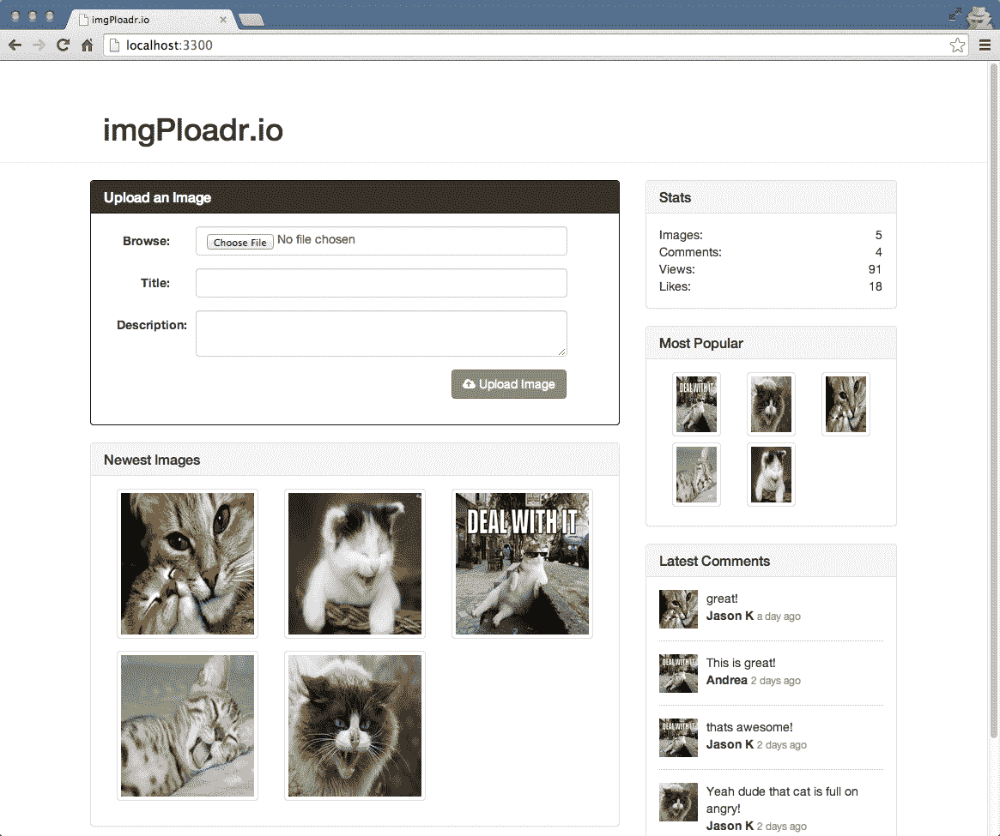

# 第四章：介绍 Express

当我们需要构建一个完整的 Web 应用程序时，从头开始编写整个应用程序并不是最佳的方法。我们可以使用一个维护良好、编写良好的 Web 应用程序框架来构建我们的应用程序，以减少开发工作量并提高可维护性。

在本章中，我们将涵盖以下主题：

+   探索 Express.js Web 应用程序框架

+   探索 Express.js 的各种元素

+   使用 Express 开发必要的代码来引导 Web 应用程序

# Web 应用程序框架

简而言之，Web 框架使得开发 Web 应用程序变得更容易。考虑将常用功能分解为可重用模块的方面。这正是框架所做的。它们带有许多可重用模块，并强制执行代码的标准结构，以便全世界的开发人员更容易地浏览和理解应用程序。

除了所有这些优点之外，Web 框架大多由全世界的开发人员维护。因此，开发人员将新的 bug 修复和底层语言的功能整合到框架版本中的工作量最小化，我们只需要升级应用程序使用的框架版本。因此，使用 Web 框架构建 Web 应用程序为开发和维护阶段带来了许多优势。

我们将在整本书中使用的 Express.js 框架是基于**模型-视图-控制器**（**MVC**）的 Web 应用程序框架。MVC 只是一种架构设计模式：

+   模型：模型用于表示 Web 应用程序的数据或实体。

它更接近实例，这些实例存储应用程序的数据，通常是数据库或 Web 服务。

+   视图：视图负责将应用程序呈现给最终用户。因此，视图可以被视为应用程序的呈现层。

+   控制器：现在，你可能想知道控制器在 Web 应用程序中的作用。控制器的作用就是将模型与相应的视图粘合在一起，并负责处理用户对应用程序中特定 Web 页面的请求。

如果你第一次听到这个概念，可能会有点难以理解。但是在阅读完本章之后，我们会向你展示各种例子，让你逐渐熟悉这些概念。

# 什么是 Express.js？

正如它在主页上完美描述的那样，Express 是一个最小化和灵活的 Node.js

Web 应用程序框架，提供了一套强大的功能，用于构建单页、多页和混合 Web 应用程序。换句话说，它提供了所有你需要的工具和基本构建块，只需编写很少的代码就可以让 Web 服务器运行起来。它让你专注于编写你的应用程序，而不用担心基本功能的细节。

Express 框架是最流行的基于 Node 的 Web 框架之一，也是`npm`中最流行的包之一。它是基于 Sinatra Web 框架构建的，在 Ruby 世界中非常流行。有很多跨语言的框架都受到 Sinatra 简单性的启发，比如 PHP 的 Laravel 框架。因此，Express 是 Node.js 世界中基于 Sinatra 的 Web 框架。

如果你看一段代码示例，Express 的最基本实现之一，你会发现启动 Web 服务器是多么容易，例如：

```js
const express = require('express'); 
const app = express(); 
app.get('/', (req, res)=>{ 
   res.send('Hello World'); 
}); 
app.listen(3300); 
```

Express 的美妙之处在于它使得构建和维护网站的服务器代码变得简单。

# 构建完整的 Web 应用程序

从本章开始，我们将构建一个完整的 Web 应用程序。

我们将要构建的 Web 应用程序将是一个流行的社交图片分享网站[imgur.com](http://imgur.com)的克隆。我们将称我们的网站为`imgPloadr.io`。

# 设计 Web 应用程序

网站的要求如下：

+   主页将允许访问者上传图片，并浏览已上传的图片，这些图片将按从新到旧的顺序进行排序。

+   每个上传的图片将通过自己的页面呈现，显示其标题、描述和大图像。访问者将能够喜欢图片并发表评论。

+   一个一致共享的侧边栏将在两个页面上可见，并展示有关网站的一般统计信息，最受欢迎的图片和最近的评论。

该网站将使用 Bootstrap，以便具有漂亮的专业设计，并且在任何设备上都能响应。

以下屏幕截图是完成网站的主页：



以下屏幕截图是网站上图片的详细页面：


# 组织文件

在编写任何代码之前，我们希望确保您已经正确设置了项目文件夹，并具有正确的文件夹结构来存放您将要创建的各种文件。首先创建一个新的项目文件夹，并为其命名。然后，在该文件夹内，创建额外的文件夹以匹配以下结构：

```js
/(project root) 
---/helpers 
---/controllers 
---/public 
------/css 
------/img 
------/js 
------/upload 
---/server 
---/Views 
------/layouts 
------/partials 
```

这些文件夹中的每一个都将包含我们在本章和本书的其余部分中编写的重要模块。

如果您通过 Yeoman 使用基于 Express 的生成器，您将获得必要的文件夹结构和依赖项与样板代码导入。然而，由于我们的意图是了解这个框架，我们将跳过这一步。访问[`yeoman.io/`](http://yeoman.io/)了解更多关于`Yeoman`功能的信息。

您需要一个`package.json`文件用于这个项目，创建这个文件的最简单方法是从项目文件夹的根目录执行以下命令：

```js
$ npm init  
```

在提示时回答每个问题，或者简单地重复按*Enter*接受默认值。现在，让我们通过`npm`安装 Express 及其必要的依赖项：

```js
$ npm install express morgan body-parser cookie-parser method-
override errorhandler express-handlebars --save  
```

这将在`node_modules`文件夹中安装 Express 框架，并且还将在`package.json`文件的依赖项部分中添加 Express。请注意，在撰写本书时，Express.js 处于其 4.x.x 版本。在这里，您可以看到，Express 是一个完全解耦的框架，它本身并不带有很多打包的模块。相反，您可以找出应用程序的依赖关系，并随时插入和拔出应用程序。如果您从一开始就一直关注 Express 的发展，您一定会注意到这些变化是作为 Express 4.x.x 版本的一部分引入的。在此版本之前，Express 通常会随附许多内置模块。在这里，我们与 Express 一起安装的模块是我们在构建完整 Web 应用程序时应用程序具有的各种依赖项。我们将在本章的后面部分讨论每个模块的使用。

# 创建应用程序的入口点

安装 Express 和必要的依赖项之后，开发应用程序的下一步将是创建一个文件，该文件将作为应用程序的默认入口点。我们将执行此文件来启动我们的 Web 应用程序，并且它将包含必要的代码来要求依赖模块，并在开发服务器上监听指定的端口。

我们暂时将入口点文件命名为`server.js`，并且保持它非常简洁，以便内容相当自解释。在这个文件中执行的任何主要逻辑实际上将被延迟到其他文件中托管的外部模块中。

在`server.js`中我们无法做任何事情之前，我们需要引入一些我们将要使用的模块，特别是 Express：

```js
const express = require('express'); 
// config = require('./server/configure'); 
let app = express(); 
```

在前面的代码中，我们将`express`模块分配给`express`变量。`config`模块实际上将是我们自己编写的模块，但目前由于它不存在，我们将保留该行的注释。最后，我们将声明一个名为`app`的变量，这实际上是 Express 框架在执行时返回的内容。这个`app`对象驱动我们整个`app`应用程序，这就是它如此巧妙地命名的原因。

在本章和本书的其余部分中，我可能会在示例中包含已注释的代码（以`//`开头的代码）。这样，当我们使用已注释的行作为参考点时，或者当我们通过简单取消注释代码来启用这些功能时，跟随将会更容易。

接下来，我们将通过`app.set()`函数在`app`对象中设置一些简单的设置。这些设置实际上只是为了定义一些我们可以在代码的其余部分中使用的应用级常量，以便我们可以方便地使用它们作为快捷方式：

```js
app.set('port', process.env.PORT || 3300); 
app.set('Views', `${__dirname}/Views`); 
// app = config(app); 
```

代码解释如下：

+   前面代码的前两行使用了 Node 中的内置常量。`process.env.PORT`常量是设置在实际机器上的环境设置，用于服务器的默认端口值。如果在机器上没有设置端口值，我们将硬编码一个默认值`3300`来代替使用。

+   之后，我们将我们的 Views（HTML 模板）的位置设置为

`${__dirname}'/Views`，或者使用另一个 Node 常量，`/Views`

在当前工作目录中的文件夹。

+   代码的第三行引用了尚未编写的`config`模块，因此该行被注释掉了。

+   最后但并非最不重要的是，我们将使用我们的`app`对象创建一个 HTTP 服务器，并告诉它监听连接：

```js
app.get('/', (req, res) => {
  res.send('Hello World');
});
app.listen(app.get('port'), () => {
  console.log(`Server up: http://localhost:${app.get('port')}`);
});
```

在这里，我们在我们的应用程序中设置了一个路由，以响应`Hello World`消息。如果任何用户请求我们应用程序的根目录，它将会响应一个`Hello World`消息。代码的最后部分是在我们的应用程序上调用`listen()`函数，告诉它要监听哪个端口，并传入一个简单的匿名回调函数，一旦服务器启动并监听，就会执行一个简单的`console.log()`消息。就是这样！再次确保将此文件保存为项目根目录下的`server.js`。您已经准备好运行您的服务器，看看它是否正常工作。

# 启动应用程序

让我们来测试一下您的服务器的运行情况：

```js
$ node server.js
Server up: http://localhost:3300  
```

太棒了！到目前为止，您的服务器实际上并没有做任何伟大的事情。尝试将浏览器指向`http://localhost:3300`。您应该会收到一个非常基本的消息，上面写着`Hello World`！如果您请求端口上的任何其他路由，例如`http://localhost:3300/`，它将会响应一个无法获取的响应。这是因为您还没有配置任何路由或任何实际逻辑在您的服务器中，来处理特定的请求，只有一个对`/`默认路由的`GET`请求。

在设置路由之前，我们应该了解 Express 中间件的概念，这对于理解我们应用程序的自定义依赖模块如何与我们的正常应用程序流集成是至关重要的。

您可以在运行服务器之前，直接从命令行设置任意数量的环境变量，执行类似以下命令的操作：

```js
$   PORT=5500 node server.js
Server   up: http://localhost:5500   
```

您还可以在环境设置中永久设置环境变量。通常可以通过编辑您的`.profile`文件或等效文件来完成此操作。

# 中间件

Express 提供的最强大的功能之一是中间件的概念。中间件背后的思想是，它就像一个过滤器堆栈，每个对服务器的请求都会通过。每个请求都会经过每个过滤器，并且每个过滤器可以对请求执行特定任务，然后再传递到下一个过滤器。

为了更好地理解，这里是中间件的图解视图：


通常，这些过滤器用于诸如 cookie 解析、表单字段处理、会话处理、身份验证、错误处理和日志记录等任务。清单不胜枚举。您可以使用数百个第三方模块，也可以简单地编写自己的自定义中间件。

# 创建自定义中间件

毫无疑问，总有一天你会想要编写自己的自定义中间件，除了*Connect*或任何其他第三方提供的现有中间件。在 Node 中编写自定义中间件之前，习惯性地首先搜索[`www.npmjs.org/`](https://www.npmjs.org/)，因为很有可能其他人已经完成了这项工作。

编写自定义中间件非常简单。在使用 Express 框架时，它记录了各种类型的中间件，我们可以简单地将其分类为两种类型，即应用程序级和基于路由的中间件。

以下是应用程序级中间件的超级基本示例：

```js
app.use((err, req, res, next)=> { 
    // do whatever you want here, alter req, alter res, throw err etc. 
    return next(); 
});
```

`app.use`函数允许我们注册为中间件。在基本级别上，它是一个在`http.createServer`方法中接收请求时调用的函数。此外，我们需要编写一个接受四个参数的函数：`err`，`req`，`res`和`next`。

+   第一个参数是一个错误对象，如果在您的中间件运行之前有任何堆栈错误，该错误将被传递给您的中间件，以便您可以相应地处理它。这是一个可选参数；因此，如果对特定功能的实现不需要错误处理，我们可以跳过它。

+   你已经熟悉了`req`和`res`参数，已经编写了你的路由。

+   第四个参数实际上是一个回调的引用。这个`next`参数是中间件堆栈能够像堆栈一样运行的方式，每个执行并确保管道中的下一个中间件通过`next`返回和调用。

`app.use`方法还接受第一个参数作为路由或端点。这形成了之前提到的第二种中间件类型，称为**基于路由的中间件**。以下是语法：

```js
app.use('/get_data', (err, req, res, next)=>{ 
    console.log('Hello world!')     
    return next(); 
}, (err, req, res, next)=>{ 
    console.log('Hello world Again!')     
    return next();
});
```

因此，这表明我们不是将中间件应用于所有传入的请求，而是将其特定于一个路由并调用路由匹配。

在编写自定义中间件时唯一要记住的重要事情是你有正确的参数并且返回`next()`。其余完全取决于你！

# 中间件的顺序

中间件被调用的顺序非常重要。再次使用过滤器的概念，作为通过每个过滤器的请求，您要确保它们按正确的顺序执行其职责。一个很好的例子是在会话处理程序之前实现 cookie 解析器，因为会话通常依赖于 cookie 来在请求之间维护与用户的状态。

中间件顺序重要的另一个很好的例子涉及错误处理。如果你的任何中间件遇到错误，它们将简单地将该错误传递给堆栈中的下一个中间件。如果最后一个中间件，无论是什么，都不能优雅地处理该错误，它基本上会显示在你的应用程序中作为堆栈跟踪（这是不好的）。将错误处理程序配置为最后一个中间件之一就像是在说“*如果一切都失败，并且在以前的中间件的任何时候发生故障，请优雅地处理它*。”

我们已经安装的各种依赖项将被集成到我们的代码中作为中间件。我们将通过`config`模块来执行这个集成各种中间件的任务，因为它将帮助我们使`server.js`文件更加精简，并增加代码的可读性。

# 配置模块

由于我们保持`server.js`文件非常简洁，因此在配置服务器时仍需要相当多的逻辑。为此，我们将使用一个名为`configure`的自定义模块。首先，在`server`文件夹中创建一个`configure.js`文件。当我们首次安装 Express 时，我们已经安装了自定义依赖项。

现在模块已安装并准备好使用，让我们开始编写`configure.js`文件。首先，像我们的任何模块一样，我们将声明我们的依赖项：

```js
const path = require('path'), 
    routes = require('./routes'), 
    exphbs = require('express-handlebars'),), 
    express = require('express'), 
    bodyParser = require('body-parser'), 
    cookieParser = require('cookie-parser'), 
    morgan = require('morgan'), 
    methodOverride = require('method-override'), 
    errorHandler = require('errorhandler'); 

module.exports = (app)=>{ 
   app.use(morgan('dev')); 
   app.use(bodyParser.urlencoded({'extended':true})); 
   app.use(bodyparser.json()); 
   app.use(methodOverride()); 
   app.use(cookieParser('some-secret-value-here')); 
   routes(app);//moving the routes to routes folder. 

   app.use('/public/', express.static(path.join(__dirname, 
            '../public'))); 

if ('development' === app.get('env')) { 
   app.use(errorHandler()); 
} 
    return app; 
}; 
```

在前面的代码中，我们为我们自定义的`configure`模块中将要使用的每个模块声明了`const`。然后，我们定义了实际将由此代码文件导出的模块，更具体地说是一个接受我们的`app`对象作为参数的函数，并返回相同对象（在我们对其进行一些配置修改后）。

您应该看到我们需要 Connect，它实际上是 Express.js 的核心依赖项之一，默认安装。Connect 是一个流行的第三方中间件框架，我们将在本章后面更多地了解它。

让我们来看看我们在前面的代码中使用的每个 Connect 中间件：

+   `morgan`：这是负责记录日志的模块。这对调试您的 Node 服务器非常有帮助。

+   `bodyParser`：这有助于方便打包通过浏览器的 HTML 表单提交的任何表单字段。通过`POST`请求提交的表单字段将通过`req.body`属性可用。

+   `methodOverride`：对于不正确支持 REST HTTP 动词的旧浏览器，如`UPDATE`和`PUT`，`methodOverride`中间件允许使用特殊的隐藏输入字段来伪造它。

+   `cookieParser`：这允许发送和接收 cookie。

+   `errorHandler`：这处理整个中间件过程中发生的任何错误。通常，您会编写自己的自定义`errorHandler`，可能会呈现默认的 404 HTML 页面，将错误记录到数据存储中，等等。

+   `handlebars`：这是我们将与视图一起使用的模板引擎。我们将在接下来的部分中更多地解释如何集成它。

`routes(app)`行是 Express 的一个特殊组件，表示您实际上正在使用路由器与服务器，您可以响应`GET`、`POST`、`PUT`和`UPDATE`等请求。由于您正在使用 Express 路由器作为最后一个中间件之一，我们还将在下一节中定义实际的路由。

最后，`express.static()`中间件用于从预定义的静态资源目录向浏览器呈现静态内容文件。这很重要，这样服务器可以提供静态文件，如`.js`、`.css`、`图像`和`regular.html`，以及您可能需要提供的任何其他文件。静态中间件将从 public 目录提供任何静态文件，就像以下代码一样：

```js
http://localhost:3300/public/js/somescript.js
http://localhost:3300/public/img/main_logo.jpg
```

重要的是，您的静态中间件在`app.router()`之后定义，这样静态资产不会意外地优先于您可能已定义的匹配路由。

# 激活配置模块

现在您的`configure.js`文件已经完成，您可以从主`server.js`文件中调用它了。如果您还记得，我们在`configure`模块中包含了两行被注释掉的代码。现在是时候取消注释这两行了，这样当您运行服务器时，您的`configure`模块将发挥作用。这两行现在应该是这样的：

```js
config = require('./server/configure'), 
app = config(app); 
```

通过执行`server.js`节点再次启动服务器，一切应该仍然运行顺利。现在，是时候在我们的应用程序中加入更多路由了，除了我们之前添加的`Hello World`路由。

# 路由和控制器

到目前为止，你有你的`server.js`文件和一个`configure`模块，用于连接应用程序所需的所有中间件。下一步是实现适当的路由器和必要的控制器。

路由将是应用程序中每个可用 URL 路径的映射。服务器上的每个路由都对应于控制器中的一个函数。这是我们正在编写的特定应用程序的路由表：

```js
GET  /(index) - home.index (render the homepage of the site) 
GET  /images/image_id - image.index (render the page for a specific 
                                     image)
POST /images - image.create (when a user submits and uploads a new 
                              image)
POST /images/image_id/like - image.like (when a user clicks the Like 
                                          button)
POST /images/image_id/comment - image.comment (when a user posts a 
                                                comment)
```

你可以看到我们处理了两个不同的`GET`请求和三个不同的`POST`请求。此外，我们有两个主要的控制器：`home`和`image`。控制器实际上只是具有不同函数定义的模块，这些函数与相应的路由相匹配。正如前面指出的，它们在 MVC 设计模式中被称为控制器。通常，每个路由都对应一个控制器。这个控制器很可能会渲染一个视图，而这个视图很可能会有自己的模型（在视图中显示的任何数据）。

让我们将我们的路由写成一个与所述表格匹配的模块。首先，在`server`文件夹中创建一个`routes.js`文件。`routes`文件将会非常简单，它所需的唯一依赖将是我们定义的控制器：

```js
const express = require('express'), 
    router = express.Router(), 
    home = require('../controllers/home'), 
    image = require('../controllers/image'); 
module.exports = (app)=>{ 
    router.get('/', home.index); 
    router.get('/images/:image_id', image.index); 
    router.post('/images', image.create); 
    router.post('/images/:image_id/like', image.like); 
    router.post('/images/:image_id/comment', image.comment); 
    app.use(router); 
}; 
```

我们立即声明一个`router`变量，并要求`controllers`文件夹来分配每个应用程序路由（我们还没有创建这些文件，但接下来就要创建了）。在这里，我们将每个路由分配给控制器中的相应函数。然后，我们导出一个模块，当单独调用时，将所有这些路由附加到`app`实例上。

路由的第一个参数是路由本身的字符串值，它可以包含变量值作为子路径。你可以看到第二个`router.get`，我们分配了一个路由值`/images/:image_id`，它基本上等同于浏览器地址栏中的`/image/ANYVALUE`。当我们编写`image.index`控制器时，你将看到如何检索`:image_id`的值并在`controller`函数内部使用它。

路由的第二个参数是一个回调函数。你可以完全忽略使用控制器的想法，只需将回调定义为内联匿名函数；然而，随着你的路由增长，这个文件会变得越来越大，代码会开始变得混乱。将代码分解成尽可能多的小而可管理的模块总是一个很好的做法，以保持自己的理智！

前两个`router.get`路由是典型的路由，当访问者将他们的浏览器指向`yourdomain.com/routepath`时会被调用——浏览器默认发送`GET`请求到服务器。另外三个`router.post`路由被定义为处理浏览器向服务器发出的请求，通常通过 HTML 表单提交完成。

有了所有我们定义的路由，现在让我们创建匹配的控制器。在`controllers`文件夹中，创建`home.js`和`image.js`文件。`home.js`文件非常基本：

```js
module.exports = { 
    index(req, res){ 
        res.send('The home:index controller'); 
    } 
}; 
```

使用这个模块，我们实际上是在导出一个对象，该对象具有一个名为`index`的单个函数。`index`的`function`签名是使用 Express 的每个路由所需的签名。第一个参数是一个请求对象，第二个参数是一个响应对象。浏览器发送到服务器的请求的每个具体细节都可以通过请求对象获得。

此外，请求对象将使用之前声明的所有中间件进行修改。你将使用响应对象向客户端发送响应——这可能是一个渲染的 HTML 页面、静态资产、JSON 数据、错误，或者你确定的任何内容。目前，我们的控制器只是简单地响应一个简单的文本，这样你就可以看到它们都在工作。

让我们创建一个图像控制器，其中有更多的函数。编辑`/controllers/image.js`文件并插入以下代码：

```js
module.exports = { 
    index(req, res) { 
        res.send(`The image:index controller ${req.params.image_id}`); 
    }, 
    create(req, res) { 
        res.send('The image:create POST controller'); 
    }, 
    like (req, res) { 
        res.send('The image:like POST controller'); 
    }, 
    comment(req, res) { 
        res.send('The image:comment POST controller'); 
    } 
}; 
```

在这里，我们定义了`index`函数，就像我们在主控制器中所做的那样，只是我们还将显示`image_id`，这是在执行此控制器函数时在路由中设置的。`params`属性是通过`urlencoded`功能添加到`request`对象中的，这是 body parser 模块的一部分！

请注意，控制器目前不需要任何依赖项（文件顶部没有定义`require`声明）。随着我们实际完善控制器函数并开始执行诸如将记录插入我们的 MongoDB 数据库和使用其他第三方`npm`模块等操作，这将发生改变。

现在你的控制器已经创建并准备好使用，你只需要激活你的路由。为了做到这一点，我们将在我们的`configure.js`文件中插入最后一行代码，就在`return app;`行的上方：

```js
routes(app);  
```

不要忘记在文件顶部取消注释`routes = require('./routes')`这一行。我们在这里做的是使用我们定义的`routes`模块，并执行`initialize`函数，这将通过我们的`app`对象实际连接我们的路由。我们需要注释掉我们刚刚移动到`routes`中的冗余代码，它仍然存在于`server.js`中。

作为迄今为止你已经创建的每个文件的总结，这里列出了不间断的文件，这样你就可以查看完整的代码：

首先，我们需要用`server.js`启动

```js
const express = require('express'); 
const config = require('./server/configure'); 
let app = express(); 
app.set('port', process.env.PORT || 3300); 
app.set('Views', `${ __dirname }/Views`); 
app = config(app); 

//commenting out following snippet that is not required 
// app.get('/', function(req, res){ 
//    res.send('Hello World'); 
// }); 

const server = app.listen(app.get('port'), ()=>{ 
    console.log(`Server up: http://localhost:${ app.get('port')}`); 
}); 
```

接下来，我们将使用`server/configure.js`配置服务器：

```js
const path = require('path'), 
    routes = require('./routes'), 
    exphbs = require('express-handlebars'), 
    express = require('express'), 
    bodyParser = require('body-parser'), 
    cookieParser = require('cookie-parser'), 
    morgan = require('morgan'), 
    methodOverride = require('method-override'), 
    errorHandler = require('errorhandler'); 

module.exports = (app)=>{ 
  app.use(morgan('dev'));
  app.use(bodyParser.json());
  app.use(bodyParser.urlencoded({
  extended: true
}));
  app.use(methodOverride()); 
  app.use(cookieParser('some-secret-value-here')); 
  routes(app); 
  app.use('/public/', express.static(path.join(__dirname,  
          '../public'))); 

  if ('development' === app.get('env')) { 
    app.use(errorHandler()); 
  } 
  return app; 
}; 
```

然后，我们在`server/routes.js`中定义了我们的路由：

```js
const express = require('express'), 
    router = express.Router(), 
    home = require('../controllers/home'), 
    image = require('../controllers/image'); 
module.exports = (app)=>{ 
    router.get('/', home.index); 
    router.get('/images/:image_id', image.index); 
    router.post('/images', image.create); 
    router.post('/images/:image_id/like', image.like); 
    router.post('/images/:image_id/comment', image.comment); 
    app.use(router); 
}; 
```

最后，我们将使用`controllers/home.js`定义我们的控制器：

```js
module.exports = { 
    index(req, res) { 
        res.send('The home:index controller'); 
    } 
}; 
```

此外，我们还将使用`controllers/image.js`来定义我们的控制器：

```js
module.exports = { 
    index(req, res) { 
        res.send(`The image:index controller ${req.params.image_id}`); 
    }, 
    create(req, res) { 
        res.send('The image:create POST controller'); 
    }, 
    like (req, res) { 
        res.send('The image:like POST controller'); 
    }, 
    comment(req, res) { 
        res.send('The image:comment POST controller'); 
    } 
}; 
```

让我们最后一次启动服务器并检查是否一切正常。

执行`server.js`节点，并且这次将浏览器指向`http://localhost:3300`。现在，你应该在浏览器中看到一些响应。转到`http://localhost:3300/images/testing123`。你应该在屏幕上看到以下消息：

```js
 The image:index controller testing123 
```

# Handlebars 作为视图引擎

默认情况下，Express 可以愉快地呈现静态 HTML 文档并将其返回给客户端。但是，除非你正在构建一个纯静态的、内容驱动的网站，这是可疑的，否则你很可能希望动态地呈现你的 HTML。也就是说，你希望在页面被请求时动态生成 HTML 的部分，也许使用循环、条件语句、数据驱动的内容等等。为了呈现动态 HTML 页面，你需要使用一个渲染引擎。

这就是 Handlebars 的用武之地。这个渲染引擎得名是因为它用于显示数据的语法，即双大括号`{{`和`}}`。使用 Handlebars，你可以在你的 HTML 页面中有根据传递给它的数据在运行时确定的部分。考虑以下例子：

```js
<div> 
    <p>Hello there {{ name }}!  Todays date is {{ timestamp }}</p> 
</div> 
```

访问者浏览器上实际的 HTML 将是：

```js
<div> 
    <p>Hello there Jason!  Todays date is Sun Apr 13</p> 
</div> 
```

我们在`configure`模块中要处理的第一件事是将 Handlebars 注册为默认的视图渲染引擎。在`configure.js`文件中，在`return(app);`行的上方，你应该插入以下代码：

```js
app.engine('handlebars', exphbs.create({ 
    defaultLayout: 'main', 
    layoutsDir: `${app.get('Views')}/layouts`, 
    partialsDir: [`${app.get('Views') }/partials`] 
}).engine); 
app.set('View engine', 'handlebars'); 
```

首先，使用传入`configure`函数的 Express `app`对象，通过调用`app`的`engine`函数来定义我们选择的渲染引擎。`engine`函数的第一个参数是渲染引擎应该寻找的文件扩展名，即`handlebars`。

第二个参数通过调用`express-hbs`模块的`create`函数来构建引擎。这个`create`函数以一个`options`对象作为参数，这个`options`对象为我们的服务器定义了许多常量。最重要的是，我们将定义哪个布局是我们的默认布局，以及我们的布局将存储在哪里。如果您还记得，在`server.js`中，我们使用`app.set`来设置我们的`app`的`Views`属性，指向当前工作目录`+/Views`。当我们配置渲染引擎的选项时，就会使用这个设置。您会注意到`partialsDir`属性使用了一个数组（只有一个项）和一个`layoutsDir`的单个字符串值。这两种方法是可以互换的，我只是想演示您可以有多个部分目录，它可以只是一个字符串值的数组。

有了这个设置，我们的服务器现在知道，每当我们尝试呈现具有`handlebars`文件扩展名的 HTML 页面时，它将使用 Handlebars 引擎执行呈现。这意味着我们需要确保在我们的动态 HTML 页面中使用 Handlebars 特定的语法。

在下一章中，我们将学习更多关于 Handlebars 以及如何编写动态 HTML 页面的知识。

使用`.handlebars`作为文件扩展名纯粹是个人选择。有些人更喜欢`.hbs`，如果你愿意，你可以使用任何你喜欢的东西。只需确保`app.engine()`函数中的第一个参数和`app.set('View engine')`函数中的第二个参数是相同的。

要了解 Express.js 提供的许多模板引擎，请查看此链接[`github.com/expressjs/express/wiki#template-engines`](https://github.com/expressjs/express/wiki#template-engines)。

# 摘要

在本章中，我们学习了 Node 的 Express Web 框架，并使用 Express 编写了一个基本的 Web 服务器，这将成为我们在本书的其余部分中构建的图片上传网站的基础。

您编写的 Web 服务器处理特定路由的请求，使用控制器处理这些路由的逻辑，并支持典型 Web 服务器应具备的所有标准要求。

在下一章中，我们将介绍 Handlebars 模板引擎，以编写网站所需的每个动态 HTML 页面。此外，我们将更新图像和主页控制器，以包含必要的逻辑，以正确呈现这些 HTML 页面。
