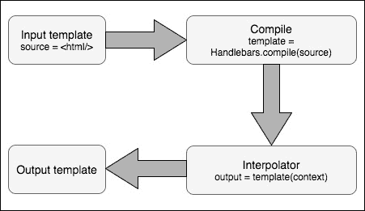
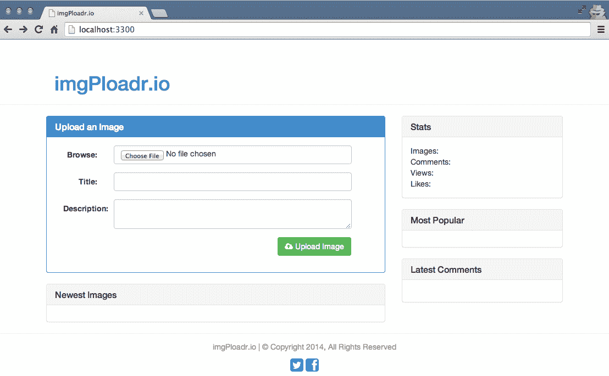
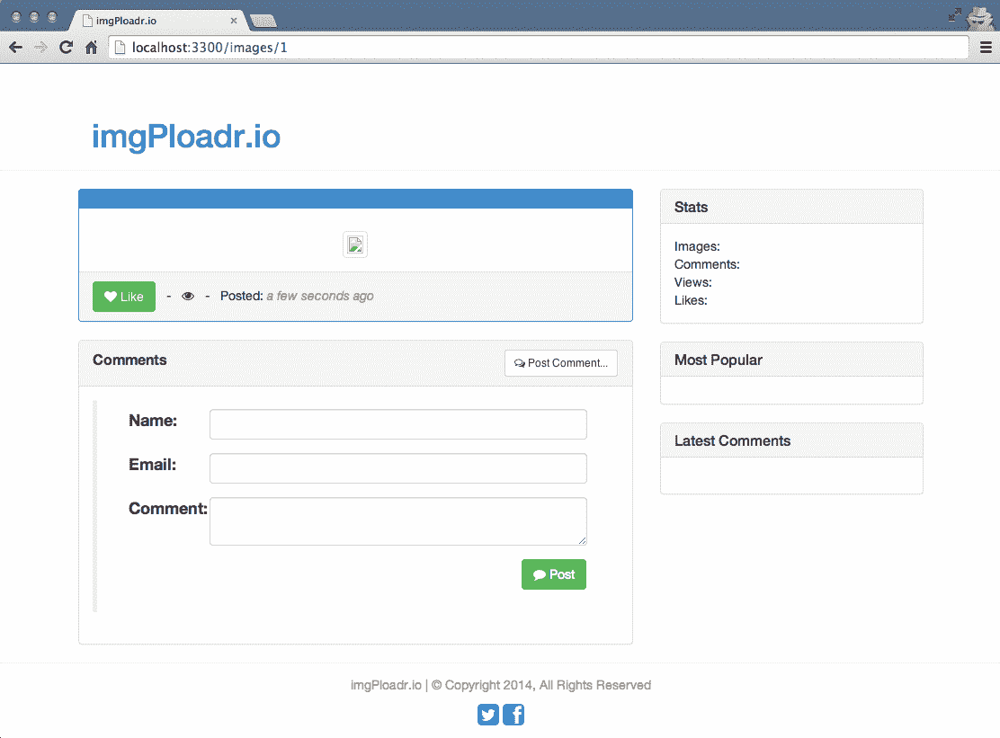

# 第五章：使用 Handlebars 进行模板化

JavaScript 模板引擎是 node.js 被证明是一种同构技术的原因。它在 node.js 中添加了服务器端 UI 渲染功能，刺激了其客户端渲染性能。此外，它还简化了客户端代码的维护，因为它与服务器端代码紧密耦合。让我们在本章中更清楚地了解这一点，通过探索以下主题：

+   Handlebars 模板框架

+   开发构建应用程序呈现层所需的模板的步骤

在我们开始探索 Handlebars 的功能之前，我们需要了解模板框架通常做什么。

# 模板引擎

正如我们已经知道的，MVC 应用程序框架将应用程序特定代码分为模型、视图和控制器。控制器应该处理将适当的数据绑定到其相关视图以生成传入 Web 应用程序请求的输出的任务。因此，视图应该独立于数据，只包含与数据呈现相关的代码，这将主要是 HTML。除了 HTML，视图还需要包含呈现逻辑，这将是在通过控制器传递给它们的数据上编写的条件。然后，模板框架在这种情况下的主要任务是使嵌入呈现逻辑的过程更简单和可读。此外，它们试图将视图分隔成更易理解的子组件。

# 服务器端和客户端模板

模板解决方案通常可以分为客户端和服务器端模板解决方案。我们构建的 Web 应用程序通常遵循服务器端或客户端模板方法，或两者的混合。

# 客户端模板

想象一种情况，即 Web 应用程序在加载页面后，通过 AJAX 调用 API 并得到 JSON 响应。它将如何将接收到的数据呈现到相应的 HTML 中？在这种情况下，需要客户端模板来保持我们的 JavaScript 代码整洁，否则我们将不得不在 JavaScript 代码中放入太多难以阅读的 HTML 代码作为字符串。客户端模板框架允许我们将页面组件对应的模板放在标记内的特定标记中，并在必要时通过 JavaScript 代码呈现它们。采用客户端方法的常见缺点是它对页面的初始渲染时间产生的影响。

使用客户端模板的另一个重要优势是，它有助于将模板工作从服务器转移到客户端。这有助于大大减少服务器的计算负载，因为模板逻辑仅在浏览器中通过 JavaScript 执行。

# 服务器端模板

服务器端模板是我们在将 HTML 响应发送回 Web 浏览器之前通过调用相应的视图来呈现标记的地方。这是我们将通过 Handlebars 在本章中探讨的内容。

有许多不同的渲染引擎可用于 Node 和 Express。其中最受欢迎的是 Jade、EJS 和 Handlebars。本书将探讨的特定引擎是 Handlebars.js。

# Handlebars 的基础知识

**Handlebars**是一个非常简单和易于使用的模板框架。它的工作原理是在模板内插入数据。要了解 Handlebars 的概述，请考虑以下块图：



在这里，编译方法接受 HTML 表达式模板，并生成一个带有参数的函数。

让我们来看看编写 Handlebars 模板的基本语法。

# 将对象绑定到模板

假设以下 JavaScript 对象被传递给 Handlebars 模板：

```js
    let context = { 
      name: 'World' 
    }; 
```

模板文件本身将包含以下标记：

```js
    let source = `<div> 
      Hello {{ name }}! 
    </div>` 
```

前面的标记包含`name`作为 HTML 表达式，将由其上下文对象插值。

我们需要编写使其工作的 JavaScript 方法，如下所示：

```js
    let template = Handlebars.compile(source);
    let output = template(context);
```

此输出变量将包含以下 HTML 代码：

```js
    <div> 
      Hello World! 
    </div>
```

# 嵌入式呈现逻辑

当然，你可以做的远不止这些！Handlebars 还支持条件语句：

```js
    let model = { 
      name: 'World', 
      description: 'This will only appear because its set.' 
    }; 

    <div> 
       Hello {{ name }}!<br/><br/> 
      {{#if description}} 
         <p>{{description}}</p> 
      {{/if}} 
    </div> 
```

使用`if`块助手，如前面的代码所示，您可以检查真条件，并且只在条件为真时显示 HTML 和/或数据。或者，您可以使用`unless`助手来执行相反的操作，只有在条件为假时显示 HTML：

```js
    let model = { 
      name: 'World' 
    }; 

    <div> 
       Hello {{ name }}!<br/><br/> 
      {{#unless description}} 
         <p>NOTE: no description found.</p> 
      {{/if}} 
    </div> 
```

您可以像在其他编程语言中使用条件`if/else`一样使用`if`和`else`，以及`unless`。就是这样！这些就是我们需要了解的所有基础知识，以便恢复我们的应用程序。

# 视图

视图是我们称之为 HTML 页面的东西。它们被称为视图是因为 MVC 设计模式。正如我们已经讨论过的，模型是将显示在页面上的数据，视图是页面本身，控制器是在模型和视图之间通信的大脑。

我们的特定应用程序将需要两个视图。第一个视图是主页，第二个视图是图像页面。

以下部分的 HTML 严重依赖于 Bootstrap，这是 Twitter 创建的流行 HTML 框架，它提供了一套标准的用户界面元素。这些包括按钮、字体、布局网格、颜色方案等等。使用 Bootstrap 不仅可以让我们以一个漂亮干净的 UI 呈现我们的应用程序，还可以使其具有响应性，并且在任何查看它的设备上都能正确显示。您可以通过访问[`getbootstrap.com`](http://getbootstrap.com)了解更多关于 Bootstrap 的信息。

让我们从创建主页视图开始。在`views`文件夹中创建一个新文件，命名为`index.Handlebars`，并插入以下 HTML 代码：

```js
    <div class="panel panel-primary"> 
        <div class="panel-heading"> 
            <h3 class="panel-title"> 
                Upload an Image 
            </h3> 
        </div> 
```

我们将文件命名为`index.Handlebars`的原因纯粹是个人选择，但也基于网络上的常见命名约定。通常，作为任何网站的根文件的 HTML 页面被命名为`index.whatever`（`.php`，`.aspx`，`.html`等）。再次强调，这只是一个常见的约定，不是您必须特别遵守的东西。

创建一个基本的 HTML 表单，并将`method`设置为`post`，`action`设置为`/images`。确保设置表单的`enctype`属性，因为我们将上传文件以及通过表单字段提交数据：

```js
    <form method="post" action="/images" enctype="multipart/form-
      data"> 
        <div class="panel-body form-horizontal"> 
            <div class="form-group col-md-12"> 
                <label class="col-sm-2 control-label" 
                  for="file">Browse:</label>
```

在这里，我们包含了一个标准的 HTML 输入字段，用于上传文件：

```js
                <div class="col-md-10"> 
                    <input class="form-control" type="file" 
                       name="file" id="file"> 
                </div> 
            </div> 
            <div class="form-group col-md-12"> 
                <label class="col-md-2 control-label" 
                  for="title">Title:</label> 
                <div class="col-md-10"> 
```

另一个标准的 HTML 输入字段用于文件的标题可以是用户想要的任何内容，如下面的代码所示：

```js
                    <input class="form-control" type="text" 
                      name="title"> 
                </div> 
            </div> 
            <div class="form-group col-md-12"> 
                <label class="col-md-2 control-label" 
                  for="description">Description:</label> 
                <div class="col-md-10"> 
```

用于描述的标准 HTML `textarea`输入字段如下：

```js
                    <textarea class="form-control" 
                      name="description" rows="2"></textarea> 
                </div> 
            </div> 
            <div class="form-group col-md-12"> 
                <div class="col-md-12 text-right"> 
```

提供了一个标准的 HTML 按钮，将表单提交到服务器。使用 Bootstrap 类，我们提供了`btn`和`btn-success`，使其看起来像一个具有默认成功颜色（绿色）的 Bootstrap 风格按钮：

```js
                    <button type="submit" id="login-btn" 
                      class="btn btn-success" type="button">
                      <i class="fa fa-cloud-upload ">
                      </i> Upload Image</button> 
                </div> 
            </div> 
        </div> 
    </form> 
</div>
```

在上传表单部分之后，我们将显示上传到网站的最新图像列表。请参考以下代码片段中的`each`块。它是 Handlebars 支持的关键字，用于循环遍历提供给模板的数据，以便重用 HTML 块。我们将在以下代码中详细讨论这一点：

```js
<div class="panel panel-default"> 
    <div class="panel-heading"> 
        <h3 class="panel-title"> 
            Newest Images 
        </h3> 
    </div> 
    <div class="panel-body"> 
        {{#each images}} 
            <div class="col-md-4 text-center" style="padding-bottom: 
              1em;"><a href="/images/{{ uniqueId }}"></a></div> 
        {{/each}} 
    </div> 
</div> 
```

主页 HTML 代码中有两个重要部分。第一个是

我们定义的表单将是用户上传图像到网站的主要方式。由于我们将接受图像文件以及图像的详细信息（标题、描述等），因此我们需要确保表单设置为接受多部分数据。我们还将表单操作设置为指向我们在`routes`和`image`控制器模块中早些时候定义的`/images`路由。当用户完成表单并单击提交按钮时，表单将向`http://localhost:3300/images`发送`POST`请求，我们的路由器将捕获该请求并将其转发到我们的`image`控制器。从那里，`image`控制器将处理数据并将其保存到数据库，将图像文件保存到文件系统，并重定向到图像详细信息页面。我们将在下一章中编写这个逻辑。目前，如果您提交表单，实际上不会发生任何事情。

在主页上的主要图像上传表单下面，我们还有一个部分，使用`each`执行 Handlebars 循环，并遍历图像集合，将每个图像显示为缩略图，并提供指向图像页面的链接。`images`集合将从我们的`home`控制器中填充。在这里需要注意的是，在 Handlebars 模板的`{{#each}}`循环中，您的上下文会发生变化。也就是说，您用于访问`each`内部数据的路径现在基于集合中的每个项目。在这里，我们的对象将绑定到视图，将具有一个图像集合，图像集合中的每个项目将具有`uniqueid`、`filename`和`title`属性。完成主页视图后，让我们设置图像页面的视图。

在`views`文件夹中创建另一个文件，并将其命名为`image.Handlebars`。这个文件将具有更多的功能，所以我将它分成几部分，以便您可以审查每个部分。首先，插入以下代码块：

```js
<div class="panel panel-primary"> 
    <div class="panel-heading"> 
        <h2 class="panel-title">{{ image.title }}</h2> 
    </div> 
    <div class="panel-body"> 
        <p>{{ image.description }}</p> 
        <div class="col-md-12 text-center"> 
             
        </div> 
    </div> 
    <div class="panel-footer"> 
        <div class="row"> 
            <div class="col-md-8"> 
                <button class="btn btn-success" id="btn-like" 
                  data-id="{{ image.uniqueId }}"><i class="fa fa-
                  heart">   Like</i></button>                <strong class="likes-count">{{ image.likes }}
                 </strong> &nbsp; - &nbsp; <i class="fa fa-eye">
                 </i> <strong>{{ image.views }}</strong>                &nbsp; - &nbsp; Posted: <em class="text-muted">{{ 
                 timeago image.timestamp }}</em> 
            </div> 
        </div> 
    </div> 
</div> 
```

这段代码块定义了将在特定图像页面上显示的大部分内容。此页面的`viewModel`将由一个`image`对象组成，该对象具有在整个代码中使用的各种属性，例如`title`、`description`、`filename`、`likes`、`views`以及图像上传的时间戳。

您可能已经注意到代码中与`{{ timeago image.timestamp }}`时间戳相关的语法略有不同。那实际上是一个 Handlebars 助手。

这是一个我们即将编写的自定义函数，它将执行一些特殊的字符串格式化，具体来说，将时间戳字符串转换为一段时间前的时间（即 2 天前，12 小时前，15 分钟前等）。

我们希望允许用户对图像发表评论，因此让我们包括一个简单的表单：

```js
<div class="panel panel-default"> 
    <div class="panel-heading"> 
        <div class="row"> 
            <div class="col-md-8"> 
                <strong class="panel-title">Comments</strong> 
            </div> 
            <div class="col-md-4 text-right"> 
                <button class="btn btn-default btn-sm" id="btn-
                  comment" data-id="{{ image.uniqueId }}">
                  <i class="fa fa-comments-o"> Post 
                  Comment...</i></button> 
            </div> 
        </div> 
    </div> 
    <div class="panel-body"> 
        <blockquote id="post-comment"> 
            <div class="row"> 
```

接下来是另一个标准的 HTML 表单，其中设置了方法和操作。该表单允许用户通过标准的 HTML 输入字段输入他们的姓名、电子邮件地址和评论。还提供了另一个提交按钮来保存评论：

```js
                <form method="post" action="/images/{{ 
                  image.uniqueId }}/comment"> 
                    <div class="form-group col-sm-12"> 
                        <label class="col-sm-2 control-label" 
                          for="name">Name:</label> 
                        <div class="col-sm-10"> 
                            <input class="form-control" 
                              type="text" name="name"> 
                        </div> 
                    </div> 
                    <div class="form-group col-sm-12"> 
                        <label class="col-sm-2 control-label" 
                          for="email">Email:</label> 
                        <div class="col-sm-10"> 
                            <input class="form-control" 
                              type="text" name="email"> 
                        </div> 
                    </div> 
                    <div class="form-group col-sm-12"> 
                        <label class="col-sm-2 control-label" 
                          for="comment">Comment:</label> 
                        <div class="col-sm-10"> 
                            <textarea class="form-control" 
                              name="comment" rows="2"></textarea> 
                        </div> 
                    </div> 
                    <div class="form-group col-sm-12"> 
                        <div class="col-sm-12 text-right"> 
                           <button type="submit" id="comment-btn" 
                             class="btn btn-success" type="button">
                             <i class="fa fa-comment"></i> 
                             Post</button> 
                        </div> 
                    </div> 
                </form> 
            </div> 
        </blockquote> 
```

评论的表单操作设置为`/images/{{ image.uniqueid }}/comment`。同样，如果您回忆起我们设置的路由，我们特意定义了一个路由来处理这个问题。

最后，我们希望显示已提交的任何评论。我们的`viewModel`包括评论集合以及图像详细信息，因此我们可以简单地使用 Handlebars 的`#each`块助手遍历该集合：

```js
        <ul class="media-list"> 
            {{#each comments}} 
            <li class="media"> 
                <a class="pull-left" href="#"> 
                                          {{gravatar}}?d=monsterid&s=45"> 
                </a> 
                <div class="media-body"> 
                    {{ comment }} 
                    <br/><strong class="media-heading">{{ name 
                      }}</strong> <small class="text-muted">{{ 
                      timeago timestamp }}</small> 
                </div> 
            </li> 
            {{/each}} 
        </ul> 
    </div> 
</div> 
```

就像我们在主页上执行的循环一样，用于显示图像集合，这里我们只是遍历`comments`集合中的每条评论，并显示评论和字符串格式化的时间戳（再次使用我们的`timeago`全局助手）。我们还使用 Gravatar 来显示已评论用户的通用头像图像（假设他们已经提供了他们的电子邮件地址）。

Gravatar 是由[`wordpress.com/`](https://wordpress.com/)提供的一项服务，允许通过用户的电子邮件地址提供用户的个人资料图像。许多流行的网络服务依赖于 Gravatar，作为一种快速简便的方式来显示用户的个人资料图像，而无需支持此功能的额外功能。您可以在[`gravatar.com`](http://gravatar.com)了解更多关于 Gravatar 的信息。

# 布局

到目前为止，我们为我们的网站创建了两个特定视图：一个用于主页，一个用于图像的详细信息。然而，没有一致的 UI 将这两个页面联系在一起。我们没有一致的导航或标志。没有带有标准版权或其他信息的通用页脚。

通常，对于您创建的任何网站，您都希望有某种标准布局或主模板，每个页面都将使用。此布局通常包括网站标志和标题、主导航、侧边栏（如果有）、页脚。在每个网页上包含布局的 HTML 代码是不好的做法，因为如果您想对主布局进行最小的更改，结果将不得不编辑每个网页。幸运的是，Handlebars 有助于减少使用布局文件的工作量。

让我们通过在`views/layouts`文件夹中创建一个名为`main.Handlebars`的新文件来为我们的应用程序创建一个布局文件，并将以下 HTML 代码插入其中：

```js
<!DOCTYPE HTML> 
<html lang="en"> 
    <head> 
        <title>imgPloadr.io</title> 
        <link 
          href="//netdna.bootstrapcdn.com/bootstrap/3.1.1/css/
          bootstrap.min.css" rel="stylesheet">        <link href="//netdna.bootstrapcdn.com/font-awesome/
          4.0.3/css/font-awesome.min.css" rel="stylesheet">        <link rel="stylesheet" type="text/css" 
          href="/public/css/styles.css"> 
    </head> 
    <body> 
        <div class="page-header"> 
            <div class="container"> 
                <div class="col-md-6"> 
                    <h1><a href="/">imgPloadr.io</a></h1> 
                </div> 
            </div> 
        </div> 
        <div class="container"> 
            <div class="row"> 
                <div class="col-sm-8"> 
                    {{{ body }}} 
                </div> 
                <div class="col-sm-4"> 
                    {{> stats this }} 

                    {{> popular this }} 

                    {{> comments this }} 
                </div> 
            </div> 
        </div> 
        <div style="border-top: solid 1px #eee; padding-top: 
          1em;"> 
            <div class="container"> 
                <div class="row"> 
                    <div class="col-sm-12 text-center"> 
                        <p class="text-muted">imgPloadr.io | 
                          &copy; Copyright 2017, All Rights 
                          Reserved</p> 
                        <p class="text-center"> 
                            <i class="fa fa-twitter-square fa-2x 
                              text-primary"></i>                            <i class="fa fa-facebook-square fa-2x 
                              text-primary"></i> 
                        </p> 
                    </div> 
                </div> 
            </div> 
        </div> 
        <script src="img/jquery.min.js"></script>        <script type="text/javascript" 
          src="img/scripts.js"></script> 
    </body> 
</html> 
```

前面的大部分代码只是 HTML，其中大部分使用 Bootstrap 来实际布局页面以及其他一些与 UI 相关的元素。最重要的部分是中间的突出部分，其中包含`{{{ body }}}`和下面的几行，因为它们涉及使用 Handlebars。

`{{{ body }}}`是 Handlebars 中专门用于布局的保留字。基本上，我们要说的是，我们渲染的任何页面都将其内容插入到定义`{{{ body }}}`的区域。如果您回忆一下我们之前创建的`configure`模块，当我们设置 Handlebars 作为我们的渲染引擎时，我们定义了我们的默认布局文件。在`{{{ body }}}`周围使用`{{{`和`}}}`的略显奇怪的用法是因为 Handlebars 在使用`{{`和`}}`时默认转义 HTML。由于我们的视图主要包含 HTML，我们希望保持其完整性，因此我们使用`{{{`和`}}}`。

另外三行使用`{{ > ... }}`渲染 Handlebars 部分，这些部分就像共享的 HTML 代码块，接下来将介绍。

# 部分视图

到目前为止，我们创建了一个视图，它作为特定页面的大部分 HTML，以及一个布局，它作为网站每个页面上一致部分的包装。接下来，让我们来看看创建部分，这些部分实际上只是我们可以重用并注入到我们的布局或视图中的小视图。

部分是在网站中创建可重用组件并减少代码重复的绝佳方式。考虑一下我们应用程序中的评论。我们定义了一个 HTML 表单，用户可以使用它提交评论，但是如果我们想允许用户从网站的许多不同区域发布评论，该怎么办？这种情况是将我们的评论表单移到自己的部分中的绝佳候选，并且只需在任何我们想要显示评论表单的地方包含该部分。

对于这个应用程序，我们特别使用部分来处理主要布局中的侧边栏。

对于每个视图的`viewModel`，我们将包含一个名为`sidebar`的 JavaScript 对象

其中将包含侧边栏部分中找到的统计数据、热门图片和最近评论的特定数据。

让我们为每个部分创建 HTML。首先，在`views/partials/`路径中创建一个名为`stats.Handlebars`的文件，并包含以下 HTML 代码：

```js
<div class="panel panel-default"> 
    <div class="panel-heading"> 
        <h3 class="panel-title"> 
            Stats 
        </h3> 
    </div> 
    <div class="panel-body"> 
        <div class="row"> 
            <div class="col-md-2 text-left">Images:</div> 
            <div class="col-md-10 text-right">{{ 
              sidebar.stats.images }}</div> 
        </div> 
        <div class="row"> 
            <div class="col-md-2 text-left">Comments:</div> 
            <div class="col-md-10 text-right">{{ 
              sidebar.stats.comments }}</div> 
        </div> 
        <div class="row"> 
            <div class="col-md-2 text-left">Views:</div> 
            <div class="col-md-10 text-right">{{ 
              sidebar.stats.views }}</div> 
        </div> 
        <div class="row"> 
            <div class="col-md-2 text-left">Likes:</div> 
            <div class="col-md-10 text-right">{{ 
              sidebar.stats.likes }}</div> 
        </div> 
    </div> 
</div> 
```

接下来，创建`views/partials/popular.Handlebars`，并将以下 HTML 代码插入其中：

```js
<div class="panel panel-default"> 
    <div class="panel-heading"> 
        <h3 class="panel-title"> 
            Most Popular 
        </h3> 
    </div> 
    <div class="panel-body"> 
        {{#each sidebar.popular}} 
            <div class="col-md-4 text-center" style="padding-
              bottom: .5em;">                <a href="/images/{{uniqueId}}"></a> 
            </div> 
        {{/each}} 
    </div> 
</div> 
```

最后，创建`views/partials/comments.Handlebars`并将以下 HTML 代码插入其中：

```js
<div class="panel panel-default"> 
    <div class="panel-heading"> 
        <h3 class="panel-title"> 
            Latest Comments 
        </h3> 
    </div> 
    <div class="panel-body"> 
        <ul class="media-list"> 
            {{#each sidebar.comments}} 
            <li class="media"> 
                <a class="pull-left" href="/images/{{ 
                  image.uniqueId }}">                                          {{ image.filename }}"> 
                </a> 
                <div class="media-body"> 
                    {{comment}}<br/> 
                    <strong class="media-heading"> 
                      {{name}}</strong> <small class="text-muted"> 
                      {{timeago timestamp }}</small> 
                </div> 
            </li> 
            {{/each}} 
        </ul> 
    </div> 
</div> 
```

# Handlebars 助手

Handlebars 支持助手的概念，这些助手是您可以编写的特殊自定义函数，用于在模板中执行一些特殊逻辑。这将鼓励开发人员将视图中存在的常见呈现逻辑迁移到助手中并重用它们，从而大大提高视图的可读性。一个很好的助手示例是我们一直在使用的日期字符串格式化程序。助手可以全局注册并提供给每个模板文件，或者可以针对每个视图进行定义，并作为`viewModel`的一部分根据需要传递给模板。

# 全局助手

首先，让我们创建一个全局助手，它将适用于我们渲染的每个 Handlebars 模板。我们将创建的全局助手将用于格式化时间戳，以便根据事件发生多久以前的时间来表达。我们将在整个应用程序中使用它，例如评论和图像时间戳。

我们需要做的第一件事是更新我们的`server/configure.js`模块，在那里我们最初将 Handlebars 配置为我们的渲染引擎。我们将添加以下部分来定义我们的助手：

```js
app.engine('Handlebars', exphbs.create({ 
    defaultLayout: 'main', 
    layoutsDir: app.get('views') + '/layouts', 
    partialsDir: [app.get('views') + '/partials'], 
 helpers: { 
        timeago: (timestamp)=> { 
            return moment(timestamp).startOf('minute').fromNow(); 
        } 
    } 
}).engine); 
```

从我们添加的附加代码中可以看出（在前面的代码中突出显示），我们在`create()`的配置选项中定义了`helpers`属性。在`helpers`属性内，我们可以定义任意数量的函数。在这种情况下，我们定义了一个简单的`timeago`函数，实际上使用了另一个名为`moment`的`npm`模块。`moment`模块是一个用于执行多种不同类型的日期字符串格式化的优秀库。由于我们正在使用一个新模块，我们需要确保在我们的`configure`模块顶部执行`require()`：

```js
const path = require('path'), 
    routes = require('./routes'), 
    exphbs = require('express-Handlebars'), 
    bodyParser = require('body-parser'), 
    cookieParser = require('cookie-parser'), 
    morgan = require('morgan'), 
    methodOverride = require('method-override'), 
    errorHandler = require('errorhandler'), 
 moment = require('moment'); 
```

此外，我们需要通过`npm`实际安装它：

```js
    $ npm install moment --save
```

# 特定于视图的助手

全局定义助手很好，因为它们适用于渲染的每个视图，但有时您可能只需要为单个视图内部定义一个助手。在这种情况下，您可以在调用`res.render()`时将助手与模型本身一起包含，如以下代码所示：

```js
var viewModel = { 
  name: 'Jason', 
helpers: { 
    timeago: (timestamp) =>{ 
        return 'a long time ago!'; 
    } 
} 
}; 
res.render('index', viewModel); 
```

我们不仅定义了一个可以从此视图的模型对象中专门使用的自定义助手，而且在这种特定情况下，我们还覆盖了现有的`timeago`全局助手，使用了略有不同但完全有效的版本。

# 渲染视图

让我们花一点时间快速回顾一下我们到目前为止所做的事情。到目前为止，我们已经完成了以下工作：

+   我们创建了`index.Handlebars`和`image.Handlebars`，这是应用程序的两个主要页面的视图

+   我们创建了`layouts/main.handelbars`，这是应用程序中每个页面的主要布局文件

+   我们创建了`partials/comments.Handlebars`，`popular.Handlebars`和`stats.Handlebars`

+   我们创建了一个全局`timeago` Handlebars 助手

到目前为止，一切都很好；但是，这些视图实际上没有做任何事情，也没有接收任何`viewModels`，甚至在运行应用程序时也不会出现！让我们对我们的控制器进行一些快速的小修改，以使我们的视图正确渲染。

打开`/controllers/home.js`以编辑`home`控制器模块。

更新该文件的内容，使其看起来与以下代码块完全相同：

```js
module.exports = { 
    index: (req, res)=> { 
        res.render('index'); 
    } 
}; 
```

我们不再执行`res.send`，它只发送简单的响应，而是调用`res.render`并将要渲染的模板文件的名称作为唯一参数传递（目前）。使用我们在`configure`模块中定义的默认值，`index`文件将从我们的`views`文件夹加载。同样，还使用默认值，我们在`configure`模块中配置了将应用于此视图的默认布局`main`。

让我们也更新`image`控制器以执行相同的操作。编辑`/controllers/image.js`并更改`index`函数，使其看起来与以下代码块完全相同：

```js
index: (req, res)=> { 
    res.render('image'); 
}, 
```

就是这样！让我们启动服务器，在浏览器中打开应用程序，看看

它看起来：

```js
    $ npm start
    $ open http://localhost:3300
    $ open http://localhost:3300/images/1
```

前面的命令使用`npm start`来启动应用程序。请注意，此命令仅在`package.json`文件中配置了应用程序入口文件时才有效。如果这不起作用，那么您必须在`package.json`中设置主属性，并将其设置为`server.js`文件。另外，作为替代方案，您可以通过使用`node server.js`手动调用`server.js`文件。

成功！希望您看到的东西与主页的以下截图非常相似：



此外，如果您向特定图像提供一个随机的 URL，例如，

`http://localhost:3300/images/1`，您应该看到以下截图：



# 总结

在本章中，介绍了 Handlebars 模板渲染引擎，

随后我们回顾了创建动态 HTML 时使用的语法

我们为应用程序创建了主布局以及主页和图像页视图。我们在布局中包含了侧边栏的部分视图，并创建了一个全局 Handlebars 助手来显示自定义格式的日期。

尽管当前没有任何视图显示任何数据（因为我们还没有将模型传递给视图），但您可以看到事情开始顺利进行！在下一章中，我们将连接每个页面控制器中的实际逻辑，并构建模型对象，以便在屏幕上看到一些实际内容。
