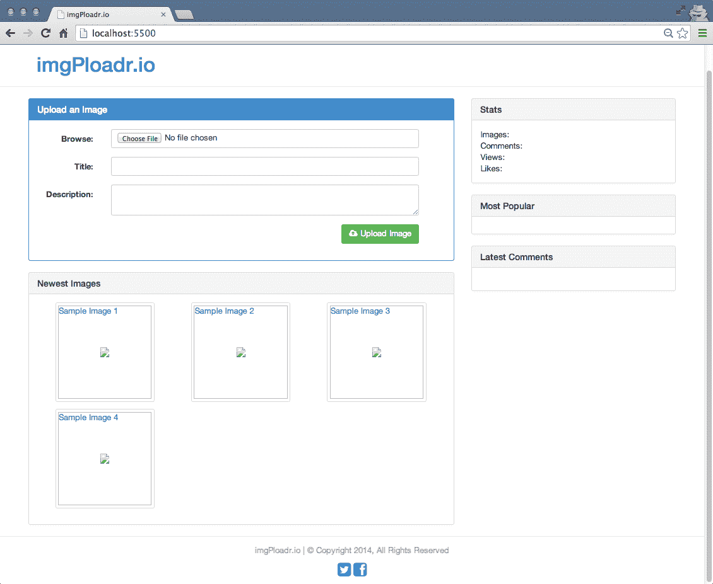
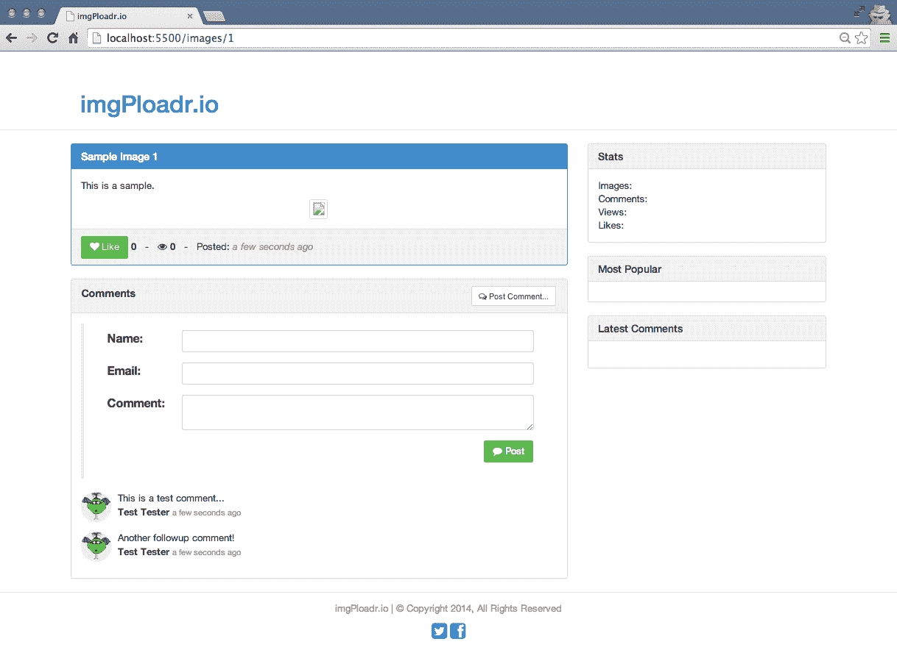

# 第六章：控制器和视图模型

直到目前为止，我们为应用程序编写的控制器非常基础。它们最初只是发送文本响应给客户端的简单任务。在前一章中，我们更新了控制器，使它们呈现 HTML 视图，并将 HTML 代码发送给客户端，而不是简单的文本响应。控制器的主要工作是作为一个实体，其中包含使所有必要决定以正确呈现响应给客户端的逻辑。在我们的情况下，这意味着检索和/或生成页面完全显示所需的数据。

在本章中，我们将讨论以下主题：

+   修改控制器，以便它们生成数据模型并将其传递给视图

+   包括支持上传和保存图像文件的逻辑

+   更新控制器以实际呈现动态 HTML

+   包括为生成网站统计数据的部分添加辅助程序

+   通过迭代 UI 来改进可用性，使用 jQuery

# 控制器

**控制器**可以被定义为一个实体，负责操作模型并使用从相应模型接收到的数据启动视图渲染过程。在我们迄今为止开发的代码中，我们可以看到 express 路由器实例被用来将函数绑定到相应的路由。这些函数就是控制器。

在我们的路由器中创建的每个路由，都需要以下两个参数：

+   第一个参数是路由本身的字符串，即`/images/:image_id`

+   第二个参数是在访问该路由时将执行的控制器函数

对于任何与图像有关的路由，我们依赖于图像控制器。同样，任何与主页有关的路由都依赖于主页控制器，依此类推。

我们在应用程序中定义控制器的步骤纯粹是组织性的，并基于个人偏好。我们将控制器创建为模块，以便我们的路由器不会成为一个冗长混乱的代码堆。我们本可以将所有逻辑直接包含在路由中的函数中，但这样会导致组织混乱，并且后期维护起来会非常难读。

由于我们的示例应用程序相当小，目前只有两个控制器：主页和图像。这些控制器的责任是为我们的 HTML 页面构建适当的视图模型，并实际呈现页面。任何需要执行每个页面并构建视图模型的逻辑都将通过我们的控制器完成。

# 视图模型

鉴于我们的应用程序中只有一个 HTML 视图，我们需要将数据附加到该页面，以便渲染的模板可以以这样的方式包含，即页面的动态区域被真实内容替换。为此，我们需要生成一个视图模型。在渲染过程中，模板引擎将解析模板本身，并寻找特殊的语法，指示特定部分应在运行时用视图模型中的值替换。我们在前一章中探索 Handlebars 模板框架时看到了这样的例子。可以将其视为 HTML 模板的一个花哨的运行时查找和替换--查找变量并用视图模型中存储的值替换它们。

这个过程发生在服务器端，结果只作为应用程序接收到的 HTTP 请求的响应发送。

视图模型通常只是一个可以传递给模板的 JavaScript 对象。模板包含了我们渲染页面所需的所有必要逻辑。模板引擎的任务是通过处理与相关模型关联的模板来生成相应的 HTML。页面的视图模型通常包含渲染该页面的特定内容部分所需的所有数据。以我们的应用程序为例，特定图片页面的视图模型可能包含图片的标题、描述、显示图片所需的信息，以及各种统计数据，如点赞数、浏览量和评论集合。视图模型可以简单也可以复杂。

这里使用术语视图模型来指代模型的数据形式，它将与模板绑定，通过任何模板框架呈现 HTML。

# 更新主页控制器

如果您看一下我们当前的主页控制器（`controllers/home.js`），您会发现`index`函数几乎没有任何代码：

```js
res.render('index');
```

我们想要做的第一件事是使用示例数据构建一个基本的视图模型，以便我们可以看到我们的视图模型在工作。用以下更新后的代码替换那个单独的`res.render`调用：

```js
const ViewModel = {
        images: [
            images: [{
                uniqueId: 1,
                title: 'Sample Image 1',
                description: '',
                filename: 'sample1.jpg',
                Views: 0,
                likes: 0,
                timestamp: Date.now()
            }, {
                uniqueId: 2,
                title: 'Sample Image 2',
                description: '',
                filename: 'sample2.jpg',
                Views: 0,
                likes: 0,
                timestamp: Date.now()
            }, {
                uniqueId: 3,
                title: 'Sample Image 3',
                description: '',
                filename: 'sample3.jpg',
                Views: 0,
                likes: 0,
                timestamp: Date.now()
            }, {
                uniqueId: 4,
                title: 'Sample Image 4',
                description: '',
                filename: 'sample4.jpg',
                Views: 0,
                likes: 0,
                timestamp: Date.now()
            }]
        };
res.render('index', ViewModel);
```

在上面的代码中，我们构建了一个基本的 JavaScript 对象集合。我们声明的常量称为`ViewModel`，但实际上这个常量的名称并不重要，可以是任何你想要的。`const ViewModel`是一个包含一个名为`images`的属性的对象，`images`本身是一个数组。

`images`数组包含四张示例图片，每张图片都有一些基本属性--最明显的属性是在决定我们想要每张图片的哪种信息时决定的。集合中的每张图片都有一个`uniqueId`、`title`、`description`、`filename`、`Views`、`likes count`和`timestamp`属性。

设置好我们的`ViewModel`后，我们只需将其作为`res.render`调用的第二个参数传递。在渲染`View`时这样做可以使其中的数据对`View`本身可用。现在，如果您回忆一下我们为主页`index.Handlebars`视图编写的一些模板代码，我们有一个`{{#each images}}`循环，遍历了传递给模板的视图模型的图片集合中的每张图片。再次查看我们创建的视图模型，我们看到它只有一个名为`images`的属性。Handlebars 循环内的 HTML 代码将明确引用`images`数组中每张图片的`uniqueId`、`filename`和`title`属性。

保存更改到主控制器，再次启动您的应用程序，并导航到[`localhost:3300`](http://localhost:3300)。您应该在最新图片部分看到现在出现在主页上的四张图片（尽管，正如您在下面的截图中所看到的，这些图片仍然是损坏的，因为我们实际上并没有创建任何图片文件）：



主页有一个相当简单的控制器和视图模型，您可能已经注意到侧边栏仍然完全空白。我们将在本章稍后讨论侧边栏。

# 更新图片控制器

让我们为图片页面创建控制器和视图模型。图片的控制器会更复杂一些，因为我们将编写处理通过主页表单上传和保存图片文件的逻辑。

# 显示图片

图片控制器中的`index`函数看起来几乎与主页控制器中的`index`函数相同。唯一的区别是，我们不是生成一个`images`数组，而是为单个图片构建一个`ViewModel`。然而，这个图片的`ViewModel`将比主页上的更详细，因为我们正在构建一个更详细的图片视图页面（而不是主页上的缩略图集合）。最值得注意的是图片的评论数组。

再次查看我们的`controllers/image.js`文件中原始的`index`函数，我们可以看到简单的现有`res.render`代码行：

```js
res.render('image');
```

我们希望用以下代码替换这行，使用一个`ViewModel`和一个更新后的`res.render`语句：

```js
const ViewModel = {
    image: {
        uniqueId: 1,
        title: 'Sample Image 1',
        description: 'This is a sample.',
        filename: 'sample1.jpg',
        Views: 0,
        likes: 0,
        timestamp: Date.now()
    },
    comments: [{
        image_id: 1,
        email: 'test@testing.com',
        name: 'Test Tester',
        gravatar: 'http://lorempixel.com/75/75/animals/1',
        comment: 'This is a test comment...',
        timestamp: Date.now()
    }, {
        image_id: 1,
        email: 'test@testing.com',
        name: 'Test Tester',
        gravatar: 'http://lorempixel.com/75/75/animals/2',
        comment: 'Another followup comment!',
        timestamp: Date.now()
    }]
};
res.render('image', ViewModel);
```

在这里，我们再次声明一个新的`ViewModel`常量--这次有一个包含单个图片属性的`image`属性。除了`image`属性之外，还有一个`comments`属性，它是一个`comment`对象的数组。你可以看到每个评论都有特定于每张图片的评论的各种属性。这个 JavaScript 对象实际上是我们的真实数据一旦包含了连接我们的应用程序到 MongoDB 的逻辑后最终会看起来的一个相当不错的预览。

在构建了我们的示例`image`对象及其评论集合之后，我们将其传递给我们的`res.render`调用，从而直接将这个新的`ViewModel`发送到我们图片的 Handlebars 模板。同样，如果你查看`image.Handlebars`文件中的 HTML 代码，你可以看到`ViewModel`的每个属性在哪里显示。

再次运行应用程序，确保我们的图片页面显示正常：

```js
$ node server.js
```

一旦应用程序运行并在浏览器中启动，点击主页上最新图片部分列出的任何一张图片。

这应该带你到一个单独的图片页面，你会看到类似以下截图所示的页面：



请注意，标题、描述、喜欢、浏览次数和时间戳（转换为用户可读的不同格式）现在都出现在页面上。此外，你还可以看到图片附近列出了一些评论！

# 上传图片

我们接下来需要在我们的图片控制器中实现的下一个功能是处理用户在主页上提交图片上传的逻辑。即使表单在我们应用的主页上，我们决定将处理上传的逻辑放在图片控制器中，因为从逻辑上讲，这是最合理的（因为这个功能主要与图片有关，而不是特定于主页）。这纯粹是个人决定，你可以将逻辑放在任何你喜欢的地方。

你应该注意到主页上表单的 HTML 的动作设置为`/images`，方法是`post`。这与我们之前设置的路由完全匹配，我们监听`/images`路由的`post`，并调用图片控制器的`create`函数。

我们的图片控制器中的`create`函数将有一些关键的责任：

+   它应该为图片生成一个唯一的文件名，这也将作为标识符

+   它应该将上传的文件保存到`文件系统`，并确保它是一个`图片`文件

+   最后，一旦任务完成，它应该将控制重定向到`image/image_id`路由，以显示实际的图片

由于我们将在这个函数中使用`文件系统`，我们需要包含一些来自 Node.js 核心模块的模块，特别是`文件系统`（fs）和`路径`（path）模块。

在我们开始为上传图片部分添加必要的代码之前，我们需要对应用程序的配置进行一些小修复。此外，我们还需要在配置文件中添加一个额外的模块来支持文件上传，即`multer`。使用以下命令将其作为应用程序的依赖项添加到我们的应用程序中：

```js
npm install multer --save
```

现在，转到配置文件`server/configure.js`并通过`require`引入它：

```js
multer = require('multer');
```

您可以将此放在文件中最初需要的模块下。然后，在 Handlebars 引擎方法下插入以下片段：

```js
app.use(multer({
    dest: path.join(__dirname, 'public/upload/temp')
}));
```

现在，我们的上传操作将正常工作，如预期的那样。

让我们首先编辑`controllers/image.js`文件，并在文件顶部插入两个新的 require 语句：

```js
const fs = require('fs'),
path = require('path');
```

接下来，获取`create`函数的原始代码：

```js
res.send('The image:create POST controller');
res.redirect('/images/1');
```

用以下代码替换原始代码：

```js
const saveImage = function() {
// to do...
};
saveImage();
```

在这里，我们创建了一个名为`saveImage`的函数，并在声明后立即执行它。这可能看起来有点奇怪，但原因将在下一章中实现数据库调用时变得清晰。主要原因是我们将重复调用`saveImage`，以确保我们生成的唯一标识符实际上是唯一的，并且在数据库中不存在作为先前保存的图像标识符。

让我们先来审查将插入`saveImage`函数中的代码的细分（替换`// to do...`注释）。我将为这个函数的每一行代码进行解释，然后在最后给出整个代码块：

```js
let possible = 'abcdefghijklmnopqrstuvwxyz0123456789',
imgUrl = '';
```

我们需要生成一个随机的六位字母数字字符串，以表示图像的唯一标识符。这个标识符将类似于其他提供唯一链接的网站（例如*bit.ly*）的短链接。为此，我们首先提供一个可能字符的字符串，用于生成随机字符串：

```js
for(let i=0; i < 6; i+=1) {
    imgUrl += possible.charAt(Math.floor(Math.random() *
possible.length));
}
```

然后，循环六次，并从可能字符的字符串中随机选择一个字符，在每个循环中将其附加。在这个`for`循环结束时，我们应该有一个由六个随机字母和/或数字组成的字符串，例如`a8bd73`：

```js
const tempPath = req.files.file.path,
ext = path.extname(req.files.file.name).toLowerCase(),
targetPath = path.resolve(`./public/upload/${imgUrl}${ ext}`);
```

在这里，我们声明了三个常量：我们上传的文件将被临时存储的位置，上传的文件的文件扩展名（例如`.png`，`.jpg`等），以及上传的图像应最终驻留的目的地。

对于后两个变量，我们将使用 path 节点模块，该模块在处理文件名和路径以及从文件中获取信息（例如文件扩展名）时非常有效。接下来，我们将把图像从临时上传路径移动到最终目的地：

```js
if (ext === '.png' || ext === '.jpg' || ext === '.jpeg' || ext ===
    '.gif') {
    fs.rename(tempPath, targetPath, (err) => {
        if (err) throw err;
        res.redirect(`/images/ ${imgUrl}`);
    });
} else {
    fs.unlink(tempPath, () => {
        if (err) throw err;
        res.json(500, { error: 'Only image files are allowed.' });
    });
}
```

前面的代码执行了一些验证。具体来说，它进行了检查，以确保上传的文件扩展名与允许的扩展名列表匹配，即已知的图像文件类型。如果上传了有效的图像文件，它将通过`filesystem`的`rename`函数从`temp`文件夹中移动。请注意，`filesystem`（fs）`rename`函数接受三个参数：原始文件，新文件和`callback`函数。

`callback`函数在`rename`完成后执行。如果节点不是这样工作的（总是依赖于`callback`函数），那么很可能您的代码将在`rename`函数执行后立即执行，并尝试针对尚不存在的文件进行操作（即`rename`函数甚至没有完成其工作）。使用`callback`函数，我们有效地告诉节点，一旦文件的`rename`完成并且文件准备好并放置在应该放置的位置，那么它可以执行`callback`函数中的代码。

随后的`else`条件处理了上传的文件无效的情况（即不是图像），因此我们调用 fs 模块的`unlink`函数，该函数将删除原始文件（从上传到的`temp`目录）然后发送一个简单的`JSON 500`带有错误消息。

这是完整的`saveImage`函数（再次，以下代码将替换之前的`// to do...`）：

```js
const possible = 'abcdefghijklmnopqrstuvwxyz0123456789',
    imgUrl = '';
for (let i = 0; i < 6; i += 1) {
    imgUrl += possible.charAt(Math.floor(Math.random() *
        possible.length));
}
const tempPath = req.files.file.path,
    ext = path.extname(req.files.file.name).toLowerCase(),
    targetPath = path.resolve(`./public/upload/${ imgUrl }${ ext }`);
if (ext === '.png' || ext === '.jpg' || ext === '.jpeg' || ext ===
    '.gif') {
    fs.rename(tempPath, targetPath, (err) => {
        if (err) throw err;
        res.redirect('/images/${ext}');
    });
} else {
    fs.unlink(tempPath, () => {
        if (err) throw err;
        res.json(500, { error: 'Only image files are allowed.' });
    });
}
```

有了这个新代码，我们现在可以通过主页上的表单成功上传图像文件。启动应用程序并在浏览器中打开它，然后尝试一下。在那里，点击主表单中的浏览按钮，然后从计算机中选择一个`image`文件。如果成功，该`image`文件应该存在于项目的`public/upload`文件夹中，并带有一个新的随机文件名。

确保您在项目中创建了`public/upload`文件夹，否则在尝试将文件写入不存在的位置时会出现运行时错误。根据您的操作系统和安全访问权限，可能需要在文件夹上设置写入权限。

上传表单完成并且`create`控制器函数完成其工作后，它将重定向您到已上传图像的个别图像页面。

# 可重用代码的辅助程序

到目前为止，我们渲染的每个页面都完美地显示它们的`ViewModel`数据，但是那个讨厌的侧边栏仍然是空白的。我们将通过将它们实现为辅助模块来解决这个问题，为侧边栏内容创建一些模块。这些辅助模块将被我们应用程序的各个部分重复使用，并不一定属于`controller`文件夹或`server`文件夹。因此，我们将创建一个名为`helpers`的新主目录，并将这些模块存储在那里。

由于我们只是将临时装置数据加载到我们的`ViewModels`中，一旦我们实现 MongoDB，我们在`helpers`和`controllers`中设置的数据都将被实际的实时数据替换；我们将在下一章中实现这一点。

# 侧边栏模块

首先，我们将为整个侧边栏创建一个模块。这个模块将负责调用多个其他模块来填充每个侧边栏部分的`ViewModel`。由于我们将为每个页面的自己的`ViewModel`填充特定于侧边栏的数据，因此侧边栏模块的函数将接受原始的`ViewModel`作为参数。这样我们就可以为每个页面的现有`ViewModel`附加数据。

在这里，我们将附加一个侧边栏属性（这是一个 JavaScript 对象），其中包含侧边栏各个部分的属性。

首先创建一个名为`helpers/sidebar.js`的文件，并插入以下代码：

```js
const Stats = require('./stats'),
    Images = require('./images'),
    Comments = require('./comments');
module.exports = (ViewModel, callback) => {
    ViewModel.sidebar = {
        stats: Stats(),
        popular: Images.popular(),
        comments: Comments.newest()
    };
    callback(ViewModel);
};
```

在前面的代码中，您可以看到您首先需要为侧边栏的每个部分创建一个模块。显示侧边栏的任何给定页面的现有`ViewModel`是函数的第一个参数。我们向`ViewModel`添加了一个侧边栏属性，并通过调用每个侧边栏部分的模块为每个属性设置了值。最后，我们执行了作为侧边栏模块的第二个参数传递的`callback`。这个`callback`是一个匿名函数，我们将用它来执行 HTML 页面的渲染。

让我们更新主页和图像控制器，包括调用侧边栏模块，并将每个页面的 HTML 模板的渲染推迟到侧边栏模块的`callback`中。

编辑`controllers/home.js`，考虑以下代码行：

```js
res.render('index', ViewModel);
```

用这个新的代码块替换它：

```js
sidebar(ViewModel, (ViewModel) => {
    res.render('index', ViewModel);
});
```

对`controllers/image.js`文件进行完全相同的更改，将`index`替换为`image`：

```js
sidebar(ViewModel, (ViewModel) => {
    res.render('image', ViewModel);
});
```

再次注意，我们执行了侧边栏模块，并将现有的`ViewModel`作为第一个参数传递，并将一个基本的匿名函数作为第二个参数的`callback`。我们等待渲染 HTML 视图，直到`sidebar`完成填充`ViewModel`。这是因为 Node.js 的异步特性。假设我们以以下方式编写代码：

```js
sidebar(ViewModel);
res.render('index', ViewModel);
```

在这里，很可能`res.render`语句会在`sidebar`甚至完成任何工作之前执行。一旦我们在下一章中引入 MongoDB，这将变得非常重要。另外，由于我们现在在每个控制器中使用`sidebar`模块，请确保在两个控制器的顶部`require`它，包括以下代码：

```js
const sidebar = require('../helpers/sidebar');
```

现在我们的“侧边栏”模块已经完成，并且从两个控制器中调用，让我们通过创建所需的每个子模块来完成“侧边栏”。

# 统计模块

统计模块将显示有关我们应用程序的一些随机统计信息。具体来说，它将显示整个网站的“图片”、“评论”、“浏览量”和“喜欢”总数。

创建`helpers/stats.js`文件，并插入以下代码：

```js
module.exports = () => {
    const stats = {
        images: 0,
        comments: 0,
        Views: 0,
        likes: 0
    };
    return stats;
};
```

这个模块非常基础，它所做的就是创建一个标准的 JavaScript 对象，其中包含一些属性用于各种统计信息，每个属性最初都设置为 0。

# 图片模块

“图片”模块负责返回各种图片集合。最初，我们将创建一个“热门”函数，用于返回网站上最受欢迎的图片集合。最初，这个集合将只是一个包含示例固定数据的“图片”对象数组。

创建`helpers/images.js`文件，并插入以下代码：

```js
module.exports = {
    popular() {
        let images = [{
                uniqueId: 1,
                title: 'Sample Image 1',
                description: '',
                filename: 'sample1.jpg',
                Views: 0,
                likes: 0,
                timestamp: Date.now()
            },
            {
                uniqueId: 2,
                title: 'Sample Image 2',
                description: '',
                filename: 'sample2.jpg',
                Views: 0,
                likes: 0,
                timestamp: Date.now()
            },
            {
                uniqueId: 3,
                title: 'Sample Image 3',
                description: '',
                filename: 'sample3.jpg',
                Views: 0,
                likes: 0,
                timestamp: Date.now()
            },
            {
                uniqueId: 4,
                title: 'Sample Image 4',
                description: '',
                filename: 'sample4.jpg',
                Views: 0,
                likes: 0,
                timestamp: Date.now()
            }
        ];
        return images;
    }
};
```

# 评论模块

与图片的“辅助”模块类似，“评论”模块将返回最新发布到网站的评论集合。一个特别感兴趣的想法是每条评论也附有一张图片，这样在显示评论列表时可以显示每条评论的实际图片作为缩略图（否则，当我们看到一系列没有相关图片的评论时，我们会失去上下文）。

创建`helpers/comments.js`文件，并插入以下代码：

```js
module.exports = {
    newest() {
        let comments = [{
            image_id: 1,
            email: 'test@testing.com',
            name: 'Test Tester',
            gravatar: 'http://lorempixel.com/75/75/animals/1',
            comment: 'This is a test comment...',
            timestamp: Date.now(),
            image: {
                uniqueId: 1,
                title: 'Sample Image 1',
                description: '',
                filename: 'sample1.jpg',
                Views: 0,
                likes: 0,
                timestamp: Date.now
            }
        }, {
            image_id: 1,
            email: 'test@testing.com',
            name: Test Tester ',
            gravatar: 'http://lorempixel.com/75/75/animals/2',
            comment: 'Another followup comment!',
            timestamp: Date.now(),
            image: {
                uniqueId: 1,
                title: 'Sample Image 1',
                description: '',
                filename: 'sample1.jpg',
                Views: 0,
                likes: 0,
                timestamp: Date.now
            }
        }];
        return comments;
    }
};
```

同样，这只是一个基本的 JavaScript 对象数组，每个评论都有一些属性，其中之一是实际图片及其属性（“图片”属性应该看起来很熟悉，因为它与图片的“辅助”模块中的项目相同）。

# 测试侧边栏实现

现在我们的“侧边栏”模块已经完成，以及它的依赖子模块“统计”、“图片”和“评论”，是时候再次测试我们的应用程序了。启动节点服务器，并在浏览器中打开应用程序。

您现在应该在主页和图片着陆页上看到带有内容的“侧边栏”。

# 对 UI 进行迭代

现在我们的应用程序运行得相当不错，实际上可以与之交互，是时候退后一步，看看我们可能改进的一些方面了。

一个领域是图片页面上的发表评论表单。我认为这个表单总是可见并不是必要的，而是应该只在有人想要发表评论时才可用。

此外，我希望“喜欢”按钮不必向服务器提交完整的表单并导致整个页面重新加载（就像主页上上传图片时的表单一样）。我们将使用 jQuery 向服务器提交 AJAX 调用来处理喜欢，并实时发送和检索数据，而无需重新加载页面。

为了进行这些调整，我们需要在页面上引入少量 JavaScript 以增加一些交互性。为了使事情变得更容易，我们将使用流行的 jQuery JavaScript 库来轻松创建交互功能。

jQuery 已经存在多年，并在前端开发中爆炸性流行。它允许您非常轻松地操纵**文档对象模型**（**DOM**），即任何页面的 HTML 结构，您将在下一节中看到。您可以在[`jquery.com`](http://jquery.com)了解更多关于 jQuery 的信息。

您可能没有注意到，在为`main.Handlebars`布局文件提供的 HTML 代码中，已经包含了作为外部`script`标签的 jQuery（引用托管在 CDN 上的 jQuery）。此外，还包括了一个本地的`scripts.js`标签，我们将在其中放置我们自定义的 jQuery JavaScript 代码，用于对 UI 进行的更改。当您查看`main.Handlebars`的最底部时，您可以看到以下代码：

```js
<script src="img/jquery.min.js"></script>
<script type="text/javascript" src="img/scripts.js"></script>
```

第一个脚本标签指向谷歌的**内容交付网络**（**CDN**），这意味着我们不必担心将该文件与我们的代码一起托管。然而，第二个文件是我们自己的文件，因此我们需要确保它存在。

CDN 是一种从全球分布的缓存服务器网络中传递文件的方法。一般来说，这意味着通过区域性更近的下载源以及改进的缓存，网页访问者经常下载的文件（如 jQuery）可以更快地加载。如果多个网站使用相同的 CDN URL 来托管 jQuery，例如，那么有理由认为访问您网站的访问者在访问以前的不相关网站时可能已经下载了 jQuery。因此，您的网站将加载得更快。

创建`public/js/scripts.js`文件，并插入以下代码：

```js
$(function(){
// to do...
});
```

这是一个标准的代码块，几乎每次有人使用 jQuery 时都会看到。这段代码执行了一个匿名函数，该函数位于`$()` jQuery 包装器内，这是写下面代码的简写：

```js
$(document).ready(function(){
// to do...
});
```

前面的代码基本上意味着`callback`函数将在页面完全加载和准备好之前等待执行。这很重要，因为我们不希望将 UI 事件处理程序和/或效果应用于实际上尚不存在的 DOM 元素，因为页面仍在加载。这也是为什么`main.Handlebars`布局文件中的脚本标签是页面的最后一行的另一个原因；这样它们就是最后加载的，确保文档已经完全下载并准备好被操作。

首先，让我们解决`post-comment`功能。我们希望默认隐藏评论表单，然后仅在用户点击图像下的“发布评论”按钮时显示它（在“喜欢”按钮右侧）。在`callback`函数中插入以下代码，该函数存在`// to do...`注释处：

```js
$('#post-comment').hide();
$('#btn-comment').on('click', function(event) {
    event.preventDefault();
    $('#post-comment').show();
});
```

第一行代码在具有`post-comment` ID 的 HTML div 上执行`hide`函数。然后，我们立即在具有`btn-comment` ID 的 HTML 按钮上应用事件处理程序。我们应用的事件处理程序是`onClick`，因为我们希望它在用户点击该按钮时执行我们提供的匿名函数。该函数简单地阻止默认行为（特定元素的默认行为；在本例中是按钮）然后调用显示 jQuery 函数，该函数显示先前隐藏的`post-comment` div。`event.preventDefault()`部分很重要，因为如果我们不包括它，点击按钮的操作将执行浏览器期望执行的操作，并尝试同时执行我们的自定义 JavaScript 函数。如果我们不包括这个，很可能我们的 UI 会表现得不太理想。一个很好的例子是，如果您想要覆盖标准 HTML 链接的默认行为，您可以分配一个`onClick`事件处理程序并做任何您想做的事情。但是，如果您不执行`event.preventDefault()`，浏览器将发送用户到该链接的 HREF，而不管您的代码试图做什么。

现在，让我们添加一些代码来处理“喜欢”按钮的功能。我们将为按钮添加一个事件处理程序，方式与我们为“发布评论”按钮做的方式相同，使用 jQuery 的`.on`函数。在您之前添加的代码之后，将以下附加代码块插入`ready`语句内：

```js
$('#btn-like').on('click', function(event) {
    event.preventDefault();
    let imgId = $(this).data('id');
    $.post('/images/' + imgId + '/like').done(function(data) {
        $('.likes-count').text(data.likes);
    });
});
```

前面的代码将一个`onClick`事件处理程序附加到`btn-like`按钮。事件处理程序首先从“喜欢”按钮中检索`data('id')`属性（通过`image.Handlebars` HTML 模板代码和`ViewModel`分配），然后执行 jQuery AJAX post 到`/images/:image_id/like`路由。回想一下我们 Node `server/routes.js`文件中的以下行：

```js
app.post('/images/:image_id/like', image.like);
```

一旦完成了该 AJAX 调用，将执行另一个匿名的“回调”函数，该函数将更改具有`likes-count`类的 HTML 元素的文本，并用从 AJAX 调用返回的数据替换它--在这种情况下，喜欢的总数已更新（通常情况下，它将是之前的总数加一）。

为了测试这个功能，我们需要在`image`控制器的`like`函数中实现一些固定数据。编辑`controllers/image.js`，在`like`函数内，用以下代码替换现有的`res.send`函数调用：

```js
like(req, res) {
    res.json({ likes: 1 });
},
```

所有这段代码做的就是向客户端返回 JSON，其中包含一个带有值为`1`的 likes 属性的简单对象。在下一章中，当我们向应用程序引入 MongoDB 时，我们将更新此代码，以实际增加喜欢的数量并返回所喜欢的图像的真实值。

经过所有这些变化，您应该能够重新启动节点服务器并在浏览器中打开网站。单击主页上的任何图像以查看图像页面，然后单击“喜欢”按钮，以将其从`0`更改为`1`。不要忘记查看新的“发布评论”按钮；单击此按钮应该会显示评论表单。

# 总结

在本章的开始，我们有一些基本的 HTML 页面通过我们的应用程序显示在浏览器中，但它们没有任何内容和逻辑。我们实现了每个控制器的逻辑，并讨论了 ViewModel 以及如何填充页面内容。

除了通过 ViewModel 在我们的页面上显示内容之外，我们还实现了处理上传和保存图像文件到本地文件系统的代码。

我们稍微调整了 UI，使用 jQuery 包含了一些微妙的增强功能，通过显示评论表单，并使用 AJAX 来跟踪喜欢，而不是依赖完整的页面回发。

现在，我们已经为我们的 ViewModels 和 controllers 奠定了基础，让我们使用 MongoDB 将它们全部联系在一起，并开始使用真实数据。在下一章中，我们将再次更新 controllers，这次实现从 MongoDB 服务器读取和保存数据的逻辑。
