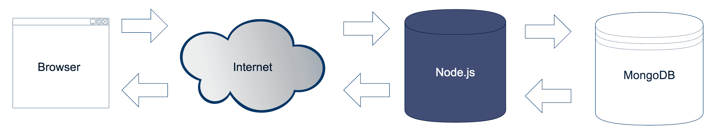
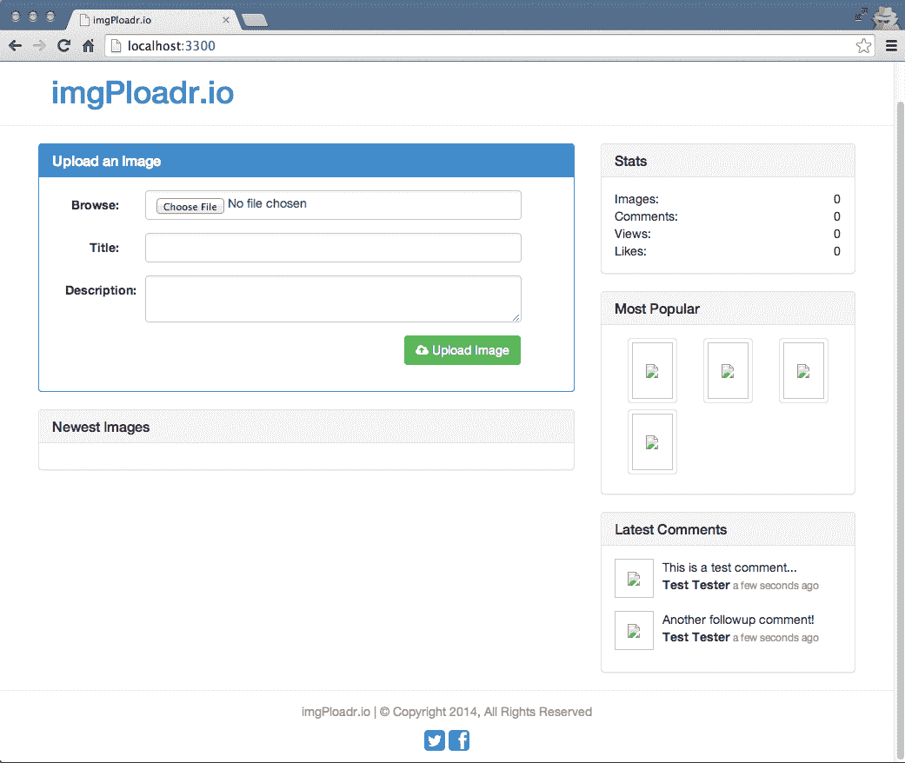
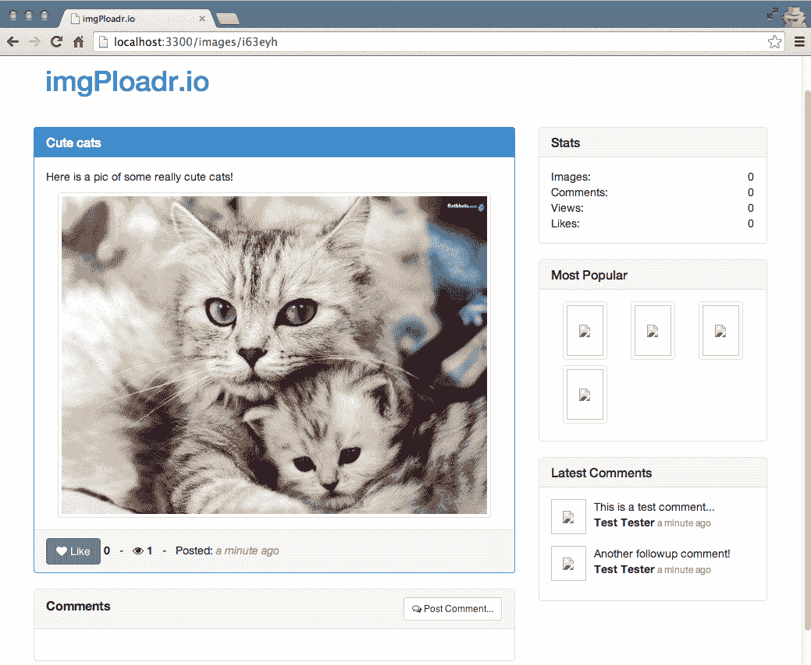
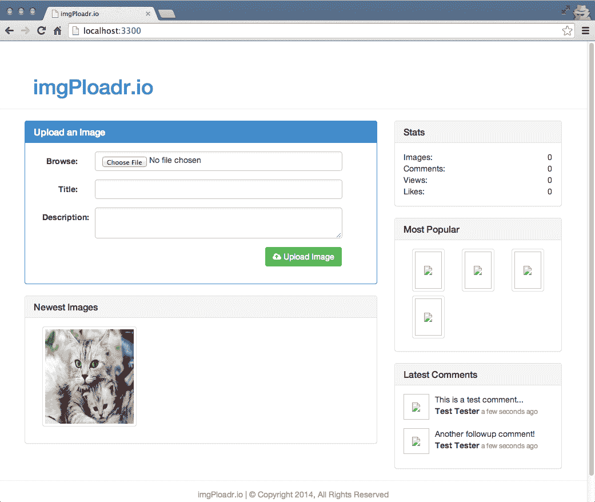
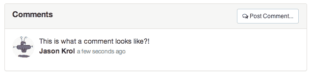

# 第七章：使用 MongoDB 持久化数据

几乎现在为 Web 编写的任何应用程序，如果其用户之间的交互不是永久保存的话，那么高度交互式的应用程序的价值就会受到限制。您必须将您的应用程序与适当的数据库集成以解决这个问题。想象一种情况，您的应用程序的所有数据（注册用户、订单交易和社交互动）都存储在服务器的临时内存中。一旦服务器关闭或重新启动，您的应用程序数据将全部丢失。依赖数据库永久存储这些数据对于任何动态应用程序都至关重要。

在本章中，将涵盖以下主题：

+   连接到 MongoDB

+   Mongoose 简介

+   模式和模型

+   在我们的控制器中添加 CRUD

在上一章中，我们编写并考虑了我们应用程序的实际逻辑。构建我们应用程序的下一步是将其连接到数据库，以便我们用户的交互和数据可以被永久保存和检索。从技术上讲，我们可以通过将数据存储在内存中来解决这个问题，但是一旦我们的 Web 服务器重新启动或崩溃，所有这些数据都将丢失。如果没有将我们的应用程序连接到数据库服务器以持久保存数据，访问者交互的每个输入都将过时。如果没有某种数据库服务器来存储我们的数据，我们每天与之交互的大多数网站甚至都不会存在。

以下是我们的数据将如何在我们的应用程序中为每个访问者交互持久化的一般分解：



考虑前面的图表，它反映了 Web 应用程序请求的典型生命周期：

1.  一个访问者通过他们的网络浏览器提交请求来查看我们应用程序上的页面。

1.  Node.js 服务器接收到这个请求并查询 MongoDB 服务器是否有任何数据。

1.  MongoDB 服务器将查询到的数据返回给我们的 Node.js 服务器。

1.  Node.js 服务器获取数据，将其构建成视图模型，然后将渲染后的 HTML 页面发送回浏览器。

1.  网络浏览器接收到来自我们 Node.js 服务器的响应并渲染 HTML。

1.  这个循环通常会为每个访问者的每次交互重复。

为了本书的目的，我们使用 MongoDB 作为我们的主要数据存储，但现实情况是我们可以使用以下任何一种来存储数据：MySQL，PostgreSQL，MS SQL，文件系统等等。

# 使用 Node.js 与 MongoDB

在我们正式将 MongoDB 实现到我们的实际应用程序之前，让我们先看一些从 Node.js 内部连接到 MongoDB 服务器的基本示例。

创建一个新的项目文件夹来存储一些样本代码进行实验。我会把我的文件夹称为`mongotest`。在这个文件夹里，创建一个名为`test.js`的新文件。在这个文件中，我们将玩一些代码来测试如何连接到 MongoDB，以及如何插入和检索一些数据。从 Node.js 连接到 MongoDB 服务器的第一件事是要求一个`mongodb`模块。

为了开始，切换到新的`mongotest`文件夹并使用`npm`安装`mongodb`模块：

```js
    $ cd mongotest
    $ npm install mongodb
```

不要被模块的名称所困惑。`mongodb` npm 模块并不是 MongoDB 本身，而是一个第三方 npm 模块，可以方便地从 Node.js 内部与 MongoDB 服务器通信。此外，因为这只是一个用于实验的示例项目，所以我们不需要在`npm install`中使用`--save`标志，因为我们不维护`package.json`文件。

# 连接到 MongoDB

现在`mongodb`模块已经安装，我们可以在我们的实验文件中使用它。启动你的编辑器，创建一个名为`test.js`的文件。将以下代码块插入其中：

```js
const MongoClient = require('mongodb').MongoClient;

MongoClient.connect('mongodb://localhost:27017/mongotest',
  (err, db)=>{
      console.log('Connected to MongoDB!');
      db.close();
  });
```

执行上述代码应该在你的屏幕上记录“Connected to MongoDB!”。

您首先注意到的是我们需要`mongodb`模块，但我们特别使用模块的`MongoClient`组件。该组件是我们实际用于主动打开与 MongoDB 服务器的连接的接口。使用`MongoClient`，我们将`mongodb://localhost:27017/mongotest`字符串 URL 作为第一个参数传递给我们的本地服务器。请注意，URL 中的路径指向服务器，然后是数据库本身的名称。

请确保在本章节的持续时间内在另一个终端中运行本地的 MongoDB 服务器实例。为此，打开一个命令行终端窗口并执行`$ mongod`。您的服务器应该启动并在屏幕上记录信息，最后显示`[initandlisten] waiting for connections on port 27017`。

您可能会发现当运行应用程序时，您会收到类似以下代码的堆栈跟踪错误：

`events.js:72`

`thrower; // Unhandled 'error' event`

错误：无法连接到[localhost:27017]。如果发生这种情况，您应该意识到它无法连接到端口 27017 上的`localhost`，这是我们本地`mongod`服务器运行的端口。

一旦我们与数据库服务器建立了活动连接，就好像我们在运行 Mongo shell 命令一样。MongoClient 回调函数返回一个数据库连接对象（我们在代码中命名为`db`，但可以命名为任何东西），这与我们在 Mongo shell 中使用的对象完全相同，当我们执行`use <databasename>`时。知道这一点，此时我们可以使用`db`对象做任何我们可以通过 Mongo shell 做的事情。语法略有不同，但思想基本相同。

# 插入文档

让我们通过向集合插入记录来测试我们的新`db`对象：

```js
const MongoClient = require('mongodb').MongoClient;

MongoClient.connect('mongodb://localhost:27017/mongotest', (err, db)=>{
    console.log('Connected to MongoDB!');

    var collection = db.collection('testing');
    collection.insert({'title': 'Snowcrash'}, (err, docs)=>{
        /**
        * on successful insertion, log to the screen
        * the new collection's details: 
        **/
        console.log(`${docs.ops.length} records inserted.`);
        console.log(`${docs.ops[0]._id} - ${docs.ops[0].title}`);

        db.close();

    });
});
```

在前面的代码中，我们建立了与数据库的连接，并在连接完成后执行了一个“回调”。该“回调”接收两个参数，第二个参数是`db`对象本身。使用`db`对象，我们可以获取我们想要使用的集合。在这种情况下，我们将该集合保存为一个变量，以便在代码的其余部分更容易地使用它。使用`collection`变量，我们执行一个简单的`insert`命令，并将要插入到数据库中的 JSON 对象作为第一个参数传递。

“回调”函数在`insert`接受两个参数后执行，第二个参数是受命令影响的文档数组；在这种情况下，它是我们插入的文档数组。一旦`insert`完成并且我们在“回调”函数内部，我们记录一些数据。您可以看到`docs.ops`数组的长度为 1，因为我们只插入了一个文档。此外，您可以看到数组中的单个文档是我们插入的文档，尽管现在它有一个额外的`_id`字段，因为 MongoDB 会自动处理。

# 检索文档

通过将`findOne`函数调用添加到刚刚插入的文档中，让我们稍微证明一下我们的代码。将`test.js`中的代码更改为以下示例：

```js
const MongoClient = require('mongodb').MongoClient;

MongoClient.connect('mongodb://localhost:27017/mongotest', (err, db)=>{
    console.log('Connected to MongoDB!');

    var collection = db.collection('testing');
    collection.insert({'title': 'Snowcrash'}, (err, docs)=>{
        console.log(`${docs.ops.length} records inserted.`);
        console.log(`${docs.ops[0]._id} - ${docs.ops[0].title}`);

        collection.findOne({title: 'Snowcrash'}, (err, doc)=>{
            console.log(`${doc._id} - ${doc.title}`);
            db.close();
        });
    });
});
```

在这段代码中，我们以与之前完全相同的方式插入记录；只是这一次，

我们对`title`执行`findOne`。`findOne`函数接受一个要匹配的 JSON 对象（这可以是您想要的精确或宽松）作为其第一个参数。在`findOne`之后执行的“回调”函数将包含找到的单个文档作为其第二个参数。如果我们执行了`find`操作，我们将根据搜索条件收到一组匹配的文档。

上述代码的输出应该是：

```js
    $ node test.js
    Connected to MongoDB!
    1 record inserted.
    538bc3c1a39448868f7013b4 - Snowcrash
    538bc3c1a39448868f7013b4 - Snowcrash
```

在你的输出中，你可能会注意到`insert`报告的`_id`参数与`findOne`中的不匹配。这很可能是多次运行代码的结果，导致插入了多个具有相同标题的记录。`findOne`函数将返回第一个找到的文档，没有特定的顺序，所以返回的文档可能不是最后一个插入的。

现在你已经基本了解了如何轻松地从 Node.js 连接和与 MongoDB 服务器通信，让我们来看看如何以一种不那么原始的方式来使用 MongoDB。

# 介绍 Mongoose

虽然直接使用`mongodb`模块很好，但它也有点原始，并且缺乏我们在使用 Express 等框架时所期望的开发者友好性。**Mongoose**是一个很棒的第三方框架，使得与 MongoDB 的工作变得轻而易举。它是 Node.js 的优雅的`mongodb`对象建模。

基本上，这意味着 Mongoose 赋予我们组织数据库的能力，使用模式（也称为模型定义），并为我们的模型提供强大的功能，如验证、虚拟属性等。Mongoose 是一个很棒的工具，因为它使得在 MongoDB 中处理集合和文档变得更加优雅。Mongoose 的原始`mongodb`模块是 Mongoose 的一个依赖，因此你可以将 Mongoose 看作是`mongodb`的一个包装器，就像 Express 是 Node.js 的一个包装器一样——两者都抽象了很多原始的感觉，并为你提供了更容易直接使用的工具。

需要注意的是，Mongoose 仍然是 MongoDB，所以你熟悉和习惯的一切都基本上是一样的；只是语法会稍微改变。这意味着我们从 MongoDB 中熟悉和喜爱的查询、插入和更新在 Mongoose 中也可以完美地工作。

我们需要做的第一件事是安装 Mongoose，以便在我们的`mongotest`项目中使用：

```js
    $ npm install mongoose
```

安装完成后，让我们来看一下 Mongoose 提供的一些功能，我们将利用这些功能来简化开发依赖于 MongoDB 数据库的应用程序时的工作。

# 模式

在 Mongoose 中，模式是我们用来定义模型的。将模式想象成用于创建模型的蓝图。使用模式，你可以定义比 MongoDB 模型的简单蓝图更多的内容。你还可以利用 Mongoose 默认提供的内置验证，添加静态方法、虚拟属性等。

在为模型定义模式时，我们首先要做的是构建我们认为对于特定文档我们将需要的每个字段的列表。字段由类型定义，并且你所期望的标准数据类型都是可用的，还有一些其他的：

+   *String*：这种类型存储字符串值。

+   *Number*：这种类型存储一个数字值，并带有限制。

+   *Date*：这种类型保存了一个`date`和`time`对象。

+   *Buffer*：这种类型提供了二进制数据的存储。例如，它可以包括图像或任何其他文件。

+   *Boolean*：这种类型用于存储布尔（true/false）值。

+   *Mixed*：这基本上是一个可以包含任何内容的非结构化对象。在存储 JSON 类型数据或任意数据时要考虑这一点。

可以是任何 JSON 表示。它不需要预定义。

+   *ObjectID*：当你想要在字段中存储另一个文档的 ObjectID 时，通常会使用这个。例如，在定义关系时。

+   *Array*：这是其他模式（模型）的集合。

这是一个基本的 Mongoose 模式定义的例子：

```js
const mongoose = require('mongoose'),
    Schema = mongoose.Schema;

var Account = new Schema({
    username: { type: String },
    date_created: { type: Date, default: Date.now },
    visits: { type: Number, default: 0 },
    active: { type: Boolean, default: false }
}); 
```

在这里，我们为 `Account` 集合定义了模式。我们首先 `require` Mongoose，然后在我们的模块中使用 `mongoose.Schema` 定义了一个 `Schema` 对象。我们通过创建一个新的 `Schema` 实例来定义模式，构造函数对象定义了模式。定义中的每个字段都是一个基本的 JavaScript 对象，具有其类型，然后是一个可选的默认值。

# 模型

在 Mongoose 中，模型是可以实例化的类（由模式定义）。

使用模式，我们定义 `models`，然后将它们用作常规 JavaScript 对象。

好处是 `model` 对象有额外的优势，即由 Mongoose 支持，因此还包括保存、查找、创建和删除等功能。让我们来看看如何使用模式定义模型，然后实例化模型并使用它。在您的实验文件夹 `mongotest/test2.js` 中添加另一个文件 `test2.js`，并在其中包含以下代码块：

```js
const mongoose = require('mongoose'),
    Schema = mongoose.Schema;

mongoose.connect('mongodb://localhost:27017/mongotest');
mongoose.connection.on('open', function() {
    console.log('Mongoose connected.');
});

var Account = new Schema({
    username: { type: String },
    date_created: { type: Date, default: Date.now },
    visits: { type: Number, default: 0 },
    active: { type: Boolean, default: false }
});

var AccountModel = mongoose.model('Account', Account);
var newUser = new AccountModel({ username: 'randomUser' });
console.log(newUser.username);
console.log(newUser.date_created);
console.log(newUser.visits);
console.log(newUser.active);
```

运行上述代码应该会得到类似以下的结果：

```js
    $ node test2.js
    randomUser
    Mon Jun 02 2014 13:23:28 GMT-0400 (EDT)
    0
    false
```

当您使用新文档并且想要创建一个新实例、填充其值，然后将其保存到数据库时，创建新模型是很好的：

```js
var AccountModel = mongoose.model('Account', Account);
var newUser = new AccountModel({
    username: 'randomUser'
});
newUser.save();
```

在 `mongoose` 模型上调用 `.save` 将触发对 MongoDB 的命令

将执行必要的 `insert` 或 `update` 语句来更新服务器。当您切换到 mongo shell 时，您会看到新用户确实已保存到数据库中：

```js
> use mongotest
switched to db mongotest
> db.accounts.find()
{ "username" : "randomUser", "_id" : ObjectId("538cb4cafa7c430000070f66"), "active" : false, "visits" : 0, 
"date_created" : ISODate("2014-06-02T17:30:50.330Z"), "__v" : 0 }
```

在模型上不调用 `.save()`，模型的更改实际上不会持久保存到数据库中。在您的 Node 代码中使用 Mongoose 模型就是这样——代码。您必须在模型上执行 MongoDB 函数，才能与数据库服务器进行任何实际的通信。

您可以使用 `AccountModel` 执行 `find` 操作，并根据一些检索条件返回一组 `AccountModel` 对象，这些条件从 MongoDB 数据库中检索结果。

```js
// assuming our collection has the following 4 records: 
// { username: 'randomUser1', age: 21 } 
// { username: 'randomUser2', age: 25 } 
// { username: 'randomUser3', age: 18 } 
// { username: 'randomUser4', age: 32 } 

AccountModel.find({ age: { $gt: 18, $lt: 30 } }, function(err, accounts) {
    console.log(accounts.length); // => 2 
    console.log(accounts[0].username); // => randomUser1 
    mongoose.connection.close();
});
```

在这里，我们使用标准的 MongoDB 命令 `$gt` 和 `$lt` 来传递查询参数以查找文档（也就是查找年龄在 18 到 30 之间的文档）。`find` 执行后的回调函数引用了一个 `accounts` 数组，这是从 MongoDB 查询返回的 `AccountModel` 对象的集合。作为良好的管理方式，我们在完成后关闭了与 MongoDB 服务器的连接。

# 内置验证

Mongoose 的核心概念之一是它在顶部强制执行模式

无模式设计，例如 MongoDB。这样做，我们获得了许多新功能，包括内置验证。默认情况下，每个模式类型都有一个内置的必需验证器。此外，数字有 `min` 和 `max` 验证器，字符串有枚举和匹配验证器。还可以通过模式定义自定义验证器。让我们简要看一下我们之前示例中添加的一些验证：

```js
var Account = new Schema({
    username: { type: String, required: true },
    date_created: { type: Date, default: Date.now },
    visits: { type: Number, default: 0 },
    active: { type: Boolean, default: false },
    age: { type: Number, required: true, min: 13, max: 120 }
}); 
```

我们在模式中添加的验证是 `username` 参数现在是必需的，并且我们包含了一个名为 `age` 的新字段，它是一个必须在 `13` 到 `120`（年）之间的数字。如果任一值不符合验证要求（即 `username` 为空或 `age` 小于 `13` 或大于 `120`），则会抛出错误。

每当调用模型的 `.save()` 函数时，验证将自动触发；但是，您还可以通过调用模型的 `.validate()` 函数并使用 `callback` 手动验证来处理响应。在上面的示例基础上，添加以下代码，将从定义的模式创建一个新的 `mongoose` 模型：

```js
var AccountModel = mongoose.model('Account', Account);
var newUser = new AccountModel({ username: 'randomUser', age: 11 });
newUser.validate(function(err) {
    console.log(err);
});
// the same error would occur if we executed: 
// newUser.save(); 
```

运行上述代码应该会将以下错误记录到屏幕上：

```js
{
 message: 'Validation failed',
 name: 'ValidationError',
 errors: {
 age: {
 message: 'Path '
 age ' (11) is less than minimum allowed value (13).', 
 name: 'ValidatorError',
 path: 'age',
 type: 'min',
 value: 11
 }
 }
} 
```

您可以看到从 `validate` 返回的 `error` 对象非常有用，并提供了大量信息，可以在验证模型并将错误消息返回给用户时提供帮助。

验证是为什么在 Node 中始终接受`error`对象作为任何`callback`函数的第一个参数是非常重要的一个很好的例子。同样重要的是，您检查`error`对象并适当处理它。

# 静态方法

`Schema`足够灵活，以便您可以轻松地向其添加自定义的静态方法，然后这些方法将对由该`Schema`定义的所有模型可用。静态方法非常适合添加您知道您将要在大多数模型中使用的辅助工具和函数。让我们从之前的简单年龄查询中重构它，使其成为一个静态方法并且更加灵活：

```js
var Account = new Schema({
    username: { type: String },
    date_created: { type: Date, default: Date.now },
    visits: { type: Number, default: 0 },
    active: { type: Boolean, default: false },
    age: { type: Number, required: true, min: 13, max: 120 }
});

Account.statics.findByAgeRange = function(min, max, callback) {
    this.find({ age: { $gt: min, $lte: max } }, callback);
};

var AccountModel = mongoose.model('Account', Account);

AccountModel.findByAgeRange(18, 30, function(err, accounts) {
    console.log(accounts.length); // => 2 
});
```

静态方法非常容易实现，一旦您开始充分利用它们，它们将使您的模型更加强大！

# 虚拟属性

虚拟属性就是它们听起来的样子——虚假的属性，实际上并不存在于您的 MongoDB 文档中，但您可以通过组合其他真实属性来伪造它们。最明显的虚拟属性的例子是`fullname`字段，当只有`firstname`和`lastname`是 MongoDB 集合中的实际字段时。对于`fullname`，您只需返回模型的名字和姓氏组合成一个字符串，并将其标记为`fullname`：

```js
// assuming the Account schema has firstname and lastname defined: 

Account.virtual('fullname')
    .get(function() {
        return this.firstname + ' ' + this.lastname;
    })
    .set(function(fullname) {
        var parts = fullname.split(' ');
        this.firstname = parts[0];
        this.lastname = parts[1];
    });
```

我们调用`.get()`和`.set()`函数。虽然不需要同时提供两者，但这是相当常见的。

在这个例子中，我们的`get()`函数只是执行基本的字符串连接并返回一个新值。我们的`.set()`函数执行相反的操作，将字符串在空格上拆分，然后将模型的`firstname`和`lastname`字段值分别赋值给每个结果。您可以看到，如果有人尝试使用 Dr. Kenneth Noisewater 这样的值来设置模型的`fullname`，那么`.set()`的实现就有点不稳定。

重要的是要注意，虚拟属性不会持久保存到 MongoDB，因为它们不是文档或集合中的真实字段。

Mongoose 还有很多功能可以使用，我们只是刚刚触及了表面。幸运的是，它有一个相当深入的指南，您可以在以下链接中参考：[`mongoosejs.com/docs/guide.html`](http://mongoosejs.com/docs/guide.html)。

一定要花时间审查 Mongoose 文档，以便您熟悉所有可用的强大工具和选项。

这就结束了我们对 Mongoose 模型、模式和验证的介绍。接下来，让我们重新回到我们的主要应用程序，并编写我们将用来替换现有样本`ViewModels`并与 Mongoose 连接的模式和模型。

# 方法的上下文（this）

在开始下一节之前，读者可能已经注意到我们并没有在所有情况下使用箭头函数作为`callbacks`的替代品。这是因为我们将广泛使用函数的上下文`(this)`。在实现上，箭头函数和常规函数在上下文方面有所不同。不同的是，函数的上下文`(this)`不取决于它在哪里声明，而是取决于它从哪里调用。为了理解这一点，让我们考虑以下例子：

```js
function getData() {
    console.log(this.a); // global 
}
getData.a = 'hello';
var a = 'world';
getData(); 
```

运行前面的片段，我们将得到输出`'world'`；这是因为 foo 函数在全局范围内调用，因此上下文是全局的，我们接收到全局变量的值。为了限制这种行为，我们可以使用`bind`方法或 es6 箭头函数。

现在，我们将前面的`get virtual`方法转换如下：

```js
Account.virtual('fullname') 
.get(()=>{ 
return this.firstname + ' ' + this.lastname; 
}) 
```

在前面的`箭头`函数中的上下文不会引用`Account`模式，因此将得到未定义。为了避免这种行为，我们将继续使用常规函数。了解有关`箭头`函数的词法作用域机制的更多信息，请访问以下链接：[`goo.gl/bXvFRM`](https://goo.gl/bXvFRM)。有关如何使用不同方法处理此问题的更多详细信息，请访问以下链接：[`github.com/Automattic/mongoose/issues/5057`](https://github.com/Automattic/mongoose/issues/5057)。

# 连接 Mongoose

使用 Mongoose 连接到 MongoDB 服务器的行为几乎与我们之前使用`mongodb`模块时使用的方法相同。

首先，我们需要确保安装了 Mongoose。在这一点上，我们将在我们的主应用程序中使用 Mongoose，因此我们希望在主项目目录中安装它，并更新`package.json`文件。使用您的命令行终端程序，更改位置到您的`projects`文件夹，并通过`npm`安装 Mongoose，确保使用`--save`标志以更新`package.json`文件：

```js
    $ cd ~/projects/imgPloadr
    $ npm install mongoose --save
```

安装了 Mongoose 并更新了项目的`package.json`文件后，我们准备打开与 MongoDB 服务器的连接。对于我们的应用程序，我们将在应用程序启动时打开与 MongoDB 服务器的连接，并在应用程序的整个生命周期内保持与数据库服务器的开放连接。让我们编辑`server.js`文件，包括我们需要的连接代码。

首先，在文件的顶部包含 Mongoose：

```js
cons express = require('express'), 
config = require('./server/configure'), 
mongoose = require('mongoose'); 
var app = express(); 
```

然后，在`app = config(app);`行后面插入以下代码：

```js
mongoose.connect('mongodb://localhost/imgPloadr', { 
    useMongoClient : true 
}); 
mongoose.connection.on('open',()=>{ 
    console.log('Mongoose connected.'); 
}); 
```

就是这样！这几行简单的代码就可以打开与 MongoDB 服务器的连接，我们的应用程序已经准备好开始与数据库通信。我们传递给 Mongoose 的`connect`函数的参数是一个 URL 字符串，指向我们本地运行的 MongoDB 服务器，并带有我们要使用的集合的路径。``useMongoClient``用于选择新的连接方法作为默认方法，但一旦我们开始使用 Mongo 版本 4.11.0 及以上版本，它将被弃用。此外，我们为`mongoose.connection`对象的`open`事件添加了一个事件侦听器，当它触发时，我们只需记录一个输出消息，即数据库服务器已连接。

# 定义模式和模型

为了我们正在构建的应用程序，我们将只有两种不同的唯一模式和相关模型：`Image`模型和`Comment`模型。如果我们将这个应用程序投入生产并真正构建它，具有所有必要功能，我们还希望有更多的模型。

首先，在项目中创建一个名为`models`的新目录，我们将在这里存储每个模型的 Node.js 模块。在此目录中创建三个文件，命名为`image.js`，`comment.js`和`index.js`。让我们首先看一下`Image`模型。将以下代码块复制到`models/image.js`文件中：

```js
const mongoose = require('mongoose'),
    Schema = mongoose.Schema,
    path = require('path');

const ImageSchema = new Schema({
    title: { type: String },
    description: { type: String },
    filename: { type: String },
    views: { type: Number, 'default': 0 },
    likes: { type: Number, 'default': 0 },
    timestamp: { type: Date, 'default': Date.now }
});

ImageSchema.virtual('uniqueId')
.get(function() {
    return this.filename.replace(path.extname(this.filename), '');
});

module.exports = mongoose.model('Image', ImageSchema); 
```

首先，我们使用各种字段定义了我们的`ImageSchema`，这些字段将存储在 MongoDB 中的每个图像。我们创建了一个`uniqueId`的`virtual`属性，它只是去掉文件扩展名的文件名。由于我们希望我们的`Image`模型在应用程序的其余部分中可用，我们使用`module.exports`导出它。请注意，我们正在导出模型，而不是模式（因为模式本身对我们来说相当无用）。让我们为评论设置一个类似的模型。将以下代码块复制到`models/comment.js`文件中：

```js
const mongoose = require('mongoose'), 
    Schema = mongoose.Schema, 
    ObjectId = Schema.ObjectId; 

const CommentSchema = new Schema({ 
image_id:   { type: ObjectId }, 
email:      { type: String }, 
name:       { type: String }, 
gravatar:   { type: String }, 
comment:    { type: String }, 
timestamp:  { type: Date, 'default': Date.now } 
}); 

CommentSchema.virtual('image') 
.set(function(image){ 
    this._image = image; 
})
.get(function() { 
    return this._image; 
}); 

module.exports = mongoose.model('Comment', CommentSchema);
```

有几件重要的事情需要注意这个模型。首先，我们有

一个名为`image_id`的字段，其类型为`ObjectId`。我们将使用这个

用于存储`comment`和`image`之间关系的字段。

存储在此字段中的`ObjectId`是来自 MongoDB 的相关图像文档的`_id`。

我们还在`comment`模式上定义了`virtual`，标记为`image`，我们为其提供了 getter 和 setter。当我们在控制器中稍后检索评论时，`image`虚拟属性将是我们附加相关图像的方式。对于每条评论，我们将遍历并查找其关联的图像，并将该`image`对象作为评论的属性附加上去。

处理集合的名称

您使用单数形式命名您的模型，Mongoose 会识别这一点，并使用复数形式的模型名称创建您的集合。因此，在 MongoDB 中定义为`Image`的模型将具有名为`images`的集合。Mongoose 会尝试智能处理这一点；但是，在 MongoDB 中定义为`Person`的模型将具有名为`people`的对应集合，依此类推。（是的，octopus 会导致 octopi！）

# 模型索引文件

在我们的项目中，还有一个我们尚未涉及的`models`文件夹中的最后一个文件。`index.js`文件在 Node.js 中的任何文件夹中都充当其中模块的`index`文件。这是按照惯例的，所以如果您不想遵循这个规则，也是可以的。

由于我们的`models`文件夹将包含许多不同的文件，每个文件都是我们模型中的一个独特模块，如果我们可以在单个`require`语句中包含所有模型，那将是很好的。使用`index.js`文件，我们也可以很容易地做到这一点。将以下代码块复制到`models/index.js`文件中：

```js
module.exports = { 
    'Image': require('./image'), 
    'Comment': require('./comment') 
};
```

`models`目录中的`index.js`文件只是定义了一个 JavaScript 对象，其中包含我们目录中每个模块的名称-值对。我们手动维护这个对象，但这是概念的最简单实现。现在，由于这个基本文件，我们可以在应用程序的任何地方执行`require('./models')`，并知道我们通过该模块拥有每个模型的字典。要引用该模块中的特定模型，我们只需将特定模型作为模块的属性引用。如果我们只想在应用程序的某个地方要求特定的模型，我们也可以轻松地执行`require('./models/image')`！稍后您将看到更多内容，这将变得更加清晰。

因为我们的两个模型是如此密切相关，所以我们通常会在整个应用程序中始终使用`require('./models')`来要求`models`字典。

# 向控制器添加 CRUD

**CRUD**代表创建、读取、更新和删除。现在我们的模式已经定义好，我们的模型也准备就绪，我们需要通过在必要时更新我们的控制器，使用各种 CRUD 方法在整个应用程序中开始使用它们。直到这一点，我们的控制器只包含了占位符或假数据，因此我们可以证明我们的控制器正在工作，并且我们的视图模型已经连接到我们的模板。我们开发的下一个逻辑步骤是直接从 MongoDB 中填充我们的视图模型。如果我们可以直接将我们的 Mongoose 模型传递给我们的模板作为`viewModel`本身，那将更好。

# 主控制器

如果您回忆一下第六章“更新主控制器”部分，*控制器和视图模型*，我们最初创建了`viewModel`，其中包含了主控制器中的一组 JavaScript 对象，这些对象只是占位符数据：

```js
var viewModel = { 
images: [ 
        { 
uniqueId:       1, 
title:          'Sample Image 1', 
description:    '', 
filename:       'sample1.jpg', 
views:          0, 
likes:          0, 
timestamp:      Date.now() 
        }, { 
uniqueId:       2, 
title:          'Sample Image 2', 
description:    '', 
filename:       'sample2.jpg', 
views:          0, 
likes:          0, 
timestamp:      Date.now() 
        }, { 
uniqueId:       3, 
title:          'Sample Image 3', 
description:    '', 
filename:       'sample3.jpg', 
views:          0, 
likes:          0, 
timestamp:      Date.now() 
        }, { 
uniqueId:       4, 
title:          'Sample Image 4', 
description:    '', 
filename:       'sample4.jpg', 
views:          0, 
likes:          0, 
timestamp:      Date.now() 
        } 
    ] 
}; 
```

我们将用一个非常简化的版本替换`viewModel`，然后从我们的 Mongoose 模型中填充它们的真实数据：

```js
var viewModel = {
    images: []
}; 
```

在我们可以用真实数据填充`viewModel`之前，我们首先需要确保我们的主控制器可以使用我们的模型。为此，我们必须要求`models`模块。将其包含在`controllers/home.js`文件的顶部：

```js
const sidebar = require('../helpers/sidebar'), 
ImageModel = require('../models').Image;
```

我们本可以要求完整的`models`模块，并且可以访问`Comment`模型和`Image`模型；然而，对于主页，我们实际上只需要使用`Image`模型。现在，我们的`mongoose`模型对于主页控制器是可用的，我们可以执行`find`操作来检索最新图片的列表，以便在主页上显示。用这段代码更新你的主页控制器中现有的`sidebar()`调用：

```js
ImageModel.find({}, {}, { sort: { timestamp: -1 } },
    (err, images) => {
        if (err) { throw err; }

        viewModel.images = images;
        sidebar(viewModel, (viewModel) => {
            res.render('index', viewModel);
        });
    }); 
```

使用`ImageModel`，我们执行了一个 MongoDB 的`find`查询，但是我们没有为实际查询提供任何具体信息（一个空的 JavaScript 对象），这意味着它将返回每个文档。第二个参数也是一个空的 JavaScript 对象，这意味着我们没有指定如何映射结果，因此将返回完整的模式。第三个参数是一个`options`对象，我们可以在其中指定诸如`sort`字段和顺序之类的东西。在这个特定的查询中，我们按照时间戳的降序检索了图像集合中的每个图像（升序的顺序将具有`1`而不是`-1`的值）。

在成功执行对 MongoDB 数据库服务器的`find`查询后执行的`callback`函数将返回一个`error`对象和一个匹配模型的`images`数组；在我们的情况下，它是数据库中的每个图像。使用从查询返回的数组，我们简单地通过其`images`属性将其附加到我们的`viewModel`上。然后，我们调用我们的`sidebar`函数，就像我们之前做的那样。

在这一点上，我们不再用固定数据填充`viewModel`，而是用我们的 Mongoose`Image`模型执行基本的`find`查询时返回的数据来填充它。应用程序的主页现在正式是数据驱动的。以下是整个`controllers/home.js`文件的概述：

```js
const sidebar = require('../helpers/sidebar'), 
    ImageModel = require('../models').Image; 

module.exports = { 
    index: (req, res)=>{ 
        var viewModel = { 
            images: [] 
        }; 

        ImageModel.find({}, {}, { sort: { timestamp: -1 }}, (err, images)=>{ 
            if (err) { throw err; } 

            viewModel.images = images; 
            sidebar(viewModel, (viewModel)=>{ 
                res.render('index', viewModel); 
            }); 
        }); 

    } 
}; 
```

如果你运行应用程序并在浏览器中打开它，你实际上在主页上看不到任何东西。这是因为我们实际上还没有插入任何数据。接下来就要来了。但是，请注意页面本身仍然可以工作，你不会收到任何错误。这是因为 MongoDB 只是从`ImageModel`的`find`中返回一个空数组，Handlebars 主页模板可以很好地处理，因为它对空数组执行了`each`操作，所以在主页上显示零张图片。

# 图像控制器

`image`控制器是我们应用程序中最大的组件。它包含了大部分，如果不是全部，支撑我们应用程序的逻辑。这包括显示图像的所有细节，处理图像的上传，以及处理喜欢和评论。在这个控制器中有很多内容要涵盖，所以让我们按每个部分来分解。

# 索引 - 检索图像模型

我们`image`控制器中`index`函数的主要责任是检索单个特定图像的详细信息，并通过其`viewModel`显示出来。除了实际图像的详细信息之外，图像的评论也以列表的形式显示在页面上。每当查看图像时，我们还需要更新图像的查看次数，并将其增加一次。

首先编辑`controllers/image.js`文件，并在顶部更新所需模块的列表，包括我们的`models`模块：

```js
const fs = require('fs'), 
path = require('path'), 
sidebar = require('../helpers/sidebar'), 
Models = require('../models');
```

我们还希望将`viewModel`简化到最基本的形式，就像我们在主页控制器中所做的那样。用这个新的、更轻的版本替换现有的`viewModel`对象变量：

```js
var viewModel = { 
image: {}, 
comments: [] 
}; 
```

在定义一个空的`viewModel`之后，让我们在`Image`模型上包含一个`find`调用，以便我们可以通过其`filename`查找特定的图像：

```js
Models.Image.findOne({
        filename: { $regex: req.params.image_id }
    },
    (err, image) => {
        if (err) { throw err; }
        if (image) {
            // to do... 
        } else {
            res.redirect('/');
        }
    }); 
```

在上述代码中，我们使用`Models`模块的`Image`模型并执行`findOne`，它与`find`相同，只会返回单个文档（匹配或不匹配），而不是`find`返回的数组。按照惯例，我们在回调的第二个参数中使用单数变量名，而不是复数变量名，这样我们作为开发人员就可以轻松地知道我们是在处理单个对象还是一组对象/集合。

我们提供的`query`对象作为第一个参数匹配了 MongoDB 的`regex`过滤器中的图像文档的`filename`字段，并将其与`req.params.image_id`进行比较，这是 URL 中参数的值，如我们的`routes`文件中定义的那样。图像页面的 URL 将始终是`http://localhost:3300/images/abcdefg`，其中`abcdefg`将是`req.params.image_id`的值。如果您还记得，我们在上传图像时在`create`函数中随机生成这个值。

在确保我们的`err`对象不为空的情况下，我们然后检查我们的`image`对象也不为空。如果它不为空，这意味着从 MongoDB 返回了一个模型；因此，我们找到了我们的图像，一切正常。如果没有返回`image`模型，因为我们尝试搜索不存在的文件名的图像，我们只需将用户重定向回主页。

现在让我们通过在`// to do...`占位符注释的区域插入以下行来填充我们的`viewModel`：

```js
image.views = image.views + 1; 
viewModel.image = image; 
image.save(); 
```

我们将从`findOne`返回的`image`模型附加到我们的`viewModel.image`属性上，但在此之前，我们需要将该模型的`views`属性增加`1`（以便在加载页面时表示实际的加一次查看）。由于我们修改了模型（通过增加其视图计数），我们需要确保将其保存回 MongoDB，因此我们调用模型的`save`函数。

现在`viewModel`已经使用`image`模型和视图更新了

计数已经增加并保存，我们需要检索与图像关联的评论列表。让我们在之前的`image.save();`之后立即插入一些代码块：

```js
Models.Comment.find({ image_id: image._id }, {}, {
        sort: {
            'timestamp': 1
        }
    },
    (err, comments) => {
        if (err) { throw err; }

        viewModel.comments = comments;

        sidebar(viewModel, (viewModel) => {
            res.render('image', viewModel);
        });
    }
);
```

使用我们的`Comment`模型上的`find`，我们可以将包含我们查询的对象作为第一个参数传递；在这种情况下，我们指定要获取所有`image_id`字段等于主`image`模型的`_id`属性的所有评论

我们之前附加到`viewModel`上的。

这段代码可能看起来有点奇怪，所以让我们详细解释一下。请记住，从原始的`Models.Image.findOne()`调用返回的`image`对象在整个`callback`函数的范围内都是可用的。无论我们嵌套多深的`callback`函数，我们始终可以访问原始的`image`模型。因此，我们可以在`Model.Comment.find()`执行时触发的`callback`函数内访问它及其属性。

一旦进入`Comment`的`find`回调，我们将返回的`comments`数组附加到我们的`viewModel`，然后像我们第一次打开控制器并开始编辑这个`index`函数时一样调用我们的`sidebar`函数。

回顾一下，在`controllers/image.js`文件中完全更新后，整个`index`函数如下：

```js
index: (req, res)=>{ 
        var viewModel = { 
            image: {}, 
            comments: [] 
        }; 

        Models.Image.findOne({ filename: { $regex: req.params.image_id } }, 
            (err, image)=>{ 
                if (err) { throw err; } 
                if (image) { 
                    image.views = image.views + 1; 
                    viewModel.image = image; 
                    image.save(); 

                    Models.Comment.find( 
                        { image_id: image._id}, 
                        {}, 
                        { sort: { 'timestamp': 1 }}, 
                        (err, comments)=>{ 
                            viewModel.comments = comments; 
                            sidebar(viewModel, (viewModel)=>{ 
                                res.render('image', viewModel); 
                            }); 
                        } 
                    ); 
                } else { 
                    res.redirect('/'); 
                } 
            }); 
    }
```

让我们快速回顾一下`index`控制器的责任和任务：

1.  创建一个新的空`viewModel`对象。

1.  创建`findOne imagefindOneimage`模型，其中文件名是与 URL`image_id`参数匹配的正则表达式。

1.  将找到的`image`的视图增加一次。

1.  将找到的`image`模型附加到`viewModel`。

1.  保存`image`模型，因为它的`view`已经更新。

1.  查找所有`image_id`属性等于`_id`的评论

原始的`image`模型。

1.  将找到的`comments`数组附加到`viewModel`。

1.  使用`sidebar`渲染页面，传入`viewModel`和

`callback`函数。

# 创建 - 插入图像模型

我们已经在我们的`create`函数中放置了处理随机命名和上传图像文件的功能。现在，我们需要将该信息保存到 MongoDB 中以供上传的图像使用。

让我们更新`controllers/images.js:create`中原始的`saveImage`函数，并包括将其与数据库联系起来的功能。

我们对`saveImage`函数的目标是双重的。首先，我们要确保

我们永远不会将具有与数据库中已存在的图像相同的随机生成文件名的图像保存到数据库中。其次，我们希望确保只有在成功上传、重命名和保存到文件系统后才将图像插入到数据库中。我们将对现有代码进行两处修改以实现这一点。

第一个修改是用`find`对随机生成的文件名进行大部分逻辑包装，如果从 MongoDB 返回任何文档作为匹配项，就重新开始这个过程，并重复这个过程直到实现真正的唯一文件名。执行搜索的代码如下：

```js
Models.Image.find({ filename: imgUrl }, (err, images)=>{ 
if (images.length> 0) { 
saveImage(); 
    } else { 
        // do all the existing work... 
    } 
});
```

如果从`find`返回的`images`数组的长度大于零，则意味着至少找到一个具有与我们的随机`for`循环生成的相同文件名的图像。如果是这种情况，我们希望再次调用`saveImage`，这将重复整个过程（随机生成一个新名称并在数据库中执行`find`）。我们通过先定义`saveImage`函数作为变量来实现这一点，这样在`saveImage`函数本身内部，我们可以通过调用原始变量作为函数来再次执行它。

调用自身的函数称为**递归**函数。

最初，`create`函数的最后一步是在文件系统重命名完成时触发的`callback`中将访问者重定向到图像的页面。这是我们希望创建一个新的 Mongoose`image`模型的地方。我们应该只在数据库服务器完成保存图像时才重定向（再次依赖于`callback`函数）。考虑原始函数中的以下行：假设从`find`中没有返回图像，这意味着我们已经为我们的图像生成了一个真正独特的文件名，并且我们可以安全地重命名文件并将其上传到服务器，以及在数据库中保存记录：

```js
res.redirect('/images/${ imgUrl}'); 
```

用这个新的代码块替换这个：

```js
var newImg = new Models.Image({
    title: req.body.title,
    description: req.body.description,
    filename: imgUrl + ext
});
newImg.save((err, image) => {
    console.log('Successfully inserted image: ' + image.filename);
    res.redirect(`/images/${image.uniqueId}`);
}); 
```

在这里，我们创建一个全新的`Image`模型，并通过其构造函数传入默认值。`title`和`description`字段直接从通过`req.body`和表单字段名称（`.title`和`.description`）传入的值设置。`filename`参数的构建方式与我们最初设置其重命名目的地的方式相同，只是我们不包括路径和目录名称，只包括随机生成的文件名和图像的原始扩展名。

我们调用模型的`.save()`函数（就像我们之前在`index controller`函数中更新图像的`views`属性时所做的那样）。`save`函数在其`callback`中接受第二个参数，这将是其更新版本。一旦`save`完成并且图像已插入到 MongoDB 数据库中，我们就会重定向到图像的页面。`callback`返回其更新版本的原因是因为 MongoDB 自动包含其他信息，如`_id`。

作为审查和合理检查，这是`controllers/image.js:create`中`saveImage`函数的完整代码，新添加的代码已经清晰地标出：

```js
var saveImage = function() {
    var possible = 'abcdefghijklmnopqrstuvwxyz0123456789',
        imgUrl = '';
    for (var i = 0; i < 6; i += 1) {
        imgUrl += possible.charAt(Math.floor(Math.random() *
            possible.length));
    }
    /* Start new code: */
    // search for an image with the same filename by performing a find: 
    Models.Image.find({ filename: imgUrl }, (err, images) => {
        if (images.length > 0) {
            // if a matching image was found, try again (start over): 
            saveImage();
        } else {
            /* end new code:*/
            var tempPath = req.files.file.path,
                ext = path.extname(req.files.file.name).toLowerCase(),
                targetPath = path.resolve(`./public/upload/${imgUrl}${ext}`);

            if (ext === '.png' || ext === '.jpg' || ext === '.jpeg' || ext ===
                '.gif') {
                fs.rename(tempPath, targetPath, (err) => {
                    if (err) { throw err; }

                    /* Start new code: */
                    // create a new Image model, populate its details: 
                    var newImg = new Models.Image({
                        title: req.body.title,
                        filename: imgUrl + ext,
                        description: req.body.description
                    });
                    // and save the new Image 
                    newImg.save((err, image) => {
                        res.redirect(`/images/${image.uniqueId}`);
                    });
                    /* End new code: */
                });
            } else {
                fs.unlink(tempPath, () => {
                    if (err) { throw err; }

                    res.json(500, { error: 'Only image files are allowed.' });
                });
            }
            /* Start new code: */
        }
    });
    /* End new code: */
};

saveImage();
```

不要忘记在函数定义后立即执行`saveImage()`；否则，什么也不会发生！

# 迄今为止测试一切

到目前为止，我们已经将大部分关键功能与 MongoDB 集成起来，我们的应用程序应该真的感觉像是在一起了。让我们进行一次测试运行，确保到目前为止我们的所有端点都在工作。启动应用程序并在浏览器中打开它：

```js
    $ node server.js
    Server up: http://localhost:3300
    Mongoose connected.
```

打开浏览器，将其指向`http://localhost:3300`，你应该看到你的应用程序正在运行，如下面的截图所示：



继续使用首页上的表单，在你的电脑上搜索一张图片文件并选择它。提供标题和描述的输入，然后点击“上传图片”按钮。你应该直接进入图片页面，显示你上传的图片的详细信息：



返回首页，你现在应该在“最新图片”部分看到你的新图片显示出来了：



# 点赞按钮和更新图片模型

接下来，让我们为“喜欢”按钮添加支持。记住我们的“喜欢”按钮的工作方式有点不同。它使用了带有 jQuery 的 AJAX，这样数据可以实时发送和接收，而不用重新加载整个页面。用户的体验是无缝和愉快的，因为他们不会失去页面上的滚动位置，也不会遇到其他令人不快的与 UI 相关的问题。

“喜欢”按钮点击的端点是`/images/:image_id/like`，所以我们将使用 URL 中的`image_id`的值来在 MongoDB 中找到并检索图片，将其`likes`值增加`1`，然后返回图片的新总点赞数（以便 UI 可以更新为新值）。

目前，`controllers/image.js`中的`like`函数只是简单地用一个硬编码值`1`做 JSON 响应：

```js
res.json({likes: 1}); 
```

让我们用新的代码替换原始代码，这段代码将使用 Mongoose 的`Image`模型来查找一个文件名与通过 URL 传递的`image_id`匹配的图片：

```js
Models.Image.findOne({
        filename: { $regex: req.params.image_id }
    },
    (err, image) => {
        if (!err && image) {
            image.likes = image.likes + 1;
            image.save((err) => {
                if (err) {
                    res.json(err);
                } else {
                    res.json({ likes: image.likes });
                }
            });
        }
    }); 
```

假设`callback`函数从查询中接收到一个有效的`image`模型响应，我们将增加它的`likes`属性，然后由于模型被修改，我们需要执行它的`save`函数。在`save`函数的`callback`中，我们发送一个 JSON 响应，其中包含图片点赞的实际当前值，返回给浏览器。

有时，我们会在 JavaScript 中使用简写，写出类似以下的内容：

`if (!err && image)`

在前面的示例中的`if`语句中，我们在说，如果`err`对象是`false`（即`null`），并且`image`对象是`true`（即不是`null`），那么我们就可以继续了！

有了这段代码，你可以再次运行应用程序，通过查看你之前上传的图片并点击“喜欢”按钮来测试。如果成功，按钮旁边的计数器应该增加一。刷新页面，点赞数应该保持为新值。

# 评论 - 插入评论模型

插入评论的工作方式几乎与给图片点赞的方式完全相同。唯一的区别是我们创建了一个新的`comment`模型，而不是更新一个`image`模型。我们在`comment`函数中原来的代码是：

```js
res.send('The image:comment POST controller'); 
```

让我们用一些代码来替换这段文字，代码将再次通过`image_id`在 URL 中找到图片，但这一次，我们不是更新它的点赞，而是创建一个新的评论，并将评论的`image_id`值赋予我们当前查看的图片的`_id`（这是为了将评论与图片关联起来，使其实际上属于一张图片）。用以下代码块替换`controllers/image.js`中的整个`comment`函数：

```js
Models.Image.findOne({
        filename: { $regex: req.params.image_id }
    },
    (err, image) => {
        if (!err && image) {
            var newComment = new Models.Comment(req.body);
            newComment.gravatar = md5(newComment.email);
            newComment.image_id = image._id;
            newComment.save((err, comment) => {
                if (err) { throw err; }

                res.redirect(`/images/${image.uniqueId}#${comment._id}`);
            });
        } else {
            res.redirect('/');
        }
    }); 
```

在这里，你可以看到我们正在使用与`like`函数相同的代码来查询 MongoDB，并从 URL 中找到与`filename`匹配的图片。

假设一个有效的图片作为匹配返回，我们创建一个名为`newComment`的新的`comment`对象，并将整个 HTML 表单主体传递给构造函数。这有点作弊，因为我们的 HTML 表单恰好使用了与`comment`模型相同的名称和结构的`form`字段。如果你对`req.body`对象执行`console.log`操作，你会看到类似以下的内容：

```js
{ 
name: 'Jason Krol', 
email: 'jason@kroltech.com', 
comment: 'This is what a comment looks like?!' 
} 
```

这与我们手动构建的内容完全相同，所以我们只是采取了一种捷径，将整个内容传递进去！之后，我们更新了`newComment`模型的一些属性。首先，我们手动设置了一个`gravatar`属性，这是我们将存储评论者的电子邮件地址的 MD5 哈希值，以便我们可以检索他们的 Gravatar 个人资料图片。Gravatar 是一个根据用户的电子邮件地址存储个人资料图片的通用头像服务。然而，他们用于每个个人资料的唯一 ID 是一个 MD5 哈希值，这就是为什么我们必须存储该值。

由于我们依赖第三方的 MD5 模块，我们需要确保它已经安装在我们的项目中，并且作为一个依赖保存在我们的`package.json`文件中。从你的项目根文件夹中，执行以下命令：

```js
    $ npm install md5 --save
```

此外，我们需要在`controllers/image.js`文件中要求该模块

在顶部，以及我们需要的其他模块一起：

```js
const fs = require('fs'), 
path = require('path'), 
sidebar = require('../helpers/sidebar'), 
Models = require('../models'), 
md5 = require('md5'); 
```

最后，我们将`newComment`的`image_id`属性设置为函数开始时找到的图片的`_id`属性。然后，我们调用`comment`模型的`.save()`函数，并将用户重定向回图片页面。为了方便起见，我们将新评论的`_id`附加到 URL 中，这样当页面加载时，它将自动滚动到刚刚发布的用户评论处。

有了这个功能，继续启动应用程序并在浏览器中打开它。访问你上传的任何图片的图片页面，并发表评论。一旦评论发布并页面重新加载，你应该在图片下看到类似以下截图的东西：



我们本可以选择使用 jQuery 和 AJAX 来处理评论，就像我们处理“喜欢”按钮一样。然而，这会引入更多的复杂性，因为如果我们这样做，我们将需要一种稍微复杂的方式来显示插入的评论到屏幕上。这将涉及大量依赖 jQuery 来进行一些高级的 DOM 操作，以便在使用 AJAX 发布评论后显示评论。

在后面的章节中，当我们回顾单页应用程序时，我们将简要介绍一些执行这种功能以及其他高级功能的 JavaScript 框架，这些功能包括`image`控制器的代码和功能。

# 总结

让我们快速回顾一下我们对这个控制器所做的所有更改：

+   我们更新了`index`函数，从 MongoDB 中检索图片，并用`image`模型的细节填充`viewModel`。我们还发现

所有与该图片相关的评论都已经插入，并将这些评论的数组附加到`viewModel`中。

+   我们调整了`create`函数，一旦成功重命名并保存到文件系统中，就会将新的`image`模型插入到数据库中。

+   `like`函数已经更新，实际上增加了图片的`likes`属性的值，并将该值保存到数据库中，同时通过 JSON 响应返回新的值。

+   现在通过`comment`函数为特定的图片插入评论。不仅插入了一个`comment`模型到数据库中，而且还找到了对应的图片，并将`image`模型的`_id`值附加到评论中，以巩固关系。

# 辅助函数

拼图的最后一块，也是我们需要与 MongoDB 连接的最后一个领域是侧边栏。为此，我们需要更新之前创建的每个助手。我们为大多数编写代码的助手将使用本章中已经涵盖的概念和功能。但是，在我们查看代码之前，我想专注于一个新概念的补充。

# 介绍 async 模块

JavaScript 本质上是异步的，毫无疑问，总会有这样的时候，我们需要一种处理同时执行多个不同异步函数的方法。这里的一个大问题是，如果我们尝试在 MongoDB 服务器上执行三个不同的查询，我们如何知道这三个在移动并处理结果之前何时完成？到目前为止，我们一直在依赖一个单一的 `callback` 函数，这对于单个调用非常有效。我们如何将单一的 `callback` 函数分配给多个异步调用呢？

答案是，我们无法直接做到。您可以使用许多嵌套的 `callbacks` 来实现这一点，但这通常被认为是不良实践，并且会显著降低代码的可读性。但是，您可以使用一个专门为此需求设计的第三方模块。`async` 是一个强大的 Node 模块，可以通过 `npm` 下载和安装，提供了许多非常有用的实用程序函数，都旨在在处理一系列异步函数时提供帮助。我们将在本章中使用的两个函数是 `series` 和 `parallel`。`series` 函数允许我们按顺序执行异步函数，每个函数等待前一个函数完成，然后在最后执行一个单一的 `callback` 函数。`parallel` 函数允许我们执行相反的操作——同时执行多个异步函数，等待它们全部完成，然后在最后一个函数完成时执行一个单一的 `callback` 函数。

一个单一的 `callback` 函数如何处理多个不同异步函数的响应？答案是：

通过接受每个函数的响应数组作为参数！

由于我们将在项目中使用 `async`，让我们通过 `npm` 安装它，并确保我们的 `package.json` 文件也得到更新。在您的 `project` 文件夹的根目录中，从命令行执行以下操作：

```js
    $ npm install --save async
```

# 评论助手

让我们来看看我们的助手之一 `comments` 助手中 `async` 的第一个用法。最初，`helpers/comments.js` 是一个模块，其中有一个 `newest` 函数，返回一个包含一些示例评论的固定数据数组。

我们将完全删除此代码，而是查询 MongoDB 的 `newest` 评论并将其作为数组返回。首先清除 `comment` 助手模块，并从头开始（请注意，我们向 `newest` 函数添加了一个新的 `callback` 参数）：

```js
var models = require('../models'), 
async = require('async'); 
module.exports = { 
newest: (callback)=>{ 
        // to do... 
    } 
}; 
```

请注意，我们在文件顶部添加了额外的 `require` 语句，用于我们的 `models` 和 `async`。在 `newest` 函数中，让我们用代码替换 `// to do...` 注释，查询 MongoDB 并找到最近的五条评论：

```js
models.Comment.find({}, {}, {
        limit: 5,
        sort: { 'timestamp': -1 }
    },
    (err, comments) => {
        // to do - attach an image to each comment... 
    }); 
```

请注意，`find` 查询中的第一个参数是一个空的 JavaScript 对象，这意味着我们将检索数据库中的每条评论。然而，对于第三个参数，我们使用 `limit` 和 `sort`，以便将返回的记录数量限制为五条，并按照 `timestamp` 降序排序查询。

现在我们有了一个评论数组，我们理想情况下希望返回每条评论所属的图片。通常，这可以通过在 MongoDB 中使用 `aggregate` 查询来连接不同的集合（例如 SQL 中的 `JOIN`）来实现。我们将在下一章中更详细地了解 `aggregate`。

为了我们代码的目的，我们将分别查询 MongoDB 以获取每个评论并检索与评论的`image_id`值相关联的图像。

首先，让我们定义一个函数，该函数将查询 MongoDB 并检索并附加`image`模型到`comment`模型：

```js
var attachImage = (comment, next) => {
    models.Image.findOne({ _id: comment.image_id },
        (err, image) => {
            if (err) throw err;
            comment.image = image;
            next(err);
        });
}; 
```

该函数将接受一个`comment`模型作为第一个参数，并接受一个名为`next`的`callback`函数作为第二个参数。将`next`回调作为第二个参数是很重要的，因为这是`async`能够运行的关键。想象一下，下一个`callback`就像一个链环。由于同一个函数将被调用用于集合中的每个项目，因此需要一种方法来将这些调用链接在一起。这是通过`callback`来执行的。

基本上，每次对数组中的项目调用`callback`时，它都会执行其工作，然后执行相同的`callback`以处理数组中的下一个项目，依此类推，这就是为什么我们将回调函数参数命名为`next`的原因。

这个函数的另一个重要元素是，当我们将`image`模型附加到评论的`image`属性时，我们使用了之前在主评论模式中设置的`virtual`属性。如果你还记得，当我们设置`image`属性时，实际上是在设置私有的`_image`属性。同样，当我们获取`image`属性时，实际上是在检索私有的`_image`属性。

在我们定义了`attachImage`函数之后，我们需要使用`async`的`each`函数将该函数应用于`comments`集合中的每个项目：

```js
async.each(comments, attachImage,
    (err) => {
        if (err) throw err;
        callback(err, comments);
    });
```

`async`的`each`函数将循环遍历第一个参数中集合中的每个项目，并将每个项目作为第二个参数中的`callback`函数的参数发送。第三个参数是`final callback`函数，一旦整个系列与集合完成，就会执行。在这种情况下，评论数组中的每个评论将单独传递给`attachImage`函数。当整个集合被迭代完毕时，将执行`final callback`，这基本上触发了作为其唯一参数传递给`newest`函数的第一个`callback`函数。哇，这真是一大堆！让我们试着再详细解释一下，这样就会更有意义一些：

+   `comment`助手模块的`newest`函数接受一个名为`callback`的参数- -这是将被调用的函数

一旦整个函数中的所有工作都完成了。

+   `newest`函数的第一件事是找到最新的五条评论。

并将它们作为数组返回给一个匿名定义的内联函数。

+   首先，我们定义一个函数并将其存储在名为`attachImage`的变量中。

+   `attachImage`函数接受两个参数：一个单独的评论模型和一个我们命名为`next`的回调函数。

+   `attachImage`函数将查询 MongoDB 以找到与

与`comment`的`image_id`属性相同的`_id`值

将传递给它的作为第一个参数。

+   一旦找到该图像，它将通过其`image`属性附加到评论中，然后执行下一个`callback`函数。

+   我们使用`async.each`循环遍历作为`each`的第一个参数传递的`comments`数组中的每个评论。

+   将`attachImage`函数作为第二个参数传递，这是将为评论数组中的每个评论调用的函数。

+   最后，定义一个内联匿名函数，该函数将在对评论集合中的最后一项进行迭代后执行。这个内联函数本身只接受一个`error`对象作为参数。假设`comments`集合的每次迭代都成功，这个函数将在没有错误的情况下执行。在这个函数内部，我们执行了原始函数`callback`，这个函数是`newest`函数的唯一参数，并且`callback`被调用时，新更新的评论数组作为它的第二个参数。

好了，最困难的部分已经过去了！你已经完成了关于`async`模块的速成课程，并且希望你毫发无损地度过了！为了安全起见，这里是`helpers/comments.js`模块文件的完整代码：

```js
/* jshint node: true */ 
"use strict" 

var models = require('../models'), 
    async = require('async'); 

module.exports = { 
    newest: (callback)=>{ 
        models.Comment.find({}, {}, { limit: 5, sort: { 'timestamp': -1 } }, 
            (err, comments)=>{ 
                //console.log("COCOCO"); 
                //console.log(comments); 
                var attachImage = (comment, next)=>{ 
                    models.Image.findOne({ _id : comment.image_id}, 
                        (err, image)=>{ 
                            if (err) throw err; 

                            comment.image = image; 
                            next(err); 
                        }); 
                }; 

                async.each(comments, attachImage, 
                    (err)=>{ 
                        if (err) throw err; 
                        callback(err, comments); 
                    }); 
            }); 
    } 
};
```

到处都是回调函数！

此时，可能会因为我们处理的`callbacks`数量而感到有些困惑。问题的一部分是我们一直在使用的术语。任何作为参数传递并且只在满足特定条件后执行的函数，通常作为原始函数的最终结果，被称为`callback`。JavaScript 的常规约定是在参数中直接使用变量名`callback`来标记`callback`函数，以便清晰明了。当你阅读代码时，这样做非常好，但当你解释代码并引用一个名为`callback`的函数时，这样做就不太好了！

# 侧边栏助手

好了！当然，肯定有一个陷阱，对吧！？嗯，有点。因为我们在`Comments`助手模块中引入了`async`，所以现在我们需要在`sidebar`助手中也引入它。这是因为我们的`Comments`助手现在真的是异步的，所以任何使用我们的`Comments`模块的东西都需要处理这一点。就我们目前的`sidebar`模块而言，它只是期望`comments`助手模块立即返回一个数组；因此，它并不期望必须等待实际数据。因此，如果我们按照现在的代码运行，我们的`comments`侧边栏将保持空白（因为侧边栏在`comments`模块内的 MongoDB 调用甚至完成之前就已经渲染了页面）。让我们通过更新我们的`sidebar`助手模块来解决这个问题，以便也使用`async`。

首先，让我们编辑`helpers/sidebar.js`文件，并用稍微修改过的版本替换其整个内容，该版本使用了`async.parallel`：

```js
const Stats = require('./stats'),
    Images = require('./images'),
    Comments = require('./comments'),
    async = require('async');

module.exports = (viewModel, callback) => {
    async.parallel([
        (next) => {
            next(null, Stats());
        },
        (next) => {
            next(null, Images.popular());
        },
        (next) => {
            Comments.newest(next);
        }
    ], (err, results) => {
        viewModel.sidebar = {
            stats: results[0],
            popular: results[1],
            comments: results[2]
        };

        callback(viewModel);
    });
};
```

我们做的第一件事是确保在文件顶部包含`async`作为必需的模块。在主要的`exports`函数内部，我们基本上包装了现有的代码，并将其集成到`async.parallel`中，以便稍后可以轻松地对其进行调整，因为我们更新了`sidebar`助手的每个部分。由于我们目前只完成了`comments`助手模块，所以只有这个模块实际上已经被更改了。其他的`Stats`和`Images.popular`调用被强制使用`async.parallel`，即使现在这样做并不太合理。一旦这两个部分在下一节变得更加异步，这样做就会有意义。

`async`的`parallel`函数的工作方式与我们之前使用的`each`函数类似。主要区别在于`parallel`不是通过集合循环执行相同的函数，而是同时执行一系列独特的函数。如果仔细观察，可以看到`parallel`的第一个参数实际上是一个数组，数组中的每个项都是一个独特的函数。数组中的每个函数都接受一个`next`回调参数函数，在每个函数结束时执行。`next`回调的第二个参数是函数本身内部执行的工作结果。在`Stats`和`Images.popular`的情况下，这两个函数只是立即返回值，没有异步调用其他任何东西，因此我们只是期望通过直接执行它们来返回结果。

但是，正如您在`Comments.newest`部分中所看到的，我们将`next`回调函数作为参数传递，因为我们希望其执行被推迟到最后一秒（直到`Comments.newest`完成所有工作）。一旦调用了`next`回调函数，它就会传递所有工作的结果。

`parallel`函数的最后一个参数是一个内联函数，它接受一个结果数组作为其第二个参数。这个数组是从第一个参数中的每个函数返回的结果的集合。您可以看到，当我们现在构建`viewModel`时，我们是在`results`数组中引用索引。索引顺序是原始数组中定义的函数的顺序。我们知道第一个函数是检索`Stats`，第二个函数是检索`Images.popular`，第三个函数是检索`Comments.newest`。因此，我们可以可靠地将`results[0]`分配给`viewModel.Stats`，依此类推。作为参考，这是`sidebar`模块中`viewModel`定义的原始样子：

```js
viewModel.sidebar = {
    stats: Stats(),
    popular: Images.popular(),
    comments: Comments.newest()
}; 
```

您可以将其与使用`async`的更新版本进行比较：

```js
viewModel.sidebar = {
    stats: results[0],
    popular: results[1],
    comments: results[2]
}; 
```

现在侧边栏已经设置好，可以正确处理辅助模块（以及最终将是）异步的，我们可以运行应用程序并测试它，以确保我们的侧边栏正确显示网站上最近五条评论。运行应用程序并在浏览器中启动它。如果您还没有对图像发布任何评论，请立即这样做，以便您可以在侧边栏中看到这些评论以及它们所属的图像的缩略图。

# 故障排除

到目前为止，我们已经涵盖并实施了大量对我们应用程序的更改。可以理解，您可能会遇到一些问题，因此让我们快速检查一下，确保我们没有漏掉任何可能阻止您的应用程序正常运行的问题：

+   确保您已安装本章所需的所有模块，并将它们保存到您的`package.json`文件中。这包括`mongoose`，`async`和`md5`。

+   确保每个模块文件的顶部都要求适当的依赖模块。

+   确保每当运行应用程序时，在另一个终端实例中启动`mongod`。

+   如果有疑问，当 Node 在终端中失败时，注意堆栈跟踪输出，通常很明显出了什么问题。

它还会给出错误模块的文件名和行号。

+   当一切都失败时，到处执行`console.log`！

接下来，让我们也更新`stats`辅助模块，以便使用它并行，这样我们就可以为应用程序获取一些真实的统计数据。

# 统计助手

`stats`辅助模块的主要责任是为我们的应用程序收集一些总数。这些`stats`是关于上传的图片总数、评论总数、所有图片的总浏览量和所有图片的总点赞数等。你可能首先会认为我们将查询 MongoDB 以获取所有图片，并循环遍历每张图片以跟踪所有的浏览量和总数。这是一种方法，但效率很低。幸运的是，MongoDB 有一些内置功能，可以轻松生成这些类型的值。

由于我们将要对 MongoDB 进行多次调用，我们将依赖

在`async.parallel`函数中，就像我们在`sidebar`模块中所做的那样。原始的`helpers/stats.js`文件非常简单，所以让我们完全用这个使用`parallel`的新版本替换该文件：

```js
const models = require('../models'),
    async = require('async');

module.exports = (callback) => {
    async.parallel([
        (next) => {
            next(null, 0);
        },
        (next) => {
            next(null, 0);
        },
        (next) => {
            next(null, 0);
        },
        (next) => {
            next(null, 0);
        }
    ], (err, results) => {
        callback(null, {
            images: results[0],
            comments: results[1],
            views: results[2],
            likes: results[3]
        });
    });
}; 
```

这段代码完全做了模块最初的事情，只是多了一点冗长！我很确定我们不想永远只返回`0`作为我们所有统计数据，因为那将是相当无用和令人印象深刻的，至少可以这么说！让我们更新`each`函数，正确地查询 MongoDB 并获取一些统计数据。查看最后一个函数中回调中返回的对象，我们可以看到我们已经定义了并行执行的函数的顺序。让我们从图片开始。将第一个函数中的`next(null, 0);`行替换为以下代码片段：

```js
models.Image.count({}, next); 
```

简单！只需使用 MongoDB 的`count`方法找到与任何条件匹配的图片集合中文档的总数（第一个参数）。然后，我们只需将`next`函数作为`callback`传递，因为巧合的是，参数签名是匹配的。如果我们不想在这里使用简写，我们可以以长方式编写，如下所示：

```js
models.Image.count({}, (err, total) => {
    next(err, total);
}); 
```

然而，当你不必要的时候，谁会想要输入所有这些！让我们对并行数组中的第二个函数做同样的事情，用于总评论。将第二个函数中的`next(null, 0);`行替换为以下代码行：

```js
models.Comment.count({}, next); 
```

再次，这真是小菜一碟！

现在，接下来的两个函数将有些不同，但它们几乎是相同的。我们想要用`next`获取每张图片的总`views`和`likes`。我们不能使用 MongoDB 的`count`方法，因为它只计算集合中的单个文档。我们需要使用 MongoDB 的`aggregate`功能。

使用`aggregate`，我们可以执行数学运算，比如`$sum`，来为我们计算结果。将第三个函数中的`next(null, 0);`行替换为以下代码片段：

```js
models.Image.aggregate({
    $group: {
        _id: '1',
        viewsTotal: { $sum: '$views' }
    }
}, (err, result) => {
    var viewsTotal = 0;
    if (result.length > 0) {
        viewsTotal += result[0].viewsTotal;
    }
    next(null, viewsTotal);
}); 
```

使用 MongoDB 的`aggregate`函数，我们告诉 MongoDB 将每个文档分组在一起，并将它们的所有视图总和到一个名为`viewsTotal`的新字段中。返回给`callback`函数的结果集合是一个具有`_id`和`viewsTotal`字段的文档数组。在这种情况下，结果数组将只包含一个具有总数的文档，因为我们在`aggregate`功能中并不那么巧妙。如果集合中根本没有图片，我们需要处理并相应地进行检查。最后，使用实际的`viewsTotal`值调用`next`回调函数。

让我们使用完全相同的功能来统计所有图片的`likes`。将并行中的第四个和最后一个函数中的`next(null, 0)`行代码替换为以下代码片段：

```js
models.Image.aggregate({
    $group: {
        _id: '1',
        likesTotal: { $sum: '$likes' }
    }
}, (err, result) => {

    var likesTotal = 0;
    if (result.length > 0) {
        likesTotal += result[0].likesTotal;
    }
    next(null, likesTotal);
});
```

现在`sidebar`辅助模块已经更新，并且完全具有`async.parallel`功能，让我们对`sidebar`模块进行微小调整，以确保我们正确调用`Stats`模块，以便它正确地异步执行。`helpers/sidebar.js`中的原始代码行是：

```js
next(null, Stats()); 
```

用这个稍微不同的版本替换那行代码：

```js
Stats(next); 
```

最后但并非最不重要的是，让我们来处理图像侧边栏的最受欢迎的辅助模块。

# 受欢迎的图像助手

同样，原始的`helpers/images.js`文件大部分都是填充了固定数据和相当无用的占位符代码。让我们用这个实际上相当温和的新版本替换整个文件，与所有其他辅助模块相比。

```js
var models = require('../models');

module.exports = {
    popular: (callback) => {
        models.Image.find({}, {}, { limit: 9, sort: { likes: -1 } },
            (err, images) => {
                if (err) throw err;

                callback(null, images);
            });
    }
};
```

到目前为止，这段代码对你来说应该很熟悉。我们只是查询 MongoDB，并通过按总数对图像进行排序，例如按降序计数，然后将结果限制为九个文档，找到了最受欢迎的九张图像。

让我们再次编辑`helpers/sidebar.js`文件，以包括对`Images.popular`函数的更新调用。考虑原始代码：

```js
next(null, Images.popular()); 
```

用以下稍微更新的版本替换这个：

```js
Images.popular(callback);
```

现在侧边栏已经完全完成并且完全动态。没有任何固定数据或占位符变量。运行应用程序应该产生一个功能齐全的网站，所有我们要实现的功能都完美地运行！试一试，确保它正常工作。

# 通过添加图像删除功能进行迭代

到目前为止，我认为我们的应用程序非常棒，但有一些东西让我感到不满。在测试期间，我一直在创建各种新图像并将它们上传到应用程序，但现在开始变得有点混乱和凌乱。

我意识到最明显的缺失是删除图像的能力！

实际上，我故意省略了这个功能，这样我们就可以利用这个机会来整合一个完全新的功能，几乎触及应用程序的每个领域。这个看似简单的添加实际上需要以下更改：

+   更新`routes.js`以包括处理`Delete`请求的新路由

+   更新`controllers/image.js`以包括路由的新功能

+   这不仅应该从数据库中删除图像，还应该删除文件和所有相关评论

+   更新`image.handlebars` HTML 模板以包括一个删除按钮

+   使用 AJAX 处理程序更新`public/js/scripts.js`文件以处理删除按钮

# 添加路由

为了添加这个新功能，我们需要更新的第一件事是主`routes`列表。在这里，我们将添加一个处理`delete`功能并指向`image`控制器内的函数的新端点。编辑`server/routes.js`文件并插入以下新代码行：

```js
router.delete('/images/:image_id', image.remove);
```

# 添加控制器处理程序

现在我们已经添加了一个新的路由，我们需要创建它使用的控制器函数作为它的`callback`(`image.remove`)。编辑`controllers/image.js`并在现有的`comment: function(req, res){}`操作之后添加以下新的函数代码（不要忘记在`comment`函数之后添加一个逗号，因为你正在添加一个新的函数）：

```js
remove: (req, res) => {
    Models.Image.findOne({
            filename: { $regex: req.params.image_id }
        },
        (err, image) => {
            if (err) { throw err; }

            fs.unlink(path.resolve(`./public/upload/${image.filename}`),
                (err) => {
                    if (err) { throw err; }

                    Models.Comment.remove({ image_id: image._id },
                        (err) => {
                            image.remove((err) => {
                                if (!err) {
                                    res.json(true);
                                } else {
                                    res.json(false);
                                }
                            });
                        });
                });
        });
} 
```

这个函数执行四个主要功能（因此，使用`callbacks`嵌套了四层深--我们可以在这里使用 async 的`series`方法来防止疯狂的嵌套）。第一项任务是找到我们要删除的图像。一旦找到该图像，应删除与图像关联的文件。接下来，找到与图像关联的评论并删除它们。一旦它们被删除，最后一步是删除图像本身。假设所有这些都成功了，只需向浏览器发送一个`true`布尔 JSON 响应。

# 更新 Handlebars 图像页面模板

现在我们有了支持删除图像的`route`和`controller`函数，我们需要一种方法让 UI 发送请求。最明显的解决方案是在页面的某个地方添加一个删除按钮。编辑`views/image.handlebars`文件，在现有的 HTML 之后，我们有了 Like 按钮，添加一个新的 HTML 用于删除按钮：

```js
<div class="col-md-8"> 
<button class="btnbtn-success" id="btn-like" ... 
    // existing HTML for Like button and misc details 
</div> 
<div class="col-md-4 text-right"> 
<button class="btnbtn-danger" id="btn-delete" data-id="{{ 
 image.uniqueId }}"> 
<i class="fafa-times"></i> 
</button> 
</div> 
```

在这里，我们只包括一个新的`div`，它使用 Bootstrap 设置为四个右对齐的列。这里的 UI 是，喜欢按钮和统计数据是行的最左边部分，删除按钮（来自 Font Awesome 的 X 图标）位于同一行的最右边（由于我们使用 Bootstrap 的危险颜色类，所以是红色的）。

# 更新 jQuery

最后，我们将通过实现类似于“喜欢”按钮的代码来将所有内容联系在一起，在按钮被点击时向服务器发送带有 URL 和图像 ID 的 AJAX“删除”方法。为了安全起见，我们显示一个标准的 JavaScript 确认对话框，以确保按钮不是意外点击的。

假设服务器响应一个`true`值，我们将把按钮变成绿色，并将图标更改为一个带有“已删除！”字样的复选标记。编辑`public/js/scripts.js`并在现有代码之后插入以下代码块（确保将新代码插入到`$(function(){ ... })`jQuery 函数内）：

```js
$('#btn-delete').on('click', function(event) {
    event.preventDefault();
    var $this = $(this);

    var remove = confirm('Are you sure you want to delete this image ? ');
    if (remove) {
        var imgId = $(this).data('id');
        $.ajax({
            url: '/images/' + imgId,
            type: 'DELETE'
        }).done(function(result) {
            if (result) {
                $this.removeClass('btn-danger').addClass('btn-success ');
                $this.find('i').removeClass('fa -times ').addClass('fa - check ');
                $this.append('<span> Deleted!</span>');
            }
        });
    }
}); 
```

让我们通过启动应用程序、在浏览器中加载它、找到一个我们不再需要的图像并查看它的图像页面来测试这个全新的功能。

删除按钮现在应该显示出来了。

# 重构和改进

在这一点上，我们一直在构建的应用程序几乎完成了！在我们对项目进行任何迭代并继续构建它并使其准备投入生产之前，我们可能应该考虑一些重构和/或一般改进。我个人会看一下需要重构和/或重写以改进应用程序性能和整体健康状况的一些领域如下：

+   我可能会重新考虑在控制器中直接与模型一起工作这么多，而是创建一个实用程序，我可以在其中包装大部分噪音，并依赖于更基本的 CRUD 调用我的模型，并仅提供一个`callback`。这在`image`控制器中最为明显，包括`like`、`comment`和`remove`。

+   在我们编写的项目中实际上没有验证，这主要是为了简洁。实际上，我们应该在用户界面上的任何输入字段上包含验证。验证应该在前端通过 jQuery 或普通的原始 JavaScript 以及在后端通过 Node 上提供。验证应该保护用户免受提交无效和/或恶意代码（即 XSS 或跨站点脚本）的影响。

+   目前，我们的应用程序对一般公众开放，这意味着任何访问者都可以上传图像以及删除它们！在我们的应用程序中包含用户身份验证过程将是相当简单的。Passport.js 是一个很好的第三方模块，可以将用户身份验证集成到 Node.js 应用程序中。

+   不要附加图像到评论的目的边栏（`newest`评论），我们应该考虑使用 MongoDB 创建更强大的聚合查询，以从 MongoDB 直接检索包含图像的评论的混合集合。

# 总结

这一章是一个庞然大物，但也是完成我们的应用程序并拥有一个完全动态、数据库驱动的 Node.js 应用程序的最后一块拼图。祝贺你走到了这一步并坚持下来！你正在成为一个真正的全栈 JavaScript 开发人员。

在下一章中，我们将暂时离开我们的应用程序，看看如何使用 Node.js 处理 REST API。
