# 第八章：创建一个 RESTful API

现在你的应用程序已经完成并准备好展示给世界，你可以开始考虑让它变得更受欢迎。如果你想允许外部系统以一种方式访问你的数据，使它们可以大规模地向你的网站插入数据，而不需要用户访问实际的网站呢？

一个几乎立刻想到的例子是，另一个网站的用户，比如[www.facebook.com](http://www.facebook.com)，可以上传一张图片到 Facebook，并且它会自动上传到你的网站上。

使这种情景成为可能的唯一方法是**通过**提供一个 API 给你的数据，并且给外部开发者访问一套工具的代码，使他们可以执行操作而不需要与实际的网页进行交互。

在这一章中，我们将回顾以下主题：

+   介绍 RESTful API

+   安装一些基本工具

+   创建一个基本的 API 服务器和示例 JSON 数据

+   响应`GET`请求

+   使用`POST`和`PUT`更新数据

+   使用`DELETE`删除数据

+   从 Node.js 消费外部 API

# 什么是 API？

**应用程序编程接口**（**API**）是一个系统提供的一组工具，使不相关的系统或软件有能力相互交互。通常，当开发人员编写将与封闭的外部软件系统交互的软件时，他们会使用 API。外部软件系统提供 API 作为所有开发人员可以使用的一套标准工具。许多流行的社交网络网站提供开发人员访问 API 的权限，以构建支持这些网站的工具。最明显的例子是 Facebook 和 Twitter。它们都有一个强大的 API，为开发人员提供了直接处理数据和构建插件的能力，而不需要被授予完全访问权限，作为一般的安全预防措施。

正如你在本章中所看到的，提供自己的 API 不仅相当简单，而且还赋予你提供用户访问你的数据的权力。你还可以放心地知道，你完全控制着你可以授予的访问级别，你可以使哪些数据集只读，以及可以插入和更新哪些数据。

# 什么是 RESTful API？

**表述性状态转移**（**REST**）是一种通过 HTTP 进行 CRUD 的花哨方式。这意味着，当你使用 REST API 时，你有一种统一的方式，使用简单的 HTTP URL 和一组标准的 HTTP 动词来创建、读取和更新数据。REST API 的最基本形式将在 URL 上接受 HTTP 动词之一，并作为响应返回某种数据。

通常，REST API 的`GET`请求总是会返回某种数据，比如 JSON、XML、HTML 或纯文本。对 RESTful API URL 的`POST`或`PUT`请求将接受数据以创建或更新。RESTful API 的 URL 被称为端点，当使用这些端点时，通常说你在消费它们。在与 REST API 交互时使用的标准 HTTP 动词包括：

+   `GET`：这是检索数据

+   `POST`：这是提交新记录的数据

+   `PUT`：这是提交数据以更新现有记录

+   `PATCH`：这是提交日期以更新现有记录的特定部分

+   `DELETE`：这会删除特定记录

通常，RESTful API 端点以一种模仿数据模型并具有语义 URL 的方式进行定义。这意味着，例如，要请求模型列表，你将访问`/models`的 API 端点。同样，要通过其 ID 检索特定模型，你将在端点 URL 中包含它，如`/models/:Id`。

一些示例 RESTful API 端点 URL 如下：

+   `GET http://myapi.com/v1/accounts`：这将返回一个账户列表

+   `GET http://myapi.com/v1/accounts/1`：这将返回一个单一账户

通过`Id: 1`

+   `POST http://myapi.com/v1/accounts`：这将创建一个新账户

（数据作为请求的一部分提交）

+   `PUT http://myapi.com/v1/accounts/1`: 这将更新现有的帐户

通过`Id: 1`提交的帐户（作为请求的一部分提交的数据）

+   `GET http://myapi.com/v1/accounts/1/orders`: 这将返回帐户`Id: 1`的订单列表

+   `GET http://myapi.com/v1/accounts/1/orders/21345`: 这将返回帐户`Id: 1`的单个订单的详细信息，订单`Id: 21345`

URL 端点匹配此模式并不是必需的；这只是常见的约定。

# 介绍 Postman REST Client

在开始之前，有一些工具可以使您在直接使用 API 时更加轻松。其中一个工具就是称为 Postman REST Client 的工具，它是一个可以直接在浏览器中运行或作为独立的打包应用程序运行的 Google Chrome 应用程序。使用此工具，您可以轻松地向任何您想要的端点发出任何类型的请求。该工具提供了许多有用且强大的功能，非常易于使用，而且最重要的是，免费！

# 安装说明

Postman REST Client 可以以两种不同的方式安装，但都需要安装并在您的系统上运行 Google Chrome。安装该应用程序的最简单方法是访问 Chrome 网络商店[`chrome.google.com/webstore/category/apps`](https://chrome.google.com/webstore/category/apps)。

搜索 Postman REST Client，将返回多个结果。有常规的 Postman REST Client，它作为内置到浏览器中的应用程序运行，还有一个单独的 Postman REST Client（打包应用程序），它作为独立应用程序在您的系统中运行，并在自己的专用窗口中运行。继续安装您的首选项。如果您将应用程序安装为独立的打包应用程序，将会在您的停靠栏或任务栏上添加一个启动图标。如果您将其安装为常规浏览器应用程序，可以通过在 Google Chrome 中打开一个新标签页，转到应用程序，并找到 Postman REST Client 图标来启动它。

安装并启动应用程序后，您应该看到类似以下截图的输出：

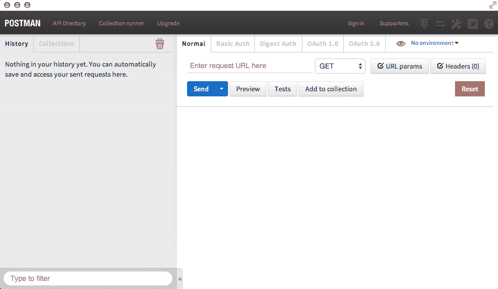

# Postman REST Client 的快速介绍

使用 Postman REST Client，我们能够向任何我们想要的端点提交 REST API 调用，以及修改请求的类型。然后，我们可以完全访问从 API 返回的数据，以及可能发生的任何错误。要测试 API 调用，请在“在此输入请求 URL”字段中输入您最喜欢的网站的 URL，并将其旁边的下拉菜单保留为`GET`。这将模仿您访问网站时浏览器执行的标准`GET`请求。单击蓝色的发送按钮。请求被发送，并且响应显示在屏幕的下半部分。

在下面的截图中，我向[`kroltech.com`](http://kroltech.com)发送了一个简单的`GET`请求，并返回了 HTML。 

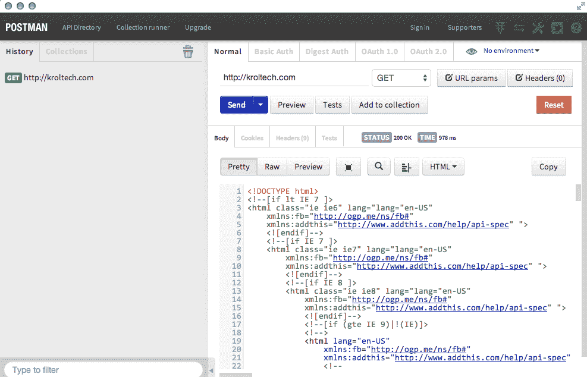

如果我们将此 URL 更改为我的网站的 RSS 源 URL，您可以看到返回的 XML：

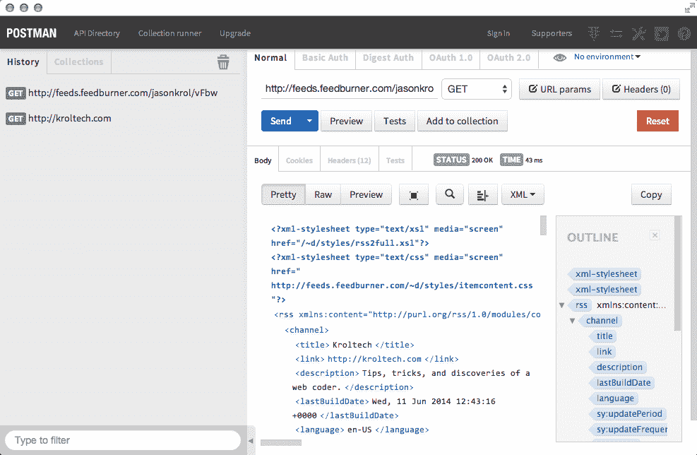

XML 视图具有更多功能，因为它公开了右侧的侧边栏，让您一览 XML 数据的树结构。不仅如此，您现在还可以看到我们迄今为止所做的请求的历史记录，沿左侧边栏。当我们执行更高级的`POST`或`PUT`请求并且不想在测试端点时重复数据设置时，这将非常有用。

这是一个示例 API 端点，我向其提交了一个`GET`请求，返回其响应中的 JSON 数据：

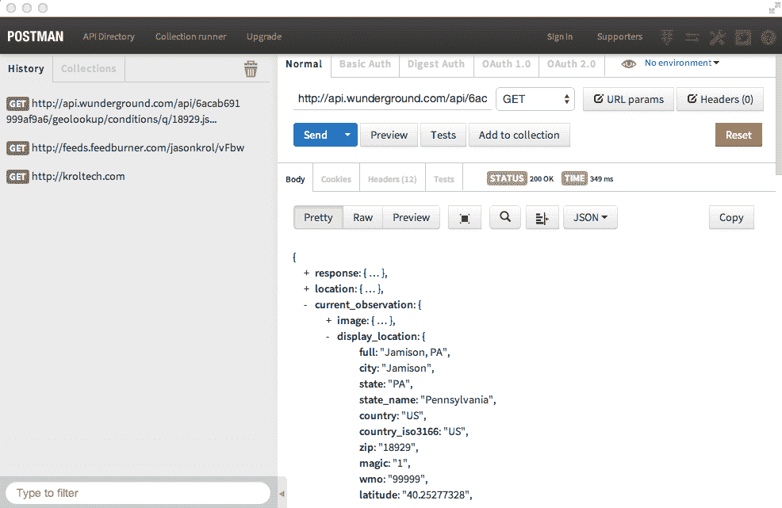

使用 Postman Client 向返回 JSON 的端点发出 API 调用的一个非常好的功能是，它以非常好的格式解析和显示 JSON，并且数据中的每个节点都是可展开和可折叠的。

这个应用程序非常直观，所以确保你花一些时间玩耍和尝试不同类型的调用不同的 URL。

# 使用 JSONView 谷歌浏览器扩展程序

还有一个工具我想和你谈谈（虽然非常小），但实际上是一个非常重要的事情。`JSONView` 谷歌浏览器扩展程序是一个非常小的插件，它将立即通过浏览器将任何 `JSONView` 直接转换为更可用的 JSON 树（就像在 Postman 客户端中一样）。这是在安装 `JSONView` 之前指向返回 JSON 的 URL 的示例：

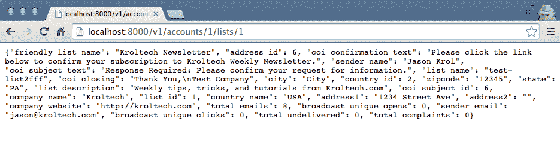

在安装了 `JSONView` 之后，这就是相同的 URL：

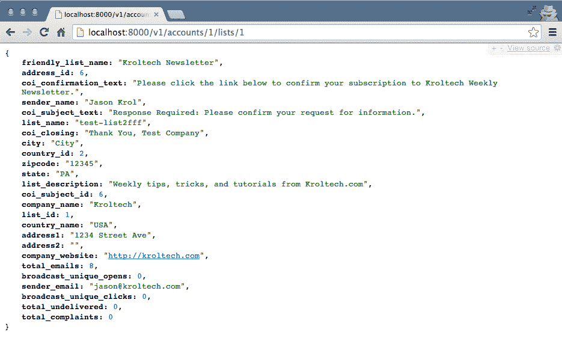

你应该像安装 Postman REST Client 一样安装 `JSONView` 谷歌浏览器扩展程序：访问 Chrome 网上应用店，搜索 `JSONView`。

现在你已经有了能够轻松处理和测试 API 端点的工具，让我们来看看如何编写自己的端点并处理不同的请求类型。

# 创建一个基本的 API 服务器

让我们使用 Express 创建一个超级基本的 Node.js 服务器，我们将使用它来创建我们自己的 API。然后，我们可以使用 Postman REST Client 发送测试到 API，看看它是如何工作的。在一个新的项目工作空间中，首先安装我们需要的 `npm` 模块，以便让我们的服务器运行起来：

```js
    $ npm init
    $ npm install --save express body-parser underscore
```

现在，这个项目的 `package.json` 文件已经初始化并安装了模块，让我们创建一个基本的服务器文件来引导 Express 服务器。创建一个名为 `server.js` 的文件，并插入以下代码块：

```js
const express = require('express'), 
    bodyParser = require('body-parser'), 
    _ = require('underscore'), 
    json = require('./movies.json'), 
    app = express(); 

app.set('port', process.env.PORT || 3500); 

app.use(bodyParser.urlencoded({ extended: false })) 
app.use(bodyParser.json()); 

let router = new express.Router(); 
// TO DO: Setup endpoints ... 
app.use('/', router); 

const server = app.listen(app.get('port'), ()=>{ 
    console.log(`Server up: http://localhost:${app.get('port')}`); 
}); 
```

这对你来说应该看起来很熟悉。在 `server.js` 文件中，我们引入了 express、body-parser 和 underscore 模块。我们还引入了一个名为 `movies.json` 的文件，接下来我们将创建它。

在我们引入模块之后，我们使用最少量的配置来设置 Express 服务器的标准配置，以支持 API 服务器所需的最少配置。请注意，我们没有设置 Handlebars 作为视图渲染引擎，因为我们不打算使用这个服务器来渲染任何 HTML，只是纯粹的 JSON 响应。

# 创建示例 JSON 数据

让我们创建一个临时数据存储的示例 `movies.json` 文件（尽管我们为了演示目的构建的 API 实际上不会在应用程序的生命周期之外保留数据）：

```js
[{ 
    "Id": "1", 
    "Title": "Aliens", 
    "Director": "James Cameron", 
    "Year": "1986", 
    "Rating": "8.5" 
}, 
{ 
    "Id": "2", 
    "Title": "Big Trouble in Little China", 
    "Director": "John Carpenter", 
    "Year": "1986", 
    "Rating": "7.3" 
}, 
{ 
    "Id": "3", 
    "Title": "Killer Klowns from Outer Space", 
    "Director": "Stephen Chiodo", 
    "Year": "1988", 
    "Rating": "6.0" 
}, 
{ 
    "Id": "4", 
    "Title": "Heat", 
    "Director": "Michael Mann", 
    "Year": "1995", 
    "Rating": "8.3" 
}, 
{ 
    "Id": "5", 
    "Title": "The Raid: Redemption", 
    "Director": "Gareth Evans", 
    "Year": "2011", 
    "Rating": "7.6" 
}] 
```

这只是一个非常简单的 JSON 电影列表。随意用你喜欢的内容填充它。启动服务器以确保你没有收到任何错误（请注意，我们还没有设置任何路由，所以如果你尝试通过浏览器加载它，它实际上不会做任何事情）：

```js
    $ node server.js
    Server up: http://localhost:3500
```

# 响应 GET 请求

添加简单的 `GET` 请求支持非常简单，你已经在我们构建的应用程序中见过这个。这是一些响应 `GET` 请求并返回简单 JavaScript 对象作为 JSON 的示例代码。在我们有 `// TO DO: Setup endpoints ...` 注释等待的 `routes` 部分插入以下代码：

```js
router.get('/test', (req, res)=>{ 
    var data = { 
        name: 'Jason Krol', 
        website: 'http://kroltech.com' 
    }; 
    res.json(data); 
}); 
```

就像我们在第五章中设置了 `viewModel` 一样，*使用 Handlebars 进行模板化*，我们创建一个基本的 JavaScript 对象，然后可以直接使用 `res.json` 发送作为 JSON 响应，而不是 `res.render`。让我们稍微调整一下这个函数，并将它更改为响应根 URL（即 `/`）路由的 `GET` 请求，并从我们的 `movies` 文件返回 JSON 数据。在之前添加的 `/test` 路由之后添加这个新路由：

```js
router.get('/', (req, res)=>res.json(json)); 
```

在 Express 中，`res`（响应）对象有一些不同的方法来将数据发送回浏览器。这些方法最终都会回退到基本的`send`方法，其中包括`header`信息，`statusCodes`等。`res.json`和`res.jsonp`将自动将 JavaScript 对象格式化为 JSON，然后使用`res.send`发送它们。`res.render`将以字符串形式呈现模板视图，然后也使用`res.send`发送它。

有了这段代码，如果我们启动`server.js`文件，服务器将监听`/`URL 路由的`GET`请求，并响应我们电影集合的 JSON 数据。让我们首先使用 Postman REST 客户端工具进行测试：

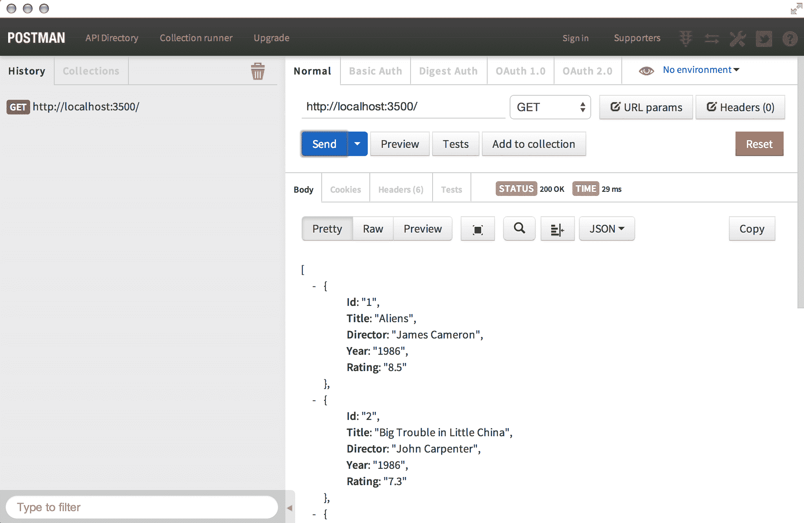

`GET`请求很好，因为我们可以很容易地通过浏览器拉取相同的 URL 并获得相同的结果：

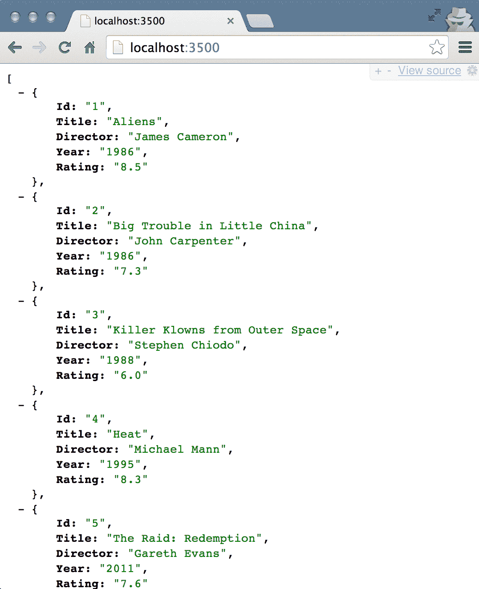

然而，我们将使用 Postman 进行剩余的端点测试，因为使用浏览器发送`POST`和`PUT`请求有点困难。

# 接收数据 - POST 和 PUT 请求

当我们希望允许使用我们的 API 插入或更新数据时，我们需要接受来自不同 HTTP 动词的请求。在插入新数据时，`POST`动词是接受数据并知道它是用于插入的首选方法。让我们看一下接受`POST`请求和数据的代码，将记录插入到我们的集合中，并返回更新的 JSON。

在之前为`GET`添加的路由之后插入以下代码块：

```js
router.post('/', (req, res)=>{ 
    // insert the new item into the collection 
    if(req.body.Id && req.body.Title && req.body.Director && req.body.Year && req.body.Rating) { 
        json.push(req.body); 
        res.json(json); 
    } else { 
        res.json(500, { error: 'There was an error!' }); 
    } 
}); 
```

在`POST`函数中，我们首先要做的是检查确保所需字段与实际请求一起提交。假设我们的数据检查通过，并且所有必需字段都被考虑在内（在我们的情况下，每个字段），我们将整个`req.body`对象按原样插入数组中，使用数组的`push`函数。如果请求中没有提交任何必需字段，我们将返回一个 500 错误消息。让我们使用 Postman REST 客户端向相同的端点提交一个`POST`请求。（不要忘记确保你的 API 服务器正在使用 node `server.js`运行。）：

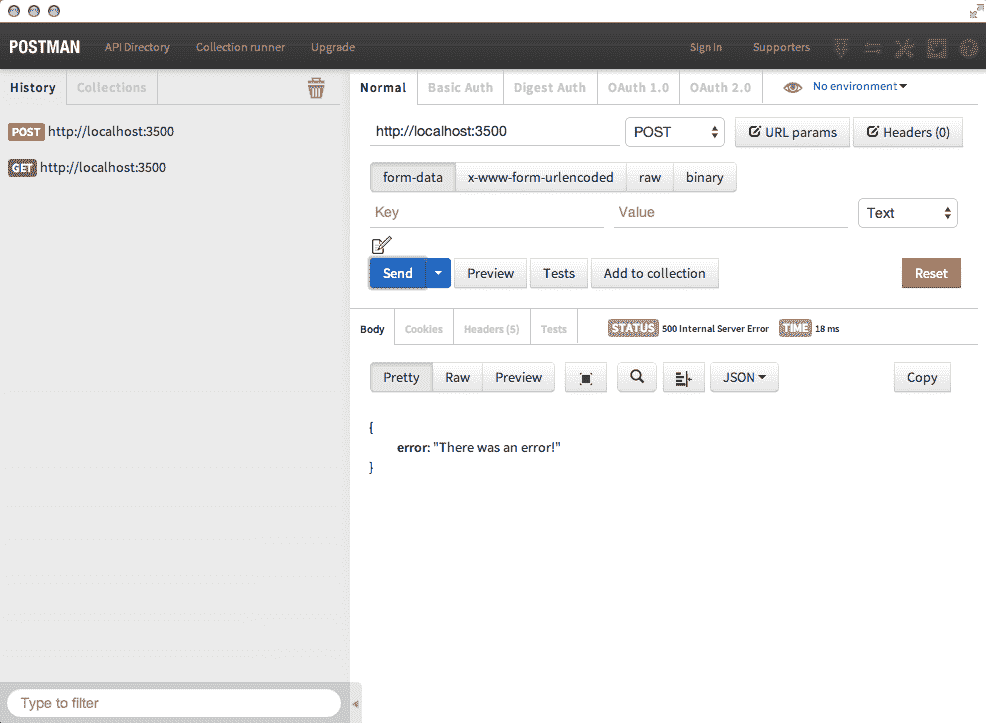

首先，我们提交了一个没有数据的`POST`请求，所以你可以清楚地看到返回的 500 错误响应：

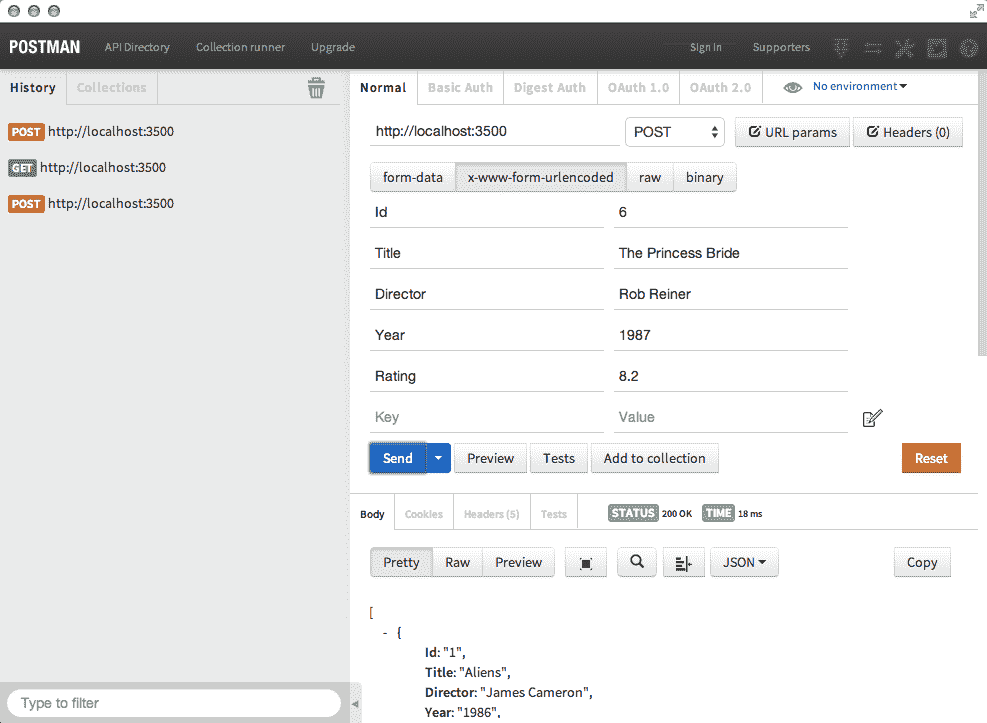

接下来，我们在 Postman 中使用`x-www-form-urlencoded`选项提供了实际数据，并提供了每个名称/值对的一些新的自定义数据。你可以从结果中看到状态是 200，这是成功的，并且更新的 JSON 数据作为结果返回。在浏览器中重新加载主`GET`端点，可以看到我们原始的电影集合中添加了新的电影：

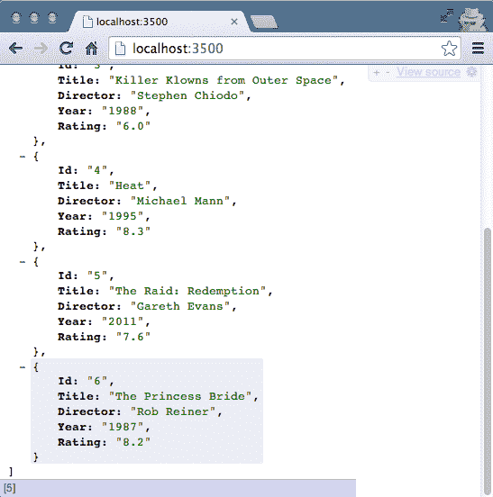

`PUT`请求几乎以完全相同的方式工作，除了传统上，数据的`Id`属性处理方式有点不同。在我们的例子中，我们将要求`Id`属性作为 URL 的一部分，并且不接受它作为提交的数据参数（因为通常`update`函数不会改变正在更新的对象的实际`Id`）。在之前添加的`POST`路由之后，插入以下代码用于`PUT`路由：

```js
router.put('/:id', (req, res)=>{ 
    // update the item in the collection 
    if(req.params.id && req.body.Title && req.body.Director && req.body.Year && req.body.Rating) { 
        _.each(json, (elem, index)=>{ 
            // find and update: 
            if (elem.Id === req.params.id) { 
                elem.Title = req.body.Title; 
                elem.Director = req.body.Director; 
                elem.Year = req.body.Year; 
                elem.Rating = req.body.Rating; 
            } 
        }); 

        res.json(json); 
    } else { 
        res.json(500, { error: 'There was an error!' }); 
    } 
}); 
```

这段代码再次验证了提交的数据中是否包含所需的字段。然后，它执行一个`_.each`循环（使用`underscore`模块）来查看电影集合，并找到其`Id`参数与 URL 参数中的`Id`匹配的项目。假设有匹配项，那么相应对象的个别字段将使用请求中发送的新值进行更新。一旦循环完成，更新后的 JSON 数据将作为响应发送回来。同样，在`POST`请求中，如果缺少任何必需的字段，将返回一个简单的 500 错误消息。以下截图展示了成功的`PUT`请求更新现有记录：

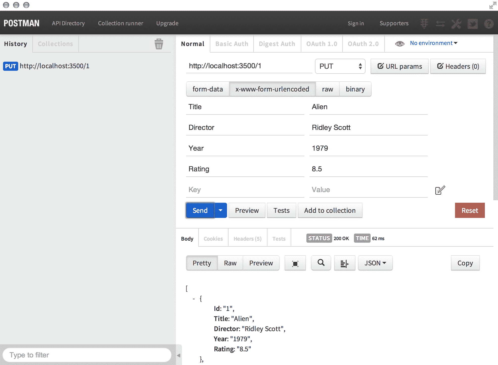

在 Postman 的响应中，包括将值`1`作为`Id`参数放入 URL 中，作为`x-www-form-urlencoded`值提供要更新的个别字段，最后作为`PUT`发送，显示我们电影集合中的原始项目现在是原始的 Alien（而不是 Aliens，它的续集，正如我们最初的情况）。

# 删除数据 - DELETE

我们在不同的 REST API HTTP 动词的旋风之旅中的最后一站是`DELETE`。发送`DELETE`请求应该做的事情应该不会让人感到意外。让我们添加另一个接受`DELETE`请求并从我们的电影集合中删除项目的路由。以下是处理`DELETE`请求的代码，应该放在先前`PUT`的现有代码块之后：

```js
router.delete('/:id', (req, res)=>{ 
    let indexToDel = -1; 
    _.each(json, (elem, index)=>{ 
        if (elem.Id === req.params.id) { 
            indexToDel = index; 
        } 
    }); 
    if (~indexToDel) { 
        json.splice(indexToDel, 1); 
    } 
    res.json(json); 
}); 
```

这段代码将循环遍历电影集合，并通过比较`Id`的值找到匹配的项目。如果找到匹配项，匹配项目的数组`index`将保持，直到循环结束。使用`array.splice`函数，我们可以删除特定索引处的数组项。一旦通过删除请求的项目更新了数据，JSON 数据将被返回。请注意，在以下截图中，返回的更新后的 JSON 实际上不再显示我们删除的原始第二项：

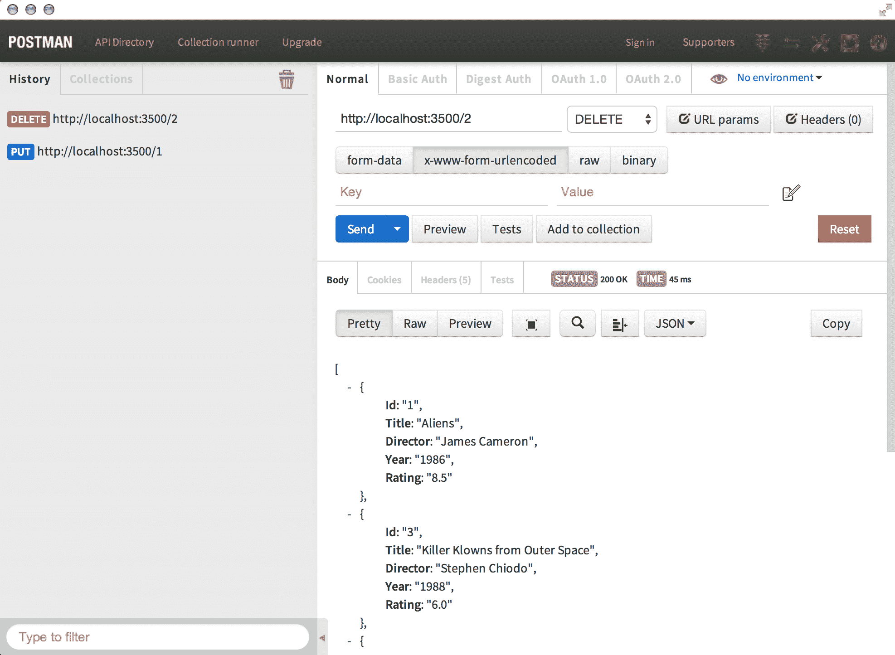

JavaScript 中的`~`使用！这是一点点 JavaScript 黑魔法！在 JavaScript 中，波浪号（`~`）将对一个值进行位翻转。换句话说，它将取一个值并返回该值的负值加一，即`~n === -(n+1)`。通常，波浪号与返回`-1`作为假响应的函数一起使用。通过在`-1`上使用`~`，您将其转换为`0`。如果您在 JavaScript 中对`-1`执行布尔检查，它将返回`true`。您会发现`~`主要与`indexOf`函数和`jQuery`的`$.inArray()`一起使用；两者都将`-1`作为`false`响应。

本章中定义的所有端点都非常基础，其中大多数在生产环境中不应该出现！每当您有一个接受除`GET`请求以外的任何内容的 API 时，您都需要确保执行非常严格的验证和身份验证规则。毕竟，您基本上是直接向用户提供对您数据的访问权限。

# 从 Node.js 中使用外部 API

毫无疑问，总有一天您想要直接从 Node.js 代码中使用 API。也许您自己的 API 端点需要首先从某个与之无关的第三方 API 中获取数据，然后再发送响应。无论原因是什么，通过使用一个名为`request`的流行和知名的`npm`模块，可以相对容易地发送请求到外部 API 端点并接收响应。`request`模块是由 Mikeal Rogers 编写的，目前是第三受欢迎（也是最可靠的）`npm`模块，仅次于`async`和`underscore`。

请求基本上是一个超级简单的 HTTP 客户端，所以到目前为止你用 Postman REST Client 所做的一切基本上都是`Request`可以做的，只是结果数据在你的 Node 代码中可用，以及响应状态码和/或错误（如果有的话）。

# 使用请求来消耗 API 端点

让我们做一个巧妙的技巧，实际上消耗我们自己的端点，就好像它是某个第三方外部 API 一样。首先，我们需要确保我们已经安装了`request`并且可以在我们的应用程序中包含它：

```js
    $ npm install --save request
```

接下来，编辑`server.js`，确保你包含`request`作为一个必需的模块

在文件的开头：

```js
const express = require('express'), 
    bodyParser = require('body-parser'), 
    _ = require('underscore'), 
    json = require('./movies.json'), 
    app = express(), 
    request = require('request'); 
```

现在，让我们在现有路由之后添加一个新的端点，这将是通过对`/external-api`发出`GET`请求在我们的服务器中可访问的一个端点。然而，这个端点实际上将消耗另一个服务器上的另一个端点，但是出于这个例子的目的，另一个服务器实际上是我们当前正在运行的相同服务器！

`request`模块接受一个带有许多不同参数和设置的选项对象，但对于这个特定的例子，我们只关心其中的一些。我们将传递一个具有我们要消耗的端点的 URL 设置的对象。在发出请求并收到响应后，我们希望执行一个内联的`callback`函数。

在`server.js`中现有的`routes`列表之后放置以下代码块：

```js
router.get('/external-api', (req, res)=>{ 
    request.get({ 
            uri: `http://localhost:${(process.env.PORT || 3500)}` 
        }, (error, response, body)=>{ 
            if (error) { throw error; } 

            var movies = []; 
            _.each(JSON.parse(body), (elem, index)=>{ 
                movies.push({ 
                    Title: elem.Title, 
                    Rating: elem.Rating 
                }); 
            }); 
            res.json(_.sortBy(movies, 'Rating').reverse()); 
        }); 
}); 
```

`callback`函数接受三个参数：`error`，`response`和`body`。`response`对象就像 Express 处理的任何其他响应一样，具有各种参数。第三个参数`body`是我们真正感兴趣的。它将包含我们调用的端点请求的实际结果。在这种情况下，它是我们之前定义的主`GET`路由返回的 JSON 数据，其中包含我们自己的电影列表。重要的是要注意，从请求返回的数据是作为字符串返回的。我们需要使用`JSON.parse`将该字符串转换为实际可用的 JSON 数据。

我们操纵了从请求返回的数据以满足我们的需求。在这个例子中，我们拿到了电影的主列表，只返回了一个由每部电影的`Title`和`Rating`组成的新集合，并按照最高分数对结果进行排序。

通过将浏览器指向`http://localhost:3500/external-api`来加载这个新的端点，你可以看到新转换的 JSON 输出显示在屏幕上。

让我们看一个更真实的例子。假设我们想为我们收藏中的每部电影显示一系列相似的电影，但我们想在[www.imdb.com](http://www.imdb.com)等地方查找这些数据。下面是一个示例代码，它将向 IMDB 的 JSON API 发送一个`GET`请求，特别是针对单词`aliens`，并返回按`Title`和`Year`列出的相关电影。继续在`external-api`的先前路由之后放置这个代码块：

```js
router.get('/imdb', (req, res)=>{ 
    //console.log("err1") 
    request.get({ 
            uri: 'http://sg.media-imdb.com/suggests/a/aliens.json' 
        }, (err, response, body)=>{ 
            let data = body.substring(body.indexOf('(')+1); 
            data = JSON.parse(data.substring(0,data.length-1)); 
            let related = []; 
            _.each(data.d, (movie, index)=>{ 
                related.push({ 
                    Title: movie.l, 
                    Year: movie.y, 
                    Poster: movie.i ? movie.i[0] : '' 
                }); 
            }); 

            res.json(related); 
        }); 
}); 
```

如果我们在浏览器中查看这个新的端点，我们可以看到从我们的`/imdb`端点返回的 JSON 数据实际上是从一些其他 API 端点检索和返回数据：

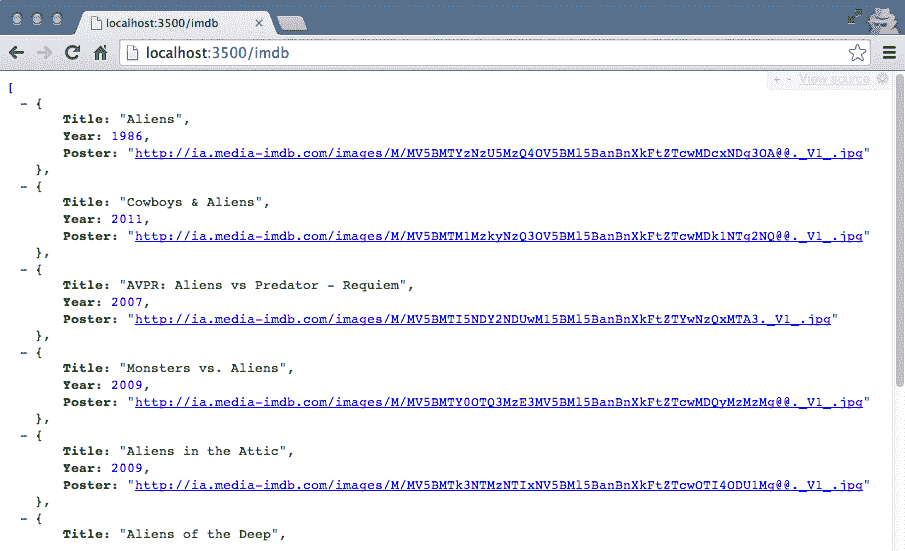

我正在使用的 IMDB 的 JSON 端点实际上并不是来自他们的 API，而是当你在主搜索框中输入时他们在主页上使用的。这实际上并不是使用他们的数据的最合适的方式，但更多的是一个示例。实际上，要使用他们的 API（就像大多数其他 API 一样），你需要注册并获取一个 API 密钥，这样他们才能正确地跟踪你每天或每小时请求了多少数据。出于这个原因，大多数 API 都需要你使用私钥。

# 摘要

在本章中，我们简要介绍了 API 的一般工作原理，语义 URL 路径和参数的 RESTful API 方法，以及如何创建一个简单的 API。

我们使用 Postman REST Client 与 API 交互，通过消耗端点和测试不同类型的请求方法（`GET`，`POST`，`PUT`等）来进行测试。您还学会了如何使用第三方节点模块`request`来消耗外部 API 端点。

在下一章中，我们将重新访问我们的原始应用程序，通过在 Node.js 中引入测试来实施最佳实践。我们将研究流行的测试框架，并为应用程序编写测试，以证明我们的代码按预期工作。
