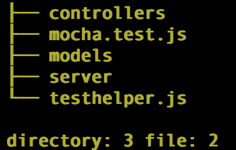
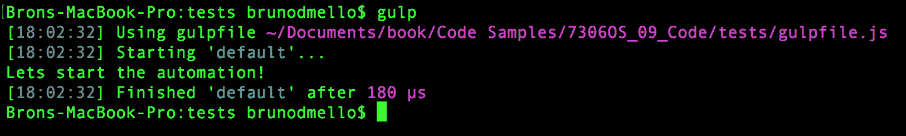
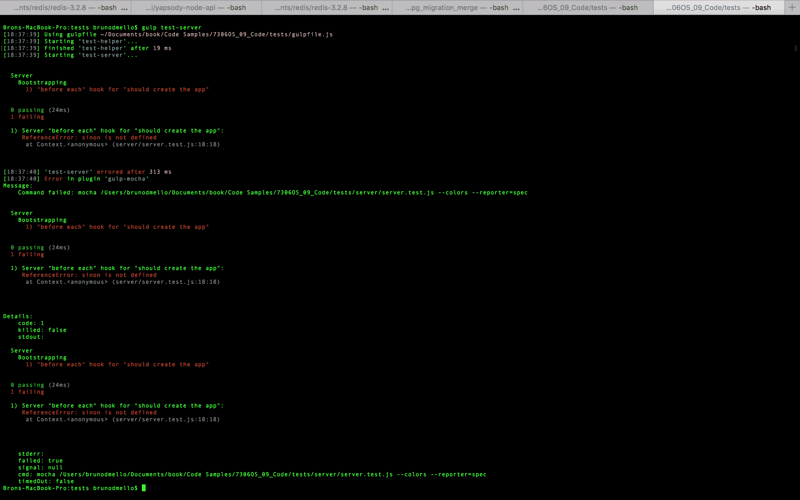

# 第九章：测试您的代码

到目前为止，我们在编写代码时基本上是凭着感觉在进行。我们实际上无法知道代码是否有效，直到在实际浏览器中测试它。

在本章中，我们将涵盖以下主题：

+   使用 Mocha 测试框架运行测试

+   使用 Chai.js 断言库编写测试

+   使用 Sinon 和 Proxyquire 进行间谍和存根

+   编写您的第一个测试

+   测试您的应用程序

测试对于确保您的代码正常运行非常重要，但它们也非常适用于防止由于您对某些无辜的代码进行了微小更改而突然出现新的意外错误。

# 行业工具

让我们首先看一下我们将用于运行和编写测试的各种工具和库。在我们实际开始编写真正的测试之前，我们需要掌握三个主要概念。

第一个是测试运行器，或者我们用来运行测试套件的框架。

大多数框架都遵循**测试驱动开发**（**TDD**），其过程依赖以下步骤：

1.  它定义了一个单元测试。

1.  它实现了该单元。

1.  它执行测试并验证测试是否通过。

第二个概念是断言库本身——我们用来编写测试的语言。使用断言语言的特殊版本来逐步设计和构建功能块，以期望的行为为指导，称为**行为驱动开发**（**BDD**）。

对于 TDD 和 BDD，我们可以使用 Mocha 测试框架；但是，我们将使用一个名为`Chai.js`的特殊断言库来编写断言。

最后，我们将看一下间谍和存根的概念，它们是我们代码的某些部分的虚假代表，当我们需要跟踪函数调用以确保预期的行为时，我们会依赖它们。

# 使用 Mocha 框架运行测试

在为应用程序编写测试时，通常会按模块特定的批次编写它们。这些批次被称为套件或规范。每个套件通常包含一批以几乎与应用程序本身相似的方式组织的测试。对于 Node，这个想法也是一样的，我们编写的每个测试套件都将针对一个单独的模块。您将需要测试的模块，并为模块的每个部分编写一系列测试。

由于您将有许多不同的测试文件来测试应用程序的每个组件，您需要一种快速执行所有测试的方法。这就是测试运行器的作用。我们决定使用的测试运行器称为 Mocha。您可以像安装其他`npm`包一样全局安装 Mocha，如下所示：

```js
    $ npm install -g mocha
```

在 Linux 或 OS X 上安装时可能需要安全权限，可以简单地在`npm`之前使用`sudo`。

一旦安装完成，Mocha 命令行工具就可以使用了。只需在命令行中执行`mocha`，就会使用一些默认选项执行测试运行。

测试运行器将查找名为`test`的文件夹和其中的任何`.js`文件。在我们的情况下，我们实际上还没有设置任何测试，因此仅执行`mocha`将不会有任何效果；相反，它会抛出以下错误：

```js
 cannot resolve path
```

当 Mocha 测试运行器找到`.js`文件时，它会像执行任何其他 Node 文件一样执行它们，只是它会在文件中查找一些特定的关键字。

以下是典型测试块的一些示例代码：

```js
const expect = require('chai').expect; 
describe('The code', ()=>{ 
    beforeEach(()=>{ 
        // optional preparation for each test 
    }); 
    afterEach(()=>{ 
        // optional cleanup after each test 
    }); 

    it('should test something', ()=>{ 
        const something = 1; 
        // here we "expect" some condition to declare our test 
        // in this case, we expect the variable to exist 
        // more on the assertion syntax a little later 
        expect(something).to.exist; 
    }); 
    it('should test something_else', ()=>{ 
        const something_else = false; 
        // now we test a different variable against its value 
        // and expect that value to equal false 
        expect(something_else).to.equal(false); 
    }); 
}); 
```

Mocha 首先要扫描文件的是`describe`块。`describe`块是定义单行中特定测试用例组的一种方式。您可以在`test`文件中有许多`describe`块，并且每个`describe`块可以有许多具体测试。此外，`describe`块可以嵌套得很深，以更好地组织您的测试。

一旦找到一个`describe`块，其中还会执行一些其他项目。会检查`beforeEach`和`afterEach`块，看是否有任何需要在每次测试执行之前执行的预测试工作。同样，在测试之间需要进行任何清理工作也可以在`afterEach`块中处理。

这两个块都是可选的，因此不是必需的。如果您需要实例化一个对象进行测试，您可以使用`beforeEach`块。这样，无论测试可能对对象进行了什么更改，都将被重置，并且不会无意中影响任何其他测试。同样，您在测试期间对任何其他相关对象所做的任何更改都可以在`afterEach`块中重置。

在`describe`块内，使用`it`语句定义单独的测试。在每个`it`语句中，通常认为包括一个单独的`expect`来断言实际测试（尽管您可以包括尽可能多的`expect`函数调用，但由于只有一个`it`，它仍然被认为是单个测试）。

在编写测试套件时，我们使用 BDD 风格的语法，这样我们的测试就可以像用户故事一样阅读。使用前面的测试片段，您可以将测试读作`代码应该测试某事`和`代码应该测试其他事情`。实际上，如果我们运行前面的测试，我们会看到以下输出：

```js
      The code
         should test something
         should test something_else

      2 passing (5ms)
```

# 使用 Chai.js 进行断言测试

正如您在前面的单元测试示例中看到的，我们使用特殊块来定义我们的测试组，但在定义实际的单独测试时使用了不同的语言。这些测试被称为**断言**，我们选择使用`Chai.js`库。这纯粹是个人偏好，因为存在许多不同的断言库。每个库基本上都是做同样的事情，只是在编写测试的语法和风格上略有不同。由于`Chai.js`是项目特定的并且基于个人偏好，我们将其安装为项目依赖项（而不是全局安装）。此外，由于我们的测试实际上并不是应用程序运行所必需的，我们将在`package.json`文件的`devDependencies`列表中包含`Chai.js`。

在开发者的机器上执行`npm install`将会将所有包安装到正常的依赖项下，以及`package.json`中的`devDependencies`。当环境变为生产环境时，我们需要执行`npm install --prod`来指定环境。

这将帮助`npm`在`package.json`中将包安装到依赖项而不是`devDependencies`下。为了将`Chai.js`作为`devDependency`包含在我们的项目中，我们将在执行`npm`安装时使用`--save-dev`标志而不是`--save`：

```js
    $ npm install --save-dev chai
```

# 开始使用 Chai

Chai 本身有几种不同风格的 API 可以在编写测试时使用。我们将使用 BDD API 来编写测试，它使用`expect`和`should`。还有一个更多的 TDD 风格的 assert API。使用`expect`/`should`的 BDD 风格的好处是可以链式调用断言方法来提高测试的可读性。

您可以通过访问以下维基百科页面了解更多关于 BDD 和 TDD 的信息：

[`en.wikipedia.org/wiki/Behavior-driven_development`](http://en.wikipedia.org/wiki/Behavior-driven_development)

使用`Chai.js`的 BDD 断言 API 提供了许多方法，比如`to`、`be`、`is`等等。它们没有测试能力，但可以提高断言的可读性。所有的获取器都列在[`chaijs.com/api/bdd/`](http://chaijs.com/api/bdd/)上。

所有这些获取器都将遵循一个`expect()`语句，并且可以与`not`结合，以便在需要时将断言取反。

前面的获取器与`chai`断言方法相结合，比如`ok`，`equal`，`within`等，以确定测试的结果。所有这些方法都列在[`chaijs.com/api/assert/`](http://chaijs.com/api/assert/)中。

让我们开始构建简单的断言。`chai`提供了三种不同的断言风格：`expect`，`should`和`assert`。考虑以下简单的例子：

```js
const chai = require('chai'); 
const expect = chai.expect; 
const should = chai.should(); 
const assert = chai.assert; 
const animals = { pets: [ 'dog', 'cat', 'mouse' ] }; 
const foo = 'bar'; 

expect(foo).to.be.a('string').and.equal('bar'); 
expect(animals).to.have.property('pets').with.length(4); 
animals.should.have.property('pets').with.length(4); 
assert.equal(foo, 'bar', 'Foo equal bar'); 
```

正如你所看到的，`expect`/`should`函数是基于自描述语言链的。两者在声明方式上有所不同——`expect`函数提供了链的起点，而`should`接口则扩展了`Object.prototype`。

`assert`接口提供了简单但强大的 TDD 风格断言。除了前面的例子产生的深度相等断言，还有异常测试和实例可用。要进行更深入的学习，请参考 Chai 文档[`chaijs.com/api`](http://chaijs.com/api)。

# 使用 Sinon.js 进行间谍和存根

如果没有一种简单的方法来监视函数并知道它们何时被调用，测试代码将变得非常困难。此外，当调用你的函数之一时，知道传递给它的参数和返回的内容也是很好的。在测试中，`spy`是一个特殊的占位符函数，当你想要检查特定的函数是否/何时被调用时，它会替换现有的函数。当调用函数时，间谍会跟踪一些属性，并且它们还可以通过原始函数的预期功能。`Sinon.js`库提供了`spy`和`stub`功能，并且非常全面。要了解这个强大框架提供的不同选项的完整列表，我强烈建议你花一些时间阅读文档[`sinonjs.org/docs`](http://sinonjs.org/docs)。

由于我们将在测试中使用`Sinon.js`，我们应该将其安装为另一个`devDependency`，与我们使用`Chai.js`时完全相同。此外，我们还应该安装`sinon-chai`助手，它提供了额外的`chai`断言动词，专门用于与 Sinon 一起使用：

```js
    $ npm install --save-dev sinon sinon-chai
```

包含`sinon-chai`允许我们编写特殊的断言，比如`to.be.calledWith`，这在仅使用`chai`时是无法使用的。

想象一下，你有一个简单地将两个数字相加并返回总和的函数：

```js
let sum = (a, b) => {
    return a + b;
}
let doWork = () => {
    console.log("asdasd")
    const x = 1,
        y = 2;
    console.log(sum(x, y));
} 
```

在为`doWork`函数编写测试时，我们希望断言`sum`函数是否被调用。我们并不一定关心函数做什么，或者它是否起作用；我们只是想确保——因为`doWork`依赖于`sum`——它实际上调用了`function()`函数。在这种情况下，我们唯一能确定的方式是如果我们有一种方法来监视`sum`函数并知道它是否被调用。使用`spy`，我们可以做到这一点：

```js
const chai = require('chai');
const expect = chai.expect; 
const sinon = require("sinon"); 
const sinonChai = require("sinon-chai"); 
chai.use(sinonChai); 

describe('doWork', ()=>{ 
    let sum; 

    it('should call sum', ()=>{ 
        sum = sinon.spy(); 
        doWork(); 
        expect(sum).to.be.calledWith(1,2); 
    }); 
}); 
```

在前面的场景中，`sum`函数被替换为`spy`函数。因此它的实际功能将不再存在。如果我们想要确保`sum`函数不仅被监视，而且仍然按照我们的期望工作，我们需要在`sinon.spy()`后面添加`.andCallThrough()`：

```js
describe('doWork', ()=>{ 
    let sum; 
    console.log = sinon.spy(); 

    it('should call sum', ()=>{ 
        sum = sinon.spy().andCallThrough(); 
        doWork(); 
        expect(sum).to.be.calledWith(1,2); 
        expect(console.log).to.be.calledWith(3); 
    }); 
}); 
```

请注意，通过在我们的`sum`间谍上包含`andCallThrough`，我们不仅能够监视它并断言它是否被调用，还能够监视`console.log`函数并断言它是否被调用并返回`sum`返回的正确值。

`spy`通常只是一个函数的观察者，并且只报告函数是否被调用，而`stub`允许你在测试执行期间为函数提供自定义功能。测试存根被称为预编程行为函数，用于测试应用程序中作为模块依赖项的包装样板代码。

将`stub`视为超级间谍，它报告与`spy`相同的事情，但也执行您想要的特定任务。使用相同的示例，让我们将`sum`函数存根为始终返回相同的值：

```js
it('should console.log sum response', ()=>{ 
    // replace the existing sum function with a new stub, 
    // a generic function that does exactly what we specify 
    // in this case always just return the number 2 
    sum = sinon.stub(()=>{ 
        return 2; 
    });

    // lets replace the standard console.log function 
    // with a spy 
    console.log = sinon.spy(); 
    // call our doWork function (which itself uses console.log) 
    doWork(); 
    // and if doWork executed the way its supposed to, console.log 
    // should have been called and the parameter 2 passed to it 
    expect(console.log).to.be.calledWith(2); 
}); 
```

当函数执行可能产生意外结果，并且您只想为测试目的强制响应时，存根函数是很好的。当您进行 TDD 并且正在针对尚未编写的函数进行测试时，存根也很方便。

# 使用 Proxyquire 存根节点模块

在同一模块内编写测试时，间谍和存根非常有用，但是当您需要监视或存根另一个 Node 模块中所需的模块时，情况就会变得有点棘手。幸运的是，有一个名为**Proxyquire**的工具，它将允许您存根从您的代码中所需的模块。

检查以下代码示例：

```js
// google.js 
const request = require('request'),
  sinon = require("sinon"),
  log = sinon.spy();

module.exports =()=>{ 
    request('http://www.google.com', (err, res, body)=>{ 
        log(body); 
    }); 
} 
```

您可以看到我们需要`request`模块。`request`模块接受两个参数，其中一个是`callback`函数。事情开始变得棘手的地方就在这里。在这种情况下，我们将如何实现间谍和/或存根？此外，我们如何防止我们的测试明确地发出网络调用以获取`google.com`？如果我们运行测试时`google.com`宕机（哈！）会怎么样？

为了能够监视`request`模块，我们需要一种拦截实际`require`并附加我们自己的存根版本的`request`的方法。`request`模块实际上是一个您想要存根的模块的很好的例子，因为`request`用于进行网络调用，这是您希望确保您的测试永远不会真正执行的操作。您不希望您的测试依赖外部资源，例如网络连接或依赖从实际请求返回的数据。

使用 Proxyquire，我们实际上可以设置我们的测试，以便它们拦截`require`模块，并用我们自己的存根替换执行的内容。以下是针对我们之前创建的模块编写的测试文件的示例：

```js
//google.spy.js
const sinon = require("sinon"),
proxyquire = require('proxyquire'),
log = sinon.spy(), 
requestStub = sinon.stub().callsArgWith(1, null, null, 'google.com'), 
google = proxyquire('./google', { 'request': requestStub }); 

describe('google module', ()=>{ 
    beforeEach(()=>{ 
        google(); 
    }); 
    it('should request google.com', ()=>{ 
        expect(reqstub).to.be.called(); 
    }); 
    it('should log google body', ()=>{ 
        expect(callback).to.be.calledWith(null, null, 'google.com'); 
    }); 
}); 
```

测试套件的第一件事是设置一个`spy`和一个通用的`stub`函数，该函数将用作`request`模块。然后，我们包括我们的`google`模块，但我们使用`proxyquire`而不是典型的`require`模块。使用`proxyquire`，我们传递模块的路径，方式与`require`相同，只是第二个参数是在该模块中所需的模块，以及要在其位置使用的`stub`函数。

在每个测试之前，我们将执行原始的`google`模块，并断言我们的`stub`实际上被调用。此外，我们断言`log`间谍被调用，并且使用从`request`模块返回的任何数据。由于我们控制该模块，因此我们可以测试确实，当请求发送到`http://google.com`时，返回了字符串`google.com`（我们确切知道这不是真的--不仅如此，我们还知道从未发送网络调用到`www.google.com`）。 

我们正在使用`stub`的特殊功能，该功能允许我们执行特定参数到存根函数，假设它是`callback`函数。在这里，我们使用`callsArgWith`，并将参数`index`（从零开始）包括为第一个参数；在这种情况下，传递给请求的两个参数中的一个，第一个（索引 0）是 URL 本身，第二个（索引 1）是`callback`函数。使用`callsArgWith`，我们可以执行`callback`函数并具体提供其参数，例如`null`，`null`和一个字符串。像`Sinon.js`和`Chai.js`一样，`proxyquire`也需要作为`devDependency`包含在我们的项目中。

```js
    $ npm install --save-dev proxyquire
```

# 编写并运行您的第一个测试

到目前为止，我们看到的所有测试代码都只是演示和示例，我们实际上还没有运行任何测试。让我们设置应用程序的基本结构，以便我们可以开始编写真正的测试。

首先要做的是设置一个文件夹结构，用来存放所有的测试。考虑以下步骤：

1.  在应用程序项目文件夹的根目录中，创建一个名为`tests`的文件夹。

1.  在`tests`文件夹中，创建三个更多的文件夹，分别为`controllers`、`models`和`server`。

```js
/(existing app root) 
tests/ 
----/controllers/ 
----/models/ 
----/server/ 
```

# 编写一个测试助手

在我们开始为应用程序编写测试之前，有一些额外的开销需要我们准备好以准备进行测试。为了处理这些开销，我们将编写一个`testhelper`文件，它将被包含并与我们通过 Mocha 执行的每个测试文件一起运行。

在`tests`文件夹中创建一个名为`testhelper.js`的文件，并插入以下代码块：

```js
const chai = require('chai'), 
    sinon = require('sinon'), 
    sinonChai = require('sinon-chai'); 

global.expect = chai.expect; 
global.sinon = sinon; 
chai.use(sinonChai); 
```

这是我们通常需要在每一个测试文件的顶部包含的代码；但是，通过将其包含在一个单独的文件中，我们可以指示 Mocha 自动要求每个运行的测试文件包含这个文件。文件本身只包括`chai`和`sinon`模块，并定义了一些全局变量作为我们测试编写的快捷方式。此外，它指示`chai`使用`sinonChai`模块，以便我们的语法得到扩展，我们可以编写 Sinon 特定的 Chai 断言。实际运行我们的测试套件的命令如下：

```js
    $ mocha -r tests/testhelper.js -R spec tests/**/*.test.js
```

记住我们之前全局安装了 Mocha，这样我们就可以从任何地方执行`mocha`命令。

根据前面命令中测试的路径，假设该命令将从应用项目文件夹的根目录执行。`-r`标志指示 Mocha 要求`testhelper.js`模块。`-R`标志是定义测试报告输出样式的选项。我们选择使用`spec`样式，它以嵌套缩进样式列出我们的报告，每个`describe`和`it`语句，以及通过测试的绿色复选标记。最后一个参数是我们`test`文件的路径；在这种情况下，我们提供了通配符，以便所有的测试都会运行。

Mocha 有几种不同的报告样式可供选择。这包括点（每个测试重复一个点）、列表、进度（百分比条）、JSON 和 spec。其中比较有趣的，尽管有点无用，是`-R nyan`报告样式。

让我们写一个快速的样本测试，以确保我们的项目设置正确。在`tests`文件夹中，创建一个名为`mocha.test.js`的新文件，并包含以下代码：

```js
describe('Mocha', ()=>{
    'use strict';

    beforeEach(()=>{});

    describe('First Test', ()=>{
        it('should assert 1 equals 1', ()=>{
            expect(1).to.eql(1);
        });
    });
});

```

前面的测试非常简单，只是断言`1`等于`1`。保存这个文件，再次运行`Mocha`测试命令，你应该会得到以下输出：

```js
    $ mocha -r tests/testhelper.js -R spec tests/mocha.test.js
    Mocha
      First Test
         should assert 1 equals 1

    1 passing (5ms)

```

你可能会觉得记住和执行`Mocha`的那个冗长而复杂的命令很烦人和令人沮丧。幸运的是，有一个相当简单的解决方案。编辑应用程序中的`package.json`文件，并添加以下部分：

```js
"scripts": { 
    "start": "node server.js", 
    "test": "mocha -r tests/testhelper.js -R spec 
      tests/**/*.test.js" 
  }, 
```

通过在`package.json`文件中进行这个调整，现在你可以简单地在命令行中执行`npm test`作为一个快速简便的快捷方式。这是`package.json`文件的一个标准约定，所以任何开发人员都会知道如何简单地执行`npm test`：

```js
    $ npm test
    > chapter9@0.0.0 test /Users/jasonk/repos/nodebook/chapter9
    > mocha -r tests/testhelper.js -R spec tests/**/*.test.js

    Mocha
      First Test
         should assert 1 equals 1

    1 passing (5ms)

```

现在我们的项目已经设置好了，可以正确运行和执行测试，让我们开始为应用程序编写一些真正的测试。

# 测试应用程序

在解决了所有这些背景信息之后，让我们专注于为我们构建的应用程序编写一些真正的测试。在接下来的几节中，我们将为应用程序的路由、服务器、模型和控制器编写测试。

# 测试路由

让我们慢慢开始，先看看我们应用程序中最基本的文件之一，`routes.js`文件。这个文件只是定义了应用程序应该响应的路由数量。这将是最容易编写测试的文件之一。

由于`routes.js`文件位于我们主应用程序中的`server`文件夹中，让我们将其相应的测试文件放在类似的位置。在`tests/server`文件夹中，创建一个名为`routes.test.js`的文件。由于`routes.test.js`文件将测试我们的`routes.js`文件的功能，我们需要它`require`相同的模块。

在`test/server/routes.test.js`中包含以下代码：

```js
const home = require('../../controllers/home'), 
    image = require('../../controllers/image'), 
    routes = require('../../server/routes'); 
```

请注意，路径不同，因为我们从`test/server`文件夹中`require`模块，但我们还需要`require`特定于应用程序的模块。另外，请注意，除了我们原始的`routes.js`文件需要的模块之外，我们还需要`require` `routes`模块本身。否则，如果没有包含它，我们将无法测试模块的功能。接下来，让我们设置测试套件的结构并创建一些`spy`。在`tests/server/routes.test.js`中的先前代码之后包括这个新的代码块：

```js
describe('Routes',()=>{ 
    let app = { 
        get: sinon.spy(), 
        post: sinon.spy(), 
        delete: sinon.spy() 
    }; 
    beforeEach(()=>{ 
        routes.initialize(app); 
    }); 

    // to do: write tests... 
}); 
```

如果您还记得，`routes`模块的`initialize`函数接受一个参数，即`app`对象。在我们的测试中，我们将`app`定义为一个简单的匿名对象，有三个函数-- `get`、`post`和`delete`；每个都是一个`spy`。我们包括一个`beforeEach`块，在每次测试运行之前执行`initialize`函数。

现在，让我们包括一些测试。首先，我们将测试`GET`端点是否正确配置。在`// to do: write tests...`注释之后，放置以下代码块：

```js
describe('GETs',()=>{ 
    it('should handle /', function(){ 
        expect(app.get).to.be.calledWith('/', home.index); 
    }); 
    it('should handle /images/:image_id', ()=>{ 
        expect(app.get).to.be.calledWith('/images/:image_id', 
         image.index); 
    }); 
}); 
```

然后，测试`POST`端点：

```js
describe('POSTs', ()=>{
    it('should handle /images', ()=>{
        expect(app.post).to.be.calledWith('/images', image.create);
    });
    it('should handle /images/:image_id/like', ()=>{
        expect(app.post).to.be.calledWith('/images/:image_id/like', image.like);
    });
    it('should handle /images/:image_id/comment', ()=>{
        expect(app.post).to.be.calledWith('/images/:image_id/comment', image.comment);
    });
}); 
```

最后，测试`DELETE`端点：

```js
describe('DELETEs', ()=>{
    it('should handle /images/:image_id', ()=>{
        expect(app.delete).to.be.calledWith('/images/:image_id', image.remove);
    });
}); 
```

这些测试都断言了同一件事，即`app`对象的相应`get`、`post`或`delete`函数是否针对每个路由使用了正确的参数。我们能够针对参数进行测试，因为我们使用的`app`对象是一个`spy`。

如果您运行`mocha`命令来执行测试套件，您应该会看到以下输出：

```js
    $ npm test
    Routes
        GETs
           should handle /
           should handle /images/:image_id
        POSTs
           should handle /images
           should handle /images/:image_id/like
           should handle /images/:image_id/comment
        DELETEs
           should handle /images/:image_id

      6 passing (14ms)
```

# 测试服务器

测试`server.js`文件将与我们的其他文件略有不同。该文件作为我们应用程序的根运行，因此它不导出任何我们可以直接测试的模块或对象。由于我们使用`server.js`启动服务器，我们需要模拟从我们的代码启动服务器。我们将创建一个名为`server`的函数，它将使用`proxyquire`需要`server.js`文件，并对它需要的每个模块进行存根。执行`server()`函数将与从命令行执行`node server.js`完全相同。文件中的所有代码都将通过该函数执行，然后我们可以使用`proxyquire`中的`stub`对每个调用进行测试。

在`tests/server/`文件夹中创建名为`server.test.js`的文件，并插入以下代码块：

```js
let proxyquire, expressStub, configStub, mongooseStub, app, 
    server = function() { 
        proxyquire('../../server', { 
            'express': expressStub, 
            './server/configure': configStub, 
            'mongoose': mongooseStub 
        }); 
    }; 

describe('Server',()=>{ 
    beforeEach(()=>{
        proxyquire = require('proxyquire'),
        app = {
            set: sinon.spy(),
            get: sinon.stub().returns(3300),
            listen: sinon.spy()
        },
        expressStub = sinon.stub().returns(app),
        configStub = sinon.stub().returns(app),
        mongooseStub = {
            connect: sinon.spy(),
            connection: {
                on: sinon.spy()
            }
        };

        delete process.env.PORT;
    }); 

    // to do: write tests... 
}); 
```

在为我们的服务器运行每个测试之前，我们重置服务器的所有主要组件的存根。这些存根包括`app`对象、`express`、`config`和`mongoose`。我们对这些模块进行存根，因为我们想要对它们进行`spy`（并且我们使用存根是因为其中一些需要返回我们将在文件中使用的对象）。现在我们已经准备好了所有的`spy`和我们的`app`对象框架，我们可以开始测试我们代码的主要功能。

我们需要检查以下条件是否通过：

创建一个应用程序

+   视图目录已设置

+   端口已设置并且可以配置和/或设置为默认值

+   应用程序本身已配置（`config`已调用）

+   Mongoose 连接到数据库 URI 字符串

+   应用程序本身已启动

用以下代码块替换之前代码中的`// to do: write tests...`注释：

```js
describe('Bootstrapping', ()=>{
    it('should create the app', ()=>{
        server();
        expect(expressStub).to.be.called;
    });
    it('should set the views', ()=>{
        server();
        expect(app.set.secondCall.args[0]).to.equal('views');
    });
    it('should configure the app', ()=>{
        server();
        expect(configStub).to.be.calledWith(app);
    });
    it('should connect with mongoose', ()=>{
        server();
        expect(mongooseStub.connect).to.be.calledWith(sinon.match.string);
    });
    it('should launch the app', ()=>{
        server();
        expect(app.get).to.be.calledWith('port');
        expect(app.listen).to.be.calledWith(3300, sinon.match.func);
    });
}); 
```

在前面的一组测试中，我们测试了服务器的引导，这些都是最初在`server.js`中运行的所有功能。测试的名称相当不言自明。我们检查`app`对象的各种方法，确保它们被调用和/或传递了正确的参数。对于测试，我们希望测试特定类型的参数是否被调用，而不是参数值的确切内容；我们使用 Sinon 的匹配元素，这使得我们的测试可以更加通用。我们不希望在测试中硬编码 MongoDB URI 字符串，因为这只是我们需要维护的另一个地方--尽管如果您希望测试非常严格（即确切地断言传递了确切的 URI 字符串），您完全可以这样做。

在第二组测试中，我们希望确保端口已设置，默认为`3300`，并且可以通过使用节点环境变量进行更改：

```js
describe('Port', ()=>{
    it('should be set', ()=>{
        server();
        expect(app.set.firstCall.args[0]).to.equal('port');
    });
    it('should default to 3300', ()=>{
        server();
        expect(app.set.firstCall.args[1]).to.equal(3300);
    });
    it('should be configurable', ()=>{
        process.env.PORT = '5500';
        server();
        expect(app.set.firstCall.args[1]).to.equal('5500');
    });
}); 
```

有了这些测试，再次运行`npm test`命令，您应该会得到以下输出：

```js
    $ npm test 
    Server
        Bootstrapping
           should create the app (364ms)
           should set the views
           should configure the app
           should connect with mongoose
           should launch the app
        Port
           should be set
           should default to 3300
           should be configurable

```

# 测试模型

在测试我们的模型时，我们希望包括`model`模块本身，然后针对它编写测试。这里最简单的解决方案是创建一个测试`model`对象，然后断言该模型具有我们期望的所有字段，以及我们可能创建的任何虚拟属性。

创建`tests/models/image.test.js`文件，并插入以下代码：

```js
let ImageModel = require('../../models/image'); 

describe('Image Model',()=>{ 
    var image; 

    it('should have a mongoose schema',()=>{ 
        expect(ImageModel.schema).to.be.defined; 
    }); 

    beforeEach(()=>{ 
        image = new ImageModel({ 
            title: 'Test', 
            description: 'Testing', 
            filename: 'testfile.jpg' 
        }); 
    }); 

    // to do: write tests... 
}); 
```

首先，我们使用`require`包含`ImageModel`（注意`require`语句的路径）。我们运行的第一个测试是确保`ImageModel`具有一个 mongoose 模式属性。在这个测试之后，我们定义了`beforeEach`块，我们将依赖于这个块进行我们余下的测试。在每个测试之前，我们都希望实例化一个新的`ImageModel`对象，以便我们可以进行测试。我们可以在`beforeEach`块中执行此操作，以确保我们在每个测试中都处理一个新的对象，并且它没有被先前运行的任何测试所污染。还要注意的是，第一个测试和`beforeEach`块的顺序实际上并不重要，因为`beforeEach`块将在其父`describe`函数中的每个测试之前运行，无论它是以何种顺序定义的。

包括以下一组测试，替换占位符`// to do: write tests...`的注释：

```js
describe('Schema', ()=>{
    it('should have a title string', ()=>{
        expect(image.title).to.be.defined;
    });
    it('should have a description string', ()=>{
        expect(image.description).to.be.defined;
    });
    it('should have a filename string', ()=>{
        expect(image.filename).to.be.defined;
    });
    it('should have a views number default to 0', ()=>{
        expect(image.views).to.be.defined;
        expect(image.views).to.equal(0);
    });
    it('should have a likes number default to 0', ()=>{
        expect(image.likes).to.be.defined;
        expect(image.likes).to.equal(0);
    });
    it('should have a timestamp date', ()=>{
        expect(image.timestamp).to.be.defined;
    });
}); 
```

在这里，我们将检查确保我们期望的`ImageModel`实例具有的每个属性都已定义。对于已设置默认值的属性，我们还检查确保默认值也已设置。

接下来，我们将对我们期望`ImageModel`具有的`virtuals`进行测试，并验证它们是否按预期工作：

```js
describe('Virtuals', ()=>{
    describe('uniqueId', ()=>{
        it('should be defined', ()=>{
            expect(image.uniqueId).to.be.defined;
        });
        it('should get filename without extension', ()=>{
            expect(image.uniqueId).to.equal('testfile');
        });
    });
}); 
```

在测试`uniqueId`虚拟属性时，它应该返回`image`模型的文件名，但不包括扩展名。由于`beforeEach`定义了我们的`image`模型，文件名为`testfile.jpg`，我们可以通过测试断言`uniqueId`返回的值等于`testfile`（不包括扩展名的文件名）。

运行我们的模型测试应该提供以下结果：

```js
    $ npm test
    Image Model
         should have a mongoose schema
        Schema
           should have a title string
           should have a description string
           should have a filename string
           should have a views number default to 0
           should have a likes number default to 0
           should have a timestamp date
        Virtuals
          uniqueId
             should be defined
             should get filename without extension

```

# 测试控制器

最后，让我们来看看`image`控制器，特别是对主要的`index`函数进行测试。由于`index`函数需要做很多工作并执行许多不同的任务，测试文件将大量使用存根和间谍。在任何测试之前，我们需要声明一些全局变量供我们的测试使用，并设置所有我们的`stub`、间谍和占位符对象以供`proxyquire`使用。然后，我们使用`proxyquire`来引入实际的图像控制器。创建一个名为`tests/controllers/image.test.js`的文件，并插入以下代码：

```js
let proxyquire = require('proxyquire'), 
    callback = sinon.spy(), 
    sidebarStub = sinon.stub(), 
    fsStub = {}, 
    pathStub = {}, 
    md5Stub = {}, 
    ModelsStub = { 
        Image: { 
            findOne: sinon.spy() 
        }, 
        Comment: { 
            find: sinon.spy() 
        } 
    }, 
    image = proxyquire('../../controllers/image', { 
        '../helpers/sidebar': sidebarStub, 
        '../models': ModelsStub, 
        'fs': fsStub, 
        'path': pathStub, 
        'md5': md5Stub 
    }), 
    res = {}, 
    req = {}, 
    testImage = {}; 
```

通过这段代码，我们定义了许多全局变量，如间谍、存根或空占位符 JavaScript 对象。一旦我们的`stub`准备好了，我们将调用`proxyquire`来包含我们的`image`控制器（确保`image`控制器中的所需模块实际上被我们各种`stub`和间谍替换）。现在，所有我们的全局变量、`stub`和间谍都准备好了，让我们包含一些测试。

在上述代码块之后包含以下代码：

```js
describe('Image Controller', function(){ 
    beforeEach(()=>{ 
        res = { 
            render: sinon.spy(), 
            json: sinon.spy(), 
            redirect: sinon.spy() 
        }; 
        req.params = { 
            image_id: 'testing' 
        }; 
        testImage = { 
            _id: 1, 
            title: 'Test Image', 
            views: 0, 
            likes: 0, 
            save: sinon.spy() 
        }; 
    }); 
    // to do: write tests... 
}); 
```

再次，我们将使用`beforeEach`块为我们的测试构建一些设置。这会在`res`对象的每个函数上设置间谍，包括 render、JSON 和 redirect（这些函数在`image`控制器中都被使用）。我们通过设置`req.params`对象的`image_id`属性来伪造查询字符串参数。最后，我们将创建一个测试`image`对象，该对象将被我们的假 mongoose`image`模型存根使用，以模拟从 MongoDB 返回的数据库对象：

```js
describe('Index',()=>{ 
        it('should be defined', ()=>{
            expect(image.index).to.be.defined;
        });
        it('should call Models.Image.findOne', ()=>{
            ModelsStub.Image.findOne = sinon.spy();
            image.index(req, res);
            expect(ModelsStub.Image.findOne).to.be.called;
        });
        it('should find Image by parameter id', ()=>{
            ModelsStub.Image.findOne = sinon.spy();
            image.index(req, res);
            expect(ModelsStub.Image.findOne).to.be.calledWith(
                { filename: { $regex: 'testing' } },
                 sinon.match.func
            );
        }); 
    // to do: write more tests... 
}); 
```

我们运行的第一个测试是确保`index`函数实际存在。在`index`函数中，发生的第一个动作是通过`Models.Image.findOne`函数找到`image`模型。为了测试该函数，我们首先需要将其设置为`spy`。我们之所以在这里而不是在`beforeEach`中这样做，是因为我们可能希望在每个测试中`findOne`方法的行为略有不同，所以我们不希望为所有测试设置严格的规则。

为了模拟`GET`调用被发布到我们的服务器，并且我们的图像`index`控制器函数被调用，我们可以手动触发该函数。我们使用`image.index(req, res)`并传入我们的假请求和响应对象（在`beforeEach`函数中定义为全局变量并存根）。

由于`ModelsStub.Image.findOne`是一个间谍，我们可以测试它是否被调用，然后分别测试它是否被调用时使用了我们期望的参数。在`findOne`的情况下，第二个参数是一个回调函数，我们不关心或不想测试包含的非常具体的函数，而只是确保包含了一个实际的函数。为此，我们可以使用 Sinon 的匹配器 API，并指定一个 func 或函数作为第二个参数。

这组`tests`测试了当找到图像并从`findOne`函数返回时执行的代码。

```js
describe('with found image model', ()=>{
    beforeEach(function(){
        ModelsStub.Image.findOne =
            sinon.stub().callsArgWith(1,null,testImage);
    });
    it('should incremement views by 1 and save', ()=>{
        image.index(req, res);
        expect(testImage.views).to.equal(1);
        expect(testImage.save).to.be.called;
    });
    it('should find related comments', ()=>{
        image.index(req, res);
        expect(ModelsStub.Comment.find).to.be.calledWith(
            {image_id: 1},
            {},
            { sort: { 'timestamp': 1 }},
            sinon.match.func
        );
    });
    it('should execute sidebar', ()=>{
        ModelsStub.Comment.find =
            sinon.stub().callsArgWith(3, null, [1,2,3]);
        image.index(req, res);
        expect(sidebarStub).to.be.calledWith(
            {image: testImage, comments: [1,2,3]}, sinon.match.func);
    });
    it('should render image template with image and comments', ()=>{
        ModelsStub.Comment.find = sinon.stub().callsArgWith(3, null, [1,2,3]);
        sidebarStub.callsArgWith(1, {image: testImage, comments: [1,2,3]});
        image.index(req, res);
        expect(res.render).to.be.calledWith('image', {image: testImage, comments: [1,2,3]});
    });
}); 
```

在这里你会注意到的第一件事是，在这些测试中`findOne`不再是一个间谍，而是一个存根，它将手动触发作为第二个参数提供的回调函数。被触发的回调函数将包含我们的测试`image`模型。通过这个存根，我们模拟了通过`findOne`实际进行了数据库调用，并且返回了一个有效的`image`模型。然后，我们可以测试在主回调中执行的其余代码。我们使用`Comment.find`调用进行类似的设置。

当执行`sidebarStub`时，我们使用`callsArgWith` Sinon 函数，该函数触发最初包含的回调函数。在该回调函数中，我们将假的`viewModel`作为参数包含进去。

一旦`sidebarStub`完成其工作，我们期望`res.render`已被调用，并且我们指定了我们期望它被调用的确切参数。

运行`image`控制器的测试应该产生以下输出：

```js
    $ npm test
    Image Controller
        Index
           should be defined
           should call Models.Image.findOne
           should find Image by parameter id
          with found image model
             should incremement views by 1 and save
             should find related comments
             should execute sidebar
             should render image template with image and comments

```

# 间谍和存根一切！

如果有疑问，编写测试时最安全的做法是对所有内容进行间谍，对其他所有内容进行存根。总会有时候你希望一个函数自然执行；在这种情况下，不要动它。最终，您永远不希望您的测试依赖于任何其他系统，包括数据库服务器、其他网络服务器、其他 API 等。您只想测试您自己的代码是否有效，仅此而已。如果您的代码预期调用 API，请对实际调用进行间谍，并断言您的代码尝试进行调用。同样，通过存根伪造服务器的响应，并确保您的代码正确处理响应。

检查代码中的依赖项最简单的方法是停止任何其他服务的运行（本地节点应用程序等），甚至可能禁用网络连接。如果您的测试超时或在意外的地方失败，很可能是因为您错过了需要在途中进行间谍或存根的函数。

在编写测试时不要陷入兔子洞。很容易被带入并开始测试可以安全假定正在工作的功能。一个例子是编写测试以确保第三方模块的正确执行。如果不是您编写的模块，请不要测试它。不要担心编写测试来证明模块是否按照其应有的方式工作。

要了解有关编写 JavaScript 特定的 TDD 的更多信息，我强烈建议您阅读 Christian Johansen 的巨著：*Test-Driven JavaScript Development*。这本书内容丰富，涵盖了与 TDD 相关的大量信息。在某些圈子里，TDD 确实是一种生活方式，它将定义您编写代码的风格。

# 自动化一切

没有 Gulp，测试自动化从未如此简单。Gulp 是一个开源的 JavaScript 库，提供高效的构建创建过程，并充当任务运行器。我们将使用 Gulp 通过终端中的单个命令来自动化我们的单元测试。

让我们首先使用以下命令安装所有必需的软件包：

```js
npm install gulp-cli -g
npm install gulp --save-dev
touch test/gulpfile.js
gulp --help
```

请注意，您可能需要 root 访问权限来安装`gulp-cli`的全局软件包。在这种情况下使用`sudo`，例如`sudo npm install gulp-cli -g`。我们使用`--save-dev`在本地安装 Gulp 并将其保存为`package.json`中的开发依赖项。

此外，我们在`test`目录中创建了一个 Gulp 文件。现在，要`test`我们应用程序的目录并确保我们有以下文件结构：



安装所需的软件包并创建了 Gulp 文件后，让我们开始编写一些代码，如下所示：

```js
var gulp = require('gulp');
gulp.task('default', function() {
console.log("Lets start the automation!")
});
```

返回终端，运行 Gulp，您将收到以下输出：



Gulp 更快，更简单；为什么呢？Gulp 使用 node.js 流将数据块通过一系列管道插件传递。这加速了内存中的处理操作，并在任务的最后执行写操作。

让我们准备扩大学习 Gulp 的范围，并自动化我们在前几节中涵盖的单元测试。我们将首先安装其他所需的 npm 软件包。请注意，我们需要在`project`文件夹中安装它们，而不是在`test`文件夹中。因此，让我们使用`cd..`回到上一步，并确保您位于项目的根目录，然后运行以下命令：

```js
npm install gulp-mocha --save-dev
```

`gulp-mocha`是运行`mocha`测试文件的插件。现在，让我们修改我们的 Gulp 文件并添加一些 es6 调料，如下所示：

```js
const gulp = require('gulp');
const gulpMocha = require('gulp-mocha')
gulp.task('test-helper',()=>gulp.src('./testhelper.js'))
gulp.task('test-server', ['test-helper'],()=>{
return gulp.src('./server/server.test.js')
.pipe(gulpMocha())
});
```

现在，运行`gulp test-server`以获得以下输出：



让我们讨论上述代码的工作原理。首先，我们创建了`test-helper`任务，它在内存中读取`testhelper.js`文件，除了存储测试`server.test.js`所需的全局变量之外什么也不做。

我们使用 mocha 作为一个框架来编写测试用例。`gulpMocha`插件通过读取`server.test.js`文件并将输出传输到终端来在内存中运行测试用例。要详细了解`gulp-mocha`，请访问[`github.com/sindresorhus/gulp-mocha`](https://github.com/sindresorhus/gulp-mocha)链接。

注意如何写入依赖项的语法结构（如果需要）。让我们通过编写一个额外的任务来澄清添加依赖的方式：

```js
gulp.task('test-routes', ['test-helper', 'test-server'],()=>{
return gulp.src('./server/routes.test.js')
.pipe(gulpMocha())
});
```

这次我们将运行`gulp test-routes`。

现在，可能会有一个关于管理这么多任务的问题。Gulp 也提供了一种解决方案，可以一次性自动化所有任务。让我们向文件中添加以下片段：

```js
gulp.task('build', ['test-helper', 'test-server','test-routes'])
```

运行上述命令；Gulp `build`和单元测试的自动化都已经完成。此外，我们可以添加所有的控制器和相应的模型，以实现基于项目的测试用例自动化。

# 总结

这绝对是一个关于测试的速成课程，但基础已经奠定，我希望你对可以用来编写自己的测试的工具链有一个扎实的理解。相信这套强大的工具组合，你将很快编写出牢固的代码！

编写测试的最终目标是实现 100%的代码覆盖率，并且为你编写的每一行代码都存在单元测试。从这里开始，真正的测试是转向 TDD，这要求你在任何代码存在之前先编写测试。显然，对不存在的代码进行测试将会失败，所以你需要编写尽量少的代码来使其通过，并重复这个过程！

在下一章中，我们将看看一些云端托管选项，以便让你的应用程序在线上运行起来。
