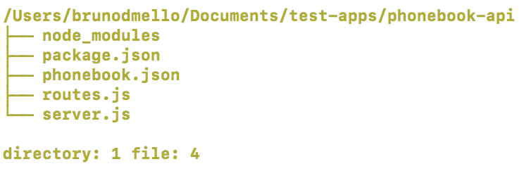
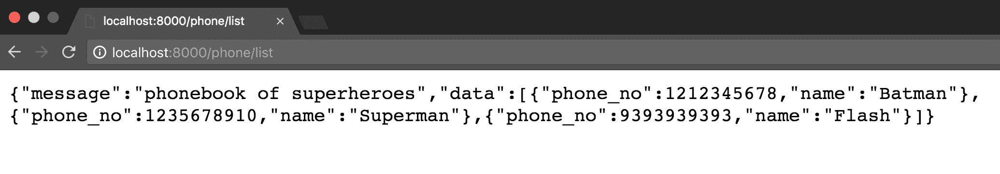

# 第十一章：流行的 Node.js Web 框架

在本书中，我们专注于使用 Express.js 作为我们的首选 Web 框架，主要是因为它是 Node.js 最流行的 Web 开发框架之一。它已经存在了相当长的时间，并且被广泛使用。然而，还有许多可供选择的替代框架，我想向您介绍。其中一些框架比 Express.js 更强大和稳健，而另一些则与之相当，或者功能稍微少一些。

在本章中，我们将简要介绍以下框架：

+   Koa

+   Meteor

+   Sails

+   Flatiron

+   total.js

+   loopback

+   Hapi

最后，我们将使用 Hapi 中的一个框架来构建一个服务器 API。这个服务器 API 将在下一章中由 Angular 4 构建的客户端应用程序使用。构建这个 Web 应用程序的整个目的是研究如何根据项目选择框架，以及不同的框架有不同的特点，但都建立在 Node.js 的共同平台上。

# Koa

**Koa**是由创建 Express.js 的同一团队设计的新的 Web 框架。Koa 的目标是更小、更有表现力，以及更坚固的 Web 应用程序基础。Express 框架的创建者 T J Holowaychuk 也是 Koa 的创建者，你可以看到它将大部分的功能都集中在生成器上，这是其他流行编程语言中的特性，比如 Python、C#和 Ruby。生成器是在 ECMAScript 6 中引入到 JavaScript 中的。生成器可以防止在 Node.js 开发过程中常见的回调地狱。Koa 具有轻量级的架构，因此它不包含任何中间件；相反，它将实现某些功能的选择留给开发人员。

有关 Koa 和示例实现的更多信息可以在其网站以及[`github.com/koajs/koa`](https://github.com/koajs/koa)上找到。

# Meteor

**Meteor**是一个简单而完整的 Web 框架，旨在让任何技能水平的开发人员能够在较短的时间内构建强大的 Web 应用程序。

它具有一个方便的 CLI 工具，可以快速搭建新项目。

Meteor 提供了一些核心项目/库，例如 blaze、DDP、livequery 等，具有统一的构建系统。这简化了整个开发过程，并提供了一致的开发者体验。

Meteor 旨在通过在服务器端提供分布式数据协议和在客户端端提供透明的反应式渲染来构建实时应用程序。有关更多详细信息，请访问[`meteor.com/features`](http://meteor.com/features)。

该框架的另一个显著特点是其广泛的包系统，名为**atmosphere**，其中包含了大多数常见应用程序的模块

用例。

它正在迅速获得关注，并且每天都变得越来越受欢迎。目前，它的 GitHub 存储库已经拥有超过 38,000 个星标！

有关 Meteor 的更多信息可以在其网站以及其官方 GitHub 存储库[`github.com/meteor/meteor`](https://github.com/meteor/meteor)上找到。

# Sails

**Sails**是另一个用于使用 Node.js 构建 Web 应用程序的出色的 MVC 框架

有时会将自己与 Ruby on Rails 进行比较。与 Meteor 不同，Sails 是数据库无关的，因此您选择哪种数据存储方式并不重要。Sails 包括一些方便的脚手架工具，例如自动生成 RESTful API 的工具。`Socket.io`，

一个用于 Node.js 的实时通信框架，内置在 Sails 中，因此，在应用程序中包含实时功能应该是轻而易举的。Sails 具有一些不错的生产级自动化功能，通常需要由诸如 Grunt.js 或 Gulp 之类的工具来处理（包括前端 CSS 和 JavaScript 的最小化和捆绑）。Sails 还包括应用程序的基本安全性和基于角色的身份验证，如果您需要该级别的功能。与 Express 相比，Sails 可以被认为是一个更全面的企业级框架，因为它几乎具有像 Rails 这样的流行框架的每个功能。Sails 网站位于[`sailsjs.com`](http://sailsjs.com)。

有关 Sails 的更多信息可以在其网站上找到，以及其官方 GitHub 存储库[`github.com/balderdashy/sails`](https://github.com/balderdashy/sails)。

# Flatiron

**Flatiron**是另一个 Node.js MVC Web 应用程序框架。Flatiron 与其他框架的不同之处在于其基于包的方法。由于它赋予了决定框架应该包含多少或多少的权力和自由，开发人员可以挑选并选择他们想要使用并包含在项目中的包。它通过提供一个强大的 ODM 来处理大部分基本数据管理职责和 CRUD，从而为您处理大部分繁重的工作。

有关 Flatiron 的更多信息可以在其网站上找到，以及其官方 GitHub 存储库[`github.com/flatiron/flatiron`](https://github.com/flatiron/flatiron)。

# total.js

另一个 Node.js HMVC 框架是 total.js。正如其名称所示，它提供了从 Web 应用程序到 IOT 应用程序的全面解决方案。你说一个功能，`total.js`都有；这就是`total.js`的特点。它支持大量功能，如图像处理、工作者、生成器、静态文件处理、站点地图、缓存机制、SMTP 等等。

减少使用第三方模块的需求。它在过去三年中得到了强大的社区支持，并且再次成为一个可以在功能开发的各个方面超越其他框架的强大竞争者。

关注所有更新的链接：[`www.totaljs.com/`](https://www.totaljs.com/)。

# LoopBack

IBM 和 StrongLoop 设计了最强大的现代 Node 框架之一，名为**LoopBack**。启动 API 服务器所需的工作量很小。LoopBack 内部有一个名为 API 资源管理器的客户端，它记录 API 并同时提供 API 测试。它是 Sails 框架的强有力竞争者，具有就绪的结构，并且在需要时完全可配置。它具有**访问控制列表**（**ACL**）、移动客户端 SDK、基于约定的配置编码，当然还有 IBM 支持的团队，将长期维护项目。

您可以在以下链接开始使用 LoopBack：[`loopback.io/`](https://loopback.io/)。

# Hapi

**Hapi**是沃尔玛在线移动网站背后团队的成果。构建该网站的团队开发了一套丰富的 Node.js 实用程序和库，可以在**Spumko umbrella**下找到。考虑到沃尔玛网站在任何给定日子都会收到大量流量，沃尔玛实验室的团队在涉及 Node.js 开发和最佳实践时无疑是游刃有余。Hapi 是从现实世界的试错中诞生的 Web 框架。Hapi 网站位于[`hapijs.com`](http://hapijs.com)。

有关 Hapi 的更多信息可以在其网站上找到，以及其官方 GitHub 存储库[`github.com/spumko/hapi`](https://github.com/spumko/hapi)。在下一节中，我们将在 Hapi 框架中实现一组 API。

# 启动 Hapi.js

在之前的章节中，我们学习并实现了 Express 框架。Express 社区将其称为最简档的框架，因此它提供了性能优势。对于构建任何应用程序，选择正确的框架是应用程序可扩展性的最重要因素之一。在 Hapi 的情况下，它具有不同的路由机制，通过其可配置的代码模式提高了应用程序的性能。开发人员始终建议考虑框架提供的所有优势和劣势，以及应用程序的功能实现和长期目标。让我们通过一个小型原型来了解 Hapi 框架。

以下步骤提供了使用电话簿示例逐步学习 Hapi 框架实现的经验。建议在阅读时进行编码以获得更好的学习效果。

# 搭建 Hapi 应用程序

创建一个名为 phone book-API 的目录，并通过``cd phonebook-api``导航到该目录。使用`npm init`初始化一个 node 项目，并完成`npm`提供的问卷调查。使用以下命令安装 Hapi 框架：

```js
npm install hapi --save
```

# 设置服务器

首先要编写的文件必须是一个`server`文件，所以让我们创建一个``server.js``。使用`hapi`框架启动`server`所需的最小代码如下：

```js
const hapi = require('hapi');
const server = new hapi.Server();
server.connection({
    host: 'localhost',
    port: 8000,
    routes: { cors: true }
});
// Start the server
server.start((err) => {
    if (err) {
        throw err;
    }
    console.log('Server running at:', server.info.uri);
});
```

在审查了前面的代码之后，我们可以观察到`hapi`通过首先配置所有必需的数据来启动其服务器。它以主机和端口作为输入，然后最终启动服务器。如果我们将其与 express 进行比较，express 首先需要一个回调作为输入，然后才是监听部分。

# 创建 API

下一个重要的步骤是创建路由。在任何框架中实现路由时，始终建议遵循模块化，以便长期维护代码。话虽如此，让我们创建一个`routes.js`文件。由于我们不打算使用诸如 MongoDB 或 MySQL 之类的数据库，让我们为支持数据源创建一个名为`phonebook.json`的`json`文件。让我们在`json`文件中创建以下数据：

```js
{
 "list": [
 {
   "phone_no": 1212345678,
   "name": "Batman"
 },
 {
   "phone_no": 1235678910,
   "name": "Superman"
 },
 {
   "phone_no": 9393939393,
   "name": "Flash"
 }]
}
```

我们的 API 目录结构如下：



# 创建基于配置的架构

`hapi`的配置代码模式随处可见，甚至用于创建路由。让我们通过在下面的片段中添加一个简单的`GET`方法和它的处理程序来理解它：

```js
let phonebook = require('./phonebook');
module.exports = [{
    method: 'GET',
    path: '/phone/list',
    config: {
        handler(request, reply) {
            reply({
                message: "phonebook of superheroes",
                data: phonebook.list
            });
        }
    }
}]
```

上面的片段显示了创建路由所需的最小配置。它包括`request`方法，可以是`'GET'`、`'POST'`等；用于 URL 导航目的的 URL 路径；以及包含请求处理程序的`config`属性。此处理程序用于在收到请求时编写各种业务逻辑。

现在，在`server.js`中包含路由文件，并在服务器启动之前将路由分配给`hapi`服务器。因此，总结一下，在`server.js`中有以下代码：

```js
const hapi = require('hapi');
const server = new hapi.Server();
const routes = require('./routes');
server.connection({
    host: 'localhost',
    port: 8000,
    routes: { cors: true }
});
//Add the routes
server.route(routes);
// Start the server
server.start((err) => {
    if (err) {
        throw err;
    }
    console.log('Server running at:', server.info.uri);
});
```

让我们在浏览器中访问路由并查看响应：



同样，我们可以添加、更新和删除电话簿中的条目。我们的`routes.js`将如下所示：

```js
let phonebook = require('./phonebook');
module.exports = [{
    method: 'GET',
    path: '/phone/list',
    config: {
        handler(request, reply) {
            reply({
                message: "phonebook of superheroes",
                data: phonebook.list
            });
        }
    }
}, {
    method: 'POST',
    path: '/phone/add',
    config: {
        handler(request, reply) {
            let payload = request.payload;
            phonebook.list.unshift(payload);
            reply({
                message: "Added successfully",
                data: phonebook.list
            });
        }
    }
}, {
    method: 'PUT',
    path: '/phone/{phno}',
    config: {
        handler(request, reply) {
            let payload = request.payload;
            let phno = request.params.phno;
            var notFound = [];
            for (let i = phonebook.list.length - 1; i >= 0; i--) {
                if (phonebook.list[i].phone_no == phno) {
                    phonebook.list[i].name = payload.name;
                    reply(phonebook.list);
                    return;
                } else {
                    notFound.push(i);
                }
            }
            if (notFound.length == phonebook.list.length) {
                reply('not Found');
                return;
            }
        }
    }
}, {
    method: 'DELETE',
    path: '/phone/{phno}',
    config: {
        handler(request, reply) {
            let phno = request.params.phno;
            var notFound = [];
            for (let i = phonebook.list.length - 1; i >= 0; i--) {
                if (phonebook.list[i].phone_no == phno) {
                    phonebook.list.splice(i, 1);
                    reply({
                        message: "Delete successfully",
                        data: phonebook.list
                    });
                    return;
                } else {
                    notFound.push(i);
                }
            }
            if (notFound.length == phonebook.list.length) {
                reply('not Found');
                return;
            }
        }
    }
}];
```

我们需要使用浏览器扩展来测试前面的 REST API。POSTMAN 是 REST API 调用的流行扩展之一。请参考第八章，了解 POSTMAN 的详细信息。

哇！我们的服务器 API 已经准备就绪。在下一章中，我们将通过创建一个前端应用程序来使用这些 API 调用。

# 概要

尽管我们在本书中专门使用了 Express.js，但在使用 Node.js 创建 Web 应用程序时还有许多其他选项可供选择。我们研究了

本章介绍了其中一些选项，包括 Meteor、Sails、Hapi、Koa 和 Flatiron。每个框架都有其自身的优势和劣势，以及对 Web 应用程序所需的标准功能的独特方法。

就是这样，伙计们！我希望使用 Node.js 和 MongoDB 构建 Web 应用程序的不同方面能够带领读者以渐进的方式学习和开发一个令人惊叹的想法。嗯，这只是个开始。我建议您关注您自己应用程序中将要使用的所有技术或库的开发者社区。

使用 Node.js 进行 Web 开发的美妙之处在于如何完成单个任务没有意见的短缺。MVC 框架也不例外，从本章可以看出，有很多功能强大且功能丰富的框架可供选择。
