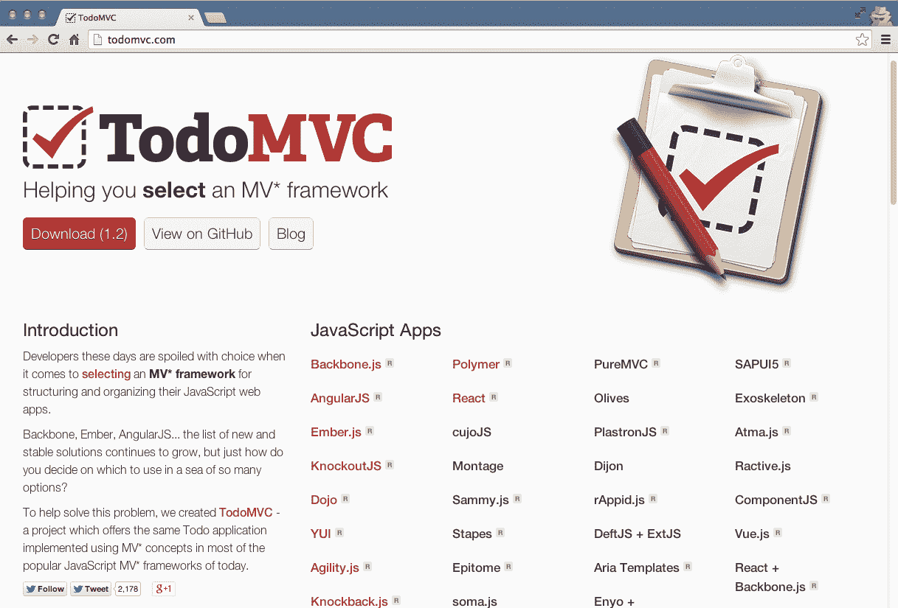
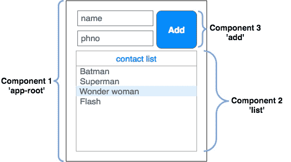
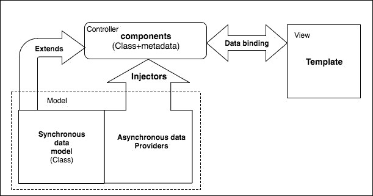
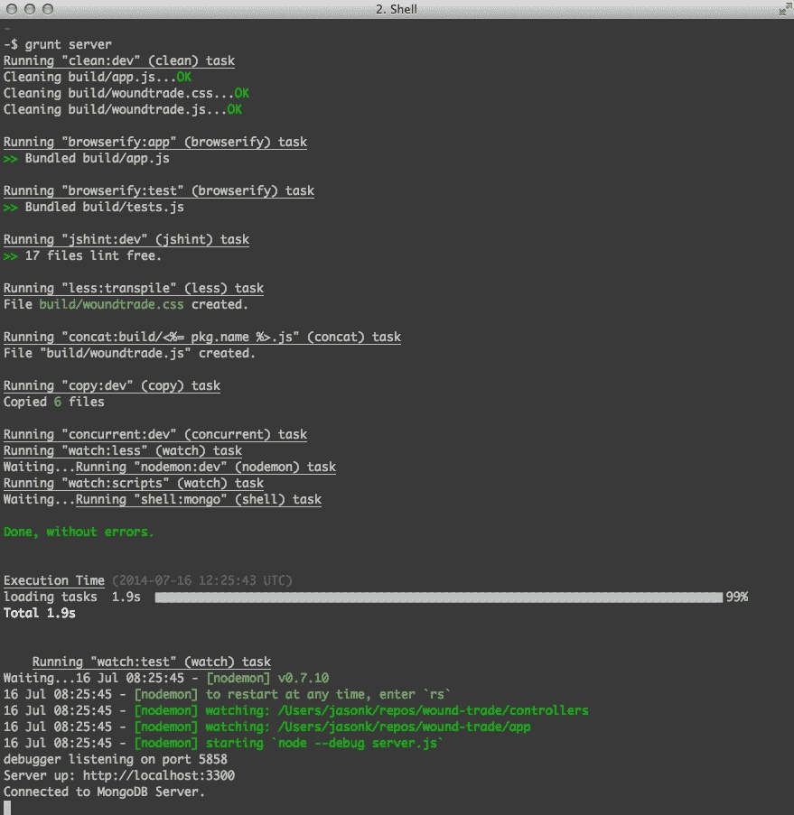
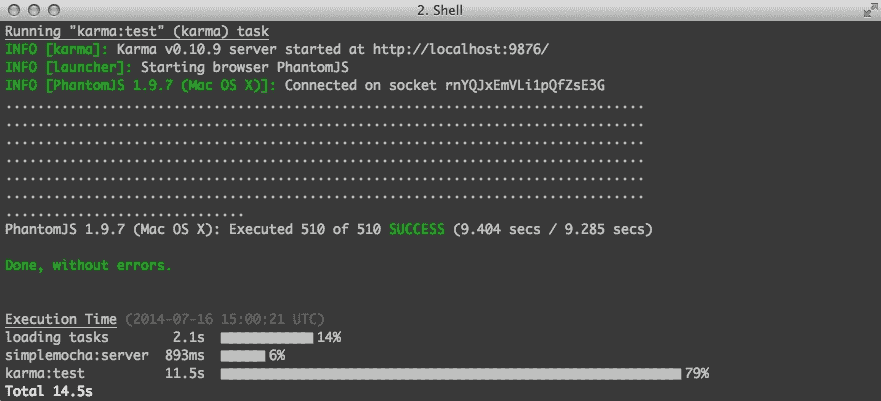

# 第十二章：使用受欢迎的前端框架的单页应用程序

在本章中，我们将从前端的角度来看待 Web 应用程序开发，特别是**单页应用程序**（**SPA**），也称为厚客户端应用程序。使用 SPA，大部分的呈现层被卸载到浏览器中，浏览器负责呈现页面、处理导航，并向 API 发出数据调用。

在本章中，我们将涵盖：

+   为什么要使用前端框架，比如 Backbone.js、Ember.js 或 Angular.js？

+   单页应用程序到底是什么？

+   受欢迎的前端开发工具，如 Grunt、Gulp、Browserify、SAAS 和 Handlebars

+   前端的测试驱动开发

# 为什么使用前端框架？

我们使用框架来提高我们的生产力，让我们保持理智，并且通常来说，让我们的开发过程更加愉快。在本书的大部分章节中，我们使用了 Node.js 的 Express.js MVC 框架。这个框架允许我们组织我们的代码，并且它将大量样板代码抽象出来，释放出我们的时间来专注于我们的自定义业务逻辑。同样的情况也适用于应用程序的前端。任何复杂的代码最终都需要得到适当的组织，我们需要使用一套标准的可重用工具来完成常见的任务。Express.js 在编写我们的 Node.js 后端代码时让我们的生活变得轻松。同样，也有许多受欢迎的前端框架可以依赖。

# 什么是单页应用程序？

复杂的 Web 应用程序的当前趋势是模拟桌面应用程序，并远离传统网站的感觉。对于传统网站，与服务器的每次交互都需要一个完整的页面后退，这使得一个完整的往返。随着我们的 Web 应用程序变得更加复杂，发送和从服务器检索数据的需求增加了。

如果每次都依赖完整的页面后退，我们需要方便其中一个请求；我们的应用程序会感觉迟钝和无响应，因为用户将不得不等待每个请求的完整往返。用户现在对他们的应用程序有更多的需求，如果你考虑一下我们编写的应用程序，点赞按钮就是一个完美的例子。只是因为我们想要增加一个计数器，就必须向服务器发送完整的页面后退，这似乎是很多不必要的开销。幸运的是，我们能够很容易地使用 jQuery 和 AJAX 来纠正这一点。这是单页应用程序如何工作的一个完美例子（只是在一个更大的规模上）。

第一个突出的单页应用程序的一个很好的例子是谷歌的 Gmail。Gmail 为您提供了一个类似于 Microsoft Outlook 或任何传统基于桌面的电子邮件客户端的界面。用户与应用程序的交互感觉就像与桌面应用程序一样响应——*页面*永远不会重新加载，您可以轻松切换应用程序中的窗格和选项卡，并且数据在实时中不断刷新和更新。

创建 SPA 通常涉及将单个 HTML 页面作为应用程序的源，该页面加载所有必要的 JavaScript 以触发一系列事件，包括：

+   **引导应用程序**：这意味着通过 AJAX 连接到服务器以下载必要的启动数据

+   **根据用户操作呈现屏幕**：这意味着监视用户触发的事件并操作 DOM，以便隐藏、显示或重绘应用程序的部分，从而模拟桌面应用程序的感觉

+   **与服务器通信**：这意味着使用 AJAX 不断地向服务器发送和接收数据，从而保持通过浏览器的有状态连接的幻觉

# TodoMVC 项目

在决定为下一个大型前端项目选择哪个前端框架时，决策过程可能会让人不知所措！跟踪所有不同的框架以及每个框架的利弊似乎是徒劳的练习。幸运的是，人们已经回应了这一呼吁，有一个方便的网站不仅演示了几乎每个框架编写的相同应用程序，而且还为每个框架提供了完整的注释源代码！

TodoMVC 项目，[`todomvc.com`](http://todomvc.com)，是一个专注于创建一个简单的单页面待办事项应用程序的网站，使用了每个经过验证的 JavaScript MVC 框架编写；甚至有一个用原生 JavaScript 编写的！因此，跳入一个框架的最简单方法是查看其 TodoMVC 代码示例：



一定要花些时间查看网站并深入了解每个特色框架。通过以完全不同的方式编写相同的代码，您可以对不同的框架有一个很好的感觉；没有两个是相同的，最终，您需要评估并找出您更喜欢哪个以及原因。

为了简洁起见，我将专注于我个人喜欢并认为处于当前领先地位的三个。

# Backbone.js

**Backbone.js**是一个非常轻量级（生产中为 6.5 KB）的 MV*框架，已经存在了几年。它拥有一个非常庞大的用户群，并且许多大型网络应用程序都是使用这个框架编写的：

+   今日美国

+   Hulu

+   领英

+   Trello

+   Disqus

+   可汗学院

+   沃尔玛移动

如果您熟悉 jQuery 并且已经使用它一段时间，并且想要开始改进您的代码组织和模块化，那么 Backbone.js 是一个很好的起点。此外，Backbone.js 需要 jQuery 并且与之紧密集成，因此在您逐渐进入这个前端开发的新世界时，这就少了一件要担心学习的事情。

Backbone.js 的基本思想是模型、集合、视图和路由器。看一下以下几点：

+   模型是存储和管理应用程序中所有数据的基本元素

+   集合存储模型

+   视图将 HTML 呈现到屏幕上，从模型和集合中检索动态数据

+   路由器为应用程序的 URL 提供动力，使每个应用程序的各个部分都有自己独特的 URL（实际上不加载实时 URL），最终将整个应用程序联系在一起

由于 Backbone.js 非常轻量级，可以非常快速地组合一个非常小而简单的示例代码集：

```js
var Person = Backbone.Model.extend(); 
var PersonView = Backbone.View.extend({ 
    tag: 'div', 
    render: function() { 
        var html = [ 
            this.model.get('name'), 
            '<br/>', 
            this.model.get('website') 
        ].join(''); 

        this.$el.html(html); 

        return this;     
    } 
}); 

var person = new Person({ 
        name: 'Jason Krol', 
        website: 'http://kroltech.com' 
    }), 
    view = new PersonView({ model: person }); 

$('body').append(view.render().el); 
```

需要注意的一件事是，Backbone.js 本质上是如此轻量级，以至于它不包括您期望立即使用的大多数功能。正如您在前面的代码中所看到的，在我们创建的`View`对象中，我们必须提供一个手动为我们呈现 HTML 的`render`函数。因此，许多人都对 Backbone.js 望而却步，但其他人则因其为开发人员提供的原始力量和灵活性而拥抱它。

传统上，您不会像在前面的示例中那样将所有代码放入单个文件中。您将把模型、集合和视图组织到单独的文件夹中，就像我们在 Node.js 应用程序中组织代码一样。将所有代码捆绑在一起将是构建工具的工作（这将在本章后面讨论）。

您可以通过访问其官方网站[`backbonejs.org`](http://backbonejs.org)了解更多关于 Backbone.js 的信息。还要不要忘了在 TodoMVC 网站上检查待办应用程序的 Backbone.js 实现！

我在 GitHub 上维护了一个存储库，其中有一个使用我们在本书中涵盖的完整堆栈的样板 Web 应用程序的完整代码，以及用于前端的 Backbone.js 和 Marionette。欢迎访问[`github.com/jkat98/benm`](http://github.com/jkat98/benm)（Backbone、Express、Node 和 MongoDB）。

# Ember.js

Ember.js 自称为*创建雄心勃勃的 Web 应用程序的框架*。Ember 的目标是针对相当大规模的单页应用程序，因此使用它构建非常简单的东西可能看起来有些大材小用，但这当然是可行的。一个公平的评估是查看 Ember 库的生产文件大小，大约为 90 KB（而 Backbone.js 为 6.5 KB）。也就是说，如果你正在构建一个非常强大的、代码量很大的东西，那么额外的 90 KB 对你来说可能并不是什么大问题。

以下是一个使用 Ember.js 的非常小的示例应用程序：

```js
var App = Ember.Application.create(), 
    movies = [{ 
        title: "Big Trouble in Little China", 
        year: "1986" 
    }, { 
        title: "Aliens", 
        year: "1986" 
    }]; 

App.IndexRoute = Ember.Route.extend({ 
    model: function() { 
        return movies;  
    } 
}); 

<script type="text/x-handlebars" data-template-name="index"> 
    {{#each}} 
        {{title}} - {{year}}<br/> 
    {{/each}} 
</script> 
```

Ember.js 的代码看起来与 Backbone.js 的代码有些相似，因此并不奇怪，许多经验丰富的 Backbone.js 开发人员发现随着对更强大解决方案的需求增加，他们开始迁移到 Ember.js。Ember.js 使用熟悉的项目，包括视图、模型、集合和路由，以及一个`Application`对象。

此外，Ember.js 具有组件功能，这是它更强大和受欢迎的功能之一。通过组件，你可以创建小型、模块化、可重用的 HTML 组件，根据需要将其插入到应用程序中。使用组件，你基本上可以创建自己的自定义 HTML 标签，其外观和行为完全按照你定义的方式进行定义，并且可以在整个应用程序中轻松重用。

使用 Ember.js 开发完全遵循约定。与 Backbone.js 不同，Ember.js 试图消除大量样板代码，并为你做出一些假设。因此，你需要以一定的方式进行操作，控制器、视图和路由需要遵循一定的命名约定。

Ember.js 网站提供了令人难以置信的在线文档和入门指南。如果你对 Ember.js 想了解更多，请访问[`emberjs.com/guides/`](http://emberjs.com/guides)。另外，不要忘记查看 TodoMVC 的实现！

# React.js

从未有过如此激烈的竞争来适应新的 JavaScript 技术。现在是 JavaScript 的最佳时机。Facebook 团队有一个强大的竞争者，名为`React.js`。因此，与 Angular 等其他 MVC 框架不同，`React.js`只是 Model-View-Controller 中的视图。它轻巧且渲染速度惊人。代码的基本封装单元称为组件。这些组件组合在一起，形成一个完整的 UI。让我们使用 es6 类为打招呼的示例创建一个简单的组件，如下所示：

```js
class Greet extends React.Component {
  render() {
      this.props.user = this.props.user || 'All';
      return ( < div >
          <
          h4 > Greeting to { this.props.user }! < /h4> <
          /div>);
  }
}
```

前面的片段创建了一个简单的类来向用户打招呼。我们扩展了`React.component`以提供其公共方法和变量在`Greet`类中的访问权限。每个创建的组件都需要一个`render`方法，其中包含了相应组件的 html 模板。`props`是一个公共变量，用于从容器传递数据到子组件，依此类推。

现在，我们需要在 HTML 文档中加载组件。为了做到这一点，我们需要在`React.js`库全局提供的`reactDOM`API 下注册。可以按照以下方式完成：

```js
ReactDOM.render(
 <Greet user="Developers" />,
 document.getElementById('root')
);
```

`ReactDOM`对象的`render`方法需要两个参数。首先是根节点，其次是根元素。根节点是用于声明不同父组件的主机元素。根元素`<div id="root" />`写在我们的`index.html`的 body 中，用于承载`React`组件的整个视图。

`reactDOM`负责创建虚拟 DOM 并观察每个组件的任何更改。只重新渲染已更改/操作的部分，保持其他组件不变。这提高了应用程序的性能。我们所了解的组件中的更改也称为组件的状态，由不同的库（如`reflux.js`或`redux.js`）维护。[](http://redux.js/)另一个重要的特性是使用 props 进行单向绑定。props 只是将数据传递给视图的一种方式。一旦搭建和数据流设置好，React 项目就能提供出色的可扩展代码和复杂项目的易维护性。React.js 上有大量的项目列表[`github.com/facebook/react/wiki/sites-using-react`](https://github.com/facebook/react/wiki/sites-using-react)。一旦你熟悉了 React web 应用程序，你就可以轻松切换到 React Native，创建令人惊叹的原生移动应用程序。

# Angular

Angular 之所以如此火爆，主要是因为它是由谷歌（开源）构建的。Angular 基本上就像是给 HTML 加上了类固醇。您创建的应用程序和页面使用我们都习惯的常规 HTML，但它们包括许多新的和自定义指令，扩展了 HTML 的核心功能，赋予了它强大的新功能。

Angular 的另一个伟大特性是，它是由一群经验丰富的非 Web 开发人员构建的，因为它经过了严格测试并支持依赖注入。这是一个框架，它不会让创建复杂的 Web 应用程序感觉像传统的 Web 开发。

然而，不要误解；JavaScript 在 Angular 的开发中仍然扮演着重要角色。新的 Angular 2.0，现在是 4.0，已经成为当今最广泛使用的框架之一。它不仅引入了 TypeScript 来实现代码的语法模块化，还提供了新的语义，如组件（而不是控制器）、管道、生命周期钩子等功能。让我们通过实现一个简单的客户端应用程序来更多了解 Angular，该应用程序使用了上一章中创建的 phone-API。

与 Angular.js 不同，Angular 2.0 是一个完整的框架，而不是一个可包含的单个文件。这个框架带有许多功能，如 rxJs、TypeScript、systemJs 等，提供了代码的集成开发。Angular 团队提供了简单的步骤来设置 Angular 2.0 种子应用程序。然而，开发人员也可以手动创建 Angular 项目所需的最小文件列表，尽管这并不被推荐，而且也很耗时。对于我们的客户原型，我们将按照[angular.io](http://angular.io/)提供的 Angular 快速入门步骤，然后将我们的功能集成到其中。让我们按照这些步骤进行。

# 搭建 Angular 应用程序

前往[`angular.io/guide/quickstart`](https://angular.io/guide/quickstart)并按照三个步骤进行操作：

1.  安装`Angular/cli`。使用以下命令进行全局安装：

```js
npm install -g @Angular/cli
```

1.  使用以下命令创建一个名为`phonebook-app`的新项目：

```js
ng new phonebook-app
```

1.  通过`cd phonebook-app`进入`phonebook-app`目录。最后，使用`ng serve --open`来启动应用程序。`ng serve`命令用于在开发过程中监视更改、转译和重建应用程序。`--open`是一个可选的命令行参数，用于在浏览器选项卡中打开应用程序。在这里，如果出现错误，请确保通过**`npm install`**命令重新安装 npm 包。

谷歌对转译的定义是将一种语言的源代码转换为另一种具有相似抽象级别的语言的过程。简单来说，这意味着我们将使用 TypeScript 编写代码，然后将其转换为 JavaScript（因为它在浏览器中运行）。

解释项目中的每个文件超出了本书的范围，但是，我们主要关注 Angular 的基本构建块以便开始。我们目前的主要关注点是`src/app`目录。在创建组件之前，让我们为我们的应用程序添加 Twitter 的 bootstrap 链接以进行基本样式设置[.](http://app.in/)在我们的`src`目录中，我们有`index.html`。在`header`标签中插入以下 HTML 代码：

```js
<link rel="stylesheet" href="https://maxcdn.bootstrapcdn.com/bootstrap/3.3.7/css/bootstrap.min.css" integrity="sha384-BVYiiSIFeK1dGmJRAkycuHAHRg32OmUcww7on3RYdg4Va+PmSTsz/K68vbdEjh4u" crossorigin="anonymous">
```

# 理解 TypeScript 和 es6

TypeScript 是 JavaScript 的超集，它编译成干净的 JavaScript 输出。

- [`github.com/Microsoft/TypeScript`](https://github.com/Microsoft/TypeScript)

正如其名称所示，TypeScript 意味着类型语言，这要求我们在代码中声明数据类型。这可以在不同的语言中看到，比如 Java、C#等。在 TypeScript 中，变量的声明使用冒号注释，如下所示：

```js
let name : string = "Bruno";
```

其次，JavaScript 包含大多数（但不是全部）面向对象的特性。因此，它可以在语义上实现，但在语法上没有规定。例如，面向对象编程的一个重要特性是封装；让我们来比较一下：

| **TypeScript 代码** | **JavaScript 代码（ES5）** |
| --- | --- |

|

```js
class GreetTheWorld {
     greet() {
         return "Hello World";
     }
 }
```

|

```js
var GreetTheWorld = (function () {
     function GreetTheWorld() {
     }
     GreetTheWorld.prototype.greet = function () {
         return "Hello World";
     };
     return GreetTheWorld;
 }());
```

|

最终，使用 TypeScript 作为其主要脚本语言的框架将其编译（转换）为 es5 JavaScript。新的 es6 充当了 es5 和 TypeScript 之间的桥梁。到目前为止，es6 已逐渐将 TypeScript 功能实现到 JavaScript 中，例如类。了解这一点，我们将很容易理解在 Angular 框架中使用 TypeScript 的用法。要进行更深入的学习，我们可以参考[`www.TypeScriptlang.org/docs/home.html`](https://www.typescriptlang.org/docs/home.html)。

# 模块和组件

Angular 2.0 提供了基于组件的方法来实现代码的重用性和可维护性。通过将每个功能组件化，可以轻松复制或重用它们。让我们为项目创建一个框架，以便我们可以从项目中挑选出这些组件：



在我们的项目结构中，我们已经有`app.component.ts`作为我们的组件文件。我们已经在组件元数据的`selector`属性中指定了我们的`app-root`组件。这个文件将用于处理根或父元素。根据前面的框架，这个文件包含了`app-root`组件：

```js
import { Component } from '@Angular/core';
@Component({
    selector: 'app-root',
    templateUrl: './app.component.html',
    styleUrls: ['./app.component.css']
})

export class AppComponent {}
```

确保每个组件都附加了一个类，这样我们就可以导出一个`component`类，并在`app.modules.ts`中将其注册为 Angular 组件。为了简洁起见，我们遵循标准的命名约定，即将类名的第一个字母大写，然后导入作为组件的 Angular 类前缀。因此，在 app `module.ts`文件中，我们有以下代码：

```js
import { BrowserModule } from '@Angular/platform-browser';
import { NgModule } from '@Angular/core';
import { AppComponent } from './app.component';
@NgModule({
    declarations: [AppComponent],
    imports: [BrowserModule],
    providers: [],
    bootstrap: [AppComponent]
})
export class AppModule {}
```

一旦在`NgModule`中注册，我们需要将根组件传递给 bootstrap 方法/属性。Bootstrap 处理加载到我们决定使用的平台上。

根据设计，在应用组件中，我们只有一个轮廓，它将作为其他组件的容器，因此，让我们创建一个模板。创建一个带有 HTML 代码的文件`app.component.html`和其相关的 css 文件，如下所示：

`app.component.html`

```js
<div class="outter">
<!-- <subscribe></subscribe>-->
<!-- <list></list> -->
</div>

```

`app.component.css`

```js
.outter {
    padding: 20 px;
    border: solid 2 px# AAA;
    width: 200 px;
}
```

运行此代码后，我们在浏览器中得到了一个简单的轮廓。使用`ng serve`来运行应用程序。

# Angular 数据流架构

为了简要了解数据流，让我们比较一下 MVC 是如何在 Angular 中实现的。考虑以下图表：



该图包含了 Angular 2.0 中的基本块，而不是所有的特性。该模型包含静态数据或同步数据类，这些类在组件中被扩展或导入。组件充当包含业务逻辑的控制器。每个组件都有元数据，它将其与模板连接起来。最后，数据绑定到`component`类变量，并在模板中可用。现在，对于我们的应用程序，我们需要显示联系人数据列表；因此，我们将在新的组件文件`list.component.ts`中使用数据绑定的这一特性。该文件提供了在电话簿中列出联系人的逻辑。始终遵循包含组件的三个步骤。

1.  为列表组件创建元数据和类以及其模板。因此，我们有`list.component.ts`，其中包含以下代码：

```js
import { Component } from '@Angular/core';
@Component({
    selector: 'list',
    templateUrl: './list.component.html'
})
export class ListComponent {
    public phoneList = []
    constructor() {
        this.phoneList = [{
            name: 'Superman',
            phno: 1234567890
        }, {
            name: 'Batman',
            phno: 2222222890
        }]
    }
} 
```

它还包括其模板`list.component.html`：

```js
<div>
    <div class="list-group">
        <div class="list-group-item list-group-item-info">
            Contact list
        </div>
        <a href="#" *ngFor="let data of phoneList;" class="list-group-item">
 {{data.name}}
 <span class="badge">{{data.phone_no}}</span>
 </a>
   </div>
<div>
```

1.  将组件包含在`app.module`中，并在声明属性中注册，如下所示：

```js
import { ListComponent } from './list.component';
@NgModule({
    declarations: [
        AppComponent,
        ListComponent
    ],
    imports: [
        BrowserModule
    ],
    providers: [],
    bootstrap: [AppComponent]
})
```

1.  第三步是包含用于呈现组件的模板。我们已经有了我们的根组件`root-app`。因此，取消`app.component.htm`中的`list`标记。可以按照以下方式完成：

```js
<div class="outter">
<!-- <subscribe></subscribe>-->
    <list>&lt;/list>
</div>
```

# 服务

上述片段包含绑定到`phoneList`属性的静态数据，因此相应地呈现，这是一个同步操作。现在，如果我们需要显示异步数据怎么办？让我们消耗我们的电话簿 API 并为我们的客户端创建一个 HTTP 服务，以便我们可以显示异步数据。让我们创建一个名为`phonebook.service.ts`的服务文件。该文件包含了获取和设置数据所需的所有 HTTP `request` 方法。现在，让我们创建一个`getContactlist`方法，它将获取服务器上存在的所有联系人数据。所需的代码如下：

```js
import { Injectable } from '@Angular/core';
import { HttpClient } from '@Angular/common/http';
import 'rxjs/add/operator/map'
@Injectable()
export class PhonebookService {
    constructor(private http: HttpClient) {}
    getContactList() {
        return this.http.get('http://localhost:8000/phone/list')
    }
}
```

在这里，我们导入了`HttpClient`服务，用于从浏览器发出 XML HTTP 请求。`Injectable`函数是必需的，以使此文件成为服务提供者。在可注入的元数据中没有提供元数据，因为 Angular 本身将发出元数据。接下来，我们将通过在组件的`constructor`中注入它来使用此服务。我们在构造函数中传递了一个参数化值，这被称为依赖注入。

将当前代码修改为`list.components.ts`的以下代码：

```js
import { Component } from '@Angular/core';
import { PhonebookService } from './phonebook.service';
@Component({
    selector: 'list',
    templateUrl: './list.component.html'
})
export class ListComponent {
    public phoneList = []
    constructor(private _pbService: PhonebookService) {
        this._pbService.getContactList()
            .subscribe((response) => {
                this.phoneList = response['data'];
            })
    }
}
```

最后，我们需要在`app.modules`的提供者下注册服务，因为我们在整个应用程序中都在使用它。在这一步，我们需要在`app.modules`中有以下代码：

```js
import {HttpClientModule} from '@Angular/common/http';
import {PhonebookService} from './phonebook.service';
```

并将其包含在`ngModule`的提供者列表中：

```js
@NgModule({
    declarations: [
        ListComponent,
        AppComponent
    ],
    imports: [
        BrowserModule,
        HttpClientModule
    ],
    providers: [PhonebookService],
    bootstrap: [AppComponent]
})
```

使用`Httpclient`服务，我们首先需要在`NgModules`中注册`httpModule`。

还要确保我们的电话簿 API 节点服务器已经在运行。如果没有，请使用`npm start`启动它，一旦我们启动`ng serve --open`，我们将从服务器接收超级英雄联系人列表。

# 表单

最后但同样重要的是，我们需要创建一个名为`add`的表单组件，用于添加新的电话记录。在 Angular 中，有两种构建表单的方式：模板驱动表单和响应式表单。由于响应式表单是 Angular 的一个新特性，我们将实现它。简而言之，响应式表单通过代码逻辑控制表单指令，而不是在部分中。让我们通过为我们的电话簿应用程序实现它来检查它。

要创建的新组件文件是`add.component.ts`及其`.html`文件，如下所示：

```js
import {
    Component,
    Output,
    EventEmitter
} from '@Angular/core';
import {
    PhonebookService
} from './phonebook.service';
import {
    FormControl,
    FormGroup,
    Validators
} from '@Angular/forms';
@Component({
    selector: 'add',
    templateUrl: './add.component.html'
})
export class AddComponent {
    @Output() onAdded = new EventEmitter < Object > ();
    public newRecordForm = new FormGroup({
        name: new FormControl(),
        phone_no: new FormControl(0, [Validators.required, Validators.minLength(10)])
    });
    constructor(private _pbService: PhonebookService) {
        this.resetForm();
    }
    resetForm() {
        this.newRecordForm.reset();
    }
    onSubmit() {
        if (this.newRecordForm.valid) {
            const payload = this.newRecordForm.value;
            this._pbService.postContactList(payload).subscribe((response) => {
                let newListData = response['data'];
                this.onAdded.emit(newListData);
                this.resetForm();
            })
        }
    }
}
```

在上述代码中，您可能会注意到一些 Angular 的新特性。它们的解释如下：

+   `FormControl`和`FormGroup`：导入`FormControl`，它是一个指令，接受模型数据作为输入，并创建表单元素的实例。这些表单元素可以使用`FormGroup`进行聚合或分组。

+   `Validators`：类验证器提供了验证表单元素的方法。它们作为第二个可选参数传递给`FormControl`，以配置元素的验证。根据应用的条件，它设置一个布尔属性作为有效。

+   `Output`和`EventEmitter`将在后面解释。所以一旦我们的代码准备好了，让我们创建其模板如下：

```js
<form [formGroup]="newRecordForm" (ngSubmit)="onSubmit()" novalidate>
    <div class="form-group">
        <label class="center-block">Name:
            <input class="form-control" formControlName="name">
        </label>
        <label class="center-block">Phone no:
            <input class="form-control" formControlName="phone_no" ngClass="">
        </label>
    </div>
    <input type="submit" name="submit">
</form>
```

在上述代码中，我们可以调查`formGroup`是否是一个以`newRecordForm`作为输入的指令。我们有一个名为`ngSubmit`的事件处理程序，其中包含一个名为`onSubmit`的公共方法。这个方法负责将联系人的详细信息保存到我们的服务器上。这里的最后一个要求是将`newRecordForm`的属性映射到`formControlName`，以便代码逻辑映射到模板中的适当元素。像`form-control`这样的类用于 HTML 元素，只是基本设计的 bootstrap 类。

# 组件通信

现在，我们需要在`app.component.html`中再添加一个更改：

```js
<div class="container">
    <add (onAdded)="onAddedData($event)"></add>
    <list [phoneList]="listData"></list>
</div>
```

我们还需要在`app.component.ts`中添加一个更改，如下所示：

```js
export class AppComponent {
    public listData = [];
    onAddedData(newListData: any) {
        this.listData = newListData;
    }
}
```

这种变化是为了在两个组件之间进行通信。这种通信是为了什么？

当我们在`add`组件中添加新记录时，它需要将新添加的数据发送到列表组件，但不能直接绑定，因此我们使用`@output`将数据绑定回父组件。`EventEmitter`用于通过应用模板中的绑定发出响应数据，如下所示：

`<add (onAdded)="onAddedData($event)"></add>`。

在这里，应用组件充当它们之间的桥梁。一旦父组件在`AddedData`方法中接收到数据，它通过`listData`变量的`@input`绑定与其子列表组件进行通信。

观察浏览器中的变化；`form`组件向列表中添加新数据，我们的电话簿应用程序已经准备好进行第一个原型。

前端框架最近已经带有了一些宗教色彩。发表关于特定框架的负面评论或批评，很可能会遭到支持者的抨击。同样，对特定框架进行积极的讨论，也很可能会遭到关于不同框架如何更好地处理相同主题的攻击。在决定哪种框架适合您和/或您的项目时，通常会涉及个人偏好。在 TodoMVC 网站上展示的每个框架都可以清楚地以其独特的方式实现相同的目标。花一些时间来评估一下，并自行决定！

# 前端开发工具

由于单页应用程序的复杂性，前端开发人员需要熟悉许多日常甚至有时是每分钟的任务的工具套件。

# 自动化构建任务管理器

**构建工具**就是它听起来的样子——用于构建应用程序的工具。当前端开发人员创建和维护应用程序时，可能需要重复执行一些任务，每次文件更改和保存时都需要。使用构建工具，开发人员可以通过将责任转移到可以监视文件更改并执行所需的任意数量任务的自动化任务管理器来释放时间和精力。这些任务可能包括以下任意数量的任务：

+   串联

+   缩小

+   丑化和混淆

+   操纵

+   依赖安装和准备

+   自定义脚本触发

+   并发观察者

+   服务器启动

+   测试自动化

今天一些更受欢迎的构建工具包括 Grunt、Gulp 和 Broccoli。Grunt.js 已经存在多年，并且在开发社区中非常成熟。Gulp 和 Broccoli 相对较新，但迅速获得了认可，并且与 Grunt 的工作方式有所不同。使用 Grunt，您可以使用配置文件定义和管理任务，而使用 Gulp 和 Broccoli，您可以编写 Node.js 代码并使用流的原始力量。许多开发人员发现使用 Grunt 的配置文件相当混乱和令人沮丧，并且发现使用 Gulp 是一种令人耳目一新的改变。但是，很难否认 Grunt 的历史和流行程度。

这三个都是功能丰富的插件生态系统，可以帮助您自动化构建过程中几乎一切和任何事情。

以下是典型 Grunt `build`命令的示例输出：



在典型的单页面应用程序中，构建管理器可以负责下载和安装依赖项，将多个 JavaScript 文件合并为单个文件，编译和 shimming Browserify 模块，对 JavaScript 文件进行语法错误的 linting，将 LESS 文件转换为生产就绪的 CSS 文件，将文件复制到运行时目标，监视文件以重复任何任务，并最后，在代码更改时运行适当的测试-所有这些都可以通过单个命令完成！

Grunt 可以使用`npm`进行安装，并且应该全局安装。执行以下命令在您的机器上安装 Grunt CLI：

```js
    $ npm install -g grunt-cli
```

有关更多信息，请参考官方 Grunt.js 网站上的入门指南[`gruntjs.com/getting-started`](http://gruntjs.com/getting-started)。

此外，还可以查看 Gulp 和 Broccoli，获取更多信息：

+   [`gulpjs.com/`](http://gulpjs.com/)

+   [`github.com/broccolijs/broccoli`](https://github.com/broccolijs/broccoli)

# 依赖管理

实际上有数百万个 JavaScript 库可用，可以帮助您处理从 DOM 操作（`jquery`）到时间戳格式化（`moment.js`）的一切。管理这些库和依赖项有时可能会有点麻烦。对于前端，首选的依赖管理器是 Bower.io。

Bower 的工作方式与 npm 几乎完全相同；它管理`bower.json`文件中的软件包。在前端工作时（例如，您需要一个已知的 JavaScript 库或插件，例如 underscore），只需执行`bower install underscore`，JavaScript 文件将下载到项目中的本地`bower_components`文件夹中。从那里，您可以通过更新构建过程或简单地复制文件并在 HTML 中包含脚本标签来自动包含这些脚本；然后，您就可以开始了。

Bower 可以使用 npm 进行安装，并且应该全局安装。执行以下命令在您的机器上安装 Bower：

```js
    $ npm install -g bower
    $ bower install jquery
    bower cached        git://github.com/jquery/jquery.git#2.1.0
    bower validate      2.1.0 against git://github.com/jquery/jquery.git#*
    bower new           version for git://github.com/jquery/jquery.git#*
    bower resolve       git://github.com/jquery/jquery.git#*
    bower download      https://github.com/jquery/jquery/archive/2.1.1.tar.gz
    bower extract       jquery#* archive.tar.gz
    bower resolved      git://github.com/jquery/jquery.git#2.1.1
    bower install       jquery#2.1.1
    jquery#2.1.1 bower_components/jquery

```

访问 Bower.io 网站([`bower.io`](http://bower.io))，了解更多信息，以及可以通过`bower install`安装的完整脚本目录。

# 模块化

在编写大型 JavaScript 应用程序时，关键是保持源代码组织良好和结构合理。不幸的是，JavaScript 并不天生很好地支持模块化代码的概念。为了解决这个问题，存在两个流行的库，允许您编写模块化代码，并且只依赖于每个代码片段中需要的模块。

前端设计模式的必读资源是 Addy Osmandi 的*Learning JavaScript Design Patterns*，您可以通过访问以下 URL 免费阅读：

[`addyosmani.com/resources/essentialjsdesignpatterns/book/`](http://addyosmani.com/resources/essentialjsdesignpatterns/book/)

Require.js 和 Browserify 是当今最流行的两种模块加载器。每种都有非常独特的语法和自己的一套好处。Require.js 遵循异步模块定义，这意味着每段代码都需要定义自己的依赖关系。就我个人而言，我以前使用过 Require.js，并且最近发现我真的很喜欢使用 Browserify。Browserify 的一个优势是它使用与 Node.js 相同的模块化模式；因此，使用 Browserify 编写前端代码与使用 Node 的感觉相同。您在前端使用`module.exports`和`require`，而且如果在同一个应用程序中在 Node 和前端之间来回切换，您不必担心语法上下文切换。

与之前提到的流行 MVC 框架之一结合使用模块加载器几乎是必需的，因为两者像花生酱和果冻一样搭配得很好！

有关更多信息，请访问以下链接：

+   [`browserify.org/`](http://browserify.org/)

+   [`requirejs.org/`](http://requirejs.org/)

# HTML 模板渲染引擎

幸运的是，我们已经在本书的整个过程中涵盖了 HTML 模板渲染引擎的概念。这些主题和概念直接转移到前端应用程序。在浏览器中有许多不同的 HTML 模板引擎可供选择。

许多模板引擎将基于 mustache，这意味着它们使用`{{`和`}}`进行合并变量。Handlebars 目前是我个人最喜欢的，主要是因为它在应用程序的后端和前端都能很好地工作，我真的很喜欢使用它的帮助程序。Underscore.js 具有内置的`lite`模板渲染引擎，可与 Backbone.js 一起使用，但其语法使用`<%`和`%>`（与经典 ASP 或 ASP.net MVC Razor 语法非常相似）。通常，大多数前端 MVC 框架允许您自定义模板渲染引擎并使用任何您想要的引擎。例如，Backbone.js 可以很容易地设置为使用 Handlebars.js，而不是默认使用 Underscore.js。

以下是当前可用的一些前端模板渲染引擎的简单示例列表：

+   **Underscore.js**：[`underscorejs.org`](http://underscorejs.org)

+   **Handlebars**：[`handlebarsjs.com`](http://handlebarsjs.com)

+   **Mustache**：[`mustache.github.io`](http://mustache.github.io)

+   **Dust.js**：[`akdubya.github.io/dustjs`](http://akdubya.github.io/dustjs)

+   **EJS**：[`embeddedjs.com`](http://embeddedjs.com)

其中一些将在后端和前端都起作用。

# CSS 转译

在 CSS 文件中使用变量和逻辑的想法听起来像是梦想成真，对吧？我们还没有完全实现（至少在浏览器中）；但是，在我们的构建步骤中有一些工具可以让我们在 CSS 文件中使用变量和逻辑并对其进行编译。LESS 和 SASS 是目前最流行的两种 CSS 转译器。它们的行为几乎相同，只是在语法和功能上略有不同。最大的区别是 LESS 是使用 JavaScript 编写的

Node 使用 JavaScript，而 SASS 使用 Ruby；因此，它们在您的计算机上运行需要不同的要求。

以下是一个 SASS 样式表文件示例：

```js
$sprite-bg:url("/images/editor/sprite-msg-bg.png"); 

@mixin radius($radius) { 
  -moz-border-radius: $radius; 
  -webkit-border-radius: $radius; 
  -ms-border-radius: $radius; 
  border-radius: $radius; 
} 

.upload-button { 
    border-bottom: solid 2px #005A8B; 
    background: transparent $sprite-bg no-repeat; 
    @include radius(4px); 
    cursor: pointer; 
} 

#step-status { 
    color:#dbdbdb; font-size:14px; 

    span.active { 
        color:#1e8acb; 
    } 

    &.basic-adjust, &.message-editor { 
        width: 525px; 
    } 

    .icon { 
        height:65px; 
        width: 50px; 
        margin:auto; 
    } 
} 

@import "alerts"; 
@import "attachments"; 
@import "codemirror"; 
@import "drafts"; 
```

从示例代码中可以看出，我们有一些通常在常规 CSS 文件中不起作用的新元素。其中一些包括：

+   为整个样式表定义自定义变量

+   定义 mixin，作为可重用样式的伪函数（带有动态参数）

+   在我们的样式定义中定义 mixin 和变量

+   使用父/子关系嵌套样式

当使用 LESS（或在示例代码中使用 SASS）转译前面的代码时，输出是一个符合所有正常浏览器规则和语法的标准`.css`样式表。

有关 LESS 和 SASS 的更多信息，请查看以下链接：

+   [`lesscss.org`](http://lesscss.org)

+   [`sass-lang.com`](http://sass-lang.com)

# 测试和测试驱动开发

开发复杂的前端应用程序与任何其他软件应用程序并无二致。代码将会复杂而强大，因此写测试以及实践测试驱动开发是理所当然的。前端的测试框架和语言的可用性与任何其他语言一样强大。我们在本书中用于测试我们编写的 Node.js 代码的所有工具和概念也可以直接用于前端。

考虑用于测试前端 JavaScript 的其他一些工具：

+   **用于运行测试的 Karma**: [`karma-runner.github.io`](http://karma-runner.github.io)

+   **用于编写测试的 Jasmine**: [`jasmine.github.io`](http://jasmine.github.io)

# PhantomJS 无头浏览器

我想指出的一件事是，测试前端代码时，通常测试运行程序希望在浏览器窗口中运行。这很好，也很合理，但在现实世界中，自动化测试或使用 TDD 快速执行测试套件时，每次测试套件运行时都要打开浏览器窗口可能有点痛苦。PhantomJS 是一种可用的 *无头* 浏览器，非常适合在这种情况下使用。无头浏览器简单地意味着它是一个可以在命令行中运行的浏览器，只存在于内存中，没有实际的界面（像典型的浏览器）。

您可以轻松地配置 Karma，使用 PhantomJS 而不是您选择的浏览器来启动测试套件。当使用 PhantomJS 作为您的浏览器时，您的测试在后台执行，只报告错误。以下是使用 Karma 使用 PhantomJS 运行的测试套件的示例输出：



# 总结

这是一个关于在进行典型的 Web 开发时使用的一些最常见的前端工具和框架的快速介绍。我们看了一下 TodoMVC 项目，并回顾了三种流行的 JavaScript 框架，用于构建强大和复杂的前端应用程序。

诸如 Grunt.js、Gulp 和 Broccoli 等流行的构建工具帮助开发人员通过自动化许多需要在每次文件修改时发生的重复任务来简化其工作流程。从将脚本连接成单个文件，到最小化和压缩，再到执行自动化测试套件，任务运行程序可以配置为处理几乎所有事情！

我们看了一下两种流行的 CSS 转译器 LESS 和 SASS，并看到它们如何通过使用混合、变量和嵌套使得创建和管理 CSS 样式表变得动态化。

最后，您了解了 PhantomJS，无头浏览器，并在运行前端测试时使用它，以便可以使用像 Karma 这样的测试运行程序从命令行快速轻松地执行测试。
