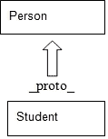

# 第十章。JavaScript 面向对象编程

JavaScript 是一种面向对象的编程语言。在**面向对象编程**（**OOP**）语言中，我们使用对象的概念而不是动作来开发应用程序。在过去，JavaScript 没有真正的基础，仅仅是一种基本语言。JavaScript 不是像 JAVA、C#和其他编程语言那样完全基于 OOP 的语言，但它仍然具有许多 OOP 特性。

在 JavaScript 中有许多代码重用的特性。因此，而不是在 JavaScript 中使用过程式概念，我们使用面向对象编程技术。面向对象编程有四个基本原则。

# 多态性

由于 JavaScript 是一种动态语言，它支持**多态性**。多态性可以理解为对象在不同时间可以表现出不同的能力。例如，一个形状可以是正方形、长方形或圆形。

## 封装

这个特性在 JavaScript 中也得到了支持。这意味着保护代码的一部分不被外部使用。它保护了与最终用户无关但运行应用程序很重要的代码部分，例如在存储密码的应用程序中。用户不需要知道他们的密码是如何加密的。因此，这段代码被封装起来。

## 继承

在 JavaScript 中，继承可以用来从父对象推导出属性到子对象，并且它们自己也有一些独特的属性。例如，一个正方形和一个三角形可能从`shape`对象继承它们的边框或填充，同时拥有自己独特的顶点数。

## 抽象

抽象在 JavaScript 中不是原生支持的，但有一些方法可以通过组合多态性和继承来实现这一点。

# 对象

对象是理解面向对象编程的基本关键。编程对象就像现实世界中的对象一样。看看周围，你会看到很多对象。你的汽车、手机、桌子、笔记本电脑、宠物狗和 DVD 播放器都是对象。

所有对象都有两个特性：属性和方法。

一部手机有属性（颜色、屏幕尺寸、高度和重量）和方法（打电话、发送短信、接收电话和传输文件）。

一辆车有属性（颜色、高度、变速箱、车轮、引擎、刹车和方向盘）和方法（启动引擎、转向、换挡、刹车、停止和碰撞）。

正如这些现实世界的例子一样，OOP 中的对象具有相同的特性。因此，从编程的角度来看，一个对象可以具有属性（任何编程语言中的变量）和方法（任何编程语言中的函数）。因此，我们可以将对象定义为“*一个具有一些属性和与之关联的方法的实体或事物。对象可以被单独选择和处理*”。

所有通用属性和方法都被组合到一个称为**类**的模板中。然后，这个类被用作模板来实例化单个或多个对象。在 JavaScript 中，有许多内置对象，例如 Maths、Dates、正则表达式、数组等等。

## 创建对象

在 JavaScript 中，我们可以以三种不同的方式创建对象：

+   使用对象字面量

+   使用`new`关键字

+   使用`object.create()`方法（ECMAScript 5）

### 对象字面量

这是创建对象的最简单方式。可以使用对象字面量在一个语句中创建和定义一个对象。对象字面量是一个逗号分隔的`name:value`（如 year:1990, age:25）对列表，这些对被大括号包围。

下面是一个例子：

```js
var car= {
  model:"2014",
  company:"Honda",
  color:"White"
};
```

在前面的例子中，我们创建了一个具有四个属性或属性的`car`对象。

```js
var empty = {}
```

另一方面，这段代码创建了一个没有任何属性的空对象。

### `new`关键字

`new`关键字用于创建和初始化一个新对象。`new`关键字总是跟在一个函数调用之后。这个函数被称为构造函数，它初始化新创建的对象。JavaScript 包含用于原生类型的内置构造函数。

下面是一个例子：

```js
var car = new Object();
car.model = "2014";
car.company = "Honda";
car.colour = "White";
```

前面的例子也创建了一个具有四个属性的新的`car`对象：

```js
varempty = new Object();    // An empty object, same as {}.
vararr = new Array(); 	   // An empty array, same as [].
varcurrdate = new Date();    // Current Date. 
varregex = new RegExp("JavaScript"); // A pattern matching object.
```

### `object.create()`方法

`object.create()`方法最初是在 ECMAScript 5 中定义的。它也被用来创建对象。传递给这个方法的第一个参数是那个对象的原型。第二个参数是可选的。它描述了对象的属性。

下面是一个例子：

```js
// obj1 inherits properties model, company and colour.
varcar = Object.create({model:"2014",company:"Honda",colour:"White"});

// car inherits no properties or methods.
varcar = Object.create(null);
```

如果对象没有原型，可以传递`Null`。然而，这个对象将不会继承任何内容：

```js
// car is same as {} or new Object().
varcar = Object.create(Object.prototype);
```

## 设计模式

要编写可扩展的代码，我们需要追踪代码中的重复部分，并以一种易于维护的方式优化它们。设计模式帮助我们做到这一点。

在由艾瑞克·伽玛（Erich Gamma）、约翰·弗利斯（John Vlissides）、拉尔夫·约翰逊（Ralph Johnson）和理查德·赫尔姆（Richard Helm）所著的《Addison-Wesley Professional》一书中；第一版（1994 年 11 月 10 日），设计模式被定义为：

> *设计模式命名、抽象和识别一个常见设计结构的关键方面，使其对创建可重用的面向对象设计有用。设计模式识别参与类及其实例、它们的作用和协作，以及责任分配。*
> 
> *每个设计模式都专注于特定的面向对象设计问题或问题。它描述了何时适用，是否可以在其他设计约束的背景下应用，以及其使用的后果和权衡。由于我们必须最终实现我们的设计，设计模式还提供了示例代码来展示实现。*
> 
> 虽然设计模式描述的是面向对象的设计，但它们基于已经在主流面向对象编程语言中实现过的实用解决方案。

开发者通常会质疑是否有一个最佳的设计模式可以实施到他们的工作流程中。

实际上，没有单一的设计模式适合所有场景。每个开发出的 Web 应用程序都有其自身的需求。我们必须看看如果实施，哪种模式将给我们的应用程序增加价值，因为所有设计模式都服务于不同的解决方案。

因此，一旦我们对设计模式有了良好的理解，将模式集成到我们的应用程序架构中就会更容易。设计模式被分为三类：创建型、结构型和行为型。

+   **创建型设计模式**：构造函数、工厂、原型和单例是创建型设计模式的例子

+   **结构型设计模式**：装饰者、外观和享元是结构型设计模式的例子

+   **行为型设计模式**：观察者和调解者是此类模式的例子

### 构造函数模式

构造函数是用于初始化对象的特殊方法。它们可以接受参数，这些参数随后用于在对象创建时设置成员属性和方法。原生构造函数，如数组和对象，在 JavaScript 中作为原生函数存在。我们还可以创建自定义构造函数，为我们的自定义对象定义属性和方法。

#### 描述

在 `constructor` 方法中，我们使用 `new` 关键字创建一个对象。在这个方法中，我们使用 `this` 关键字定义属性和方法。属性在 `=` 符号之后定义。当你定义每个属性时，必须在末尾放置一个分号。当你需要在你的脚本中使用 `this` 方法时，你需要首先初始化对象，然后在使用代码中使用它：

##### 简单构造函数

构造函数被认为是实现实例的最合适方式。`new` 关键字告诉 JavaScript 我们希望该函数表现得像构造函数，并创建一个实例，也称为 `object`。在构造函数内部，`this` 关键字用于引用新对象。

##### 原型构造函数

原型是 JavaScript 中函数的一个属性。每当一个 `constructor` 函数被调用以创建一个新对象时，该构造函数的原型中所有的特性都会与新对象关联。

##### 模块模式

模块是任何良好构建的 Web 应用程序的基本组成部分。它们以整洁、可理解和组织良好的方式相互独立地链接。换句话说，它们为程序提供了结构，同时也提供了封装。

#### 描述

在 JavaScript 中，模块可以通过几种方式实现。我们在这里将讨论其中的两种：

+   对象字面量表示法

+   模块模式

##### 对象字面量表示法

如我们之前所读，对象字面量是一系列用逗号分隔的`name:value`对，这些对被括号`{}`包围。名称可以是标识符或字符串后跟冒号。确保在最后一个`name:value`对之后没有逗号；否则，可能会导致一些意外的错误：

```js
varObjectLiteral = {
  variableKey: Value,

  functionKey: function() {
    //...
  }
};
```

我们不必使用`new`关键字实例化对象字面量。

应注意确保在语句开头不使用关键字`new`。这是因为开括号可能被解释为代码块的开始。

我们可以从外部对象添加新成员，如下所示：

```js
myModule.property = 'someValue';
```

使用模块可以帮助隐藏数据成员（封装）并以有组织的方式管理代码。

##### 模块模式

在传统的软件工程中，模块模式提供了对类、方法和变量的公共和私有访问。模块模式的重点是减少全局变量的使用，以最小化整个应用程序内部代码中的冲突。

这是实现在大型的 JavaScript 框架和扩展库（如**jQuery**、**ExtJS**、**YUI**和**DoJo**）中最著名且最常用的设计模式。

下面是一个使用共享私有缓存的模块模式示例。这种方法使我们能够使用共享存储来创建对象，从而优化性能，因为函数只会在启动时创建一次。混入使用函数引用来调用它们，而不是每次需要时都创建该函数的新实例。

下面是模块模式的一些优缺点：

**优点**:

+   这种模式为开发者提供了一种更清晰的方法

+   它支持封装

+   减少了全局命名空间混乱

+   这支持具有闭包的本地函数和变量

**缺点**：

+   由于公共和私有成员的访问方式不同，当需要更改特定成员的可见性时，我们不得不在对象被使用的每个地方都进行更改

+   后添加到对象中的新方法无法访问私有成员

+   私有成员不能轻松扩展

### 揭示模块模式

这种模式几乎与模块模式相同。唯一的区别是，在这个模式中，所有成员都保持私有，直到它们被显式调用，通常是通过返回对象字面量的闭包来定义的。

#### 描述

克里斯蒂安·海利曼设计了这种模式。他不喜欢我们不得不切换到对象字面量表示法来表示我们希望保持公开的对象。还有一个缺点：如果我们需要从一个方法访问另一个方法中的公共变量或调用公共方法，我们必须重复主对象的名字。

在这个模式中，我们将所有函数和变量定义为私有，并在模块末尾返回一个匿名对象，以及指向我们希望公开的私有函数和变量的指针。

下面是揭示模块模式的几个优缺点：

**优点**：

+   对开发者来说是一种更干净的方法

+   支持封装

+   减少全局命名空间混乱

+   带闭包的局部函数和变量

+   更一致的脚本语法

+   显式定义公共函数和变量

+   提高可读性

**缺点**：

+   私有成员不可访问

+   修改被某些私有成员引用的公共函数和变量很困难

### 单例模式

这个模式确保只创建一个类的实例，并提供一个全局访问点到该对象。

#### 描述

单例模式通过创建一个方法的对象来实现，该方法的对象只能在它不存在时创建。如果对象已经存在，将返回对该对象的引用。

在需要一些可能不在初始化时可用信息的情况下，建议延迟单例的初始化。因此，它们与静态类或对象不同。

下面是单例模式的几个优缺点：

**优点**：

+   优化内存使用

+   单一的全局访问点

+   延迟初始化，直到需要时才实例化

**缺点**：

+   一旦实例化，就没有重置选项。

+   单元测试困难，因为当我们引用一个存在于测试类之外的单一类时，我们就无法进行真正的单元测试。我们最终测试的是目标类和单例一起，而不是应该是一个单一的目标类单元测试。

+   可能会引入隐藏的依赖。

### 观察者模式

观察者模式是这样的，如果一个对象的状态发生变化，所有其他对象都会收到通知并可以自动更新。因此，这个模式定义了对象之间的一对多依赖关系。

#### 描述

在观察者模式中，一个对象（也称为主题/发布者）连接到多个其他对象，这些对象依赖于我们的主题。这些依赖对象被称为**观察者**/**订阅者**。

当状态发生变化时，主题会广播一个通知。所有观察者都会收到通知并相应地更新。

书籍《设计模式：可复用面向对象软件元素》将观察者模式描述如下：

> *"一个或多个观察者对主题的状态感兴趣，并通过将自己附加到主题上来注册他们的兴趣。当我们的主题发生变化，观察者可能感兴趣时，会发送一个通知消息，该消息调用每个观察者的更新方法。当观察者不再对主题的状态感兴趣时，他们可以简单地断开连接。"*

这里有一些观察者模式的优点和缺点：

**优点**:

+   需要更深入地了解系统中的各种组件及其相互关系

+   有助于指出依赖关系

+   有助于将对象分解成更小的可重用组件

**缺点**:

+   应用程序完整性检查可能变得困难

+   将观察者从一个主题切换到另一个主题可能很困难

### 中介者模式

如其名所示，中介者是一个在两个或更多冲突方之间协助谈判的人。

在软件工程中，中介者属于行为设计模式类别。该模式使我们能够通过一个对象实现应用程序不同组件之间的通信。

#### 描述

中介者模式通过确保对象不是直接相互交互，而是通过一个中心点进行通信，从而通过确保松散耦合来促进。

让我们通过一个现实世界的例子来更好地理解它。考虑一个机场交通控制系统。控制塔充当中介者，而所有其他飞机都在与控制塔通信，等待着陆或起飞的通知。它们不相互联系，只与控制塔联系。控制塔的作用非常关键和核心。因此，它是这个系统的重要关键。

类似地，中介者在这个模式中同样重要。

当我们调用中介者的订阅方法时，我们传递一个回调，中介者将这些回调排队，以便在给定事件触发时以及随后解耦对象的回调被触发。中介者触发信号以使对象能够触发，从而允许对象与任何其他对象解耦。

这里有一些中介者模式的优点和缺点：

**优点**:

+   移除多对多关系

+   建立多对一关系

+   帮助我们找出依赖关系

+   有助于将对象分解以促进更小的可重用组件

**缺点**:

+   引入了一个单点故障

+   当太多模块试图来回通信时，可能会出现性能问题

### 原型模式

在原型模式中，对象是通过克隆现有对象的模板创建的。

#### 描述

这个模式侧重于创建一个可以通过原型继承用作其他对象模板/蓝图的对象。JavaScript 本身支持原型继承。因此，在这个模式中工作很容易。

这里有一些原型模式的优点和缺点：

**优点**:

+   适用于关注对象创建的应用程序

+   由于新对象从原型继承特性，性能更好

**缺点**:

+   对于具有非常少对象或原型的应用程序来说，过度设计

### 命令模式

在这个模式中，命令被封装为对象。

#### 描述

命令对象允许松散耦合的系统将发出请求的对象与处理请求的对象分离。这些请求被称为**事件**，处理这些请求的代码称为事件处理器。

简单来说，我们可以这样说，命令模式的主要目的是将发出命令的功能与执行命令的功能分离，并将此功能委托给不同的对象。实际上，命令对象将一个动作绑定到将调用该动作的对象。它们通常包括一个如 `run()` 或 `execute()` 的函数。这种模式最大的优点之一是，具有相同接口的命令对象可以在需要时轻松互换。

**优点**:

+   命令模式使得构建必须执行/委托/排序方法调用的通用组件变得更加容易

+   具有相同接口的命令对象可以在需要时进行互换

+   它允许对命令执行进行记录，而不会受到客户端的干扰

**缺点**:

+   它显著增加了每个命令的类数量

当创建结构时，请求的生成和执行不依赖于彼此时很有用。我们可以这样说，命令实例可以由客户端实例化，并由**调用者**稍后运行。客户端和调用者可能对彼此一无所知。

这种模式是可扩展的，因为我们可以在不更改任何现有代码的情况下添加新命令。

### 门面模式

门面是一个面向世界展示并可见的前端层。在其背后隐藏着所有复杂性和不可展示的对象。

#### 描述

门面模式是一种结构模式，它使我们能够在接口下隐藏后端复杂性。这种模式提高了应用程序模块的可用性。内部特性和方法不会直接暴露给开发者，但它们可以通过这个门面与之交互。这种模式使您的应用程序更加安全。

jQuery 是一个使用门面模式的 JavaScript 库的例子。

每当我们使用 jQuery 的 `$(this).animate()` 或 `$(this).css()` 函数时，我们都在使用一个门面。同样，`$(document).ready()` 实现了一个门面。

核心 jQuery 属性应被视为中间抽象。对开发者来说，更直接的负担是 DOM API，而门面使得 jQuery 库如此易于使用。

`ready()` 函数在后台有很多复杂性。jQuery 简化了浏览器的不一致性，以确保 `ready()` 在适当的时间被调用。

然而，我们只看到了一个门面或一个简单的接口层。

这里有一些门面模式的优点和缺点：

**优点**:

+   提高了 Web 应用程序的安全性

+   与其他模式兼容

+   更容易修补内部模块

+   实现起来更简单

+   提供了一个更简单的公共接口

+   被用于其他 JavaScript 框架，如 jQuery

**缺点**:

+   没有已证实的缺点

### 工厂模式

就像其他创建型设计模式一样，工厂模式也关注对象创建。然而，它不同之处在于它不需要构造函数来创建对象。

#### 描述

工厂模式提供了一个对象创建的接口，其中我们指定需要创建的工厂对象的类型。子类允许决定哪个类将被实例化，以便它们可以指定将创建哪种类型的工厂对象。工厂模式非常易于扩展。当维护对象集合时使用工厂方法。这些对象集合不同，但仍然有许多共同的方法和属性。

在这个模式中，我们不会使用`new`关键字来创建对象。

让我们用一个实时例子来说明这个模式：

假设有一个服装工厂。我们需要创建一种服装类型。而不是直接使用`new`关键字创建这个对象，我们将请求一个用于新服装的工厂对象。我们告诉工厂需要哪种类型的对象（衬衫、牛仔裤、外套、围巾等）。它实例化那个类并返回对象供我们进一步使用。

ExtJS 是一个使用此模式的 JavaScript 库。创建对象的函数可以被分类并进一步子类化。

这里列出了工厂模式的一些优缺点：

**优点**：

+   通过一个接口类创建对象要容易得多，这个接口类为我们处理这个过程

+   适用于根据不同场景创建对象

+   对于类似实例化的对象来说非常实用

+   通过一个实例创建对象被简化了

**缺点**：

+   由于它隐藏在工厂方法后面，因此很难测试对象创建过程

### 混入模式

在面向对象编程中，混入是可以被子类或一组子类继承以实现功能重用的类。

#### 描述

子类化意味着从超类或基类对象继承新对象属性。

例如，有一个能够从另一个类`fruit`扩展的`apple`类。在这里，`fruit`是超类，而`apple`是`fruit`的子类。`apple`的所有对象都继承自`fruit`的属性。然而，`apple`能够定义自己的方法并覆盖由`fruit`定义的方法。

如果`apple`需要调用`fruit`中的重写方法，这被称为方法链式调用。

如果`apple`需要调用`fruit`的构造函数，这被称为**构造函数链式调用**。

混入允许其他对象以非常低的复杂性级别继承其功能。这种模式允许我们通过多继承从多个混入中共享功能。

这里列出了混入模式的一些优缺点：

**优点**：

这种模式有助于减少函数重复，并促进函数的重用。在功能在整个系统中共享的应用中，我们可以将共享的函数放入混入（mixins）中，并专注于我们系统中其余的独特功能。

**缺点**：

在对象原型中保持功能可能会导致原型污染，并可能混淆跟踪函数的来源。这可能在大型应用程序中引起问题。

示例：

```js
// Detailed explanation of Mixin Design Pattern in JavaScript can be found here: http://addyosmani.com/resources/essentialjsdesignpatterns/book/#mixinpatternjavascript

/* Car Class */
var Car = function(settings) {
    this.model = settings.model || 'no model provided';
    this.colour = settings.colour || 'no colour provided'; 
};

/* Mixin Class */
var Mixin = function(){};
Mixin.prototype = {
    driveForward: function() {
        console.log('drive forward');
    },
    driveBackward: function() {
        console.log('drive backward');        
    }
};

/* Augment existing class with a method from another class */
function augment(receivingClass, givingClass) {
    /* only provide certain methods */
    if(arguments[2]) {
        var i, len = arguments.length;
        for (i=2; i<len; i++) {
            receivingClass.prototype[arguments[i]] = givingClass.prototype[arguments[i]];   
        }
    } 
    /* provide all methods */
    else {
        var methodName;
        for (methodName in givingClass.prototype) {
            /* check to make sure the receiving class doesn't have a method of the same name as the one currently being processed */
            if (!receivingClass.prototype[methodName]) {
                receivingClass.prototype[methodName] = givingClass.prototype[methodName];   
            }
        }
    }
}

/* Augment the Car class to have the methods 'driveForward' and 'driveBackward' */
augment(Car, Mixin, 'driveForward', 'driveBackward');

/* Create a new Car */
var vehicle = new Car({model:'Ford Escort', colour:'blue'});

/* Test to make sure we now have access to the methods */
vehicle.driveForward();
vehicle.driveBackward();
```

## 属性获取器和设置器

在编程语言中，获取和设置属性用于`get`和`set`对象的值。`getter`方法用于获取属性的值，而`setter`方法用于设置属性的值。

JavaScript 中有两个属性访问器：

+   获取器

+   设置器

### 描述

+   `getter`和`setter`是帮助我们非常容易地访问和操作对象内部数据的函数。它们可以帮助我们建立访问隐藏信息的快捷方式。`getter`和`setter`方法以这种方式工作，即它们将对象与一个函数绑定，使其看起来像正常的对象属性。

+   `getter`：此方法是一种特殊的属性访问器。当您想要访问一个属性时，值是动态生成的。以下是一个例子：

    ```js
    Obj.getButtonColor();
    ```

+   `setter`：此方法用于设置属性。它传递一个值作为参数，并将函数的返回值设置为属性。以下是一个例子：

    ```js
    Obj.setButtonColor(value);
    ```

## 删除属性

就像我们可以向对象添加属性一样，JavaScript 也允许我们删除对象属性。

### 描述

`delete`运算符用于删除对象的属性。它从本地版本中删除属性。属性的范畴可以被重新分配到同一作用域内的另一个变量。在 JavaScript 中，`delete`运算符始终返回一个布尔值。使用此关键字，您不能删除用`var`关键字声明的对象。

假设我们有一个这样的对象：

```js
varauthor = {
  "name":"talha",
  "age":"24"
};
```

我们希望删除`age`属性，以便我们可以有一个看起来像这样的最终对象：

```js
{
  "name":"talha"
};
```

输入以下命令：

```js
deleteauthor.age;

```

您也可以使用此命令达到相同的结果：

```js
delete author["age"];

```

## 测试属性

开发者在对象上执行的一种常见测试是检查对象是否具有特定的属性。有不同方法来检查对象是否具有给定的属性。

### 描述

在 JavaScript 中，有两种属性测试方法：

+   `hasOwnProperty`：此方法用于检查对象是否具有自己的属性。如果属性是从任何地方继承的，则它将返回`false`：

    ```js
    For example:
      samantha = new girls();
      samantha.eyecolor = 'brown';

    o.hasOwnProperty('eyecolor');   // returns true
    ```

+   `propertyIsEnumerable`：此方法仅在`hasOwnProperty`返回`true`且该属性是可枚举的情况下返回`true`。

要在 JavaScript 中检查属性，我们可以使用`in`关键字。如果一个对象属性有它自己的值，它将返回`true`。

这里有一个例子：

```js
var girls = {
  name: 'Samantha',
  height: 'Tall',
  eyecolor: 'brown',
  address: null
};
'name' in girls; // true
'age' in girls; // false
```

## 列出属性

在 JavaScript 中，使用`for-in`循环来枚举对象的属性。

### 描述

在 JavaScript 中，枚举属性在`for-in`循环中使用，因为这个循环访问了对象的所有属性。当我们想要检查对象的属性列表时，我们使用`for-in`循环来迭代属性。它将属性的名称分配给循环变量。

继承对象不可枚举，但使用这些对象添加的属性是可枚举的。

这里是一个示例：

```js
var student = {
  Name:"Ali",
  Age:"24",
  Edu:"Engineering"
}

Sudent.propertyIsEnumerable('Name');
// will return true since object's properties are enumerable

for(var property in student) {
  Console.log(property); //will log all properties
}
```

## 属性属性

与每个 JavaScript 属性相关的信息称为**属性**。这里解释了不同类型的属性属性。

### 描述

JavaScript 属性有两种类型：

+   数据属性

+   访问器属性（`getter`和`setter`属性）

属性具有四个属性：

+   **可枚举性**：这检查属性是否在循环结构中

+   **可配置性**：这检查我们是否可以删除或修改属性

+   **可写性**：这检查我们是否可以设置属性的值

+   **值**：这是属性的值，可以是 JavaScript 中的任何数据类型

### 注意

数据属性具有所有前面的属性，而访问器属性没有值或可写属性。

### 对象属性

JavaScript 中有三种类型的对象属性：

+   **命名数据属性**：这些是正常对象属性，其中对象将字符串名称映射到值。以下是一个示例：

    ```js
    Var x={
    prop:555
    };

    console.log(x.prop); //its get method
    c.prop="xyz"; //its set method
    ```

+   **命名访问器属性**：用于获取和设置属性的函数被称为**命名访问器** **属性**。以下是一个示例：

    ```js
    Var x = {
      get name() {
        return getter;
      }
    }
    ```

    这里还有一个示例：

    ```js
    var x = {
      set name(val) {
        console.log(val);
      }
    }
    ```

+   **内部属性**：在语言中不可访问的一些属性在 JavaScript 中被称为**内部** **属性**。这些属性纯粹是为了规范目的。这些属性具有特殊名称，并写在大括号内。所有对象都有一个称为`[[Prototype]]`的内部属性。该属性的值要么是 null，要么是一个对象，用于实现继承。

    它有两个部分：

    +   **原型**：这告诉对象的原型

    +   **可扩展性**：这告诉我们是否可以向对象添加属性

## 序列化对象

序列化对象意味着将对象转换为字节，以便它可以持久地存储在内存中，或者可以发送到网络上。然后，这些字节可以反序列化为原始对象。

### 描述

序列化用于存储或保留对象的内部状态。在序列化过程中，一个对象可以被传输或稍后检索。JavaScript 中有两种序列化方法：

+   `JSON.stringify`

+   `JSON.parse`

这里是一个示例：

```js
Obj={a:1}
A=json.stringify(obj);
// creates a JSON String from an array or object

B=json.parse(A);
// parses a JSON Object 'A' in an object.
```

这些方法也可以检索和存储对象、`数组`、`字符串`、`true`和`false`。可枚举值通过`JSON.stringify()`方法保留或恢复。

## 对象方法

对象方法是存储为对象属性的函数。这些方法可以通过直接调用它们来执行，调用时跟在要调用函数的变量后面，后面跟着一个点（.）。

### 描述

每个对象都有方法，这些方法基本上是在其上执行的操作。方法是一个对象的属性。

`toLowerCase()`、`toUpperCase()`、`substr()`、`trim()`、`charAt()`和`indexOf()`方法是字符串对象原生（核心语言的一部分）方法的示例。

这里是一个使用`toUpperCase()`方法的示例：

```js
var book = "JavaScript Reference!";
var result = book.toUpperCase();
```

结果的值将是：

```js
JAVASCRIPT REFERENCE!
```

# 函数和方法

函数是用户编写的执行特定操作的代码部分，可以独立通过名称调用。函数可以传递一些数据，也可以返回一些数据。另一方面，你可以将方法视为对象的定义属性，只能通过类对象来调用。与方法相关联的对象基本上是窗口对象。在 JavaScript 中，定义方法和函数的语法不同。方法仅用于定义窗口对象。在 JavaScript 中定义方法的语法与定义函数的语法不同。

## 调用函数

调用函数的四种不同方式如下：

+   将函数作为函数调用

+   将函数作为方法调用

+   将函数作为构造函数调用

+   使用函数方法调用函数

所有这些方法都在上一章中详细讨论过。初始化`this`关键字有不同的方式。当你调用一个函数时，它启动一个函数。然而，当你调用一个函数时，它执行它。

## 定义函数

当你定义一个函数时，你的脚本不会执行，但是当你调用一个函数时，脚本会执行。JavaScript 函数执行特定的任务。当任何对象调用此函数时，它开始工作。在 JavaScript 中定义函数，我们使用`function`关键字。一个函数可以有多个参数，这取决于任务。你可以在第八章中找到更多详细信息，*JavaScript 实现、语法基础和变量类型*。

## 函数参数和参数

在 JavaScript 中，一个函数可以有多个参数。一个函数可以用多个参数调用。如果你在函数中不提供任何参数，那么它将变为未定义。在 JavaScript 函数中，参数是可选的。如果你在函数中不传递任何参数，那么它将设置为默认值。以下是一个示例：

```js
Function arg(x,y) {
  Console.log(x+y);
  Arg(2);
  Arg(2,1);
}
```

在这个例子中，我们在函数中传递了两个参数：参数`x`和`y`。当第一次调用函数`arg(2)`时，`a=2`而`b`将是未定义的。当第二次调用函数时，`a=2`且`b=1`。

## 参数和返回值

我们知道我们可以在函数中传递参数。函数返回一个值以在脚本中执行不同的操作。有两种方法可以将值传递到函数中：

+   **按值传递**：当我们把任何变量（原始数据类型）作为函数的参数传递时，我们按值传递它。例如，首先，值是`2`。传递之后，它变为`3`：

    ```js
    var a=2;
    console.log(a); // shows 2
    functionpassVal(a);{
     a=3;
    }
    console.log(a); // shows 3
    ```

+   **按引用传递**：当你将一个值传递给对象时，它是通过引用传递的：

    ```js
    functionpassingVariables(a, b, c) {
      a = a + 10;
      b.value = "changed";
      c = {value: "changed"};
    }

    varnum = 10;
    varvar1 = {value: "unaffected"};
    varvar2 = {value: "unaffected"};

    passingVariables (num, var1, var2);

    console.log(num);  // 20
    console.log(var1.value);  // changed
    console.log(var2.value);  // unaffected
    ```

## 函数作为命名空间

命名空间是一组逻辑标识符的组合。JavaScript 默认不提供命名空间功能。因此，为了在 JavaScript 中创建命名空间，我们声明一个全局对象，并将所有函数和属性都放入该全局对象中，例如：

```js
var stud=student || {};
stud.student=function(name) {
  this.name ;
}
var s=new stud.student("Ali");
```

## 闭包

为了编写更好的代码，我们在 JavaScript 中使用闭包。更好的代码意味着具有创造性和表现力的代码。在 JavaScript 中，无论你是否是一个好的 JavaScript 程序员，你都会反复遇到闭包。根据你在代码中使用闭包的方式，它可能是复杂的或简单的。

基本上，闭包是 JavaScript 中的内部函数，用于访问外部函数的作用域。闭包有三个作用域：

+   访问外部函数变量

+   访问其自己的作用域变量

+   访问其全局变量

内部函数也可以访问外部函数的变量和参数。在其自己的作用域中，变量在花括号中定义。以下是一个示例：

```js
functionstudentName(name) {
  varstdName="Student Name";
  functionstdLastName(){
  returnstdName+name; }
  returnstdntLastName();
}
```

## 函数属性

在 JavaScript 中定义一个函数，我们使用 `function` 变量。这个函数可以在你的脚本中的任何地方调用。它也可以是一个函数构造器。属性及其描述如下：

+   `arguments`：这是一个作为参数传递给函数的数组

+   `argument.length`：这告诉我们函数中有多少个参数

+   `constructor`：这用于创建对象

+   `length`：这定义了参数上的数字

+   `prototype`：这允许一个函数添加对象属性

+   `arguments.callee`：这告诉我们当前正在执行哪个函数

## 方法

在 JavaScript 中，对对象执行的操作称为**方法**。它们包含函数定义。它们作为脚本中的对象属性存储。例如，你可以在 JavaScript 中创建一个类似的方法：

```js
Student.FullName = function() {
  // define your code here
}
```

在这里，`FullName` 既是属性（`Student.FullName`）也是方法（`Student.FullName()`）。当你不使用括号访问对象属性时，这将返回一个函数定义。以下是一个示例：

```js
Name=Student.FullName;
```

## 函数构造器

函数构造器用于动态定义函数。使用构造器方法定义函数时使用 new 操作符。你还可以将你想要在脚本中使用的大量参数传递给构造器。最后一个参数将是函数的主体。它也可以包含由逗号分隔的语句。以下是一个示例：

```js
varobj = new Function('a', 'b', 'return a*b;');
```

我们不能在构造器中将相同的函数名作为参数传递，因为这将在脚本中创建错误。它还可以创建一个无名的函数，称为匿名函数。

# 类和模块

在 JavaScript 中，我们没有创建类的任何原生方法，但我们可以使用原型继承和构造函数创建一个类。

类是对象的容器。我们使用类来封装命名空间和逻辑。

要实例化一个类，我们可以使用`new`关键字。类类似于构造函数。以下是一个例子：

```js
function student(nameI) {
  This.name=name;
  this.age='18';
}
student.prototype.std=function() {
  //define some code
};
module.export=student;
```

### 注意

模块用于轻松包含和扩展类和属性。模块将属性附加到全局对象以导出模块值。

类及其模块是 JavaScript 中极其重要和关键的部分。在接下来的章节中，我们将涵盖以下主题：

+   类和原型

+   构造函数

+   JavaScript 中的 Java 风格类

+   扩展的 JavaScript

+   类的类型

+   子类

+   ECMA5 脚本中的类

+   模块

## 类和原型

在 JavaScript 中，类是一个具有特殊类型属性和方法的对象。它用于创建实例并定义实例的行为。实例的行为会动态变化，我们在 JavaScript 中有特殊的语法来编写它。当在类上调用特殊方法时，会创建实例。

在 JavaScript 中，原型和函数是两回事。构造函数可以是任何函数，但原型是一种特殊的对象。为了定义任何实例的行为，我们使用原型。原型没有特殊的属性或方法。当我们修改原型时，我们就有实例了。

简单来说，我们可以说在 JavaScript 中，构造函数可以是任何负责创建实例的函数。另一方面，原型可以是任何没有特殊方法或属性的对象。原型负责实例的行为。

在 JavaScript 中，原型和构造函数函数像类一样工作，因为类有一个构造函数，要定义方法，你有原型：

这里是一个例子：

```js
//Constructor Function
var Cat = function(name) {
  this.Name = name;
  this.Meow = function() {
    console.log(this.Name + " meow");
  };
}

//Prototype object method
var Cat = function(name) {
  this.Name = name;
}

Cat.prototype.Meow = function() {
  console.log(this.Name + " meow");
};

//Both gives same results
var cat = new Cat("Capri");
cat.Meow();
```

与原型相关联的没有特殊的属性或对象。你脚本中的对象可以是空项目或原型。当我们说任何对象都可以是原型时，那么这个对象将具有函数和数据类型。原型不是特殊类型的对象，但在 JavaScript 中，类是特殊类型的对象。

## 构造函数

类包含一组对象，为了初始化对象，我们使用构造函数。在类中，我们可以使用`new`运算符创建对象。我们可以将类定义为子类来构造对象。

使用原型的一个属性，创建一个构造函数。如果我们覆盖原型属性，构造函数的引用可能会丢失。在 JavaScript 中，我们使用`constructor`属性从一个对象创建一个类。以下是一个例子：

```js
var color = 'black';

function Cat() {
  // public property
  this.color = '';

  // private constructor
  var __construct = function(that) {
    console.log("I have a Cat!");
    that.color = 'brown';
  }(this)

  // getter
  this.getColor = function() {
    returnthis.color;
  }

  // setter
  this.setColor = function(color) {
    this.color = color;
  }

}

var b = new Cat();

console.log(b.getColor()); // should be brown

b.setColor('white');

console.log(b.getColor()); // should be white

console.log(color); // should be black
```

## 定义一个类

在 JavaScript 中定义类有三种方式：

+   使用函数

+   使用对象字面量

+   使用函数创建单例

### 使用函数

你可以使用函数中的`new`关键字创建一个对象。要访问方法和属性，请使用`this`关键字。如果在类中定义了具有相同名称的函数，将会有冲突。

### 使用对象字面量

要在 JavaScript 中定义一个对象或数组，我们使用字面量。以下是一个例子：

```js
Varobj= {};
Varobj=[];
```

## ECMA5 脚本中的类

对于特定对象的属性，ECMA5 脚本添加了五种方法。这些方法用于确保和限制脚本中对象的扩展性。这些方法包括：

+   可枚举

+   可写

+   获取器

+   设置器

+   可配置

当我们在 JavaScript 中定义一个类时，这些方法非常有用。当你存储一个对象时，它会为这些方法设置一个对象 ID。当我们使用循环语句时，它会返回这个对象 ID。所有对象都继承了这个对象 ID，它是可枚举的。要读取一个属性，它会调用`getter`函数，而不会有`setter`函数。因此，它是只读的。我们无法修改它，所以它不能被删除。

## 模块

模块的两个非常重要的方面是：

+   **它们有依赖**：这意味着当你在一个系统中编写模块时，它是完全依赖于函数的。我们在创建应用程序时从函数中导入依赖项。

+   **它们有导出**：如果你在系统中公开一些函数和变量，任何东西都可以导出这些。例如，你导出了一个函数`$function`，依赖于这个函数的模块也将能够访问这个函数。

一个模块可以导出多个变量和函数。要导出这些函数和变量，我们使用`export`关键字。以下是一个示例：

```js
Export function sub(a,b) {
  Return a+b;
}
```

我们也可以在导出后存储一个变量。以下是一个示例：

```js
Var string=function(a,b) {
  Return a+b;
}
```

# 继承

JavaScript 支持原型继承。在其他编程语言中，对象和类通过继承彼此来使用对方的属性和函数。然而，在 JavaScript 中，你有一个基于对象的继承，这被称为原型，其中对象使用其他对象的属性。例如，如果你有一个`Person`对象，那么你可以使用该对象上的`_proto_`属性来创建另一个`Student`对象：



## 原型链式连接

在 JavaScript 中，你从现有对象创建新对象。这个过程被称为**原型链式连接**。它与面向对象系统中的继承类似。

### 描述

原型是`constructor`函数的一个属性。当你向原型添加任何对象属性时，它将把这个属性或方法添加到由构造函数创建的对象中。在原型链式连接中，我们使用`constructor`函数的属性创建一个函数原型。通过这种方式，所有方法或属性都从构造函数转移到原型对象。这种方法非常简单且非常有用，可以用来创建构造函数以创建对象。以下是一个示例：

```js
function person(name) {
  this.name=name;
}
person.prototype= {
  sayHi:function() {
    console.log("something");
  }

  Function student(name) {
    This.name=name;
  }
}
Student.prototype=new Person();
Varstd=new student("Ali");
Std.sayHi();
```

在方法解析中，JavaScript 首先检查对象是否有方法。当你使用原型链式连接时，它可以覆盖对象原型的某些方法。因此，JavaScript 构造函数为对象设置方法。

## 构造函数窃取

在 JavaScript 中，构造函数窃取也被称为**经典继承**。这种方法用于继承原型引用值的问题。

### 描述

在构造函数窃取中，我们在子类型构造函数中调用超构造函数。这个想法非常简单易懂。我们使用`call()`和`apply()`方法进行函数调用。以下是一个例子：

```js
function super() {
  this.name=["Ali"];
}
function sub() {
  super.call(this);
}

varstd=new sub();
std.name.push("Ali");
varstd1= new sub();
console.log(std1.name);
```

在这个例子中，我们使用了`call()`方法来调用新创建的子类的一个超构造函数，而不是子构造函数。这将初始化`sub()`函数上的`super()`函数中的所有对象。

### 注意

当我们使用原型链式连接时，`constructor`函数将允许我们从超构造函数传递参数到子构造函数内部。

## 组合继承

组合继承也称为**伪经典继承**。这是构造函数窃取和原型链式连接的组合。

### 描述

在组合继承中，原型链继承从原型继承属性和方法，构造函数窃取继承实例。这样，我们可以通过允许方法有自己的属性来在原型上重用方法。以下是一个例子：

```js
functionSuperType(name) {
  this.name = name;
  this.colors = ['yellow', 'purple', 'indigo'];
}
SuperType.prototype.sayName = function() {
  //console.log(this.name);
};
functionSubType(name, age) {
  //inherit properties
  SuperType.call(this, name);
  this.age = age;
}
//inherit methods
SubType.prototype = new SuperType();
SubType.prototype.sayAge = function() {
  //console.log(this.age);
};
varinstance1 = new SubType('John Doe', 26);
instance1.colors.push('white');
//console.log(instance1.colors); //'yellow,purple,indigo,white'
instance1.sayName(); //'John Doe';
instance1.sayAge(); //26
varinstance2 = new SubType('Kate', 21); //console.log(instance2.colors); //'yellow,purple,indigo'
instance2.sayName(); //'Kate';
instance2.sayAge(); //21
```

在这个例子中，`SuperType`构造函数定义了两个属性：`name`和`colors`。`SuperType`原型有一个名为`sayName()`的方法。`SubType`构造函数调用`SuperType`构造函数，传入`name`参数，并定义自己的属性`age`。此外，`SubType`原型被分配为`SuperType`的一个实例，然后定义了一个名为`sayAge()`的新方法。使用这段代码，就可以创建两个独立的`SubType`实例，它们都有自己的属性，包括`colors`属性，但都使用相同的方法。解决原型链式连接和构造函数窃取的缺点，组合继承是 JavaScript 中最常用的继承模式。它还保留了`instanceof`和`isPrototypeOf()`的行为，以识别对象的结构。

## 原型继承

在原型继承中，我们使用一个对象作为另一个对象的基础。

### 描述

在原型继承中，没有类，只有对象。要创建一个对象，你可以创建一个全新的对象，或者克隆一个现有的对象。然后，新对象可以通过添加新属性进行扩展。

这里有一个例子：

```js
varobject=Object.create(null);
```

前一个对象没有原型，是`null`的克隆：

```js
var rectangle = {
  area: function () {
    returnthis.width * this.height;
  }
};

varrect = Object.create(rectangle);
```

在前面的例子中，`rect`从`rectangle`继承了`area`函数。这里，`rectangle`是一个对象字面量，对象字面量是创建`Object.prototype`克隆的一种方式。

它也可以写成如下形式：

```js
var rectangle = Object.create(Object.prototype);

rectangle.area = function () {
  returnthis.width * this.height;
};
```

我们可以按照以下方式扩展新创建的对象：

```js
rect.width=50;
rect.height=100;
console.log(rect.area());
```

我们可以创建一个`constructor`函数，它会为我们克隆`rectangle`并扩展其`height`和`width`属性：

```js
var rectangle = {
  create: function (width, height) {
    var self = Object.create(this);
    self.height = height;
    self.width = width;
    return self;
  },
  area: function () {
    returnthis.width * this.height;
  }
};

varrect = rectangle.create(50, 100);

console.log(rect.area());
```

## 寄生继承

寄生继承类似于原型继承。

### 描述

它通过创建一个执行继承、对象增强并在每个任务完成后返回对象的函数来简单地工作：

```js
Function abc(x) {
  Var clone=obj(abc);
  Clone.sayHi=function() {
  }; 
  return clone;
}

Var student= {
  Name="Ali";
};
Varstd=new abc(student);
Std.sayHi();
```

在这个例子中，我们有一个 `abc()` 函数，它有一个参数，这个参数是基于新对象的。这个对象被传递给 `object` 函数，并将结果对象保存到 `clone` 变量中。现在，`clone` 对象将有一个新的对象属性，最后，我们返回这个对象。

## 寄生组合继承

寄生生物被定义为生活在另一种生物体内并依赖其资源的生物。同样，在这个继承中，子对象依赖于父对象并从它扩展其属性。

### 描述

第一个构造函数调用子类型的 `prototype`，然后调用子类型的 `constructor`。这是在 JavaScript 中创建新对象的一种非常有效的方法。最后，子类型将具有超类型的所有属性。以下是一个例子：

```js
function super(name) {
  this.name=["Ali"];
}
super.prototype.sayHi=function() {
  console.log("something");
}

function sub(age) {
  this.age=age;
  super.call(this,name);
}
sub.prototype=new super();
sub.prototype.sayHi();
```

寄生组合继承和组合继承之间的唯一区别在于，在前者中，基构造函数只调用一次，而在后者中，基构造函数调用两次。

## 子类

在每种编程语言中，每个子类都有一个超类，它继承其属性和方法。JavaScript 不是一个纯面向对象编程语言，但它遵循一些面向对象的规则。我们使用对象表示法在 JavaScript 中创建类。

在 JavaScript 中，你只能使用 `constructor` 函数或原型来执行继承。这种继承仅在运行时进行，这意味着它是动态的。以下是一个例子：

```js
// super class
functionsuperClass() {
  this.bye = superBye;    //method 1
  this.hello = superHello;    //method 2
}

//sub class
functionsubClass() {
  this.inheritFrom = superClass;    //inherit-from method defines superclass
  this.inheritFrom();               //inherit from method called
  this.bye = subBye;               method 1 overridden in subclass
}

functionsuperHello() {
  return "Hello from superClass";
}

functionsuperBye() {
  return "Bye from superClass";
}

functionsubBye() {
  return "Bye from subClass";
}
```

要运行前面的代码，请执行以下方法：

```js
functionprintSub() {
  varnewClass = new subClass();
  console.log(newClass.bye());
  console.log(newClass.hello());
}
```

# 内置对象

为了在语言中增加灵活性，JavaScript 支持许多内置对象。最常用的对象包括：

+   全局

+   日期

+   Math

+   RegExp（正则表达式）

+   数组

这些内置对象的实现复杂且不同。

## 全局对象

全局对象是在函数外部定义的对象。每个函数都可以访问这些变量，因为它们的范围是全局的。

当你没有声明变量并给它赋值时，它将自动成为全局的。

### 描述

当你的代码开始执行时，函数和常量立即可用。全局变量不使用 `new` 关键字初始化。基本上，全局对象用于共享相同的数据以添加属性。你可以在脚本中将方法存储在全局对象中。

你不能直接访问的对象，为了访问这些对象，我们使用全局对象。在声明全局变量后，我们直接将这些对象作为参数传递。你可以在脚本中创建多个实例和多个全局对象。

全局对象具有固定数量的属性。多个对象实例可以访问这个全局对象。以下是一个例子：

```js
varstudentName="Ali"
functionmyStd(){   }

student=new Global("name");
student.age=18;
person=new Global("name");
post(person.age);
```

## 日期对象

JavaScript 中的日期对象处理日期和时间对象。例如，如果我们正在编写脚本并且需要日期和时间的某些功能，那么我们可以简单地使用这个内置对象。

### getTime()

此函数用于获取自 1970 年 1 月 1 日以来的毫秒数。

#### 参数

没有传递参数。

#### 返回值

自 1970 年 1 月 1 日以来的毫秒数。

#### 描述

如其名所示，此函数用于获取当前时间，以毫秒为单位。我们首先需要创建一个日期对象。

```js
var time = new Date();
time.getTime(); // This will output time as 1454905019871
```

### `getMilliseconds()`

此函数用于获取相对于毫秒数的当前时间。

#### 参数

没有传递参数。

#### 返回值

一个从 0 到 999 的数字。

#### 描述

如其名所示，此函数用于获取当前时间，以毫秒为单位。我们首先需要创建一个日期对象。

```js
var time = new Date();
time.getMilliseconds();
```

### `getMinutes()`

此函数用于获取相对于分钟的当前时间。我们首先需要创建一个日期对象。

#### 参数

没有传递参数。

#### 返回值

一个从 0 到 59 的数字。

#### 描述

此函数用于获取当前时间，以分钟为单位。我们首先需要创建一个日期对象。

```js
var time = new Date();
time.getMinutes();
```

### `getHours()`

此函数用于获取相对于小时的当前时间。我们首先需要创建一个日期对象。

#### 参数

没有传递参数。

#### 返回值

一个从 0 到 23 的数字，0 代表午夜。

#### 描述

此函数用于获取相对于小时的当前时间。我们首先需要创建一个日期对象。

```js
var time = new Date();
time.getHours();
```

### `getDate()`

此函数用于获取当前天。

#### 参数

没有传递参数。

#### 返回值

一个从 1 到 31 的数字。

#### 描述

此函数用于获取当前天。我们首先需要创建一个日期对象。

```js
var time = new Date();
time.getDate();
```

### `getDay()`

此函数用于获取当前周中的当前天。

#### 参数

没有传递参数。

#### 返回值

一个从 0 到 6 的数字，0 代表星期日。

#### 描述

此函数用于获取当前周中的当前天。我们首先需要创建一个日期对象。

```js
var time = new Date();
time.getDay();
```

### `getMonth()`

此函数用于获取当前月份。

#### 参数

没有传递参数。

#### 返回值

一个从 0 到 11 的数字。

#### 描述

此函数用于获取年份中的当前月份。我们首先需要创建一个日期对象。

```js
var time = new Date();
time.getMonth();
```

### `getFullYear()`

此函数用于获取当前年份。

#### 参数

没有传递参数。

#### 返回值

年份，格式为 YYYY。

#### 描述

此函数用于获取当前年份。我们首先需要创建一个日期对象。

```js
var time = new Date();
time.getYear();
```

### 设置日期方法

日期对象中提供了可用于操作日期的方法。我们还可以动态调整日期。以下是一个示例：

```js
var dob=new date();
dob.setDate(19.03.1990);
```

我们也可以通过此函数设置未来的日期和当前日期，例如：

```js
var dob=new date();
dob.setDate(dob.getDate + 7);
```

日期设置方法有：

+   `setTime()`

+   `setMilliseconds()`

+   `setMinutes()`

+   `setMinutes()`

+   `setHours()`

+   `setDate()`

+   `setDay()`

+   `setMonth()`

+   `setFullYear()`

这些方法与前面术语列表中描述的日期获取方法非常相似。

我们也可以使用日期对象来比较日期。

## 数学对象

在 JavaScript 中，数学对象用于执行数学运算。

此对象有多个数学函数。以下是一个示例：

+   `Math.E`

+   `Math.PI`

+   `Math.sqrt`

+   `Math.Ln2`

+   `Math.ln10`

`math`对象有不同的方法。例如，我们有`pow`方法，它计算第一个变量的幂乘以第二个变量。

```js
Math.pow(base, exponent);
document.write(Math.pow(2,4));  // 16 here 2 is base and 4 is exponent.
```

### min()

此函数用于找出具有最小值的参数。

#### 参数

需要评估的值作为参数传递。

#### 返回

具有最小值的参数。

#### 描述

如其名所示，此函数简单地用于从参数中的所有值中获取最小值

例如：

```js
min(10, 56, 3, 26, -6, 4); //The value returned is -6
```

### max()

此函数用于找出具有最大值的参数。

#### 参数

需要评估的值作为参数传递。

#### 返回

具有最大值的参数。

#### 描述

如其名所示，此函数简单地用于从参数中的所有值中获取最大值。

例如：

```js
max(10, 56, 3, 26, -6, 4); //The value returned is 56
```

### random()

此函数用于生成介于 0 和 1 之间的随机数。

#### 参数

无参数。

#### 返回

一个介于 0 和 1 之间的随机数。

#### 描述

`random()`函数在生成随机数时很有用。该数字的值始终介于 0 和 1 之间（永远不会正好是 1）。例如：

```js
Math.random();
```

### round()

此函数用于将数字舍入到其最近的整数值。

#### 参数

需要评估的值作为参数传递。

#### 返回

舍入后的数字。

#### 描述

此方法用于在舍入后创建整数值。

例如：

```js
Math.round(4.3);// The value returned is 4
Math.round(4.8);// The value returned is 5
Math.round(4.5);// The value returned is 5
```

### ceil()

此函数用于将数字向上舍入到最近的可能的最大整数值。

#### 参数

需要评估的值作为参数传递。

#### 返回

舍入后的最大数字。

#### 描述

此方法用于在舍入到更高的整数后创建整数值。

例如：

```js
Math.ceil(-6.2);// The value returned is -6
Math.ceil(6.2);// The value returned is 7
```

### floor()

此函数用于将数字向下舍入到最近的可能的最小整数值。

#### 参数

需要评估的值作为参数传递。

#### 返回

舍入后的最小数字。

#### 描述

此方法用于在舍入到更低的整数后创建整数值。

例如：

```js
Math.floor(2.3);//The value returned is 2
Math.floor(-2.3);//The value returned is -3
```

## RegExp 对象

在 JavaScript 中，对于字符串中的模式匹配，我们使用正则表达式。它是一种非常强大且有用的表达式模式匹配工具。

### 参数

以下参数：

+   **模式**：正则表达式的文本/模式

+   **标志**：如果指定，标志可以是以下组合之一：

    +   `g`: 全局匹配

    +   `i`: 忽略大小写

    +   `m`: 多行；将开始和结束字符（`^`和`$`）视为跨越多行（即，匹配每行的开始或结束（由`\n`或`\r`分隔），而不仅仅是整个输入字符串的非常开始或结束）

### 返回

不同正则表达式的返回类型不同。

### 描述

使用正则表达式，你可以通过编写几行代码将复杂任务简化。JavaScript 中有五种方法：

+   `RegExp.exec(pattern)`

+   `RegExp.replace(pattern)`

+   `RegExp.split(pattern)`

+   `RegExp.match(pattern)`

#### 定义正则表达式

在 JavaScript 中，有两种编写正则表达式的方法。这些是：

+   RegExp 构造函数方法

+   文字语法

### 注意

`RegExp`对象和全局对象之间有区别。它们看起来相同，但行为不同。

#### RegExp 构造函数

此方法用于动态构建字符串搜索模式。在此方法中，正则表达式应写成引号内。此方法有三个参数。以下是一个例子：

```js
var email=new RegExp("\d{2},"g");
```

在此示例中：

+   电子邮件是一个必需的参数，正则表达式值被分配给它

+   `\d`是一个用于匹配正则表达式的模式参数

+   `g`是全局的，这是一个标志参数。在此函数中，有四种类型的参数（`g`、`I`、`m`、`u`）。

#### 文字语法

在文字表示法中，我们不使用括号来编写正则表达式。在这里，`i`是一个标志，表示忽略文本的大小写，无论是大写、小写还是其他。我们还有更多的标志对象，如下所示：

+   `g`: 全局对象

+   `i`: 忽略大小写

+   `m`: 多次搜索

+   `u`: Unicode 搜索

在正则表达式中，我们可以有一个全局正则表达式对象，它将为每个匹配情况提供信息。一个简单的正则表达式对象只包含特定正则表达式的信息：

```js
var exp=\d{2}/i
```

## 字符串对象

有四种字符串匹配方法。在这些对象中，一个模式通过参数发送。这些方法允许您搜索、匹配、替换和分割模式。

这些方法如下所示。

### Match(pattern)

此方法用于在字符串中找到匹配的模式。使用`not`（`!`）运算符，它也可以用于找到非匹配项。

语法是`string.Match(Expression)`。

#### 参数

要匹配的字符串模式。

#### 返回值

如果找到匹配项，则返回结果，如果没有找到匹配项，则返回`0`或`null`。

#### 描述

这将在正则表达式中运行匹配字符串的搜索。如果搜索匹配或成功，则将返回匹配结果的数组，如果不匹配，则返回`null`或`0`。它还用于更新正则表达式的属性。

这里是一个例子：

```js
var str=("I have 10 dollars");
//The pattern below is used to find non-digits in a string
var parsestring= str.match(/\D/g);

// Outputs I, ,h,a,v,e, , ,D,o,l,l,a,r,s
```

### Replace(pattern)

此方法用于替换字符串的一部分。

语法是`string.replace(stringSearched, stringReplacement)`。

#### 参数

要替换的字符串模式作为参数传递。

#### 返回值

替换后的字符串。

#### 描述

这将执行搜索并用于用替代文本替换正则表达式匹配的结果。这也用于用特定且不同的`regExp`属性替换正则表达式。

这里是一个例子：

```js
var str1=("Apple Pie");
var parsestring1=str1.replace("Pie", "Cinnamon Roll");
```

这里`parsestring1`的值是`Apple Cinnamon Roll`。

### 注意

请记住，搜索是区分大小写的，所以如果您提供`parsestring1=str1.replace("piE", "Cinnamon Roll");`的值，则不会进行替换。

此外，只有模式的第一个出现被替换。因此：

```js
var str1=("Apple Pie , Banana Pie", "Strawberry PIE");
var parsestring1=str1.replace("Pie", "Cinnamon Roll");
```

这里`parsestring1`的值是`Apple Cinnamon Roll`、`Banana Pie`、`Strawberry PIE`。

要执行全局搜索和替换，以便替换所有出现，我们使用以下代码：

```js
var str1=("Apple Pie , Banana Pie", "Strawberry PIE");
var parsestring1=str1.replace(/Pie/g, "Cinnamon Roll");
```

这里 `parsestring1` 的值是 `Apple Cinnamon Roll`，`Banana Cinnamon Roll`，`Strawberry PIE`。

对于全局不区分大小写的搜索，请使用以下代码：

```js
var str1=("Apple Pie , Banana Pie, "Strawberry PIE");
var parsestring1=str1.replace(/Pie/gi, "Cinnamon Roll");
```

这里 `parsestring1` 的值是 `Apple Cinnamon Roll`，`Banana Cinnamon Roll`，`Strawberry Cinnamon Roll`。

### Split(pattern)

这用于使用正则表达式分割字符串。

语法是 `string.split(separator,limit)`。

#### 参数

分隔符和限制是可选参数。

#### 返回

返回分割后的字符串。

#### 描述

使用此方法，字符串被分割。字符串中的每个单词都被视为数组中的一个单独元素。如果传递了空字符串作为参数，则该方法会将每个字母分割成不同的字符。例如：

```js
var str1 = "My Car is at the garage in Queens";
var parseString = str1.split("");
```

`parseString` 的值将是：

```js
M,y, ,C,a,r, ,i,s, ,a,t, ,t,h,e, ,g,a,r,a,g,e, ,i,n, ,Q,u,e,e,n,s
```

提供一个限制将返回一个逗号分隔的数组，其中只包含指定数量的元素。例如：

```js
var str1 = "My Car is at the garage in Queens";
var parseString = str1.split(" ", 3);
```

`parseString` 的值是 `My,Car,is`。

使用字母或字母作为分隔符将给出以下结果：

```js
var str1 = "My Car is at the garage in Queens";
var parseString = str1.split("a");
```

`parseString` 的值将是：

```js
My C,r is ,t the g,r,ge in Queens
```

这里是另一个例子：

```js
var str1 = "My Car is at the garage in Queens";
var parseString = str1.split("ar");
```

`parseString` 的值将是：

```js
My C, is at the g,age in Queens
```

### search(pattern)

此方法用于搜索特定字符串。

语法是 `string.search(stringSearched)`。

#### 参数

要搜索的字符串模式作为参数传递。

#### 返回

如果找到匹配项，则返回字符串起始字母的位置；如果没有找到匹配项，则返回 `-1`。

#### 描述

它用于在字符串中查找匹配项。如果找到匹配项，它将发送该匹配项的索引；如果没有找到匹配项，则返回 `-1`。此方法不支持全局标志。

这里是一个例子：

```js
var str1=("I have 10 dollars in my pocket");
var parsestring=str1.search("i");
```

这里 `parseString` 的值是 `18`。

### 注意

有其他字符串方法可用于在字符串上执行其他任务。

这些方法的详细列表可以在 [`msdn.microsoft.com/en-us/library/ecczf11c(v=vs.94).aspx`](https://msdn.microsoft.com/en-us/library/ecczf11c(v=vs.94).aspx) 找到。

## 数组对象

数组是一组对象的集合。

在 JavaScript 中创建数组时，集合的元素被括在方括号内，并用逗号分隔，如下所示：

```js
varcolors = ["red", "yellow", "blue"]
```

数组也可以使用 `new` 关键字或指定长度（介于 0 和 232-1 之间）来初始化：

```js
new array(first, second, third, … )
new array(7)    // creates an array of size 7
```

要访问数组元素，我们可以使用索引表示法：

```js
varlastColor = colors[2];    // blue
```

总是记住，数组元素始终从零索引开始。因此，前面数组中的第三个元素的索引是 `2`。

数组对象可以存储各种数据，例如，字符串、数字、文字、日期，甚至用户定义的对象。

### .Pop()

此方法用于从数组中 *弹出* 一个元素。

#### 参数

此方法没有参数。

#### 返回

它返回数组的 *弹出* 元素。

#### 描述

在这里，数组被视为一个栈，最后进入数组的元素首先弹出。这遵循 LIFO 原则。

这里是一个示例：

```js
var sweets = ["Red Velvet", "Chocolate Mousse", "Strawberry Delight", "Pineapple Sundae", "Black Forest"];
var element= sweets.Pop();
```

此处元素的值是 `Black Forest`。

### .Push()

此方法用于 *push* 一个元素到数组中。

#### 参数

此方法没有参数。

#### 返回值

它返回数组的新的长度。

#### 描述

在这里，数组被视为一个栈，推入的元素出现在数组的末尾。

这里是一个示例：

```js
var sweets = ["Red Velvet", "Chocolate Mousse", "Strawberry Delight", "Pineapple Sundae", "Black Forest"];
var element= sweets.Push("Lemon Meringue");
```

此处元素的值是 `6`。

### .ToString()

这将数组中的元素转换为字符串。元素以逗号分隔的字符串形式出现。

#### 参数

没有参数。

#### 返回值

这返回一个包含数组元素的字符串。

#### 描述

`ToString()` 函数用于将数组转换为字符串。数组元素在字符串中显示，并由逗号分隔：

```js
var sweets = ["Red Velvet", "Chocolate Mousse", "Strawberry Delight", "Pineapple Sundae", "Black Forest"];
var StrSweets= sweets.ToString()
```

这里 `StrSweets` 的值是：

```js
Red Velvet,Chocolate Mousse,Strawberry Delight,Pineapple Sundae,Black Forest
```

### .ValueOf()

此方法也用于将数组转换为字符串。

#### 参数

没有参数。

#### 返回值

这返回一个包含数组元素的字符串。

#### 描述

这是数组的默认行为，与 `ToString()` 函数的工作方式相同。

```js
var sweets = ["Red Velvet", "Chocolate Mousse", "Strawberry Delight", "Pineapple Sundae", "Black Forest"];
var StrSweets= sweets.ValueOf()
```

这里 `StrSweets` 的值是：

```js
Red Velvet,Chocolate Mousse,Strawberry Delight,Pineapple Sundae,Black Forest
```

### .Join()

此方法用于将数组转换为字符串。元素由指定的分隔符分隔。

#### 参数

一个分隔符，用于分隔新字符串中的元素。

#### 返回值

这返回一个包含数组元素的字符串，元素由指定的分隔符分隔。

#### 描述

`Join()` 函数用于将数组转换为字符串。数组元素在字符串中显示，并由分隔符分隔：

```js
var sweets = ["Red Velvet", "Chocolate Mousse", "Strawberry Delight", "Pineapple Sundae", "Black Forest"];
var StrSweets= sweets.Join(*)
```

这里 `StrSweets` 的值是：

```js
Red Velvet * Chocolate Mousse * Strawberry Delight * Pineapple Sundae * Black Forest
```

### .Splice()

Splice，如其名所示，用于向数组中添加新元素。与 `push()` 方法不同，我们可以添加到任何位置。

#### 参数

以下参数：

+   位置

+   要删除的元素数量

+   要添加的元素

#### 返回值

数组作为字符串，以及任何新元素（如果有）。

#### 描述

此方法用于在一步中删除和添加元素。我们可以指定新元素要添加的位置以及要删除的元素。

```js
var sweets = ["Red Velvet", "Chocolate Mousse", "Strawberry Delight", "Pineapple Sundae", "Black Forest"];
var StrSweets= sweets.splice(2, 0, "Lemon Meringue");
```

这里 `StrSweets` 的值是：

```js
Red Velvet,Chocolate Mousse,Lemon Meringue,Strawberry Delight,Pineapple Sundae,Black Forest
```

### .sort()

此方法用于将数组按字母顺序排序。

#### 参数

没有参数。

#### 返回值

返回排序后的数组。

#### 描述

排序方法用于按字母顺序排序数组。

这里是一个示例：

```js
var sweets = ["Red Velvet", "Chocolate Mousse", "Strawberry Delight", "Pineapple Sundae", "Black Forest"];
var StrSweets= sweets.Sort();
```

这里 `StrSweets` 的值是：

```js
Black Forest,Chocolate Mousse,Pineapple Sundae,Red Velvet,Strawberry Delight
```

### .reverse()

如其名所示，它反转数组的顺序。

#### 参数

没有参数。

#### 返回值

返回反转后的数组。

#### 描述

反转方法用于按字母顺序反向排序数组。

这里是一个示例：

```js
var sweets = ["Red Velvet", "Chocolate Mousse", "Strawberry Delight", "Pineapple Sundae", "Black Forest"];
var StrSweets= sweets.reverse();
```

这里 `StrSweets` 的值是：

```js
Strawberry Delight,Red Velvet,Pineapple Sundae,Chocolate Mousse,Black Forest.slice()
```

### .slice()

如其名所示，此方法用于将数组切片并使用原始数组的一部分创建一个新数组。

#### 参数

我们想要切片的数组索引。数组的索引从 `0` 开始。因此，第一个元素的索引是 `0`，第二个元素的索引是 `1`，依此类推。

#### 返回值

返回包含剩余元素的切片数组。

#### 描述

切片方法用于切割数组并获取数组剩余部分作为字符串。

这里有一个示例：

```js
var sweets = ["Red Velvet", "Chocolate Mousse", "Strawberry Delight", "Pineapple Sundae", "Black Forest"];
var StrSweets= sweets.slice(3);
```

这里 `StrSweets` 的值是：

```js
Pineapple Sundae,Black Forest
```

### `.concat()`

此方法用于将两个或多个数组连接成一个单一数组。

#### 参数

作为参数传递要连接的数组。

#### 返回值

此方法返回连接后的数组。

#### 描述

`Concat()` 方法用于通过连接两个或多个数组来创建一个单一数组。

这里有一个示例：

```js
var greenShades= ["Mint", "Basil", "Pine", "Emerald"];
var BlueShades=["Azure", "Cerulean", "Navy", "Aegan"];
var VioletShades= ["Lilac", "Orchid", "Mauve", "Wisteria"];
var CoolShades=greenShades.concat(BlueShades, VioletShades);
```

这里 `CoolShades` 的值是：

```js
Mint,Basil,Pine,Emerald,Azure,Cerulean,Navy,Aegan,Lilac,Orchid,Mauve,Wisteria
```
