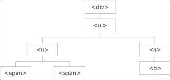

# 第十四章。jQuery – 流行的 JavaScript 库

jQuery 是一个开源的 JavaScript 库。jQuery 使得 JavaScript 编程变得更加简单。

以下是一些 jQuery 基金会的知名企业成员：

+   **WordPress**: ([`wordpress.org/`](http://wordpress.org/))

+   **IBM**: ([`ibm.com/`](http://ibm.com/))

+   **NeoBux**: ([`www.neobux.com/`](http://www.neobux.com/))

+   **Mozilla**: ([`www.mozilla.org/`](http://www.mozilla.org/))

+   **英特尔开源技术中心**：([`software.intel.com/en-us/oss`](http://software.intel.com/en-us/oss))

+   **Adobe**: ([`adobe.com/`](http://adobe.com/))

你可以在他们的官方网站[www.jQuery.com](http://www.jQuery.com)找到有关 jQuery 的所有信息。

# JQuery 的演变

jQuery 自第一天起一直在发展。目前有两个主要版本可供下载。1.x 和 2.x 版本有所不同；1.x 版本更稳定，也支持旧版浏览器；而 2.x 版本与 1.x 版本具有相同的 API，但不支持旧版浏览器。

### 注意

旧版浏览器是指尚未更新到最新版本的较老版本的浏览器。

如果你在一个项目中使用 jQuery，你可以获取一个占用资源更少且加载速度更快的版本。

# 开始使用

要开始开发 jQuery，你可以通过访问[`jquery.com/`](https://jquery.com/)下载 jQuery 软件。在接下来的章节中，我们将介绍一些下载链接。

## 安装 jQuery

我们可以从[`jquery.com/download/`](http://jquery.com/download/)下载 jQuery。

可以下载的 jQuery 有两个版本：压缩版和未压缩版。

要选择你的选项，请访问前面的链接，右键点击**另存为**并选择**我的电脑**下载它。

### jQuery 1.x

我们可以从[`code.jquery.com/jquery-1.11.3.min.js`](http://code.jquery.com/jquery-1.11.3.min.js)下载压缩版本。

对于开发，我们可以从[`code.jquery.com/jquery-1.11.3.js`](http://code.jquery.com/jquery-1.11.3.js)下载 1.x 版本。

### jQuery 2.x

我们可以从[`code.jquery.com/jquery-2.1.4.min.js`](http://code.jquery.com/jquery-2.1.4.min.js)下载压缩版本。

对于开发，我们可以从[`code.jquery.com/jquery-2.1.4.js`](http://code.jquery.com/jquery-2.1.4.js)下载 2.x 版本。

# 使用 jQuery

jQuery 是一个非常强大的 JavaScript 库。以下是一些代码示例，可以帮助你在下一个项目中快速入门。

如果你已经将 jQuery 库下载到你的硬盘上，并计划从那里使用它，那么你可以在你的 HTML `<head>`标签中包含以下代码：

```js
<script src="img/jquery.min.js"></script> 
```

在这里，`js`是项目根目录中的一个文件夹。

### 小贴士

为了避免较长的加载时间和性能问题，脚本应该添加到 `<body>` 标签的末尾，因为当浏览器加载网页（比如说，`sample1.html`）并且脚本位于 body 标签的末尾时，浏览器可以渲染页面的内容（body），然后才开始加载脚本。

jQuery 语法用于对 HTML 元素执行任何特定操作。

```js
<script src="img/jquery.min.js">
</script>
```

一个点/句号后跟类名作为参数传递。

选择器

```js
$(selector).action()
```

这里是描述：

+   `$`: `$` 用于访问 jQuery 对象。

+   `(selector)`: 使用熟悉的 CSS 样式选择器语法查询（或查找）HTML 元素。例如，你可以通过元素名称、类型、类或 ID 来选择。 

+   基本语法如下：

# 这通过类名选择元素。

`jQuery action()`: 例如，它可以是指点击、按键、聚焦等事件。

选择器以 `$` 符号开头，后跟括号：`$()`

## 元素选择器

元素选择器通过名称选择元素。例如，如果一个段落被写为 `<p>` 标签，你可以通过其名称选择这个段落，即 `p`：

```js
$("p")
```

### 参数

返回

### ID 选择器通过 ID 选择元素。HTML 的每个元素都可以有自己的标识 ID，并且可以使用 `#` 访问。例如，要访问 ID 为 text 的元素，我们可以使用以下语法：

元素选择器返回元素。

### 返回

要选择的元素名称作为参数传递。

## ID 选择器

这通过 ID 选择元素。ID 通常用于通过 JavaScript 中的井号或哈希符号唯一标识通过 DOM 访问的元素。

```js
$("#text")
```

### 元素选择器通过名称选择元素。例如，如果一个段落被写为 `<p>` 标签，你可以通过其名称选择这个段落。

数字符号（或井号）后跟 ID 名称作为参数传递。

### 另一种首选的方法是使用 Google 托管库；这些库比使用你自己的托管 jQuery 库提供了更快的页面渲染和 jQuery 代码。你可以使用以下代码片段使用 Google 开发者托管库：

这将使用作为参数传递的 ID 返回元素。

### 描述

如其名所示，`selector` 属性用于选择 HTML 的各种元素。`selector` 属性基本上支持 CSS 选择器。

## 类选择器

这将使用作为参数传递的`Class`名称返回元素。

```js
$(".sample")
```

### 参数

参数

### 类选择器通过类名选择元素。例如，一个名为 sample 的类可以通过以下语法访问：

描述

### 描述

参数

# 事件

jQuery 使得当用户与网页交互时更容易做出响应。例如，当他们在某处点击、滚动文档、悬停在字段上或类似操作时，我们可以执行多个任务。每当用户与网页交互时，都会发生一个事件。我们可以使用事件处理来执行我们的代码。

## 鼠标事件

这些是在用户激活与鼠标相关的任何函数时立即实例化的事件。在接下来的章节中，我们将介绍每个鼠标事件的描述。

### `.click()`

点击事件接收一个 DOM 对象，并在用户点击时调用该函数。

#### 参数

点击事件接收一个回调函数。

#### 返回值

这将返回在点击时调用的函数生成的响应。

#### 描述

点击事件使用 ID 获取用户点击的位置，并相应地调用在 body 内部定义的相应函数。

这里是它用法的一个例子。

**HTML 代码**:

```js
<div id="clicked">
  //function to be called after clicked
</div>
```

**jQuery 代码**:

```js
$( "#clicked" ).click(function() {
  alert( "Function for .click() called." );
});
```

### `.dblclick()`

我们可以使用`.dblclick()` jQuery 方法将处理程序附加到 HTML 元素的**双击**事件。

#### 参数

`dbclick`事件接收一个回调函数。

#### 返回值

这将返回在**双击**时调用的函数生成的响应。

#### 描述

`dblclick`事件使用 ID 获取用户双击的位置，并相应地调用其相应的函数。

这里是它用法的一个例子。

**HTML 代码**:

```js
<div id="clicked">
  // function to be called after clicked
</div>
```

**jQuery 代码**:

```js
$( "#clicked" ).dblclick(function() {
  alert( "Function for .dblclick() called." );
});
```

### `.hover()`

`hover`事件使用 ID 获取用户鼠标所在的位置，并相应地调用其相应的函数。

#### 参数

`hover`事件接收一个回调函数。

#### 返回值

这将返回在**悬停**时调用的函数生成的响应。

#### 描述

`hover`事件使用 ID 获取用户鼠标所在的位置，并相应地调用其相应的函数。

这里是它用法的一个例子。

**HTML 代码**:

```js
<ul>
  <li>Lahore</li>
  <li>Karachi</li>
  <li>Peshawar</li>
  <li>Sialkot</li>
</ul>
```

**jQuery 代码**:

```js
$( "li" ).hover(
  function() {
    $( this ).append( $( "<span> (*)</span>" ) ); // "this" is used to access the current object itself
  }, function() {
    $( this ).find( "span:first" ).remove();
  }
);
```

### `.mousedown()`

当用户左键点击鼠标并突出显示特定文本时，`.mousedown`事件被激活。

#### 参数

当元素被点击时执行的`.mousedown()`函数。

#### 返回值

这将返回在**点击**时调用的函数生成的响应。

#### 描述

当用户左键点击并突出显示一些特定文本时，此事件被激活。

这里是它用法的一个例子。

**HTML 代码**:

```js
<div id="myTarget">
  Click here
</div>
```

**jQuery 代码**:

```js
$( "#myTarget" ).mousedown(function() {
  alert( "Function for .mousedown() called." );
});
```

### `.mouseenter()`

当鼠标悬停在所选文本上时，此事件被激活，并相应地调用一个函数。

#### 参数

`mouseenter`事件接收一个回调函数。

#### 返回值

这将返回在**鼠标进入**时调用的函数生成的响应。

#### 描述

当鼠标悬停在所选文本上时，此事件被激活，并相应地调用一个函数。与`mouseenter()`相关的事件只触发一次，所以即使你将光标悬停在元素上，通过此函数分配的函数也只执行一次。

这里是它用法的一个例子。

**HTML 代码**:

```js
<div id="external">
  External
  <div id="internal">
    Internal
  </div>
</div>
<div id="myLog"></div>
```

**jQuery 代码**:

```js
$( "#external" ).mouseenter(function() {
  $( "#myLog" ).append( "<p>Function for .mouseenter() called.</p>" );
});
```

### `.mouseleave()`

当光标从 HTML 元素移开时，会激活 `.mouseleave` 事件。

#### 参数

`mouseleave` 事件接收一个回调函数。

#### 返回值

这返回了在点击时调用的函数生成的响应。

#### 描述

当鼠标离开时，会激活此事件。函数会相应地被调用。

这里是它使用的一个示例。

**HTML 代码**:

```js
<div id="external">
  External
  <div id="internal">
    Internal
  </div>
</div>
<div id="myLog"></div>
```

**jQuery 代码**:

```js
$( "#external" ).mouseleave(function() {
  $( "#myLog" ).append( "<p> Function for .mouseleave() called.</p>" );
});
```

### `.mousemove()`

当鼠标在元素内部移动时，会触发 `.mousemove` 事件。

#### 参数

`mousemove` 事件接收一个回调函数。

#### 返回值

这返回了在鼠标移动时调用的函数生成的响应。

#### 描述

当鼠标在元素内部移动时，会触发此事件。

这里是它使用的一个示例。

**HTML 代码**:

```js
<div id="myTarget">
  Move here
</div>
<div id="other">
  Trigger the Function
</div>
<div id="myLog"></div>
```

**jQuery 代码**:

```js
$( "#myTarget" ).mousemove(function( event ) {
  // the event keyword identifies the mousemove event in the case of this example
  var msg = "Function for .mousemove() called at ";
  msg += event.pageX + ", " + event.pageY;
  $( "#myLog" ).append( "<div>" + msg + "</div>" );
});
```

### `.mouseout()`

当鼠标指针离开元素的边界时，会触发 `.mouseout` 事件。任何 HTML 元素都可以绑定到此事件。

#### 参数

`mouseout` 事件接收一个回调函数。

#### 返回值

这返回了在鼠标移出目标元素时调用的函数生成的响应。

#### 描述

当鼠标指针离开元素时，会触发 `mouseout` 事件。

这里是它使用的一个示例。

必需的 HTML 代码：

```js
<div id="external">
  External
  <div id="internal">
    Internal
  </div>
</div>
<div id="other">
  Trigger the Function
</div>
<div id="myLog"></div>
```

必需的 jQuery 代码：

```js
$( "#external" ).mouseout(function() {
  $( "#myLog" ).append( "<p>Function for .mouseout() called.</p>" );
});
```

### `.toggle()`

此 `.toggle()` 函数用于将多个处理程序绑定到匹配的元素上，这些处理程序在交替点击时执行。

#### 参数

`toggle()` 函数的参数是 `duration`、`easing` 和 `callback`。

`duration` 参数是可选的，用于指定隐藏和显示效果的速率。可能的值有快速、慢速和毫秒。默认值为 400 毫秒。

`easing` 参数是可选的，用于指定用于动画的 `easing()` 函数。默认值是 `string`。

`callback` 参数也是可选的，用于指定在动画完成后要调用的函数。

#### 返回值

这返回了被调用的函数的输出。

#### 描述

此函数用于检查元素的可见性，然后交替使用 `hide()` 和 `show()` 方法。回调总是在动画完成后被触发，并且对于找到匹配的元素只触发一次。

这里是它使用的一个示例。

必需的 HTML 代码：

```js
<ul>
  <li>Mercury</li>
  <li>Venus</li>
  <li>Earth</li>
  <li>Mars</li>
</ul>
```

必需的 jQuery 代码：

```js
$(document).ready(function() {
  $("ul").click(function() {
    $("li").toggle("slow", function() {
    });
  });
});
```

## 键盘事件

键盘事件在 `Keyboard` 函数上触发，例如，当按钮/键被按下或释放时，等等。键盘事件可以通过以下内置 jQuery 函数进行控制。可用的函数有 `KeyDown`、`KeyPress` 和 `KeyUp`。

`KeyDown` 和 `KeyPress` 之间的唯一实际区别是 `KeyPress` 传递由 `KeyPress` 事件产生的字符，并且只有当存在一个时才会被调用。

例如，如果你在键盘上按下 *A* 键，你会得到以下事件序列：

+   `KeyDown`: `KeyCode=Keys.A`，`KeyData=Keys.A`，`Modifiers=Keys.None`

+   `KeyPress`: `KeyChar='a'`

+   `KeyUp`: `KeyCode=Keys.A`

### `.keydown()`

当用户按下键时，会实例化`keydown`事件。

#### 参数

`keydown`事件将按下的键作为参数发送。

#### 返回值

这返回了按键按下时调用的函数的输出。

#### 描述

当用户按下键时，会实例化`keydown`事件，这会调用要执行的功能。

这里是它用法的一个示例。

必需的 HTML 代码：

```js
<form>
  <input id="myTarget" type="text" value="KeyPress">
</form>
```

必需的 jQuery 代码：

```js
$( "#myTarget" ).keydown(function() {
  alert( "Function for .keydown() called." );
});
```

之前的示例代码选择了具有`myTarget` ID 的`div`元素，并在按下键时触发警报函数。

### `.keypress()`

当用户按下键时，会实例化`keypress`事件。

#### 参数

这会将按下的键作为参数发送。

#### 返回值

这返回了由按键触发的函数的输出。

#### 描述

当用户按下键时，会实例化`keypress`事件，这会调用要执行的功能。

这里是它用法的一个示例。

必需的 HTML 代码：

```js
<form>
  <fieldset>
    <input id="myTarget" type="text" value="Tomato">
  </fieldset>
</form>
```

必需的 jQuery 代码：

```js
$( "#myTarget" ).keypress(function() {
  console.myLog( "Function for .keypress() called." );
});
```

之前的示例代码选择了具有`myTarget` ID 的`div`元素，并在按下键时触发警报函数。

### `.keyup()`

当用户释放按下的键时，会发生`keyup`事件。

#### 参数

这会将按下的键作为参数发送。

#### 返回值

这返回了释放键时调用的函数的输出。

#### 描述

当用户释放按下的键时，会发生此事件。

这里是它用法的一个示例。

必需的 HTML 代码：

```js
<form>
  <input id="myTarget" type="text" value="Hello there">
</form>
```

必需的 jQuery 代码：

```js
$( "#myTarget" ).keyup(function() {
  alert( "Function for .keyup() called." );
});
```

之前的示例代码选择了具有`myTarget` ID 的`div`元素，并在释放键时触发警报函数。

## 表单事件

表单事件是在表单内的元素绑定到 jQuery 时发生的。当需要处理通过表单输入的数据时，这些事件非常有用。这些事件可以用在`<form>`标签内的元素上。现在我们将介绍每个表单事件的描述。

### `submit()`

如其名所示，当表单提交时，会触发`submit`事件。

其语法是`$(selector).submit(function)`。

#### 参数

传入的参数是表单提交后要运行的功能。

#### 返回值

此事件不返回任何内容。

#### 描述

`submit()`函数是一个表单事件。它用于将函数绑定到表单元素，每当表单提交时都需要调用该函数。

必需的 HTML 代码：

```js
<form action="">
  User ID: <input type="text" name="UsrID" value="KA112"><br>
  Password: <input type="password" name="password" value="Password"><br>
  <input type="submit" value="Submit">
</form>
```

必需的 JQuery 代码：

```js
$(document).ready(function() {
  $("form").submit(function() {
    alert("Form Submitted!");
  });
});
```

### `.change()`

当表单中的元素值更改时，会触发`change`事件。

其语法是`$(selector).change(function)`。

#### 参数

传入的参数是当所选元素的值更改时要运行的功能。

#### 返回值

此事件不返回任何内容。

#### 描述

此事件用于将事件绑定到需要在表单元素中的值更改时调用的函数。此函数仅适用于`<input>`、`<textarea>`和`<select>`元素。

必需的 HTML 代码：

```js
<select name="ShadesOfGreen">
  <option value="Jade">Jade</option>
  <option value="Mint">Mint</option>
  <option value="Emerald">Emerald</option>
  <option value="Moss">Moss</option>
</select>
```

必需的 JQuery 代码：

```js
$(document).ready(function() {
  $("select").change(function() {
    alert("Option Changed");
  });
});
```

### `blur()`

当表单中的元素失去焦点并且用户移动到表单中的下一个元素时，会触发 `blur` 事件。

其语法是 `$(selector).blur(function)`。

#### 参数

传入的参数是当元素失去焦点时运行的函数。

#### 返回值

此事件不返回任何内容。

#### 描述

使用 `blur` 事件在元素失去焦点时调用函数。

必须的 HTML 代码：

```js
User ID: <input type="text">
Gender: <select name="Gender">
  <option value="Male">Male</option>
  <option value="Female">Female</option>
</select>
```

必须的 JQuery 代码：

```js
$(document).ready(function() {
  $("input").blur(function() {
    alert("User ID lost foucs");
  });
});
```

### focus()

当表单中的元素获得焦点时，会触发 `focus` 事件。

其语法是 `$(selector).focus(function)`。

#### 参数

传入的参数是当元素获得焦点时运行的函数。

#### 返回值

此事件不返回任何内容。

#### 描述

使用 `focus` 事件在元素获得焦点时调用函数。一个元素通常在用鼠标选择它或使用 *Tab* 键导航到它时处于 *焦点状态*。此事件仅在指定的元素处于焦点时触发，而不是元素的子元素。

通常与 `blur` 事件一起使用 `focus` 事件。

必须的 HTML 代码：

```js
User ID: <input type="text" name="UsrID"><br>
Email ID: <input type="text" name="emailID">
```

必须的 JQuery 代码：

```js
$(document).ready(function() {
  $("input").focus(function() {
    $(this).css("background-color", "#cccccc");
  });
  $("input").blur(function() {
    $(this).css("background-color", "#ffffff");
  });
});
```

### focusin()

当元素或其子元素获得焦点时，会触发此事件。

其语法是 `$(selector).focusin(function)`。

#### 参数

传入的参数是当元素获得焦点时运行的函数。

#### 返回值

此事件不返回任何内容。

#### 描述

当元素或其子元素获得焦点时，会触发 `focusin` 事件。此事件也会在子元素获得焦点时被调用。

必须的 HTML 代码：

```js
<div>
  Name: <input type="text" name="fullname"><br>
  Email: <input type="text" name="email">
</div>
```

必须的 JQuery 代码：

```js
$(document).ready(function() {
  $("div").focusin(function() {
    $(this).css("background-color", "#cccccc");
  });
});
```

### focusout()

当元素或其子元素失去焦点时，会触发 `focusout` 事件。

其语法是 `$(selector).focusout(function)`。

#### 参数

传入的参数是当元素获得焦点时运行的函数。

#### 返回值

此事件不返回任何内容。

#### 描述

当元素或其子元素失去焦点时，会触发此事件。此事件通常与 `focusin` 事件一起使用。

必须的 HTML 代码：

```js
<div>
  Name: <input type="text" name="fullname"><br>
  Email: <input type="text" name="email">
</div>
```

必须的 JQuery 代码：

```js
$(document).ready(function() {
  $("div").focusin(function() {
    $(this).css("background-color", "#cccccc");
  });
  $("div").focusout(function() {
    $(this).css("background-color", "#ffffff");
  });
});
```

## 文档事件

文档事件通常在文档加载时触发。在接下来的章节中，我们将介绍每个文档事件的描述。

### resize()

当用户调整窗口大小时，会触发 `resize` 事件。其语法如下：

```js
$(selector).resize(function)
```

#### 参数

传入的参数是当窗口大小调整后要运行的函数。

#### 返回值

此事件不返回任何内容。

#### 描述

使用 `resize` 事件在用户调整窗口大小时调用函数。

必须的 HTML 代码：

```js
<p></p>
```

必须的 JQuery 代码：

```js
$(document).ready(function() {
  $(window).resize(function() {
    $("p").text("Window resized!!");
  });
}); 
```

### scroll()

当用户在（可滚动的）元素中滚动时，会触发 `scroll` 事件。我们可以使用此事件将其绑定到函数。其语法如下：

```js
$(selector).scroll(function)
```

#### 参数

传入的参数是当用户在元素上滚动时运行的函数。

#### 返回值

此事件不返回任何内容。

#### 描述

当用户在元素中滚动时，会触发 `scroll` 事件。

必须的 HTML 代码：

```js
<div style="border:1px solid black;width:200px;height:100px;overflow:scroll;">Lorem ipsum dolor sit amet, consectetur adipiscing elit. Curabitur vehicula ultrices nulla vel facilisis. Curabitur elementum lorem non massa porttitor accumsan. Cras eu leo tincidunt, pulvinar neque et, tempus dolor. Nam condimentum nisl vel quam posuere, vitae malesuada nunc molestie. Aliquam pulvinar diam eu magna sagittis efficitur. Vestibulum tempor, leo accumsan maximus hendrerit, ex nisi rutrum sapien, nec ultricies tellus nisl ac lacus. Phasellus sed ligula augue.
</div>

<p></p>
```

必须的 jQuery 代码：

```js
$(document).ready(function() {
  $("div").scroll(function() {
    $("p").text( "Text Scrolled!");
  });
});
```

# 特效和动画

可以通过不同的设计和颜色，将自定义动画和效果添加到各种元素中，以增强您的界面。

## animate()

`animate()` 函数使用一些内置动画来在视图中动画化对象。

其语法如下：

```js
(selector).animate({styles},speed,easing,callback)
```

### 参数

`animate` 函数接受 `duration`、`easing` 和 `callback` 参数。

`duration` 参数是可选的，用于指定隐藏和显示效果的速率。其可能的值是快速、慢速和毫秒。默认是 400ms。

`easing` 参数是可选的，用于指定动画中要使用的缓动函数。默认是 `string`。

`callback` 参数也是可选的，用于指定动画完成后要调用的函数。

### 返回值

动画返回包含所有修改的修改后的对象。

### 描述

可以通过不同的设计和颜色，将自定义动画和效果添加到各种元素中，以增强您的界面。

## stop()

当 `stop()` 方法应用于所选元素时，它会停止该元素的动画。

其语法为 `$(selector).stop(stopAll,goToEnd);`

### 参数

这接受两个默认设置为 `false` 的布尔值作为参数。

### 返回值

这不返回任何内容。

### 描述

此函数在调用时立即停止动画。如果第一个参数设置为 `true`，则移除该元素的所有其他动画。如果第二个参数设置为 `true`，则快速完成当前动画。

这里是它的用法示例。

必须的 HTML 代码：

```js
<div id="sample">
  
</div>
```

必须的 jQuery 代码：

```js
$( "#sample" ).hover(function() {
  $( this ).find( "img" ).stop( true, true ).fadeOut();
}, function() {
  $( this ).find( "img" ).stop( true, true ).fadeIn();
});
```

上述示例代码创建了一个没有常见问题（多个队列动画）的淡入效果。

## 隐藏、显示和切换

可以设置元素隐藏和显示，其中隐藏使元素从用户眼中消失，显示则相反。

### hide()

当 `hide()` 函数应用于 HTML 元素时，它会将该元素从视图中隐藏。这可以用于根据用户活动生成动态内容。以下是其语法：

```js
$(selector).hide(speed,callback);
```

#### 参数

这接受速度（毫秒）和回调函数作为参数。作为参数的值如下：

+   快速

+   慢速

+   毫秒数

#### 返回值

这不返回任何内容。

#### 描述

此函数等同于为所选元素设置 CSS 属性 `display: none`。它还保存原始的显示属性以供将来使用。

这里是它的用法示例。

必须的 HTML 代码：

```js
<div id="sample">
</div>

```

必须的 jQuery 代码：

```js
$( "#sample" ).click(function() {
  $( "#myImage" ).hide( "slow", function() {
    alert( "Animation complete." );
  });
});
```

### show()

如果 `show()` 函数应用于 HTML 元素，则使隐藏的元素可见。这可以用于根据用户活动控制和操作动态内容，例如，在选中某个复选框后使某些表单选项可见。以下是其语法：

```js
$(selector).show(speed,callback);
```

#### 参数

这接受速度（毫秒）和回调函数作为参数。作为参数的值如下：

+   快速

+   慢速

+   `时间`（以毫秒为单位）

#### 返回值

这个函数不返回任何内容。

#### 描述

这个函数会移除元素的 `display:none` 属性并将其恢复到原始状态。例如，如果一个元素具有 `display:inline-block` 属性并且被 hide 函数隐藏，它将把显示属性恢复到 inline-block。

这里是它使用的一个示例。

必需的 HTML 代码：

```js
<div id="sample">
</div>

```

必需的 jQuery 代码：

```js
$( "#sample" ).click(function() {
  $( "#myImage" ).Show( "slow", function() {
    alert( "Animation complete." );
  });
});
```

### toggle()

如果将 `toggle()` 函数应用于 HTML 元素，它将切换该元素的可见性：

```js
$(selector).toggle(speed,callback);
```

#### 参数

这个函数接受速度（以毫秒为单位）和回调函数作为参数。参数值如下：

+   `快速`

+   `慢速`

+   `时间`（以毫秒为单位）

#### 返回值

这个函数不返回任何内容。

#### 描述

这个函数用于切换元素的可见性。

### 小贴士

这个函数不应与之前解释过的鼠标事件函数 `toggle()` 混淆。为了确保使用的是哪个 `toggle()` 函数，请检查传递给函数的参数。

这里是它使用的一个示例。

必需的 HTML 代码：

```js
<div id="sample">
</div>

```

必需的 jQuery 代码：

```js
$( "#sample" ).click(function() {
  $( "#myImage" ).Show( "slow", function() {
    alert( "Animation complete." );
  });
});
```

## 淡出

淡出可以用来设置元素的可见性。

### fadeIn()

`fadeIn()` 函数在功能上类似于 `show()` 函数，但 `fadeIn()` 带有漂亮的淡入过渡效果。

它的语法是 `$(selector).fadeIn(speed,callback);`。

#### 参数

这接受速度（以毫秒为单位）和回调函数作为参数。参数值如下：

+   `快速`

+   `慢速`

+   `时间`（以毫秒为单位）

#### 返回值

这个函数不返回任何内容。

#### 描述

它与 `show()` 函数类似，但带有淡入淡出过渡效果。

这里是它使用的一个示例。

必需的 HTML 代码：

```js
<div id="sample">
  Click here
</div>

```

必需的 jQuery 代码：

```js
$( "#sample" ).click(function() {
  $( "#myImage" ).fadeIn( "slow", function() {
    // Animation complete
  });
});
```

前面的示例代码选择了具有 `sample` ID 的 `div` 元素，并以慢速动画淡入具有 `myImage` ID 的图像。

### fadeOut()

`fadeOut()` 函数在功能上类似于 `hide()` 函数，但它带有漂亮的淡出过渡效果。

它的语法如下：`$(selector).fadeOut(speed,callback);`

#### 参数

这接受速度（以毫秒为单位）和回调函数作为参数。参数值如下：

+   `快速`

+   `慢速`

+   `时间`（以毫秒为单位）

#### 返回值

这个函数不返回任何内容。

#### 描述

`fadeOut()` 函数与 `hide()` 函数在功能上类似，但带有淡入淡出过渡效果。

这里是它使用的一个示例。

必需的 HTML 代码：

```js
<div id="sample">
  Click here
</div>

```

必需的 jQuery 代码：

```js
$( "#sample" ).click(function() {
  $( "#myImage" ).fadeOut( "fast", function() {
    // Animation complete
  });
});
```

### fadeToggle()

`fadeToggle()` 函数会自动切换元素的显示属性从 `none` 到 `block`、`inline` 等等。

这里是它语法的示例：

```js
$(selector).fadeToggle(speed,callback);
```

#### 参数

这接受速度（以毫秒为单位）和回调函数作为参数。参数值如下：

+   `快速`

+   `慢速`

+   `时间`（以毫秒为单位）

#### 返回值

这个函数不返回任何内容。

#### 描述

如果一个元素已经隐藏，`fadeToggle()` 将使其可见，反之亦然。

这里是它使用的一个示例。

必需的 HTML 代码：

```js
<div id="sample">
  Click here
</div>

```

必需的 jQuery 代码：

```js
$( "#sample" ).click(function() {
  $( "#myImage" ).fadeToggle( 2000, function() {
    // Animation complete
  });
});
```

### fadeTo()

`fadeTo()` 函数将目标元素的透明度调整到给定的值。

它的语法如下：

```js
$(selector).fadeTo( duration, opacity [, complete ] )
$(selector).fadeTo( duration, opacity [, easing ] [, complete ] )
```

#### 参数

这以毫秒为单位的持续时间作为参数。作为参数接受的值如下：

+   `Fast`

+   `Slow`

+   `时间`（毫秒）

另一个参数是目标元素的透明度。值介于 `0` 和 `1` 之间，最后一个参数是回调函数。

#### 返回值

这不会返回任何内容。

#### 描述

`fadeTo()` 函数与 `fadeIn()` 方法类似。但用户可以在此处指定目标透明度。例如，将元素设置为 50% 透明度，可以将透明度设置为 0.5。

必须的 HTML 代码：

```js
<div id="sample">
  Click here
</div>

```

必须的 jQuery 代码：

```js
$( "#sample" ).click(function() {
  $( "#myImage" ).fadeTo( "Fast", 0.5, function() {
    // Animation complete
  });
});
```

## 滑动

滑动方法用于在向上或向下方向滑动元素。`slideDown()` 函数将使元素可见，而 `slideUp()` 函数将隐藏元素的内部内容。

### slideDown()

`slideDown()` 函数以指定的速度滑动选定的元素。

这里是它的语法示例：

```js
$(selector).slideDown(speed,callback);
```

#### 参数

这需要以毫秒为单位的速度和回调函数作为参数。作为参数接受的值如下：

+   `Fast`

+   `Slow`

+   `时间`（毫秒）

#### 返回值

这不会返回任何内容。

#### 描述

`slideDown()` 函数以平滑的滑动效果使隐藏的元素可见。

这里是它用法的一个示例。

必须的 HTML 代码：

```js
<div id="sample">
  Click here
</div>

```

必须的 jQuery 代码：

```js
$( "#sample" ).click(function() {
  $( "#myImage" ).slideDown( "slow", function() {
    // Animation complete.
  });
});
```

### slideUp()

`slideUp()` 函数以指定的速度向上滑动（隐藏）选定的元素。

这里是它的语法示例：

```js
$(selector).slideUp(speed,callback);
```

#### 参数

以毫秒为单位的速度和回调函数作为参数。作为参数接受的值如下：

+   `Fast`

+   `Slow`

+   `时间`（毫秒）

#### 返回值

这不会返回任何内容。

#### 描述

此函数以向上的滑动效果隐藏选定的元素。

这里是它用法的一个示例。

必须的 HTML 代码：

```js
<div id="sample">
  Click here
</div>

```

必须的 jQuery 代码：

```js
$( "#sample" ).click(function() {
  $( "#myImage" ).slideUp( "fast", function() {
    // Animation complete.
  });
});
```

### slideToggle()

`slideToggle()` 函数在选定的元素之间切换 `slideUp()` 和 `slideDown()`，并指定速度。

这里是它的语法示例：

```js
$(selector).slideToggle(speed,callback);
```

#### 参数

这以毫秒为单位的速度和回调函数作为参数。作为参数接受的值如下：

+   `Fast`

+   `Slow`

+   `时间`（毫秒）

#### 返回值

这不会返回任何内容。

#### 描述

正如 `fadeToggle()` 在两种状态之间切换过渡一样，`slideToggle()` 可以滑动元素向上或向下。

这里是它用法的一个示例。

必须的 HTML 代码：

```js
<div id="sample">
  Click here
</div>

```

必须的 jQuery 代码：

```js
$( "#sample" ).click(function() {
  $( "#myImage" ).slideToggle( "fast", function() {
    // Animation complete.
  });
});
```

# 回调

多行语句是排队而不是同时执行。回调函数排队语句并逐个执行。

它的语法如下：

```js
var callbacks = $.Callbacks();
```

创建的对象可以用来添加、删除、实例化和禁用回调。支持的函数有 `callbacks.add()`、`callbacks.remove()`、`callbacks.fire()` 和 `callbacks.disable()`。

## callbacks.add()

此函数用于添加稍后要调用的数组中的所有函数。

### 参数

这以字符串形式作为其参数的标志。

### 返回值

此方法返回与它关联的回调对象（this）。

### 描述

`callbacks.add()` 函数将函数添加到回调数组中。

这里是其使用的一个示例。

必要的 jQuery 代码：

```js
function myFunc1( value ) {
  console.myLog( value );
}

function myFunc2( value ) {
  console.myLog( "myFunc2 says: " + value );
  return false;
}

var callbacks = $.Callbacks();
callbacks.add( myFunc1 );

// Outputs: meow!
callbacks.fire( "meow!" );

callbacks.add( myFunc2 );

// Outputs: woof!, myFunc2 says: woof!
callbacks.fire( "woof!" );
```

## callbacks.fire()

`callbacks.fire()` 函数使用已传递的任何参数调用列表中的回调函数。

### 参数

这传递一个参数列表，将其传递回回调列表。

### 返回值

这返回附加到其上的回调对象。

### 描述

`callbacks.fire()` 函数用于使用参数调用列表中的回调函数。前一个示例可以参考。

## callbacks.remove()

`callbacks.remove()` 函数用于从数组中删除一个函数。

### 参数

这以字符串形式作为其参数的标志。

### 返回值

这返回附加到其上的回调对象。

### 描述

这从回调数组中删除函数。前一个示例可以参考。

## callbacks.disable()

`callbacks.disable()` 函数用于禁用数组中下一个函数的调用。

### 参数

这不接收任何参数。

### 返回值

这返回附加到其上的回调对象。

### 描述

使用 `callbacks.disable()` 函数防止执行数组中的下一个函数：

```js
var sound = function( value ) {
  console.log( value );
};

var callbacks = $.Callbacks();

// Add the above function to the list
callbacks.add( sound );

// Fire the items on the list
callbacks.fire( "Woof!" );

// Disable further calls being possible
callbacks.disable();

callbacks.fire( "Meow" );
```

# 链式操作

可以通过将它们链接到同一元素上执行不同数量的语句。每个语句将依次执行。

从每个链式操作返回的值是一个新的 jQuery 对象。链式操作可以通过将一个操作附加到前一个操作来完成；例如：

```js
$("#p1").css("color", "blue").slideDown(100).slideUp(35);
```

在这里，`slideUp()` 和 `slideDown()` 操作依次执行。

# jQuery 和文档对象模型

DOM 定义了访问 HTML 和 XML 文档的标准：

> *"W3C 文档对象模型 (DOM) 是一个平台和语言中立的接口，允许程序和脚本动态访问和更新文档的内容、结构和样式。"*

以下是一些 jQuery 中 DOM 操作的方法：

+   `text()`: 这用于设置或返回所选元素的文字内容

+   `html()`: 这用于设置或返回所选元素的内容

+   `val()`: 这用于设置或返回表单字段的值

# jQuery 遍历

您可以按元素组合的顺序遍历元素。所有元素大多以树的形式组合，我们可以从根开始遍历它们。

### 注意

元素本身并不是*组合*的，但它们在文档对象中被结构化或建模。

让我们看看以下图片：



让我们看看以下描述：

+   `<div>` 元素是 `<ul>` 的父元素，也是其内部所有内容的祖先元素

+   `<ul>` 元素是 `<li>` 元素的父元素，也是 `<div>` 的子元素

+   左侧 `<li>` 元素是 `<span>` 的父元素，是 `<ul>` 的子元素，也是 `<div>` 的后代。

+   `<span>` 元素是左侧 `<li>` 的子元素，也是 `<ul>` 和 `<div>` 的后代。

+   两个 `<li>` 元素是兄弟元素（它们具有相同的父元素）

+   右侧 `<li>` 元素是 `<b>` 的父元素，是 `<ul>` 的子元素，也是 `<div>` 的后代。

+   `<b>` 元素是右侧 `<li>` 的子元素，也是 `<ul>` 和 `<div>` 的后代。

## 祖先

祖先是父元素！

在接下来的几节中，我们将介绍三个有用的 jQuery 方法，用于在 DOM 树中向上遍历。

### parent()

`parent()` 函数返回选定元素的父元素。

#### 参数

此函数不接收任何参数，但作为 jQuery 对象的函数被调用。

#### 返回值

此函数返回元素的父元素。

#### 描述

此函数返回选定元素的父元素：

```js
$(document).ready(function() {
  $("span").parent();
});
```

### parents():

`parents():` 函数返回选定元素到根元素的所有父元素数组。

#### 参数

此函数不接收任何参数，但作为 jQuery 对象的函数被调用。

#### 返回值

此函数返回一个元素的所有父元素。

#### 描述

`parents():` 函数返回选定元素到根元素的所有父元素数组：

```js
$(document).ready(function() {
  $("span").parents();
});
```

### parentsUntil():

```js
$(selector).parentsUntil(stop,filter);
```

`parentsUntil()` 方法返回 `selector` 和 `stop` 元素之间的所有祖先元素。

祖先元素是父元素、祖父元素、曾祖父元素等。

#### 参数

停止是一个可选参数，表示搜索匹配祖先元素的停止位置。过滤器是一个可选参数，通常是一个表达式，用于在选择器和停止之间缩小搜索范围。

#### 返回值

此函数返回两个选定元素之间的所有父元素。

#### 描述

此函数返回两个选定元素之间的父元素：

```js
$(document).ready(function() {
  $("span").parentsUntil("div");
});
```

## 后代

父元素的子元素称为其后代。

在接下来的几节中，我们将介绍两个有用的 jQuery 方法，用于在 DOM 树中向下遍历。

### children()

`children()` 函数返回选定元素的所有子元素。

#### 参数

此函数不接收任何参数，但作为 jQuery 对象的函数被调用。

#### 返回值

此函数返回目标元素的所有子元素数组。

#### 描述

此函数返回选定元素的所有子元素：

```js
$(document).ready(function(){
  $("div").children();
});
```

### find()

`find()` 函数返回一个数组，直到没有子元素的子元素，这通常被称为 **叶**。

#### 参数

`find()` 函数接受 HTML 元素作为参数。

#### 返回值

此函数返回目标元素的所有子元素。

#### 描述

此函数返回一个数组，直到树中的叶元素：

```js
$(document).ready(function() {
  $("div").find("span");
});
```

## 兄弟元素

兄弟元素是具有相同父元素的元素。

在 DOM 树中横向遍历有许多有用的 jQuery 方法，我们在这里进行介绍。

### siblings()

```js
$(selector).siblings(filter);
```

`siblings()` 函数返回选定元素的所有兄弟元素。

#### 参数

过滤器是一个可选参数，通常是一个表达式，用于在所有兄弟元素中缩小搜索范围。

#### 返回值

此函数返回元素的所有兄弟元素。

#### 描述

此函数使用 `filter` 参数返回所选元素的所有兄弟元素：

```js
$(document).ready(function() {
  $("span").siblings("div");
});
```

### next()

```js
$(selector).next(filter);
```

过滤是一个可选参数，通常是一个表达式，用于缩小搜索下一个兄弟元素的范围。

#### 参数

此函数不接收任何参数，但作为 jQuery 对象的函数被调用。

#### 返回

这返回元素的下一个兄弟元素。

#### 描述

此函数使用 `filter` 参数返回所选元素的下一个兄弟元素：

```js
$(document).ready(function(){
  $("span").next();
});
```

### nextAll()

```js
$(selector).nextAll(filter);
```

`nextAll()` 函数返回所选元素的下一个兄弟元素的数组。

#### 参数

过滤是一个可选参数，通常是一个表达式，用于缩小搜索所有下一个兄弟元素的范围。

#### 返回

这返回一个包含目标元素所有下一个兄弟元素的数组。

#### 描述

此函数返回所选元素的下一个兄弟元素的数组，并使用参数：

```js
$(document).ready(function() {
  $("span").nextAll();
});
```

### nextUntil()

```js
$(selector).nextUntil(stop, filter);
```

`nextUntil()` 函数返回一个数组，包含所选元素在两个指定元素之间的下一个兄弟元素。

#### 参数

停止一个可选参数，表示搜索下一个匹配兄弟元素的停止位置。

过滤一个可选参数通常是一个表达式，用于缩小在选择器和停止之间的兄弟元素的搜索范围。

#### 返回

这返回元素的 所有下一个兄弟元素。

#### 描述

此函数返回两个元素之间的所选元素的下一个兄弟元素的数组：

```js
$(document).ready(function() {
  $("span").nextUntil('H4');
});
```

### prev()

```js
$(selector).prev(filter);
```

`prev()` 函数返回所选元素的先前兄弟元素。

#### 参数

过滤是一个可选参数，通常是一个表达式，用于缩小搜索前一个兄弟元素的范围。

#### 返回

`prev()` 函数返回元素的先前兄弟元素。

#### 描述

此函数使用 `filter` 参数返回所选元素的前一个兄弟元素的数组：

```js
$(document).ready(function() {
  $("span").prev();
});
```

### prevAll()

```js
$(selector).prevAll(filter);
```

`prevAll()` 函数返回所选元素的前一个兄弟元素的数组。

#### 参数

过滤是一个可选参数，通常是一个表达式，用于缩小搜索所有前一个兄弟元素的范围。

#### 返回

`prevAll()` 函数返回元素的所有前一个兄弟元素的数组。

#### 描述

此函数使用参数返回所选元素的前一个兄弟元素的数组：

```js
$(document).ready(function() {
  $("span").prevAll();
});
```

### prevUntil()

`prevUntil()` 函数返回一个数组，包含所选元素在两个元素之间的前一个兄弟元素。

#### 参数

这限制了搜索兄弟元素的范围。

#### 返回

这返回元素的 所有前一个兄弟元素的数组。

#### 描述

此函数返回所选元素的前一个兄弟元素的数组，并使用参数：

```js
$(document).ready(function() {
  $("span").prevUntil("Div");
});
```

## 过滤

过滤方法用于根据其位置定位特定元素。

### first()

`first()` 函数输出所选元素的第一个元素。

#### 参数

`first()` 函数将所选元素作为参数。

#### 返回

这返回一个 jQuery 对象，存储对匹配提供的选择器字符串的项的数组中第一个项的引用。

#### 描述

这个函数输出所选元素中的第一个元素。以下示例输出 `<div>` 标签内的第一个 `H1` 标题：

```js
$(document).ready(function() {
  $("div H1").first();
});
```

### 最后()

这个函数返回所选元素中的最后一个元素。

#### 参数

`last()` 函数接受所选元素作为参数。

#### 返回值

这返回一个 jQuery 对象，该对象存储对匹配提供的选择器字符串的项数组中最后一个项的引用。

#### 描述

这个函数输出所选元素中的最后一个元素。以下示例输出 `<div>` 标签内的最后一个 `H1` 标题：

```js
$(document).ready(function() {
  $("div H1").last();
});
```

### eq()

`eq()` 函数返回对应索引号指定的元素，前提是我们从 `0` 开始编号。因此，第一个元素将具有索引号 `0`，第二个元素将具有索引号 `1`，依此类推。

#### 参数

`eq()` 函数接受所选元素和索引号作为参数。

#### 返回值

这返回指定索引号处的元素。

#### 描述

这个函数返回对应索引号指定的元素。以下示例返回第五个 `div` 元素：

```js
$(document).ready(function() {
 $("div").eq(4);
});
```

### 过滤()

`filter()` 函数用于获取满足特定条件的元素列表。所有满足指定条件的元素都将被返回。

#### 参数

在这里，接受的参数是搜索的元素和该元素必须满足的条件。

#### 返回值

这返回满足指定条件的元素列表。

#### 描述

`filter()` 函数用于搜索并获取满足指定条件的元素列表。在以下示例中，我们将搜索并获取所有具有名为 `Feedback` 的类的 `<div>` 元素列表：

```js
$(document).ready(function() {
  $("div").filter(".Feedback");
});
```

### 注意

`not()` 方法是 `filter()` 方法的逆操作。如果你想找到不满足所述条件的元素，可以使用 `not()`。

# 在 jQuery 中使用 AJAX

**异步** **JavaScript 和 XML** (**AJAX**) 是 **单页应用程序** (**SPA**) 的基础构建块。这种方法用于在不重新加载整个页面的情况下更新网页的内容。这种方法有助于节省宝贵的资源，并且可以显著减少页面加载时间，因为只有页面的部分被重新加载，而不是整个页面。

更多的时候，你访问谷歌搜索页面来寻找你问题的答案。你有没有注意到当你在搜索框中输入时，页面是如何显示结果并提供相关搜索的有用建议？或者亚马逊和 eBay 网站上的产品过滤器。这些效果都是通过 AJAX 实现的。

## jQuery Ajax 加载

`load()` 方法从服务器加载数据并将返回的数据放入所选元素中。

其语法如下：

```js
$(selector).load(URL,data,callback);
```

### 参数

`load()` 方法接受 `URL`、`data` 和 `callback` 作为参数。

`callback` 参数可以有以下参数：

+   `responseTxt`：此参数包含成功时的结果内容

+   `statusTxt`：此参数包含请求的状态，即 `success`、`notmodified`、`error`、`timeout`、`parsererror`

+   `xhr`：此参数包含 `XMLHttpRequest` 对象

### 返回

从 URL 获取的数据放置在选定的元素中。

### 描述

`load()` 方法从服务器加载数据并将返回的数据放入选定的元素中。以下示例将 `Sample.txt` 文件加载到指定的 `<div>` 标签中：

```js
$("#div1").load("Sample.txt" , function(responseTxt, statusTxt, xhr);
```

## jQuery Ajax Get

`Get` 请求通过 HTTP `GET` 请求从服务器获取数据：

+   `GET`：此请求从指定的资源请求数据

其语法如下：

```js
$.get(URL,callback);
```

### 参数

这接受 URL 和回调作为参数。在这里，`callback` 参数是可选的。

### 返回

`Get` 请求返回从 URL 获取的数据。

### 描述

`Get` 请求通过 HTTP `GET` 请求从服务器获取数据：

```js
$.get("Sample.html", myfunction(data)
```

所需的 HTML 文件如下：

```js
<p> This is the data from the Sample.html file</p>
```

上述代码将从 html 文件中获取数据，并在触发时，行 **这是从 Sample.html 获取的数据** 将在警告框中显示。

## jQuery Ajax Post

`Post` 请求通过 HTTP `POST` 请求从服务器获取数据：

+   `POST`：此请求从指定的资源请求数据

其语法如下：

```js
$.post(URL, data, callback);
```

### 参数

这接受 `URL`、`data` 和 `callback` 作为参数。在这里，`data` 和 `callback` 参数是可选的。

### 返回

这返回从 URL 获取的数据。

### 描述

这通过 HTTP `POST` 请求从服务器获取数据：

```js
$.post("Sample.html", myfunction(data)
```

所需的 HTML 文件如下：

```js
<p> This is the data from the Sample.html file</p>
```

上述代码将从 HTML 文件中获取数据，并在触发时，**这是从 Sample.html 获取的数据** 将在警告框中显示。

# 其他 jQuery 函数

这里有一些更多的 jQuery 函数。

## noConflict()

不同的脚本不能同时工作。因此，为了消除冲突，我们使用 `noConflict()` 函数。

其语法如下：

```js
$.noConflict()
```

### 参数

此方法的一个可选参数是 `removeAll`。此参数用于释放对所有 jQuery 变量的控制。它是一个布尔值。如果存在，则表示必须释放对所有值的控制。

### 返回

此方法不返回任何内容。

### 描述

`$` 符号被各种 JavaScript 库使用，如果与 jQuery 一起使用可能会引起问题。`noConflict()` 函数将 `$` 符号的控制权交回给其他库。

以下代码展示了当一个事件正在处理时，另一个事件必须等待的情况：

```js
$.noConflict();
jQuery(document).ready(function() {
  jQuery("button").click(function() {
    jQuery("p").text("jQuery is still working!");
  });
});
```

## param()

`param()` 方法用于创建对象的序列化表示。

其语法如下：

```js
$.param(object)
```

### 参数

`Object` 和 `trad` 是此函数中使用的参数。`Trad` 是一个可选参数，在需要传统参数序列化时使用。此参数是可选的。

### 返回

这将返回对象的序列化表示。

### 描述

`param()` 方法用于生成对象或数组的序列化表示形式。这主要用于生成查询字符串。以下示例为学生对象创建了一个查询字符串：

```js
$(document).ready(function() {
  StudentObj = new Object();
  StudentObj.name = "Kate";
  StudentObj.age = 21;
  StudentObj.class = "Micro-Processors";
  $("button").click(function() {
    $("div").text($.param(StudentObj));
  });
});
```

## index()

`index()` 方法用于找出元素的位置。

其语法如下：

```js
$(selector).index()
```

### 参数

要查找位置的元素被作为参数。

### 返回值

此方法返回指定元素的第一次出现的位置，相对于选择器或指定元素。

### 描述

`index()` 方法用于获取作为参数传递的元素的位置。搜索该元素的第一种出现，并返回其位置。如果找不到特定元素，则返回 `-1`。位置编号从 `0` 开始。

以下示例找到 `div` 元素的位置，并在警告框中返回其索引：

```js
$(document).ready(myfunction() {
  $("div").click(myfunction() {
    alert($(this).index());
  });
});
```

## each()

`each()` 函数用于为符合标准的每个元素运行特定函数。

其语法如下：

```js
$(selector).each(function(index,element))
```

### 参数

此方法仅接受一个参数，即 `function(index, element)`。在这里，可以在 `index` 中指定选择器的位置，并在 `element` 中指定元素。

### 返回值

此方法不返回任何内容。

### 描述

`each()` 函数为符合标准的每个元素运行指定的函数。在以下示例中，每次遇到 `<div>` 标签时都会创建一个警告框：

```js
$(document).ready(function() {
  $("button").click(function() {
    $("div").each(function() {
      alert($(this).text())
    });
  });
});
```

## data()

`data()` 方法用于从所选元素获取数据。它也用于向所选元素提交数据。

其语法如下：`$(selector).data(name)`

### 参数

```js
$(selector).data(name,value);
```

要将数据附加到元素，传递的参数是名称和值。该名称随后用于检索数据值。

### 返回值

这将从所选元素返回数据。

### 描述

`data()` 函数用于将数据附加到或从元素中。在以下示例中，我们首先将数据附加到 `<div>` 元素：

```js
$(document).ready(function() {
  $("#btnAttach").click(function() {
    $("div").data("greetingmsg", "Welcome To Alpha Zoo");
  });
  $("#btnGetAttached").click(function() {
    alert($("div").data("greetingmsg"));
  });
});
```

## removeData()

`removeData()` 方法用于使用 `data()` 方法从元素中删除之前附加的数据。

其语法为 `$(selector).removeData(name)`。

### 参数

要删除的数据的名称被作为参数。

### 返回值

这不返回任何内容。

### 描述

如其名所示，`removeData()` 方法用于删除已设置的数据。以下示例删除了设置在 `<div>` 标签上的数据：

```js
$("#btnRemoveData").click(function() {
  $("div").removeData("greetingmsg");
  alert("Message from the site" + $("div").data("greetingmsg"));
});
```

# jQuery 插件

插件用于使用可以在多个项目中使用的各种元素创建应用程序的模块化部分。以下是一个简单的演示：

```js
(function( $ ) {
  $.myFunc.showLinkLocation = function() {
    this.filter( "a" ).append(function() {
      return " (" + this.href + ")";
    });
    return this;
  };
}( jQuery ));
```

### 注意

如需更多有关创建自定义插件的支持，您可以访问 [`learn.jquery.com/plugins/basic-plugin-creation/`](https://learn.jquery.com/plugins/basic-plugin-creation/)。

jQuery 社区非常庞大。开发者们制作了一些真正优秀的 jQuery 插件和扩展，你可以在你的项目中使用它们。所有这些项目都是免费提供的；然而，也有一些付费选项。以下是一些优秀的 jQuery 插件：

+   **NIVO Slider**：这是由**Dev7Studios**开发的最古老且最受欢迎的图片画廊插件之一。它内置了图片裁剪系统，并附带了许多主题和视觉过渡效果。

+   **nanoGALLERY**：这是另一个优秀的图片画廊插件，它包含了导航、灯箱、懒加载、缩略图和许多其他功能。它还与 Bootstrap 兼容。

+   **MixItUp**：这个插件将帮助你为你的作品集和画廊制作 AJAX 过滤器，并带有平滑的动画效果。

+   **jQuery Knob**：这是一个极具创新性的 jQuery 插件，它使得旋钮可触摸和可点击。即使你不在你的项目中使用它，你也应该一定看看它的实现方式。

+   **Tubular**：这个插件允许你将 YouTube 视频设置为你的网页背景。

+   **Arc Text**：这个插件可以将你的文本转换为弧形。你可以使用鼠标推动和拉动文本，使其形成弧形。

# jQuery 资源

如果你渴望更多的 jQuery 好东西，请访问这个名为**jQuery Rain**的网站[www.jqueryrain.com](http://www.jqueryrain.com)。他们有超过 3500 个 jQuery 插件和教程，包括工作演示和示例代码。
