# 第三章. 开发简单网页

现在你已经熟悉了 WebStorm 的一些智能功能，我们将专注于使用其辅助创建简单的网页或项目。

到本章结束时，你将能够借助模板快速开始项目，并在 WebStorm 中使用现有的代码库。你还将学习版本控制系统的基础知识，以及如何使用 WebStorm 处理像 SASS、LESS 或 TypeScript 这样的转换语言。

在本章中，我们将研究以下主题：

+   使用模板创建新项目

+   导入现有项目

+   在 WebStorm 中使用版本控制系统

+   文件监视器

# 使用模板创建新项目

而在前一章中，我们是从零开始创建新项目的，现在我们将使用一些流行的模板来帮助我们更快地开始。当你使用模板时，你的项目将自动配备所有必要的库和文件。在 WebStorm 10 中，你可以使用以下模板创建项目：

+   HTML5 模板

+   Web Starter Kit

+   React Starter Kit

+   Bootstrap

+   Foundation

+   AngularJS

+   Node.js express 应用

+   PhoneGap/Cordova 应用

+   Meteor 应用

+   Dart

在以下章节中，我们将关注一些流行的简单框架，如 Bootstrap、Foundation、HTML5 模板和 Web Starter Kit。对于这些框架中的每一个，我们将创建或使用一个简单的框架示例。

## Bootstrap

|    | *"Bootstrap 是最受欢迎的 HTML、CSS 和 JS 框架，用于在网络上开发响应式、移动优先的项目"* |    |
| --- | --- | --- |
|    | --[`getbootstrap.com/`](http://getbootstrap.com/) |

Bootstrap 是由 Twitter 创建的框架，用于更快地创建设备响应式网络应用。它可以看作是一组可用于创建不同元素的 CSS 类。

要基于此框架开始一个项目，我们首先需要从 **文件** 菜单或欢迎屏幕中选择 **新建项目**。然后，在新屏幕中选择 **Twitter Bootstrap** 作为模板。填写项目所需的位置，然后点击 **创建**：

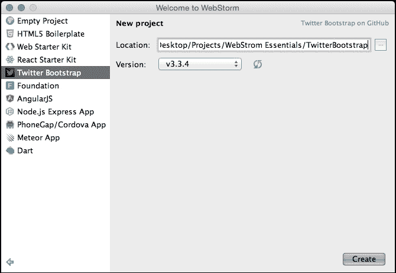

这将创建一个使用所选框架版本的工程，并将创建一个包含内置文件的工程。

由于 Bootstrap 不附带示例页面，我们将自己创建一个简单的页面。在根项目目录中，创建一个 `index.html` 文件，并填写以下代码。我强烈建议你手动输入所有内容，这样你可以更好地理解自动完成功能如何帮助你进行编码：

```js
<!DOCTYPE html>
<html>
<head lang="en">
    <meta charset="UTF-8">
    <meta http-equiv="X-UA-COMPATIBLE" content="IE=edge">
    <meta name="viewport" content="width=device-width, initial-scale=1">
    <title>WebStorm Bootstrap Template</title>
    <link href="css/bootstrap.min.css" rel="stylesheet">
    <link href="css/main.css" rel="stylesheet">

</head>
<body>
<header class="navbar navbar-default navbar-fixed-top">
    <div class="container">
        <nav role="navigation">
            <div class="container-fluid">
                <!-- Brand and toggle get grouped for better mobile display -->
                <div class="navbar-header">
                    <button type="button" class="navbar-toggle collapsed" data-toggle="collapse"
                            data-target="#bs-example-navbar-collapse-1">
                        <span class="sr-only">Toggle navigation</span>
                        <span class="icon-bar"></span>
                        <span class="icon-bar"></span>
                        <span class="icon-bar"></span>
                    </button>
                    <a class="navbar-brand" href="#">WebStorm Essential</a>
                </div>

                <!-- Collect the nav links, forms, and other content for toggling -->
                <div class="collapse navbar-collapse" id="bs-example-navbar-collapse-1">
                    <ul class="nav navbar-nav">
                        <li class="active"><a href="#">Home <span class="sr-only">(current)</span></a></li>
                        <li><a href="#">Authors</a></li>
                        <li class="dropdown">
                            <a href="#" class="dropdown-toggle" data-toggle="dropdown" role="button"
                               aria-expanded="false">Chapter <span class="caret"></span></a>
                            <ul class="dropdown-menu" role="menu">
                                <li><a href="#">Chapter 1</a></li>
                                <li><a href="#">Chapter 2</a></li>
                                <li class="divider"></li>
                                <li><a href="#">Chapter 3</a></li>
                            </ul>
                        </li>
                    </ul>

                    <ul class="nav navbar-nav navbar-right">
                        <form class="navbar-form navbar-left" role="search">
                            <div class="form-group">
                                <input type="text" class="form-control" placeholder="Search">
                            </div>
                        </form>
                    </ul>
                </div>
                <!-- /.navbar-collapse -->
            </div>
            <!-- /.container-fluid -->
        </nav>
    </div>
</header>
<div class="jumbotron presentation">
    <div class="container">
        <div class="row">
            <div class="col-sm-8">
                <h1>WebStorm Essentials</h1>

                <p>
                    Exploit the functional power of WebStorm for faster building of better JavaScript applications.
                </p>
            </div>
            <div class="col-sm-4">
                
            </div>
        </div>
    </div>
</div>
<div class="container highlights">
    <div class="row">
        <div class="highlight-col col-sm-4">
            <div class="highlight-icon glyphicon glyphicon-user"></div>
            <h2>Audience</h2>

            <p>
                This book is intended for web developers with no knowledge of WebStorm yet experienced in JavaScript, Node.js, HTML, and CSS, and who are reasonably familiar with frameworks like AngularJS and Meteor.
            </p>
        </div>
        <div class="highlight-col col-sm-4">
            <div class="highlight-icon glyphicon glyphicon-flag"></div>
            <h2>Mission</h2>

            <p>
                The mission of the book is to show the readers that WebStorm is the number one choice for rapid developing web applications due to its advanced features and integrationf of a bunch of topical technologies into itself.
</p>
        </div>
        <div class="highlight-col col-sm-4">
            <div class="highlight-icon glyphicon glyphicon-check"></div>
            <h2>Objectives </h2>

            <p>
                To provide info on the newest features of the last version, and teach how to simplify the web development process using WebStorm Showcase, and then, to teach the best practices of the cutting-edge technologies.
            </p>
        </div>
    </div>
</div>
<hr class="feature-divider">
<div class="container">
    <p>
        Lorem ipsum dolor sit amet, consectetur adipiscing elit. Aliquam neque tellus, gravida vitae elementum sit amet, i porta augue, nec mattis sapien lacus a nulla. Vivamus in mauris at est porta congue sit amet sed ipsum. Aenean et dolor dolor. Sed faucibus sem interdum neque euismod, et tempor lectus eleifend.Pellentesque risus nulla, ornare sit amet semper vel, congue et justo. Donec a massa commodo, bibendum urna ac,suscipit ipsum. Sed dapibus quis nisl quis posuere. Vivamus id ipsum suscipit nisl semper convallis. Fusce lobortis, metus et interdum mattis, eros eros tincidunt ipsum, et faucibus elit eros vel ante. Nullam vitae mattis ligula, id scelerisque lacus. Donec mattis odio quis sem facilisis dapibus.
    </p>

    <p>
        Sed nec lobortis dui. Vestibulum a lectus eleifend, viverra metus eu, ornare sem. Curabitur eu tellus massa. Sed vestibulum dolor sed sodales ullamcorper. Nullam auctor maximus scelerisque. Praesent vulputate diam vel scelerisque commodo. Nulla maximus lectus malesuada vehicula aliquet.Nunc eleifend purus sit amet ante rhoncus maximus. Maecenas orci nisi, pretium in maximus quis, finibus sed sem.
    </p>

    <p>
        Integer lorem odio, feugiat eu faucibus eget, varius vulputate tellus. Duis convallis nibh ac ligula congue venenatis. Aenean dapibus condimentum quam, sed iaculis leo feugiat sit amet. Nunc eu nibh vestibulum tellus tincidunt pharetra at sed massa. Vestibulum tempor aliquet neque, et auctor turpis sollicitudin et. Aliquam acvarius ipsum, sit amet vehicula tortor.Nullam ac est nec ante scelerisque tincidunt.
    </p>
</div>
<footer class="footer copy">
    <div class="container">
        <p class="text-muted pull-right">Copyright &copy; 2015\. All rights reserved</p>
    </div>
</footer>
<script src="img/jquery.min.js"></script>
<script src="img/bootstrap.min.js"></script>
</body>
</html>
```

之后，我们需要创建 `main.css` 文件，并向其中添加以下规则：

```js
.presentation{
    margin-top: 30px;
    background: #feca5c;
}

.highlight-col{
    text-align: center;
    padding: 0 40px;
}
.highlight-icon{background: lightgray;
    width: 140px;
    height: 140px;
    font-size: 60px;
    border-radius: 50%;
    padding-top: 35px;
}
.feature-divider{
    margin: 50px 0;
}

.copy{
    background: #f8f8f8;
    padding: 20px 0;
}
```

你可以看到，我们的 CSS 代码非常简洁，因为通过使用 Bootstrap，我们获得了所有必要的样式。我们唯一需要使用的是 Bootstrap 推荐的 HTML 标记。

现在我们已经创建了页面，我们可以点击浏览器图标来在所选浏览器中打开文件。这些浏览器图标出现在将鼠标悬停在 `index.html` 文件右上角时，如下所示：

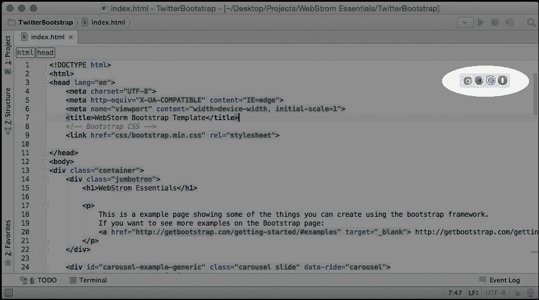

WebStorm 将创建一个本地服务器，并在所选浏览器中打开页面。现在我们将在浏览器中看到以下页面：

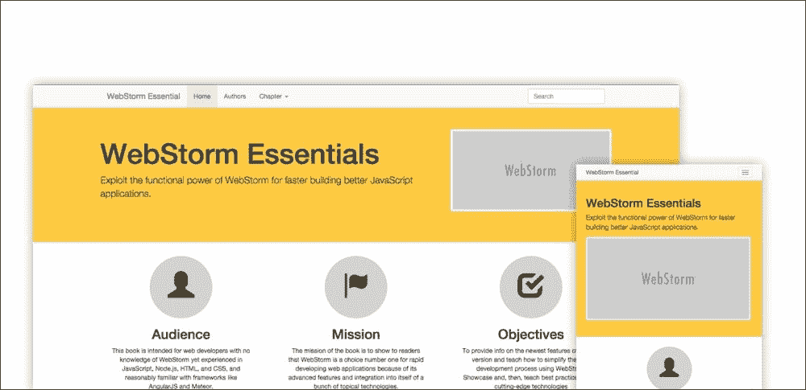

我们使用 Bootstrap 框架中的一些样式创建了一个简单的页面。这个框架的一个主要优点是，我们的页面是响应式的，适用于各种设备。

## Foundation

|   | *"The most advanced responsive front-end framework in the world."* |   |
| --- | --- | --- |
|   | --[`foundation.zurb.com/`](http://foundation.zurb.com/) |

Foundation 是一个类似于 Bootstrap 的框架，它提供了一个响应式网格和一组 UI 元素，我们可以使用它们来快速启动项目创建。

要开始一个项目，我们遵循与 Bootstrap 项目相同的步骤；但这次，我们选择 **Foundation** 作为项目模板，如下面的截图所示：

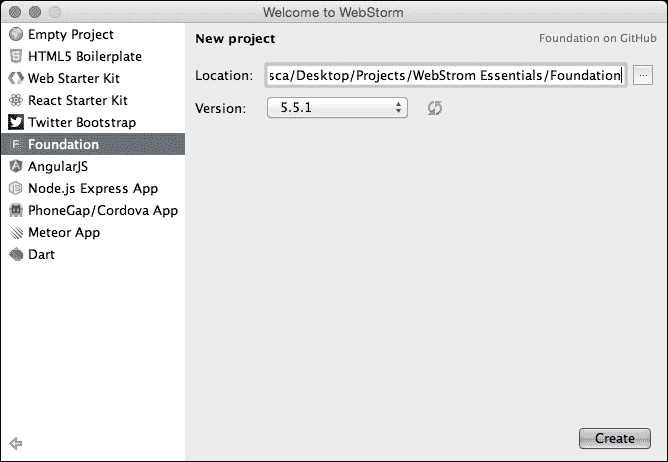

Foundation 包含一个预先创建的示例，因此如果我们想查看示例，我们必须在 WebStorm 中打开 `index.html` 文件。在项目中打开文件的一个快捷方法是使用按文件名打开文件对话框：在 Mac 上按 *Shift* + *⌘* + *N*，在 Windows 上按 *Ctrl* + *Shift* + *N*，然后开始输入你想要打开的文件名。

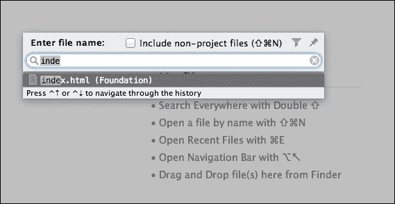

在打开的 `index.html` 文件中，我们必须点击浏览器图标，就像我们在 Bootstrap 示例中所做的那样，以便在浏览器中查看 Foundation 示例页面。

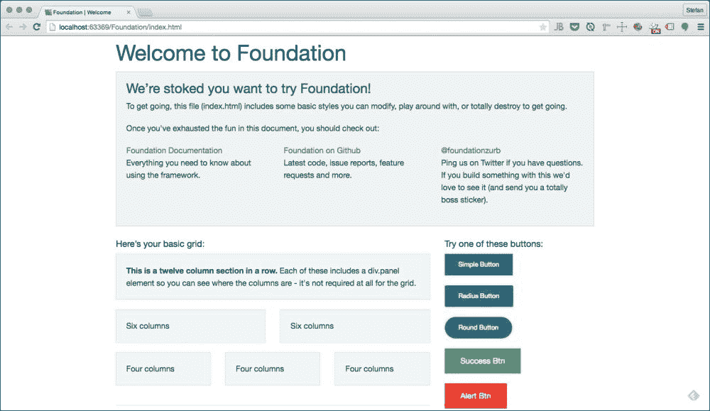

## HTML5 Boilerplate

|   | *"The web's most popular front-end template**HTML5 Boilerplate helps you build fast, robust, and adaptable web apps or sites. Kick-start your project with the combined knowledge and effort of 100s of developers, all in one little package."* |   |
| --- | --- | --- |
|   | --[`html5boilerplate.com`](https://html5boilerplate.com) |

HTML5 Boilerplate 是一个模板，可以帮助你通过创建一些最重要的文件和导入一些库（如 `normalize.css`、`jQuery` 和 `Modernizer`）来快速开始你的项目。

要基于此模板创建一个新项目，我们必须从 **文件** 菜单或欢迎屏幕中选择 **新建项目**。然后，在新屏幕上，选择 **HTML5 Boilerplate** 作为模板。填写项目所需的位置并点击 **创建**：

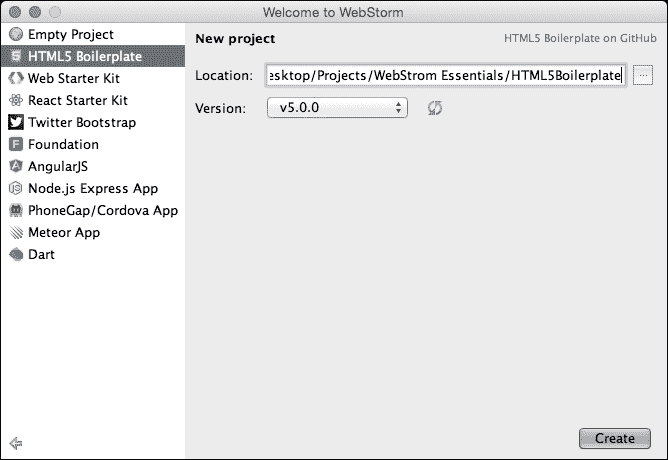

HTML5 Boilerplate 包含一个示例页面；因此，要查看它，我们必须在 WebStorm 中打开 `index.html` 文件。在项目中打开文件的一个快捷方法是使用按文件名打开文件对话框，在 Mac 上按 *Shift* + *⌘* + *N*，在 Windows 上按 *Ctrl* + *Shift* + *N*，然后开始输入你想要打开的文件名。

一旦我们打开了 `index.html` 文件，我们可以点击浏览器图标来在所选浏览器中打开该文件。这些浏览器图标出现在你将鼠标悬停在打开文件右上角时。

你现在已经基于流行的 HTML5 框架创建了一个新项目，你可以开始更改和添加新文件来扩展你的项目。

## Web Starter Kit

Web Starter Kit 是一个用于多设备开发的样板和工具模板。它在开发者网站上展示如下：

|    | *"构建出色的多设备网络体验的起点。使用 Web Starter Kit 开始你的项目，并确保你从一开始就遵循 Web 基本原则。" |    |
| --- | --- | --- |
|    | --[`developers.google.com/web/starter-kit/`](https://developers.google.com/web/starter-kit/) |

现在我们将再次开始一个新的项目，但这次，它将基于 Google 框架。为此，我们将从 **文件** 菜单或欢迎屏幕中选择 **新建项目**，并将 **Web Starter Kit** 作为模板。

这个模板有更多功能和依赖项，因此我们需要安装所需的包和 Gulp。我们将全局安装 Gulp，使其对所有项目可用。为此，我们只需打开 WebStorm 内部终端并运行以下命令：

```js
npm install
npm install gulp -g

```

一旦安装了所有包，你就可以开始开发了。Web Starter Kit 有三个开发阶段，你将使用它们。

第一个阶段是本地服务器开发阶段。要进入这个阶段，你必须在终端中运行以下命令：

```js
gulp serve

```

以下截图显示了前面命令的输出：

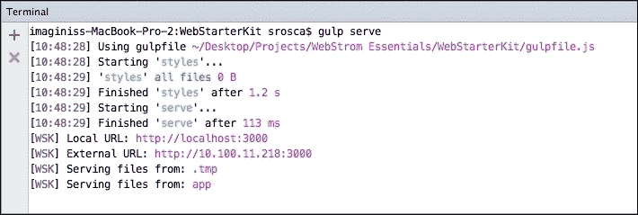

运行此命令后，你应该在终端中看到前面的消息，并且浏览器会打开带有页面的窗口。注意记录 `外部 URL`，因为你可以使用它来测试跨多个设备的页面。只需将你的手机或平板电脑指向此 URL，工作时的浏览体验就会同步。

在这个阶段，以下工具正在运行：

+   **实时预览**: 这会监视文件的变化，并在浏览器中自动加载它们

+   **浏览器同步**: 这将在多个浏览器和设备上同步打开的页面

+   **JSHint**: 这会扫描你的 JavaScript 代码并检查可能的问题

+   **Sass 编译**: 你对 Sass 文件所做的任何更改，在页面通过实时预览重新加载后，都将编译成 CSS

+   **自动添加前缀**: 这会自动添加你样式中所必需的任何供应商前缀

第二个阶段是生产构建阶段。在这个阶段，你的页面将构建成生产版本。要运行这个阶段，请在终端中执行以下命令：

```js
gulp

```

在构建阶段执行以下步骤：

1.  **构建样式**: 这将编译 Sass 并运行 autoprefixer。

1.  **JSHint**: 这会扫描你的 JavaScript 代码并检查可能的问题。

1.  **HTML 构建**：这会压缩 HTML 和 JavaScript。

1.  **自动添加前缀**：这会自动添加您样式中所必需的任何供应商前缀。

第三阶段是生产构建测试。在这个阶段，我们测试我们的生产构建以确保一切按预期工作。在这个阶段，您的网站将构建成一个生产版本，然后在一个浏览器中打开。要运行这个阶段，您必须在终端中输入以下命令：

```js
gulp serve:dist

```

如您从示例页面中看到的，Web Starter Kit 是一个真正强大的平台，可以帮助您快速开始构建 Web 应用程序，特别是对于跨平台应用程序和响应式网站。

# 导入现有项目

在前面的章节中，我们已经基于 WebStorm 中可用的某些流行模板创建了新项目。在本节中，我们将专注于处理现有项目，并探讨两种使用现有文件或版本控制系统创建项目的方法。

## 从现有文件导入

有时，您可能想在您的驱动器上编辑现有的项目。为此，我们只需从欢迎屏幕或**文件**菜单中选择**从现有文件创建项目**。一旦选择此选项，我们将看到一个屏幕，我们需要选择一个场景：


在前面的对话框中，我们将面临以下场景：

+   **Web 服务器已安装在本地，源文件位于其文档根目录下**：在这种情况下，我们假设我们已经安装了本地服务器，并且我们的项目位于服务器文档根目录内（例如，Apache Mac 中的文档根目录或 XAMPP 安装上的 httpdocs）。

+   **Web 服务器已安装在本地，源文件位于本地其他位置**：在这种情况下，我们已经安装了本地服务器，但我们的项目位于服务器文档根目录之外。文件将在必要时被复制到服务器并同步。

+   **Web 服务器位于远程主机，文件可通过网络共享或挂载驱动器访问**：我们选择此选项，使 WebStorm 通过网络从远程服务器将文件复制到本地驱动器，并围绕它们设置项目。

+   **Web 服务器位于远程主机，文件可通过 FTP/SFTP/FTPS 访问**：选择此选项，使 WebStorm 通过 FTP、SFTP 或 FTPS 协议（例如托管账户）从远程服务器下载文件。

+   **源文件位于本地目录，尚未配置 Web 服务器**：如果您想在不使用任何 Web 服务器的情况下处理某个本地目录中的文件，请选择此选项。

我们将使用前一个列表中提到的最后一个版本，因为我们目前不想使用特定的服务器。选择版本后，我们将看到一个屏幕，我们需要选择项目目录页面，如下面的截图所示：

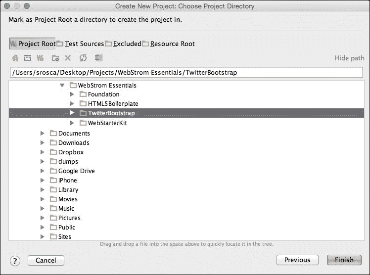

选择包含你的项目文件夹（在这个例子中，我们将使用之前创建的 `TwitterBootstrap` 文件夹），将其标记为 **项目根**，然后点击 **完成**。

# 导入现有项目从 VCS

在本节中，我们将探讨从 VCS 导入现有项目的一些方法。我们将导入一个现有的 Git 项目。

要这样做，我们必须从欢迎屏幕或 VCS 中选择 **从版本控制检出**。在这个演示中，我们将从 **Git** 中检出项目，所以选择该选项，如下一张截图所示：

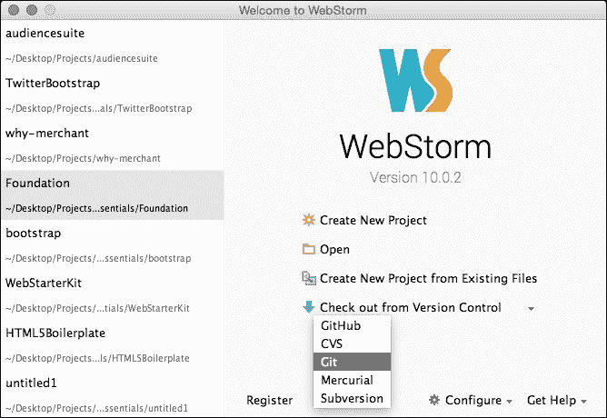

现在指定 **Git 仓库 URL**。我们为此创建了一个 GitHub 项目；所以请继续填写为 [`github.com/srosca/youAreHere.git`](https://github.com/srosca/youAreHere.git)，然后点击 **克隆**。你还可以在此屏幕上 **测试** 你与 Git 仓库的连接。

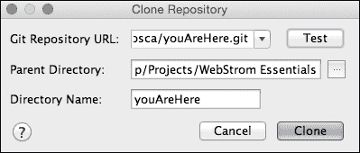

这将在指定的目录内克隆 Git 仓库，然后提示你打开项目。

在这个例子中，我们专注于从 Git 仓库创建项目，但相同的步骤也可以用于其他版本控制系统，如 GitHub、CVS、Git、Mercurial 和 Subversion。

# 在 WebStorm 内部使用 VCS

如果你有一个与版本控制系统（VCS）关联的项目，你可以在 WebStorm 内部执行所有必要的操作。我们现在将介绍一些最常用的任务：

+   **更新**：我们可以通过从 **VCS** 菜单中选择 **更新项目** 来更新项目，如下面的图像所示：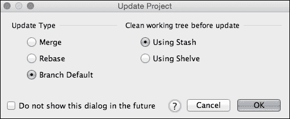

    我们将看到一个对话框来选择更新策略。选择 **分支默认** 和 **使用 Stash**；点击 **确定**。这样，WebStorm 将使用应用分支的默认命令，并在 Git stash 中使用和保存更改。

+   **添加**：在提交文件之前，我们必须将它们添加到当前更改列表中。我们可以通过转到 **版本控制** 选项卡下的 **本地更改** 来添加文件。然后，从上下文菜单中选择 **添加到 VCS**：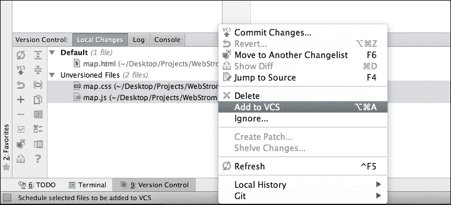

+   **提交**：要提交文件，我们必须从 **VCS** 菜单中选择 **提交更改** 或使用快捷键 *⌘* + *K* 或 *Ctrl* + *K*：

    如果我们在 **版本控制** 部分选择了任何文件，那么提交将只预选择这些文件。

    我们还可以选择 **提交并推送...** 来提交并推送文件。

+   **推送**：如果我们已经提交了更改，我们可以通过转到 **VCS** | **Git** | **推送** 来执行推送：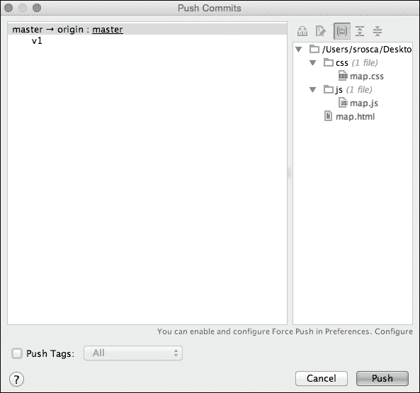

+   **分支**：WebStorm 在屏幕的右下角显示活动分支。我们也可以在这个菜单中执行所有与分支相关的任务（例如，创建新分支）：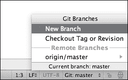

+   **历史记录**：在 WebStorm 中，我们始终可以访问一个强大的历史查看器，我们可以看到所有的提交和分支。我们可以在 **版本控制** 部分的 **日志** 选项卡下访问它：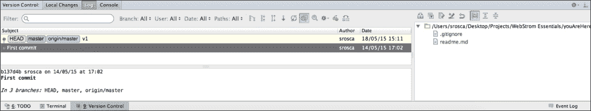

关于 WebStorm 和 Git 有一件事需要记住，即通过 UI 执行的所有任务实际上都是 WebStorm 在后台运行的 `git` 命令。您可以在 **版本控制** 部分的 **控制台** 选项卡中看到这些命令和所有执行的操作。

我们已经了解了 Git 集成系统，因为它是使用最广泛之一，但 WebStorm 也以类似的方式与其他 VCS 系统协同工作。

# 文件监视器

在当前的开发周期中，转译语言的影响越来越大。WebStorm 可以通过监视器帮助您轻松地处理这些文件。

我们将首先在 `CSS` 文件夹中创建一个 `map.scss` 文件。一旦创建并打开此文件，WebStorm 将通知我们有一个监视器可用，并要求我们添加监视器。将 `map.scss` 文件内 `map.css` 文件中的代码复制过来，然后点击 **添加监视器**：

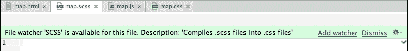

一旦点击 **添加监视器** 按钮，我们将进入 **新监视器** 对话框，在那里我们选择此过程的设置：

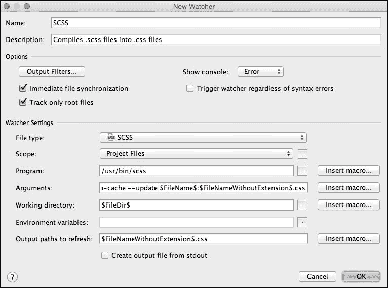

一旦启动监视器，WebStorm 将监视 `scss` 文件中的更改并将其转换为 CSS 代码。

WebStorm 支持与各种第三方转译器集成，这些转译器执行以下操作：

+   将 Less、Sass 和 SCSS 源代码转换为 CSS 代码

+   将 TypeScript 和 CoffeeScript 源代码转换为 JavaScript 代码，可能还会创建源映射以启用调试

+   压缩 JavaScript 和 CSS 代码

### 注意

注意，WebStorm 不包含内置的转译器，但仅支持与您必须下载和安装到 WebStorm 外部的工具集成。

您可以在 **首选项** | **工具** | **文件监视器** 对话框中查看与当前项目关联的监视器列表。

# 摘要

在本章中，您学习了如何使用 WebStorm 通过模板快速启动新项目，以及如何使用编辑器中的现有代码库。

在下一章中，我们将通过 WebStorm 内置的功能学习如何使用包管理器和构建系统。
