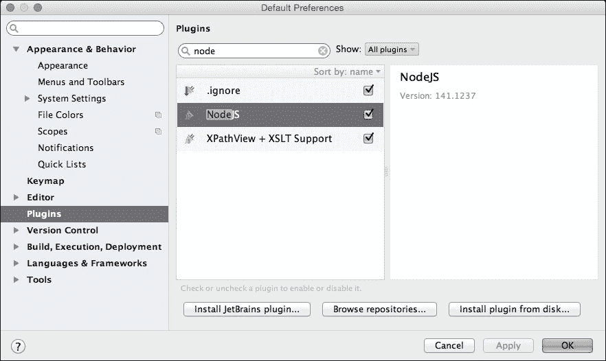
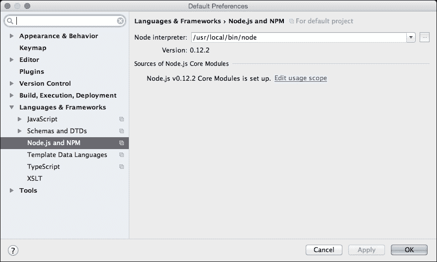
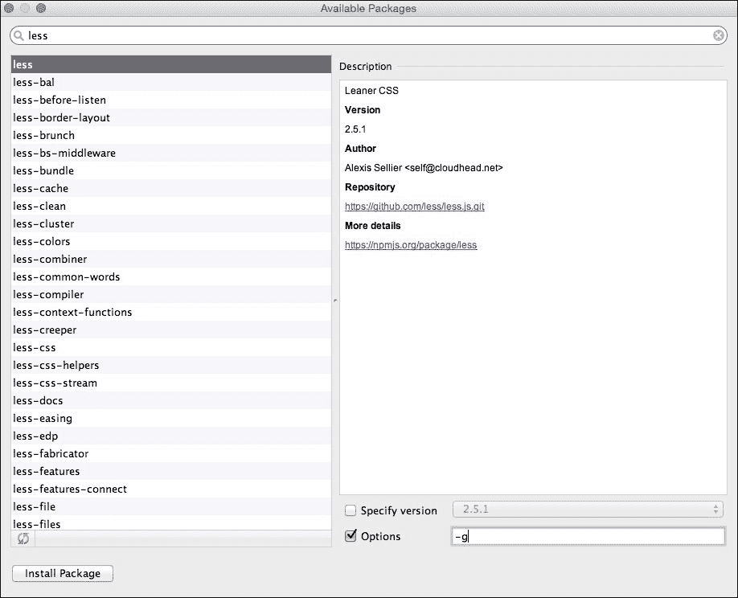
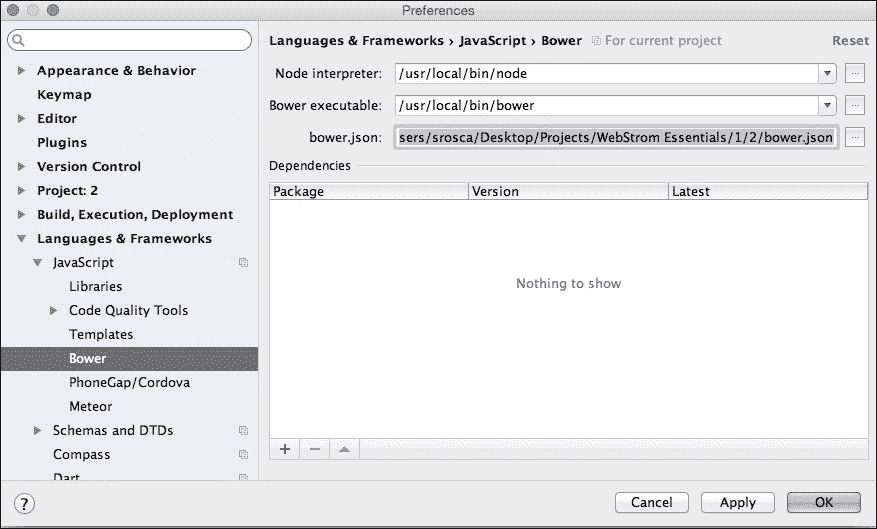
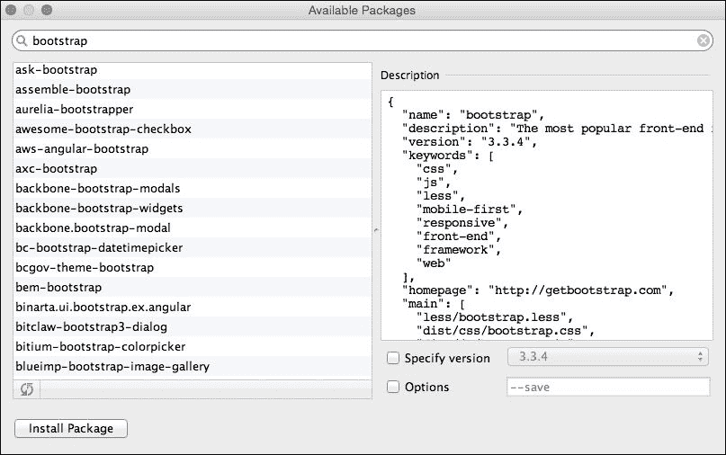
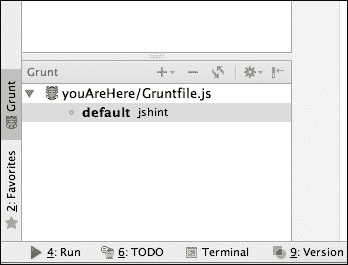
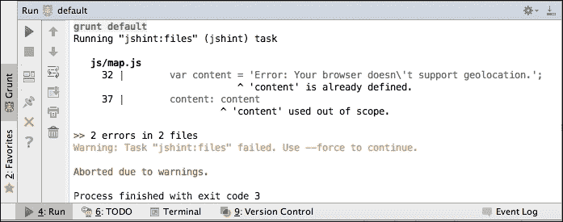
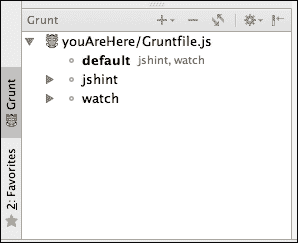
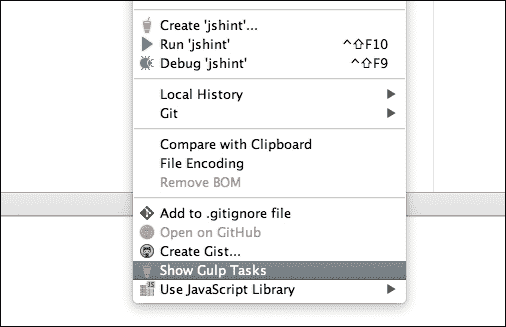
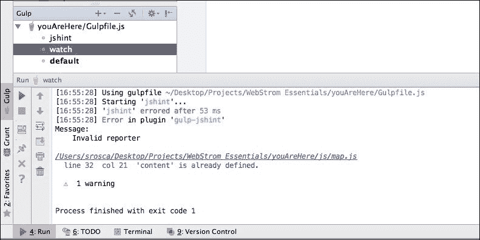

# 第四章：使用包管理器和构建自动化工具

在上一章中，我们专注于使用 WebStorm 模板构建简单的网页，并在编辑器中使用现有的代码库。

在本章中，你将学习 WebStorm 如何帮助我们使用一些可用于开发工作流程的包管理器和构建工具。你还将学习如何设置和使用以下内容：

+   Node.js

+   NPM

+   Bower

+   Grunt

+   Gulp

在本章结束时，你将能够下载、安装、配置和使用像 NPM 和 Bower 这样的包管理器工具，以及像 Grunt 和 Gulp 这样的任务运行器。

# Node.js

本章中所需的所有工具都在 Node.js 上运行，因此在前一部分，我们将确保一切设置正确。

首先，我们需要检查 Node.js 是否已安装。在终端窗口中运行 `node -v` 应该返回我们已安装的 Node.js 版本。如果你没有得到版本号，这意味着我们需要下载并安装 Node.js。遵循 [`nodejs.org/#download`](https://nodejs.org/#download) 提供的说明。

一旦我们确认 Node.js 已启动并运行，我们需要检查 WebStorm 是否已设置好与之协同工作。转到 **首选项** | **插件** 对话框，并确保 **NodeJS** 插件已被激活：



当插件被激活时，WebStorm 将为 Node.js 创建一个设置页面，并添加运行/调试配置。

可以在 **首选项** | **语言与框架** | **Node.js 和 NPM** 下访问的设置页面，允许我们设置节点解释器和核心模块的源，如下面的截图所示：



如果你没有配置源，你需要点击 **配置** 并在下一个对话框中下载源。这使代码补全、引用和调试 `fs`、`path`、`http` 等节点核心模块成为可能。

一旦我们在系统上安装了 Node.js，我们就可以进入下一节，我们将学习如何在 WebStorm 内部使用 NPM。

# 使用 Node 包管理器安装节点包

NPM 是随 Node.js 一起提供的包管理器，使我们能够快速安装节点包，无论是全局安装还是针对当前项目。

从 Node.js 版本 0.6.3 开始，NPM 与 Node.js 一起捆绑并自动安装，因此我们不需要安装任何东西。我们可以在 [`www.npmjs.com/`](https://www.npmjs.com/) 找到所有可用的包；每个包都有一个包含所有必要信息的描述页面。

## 全局安装软件包

全局安装使软件包在系统级别可用，以便在所有项目中使用。通常，我们会全局安装需要在多个项目中使用的工具，如转换器、压缩器或测试运行器，并从命令行使用这些工具。

要全局安装软件包，我们有两种选择：

+   使用全局选项从命令行运行安装：

    ```js
    npm install -g <package>

    ```

+   在 **Node.js 和 NPM** 设置页面，从 **包** 部分选择安装图标 。在新屏幕中，选择你想要安装的包，并在选项字段中输入 `-g`：



## 在项目中安装包

在项目中安装的包仅对当前项目可用。当本地安装包时，我们必须手动创建 `node_modules` 文件夹，或在当前项目中初始化 `npm` 以避免意外结果。这是因为 NPM 会向上搜索文件夹树以查找初始化的项目，如果找到，就会在那里安装包。

要使用 NPM 初始化项目，我们必须在终端窗口中运行 `npm init`。这将询问有关你的项目的一些问题，如名称、版本、描述、作者等，然后创建 `package.json` 文件。

要在项目中安装包，我们有两种选择：

+   从命令行运行安装：

    ```js
    npm install <package>

    ```

+   在 Node.js 和 NPM 设置页面，从包部分选择安装图标 。在新屏幕中，选择你想要安装的包。

与全局安装的包的唯一区别是我们不再使用 `-g` 选项。

### 注意

当我们有一个初始化的项目时，我们还可以在 `package.json` 文件中将安装的包指定并保存为依赖项或开发依赖项。为此，我们必须在终端命令或设置对话框中的选项字段中使用 `--save 或 --save-dev` 选项。

## 安装项目依赖项

如果你有一个项目或已下载现有项目，你必须从命令行运行 `npm install` 来安装依赖项。这将安装 `package.json` 文件中指定的所有模块。

# 使用 Bower

如前所述，NPM 为 node 模块和工具提供了一个包管理器。同样，我们还需要一个用于网络的包管理器。这个管理器被称为 Bower，这是一个允许我们安装我们网络项目所需的全部库、框架和包的工具。

在使用 Bower 之前，我们需要先安装它。我们将使用 NPM 并将其作为全局包安装，以便它对所有项目都可用。因此，打开终端并输入以下命令：

```js
npm install -g bower

```

现在我们已经安装了 Bower，我们可以使用它来搜索和安装我们需要的包。要搜索包，我们可以使用在 [`bower.io/search/`](http://bower.io/search/) 可用的在线工具，并通过使用 `bower search <keyword>` 命令在终端中搜索。

在使用 Bower 安装包之前，我们必须初始化项目，以便我们可以保存我们的依赖项。

在终端中运行 `bower init`，并回答问题以生成 `bower.json` 文件。

一旦我们初始化 Bower 来安装包，我们有两种选择：

+   第一种选项是在终端中运行安装命令，如下所示：

    ```js
    bower install <packageName or source> 

    ```

    ### 注意

    请注意，Bower 将在当前文件夹中安装包；所以在运行命令之前，请确保您在正确的文件夹中。

    Bower 可以将以下源作为包使用`install`：

    +   注册包名 `bower install bootstrap`

    +   GitHub 缩写 `bower install twbs/bootstrap`

    +   Git 端点 `bower install git://github.com/twbs/bootstrap.git`

    +   URL `bower install https://maxcdn.bootstrapcdn.com/bootstrap/3.3.4/css/bootstrap.min.css`

+   第二种选项是转到通过**首选项** | **语言和框架** | **JavaScript** | **Bower**可访问的 Bower 设置页面，并从**依赖项**部分选择安装图标：

在打开的新屏幕中，搜索并选择您想要安装的包，如下截图所示：



在这两种情况下，无论是终端还是安装对话框，如果您想在`bower.json`文件中保存依赖项或开发依赖项，您必须在终端命令或对话框的选项字段中使用`--save`或`--saveDev`选项。

现在你已经学会了如何在 WebStorm 中与包管理器一起工作，你将学习如何安装和使用两个流行的任务运行器，Grunt 和 Gulp。

# 使用 Grunt

Grunt 是一个 JavaScript 测试运行器，它被构建来自动化我们在开发过程中必须运行的重复性任务。它可以用于任务，如压缩、编译、代码检查、单元测试或任何其他项目需要的任务。Grunt 生态系统有数百个插件可供选择。

在使用 Grunt 之前，我们需要全局安装 CLI。这不会安装 Grunt，但它将运行与配置文件`Gruntfile.js`相邻的 Grunt 版本。这样，我们可以安装多个版本的 Grunt。为了安装此工具，我们再次使用 NPM，因此，在终端窗口中运行以下命令：

```js
npm install -g grunt-cli

```

在接下来的几个步骤中，我们将把 Grunt 添加到我们在第一章中使用的项目中。所以，请继续打开第一章中创建的项目，或者从 Git 仓库[`github.com/srosca/youAreHere`](https://github.com/srosca/youAreHere)获取它。

项目打开后，我们首先需要初始化 NPM，以便我们可以下载 Grunt 和必要的插件。在终端窗口中运行`npm init`并回答问题（您目前可以保留默认值）。这将创建保存我们未来依赖项所需的`package.json`文件。

现在我们需要为当前项目安装 Grunt；所以，运行以下命令：

```js
npm install grunt --save-dev

```

接下来，我们必须在项目的根目录中创建`Gruntfile.js`配置文件，并用以下代码填充它：

```js
module.exports = function(grunt) {
    grunt.initConfig({
        jshint: {
            files: ['Gruntfile.js', 'js/*.js' ],
            options: {
                globals: {
                    jQuery: true
                }
            }
        }
    });

    grunt.loadNpmTasks('grunt-contrib-jshint');

    grunt.registerTask('default', ['jshint']);

};
```

这创建了一个简单的任务，它对我们的`.js`代码执行简单的`jshint`。在我们使用此任务之前，我们还需要安装`jshint` Grunt 插件。因此，在终端中运行以下命令以安装并将其保存为开发依赖项：

```js
npm install grunt-contrib-jshint --save-dev

```

现在，我们可以在终端中通过运行 Grunt 来运行任务，或者使用 Grunt 工具窗口。此窗口可以在工具菜单或侧边栏中找到：



如果我们双击任务或从上下文菜单中选择运行，任务将启动，输出将在运行窗口中显示：



如前一个截图所示，输出中已经存在一些错误。因此，在我们修复它们之前，让我们看看我们如何创建一个监视文件变化的任务，并在它们发生变化时运行`jshint`。为此，我们首先需要安装另一个 Grunt 插件来完成这个任务。所以，在终端窗口中，运行以下命令：

```js
npm install grunt-contrib-watch --save-dev

```

在插件安装后，打开`Gruntfile.js`配置文件，在`jshint`任务之后加载`npm`任务，添加以下命令：

```js
grunt.loadNpmTasks('grunt-contrib-watch');
```

我们必须将`jshint`任务强制选项设置为在出现错误时停止，因此请将以下代码添加到选项部分：

```js
force: true,
```

现在在`initConfig`块中的`jshint`任务之后，添加一个新的任务：

```js
watch: {
    files: ['<%= jshint.files %>'],
    tasks: ['jshint']
}
```

将新创建的任务添加到默认任务中，以便在监视之前运行`jshint`，这样我们就可以在更改任何内容之前看到结果：

```js
grunt.registerTask('default', ['jshint, watch']);
```

如您所见，我们正在使用为`jshint`任务定义的文件。您最终的代码现在应该看起来像这样：

```js
module.exports = function(grunt) {

    grunt.initConfig({
        jshint: {
            files: ['Gruntfile.js', 'js/*.js' ],
            options: {
                force: true,
                globals: {
                    jQuery: true
                }
            }
        },
        watch: {
            files: ['<%= jshint.files %>'],
            tasks: ['jshint']
        }
    });

    grunt.loadNpmTasks('grunt-contrib-jshint');
    grunt.loadNpmTasks('grunt-contrib-watch');

    grunt.registerTask('default', ['jshint', 'watch']);

};
```

现在在**Grunt**窗口中，如果我们点击刷新图标，我们会看到文件夹树已更改，反映了新添加的任务：



如果我们启动监视任务，我们会看到现在，在运行`jshint`之后，它将等待文件的变化。因此现在我们可以更改`map.js`文件，通过将内容变量定义移出`if`语句来修复错误：

```js
function handleNoGeolocation(errorFlag) {
    var content;
    if (errorFlag) {
        content = 'Error: The Geolocation service failed.';
    } else {
        content = 'Error: Your browser doesn't support geolocation.';
    }
    var options = {
        map: map,
        position: new google.maps.LatLng(60, 105),
        content: content
    };
    var infowindow = new google.maps.InfoWindow(options);
    map.setCenter(options.position);
}
```

在我们进行更改后，我们会看到如果我们通过按*⌘* + *S*强制保存，Grunt 将检测到文件的变化，并将重新运行`jshint`任务。

请注意，在 WebStorm 中，当我们从当前窗口更改焦点或按*⌘* + *S*时，文件会自动保存。

在本节中，我们使用 Grunt 和 WebStorm 自动化了我们的任务。接下来，我们将使用 Gulp 重新创建这个流程，并看看我们如何在 WebStorm 内部与之协同工作

# 使用 Gulp

Gulp 是另一个用于开发任务的任务运行器。在它所做的工作方面，它与 Grunt 类似，但它以不同的方式完成。它使用流将任务链接起来，通过将一个任务的输出粘贴到下一个任务作为输入；因此，它使用的 I/O 请求更少。这一的主要优势是 Gulp 比 Grunt 快得多。它还倾向于代码优先于配置的指定任务风格。

要看到它的实际效果，我们将把 Grunt 流重新创建为 Gulp。在我们这样做之前，我们需要安装它。打开终端并全局安装 Gulp：

```js
npm install --g gulp

```

这将在全局安装 Gulp，因此我们可以在所有项目中使用它。我们仍然可以通过本地安装来为项目使用不同的 Gulp 版本。在终端中运行以下命令：

```js
npm install --save-dev gulp

```

这将在项目中本地安装 Gulp，并将其保存为开发依赖项。这样，我们可以为正在工作的项目使用不同的 Gulp 版本。接下来，我们需要安装项目中需要的插件，因此，在终端中运行以下命令将它们作为开发依赖项安装：

```js
npm install gulp-jshint --save-dev
npm install jshint-stylish --save-dev

```

我们需要创建一个 `Gulpfile.js` 文件来定义 Gulp 的任务；因此，请继续在根目录下创建它。一旦文件打开，创建以下内容：

```js
var gulp = require('gulp');
var jshint = require('gulp-jshint');

gulp.task('jshint', function() {
    return gulp.src('js/*.js')
        .pipe(jshint())
        .pipe(jshint.reporter('jshint-stylish'))
        .pipe(jshint.reporter('success'));
});

gulp.task('watch', ['jshint'], function(event) {
    gulp.watch('js/*.js', ['jshint']);
});
```

如您所见，Gulp 在定义任务时使用代码方法。文件打开后，我们可以通过从上下文菜单中选择**显示 Gulp 任务**来访问 Gulp 窗口：



这将打开一个类似于 Grunt 的窗口，列出所有可用的任务。从这个窗口中，我们可以启动监视任务，这些任务将监视文件的变化，并在有变化时运行 `jshint`。在下一张截图中，您可以看到 Gulp 窗口和作业的输出：



如您所见，Gulp 和 Grunt 在最终结果上存在一些相似之处，但在构建任务的方式上也有一些不同。

在本章中，我们创建了一些简单的自动化任务，但这可以做得更深入。您可以为开发过程中需要自动化的所有内容创建任务。

# 摘要

在本章中，您已经学习了现代 Web 开发包管理器和任务运行器的一些流程。现在您将能够快速将新包添加到项目中，将它们保存为依赖项，并为所有重复性工作创建任务。

在下一章中，我们将看到 WebStorm 如何借助 AngularJS、React、Express 和 Meteor 等框架帮助我们构建更复杂的应用程序。
