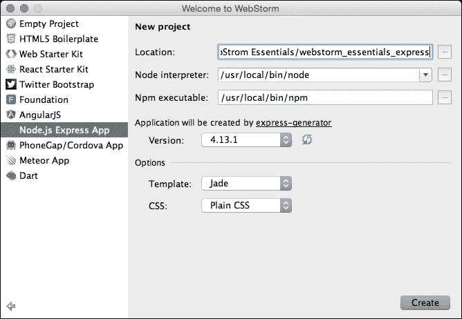

# 第五章：AngularJS、React、Express 和 Meteor – 开发你的 Web 应用

在上一章中，我们学习了 WebStorm 在处理包管理器和构建工具时的帮助方式，以及现代开发的流程。

在本章中，我们将处理几个最基本且不断发展的 Web 框架和平台，并学习当与它们一起工作时，WebStorm 是多么不可或缺。我们将了解以下与 WebStorm 相关的技术：

+   AngularJS：一个仅客户端的框架

+   React：用于构建用户界面的库

+   Express：一个针对 Node.js 的最小化 Web 框架

+   Meteor：一个运行在 Node.js 之上的全栈框架

# AngularJS

| -- "Superheroic JavaScript MVW Framework AngularJS is what HTML would have been, had it been designed for building web-apps. Declarative templates with databinding, MVW, MVVM, MVC, dependency injection and great testability story all implemented with pure client-side JavaScript!" |
| --- |
| --[`angularjs.org`](https://angularjs.org) |

如开发者网站所示，AngularJS 是一个仅客户端的框架，用于构建单页 Web 应用，旨在简化 Web 应用的开发和测试。在本节中，我们将通过创建一个非常简单的博客应用来了解 WebStorm 在使用 AngularJS 时提供的巨大帮助。

我们的应用将是一个简单的博客 CMS，它将执行以下任务：

+   显示条目列表

+   显示单个条目

+   添加新条目

首先，使用前几章中的步骤，创建一个新的**空项目**。在创建新项目时，你会注意到有一个名为**AngularJS**的项目类型。你可以在你的开发活动中使用它；它已经包含了所有必要的库和设置文件。然而，现在我们是从零开始创建一个博客，这样你可以看到各种操作可以执行的多重方式。


## 准备工具和库

一旦我们创建了我们的项目，我们需要安装我们应用的所有依赖项。我们将使用 AngularJS 库，一个名为 Angular Route 的路由库，以及一个像 Bootstrap 这样的样式库。对于安装过程，我们将使用 Bower。

我不喜欢 Bower 将组件安装到默认的`bower_components`目录中。因此，让我们创建一个`.bowerrc`文件，并指明我们希望我们的包被安装到`vendor`目录中，如下截图所示：


现在我们可以安装所有必要的包。首先，我们需要 AngularJS。在终端中输入并执行以下命令：

```js
bower install angular.

```

这将在我们的 `vendor` 文件夹中下载 AngularJS，但我们仍然需要在 `index.html` 文件中包含它。在文件末尾的 `body` 部分打开此文件，添加一个 `<script>` 标签，然后简单地输入，例如，`ang`。使用自动完成功能让 WebStorm 查找必要的 `.js` 文件：


从现在起，WebStorm 将知道我们的应用程序是基于 Angular 的，`ng-` 自动完成和其他功能将在您的项目中工作。

然后，添加另一个 `<script>` 标签，在 `src` 属性中输入 `"app/app.js"`；这将是我们的应用程序的核心。该文件尚不存在，但您可以自动创建它。选择 `src` 属性中的文件名，然后点击 *Alt* + *Enter* 。然后，点击 **创建文件 app.js** 项，WebStorm 将在新打开的选项卡中为您创建缺失的文件。


接下来，让我们安装 Bootstrap。为此，您可以从终端窗口使用 Bower：

```js
bower install bootstrap

```

接下来，就像我们处理 angular 源文件一样，将 Bootstrap 的 `.css` 和 `.js` 文件包含到您的项目中（分别使用链接和 `<script>` 标签）。由于 Bootstrap 使用 jQuery，因此它也将被安装，别忘了添加一个用于 jQuery 的 `<script>` 标签。

我们将在项目中使用的另一个库是 angular-route 库。因此，我们需要再次使用 bower 来安装它，并将其添加到 `index.html` 文件中：

```js
bower install angular-route

```

我们迄今为止所进行的所有操作都应该导致以下代码：

```js
<!DOCTYPE html>
<html lang="en">
<head>
    <meta charset="UTF-8">
    <title>MyAngularApp</title>
    <link rel="stylesheet" href="vendor/bootstrap/dist/css/bootstrap.min.css">
    <link rel="stylesheet" href="css/app.css">
</head>

<script type="text/javascript" src="img/jquery.min.js"></script>
<script type="text/javascript" src="img/bootstrap.min.js"></script>
<script type="text/javascript" src="img/angular.js"></script>
<script type="text/javascript" src="img/angular-route.js"></script>
<script type="text/javascript" src="img/app.js"></script>
</body>
</html>
```

## 沉浸在 AngularJS 中

现在，我们可以开始构建我们的应用程序了。打开 `app.js` 文件，声明一个新的模块名为 `app`，然后添加 `ngRoute` 作为依赖项：

```js
angular.module('app', ['ngRoute'])
    .config(function($routeProvider){

        });
    });
```

以下截图是前面代码的输出：


您可以使用自动完成功能，这样您接下来编写的所有代码都将由 WebStorm 自动建议。这不仅通过消除手动编写一切的需要来减少开发时间，而且还有助于您更好地实现和决定在当前上下文中什么更合适：


然而，这并不是 WebStorm 为您提供的唯一帮助。WebStorm 提供所谓的快速模板，这使您能够快速编写一些标准代码。例如，在我们的案例中，我们需要指示三个路由——到条目列表、条目页面和添加新条目的页面。

这是通过 `$routeProvider` 构造来实现的，它可以包含某些参数。我们只需要两个参数，即 `templateUrl` 和 controller，在 `when` 条件内部。因此，您无需手动输入，只需简单地输入 `ngrw` 并按 *Tab* 键：


这将用以下代码替换 `ngrw`：

```js
$routeProvider.when(' ', {
    templateUrl: '',
    controller: ''
});
```

此外，光标将直接放置在单词`when`之后的两个单引号之间。这看起来可能微不足道，但你不需要用鼠标进行任何不必要的操作。

我们最终的 `app.js` 文件代码应该如下所示：

```js
angular.module('app', ['ngRoute'])
    .config([function($routeProvider){
        $routeProvider.when('/', {
            templateUrl: 'app/views/entries.html',
            controller: 'EntriesController'
        });
    });
```

现在新的应用程序模块已经创建，我们可以通过在 `<body>` 标签中添加 `ng-app="app"` 来将其绑定到 `index.html` 页面，当然，使用自动完成功能。最终的 `<body>` 打开标签应该如下所示：

```js
<body ng-app="app">
```

我们还应该添加一个特殊的容器，让 Angular 能够渲染我们的模板。在 `<body>` 标签的打开标签之后插入以下代码：

```js
<div class="container app-container">
    <div ng-view></div>
</div>
```

我们还创建了一个用于样式的容器 `<div>`。通过这个最后的更改，我们可以转向创建应用程序的功能。

## 加载初始条目

我们的应用程序将有一个预定义的主题列表，这些主题将在第一次加载时显示。因此，我们首先需要确保数据被加载到应用程序中。我们不会使用任何后端，以免使我们的应用程序复杂化。我们将使用静态的 JSON 文件来模拟服务器响应，这些文件将保存在数据文件夹中。对于主题列表，在 `data` 文件夹内创建一个 `entries.json` 文件，并填充以下内容：

```js
[
  {
    "title" : "Hello, WebStorm!", "content" : "Today we are going to speak about WebStorm and its features"
  },{
    "title" : "Immersing into WebStorm", "content" : "WebStorm provides a bunch of advanced technologies, which help us increase our development efficiency"
  }
]
```

现在，我们需要创建一个存储数据的服务。在 `app.js` 文件中，创建一个新的 `app.services` 模块，并填充以下代码。我们将使用服务，以便我们的数据可以在多个控制器和视图中使用。你可以看到我们已经有了一个 `add` 方法，因为我们希望能够在我们的博客中创建新的条目：

```js
angular.module('app.services', [])
    .service('store', function ($http) {
        var store = {
            entries: [],

            add: function (item) {
                this.entries.push(item);
            }
        };

        return store;
    });
```

接下来，我们需要修改 `app.module` 以包括新的依赖项；因此，在 `ngRoute` 之后，我们需要添加新的模块 `app.services`。我们还需要创建一个新的运行块，当应用程序启动时将加载初始数据。最终的代码应该如下所示：

```js
angular.module('app', ['ngRoute', 'app.services'])
    .config(function ($routeProvider) {
        $routeProvider.when('/', {
            templateUrl: 'app/views/entries.html',
            controller: 'EntriesController'
        });

    }).run(function ($http, store) {
        $http.get('data/entries.json')
            .success(function (data) {
                store.entries = data;
            });
    });
```

## 显示条目列表

对于我们的列表，我们需要一个用于数据的控制器和一个用于显示数据的视图。此外，由于我们想在主页上显示简短的摘要，我们还需要创建一个创建摘要文本的过滤器。

让我们从这个过滤器开始，这样我们就可以在视图中稍后使用它。在 `app.js` 文件中，添加以下模块用于过滤器：

```js
angular.module('app.filters',[])
    .filter('summary', function($filter) {
        return function(item) {
            return item.split(" ").slice(0,5).join(" ");
        };
    });
```

此过滤器提取条目的全部内容，并仅显示前五个单词。实际上，这个过滤器是无差别的，它不关心接收到的内容；它会接受任何字符串，并从中返回前五个单词。再次强调，在我们创建了这个新模块之后，我们需要将其添加为应用模块的依赖项。

现在，我们可以转向第一个控制器，创建一个新的模块 `app.controllers`，并添加我们的应用程序的第一个控制器 `EntriesController`。这个控制器唯一要做的事情就是从存储中获取数据并将其传递给视图。在你创建了这个模块之后，别忘了将其添加为依赖项：

```js
angular.module('app.controllers', [])
    .controller('EntriesController', function ($scope, store) {
        $scope.entries = store.entries;
    })
```

我们需要实施的最后一步是实现视图。在`views`文件夹中创建`entries.html`文件，并填写以下代码：

```js
<article ng-repeat="entry in entries | orderBy:'-'">
    <h1><a href="#/entry/{{ entries.indexOf(entry) }}">{{ entry.title }}</a></h1>
    <p>
        {{entry.content | summary }}
        <a href="#/entry/{{ entries.indexOf(entry) }}">... (read more)</a>
    </p>
</article>
```

## 显示条目详情

现在我们已经创建了条目列表，我们还必须创建显示每个条目详情的页面。我们还需要一个控制器、一个视图和一个新的路由定义。

我们将在列表页面的路由定义之后创建新的定义。最终的代码应如下所示：

```js
angular.module('app', ['ngRoute', 'app.controllers', 'app.services', 'app.filters'])
    .config(function ($routeProvider) {
        $routeProvider.when('/', {
            templateUrl: 'app/views/entries.html', controller: 'EntriesController'
        }).when('/entry/:index', {
            templateUrl: 'app/views/entry.html', controller: 'EntryController'
        })
    })
```

现在在`app.controllers`模块中创建一个新的控制器，该控制器从路由参数中读取索引并加载指定的条目，如下所示：

```js
.controller('EntryController', function ($scope, $routeParams, store) {
    $scope.entry = store.entries[$routeParams.index];
})
```

我们现在必须创建`entry.html`文件，并填写我们的条目视图：

```js
<article>
    <h1>{{ entry.title }}</h1>
    <p>{{entry.content}}</p>
    <p><a href="#/">Go back</a></p>
</article>
```

此视图显示条目标题和完整内容文本。使用此视图，我们已经完成了条目详情功能；正如您所看到的，您现在可以在这张列表页和详情页之间进行导航。我们现在需要创建的只是添加新条目的页面。

## 添加新条目

在我们开始这个功能之前，我们需要添加一个菜单，以便我们可以导航到这个页面。因此，打开`index.html`文件，并在您应用程序的容器`<div>`之前添加以下代码。此代码将添加一个带有指向此页面链接的页眉菜单。对于此菜单，我们将使用之前章节中熟悉的 Bootstrap 语法。

```js
<nav class="navbar navbar-default navbar-fixed-top">
    <div class="container">
        <div class="navbar-header">
            <a class="navbar-brand" href="#/">My Angular App</a>
        </div>

        <div class="collapse navbar-collapse">
            <ul class="nav navbar-nav">
                <li>
                    <a href="#/new-entry/">Add new</a>
                </li>
            </ul>
        </div>
    </div>
</nav>
```

现在我们已经有了导航到添加新条目页面的菜单，我们需要为这个新路由创建一个新的路由定义。按照我们为之前路由所采取的相同步骤，并添加以下定义：

```js
.when('/new-entry/', {
    templateUrl: 'app/views/new-entry.html',
    controller: 'NewEntryController'
})
```

现在我们可以创建控制器和视图。再次，在`app.controllers`模块中添加新的控制器。在这个控制器中，我们只需要定义两个函数：一个用于将条目添加到我们的博客中，另一个用于清除表单，如下所示：

```js
.controller('NewEntryController', function ($scope, $location, store) {
    $scope.add = function () {
        store.add($scope.entry);
        $location.path('/');
    };
    $scope.clear = function () {
        $scope.entry = {};
    }
});
```

我们现在可以在`new-entry.html`文件中创建视图。我们还将再次使用 Bootstrap 语法进行样式设置。您可能也会注意到`ng-model`将输入与控制器绑定：

```js
<form>
    <div class="form-group">
        <label for="title">Title</label>
        <input type="text" class="form-control" id="title" ng-model="entry.title">
    </div>
    <div class="form-group">
        <label for="title">Content</label>
        <textarea class="form-control" rows="5" ng-model="entry.content"></textarea>
    </div>
    <div class="form-group">
        <button type="submit" class="btn btn-default" ng-click="add()">Save</button>
        <button type="submit" class="btn btn-default" ng-click="clear()">Clear</button>
    </div>
</form>
```

现在我们已经为我们的应用程序创建了所有功能，我们可以进入最后一步，即对应用程序进行样式设置，并添加最后的修饰。

## 应用程序的样式

我们可以做的第一件事是为我们的应用程序添加页脚。在`index.html`文件中，在`app`容器`<div>`之后添加以下内容：

```js
<footer class="footer copy">
    <div class="container">
        <p class="text-muted pull-right">Copyright © 2015\. All rights reserved</p>
    </div>
</footer>
```

您可能记得我们在`index.html`中包含了`app.css`文件；所以，继续前进，在`css`文件夹中创建此文件，并添加以下代码：

```js
.app-container{
    margin-top: 100px
}
```

由于我们使用了 Bootstrap 语法和辅助类，因此我们需要编写的样式代码量非常少。

通过这些最终步骤，我们已经完成了我们的博客应用程序。正如你所看到的，在 WebStorm 和 Angular 的帮助下创建一个复杂的应用程序非常简单。需要注意的是，这个应用程序只是一个示例，我们可以对其进行许多改进和更改；但这超出了本书的范围。

接下来，我们将使用另一个高级 JavaScript 框架：React，重新创建具有相同功能的应用程序。

# React

|    | *"用于构建用户界面的 JavaScript 库"* |
| --- | --- |
|    | --[`facebook.github.io/react/`](http://facebook.github.io/react/) |

React 是由 Facebook 开发的一个 UI 框架，它在构建 Web 应用程序方面采用了一种不同的方法。它使用虚拟 DOM 为开发者提供一个更简单的编程模型和更好的性能。此外，React 应用程序中的数据流是单向响应式的，这减少了样板代码并使得推理应用程序的状态变得更加容易。

本节的目标是使用 React 作为 UI 框架重新创建我们之前创建的博客应用程序。我们将保持与上一节相同的功能。

我们需要采取的第一步是为我们的应用程序创建一个新的**空项目**。接下来，我们需要安装所有依赖项。使用本章前面描述的步骤，创建`.bowerrc`文件和`vendor`文件夹。然后安装`react`、`react-router`和`bootstrap`。你可以通过运行以下单个命令来完成：

```js
bower install  react react-router bootstrap

```

现在我们已经安装了所有依赖项，我们必须在`index.html`文件中包含它们。再次使用之前描述的步骤，包括我们在 Angular 示例中做的导航和页脚。最终的代码应该看起来像以下这样：

```js
<!DOCTYPE html>
<html lang="en">
<head>
    <meta charset="UTF-8">
    <title>My React App</title>
    <link rel="stylesheet" href="vendor/bootstrap/dist/css/bootstrap.min.css">
    <link rel="stylesheet" href="css/app.css">
</head>
<body>
<nav class="navbar navbar-default navbar-fixed-top">
    <div class="container">
        <div class="navbar-header">
            <a class="navbar-brand" href="#/">My React App</a>
        </div>

        <div class="collapse navbar-collapse">
            <ul class="nav navbar-nav">
                <li>
                    <a href="#/new-entry/">Add new</a>
                </li>
            </ul>
        </div>
    </div>
</nav>

<div class="container app-container">
    <div id="app"></div>
</div>

<footer class="footer copy">
    <div class="container">
        <p class="text-muted pull-right">Copyright © 2015\. All rights reserved</p>
    </div>
</footer>

<script type="text/javascript" src="img/jquery.min.js"></script>
]<script type="text/javascript" src="img/bootstrap.min.js"></script>
<script type="text/javascript" src="img/react.js"></script>
<script type="text/javascript" src="img/ReactRouter.js"></script>

<script type="text/javascript" src="img/JSXTransformer.js"></script>
<script type="text/jsx" src="img/app.jsx"></script>
</body>
</html>
```

在这段代码中，可能会觉得有些不合适的是用于`app`文件的`text/jsx`类型。React 为其文件使用一种称为 JSX 的特殊语法。这种语法类似于 XML，它帮助我们编写组件文件内的标记。

因此，现在我们的`index.html`文件已经准备好了，我们可以在`app`文件夹中创建`app.jsx`文件，并开始填写我们应用程序的代码。

我们首先要添加的是为我们的路由器提供的支持代码。为了使我们的应用程序更简单，我们不会使用任何模块系统。但请记住，这并不是一个好的常规做法：

```js
window.React = React;
var Router = window.ReactRouter;
var Route = Router.Route;
var DefaultRoute = Router.DefaultRoute;
var RouteHandler = Router.RouteHandler;
```

为了保持简单，我们将跳过从外部 JSON 文件加载条目的步骤，而是创建一个变量来保存我们的初始数据。

```js
var entries = [
    {
        "title": "Hello, WebStorm!",
        "content": "Today we are going to speak about WebStorm and its features"
    }, {
        "title": "Immersing into WebStorm", "content": "WebStorm provides a bunch of advanced technologies, which help us increase our development efficiency"}
];
```

我们现在可以开始创建我们应用程序的功能。第一个将是条目列表。正如你所看到的，在 React 中，包括模板在内的所有功能都是使用 JSX 语法在 JavaScript 中创建的。一开始可能会觉得有些奇怪，但后来你会发现这是一个将所有事物集中在一起非常高效的系统。

```js
var Entries = React.createClass({
    render: function () {
        var items = entries.slice().reverse().map(function (entry) {
            var sumary = entry.content.split(" ").slice(0, 5).join(" ");
            var index = entries.indexOf(entry);
            return (
                <EntryItem
                    index={index}
                    title={entry.title}
                    sumary={sumary}
                    />
            );
        }, this);
        return (
            <article>
                {items}
            </article>
        );
    }
});
```

在某个时刻，当 WebStorm 分析你的代码时，它会看到你正在使用 JSX 语法，并提示你切换到 JSX Harmony 语言级别。所以请确保在这个提示中点击**切换**，或者转到**首选项** | **语言与框架** | **JavaScript**，并在那里更改语言版本：


`Entries`类依赖于我们需要创建的`EntryItem`。在 React 中，使用多个子元素组合元素是非常常见的。你可以看到数据是通过以下代码中 props 对象上的属性从父元素传递到子元素的：

```js
var EntryItem = React.createClass({
    render: function () {
        return (
            <div>
                <h1><a href={'#/entry/' + this.props.index}>{this.props.title}</a></h1>
                <p>
                    {this.props.sumary}
                    <a href={'#/entry/' + this.props.index}>... (read more)</a>
                </p>
            </div>
        );
    }
});
```

使用这个类，我们已经完成了`Entry`项目功能，因此我们现在可以开始创建`Entry`详情功能。同样，这只是一个简单的渲染方法，将显示特定条目的详情。条目的 ID 将从路由中读取，作为`pros.params`对象上的一个属性：

```js
var Entry = React.createClass({
    render: function () {
        var id = this.props.params.id;
        var entry = entries[id];
        return(
            <article>
                <h1>{ entry.title }</h1>
                <p>{entry.content}</p>
                <p><a href="#/">Go back</a></p>
            </article>
        );
    }
});
```

我们需要创建的最后一个功能是新的条目页面功能。为此，我们还需要创建两个特殊的方法来处理保存和清除功能。在这个类中，还有一点值得提及的是我们正在使用的`Router.Navigation`混合。混合将功能从其他类引入到我们的类中。在我们的例子中，我们需要能够在提交方法中程序化地进行导航。

```js
var NewEntry = React.createClass({
    mixins: [Router.Navigation],

    handleSubmit: function () {
        var title = this.refs.title.getDOMNode().value,
            content = this.refs.content.getDOMNode().value;

        entries.push({
            title: title,
            content: content
        });
        this.transitionTo('/');
    },
    handleClear: function () {
        this.refs.title.getDOMNode().value = '';
        this.refs.content.getDOMNode().value = '';
    },
    render: function () {

        return (
            <form>
                <div className="form-group">
                    <label htmlFor="title">Title</label>
                    <input type="text" className="form-control" id="title"
                    ref="title"/>
                </div>

                <div className="form-group">
                    <label htmlFor="content">Content</label>
                    <textarea className="form-control" rows="5" ref="content"></textarea>
                </div>

                <div className="form-group">
                    <button type="submit" className="btn btn-default"
                    onClick={this.handleSubmit}>Save</button>
                    <button type="submit" className="btn btn-default"
                    onClick={this.handleClear}>Clear</button>
                </div>
            </form>
        );
    }
});
```

如你可能已经注意到的，WebStorm 在编写 JSX 语法时非常有用，因为它允许以类似于编写纯 HTML 或 JavaScript 代码的方式完成代码和进行检查。

我们需要创建的最后一个组件类是主要的`App`：

```js
var App = React.createClass({
    render: function () {
        return (
            <div>
                <RouteHandler/>
            </div>
        )
    }
});
```

到目前为止，我们已经为我们的应用程序创建了所有组件；现在我们可以开始创建应用程序功能的路由定义：条目列表（这还将是默认列表）、条目详情和新的条目页面：

```js
var routes = (
    <Route path="/" handler={App}>
        <DefaultRoute  handler={Entries}/>
        <Route path="/entry/:id" handler={Entry}/>
        <Route path="/new-entry/" handler={NewEntry}/>
    </Route>
);
```

在我们可以测试我们的应用程序之前，最后一步是连接路由，如下所示：

```js
Router.run(routes, Router.HashLocation, function (Root) {
    React.render(<Root />, document.getElementById('app'));
});
```

现在，我们已经准备好测试我们的应用程序。所以，我们将转到`index.html`文件，点击浏览器图标来运行应用程序。正如你所看到的，功能与 Angular 应用程序相同。

我必须再次指出，我们在这里创建的代码只是为了 WebStorm 的功能和特性，当与 React 框架一起工作时；它没有优化，并且不遵循与该框架一起工作时所有的最佳实践。

# Express

|   | *"快速、无偏见、极简主义的 Node.js Web 框架"* |   |
| --- | --- | --- |
|   | --[`expressjs.com/`](http://expressjs.com/) |

在本节中，我们将探讨使用服务器端的 JavaScript 构建一些应用程序。我们首先将查看基于 Node.js 的最受欢迎的框架之一，即 Express。这是最受欢迎的框架之一，为 Web 和移动应用程序提供了一套强大的功能。

首先，我们需要基于**Node.js Express App**模板创建一个新的项目：



WebStorm 将创建项目，并安装所有必需的依赖项。在某个时候，您还将被提示下载和安装 Node.js 核心模块源代码。这将用于提供 Node.js 核心方法的自动完成和分析，所以请确保您选择配置。


完成所有这些步骤后，WebStorm 将创建一个运行/调试配置，这样您就可以快速预览您的项目。如果您从 **运行** 菜单或工具栏中选择 **'bin/www'** 来执行，您的应用程序将启动，您可以在浏览器中通过以下地址预览它：`http://localhost:3000/`。

如您所见，借助 WebStorm，启动一个 Node.js/Express 项目，包括所有依赖项和配置，非常简单。我们不会在本章中深入探讨，但这个项目是任何 Express 应用程序的一个优秀基础。

# Meteor

Meteor 是一个开源的实时平台，用于构建 Web 应用程序。它运行在 Node.js 之上并使用 MongoDB。该框架相对较新——Meteor 1.0 早在 2014 年 10 月 28 日就已经发布，但它已经证明了自己是一个强大的工具。WebStorm 在版本 9 中添加了对 Meteor 的支持，因此您可以利用 WebStorm 提出的所有技术。

在开始构建 Meteor 应用程序之前，您需要在您的机器上安装 Meteor。Linux 和 OS X 作为以命令行为中心的系统，允许您通过以下命令一键安装 Meteor：

```js
curl https://install.meteor.com/ | sh

```

Windows 用户需要访问 [`win.meteor.com/`](http://win.meteor.com/) 并下载 `.exe` 文件，这是一个稳定的版本，尽管不是最新版本。或者，您也可以查看网站 [`github.com/meteor/meteor/wiki/Preview-of-Meteor-on-Windows`](https://github.com/meteor/meteor/wiki/Preview-of-Meteor-on-Windows) 并尝试一个 RC 版本。

## 设置新项目

我们的 Meteor 环境已经准备好了，所以让我们从理论转向实践，创建一个小型应用程序来观察 WebStorm 在使用 Meteor 时如何帮助我们。

让我们首先创建一个名为 `MyMeteorApp` 的新项目，如下面的截图所示：


在下一个窗口中，您将被提示选择 Meteor 可执行文件的位置。WebStorm 首先尝试自动定位它，然后，如果您需要指定另一个位置，您可以在这里进行操作。此外，您还可以使用几个模板，这些是已经实现的应用程序。让我们通过 **todos** 应用程序示例来查看 WebStorm 如何处理 Meteor。这是一个简单的应用程序，用于跟踪需要完成的事项和已经完成的事项：


WebStorm 需要一些时间来执行一些准备工作，例如初始化一个新应用程序；然后您将看到 Meteor 项目的典型结构，如下面的截图所示：


从技术角度讲，任何基于 JetBrains IDEA 的 IDE 都会创建一个名为`.idea`的特殊目录，供其自身使用。IDE 包含与当前项目相关的信息，例如所有文件的列表、配置，甚至每个打开文件中的光标位置。因此，在生成 Meteor 项目后，WebStorm 需要更多的时间来分析其结构。在 Meteor 应用程序的情况下，细微差别在于 Meteor 有一个自己的目录，称为—`.meteor`，其中存储有关所需包及其版本的信息。这个目录不受 WebStorm 控制，因为这个目录的内容可能会非常频繁地改变，甚至增长到非常大的大小。这可能会严重影响 WebStorm 的效率。因此，`.meteor`目录通常由 VCS 控制。

应用程序现在已准备好打开和运行。如果你打开任何`.js`文件，你会看到 WebStorm 理解 Meteor 特定的 JavaScript，并相应地突出显示。这是因为 WebStorm 自动使用 Meteor 库。你可以通过右键单击**使用 JavaScript 库**并选择**Meteor 项目库**来检查这一点。


这个库不仅突出显示语法，还为你提供完整的自动完成功能。如果你开始输入（例如，`Meteor.st`），你会看到 WebStorm，像往常一样，对内容进行内部分析，并建议在每个情况下最合适的要使用的方法：


由于我们不是从头开始创建应用程序，它已经实现，我们可以运行它。在标准情况下，要运行 Meteor 应用程序，你只需使用命令行界面，并输入`meteor`命令。如果我们可以直接使用终端，WebStorm 能为此提供什么建议呢？

WebStorm 提供了一个非常复杂且方便的界面，用于自定义运行和调试配置，以自动化最常执行的操作。当你有很多参数需要与你的应用程序一起运行时，这尤其有用。因此，你不需要在每次需要时在终端中指定它们；你只需使用预配置的情况即可。

要添加新的使用案例，请转到**运行** | **编辑配置…**。这将打开一个**运行/调试配置**对话框。点击加号按钮，并选择你要添加使用案例的技术：


你将看到两个标签页。在**配置**标签页上，你可以指定要执行应用程序的 Meteor 版本、程序参数和环境变量（如果需要），等等。在**浏览器/实时编辑**标签页上，你提供了次要但有用的功能，例如在运行应用程序时自动启动特定的浏览器：


当你完成设置特定情况下所需的所有参数后，你可以运行你的应用程序，如下所示：

1.  在 WebStorm 的**菜单**面板上按下绿色**播放**按钮（或者在调试时按下绿色虫子按钮）。

1.  前往**运行** | **运行**，然后选择你将要使用的配置。

1.  前往**运行**选项并运行`MyMeteorApp`，这将立即使用最后使用的配置运行你的应用程序。

1.  或者，你只需在 Mac 上按*Ctrl* + *R*或在 Windows 上按*Shift* + *F10*。

你的应用程序正在运行！你可以在**运行**框中看到控制台输出，如下面的截图所示：


# 摘要

在本章中，你学习了 WebStorm 如何通过最先进和流行的 JavaScript 框架和平台来加速开发过程。我们使用 AngularJS 和 React 实现了迷你博客，并测试了 Express 和 Meteor 预定义应用程序骨架的使用。

在下一章中，我们将沉浸在 JavaScript 和 HTML5 的移动开发世界中。
