# 第六章. 沉浸在移动应用开发中

在上一章中，我们介绍了一些基本的 Web 框架，并学习了 WebStorm 如何帮助我们在使用它们时工作。我们看到了 JavaScript 如何在客户端和服务器端使用。

在本章中，我们将学习如何使用 JavaScript、HTML 和 CSS 开发移动应用程序，并设置我们的环境以测试移动应用程序。为此，我们将关注以下内容，它们是目前一些最常用的框架：

+   Apache Cordova

+   PhoneGap

+   Ionic

使用 HTML、CSS 和 JavaScript 框架进行移动开发的优点在于，我们可以使用单一代码库和单一语言来针对所有我们想要的目标平台。这可以在代码量、需要学习的技术和开发速度方面有很大帮助。

到本章结束时，你将能够快速开始一个移动项目，并在多个设备上测试它。

# 为移动开发设置系统

在我们深入移动开发世界之前，我们需要准备我们的系统，以便我们可以测试我们创建的应用程序。为此，我们将设置一些模拟器和必要的工具。

## iOS 平台指南

在本节中，我们将设置我们的环境，以便为 iPhone 和 iPad 等 iOS 设备部署应用程序。构建 iOS 应用程序所需的苹果工具只能在基于 Intel 的 Mac 上运行的 OS X 操作系统上运行。

### 安装 Xcode 和 SDK

你需要安装的第一个工具是 Xcode。这个工具只能在 OS X 版本 10.9（Mavericks）或更高版本上运行，并包括 iOS 8 SDK。如果你计划在实际设备上测试你的应用程序，它必须至少安装了 iOS 6.x，而且你必须也是苹果 iOS 开发者计划的成员。在这本书中，你将学习如何将应用程序部署到模拟器，而这不需要你在开发者计划中注册。

您可以从 AppStore 安装 Xcode。搜索 Xcode 并选择安装：

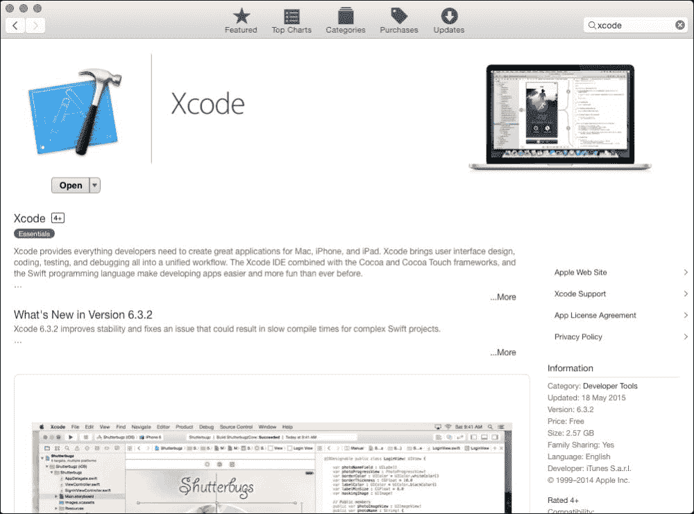

一旦 Xcode 安装完成，我们需要安装`ios-sim`工具。这是一个命令行实用程序，可以在模拟器中启动 iOS 应用程序。

要安装`ios-sim`，我们需要打开一个终端窗口，并运行以下命令：

```js
npm install -g ios-sim

```

一旦完成`ios-sim`的安装，我们就拥有了在 iOS 平台上测试我们应用程序所需的所有工具。

## Android 平台指南

现在我们已经设置了 iOS 平台，我们将向您展示如何设置 Android 应用程序的环境。获取所有必需工具的最简单方法是安装 Android Studio，这是官方的 Android IDE。这是一个基于另一个流行的 JetBrains 产品 IntelliJ IDEA Community Edition 的 IDE。它适用于 Windows、Mac OS X 和 Linux 平台。

要安装 Android Studio，请从 [`developer.android.com/sdk/index.html`](http://developer.android.com/sdk/index.html) 下载最新版本，然后按照屏幕上的说明操作。

默认情况下，Android Studio 安装了 Nexus 5 的图像模拟器。如果您想在其他设备上测试您的应用程序，您需要在 Android 虚拟设备管理器中安装它们。您可以在 Android Studio 中的 **工具** | **Android** | **AVD 管理器** 找到它：

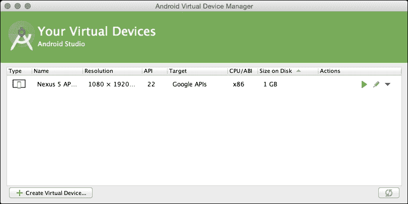

本章涵盖的所有框架也支持部署到 iOS 和 Android 之外的其他平台。因此，如果您想为这些平台开发应用程序，您将必须安装必要的 SDK 或工具。本书不会涵盖其他平台的步骤，但您可以通过搜索每个平台的 SDK 来找到更多信息。

其他一些支持的平台如下：

+   Amazon Fire OS

+   BlackBerry

+   Firefox OS

+   Ubuntu

+   Windows Phone

+   Tiezen

现在我们已经为 Android 和 iOS 平台设置了环境，我们可以开始构建移动应用程序。

# Cordova

|    | *Apache Cordova 是一个使用 HTML、CSS 和 JavaScript 构建原生移动应用程序的平台* |    |
| --- | --- | --- |
|    | --[`cordova.apache.org/`](https://cordova.apache.org/) |

Cordova 是一组 JavaScript API，允许访问设备的原生功能，如加速度计、摄像头或地理位置。

开发者在用 Apache Cordova 编写应用程序时，使用 SDK 平台打包的 Web 技术作为原生应用程序。在核心上，这些应用程序使用 HTML5 和 CSS3 进行渲染，并使用 JavaScript 进行逻辑处理。

在我们开始使用此框架构建应用程序之前，我们需要安装它。为此，我们需要在终端窗口中运行以下命令：

```js
npm install -g cordova

```

上述命令全局安装了 Apache Cordova，因此它将适用于所有未来的项目。安装完成后，我们需要重新启动 WebStorm，以便它能够检测到新安装的框架。

现在从欢迎屏幕或 **文件** 菜单中选择 **新建项目**。选择 **PhoneGap/Cordova 应用** 作为模板，插入目标文件夹，并选择 Cordova CLI 的路径，如图所示：

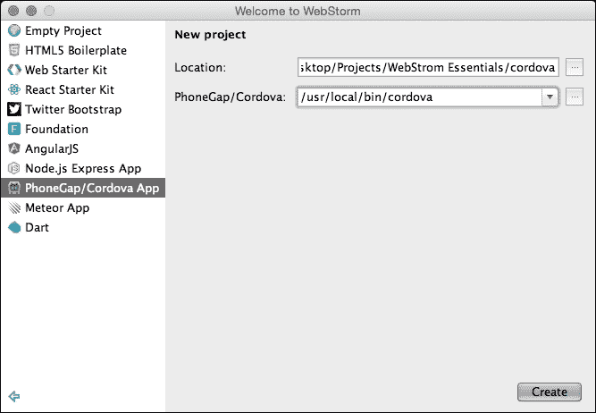

这将创建并打开一个基于 Cordova 框架的新项目。该项目预装了一个示例页面，我们可以使用它。

在我们的应用程序在模拟器中测试之前，我们需要编辑运行配置。因此，选择 **编辑配置...**，如图所示：

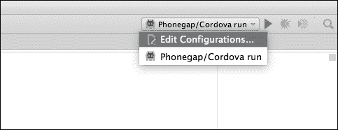

将名称更改为 iOS，并在平台下拉菜单中选择 **ios**。点击 **确定** 保存配置。这将创建一个运行环境配置，可用于在 iOS 平台上测试应用程序。

如果我们检查 **指定目标**（如图所示），我们可以选择特定的设备，如 iPhone 6、iPhone 5s 或其他设备：

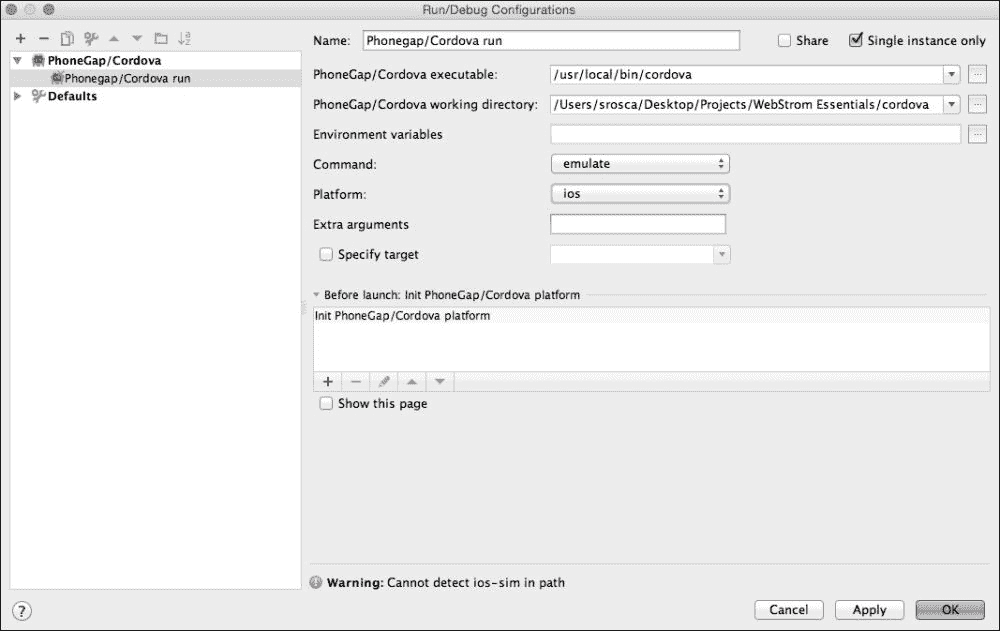

现在，我们可以通过按 *Shift* + *F10* 或选择配置旁边的运行图标来在模拟器中运行我们的应用程序。

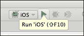

这将启动 Cordova 构建系统并在 iOS 模拟器中运行我们的应用程序。我们还可以在运行部分查看运行日志：

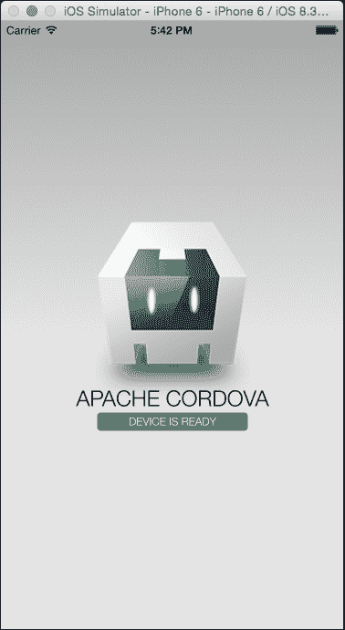

我们将创建一个类似的配置来测试我们的应用程序在 Android 平台上的运行。再次选择 **编辑配置** 菜单。

在选择之前的 iOS 配置后，点击 **复制配置** 图标以复制它。在新建的配置中，将名称更改为 `Android` 并将 **平台** 更改为 **android**。


我们现在创建了一个配置来测试我们的应用程序在 Android 模拟器上的运行。要运行应用程序，请按 *Shift* + *F10*，或按运行图标。这将启动应用程序，这次使用 Android 模拟器。

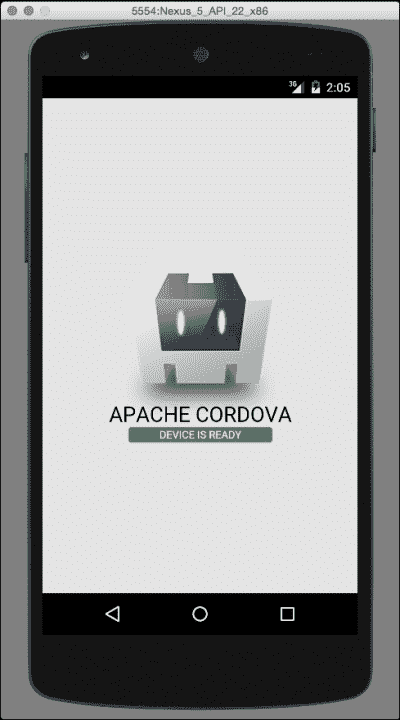

我们现在已经创建了一个简单的应用程序，它等待设备就绪事件，并在设备就绪时改变屏幕状态。我们现在将使用 PhoneGap 构建一个更复杂的应用程序，因为框架之间的差异很小。

# PhoneGap

|    | *轻松使用您所熟悉和喜爱的网络技术创建应用程序：HTML、CSS 和 JavaScript。PhoneGap 是一个免费的开源框架，允许您使用针对您关心的平台的标准化网络 API 创建移动应用程序。* |
| --- | --- |
|    | --[`phonegap.com/`](http://phonegap.com/) |

PhoneGap 是 Apache Cordova 的一个发行版；因此，其背后的引擎是 Cordova，但你还可以访问更多工具，例如开发者应用或远程构建。

在开始之前，我们需要全局安装框架并重新启动 WebStorm 以获取它。为此，请执行以下命令：

```js
npm install -g phonegap

```

要基于 PhoneGap 开始一个新项目，请从欢迎屏幕或 **文件** 菜单中选择 **新建项目**，然后选择 **PhoneGap/Cordova 应用** 作为模板。插入目标文件夹，并选择新安装的 PhoneGap CLI 的路径：

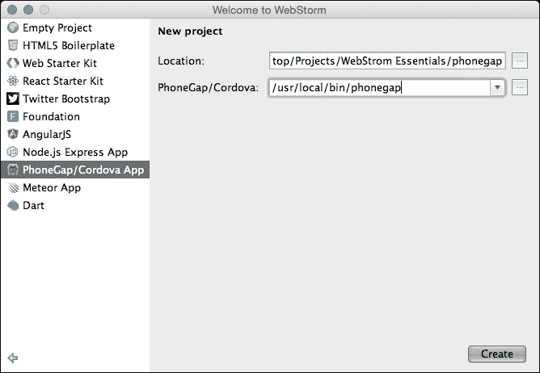

这将创建并打开一个基于 PhoneGap 框架的新项目。该项目包含一个示例页面，我们将对其进行扩展。

在继续之前，我们需要将 `config.xml` 文件中的 **minSdkVersion** 修改为 **10**。我们这样做是因为，默认情况下，Android Studio 不会下载旧 API 版本的 SDK，而我们不想针对旧版本的 Android。

要打开文件，请按 *⌘* + *Shift* + *N*，开始输入文件名（`config.xml`），然后选择它。一旦文件打开，你可以按 *⌘* + *F*，搜索对话框将出现在页面顶部，我们可以在这里输入 `android-minSdkVersion` 以在代码中找到片段。

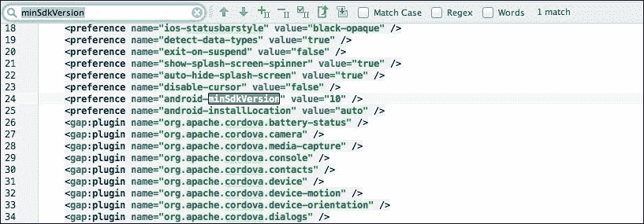

由于我们的应用使用了位置，我们需要将`cordova-plugin-geolocation`添加到`config.xml`文件中，以便 PhoneGap 下载并安装它。

```js
<plugin name="cordova-plugin-geolocation" version="1" />
```

现在，按照上一节中给出的步骤，我们将为 iOS 和 Android 创建一个运行配置，以在两个平台上测试我们的应用程序。

在本节中，我们将从第一章创建地图示例，但这次作为一个移动应用。

由于我们的应用使用了 jQuery，我们需要下载并复制它到`JS`文件夹中，然后在`index.html`文件中加载它。在`cordova.js`和`index.js`文件之间加载以下脚本：

```js
<script type="text/javascript" src="img/jquery-1.11.3.min.js"></script>
```

在`<div>`标签的`app`之后，创建一个新的`<div>`容器用于地图，如下所示：

```js
<div id="map"></div>
```

我们还需要将以下样式添加到`index.css`文件中：

```js
html, body{
    width: 100%;
    height: 100%;
}

#map{
    display: none;
    width: 100%;
    height: 100%;
    margin: 0;
    padding: 0;
}
```

现在加载 Google Maps API。由于 API 是一个外部资源，将会被下载，所以我们只在设备准备好并连接到互联网时加载它。因此，打开`index.js`文件，并在`onDeviceReady`处理程序中添加以下代码：

```js
onDeviceReady: function () {
    app.receivedEvent('deviceready');document.addEventListener("online", app.loadGoogleMapsAPI, false);
    document.addEventListener("resume", app.loadGoogleMapsAPI, false);
    app.loadGoogleMapsAPI();
},
```

这将监听设备在线时的情况，并触发我们接下来要定义的`loadGoogleMapsAPI`函数：

```js
// Load the Maps API if it wasn't loaded before loadGoogleMapsAPI: function () {
    if (window.google !== undefined && window.google.maps) {
        return;
    }
    // load maps api
    $.getScript('https://maps.googleapis.com/maps/api/js?sensor=true&callback=app.onMapsApiLoaded');
},
```

前面的函数检查 API 是否已加载；如果没有，它将使用 jQuery 的`getScript`方法加载它。考虑到 API 是异步加载的，我们需要使用回调函数将查询字符串参数传递给脚本。

现在，我们将创建`onMapsApiLoaded`回调函数，其中我们获取设备位置。我们还将监视位置的变化并读取位置：

```js
// Get the location after we have the maps api// Get the default location and also watch for any changes in the location
onMapsApiLoaded: function(){
    navigator.geolocation.getCurrentPosition(app.geolocationSuccess, app.geolocationError, app.geolocationOptions);navigator.geolocation.watchPosition(app.geolocationSuccess, app.geolocationError, app.geolocationOptions);
},
```

对于位置方法，我们必须创建两个回调函数和一个配置对象。如果加载位置时发生错误，我们将使用默认位置：

```js
// Load the map with the device positongeolocationSuccess: function(position){
    app.position = new google.maps.LatLng(position.coords.latitude, position.coords.longitude);
    app.updatePosition();

},
// If we don't have a position from the device, we are going to use // some default values
geolocationError: function(error){
    if(!app.pos){app.defaultPosition = new google.maps.LatLng(51.5, -0.1);
        app.updatePosition();
    }
},
// Settings object for the geolocationgeolocationOptions: {
    maximumAge: 3000,
    timeout: 5000,
    enableHighAccuracy: true
},
```

一旦我们从设备或默认位置获取了位置，我们就可以创建和更新地图。

```js
// Show the map and update the positionupdatePosition: function(pos){
    $('.app').hide();
    $('#map').show();
    var mapOptions = {
        zoom: 10
    };
    var pos = app.position || app.defaultPosition;
    var map = new google.maps.Map(document.getElementById('map'), mapOptions);
    var infowindow = new google.maps.InfoWindow({
        map: map,
        position: pos,
        content: 'I am here!'
    });
    map.setCenter(pos);
},
```

这将隐藏初始屏幕，创建地图，并更新我们在地图上的位置。

现在，如果我们按照上一个示例中的步骤在 iOS 模拟器中运行应用程序，我们将看到以下屏幕：

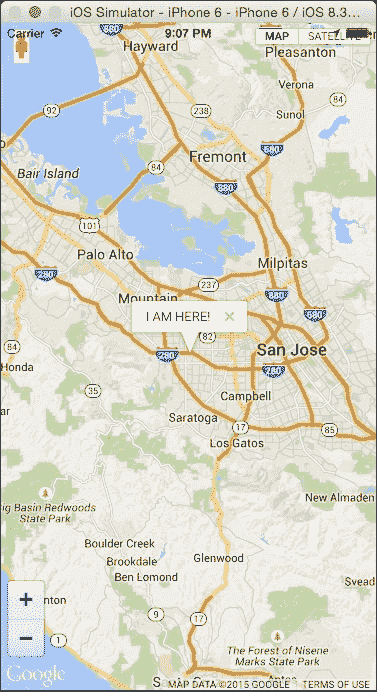

如果我们在 Android 模拟器中运行应用程序，我们将得到一个类似的屏幕：

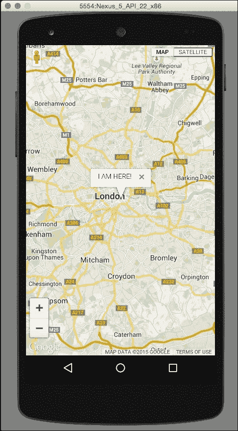

# 离子框架

|    | *创建令人难以置信的应用。**Iconic 是一个美丽的开源前端 SDK，用于使用 Web 技术开发混合移动应用。** |    |
| --- | --- | --- |
|    | --[`ionicframework.com/`](http://ionicframework.com/) |

Ionic 是一个专注于外观、感觉和 UI 交互的框架。它不是 PhoneGap 或 Cordova 的替代品，而是它们的补充。它可以被视为移动开发的 Bootstrap，因为它是一个 CSS 样式和 Angular JavaScript 组件的集合。

在我们开始之前，我们需要全局安装框架并重新启动 WebStorm 以获取它。为此，运行以下命令：

```js
npm install -g ionic

```

安装应用程序后，我们需要重新启动 WebStorm，以便它能够识别框架，并选择**PhoneGap/Cordova App**模板，使用新安装的 Ionic CLI 作为项目编译器来启动一个新项目：

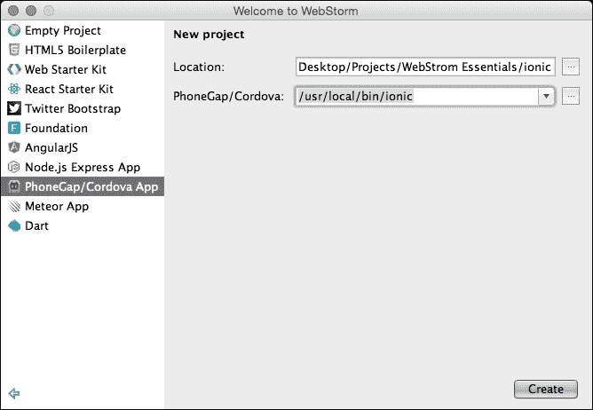

项目创建完成后，我们需要像之前的项目一样，为 iOS 和 Android 创建运行配置；因此，请按照上一节中的步骤创建配置。

由于 Ionic 附带一个示例项目，我们可以在模拟器上轻松测试创建的项目。

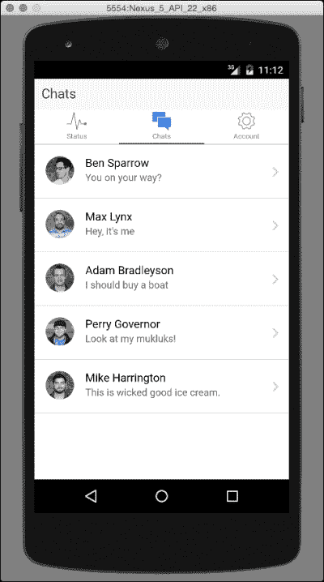

此框架将创建一个具有内置导航的更复杂的应用程序，这将使我们能够看到更多屏幕。

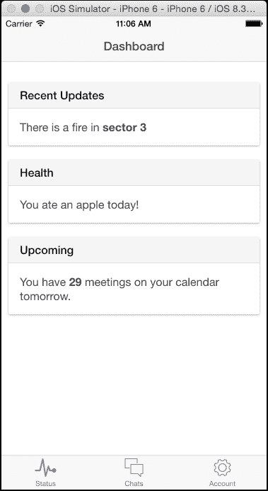

# 摘要

在本章中，你学习了如何使用 Web 技术创建原生移动应用程序，以及 WebStorm 如何帮助我们实现这一点：从使用模板快速创建项目到管理运行配置。

在下一章中，我们将看到 WebStorm 如何帮助我们分析和调试代码。
