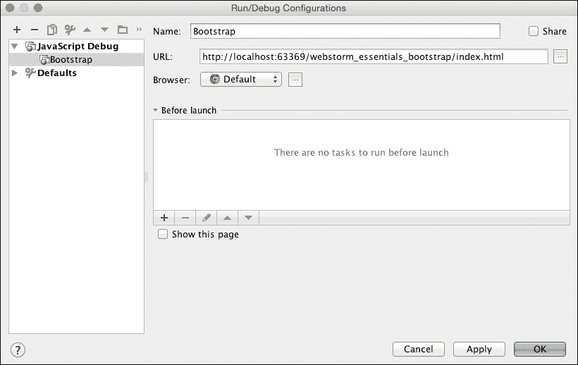
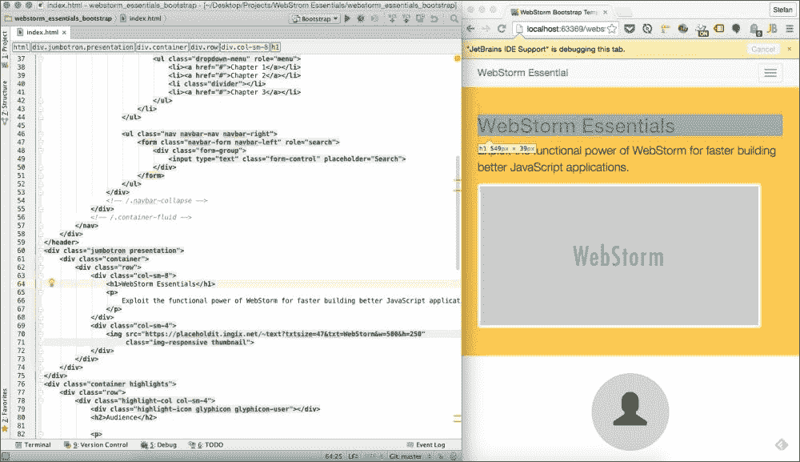
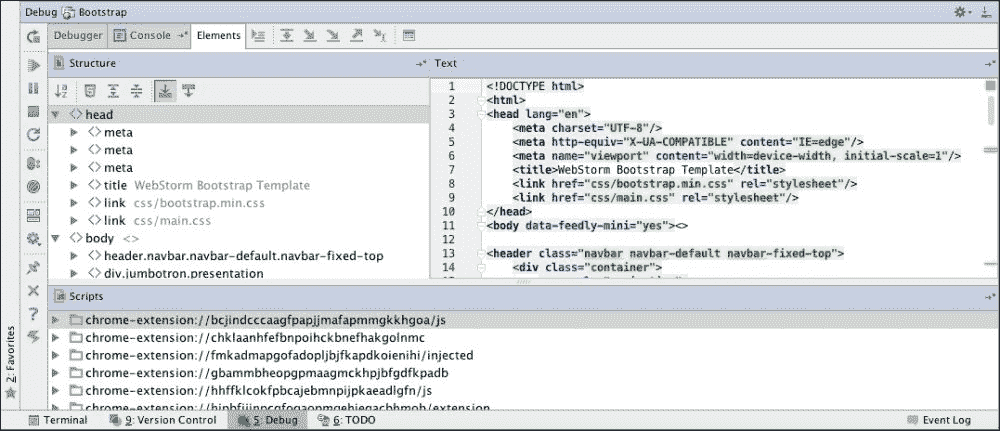
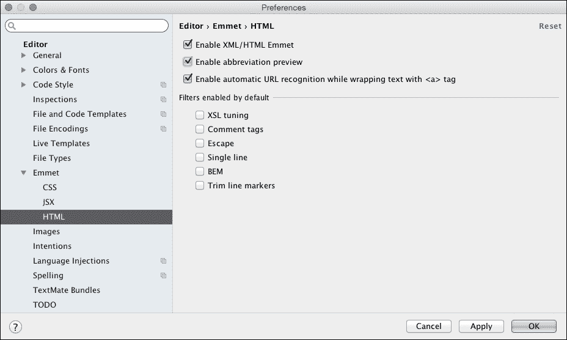
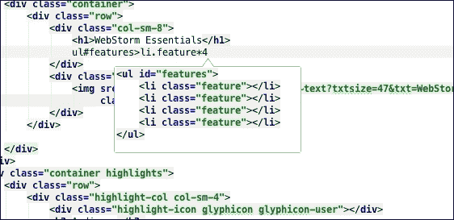
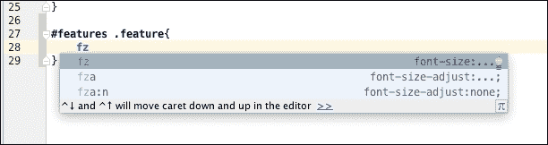
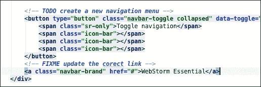
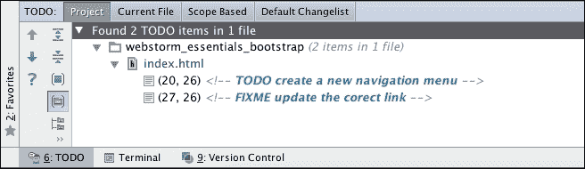
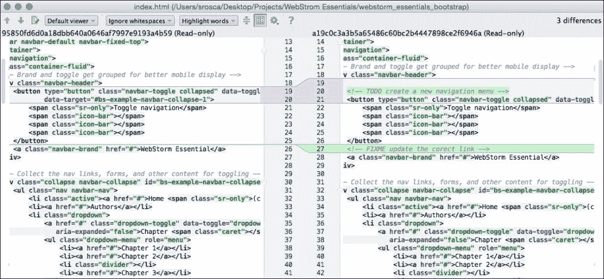
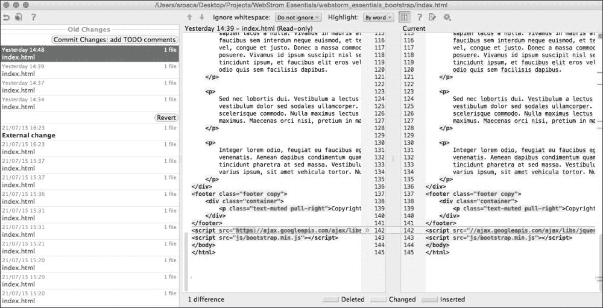

# 第九章。了解更多强大功能

在上一章中，我们看到了 WebStorm 如何与测试运行器和测试框架协同工作，以确保我们的代码经过测试。

在本章的最后，我们将关注一些 WebStorm 的强大功能，这些功能可以帮助我们提高生产力和开发者体验。

在本章中，我们将涵盖以下主题：

+   使用实时编辑模式

+   与 Emmet 一起工作

+   TODO 功能

+   差异查看器

+   跟踪本地历史

# 使用实时编辑模式

当你处于 JavaScript 调试会话中时，WebStorm 允许你看到你对任何 HTML 文件或生成 HTML、CSS 或 JavaScript 的文件所做的所有更改。当你处于此模式时，你还可以在 **调试** 部分的 **元素** 选项卡中看到页面结构和脚本。

在我们使用实时编辑模式之前，我们需要确保在插件设置页面中激活了插件，并且 WebStorm 浏览器扩展已安装并激活。我们已经在调试部分使用过它。

对于本节，我们将使用我们在 Bootstrap 示例中创建的项目。因此，打开示例，或者从 GitHub 仓库 [`github.com/srosca/webstorm_essentials_bootstrap.git`](https://github.com/srosca/webstorm_essentials_bootstrap.git) 创建一个新的项目。一旦你有了所有必要的代码，从 **运行** | **编辑配置…** 打开 **运行/调试配置** 对话框，如图所示。选择 JavaScript 作为模板，Bootstrap 作为名称，并将 `http://localhost:63369/webstorm_essentials_bootstrap/index.html` 作为 URL。



一旦设置了运行配置，你就可以从 **运行** 菜单或工具栏开始调试会话。启动此会话后，你可以访问多个工具，这些工具将有助于你的项目开发。

当你更改光标位置或当我们点击元素时，HTML 文件中的所有代码将在浏览器中突出显示。

下一个图像显示了实时编辑模式的常规设置，其中你同时保持编辑器窗口和浏览器打开，并且当你编辑代码时，更改会立即反映出来。



现在，如果我们更改 HTML 文件，所有更改将立即在浏览器中反映出来。WebStorm 知道如何刷新我们对 HTML、CSS、JavaScript 文件或任何生成更改的文件所做的所有更改。

在实时编辑模式下，你还可以在 **元素** 选项卡的 **调试** 部分找到页面结构和脚本的概述。



从开发者的角度来看，实时编辑模式非常有用，因为他/她可以快速看到更改如何影响页面，因此能够快速调试和原型化页面。

# 与 Emmet 一起工作

Emmet 是一组插件，它使用户能够使用一种特殊的语法，该语法可以转换为 HTML、JSX 或 CSS。它是一种提高生产力的工具，使用户能够快速编写代码。在 WebStorm 中，配置是在**设置** | **编辑器** | **Emmet**页面下找到的设置页面中进行的。有单独的配置页面用于**通用、HTML**、**JSX**和**CSS**设置，如下面的截图所示：



在我们开始之前，请确保你已经打开了 Bootstrap 示例，然后打开`index.html`和`main.css`文件。

当你输入 Emmet 代码时，如果你在 HTML 设置页面中选择了此选项，WebStorm 将显示一个预览窗口。在开始时这样做是个好主意，这样你就可以习惯语法。预览将显示你的最终代码将是什么样子。



现在你必须在`index.html`文件中在`<h1>`之后插入示例，所以将光标定位在那里，然后输入`ul#features>li.feature*4`。然后按*Tab*键。这将按如下方式展开代码：

```js
<ul id="features">
    <li class="feature"></li>
    <li class="feature"></li>
    <li class="feature"></li>
    <li class="feature"></li>
</ul>
```

现在你已经有了 HTML 代码，前往`main.css`文件，以便你可以创建 CSS 代码。为元素创建一个空的定义：

```js
#features .feature{
}
```

你现在可以在其中输入你的 Emmet 代码。如果你输入`fz`然后按下*Tab*键，这将展开为`font-size`，我们可以在其中设置所需的字体大小。对于 CSS，预览总是激活的。



在本节中，我们给出了一些 Emmet 如何使用的简单示例。然而，如果你想进一步学习这个主题，我建议查看[`docs.emmet.io/`](http://docs.emmet.io/)提供的文档。

# TODO 功能

WebStorm 包含 TODO 功能，以便你可以为其他用户或未来的更新创建任务列表。它也可以用作通知系统，通知用户需要关注的问题，例如待回答的问题、稍后阶段要做的事情、优化和改进。在多个用户协作的大型项目中，这是一个不可或缺的工具。

要使用`TODO`，你必须在源代码中输入特殊注释。默认情况下，WebStorm 自带两个预定义的模式，但你可以根据需要定义任意多的模式。默认模式要求你创建一个包含`TODO`或`FIXME`关键字的注释。这些特殊注释会使用特殊颜色突出显示，这些颜色可以在**首选项** | **编辑器** | **颜色和字体** | **通用**设置页面中定义。



WebStorm 还创建了一个特殊部分，你可以在这里看到所有你的 TODO 项。你还可以创建过滤器和自定义规则，以便只显示相关项。



# 差异查看器

WebStorm 有一种特殊模式，允许我们比较两个文件或文件在不同时间点的版本（例如，不同的 Git 提交）。在这个模式下，我们可以轻松地发现两个文件之间的差异或对文件所做的更改。差异查看器也是一个具有代码补全、实时模板等功能的高级编辑器。因此，我们可以在这种模式下直接更改代码。

您可以通过 **视图** | **与...比较** 菜单或通过在 **项目** 面板中选择两个文件来访问此对话框。要比较文件与提交中的版本，您需要转到 **版本控制** 日志，选择一个文件，然后从上下文菜单中选择 **显示差异**。



此对话框允许我们快速查看文件之间的差异并审查任何更改。

# 跟踪本地历史记录

在 WebStorm 中修改的每个文件都享有强大的本地历史记录模式的益处，该模式跟踪对该文件所做的所有更改。本地历史记录就像一个本地版本控制系统，与可能附加到项目上的其他系统并行工作，并跟踪所有更改，包括在提交到其他 VCS 之间的更改。

本地历史记录仅跟踪对小于 1 MB 的文本文件所做的更改。要访问此对话框，您需要从任何打开的文件的上下文菜单中选择 **本地历史记录**。



# 摘要

在本章的最后，我们探讨了 WebStorm 的一些专注于开发者体验和生产力的功能。

我们已经学习了如何使用智能编辑方法（Live Edit 和 Emmet），跟踪项目中需要执行的任务，以及查看两个文件之间的差异或文件在一段时间内所做的更改。

随着我们的旅程即将结束，我希望您已经享受了学习 WebStorm 如何帮助您完成日常任务的过程。我可以从经验中告诉您，花在学习这个 IDE 上的所有时间都将使您成为一个更加自信和高效的开发者。它是开发中的无价之宝，帮助您从开发简单的网页到更复杂的应用程序，再到代码的调试和测试。

我想以感谢您加入我的这次旅程结束，并希望您喜欢这个新工具在您的开发工具包中。
