# 第一章：使用 NW.js 创建文件资源管理器-规划、设计和开发

如今，当谈到 HTML5 桌面应用程序开发时，人们通常指的是**NW.js**或**Electron**。第一个学习曲线较短，对于初学者来说是更好的选择。我们的第一个应用程序将是一个文件资源管理器。这种软件传统上被认为是经典的桌面应用程序。我相信你会发现用 HTML、CSS 和 JavaScript 构建一个文件资源管理器是令人兴奋的。本章不需要掌握 JavaScript 框架的技能，因为我们不会使用任何框架。你只需要基本的 HTML、CSS 和纯 JavaScript 知识（包括 Node.js）。

那么，我们要做什么？我们将规划和勾画项目。我们将设置开发环境并创建静态原型，并在 NW.js 中运行它。我们将实现基本功能，使其准备好在第二章中进行增强，*使用 NW.js 创建文件资源管理器增强和交付*。

# 应用程序蓝图

通过文件资源管理器，我指的是一个小程序，允许浏览文件系统并对文件执行基本操作，这可以用以下用户故事来表达：

+   作为用户，我可以查看当前目录的内容

+   作为用户，我可以浏览文件系统

+   作为用户，我可以用默认关联的程序打开文件

+   作为用户，我可以删除文件

+   作为用户，我可以复制文件到剪贴板，然后在新位置粘贴

+   作为用户，我可以用系统文件管理器打开包含文件的文件夹

+   作为用户，我可以关闭应用程序窗口

+   作为用户，我可以最小化应用程序窗口

+   作为用户，我可以最大化和恢复应用程序窗口

+   作为用户，我可以更改应用程序语言

以视觉形式来理解会更容易，不是吗？线框图在这里很有用。线框图是应用程序的骨架框架，描述了应用程序内容的排列，包括 UI 元素和导航系统。线框图没有真正的图形、排版甚至颜色。它以图表的方式展示了应用程序的功能。你知道，用铅笔在纸上画是可能的，但不是创建线框图的最佳方式；我们需要的是原型工具。今天市场上有很多解决方案。在这里，我使用了一个令人印象深刻但价格实惠的工具，叫做**WireframeSketcher**（[`wireframesketcher.com/`](http://wireframesketcher.com/)）。它允许你勾画 Web、桌面和移动应用程序（正是我们需要的）。它还有丰富的样机库，包括样式、小部件、图标和模板，使得原型设计快速简单。此外，线框图以草图风格呈现得很好：

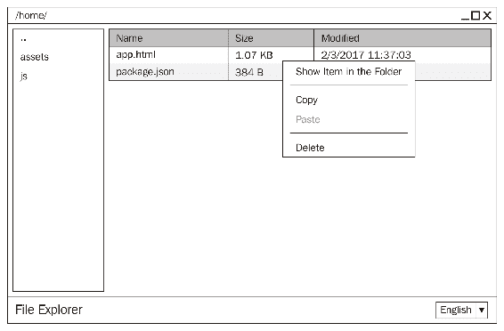

在线框图上我们看到的通常被称为**圣杯布局**。在我们的情况下，标题栏充当窗口标题栏。在那里，我们保留了窗口操作的控件，如关闭、最大化和最小化。除此之外，在标题栏中，我们显示当前目录的路径。在侧边栏中，我们有文件系统导航。主要部分包含一个表示当前目录文件的表格。它有列--名称、大小和修改日期。右键单击文件会打开一个包含可用文件操作的上下文菜单。页脚包括应用程序标题和语言选择器组合框。

# 建立一个 NW.js 项目

NW.js 是一个用于构建 HTML、CSS 和 JavaScript 应用程序的开源框架。你也可以把它看作是一个无头浏览器（基于 Chromium [`www.chromium.org/`](https://www.chromium.org/)），它包括 Node.js 运行时，并提供桌面环境集成 API。实际上，这个框架非常容易上手。我们只需要一个起始页 HTML 文件和项目清单文件（`package.json`）。

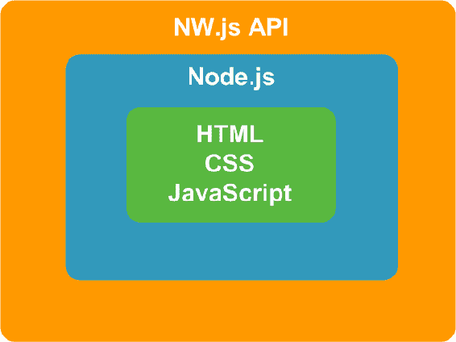

为了看到它的运行情况，我们将在任意位置创建一个名为`file-explorer`的项目文件夹。文件夹位置的选择取决于您，但我个人更喜欢在 Linux/macOS 上保留 Web 项目在`/<username>/Sites`，在 Windows 上保留在`%USERPROFILE%Sites`。

当我们进入目录时，我们为 JavaScript 和 CSS 源文件创建占位符文件夹（`js`和`assets/css`）：

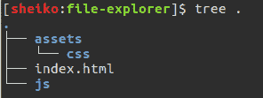

我们还放置了一个起始页 HTML（`index.html`），其中只包含几行：

```js
./index.html
<!DOCTYPE html>
<html>
 <body>
  <h1>File Explorer</h1>
 </body>
</html>

```

正如您所猜测的，当将此文件输入浏览器时，我们将只看到这个文本--文件浏览器。

现在，我们需要 Node.js 清单文件（`package.json`）。嵌入在框架中的 Node.js 将使用它来解析依赖包名称，当使用`require`函数或从 npm 脚本调用时。此外，NW.js 还从中获取项目配置数据。

为什么不使用 npm 工具创建清单文件并填充它的依赖项？

# Node 包管理器

如今，**Node 包管理器**（**npm**）是 Web 开发人员工具中最受欢迎的工具之一。它是一个与相应的在线软件包存储库连接的命令行实用程序，能够进行软件包安装、版本管理和依赖管理。因此，当我们需要一个软件包（库、框架和模块），我们将检查它是否在 npm 存储库中可用，并运行 npm 将其引入我们的项目。它不仅下载软件包，还智能地解决其依赖关系。此外，npm 作为自动化工具非常方便。我们可以设置各种命令行任务，通过名称引用任何本地安装的软件包。npm 工具将在已安装的软件包中找到可执行软件包并运行它。

npm 工具与 Node.js 一起分发。因此，您可以在 Node.js 下载页面（[`nodejs.org/en/download`](https://nodejs.org/en/download)）上找到 Windows 或 macOS 的安装程序。它也作为 APT 软件包提供，因此您可以使用`apt-get`工具在 Linux 上安装它：

```js
sudo apt-get install npm

```

如果您已经安装了 npm，请确保它是最新的：

```js
sudo npm install npm@latest -g

```

正如我已经说过的，我们可以使用 npm 安装包--例如 NW.js。如果我们想要全局安装，我们将运行以下命令：

```js
sudo npm install nw --global

```

或者，我们可以运行以下命令：

```js
sudo npm i nw -g

```

这将在`{prefix}/lib/node_modules/`中下载 NW.js 的最新版本，并将可执行文件放在`{prefix}/bin`中。它将二进制文件添加到`PATH`环境变量中，因此可以在 shell 中的任何位置调用`nw`。

`{prefix}`为了找出`{prefix}`是什么，可以运行：

`npm config get prefix`。在 Linux/macOS 上，它将是`/usr/local`。在 Windows 上是`%APPDATA%npm`

这样，我们将在系统中拥有一个 NW.js 的单一实例，但是如果一个应用程序需要特定版本的 NW.js 怎么办？幸运的是，通过 npm，我们也可以在本地安装一个包，因此，依赖于解决我们应用程序的特定版本。此外，我们可以在`package.json`文件中管理本地依赖项。使用一个命令，npm 可以一次安装/更新所有在那里列出的依赖项。

让我们看看它在我们的项目上是如何工作的。我们转到项目根目录（`file-explorer`文件夹）并运行以下命令：

```js
npm init -y 

```

它会生成一个包含以下内容的`package.json`文件：

```js
{ 
  "name": "file-explorer", 
  "version": "1.0.0", 
  "description": "", 
  "main": "main.js", 
  "scripts": { 
   "test": "echo "Error: no test specified" && exit 1" 
  }, 
  "keywords": [], 
  "author": "", 
  "license": "ISC" 
} 

```

在`name`字段中，我们设置我们的应用程序名称。请注意，NW.js 将使用提供的值来命名项目持久数据的系统相关路径中的目录（`nw.App.dataPath`）。因此，它应该是一个唯一的、小写的字母数字组合，但可能包括一些特殊符号，如`.`、`_`和`-`。

字段版本期望应用程序版本作为字符串，符合语义化版本标准（[`semver.org/`](http://semver.org/)）。这归结为三个用点分隔的数字组成的复合产品版本。第一个数字（MAJOR）在我们进行不兼容的 API 更改时递增，第二个数字（MINOR）在引入新功能时增加，最后一个数字（PATCH）标识错误修复。

在`main`字段中，我们让 NW.js 知道在哪里找到我们的起始页 HTML。我们必须编辑清单以更改其值为`index.html`：

`./package.json`

```js
{ 
  ... 
  "main": "index.html", 
  ... 
} 

```

`scripts`字段接受一个键值对象，其中包含项目的自动化脚本。默认情况下，它有一个用于测试的占位符。现在，运行以下命令：

```js
npm run test

```

Shell 响应错误消息，表示没有指定测试，因为我们还没有测试。但是，我们需要一个脚本来启动应用程序。因此，我们再次编辑`package.json`并在`scripts`字段中添加以下行：

`package.json`

```js
{ 
  ... 
  "scripts": { 
    "start": "nw .", 
    "test": "echo "Error: no test specified" && exit 1" 
  }, 

  ... 
} 

```

现在，我们可以输入`npm run start`或`npm start`来在项目根目录上运行 NW.js，但是我们还没有安装框架。我们正要引入它。

清单字段-例如描述/关键字和作者-帮助其他人发现应用程序作为一个包。`license`字段告诉人们他们可以如何使用该包。您可以在[`docs.npmjs.com/files/package.json`](https://docs.npmjs.com/files/package.json)找到有关这些字段和其他可能选项的更多信息。

在告诉 npm 安装框架之前，我们注意到标准版本的 NW.js 不包括 DevTools，而我们在开发中肯定会需要。因此，我们寻找一个特定版本，即所谓的 SDK 版本。要找出 NW.JS 包（`nw`）可用的包版本，我们运行以下命令：

```js
npm view nw dist-tags

```

或者，我们可以运行以下命令：

```js
npm v nw dist-tags

```

这将收到以下输出：

```js
{
  latest: '0.20.3',
  alphasdk: '0.13.0-alpha4sdk',
  alpha5sdk: '0.13.0-alpha5sdk',
  alpha6sdk: '0.13.0-alpha6sdk',
  alpha7sdk: '0.13.0-alpha7sdk',
  sdk: '0.20.3-sdk' 
}

```

从这个负载中，我们可以假设在撰写时的最新版本是`0.20.3`，并且它伴随着`0.20.3-sdk`。因此，我们可以按照以下方式安装框架：

```js
npm install nw@0.20.3-sdk --save-dev

```

或者，我们可以按照以下方式安装它：

```js
npm i nw@0.20.3-sdk -D

```

实际上，由于我们知道该包有一个名为`sdk`的分发标签，我们也可以按照以下方式进行：

```js
npm i nw@sdk -D

```

运行任何这些命令后，我们可以在`node_modules`中找到一个新的子目录。在那里，npm 会安装本地依赖项。

您是否注意到我们应用了`--save-dev (-D)`选项？这样，我们要求 npm 将包保存在我们的开发依赖列表中。请注意`package.json`已更改：

```js
{ 
  "name": "file-explorer", 
  "version": "1.0.0", 
  "description": "", 
  "main": "index.html", 
  "scripts": { 
    "start": "nw .", 
    "test": "echo "Error: no test specified" && exit 1" 
  }, 
  "keywords": [], 
  "author": "", 
  "license": "ISC", 
  "devDependencies": { 
 "nw": "⁰.20.3-sdk" 
 } 
} 

```

我们将该包安装为开发依赖，因为这个 SDK 版本仅用于开发。在第二章中，*使用 NW.js 创建文件资源管理器-增强和交付*，我们将研究分发和打包技术。因此，您将看到我们如何将应用程序与特定于平台的 NW.js 生产构建捆绑在一起。

由于我们在清单文件中反映了我们的依赖关系，我们可以通过运行以下命令随时更新此包以及任何进一步的包：

```js
npm update

```

如果我们丢失了`node_modules`（例如，在从远程 GIT 存储库克隆项目时，给定依赖文件夹通常在忽略列表中），我们可以通过以下命令安装所有依赖项：

```js
npm i

```

您是否注意到？在`package.json`中，我们将`nw`包分配为所谓的插入范围`⁰.20.3-sdk`的版本。这意味着在安装/更新过程中，npm 将接受具有补丁和次要更新的新版本，但不接受主要版本。

以下是一些有用的 npm 命令：

`npm i pkg-name`：安装包的最新可用版本

`npm i pkg-name@version`：安装包的具体版本

`npm i pkg-name -S`：将包安装为依赖项并保存在`package.json`中

`npm i pkg-name -D`：将包安装为开发依赖项并保存在`package.json`中

`npm i`: 安装`package.json`中列出的所有依赖项（包括开发依赖项）

`npm i --production`: 安装依赖项，但不包括开发依赖项

`npm list`: 显示所有已安装的依赖项

`npm uninstall nw --save`: 卸载一个包并从中删除

`npm un nw -S`: 更简洁的语法

`package.json`

在这一点上，我们有了框架实例和`package.json`指向`index.html`。因此，我们可以运行到目前为止在清单文件中定义的唯一脚本：

```js
 npm start 

```

首先，在 Ubuntu 上在 NW.JS 上运行它：

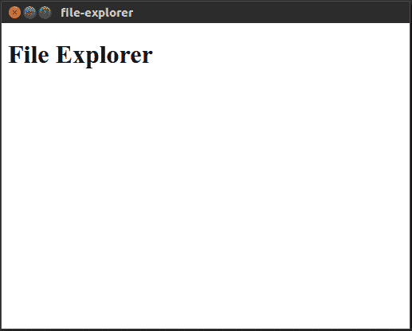

然后，在 Windows 上在 NW.JS 上运行它：

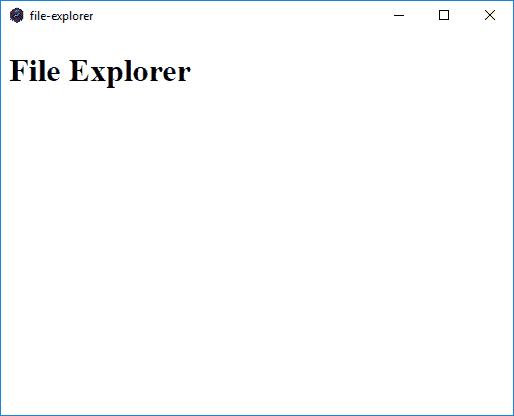

最后，我们在 macOS 上运行它：

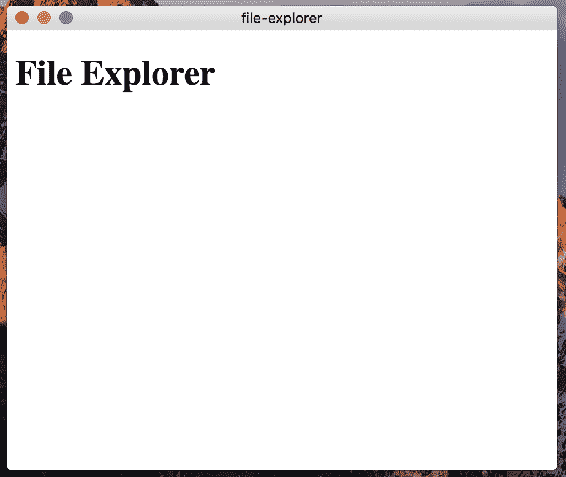

NW.js 创建了一个窗口并在其中呈现了`index.html`。它采用了默认的窗口参数。如果我们想要自定义它们，我们需要编辑`package.json`。

首先，我们将添加接受以下属性的对象的`window`字段：

+   `window.icon`: 这指定了窗口图标的相对路径。

+   `window.show`: 这指示应用程序启动时窗口是否可见。例如，您可以在清单中将其设置为 false，然后使用 JavaScript 以编程方式更改它（`nw.Window.get().show( true )`）。

+   `window.frame`: 当设置为`false`时，这将使窗口无框架。

+   `window.width / window.height`: 这将以像素为单位设置窗口的默认大小。

+   `window.min_width / window.min_height`: 这将设置窗口的最小可接受大小。

+   `window.position`: 这指定窗口应放置的位置。该值可以是`null`，`center`或`mouse`。

+   `window.resizable`: 当设置为`true`时，此属性使窗口可以调整大小。

我们还将使用`chromium-args`字段来指定要传递给 chromium 的命令行参数。在这里，我们将其设置为`--mixed-context`，以将 NW.js 切换到相应的模式。因此，我们可以直接从 Node.js 模块访问浏览器和 NW.js API。NW.js 引入了 Node.js 上下文，除了浏览器上下文之外，并将它们分开。在使用 NWJS 元数据扩展后，清单如下所示：

`./package.json`

```js
{ 
  ... 
  "chromium-args": "--mixed-context", 
  "window": { 
    "show": true, 
    "frame": true, 
    "width": 1000, 
    "height": 600, 
    "min_width": 800, 
    "min_height": 400, 
    "position": "center", 
    "resizable": true 
  } 
} 

```

这些只是为我们简单应用程序设置的一些首选项。所有可用选项都可以在[`github.com/nwjs/nw.js/wiki/manifest-format`](https://github.com/nwjs/nw.js/wiki/manifest-format)找到。

# 一个 HTML 原型

我们已经到了可以开始为我们的应用程序创建模板的地步。使用 HTML 和 CSS，我们将实现预期的外观和感觉。稍后，我们将把 JavaScript 模块绑定到操作元素上。

我们首先用以下代码替换`index.html`的内容：

`./index.html`

```js
<!DOCTYPE html> 
<html> 
  <head> 
   <title>File Explorer</title> 
   <meta charset="UTF-8"> 
   <meta name="viewport" content="width=device-width, initial-scale=1.0"> 
   <link href="./assets/css/app.css" rel="stylesheet" type="text/css"> 
  </head> 
  <body class="l-app"> 
   <header class="l-app__titlebar titlebar"> 
   </header> 
   <div class="l-app__main l-main"> 
   <aside class="l-main__dir-list dir-list"> 
   </aside> 
   <main class="l-main__file-list file-list"> 
   </main> 
   </div> 
   <footer class="l-app_footer footer"> 
   </footer> 
  </body> 
</html> 

```

在这里，我们只是用语义上有意义的 HTML 标签定义了页面布局。正如您所看到的，我们引用了`./assets/css/app.css`，我们将要创建它。

# 可维护的 CSS

在我们开始样式化之前，我想简要谈一下 CSS 中可维护性的重要性。尽管 CSS 是一种声明性语言，但它需要的细心程度并不比一般代码少。当浏览公共存储库（如 GitHub）时，您仍然可以找到许多项目，其中所有样式都放在一个充满代码异味的单个文件中，并且类命名没有一致性。

嗯，这一开始可能不是什么大问题，但 CSS 和其他代码一样，往往会增长。最终，您将以数千行腐烂的代码结束，通常是由不同的人编写的。

然后，你必须修复 UI 元素的外观，但你意识到跨级影响这个元素的现有 CSS 声明有数十个。你改变一个，样式就会不可预测地在其他元素上破坏。因此，你可能会决定添加自己的规则来覆盖现有的样式。之后，你可能会发现一些现有规则具有更高的特异性，你将不得不通过级联使用蛮力；每次都会变得更糟。

为了避免这种可维护性问题，我们必须将整个应用程序 UI 分解为组件，并设计 CSS 代码，使它们可重用、可移植和无冲突；以下启发法可能会有所帮助：

+   将整个 CSS 代码分成代表组件、布局和状态的模块

+   始终使用类来进行样式设置（而不是 ID 或属性）

+   避免有资格的选择器（带有`nav`、`ul`、`li`和`h2`等标签的选择器）

+   避免位置依赖（长选择器，如`.foo`、`.bar`、`.baz`和`article`）

+   保持选择器简短

+   不要反应性地使用`!important`

有不同的方法论可以帮助改善 CSS 的可维护性。可能最流行的方法是**块** **元素** **修饰符**（**BEM**）。它引入了一个令人惊讶的简单但强大的概念（[`en.bem.info/methodology/key-concepts/`](https://en.bem.info/methodology/key-concepts/)）。它描述了一种鼓励可读性和可移植性的类名模式。我相信最好的解释方法是通过一个例子来说明。假设我们有一个代表博客文章的组件：

```js
<article class="post"> 
   <h2 class="post__title">Star Wars: The Last Jedi's red font is a 
    cause for concern/h2> 
   <time datetime="2017-01-23 06:00" class="post__time">Jan 23, 2017</time> 
</article> 

```

在 BEM 术语中，这个标记代表一个块，我们可以用类名`post`来定义。这个块有两个元素-`post__title`和`post_time`。元素是块的组成部分；你不能在父块上下文之外使用它们。

现在想象一下，我们必须突出显示列表中的一篇文章。因此，我们向块的类添加了`post--sponsored`修改器：

```js
<article class="post post--sponsored"> 
.... 
</article> 

```

起初，包含双破折号和下划线的类名可能会让你头晕，但过一段时间你会习惯的。BEM 命名约定通过显示缩进，极大地帮助开发人员。因此，当阅读自己或别人的代码时，你可以通过类名快速地弄清楚一个类的目的。

除了 BEM 命名约定之外，我们还将从实用 CSS 样式指南（[`github.com/dsheiko/pcss`](https://github.com/dsheiko/pcss)）中借鉴一些想法。我们将给代表全局状态的类添加以`is-`和`has-`为前缀的名称（例如，`is-hidden`和`has-error`）；我们将用`l-`为前缀来表示与布局相关的类（例如，`l-app`）。最后，我们将把所有 CSS 文件合并到两个文件夹（`Component`和`Base`）中。

# 定义基本规则

首先，我们将创建一个`Base`目录，并将重置样式放在其中：

`./assets/css/Base/base.css`

```js
html { 
  -webkit-font-smoothing: antialiased; 
} 

* { 
  box-sizing: border-box; 
} 

nav > ul { 
  list-style: none; 
  padding: 0; 
  margin: 0; 
} 

body { 
  min-height: 100vh; 
  margin: 0; 
  font-family: Arial; 
} 

.is-hidden { 
  display: none !important; 
} 

```

对于 HTML 范围，我们将启用字体平滑，以获得更好的字体渲染。

然后，我们将设置每个元素（`*`）的盒子尺寸为`border-box`。默认的 CSS 盒模型是`content-box`，其中宽度和高度设置为一个元素不包括填充和边框。但是，如果我们设置，比如说，侧边栏宽度为`250px`，我希望它能覆盖这个长度。使用`border-box`，盒子的大小始终是我们设置的大小，而不受填充或边框的影响，但如果你问我，`border-box`模式感觉更自然。

我们将重置用于导航（`nav > ul`）的缩进和标记-无序列表。我们使 body 元素跨越整个视口的高度（`min-height: 100vh`），移除默认边距，并定义字体系列。

我们还将引入一个全局状态`is-hidden`，可以应用于任何元素，将其从页面流中移除。顺便说一句，这是对`!important`的积极和因此可允许的使用的一个很好的例子。通过添加一个`is-hidden`类（使用 JavaScript），我们声明我们希望隐藏该元素，没有例外。因此，我们永远不会遇到特异性问题。

# 定义布局

这就够作为基本样式了；现在，我们将开始布局。首先，我们将安排标题栏、主要部分和页脚：

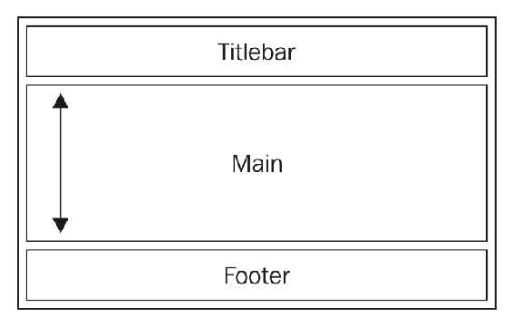

为了实现这种设计，我们应该优先使用 Flexbox。如果您对这种布局模式不熟悉，我建议阅读文章《理解 Flexbox：你需要知道的一切》（[`bit.ly/2m3zmc1`](http://bit.ly/2m3zmc1)）。它可能是最清晰和易于理解的解释 Flexbox 是什么，有哪些选项可用，以及如何有效使用它们的方式。

因此，我们可以这样定义应用程序布局：

`./assets/css/Component/l-app.css`

```js
.l-app { 
  display: flex; 
  flex-flow: column nowrap; 
  align-items: stretch; 
} 

.l-app__titlebar { 
  flex: 0 0 40px; 
} 

.l-app__main { 
  flex: 1 1 auto; 
} 

.l-app__footer { 
  flex: 0 0 40px; 
} 

```

我们使`.l-app`成为一个伸缩容器，沿着交叉轴垂直地排列内部项目（`flex-flow: column nowrap`）。此外，我们要求伸缩项目填充容器的整个高度（`align-items: stretch`）。我们将标题栏和页脚设置为固定高度（`flex: 0 0 40px`）。但是，主要部分可能会根据视口大小而收缩和增长（`flex: 1 1 auto`）。

由于我们有了应用程序布局，让我们为主要部分定义内部布局：

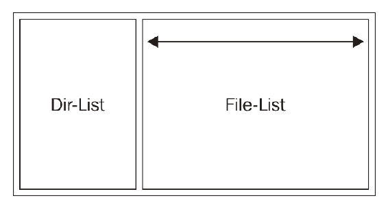

我们需要做的是使`dir-list`和`file-list`项目水平排列：

`./assets/css/Component/l-main.css`

```js
.l-main { 
  display: flex; 
  flex-flow: row nowrap; 
  align-items: stretch; 
} 

.l-main__dir-list { 
  flex: 0 0 250px; 
} 

.l-main__file-list { 
  flex: 1 1 auto; 
} 

```

在上述代码中，我们使用`flex-flow: row nowrap`将伸缩项目沿着主轴水平排列。`l-main__dir-list`项目具有固定宽度，其宽度取决于视口。

实际上，在给组件添加一些颜色之前，很难看到我们工作的任何结果：

`./assets/css/Component/titlebar.css`

```js
.titlebar { 
  background-color: #2d2d2d; 
  color: #dcdcdc; 
  padding: 0.8em 0.6em; 
} 

```

我们还给`footer`组件上色：

`./assets/css/Component/footer.css`

```js
.footer { 
  border-top: 1px solid #2d2d2d; 
  background-color: #dedede; 
  padding: 0.4em 0.6em; 
} 

```

和`file-list`组件：

`./assets/css/Component/file-list.css`

```js
.file-list { 
  background-color: #f9f9f9; 
  color:  #333341; 
} 

```

最后是`dir-list`组件：

`./assets/css/Component/dir-list.css`

```js
.dir-list { 
  background-color: #dedede; 
  color: #ffffff; 
  border-right: 1px solid #2d2d2d; 
} 

```

现在，我们只需要在索引文件中包含所有模块：

`./assets/css/app.css`：

```js
@import url("./Base/base.css"); 
@import url("./Component/l-app.css"); 
@import url("./Component/titlebar.css"); 
@import url("./Component/footer.css"); 
@import url("./Component/dir-list.css"); 
@import url("./Component/file-list.css"); 

```

应用程序启动后，我们使用以下命令启动应用程序：

```js
npm start

```

它启动应用程序并显示布局：

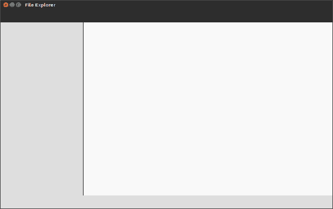

对于字体大小和相关参数，如填充，我们使用相对单位（em）。这意味着我们将这些值相对于父字体大小设置：

`.component { font-size: 10px; } .component__part { font-size: 1.6em; /* 计算后的字体大小为 10*1.6=16px */ }`

这个技巧可以让我们有效地扩展组件。例如，当使用**响应式 Web 设计**（**RWD**）方法时，我们可能需要按比例减小较小视口宽度的字体大小和间距。使用 ems 时，我们只需为目标组件更改字体大小，从而使从属规则的值适应。

# 定义 CSS 变量

NW.js 的发布频率相当高，基本上会随着每个新版本的 Chromium 更新。这意味着我们可以安全地使用最新的 CSS 功能。我最感兴趣的是**自定义属性**（[`www.w3.org/TR/css-variables`](https://www.w3.org/TR/css-variables)），它们以前被称为 CSS 变量。

实际上，变量是 CSS 预处理器存在的主要原因之一。使用 NW.js，我们可以在 CSS 中本地设置变量，如下所示：

```js
--color-text: #8da3c5; 
--color-primary: #189ac4; 

```

之后，我们可以在文档范围内的所有模块中使用变量而不是实际值：

```js
.post__title { 
  color: var(--color-primary); 
} 
.post__content { 
  color: var(--color-text); 
} 

```

因此，如果我们现在决定更改其中一个定义的颜色，我们只需要做一次，任何依赖于该变量的规则都会接收到新值。让我们为我们的应用程序采用这项技术。

首先，我们需要为模块创建定义：

`./assets/css/Base/defenitions.css`

```js
:root { 
  --titlebar-bg-color: #2d2d2d; 
  --titlebar-fg-color: #dcdcdc; 
  --dirlist-bg-color: #dedede; 
  --dirlist-fg-color: #636363; 
  --filelist-bg-color: #f9f9f9; 
  --filelist-fg-color: #333341; 
  --dirlist-w: 250px; 
  --titlebar-h: 40px; 
  --footer-h: 40px; 
  --footer-bg-color: #dedede; 
  --separator-color: #2d2d2d; 
} 

```

在这里，我们在根范围内定义了代表颜色和固定尺寸的变量。这个新文件被包含在 CSS 索引文件中：

`./assets/css/app.css`：

```js
@import url("./Base/defenitions.css"); 
... 

```

然后，我们需要修改我们的组件。首先，我们要处理顶层应用程序布局：

`./assets/css/Component/l-app.css`

```js
.l-app { 
  display: flex; 
  flex-flow: column nowrap; 
  align-items: stretch; 
} 

.l-app__titlebar { 
  flex: 0 0 var(--titlebar-h); 
} 

.l-app__main { 
  flex: 1 1 auto; 
} 

.l-app_footer { 
  flex: 0 0 var(--footer-h); 
} 

```

然后，我们布局由目录和文件列表组成的主要部分的两列：

`./assets/css/Component/l-main.css`

```js
.l-main { 
  display: flex; 
  flex-flow: row nowrap; 
  align-items: stretch; 
} 

.l-main__dir-list { 
  flex: 0 0 var(--dirlist-w); 
} 

.l-main__file-list { 
  flex: 1 1 auto; 
} 

```

我们样式化页眉：

`./assets/css/Component/titlebar.css`

```js
.titlebar { 
  background-color: var(--titlebar-bg-color); 
  color: var(--titlebar-fg-color); 
  padding: 0.8em 0.6em; 
} 

```

和页脚：

`./assets/css/Component/footer.css`

```js
.footer { 
  border-top: 1px solid var(--separator-color); 
  background-color: var(--footer-bg-color); 
  padding: 0.4em 0.6em; 
} 

```

我们还需要为主要部分的子组件设置颜色。因此，样式化文件列表组件：

`./assets/css/Component/file-list.css`

```js
.file-list { 
  background-color: var(--filelist-bg-color); 
  color: var(--filelist-fg-color); 
} 

```

和目录列表组件：

`./assets/css/Component/dir-list.css`

```js
.dir-list { 
  background-color: var(--dirlist-bg-color); 
  color: var(--dirlist-fg-color); 
  border-right: 1px solid var(--separator-color); 
} 

```

我们可以运行应用程序来观察它看起来是一样的。所有颜色和大小都成功地从变量中推断出来。

# 固定标题栏和页眉

布局在没有任何内容的情况下看起来很好，但如果接收到太长的内容会发生什么？

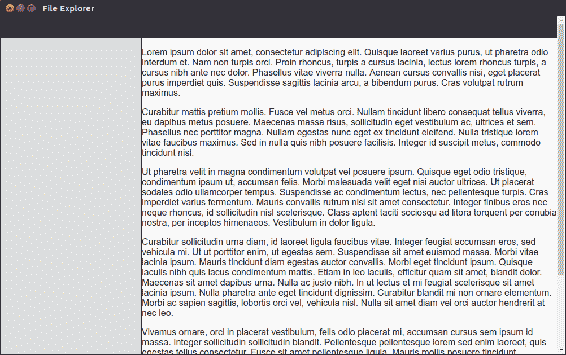

实际上，当滚动时，我们会有一个头部和页脚移出视图。这看起来不够用户友好。幸运的是，我们可以轻松地使用 CSS 的另一个新功能**Sticky positioning**（[`www.w3.org/TR/css-position-3/#sticky-pos`](https://www.w3.org/TR/css-position-3/#sticky-pos)）来改变它。

我们需要做的就是稍微修改标题栏组件：

`./assets/css/Component/titlebar.css`

```js
.titlebar { 
  ... 
  position: sticky; 
  top: 0; 
} 

```

和页脚：

`./assets/css/Component/footer.css`

```js
.footer { 
  ... 
  position: sticky; 
  bottom: 0; 
} 

```

在前面的代码中，我们声明标题栏将固定在顶部，页脚将固定在底部。现在运行应用程序，你会注意到两个框始终可见，无论滚动如何：

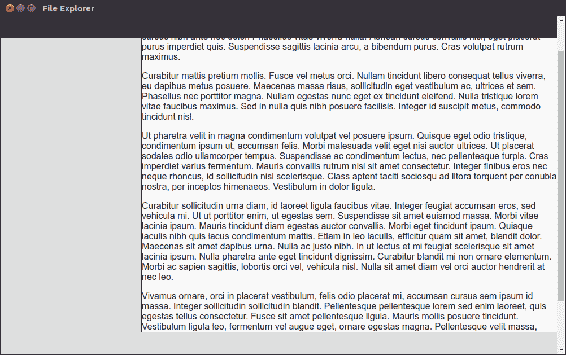

# 样式化标题栏

说到视图内容，我们已经准备好填充布局插槽。我们将从标题栏开始：

`./index.html`

```js
<header class="l-app__titlebar titlebar"> 
  <span class="titlebar__path">/home/sheiko/Sites/file-explorer</span> 
  <a class="titlebar__btn"  >_</a> 
  <a class="titlebar__btn is-hidden" > </a> 
  <a class="titlebar__btn" ></a> 
  <a class="titlebar__btn" ></a> 
</header> 

```

基本上，我们希望当前路径显示在左侧，窗口控件显示在右侧。这可以通过 Flexbox 实现。这是一个不会被重用的小型布局，因此如果我们将其混合到组件模块中，也不会有什么问题：

`./assets/css/Component/titlebar.css`

```js
.titlebar { 
  ... 
  display: flex; 
  flex-flow: row nowrap; 
  align-items: stretch; 
} 
.titlebar__path { 
  flex: 1 1 auto; 
} 
.titlebar__btn { 
  flex: 0 0 25px; 
  cursor: pointer; 
} 

```

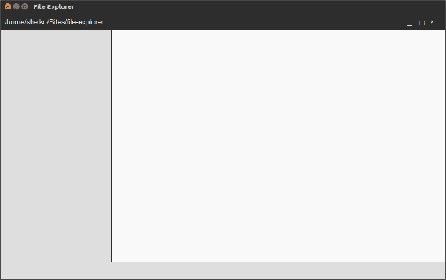

# 样式化目录列表

目录列表将用于浏览文件系统，因此我们将其包装在`nav > ul`结构中：

`./index.html`

```js
<aside class="l-main__dir-list dir-list"> 
  <nav> 
    <ul> 
      <li class="dir-list__li">..</li> 
      <li class="dir-list__li">assets</li> 
      <li class="dir-list__li">js</li> 
      <li class="dir-list__li">node_modules</li> 
      <li class="dir-list__li">tests</li></ul> 
  </nav> 
</aside> 

```

为了支持它的样式，我们使用以下代码：

`./assets/css/Component/dir-list.css`

```js
.dir-list__li { 
  padding: 0.8em 0.6em; 
  cursor: pointer; 
  white-space: nowrap; 
  overflow: hidden; 
  text-overflow: ellipsis; 
} 

.dir-list__li:hover { 
  background-color: var(--dirlist-bg-hover-color); 
  color: var(--dirlist-fg-hover-color); 
} 

```

请注意，我们只是引入了一些变量。让我们在定义模块中添加它们：

`./assets/css/Base/definitions.css`

```js
  --dirlist-bg-hover-color: #d64937; 
  --dirlist-fg-hover-color: #ffffff; 

```

当我们运行应用程序时，我们可以观察到目录列表中的新内容：

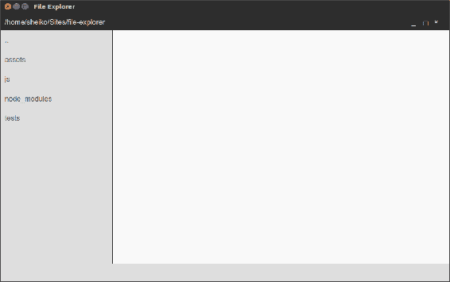

# 样式化文件列表

文件列表将被表示为表格，但我们将使用无序列表构建它。`./index.html`文件包含以下代码：

```js
<main class="l-main__file-list file-list"> 
  <nav> 
    <ul> 
      <li class="file-list__li file-list__head"> 
      <span class="file-list__li__name">Name</span> 
      <span class="file-list__li__size">Size</span> 
      <span class="file-list__li__time">Modified</span> 
      </li> 
      <li class="file-list__li"> 
        <span class="file-list__li__name">index.html</span> 
        <span class="file-list__li__size">1.71 KB</span> 
        <span class="file-list__li__time">3/3/2017, 15:44:19</span> 
      </li> 
      <li class="file-list__li"> 
        <span class="file-list__li__name">package.json</span> 
        <span class="file-list__li__size">539 B</span> 
        <span class="file-list__li__time">3/3/2017, 17:53:19</span> 
      </li> 
    </ul> 
  </nav> 
</main> 

```

实际上，这里**Grid Layout**（[`www.w3.org/TR/css3-grid-layout/`](https://www.w3.org/TR/css3-grid-layout/)）可能更合适；然而，在撰写本文时，NW.js 中尚未提供此 CSS 模块。因此，我们继续使用 Flexbox：

`./assets/css/Component/file-list.css`

```js
.file-list { 
  background-color: var(--filelist-bg-color); 
  color: var(--filelist-fg-color); 
  cursor: pointer; 
} 

.file-list__li { 
  display: flex; 
  flex-flow: row nowrap; 
} 

.file-list__li:not(.file-list__head){ 
  cursor: pointer; 
} 
.file-list__li:not(.file-list__head):hover { 
  color: var(--filelist-fg-hover-color); 
} 
.file-list__li > * { 
  flex: 1 1 auto; 
  padding: 0.8em 0.8em; 
  overflow: hidden; 
} 

.file-list__li__name { 
  white-space: nowrap; 
  text-overflow: ellipsis; 
  width: 50%; 
} 
.file-list__li__time { 
  width: 35%; 
} 
.file-list__li__size { 
  width: 15%; 
} 

```

我相信前面的代码都很清楚，除非你可能不熟悉`伪类:not()`。我想在悬停时改变所有文件列表项的颜色和鼠标指针，但不包括表头。因此，我使用了一个选择器，可以读作任何`.file-list__li`，但不是`.file-list__head`。

以下任务分配给定义文件：

`./assets/css/Base/definitions.css`

```js
--filelist-fg-hover-color: #d64937; 

```

当我们运行应用程序时，我们可以看到带有文件列表的表格：

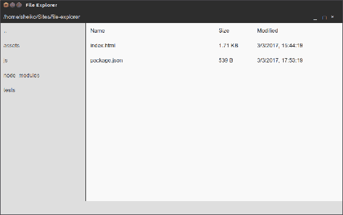

# 样式化页脚

最后，我们现在到达了页脚：

`./index.html`

```js
... 
<footer class="l-app__footer footer"> 
  <h2 class="footer__header">File Explorer</h2> 
  <select class="footer__select"> 
    <option value="en-US">English</option> 
    <option value="de-DE">Deutsch</option> 
  </select> 
</footer> 

```

我们将应用程序标题排列到左侧，语言选择器排列到右侧。我们用什么来布局？显然是 Flexbox：

`./assets/css/Component/footer.css`

```js
.footer { 
 ... 
  display: flex; 
  flex-flow: row nowrap; 
  justify-content: flex-end; 
} 

.footer__header { 
  margin: 0.2em auto 0 0; 
  font-size: 1em; 
} 

```

这是一个特殊情况。通常我们设置项目右对齐，但已经重置了`.footer__header`项目，它紧贴着由`margin-right: auto`驱动的左边框：

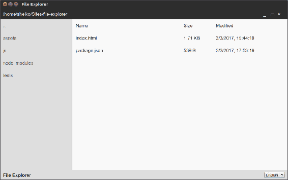

在查看结果时，我认为强调一些 UI 元素的功能含义与图标会很好。我个人更喜欢**Material Design 系统**的图标字体（[`material.io/icons/`](https://material.io/icons/)）。因此，如开发人员指南中所述（[`google.github.io/material-design-icons/`](http://google.github.io/material-design-icons/)），我们将相应的 Google Web 字体包含到`index.html`中：

`./index.html`

```js
<link href="https://fonts.googleapis.com/icon?family=Material+Icons" 
      rel="stylesheet"> 

```

我建议您专门为代表图标的组件分配一个规则集，并使用 Material Design 建议的规则集填充它：

`./assets/css/Component/icon.css`

```js
.icon { 
  font-family: 'Material Icons'; 
  font-weight: normal; 
  font-style: normal; 
  font-size: 16px; 
  display: inline-block; 
  line-height: 1; 
  text-transform: none; 
  letter-spacing: normal; 
  word-wrap: normal; 
  white-space: nowrap; 
  direction: ltr; 
  -webkit-font-smoothing: antialiased; 
  text-rendering: optimizeLegibility; 
} 

```

现在，我们可以在 HTML 中的任何位置添加一个图标，就是这么简单：

```js
<i class="material-icons">thumb_up</i> 

```

那么为什么不在目录列表中的项目旁边加上一个文件夹图标呢？：

```js
<li class="dir-list__li"><i class="icon">folder</i>assets</li> 

```

我相信地球仪图标会与语言选择器很好地配合。所以我们修改 HTML：

`./index.html`

```js
... 
<footer class="l-app__footer footer"> 
   <h2 class="footer__header">File Explorer</h2> 
   <label class="icon footer__label">language</label> 
          .... 

```

然后我们在 CSS 中添加一个类：

`./assets/css/Component/footer.css`

```js
... 
.footer__label { 
  margin-right: 0.2em; 
  font-size: 1.4em; 
  margin-top: 0.1em; 
} 

```

当我们运行应用程序时，我们可以看到一个图标呈现在语言选择器控件旁边：

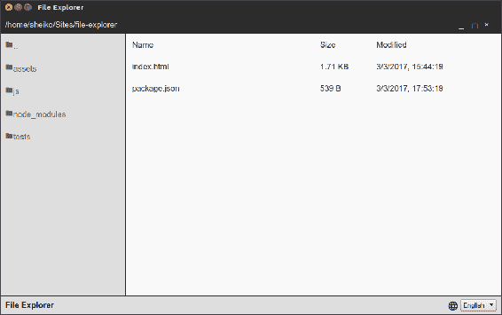

如果在运行应用程序后出现问题，您可以随时调用开发者工具--只需按下* F12 *：

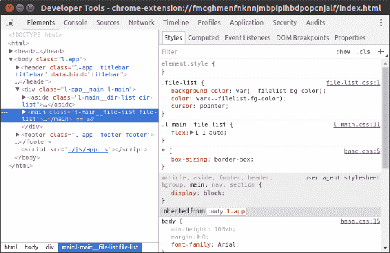

# 满足功能要求

我们已经用 HTML 描述了应用程序的语义结构。我们已经用 CSS 定义了我们的 UI 元素应该是什么样子。现在，我们将教会我们的应用程序检索和更新内容，并响应用户事件。实际上，我们将把以下任务分配给几个模块：

+   `DirService`：这提供了对目录导航的控制

+   `FileService`：这处理文件操作

+   `FileListView`：这使用 DirService 接收到的数据更新文件列表，使用 FileService 处理用户事件（打开文件，删除文件等）

+   `DirListView`：这使用 DirService 接收到的数据更新目录列表，并使用 DirService 处理导航事件

+   `TitleBarPath`：这使用 DirService 接收到的路径更新当前位置

+   `TitleBarActions`：这处理用户与标题栏按钮的交互

+   `LangSelector`：这处理用户与语言选择器的交互

但在我们开始编码之前，让我们看看我们的工具库中有什么。

NW.js 与最新稳定版本的 Node.js 一起分发，Node.js 对 ES2015/ES2016 有很好的支持（[`node.green`](http://node.green)）。这意味着我们可以使用任何内在的新 JavaScript 特性，但模块（[`bit.ly/2moblwB`](http://bit.ly/2moblwB)）。Node.js 有自己的 CommonJS 兼容模块加载系统。当我们按路径请求一个模块，例如`require（“./foo”）`，运行时会搜索相应的文件（`foo.js`，`foo.json`或`foo.node`）或目录（`./foo/index.js`）。然后，Node.js 评估模块代码并返回导出的类型。

例如，我们可以创建一个导出字符串的模块：

`./foo.js`

```js
console.log( "foo runs" ); 
exports.message = "foo's export"; 

```

还有另一个，从第一个模块导入：

`./bar.js`

```js
const foo = require( "./foo" ); 
console.log( foo.message ); 

```

如果我们运行它，我们会得到以下结果：

```js
$node bar.js
foo runs
foo's export

```

这里应该注意的是，无论我们需要一个模块多少次，它只会执行一次，并且每次都会从缓存中获取其导出。

# 从 ES2015 开始

正如我已经提到的，NW.js 完全支持 ES2015 和 ES2016 版本的 JavaScript。要理解它的真正含义，我们需要简要回顾一下这种语言的历史。JavaScript 的标准规范首次发布于 1997 年（ECMA-262 第 1 版）。

从那时起，语言在 10 年内并没有真正改变。2007 年提出的第 4 版呼吁进行重大改变。然而，工作组（TC39）未能就功能集达成一致意见。一些提案被认为对 Web 不利，但有些被采纳到了一个名为 Harmony 的新项目中。该项目成为了语言规范的第 6 版，并于 2015 年以 ES2015 的官方名称发布。现在，委员会每年都会发布一个新的规范。

新的 JavaScript 向后兼容较早的版本。因此，您仍然可以使用 ECMAScript 第 5 版甚至第 3 版的语法编写代码，但为什么我们要放弃使用新的高级语法和功能集的机会呢？我认为如果我们现在了解一些将在应用程序中使用的新语言方面将会很有帮助。

# 作用域

在过去，我们总是使用`var`语句进行变量声明。ES2015 引入了两个新的声明变量--`let`和`const`。`var`语句在函数作用域中声明变量：

```js
(function(){ 
    var foo = 1; 
    if ( true ) { 
            var foo = 2; 
            console.log( foo ); 
    } 
    console.log( foo ); 
}()); 

```

```js
$ node es6.js
2
2

```

使用`var`声明的变量（`foo`）跨越整个函数作用域，这意味着每次我们通过名称引用它时，都会指向相同的变量。`let`和`const`都在块作用域（`if`语句，`for/while`循环等）中运行，如下所示：

```js
 (function(){ 
    let foo = 1; 
    if ( true ) { 
            let foo = 2; 
            console.log( foo ); 
    } 
    console.log( foo ); 
}()); 

```

```js
$ node es6.js
2
1

```

从上面的例子中可以看出，我们可以在块中声明一个新变量，它只存在于该块中。`const`语句的工作方式相同，只是它定义了一个在声明后不能重新分配的常量。

# 类

JavaScript 暗示了一种基于原型的面向对象编程风格。它与其他流行的编程语言（如 C++、C#、Objective-C、Java 和 PHP）中使用的基于类的 OOP 不同。这常常让新手开发人员感到困惑。ES2015 为原型提供了一种语法糖，看起来非常像经典类：

```js

class Machine { 
    constructor( name ){ 
   this.name = name; 
  } 
} 
class Robot extends Machine { 
  constructor( name ){ 
   super( name ); 
  } 
  move( direction = "left" ){ 
   console.log( this.name + " moving ", Robot.normalizeDirection( direction ) ); 
  } 
  static normalizeDirection( direction ) { 
          return direction.toLowerCase(); 
  } 
} 

const robot = new Robot( "R2D2" ); 
robot.move(); 
robot.move( "RIGHT" ); 

```

```js
$ node es6.js
R2D2 moving  left
R2D2 moving  right

```

在这里，我们声明了一个`Machine`类，在实例化期间为原型属性`name`分配一个值。`Robot`类扩展了`Machine`，因此继承了原型。在子类型中，我们可以使用`super`关键字调用父构造函数。

我们还定义了一个原型方法--`move`--和一个静态方法--`normalizeDirection`。`move`方法具有所谓的**默认函数参数**。因此，如果我们在调用 move 方法时省略方向参数，参数将自动设置为`"left"`。

在 ES2015 中，我们可以使用一种简短的语法来定义方法，而不需要在每个声明中重复函数关键字。它也适用于对象文字：

```js

const R2D2 = { 
    name: "R2D2", 
    move(){ 
            console.log( "moving" ); 
    }, 
    fly(){       
            console.log( "flying" ); 
    } 
}; 

```

# 模板文字

JavaScript 的另一个重要补充是**模板文字**。这些是可以多行的字符串文字，可以包含插入的表达式（``${expression}``）。例如，我们可以重构我们的 move 方法体，如下所示：

```js

console.log( ` 
    ${this.name} moving  ${Robot.normalizeDirection( direction )} 
` ); 

```

# 获取器和设置器

获取器和设置器在 ES5.1 中被添加。在 ES2015 中，它被扩展为计算属性名称，并与短方法符号一起使用：

```js

class Robot { 
  get nickname(){ 
   return "But you have to prove first that you belong to the Rebel 
         Alliance!"; 
  } 
  set nickname( nickname ){ 
   throw new Error( "Seriously?!" ); 
  } 
}; 

const robot = new Robot(); 
console.log( robot.nickname ); 
robot.nickname = "trashcan";  

```

```js
$ node es6.js
But you have to prove first that you belong to the Rebel Alliance!
Error: Seriously?!

```

# 箭头函数

函数声明也获得了语法糖。我们现在使用更短的语法来编写它。值得注意的是，以这种方式定义的函数（箭头函数）会自动获取周围的上下文：

```js
class Robot extends Machine { 
    //... 
  isRebel(){ 
          const ALLOWED_NAMES = [ "R2D2", "C3PO" ]; 
          return ALLOWED_NAMES.find(( name ) => { 
                return name === this.name; 
          }); 
  } 
} 

```

当使用旧的函数语法时，传递给数组方法`find`的回调函数会丢失`Robot`实例的上下文。然而，箭头函数不会创建自己的上下文，因此外部上下文（`this`）会进入闭包。

在这个特定的例子中，就像经常使用数组额外的情况一样，回调体非常简短。因此，我们可以使用更短的语法：

```js
return ALLOWED_NAMES.find( name => name === this.name ); 

```

# 解构

在新的 JavaScript 中，我们可以从数组和对象中提取特定的数据。假设我们有一个数组，可以由外部函数构建，并且我们想要它的第一个和第二个元素。我们可以这样简单地提取它们：

```js
const robots =  [ "R2D2", "C3PO", "BB8" ]; 
const [ r2d2, c3po ] = robots; 
console.log( r2d2, c3po ); 

```

在这里，我们声明了两个新的常量--`r2d2`和`c3po`--并分别将第一个和第二个数组元素赋给它们。

我们可以对对象做同样的事情：

```js
const meta = { 
    occupation: "Astromech droid", 
    homeworld: "Naboo" 
}; 

const { occupation, homeworld } = meta; 
console.log( occupation, homeworld ); 

```

我们做了什么？我们声明了两个常量--`occupation`和`homeworld`--分别从相应命名的对象成员中接收值。

而且，我们甚至可以在提取时给对象成员取别名：

```js
const { occupation: affair, homeworld: home } = meta; 
console.log( affair, home ); 

```

在最后一个示例中，我们将对象成员`occupation`和`homeworld`的值委托给新创建的常量`affair`和`home`。

# 处理窗口操作

回到`file-explorer`，我们可以从`TitleBarActions`模块开始，该模块监听标题栏按钮的用户点击事件并执行相应的窗口操作。首先，我们需要在 HTML 中标记动作节点。`./index.html`文件包含以下代码：

```js
<header class="l-app__titlebar titlebar" data-bind="titlebar"> 
  ... 
  <a class="titlebar__btn" data-bind="close" > ;</a> 
</header> 

```

在这里，我们指定了我们的边界框（`data-bind="titlebar"`）和关闭窗口按钮（`data-bind="close"`）。让我们从唯一的按钮开始。`./js/View/TitleBarActions.js`文件包含以下代码：

```js
class TitleBarActionsView { 

  constructor( boundingEl ){    
   this.closeEl = boundingEl.querySelector( "[data-bind=close]" ); 
          this.bindUi(); 
  } 

    bindUi(){ 
          this.closeEl.addEventListener( "click", this.onClose.bind( this ), false ); 
    } 

  onClose( e ) { 
   e.preventDefault(); 
   nw.Window.get().close(); 
  } 
} 

exports.TitleBarActionsView = TitleBarActionsView; 

```

在这里，我们定义了一个`TitleBarActionView`类，它接受一个 HTML 元素作为参数。这个元素表示视图的边界框，这意味着这个类的实例只会处理传入的元素及其后代。在构造过程中，该类将在边界框范围内搜索与`selector [data-bind=close]`匹配的第一个元素--标题栏的关闭窗口按钮。在`bindUI`方法中，我们订阅了关闭按钮的点击事件。当按钮被点击时，`onClose`方法将在`TitleBarActionView`实例的上下文中被调用，因为我们在`bindUi`中绑定了它（`this.onClose.bind( this )`）。`onClose`方法使用 NW.js Window API（[`docs.nwjs.io/en/latest/References/Window/`](http://docs.nwjs.io/en/latest/References/Window/)）关闭窗口，即请求当前窗口对象`nw.Window.get()`并调用其 close 方法。

NW.js 没有为 API 提供模块，而是在全局范围内暴露了`nw`变量。

因此，我们有了第一个视图模块，并可以在主脚本中使用它：

`./js/app.js`

```js
const { TitleBarActionsView } = require( "./js/View/TitleBarActions" ); 

new TitleBarActionsView( document.querySelector( "[data-bind=titlebar]" ) ); 

```

在这里，我们从`./js/View/TitleBarActions`模块中导入`TileBarActionView`类并创建一个实例。我们将第一个匹配选择器`[data-bind=titlebar]`的文档元素传递给类构造函数。

你注意到我们在从模块中导入时使用了解构吗？特别是，我们将`TitleBarActionsView`类提取到了一个相应命名的常量中。

现在，我们可以启动应用程序并观察，当点击关闭按钮时，窗口确实关闭了。

进一步，我们要处理其他标题栏按钮。因此，我们调整我们的`index.html`文件以识别按钮，使用`data-bind`属性的`unmaximize`、`maximize`和`minimize`值来标识节点。然后，在`TileBarActionView`构造函数中收集对应的 HTML 元素的引用：

```js
this.unmaximizeEl = boundingEl.querySelector( "[data-bind=unmaximize]" ); 
this.maximizeEl = boundingEl.querySelector( "[data-bind=maximize]" ); 
this.minimizeEl = boundingEl.querySelector( "[data-bind=minimize]" ); 

```

当然，我们必须在`bindUi`模块中添加新的监听器：

```js
this.minimizeEl.addEventListener( "click", this.onMinimize.bind( this ), false ); 
this.maximizeEl.addEventListener( "click", this.onMaximize.bind( this ), false ); 
this.unmaximizeEl.addEventListener( "click", this.onUnmaximize.bind( this ), false ); 

```

最小化窗口按钮的处理程序看起来与我们之前已经检查过的处理程序非常相似。它只是使用了 NW.js Window API 的相应方法：

```js
onMinimize( e ) { 
    e.preventDefault(); 
    nw.Window.get().minimize(); 
} 

```

对于最大化和最小化（还原）窗口按钮，我们需要考虑到一个按钮可见时，另一个按钮应该隐藏的事实。我们可以通过`toggleMaximize`方法实现这一点：

```js
toggleMaximize(){ 
    this.maximizeEl.classList.toggle( "is-hidden" ); 
    this.unmaximizeEl.classList.toggle( "is-hidden" ); 
} 

```

这些按钮的事件处理程序调用此方法来切换按钮视图：

```js

onUnmaximize( e ) { 
    e.preventDefault(); 
    nw.Window.get().unmaximize(); 
    this.toggleMaximize(); 
} 

onMaximize( e ) { 
    e.preventDefault(); 
    nw.Window.get().maximize(); 
    this.toggleMaximize(); 
} 

```

# 编写一个用于浏览目录的服务

其他模块，如`FileListView`、`DirListView`和`TitleBarPath`，从文件系统中获取数据，如目录列表、文件列表和当前路径。因此，我们需要创建一个服务来提供这些数据：

`./js/Service/Dir.js`

```js
const fs = require( "fs" ), 
      { join, parse } = require( "path" ); 

class DirService  { 

  constructor( dir = null ){ 
    this.dir = dir || process.cwd(); 
  } 

  static readDir( dir ) { 
    const fInfoArr = fs.readdirSync( dir, "utf-8" ).map(( fileName ) => { 
      const filePath = join( dir, fileName ), 
            stats = DirService.getStats( filePath ); 
      if ( stats === false ) { 
        return false; 
      } 
      return { 
        fileName, 
        stats 
      }; 
    }); 
    return fInfoArr.filter( item => item !== false ); 
  } 

  getDirList() { 
    const collection = DirService.readDir( this.dir ).filter(( fInfo ) 
         => fInfo.stats.isDirectory() ); 
    if ( !this.isRoot() ) { 
      collection.unshift({ fileName: ".." }); 
    } 
    return collection; 
  } 

  getFileList() { 
    return DirService.readDir( this.dir ).filter(( fInfo ) => 
        fInfo.stats.isFile() ); 
  } 

  isRoot(){ 
    const { root } = parse( this.dir ); 
    return ( root === this.dir ); 
  } 

  static getStats( filePath ) { 
    try { 
      return fs.statSync( filePath ); 
    } catch( e ) { 
      return false; 
    } 
  } 

}; 

exports.DirService = DirService; 

```

首先，我们导入 Node.js 核心模块`fs`，它为我们提供了对文件系统的访问。我们还从`path`模块中提取函数--`join`和`parse`。我们将需要它们来操作文件/目录路径。

然后，我们声明`DirService`类。在构造时，它创建一个`dir`属性，该属性接受传入的值或当前工作目录（`process.cwd()`）。我们向类添加了一个静态方法--`readDir`--用于读取给定位置的目录内容。`fs.readdirSync`方法检索目录的内容，但我们扩展了文件/目录统计信息（`https://nodejs.org/api/fs.html#fs_class_fs_stats`）。如果无法获取统计信息，我们将其数组元素替换为`false`。为了避免输出数组中的这种间隙，我们将运行数组`filter`方法。因此，在退出点上，我们有一个干净的文件名和文件统计信息数组。

`getFileList`方法请求`readDir`获取当前目录内容，并过滤列表，只留下其中的文件。

`getDirList`方法显然是仅对目录进行过滤。此外，它在列表前面加上一个`..`目录，用于向上导航，但只有在我们不在系统根目录时才这样做。

因此，我们可以从使用它们的模块中获取这两个列表。当位置更改并且新的目录和文件列表可用时，这些模块中的每个模块都必须进行更新。为了实现它，我们将使用观察者模式：

`./js/Service/Dir.js`

```js
//.... 
const EventEmitter = require( "events" ); 

class DirService extends EventEmitter { 

  constructor( dir = null ){ 
   super(); 
   this.dir = dir || process.cwd(); 
  } 
  setDir( dir = "" ){ 
   let newDir = path.join( this.dir, dir ); 
   // Early exit 
   if ( DirService.getStats( newDir ) === false ) { 
   return; 
   } 
   this.dir = newDir; 
   this.notify(); 
  } 

  notify(){ 
   this.emit( "update" ); 
  } 
  //... 
} 

```

我们从事件、核心模块中导出`EventEmitter`类（`https://nodejs.org/api/events.html`）。通过将其与`DirService`扩展，我们使服务成为事件发射器。这使我们有可能触发服务事件并订阅它们：

```js
dirService.on( "customEvent", () => console.log( "fired customEvent" )); 
dirService.emit( "customEvent" ); 

```

因此，每当调用`setDir`方法更改当前位置时，它会触发类型为`"update"`的事件。假设消费模块已订阅，它们会通过更新其视图来响应事件。

# 单元测试服务

我们已经编写了一个服务，并假设它满足了功能要求，但我们还不确定。为了检查它，我们将创建一个单元测试。

到目前为止，我们还没有任何测试环境。我建议使用**Jasmine**测试框架（[`jasmine.github.io/`](https://jasmine.github.io/)）。我们将在`tests/unit-tests`子文件夹中创建一个专用的 NW.js 项目，用于测试。这样，我们就可以获得与应用程序中相同的测试运行环境。

因此，我们创建测试项目清单：

`./tests/unit-tests/package.json`

```js
{ 
  "name": "file-explorer", 
  "main": "specs.html", 
  "chromium-args": "--mixed-context" 
} 

```

它指向 Jasmine 测试运行器页面，就是我们放在`package.json`旁边的那个：

`./tests/unit-tests/specs.html`

```js
<!doctype html> 
<html> 
<head> 
    <meta charset="utf-8"> 
    <title>Jasmine Spec Runner</title> 
    <link rel="stylesheet" type="text/css" href="https://cdnjs.cloudflare.com/ajax/libs/jasmine/2.5.2/jasmine.css"> 
    <script src="img/jasmine.js"></script> 
    <script src="img/jasmine-
      html.js"></script> 
    <script src="img/boot.js"></script> 
</head> 
<body> 
  <div id="sandbox" style="display: none"></div> 
    <script> 
      // Catch exception and report them to the console. 
      process.on( "uncaughtException", ( err ) => console.error( err ) ); 
      const path = require( "path" ), 
            jetpack = require( "fs-jetpack" ), 
            matchingSpecs = jetpack.find( "../../js", { 
                matching: [ 
                  "*.spec.js", 
                  "!node_modules/**" 
                ] 
            }, "relativePath" ); 

      matchingSpecs.forEach(( file ) => { 
        require( path.join( __dirname, file ) ); 
      }); 
    </script> 
</body> 
</html> 

```

这个跑步者做什么？它加载 Jasmine，并借助`fs-jetpack` npm 模块（[`www.npmjs.com/package/fs-jetpack`](https://www.npmjs.com/package/fs-jetpack)）递归遍历源目录，查找所有与`"*.spec.js"`模式匹配的文件。所有这些文件都被添加到测试套件中。因此，它假设我们将测试规范保存在目标源模块旁边。

`fs-jetpack`是一个外部模块，我们需要安装该包并将其添加到开发依赖列表中：

```js
npm i -D fs-jetpack

```

Jasmine 实现了一个广泛使用的前端开发测试范式**行为驱动开发**（**BDD**），可以用以下模式描述：

```js

describe( "a context e.g. class or module", () => { 
  describe( "a context e.g. method or function", () => { 
    it( "does what expected", () => { 
       expect( returnValue ).toBe( expectedValue ); 
    }); 
  }); 
}); 

```

正如单元测试中通常接受的那样，一个套件可能有设置和拆卸：

```js
beforeEach(() => { 
  // something to run before to every test 
}); 
afterEach(() => { 
  // something to run after to every test 
}); 

```

在测试涉及到触及文件系统、跨网络通信或与数据库交互的服务时，我们必须小心。一个好的单元测试是独立于环境的。因此，为了测试我们的`DirService`，我们必须模拟文件系统。让我们测试服务类的`getFileList`方法，看看它的作用：

`./js/Service/Dir.spec.js`

```js
const { DirService } = require( "./Dir" ), 
      CWD = process.cwd(), 
      mock = require( "mock-fs" ), 
      { join } = require( "path" ); 

describe( "Service/Dir", () => { 

  beforeEach(() => { 
    mock({ 
     foo: { 
        bar: { 
          baz: "baz", // file contains text baz 
          qux: "qux" 
        } 
     } 
    }); 
  }); 
  afterEach( mock.restore ); 

  describe( "#getFileList", () => { 
    it( "receives intended file list", () => { 
       const service = new DirService( join( "foo", "bar" ) ); 
       service.setDir( "bar" ); 
       let files = service.getFileList(); 
       expect( files.length ).toBe( 2 ); 
    }); 
    it( "every file has expected properties", () => { 
       const service = new DirService( join( "foo", "bar" ) ); 
       const files = service.getFileList(); 
       console.log( files ); 
       const [ file ] = files; 
       expect( file.fileName ).toBe( "baz" ); 
       expect( file.stats.size ).toBe( 3 ); 
       expect( file.stats.isFile() ).toBe( true ); 
       expect( file.stats.isDirectory() ).toBe( false ); 
       expect( file.stats.mtime ).toBeTruthy(); 
    }); 
  }); 
}); 

```

在运行测试之前，我们将`fs`方法指向包含`baz`和`qux`文件的`/foo/bar/`虚拟文件系统。每次测试后，我们都会恢复对原始文件系统的访问。在第一个测试中，我们在`foo/bar`位置实例化服务，并使用`getFileList()`方法读取内容。我们断言找到的文件数量为`2`（正如我们在`beforeEach`中定义的）。在第二个测试中，我们取列表的第一个元素，并断言它包含预期的文件名和状态。

由于我们使用了外部的 npm 包（[`www.npmjs.com/package/mock-fs`](https://www.npmjs.com/package/mock-fs)）进行模拟，我们需要安装它：

```js
npm i -D mock-fs

```

当我们想出第一个测试套件时，我们可以修改项目清单文件以获得适当的测试运行程序脚本。`./package.json`文件包含以下代码：

```js
{ 
  ... 
  "scripts": { 
    ... 
    "test": "nw tests/unit-tests" 
  }, 
  ... 
} 

```

现在，我们可以运行测试：

```js
npm test

```

NW.js 将加载并呈现以下屏幕：

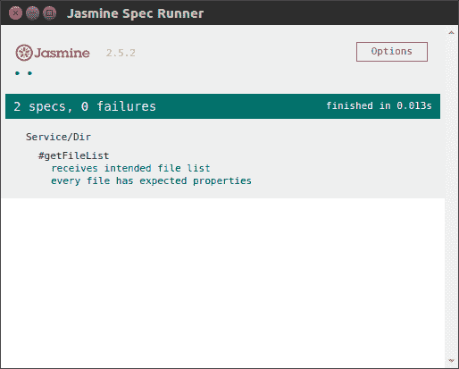

理想情况下，单元测试覆盖上下文中所有可用的函数/方法。我相信从前面的代码中，你会对如何编写测试有所了解。但是，你可能会在测试`EventEmitter`接口时遇到困难；考虑这个例子：

```js

describe( "#setDir", () => { 
  it( "fires update event", ( done ) => { 
     const service = new DirService( "foo" ); 
     service.on( "update", () => { 
       expect( true ).toBe( true ); 
       done(); 
     }); 
     service.notify(); 
  }); 
}); 

```

`EventEmitter`工作是异步的。当测试体中有异步调用时，我们必须明确告知 Jasmin 测试何时准备好，以便框架可以继续进行下一个测试。当我们调用传递给其函数的回调时，就会发生这种情况。在前面的示例中，我们订阅了服务上的`"update"`事件，并调用`notify`来触发事件。一旦捕获到事件，我们就调用`done`回调。

# 编写视图模块

好吧，我们有了服务，所以我们可以实现使用它的视图模块。但是，首先我们必须在 HTML 中标记视图的边界框：

`./index.html`

```js
<span class="titlebar__path" data-bind="path"></span> 
.. 
<aside class="l-main__dir-list dir-list"> 
  <nav> 
    <ul data-bind="dirList"></ul> 
  </nav> 
</aside> 
<main class="l-main__file-list file-list"> 
  <nav> 
    <ul data-bind="fileList"></ul> 
  </nav> 
</main> 

```

# DirList 模块

对于`DirList`视图，我们的要求是什么？它会呈现当前路径中的目录列表。当用户从列表中选择一个目录时，它会更改当前路径。随后，它会更新列表以匹配新位置的内容：

`./js/View/DirList.js`

```js
class DirListView { 

  constructor( boundingEl, dirService ){ 
    this.el = boundingEl; 
    this.dir = dirService; 
    // Subscribe on DirService updates 
    dirService.on( "update", () => this.update( dirService.getDirList() ) ); 
  } 

  onOpenDir( e ){ 
    e.preventDefault(); 
    this.dir.setDir( e.target.dataset.file ); 
  } 

  update( collection ) { 
    this.el.innerHTML = ""; 
    collection.forEach(( fInfo ) => { 
      this.el.insertAdjacentHTML( "beforeend", 
        `<li class="dir-list__li" data-file="${fInfo.fileName}"> 
         <i class="icon">folder</i> ${fInfo.fileName}</li>` ); 
    }); 
    this.bindUi(); 
  } 

  bindUi(){ 
    const liArr = Array.from( this.el.querySelectorAll( "li[data-file]" ) ); 
    liArr.forEach(( el ) => { 
      el.addEventListener( "click", e => this.onOpenDir( e ), false ); 
    }); 
  } 
} 

exports.DirListView = DirListView; 

```

在类构造函数中，我们订阅了`DirService`的`"update"`事件。因此，每次事件触发时视图都会更新。`update`方法执行视图更新。它用从`DirService`接收到的数据构建的列表项填充边界框。完成后，它调用`bindUi`方法来订阅`openDir`处理程序，以便在新创建的项目上进行单击事件。正如你所知，`Element.querySelectorAll`返回的不是数组，而是非实时的`NodeList`集合。它可以在`for..of`循环中迭代，但我更喜欢`forEach`数组方法。这就是为什么我将`NodeList`集合转换为数组的原因。

`onOpenDir`处理程序方法从`data-file`属性中提取目标目录名称，并将其传递给`DirList`以更改当前路径。

现在，我们有了新的模块，所以我们需要在`app.js`中初始化它们：

`./js/app.js`

```js
const { DirService } = require( "./js/Service/Dir" ), 
      { DirListView } = require( "./js/View/DirList" ), 
      dirService = new DirService(); 

new DirListView( document.querySelector( "[data-bind=dirList]" ), dirService ); 

dirService.notify(); 

```

在这里，我们需要新的操作类，创建服务的实例，并将其与视图边界框元素一起传递给`DirListView`构造函数。在脚本的末尾，我们调用`dirService.notify()`来使所有可用的视图更新为当前路径。

现在，我们可以运行应用程序，并观察随着我们在文件系统中导航，目录列表如何更新：

```js
npm start 

```

# 单元测试视图模块

看起来，我们期望编写单元测试，不仅仅是针对服务，还包括其他模块。在测试视图时，我们必须检查它是否对指定的事件做出了正确的响应：

`./js/View/DirList.spec.js`

```js
const { DirListView } = require( "./DirList" ), 
      { DirService } = require( "../Service/Dir" ); 

describe( "View/DirList", function(){ 

  beforeEach(() => { 
    this.sandbox = document.getElementById( "sandbox" ); 
    this.sandbox.innerHTML = `<ul data-bind="dirList"></ul>`; 
  }); 

  afterEach(() => { 
    this.sandbox.innerHTML = ``; 
  }); 

  describe( "#update", function(){ 
    it( "updates from a given collection", () => { 
      const dirService = new DirService(), 
            view = new DirListView( this.sandbox.querySelector( "[data-bind=dirList]" ), dirService ); 
      view.update([ 
        { fileName: "foo" }, { fileName: "bar" } 
      ]); 
      expect( this.sandbox.querySelectorAll( ".dir-list__li" ).length ).toBe( 2 ); 
    }); 
  }); 
}); 

```

如果你还记得测试运行器 HTML 中，我们有一个带有`sandbox`id 的隐藏`div`元素。在每个测试之前，我们用视图期望的 HTML 片段填充该元素。因此，我们可以将视图指向带有 sandbox 的边界框。

创建视图实例后，我们可以调用其方法，并向其提供任意输入数据（这里是要更新的集合）。在测试结束时，我们断言该方法是否在沙盒内生成了预期的元素。

在前面的测试中，为了简单起见，我直接向视图的更新方法注入了一个固定的数组。一般来说，最好使用**Sinon**库（[`sinonjs.org/`](http://sinonjs.org/)）来存根`DirService`的`getDirList`。这样，我们也可以通过调用`DirService`的`notify`方法来测试视图的行为--就像在应用程序中发生的那样。

# 文件列表模块

处理文件列表的模块与我们刚刚审查的模块非常相似：

`./js/View/FileList.js`

```js
const filesize = require( "filesize" ); 

class FileListView { 

  constructor( boundingEl, dirService ){ 
    this.dir = dirService; 
    this.el = boundingEl; 
    // Subscribe on DirService updates 
    dirService.on( "update", () => this.update( 
    dirService.getFileList() ) ); 
  } 

  static formatTime( timeString ){ 
    const date = new Date( Date.parse( timeString ) ); 
    return date.toDateString(); 
  } 

  update( collection ) { 
    this.el.innerHTML = `<li class="file-list__li file-list__head"> 
        <span class="file-list__li__name">Name</span> 
        <span class="file-list__li__size">Size</span> 
        <span class="file-list__li__time">Modified</span> 
      </li>`; 
    collection.forEach(( fInfo ) => { 
      this.el.insertAdjacentHTML( "beforeend", `<li class="file-
           list__li" data-file="${fInfo.fileName}"> 
        <span class="file-list__li__name">${fInfo.fileName}</span> 
        <span class="file-list__li__size">${filesize(fInfo.stats.size)}</span> 
        <span class="file-list__li__time">${FileListView.formatTime( 
             fInfo.stats.mtime )}</span> 
      </li>` ); 
    }); 
    this.bindUi(); 
  } 

  bindUi(){ 
    Array.from( this.el.querySelectorAll( ".file-list__li" ) 
    ).forEach(( el ) => { 
      el.addEventListener( "click", ( e ) => { 
        e.preventDefault(); 
        nw.Shell.openItem( this.dir.getFile( el.dataset.file ) ); 
      }, false ); 
    }); 
  } 

} 

exports.FileListView = FileListView; 

```

在前面的代码中，在构造函数中，我们再次订阅了`"update"`事件，当捕获到该事件时，我们会对从`DirService`的`getFileList`方法接收到的集合运行更新方法。它首先渲染文件表头，然后是包含文件信息的行。传入的集合包含原始文件大小和修改时间。因此，我们以人类可读的形式格式化这些内容。文件大小通过外部模块`filesize`（[`www.npmjs.com/package/filesize`](https://www.npmjs.com/package/filesize)）进行美化处理，时间戳则通过`formatTime`静态方法进行整理。

当然，我们应该在主脚本中加载和初始化新创建的模块：

`./js/app.js`

```js
const { FileListView } = require( "./js/View/FileList" ); 
new FileListView( document.querySelector( "[data-bind=fileList]" ), dirService ); 

```

# 标题栏路径模块

因此，我们有一个对导航事件做出响应的目录和文件列表，但是标题栏中的当前路径仍然没有受到影响。为了解决这个问题，我们将创建一个小的视图类：

`./js/View/TitleBarPathView.js`

```js
class TitleBarPathView { 

  constructor( boundingEl, dirService ){ 
    this.el = boundingEl; 
    dirService.on( "update", () => this.render( dirService.getDir() ) ); 
  } 

  render( dir ) { 
    this.el.innerHTML = dir; 
  } 
} 

exports.TitleBarPathView = TitleBarPathView; 

```

您可以注意到，该类简单地订阅了更新事件，并根据`DirService`相应地修改了当前路径。

为了使其生效，我们将在主脚本中添加以下行：

`./js/app.js`

```js
const { TitleBarPathView } = require( "./js/View/TitleBarPath" ); 
new TitleBarPathView( document.querySelector( "[data-bind=path]" ), dirService ); 

```

# 总结

因此，我们已经实现了一个工作版本的文件资源管理器，提供了基本功能。到目前为止，我们取得了什么成就？

我们一起经历了传统的开发流程：我们规划、草拟、设置、模板化、样式化和编程。在这个过程中，我们讨论了编写可维护和无冲突的 CSS 的最佳实践。我们发现 NW.js 可以实现最新 CSS 和 JavaScript 规范的功能。因此，在重构我们的 CSS 代码时，我们利用了新的方面，比如自定义属性和粘性定位。我们还对 ES2015 的基础知识进行了介绍，这有助于我们使用类、箭头函数、解构和块作用域声明来以更清晰的语法构建我们的 JavaScript 模块。

此外，我们探索了一些在浏览器中通常无法使用的好东西，比如 Node.js 核心和外部模块，以及桌面环境集成 API。因此，我们能够访问文件系统并实现窗口操作（关闭、最小化、最大化和恢复）。我们创建了一个扩展了 Node.js EventEmitter 的服务，并将基于事件的架构整合到我们的需求中。

我们没有忘记单元测试。我们设置了 Jasmine 测试运行器，并讨论了 BDD 规范的基本要点。在编写应用程序单元测试时，我们研究了模拟文件系统的方法以及测试**文档对象模型**（**DOM**）操作的方法。

显然，第二章还有很多内容，我们将增强现有功能，深入了解 NW.js API，并进行预生产步骤。但是，我希望您已经对 NW.js 和 HTML5 桌面开发基础有所了解。看到了吗？它毕竟与传统的 Web 开发并没有太大的区别，只是解锁了新的令人兴奋的可能性。
