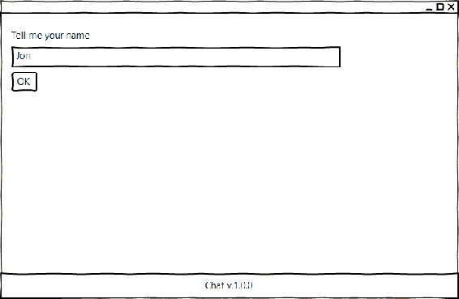
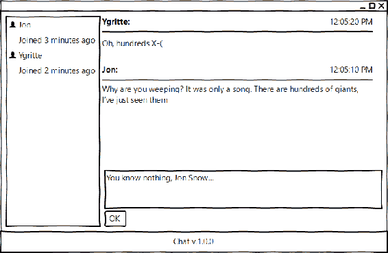
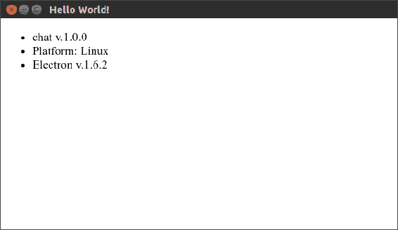
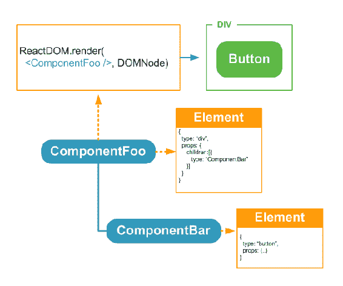
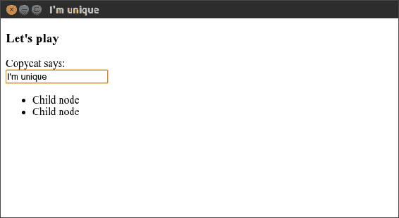
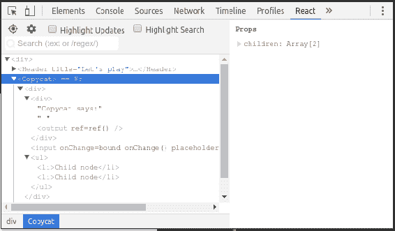
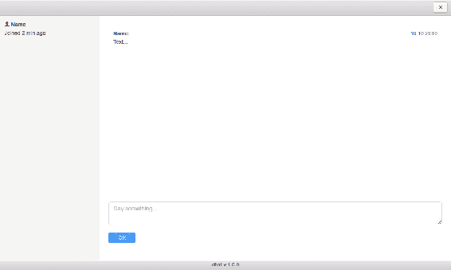

# 第三章：使用 Electron 和 React 创建聊天系统-规划、设计和开发

在之前的章节中，我们使用了 NW.js。这是一个很棒的框架，但并不是市场上唯一的一个。它的对手 Electron 在功能集方面并不逊色于 NW.js，并且拥有更大的社区。为了做出最合适的选择，我认为必须尝试这两个框架。因此，我们下一个示例应用将是一个简单的聊天系统，我们将使用 Electron 来实现它。我们用纯 JavaScript 制作了文件浏览器。我们必须注意抽象的一致性，数据绑定，模板等。事实上，我们可以将这些任务委托给 JavaScript 框架。在撰写本文时，React、Vue 和 Angular 这三种解决方案处于短列表的前列，其中 React 似乎是最流行的。我认为它最适合我们下一个应用。因此，我们将深入了解 React 的基本知识。我们将为基于 React 的应用程序设置 Electron 和 webpack。这次我们不会手动编写所有的 CSS 样式，而是会使用 PhotonKit 标记组件。最后，我们将使用 React 组件构建聊天静态原型，并准备使其功能化。

# 应用蓝图

为了描述我们的应用需求，与之前一样，我们从用户故事开始：

+   作为用户，我可以向聊天室介绍自己

+   作为用户，我可以实时看到聊天参与者的列表

+   作为用户，我可以输入并提交消息

+   作为用户，我可以看到聊天参与者的消息随着它们的到来

如果将其放在线框上，第一个屏幕将是一个简单的用户名提示：



第二个屏幕包含一个带有参与者的侧边栏和一个包含对话线程和提交消息表单的主区域：



第二个屏幕与第一个屏幕共享标题和页脚，但主要部分包括参与者列表（左侧）和聊天窗格（右侧）。聊天窗格包括传入消息和提交表单。

# Electron

我们已经熟悉了 NW.js。你可能知道，它有一个叫做 Electron 的替代品（[`electron.atom.io/`](https://electron.atom.io/)）。总的来说，两者提供了可比较的功能集（[`bit.ly/28NW0iX`](http://bit.ly/28NW0iX)）。另一方面，我们可以观察到 Electron 拥有一个更大、更活跃的社区（[`electron.atom.io/community/`](https://electron.atom.io/community/)）。

Electron 也是一些知名开源项目的 GUI 框架，比如 Visual Studio Code（[`code.visualstudio.com/`](https://code.visualstudio.com/)）和 Atom IDE（[`atom.io/`](https://atom.io/)）。

从开发者的角度来看，我们面临的第一个区别是，Electron 的入口点是 JavaScript，而不是 NW.js 中的 HTML。当我们启动一个 Electron 应用程序时，框架首先运行指定的脚本（主进程）。该脚本创建应用程序窗口。Electron 提供了分成模块的 API。其中一些只适用于主进程，一些适用于渲染进程（由主脚本发起的网页请求的任何脚本）。

让我们付诸实践。首先，我们将创建`./package.json`清单文件：

```js
{ 
  "name": "chat", 
  "version": "1.0.0", 
  "main": "./app/main.js", 
  "scripts": { 
    "start": "electron ." 
  }, 
  "devDependencies": { 
    "devtron": "¹.4.0", 
    "electron": "¹.6.2", 
    "electron-debug": "¹.1.0" 
  } 
} 

```

总的来说，这个清单与我们在之前的章节中为 NW.js 创建的清单并没有太大的区别。然而，我们这里不需要`window`字段，`main`字段指向主进程脚本。

至于依赖关系，显然我们需要`electron`，此外，我们还将使用`electron-debug`包，它激活了热键*F12*和*F5*，分别用于 DevTools 和重新加载（[`github.com/sindresorhus/electron-debug`](https://github.com/sindresorhus/electron-debug)）。我们还包括了 Electron 的 DevTools 扩展，称为 Devtron（[`electron.atom.io/devtron`](https://electron.atom.io/devtron)）。

现在，我们可以编辑主进程脚本：

`./app/main.js`

```js
const { app, BrowserWindow } = require( "electron" ), 
      path = require( "path" ), 
      url = require( "url" ); 

let mainWindow; 

```

在这里，我们从`electron`模块导入`app`和`BrowserWindow`。第一个允许我们订阅应用程序生命周期事件。通过第二个，我们创建和控制浏览器窗口。我们还获得了对 NPM 模块`path`和`url`的引用。第一个帮助创建与平台无关的路径，第二个帮助构建有效的 URL。在最后一行，我们声明了浏览器窗口实例的全局引用。接下来，我们将添加一个创建浏览器窗口的函数：

```js
function createWindow() { 
  mainWindow = new BrowserWindow({ 
    width: 1000, height: 600 
  }); 

  mainWindow.loadURL( url.format({ 
    pathname: path.join( __dirname, "index.html" ), 
    protocol: "file:", 
    slashes: true 
  }) ); 

  mainWindow.on( "closed", () => { 
    mainWindow = null; 
  }); 
} 

```

实际上，该函数只是创建一个窗口实例并在其中加载`index.html`。当窗口关闭时，对窗口实例的引用将被销毁。此外，我们订阅应用程序事件：

```js
 app.on( "ready", createWindow ); 

app.on( "window-all-closed", () => { 
  if ( process.platform !== "darwin" ) { 
    app.quit(); 
  } 
}); 

app.on( "activate", () => { 
  if ( mainWindow === null ) { 
    createWindow(); 
  } 
}); 

```

应用程序事件`"ready"`在 Electron 完成初始化时触发；然后我们创建浏览器窗口。

当所有窗口都关闭时，将触发`window-all-closed`事件。对于除 macOS 之外的任何平台，我们都会退出应用程序。OS X 应用程序通常会保持活动状态，直到用户明确退出。

`activate`事件只在 macOS 上触发。特别是，当我们单击应用程序的 Dock 或任务栏图标时会发生这种情况。如果此时没有窗口存在，我们将创建一个新窗口。

最后，我们调用`electron-debug`来激活调试热键：

```js
require( "electron-debug" )(); 

```

如果现在启动 Electron，它将尝试加载我们首先要创建的`index.html`：

`./app/index.html`

```js
<!DOCTYPE html> 
<html> 
  <head> 
    <meta charset="UTF-8"> 
    <title>Hello World!</title> 
  </head> 
  <body> 
    <ul> 
      <li id="app"></li> 
      <li id="os"></li> 
      <li id="electronVer"></li> 
    </ul> 
  </body> 
  <script src="img/renderer.js"></script> 
</html> 

```

这里没有什么激动人的事情发生。我们只是声明了几个占位符并加载了一个渲染器进程脚本：

`./app/renderer.js`

```js
const manifest = require( "../package.json" ); 

const platforms = { 
  win32: "Windows", 
  darwin: "macOS", 
  linux: "Linux" 
}; 

function write( id, text ){ 
  document.getElementById( id ).innerHTML = text; 
} 

write( "app", `${manifest.name} v.${manifest.version}` ); 
write( "os", `Platform: ${platforms[ process.platform ]}` ); 
write( "electronVer", `Electron v.${process.versions.electron}` ); 

```

在渲染器脚本中，我们将`package.json`读入`manifest`常量中。我们定义一个字典对象，将`process.platform`键映射到有意义的平台名称。我们添加一个辅助函数`write`，它将给定的文本分配给与给定 ID 匹配的元素。使用这个函数，我们填充 HTML 的占位符。

此时，我们预期有以下文件结构：

```js
. 
├── app 
│   ├── index.html 
│   ├── main.js 
│   └── renderer.js 
├── node_modules 
└── package.json

```

现在，我们安装依赖项（`npm i`）并运行（`npm start`）示例。我们将看到以下窗口：



# React

React 正在蓬勃发展。根据 2016 年 Stack Overflow 开发者调查，它是最流行的技术（[`stackoverflow.com/insights/survey/2016#technology`](http://stackoverflow.com/insights/survey/2016#technology)）。有趣的是，React 甚至不是一个框架。它是一个用于构建用户界面的 JavaScript 库--非常干净、简洁和强大。该库实现了基于组件的架构。因此，我们创建组件（可重用、可组合和有状态的 UI 单元），然后像乐高积木一样使用它们来构建预期的 UI。React 将派生结构视为内存中的 DOM 表示（虚拟 DOM）。当我们将其绑定到真实的 DOM 时，React 会保持两者同步，这意味着每当其组件之一改变其状态时，React 会立即在 DOM 中反映视图的变化。

除此之外，我们可以在服务器端将虚拟 DOM 转换为 HTML 字符串（[`bit.ly/2oVsjVn`](http://bit.ly/2oVsjVn)），并通过 HTTP 响应发送它。客户端将自动绑定到已存在的 HTML。因此，我们加快页面加载速度，并允许搜索引擎抓取内容。

简而言之，组件是一个接受给定属性并返回一个元素的函数，其中元素是表示组件或 DOM 节点的普通对象。或者，可以使用扩展`React.Component`的类，其`render`方法产生元素：



要创建一个元素，可以使用 API。然而，如今，通常不直接使用，而是通过被称为**JSX**的语法糖。JSX 用一个看起来像 HTML 模板的新类型扩展了 JavaScript：

```js
const name = "Jon", surname = "Snow"; 
const element = <header> 
  <h1>{name + " " + surname}</h1> 
</header>; 

```

基本上，我们直接在 JavaScript 中编写 HTML，而在 HTML 中编写 JavaScript。JSX 可以使用 Babel 编译器和预设 `react`（[`babeljs.io/docs/plugins/preset-react/`](https://babeljs.io/docs/plugins/preset-react/)）转换为普通的 JavaScript。

大多数现代 IDE 都支持 JSX 语法。

为了更好地理解，我们稍微调整了一下 React。一个基于函数的组件可能如下所示：

```js
function Header( props ){ 
  const { title } = props; 
  return ( 
    <header> 
      <h1>{title}</h1> 
    </header> 
  ); 
} 

```

因此，我们声明了一个 `Header` 组件，它生成一个表示标题的元素，标题由 `title` 属性填充。我们也可以使用类。因此，我们可以将组件相关的方法封装在类范围内：

```js
 import React from "react"; 

class Button extends React.Component { 

  onChange(){ 
    alert( "Clicked!" ); 
  } 

  render() { 
    const { text } = this.props; 
    return <button onChange={this.onChange.bind( this )} >{text}</button>; 
  } 
} 

```

该组件创建一个按钮，并为其提供了最简单的功能（当单击按钮时，我们会收到一个带有“Clicked！”文本的警报框）。

现在，我们可以将我们的组件附加到 DOM，如下所示：

```js
import ReactDOM from "react-dom"; 

ReactDOM.render(<div> 
  <Header  /> 
  <Button text="Click me" /> 
</div>, document.querySelector( "#app" ) );

```

正如您所注意到的，组件意味着单向流动。您可以从父级向子级传递属性，但反之则不行。属性是不可变的。当我们需要从子级通信时，我们将状态提升：

```js
import React from "react"; 

class Item extends React.Component { 
  render(){ 
    const { onSelected, text } = this.props; 
    return <li onClick={onSelected( text )}>{text}</li>; 
  } 
} 

class List extends React.Component { 

  onItemSelected( name ){ 
    // take care of ... 
  } 

  render(){ 
    const names = [ "Gregor Clegane", "Dunsen", "Polliver" ]; 
    return <nav> 
        <ul>{names.map(( name ) => { 
            return <Item name={name} onSelected={this.onItemSelected.bind( this )} />; 
          })} 
        </ul> 
      </nav>; 
  } 
} 

```

在 `List` 组件的 `render` 方法中，我们有一个名称数组。使用 `map` 数组原型方法，我们遍历名称列表。该方法会产生一个元素数组，JSX 会欣然接受。在声明 `Item` 时，我们传入当前的 `name` 和绑定到列表实例范围的 `onItemSelected` 处理程序。`Item` 组件呈现 `<li>` 并订阅传入的处理程序以处理单击事件。因此，子组件的事件由父组件处理。

# Electron meets React

现在，我们对 Electron 和 React 都有了一些了解。那么如何将它们一起使用呢？为了更好地理解，我们将不从我们的真实应用程序开始，而是从一个简单的类似示例开始。它将包括一些组件和一个表单。该应用程序将在窗口标题中反映用户输入。我建议克隆我们上一个示例。我们可以重用清单和主进程脚本。但是我们必须对清单进行以下更改：

./package.json

```js
{ 
  "name": "chat", 
  "version": "1.0.0", 
  "main": "./app/main.js", 
  "scripts": { 
    "start": "electron .", 
    "dev": "webpack -d --watch", 
    "build": "webpack" 
  }, 
  "dependencies": { 
    "prop-types": "¹⁵.5.7", 
    "react": "¹⁵.4.2", 
    "react-dom": "¹⁵.4.2" 
  }, 
  "devDependencies": { 
    "babel-core": "⁶.22.1", 
    "babel-loader": "⁶.2.10", 
    "babel-plugin-transform-class-properties": "⁶.23.0", 
    "babel-preset-es2017": "⁶.22.0", 
    "babel-preset-react": "⁶.22.0", 
    "devtron": "¹.4.0", 
    "electron": "¹.6.2", 
    "electron-debug": "¹.1.0", 
    "webpack": "².2.1" 
  } 
} 

```

在前面的示例中，我们添加了 `react` 和 `react-dom` 模块。第一个是库的核心，第二个用作 React 和 DOM 之间的粘合剂。`prop-types` 模块为我们带来了类型检查能力（直到 React v.15.5，这是库的内置对象）。除了特定于 electron 的模块，我们还将 `webpack` 添加为开发依赖项。Webpack 是一个模块打包工具，它接受各种类型（源代码、图像、标记和 CSS）的资产，并生成客户端可以加载的包。我们将使用 webpack 来打包基于 React/JSX 的应用程序。

然而，webpack 本身不会转译 JSX；它使用 Babel 编译器（`babel-core`）。我们还包括 `babel-loader` 模块，它在 webpack 和 Babel 之间建立桥梁。`babel-preset-react` 模块是所谓的 Babel 预设（一组插件），它允许 Babel 处理 JSX。通过 `babel-preset-es2017` 预设，我们让 Babel 将符合 ES2017 的代码编译为 ES2016，这是 Electron 极大支持的。此外，我还包括了 `babel-plugin-transform-class-properties` Babel 插件，以解锁名为 ES Class Fields & Static Properties 的提案的功能（[`github.com/tc39/proposal-class-public-fields`](https://github.com/tc39/proposal-class-public-fields)）。因此，我们将能够直接定义类属性，而无需构造函数的帮助，这在规范中尚未出现。

在脚本部分有两个额外的命令。`build` 命令用于为客户端打包 JavaScript。`dev` 命令将 webpack 设置为监视模式。因此，每当我们更改任何源代码时，它会自动打包应用程序。

在使用 webpack 之前，我们需要对其进行配置：

`./webpack.config.js`

```js
const { join } = require( "path" ), 
      webpack = require( "webpack" ); 

module.exports = { 
  entry: join( __dirname, "app/renderer.jsx" ), 
  target: "electron-renderer", 
  output: { 
      path: join( __dirname, "app/build" ), 
      filename:  "renderer.js" 
  }, 
  module: { 
    rules: [ 
      { 
        test: /.jsx?$/, 
        exclude: /node_modules/, 
        use: [{ 
          loader: "babel-loader", 
          options: { 
            presets: [ "es2017", "react" ], 
            plugins: [ "transform-class-properties" ] 
          } 
        }] 
      } 
    ] 
  } 
}; 

```

我们将`app/renderer.jsx`设置为入口点。因此，webpack 将首先读取它并递归解析任何遇到的依赖关系。然后编译后的捆绑包可以在`app/build/renderer.js`中找到。到目前为止，我们已经为 webpack 设置了唯一的规则：每个遇到的`.js`或`.jsx`文件（除了`node_modules`目录）都会经过 Babel 处理，Babel 配置了`es2017`和`react`预设（以及`transform-class-properties`插件，确切地说）。因此，如果我们现在运行`npm run build`，webpack 将尝试将`app/renderer.jsx`编译成`app/build/renderer.js`，然后我们可以在 HTML 中调用它。

`./app/index.html`文件的代码如下：

```js
<!DOCTYPE html> 
<html> 
  <head> 
    <meta charset="UTF-8"> 
    <title>Hello World!</title> 
  </head> 
  <body> 
    <app></app> 
  </body> 
  <script> 
   require( "./build/renderer.js" ); 
  </script> 
</html> 

```

主渲染器脚本可能如下所示：

`./app/renderer.jsx`

```js
import React from "react"; 
import ReactDOM from "react-dom"; 

import Header from "./Components/Header.jsx"; 
import Copycat from "./Components/Copycat.jsx"; 

ReactDOM.render(( 
<div> 
  <Header  /> 
  <Copycat> 
    <li>Child node</li> 
    <li>Child node</li> 
  </Copycat> 
</div> 
), document.querySelector( "app" ) );

```

在这里，我们导入了两个组件--`Header`和`Copycat`--并在一个复合组件中使用它们，然后将其绑定到 DOM 自定义元素`<app>`。

以下是我们用函数描述的第一个组件：

`./app/Components/Header.jsx`

```js
import React from "react"; 
import PropTypes from "prop-types"; 

export default function Header( props ){ 
  const { title } = props; 
  return ( 
    <header> 
      <h3>{title}</h3> 
    </header> 
  ); 
} 

Header.propTypes = { 
  title: PropTypes.string 
}; 

```

上述代码中的函数接受一个属性--`title`（我们在父组件`<Header />`中传递了它），并将其呈现为标题。

请注意，我们使用`PropTypes`来验证`title`属性的值。如果我们设置`title`以外的其他值，将在 JavaScript 控制台中显示警告。

以下是用类呈现的第二个组件：

`./app/Components/Copycat.jsx`

```js
import React from "react"; 
import { remote } from "electron";

export default class Copycat extends React.Component { 

  onChange( e ){ 
    remote.getCurrentWindow().setTitle( e.target.value ); 
  } 

  render() { 
    return ( 
      <div>         
        <input placeholder="Start typing here" onChange={this.onChange.bind( this )} /> 
        <ul> 
        {this.props.children} 
        </ul> 
      </div> 
    ) 
  } 
} 

```

此组件呈现一个输入字段。在字段中输入的任何内容都会反映在窗口标题中。在这里，我设定了一个目标，展示一个新概念：子组件/节点。

你还记得我们在父组件中声明了带有子节点的`Copycat`吗？`Copycat`元素的代码如下：

```js
<Copycat> 
    <li>Child node</li> 
    <li>Child node</li> 
</Copycat> 

```

现在，我们在`this.props.children`中接收这些列表项，并在`<ul>`中呈现它们。

除此之外，我们为输入元素订阅了一个`this.onChange`处理程序。当它改变时，我们从 electron 的远程函数中获取当前窗口实例（`remote.getCurrentWindow()`），并用输入内容替换其标题。

为了查看我们得到了什么，我们使用`npm i`安装依赖项，使用`npm run build`构建项目，并使用`npm start`启动应用程序：



# 启用 DevTools 扩展

我相信你在运行上一个示例时没有遇到问题。然而，当我们需要跟踪 React 应用程序中的问题时，可能会有些棘手，因为 DevTools 向我们展示的是真实 DOM 发生的事情；然而，我们也想了解虚拟 DOM 的情况。幸运的是，Facebook 提供了一个名为 React Developer Tools 的 DevTools 扩展（[`bit.ly/1dGLkxb`](http://bit.ly/1dGLkxb)）。

我们将使用 electron-devtools-installer（[`www.npmjs.com/package/electron-devtools-installer`](https://www.npmjs.com/package/electron-devtools-installer)）来安装此扩展。该工具支持多个 DevTools 扩展，包括一些与 React 相关的：React Developer Tools（`REACT_DEVELOPER_TOOLS`），Redux DevTools Extension（`REDUX_DEVTOOLS`），React Perf（`REACT_PERF`）。我们现在只选择第一个。

首先我们安装包：

```js
npm i -D electron-devtools-installer

```

然后我们在主进程脚本中添加以下行：

`./app/main.js`

```js
const { default: installExtension, REACT_DEVELOPER_TOOLS } = require( "electron-devtools-installer" );

```

我们从包中导入了`installExtension`函数和`REACT_DEVELOPER_TOOLS`常量，它代表 React Developer Tools。现在我们可以在应用程序准备就绪时调用该函数。在此事件上，我们已经调用了我们的`createWindow`函数。因此，我们可以扩展该函数，而不是再次订阅该事件：

```js
function createWindow() {
   installExtension(REACT_DEVELOPER_TOOLS)
      .then((name) => console.log(`Added Extension: ${name}`))
     .catch((err) => console.log("An error occurred: ", err));
//..

```

现在，当我启动应用程序并打开`DevTools`（*F12*）时，我可以看到一个新的选项卡`React`，它将我带到相应的面板。现在，可以浏览 React 组件树，选择其节点，并检查相应的组件，编辑其 props 和 state：



# 静态原型

在这一点上，我们已经准备好开始使用聊天应用程序了。然而，如果我们先创建一个静态版本，然后再扩展它以实现预期的功能，那么理解起来会更容易。如今，开发人员通常不会从头开始编写 CSS，而是重用 HTML/CSS 框架（如 Bootstrap）的组件。有一个专门为 Electron 应用程序设计的框架——**Photonkit**（[`photonkit.com`](http://photonkit.com)）。该框架为我们提供了诸如布局、窗格、侧边栏、列表、按钮、表单、表格和按钮等构建块。由这些块构建的 UI 看起来像 macOS 风格，自动适应 Electron 并响应其视口大小。理想情况下，我会选择使用 React 构建的现成的 PhotonKit 组件（[`react-photonkit.github.io`](http://react-photonkit.github.io)），但我们将使用 HTML 来完成。我想向您展示如何在 PhotonKit 示例中引入任意第三方 CSS 框架。

首先，我们使用 NPM 安装它：

```js
npm i -S photonkit

```

我们从包中真正需要的是`dist`子文件夹中的 CSS 和字体文件。从应用程序中访问包内容的唯一可靠方式是使用 require 函数（[`bit.ly/2oGu0Vn`](http://bit.ly/2oGu0Vn)）。请求 JavaScript 或 JSON 文件很明显，但其他类型的文件呢，例如 CSS 呢？使用 webpack，我们理论上可以捆绑任何内容。我们只需要在 webpack 配置文件中指定相应的加载器：

`./webpack.config.js`

```js
... 
module.exports = { 
{  
 ... 
 module: { 
    rules: [ 
      ... 
      { 
        test: /\.css$/, 
        use: ["style-loader", "css-loader"] 
      } 
    ] 
  } 
}; 

```

我们通过一个新规则扩展了 webpack 配置，该规则匹配任何扩展名为`css`的文件。Webpack 将使用`style-loader`和`css-loader`处理这些文件。第一个读取请求的文件，并通过注入样式块将其添加到 DOM 中。第二个将使用`@import`和`url()`请求的任何资源带到 DOM 中。

启用此规则后，我们可以直接在 JavaScript 模块中加载 Photon 样式：

```js
import "photonkit/dist/css/photon.css";

```

然而，此 CSS 中使用的自定义字体仍然不可用。我们可以通过进一步扩展 webpack 配置来解决这个问题：

`./webpack.config.js`

```js
module.exports = { 
... 
  module: { 
    rules: [ 
      ...      
      { 
        test: /\.(eot|svg|ttf|woff|woff2)(\?v=[0-9]\.[0-9]\.[0-9])?$/, 
        use: [{ 
            loader: "file-loader", 
            options: { 
              publicPath: "./build/" 
            } 
        }] 
      } 
    ] 
  } 
}; 

```

这个规则旨在处理字体文件，并利用`file-loader`，它从包中获取请求的文件，将其存储在本地，并返回新创建的本地路径。

因此，鉴于样式和字体由 webpack 处理，我们可以继续处理组件。我们将有两个组件代表窗口的标题和页脚。对于主要部分，当用户尚未提供任何名称时，我们将使用`Welcome`，之后使用`ChatPane`。第二个是`Participants`和`Conversation`组件的布局。我们还将有一个根组件`App`，它将所有其他组件与未来的聊天服务连接起来。实际上，这个组件不像一个展示性组件那样工作，而是作为一个容器（[`redux.js.org/docs/basics/UsageWithReact.html`](http://redux.js.org/docs/basics/UsageWithReact.html)）。因此，我们将它与其他组件分开。

现在我们已经完成了架构，我们可以编写我们的启动脚本：

`./app/renderer.jsx`

```js
import "photonkit/dist/css/photon.css"; 
import React from "react"; 
import ReactDOM from "react-dom"; 

import App from "./Containers/App.jsx"; 

ReactDOM.render(( 
<App  /> 
), document.querySelector( "app" ) ); 

```

在这里，我们向 DOM 添加了 PhotonKit 库的 CSS（`import "photonkit/dist/css/photon.css"`），并将`App`容器绑定到`<app>`元素。接下来是以下容器：

`./app/js/Containers/App.jsx`

```js
import React from "react"; 
import PropTypes from "prop-types"; 
import ChatPane from "../Components/ChatPane.jsx"; 
import Welcome from "../Components/Welcome.jsx"; 
import Header from "../Components/Header.jsx"; 
import Footer from "../Components/Footer.jsx"; 

export default class App extends React.Component { 

  render() { 
    const name = "Name"; 
    return ( 
      <div className="window"> 
        <Header></Header> 
        <div className="window-content"> 
          { name ? 
            ( <ChatPane 
                /> ) : 
            ( <Welcome /> ) } 
        </div> 
        <Footer></Footer> 
      </div> 
    ); 
  } 
} 

```

在这个阶段，我们只需使用 PhotonKit 应用程序布局样式（`.window`和`.window-content`）布置其他组件。正如我们商定的，根据本地常量`name`的值，我们在标题和页脚之间渲染`ChatPane`或`Welcome`。

顺便说一句，我们从 Photon 标记组件（[`photonkit.com/components/`](http://photonkit.com/components/)）构建的标题和页脚都称为**bar**。除了整洁的样式，它还可以使应用程序窗口在桌面上拖动：

`./app/js/Components/Header.jsx`

```js
import React from "react"; 

export default class Header extends React.Component { 
  render() { 
    return ( 
      <header className="toolbar toolbar-header"> 
          <div className="toolbar-actions"> 
              <button className="btn btn-default pull-right"> 
                 <span className="icon icon-cancel"></span> 
             </button> 
          </div> 
       </header> 
    ) 
  } 
} 

```

从`Header`组件中的 Photon CSS 类（`.toolbar`和`.toolbar-header`）可以看出，我们在窗口顶部渲染了一个栏。该栏接受操作按钮（`.toolbar-actions`）。目前，唯一可用的按钮是关闭窗口的按钮。

在`Footer`组件中，我们在底部位置渲染了一个栏（`.toolbar-footer`）：

`./app/js/Components/Footer.jsx`

```js
import React from "react"; 
import * as manifest from "../../../package.json"; 

export default function Footer(){ 
    return ( 
      <footer className="toolbar toolbar-footer"> 
        <h1 className="title">{manifest.name} v.{manifest.version}</h1> 
     </footer> 
    ); 
} 

```

它包括了清单中的项目名称和版本。

对于欢迎屏幕，我们有一个简单的表单，其中包含输入字段（`input.form-control`）用于名称和一个提交按钮（`button.btn-primary`）：

`./app/js/Components/Welcome.jsx`

```js
import React from "react"; 

export default class Welcome extends React.Component { 

  render() { 
    return ( 
      <div className="pane padded-more"> 
        <form> 
          <div className="form-group"> 
            <label>Tell me your name</label> 
            <input required className="form-control" placeholder="Name"   
          /> 
          </div> 
          <div className="form-actions"> 
            <button className="btn btn-form btn-primary">OK</button> 
          </div> 
        </form> 
      </div> 
    ) 
  } 
} 

```

`ChatPane`组件将`Participants`放在左侧，`Conversation`放在右侧。目前它所做的几乎就是这些：

`./app/js/Components/ChatPane.jsx`

```js
import React from "react"; 

import Participants from "./Participants.jsx"; 
import Conversation from "./Conversation.jsx"; 

export default function ChatPane( props ){ 
  return ( 
    <div className="pane-group"> 
      <Participants /> 
      <Conversation /> 
    </div> 
  ); 

} 

```

在`Participants`组件中，我们使用了一个侧边栏类型的布局窗格（`.pane.pane-sm.sidebar`）：

`./app/js/Components/Participants.jsx`

```js
import React from "react"; 

export default class Participants extends React.Component { 
  render(){ 
    return ( 
      <div className="pane pane-sm sidebar"> 
        <ul className="list-group"> 
          <li className="list-group-item"> 
              <div className="media-body"> 
                <strong><span className="icon icon-user"></span>&nbsp;Name</strong> 
                <p>Joined 2 min ago</p> 
              </div> 
            </li> 
        </ul> 
      </div> 
    ); 
  } 
} 

```

它有一个聊天参与者列表。我们为每个名字添加了由 Photon 提供的 Entype 图标。

最后一个组件--`Conversation`--在列表（`.list-group`）中渲染聊天消息和提交表单：

`./app/js/Components/Conversation.jsx`

```js
import React from "react"; 

export default class Conversation extends React.Component { 

  render(){ 
    return ( 
        <div className="pane padded-more l-chat"> 
          <ul className="list-group l-chat-conversation"> 
            <li className="list-group-item"> 
                <div className="media-body"> 
                  <time className="media-body__time">10.10.2010</time> 
                  <strong>Name:</strong> 
                    <p>Text...</p> 
                </div> 
              </li> 
          </ul> 
          <form className="l-chat-form"> 
            <div className="form-group"> 
              <textarea required placeholder="Say something..." 
                className="form-control"></textarea> 
            </div> 
            <div className="form-actions"> 
              <button className="btn btn-form btn-primary">OK</button> 
            </div> 
          </form> 
        </div> 
    ); 
  } 
} 

```

这是我们第一次需要一些自定义样式：

`./app/assets/css/custom.css`

```js
.l-chat { 
  display: flex; 
  flex-flow: column nowrap; 
  align-items: stretch; 
} 
.l-chat-conversation { 
  flex: 1 1 auto; 
  overflow-y: auto; 
} 
.l-chat-form { 
  flex: 0 0 110px; 
} 
.media-body__time { 
  float: right; 
} 

```

在这里，我们让表单（`.l-form`）固定在底部。它有固定的高度（`110px`），并且所有向上的可用空间都被消息列表（`.l-chat-conversation`）占据。此外，我们将消息时间信息（`.media-body__time`）对齐到右侧，并将其从流中取出（`float: right`）。

这个 CSS 可以在 HTML 中加载：

`./index.html`

```js
<!DOCTYPE html> 
<html> 
  <head> 
    <meta charset="UTF-8"> 
    <title>Chat</title> 
    <link href="./assets/css/custom.css" rel="stylesheet" type="text/css"/> 
  </head> 
  <body> 
    <app></app> 
  </body> 
  <script> 
   require( "./build/renderer.js" ); 
  </script> 
</html> 

```

我们确保所有依赖项都已安装（`npm i`），然后构建（`npm run build`）并启动应用程序（`npm start`）。完成后，我们可以看到以下预期的 UI：



# 总结

尽管我们还没有一个功能性的应用程序，只有一个静态原型，但我们已经走了很长的路。我们谈论了 Electron GUI 框架。我们将其与 NW.js 进行了比较，并了解了它的特点。我们制作了一个简化的 Electron 演示应用程序，包括一个主进程脚本，一个渲染器脚本和 HTML。我们对 React 基础知识进行了介绍。我们专注于组件和元素，JSX 和虚拟 DOM，props 和 state。我们配置了 webpack 将我们的 ES.Next 兼容的 JSX 编译成 Electron 可接受的 JavaScript。为了巩固我们的知识，我们制作了一个由 Electron 驱动的小型演示 React 应用程序。此外，我们还研究了如何在 Electron 中启用 DevTools 扩展（React Developer Tools）来跟踪和调试 React 应用程序。我们简要介绍了 PhotonKit 前端框架，并使用 PhotonKit 样式和标记创建了聊天应用程序的 React 组件。最后，我们将我们的组件捆绑在一起，并在 Electron 中渲染应用程序。
