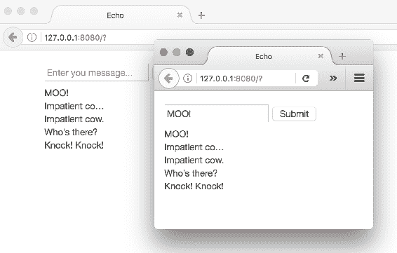
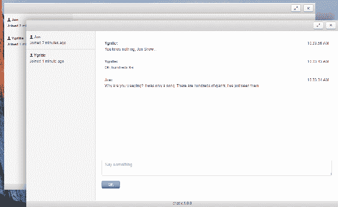
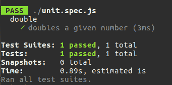
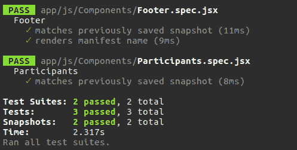
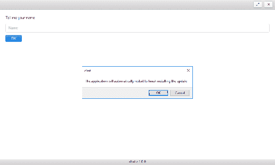
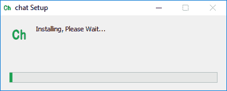
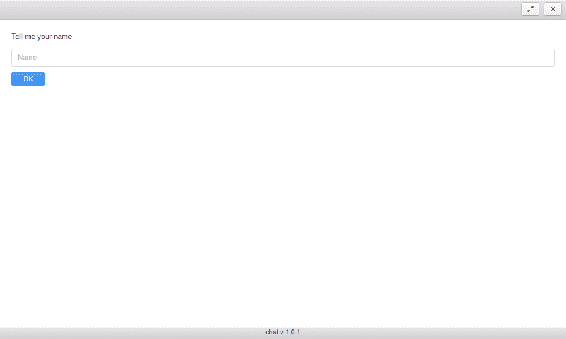

# 第四章：使用 Electron 和 React 创建聊天系统-增强、测试和交付

我们上一章以静态原型结束。我们了解了 React，组合了组件，但没有为它们提供任何状态。现在，我们将开始将应用窗口的状态绑定到标题组件。随着状态概念的澄清，我们将转向聊天服务。在简要介绍了 WebSockets 技术之后，我们将实现服务器和客户端。我们将把服务事件绑定到应用状态。最后，我们将拥有一个完全可用的聊天功能。我们不会停在这里，而是会处理技术债务。因此，我们将设置 Jest 测试框架，并对无状态和有状态组件进行单元测试。之后，我们将打包应用程序，并通过基本的 HTTP 服务器发布版本。我们将扩展应用程序以在有新版本可用时进行更新。

# 重振标题栏

直到现在，我们的标题栏并不是真正有用的。多亏了 Photon 框架，我们已经可以将其用作拖放窗口的手柄，但我们还缺少窗口操作，比如关闭、最大化和还原窗口。

让我们来实现它们：

`./app/js/Components/Header.jsx`

```js
import { remote } from "electron"; 
const win = remote.getCurrentWindow(); 

export default class 

Header extends React.Component { 
//.... 
 onRestore = () => { 
    win.restore(); 
  } 

  onMaximize = () => { 
    win.maximize(); 
  } 

  onClose = () => { 
    win.close(); 

  } 
//... 
} 

```

我们不使用方法，而是使用将匿名函数绑定到对象范围的属性。这个技巧是可能的，多亏了我们在第三章中包含在清单和 Webpack 配置中的`babel-plugin-transform-class-properties`。

我们扩展了组件，添加了关闭窗口、最大化和还原到原始大小的处理程序。我们在 JSX 中已经有了`close`按钮，所以我们只需要订阅相应的处理程序方法来处理`click`事件，使用`onClick`属性：

```js
 <button className="btn btn-default pull-right" onClick={this.onClose}> 
     <span className="icon 

icon-cancel"></span> 
</button> 

```

然而，`maximize`和`restore`按钮是有条件地在 HTML 中渲染的，取决于当前窗口状态。因为我们将利用状态，让我们来定义它：

```js
 constructor( props ) { 
    super( props ); 
    this.state = { isMaximized: win.isMaximized() }; 
  } 

```

`isMaximized`状态属性接收当前窗口实例的相应标志。现在，我们可以从 JSX 中提取这个值的状态：

```js
..... 
render() { 
    const { isMaximized } = this.state; 
    return ( 
      <header 

className="toolbar toolbar-header"> 
          <div className="toolbar-actions"> 

<button className="btn btn-default pull-right" onClick={this.onClose}> 
                   <span 

className="icon icon-cancel"></span> 
               </button> 

               { 

isMaximized ? ( 
                 <button className="btn btn-default pull-right" onClick={this.onRestore}> 
                    <span className="icon icon-resize-small"></span> 
                 </button> ) 

: ( 
                 <button className="btn btn-default pull-right" onClick={this.onMaximize}> 

        <span className="icon icon-resize-full"></span> 
                 </button>) 

     } 

          </div> 
       </header> 
    ) 
  } 

```

因此，当`restore`为 true 时，我们渲染`restore`按钮，否则渲染`maximize`按钮。我们还订阅了两个按钮的`click`事件的处理程序，但是窗口最大化或还原后如何改变状态呢？

在组件呈现到 DOM 之前，我们可以订阅相应的窗口事件：

```js
componentWillMount() { 
    win.on( "maximize", this.updateState ); 
    win.on( "unmaximize", 

this.updateState ); 
  } 

  updateState = () => { 
    this.setState({ 
      isMaximized: 

win.isMaximized() 
    }); 
  } 

```

当窗口改变其状态处理程序时，`updateState`会调用并更新组件状态。

# 利用 WebSockets

我们有一个静态原型，现在我们将使其功能。任何聊天都需要连接客户端之间的通信。通常，客户端不直接连接，而是通过服务器。服务器注册连接并转发消息。从客户端发送消息到服务器是很清楚的，但我们能否以相反的方式做呢？在过去，我们不得不处理长轮询技术。那样可以工作，但由于 HTTP 的开销，当我们需要低延迟的应用程序时，它并不是真正合适的。幸运的是，Electron 支持 WebSockets。通过该 API，我们可以在客户端和服务器之间建立全双工、双向的 TCP 连接。与 HTTP 相比，WebSockets 提供了更高的速度和效率。该技术可以将不必要的 HTTP 流量减少高达 500:1，并将延迟减少 3:1（[`bit.ly/2ptVzlk`](http://bit.ly/2ptVzlk)）。您可以在我的书*JavaScript Unlocked*中找到更多关于 WebSockets 的信息（[`www.packtpub.com/web-development/javascript-unlocked`](https://www.packtpub.com/web-development/javascript-unlocked)）。在这里，我们将通过一个小型演示简要了解该技术。我建议检查一个回声服务器和一个客户端。每当客户端向服务器发送文本时，服务器都会将其广播到所有连接的客户端。因此，在加载了客户端的每个页面上，我们都可以实时接收消息。

当然，我们不会为服务器编写协议实现，而是使用现有的 NPM 包--nodejs-websocket（[`www.npmjs.com/package/nodejs-websocket`](https://www.npmjs.com/package/nodejs-websocket)）：

```js
npm i -S nodejs-websocket 

```

使用包 API，我们可以快速编写代码来处理来自客户端的消息：

`./server.js`

```js
const ws = require( "nodejs-websocket" ), 
      HOST = "127.0.0.1", 
      PORT = 8001; 

const 

server = ws.createServer(( conn ) => { 

  conn.on( "text", ( text ) => { 

server.connections.forEach( conn => { 
      conn.sendText( text ); 
    }); 
  }); 

conn.on( "error", ( err ) => { 
    console.error( "Server error", err ); 
  }); 

}); 

server.listen( PORT, HOST, () => { 
  console.info( "Server is ready" ); 
}); 

```

在这里，我们实例化一个代表 WebSockets 服务器（`server`）的对象。在`createServer`工厂的回调中，我们将接收连接对象。我们订阅每个连接的`"text"`和`"error"`事件。第一个事件发生在从客户端发送数据帧到服务器时。我们简单地将其转发到每个可用的连接。第二个事件在发生错误时触发，因此我们报告错误。最后，我们在给定的端口和主机上启动服务器，例如，我设置端口`8001`。如果您的环境中的任何其他程序占用了此端口，只需更改`PORT`常量的值即可。

我们可以将这个简化的聊天客户端组成一个单页面应用程序。因此，创建以下 HTML：

`./index.html`

```js
<!DOCTYPE html> 
<html> 
  <head> 
    <title>Echo</title> 

<meta charset="UTF-8"> 
    <meta name="viewport" content="width=device-width, initial- 
    scale=1.0"> 

</head> 
  <body> 
    <form id="form"> 
      <input id="input" placeholder="Enter you 

message..." /> 
      <button>Submit</button> 
    </form> 
    <output 

id="output"></output> 

<script> 
const HOST = "127.0.0.1", 
      PORT = 8001, 

    form = document.getElementById( "form" ), 
      input = document.getElementById( "input" ), 
      output = 

document.getElementById( "output" ); 

const ws = new WebSocket( `ws://${HOST}:${PORT}` ); 

ws.addEventListener( "error", ( e ) => { 
  console.error( "Client's error: ", e ); 
}); 

ws.addEventListener( "open", () => { 
  console.log( "Client connected" ); 
}); 

ws.addEventListener( "message", e => { 
  output.innerHTML = e.data + "<br \>" + output.innerHTML; 
}); 

form.addEventListener( "submit", ( e ) => { 
  e.preventDefault(); 
  ws.send( input.value 

); 
}); 

</script> 
  </body> 
</html> 

```

在 HTML 中，我们放置了一个带有输入控件和输出容器的表单。意图是在表单上发送输入值，将其提交到服务器，并在输出元素中显示服务器响应。

在 JavaScript 中，我们存储了对操作节点的引用，并创建了 WebSockets 客户端的实例。我们订阅了`error`、`open`和`message`客户端事件。前两个基本上报告正在发生的事情。最后一个接收来自服务器的事件。在我们的情况下，服务器发送文本消息，因此我们可以将它们作为`e.data`。我们还需要处理来自客户端的输入。因此，我们订阅了表单元素上的`submit`。我们使用 WebSockets 客户端的`send`方法将输入值发送到服务器。

要运行示例，我们可以使用`http-server`模块（[`www.npmjs.com/package/http-server`](https://www.npmjs.com/package/http-server)）为我们的`index.html`启动一个静态 HTTP 服务器：

```js
npm i -S http-server 

```

现在，我们可以将以下命令添加到`package.json`：

```js
{
  "scripts": {
    "start:client": "http-server . -o",
    "start:server": "node server.js"
  }

}

```

因此，我们可以运行服务器：

```js
 npm run start:server 

```

然后客户端为：

```js
 npm run start:client

```



# 实现聊天服务

我相信现在大致清楚了 WebSockets 的工作原理，我们可以将 API 应用于我们的聊天。然而，在实际应用中，我们需要的不仅仅是回显发送的文本。让我们把预期的事件场景写在纸上：

+   `Welcome` 组件处理用户输入，并通过客户端发送到 `join` 服务器事件，载荷中包含输入的用户名

+   服务器接收 `join` 事件，将新用户添加到集合中，并广播带有更新集合的 `participants` 事件

+   客户端接收 `participants` 事件，并将集合传递给 `Participants` 组件，该组件更新参与者列表

+   `Conversation` 组件处理用户输入，并将输入的消息通过客户端作为 `text` 事件发送到服务器，载荷中包含用户名、文本和时间戳

+   服务器接收 `text` 事件并将其广播给所有聊天参与者

由于我们处理事件消息，我们需要一个统一的格式来发送和接收单一的真相来源。因此，我们实现了一个消息包装器--`./app/js/Service/Message.js`：

```js
class Message { 
  static toString( event, data ){ 
    return JSON.stringify({ 
      event, data 
    }); 
  } 
  static fromString( text ){ 
    return JSON.parse( text ); 
  } 
} 

exports.Message = Message; 

```

该模块公开了两个静态方法。一个将给定的事件名称和载荷转换为 JSON 字符串，可以通过 WebSockets 发送；另一个将接收到的字符串转换为消息对象。

现在我们编写服务器--`./app/js/Service/Server.js`：

```js
import * as ws from "nodejs-websocket"; 
import { Message } from "./Message"; 

export default class 

Server { 

  constructor() { 
    this.server = ws.createServer(( conn ) => { 

conn.on( "error", ( err ) => { 
        console.error( "Server error", err ); 
      }); 
      conn.on( 

"close", ( code, reason ) => { 
        console.log( "Server closes a connection", code, reason ); 
      }); 

      conn.on( "connection", () => { 
        console.info( "Server creates a new connection" ); 

}); 
    }); 

  } 

  broadcast( event, data ){ 
    const text = Message.toString( 

event, data ); 
    this.server.connections.forEach( conn => { 
      conn.sendText( text ); 
    }); 
  } 

  connect( host, port ) { 
     this.server.listen( port, host, () => { 

console.info( "Server is ready" );      }); 
  } 
} 

```

与回声服务器一样，这个服务器订阅连接事件以报告发生了什么，并公开了 `broadcast` 和 `connect` 方法。为了使其处理传入的消息，我们扩展了 `createServer` 回调：

```js
constructor() { 

    this.server = ws.createServer(( conn ) => { 

      conn.on( "text", 

( text ) => { 
        const msg = Message.fromString( text ), 
              method = `on${msg.event}`; 
        if ( !this[ method ] ) { 
          return; 
        } 
        this method ; 

      }); 
      //... 
    }); 
    //... 
  } 

```

现在，当接收到消息时，服务器会尝试调用与事件名称匹配的处理程序方法。例如，当它接收到 `join` 事件时，它会调用 `onjoin`：

```js
onjoin( name, conn ){ 
    const datetime = new Date(); 
    this.participants.set( conn, { 

name: name, 
      time: datetime.toString() 
    }); 

    this.broadcast( "participants", 

Array.from( this.participants.values() )); 
  } 

```

该方法接受事件载荷（这里是用户名）作为第一个参数，连接引用作为第二个参数。它在 `this.participant` 映射中注册连接。因此，我们现在可以通过连接确定关联的用户名和注册时间戳。然后，该方法将映射的值作为数组广播（一组用户名和时间戳）。

但是，我们不应忘记在类构造函数中将 `this.participants` 定义为映射：

```js

constructor() { 
    this.participants = new Map(); 
    //... 
} 

```

我们还为 `text` 事件添加了处理程序方法：

```js

ontext( data, conn ){ 
    const name = this.participants.get( conn ).name; 
    this.broadcast( 

"text", { name, ...data } ); 
  } 

```

该方法从 `this.participants` 中提取与给定连接相关联的用户名，将消息载荷与之扩展，并广播派生消息。

现在，我们可以编写客户端--`./app/js/Service/Client.js`：

```js
const EventEmitter = require( "events" ), 
          READY_STATE_OPEN = 1; 
import { Message } from 

"./Message"; 

export default class Client extends EventEmitter { 

  connect( host, port ){ 

    return new Promise(( resolve, reject ) => { 
      this.socket = new WebSocket( `ws://${host}:${port}` ); 

      this.socket.addEventListener( "open", () => { 
        resolve(); 
      }); 

    this.socket.addEventListener( "error", ( e ) => { 
        if ( e.target.readyState > READY_STATE_OPEN ) { 

          reject(); 
        } 
      }); 

      this.socket.addEventListener( "message", e 

=> { 
        const msg = Message.fromString( e.data ), 
              method = `on${msg.event}`; 

 if ( !this[ method ] ) { 
          return; 
        } 
        this method ; 
      }); 

    }); 
  } 

  onparticipants( data ){ 
    this.emit( "participants", data ); 
  } 

  ontext( data ){ 
    this.emit( "text", data ); 
  } 

 getParticipants(){ 

return this.participants; 
  } 

  join( userName ) { 
    this.userName = userName; 

this.send( "join", userName ); 
  } 

  message( text ) { 
    this.send( "text", { 

userName: this.userName, 
      text, 
      dateTime: Date.now() 
    }); 
  } 

  send( 

event, data ){ 
    this.socket.send( Message.toString( event, data ) ); 
  } 
} 

```

客户端实现了与服务器相同的处理程序方法，但这次，我们让 `connect` 方法返回一个 Promise。因此，如果客户端无法连接服务器，我们可以调整执行流程。我们有两个处理程序：`onparticipants` 和 `ontext`。它们都简单地将接收到的消息传递给应用程序。由于 `Client` 类扩展了 `EventEmitter`，我们可以使用 `this.emit` 来触发事件，任何订阅的应用程序模块都能够捕获它。此外，客户端公开了两个公共方法：`join` 和 `message`。其中一个 (`join`) 将被 `Welcome` 组件使用，用于在服务器上注册提供的用户名，另一个 (`message`) 则从 `Participants` 组件调用，将提交的文本传递给服务器。这两种方法都依赖于 `send` 私有方法，它实际上是分发消息。

Electron 包括 Node.js 运行时，因此允许我们运行服务器。因此，为了使其更简单，我们将服务器包含到应用程序中。为此，我们再次修改服务器代码：

```js

  connect( host, port, client ) { 
    client.connect( host, port ).catch(() => { 

this.server.listen( port, host, () => { 
        console.info( "Server is ready" ); 
        client.connect( 

host, port ).catch(() => { 
          console.error( "Client's error" ); 
        }); 
      }); 

 }); 
  } 

```

现在它运行提供的 `client.connect` 来与我们的 WebSockets 服务器建立连接。如果这是应用程序运行的第一个实例，服务器尚不可用。因此，客户端无法连接，执行流程跳转到 catch 回调。在那里，我们启动服务器并重新连接客户端。

# 为组件带来功能

现在我们有了服务器和客户端服务，我们可以在应用程序中启用它们。最合适的地方是 `App` 容器--`./app/js/Containers/App.jsx`：

```js
import Server from "../Service/Server"; 
import Client from "../Service/Client"; 

const HOST = 

"127.0.0.1", 
      PORT = 8001; 

export default class App extends React.Component { 

constructor(){ 
    super(); 
    this.client = new Client(); 
    this.server = new Server(); 

this.server.connect( HOST, PORT, this.client ); 
  } 
//... 
} 

```

你还记得我们在静态原型中有条件地呈现 `ChatPane` 或 `Welcome` 组件吗？：

```js
{ name ? 
            ( <ChatPane client={client} 
                /> ) : 
            ( 

<Welcome  onNameChange={this.onNameChange} /> ) } 

```

当时，我们将`name`硬编码，但它属于组件状态。因此，我们可以在类构造函数中初始化状态，如下所示：

```js
constructor(){ 
    //... 
    this.state = { 
      name: "" 
    }; 
} 

```

嗯，`name`默认为空，因此我们显示`Welcome`组件。我们可以在那里输入一个新的名称。当提交时，我们需要以某种方式改变父组件中的状态。我们使用一种称为**状态提升**的技术来实现它。我们在`App`容器中声明一个处理`name`更改事件的处理程序，并将其与 props 一起传递给`Welcome`组件：

```js

onNameChange = ( userName ) => { 
  this.setState({ name: userName }); 
  this.client.join( 

userName ); 
} 

render() { 
  const client = this.client, 
        name = this.state.name; 
  return ( 
    <div className="window"> 
      <Header></Header> 
      <div 

className="window-content"> 
        { name ? 
          ( <ChatPane client={client} 

/> ) : 
          ( <Welcome  onNameChange={this.onNameChange} /> ) } 
      </div> 

<Footer></Footer> 
    </div> 
  ); 
} 

```

因此，我们从状态中提取`name`并在表达式中使用它。最初，`name`为空，因此渲染`Welcome`组件。我们声明`onNameChange`处理程序，并将其与 props 一起传递给`Welcome`组件。处理程序接收提交的名称，在服务器上注册新连接（`this.client.join`），并更改组件状态。因此，`ChatPane`组件替换了`Welcome`。

现在，我们将编辑`Welcome`组件--`./app/js/Components/Welcome.jsx`：

```js
import React from "react"; 
import PropTypes from "prop-types"; 

export default class Welcome extends 

React.Component { 

  onSubmit = ( e ) => { 
    e.preventDefault(); 
    this.props.onNameChange( 

this.nameEl.value || "Jon" ); 
  } 

  static defaultProps = { 
    onNameChange: () => {} 

} 

  static propTypes = { 
    onNameChange: PropTypes.func.isRequired 
  } 

  render() { 

    return ( 
      <div className="pane padded-more"> 
        <form onSubmit={this.onSubmit}> 

          <div className="form-group"> 
            <label>Tell me your name</label> 

        <input required className="form-control" placeholder="Name" 
              ref={(input) => { this.nameEl 

= input; }} /> 
          </div> 
          <div className="form-actions"> 

<button className="btn btn-form btn-primary">OK</button> 
          </div> 

</form> 
      </div> 
    ) 
  } 
} 

```

每当一个组件期望任何 props 时，通常意味着我们必须应用`defaultProps`和`propTypes`静态方法。这些方法属于`React.Component`API，并在组件初始化期间自动调用。第一个方法为 props 设置默认值，第二个方法验证它们。在 HTML 中，我们为表单的`submit`事件订阅`onSubmit`处理程序。在处理程序中，我们需要访问输入值。通过`ref` JSX 属性，我们将实例添加为对输入元素的引用。因此，从`onSubmit`处理程序中，我们可以将输入值获取为`this.nameEl.value`。

现在，用户可以在聊天中注册，我们需要显示聊天 UI--`./app/js/Components/ChatPane.jsx`：

```js
export default function ChatPane( props ){ 
  const { client } = props; 
  return ( 
    <div 

className="pane-group"> 

      <Participants client={client} /> 

      <Conversation  

client={client} /> 

    </div> 
  ); 

} 

```

这是一个复合组件，它布局`Participants`和`Conversation`子组件，并将`client`转发给它们。

第一个组件用于显示参与者列表--`./app/js/Components/Participants.jsx`：

```js
import React from "react"; 
import TimeAgo from "react-timeago"; 
import PropTypes from "prop-types"; 

export default class Participants extends React.Component { 

 constructor( props ){ 
    super( 
    props ); 
    this.state = { 
      participants: props.client.getParticipants() 
    } 

props.client.on( "participants", this.onClientParticipants ); 
  } 

  static defaultProps = { 
    client: null 
  } 

  static propTypes = { 
    client: PropTypes.object.isRequired 
  } 

onClientParticipants = ( participants ) => { 
    this.setState({ 
      participants: 

participants 
    }) 
  } 

  render(){ 
    return ( 
      <div className="pane pane-sm 
      sidebar"> 
        <ul className="list-group"> 
          {this.state.participants.map(( user ) => ( 

            <li className="list-group-item" key={user.name}> 
              <div className="media-
              body"> 
                <strong><span className="icon icon-user"></span>&nbsp;     
                {user.name}
                </strong> 
                <p>Joined <TimeAgo date={user.time} /></p> 
              </div> 
            </li> 
          ))} 
        </ul> 
      </div> 
    ); 
  } 
} 

```

在这里，我们需要一些构造工作。首先，我们定义状态，其中包括来自 props 的参与者列表。我们还订阅客户端的`participants`事件，并在服务器发送更新列表时每次更新状态。在渲染列表时，我们还显示参与者注册时间，例如 5 分钟前加入。为此，我们使用`react-timeago` NPM 包提供的第三方组件`TimeAgo`。

最后，我们来到`Conversation`组件--`./app/js/Components/Conversation.jsx`：

```js
import React from "react"; 
import PropTypes from "prop-types"; 

export default class Conversation 

extends React.Component { 

  constructor( props ){ 
    super( props ); 
    this.messages = []; 

    this.state = { 
      messages: [] 
    } 
    props.client.on( "text",  this.onClientText ); 
  } 

  static defaultProps = { 
    client: null 
  } 

  static propTypes = { 
    client: PropTypes.object.isRequired 
  } 

onClientText = ( msg ) => { 
    msg.time = new 

Date( msg.dateTime ); 
    this.messages.unshift( msg ); 
    this.setState({ 
      messages: this.messages 

    }); 
  } 

 static normalizeTime( date, now, locale ){ 
    const isToday = ( 

now.toDateString() === date.toDateString() ); 
    // when local is undefined, toLocaleDateString/toLocaleTimeString 

use default locale 
    return isToday ? date.toLocaleTimeString( locale ) 
      : date.toLocaleDateString( 

locale ) + ` ` + date.toLocaleTimeString( locale ); 
  } 

  render(){ 
    const { messages } = 

this.state; 
    return ( 
        <div className="pane padded-more l-chat"> 
          <ul 

className="list-group l-chat-conversation"> 
            {messages.map(( msg, i ) => ( 

<li className="list-group-item" key={i}> 
                <div className="media-body"> 

    <time className="media-body__time">{Conversation.normalizeTime(  
    msg.time, new Date() )}</time> 

           <strong>{msg.userName}:</strong> 
                  {msg.text.split( "\n" ) .map(( line, 
                  inx ) => ( 
                    <p key={inx}>{line}</p> 
                  ))} 
              </div> 
              </li> 
            ))} 
          </ul> 
         </div> 
    ); 
  } 
} 

```

在构造过程中，我们订阅客户端的`text`事件，并将接收到的消息收集到`this.messages`数组中。我们使用这些消息来设置组件状态。在`render`方法中，我们从状态中提取消息列表，并遍历它以渲染每个项目。消息视图包括发送者的名称、文本和时间。我们直接输出名称。我们将文本按行拆分，并用段落元素包裹它们。为了显示时间，我们使用`normalizeTime`静态方法。该方法将`Date`对象转换为长字符串（日期和时间），当它比今天更旧时，否则转换为短字符串（日期）。

我们还需要一个用于向聊天发送消息的表单。理想的方法是将表单放入一个单独的组件中，但为了简洁起见，我们将其保留在会话视图旁边：

```js
  render(){ 
    const { messages } = this.state; 
    return ( 
... 
        <form onSubmit=

{this.onSubmit} className="l-chat-form"> 
            <div className="form-group"> 

<textarea required placeholder="Say something..." 
                onKeyDown={this.onKeydown} 

className="form-control" ref={ el => { this.inputEl = el; }}></textarea> 
            </div> 

          <div className="form-actions"> 
              <button className="btn btn-form btn-

primary">OK</button> 
            </div> 
          </form> 
 ); 
} 
... 

```

与`Welcome`组件一样，我们在本地引用文本区域节点，并为文本区域的表单`submit`事件订阅`onSubmit`处理程序。为了使其用户友好，我们设置`onKeydown`来监听文本区域上的键盘事件。在输入期间按下*Enter*时，我们提交表单。因此，我们现在必须向组件类添加新的处理程序：

```js
const ENTER_KEY = 13; 
//... 
onKeydown = ( e ) => { 
    if ( e.which === ENTER_KEY && !

e.ctrlKey && !e.metaKey && !e.shiftKey ) { 
      e.preventDefault(); 
      this.submit(); 
    } 
  } 

  onSubmit = ( e ) => { 
    e.preventDefault(); 
    this.submit(); 

}  

  submit() { 
    this.props.client.message( this.inputEl.value ); 
    this.inputEl.value = ""; 

  } 

//.. 

```

当表单通过按下 OK 按钮或*Enter*提交时，我们通过客户端的`message`方法将消息传递给服务器，并重置表单。

我不知道你们，但我很想运行这个应用程序并看到它的运行情况。我们有两个选择。我们可以从同一台机器上启动多个实例，为每个实例注册不同的名称，并开始聊天：



或者，我们在 `App` 容器中设置一个公共 IP，使聊天在整个网络中可用。

# 编写单元测试

在现实生活中，我们使用单元测试来覆盖应用功能。当涉及到 React 时，Jest 测试框架是第一个浮现在人们脑海中的。这个框架是由 Facebook 以及 React 开发的。Jest 不仅针对 React；你可以测试任何 JavaScript。为了看看它是如何工作的，我们可以设置一个新项目：

```js
npm init -y 

```

通过运行以下命令安装 Jest：

```js
npm i -D jest 

```

编辑 `package.json` 中的 `scripts` 部分：

```js
 "scripts": { 
    "test": "jest" 
  } 

```

放置用于测试的示例单元：

`./unit.js`

```js
function double( x ){
  return x * 2;
}
exports.double = double;

```

这是一个简单的纯函数，它会将给定的数字加倍。现在我们需要做的就是放置一个与 `*.(spec|test).js` 模式匹配的 JavaScript 文件--`./unit.spec.js`：

```js
const { double } = require( "./unit" );
describe( "double", () => {
  it( "doubles a given number", () => {
    const x = 1;
    const res = double( x );
    expect( res ).toBe( 2 );
  });
});

```

如果你熟悉 Mocha 或者更好的 Jasmine，你将毫无问题地阅读这个测试套件。我们描述一个方面（`describe()`），声明我们的期望（`it()`），并断言被测试单元产生的结果是否满足要求（`expect()`）。基本上，这种语法与我们在第二章中使用的语法没有区别，*使用 NW.js 创建文件资源管理器-增强和交付*。

通过运行 `npm test`，我们得到以下报告：



Jest 在我们的情况下更可取的原因在于它与 React 哲学非常接近，并且包含了用于测试 React 应用的特定功能。例如，Jest 包括 `toMatchSnapshot` 断言方法。因此，我们可以在虚拟 DOM 中构建一个组件，并保存该元素的快照。然后，在重构后，我们运行测试。Jest 会获取修改后组件的实际快照，并将其与存储的快照进行比较。这是回归测试的常见方法。在实践之前，我们必须为我们的环境设置 Jest。我们在 `webpack.config.js` 中指定了我们的捆绑配置。Jest 不会考虑这个文件。我们必须单独为 Jest 编译源代码，我们可以使用 `babel-jest` 来实现：

```js
npm i -D babel-jest 

```

这个插件从 Babel 运行时配置中获取代码转换指令--`./.babelrc`：

```js
{ 
  "presets": [ 
     ["env", { 
      "targets": { "node": 7 }, 
      "useBuiltIns": true 
    }], 
    "react" 
  ], 

  "plugins": [ 
     "transform-es2015-modules-commonjs", 

 "transform-class-properties", 
     "transform-object-rest-spread" 
  ] 
} 

```

在这里，我们使用预设的 env ([`babeljs.io/docs/plugins/preset-env/`](https://babeljs.io/docs/plugins/preset-env/))，它会自动确定并加载目标环境（Node.js 7）所需的插件。不要忘记安装预设：

```js
npm i -D babel-preset-env 

```

我们还应用了 `transform-class-properties` 和 `transform-class-properties` 插件，以便分别获得 rest、spread 和 ES 类字段和静态属性语法的访问权限（我们已经在第三章中为 Webpack 配置使用了这些插件，*使用 Electron 和 React 创建聊天系统-规划、设计和开发*）。

就像我们在 `normalizeTime` 测试示例中所做的那样，我们将修改清单--`./package.json`：

```js
{ 
 ... 
  "scripts": { 
     ... 
    "test": "jest" 
  }, 
  "jest": { 

"roots": [ 
      "<rootDir>/app/js" 
    ] 
  }, 
 ... 
} 

```

这一次，我们还明确指定了 Jest 的源目录，`app/js`。

正如我之前解释的，我们将为 React 组件生成快照以进行进一步的断言。这可以通过 `react-test-renderer` 包实现：

```js
npm i -D react-test-renderer 

```

现在我们可以编写我们的第一个组件回归测试--`./app/js/Components/Footer.spec.jsx`：

```js
import * as React from "react"; 
import Footer from "./Footer"; 
import * as renderer from "react-test-

renderer"; 

describe( "Footer", () => { 
  it( "matches previously saved snapshot", () => { 

 const tree = renderer.create( 
      <Footer /> 
    ); 

    expect( tree.toJSON() 

).toMatchSnapshot(); 
  }); 
}); 

```

是的，这很容易。我们使用 `renderer.create` 创建一个元素，并通过调用 `toJSON` 方法获得静态数据表示。当我们首次运行测试（`npm test`）时，它会创建一个 `__snapshots__` 目录，其中包含与测试文件相邻的快照。每次之后，Jest 会将存储的快照与实际快照进行比较。

如果你想重置快照，只需运行 ``npm test -- -u``。

测试一个有状态的组件类似--`./app/js/Components/Participants.spec.jsx`：

```js
import * as React from "react"; 
import Client from "../Service/Client"; 
import Participants from 

"./Participants"; 
import * as renderer from "react-test-renderer"; 

describe( "Participants", () => { 

  it( "matches previously saved snapshot", () => { 
    const items = [{ 
            name: "Jon", 
            time: new Date( 2012, 2, 12, 5, 5, 5, 5 ) } 
          ], 
          client = new Client(), 

        component = renderer.create( <Participants client={client} /> 
        ); 

    component.getInstance

().onClientParticipants( items ); 
    expect( component.toJSON() ).toMatchSnapshot(); 
  }); 
}); 

```

我们使用创建的元素的`getInstance`方法来访问组件实例。 因此，我们可以调用实例的方法来设置具体的状态。 在这里，我们直接将参与者的固定列表传递给`onClientParticipants`处理程序。 组件呈现列表，我们进行快照。

回归测试很好，可以检查组件在重构过程中是否没有损坏，但不能保证组件在最初的行为是否符合预期。 React 通过`react-dom/test-utils`模块提供了一个 API（[`facebook.github.io/react/docs/test-utils.html`](https://facebook.github.io/react/docs/test-utils.html)），我们可以使用它来断言组件确实呈现了我们期望的一切。 使用第三方包 enzyme，我们甚至可以做得更多（[`airbnb.io/enzyme/docs/api/shallow.html`](http://airbnb.io/enzyme/docs/api/shallow.html)）。 为了了解它，我们在`Footer`套件中添加了一个测试--`./app/js/Components/Footer.spec.jsx`：

```js
import { shallow } from "enzyme"; 
import * as manifest from "../../../package.json"; 

describe( 

"Footer", () => { 
  //... 
  it( "renders manifest name", () => { 
    const tree = shallow( 

   <Footer /> 
    ); 
    expect ( tree.find( "footer" ).length ).toBe( 1 ); 
    expect( tree.find( 

"footer" ).text().indexOf( manifest.name ) ).not.toBe( -1 ); 
  }); 
}); 

```

因此，我们假设该组件呈现 HTML 页脚元素（`tree.find("footer")`）。 我们还检查页脚是否包含清单中的项目名称：



# 打包和分发

当我们使用文件资源管理器和 NW.js 时，我们使用`nwjs-builder`工具打包我们的应用程序。 Electron 有一个更复杂的工具--electron-builder ([`github.com/electron-userland/electron-builder`](https://github.com/electron-userland/electron-builder))。 实际上，它构建了一个应用程序安装程序。 electron-builder 支持的目标软件包格式范围令人印象深刻。 那么，为什么不尝试打包我们的应用程序呢？ 首先，我们安装该工具：

```js
npm i -D electron-builder 

```

我们在清单中添加一个新的脚本--`./package.json`：

```js
 "scripts": { 
    ...  
    "dist": "build" 
  }, 

```

我们还在构建字段中为应用程序设置了一个任意的 ID：

```js
 "build": { 
    "appId": "com.example.chat" 
  }, 

```

我们肯定希望为应用程序提供图标，因此我们创建`build`子目录，并在其中放置`icon.icns`（macOS），`icon.ico`（Windows）的图标。 Linux 的图标将从`icon.icns`中提取。 或者，您可以将图标放在`build/icons/`中，以其大小命名--`64x64.png`。

实际上，我们还没有为应用程序窗口分配图标。 为了解决这个问题，我们修改我们的主进程脚本--`./app/main.js`：

```js
mainWindow = new BrowserWindow({ 
     width: 1000, height: 600, frame: false, 
     icon: path.join( 

__dirname, "icon-64x64.png 
" ) 
});

```

一切似乎已经准备就绪，所以我们可以运行以下命令：

```js
npm run dist

```

随着过程的完成，我们可以在新创建的`dist`文件夹中找到默认格式的生成软件包：

+   Ubuntu: `chat-1.0.0-x86_64.AppImage`

+   `*` Windows: `chat Setup 1.0.0.exe`

+   `*` MacOS: `chat-1.0.0.dmg`

当然，我们可以针对特定的目标格式进行设置：

```js
build -l deb 
build -w nsis-web 
build -m pkg 

```

请注意，不同的软件包格式可能需要在清单中添加额外的元数据（[`github.com/electron-userland/electron-builder/wiki/Options`](https://github.com/electron-userland/electron-builder/wiki/Options)）。 例如，打包为`.deb`需要填写`homepage`和`author`字段。

# 部署和更新

自动更新的内置功能是 Electron 相对于 NW.js 的最显着优势之一。 Electron 的`autoUpdater`模块（[`bit.ly/1KKdNQs`](http://bit.ly/1KKdNQs)）利用了 Squirrel 框架（[`github.com/Squirrel`](https://github.com/Squirrel)），这使得*静默*成为可能。 它与现有的多平台发布服务器解决方案很好地配合使用；特别是，可以在 GitHub 上使用 Nuts（[`github.com/GitbookIO/nuts`](https://github.com/GitbookIO/nuts)）运行它。 我们还可以快速设置一个基于`electron-release-server`的全功能节点服务器（[`github.com/ArekSredzki/electron-release-server`](https://github.com/ArekSredzki/electron-release-server)），其中包括发布管理 UI。

Electron-updater 不支持 Linux。 项目维护者建议使用发行版的软件包管理器来更新应用程序。

为了简洁起见，我们将介绍一种简化的自动更新方法，它不需要真正的发布服务器，只需要通过 HTTP 访问静态发布。

我们首先安装包：

```js
npm i -S electron-updater 

```

现在，我们在清单的`build`字段中添加--publish 属性：

```js
"build": { 
    "appId": "com.example.chat", 
    "publish": [ 
      { 
        "provider": 

"generic", 
        "url": "http://127.0.0.1:8080/" 
      } 
    ] 
  }, 
... 

```

在这里，我们声明我们的`dist`文件夹将在`127.0.0.1:8080`上公开，然后我们继续使用`generic`提供程序。或者，提供程序可以设置为 Bintray（[`bintray.com/`](https://bintray.com/)）或 GitHub。

我们修改主进程脚本以利用`electron-updater` API--`./app/main.js`：

```js
const { app, BrowserWindow, ipcMain } = require( "electron" ), 
          { autoUpdater } = require( "electron-

updater" ); 

function send( event, text = "" ) { 
  mainWindow && mainWindow.webContents.send( 

event, text ); 
} 

autoUpdater.on("checking-for-update", () => { 
  send( "info", "Checking for 

update..." ); 
}); 
autoUpdater.on("update-available", () => { 
  send( "info", "Update not available" ); 

}); 
autoUpdater.on("update-not-available", () => { 
  send( "info", "Update not available" ); 
}); 

autoUpdater.on("error", () => { 
  send( "info", "Error in auto-updater" ); 
}); 
autoUpdater.on

("download-progress", () => { 
  send( "info", "Download in progress..." ); 
}); 
autoUpdater.on

("update-downloaded", () => { 
  send( "info", "Update downloaded" ); 
  send( "update-downloaded" ); 
}); 

ipcMain.on( "restart", () => { 
  autoUpdater.quitAndInstall(); 
}); 

```

基本上，我们订阅`autoUpdater`事件并使用`send`函数将其报告给渲染器脚本。当触发`update-downloaded`时，我们将`update-downloaded`事件发送到渲染器。渲染器在此事件上报告给用户有一个新下载的版本，并询问是否方便重新启动应用程序。确认后，渲染器发送`restart`事件。从主进程中，我们使用`ipcMain`（[`bit.ly/2pChUNg`](http://bit.ly/2pChUNg)）订阅它。因此，当触发`reset`时，`autoUpdater`重新启动应用程序。

请注意，`electron-debug`在打包后将不可用，因此我们必须从主进程中将其删除：

```js
// require( "electron-debug" )(); 

```

现在，我们对渲染器脚本进行一些更改--`./app/index.html`。

```js
<!DOCTYPE html> 
<html> 
  <head> 
    <meta charset="UTF-8"> 

<title>Chat</title> 
    <link href="./assets/css/custom.css" rel="stylesheet" type="text/css"/> 
  </head> 
  <body> 
    <app></app> 
    <i id="statusbar" 

class="statusbar"></i> 
  </body> 
  <script> 
   require( "./build/renderer.js" ); 

// Listen for messages 
const { ipcRenderer } = require( "electron" ), 
      statusbar = 

document.getElementById( "statusbar" ); 

ipcRenderer.on(  "info", ( ev, text ) => { 

statusbar.innerHTML = text; 
}); 
ipcRenderer.on(  "update-downloaded", () => { 
  const ok = confirm

('The application will automatically restart to finish installing the update'); 
  ok && ipcRenderer.send( 

"restart" ); 
}); 

  </script> 
</html> 

```

在 HTML 中，我们添加了 ID 为`statusbar`的`<i>`元素，它将打印出主进程的报告。在 JavaScript 中，我们使用`ipcRenderer`（[`bit.ly/2p9xuwt`](http://bit.ly/2p9xuwt)）订阅主进程事件。在`info`事件上，我们使用事件载荷字符串更改`statusbar`元素的内容。当发生`update-downloaded`时，我们调用`confirm`来询问用户关于建议重新启动的意见。如果结果是积极的，我们将`restart`事件发送到主进程。

最终，我们编辑 CSS 将我们的`statusbar`元素固定在视口的左下角--`./app/assets/css/custom.css`：

```js
.statusbar { 
  position: absolute; 
  bottom: 1px; 
  left: 6px; 
} 

```

一切都完成了；让我们开始吧！所以，我们首先重新构建项目并发布它：

```js
npm run build 
npm run dist 

```

我们通过 HTTP 使用`http-server`（[`www.npmjs.com/package/http-server`](https://www.npmjs.com/package/http-server)）提供发布：

```js
http-server ./dist 

```

我们运行发布以安装应用程序。应用程序像往常一样启动，因为尚未有新版本可用，所以我们发布了一个新版本：

```js
npm version patch 
npm run build 
npm run dist 

```

在页脚组件中，我们显示了从清单中的`require`函数获取的应用程序名称和版本。Webpack 在编译时检索它。因此，如果在构建应用程序后修改了`package.json`，更改不会反映在页脚中；我们需要重新构建项目。

或者，我们可以动态从 Electron 的`app`（[`bit.ly/2qDmdXj`](http://bit.ly/2qDmdXj)）对象中获取名称和版本，并将其作为 IPC 事件转发到渲染器。

现在，我们将启动之前安装的发布，这次我们将在`statusbar`中观察`autoUpdater`的报告。随着新版本的下载，我们将得到以下确认窗口：



点击“确定”后，应用程序关闭，弹出一个显示安装过程的新窗口：



完成后，启动更新的应用程序。请注意，页脚现在包含了最新发布的版本：



# 总结

我们已经完成了我们的聊天应用程序。我们从编程标题栏的操作开始了本章。在这个过程中，我们学会了如何在 Electron 中控制应用程序窗口状态。我们通过简单的回声服务器和相应的客户端示例来了解了 WebSockets 技术。更深入地，我们设计了基于 WebSockets 的聊天服务。我们将客户端事件绑定到组件状态。我们介绍了 Jest 测试框架，并研究了对 React 组件进行单元测试的通用方法。此外，我们为无状态和有状态组件创建了回归测试。我们打包了我们的应用程序并构建了安装程序。我们对发布版本进行了调整，并使应用程序在有新版本可用时进行更新。
