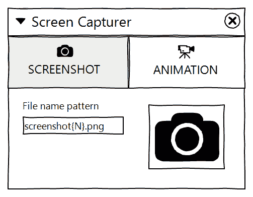
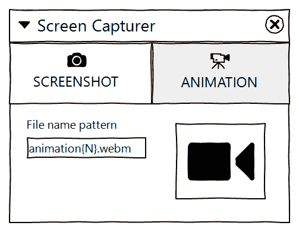
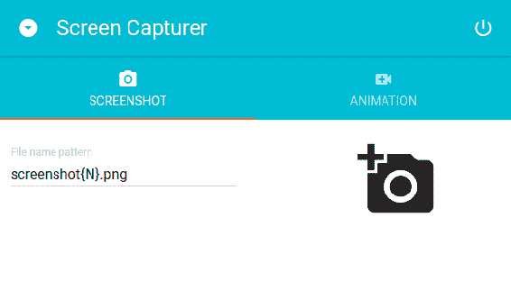
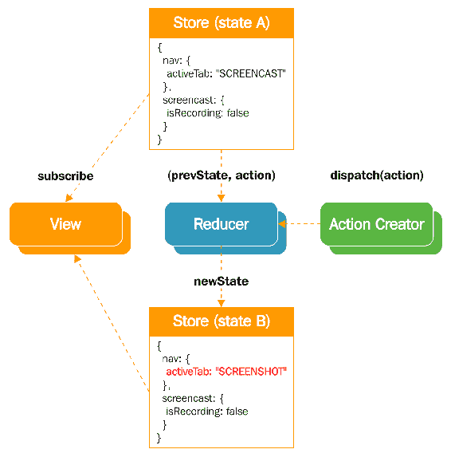

# 第五章：使用 NW.js、React 和 Redux 创建屏幕捕捉器-规划、设计和开发

在本章中，我们将开始一个新的应用程序屏幕捕捉器。使用这个工具，我们将能够截取屏幕截图和录制屏幕录像。我们将使用 Material UI 工具包的 React 组件构建应用程序，该工具包实现了 Google 的 Material Design 规范。在处理聊天示例时，我们已经积累了一些 React 的经验。现在，我们正在迈出一步，朝着可扩展和易于维护的应用程序开发迈进。我们将介绍当时最热门的库之一，名为 Redux，它管理应用程序状态。

在本章结束时，我们将拥有一个原型，它已经响应用户操作，但缺少捕获显示输入并将其保存到文件中的服务。

# 应用程序蓝图

这次，我们将开发一个屏幕捕捉工具，一个可以截取屏幕截图和录制屏幕录像的小工具。

核心思想可以用以下用户故事来表达：

+   作为用户，我可以截取屏幕截图并将其保存为`.png`文件

+   作为用户，我可以开始录制屏幕录像

+   作为用户，我可以开始录制屏幕录像并将其保存为`.webm`文件

此外，我希望在保存屏幕截图或录像文件时出现通知。我还希望将应用程序显示在系统通知区域(**托盘**)中，并响应指定的全局热键。借助 WireframeSketcher([`wireframesketcher.com/`](http://wireframesketcher.com/))，我用以下线框图说明了我的设想：



线框图暗示了一个**分页文档界面**(**TDI**)，有两个面板。第一个面板标记为屏幕截图，允许我们截取屏幕截图(照片图标)并设置输出文件的文件名模式。第二个面板(动画)看起来差不多，只是动作按钮用于开始录制屏幕录像。一旦用户点击按钮，它就会被停止录制按钮替换，反之亦然。

# 设置开发环境

我们将使用 NW.js 创建这个应用程序。正如你可能还记得第一章中所述，*使用 NW.js 创建文件资源管理器-规划、设计和开发*和第二章*使用 NW.js 创建文件资源管理器-增强和交付*，NW.js 查找启动页面链接和应用程序窗口元信息的清单文件：

`./package.json`

```js
{ 
  "name": "screen-capturer", 
  "version": "1.0.0", 
  "description": "Screen Capturer", 
  "main": "index.html",   
  "chromium-args": "--mixed-context", 
  "window": { 
    "show": true, 
    "frame": false, 
    "width": 580, 
    "height": 320, 
    "min_width": 450, 
    "min_height": 320, 
    "position": "center", 
    "resizable": true, 
    "icon": "./assets/icon-48x48.png" 
  }   
} 

```

这次，我们不需要一个大窗口。我们选择`580x320px`，并允许将窗口大小缩小到`450x320px`。我们设置窗口在屏幕中心打开，没有框架和内置窗口控件。

当我们在前两章设置 NW.js 时，我们只有很少的依赖。现在，我们将利用 React，并且需要相应的包：

```js
npm i -S react 
npm i -S react-dom 

```

至于开发依赖，显然，我们需要 NW.js 本身：

```js
npm -i -D nw 

```

与基于 React 的聊天应用程序一样，我们将使用 Babel 编译器和 Webpack 打包工具。因此，它给了我们以下内容：

```js
npm -i -D webpack 
npm -i -D babel-cli 
npm -i -D babel-core 
npm -i -D babel-loader 

```

正如我们记得的，Babel 本身是一个平台，我们需要指定它应用于编译我们源代码的确切预设。我们已经使用了这两个：

```js
npm -i -D babel-preset-es2017 
npm -i -D babel-preset-react 

```

现在，我们使用`stage-3`预设扩展列表([`babeljs.io/docs/plugins/preset-stage-3/`](https://babeljs.io/docs/plugins/preset-stage-3/))：

```js
npm -i -D babel-preset-stage-3 

```

这个插件集包括所谓的**EcmaScript**规范的**Stage 3**提案的所有功能。特别是，它包括了对象上的扩展/剩余运算符，这解锁了对象组合的最具表现力的语法。

此外，我们将应用两个不包括在 Stage 3 中的插件：

```js
npm -i -D babel-plugin-transform-class-properties 
npm -i -D babel-plugin-transform-decorators-legacy 

```

我们已经熟悉了第一个（ES 类字段和静态属性—[`github.com/tc39/proposal-class-public-fields`](https://github.com/tc39/proposal-class-public-fields)）。第二个允许我们使用装饰器（[`github.com/tc39/proposal-decorators`](https://github.com/tc39/proposal-decorators)）。

由于其他一切都准备就绪，我们将使用自动化脚本扩展清单文件：

`package.json`

```js
... 
"scripts": { 
    "start": "nw .", 
    "build": "webpack", 
    "dev": "webpack -d --watch"     
  } 

```

这些目标已经在开发聊天应用程序时使用过。第一个启动应用程序。第二个编译和捆绑源代码。第三个持续运行，并在任何源文件更改时构建项目。

对于捆绑，我们必须配置 Webpack：

`./webpack.config.js`

```js
const { join } = require( "path" ), 
      webpack = require( "webpack" ); 
      BUILD_DIR = join( __dirname, "build" ), 
      APP_DIR = join( __dirname, "js" ); 

module.exports = { 
  entry: join( APP_DIR, "app.jsx" ), 
  target: "node-webkit", 
  devtool: "source-map", 
  output: { 
      path: BUILD_DIR, 
      filename:  "app.js" 
  }, 
  module: { 
    rules: [ 
      { 
        test: /.jsx?$/, 
        exclude: /node_modules/, 
        use: [{ 
          loader: "babel-loader", 
          options: { 
            presets: [ "es2017", "react", "stage-3" ], 
            plugins: [ "transform-class-properties", "transform-decorators-legacy" ] 
          } 
        }] 
      } 
    ] 
  } 
}; 

```

因此，Webpack 将从`./js/app.jsx`开始递归捆绑 ES6 模块。它将把生成的 JavaScript 放在`./build/app.js`中。在此过程中，根据配置的预设和插件，任何请求导出的`.js/.jsx`文件都将使用 Babel 进行编译。

# 静态原型

我们使用 CSS 样式化的聊天应用程序由 Photon 框架提供。这一次，我们将使用 Material-UI 工具包的现成 React 组件（[`www.material-ui.com`](http://www.material-ui.com)）。作为开发人员，我们得到的是符合 Google Material Design 指南的可重用单元（[`material.io/guidelines/`](https://material.io/guidelines/)）。它确保在不同平台和设备尺寸上提供统一的外观和感觉。我们可以使用`npm`安装 Material-UI：

```js
npm i -S material-ui 

```

根据 Google Material Design 的要求，应用程序应支持包括移动设备在内的不同设备，在那里我们需要处理特定的事件，比如`on-tap`。目前，React 不支持它们；必须使用插件：

```js
npm i -S react-tap-event-plugin 

```

我们不打算在移动设备上运行我们的应用程序，但是如果没有插件，我们将会收到警告。

现在，当我们完成准备工作后，我们可以开始搭建脚手架，如下所示：

1.  我们添加了我们的启动 HTML：

`./index.html`

```js
<!doctype html> 
<html class="no-js" lang=""> 

<head> 
  <meta charset="utf-8"> 
  <meta http-equiv="X-UA-Compatible" content="IE=edge"> 
  <title>Screen Capturer</title> 
  <meta 
    name="viewport" 
    content="width=device-width, initial-scale=1, user-scalable=0, maximum-scale=1, minimum-scale=1" 
  > 
  <link href="https://fonts.googleapis.com/icon?family=Material+Icons" 
      rel="stylesheet"> 
  <link href="https://fonts.googleapis.com/css?family=Roboto" rel="stylesheet"> 
  <link rel="stylesheet" type="text/css" href="./assets/main.css"> 
</head> 

<body> 
  <root></root> 
  <script src="img/app.js"></script> 
</body> 

</html> 

```

在这里，在`head`元素中，我们链接了三个外部样式表。第一个（`https://fonts.googleapis.com/icon?family=Material+Icons`）解锁了 Material Icons（[`material.io/icons/`](https://material.io/icons/)）。第二个（`https://fonts.googleapis.com/css?family=Roboto`）引入了 Material Design 中广泛使用的 Roboto 字体。最后一个（`./assets/main.css`）是我们的自定义 CSS。在 body 中，我们设置了应用程序的`root`容器。我决定，为了可读性，我们可以使用一个普通的`div`而不是自定义元素。最后，我们根据我们的配置加载由 Webpack 生成的 JavaScript（`./build/app.js`）。

1.  我们添加了我们已经在`main.css`中引用的自定义样式：

`./assets/main.css`

```js
html { 
  font-family: 'Roboto', sans-serif; 
} 

body { 
  font-size: 13px; 
  line-height: 20px; 
  margin: 0; 
} 

```

1.  我们创建入口点脚本：

`./js/app.jsx`

```js
import React from "react"; 
import { render } from "react-dom"; 
import App from "./Containers/App.jsx"; 

render( <App />, document.querySelector( "root" ) ); 

```

在这里，我们导入`App`容器组件并将其渲染到 DOM 的`<root>`元素中。组件本身将如下所示：

`./js/Containers/App.jsx`

```js
import React, { Component } from "react"; 
import injectTapEventPlugin from "react-tap-event-plugin"; 
import Main from "../Components/Main.jsx"; 
import { deepOrange500 } from "material-ui/styles/colors"; 
import getMuiTheme from "material-ui/styles/getMuiTheme"; 
import MuiThemeProvider from "material-ui/styles/MuiThemeProvider"; 

injectTapEventPlugin(); 

const muiTheme = getMuiTheme({ 
  palette: { 
    accent1Color: deepOrange500 
  } 
}); 

export default class App extends Component { 
  render() { 
    return ( 
        <MuiThemeProvider muiTheme={muiTheme}> 
        <Main /> 
        </MuiThemeProvider> 
    ); 
  } 
} 

```

在这一点上，我们用 Material UI 主题提供程序包装应用程序窗格（`Main`）。通过从 Material UI 包中导入`getMuiTheme`函数，我们描述主题并将派生的配置传递给提供程序。如前所述，我们必须应用`injectTapEventPlugin`来启用 React 中框架使用的自定义事件。

现在是添加展示组件的时候了。我们从主要布局开始：

`./js/Components/Main.jsx`

```js
import React, {Component} from "react"; 

import { Tabs, Tab } from "material-ui/Tabs"; 
import FontIcon from "material-ui/FontIcon"; 

import TitleBar from "./TitleBar.jsx"; 
import ScreenshotTab from "./ScreenshotTab.jsx"; 
import AnimationTab from "./AnimationTab.jsx"; 

class Main extends Component { 

  render() { 
    const ScreenshotIcon = <FontIcon className="material-icons">camera_alt</FontIcon>; 
    const AnimationIcon = <FontIcon className="material-icons">video_call</FontIcon>; 

    return ( 
      <div> 
        <TitleBar /> 
        <Tabs> 
          <Tab 
            icon={ScreenshotIcon} 
            label="SCREENSHOT" 
          /> 
          <Tab 
            icon={AnimationIcon} 
            label="ANIMATION" 
          /> 
        </Tabs> 
        <div> 

        { true 
            ? <ScreenshotTab  /> 
            : <AnimationTab /> 
          } 
        </div> 

      </div> 
    ); 
  } 
} 

export default Main; 

```

这个组件包括标题栏、两个选项卡（`Screenshot`和`Animation`），以及有条件地，要么`ScreenshotTab`面板，要么`AnimationTab`。为了渲染选项卡菜单，我们应用了 Material UI 的`Tabs`容器和`Tab`组件作为子项。我们还使用`FontIcon` Material UI 组件来渲染 Material Design 图标。我们通过使用 props 将在渲染方法开头声明的图标分配给相应的选项卡：

`./js/Components/TitleBar.jsx`

```js
import React, { Component } from "react"; 
import AppBar from 'material-ui/AppBar'; 
import IconButton from 'material-ui/IconButton'; 
const appWindow = nw.Window.get(); 

export default function TitleBar() { 
  const iconElementLeft = <IconButton 
      onClick={() => appWindow.hide()} 
      tooltip="Hide window" 
      iconClassName="material-icons">arrow_drop_down_circle</IconButton>, 
        iconElementRight= <IconButton 
      onClick={() => appWindow.close()} 
      tooltip="Quit" 
      iconClassName="material-icons">power_settings_new</IconButton>; 

  return (<AppBar 
    className="titlebar" 

    iconElementLeft={iconElementLeft} 
    iconElementRight={iconElementRight}> 
    </AppBar>); 

} 

```

我们使用`AppBar` Material UI 组件实现标题栏。与前面的示例一样，我们预先定义图标（这次使用`IconButton`组件），并将它们传递给`AppBar`作为 props。我们为`IconButton`的点击事件设置内联处理程序。第一个隐藏窗口，第二个关闭应用程序。此外，我们为`AppBar`设置了一个自定义 CSS 类`titlebar`，因为我们将使用这个区域作为拖放的窗口句柄。因此，我们扩展了我们的自定义样式表：

`./assets/main.css`

```js
... 
.titlebar { 
  -webkit-user-select: none; 
  -webkit-app-region: drag; 
} 

.titlebar button { 
  -webkit-app-region: no-drag; 
} 

```

现在，我们需要一个代表选项卡面板的组件。我们从`ScreenshotTab`开始：

`./js/Components/ScreenshotTab.jsx`

```js
import React, { Component } from "react"; 

import IconButton from "material-ui/IconButton"; 
import TextField from "material-ui/TextField"; 

const TAB_BUTTON_STYLE = { 
  fontSize: 90 
}; 

const SCREENSHOT_DEFAULT_FILENAME = "screenshot{N}.png"; 

export default class ScreenshotTab extends Component { 

  render(){ 
    return ( 
      <div className="tab-layout"> 
        <div className="tab-layout__item"> 
            <TextField 
                floatingLabelText="File name pattern" 
                defaultValue={SCREENSHOT_DEFAULT_FILENAME} 
              /> 

          </div> 
          <div className="tab-layout__item"> 

            <IconButton 
              tooltip="Take screenshot" 
              iconClassName="material-icons" 
              iconStyle={TAB_BUTTON_STYLE}>add_a_photo</IconButton> 
          </div> 
        </div> 
      ) 
  } 
} 

```

在这里，我们使用`IconButton`来执行“截图”操作。通过传递自定义样式（`TAB_BUTTON_STYLE`）使其变得特别大。此外，我们还应用`TextField`组件以 Material Design 风格呈现文本输入。

第二个选项卡面板将会非常相似：

`./js/Components/AnimationTab.jsx`

```js
import React, { Component } from "react"; 
import IconButton from "material-ui/IconButton"; 
import TextField from "material-ui/TextField"; 

const TAB_BUTTON_STYLE = { 
  fontSize: 90 
}; 
const ANIMATION_DEFAULT_FILENAME = "animation{N}.webm"; 

export default class AnimationTab extends Component { 

  render(){ 
    return ( 
      <div className="tab-layout"> 
          <div className="tab-layout__item"> 
              <TextField 
                  floatingLabelText="File name pattern" 
                  defaultValue={ANIMATION_DEFAULT_FILENAME} 
                /> 
          </div> 
          <div className="tab-layout__item"> 

{ true ? <IconButton 
            tooltip="Stop recording" 
            iconClassName="material-icons" 
            iconStyle={TAB_BUTTON_STYLE}>videocam_off</IconButton> 
            : <IconButton 
            tooltip="Start recording" 
            iconClassName="material-icons" 
            iconStyle={TAB_BUTTON_STYLE}>videocam</IconButton> } 
          </div> 
        </div> 
      ) 
  } 
} 

```

它在这里的唯一区别是条件渲染“开始录制”按钮或“停止录制”按钮。

这基本上就是静态原型的全部内容。我们只需要打包应用程序：

```js
npm run build 

```

然后启动它：

```js
npm start

```

你将得到以下输出：



# 理解 redux

在聊天应用程序中，我们学会了管理组件状态。对于那个小例子来说，这已经足够了。然而，随着应用程序变得越来越大，你可能会注意到多个组件倾向于共享状态。我们知道如何提升状态。但是哪个组件应该管理状态？状态应该放在哪里？我们可以通过使用 Redux 来避免这种模糊不清。Redux 是一个被称为可预测状态容器的 JavaScript 库。Redux 意味着应用程序范围的状态树。当我们需要为一个组件设置状态时，我们更新全局状态树中的相应节点。所有订阅的模块立即接收更新后的状态树。因此，我们可以通过检查状态树轻松地找出应用程序的情况。我们可以随意保存和恢复整个应用程序状态。想象一下，只需稍加努力，我们就可以实现通过应用程序状态历史进行时间旅行。

我想你现在可能有点困惑。如果你没有使用过它或它的前身 Flux，这种方法可能看起来很奇怪。实际上，当你开始使用它时，你会发现它非常容易理解。所以，让我们开始吧。

Redux 有三个基本原则：

1.  应用程序中发生的一切都由状态表示。

1.  状态是只读的。

1.  状态变化是通过纯函数进行的，这些函数接受先前的状态，分派动作，并返回下一个状态。

我们通过分派动作来接收新状态。动作是一个带有唯一强制字段类型的普通对象，它接受一个字符串。我们可以为有效载荷设置任意多的任意字段：



前面的图描述了以下流程：

1.  我们有一个特定状态的存储；我们称之为 A。

1.  我们分派一个由纯函数创建的动作（称为**Action Creator**）。

1.  这会调用**Reducer**函数，并传入参数：表示状态 A 的状态对象和分派的动作对象。

1.  **Reducer**克隆提供的状态对象，并根据给定动作的定义修改克隆对象。

1.  **Reducer**返回表示新存储的对象，**状态 B**。

1.  与存储连接的任何组件都会接收新状态，并调用`render`方法以反映视图中的状态变化。

例如，在我们的应用程序中，我们将有选项卡。当用户点击它们时，相应的面板应该显示出来。因此，我们需要在状态中表示当前的`activeTab`。我们可以这样做：

```js
const action = { 
  type: "SET_ACTIVE_TAB", 
  activeTab: "SCREENSHOT" 
}; 

```

然而，我们不是直接分派动作，而是通过一个名为`actionCreator`的函数：

```js
const actionCreatorSetActiveTab = ( activeTab ) => { 
  return { 
    type: "SET_ACTIVE_TAB", 
    activeTab 
  }; 
}; 

```

该函数接受零个或多个输入参数，并生成动作对象。

**动作**表示发生了某事，但不改变状态。这是另一个名为**Reducer**的函数的任务。**Reducer**接收表示先前状态和最后分派的动作对象的对象作为参数。根据动作类型和有效负载，它产生一个新的状态对象并返回它：

```js
const initialState = { 
  activeTab: "" 
}; 

const reducer = ( state = initialState, action ) => { 
  switch ( action.type ) { 
    case "SET_ACTIVE_TAB": 
      return { ...state, activeTab: action.activeTab }; 
    default: 
      return state; 
  } 
}; 

```

在前面的例子中，我们在常量`initialState`中定义了初始应用程序状态。我们将其作为默认函数参数（[`mzl.la/2qgdNr6in`](https://mzl.la/2qgdNr6in)）与语句`state = initialState`一起使用。这意味着当参数没有传递时，`state`取`initialState`的值。

注意我们如何获得新的状态对象。我们声明了一个新的对象文字。我们在其中解构了先前的状态对象，并用来自动作有效负载的`activeTab`键值对进行扩展。减少器必须是纯函数，因此我们不能改变传递给状态对象的值。您知道，通过参数，我们接收`state`作为引用，因此如果我们简单地改变`state`中的`activeTab`字段的值，通过链接会影响函数范围之外的相应对象。我们必须确保先前的状态是不可变的。因此，我们为此创建一个新对象。解构是一种相当新的方法。如果您对此感到不舒服，可以使用`Object.assign`：

```js
return Object.assign( {}, state, { activeTab: action.activeTab } ); 

```

对于我们的应用程序，我们将只使用一个减少器，但一般情况下，我们可能会有很多。我们可以使用`redux`导出的`combineReducers`函数来组合多个减少器，使每个减少器代表全局状态树的一个独立分支。

我们将`redux`的`createStore`函数传递给减少器（也可以是`combineReducers`的产物）。该函数生成存储：

```js
import { createStore } from "redux"; 
const store = createStore( reducer ); 

```

如果我们在服务器端渲染 React 应用程序，我们可以将状态对象暴露到 JavaScript 全局作用域中（例如`window.STATE_FROM_SERVER`），并从客户端进行连接：

`const store = createStore( reducer, window.STATE_FROM_SERVER );`

现在是最激动人心的部分。我们订阅存储事件：

```js
store.subscribe(() => { 
  console.log( store.getState() ); 
}); 

```

然后我们将分派一个动作：

```js
store.dispatch( actionCreatorSetActiveTab( "SCREENSHOT" ) ); 

```

在分派时，我们创建了类型为`SET_ACTIVE_TAB`的动作，并在有效负载中将`activeTab`设置为`SCREENSHOT`。因此，存储更新处理程序中的`console.log`打印相应更新的新状态：

```js
{ 
  activeTab: "SCREENSHOT" 
} 

```

# 引入应用程序状态

在对 Redux 进行了简要介绍之后，我们将把新获得的知识应用到实践中。首先，我们将安装`redux`包：

```js
npm i -S redux 

```

我们还将使用额外的辅助库`redux-act`（[`github.com/pauldijou/redux-act`](https://github.com/pauldijou/redux-act)）来简化动作创建者和减少器的声明。通过使用这个库，我们可以在减少器中使用动作创建者函数作为引用，放弃`switch( action.type )`构造，而采用更短的映射语法：

```js
npm i -S redux-act 

```

对于屏幕截图，我们应执行以下操作：

+   `SET_ACTIVE_TAB`：接收所选选项卡的标识符

+   `TOGGLE_RECORDING`：开始录屏时接收`true`，结束时接收`false`

+   `SET_SCREENSHOT_FILENAME`：在面板截图中接收输出文件名

+   `SET_SCREENSHOT_INPUT_ERROR`：当输入错误发生时接收消息

+   `SET_ANIMATION_FILENAME`：在面板动画中接收输出文件名

+   `SET_ANIMATION_INPUT_ERROR`：当输入错误发生时接收消息

实现如下：

`./js/Actions/index.js`

```js
import { createStore } from "redux"; 
import { createAction } from "redux-act"; 

export const toggleRecording = createAction( "TOGGLE_RECORDING",  
  ( toggle ) => ({ toggle }) ); 
export const setActiveTab = createAction( "SET_ACTIVE_TAB",  
  ( activeTab ) => ({ activeTab }) ); 
export const setScreenshotFilename = createAction( "SET_SCREENSHOT_FILENAME",  
   ( filename ) => ({ filename }) ); 
export const setScreenshotInputError = createAction( "SET_SCREENSHOT_INPUT_ERROR",  
   ( msg ) => ({ msg }) ); 
export const setAnimationFilename = createAction( "SET_ANIMATION_FILENAME",  
   ( filename ) => ({ filename }) ); 
export const setAnimationInputError = createAction( "SET_ANIMATION_INPUT_ERROR",  
  ( msg ) => ({ msg }) ); 

```

而不是规范的语法，我们有：

```js
export const setActiveTab =  ( activeTab ) => { 
  return { 
    type: "SET_ACTIVE_TAB", 
    activeTab 
  }; 
} 

```

我们使用了更简短的方法，通过`redux-act`的`createAction`函数实现：

```js
export const setActiveTab = createAction( "SET_ACTIVE_TAB",  
  ( activeTab ) => ({ activeTab }) ); 

```

另一个函数`createReducer`由`redux-act`导出，使得减少声明更加简洁：

`./js/Reducers/index.js`

```js
import { createStore } from "redux"; 
import { createReducer } from "redux-act"; 
import * as Actions from "../Actions"; 
import { TAB_SCREENSHOT, SCREENSHOT_DEFAULT_FILENAME, ANIMATION_DEFAULT_FILENAME } from "../Constants"; 

const DEFAULT_STATE = { 
  isRecording: false, 
  activeTab: TAB_SCREENSHOT, 
  screenshotFilename: SCREENSHOT_DEFAULT_FILENAME, 
  animationFilename: ANIMATION_DEFAULT_FILENAME, 
  screenshotInputError: "", 
  animationInputError: "" 
}; 

export const appReducer = createReducer({ 
  [ Actions.toggleRecording ]: ( state, action ) => ({ ...state, isRecording: action.toggle }), 
  [ Actions.setActiveTab ]: ( state, action ) => ({ ...state, activeTab: action.activeTab }), 
  [ Actions.setScreenshotFilename ]: ( state, action ) => ({ ...state, screenshotFilename: action.filename }), 
  [ Actions.setScreenshotInputError ]: ( state, action ) => ({ ...state, screenshotInputError: action.msg }), 
  [ Actions.setAnimationFilename ]: ( state, action ) => ({ ...state, animationFilename: action.filename }), 
  [ Actions.setAnimationInputError ]: ( state, action ) => ({ ...state, animationInputError: action.msg }) 
}, DEFAULT_STATE ); 

```

我们不需要像在 Redux 介绍中那样使用`switch`语句描述减少器条件：

```js
const reducer = ( state = initialState, action ) => { 
  switch ( action.type ) { 
    case "SET_ACTIVE_TAB": 
      return { ...state, activeTab: action.activeTab }; 
    default: 
      return state; 
  } 
}; 

```

`createReducer`函数为我们做到了这一点：

```js
export const appReducer = createReducer({ 
  [ Actions.setActiveTab ]: ( state, action ) => ({ ...state, activeTab: action.activeTab }), 
}, DEFAULT_STATE ); 

```

该函数接受一个类似映射的对象，在其中我们将操作创建函数用作键（例如，`[ Actions.setActiveTab ]`）。是的，对于动态对象键，我们必须使用称为**计算属性名称**的语法[`mzl.la/2erqyrj`](https://mzl.la/2erqyrj)。作为对象值，我们使用回调函数来生成新状态。

在此示例中，我们克隆了旧状态（`{...state}`）并在派生对象中更改了`activeTab`属性值。

如果您注意到了，我们使用了`Constants/index.js`中的导入。在该模块中，我们将封装应用程序范围的常量：

`./js/Constants/index.js`

```js
export const TAB_SCREENSHOT = "TAB_SCREENSHOT"; 
export const TAB_ANIMATION = "TAB_ANIMATION"; 
export const SCREENSHOT_DEFAULT_FILENAME = "screenshot{N}.png"; 
export const ANIMATION_DEFAULT_FILENAME = "animation{N}.webm"; 

```

好了，我们有了操作和一个减速器。现在是创建存储并将其连接到应用程序的时候了：

`./js/Containers/App.jsx`

```js
import React from "react"; 
import { render } from "react-dom"; 
import { createStore } from 'redux'; 
import { Provider } from "react-redux"; 
import App from "./Containers/App.jsx"; 
import { appReducer } from "./Reducers"; 

const store = createStore( appReducer ); 

render(<Provider store={store}> 
  <App /> 
 </Provider>, document.querySelector( "root" ) ); 

```

我们使用`redux`的`createStore`函数构建存储。然后，我们使用`react-redux`包提供的`Provider`将`App`组件包装起来。不要忘记安装依赖：

```js
npm i -S react-redux 

```

**Provider**接受之前创建的存储作为 props，并使其对另一个`react-redux`函数`connect`可用。我们将在我们的`App`容器组件中使用这个函数：

`./js/Containers/App.jsx`

```js
//... 
import { connect } from "react-redux"; 
import { bindActionCreators } from "redux"; 
import * as Actions from "../Actions"; 

const mapStateToProps = ( state ) => ({ states: state }); 
const mapDispatchToProps = ( dispatch ) => ({ 
  actions: bindActionCreators( Actions, dispatch ) 
}); 

class App extends Component { 
  render() { 
    return ( 
        <MuiThemeProvider muiTheme={muiTheme}> 
        <Main {...this.props} /> 
        </MuiThemeProvider>    ); 
  } 
} 

export default connect( mapStateToProps, mapDispatchToProps)( App ); 

```

在这里，我们定义了两个`connect`接受的映射函数。第一个`mapStateToProps`将存储的状态映射到 props。通过语句`( state ) => ({ states: state })`，我们使存储状态在组件中作为`this.props.states`可用。第二个`mapDispatchToProps`将我们的操作映射到 props。回调函数自动从`connect`函数中接收到与存储绑定的`dispatch`。结合`redux`的`bindActionCreators`函数，我们可以将一组操作映射到 props。因此，我们将所有可用的操作作为普通对象`Actions`导入，并将其传递给`bindActionCreators`。返回值映射到`actions`字段，因此将在组件中作为`this.props.actions`可用。

最后，我们将组件传递给`connect`生成的函数。它扩展了组件，我们将其导出到上游。这个表达式可能看起来有点令人困惑。实际上，我们在这里做的是在不显式修改组件本身的情况下修改组件的行为。在面向对象编程语言中，传统上，我们使用装饰器模式来实现它（[`en.wikipedia.org/wiki/Decorator_pattern`](https://en.wikipedia.org/wiki/Decorator_pattern)）。如今，许多语言都具有内置的功能，比如 C#中的属性，Java 中的注解和 Python 中的装饰器。ECMAScript 也有一个提案，[`tc39.github.io/proposal-decorators/`](https://tc39.github.io/proposal-decorators/)，用于装饰器。因此，通过使用声明性语法，我们可以修改类或方法的形状而不触及其代码。我们在 Webpack 配置中使用的插件`babel-plugin-transform-decorators-legacy`为我们解锁了这个功能。因此，我们已经可以用它来连接组件到存储：

```js
@connect( mapStateToProps, mapDispatchToProps ) 
export default class App extends Component { 
  render() { 
    return ( 
        <MuiThemeProvider muiTheme={muiTheme}> 
        <Main {...this.props} /> 
        </MuiThemeProvider>    ); 
  } 
} 

```

从容器中，我们渲染`Main`组件，并将容器的所有 props 传递给它（通过解构父 props`{...this.props}`）。因此，`Main`在 props 中接收到了映射的状态和操作。我们可以使用以下内容：

`./js/Components/Main.jsx`

```js
import React, {Component} from "react"; 
import { Tabs, Tab } from "material-ui/Tabs"; 
import FontIcon from "material-ui/FontIcon"; 

import TitleBar from "./TitleBar.jsx"; 
import ScreenshotTab from "./ScreenshotTab.jsx"; 
import AnimationTab from "./AnimationTab.jsx"; 
import { TAB_SCREENSHOT, TAB_ANIMATION } from "../Constants"; 

class Main extends Component { 

  onTabNav = ( tab ) => { 
    const { actions } = this.props; 
    return () => { 
      actions.setActiveTab( tab ); 
    }; 
  } 

  render() { 
    const ScreenshotIcon = <FontIcon className="material-icons">camera_alt</FontIcon>; 
    const AnimationIcon = <FontIcon className="material-icons">video_call</FontIcon>; 
    const { states, actions } = this.props; 

    return ( 
      <div> 
        <TitleBar /> 
        <Tabs> 
          <Tab 
            onClick={this.onTabNav( TAB_SCREENSHOT )} 
            icon={ScreenshotIcon} 
            label="SCREENSHOT" 
          /> 
          <Tab 
            onClick={this.onTabNav( TAB_ANIMATION )} 
            icon={AnimationIcon} 
            label="ANIMATION" 
          /> 
        </Tabs> 
        <div> 

        { states.activeTab === TAB_SCREENSHOT 
            ? <ScreenshotTab {...this.props} /> 
            : <AnimationTab {...this.props} /> 
          } 
        </div> 

      </div> 
    ); 
  } 
} 

export default Main; 

```

你还记得，这个组件用于标签菜单。我们在这里订阅了*点击标签*事件。我们不直接订阅处理程序，而是订阅了一个函数`this.onTabNav`，该函数绑定到实例范围，根据传入的标签键生成预期的处理程序。构造的处理程序接收闭包中的键，并将其传递给从`this.props.actions`中提取的`setActiveTab`动作创建者。动作被调度，全局状态发生变化。从组件的角度来看，这就像调用`setState`，导致组件更新。从`this.props.state`中提取的`activeTab`字段相应地改变其值，组件呈现与通过`this.onTabNav`传递的键匹配的面板。

至于面板，我们已经可以将文件名表单连接到状态：

`./js/Components/ScreenshotTab.jsx`

```js
import React, { Component } from "react"; 
import IconButton from "material-ui/IconButton"; 
import TextField from "material-ui/TextField"; 
import { TAB_BUTTON_STYLE, SCREENSHOT_DEFAULT_FILENAME } from "../Constants"; 

export default class ScreenshotTab extends Component { 

  onFilenameChange = ( e ) => { 
    const { value } = e.target; 
    const { actions } = this.props; 
    if ( !value.endsWith( ".png" ) || value.length < 6 ) { 
      actions.setScreenshotInputError( "File name cannot be empty and must end with .png" ); 
      return; 
    } 
    actions.setScreenshotInputError( "" ); 
    actions.setScreenshotFilename( value ); 
  } 

  render(){ 
    const { states } = this.props; 
    return ( 
      <div className="tab-layout"> 
        <div className="tab-layout__item"> 
            <TextField 
                onChange={this.onFilenameChange} 
                floatingLabelText="File name pattern" 
                defaultValue={SCREENSHOT_DEFAULT_FILENAME} 
                errorText={states.screenshotInputError} 
              /> 

          </div> 
          <div className="tab-layout__item"> 

            <IconButton 
              tooltip="Take screenshot" 
              iconClassName="material-icons" 
              iconStyle={TAB_BUTTON_STYLE}>add_a_photo</IconButton> 
          </div> 
        </div> 
      ) 
  } 
} 

```

在这里，我们为`TextField`的`change`事件订阅了`this.onFilenameChange`处理程序。因此，如果用户输入`this.onFilenameChange`，它会调用并验证输入。如果当前值的长度小于六个字符或不以`.png`结尾，则被视为无效。因此，我们使用从`this.props.actions`中提取的`setScreenshotInputError`动作创建者来设置错误消息的值。一旦完成，状态的`screenshotInputError`字段以及`TextField`组件的`errorText`属性都会发生变化，错误消息就会显示出来。如果文件名有效，我们会调度`setScreenshotInputError`动作来重置错误消息。我们通过调用动作创建者`setScreenshotFilename`来改变状态树中的截图文件名。

如果你注意到了，我们将`IconButton`的自定义样式封装在常量模块中，这样它就可以在两个面板之间共享。但是我们必须将新的常量添加到模块中：

`./js/Constants/index.js`

```js
export const TAB_BUTTON_STYLE = { 
  fontSize: 90 
}; 

```

第二个面板除了表单验证之外，还会改变状态字段`isRecording`：

`./js/Components/AnimationTab.jsx`

```js
import React, { Component } from "react"; 
import IconButton from "material-ui/IconButton"; 
import TextField from "material-ui/TextField"; 
import { TAB_BUTTON_STYLE, ANIMATION_DEFAULT_FILENAME } from "../Constants"; 

export default class AnimationTab extends Component { 

  onRecord = () => { 
    const { states } = this.props; 
    this.props.actions.toggleRecording( true ); 
  } 

  onStop = () => { 
    this.props.actions.toggleRecording( false ); 
  } 

  onFilenameChange = ( e ) => { 
    const { value } = e.target; 
    const { actions } = this.props; 
    if ( !value.endsWith( ".webm" ) || value.length < 7 ) { 
      actions.setAnimationInputError( "File name cannot be empty and must end with .png" ); 
      return; 
    } 
    actions.setAnimationInputError( "" ); 
    actions.setAnimationFilename( value ); 
  } 

  render(){ 
    const { states } = this.props; 
    return ( 
      <div className="tab-layout"> 
          <div className="tab-layout__item"> 
              <TextField 
                  onChange={this.onFilenameChange} 
                  floatingLabelText="File name pattern" 
                  defaultValue={ANIMATION_DEFAULT_FILENAME} 
                  errorText={states.animationInputError} 
                /> 
          </div> 
          <div className="tab-layout__item"> 

{ states.isRecording ? <IconButton 
            onClick={this.onStop} 
            tooltip="Stop recording" 
            iconClassName="material-icons" 
            iconStyle={TAB_BUTTON_STYLE}>videocam_off</IconButton> 
            : <IconButton 
            onClick={this.onRecord} 
            tooltip="Start recording" 
            iconClassName="material-icons" 
            iconStyle={TAB_BUTTON_STYLE}>videocam</IconButton> } 
          </div> 
        </div> 
      ) 
  } 
}

```

我们订阅了开始录制和停止录制按钮的点击事件处理程序。当用户点击第一个按钮时，`this.onRecord`处理程序调用动作创建者`toggleRecording`，将状态字段`isRecording`设置为`true`。这导致组件更新。根据新的状态，它用停止录制按钮替换开始录制按钮。反之亦然，如果在`this.onStop`处理程序中点击停止录制，我们调用`toggleRecording`将状态属性`isRecording`设置为`false`。组件相应地更新。

现在，我们可以构建应用程序并运行它：

```js
npm run build 
npm start 

```

注意到当我们切换标签、编辑文件名或切换开始/停止录制时，应用程序会按我们的意图做出响应。

# 总结

在本章中，我们熟悉了谷歌的 Material Design 的基础知识。我们使用 Material-UI 组件集中的现成的 React 组件构建了静态原型。我们对 Redux 状态容器进行了介绍。我们定义了应用程序状态树并设置了状态改变器。我们创建了全局状态存储并将其连接到容器组件。我们通过 props 将暴露的动作创建者和状态树主干传递给呈现组件。我们检查了`redux-act`库提供的更短的动作/减速器声明语法。我们通过使用 Redux 状态机动作来实现它，例如标签导航、录制切换和表单验证。
