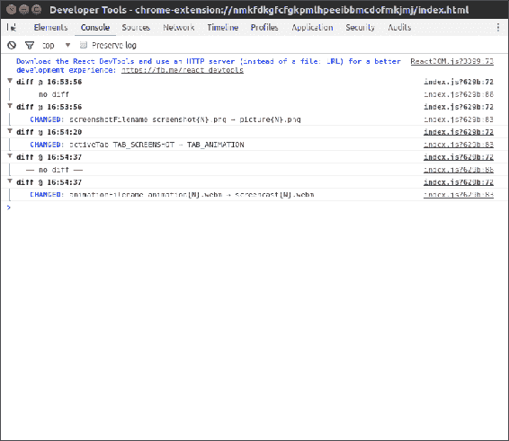
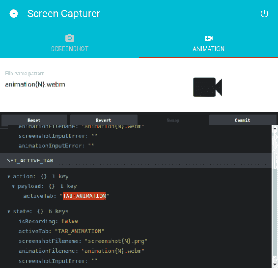
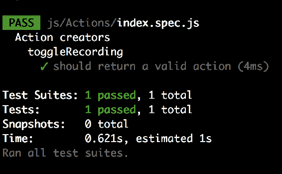
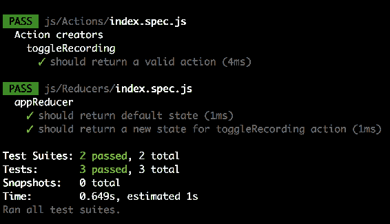
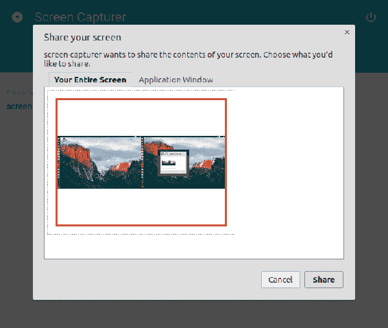
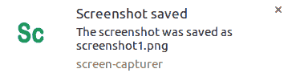
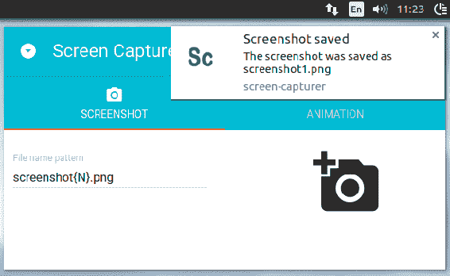
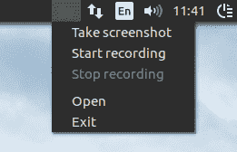

# 第六章：使用 NW.js 创建屏幕捕捉器：增强、工具和测试

在第五章中，*使用 NW.js、React 和 Redux 创建屏幕捕捉器-规划、设计和开发*，我们应用了 Redux 存储来管理应用程序状态。现在，我们将看看如何使用中间件来为工具化 Redux，并如何对 Redux 进行单元测试。

然而，本章的主要目标是最终教会我们的屏幕捕捉器如何拍摄截图和录制屏幕录像。为此，您将学习如何使用 WebRTC API 来捕获和记录媒体流。我们将通过使用画布从流中生成静止帧图像。我们将实践通知 API，以通知用户有关执行的操作，而不管焦点在哪个窗口。我们将向系统托盘添加菜单，并将其与应用程序状态绑定。我们将通过全局键盘快捷键使捕捉操作可用。

# 工具化 Redux

在第五章*，* *使用 NW.js、React 和 Redux 创建屏幕捕捉器-规划、设计和开发*，您已经学会了 Redux 状态容器的基本知识。我们使用 Redux 构建了一个功能原型。但是，在构建自己的应用程序时，您可能需要知道状态树的变化发生的时间和内容。

幸运的是，Redux 接受中间件模块来处理横切关注点。这个概念与 Express 框架的概念非常相似。我们可以通过挂接第三方模块来扩展 Redux，当一个操作被分派但尚未到达减速器时。编写自定义记录器并没有太多意义，因为已经有很多可用的记录器（[`bit.ly/2qINXML`](http://bit.ly/2qINXML)）。例如，为了跟踪状态树中的更改，我们可以使用`redux-diff-logger`模块，它只报告状态的差异，这样更容易阅读。因此，我们将安装该软件包（`npm i -S redux-diff-logger`）并在入口脚本中添加几行代码：

`./js/app.jsx`

```js
import { createStore, applyMiddleware, compose } from "redux"; 
import logger from 'redux-diff-logger'; 
const storeEnhancer = compose( 
        applyMiddleware( logger ) 
      ); 

const store = createStore( appReducer, storeEnhancer ); 

```

在这里，我们从`redux-diff-logger`中导出`logger`，并将其传递给`redux`模块的`applyMiddleware`函数，以创建一个存储增强器。存储增强器将给定的中间件应用于存储的`dispatch`方法。使用`redux`的`compose`函数，我们可以组合多个增强器。我们将导数作为第二个参数传递给`createStore`函数。

现在，我们可以构建项目并启动它。我们可以在 UI 中进行一些操作，并查看 DevTools。JavaScript 控制台面板将输出我们引起的状态差异：



通过 redux-diff-logger 中间件，我们在 DevTools 的 JavaScript 控制台中收到报告，当我们执行任何导致状态更改的操作时。例如，我们修改了截图文件名模板，这立即反映在控制台中。实际上，我们收到了一个全新的状态树对象，但 redux-diff-logger 足够聪明，只显示我们真正感兴趣的内容 - 状态的差异。

# Redux DevTools

记录报告已经是一件事，但如果我们能够获得像`DevTools`这样的工具与状态进行交互，那将更有用。第三方软件包`redux-devtools`带来了一个可扩展的环境，支持状态实时编辑和时间旅行。我们将与另外两个模块`redux-devtools-log-monitor`和`redux-devtools-dock-monitor`一起研究它。第一个允许我们检查状态和时间旅行。第二个是一个包装器，当我们按下相应的热键时，将 Redux DevTools UI 停靠到窗口边缘。为了看到它的效果，我们将创建一个新的组件来描述 DevTools：

`./js/Components/DevTools.jsx`

```js
import React from "react"; 
import { createDevTools } from "redux-devtools"; 
import LogMonitor from "redux-devtools-log-monitor"; 
import DockMonitor from "redux-devtools-dock-monitor"; 

const DevTools = createDevTools( 
  <DockMonitor toggleVisibilityKey="ctrl-h" 
               changePositionKey="ctrl-q" 
               defaultPosition="bottom" 
               defaultIsVisible={true}> 
    <LogMonitor theme="tomorrow" /> 
  </DockMonitor> 
); 

export default DevTools; 

```

我们使用`createDevTools`函数来创建组件。它接受 JSX，我们可以通过`DockMonitor`的 props 配置 React DevTools UI 的可见性和位置，以及`LogMonitor`中的颜色主题。

派生的组件公开了`instrument`方法，它作为存储增强器返回。因此，我们可以将其传递给`compose`函数：

`./js/app.jsx`

```js
import DevTools from "./Components/DevTools.jsx"; 

const storeEnhancer = compose( 
        applyMiddleware( logger ), 
        DevTools.instrument() 
      ); 

const store = createStore( appReducer, storeEnhancer ); 

```

在`DevTools`组件本身中，我们必须将其添加到 DOM 中：

```js
render(<Provider store={store}> 
  <div> 
    <App /> 
    <DevTools /> 
  </div> 
 </Provider>, document.querySelector( "root" ) ); 

```

现在，当我们运行应用程序时，我们可以看到 dock。我们可以按下*Ctrl* + *Q*来改变它的位置，按下*Ctrl* + *H*来隐藏或显示它：



# 单元测试 Redux

我们已经在第四章中玩过 Jest 测试框架，Chat System with Electron and React: Enhancement, Testing, and Delivery（编写单元测试部分）。Redux 引入了新的概念，比如动作和减速器。现在，我们要对它们进行单元测试。

正如你可能记得的，要运行 Jest，我们需要配置 Babel：

`.babelrc`

```js
{ 
  "presets": [ 
     ["env", { 
      "targets": { "node": 7 }, 
      "useBuiltIns": true 
    }], 
    "react", 
    "stage-3" 
  ], 

  "plugins": [ 
    "transform-class-properties", 
    "transform-decorators-legacy" 
  ] 
} 

```

同样，使用`env`预设，我们针对 Node.js 7 上的 Babel，并启用了在 webpack 配置中使用的额外插件。

# 测试动作创建者

实际上，动作创建者非常简单，因为它们是纯函数。我们根据函数接口传入输入并验证输出：

`./js/Actions/index.spec.js`

```js
import { createStore } from "redux"; 
import { toggleRecording } from "./index"; 

describe( "Action creators", () => { 
  describe( "toggleRecording", () => { 
    it( "should return a valid action", () => { 
      const FLAG = true, 
            action = toggleRecording( FLAG ); 
            expect( action.payload ).toEqual( { toggle: FLAG } ); 
    }); 
  }); 
}); 

```

我们已经为`toggleRecording`函数编写了一个测试。我们断言这个函数产生的动作对象在 payload 中有`{ toggle: FLAG }`。正如前一章所述，任何动作都应该有一个强制属性`type`。当我们在调用`redux-act`模块的`createAction`函数时省略描述时，派生的动作创建者将产生具有动态生成标识符的动作，这几乎无法测试。然而，我们给它一个字符串作为第一个参数，例如`TOGGLE_RECORDING`：

```js
  const toggleRecording = createAction( "TOGGLE_RECORDING", ( toggle ) => ({ toggle }) ); 

this becomes the unique identifier and therefore we can expect it in type property. 

expect( action.type ).toEqual( "TOGGLE_RECORDING" ); 

```



我们可以以几乎相同的方式测试当前应用程序中的每个动作创建者。

# 测试减速器

减速器和动作创建者都是纯函数。它们接受最后的状态树对象和分派的动作作为参数，并产生一个新的状态树对象。因此，在测试减速器时，我们正在检查给定的动作是否按预期修改了状态：

`./js/Reducers/index.spec.js`

```js
import { createStore } from "redux"; 
import { createReducer } from "redux-act"; 
import { TAB_SCREENSHOT, SCREENSHOT_DEFAULT_FILENAME, ANIMATION_DEFAULT_FILENAME } from "../Constants"; 
import { appReducer } from "./index"; 

describe( "appReducer", () => { 
  it( "should return default state", () => { 
    const DEFAULT_STATE = { 
      isRecording: false, 
      activeTab: TAB_SCREENSHOT, 
      screenshotFilename: SCREENSHOT_DEFAULT_FILENAME, 
      animationFilename: ANIMATION_DEFAULT_FILENAME, 
      screenshotInputError: "", 
      animationInputError: "" 
    }; 
    expect( appReducer() ).toEqual( DEFAULT_STATE ); 
  }); 

 }); 

```

对于 Redux 来说，第一次调用我们的减速器时，状态是`undefined`。我们期望减速器接受一个预定义对象作为默认状态。因此，如果我们不带参数调用该函数，它应该在入口点接收默认状态并在没有给定动作的情况下返回它而不进行修改。

另一方面，我们可以导入一个动作创建者：

```js
import { toggleRecording } from "../Actions"; 

```

创建一个动作并将其传递给减速器：

```js
it( "should return a new state for toggleRecording action", () => { 
    const FLAG = true, 
          action = toggleRecording( FLAG ), 
          newState = appReducer( undefined, action ); 
    expect( newState.isRecording ).toEqual( FLAG ); 
  }); 

```

因此，我们测试减速器是否产生了一个新的状态，根据给定的动作进行了更改。调用`toggleRecording(true)`创建的动作应该将状态对象属性`isRecording`设置为 true。这就是我们在测试中断言的内容：



# 截取屏幕截图

先前创建的静态原型可能看起来很花哨，但用处不大。我们需要一个能够截取屏幕截图和录制屏幕录像的服务。

如果是关于应用程序窗口的屏幕截图，我们可以简单地使用 NW.js 的 API：

```js
import * as fs from "fs"; 
function takeScreenshot( filePath ){ 
  appWindow.capturePage(( img ) => { 
    fs.writeFileSync( filePath, img, "base64" ); 
  }, { 
    format : "png", 
    datatype : "raw" 
  }); 
} 

```

但是我们需要屏幕截图，因此我们必须获得显示输入的访问权限。W3C 包括了一份规范草案，“媒体捕获和流”（[`bit.ly/2qTtLXX`](http://bit.ly/2qTtLXX)），其中描述了捕获显示媒体的 API（`mediaDevices.getDisplayMedia`）。不幸的是，在撰写本文时，它尚未得到 NW.js 或任何浏览器的支持。然而，我们仍然可以使用`webkitGetUserMedia`，它可以流式传输桌面输入。这个 API 曾经是被称为 WebRTC 的技术的一部分（[`webrtc.org`](https://webrtc.org)），旨在实现实时视频、音频和数据通信。

然而，目前它已从规范中删除，但仍然在 NW.js 和 Electron 中可用。看起来我们真的没有选择，所以我们就这样做吧。

`webkitGetUserMedia`接受所谓的`MediaStreamConstraints`对象，描述我们想要捕获的内容，并返回一个 promise。在我们的情况下，约束对象可能如下所示：

```js
{ 
    audio: false, 
    video: { 
     mandatory: { 
      chromeMediaSource: "desktop", 
      chromeMediaSourceId: desktopStreamId, 
      minWidth: 1280, 
      maxWidth: 1920, 
      minHeight: 720, 
      maxHeight: 1080 
     } 
   } 
} 

```

我们禁用音频录制，为视频设置边界（`webkitGetUserMedia`根据您的显示分辨率确定合适的大小。当分辨率不符合范围时，会导致`OverconstrainedError`），并描述媒体来源。但是我们需要一个有效的媒体流 ID。我们可以从 NW.js API 中获取，例如：

```js
nw.Screen.chooseDesktopMedia([ "window", "screen" ], ( mediaStremId ) => { 
      // mediaStremId 
    }); 

```

当所有内容结合在一起时，我们得到以下的服务：

`./js/Service/Capturer.js`

```js
import * as fs from "fs"; 
const appWindow = nw.Window.get(); 

export default class Capturer { 

  constructor(){  
    nw.Screen.chooseDesktopMedia([ "window", "screen" ], ( id) => { 
      this.start( id ); 
    }); 
  } 

  takeScreenshot( filename ){ 
    console.log( "Saving screensho" ); 
  } 

  start( desktopStreamId ){ 
    navigator.webkitGetUserMedia({ 
        audio: false, 
        video: { 
          mandatory: { 
            chromeMediaSource: "desktop", 
            chromeMediaSourceId: desktopStreamId, 
            minWidth: 1280, 
            maxWidth: 1920, 
            minHeight: 720, 
            maxHeight: 1080 
          } 
        } 
      }, ( stream ) => { 
        // stream to HTMLVideoElement 

      }, ( error ) => { 
        console.log( "navigator.getUserMedia error: ", error ); 
      }); 

  } 
} 

```

运行时，我们会得到一个对话框提示我们选择媒体来源：



我不太喜欢这个用户体验。我宁愿让它检测桌面媒体。我们可以通过以下方法实现：

```js
static detectDesktopStreamId( done ){ 
    const dcm = nw.Screen.DesktopCaptureMonitor; 
    nw.Screen.Init(); 
    // New screen target detected 
    dcm.on("added", ( id, name, order, type ) => { 
      // We are interested only in screens 
      if ( type !== "screen" ){ 
        return; 
      } 
      done( dcm.registerStream( id ) ); 
      dcm.stop(); 
    }); 
    dcm.start( true, true ); 
  } 

```

我们使用 NW.js API 的`DesktopCaptureMonitor`来检测可用的媒体设备，拒绝应用窗口（类型为`"screen"`），并使用`registerStream`方法获取媒体流 ID。现在，我们用我们自定义的方法`detectDesktopStreamId`替换 NW.js API 的`chooseDesktopMedia`：

```js
  constructor(){ 
    Capturer.detectDesktopStreamId(( id ) => { 
      this.start( id ); 
    }); 
  } 

```

好吧，我们设法接收到了流。我们必须将它指向某个地方。我们可以创建一个隐藏的`HTMLVideoElement`并将其用作视频流接收器。我们将这个功能封装在一个单独的模块中：

`./js/Service/Capturer/Dom.js`

```js
export default class Dom { 

  constructor(){ 
    this.canvas = document.createElement("canvas") 
    this.video = Dom.createVideo(); 
  } 

   static createVideo(){ 
    const div = document.createElement( "div" ), 
          video = document.createElement( "video" ); 
    div.className = "preview"; 
    video.autoplay = true; 
    div.appendChild( video ); 
    document.body.appendChild( div ); 
    return video; 
  } 

 } 

```

在构造过程中，该类创建一个新的 DIV 容器和其中的视频元素。容器被附加到 DOM。我们还需要用 CSS 支持新元素：

`./assets/main.css`

```js
.preview { 
  position: absolute; 
  left: -999px; 
  top: -999px; 
  width: 1px; 
  height: 1px; 
  overflow: hidden; 
}  

```

基本上，我们将容器移出视图。因此，视频将被流式传输到隐藏的`HTMLVideoElement`中。现在的任务是捕获静止帧并将其转换为图像。我们可以用以下的技巧来做到这一点：

```js
  getVideoFrameAsBase64() { 
    const context = this.canvas.getContext("2d"), 
          width = this.video.offsetWidth, 
          height = this.video.offsetHeight; 

    this.canvas.width = width; 
    this.canvas.height = height; 

    context.drawImage( this.video, 0, 0, width, height ); 

    return this.canvas.toDataURL("image/png") 
      .replace( /^data:image\/png;base64,/, "" ); 

  } 

```

我们创建一个与视频大小匹配的画布上下文。通过使用上下文方法`drawImage`，我们从视频流中绘制图像。最后，我们将画布转换为数据 URI，并通过去除`data:scheme`前缀来获取 Base64 编码的图像。

我们将我们的`Dom`模块实例注入`Capturer`服务作为依赖项。为此，我们需要修改构造函数：

`./js/Service/Capturer.js`

```js
constructor( dom ){     
     this.dom = dom; 
    Capturer.detectDesktopStreamId(( id ) => { 
      this.start( id ); 
    }); 
  } 

```

我们还需要将媒体流转发到`HTMLVideoElement`中：

```js
start( desktopStreamId ){ 
    navigator.webkitGetUserMedia( /* constaints */, ( stream ) => { 
        this.dom.video.srcObject = stream; 
      }, ( error ) => { 
        console.log( "navigator.getUserMedia error: ", error ); 
      }); 
} 

```

我们还添加了一个保存屏幕截图的方法：

```js
takeScreenshot( filename ){ 
    const base64Data = this.dom.getVideoFrameAsBase64(); 
    fs.writeFileSync( filename, base64Data, "base64" ); 
  } 

```

现在，当在组件中调用这个方法时，图像会悄悄地保存。说实话，这并不是很用户友好。用户按下按钮，却没有收到关于图像是否真的保存了的信息。我们可以通过显示桌面通知来改善用户体验：

```js
const ICON = `./assets/icon-48x48.png`; 
//...  
takeScreenshot( filename ){ 
    const base64Data = this.dom.getVideoFrameAsBase64(); 
    fs.writeFileSync( filename, base64Data, "base64" ); 
    new Notification( "Screenshot saved",  { 
      body: `The screenshot was saved as ${filename}`, 
      icon: `./assets/icon-48x48.png` 
    }); 

  } 

```

现在，当新创建的屏幕截图被保存时，相应的消息会在系统级别显示。因此，即使应用程序窗口被隐藏（例如，我们使用系统托盘或快捷方式），用户仍然会收到通知：



# 录制屏幕截图

实际上，在构建用于截图的服务时，我们已经完成了大部分录屏的工作。我们已经有了`webkitGetUserMedia`提供的`MediaStream`对象。我们只需要一种方法来定义录制的开始和结束，并将收集的帧保存在视频文件中。这就是我们可以从`MediaStream` Recording API 中受益的地方，它捕获由`MedaStream`或`HTMLMediaElement`（例如`<video>`）产生的数据，以便我们可以保存它。因此，我们再次修改服务：

`./js/Service/Capturer.js`

```js
//... 
const toBuffer = require( "blob-to-buffer" ); 
//... 
start( desktopStreamId ){ 
    navigator.webkitGetUserMedia(/* constaints */, ( stream ) => { 
        let chunks = []; 
        this.dom.video.srcObject = stream; 
        this.mediaRecorder = new MediaRecorder( stream ); 
        this.mediaRecorder.onstop = ( e ) => { 
          const blob = new Blob( chunks, { type: "video/webm" }); 
          toBuffer( blob, ( err, buffer ) => { 
            if ( err ) { 
              throw err; 
            } 
            this.saveAnimationBuffer( buffer ); 
            chunks = []; 
          }); 
        } 
        this.mediaRecorder.ondataavailable = function( e ) { 
          chunks.push( e.data ); 
        } 

      }, ( error ) => { 
        console.log( "navigator.getUserMedia error: ", error ); 
      }); 

  } 

```

收到`MediaStream`后，我们使用它来创建`MediaRecorder`的实例。我们订阅了实例的`dataavailable`事件。处理程序接受一个 Blob（表示流的一帧的类似文件的对象）。为了制作视频，我们需要一系列的帧。因此，我们将每个接收到的 Blob 推送到 chunks 数组中。我们还为停止事件订阅了一个处理程序，它从收集到的 chunks 中创建了一个`webm`类型的新 Blob。因此，我们有一个表示屏幕录像的 Blob，但我们不能直接将其保存在文件中。

对于二进制数据流，Node.js 将期望我们提供一个 Buffer 类的实例。我们使用`blob-to-buffer`包将 Blob 转换为 Buffer。

在这段代码中，我们依赖于两个事件，`dataavailable`和`stop`。第一个在我们启动录制时触发，第二个在我们停止时触发。这些操作是公开的：

```js
record( filename ){ 
    this.mediaRecorder.start(); 
    this.saveAnimationBuffer = ( buffer ) => { 
      fs.writeFileSync( filename, buffer, "base64" ); 
      new Notification( "Animation saved",  { 
        body: `The animation was saved as ${filename}`, 
        icon: ICON 
      }); 
    } 
  } 

  stop(){ 
    this.mediaRecorder.stop(); 
  } 

```

当调用`record`方法时，`MediaRecorder`实例开始录制，相反，使用`stop`方法停止该过程。此外，我们定义了`saveAnimationBuffer`回调函数，当录制停止时将被调用（`this.mediaRecorder.onstop`）。回调函数（`saveAnimationBuffer`）接收到录制屏幕的二进制流`buffer`参数，并使用`fs`核心模块的`writeFileSync`方法保存它。与截图类似，在保存屏幕录像时，我们创建一个桌面通知，通知用户已执行的操作。

服务几乎准备好了。但是正如您从我们的线框图中记得的那样，屏幕捕获器接受文件名的模板，例如`screenshot{N}.png`或`animation{N}.webm`，其中`{N}`是文件索引的占位符。因此，我想将文件系统操作封装在专用类`Fsys`中，我们可以根据需要处理模板：

`./js/Service/Capturer/Fsys.js`

```js
import * as fs from "fs"; 

export default class Fsys { 

  static getStoredFiles( ext ){ 
    return fs.readdirSync( "." ) 
      .filter( (file) => fs.statSync( file ).isFile() 
          && file.endsWith( ext ) ) || [ ]; 
  } 

  saveFile( filenameRaw, data, ext ){ 
    const files = Fsys.getStoredFiles( ext ), 
          // Generate filename of the pattern like screenshot5.png 
          filename = filenameRaw.replace( "{N}", files.length + 1 ); 
    fs.writeFileSync( filename, data, "base64" ); 
    return filename; 
  } 
} 

```

这个类有一个静态方法`getStoredFiles`，它返回工作目录中给定类型（扩展名）的所有文件的数组。在`saveFile`方法中保存文件之前，我们获取之前存储的文件列表，并计算`{N}`的值为`files.length + 1`。因此，第一个截图将被保存为`screenshot1.png`，第二个为`screenshot2.png`，依此类推。

我们在`Capturer`服务中注入的`Fsys`实例：

```js

export default class Capturer { 

  constructor( fsys, dom ){ 
    this.fsys = fsys; 
    this.dom = dom; 
    Capturer.detectDesktopStreamId(( id ) => { 
      this.start( id ); 
    }); 
  } 

```

我们将在入口脚本中实例化服务：

`./func-services/js/app.jsx`

```js
import Fsys from "./Service/Capturer/Fsys"; 
import Dom from "./Service/Capturer/Dom"; 
import Capturer from "./Service/Capturer"; 

const capturer = new Capturer( new Fsys(), new Dom() ); 

render(<Provider store={store}> 
  <App capturer={capturer} /> 
 </Provider>, document.querySelector( "root" ) ); 

```

我们导入`Capturer`类和依赖项。在构造`Capturer`时，我们将`Fsys`和`Dom`的实例传递给它。我们将派生的`Capturer`实例与 props 一起传递给`App`组件。

因此，服务的实例到达`ScreenshotTab`组件，我们可以用它来拍摄截图：

`./js/Components/ScreenshotTab.jsx`

```js
// Handle when clicked CAPTURE 
 onCapture = () => { 
    const { states } = this.props; 
    this.props.capturer.takeScreenshot( states.screenshotFilename ); 
  } 

```

类似地，在`AnimationTab`中，我们应用了相应处理程序的实例的`record`和`stop`方法：

`./js/Components/AnimationTab.jsx`

```js
// Handle when clicked RECORD 
onRecord = () => { 
    const { states } = this.props; 
    this.props.capturer.record( states.animationFilename ); 
    this.props.actions.toggleRecording( true ); 
  } 
 // Handle when clicked STOP 
  onStop = () => { 
    this.props.capturer.stop(); 
    this.props.actions.toggleRecording( false ); 
  } 

```

现在，在构建应用程序之后，我们可以使用它来进行截图和录制屏幕录像：



从我们的图像中，我们可以观察到拍摄截图和录制屏幕录像的按钮是窗口 UI 的一部分。但是，我们还需要提供隐藏窗口的功能。那么在应用程序隐藏时如何进行捕获操作呢？答案与系统托盘有关。

# 利用系统托盘

在*第二章，使用 NW.js 创建文件资源管理器-增强和交付*中，我们已经研究了在系统托盘中添加和管理应用程序菜单。简而言之，我们使用`nw.MenuItem`创建菜单项，将它们添加到`nw.Menu`实例中，并将菜单附加到`nw.Tray`。因此，托盘菜单的样板可能如下所示：

`./js/Service/Tray.js`

```js
const appWindow = nw.Window.get(); 

export default class Tray { 

  tray = null; 

  constructor( ) { 
    this.title = nw.App.manifest.description; 
    this.removeOnExit(); 
  } 

  getItems = () => { 
    return [ /* */ ]; 
  } 

  render(){ 
    if ( this.tray ) { 
      this.tray.remove(); 
    } 

    const icon = "./assets/" + 
      ( process.platform === "linux" ? "icon-48x48.png" : "icon-
      32x32.png" ); 

    this.tray = new nw.Tray({ 
      title: this.title, 
      icon, 
      iconsAreTemplates: false 
    }); 

    const menu = new nw.Menu(); 
    this.getItems().forEach(( item ) => menu.append( new nw.MenuItem( 
    item ))); 

    this.tray.menu = menu; 

  } 

  removeOnExit(){ 
    appWindow.on( "close", () => { 
      this.tray.remove(); 
      appWindow.hide(); // Pretend to be closed already 
      appWindow.close( true ); 
    }); 
    // do not spawn Tray instances on page reload 
    window.addEventListener( "beforeunload", () => this.tray.remove(), 
    false ); 
  } 

} 

```

对于这个应用程序，我们需要以下菜单项：

```js
Take screenshot 
Start recording 
Stop recording 
--- 
Open 
Exit 

```

在这里，`Start recording`和`Stop recording`根据状态`isRecording`属性启用。此外，我们需要`Capturer`实例和状态属性`screenshotFilename`和`animationFilename`来在用户请求时运行捕获操作。因此，我们在`Tray`构造函数中注入了这两个依赖项：

./js/Service/Tray.js

```js
import { toggleRecording } from "../Actions"; 
import { SCREENSHOT_DEFAULT_FILENAME, ANIMATION_DEFAULT_FILENAME } from "../Constants"; 

export default class Tray { 
 // default file names 
  screenshotFilename = SCREENSHOT_DEFAULT_FILENAME; 
  animationFilename = ANIMATION_DEFAULT_FILENAME; 
  isRecording = false;  

  constructor( capturer, store ) { 
    this.capturer = capturer; 
    this.store = store; 
} 

```

此外，我们定义了一些实例属性。`screenshotFilename`和`animationFilename`将从状态中接收最新的用户定义的文件名模板。当状态改变时，属性`isRecording`将接收相应的值。为了接收状态更新，我们订阅存储更改：

```js
constructor( capturer, store ) { 
    //... 
    store.subscribe(() => { 
      const { isRecording, screenshotFilename, animationFilename } = 
      store.getState(); 
      this.screenshotFilename = screenshotFilename; 
      this.animationFilename = animationFilename; 

      if ( this.isRecording === isRecording ) { 
        return; 
      } 
      this.isRecording = isRecording; 
      this.render(); 
    });    

  } 

```

在回调中，我们将状态中的实际`isRecording`值与实例属性`isRecording`中的早期存储值进行比较。这样，我们就知道了`isRecording`何时真正改变。只有在这种情况下，我们才会更新菜单。

最后，我们可以在`getItems`方法中填充菜单项选项数组：

```js
getItems = () => { 
    return [ 
      { 
        label: `Take screenshot`, 
        click: () => this.capturer.takeScreenshot( 
        this.screenshotFilename ) 
      }, 
      { 
        label: `Start recording`, 
        enabled: !this.isRecording, 
        click: () => { 
          this.capturer.record( this.animationFilename ); 
          this.store.dispatch( toggleRecording( true ) ); 
        } 
      }, 
      { 
        label: `Stop recording`, 
        enabled: this.isRecording, 
        click: () => { 
          this.capturer.stop(); 
          this.store.dispatch( toggleRecording( false ) ); 
        } 
      }, 
      { 
        type: "separator" 
      }, 
      { 
        label: "Open", 
        click: () => appWindow.show() 
      }, 
      { 
        label: "Exit", 
        click: () => appWindow.close() 
      } 
    ]; 
  } 

```

我们使用应用程序窗口的`close`方法退出，并使用`show`方法恢复窗口（如果它被隐藏）。我们依赖传入的`Capturer`实例来捕获操作。我们还通过分发（`store.dispatch`）`toggleRecording`动作来更新状态。

现在我们在入口脚本中实例化`Tray`类并调用`render`方法：

./js/app.jsx

```js
import Shortcut from "./Service/Shortcut" 
const tray = new Tray( capturer, store ); 
tray.render(); 

```

运行应用程序时，我们可以在系统通知区域看到屏幕捕获菜单：



# 注册全局键盘快捷键

托盘中的菜单是一种解决方案，但实际上，我们有一个选项可以执行捕获操作，即使不打开菜单。NW.js 允许我们分配全局键盘快捷键：

```js
  const shortcut = new nw.Shortcut({ 
      key: "Shift+Alt+4", 
      active: () => {} 
      failed: console.error 
    }); 

nw.App.registerGlobalHotKey( shortcut ); 
appWindow.on( "close", () => nw.App.unregisterGlobalHotKey( shortcut ) ); 
window.addEventListener( "beforeunload", () => nw.App.unregisterGlobalHotKey( shortcut ), false ); 

```

我们使用`nw.Shortcut`来创建代表快捷键的对象。使用`nw.App.registerGlobalHotKey`注册快捷键。当应用程序关闭或重新加载时，我们使用`nw.App.unregisterGlobalHotKey`取消注册快捷键。

这将引入以下服务：

./js/Service/Shortcut.js

```js
const appWindow = nw.Window.get(); 
import { toggleRecording } from "../Actions"; 
import { SCREENSHOT_DEFAULT_FILENAME, ANIMATION_DEFAULT_FILENAME, 
  TAKE_SCREENSHOT_SHORTCUT, RECORD_SHORTCUT, STOP_SHORTCUT } from "../Constants"; 

export default class Shortcut { 

 screenshotFilename = SCREENSHOT_DEFAULT_FILENAME; 
 animationFilename = ANIMATION_DEFAULT_FILENAME; 
 isRecording = false; 

 constructor( capturer, store ) { 

    this.capturer = capturer; 
    this.store = store; 

    store.subscribe(() => { 
      const { isRecording, screenshotFilename, animationFilename } = 
      store.getState(); 
      this.screenshotFilename = screenshotFilename; 
      this.animationFilename = animationFilename; 
      this.isRecording = isRecording; 
    }); 
 } 

 registerOne( key, active ){ 
    const shortcut = new nw.Shortcut({ 
      key, 
      active, 
      failed: console.error 
    }); 
    // Register global desktop shortcut, which can work without focus. 
    nw.App.registerGlobalHotKey( shortcut ); 
    appWindow.on( "close", () => nw.App.unregisterGlobalHotKey( 
    shortcut ) ); 
    window.addEventListener( "beforeunload", () => 
    nw.App.unregisterGlobalHotKey( shortcut ), false ); 
 } 

 registerAll(){ 
  this.registerOne( TAKE_SCREENSHOT_SHORTCUT, () => 
  this.capturer.takeScreenshot( this.screenshotFilename ) ); 
  this.registerOne( RECORD_SHORTCUT, () => { 
    if ( this.isRecording ) { 
      return; 
    } 
    this.capturer.record( this.animationFilename ); 
    this.store.dispatch( toggleRecording( true ) ); 
  }); 
  this.registerOne( STOP_SHORTCUT, () => { 
    if ( !this.isRecording ) { 
      return; 
    } 
    this.capturer.stop(); 
    this.store.dispatch( toggleRecording( false ) ); 
  }); 
 } 

} 

```

与`Tray`类中的情况非常相似，我们注入了捕捉器和存储实例。通过第一个，我们可以访问捕捉操作，并使用第二个来访问全局状态。我们订阅状态更改以获取文件名模板和`isRecording`的实际值。`registerOne`方法基于给定的键和回调创建并注册一个快捷键实例，并订阅`close`和`beforeunload`事件以取消注册快捷键。在`registerAll`方法中，我们声明了我们的动作快捷键。快捷键的键我们将在常量模块中定义：

./js/Constants/index.js

```js
export const TAKE_SCREENSHOT_SHORTCUT = "Shift+Alt+4"; 
export const RECORD_SHORTCUT = "Shift+Alt+5"; 
export const STOP_SHORTCUT = "Shift+Alt+6"; 

```

现在，我们还可以将键附加到托盘菜单项：

```js
getItems = () => { 
 return  
    { 
      label: `Take screenshot (${TAKE_SCREENSHOT_SHORTCUT})`, 
   //... 

```

现在，当我们运行应用程序时，我们会得到以下托盘菜单：

![

我们可以通过点击标题栏左侧的隐藏窗口按钮来隐藏应用程序，并通过按下*Shift* + *Alt* + *4*来截取屏幕截图，按下*Shift* + *Alt* + *5*和*Shift* + *Alt* + *6*来开始和停止录制屏幕录像。

# 摘要

我们通过介绍 Redux 中间件来开始本章。作为示例，我们使用`redux-diff-logger`来监视存储中的变化。我们还插入了一系列工具（`redux-devtools`），使得可以在页面上启用类似 DevTools 的面板，用于检查存储并使用取消操作来回溯时间。最后，我们通过 Redux 来检查了动作创建者和减速器的单元测试。

在本章中，我们创建了`Capturer`服务，负责拍摄屏幕截图和录制屏幕录像。我们通过使用`webkitGetUserMedia` API 在`MediaStream`中实现了对桌面视频输入的捕获。利用 Canvas API，我们成功地从视频流中获取静止帧并将其转换为图像。对于视频录制，我们选择了`MediaRecorder` API。我们为截图和屏幕录像操作提供了相应的桌面通知。我们在系统托盘中实现了一个应用菜单，并将其绑定到存储中。为了即使在没有打开托盘菜单的情况下也能访问捕获操作，我们注册了全局键盘快捷键。
