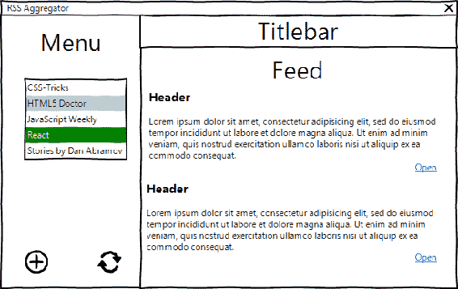
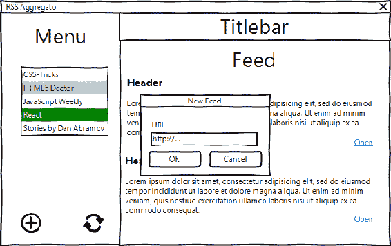
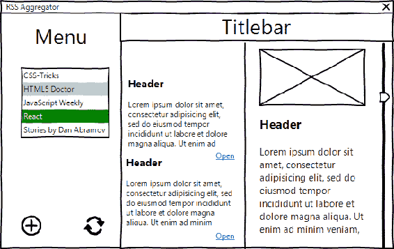
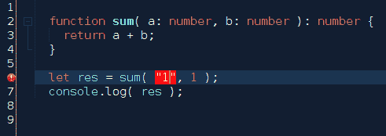
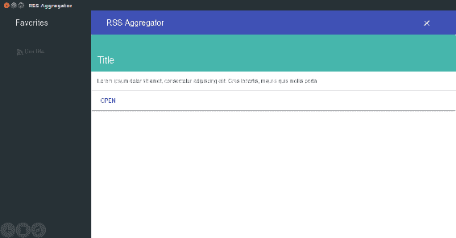
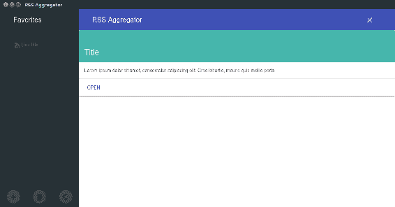

# 第七章：使用 Electron、TypeScript、React 和 Redux 创建 RSS 聚合器：规划、设计和开发

通过前面的章节，我们使用纯 JavaScript、React 和 React + Redux 创建了一个应用程序。现在，我们将使用最佳技术栈来开发大型可扩展的 Web 应用程序--TypeScript + React + Redux。我们将开发 RSS 聚合器。我认为这是一个很好的例子，可以展示 TypeScript 的实际应用，以及检查异步操作。此外，您还将学习使用新的组件库 React MDL。我们还将使用 SASS 语言编写自定义样式来扩展它。

# 应用蓝图

我们开发一个典型的工具，从可管理的来源列表中聚合联合内容。如果我们将需求分解为用户故事，我们会得到类似于这样的东西：

+   作为用户，我可以看到先前添加的来源列表

+   作为用户，我可以看到汇总内容

+   作为用户，我可以通过在菜单中选择来源来过滤内容项

让我们再次使用**WireframeSketcher**（[`wireframesketcher.com/`](http://wireframesketcher.com/)）并将其放在线框上：



+   作为用户，我可以在列表旁边打开项目链接



+   作为用户，我可以添加一个来源

+   作为用户，我可以删除一个来源

+   作为用户，我可以更新汇总内容



# 欢迎来到 TypeScript

在开发大型可扩展应用程序时，确保所有团队成员都遵循已建立的架构是至关重要的。在其他语言中，如 Java、C++、C#和 PHP，我们可以声明类型和接口。因此，除非新功能完全满足系统架构师预期的接口，否则无法使用。JavaScript 既没有严格的类型，也没有接口。因此，2012 年，微软的工程师开发了 JavaScript 的超集（ES2015）称为**TypeScript**。这种语言通过可选的静态类型扩展了 JavaScript，并编译回 JavaScript，因此可以被任何浏览器和操作系统接受。这类似于我们如何使用 Babel 将 ES.Next 编译为第五版 ECMAScript，但此外，它还为我们带来了一些不太可能在可预见的未来集成到 ECMAScript 中的功能。这种语言非常出色，并且在[`www.typescriptlang.org/docs/home.html`](https://www.typescriptlang.org/docs/home.html)有文档支持，并且提供了优秀的规范[`bit.ly/2qDmdXj`](http://bit.ly/2qDmdXj)。这种语言得到了主流 IDE 和代码编辑器的支持，并且可以通过插件集成到 Grunt、Gulp、Apache Maven、Gradle 等自动化工具中。一些主要的框架正在考虑迁移到 TypeScript，而 Angular 2+和 Dojo 2 已经采用了它。其他框架通过定义文件向 TypeScript 公开它们的接口。

作为静态类型检查的替代，可以选择使用 Facebook 的**Flow**（[`flow.org`](https://flow.org)）。与 TypeScript 不同，Flow 不是编译器，而是一个检查器。Flow 中的基本类型与 TypeScript 的类型非常相似，几乎使用相同的语法实现。Flow 还引入了高级类型，如数组、联合、交集和泛型，但是使用了自己的方式。根据 Facebook 的说法，他们创建 Flow 是因为“TypeScript 并没有像他们想要的那样建立在发现错误的基础上。”

# 为 TypeScript 设置开发环境

TypeScript 对开发体验做出了诱人的承诺。为什么不动动手，看看实际操作呢？首先，我们需要为即将到来的示例创建一个专用目录。我们通过运行`npm init -y`来初始化项目，并将`typescript`安装为开发依赖项：

```js
npm i -D typescript

```

在清单的`scripts`部分，我们添加了一个用于使用 TypeScript 编译源代码的命令：

`package.json`

```js
{ 
... 
"scripts": { 
    "build": "tsc" 
  }, 
... 
} 

```

我们需要让 TypeScript 知道我们究竟想要什么。我们将在配置文件中描述这一点：

`tsconfig.json`

```js
{ 
  "compilerOptions": { 
    "target": "ES6", 
    "module": "CommonJS", 
    "moduleResolution": "node", 
    "sourceMap": true, 
    "outDir": "./build" 
  }, 

  "include": [ 
    "./**/*" 
  ], 
  "exclude": [ 
    "node_modules" 
  ] 
} 

```

在这里，我们将 TypeScript 编译器设置为在项目目录中的任何地方搜索`ts`源文件，但不包括`node_modules`。在`compilerOptions`中，我们指定了在编译期间希望如何处理我们的源文件。`target`字段设置为`ES6`，意味着 TypeScript 将编译为 ES6/ES2016 语法，这在所有现代浏览器中已经得到充分支持。在`module`字段中，我们使用`CommonJS`。因此，TypeScript 将源文件捆绑成符合 CommonJS 标准的模块，与 Node.js 环境兼容。在`moduleResolution`字段中，我们选择了 Node.js 模块解析风格。在`outDir`字段中，我们确定 TypeScript 将存储编译后的模块的位置。有关编译器选项的更多信息，请访问[`bit.ly/2t9fckV`](http://bit.ly/2t9fckV)。

# 基本类型

开发环境现在似乎已经准备好了，所以我们可以用一个基本的例子来试一试：

`example.ts`

```js
let title: string = "RSS Aggregator"; 

```

我们使用 TypeScript 的类型注解功能来对变量设置约束。这很容易；我们只需扩展声明，使用所谓的**声明空间**，比如`:type`，其中 type 可以是基本类型（boolean、number、string、array、void、any 等），类、接口、类型别名、枚举和导入。在这里，我们应用了`string`，意味着 title 只接受字符串。

编译后使用`npm run build`，我们可以在`./build`目录中找到`example.js`文件，内容如下：

`build/example.js`

```js
let title = "RSS Aggregator"; 

```

你会发现它并没有做太多事情；它只是移除了类型提示。这就是 TypeScript 的惊人之处 - 类型检查发生在编译时，并在运行时消失。因此，我们可以从 TypeScript 中受益，而不会对应用程序的性能产生任何影响。

好吧，让我们做一件不好的事，给变量设置一个违反给定约束的值：

`example.ts`

```js
let title: string = "RSS Aggregator"; 
title = 1; 

```

编译时，我们收到了一个错误消息：

```js
error TS2322: Type '1' is not assignable to type 'string'. 

```

嗯；TypeScript 在我们做错事时警告我们。更令人兴奋的是，如果你的 IDE 支持 TypeScript，你在输入时会立即得到通知。我建议对照列表[`bit.ly/2a8rmTl`](http://bit.ly/2a8rmTl)，选择最适合你的 IDE，如果你的 IDE 恰好不在列表中。我会推荐**Alm**([`alm.tools`](http://alm.tools))，它是使用 TypeScript、React 和 Redux 的一个很好的例子。然而，我自己十年前就开始使用**NetBeans**([`netbeans.org/`](https://netbeans.org/))，它从未让我失望过。它没有原生的 TypeScript 支持，但可以通过安装**TypeScript Editor 插件**([`github.com/Everlaw/nbts`](https://github.com/Everlaw/nbts))轻松获得。

让我们更多地使用类型注解。我们拿一个函数，并为入口和出口点定义一个契约：

`example.ts`

```js
function sum( a: number, b: number ): number { 
  return a + b; 
} 
 let res = sum( 1, 1 ); 
console.log( res ); 

```

实际上，我们在这里声明函数接受两个数字，并应返回一个数字。现在，即使我们想给函数赋予与数字不同的任何类型，IDE 也会立即提醒我们：



# 数组、普通对象和可索引类型

我相信，对于原始类型，情况或多或少是清楚的，但其他类型呢，比如数组？通过将基本类型与`[]`结合，我们定义了一个数组类型：

```js
let arr: string[]; 

```

在这里，我们声明了变量`arr`，它是一个字符串数组。我们可以使用以下语法实现相同的效果：

```js
let arr: Array<string>; 

```

或者，我们可以使用接口来实现：

```js
interface StringArray { 
  [ index: number ]: string; 
} 
 const arr: StringArray = [ "one", "two", "tree" ]; 

```

通过使用所谓的**索引签名**来声明`StringArray`接口，我们对类型结构设置了约束。它接受数字索引和字符串值。换句话说，它是一个字符串数组。我们还可以进一步对数组长度设置约束：

```js
interface StringArray { 
  [ index: number ]: string; 
  length: number; 
} 

```

至于普通对象，我们可以使用描述预期形状的接口：

```js
interface MyObj {  
  foo: string; 
  bar: number; 
} 
let obj: MyObj; 

```

另一方面，我们可以使用对象类型文字内联设置约束：

```js
let obj: { foo: string, bar: number }; 
// or 
function request( options: { uri: string, method: string } ): void { 
}

```

如果我们能够声明一个值对象（[`bit.ly/2khKSBg`](http://bit.ly/2khKSBg)），我们需要确保不可变性。幸运的是，TypeScript 允许我们指定对象的成员为`readonly`：

```js
interface RGB { 
    readonly red: number; 
    readonly green: number; 
    readonly blue: number; 
} 
 let green: RGB = { red: 0, green: 128, blue: 0 }; 

```

我们可以访问百分比，例如`RGB`类型的颜色中的红色。但我们不能更改已声明颜色的 RGB 级别。如果我们尝试这样做，将会得到以下错误：

```js
error TS2540: Cannot assign to 'red' because it is a constant or a read-only property. 

```

对于任意属性的对象，我们可以使用索引签名来定位字符串键：

```js
interface DataMap { 
  [ key: string ]: any; 
} 

const map: DataMap = { foo: "foo", bar: "bar" }; 

```

请注意，在`DataMap`中，我们为成员类型设置了`any`。通过这样做，我们允许任何值类型。

# 函数类型

我们可以通过使用函数类型文字在函数上设置约束：

```js
const showModal: (toggle: boolean) => void =  
  function( toggle )  { 
    console.log( toggle ); 
  } 

```

我觉得这相当令人沮丧，更喜欢使用接口：

```js
interface Switcher { 
  (toggle: boolean): void; 
} 

const showModal:Switcher = ( toggle ) => { 
  console.log( toggle ); 
} 

showModal( true ); 

```

现在你可能会问，如果函数有可选参数怎么办？TypeScript 使定义可选参数非常简单。您只需要在参数后面加上一个问号：

```js
function addOgTags(title: string, description?: string): string { 
  return ` 
    <meta property="og:title" content="${title}" /> 
    <meta property="og:description" content="${description || ""}" /> 
    } 

```

我们将`description`设置为可选，因此我们可以以两种方式调用该函数：

```js
addOgTags( "Title" ); 
addOgTags( "Title", "Description" ); 

```

这些都不违反已声明的接口；到目前为止，我们给它字符串。

以相同的方式，我们可以定义可选对象成员：

```js
interface IMeta { 
  title: string; 
  description?: string; 
} 

function addOgTags( meta: IMeta ): string { 
} 

```

# 类类型

在其他语言中，我们习惯将接口视为与类密切相关。TypeScript 带来了类似的开发体验。而且，虽然 Java 和 PHP 接口不能包含实例属性，TypeScript 没有这样的限制：

```js
interface Starship { 
  speed: number;  
  speedUp( increment: number ): void; 
} 

class LightFreighter implements Starship { 
  speed: number = 0; 
  speedUp( increment: number ): void { 
    this.speed = this.speed + increment; 
  } 
} 

let millenniumFalcon = new LightFreighter(); 
millenniumFalcon.speedUp( 100 ); 

```

随着 ES2015/2016 的发展，类在 JavaScript 中被广泛使用。然而，TypeScript 允许我们设置成员的可访问性。因此，当我们允许从消费对象实例的代码中访问成员时，我们将成员声明为`public`。我们使用`private`来确保成员在其包含的类之外不可访问。此外，`protected`成员与`private`类似，只是它们可以在任何派生类实例中被访问：

```js
class LightFreighter implements Starship { 
  private speed: number = 0; 
  public speedUp( increment: number ): void { 
    this.speed = this.speed + increment; 
  } 
} 

```

正如你所看到的，`speed`的值是硬编码的。如果我们的类在初始化期间可以配置初始速度，那就更好了。让我们进行重构：

```js
class LightFreighter implements Starship { 
  constructor( private speed: number = 0 ) { 
  } 
  public speedUp( increment: number ): void { 
    this.speed = this.speed + increment; 
  } 
} 

```

在这里，我们使用了 TypeScript 的另一个我个人很激动的很好的特性。它被称为**参数属性**。我们经常声明私有属性，并从构造函数参数中填充它们。在 TypeScript 中，我们可以简单地在参数前面加上一个可访问性修饰符，它将导致一个相应命名的属性，接受参数的值。因此，在前面的代码中，使用`private speed`在参数列表中，我们声明了`speed`参数，并将传入的值赋给它。通过使用 ES6 语法来设置默认参数，当在构造函数`constructor( speed = 0 )`中没有传入任何值时，我们将`speed`设置为零。

# 抽象类

与您在其他语言中可能习惯的类似，在 TypeScript 中，我们可以使用抽象类和方法。抽象类仅用于扩展。不能创建抽象类的实例。定义为抽象的方法在任何子类中都需要实现：

```js
abstract class Starship { 
  constructor( protected speed: number = 0 ) { 

  } 
  abstract speedUp( increment: number ): void; 
} 

class LightFreighter extends Starship { 

  public speedUp( increment: number ): void { 
    this.speed = this.speed + increment; 
  } 
} 

```

抽象类与接口非常相似，只是一个类可以实现多个接口，但只能扩展一个抽象类。

# 枚举类型

一次又一次，我们使用常量来定义一组逻辑相关的实体。使用 TypeScript，我们可以声明一个由不可变数据填充的枚举类型，然后通过类型引用整个集合：

```js
const enum Status { 
    NEEDS_PATCH, 
    UP_TO_DATE, 
    NOT_INSTALLED 
} 

function setStatus( status: Status ) { 
  // ... 
} 

setStatus( Status.NEEDS_PATCH ); 

```

在这里，我们声明了一个类型`Status`，它接受预定义值之一（`NEEDS_PATCH`，`UP_TO_DATE`和`NOT_INSTALLED`）。函数`setStatus`期望`status`参数是`Status`类型。如果传入任何其他值，TypeScript 会报告错误：

```js
setStatus( "READY" ); 
//  error TS2345: Argument of type '"READY"' is not assignable to parameter of type 'STATUS'. 

```

或者，我们可以使用字符串字面类型，它指的是一组任何字符串值：

```js
function setStatus( status: "NEEDS_PATCH" | "UP_TO_DATE" | "NOT_INSTALLED" ) { 
  // ... 
} 
setStatus( "NEEDS_PATCH" ); 

```

# 联合和交叉类型

到目前为止很有趣，不是吗？那么你对此怎么看：在 TypeScript 中，我们可以同时引用多种类型。例如，我们有两个接口`Anakin`和`Padmé`，需要一个从它们两个继承的新类型（`Luke`）。我们可以像这样轻松实现它：

```js
interface Anakin { 
  useLightSaber: () => void; 
  useForce: () => void; 
} 
interface Padmé { 
  leaderSkills: string[]; 
  useGun: () => void; 
} 
type Luke = Anakin & Padmé; 

```

此外，我们可以在不明确声明类型的情况下进行交集操作：

```js
function joinRebelion( luke: Anakin & Padmé ){   
}

```

我们还可以定义一个允许任何类型的组的联合类型。你知道`jQuery`库，对吧？函数`jQuery`接受各种类型的选择器参数，并返回`jQuery`实例。如何可能用接口来覆盖它呢？

```js
interface PlainObj { 
  [ key: string ]: string; 
} 
interface JQuery { 
} 

function jQuery( selector: string | Node | Node[] | PlainObj | JQuery ): JQuery { 
  let output: JQuery = {} 
  // ... 
  return output; 
} 

```

当函数返回依赖于传入类型的类型时，我们可以声明一个描述所有可能用例的接口：

```js
interface CreateButton { 
  ( tagName: "button" ): HTMLButtonElement; 
  ( tagName: "a" ): HTMLAnchorElement; 
} 

```

实现这个接口的函数接受`tagName`参数的字符串。如果值是`"button"`，函数返回`Button`元素。如果是`"a"`，则返回`Anchor`元素。

可以在规范中找到可用的与 DOM 相关的接口[`www.w3.org/TR/DOM-Level-2-HTML/html.html`](https://www.w3.org/TR/DOM-Level-2-HTML/html.html)。

# 泛型类型

我们刚刚检查的类型是指具体类型组合。此外，TypeScript 支持所谓的**泛型类型**，它有助于在不同上下文中重用一次创建的接口。例如，如果我们想要一个数据映射的接口，我们可以这样做：

```js
interface NumberDataMap { 
  [ key: string ]: number; 
} 

```

但是`NumberDataMap`只接受成员值为数字。假设对于字符串值，我们必须创建一个新的接口，比如`StringDataMap`。或者，我们可以声明一个泛型`DataMap`，在引用时设置任意值类型的约束：

```js
interface DataMap<T> { 
  [ key: string ]: T; 
} 

const numberMap: DataMap<number> = { foo: 1, bar: 2 }, 
      stringMap: DataMap<string> = { foo: "foo", bar: "bar" }; 

```

# 全局库

是的，TypeScript 确实是一种令人印象深刻的语言，当涉及到编写新代码时。但是对于现有的非 TypeScript 库呢？例如，我们将使用 React 和 Redux 模块。它们是用 JavaScript 编写的，而不是 TypeScript。幸运的是，主流库已经提供了 TypeScript 声明文件。我们可以使用 npm 按模块安装这些文件：

```js
npm i -D @types/react 
npm i -D @types/react-dom 

```

现在，当我们尝试对任何这些模块进行愚蠢的操作时，我们会立即收到有关问题的通知：

```js
import * as React from "react"; 
import * as ReactDOM from "react-dom"; 

ReactDOM.render( 
  <div></div>, 
  "root" 
); 

```

在编译或输入时，你会得到错误：

```js
error TS2345: Argument of type '"root"' is not assignable to parameter of type 'Element'. 

```

公平地说，与其传递给`ReactDOM.render`的 HTML 元素（例如`document.getElementById("root")`），我传递了一个字符串作为第二个参数。

然而，老实说，并非每个库都提供了 TypeScript 声明。例如，在*RSS 聚合器*应用程序中，我将使用`feedme`库（[`www.npmjs.com/package/feedme`](https://www.npmjs.com/package/feedme)）通过 URL 获取和解析 RSS。不过，该库没有声明文件。幸运的是，我们可以快速创建一个：

`feedme.d.ts`

```js
declare class FeedMe { 
  new ( flag?: boolean ): NodeJS.WritableStream; 
  on( event: "title", onTitle: ( title: string ) => void): void; 
  on( event: "item", onItem: ( item: any ) => void ): void; 
} 

```

模块`feedme`公开了一个类`FeedMe`，但 TypeScript 并不知道这些模块；它还没有在 TypeScript 范围内声明。因此，我们在`feedme.d.ts（declare class FeedMe）`中使用环境声明来引入作用域中的新值。我们声明接受`boolean`类型的可选标志并返回 Node.js`WriteStream`对象的类构造函数。我们使用重载来描述函数使用的两种情况。在第一种情况下，它接收`"title"`字符串作为`event`，并期望回调处理 RSS 标题。在第二种情况下，它接收`"title"`事件，然后期望回调处理 RSS 条目。

现在，我们可以从服务中使用新创建的声明文件：

```js
/// <reference path="./feedme" /> 
import http = require( "http" ); 
var FeedMe = require( "feedme" ); 

http.get('http://feeds.feedburner.com/TechCrunch/startups', ( res ) => { 
  const parser = new FeedMe( true ); 
  parser.on( "title", ( title: string ) => { 
    console.log( title ); 
  }); 
  res.pipe( parser ); 
}); 

```

使用三斜杠指令，我们将`feedme.d.ts`包含在项目中。完成后，TypeScript 会验证`FeedMe`是否根据其接口使用。

# 创建静态原型

我认为，到这一点，我们已经足够了解 TypeScript，可以开始应用程序了。与之前的示例一样，首先我们做的是静态原型。

# 为应用程序设置开发环境

我们必须为项目设置开发环境。因此，我们专门为它分配一个目录，并将以下清单放在其中：

`./package.json`

```js
{ 
  "name": "rss-aggregator", 
  "title": "RSS Aggregator", 
  "version": "1.0.0", 
  "main": "./app/main.js", 
  "scripts": { 
    "build": "webpack", 
    "start": "electron .", 
    "dev": "webpack -d --watch"  
  } 
} 

```

根据任何 Electron 应用程序的要求，我们在`main`字段中设置了主进程脚本的路径。我们还定义了运行 Webpack 进行构建和监视的脚本命令。我们设置了一个脚本命令来使用 Electron 运行应用程序。现在，我们可以安装依赖项。我们肯定需要 TypeScript，因为我们将使用它来构建应用程序：

```js
npm i -D typescript 

```

对于打包，我们将使用 Webpack，就像我们为 Chat 和 Screen Capturer 应用程序所做的那样，但是这次，我们不再使用`babel-loader`，而是使用`ts-loader`，因为我们的源代码是 TypeScript 语法：

```js
npm i -D webpack 
npm i -D ts-loader 

```

我们还安装了 Electron 和相关模块，这些模块我们在创建 Chat 应用程序时已经检查过：

```js
npm i -D electron 
npm i -D electron-debug 
npm i -D electron-devtools-installer 

```

最后，我们安装了 React 声明文件：

```js
npm i -D @types/react 
npm i -D @types/react-dom 

```

为了访问 Node.js 的接口，我们还安装了相应的声明：

```js
npm i -D @types/node 

```

现在，我们可以配置 Webpack 了：

`./webpack.config.js`

```js
const path = require( "path" ); 
module.exports = { 
  entry: "./app/ts/index.tsx", 
  output: { 
    path: path.resolve( __dirname, "./app/build/js/" ), 
    filename: "bundle.js" 
  }, 

  target: "electron-renderer", 
  devtool: "source-map", // enum 
  module: { 
    rules: [ 
      { 
        test: /\.tsx?$/, 
        use: "ts-loader" 
      } 
    ] 
  } 
}; 

```

在这里，我们将入口脚本设置为`app/ts/index.tsx`，输出为`./app/build/js/bundle.js`。我们将 Webpack 目标设置为 Electron（`electron-renderer`），并启用源映射生成。最后，我们指定了一个规则，使 Webpack 使用`ts-loader`插件处理任何`.ts`/`.tsx`文件。

因此，如果我们请求一个文件，比如`require("./path/file.ts")`或`import {member} from "./path/file.ts"`，Webpack 将在打包期间使用 TypeScript 进行编译。我们可以使用 Webpack 选项`resolve`使其更加方便：

`./webpack.config.js`

```js
{ 
... 
resolve: { 
    modules: [ 
      "node_modules", 
      path.resolve(__dirname, "app/ts") 
    ], 

    extensions: [ ".ts", ".tsx", ".js"] 
  }, 
... 
} 

```

在这里，我们声明 Webpack 会尝试解析遇到的任何模块名，对`node_modules`和`app/ts`目录进行解析。因此，如果我们访问一个模块，我们将得到以下结果：

```js
import {member} from "file.ts" 

```

根据我们的配置，Webpack 首先检查`node_modules/file.ts`的存在，然后是`app/ts/file.ts`。由于我们将`.ts`扩展名列为可解析的，所以可以从模块名中省略它：

```js
import {member} from "file" 

```

剩下的就是 TypeScript 的配置：

`tsconfig.json`

```js
{ 
  "compilerOptions": { 
    "target": "es6", 
    "module": "commonjs", 
    "moduleResolution": "node", 
    "sourceMap": false, 
    "outDir": "../dist/", 
    "jsx": "react" 
  }, 

  "files": [ 
    "./app/ts/index.tsx" 
  ] 
} 

```

它基本上和我们为 TypeScript 介绍示例创建的配置是一样的，只是这里我们不是指向编译器一个目录，而是明确指向入口脚本。我们还告诉编译器它应该期望 JSX。

# React-MDL

之前，在开发 Screen Capturer 时，我们研究了组件库 Material UI。这并不是 React 可用的唯一的 material design 实现。这次，让我们尝试另一个--**React MDL** ([`react-mdl.github.io/react-mdl/`](https://react-mdl.github.io/react-mdl/))。所以，我们安装了该库和相应的声明：

```js
npm i -S react-mdl 
npm i -D @types/react-mdl 

```

根据文档，我们通过导入来启用库：

```js
import "react-mdl/extra/material.css"; 
import "react-mdl/extra/material.js"; 

```

哦！哦！Webpack 无法解析 CSS 模块，直到我们相应地进行配置。首先，我们必须告诉 Webpack 在`node_modules`目录中查找`react-mdl/extra/material.css`和`react-mdl/extra/material.js`：

```js
./webpack.config.js 
{ 
... 
resolve: { 
   modules: [ 
        "node_modules", 
        path.resolve(__dirname, "app/ts") 
      ], 
      extensions: [ ".ts", ".tsx", ".js", ".css"] 
  }, 
... 
} 

```

其次，我们添加了一个规则来处理 CSS，使用`css-loader`插件：

`./webpack.config.js`

```js
{ 
... 
module: { 
  rules: [ 
    ... 
    { 
      test: /\.css$/, 
      use: [ 
          "style-loader", 
          "css-loader" 
        ] 
    } 
  ] 
}, 

... 
} 

```

现在，当遇到`import "react-mdl/extra/material.css"`时，Webpack 会加载样式并将其嵌入页面中。但在 CSS 内容中，有链接到自定义的`.woff`字体。我们需要让 Webpack 加载所引用的字体文件：

`./webpack.config.js`

```js
{ 
... 
module: { 
  rules: [ 
    ... 
    { 
       test: /\.woff(2)?(\?v=[0-9]\.[0-9]\.[0-9])?$/, 
       use: { 
         loader: "url-loader", 
         options: { 
           limit: 1000000, 
           mimetype: "application/font-woff" 
         } 
       } 
    } 
  ] 
}, 

... 
} 

```

现在，我们必须安装上述提到的加载器：

```js
npm i -D css-loader 
npm i -D style-loader 

```

# 创建 index.html

在 Electron 应用程序中，我们通常首先处理的是主进程脚本，它基本上创建应用程序窗口。对于这个应用程序，我们不会介绍任何新的概念，所以我们可以重用 Chat 应用程序的`main.js`。

`index.html`将非常简单：

```js
app/index.html
<!DOCTYPE html>
<html lang="en">
   <head>
      <link rel="stylesheet" href="https://fonts.googleapis.com/icon?
      family=Material+Icons">
     <title>RSS Aggregator</title>
 </head>
   <body>
        <div id="root"></div> 
       <script src="img/bundle.js"></script>
  </body>
</html>

```

基本上，我们加载了 Google 的 Material Icons 字体并声明了边界元素（`div#root`）。当然，我们必须加载由 Webpack/TypeScipt 生成的 JavaScript。它位于`build/js/bundle.js`，就像我们在`./webpack.config.js`中配置的那样。

接下来，我们组成入口脚本：

`./app/ts/index.tsx`

```js
import "react-mdl/extra/material.css"; 
import "react-mdl/extra/material.js"; 

import * as React from "react"; 
import * as ReactDOM from "react-dom"; 
import App from "./Containers/App"; 

ReactDOM.render( 
  <App />, 
  document.getElementById( "root" ) 
); 

```

正如你所看到的，它与我们在屏幕捕捉器静态原型中所拥有的相似，除了导入 React-MDL 资产。至于 TypeScript，在代码中并不真正需要任何更改。然而，现在我们确实为我们使用的模块拥有了类型化接口（`./node_modules/@types/react-dom/index.d.ts`），这意味着如果我们违反了约束，例如`ReactDOM.render`，我们会得到一个错误。

# 创建容器组件

现在让我们创建我们在入口脚本中提到的`container`组件：

`./app/ts/Containers/App.tsx`

```js
import { Layout, Content } from "react-mdl"; 
import * as React from "react"; 

import TitleBar from "../Components/TitleBar"; 
import Menu from "../Components/Menu"; 
import Feed from "../Components/Feed"; 

export default class App extends React.Component<{}, {}> { 

  render() { 
    return ( 
      <div className="main-wrapper"> 
        <Layout fixedHeader fixedDrawer> 
          <TitleBar /> 
          <Menu /> 
          <Content> 
            <Feed  /> 
          </Content> 
        </Layout> 
      </div> 
    ); 
  } 
} 

```

在这里，我们从 React-MDL 库中导入`Layout`和`Content`组件。我们使用它们来布局我们的自定义组件`TitleBar`、`Menu`和`Feed`。根据 React 声明文件（`./node_modules/@types/react/index.d.ts`），`React.Component`是一个泛型类型，所以我们必须为状态和属性提供接口`React.Component<IState, IProps>`。在静态原型中，我们既没有状态也没有属性，所以我们可以使用空类型。

# 创建 TitleBar 组件

下一个组件将代表标题栏：

`./app/ts/Components/TitleBar.tsx`

```js
import * as React from "react"; 
import { remote } from "electron"; 
import { Header, Navigation, Icon } from "react-mdl"; 

export default class TitleBar extends React.Component<{}, {}> { 

  private onClose = () => { 
    remote.getCurrentWindow().close(); 
  } 
  render() { 
    return ( 
     <Header  scroll> 
        <Navigation> 
            <a href="#" onClick={this.onClose}><Icon name="close" />
            </a> 
        </Navigation> 
    </Header> 
    ); 
  } 
} 

```

在这里，我们使用 React MDL 的`Header`、`Navigation`和`Icon`组件来设置外观和感觉，并订阅关闭图标的点击事件。此外，我们导入`electron`模块的`remote`对象，并通过使用`getCurrentWindow`方法访问当前窗口对象。它有一个`close`方法，我们用它来关闭窗口。

我们的`Menu`组件将包含聚合源的列表。用户可以使用`add`和`remove`按钮来管理列表。`autorenew`按钮用于更新所有源。

# 创建菜单组件

我们将保持源菜单在 React MDL 的`Drawer`组件中，它会在宽屏上自动显示，并在较小屏幕上隐藏在汉堡菜单中：

`./ts/Components/Menu.tsx`

```js
import * as React from "react"; 
import { Drawer, Navigation, Icon, FABButton } from "react-mdl"; 

export default class Menu extends React.Component<{}, {}> { 

  render (){ 

    return ( 
     <Drawer  className="mdl-color--blue-grey-900 mdl-
     color-text--blue-grey-50"> 
        <Navigation className="mdl-color--blue-grey-80"> 
          <a> 
             <Icon name="& #xE0E5;" /> 
             Link title 
          </a> 
        </Navigation> 
        <div className="mdl-layout-spacer"></div> 
        <div className="tools"> 
          <FABButton mini> 
              <Icon name="add" /> 
          </FABButton> 

          <FABButton mini> 
              <Icon name="delete" /> 
          </FABButton> 

          <FABButton mini> 
              <Icon name="autorenew" /> 
          </FABButton> 
        </div> 
      </Drawer> 
    ); 
  } 
} 

```

# 创建源组件

最后，我们来处理主要部分，我们将在其中显示活动源内容：

`./app/ts/Components/Feed.tsx`

```js
import * as React from "react"; 
import { Card, CardTitle, CardActions, Button, CardText } from "react-mdl"; 

export default class Feed extends React.Component<{}, {}> { 
  render(){ 
    return ( 
      <div className="page-content feed-index"> 
        <div className="feed-list"> 

          <Card shadow={0} style={{width: "100%", height: "auto", 
          margin: "auto"}}> 
             <CardTitle expand style={{color: "#fff", backgroundColor: 
             "#46B6AC"}}> 
             Title 
             </CardTitle> 
             <CardText> 
                  Lorem ipsum dolor sit amet, consectetur adipiscing 
                  elit. Cras lobortis, mauris quis mollis porta 
             </CardText> 
             <CardActions border> 
                  <Button colored>Open</Button> 
             </CardActions> 
           </Card> 

        </div> 

        <div className="feed-contents"></div> 
      </div> 
    ); 
  } 
} 

```

在`.feed-list`容器中，我们显示了 RSS 项的列表，每个都用 React MDL 的`Card`组件包装。容器`.feed-contents`是项目内容的占位符。

一切准备就绪。我们可以构建并启动：

```js
npm run build
npm start

```

输出是：



# 使用 SASS 添加自定义样式

看起来，结果 UI 需要额外的样式。我建议我们在 SASS 中编写我们的自定义样式：

`./app/sass/app.scss`

```js
 .main-wrapper { 
  height: 100vh; 
} 

```

首先，我们让顶层元素（`./app/ts/Containers/App.tsx`）始终适应实际的窗口高度。

接下来，我们声明一个变量来固定标题栏的高度，并设置源项和项目内容容器的布局：

`./app/sass/app.scss`

```js
$headrHeight: 66px; 

.feed-index { 
  display: flex; 
  flex-flow: row nowrap; 
  overflow-y: auto; 
  height: calc(100vh - #{$headrHeight}); 
  &.is-open { 
    overflow-y: hidden; 
    .feed-list { 
      width: 50%; 
    } 
    .feed-contents { 
      width: 50%; 
    } 
  } 
} 
.feed-list { 
  flex: 1 0 auto; 
  width: 100%; 
  transition: width 200ms ease; 
} 
.feed-contents { 
  flex: 1 0 auto; 
  width: 0; 
  transition: width 200ms ease; 
} 

```

最初，源项容器（`.feed-list`）的宽度为 100%，而项目内容容器（`.feed-contents`）被隐藏（`width:0`）。当父容器（`.feed-index`）接收到带有`is-open`类的新状态时，两个子容器会优雅地将宽度移动到`50%`。

最后，我们在菜单组件中布局操作按钮：

`./app/sass/app.scss`

```js
.tools { 
  height: 60px; 
  display: flex; 
  flex-flow: row nowrap; 
  justify-content: space-between; 
} 

```

好吧，我们引入了一个新的源类型（SASS），所以我们必须调整 Webpack 配置：

`./webpack.config.js`

```js
{ 
... 
resolve: { 
   modules: [ 
        "node_modules", 
        path.resolve(__dirname, "app/ts"), 
        path.resolve(__dirname, "app/sass") 
      ], 
      extensions: [ ".ts", ".tsx", ".js", ".scss", ".css"] 
  }, 
... 
} 

```

现在，Webpack 接受`.scss`模块名称，并在`app/sass`中查找源。我们还必须配置 Webpack 来将 SASS 编译为 CSS：

`./webpack.config.js`

```js
{ 
... 
module: { 
  rules: [ 
    ... 
    { 
      test: /\.scss$/, 
      use: [ 
          "style-loader", 
          "css-loader", 
          "sass-loader" 
        ] 
    } 
  ] 
}, 

... 
} 

```

在这里，我们确定在解析`.scss`文件时，Webpack 使用`sass-loader`插件将 SASS 转换为 CSS，然后使用`css-loader`和`style-loader`加载生成的 CSS。所以，我们现在缺少一个依赖项 - `sass-loader`；让我们安装它：

```js
npm i -D sass-loader 

```

这个模块依赖于`node-sass`编译器，所以我们也需要它：

```js
npm i -D node-sass 

```

为什么不检查一下我们得到了什么。所以我们构建并启动：

```js
npm run build
npm start

```

应用程序现在看起来更好了：



# 摘要

在这一章中，我们深入学习了 TypeScript。我们研究了变量声明和参数约束中的基本类型。我们使用接口来处理数组和普通对象。您学会了如何处理函数和类的接口。我们注意到了抽象特性，比如成员可访问性修饰符、参数属性、抽象类和方法。您学会了如何使用枚举类型和字符串字面量来处理组实体。我们研究了如何使用泛型类型重用接口。我们还看到了如何在全局库中安装 TypeScript 声明，以及在没有可用声明时如何编写我们自己的声明。我们开始着手应用程序。因此，我们设置了 Webpack 来查找和处理`.ts`/`.tsx`模块，以及加载 CSS 和 Web 字体。我们使用 React MDL 库的组件来创建用户界面。我们通过 SASS 加载器扩展了 Webpack 配置，以处理我们的自定义样式。最终我们得到了一个可工作的静态原型。
