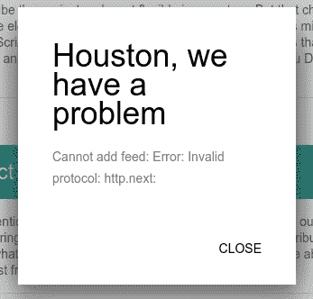
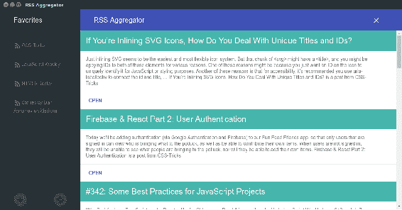
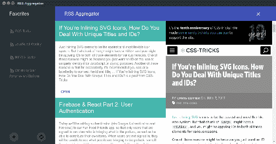

# 第八章：使用 Electron、TypeScript、React 和 Redux 创建 RSS 聚合器：开发

在上一章中，我们拥抱了 TypeScript，并提出了一个静态原型。现在，我们将释放语言的强大力量。我们将编写应用程序服务并用接口覆盖它们。我们将描述操作和 Reducers。在这个过程中，我们将研究基于 Promise 的异步操作的创建以及使用`redux-promise`和`redux-actions`模块进行乐观更新。我们将连接存储到应用程序并将预期的功能带到组件中。我们还将创建一个简单的路由器并将其绑定到存储中。

# 创建一个获取 RSS 的服务

简而言之，我们的应用程序是关于阅读 RSS 订阅。因此，从获取给定 URL 的 feed 并将其解析为我们可以附加到应用程序状态的结构的服务开始是正确的事情。我建议使用`request`（[`www.npmjs.com/package/request`](https://www.npmjs.com/package/request)）模块获取 feed XML，并使用`feedme`模块（[`www.npmjs.com/package/feedme`](https://www.npmjs.com/package/feedme)）进行解析。让我们首先在纯 JavaScript 中做这件事。因此，我们需要安装这两个包：

```js
npm i -S feedme
npm i -S request

```

我们将有一个名为`rss`的函数，它使用`request`通过 HTTP(s)获取 feed 内容。这个函数将接受两个参数：feed URL 和一个以 Node.js 的 thunk-like 方式编写的回调函数：

```js
const request = require( "request" ); 

function rss( feedUrl, onDone ){ 
  const feed = { 
          title: "", 
          items: [] 
        }, 
        parser = createFeedParserStream( feed ); 

  request 
    .get( feedUrl ) 
    .on( "error", ( err ) => { 
      onDone( err ); 
    }) 
    .on( "end", () => { 
      onDone( null, feed ); 
    }) 
    .pipe( parser ); 
} 

```

在这里，我们将 feed 数据容器定义为一个普通对象（`feed`）。我们从尚未编写的`createFeedParserStream`函数中获取一个可写流（[`nodejs.org/api/stream.html`](https://nodejs.org/api/stream.html)），并将其传送到由`request`生成的可读流中，用于指定的 feed URL。现在，让我们添加缺失的函数：

```js
const FeedMe = require( "feedme" ); 

function createFeedParserStream( feed ) { 
  const parser = new FeedMe( true ); 
  parser.on( "title", ( title ) => { 
    feed.title = title; 
  }); 
  parser.on( "item", ( item ) => { 
    feed.items.push( item ); 
  }); 
  return parser; 
} 

```

在这里，我们将流作为`FeedMe`实例，并订阅其解析事件。在接收到 feed 标题时，我们将其分配给`feed.title`。在接收到每个项目的详细信息时，我们将它们推送到`feed.items`数组中。该函数返回派生的解析流，并通过传入的引用修改`feed`对象。

现在，我们可以按以下方式使用`rss`函数：

```js
rss( "http://feeds.feedburner.com/CssTricks", ( err, feed ) => { 
  if ( err ) { 
    return console.log( err ); 
  } 
  console.log( feed ); 
}); 

```

尽管默认情况下，Node.js 核心模块仍然意味着长时间嵌套的异步函数，但我们非常清楚所谓的*回调地狱*的不良影响。因此，我们将将服务转换为 Promise：

```js
function rss( feedUrl ){ 
  return new Promise(( resolve, reject ) => { 
    const feed = { 
            title: "", 
            items: [] 
          }, 
          parser = createFeedParserStream( feed ); 

    request 
      .get( feedUrl ) 
      .on( "error", ( err ) => reject( err ) ) 
      .on( "end", () => resolve( feed ) ) 
      .pipe( parser ); 
  }); 
} 

```

现在，它导致了明显改进的开发体验：

```js
rss( "http://feeds.feedburner.com/CssTricks") 
  .then(( feed ) => console.log( feed ) ) 
  .catch( err => console.log( err ) ); 

```

作为 Promise，它也可以通过`async`/`await`语法使用：

```js
async function handler() { 
  try { 
    const feed = await rss( "http://feeds.feedburner.com/CssTricks"); 
  } catch( e ) { 
    // handle exception 
  } 
} 

handler(); 

```

在这一点上，我们可以回到 TypeScript 并描述代码中的类型。首先，我们期望声明的`feed`结构实现以下接口：

`./app/ts/Interfaces/Rss.ts`

```js
export interface IRssItem { 
  description: string; 
  link: string; 
  pubdate: string; 
  title: string; 
} 

export interface IFeed { 
  title: string; 
  items: IRssItem[]; 
} 

```

但等等！模块`feedme`没有声明文件。看起来我们也必须为它提供一个接口。在上一章中，我展示了一种通过使用三斜杠指令和环境声明将全局库引入 TypeScript 范围的方法。这不是唯一可能的解决方案。我们可以在一个模块中声明接口：

`./app/ts/Services/IFeedMe.ts`

```js
import { IRssItem } from "../Interfaces/Rss"; 
export interface IFeedMe { 
  new ( flag?: boolean ): NodeJS.WritableStream; 
  on( event: "title", onTitle: ( title: string ) => void): void; 
  on( event: "item", onItem: ( item: IRssItem ) => void ): void; 
} 

```

在服务中，我们导入`IFeedMe`接口，并将`feedme`导出分配给类型为`IFeedMe`的常量：

```js
import { IFeedMe } from "./IFeedMe"; 
const FeedMe: IFeedMe = require( "feedme" ); 

```

在将我们的服务重写为 TypeScript 后，其源代码将如下所示：

`/app/ts/Services/rss.ts`

```js
import { IRssItem, IFeed } from "../Interfaces/Rss"; 
import { IFeedMe } from "./IFeedMe"; 
import * as request from "request"; 
const FeedMe: IFeedMe = require( "feedme" ); 

function createFeedParserStream( feed: IFeed ): NodeJS.WritableStream { 
  const parser = new FeedMe( true ); 
  parser.on( "title", ( title: string ) => { 
    feed.title = title; 
  }); 
  parser.on( "item", ( item: IRssItem ) => { 
    feed.items.push( item ); 
  }); 
  return parser; 
} 

export default function rss( feedUrl: string ): Promise<IFeed> { 
  const feed: IFeed = { 
          title: "", 
          items: [] 
        }; 
  return new Promise<IFeed>(( resolve, reject ) => { 
    request.get( feedUrl ) 
      .on( "error", ( err: Error ) => { 
        reject( err ); 
      }) 
      .on( "end", () => { 
        resolve( feed ); 
      }) 
      .pipe( createFeedParserStream( feed ) ); 
  }); 
} 

```

有什么变化？我们用接口（`FeedMe: IFeedMe`）考虑了`feedme`模块的导出。我们为`createFeedParserStream`函数定义了合同。它接受`IFeed`类型作为输入，并返回`NodeJS.WritableStream`。我们对服务函数`rss`也做了同样的事情。它期望一个字符串并返回一个解析为`IFeed`类型的 Promise。

# 创建一个管理 feed 菜单的服务

现在我们可以获取 RSS feed 了。但计划是拥有一个可管理的 feed 菜单。我认为，我们可以用一个项目数组来表示菜单，其中每个项目可以用以下接口描述：

`./app/ts/Interfaces/index.ts`

```js
export interface IMenuItem { 
  url: string; 
  title: string; 
  id: string; 
} 

```

至于服务本身，让我们也从接口开始：

`./app/ts/Services/IMenu.ts`

```js
import { IMenuItem } from "../Interfaces"; 

export interface IMenu { 
  items: IMenuItem[]; 
  clear(): void; 
  remove( url: string ): IMenuItem[]; 
  add( url: string, title: string ): IMenuItem[]; 
  load(): IMenuItem[]; 
} 

```

在某种程度上，这有点像测试驱动开发。我们描述类的内容而不实现来获得整体图像。然后，我们逐一填充成员：

`./app/ts/Services/Menu.ts`

```js
import sha1 = require( "sha1" ); 
import { IMenu } from "./IMenu"; 
import { IMenuItem } from "../Interfaces"; 

class Menu implements IMenu { 

  items: IMenuItem[] = []; 

  constructor( private ns: string ){ 
  } 

  clear(): void { 
    this.items =  []; 
    this.save(); 
  } 

  remove( url: string ): IMenuItem[] { 
    this.items =  this.items.filter(( item ) => item.url !== url ); 
    this.save(); 
    return this.items; 
  } 

  add( url: string, title: string ): IMenuItem[] { 
    const id = <string> sha1( url ); 
    this.items.push({ id, url, title }); 
    this.save(); 
    return this.items; 
  } 

  private save(): void { 
    localStorage.setItem( this.ns, JSON.stringify( this.items ) ); 
  } 

  load(): IMenuItem[] { 
    this.items = JSON.parse( localStorage.getItem( this.ns ) || "[]" ); 
    return this.items; 
  } 
} 

export default Menu; 

```

发生了什么？首先，我们导入了`sha1`模块（[`www.npmjs.com/package/sha1`](https://www.npmjs.com/package/sha1)），我们将使用它来计算 feed URL 的 SHA1 哈希（[`en.wikipedia.org/wiki/SHA-1`](https://en.wikipedia.org/wiki/SHA-1)）。这是一个外部模块，它解析为非模块实体，因此不能使用 ES6 语法导入。这就是为什么我们使用`require`函数。但我们仍然希望 TypeScript 考虑模块声明文件（`@types/sha1`），所以我们将其容器声明为`import sha1`。我们还在模块范围内导入了服务接口（`IMenu`）和菜单项类型（`IMenuItem`）。我们的构造函数接受一个字符串作为命名空间。通过给参数加上可访问性修饰符，我们声明了`ns`属性并将参数的值赋给它。`Menu`的实例将在`items`属性中保持实际菜单状态。私有方法`save`将`items`属性的值存储到`localStorage`中。`add`、`remove`和`clear`方法都修改`this.items`数组，并使用 save 方法与`localStorage`同步。最后，load 方法更新`this.item`，使用存储在`localStorage`中的数组。

# 操作和减速器

因此，我们有了核心服务，可以开始设计 Redux 存储。我们可以在表格中描述预期的状态变化：

| **操作创建者** | **操作类型** | **状态影响** |
| --- | --- | --- |
| `toggleOpenAddFeed` | `TOGGLE_ADD_FEED` | `state.isOpenAddFeed` |
| `addFeed` | `ADD_FEED` | `state.isOpenAddFeed``state.feedError` `state.items` |
| `setFeedError` | `SET_FEED_ERROR` | `state.feedError` |
| `removeFeed` | `REMOVE_FEED` | `state.feedError` |
| `fetchFeed` | `FETCH_FEED` | `state.items` `state.feedError` |
| `fetchMenu` | `FETCH_MENU` | `state.menu` `state.items``state.activeFeedUrl` |
| `setActiveFeed` | `SET_ACTIVE_FEED` | `state.activeFeedUrl` |

首先，我们需要填充我们的 feed 菜单。为此，我们将有一个带有表单的模态窗口来添加 feed。操作创建者函数`toggleOpenAddFeed`将用于切换模态窗口的可见性。

当模态窗口中的表单提交时，组件将调用`addFeed`函数。该函数通过提供的 URL 获取 feed，获取其标题，并向菜单添加新项。由于涉及用户输入和网络操作，我们必须覆盖失败场景。因此，我们引入了`setFeedError`函数，它在应用程序状态中设置消息。当我们更新菜单时，相应的服务将使用`localStorage`同步更改。这意味着我们需要一个读取菜单的操作。`fetchMenu`函数将负责此事。此外，它将利用`rss`服务来获取菜单中所有 feed 的项目，并以聚合列表的形式提供。此外，我们将提供通过菜单导航的选项。当用户点击一个项目时，组件将调用`setActiveFeed`来标记项目为活动状态，并调用`fetchFeed`函数来更新所选 feed 的`Feed`组件中的项目。

在编写操作创建者函数时，我们声明类型并将它们用作 Reducers 的引用。这意味着我们需要一个模块，其中包含一堆表示操作类型的常量：

`./app/ts/Constants/index.ts`

```js
export const TOGGLE_ADD_FEED = "TOGGLE_ADD_FEED"; 
export const SET_ACTIVE_FEED = "SET_ACTIVE_FEED"; 
export const FETCH_MENU = "FETCH_MENU"; 
export const ADD_FEED = "ADD_FEED"; 
export const SET_ADD_FEED_ERROR = "SET_ADD_FEED_ERROR"; 
export const SET_FEED_ERROR = "SET_FEED_ERROR"; 
export const FETCH_FEED = "FETCH_FEED"; 
export const REMOVE_FEED = "REMOVE_FEED"; 

```

既然我们在这里，让我们也定义一些配置常量：

```js
export const MENU_STORAGE_NS = "rssItems"; 
export const FEED_ITEM_PER_PAGE = 10; 

```

第一个（`MENU_STORAGE_NS`）指定了我们将在`localStorage`中使用的命名空间。第二个（`FEED_ITEM_PER_PAGE`）确定我们每页显示多少项。这适用于所选的 feed 和聚合 feed。

在第五章，*使用 NW.js、React 和 Redux 创建屏幕捕捉器：规划、设计和开发*中，我们使用第三方模块`redux-act`来抽象创建 actions 和 Reducers。这真的很方便，但如果需要异步操作，它就不适用了。因此，这一次，我们将使用`redux-actions`模块（[`github.com/acdlite/redux-actions`](https://github.com/acdlite/redux-actions)）。让我们在 JavaScript 示例中检查一下。首先，我们通过调用`redux-actions`的`createAction`函数创建一个同步 action：

```js
import { createAction } from "redux-actions"; 
const toggleOpenAddFeed = createAction( "TOGGLE_ADD_FEED", ( toggle ) => toggle  ); 

```

到目前为止，它看起来与`redux-act`的语法非常相似。我们可以运行新创建的函数：

```js
console.log( toggleOpenAddFeed( true ) ),

```

然后我们得到一个具有强制`type`属性和多用途`payload`属性的操作对象：

```js
{ payload: "TOGGLE_ADD_FEED", type: true } 

```

现在，我们可以使用`redux-actions`的`handleActions`函数来创建一个 Reducer：

```js
import { handleActions } from "redux-actions"; 
const app = handleActions({ 

  "TOGGLE_ADD_FEED": ( state, action ) => ({ 
    ...state, isOpenAddFeed: action.payload 
  }) 

}, defaultState ); 

```

`handleActions`函数期望一个普通对象，该对象使用 action 类型作为参考将处理程序映射到操作。每个处理程序回调都接收最新的状态对象和分派的操作，与经典的 Reducer 相同（[`redux.js.org/docs/basics/Reducers.html`](http://redux.js.org/docs/basics/Reducers.html)）。

但是异步操作呢？例如，我们将使用`rss`服务来获取 feeds。该服务返回一个 Promise。由于`redux-actions`，我们可以创建一个如下简单的 action：

```js
const fetchFeed = createAction( "FETCH_FEED", async ( url: string ) => await rss( url ) ); 

```

是不是很美？我们只需传递一个异步函数作为处理程序。一旦处理程序的 Promise 解析，操作将被分派：

```js
const app = handleActions({ 
  "FETCH_FEED": ( state, action ) => ( 
      ...state, 
      items: action.payload.items 
  }) 

}, defaultState ); 

```

等等！但是如果 Promise 被拒绝会怎么样？模块`redux-actions`依赖于乐观更新。在失败的情况下，传入的操作会获得额外的`error`属性，我们可以在其中找到错误消息：

```js
const app = handleActions({ 

  "FETCH_FEED": ( state, action ) => ({ 
    if ( action.error ) { 
      return { ...state, feedError: `Cannot fetch feed: ${action.payload}` }; 
    } 
     return { 
      ...state, 
      items: action.payload.items 
    }; 
  }) 

}, defaultState ); 

```

现在在考虑如何实现 action creators 和 Reducers 之后，我们可以使用接口来覆盖存储资产。首先，我们声明状态的接口：

`./app/ts/Interfaces/index.ts`

```js
//... 
export interface IAppState { 
  isOpenAddFeed: boolean; 
  menu: IMenuItem[]; 
  items: IRssItem[]; 
  feedError: string; 
  activeFeedUrl: string; 
} 

```

`isOpenAddFeed`属性是一个`boolean`，用于确定是否显示具有添加新 feed 表单的模态窗口。`menu`属性包含菜单项列表，并在`Menu`组件中用于构建菜单。`items`属性包含 RSS 项，并用于在`Feed`组件中构建列表。`feedError`属性存储最后的错误消息，`activeFeedUrl`保留最后请求的 feed URL。

接下来，我们描述 actions：

```js
import { Action } from "redux-actions"; 

export interface IAppActions { 
  toggleOpenAddFeed: ( toggle: boolean ) => Action<boolean>; 
  setActiveFeed:  ( url: string ) => Action<string>; 
  setFeedError: ( msg: string ) => Action<string>; 
  fetchMenu: () => Promise<IMenuRssPayload>; 
  addFeed: ( url: string ) => Promise<IMenuItem[]>; 
  removeFeed: ( url: string ) => Promise<IMenuItem[]>; 
  fetchFeed: ( url: string ) => Promise<IFeed>; 
} 

```

模块`redux-actions`通过声明文件`Action`类型进行导出。因此，我们声明`toggleOpenAddFeed`、`setActiveFeed`和`setFeedError`函数返回符合`Action`类型约束的普通对象。换句话说，除了`type`属性之外，这些函数可能还有`payload`和`error`。`Action`是一个通用类型，因此我们澄清了 payload 中预期的类型，例如，`Action<boolean>`表示`{ type: string, payload: boolean }`。

异步操作`fetchMenu`、`addFeed`、`removeFeed`和`fetchFeed`返回 Promises。再次，当 Promise 解析时，我们明确指定了预期的类型。说到这一点，函数`fetchMenu`引用了缺少的`IMenuRssPayload`类型。让我们添加它：

`./app/ts/Interfaces/index.ts`

```js
export interface IMenuRssPayload { 
  menuItems: IMenuItem[]; 
  rssItems: IRssItem[]; 
} 

```

该功能解析为包含聚合列表的菜单项和 RSS 项的对象。

看起来我们已经准备好实现存储了。因此，我们将从 actions 开始：

`./app/ts/Actions/actions.ts`

```js
import { createAction } from "redux-actions"; 
import * as vo from "../Constants"; 
import { IMenuItem, IRssItem, IFeed, IMenuRssPayload } from "../Interfaces"; 
import Menu from "../Services/Menu"; 
import rss from "../Services/rss"; 
const menu = new Menu( vo.MENU_STORAGE_NS ); 

```

首先，我们导入了`createAction`，之前定义的常量和接口，以及`rss`和`Menu`构造函数等服务。我们在从配置常量导入的命名空间中创建了菜单的实例。接下来，我们添加了同步动作：

```js
const feedActions = { 

  toggleOpenAddFeed: createAction<boolean, boolean>( 
    vo.TOGGLE_ADD_FEED, ( toggle: boolean ) => toggle 
  ), 

  setActiveFeed: createAction<string, string>( 
    vo.SET_ACTIVE_FEED, ( url: string ) => url 
  ), 

  setFeedError: createAction<string, string>( 
    vo.SET_FEED_ERROR, ( msg: string ) => msg 
  ), 

  removeFeed: createAction<IMenuItem[], string>( 
    vo.REMOVE_FEED, ( url: string ) => menu.remove( url ) 
  ), 
}; 

```

在这里，我们使用了我们在 JavaScript 示例中早些时候检查过的模式来创建`createAction`。唯一的区别是`createAction`在 TypeScript 范围内是一个泛型类型，因此我们必须指定动作创建者将在`payload`属性中传递什么类型，并且第一个参数期望什么类型。所有这些函数都接受一个参数。如果我们需要更多，我们可以将其表示为`createAction<Payload, Arg1, Arg2>`甚至`createAction<Payload, Arg1, Arg2, Arg3, Arg4>`。

现在，我们用异步动作扩展了`feedActions`：

```js
const feedActions = { 
  //... 

  fetchFeed: createAction<Promise<IFeed>, string>( 
    vo.FETCH_FEED, async ( url: string ) => await rss( url ) 
  ), 

  addFeed: createAction<Promise<IMenuItem[]>, string>( 
    vo.ADD_FEED, 
    async ( url: string ) => { 
      if ( menu.items.find( item => item.url === url ) ) { 
        throw new Error( "This feed is already in the list" ); 
      } 
      const feed = await rss( url ); 
      if ( !feed.title ) { 
        throw new Error( "Unsupported format" ); 
      } 
      return menu.add( url, feed.title ); 
    } 
  ), 

  fetchMenu: createAction<Promise<IMenuRssPayload>>( 
    vo.FETCH_MENU, async () => { 
      menu.load(); 
      let promises = menu.items.map( item => rss( item.url ) ); 
      return Promise.all( promises ) 
        .then(( feeds: IFeed[] ) => { 
          if ( !feeds.length ) { 
            return { menuItems: [], rssItems: [] }; 
          } 
          let all = feeds 
              .map( feed => feed.items ) 
              // combine [[items],[item]] in a flat array 
              .reduce(( acc: IRssItem[], items: IRssItem[] ) => 
              acc.concat( items ) ) 
              // sort the list by publication date DESC 
              .sort(( a, b ) => { 
                let aDate = new Date( a.pubdate ), 
                    bDate = new Date( b.pubdate ); 
                return bDate.getTime() - aDate.getTime(); 
              }) 
              .slice( 0, vo.FEED_ITEM_PER_PAGE ); 
          return { menuItems: menu.items, rssItems: all }; 
        }); 
    } 
  ) 
}; 

export default feedActions; 

```

函数`fetchFeed`简单地委托了`rss`服务的 Promise。函数`addFeed`首先检查给定的 URL 是否已经存在于菜单中。如果是，它会抛出一个异常。然后，函数从`rss`服务获取 feed 并将项添加到菜单中。最后，`fetchMenu`执行了一些任务。它从`localStorage`重新加载菜单。这正是一个动作所期望的。但我希望这个函数也能生成聚合列表。因此，它收集了菜单中每个可用 feed 的`rss`服务的 Promise。它应用`Promise.all`来解析收集到的 Promise 集合。该方法的结果是 feed 列表。我们需要将所有项组合成一个扁平数组，按发布日期排序，并将其限制在我们在`FEED_ITEM_PER_PAGE`常量中设置的数量。

现在，我们开始 Reducer：

`./app/ts/Reducers/app.ts`

```js
import { handleActions, Action } from "redux-actions"; 
import { IAppState, IMenuRssPayload } from "../Interfaces"; 
import * as vo from "../Constants"; 

const defaultState: IAppState = { 
  isOpenAddFeed: false, 
  menu: [], 
  items: [], 
  feedError: "", 
  activeFeedUrl: "" 
}; 

```

在这里，我们导入了`handleActions`函数和`Action`接口，以及来自`redux-actions`的接口和常量。我们还为 Reducer 定义了默认状态。

接下来，我们创建 Reducer：

```js
const app = handleActions<IAppState>({ 

  [ vo.TOGGLE_ADD_FEED ]: ( state, action ) => ({ 
    ...state, isOpenAddFeed: action.payload 
  }), 

  [ vo.ADD_FEED ]: ( state, action ) => { 
    if ( action.error ) { 
      return { ...state, feedError: `Cannot add feed: 
      ${action.payload}` }; 
    } 
    return { ...state, feedError: "", isOpenAddFeed: false, menu: 
    action.payload }; 
  }, 

  [ vo.SET_FEED_ERROR ]: ( state, action ) => ({ 
    ...state, feedError: action.payload 
  }), 

  [ vo.REMOVE_FEED ]: ( state, action ) => { 
    if ( action.error ) { 
      return { ...state, feedError: `Cannot remove feed: 
      ${action.payload}` }; 
    } 
    return { ...state, menu: action.payload }; 
  }, 

  [ vo.FETCH_MENU ]: ( state, action: Action<IMenuRssPayload> ) => { 
    if ( action.error ) { 
      return { ...state, feedError: `Cannot fetch menu:      
      ${action.payload}` }; 
    } 
    return { 
      ...state, 
      menu: action.payload.menuItems, 
      items: action.payload.rssItems, 
      activeFeedUrl: "" 
    }; 
  }, 

  [ vo.FETCH_FEED ]: ( state, action ) => { 
    if ( action.error ) { 
      return { ...state, feedError: `Cannot fetch feed: 
      ${action.payload}` }; 
    } 
     return { 
      ...state, 
      items: action.payload.items 
    }; 
  }, 

  [ vo.SET_ACTIVE_FEED ]: ( state, action ) => ({ 
    ...state, activeFeedUrl: action.payload 
  }) 

}, defaultState ); 

export default app; 

```

`handleActions`是泛型类型，因此我们可以为它操作的`state`对象指定约束。在提供的对象中，我们描述了每个分发的动作如何修改状态。因此，`toggleOpenAddFeed`（`TOGGLE_ADD_FEED`）切换`isOpenAddFeed`属性。函数`addFeed`（`ADD_FEED`）在成功的情况下，从动作有效负载中填充`menu`属性，并且重置`feedError`和`isOpenAddFeed`。如果 Promise 被拒绝，它会用错误消息设置`feedError`。函数`setFeedError`（`SET_FEED_ERROR`）简单地从动作有效负载中设置`feedError`。函数`removeFeed`（`REMOVE_FEED`）更新菜单，因此在这里，它用更新后的列表填充了`menu`状态属性。函数`fetchFeed`（`FETCH_FEED`）用刚刚获取的 feed 项更新了`items`属性。函数`fetchMenu`（`FETCH_MENU`）重新加载菜单并生成聚合列表，因此它同时更新了`menu`和（RSS）`items`。最后，函数`setActiveFeed`（`SET_ACTIVE_FEED`）简单地将选定的项 URL 保存在状态中。

在一个大型可扩展的应用程序中，我们使用多个 Reducer 与`redux`的`combineReducers`函数组合在一起。对于这个小应用程序，只有 Reducer 就足够了。然而，我建议我们遵循这个做法：

`./app/ts/Reducers/index.ts`

```js
import { combineReducers } from "redux"; 
import app from "./app"; 

const reducer = combineReducers({ state: app }); 
export default reducer; 

```

这改变了我们的状态树。因此，顶层状态对象现在可以用以下接口描述：

`./app/ts/Interfaces/index.ts`

```js
export interface IRootState { 
  state: IAppState; 
} 

```

# 连接到 store

我们有动作创建者和减速器，现在，我们将使它们在整个应用程序中可用。正如您可以从第五章中记得的那样，*使用 NW.js、React 和 Redux 创建屏幕捕捉器：规划、设计和开发*，模块`redux`提供了函数`createStore`，它接受组合的减速器来生成存储。模块`react-redux`导出了提供程序高阶组件，它接受带有 props 的存储并通过`connect`在内部组件树中使其可用。函数`createStore`接受与`redux`的 compose 函数组合的中间件。正如我们在这个应用程序中已经讨论过的，我们需要异步操作。在这里，我们可以使用`redux-thunk`（https://www.npmjs.com/package/redux-thunk）中间件，它允许我们编写动作创建者，这些动作创建者返回的是函数而不是普通对象。这些函数将`dispatch`和`getState`函数的引用作为参数。因此，我们可以派发延迟的动作。例如，我们需要通过 URL 读取 RSS 源，因此我们可以使用以下动作创建者在应用程序状态上反映它：

```js
function fetchFeedAsync( url ) { 
  return dispatch => { 
    dispatch( fetchFeedRequest() ); 
    rss( url ) 
      .then( data => dispatch( fetchFeedSuccess( data ) )) 
      .catch( e  => dispatch( fetchFeedFailure( e ) )); 
  }; 
} 

```

在为 feed 内容进行异步 HTTP 请求之前，我们派发`fetchFeedRequest`，当请求解析时，派发`fetchFeedSuccess`，如果请求被拒绝，则派发`fetchFeedFailure`。

这一切都很好，但太啰嗦了。仅仅为了获取通过 HTTP 检索的数据，我们写了四个（！）动作创建者。相反，我们可以采用乐观更新方法，并使用单个动作创建者。这涉及到一个额外的中间件`redux-promise`（[`www.npmjs.com/package/redux-promise`](https://www.npmjs.com/package/redux-promise)），它与`redux-actions`很好地配合：

```js
const fetchFeed = createAction( 
    "FETCH_FEED", async ( url ) => await rss( url ) 
  ) 

```

现在，当将所有内容组合在一起时，我们得到了入口脚本的以下更新：

`./app/ts/index.tsx`

```js
import { Provider } from "react-redux"; 
import { createStore, applyMiddleware, compose } from "redux"; 
import thunkMiddleware from "redux-thunk"; 
import * as promiseMiddleware from "redux-promise"; 

const storeEnhancer = compose( 
  applyMiddleware( 
    thunkMiddleware, 
    promiseMiddleware 
  ) 
); 

const store = createStore( 
  appReducers,  storeEnhancer 
); 

ReactDOM.render( 
  <Provider store={store}> 
      <App {...this.props} /> 
  </Provider>, 
  document.getElementById( "root" ) 
); 

```

在容器组件中，我们需要添加两个函数，通知`connect`我们希望如何将状态和动作创建者映射到组件的 props 中：

`./app/ts/Containers/App.tsx`

```js
// mapping state to the props 
const mapStateToProps = ( state: IRootState ) => state; 

import actions from "../Actions/actions"; 
// mapping actions to the props 
const mapDispatchToProps = { 
  ...actions 
}; 

```

在这里，我们将状态简单地一对一地映射到了 props。由于我们将存储表示为`{ state: applicationStateTree }`，因此我们在 props 中接收到一个额外的指向实际状态树的`state`属性。至于动作创建者，我们解构命名空间并将每个可用函数作为新属性附加到 props 上。因此，容器组件的 props 现在可以用以下类型描述：

`./app/ts/Interfaces/index.ts`

```js
export type TStore = IRootState & IAppActions; 

```

我们将在`React.Component`泛型中引用这种类型的 props。

我们通过解构`store={this.props}`将容器组件的属性向下传递。因此，每个子组件都会收到一个具有属性`store`的`TStore`类型的对象：

```js
class App extends React.Component<TStore, {}> { 
  render() { 
    return ( 
      <div className="main-wrapper"> 
        <ErrorAlert store={this.props} /> 
        <Layout fixedHeader fixedDrawer> 
          <TitleBar /> 
          <Menu store={this.props} /> 
          <Content> 
            <Feed store={this.props} /> 
          </Content> 
        </Layout> 
      </div> 
    ); 
  } 
} 

// connect store to App 
export default connect( 
  mapStateToProps, 
  mapDispatchToProps 
)( App ); 

```

就我个人而言，我认为容器是引导逻辑的好地方。特别是，我希望在应用程序启动时从`localStorage`加载菜单。实际上，可以在容器组件挂载后立即完成：

```js
 class App extends React.Component<TStore, {}> { 

  componentDidMount() { 
    this.props.fetchMenu(); 
  } 
} 

```

因此，我们调用了现在在 props 中可用的`fetchMenu`动作创建者。这将派发动作，减速器修改状态，任何组件，所有组件都反映状态变化。

# 从组件中使用存储。

如果你足够注意，你不会错过，在容器的 JSX 中，我们引入了一个新的组件`ErrorAlert`。由于我们有一个错误状态（`state.feedError`），我们需要将其可视化：

`./app/ts/Components/ErrorAlert.tsx`

```js
import * as React from "react"; 
import { Dialog, DialogTitle, 
  DialogContent, DialogActions, Button } from "react-mdl"; 
import { TStore } from "../Interfaces"; 

interface IProps { 
  store: TStore; 
} 

export default class ErrorAlert extends React.Component<IProps, {}> { 

  private onClose = () => { 
    this.props.store.setFeedError( "" ); 
  } 

  render() { 
    const { feedError } = this.props.store.state; 
    return ( 
    <Dialog open={Boolean(feedError)}> 
          <DialogTitle>Houston, we have a problem</DialogTitle> 
          <DialogContent> 
            <p>{feedError}</p> 
          </DialogContent> 
          <DialogActions> 
            <Button type="button" onClick={this.onClose}>Close</Button> 
          </DialogActions> 
        </Dialog> 
    ); 
  } 
} 

```

通过使用 React MDL 库的`Dialog`和相关组件，我们描述了一个模态窗口，当`state.feedError`不为空时显示。窗口有一个`Close`按钮，它有一个`onClose`处理程序订阅了点击事件。处理程序调用`setFeedError`动作来重置`state.feedError`：



现在，我们可以修改`Menu`组件以从状态中显示和管理 RSS 菜单：

`./app/ts/Components/Menu.tsx`

```js
import * as React from "react"; 

import { Drawer, Navigation, Icon, FABButton } from "react-mdl"; 
import { IMenuItem, TStore } from "../Interfaces"; 
import AddFeedDialog from "./AddFeedDialog"; 

interface IProps { 
  store: TStore; 
} 

export default class Menu extends React.Component<IProps, {}> { 

  static makeClassName = ( toggle: boolean ) => { 
    const classList = [ "mdl-navigation__link" ]; 
    toggle && classList.push( "mdl-navigation__link--current" ); 
    return classList.join( " " ); 
  } 

  private onAddFeed = () => { 
     this.props.store.toggleOpenAddFeed( true ); 
  } 

  private onRemoveFeed = () => { 
    const { removeFeed, fetchMenu, state } = this.props.store; 
     removeFeed( state.activeFeedUrl ); 
     fetchMenu(); 
  } 

  private onRefresh = () => { 
    this.props.store.fetchMenu(); 
  } 

  render (){ 
    const { state } = this.props.store, 
          menu = state.menu || []; 

    return ( 
     <Drawer  className="mdl-color--blue-grey-900 mdl-
     color-text--blue-grey-50"> 
        <AddFeedDialog store={this.props.store} /> 
        <Navigation className="mdl-color--blue-grey-80"> 

        { menu.map(( item: IMenuItem ) => ( 
          <a key={item.id} href={`#${item.id}`} 
          className={Menu.makeClassName( item.url === 
          state.activeFeedUrl )}> 
           <Icon name="& #xE0E5;" /> 
           {item.title} 
          </a> 
        )) } 
        </Navigation> 
        <div className="mdl-layout-spacer"></div> 
        <div className="tools"> 
          <FABButton mini onClick={this.onAddFeed}> 
              <Icon name="add" /> 
          </FABButton> 
          { state.activeFeedUrl && ( 
          <FABButton mini> 
              <Icon name="delete" onClick={this.onRemoveFeed} /> 
          </FABButton> 
          )} 
          <FABButton mini onClick={this.onRefresh}> 
              <Icon name="autorenew" /> 
          </FABButton> 
        </div> 
      </Drawer> 
    ); 
  } 
} 

```

在这里，我们从`store`属性中获取`state.menu`，并将其映射到构建菜单项列表。我们将项目表示为带有`item.title`作为内容和`item.id`（URL 的 sha1）作为`href`的链接。我们使用静态方法`makeClassName`来构建项目的`className`。它通常是`"mdl-navigation__link"`，当项目是活动项目时，它将是`"mdl-navigation__link mdl-navigation__link--current"`。我们还订阅了`Add`，`Remove`和`Refresh`（`Autorenew`图标）按钮的点击事件处理程序。第一个调用`toggleOpenAddFeed`动作，并传入`true`来显示添加反馈的模态窗口。第二个使用`removeFeed`动作，并使用来自状态的`activeFeedUrl`。它还调用`fetchMenu`动作来刷新聚合列表。最后一个简单地调用`fetchMenu`动作。

现在，我们必须创建一个代表带有添加反馈表单的模态窗口的组件：

`./app/ts/Components/AddFeedDialog.tsx`

```js
import { Button, Dialog, DialogTitle, DialogContent, DialogActions, Textfield } from "react-mdl"; 
import * as React from "react"; 
import { TStore } from "../Interfaces"; 

interface IProps { 
  store: TStore; 
} 
export default class AddFeedDialog extends React.Component<IProps, {}> { 

  private urlEl: Textfield; 
  private formEl: HTMLFormElement; 
  private onSubmit = ( e: React.MouseEvent<HTMLFormElement>  ) => { 
    // https://github.com/react-mdl/react-mdl/issues/465 
    const urlEl = this.urlEl as any; 
    e.preventDefault(); 
    this.save( urlEl.inputRef.value ); 
  } 
  async save( url: string ){ 
    const { addFeed, fetchMenu } = this.props.store; 
    await addFeed( url ); 
    await fetchMenu(); 
    if ( !this.props.store.state.feedError ){ 
      this.formEl.reset(); 
    } 
  } 
  private close = () => { 
     this.props.store.toggleOpenAddFeed( false ); 
     this.formEl.reset(); 
  } 

  render() { 
    const { isOpenAddFeed } = this.props.store.state; 

    return ( 
      <div> 

        <Dialog open={isOpenAddFeed}> 
          <DialogTitle>New Feed</DialogTitle> 
          <DialogContent> 
            <form onSubmit={this.onSubmit} ref={(el: HTMLFormElement)   
            => { this.formEl = el; }}> 

            <Textfield 
                label="URL" 
                required 
                floatingLabel 
                ref={(el: Textfield) => { this.urlEl = el; }} 
            /> 

            </form> 
          </DialogContent> 
          <DialogActions> 
            <Button type="button" onClick={this.onSubmit}>Save</Button> 
            <Button type="button" onClick={this.close}>Cancel</Button> 
          </DialogActions> 
        </Dialog> 
      </div> 
    ); 
  } 
} 

```

与`ErrorAlert`类似，我们使用`Dialog`和 React MDL 的相关组件来渲染模态窗口。窗口中有一个表单和一个由 React MDL 的`Textfield`组件表示的输入。我们通过使用`ref`属性将这两个元素都放在实例范围内。我们订阅了表单`submit`事件的`onSubmit`方法。在处理程序中，我们通过引用从输入字段中获取值（`Textfield`被引用为`this.urlEl`；因此，根据 React MDL API，内部输入可以被访问为`this.urlEl.inputRef`），并将其传递给私有方法`save`。`save`方法调用`addFeed`和`fetchMenu`来更新聚合列表。窗口还包括`Close`按钮，它在点击事件上调用`toggleOpenAddFeed`动作，并传入 false。

现在只剩下更新`Feed`组件了。

`./app/ts/Components/Feed.tsx`

```js
import * as React from "react"; 
import { shell } from "electron"; 

import { Card, CardTitle, CardActions, Button, CardText } from "react-mdl"; 
import { IRssItem, TStore } from "../Interfaces"; 

interface IProps { 
  store: TStore; 
} 

export default class Feed extends React.Component<IProps, {}> { 

  private indexEl: HTMLElement; 
  private contentsEl: HTMLElement; 
  private webviewEl: Electron.WebviewTag; 

  // Convert HTML into plain text 
  static stripHtml( html: string ){ 
    var tmp = document.createElement( "DIV" ); 
    tmp.innerHTML = html; 
    return tmp.textContent || tmp.innerText || ""; 
  } 

  private onCloseLink = () => { 
    this.indexEl.classList.remove( "is-open" ); 
    this.webviewEl.src = "blank"; 
  } 

  private onOpenLink = ( e: React.MouseEvent<HTMLElement> ) => { 
    const btn = e.target as HTMLElement, 
          url = btn.dataset[ "link" ]; 
    e.preventDefault(); 
    this.indexEl.classList.add( "is-open" ); 
    this.webviewEl.src = url; 
  } 

  componentDidMount() { 
    this.webviewEl = this.contentsEl.firstChild as Electron.WebviewTag; 
    this.webviewEl.addEventListener( "new-window", ( e ) => { 
      e.preventDefault(); 
      shell.openExternal( e.url ); 
    }); 
  } 

  render(){ 
    const { items } =  this.props.store.state; 
    return ( 
      <div className="page-content feed-index" ref={(el: HTMLElement) 
      => { this.indexEl = el; }}> 
        <div className="feed-list"> 

        { items.map(( item: IRssItem, inx: number ) => ( 
          <Card key={inx} shadow={0} style={{width: "100%", height: 
         "auto", margin: "auto"}}> 
           <CardTitle expand style={{color: "#fff", backgroundColor: 
          "#46B6AC"}}> 
           {item.title} 
           </CardTitle> 
            <CardText onClick={this.onCloseLink}> 
                { item.description ? Feed.stripHtml( item.description ) 
            : "" } 
            </CardText> 
            <CardActions border> 
                <Button colored data-link={item.link} onClick=
             {this.onOpenLink}>Open</Button> 
            </CardActions> 
         </Card> 
        )) } 
        </div> 
        <div className="feed-contents" 
            ref={(el: HTMLElement) => { this.contentsEl = el; }} 
            dangerouslySetInnerHTML={{ 
            __html: `<webview class="feed-contents__src"></webview>` 
          }}></div> 
      </div> 
    ); 
  } 
}

```

在这里，我们将`state.items`映射到渲染 RSS 项目，同时我们使用`stripHtml`静态方法来清理项目描述。每个项目都配有一个`Open`按钮，它有一个订阅者`onOpenLink`。这个方法会使`.feed-contents`列可见，并改变`WebView`的`src`属性。这会导致`WebView`加载反馈项目的 URL。为什么我们使用`WebView`而不是 iFrame？因为`WebView`是 Electron 和 NW.js 中用于嵌入内容的容器（[`electron.atom.io/docs/api/webview-tag/`](https://electron.atom.io/docs/api/webview-tag/)）。`WebView`在一个单独的进程中运行，它没有与您的页面相同的权限。因此，它应该防止第三方页面和对您的应用程序有害的脚本。

我们无法直接引用`WebView`，因为 JSX 没有这样的元素，我们必须注入它。因此，我们使用`componentDidMount`生命周期方法通过 DOM 来访问它。此外，我们订阅了`new-window`事件，当在`WebView`中加载的页面尝试打开新窗口/标签时会触发该事件。我们阻止了这种情况发生，而是在外部浏览器中打开请求的页面。

干杯！现在是一个工作中的应用程序。所以，我们可以构建它：

```js
npm build

```

然后我们可以运行：

```js
npm start

```

输出将是：



如果我们点击 RSS 项目中的“打开”链接，内容面板会滑入，并将相应的内容加载到 WebView 中：



# 创建路由器服务

一切都很好，除了我们实际上无法从菜单中选择一个反馈。我们有状态属性`activeFeedUrl`，已经被`Menu`组件考虑到了，但到目前为止我们从未使用`setActiveFeed`动作来设置这个状态。尽管如此，在`Menu`组件中，我们为所有项目提供了哈希链接。为了提供浏览器位置导航，我们需要一个路由器。有许多可安装的模块可用的实现。然而，在这个简单的例子中，我们将创建我们自己的：

`./app/ts/Services/Router.ts`

```js
import * as Redux from "redux"; 
import { IRootState, IMenuItem } from "../Interfaces"; 
import actions from "../Actions/actions"; 

export default class Router { 

  constructor( private store: Redux.Store<IRootState> ) { 
  } 

  getFeedUrlById( id: string ): string { 
    const { state } = this.store.getState(), 
          match = state.menu.find(( item: IMenuItem ) =>  item.id === 
          id ); 
      return match ? match.url : ""; 
  } 

  register(){ 
    window.addEventListener( "hashchange", () => { 
      const url =  this.getFeedUrlById( window.location.hash.substr( 1 ) ); 
      this.store.dispatch( actions.setActiveFeed( url ) ); 
      url && this.store.dispatch( actions.fetchFeed( url ) ); 
    }); 
  } 

} 

```

在构造过程中，服务接收存储实例并将其分配给私有属性`store`。通过`register`方法，我们订阅文档的`hashchange`事件，每当`location.hash`更改时触发。例如，当我们从地址栏请求类似`#some-id`的内容时。在处理函数中，我们从`location.hash`中提取 SHA1（跟在`#`符号后面的所有内容），并使用`getFeedUrlById`方法来查找相关的 feed URL（我们在`Menu`服务的`add`方法中为项目提供了 ID）。当我们有了 URL 时，我们会分派`setActiveFeed`操作来设置`activeFeedUrl`状态属性。此外，我们分派`fetchFeed`来获取所选的 feed。

现在我们可以在入口脚本中启用该服务，如下所示：

`./app/ts/index.tsx`

```js
const router = new Router( store ); 
router.register(); 

```

# 摘要

我们通过实现`rss`服务开始了这一章。我们使用`request`模块来获取源内容。我们从`feedme`模块中获得了一个可写流，并配置它来解析输入到我们的 feed 容器对象中。我们将`feedme`解析器连接到`request`生成的可读流上。`feedme`模块缺少声明文件，所以我们为其提供了一个接口。

然后，我们创建了`Menu`服务，用于管理和持久化 feed 菜单。我们考虑了应用程序所需的操作和状态结构。我们应用了`redux-actions`模块来创建操作和 Reducer。在此过程中，我们研究了乐观更新方法。在创建存储时，我们使用了两个存储增强器`redux-thunk`和`redux-promise`，这有助于处理异步操作。我们将现有组件连接到存储并相应地修改它们。除此之外，我们编写了两个新组件，都使用了 React MDL 库的`Dialog`组件。第一个显示应用程序错误（如果发生）。第二个显示并处理 feed 添加表单。除此之外，我们使`Feed`组件能够按需加载 feed 项的 URL。因此，您学会了使用`WebView`标签来显示来宾内容。此外，我们订阅了新窗口事件，以强制 WebView 中打开新窗口的任何请求在外部浏览器中打开。最后，我们创建了一个简单的路由器来为 feed 菜单提供导航。
