# 第二章. 几何体和网格

在本章中，我们将涵盖以下菜谱：

+   在对象自身轴上旋转对象

+   在空间中围绕一个点旋转一个对象

+   通知 Three.js 关于更新

+   与大量对象一起工作

+   从高度图创建几何体

+   将一个对象指向另一个对象

+   在 3D 中写入文本

+   将 3D 公式渲染为 3D 几何体

+   使用自定义几何体对象扩展 Three.js

+   在两点之间创建样条曲线

+   从 Blender 创建和导出模型

+   使用 OBJMTLLoader 与多个材质

+   应用矩阵变换

# 简介

Three.js 附带了许多您可以直接使用的几何体。在本章中，我们将向您展示一些菜谱，解释您如何转换这些标准几何体。除此之外，我们还将向您展示如何创建您自己的自定义几何体以及从外部源加载几何体。

### 注意

您可以从 GitHub 仓库[`github.com/josdirksen/threejs-cookbook`](https://github.com/josdirksen/threejs-cookbook)访问本食谱中所有菜谱内的所有示例代码。

# 在对象自身轴上旋转对象

你可以通过许多方式改变网格的外观。例如，你可以改变其位置、缩放或材质。通常，你还需要改变`THREE.Mesh`的旋转。在本章关于旋转的第一个菜谱中，我们将向您展示旋转任意网格的最简单方法。

## 准备工作

要旋转网格，我们首先需要创建一个包含您可以旋转的对象的场景。对于这个菜谱，我们提供了一个示例，`02.01-rotate-around-axis.html`，您可以在浏览器中打开。当您打开这个菜谱时，您将在浏览器中看到以下截图类似的内容：

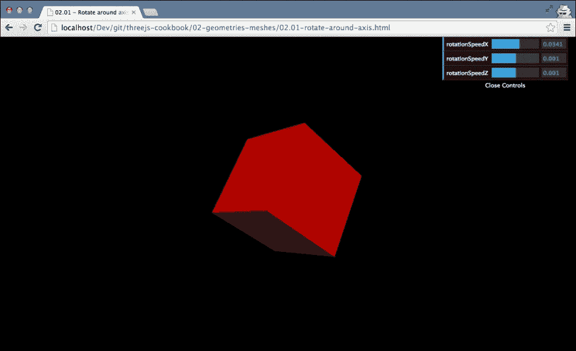

在这个演示中，您可以看到一个 3D 立方体在其轴上缓慢旋转。使用右上角的控制 GUI，您可以改变对象旋转的速度。

## 如何做到...

要像我们在上一张截图中所展示的那样，围绕轴旋转这个示例中的立方体，您必须采取几个步骤：

1.  在本菜谱的第一步中，我们将设置控制 GUI，正如我们在第一章中所示，在*控制场景中使用的变量*菜谱中，您可以在右上角看到。这次，我们将使用以下作为控制对象：

    ```js
      control = new function() {
        this.rotationSpeedX = 0.001;
        this.rotationSpeedY = 0.001;
        this.rotationSpeedZ = 0.001;
      };
    ```

    使用这个`control`对象，我们将控制围绕三个轴中的任何一个轴的旋转。我们将这个控制对象传递给`addControls`函数：

    ```js
      function addControls(controlObject) {
        var gui = new dat.GUI();
        gui.add(controlObject, 'rotationSpeedX', -0.2, 0.2);
        gui.add(controlObject, 'rotationSpeedY', -0.2, 0.2);
        gui.add(controlObject, 'rotationSpeedZ', -0.2, 0.2);
      }
    ```

    现在我们调用`addControls`函数时，我们将得到您在菜谱开头截图中所看到的漂亮的 GUI。

1.  现在我们可以通过 GUI 控制旋转，我们可以使用这些值来直接设置我们对象的旋转。在这个例子中，我们持续更新网格的`rotation`属性，所以你可以看到示例中的动画。为此，我们定义`render`函数如下：

    ```js
      function render() {
        var cube = scene.getObjectByName('cube');
        cube.rotation.x += control.rotationSpeedX;
        cube.rotation.y += control.rotationSpeedY;
        cube.rotation.z += control.rotationSpeedZ;
        renderer.render(scene, camera);
        requestAnimationFrame(render); 
      }
    ```

    在这个函数中，你可以看到我们通过控制 GUI 中设置的值来增加`THREE.Mesh`对象的`rotation`属性。这导致了你在*准备就绪*部分中看到的动画。请注意，旋转属性是`THREE.Vector3`类型。这意味着你也可以使用一个语句来设置属性，使用`cube.rotation.set(x, y, z)`。

## 工作原理...

当你在`THREE.Mesh`上设置旋转属性，就像我们在本例中所做的那样，Three.js 不会直接计算几何体的顶点的新位置。如果你将这些顶点打印到控制台，你会看到，无论`rotation`属性如何，它们都将保持完全相同。发生的情况是，当 Three.js 实际上在`renderer.render`函数中渲染`THREE.Mesh`时，正是那个确切的时刻，它的确切位置和旋转被计算出来。所以当你平移、旋转或缩放`THREE.Mesh`时，底层的`THREE.Geometry`对象保持不变。

## 相关内容

除了我们在这里展示的方法之外，还有其他方法可以旋转一个对象：

+   在即将到来的*在空间中围绕一个点旋转一个对象*配方中，我们将向你展示如何围绕任意点在空间中旋转一个对象，而不是围绕其自身的轴，就像我们在这个配方中展示的那样。

# 在空间中围绕一个点旋转一个对象

当你使用旋转属性旋转一个对象时，该对象是围绕其自身的中心旋转的。然而，在某些情况下，你可能想要围绕不同的对象旋转一个对象。例如，在模拟太阳系时，你想要围绕地球旋转月球。在这个配方中，我们将解释如何设置 Three.js 对象，以便你可以围绕彼此或空间中的任何点旋转它们。

## 准备就绪

对于这个配方，我们还提供了一个你可以实验的示例。要加载这个示例，只需在浏览器中打开`02.02-rotate-around-point-in-space.html`。当你打开这个文件时，你会看到以下截图类似的内容：

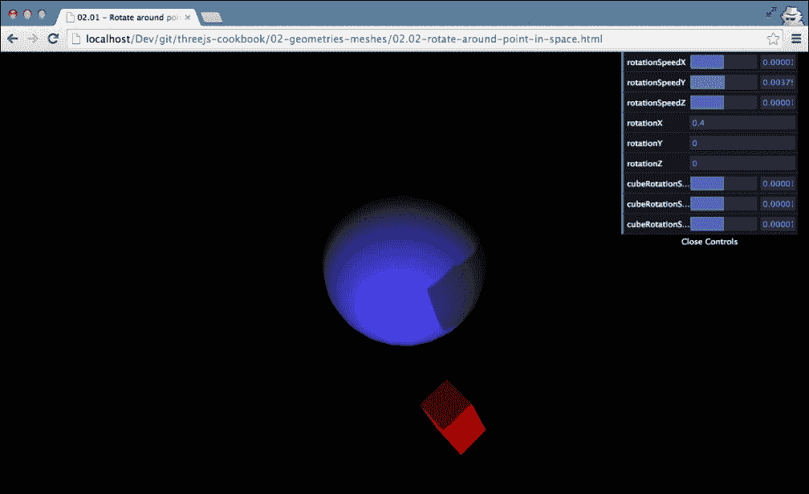

通过右侧的控制，你可以旋转各种对象。通过更改**rotationSpeedX**、**rotationSpeedY**和**rotationSpeedZ**属性，你可以围绕球体的中心旋转红色盒子。

### 小贴士

为了最好地展示围绕另一个对象旋转一个对象，你应该围绕该对象的*y*轴旋转。为此，更改**rotationSpeedY**属性。

## 如何做...

与之前配方中展示的旋转相比，围绕另一个对象旋转一个对象需要额外的几个步骤：

1.  让我们先创建截图中所看到的中心蓝色球体。这是我们将在其周围旋转小红色盒子的对象：

    ```js
      // create a simple sphere
      var sphere = new THREE.SphereGeometry(6.5, 20, 20);
      var sphereMaterial = new THREE.MeshLambertMaterial({
        color: 0x5555ff
      });
      var sphereMesh = new THREE.Mesh(sphere, spherMaterial);
      sphereMesh.receiveShadow = true;
      sphereMesh.position.set(0, 1, 0);
      scene.add(sphereMesh);
    ```

    到目前为止，这个代码片段中没有什么特别之处。您可以看到一个标准的 `THREE.Sphere` 对象，我们从中创建 `THREE.Mesh` 并将其添加到场景中。

1.  下一步是定义一个单独的对象，我们将使用它作为盒子的支点：

    ```js
      // add an object as pivot point to the sphere
      pivotPoint = new THREE.Object3D();
      sphereMesh.add(pivotPoint);
    ```

    `pivotPoint` 对象是一个 `THREE.Object3D` 对象。这是 `THREE.Mesh` 的父对象，可以添加到场景中而不需要几何形状或材质。然而，在这个菜谱中，我们没有将其添加到场景中，而是将其添加到我们在步骤 1 中创建的球体中。因此，如果球体旋转或改变位置，这个 `pivotPoint` 对象的位置和旋转也会改变，因为我们将其作为子对象添加到球体中。

1.  现在，我们可以创建红色盒子，而不是将其添加到场景中，我们将其添加到我们刚刚创建的 `pivotPoint` 对象中：

    ```js
      // create a box and add to scene
      var cubeGeometry = new THREE.BoxGeometry(2, 4, 2);
      var cubeMaterial = new THREE.MeshLambertMaterial();
      cubeMaterial.color = new THREE.Color('red');
      cube = new THREE.Mesh(cubeGeometry, cubeMaterial);
      // position is relative to it's parent
      cube.position.set(14, 4, 6);
      cube.name = 'cube';
      cube.castShadow = true;
      // make the pivotpoint the cube's parent.
      pivotPoint.add(cube);
    ```

    现在，我们可以旋转 `pivotPoint`，立方体将跟随 `pivotPoint` 的旋转。对于这个菜谱，我们通过在 `render` 函数中更新 `pivotPoint` 的 `rotation` 属性来实现这一点：

    ```js
      function render() {
        renderer.render(scene, camera);
        pivotPoint.rotation.x += control.rotationSpeedX;
        pivotPoint.rotation.y += control.rotationSpeedY;
        pivotPoint.rotation.z += control.rotationSpeedZ;
        requestAnimationFrame(render);
      }
    ```

## 它是如何工作的...

当你在 Three.js 中创建 `THREE.Mesh` 时，你通常只是将其添加到 `THREE.Scene` 并单独定位它。然而，在这个菜谱中，我们利用了 `THREE.Mesh` 功能，它从 `THREE.Object3D` 本身扩展而来，也可以包含子对象。因此，当父对象旋转时，这也会影响子对象。

使用这个菜谱中解释的方法的一个非常有趣的方面是，我们现在可以做几件有趣的事情：

+   我们可以通过更新 `cube.rotation` 属性来旋转盒子本身，就像我们在 *绕自身轴旋转对象* 菜谱中所做的那样

+   我们也可以通过更改球体的旋转属性来围绕球体旋转盒子，因为我们已经将 `pivotPoint` 添加为球体网格的子对象

+   我们甚至可以将所有这些结合起来，我们可以分别旋转 `pivotPoint`、`sphereMesh` 和 `cube`——所有这些——并创建非常有趣的效果

## 参见

在这个菜谱中，我们使用了可以将子对象添加到网格的事实，作为绕另一个对象旋转对象的方法。然而，在阅读以下菜谱之后，你将了解更多关于这一点：

+   在 *绕自身轴旋转对象* 的菜谱中，我们向您展示了如何使对象绕其自身轴旋转

# 通知 Three.js 关于更新

如果你已经使用 Three.js 工作了更长一段时间，你可能已经注意到，有时你对某些几何形状所做的更改似乎并不会总是导致屏幕上的变化。这是因为出于性能原因，Three.js 缓存了一些对象（例如几何形状的顶点和面）并且不会自动检测更新。对于这类更改，你必须明确通知 Three.js 有所变化。在这个菜谱中，我们将向您展示哪些几何形状的属性被缓存并且需要明确通知 Three.js 以进行更新。这些属性包括：

+   `geometry.vertices`

+   `geometry.faces`

+   `geometry.morphTargets`

+   `geometry.faceVertexUvs`

+   `geometry.faces[i].normal` 和 `geometry.vertices[i].normal`

+   `geometry.faces[i].color` 和 `geometry.vertices[i].color`

+   `geometry.vertices[i].tangent`

+   `geometry.lineDistances`

## 准备中

有一个示例允许你更改需要显式更新的两个属性：面颜色和顶点位置。如果你在你的浏览器中打开 `02.04-update-stuff.html` 示例，你会看到以下截图类似的内容：

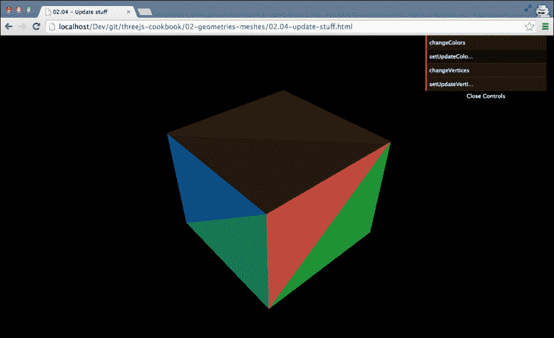

使用右上角的菜单，你可以更改这个几何体的两个属性。使用 **changeColors** 按钮，你可以将每个单独面的颜色设置为随机颜色，使用 **changeVertices**，你改变这个立方体每个顶点的位置。要应用这些更改，你必须按下 **setUpdateColors** 按钮或 **setUpdateVertices** 按钮。

## 如何做到这一点...

在许多属性中，你必须明确地告诉 Three.js 关于更新的信息。这个食谱将向你展示如何通知 Three.js 关于所有可能的更改。根据你进行的更改，你可以在食谱的任何步骤中跳入：

1.  首先，如果你想添加顶点或更改几何体单个顶点的值，你可以使用 `geometry.vertices` 属性。一旦你添加或更改了一个元素，你需要将 `geometry.verticesNeedUpdate` 属性设置为 `true`。

1.  在此之后，你可能还想缓存几何体内部的面的定义，这需要你使用 `geometry.faces` 属性。这意味着当你添加 `THREE.Face` 或更新现有属性时，你需要将 `geometry.elementsNeedUpdate` 设置为 `true`。

1.  然后，你可能想使用可以创建动画的变形目标，其中一个顶点集变形为另一个顶点集。这需要 `geometry.morphTargets` 属性。为了做到这一点，当你添加一个新的变形目标或更新现有的一个时，你需要将 `geometry.morphTargetsNeedUpdate` 设置为 `true`。

1.  接下来，下一步将是添加 `geometry.faceVertexUvs`。使用这个属性，你定义了纹理如何映射到几何体上。如果你在这个数组中添加或更改元素，你需要将 `geometry.uvsNeedUpdate` 属性设置为 `true`。

1.  你可能还想通过更改 `geometry.faces[i].normal` 和 `geometry.vertices[i].normal` 属性来更改顶点或面的法线。当你这样做时，你必须将 `geometry.normalsNeedUpdate` 设置为 `true` 以通知 Three.js。除了法线之外，还有一个 `geometry.vertices[i].tangent` 属性。这个属性用于计算阴影，并计算纹理渲染的时间。如果你进行手动更改，你必须将 `geometry.tangentsNeedUpdate` 设置为 `true`。

1.  接下来，你可以在顶点或面上定义单个颜色。你通过设置这些颜色属性来完成此操作：`geometry.faces[i].color`和`geometry.vertices[i].color`。一旦你修改了这些属性，你必须将`geometry.colorsNeedUpdate`设置为`true`。

1.  作为最后一步，你可以在运行时选择更改纹理和材质。当你想要更改材质的其中一个属性时，你需要将`material.needsUpdate`设置为`true`：纹理、雾、顶点颜色、蒙皮、变形、阴影贴图、alpha 测试、统一变量和灯光。如果你想更新纹理背后的数据，你需要将`texture.needsUpdate`标志设置为`true`。

## 它是如何工作的...

作为总结，步骤 1 到 7 适用于几何体以及基于几何体的任何 Three.js 对象。

为了从你的 3D 场景中获得最佳性能，Three.js 缓存了一些通常不会改变的性质和值。特别是在使用 WebGL 渲染器时，通过缓存所有这些值可以获得很多性能提升。当你将这些标志之一设置为 true 时，Three.js 会非常具体地知道它需要更新哪一部分。

## 相关内容

+   本书中有一些与这类似的食谱。如果你查看*应用矩阵变换*食谱的源代码，你可以看到我们在对几何体应用了一些矩阵变换之后使用了`verticesNeedUpdate`属性。

# 处理大量对象

如果你有很多对象的场景，你将开始注意到一些性能问题。你创建并添加到场景中的每个网格都需要由 Three.js 管理，当你处理成千上万的对象时，这会导致速度减慢。在这个食谱中，我们将向你展示如何合并对象以提高性能。

## 准备就绪

合并对象不需要额外的库或资源。我们准备了一个示例，展示了使用单独的对象与合并对象相比在性能上的差异。当你打开`02.05-handle-large-number-of-object.html`示例时，你可以尝试不同的方法。

你将看到以下截图的类似内容：

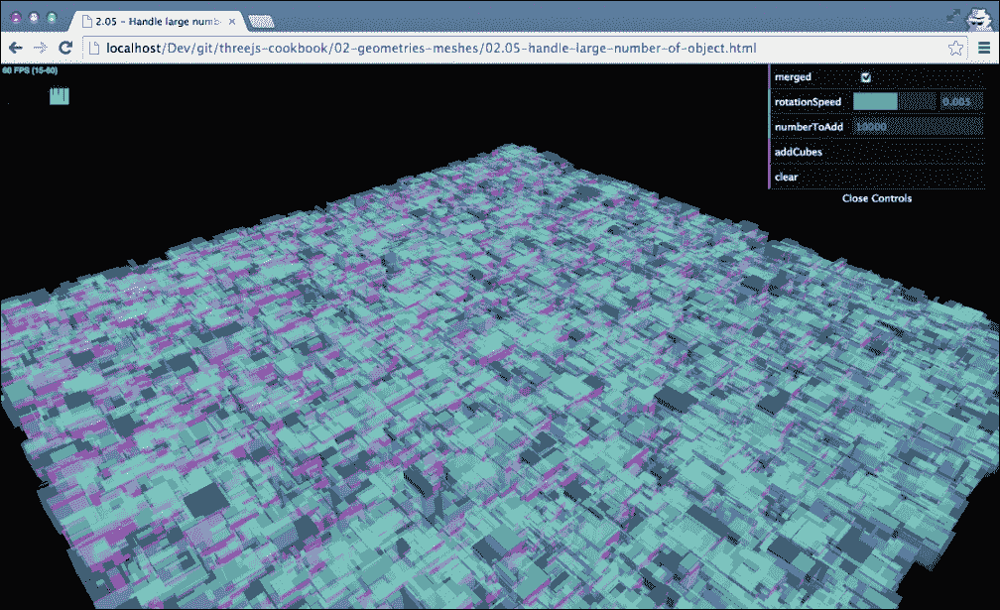

在前面的截图中，你可以看到，在使用合并对象的方法时，我们在处理 120,000 个对象时仍然能够达到 60 fps。

## 如何做到这一点...

在 Three.js 中合并对象非常简单。以下代码片段展示了如何将前一个示例中的对象合并在一起。这里的重要步骤是创建一个新的`THREE.Geometry()`对象，命名为`mergedGeometry`，然后创建大量`BoxGeometry`对象，如高亮代码部分所示：

```js
 var mergedGeometry = new THREE.Geometry();
  for (var i = 0; i < control.numberToAdd; i++) {
    var cubeGeometry = new THREE.BoxGeometry(
      4*Math.random(), 
      4*Math.random(), 
      4*Math.random());
    var translation = new THREE.Matrix4().makeTranslation(
      100*Math.random()-50, 
      0, 100*Math.random()-50);
    cubeGeometry.applyMatrix(translation);
 mergedGeometry.merge(cubeGeometry);
  }
  var mesh = new THREE.Mesh(mergedGeometry, new THREE.MeshNormalMaterial({
    opacity: 0.5,
    transparent: true
  }));
  scene.add(mesh);
```

我们通过调用`merge`函数将每个`cubeGeometry`对象合并到`mergedGeometry`对象中。结果是单个几何体，我们用它来创建`THREE.Mesh`，并将其添加到场景中。

## 它是如何工作的...

当你在几何体（我们称之为 `merged`）上调用 `merge` 函数并传入要合并的几何体（我们称之为 `toBeMerged`）时，Three.js 会执行以下步骤：

1.  首先，Three.js 从 `toBeMerged` 几何体中克隆所有顶点并将它们添加到 `merged` 几何体的顶点数组中。

1.  接下来，它会遍历 `toBeMerged` 几何体中的面，并在 `merged` 几何体中创建新的面，复制原始的法线和颜色。

1.  作为最后一步，它将 `toBeMerged` 的 `uv` 映射复制到 `merged` 几何体的 `uv` 映射中。

结果是一个单一的几何体，当添加到场景中时，看起来像多个几何体。

## 相关内容

+   这种方法的主要问题是，独立合并的对象着色、样式、动画和变换变得更加困难。对于 Three.js 来说，合并后，它被视为一个单独的对象。然而，可以将特定的材质应用到每个面上。我们将在第四章“材料和纹理”中的*使用单独的材质为面着色*配方中向你展示如何做这件事。

# 从高度图中创建几何体

使用 Three.js，创建自己的几何体非常容易。对于这个配方，我们将向你展示如何根据地形高度图创建自己的几何体。

## 准备工作

要将高度图转换为 3D 几何体，我们首先需要一个高度图。在这本书提供的源文件中，你可以找到一个 Grand Canyon 部分的高度图。以下图像显示了它的样子：

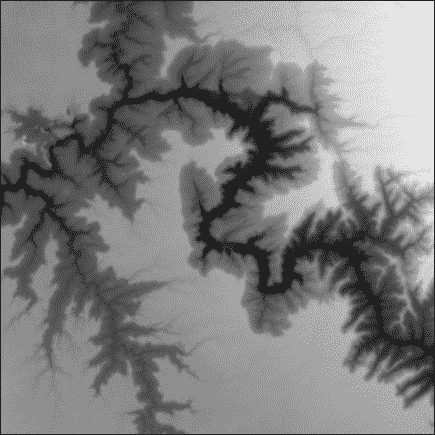

如果你熟悉大峡谷（Grand Canyon），你可能会认出其独特的形状。本配方结束时的最终结果可以通过在浏览器中打开 `02.06-create-terrain-from-heightmap.html` 文件来查看。你将看到以下截图类似的内容：

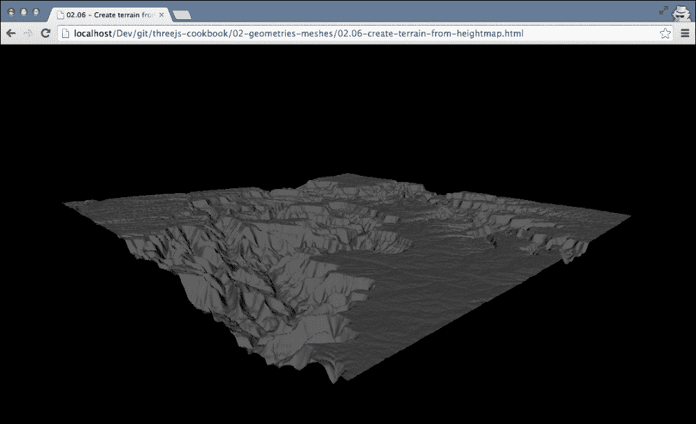

## 如何操作...

要创建基于高度图（heightmap）的几何体，你需要执行以下步骤：

1.  在我们查看所需的 Three.js 代码之前，我们首先需要加载图像并设置一些属性，这些属性决定了几何体的最终大小和高度。这可以通过添加以下代码片段并设置 `img.src` 属性为我们的高度图位置来完成。一旦图像加载，`img.onload` 函数将被调用，在那里我们将图像数据转换为 `THREE.Geometry`：

    ```js
      var depth = 512;
      var width = 512;
      var spacingX = 3;
      var spacingZ = 3;
      var heightOffset = 2;
      var canvas = document.createElement('canvas');
      canvas.width = 512;
      canvas.height = 512;
      var ctx = canvas.getContext('2d');
      var img = new Image();
      img.src = "../assets/other/grandcanyon.png";
      img.onload = function () {...}
    ```

1.  一旦图像在 `onload` 函数中加载，我们需要每个像素的值并将其转换为 `THREE.Vector3`：

    ```js
      // draw on canvas
      ctx.drawImage(img, 0, 0);
      var pixel = ctx.getImageData(0, 0, width, depth);
      var geom = new THREE.Geometry();
      var output = [];
      for (var x = 0; x < depth; x++) {
        for (var z = 0; z < width; z++) {
          // get pixel
          // since we're grayscale, we only need one element
          // each pixel contains four values RGB and opacity
          var yValue = pixel.data[z * 4 + (depth * x * 4)] / heightOffset;
          var vertex = new THREE.Vector3(x * spacingX, yValue, z * spacingZ);
          geom.vertices.push(vertex);
        }
      }
    ```

    如此代码片段所示，我们处理图像的每个像素，并根据像素值创建 `THREE.Vector3`，并将其添加到我们自定义几何体的顶点数组中。

1.  现在我们已经定义了顶点，下一步是使用这些顶点来创建面：

    ```js
      // we create a rectangle between four vertices, and we do
      // that as two triangles.
      for (var z = 0; z < depth - 1; z++) {
        for (var x = 0; x < width - 1; x++) {
          // we need to point to the position in the array
          // a - - b
          // |  x  |
          // c - - d
          var a = x + z * width;
          var b = (x + 1) + (z * width);
          var c = x + ((z + 1) * width);
          var d = (x + 1) + ((z + 1) * width);
          var face1 = new THREE.Face3(a, b, d);
          var face2 = new THREE.Face3(d, c, a);
          geom.faces.push(face1);
          geom.faces.push(face2);
        }
      }
    ```

    如你所见，每一组四个顶点被转换成两个 `THREE.Face3` 元素并添加到 `faces` 数组中。

1.  现在我们需要做的就是让 Three.js 计算顶点和面的法线，然后我们可以从这个几何体创建`THREE.Mesh`并将其添加到场景中：

    ```js
      geom.computeVertexNormals(true);
      geom.computeFaceNormals();
      var mesh = new THREE.Mesh(geom, new THREE.MeshLambertMaterial({color: 0x666666}));
      scene.add(mesh);
    ```

### 小贴士

如果您渲染这个场景，您可能需要调整相机位置和最终网格的缩放，以获得正确的大小。

## 它是如何工作的...

高度图是将高度信息嵌入图像的一种方法。图像的每个像素值代表在该点测量的相对高度。在本食谱中，我们处理了这个值，以及它的*x*和*y*值，并将其转换为顶点。如果我们对每个点都这样做，我们就可以得到一个精确的 2D 高度图的 3D 表示。在这种情况下，它产生了一个包含 512 * 512 个顶点的几何体。

## 还有更多…

当我们从零开始创建一个几何体时，我们可以添加一些有趣的东西。例如，我们可以为每个单独的面着色。这可以通过以下方式完成：

1.  首先，添加`chroma`库（您可以从[`github.com/gka/chroma.js`](https://github.com/gka/chroma.js)下载源代码）：

    ```js
      <script src="img/chroma.min.js"></script>
    ```

1.  您可以创建一个颜色刻度：

    ```js
      var scale = chroma.scale(['blue', 'green', red]).domain([0, 50]);
    ```

1.  根据面的高度设置面颜色：

    ```js
      face1.color = new THREE.Color(
        scale(getHighPoint(geom, face1)).hex());
      face2.color = new THREE.Color(
        scale(getHighPoint(geom, face2)).hex())
    ```

1.  最后，将材质的`vertexColors`设置为`THREE.FaceColors`。结果看起来大致如下：

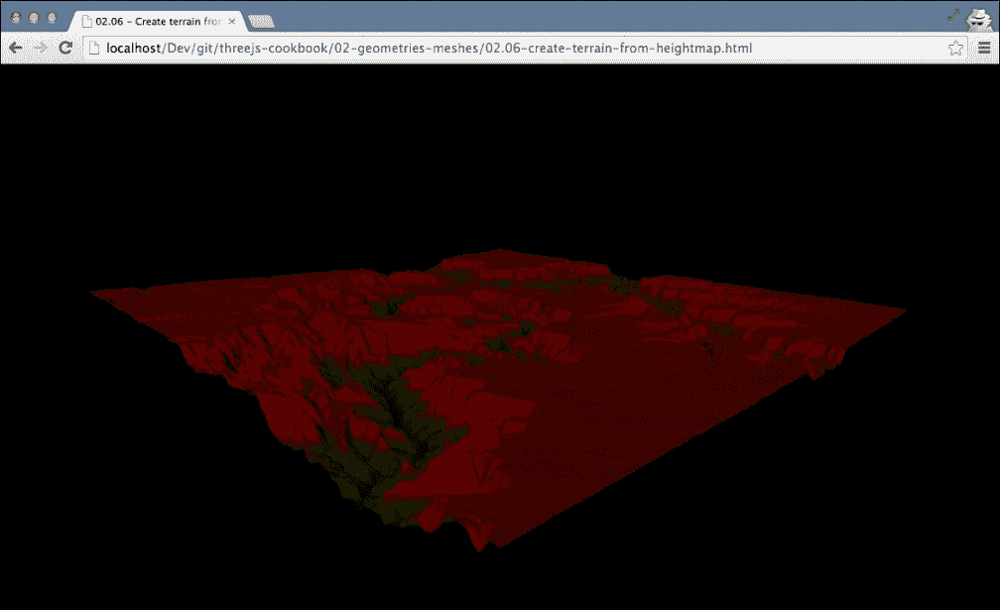

您还可以应用不同类型的材质，以真正创建类似地形的效果。有关更多信息，请参阅第四章，*材质和纹理*，关于材质的介绍。

## 相关内容

+   在这个示例中，我们使用高度图创建了一个几何体。您还可以将高度图用作凹凸图，以向模型添加深度细节。我们将在第四章，*材质和纹理*，的*使用凹凸图向网格添加深度*食谱中向您展示如何这样做。

# 将一个对象指向另一个对象

许多游戏的一个常见需求是相机和其他对象相互跟随或对齐。Three.js 使用`lookAt`函数提供了对此的标准支持。在本食谱中，您将学习如何使用`lookAt`函数将一个对象指向另一个对象。

## 准备工作

本食谱的示例可以在本书的源代码中找到。如果您在浏览器中打开`02.07-point-object-to-another.html`，您会看到以下截图类似的内容：

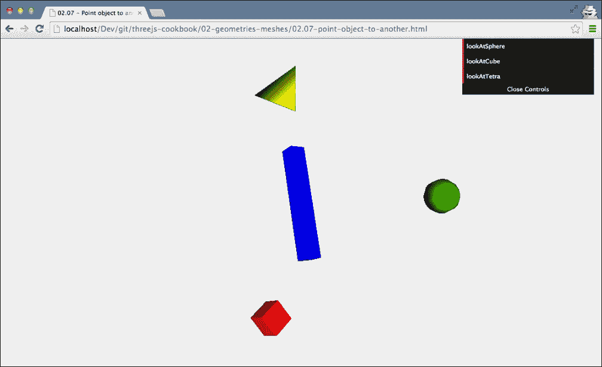

使用菜单，您可以将大蓝色矩形指向场景中的任何其他网格。

## 如何操作...

创建`lookAt`功能实际上非常简单。当您将`THREE.Mesh`添加到场景中时，您只需调用其`lookAt`函数并将其指向它应该转向的位置。对于本食谱提供的示例，操作如下：

```js
  control = new function() {
    this.lookAtCube = function() {
      cube.lookAt(boxMesh.position);
    };
    this.lookAtSphere = function() {
      cube.lookAt(sphereMesh.position);
    };
    this.lookAtTetra = function() {
      cube.lookAt(tetraMesh.position);
    };
  };
```

因此，当您点击`lookAtSphere`按钮时，矩形的`lookAt`函数将使用球体的位置被调用。

## 它是如何工作的...

使用这段代码，将一个对象与另一个对象对齐非常容易。使用`lookAt`函数，Three.js 隐藏了完成此操作所需的复杂性。内部，Three.js 使用矩阵计算来确定需要应用到对象上的旋转，以正确地对齐你正在查看的对象。所需的旋转随后被设置在对象上（到`rotation`属性）并在下一个渲染循环中显示。

## 还有更多…

在这个例子中，我们向你展示了如何将一个对象对齐到另一个对象。使用 Three.js，你可以用相同的方法处理其他类型的对象。你可以使用`camera.lookAt(object.position)`将相机指向一个特定的对象以使其居中，你也可以使用`light.lookAt(object.position)`将灯光指向一个特定的对象。

你也可以使用`lookAt`来跟踪一个移动的对象。只需在渲染循环中添加`lookAt`代码，对象就会围绕移动的对象移动。

## 相关内容

+   `lookAt`函数在内部使用矩阵计算。在本章的最后一个配方中，*应用矩阵变换*，我们展示了你可以如何使用矩阵计算来完成其他效果。

# 在 3D 中编写文本

Three.js 的一个酷特性是它允许你在 3D 中编写文本。通过几个简单的步骤，你可以使用任何文本，甚至带有字体支持，作为场景中的 3D 对象。这个配方展示了如何创建 3D 文本，并解释了可用于样式化结果的不同的配置选项。

## 准备中

要在页面上使用 3D 文本，我们需要包含一些额外的 JavaScript 代码。Three.js 提供了一些你可以使用的字体，它们以单独的 JavaScript 文件的形式提供。要添加所有可用的字体，请包含以下脚本：

```js
  <script src="img/gentilis_bold.typeface.js">
  </script>
  <script src="img/gentilis_regular.typeface.js">
  </script>
  <script src="img/optimer_bold.typeface.js"></script>
  <script src="img/optimer_regular.typeface.js">
  </script>
  <script src="img/helvetiker_bold.typeface.js">
  </script>
  <script src="img/helvetiker_regular.typeface.js">
  </script>
  <script src= "../assets/fonts/droid/droid_sans_regular.typeface.js">
  </script>
  <script src= "../assets/fonts/droid/droid_sans_bold.typeface.js">
  </script>
  <script src= "../assets/fonts/droid/droid_serif_regular.typeface.js">
  </script>
  <script src="img/droid_serif_bold.typeface.js">
  </script>
```

我们已经在`02.09-write-text-in-3D.html`示例中做了这个。如果你在浏览器中打开它，你可以尝试在 Three.js 中创建文本时使用的各种字体和属性。当你打开指定的示例时，你会看到以下截图类似的内容：

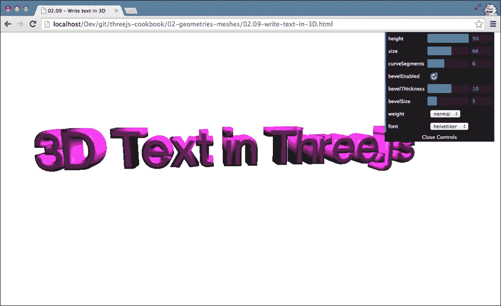

## 如何做…

在 Three.js 中创建 3D 文本非常简单。你所要做的就是创建像这样的`THREE.TextGeometry`：

```js
  var textGeo = new THREE.TextGeometry(text, params);
  textGeo.computeBoundingBox();
  textGeo.computeVertexNormals();
```

`text`属性是我们想要写入的文本，而`params`定义了文本的渲染方式。`params`对象可以有许多不同的参数，你可以在*如何工作…*部分中更详细地查看。

然而，在我们的例子中，我们使用了以下参数集（它指向右上角的 GUI 部分）：

```js
  var params = {
    material: 0,
    extrudeMaterial: 1,
    bevelEnabled: control.bevelEnabled,
    bevelThickness: control.bevelThickness,
    bevelSize: control.bevelSize,
    font: control.font,
    style: control.style,
    height: control.height,
    size: control.size,
    curveSegments: control.curveSegments
  };
```

这个几何体可以像其他任何几何体一样添加到场景中：

```js
  var material = new THREE.MeshFaceMaterial([
    new THREE.MeshPhongMaterial({
      color: 0xff22cc,
      shading: THREE.FlatShading
    }), // front
    new THREE.MeshPhongMaterial({
    color: 0xff22cc,
    shading: THREE.SmoothShading
    }) // side
  ]);
  var textMesh = new THREE.Mesh(textGeo, material);
  textMesh.position.x = -textGeo.boundingBox.max.x / 2;
  textMesh.position.y = -200;
  textMesh.name = 'text';
  scene.add(textMesh);
```

### 注意

在使用 `THREE.TextGeometry` 和材料时，需要考虑一件事。如代码片段所示，我们添加了两个材质对象而不是一个。第一个材质应用于渲染文本的前面，第二个材质应用于渲染文本的侧面。如果您只传递一个材质，它将应用于前面和侧面。

## 工作原理...

如前所述，存在许多不同的参数：

| 参数 | 描述 |
| --- | --- |
| `height` | 高度属性定义文本的深度，换句话说，文本被拉伸多远以使其成为 3D。 |
| `size` | 使用此属性，您设置最终文本的大小。 |
| `curveSegments` | 如果字符有曲线（例如，字母 *a*），此属性定义曲线将有多平滑。 |
| `bevelEnabled` | 斜边提供了从文本前面到侧面的平滑过渡。如果您将此值设置为 `true`，则将在渲染的文本上添加斜边。 |
| `bevelThickness` | 如果您已将 `bevelEnabled` 设置为 `true`，则定义斜边有多深。 |
| `bevelSize` | 如果您已将 `bevelEnabled` 设置为 `true`，则定义斜边有多高。 |
| `weight` | 这是指文字的粗细（正常或粗体）。 |
| `font` | 这是将要使用的字体名称。 |
| `material` | 当提供材料数组时，此属性应包含用于前面的材料索引。 |
| `extrudeMaterial` | 当提供材料数组时，此属性应包含用于侧面的材料索引。 |

当您创建 `THREE.TextGeometry` 时，Three.js 内部使用 `THREE.ExtrudeGeometry` 来创建 3D 形状。`THREE.ExtrudeGeometry` 通过沿 *Z* 轴拉伸 2D 形状来工作，使其成为 3D。为了从文本字符串创建 2D 形状，Three.js 使用我们在本配方的 *准备工作* 部分中包含的 JavaScript 文件。这些基于 [`typeface.neocracy.org/fonts.html`](http://typeface.neocracy.org/fonts.html) 的 JavaScript 文件允许您将文本渲染为 2D 路径，然后我们可以将其转换为 3D。

## 更多...

如果您想使用不同的字体，您可以在 [`typeface.neocracy.org/fonts.html`](http://typeface.neocracy.org/fonts.html) 转换自己的字体。要使用这些字体，您只需在您的页面上包含它们，并将正确的 `name` 和 `style` 值作为参数传递给 `THREE.TextGeometry`。

# 将 3D 公式作为 3D 几何体渲染

Three.js 提供了许多不同的创建几何体方法。您可以使用标准的 Three.js 对象，如 `THREE.BoxGeometry` 和 `THREE.SphereGeometry`，从头开始创建几何体，或者只需加载由外部 3D 建模程序创建的模型。在这个配方中，我们将向您展示另一种创建几何体的方法。这个配方将向您展示如何根据数学公式创建几何体。

## 准备工作

对于这个配方，我们将使用`THREE.ParametricGeometry`对象。因为这个对象可以从标准的 Three.js 分发中获取，所以不需要包含额外的 JavaScript 文件。

要查看这个配方的最终结果，你可以查看`02.10-create-parametric-geometries.html`，你会看到以下截图类似的内容：

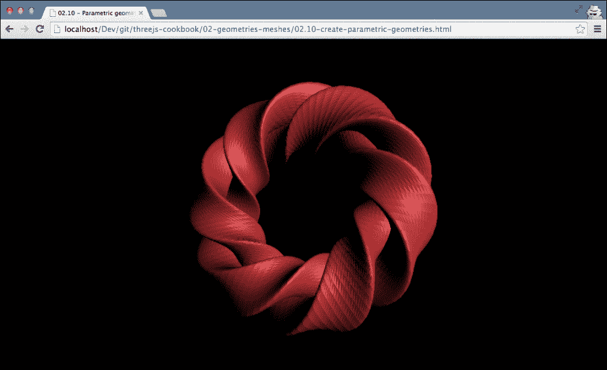

这个图形向你展示了*格雷的克莱因瓶*，它是基于几个简单的数学公式渲染的。

## 如何做…

使用数学公式通过 Three.js 生成几何形状非常简单，只需两步：

1.  我们需要做的第一件事是创建一个函数，这个函数将为我们创建几何形状。这个函数将接受两个参数：`u`和`v`。当 Three.js 使用这个函数来生成几何形状时，它将使用`u`和`v`的值调用这个函数，从`0`开始，到`1`结束。对于这些`u`和`v`的组合中的每一个，这个函数应该返回一个`THREE.Vector3`对象，它代表最终几何形状中的一个顶点。创建你在上一节中看到的图形的函数如下所示：

    ```js
      var paramFunction = function(u, v) {
        var a = 3;
        var n = 3;
        var m = 1;
        var u = u * 4 * Math.PI;
        var v = v * 2 * Math.PI;
        var x = (a + Math.cos(n * u / 2.0) * Math.sin(v) - Math.sin(n * u / 2.0) * Math.sin(2 * v)) * Math.cos(m * u / 2.0);
        var y = (a + Math.cos(n * u / 2.0) * Math.sin(v) - Math.sin(n * u / 2.0) * Math.sin(2 * v)) * Math.sin(m * u / 2.0);
        var z = Math.sin(n * u / 2.0) * Math.sin(v) + Math.cos(n * u / 2.0) * Math.sin(2 * v);
        return new THREE.Vector3(x, y, z);
      }
    ```

    只要你为每个`u`和`v`的值返回一个新的`THREE.Vector3`对象，你就可以提供你自己的函数。

1.  现在我们已经得到了创建我们几何形状的函数，我们可以使用这个函数来创建`THREE.ParametricGeometry`：

    ```js
      var geom = new THREE.ParametricGeometry(paramFunction, 100, 100);
      var mat = new THREE.MeshPhongMaterial({
        color: 0xcc3333a,
        side: THREE.DoubleSide,
        shading: THREE.FlatShading
      });
      var mesh = new THREE.Mesh(geom, mat);
      scene.add(mesh);
    ```

你可以清楚地看到已经将三个参数传递给了`THREE.ParametricObject`的构造函数。这将在*如何工作…*部分中更详细地讨论。

在创建几何形状之后，你只需要创建`THREE.Mesh`并将其添加到场景中，就像添加任何其他 Three.js 对象一样。

## 如何工作…

从前面的代码片段的第 2 步，你可以看到我们向`THREE.ParametricObject`的构造函数提供了三个参数。第一个是我们第 1 步中展示的函数，第二个决定了我们如何分割`u`参数的步数，第三个决定了我们如何分割`v`参数的步数。数字越高，创建的顶点就越多，最终的几何形状看起来就越平滑。不过，要注意，顶点数量过多会对性能产生不利影响。

当你创建`THREE.ParametricGeometry`时，Three.js 将根据提供的参数调用该函数多次。函数被调用的次数基于第二个和第三个参数。这会产生一系列`THREE.Vector3`对象，然后这些对象自动组合成面。这会产生一个你可以像使用任何其他几何形状一样使用的几何形状。

## 还有更多…

与这个配方中展示的不同，你可以用这些类型的几何形状做很多事情。在`02.10-create-parametric-geometries.html`源文件中，你可以找到一些其他函数，这些函数可以创建看起来有趣的几何形状，如下面的截图所示：

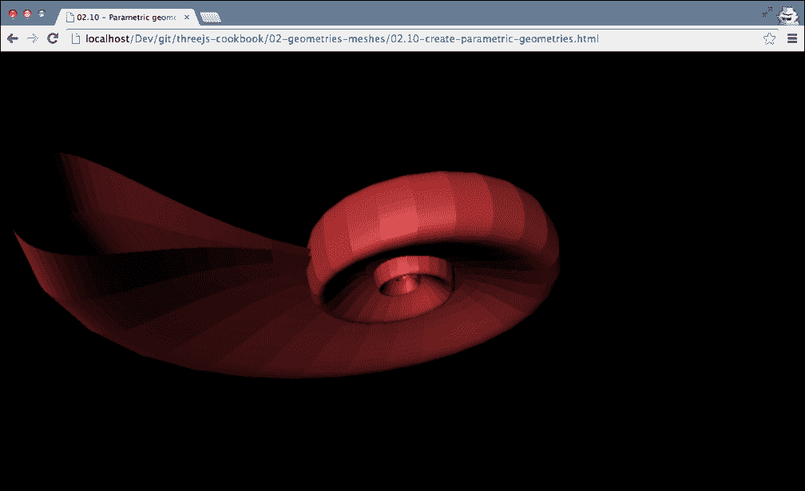

# 使用 Three.js 通过自定义几何对象扩展 Three.js

在你迄今为止看到的菜谱中，我们从头开始创建 Three.js 对象。我们或者从头开始使用顶点和面构建一个新的几何体，或者重用现有的一个并为其配置。虽然这对于大多数场景来说已经足够好了，但当需要维护一个包含大量不同几何体的庞大代码库时，这并不是最佳解决方案。在 Three.js 中，你通过实例化一个`THREE.GeometryName`对象来创建几何体。在这个菜谱中，我们将向你展示如何创建一个自定义几何体对象，并像其他 Three.js 对象一样实例化它。

## 准备中

你可以使用提供的源代码来实验这个菜谱的示例。在你的浏览器中打开`02.11-extend-threejs-with-custom-geometry.html`，查看最终结果，它将类似于以下屏幕截图：

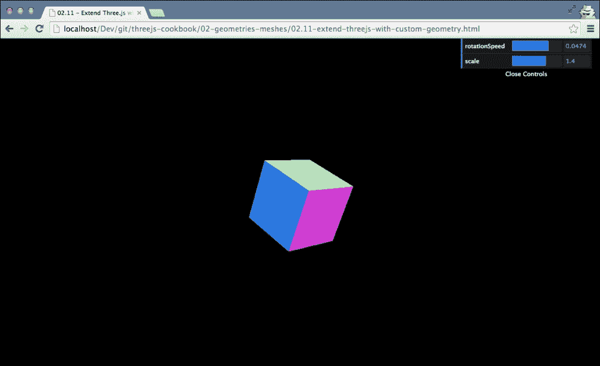

在这个屏幕截图中，你可以看到一个单独旋转的立方体。这个立方体是一个自定义几何体，可以通过使用新的`THREE.FixedBoxGeometry()`来实例化。在接下来的部分中，我们将解释如何实现这一点。

## 如何操作...

使用自定义几何体扩展 Three.js 相对简单，只需几个简单的步骤：

1.  我们需要做的第一件事是创建一个新的 JavaScript 对象，它包含我们新的 Three.js 几何体的逻辑和属性。对于这个菜谱，我们将创建`FixedBoxGeometry`，它的工作方式与`THREE.BoxGeometry`完全相同，但使用相同的高度、宽度和深度值。在这个菜谱中，我们在`setupCustomObject`函数中创建这个新对象：

    ```js
      function setupCustomObject() {
        // First define the object.
        THREE.FixedBoxGeometry = function ( width, segments) {
          // first call the parent constructor
          THREE.Geometry.call( this );
          this.width = width;
          this.segments = segments;
          // we need to set
          //   - vertices in the parent object
          //   - faces in the parent object
          //   - uv mapping in the parent object
          // normally we'd create them here ourselves
          // in this case, we just reuse the once
          // from the boxgeometry.
          var boxGeometry = new THREE.BoxGeometry(
            this.width, 
            this.width, 
            this.width, this.segments, this.segments);
          this.vertices = boxGeometry.vertices;
          this.faces = boxGeometry.faces;
          this.faceVertexUvs = boxGeometry.faceVertexUvs;
        }
        // define that FixedBoxGeometry extends from 
        // THREE.Geometry
        THREE.FixedBoxGeometry.prototype= Object.create( THREE.Geometry.prototype );
      }
    ```

    在这个函数中，我们使用`THREE.FixedBoxGeometry = function ( width, segments) {..}`定义了一个新的 JavaScript 对象。在这个函数中，我们首先调用父对象的构造函数（`THREE.Geometry.call( this )`）。这确保了所有属性都正确初始化。接下来，我们包装一个现有的`THREE.BoxGeometry`对象，并使用该对象的信息来设置我们自定义对象的`vertices`、`faces`和`faceVertexUvs`。

    最后，我们需要告诉 JavaScript 我们的`THREE.BoxGeometry`对象继承自`THREE.Geometry`。这是通过将`THREE.FixedBoxGeometry`的原型属性设置为`Object.create(THREE.Geometry.prototype)`来实现的。

1.  在调用`setupCustomObject()`之后，我们现在可以使用相同的方法来创建这个对象，就像我们为其他 Three.js 提供的几何体所做的那样：

    ```js
      var cubeGeometry = new THREE.FixedBoxGeometry(3, 5);
      var cubeMaterial = new THREE.MeshNormalMaterial();
      var cube = new THREE.Mesh(cubeGeometry, cubeMaterial);
      scene.add(cube);
    ```

    在这个阶段，我们已经创建了一个自定义的 Three.js 几何体，你可以像 Three.js 提供的标准几何体一样实例化它。

## 工作原理...

在这个菜谱中，我们使用了 JavaScript 提供的一种标准方式来创建继承自其他对象的对象。我们定义了以下内容：

```js
  THREE.FixedBoxGeometry.prototype= Object.create( THREE.Geometry.prototype );
```

这段代码片段告诉 JavaScript `THREE.FixedBoxGeometry`被创建，它继承自`THREE.Geometry`的所有属性和函数，它有自己的构造函数。这也是为什么我们也在我们的新对象中添加了以下调用：

```js
  THREE.Geometry.call( this );
```

这将在创建我们自己的自定义对象时调用 `THREE.Geometry` 对象的构造函数。

原型继承比这个简短的菜谱中解释的还要多。如果你想了解更多关于原型继承的信息，Mozilla 团队有一个很好的解释，说明了如何使用原型属性进行继承，请参阅[`developer.mozilla.org/en-US/docs/Web/JavaScript/Guide/Inheritance_and_the_prototype_chain`](https://developer.mozilla.org/en-US/docs/Web/JavaScript/Guide/Inheritance_and_the_prototype_chain)。

## 还有更多...

在这个菜谱中，我们封装了一个现有的 Three.js 对象来创建我们的自定义对象。你也可以将这种方法应用于完全从头创建的对象。例如，你可以从我们在 *从高度图创建几何体* 菜谱中使用的 JavaScript 代码创建 `THREE.TerrainGeometry` 来创建一个 3D 地形。

# 在两点之间创建样条曲线

当你创建可视化效果，例如，想要可视化飞机的飞行路径时，在起点和终点之间绘制曲线是一种很好的方法。在这个菜谱中，我们将向你展示如何使用标准的 `THREE.TubeGeometry` 对象来完成这个操作。

## 准备工作

当你打开这个菜谱的示例 `02.12-create-spline-curve.html` 时，你可以看到一个从起点到终点的曲线管几何形状：

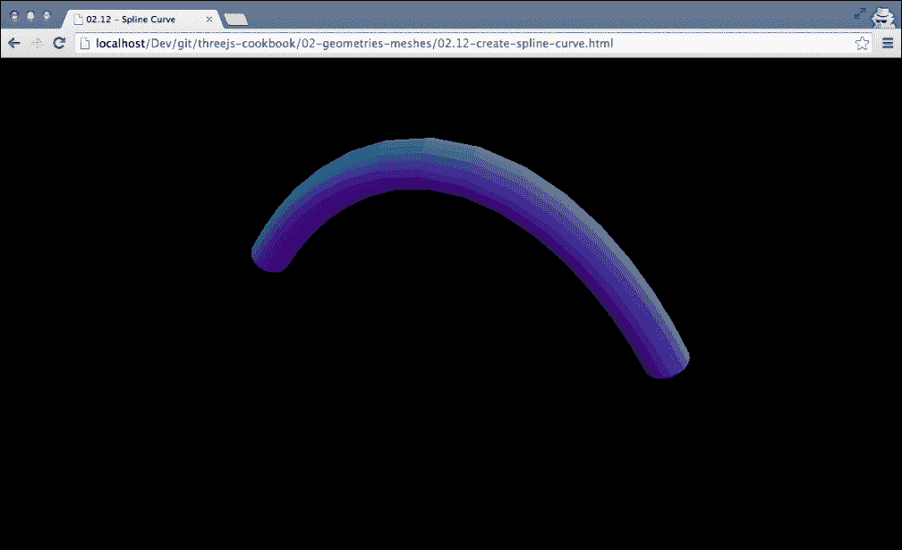

在接下来的部分中，我们将逐步解释如何创建这条曲线。

## 如何操作...

要创建一个像前面示例中显示的弯曲样条曲线，我们需要采取几个简单的步骤：

1.  我们需要做的第一件事是为这条曲线定义一些常数：

    ```js
      var numPoints = 100;
      var start = new THREE.Vector3(-20, 0, 0);
      var middle = new THREE.Vector3(0, 30, 0);
      var end = new THREE.Vector3(20, 0, 0);
    ```

    `numPoints` 对象定义了我们用来定义曲线的顶点数量以及渲染管时使用的段数。`start` 向量定义了我们想要开始曲线的位置，`end` 向量决定了曲线的终点，最后，`middle` 向量定义了曲线的高度和中心点。如果我们，例如，将 `numPoints` 设置为 `5`，我们将得到不同类型的曲线。

    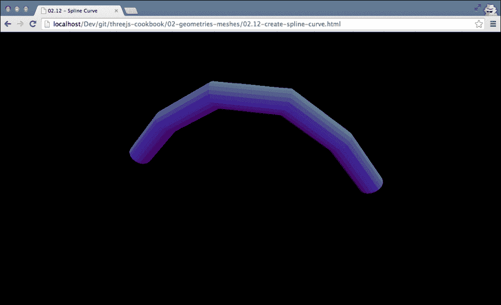

1.  现在我们已经得到了 `start`、`end` 和 `middle` 向量，我们可以使用它们来创建一个漂亮的曲线。为此，我们可以使用 Three.js 提供的一个对象，称为 `THREE.QuadraticBezierCurve3`：

    ```js
      var curveQuad = new THREE.QuadraticBezierCurve3(start, middle, end);
    ```

    基于这个 `curveQuad`，我们现在可以创建一个简单的管几何体。

1.  要创建一个管，我们使用 `THREE.TubeGeometry` 并传入 `curveQuad`，这是我们上一步创建的：

    ```js
      var tube = new THREE.TubeGeometry(curveQuad, numPoints, 2, 20, false);
      var mesh = new THREE.Mesh(tube, new THREE.MeshNormalMaterial({
        opacity: 0.6,
        transparent: true
      }));
      scene.add(mesh);
    ```

## 它是如何工作的...

在本食谱中我们创建的`QuadraticBezierCurve3`对象具有多个不同的函数（`getTangentAt`和`getPointAt`），这些函数决定了路径上的某个位置。这些函数根据传递给构造函数的`start`、`middle`和`end`向量返回信息。当我们把`QuadraticBezierCurve3`传递给`THREE.TubeGeometry`时，`THREE.TubeGeometry`使用`getTangentAt`函数来确定其顶点的位置。

## 还有更多…

在这个食谱中，我们使用了`THREE.QuadraticBezierCurve3`来创建我们的样条。Three.js 还提供了`THREE.CubicBezierCurve3`和`THREE.SplineCurve3`曲线，你可以使用这些曲线来定义这类样条。你可以在[`stackoverflow.com/questions/18814022/what-is-the-difference-between-cubic-bezier-and-quadratic-bezier-and-their-use-c`](http://stackoverflow.com/questions/18814022/what-is-the-difference-between-cubic-bezier-and-quadratic-bezier-and-their-use-c)上找到关于二次贝塞尔曲线和三次贝塞尔曲线之间差异的更多信息。

# 从 Blender 创建和导出模型

你可以从[`www.blender.org/download/`](http://www.blender.org/download/)下载 Blender，这是一个创建 3D 模型的优秀工具，并且对 Three.js 有很好的支持。有了合适的插件，Blender 可以直接导出模型到 Three.js 的 JSON 格式，然后可以轻松地将其添加到场景中。

## 准备中

在我们能够使用 Blender 中的 JSON 导出器之前，我们首先需要在 Blender 中安装这个插件。要安装插件，请按照以下步骤操作：

1.  你需要做的第一件事是获取插件的最新版本。我们已经将它添加到本书的源代码中。你可以在`assets/plugin`文件夹中找到这个插件。在那个目录中，你会找到一个名为`io_mesh_threejs`的单个目录。要安装插件，只需将这个完整的目录复制到 Blender 的插件位置。由于 Blender 是跨平台的，根据你的操作系统，这个插件目录可能存储在不同的位置。

1.  对于 Windows 系统，将`io_mesh_threejs`目录复制到`C:\Users\USERNAME\AppData\Roaming\Blender Foundation\Blender\2.70a\scripts\addons`。

1.  对于 OS X 用户，这取决于你安装 Blender 的位置（解压 ZIP 文件）。你应该将`io_mesh_threejs`目录复制到`/location/of/extracted/zip/blender.app/Contents/MacOS/2.6X/scripts/addons`。

1.  最后，对于 Linux 用户，将`io_mesh_threejs`目录复制到`/home/USERNAME/.config/blender/2.70a/scripts/addons`。

1.  如果你通过 apt-get 安装了 Blender，你应该将`io_mesh_threejs`目录复制到`/usr/lib/blender/scripts/addons`。

1.  下一步是启用 Three.js 插件。如果 Blender 已经运行，请重新启动它并打开**用户首选项**。你可以通过导航到**文件** | **用户首选项**来找到它。在打开的屏幕上，选择**插件**标签页，其中列出了所有可用的插件。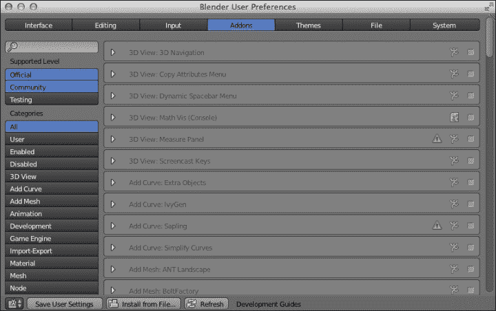

1.  在这一点上，Three.js 插件已启用。为了确保在您重新启动 Blender 时它保持启用状态，请点击**保存用户设置**按钮。现在，关闭此窗口，如果您导航到**文件** | **导出**，您应该会看到一个 Three.js 导出功能，如下面的截图所示：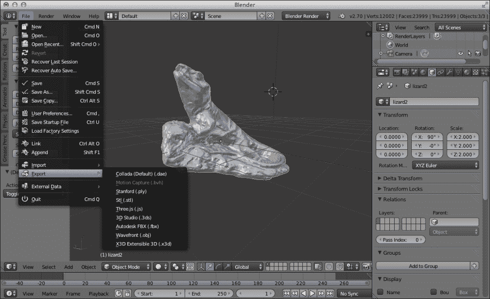

现在，让我们看看这个配方的其余部分，看看我们如何从 Blender 导出一个模型并在 Three.js 中加载它。

## 如何做...

要从 Blender 导出一个模型，我们首先必须创建一个。在本配方中，我们不会加载现有的一个，而是从头开始创建，导出，并在 Three.js 中加载它：

1.  首先，当您打开 Blender 时，您会看到一个立方体。首先，我们删除这个立方体。您可以通过按*x*并点击弹出窗口中的删除来完成此操作。

1.  现在，我们将创建一个简单的几何体，我们可以使用我们安装的 Three.js 插件将其导出。为此，在底部菜单中点击**添加**，然后选择**猴子**，如下面的截图所示：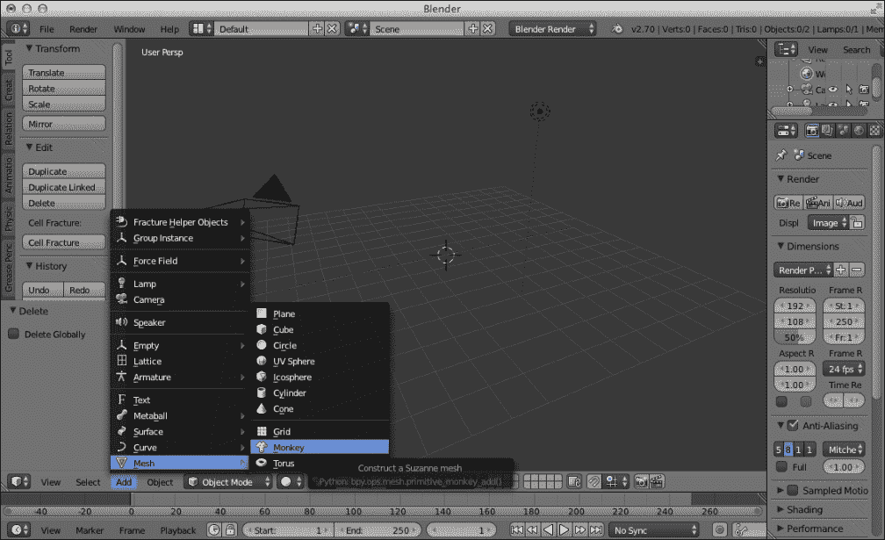

    现在，您应该有一个在 Blender 中中间有猴子几何体的空场景：

    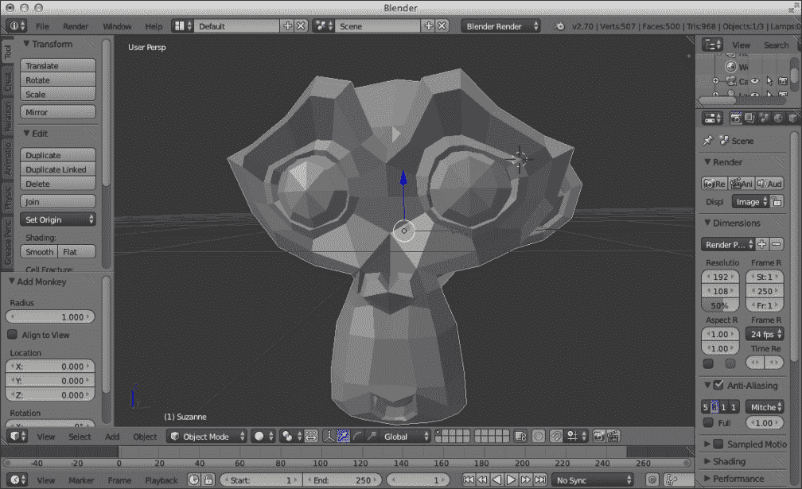

1.  我们可以使用本配方*准备就绪*部分中安装的插件将这只猴子导出到 Three.js。为此，在**文件**菜单中导航到**导出** | **Three.js**。这会打开导出对话框，您可以在其中确定将模型导出到的目录。在这个**导出**对话框中，您还可以设置一些额外的 Three.js 特定导出属性，但默认属性通常是可以接受的。对于这个配方，我们将模型导出为`monkey.js`。

1.  在这一点上，我们已经导出了模型，现在可以使用 Three.js 加载它。要加载模型，我们只需在我们在第一章中展示的*使用 WebGL 渲染器入门*配方中添加以下 JavaScript 即可：

    ```js
      function loadModel() {
        var loader = new THREE.JSONLoader();
        loader.load("../assets/models/monkey.js", function(model, material) {
          var mesh = new THREE.Mesh(model, material[0]);
          mesh.scale = new THREE.Vector3(3,3,3);
          scene.add(mesh);
        });
      }
    ```

结果是一个旋转的猴子，这是我们使用 Blender 创建的，由 Three.js 渲染，如下面的截图所示：

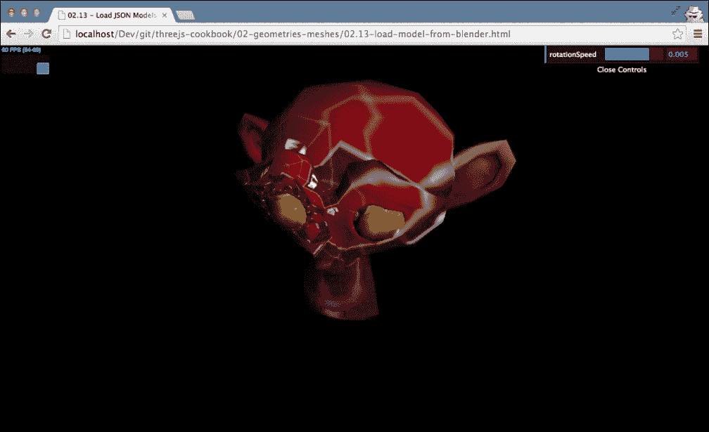

## 参见

有几个配方您会从中受益阅读：

+   在*使用 OBJMTLLoader 与多个材质*配方中，我们使用不同的格式，将其加载到 Three.js 中

+   在第七章中，我们探讨了*动画与物理*，其中我们查看动画，当我们使用*使用骨骼动画*配方中的骨骼动画时，我们将重新访问 Three.js 导出插件。

# 使用 OBJMTLLoader 与多个材质

Three.js 提供了一些标准几何体，您可以使用它们来创建 3D 场景。然而，复杂的模型在专门的 3D 建模应用程序（如 Blender 或 3ds Max）中创建更为容易。幸运的是，尽管如此，Three.js 对大量导出格式提供了很好的支持，因此您可以轻松加载在这些包中创建的模型。广泛支持的标准是`OBJ`格式。使用这种格式，模型由两个不同的文件描述：一个定义几何体的`.obj`文件和一个定义材质的`.mtl`文件。在本教程中，我们将向您展示使用 Three.js 提供的`OBJMTLLoader`成功加载模型所需的步骤。

## 准备中

要加载`.obj`和`.mtl`格式的模型，我们首先需要包含正确的 JavaScript 文件，因为这些 JavaScript 对象不包括在标准的 Three.js JavaScript 文件中。因此，在 head 部分，您需要添加以下脚本标签：

```js
  <script src="img/MTLLoader.js"></script>
  <script src="img/OBJMTLLoader.js"></script>
```

在本例中，我们使用的模型是乐高迷你人偶。在 Blender 中，原始模型看起来是这样的：

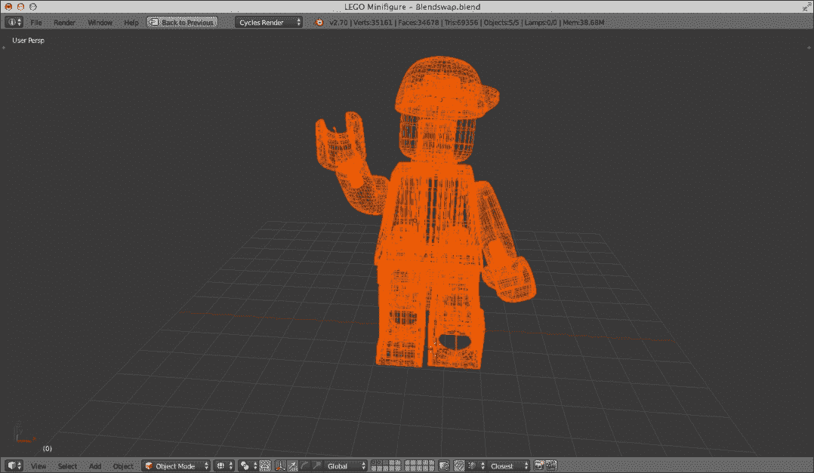

您可以通过在浏览器中打开`02.14-use-objmtlloader-with-multiple-materials.html`来查看最终的模型。以下截图显示了渲染器模型的外观：

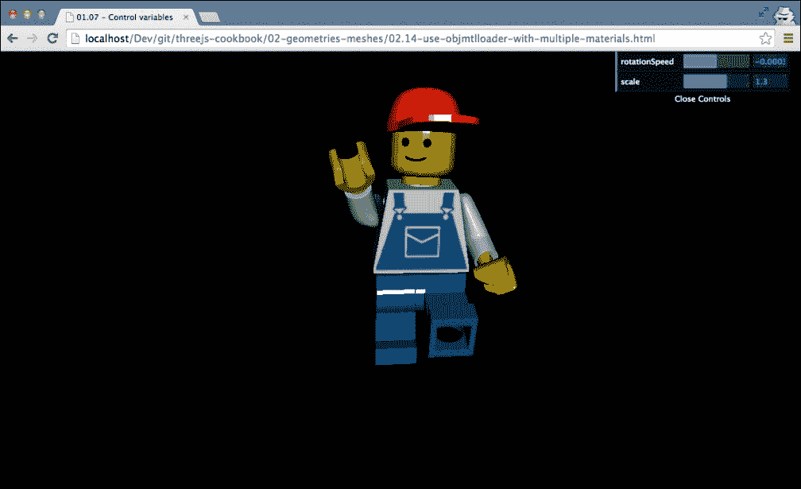

让我们一步步指导您如何加载这样的模型。

## 如何操作...

在我们将模型加载到 Three.js 之前，我们首先需要检查`.mtl`文件中是否定义了正确的路径。因此，我们首先需要做的是在文本编辑器中打开`.mtl`文件：

1.  当您打开本例的`.mtl`文件时，您会看到以下内容：

    ```js
      newmtl Cap
      Ns 96.078431
      Ka 0.000000 0.000000 0.000000
      Kd 0.990000 0.120000 0.120000
      Ks 0.500000 0.500000 0.500000
      Ni 1.000000
      d 1.00000
      illum 2
      newmtl Minifig
      Ns 874.999998
      Ka 0.000000 0.000000 0.000000
      Kd 0.800000 0.800000 0.800000
      Ks 0.200000 0.200000 0.200000
      Ni 1.000000
      d 1.000000
      illum 2
     map_Kd ../textures/Mini-tex.png

    ```

    这个`.mtl`文件定义了两种材质：一种用于迷你人偶的身体，另一种用于其帽子。我们需要检查的是`map_Kd`属性。这个属性需要包含从`.obj`文件加载的相对路径到 Three.js 可以找到纹理的位置。在我们的例子中，这个路径是：`.../textures/Mini-tex.png`。

1.  确保`.mtl`文件包含正确的引用后，我们可以使用`THREE.OBJMTLLoader`加载模型：

    ```js
      var loader = new THREE.OBJMTLLoader();
      // based on model from:
      // http://www.blendswap.com/blends/view/69499
      loader.load("../assets/models/lego.obj",
      "../assets/models/lego.mtl", 
      function(obj) {
        obj.translateY(-3);
        obj.name='lego';
        scene.add(obj);
      });
    ```

    如您所见，我们将`.obj`和`.mtl`文件都传递给了`load`函数。这个`load`函数的最后一个参数是一个`callback`函数。当模型加载完成时，这个`callback`函数将被调用。

1.  到这一步，您可以对加载的模型做任何您想做的事情。在本例中，我们通过右上角的菜单添加了缩放和旋转功能，并将这些属性应用到`render`函数中：

    ```js
      function render() {
        renderer.render(scene, camera);
        var lego = scene.getObjectByName('lego');
        if (lego) {
          lego.rotation.y += control.rotationSpeed;
          lego.scale.set(control.scale, control.scale, control.scale);
        }
        requestAnimationFrame(render);
      }
    ```

## 工作原理...

`.obj` 和 `.mtl` 文件格式是经过良好记录的格式。`OBJMTLLoader` 解析这两个文件中的信息，并根据该信息创建几何体和材质。它使用 `.obj` 文件来确定对象的几何形状，并使用 `.mtl` 文件中的信息来确定材质，在这个例子中是 `THREE.MeshLambertMaterial`，用于每个几何体。

Three.js 然后将这些组合成 `THREE.Mesh` 对象，并返回一个包含 `Lego` 图形所有部分的单个 `THREE.Object3D` 对象，您可以将它添加到场景中。

## 还有更多…

在这个菜谱中，我们向您展示了如何加载定义在 `.obj` 和 `.mtl` 格式的对象。除了这种格式，Three.js 还支持广泛的其他格式。有关 Three.js 支持的文件格式的良好概述，请参阅 Three.js GitHub 存储库中的此目录：[`github.com/mrdoob/three.js/tree/master/examples/js/loaders`](https://github.com/mrdoob/three.js/tree/master/examples/js/loaders)。

## 参见

+   对于这个菜谱，我们假设我们有一个完整且格式正确的模型。如果您想从头开始创建模型，一个很好的开源 3D 建模工具是 Blender。在 *从 Blender 创建和导出模型* 菜谱中，解释了如何在 Blender 中创建新模型并将其导出，以便 Three.js 可以加载它。

# 应用矩阵变换

在本章的前几个菜谱中，我们使用了 `rotation` 属性并应用平移以获得所需的旋转效果。幕后，Three.js 使用矩阵变换来修改网格或几何体的形状和位置。Three.js 还提供了将自定义矩阵变换直接应用于几何体或网格的功能。在这个菜谱中，我们将向您展示如何将您自己的自定义矩阵变换直接应用于 Three.js 对象。

## 准备工作

要查看此菜谱的实际操作并实验各种变换，请在您的浏览器中打开 `02.15-apply-matrix-transformations.html` 示例。您将看到一个简单的 Three.js 场景：

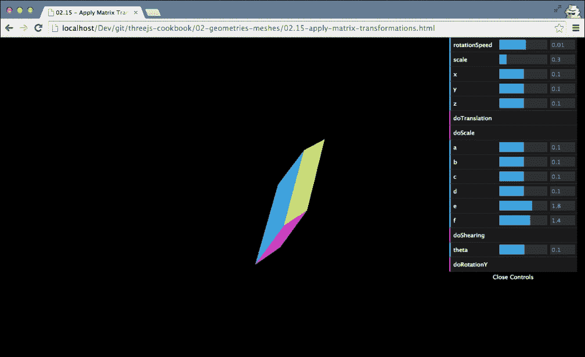

在这个场景中，您可以使用右侧的菜单直接将各种变换应用于旋转的立方体。在下一节中，我们将向您展示创建此变换所需的步骤。

## 如何操作...

创建自己的矩阵变换非常简单。

1.  首先，让我们看看当您点击 **doTranslation** 按钮时调用的代码：

    ```js
      this.doTranslation = function() {
        // you have two options, either use the
        // helper function provided by three.js
        // new THREE.Matrix4().makeTranslation(3,3,3);
        // or do it yourself
        var translationMatrix = new THREE.Matrix4(
          1, 0, 0, control.x,
          0, 1, 0, control.y,
          0, 0, 1, control.z,
          0, 0, 0, 1
        );
        cube.applyMatrix(translationMatrix);
        // or do it on the geometry
        // cube.geometry applyMatrix(translationMatrix);
        // cube.geometry.verticesNeedUpdate = true;
      }
    ```

    如您在代码中所见，创建自定义矩阵变换非常简单，只需要以下步骤。

1.  首先，您实例化一个新的 `THREE.Matrix4` 对象，并将矩阵的值作为参数传递给构造函数。

1.  接下来，您使用 `THREE.Mesh` 或 `THREE.Geometry` 的 `applyMatrix` 函数将该变换应用于特定对象。

1.  如果你将此应用于 `THREE.Geometry`，你必须将 `verticesNeedUpdate` 属性设置为 `true`，因为顶点变化不会自动传播到渲染器（参见 *通知 Three.js 关于更新* 菜谱）。

## 工作原理

本菜谱中使用的变换基于矩阵计算。矩阵计算本身是一个相当复杂的话题。如果你对矩阵计算的工作原理以及它们如何用于所有不同类型的变换感兴趣，可以在 [`www.matrix44.net/cms/notes/opengl-3d-graphics/basic-3d-math-matrices`](http://www.matrix44.net/cms/notes/opengl-3d-graphics/basic-3d-math-matrices) 找到很好的解释。

## 还有更多...

在本章的示例中，你可以对旋转的立方体应用几个变换。以下代码片段显示了这些变换所使用的矩阵：

```js
  this.doScale = function() {
    var scaleMatrix = new THREE.Matrix4(
      control.x, 0, 0, 0,
      0, control.y, 0, 0,
      0, 0, control.z, 0,
      0, 0, 0, 1
    );
    cube.geometry.applyMatrix(scaleMatrix);
    cube.geometry.verticesNeedUpdate = true;
  }
  this.doShearing = function() {
    var scaleMatrix = new THREE.Matrix4(
      1, this.a, this.b, 0,
      this.c, 1, this.d, 0,
      this.e, this.f, 1, 0,
      0, 0, 0, 1
    );
    cube.geometry.applyMatrix(scaleMatrix);
    cube.geometry.verticesNeedUpdate = true;
  }
  this.doRotationY = function() {
    var c = Math.cos(this.theta),
    s = Math.sin(this.theta);
    var rotationMatrix = new THREE.Matrix4(
      c, 0, s, 0,
      0, 1, 0, 0, -s, 0, c, 0,
      0, 0, 0, 1
    );
    cube.geometry.applyMatrix(rotationMatrix);
    cube.geometry.verticesNeedUpdate = true;
  }
```

在这个菜谱中，我们从头开始创建了矩阵变换。然而，Three.js 也提供了 `Three.Matrix4` 类中的一些辅助函数，你可以使用这些函数更轻松地创建这类矩阵：

+   `makeTranslation(x, y, z)`: 这个函数返回一个矩阵，当应用于几何体或网格时，通过指定的 x、y 和 z 值平移对象

+   `makeRotationX(theta)`: 这个函数返回一个矩阵，可以用来绕 *x* 轴旋转网格或几何体一定量的弧度

+   `makeRotationY(theta)`: 这与上一个函数相同——这次是绕 *y* 轴旋转

+   `makeRotationZ(theta)`: 这与上一个函数相同——这次是绕 *z* 轴旋转

+   `makeRotationAxis(axis, angle)`: 这个函数返回一个基于提供的轴和角度的旋转矩阵

+   `makeScale(x, y, z)`: 这个函数返回一个矩阵，可以用来沿任意三个轴缩放对象

## 相关内容

我们也在本章的其他菜谱中使用了矩阵变换：

+   在前两个菜谱中，*绕对象自身的轴旋转* 和 *绕空间中的点旋转对象*，实际的旋转是通过矩阵变换来应用的

+   在 *绕对象自身的轴旋转* 菜谱中，我们使用了 `THREE.Matrix4` 对象的辅助函数来绕对象的轴旋转对象
