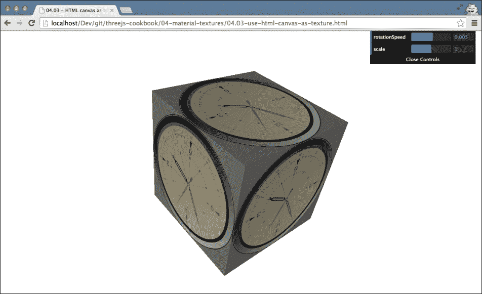
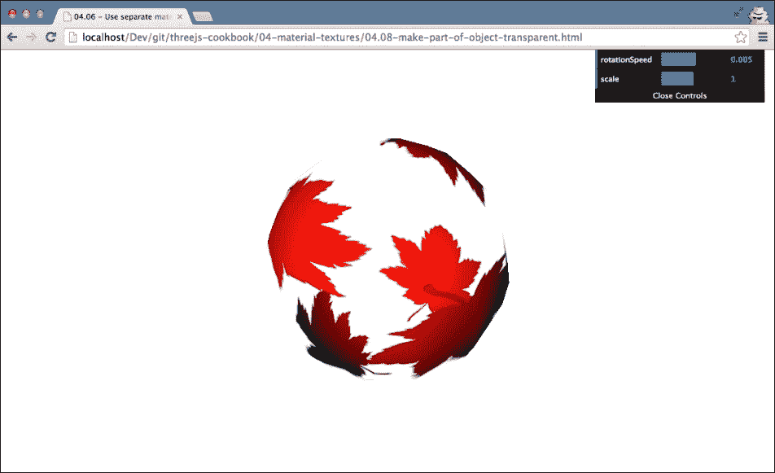
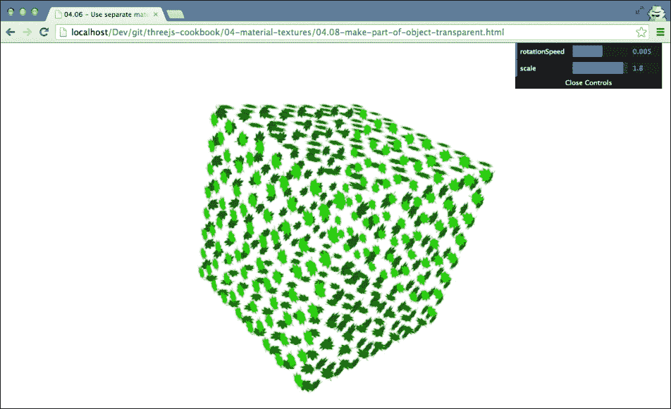
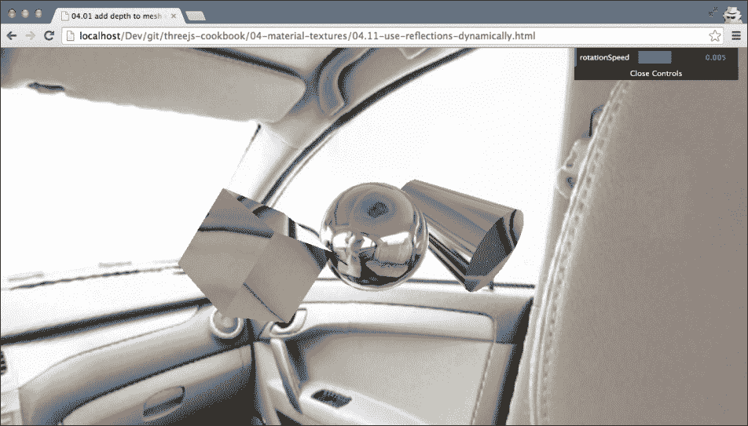

# 第四章：材料和纹理

在本章中，我们将介绍以下食谱：

+   使用凹凸贴图给网格添加深度

+   使用法线贴图给网格添加深度

+   使用 HTML 画布作为纹理

+   使用 HTML 视频作为纹理

+   创建具有多个材料的网格

+   使用单独的材料为面着色

+   设置重复纹理

+   使物体的一部分透明

+   使用立方体贴图创建反射材料

+   使用动态立方体贴图创建反射材料

+   使用 Blender 创建自定义 UV 映射

+   配置混合模式

+   使用阴影贴图创建固定阴影

# 简介

Three.js 提供了大量的不同材料，并支持许多不同类型的纹理。这些纹理提供了一种创建有趣效果和图形的绝佳方式。在本章中，我们将向您展示一些食谱，让您充分利用 Three.js 提供的这些组件。

# 使用凹凸贴图给网格添加深度

对于详细模型，你需要具有大量顶点和面的几何体。如果一个几何体包含非常多的顶点，加载几何体和渲染它所需的时间将比简单模型所需的时间更长。如果你有一个包含大量模型的场景，尝试尽量减少顶点的数量以获得更好的性能是个好主意。你可以使用多种不同的技术来实现这一点。在本食谱中，我们将向您展示如何使用凹凸贴图纹理为您的模型添加深度感。

## 准备工作

为了准备这个食谱，我们需要获取我们想要在几何体上使用的纹理。对于这个食谱，我们需要两个纹理：一个颜色图，这是一个标准纹理，以及一个凹凸贴图，它描述了与标准纹理相关的深度。以下截图显示了我们将使用的颜色图（你可以在本书提供的源代码中的`assets/textures`文件夹中找到这些纹理）：


如您所见，这是一个简单的石头墙颜色图。除了这个纹理，我们还需要凹凸贴图。凹凸贴图是一种灰度图像，其中每个像素的强度决定了高度：


从前面的截图，你可以看到石头和灰浆之间的部分高度较低，因为它是深色，与颜色较浅的石头本身相比。你可以在浏览器中打开`04.01-add-depth-to-mesh-with-bump-map.html`示例，查看这个食谱结束时的结果。


从前面的截图，你可以看到两个立方体。左侧的立方体没有使用凹凸贴图进行渲染，而右侧的立方体使用了凹凸贴图。正如你所见，右侧的立方体比左侧的立方体显示出更多的深度和细节。

## 如何做到这一点...

当你有纹理时，使用它们给模型添加深度是非常直接的：

1.  首先，创建您想要与振荡贴图一起使用的几何体：

    ```js
    var cubeGeometry = new THREE.BoxGeometry(15, 15, 15);
    ```

    在这个配方中，我们创建 `THREE.BoxGeometry`，但您可以使用振荡贴图与任何类型的几何体一起使用。

1.  下一步是创建我们定义振荡贴图的材质：

    ```js
    var cubeBumpMaterial = new THREE.MeshPhongMaterial();

    cubeBumpMaterial.map = THREE.ImageUtils.loadTexture(
                        "../assets/textures/Brick-2399.jpg");
    cubeBumpMaterial.bumpMap = THREE.ImageUtils.loadTexture(
                "../assets/textures/Brick-2399-bump-map.jpg");
    ```

    在这里，我们创建 `THREE.MeshPhongMaterial` 并设置其 `map` 和 `bumpMap` 属性。`map` 属性指向颜色贴图纹理，而 `bumpMap` 属性指向灰度振荡贴图纹理。

1.  现在您只需创建 `THREE.Mesh` 并将其添加到场景中：

    ```js
    var bumpCube = new THREE.Mesh(cubeGeometry,
                                  cubeBumpMaterial);
    scene.add(bumpCube);
    ```

通过这三个简单的步骤，您已经创建了一个使用振荡贴图来增加深度的立方体。

## 它是如何工作的...

振荡贴图中每个像素的值决定了与该纹理部分相关联的高度。在渲染场景时，Three.js 使用这些信息来确定光线如何影响它正在渲染的像素的最终颜色。结果是，即使没有定义一个非常详细的模型，我们也可以添加额外的深度错觉。如果您想了解更多关于振荡贴图如何工作的详细信息，请查看这个网站以获取非常详细的解释：[`www.tweak3d.net/articles/bumpmapping/`](http://www.tweak3d.net/articles/bumpmapping/).

## 更多内容…

在这个配方中，我们向您展示了定义振荡贴图的默认方法。然而，您可以使用一个额外的属性来调整振荡贴图。我们在这个配方中使用的材质 `cubeBumpMaterial` 也有一个 `bumpScale` 属性。使用这个属性，您可以设置振荡贴图影响深度的程度。如果这个值非常小，您会看到一些增加的深度，如果这个值更高，您会看到更明显的深度效果。您可以在本食谱的示例中设置此属性（`04.01-add-depth-to-mesh-with-bump-map.html`）。

## 参考内容

+   有一种额外的方法可以为您的网格添加细节和深度。在 *使用正常贴图为网格添加深度* 配方中，我们展示了如何使用正常贴图而不是振荡贴图来添加深度和细节。在 *从高度图创建几何体* 配方中，第二章，*几何体和网格*，我们向您展示了创建 `THREE.Geometry` 来使用振荡贴图的不同方法。

# 使用正常贴图为网格添加深度

在 *使用振荡贴图为网格添加深度* 配方中，我们展示了如何使用特定的纹理为网格添加深度和细节。在这个配方中，我们提供了一种在不增加几何体顶点数的情况下添加更多深度和细节的方法。为此，我们将使用正常贴图。正常贴图描述了每个像素的法向量，该向量应用于计算光线如何影响几何体中使用的材质。

## 准备工作

要使用正常贴图，我们首先需要一个颜色贴图和一个正常贴图。对于这个配方，我们使用了两个截图。第一个是颜色贴图：


下一个截图是正常贴图：


现在我们已经得到了这两张图片，让我们首先看看这在实践中会是什么样子。要看到正常贴图的实际应用，请打开`04.02-add-depth-to-mesh-with-normal-map.html`示例：


在这个例子中，您可以在左侧看到一个标准渲染的立方体，在右侧可以看到添加了正常贴图的立方体。您可以直接看到右侧立方体的面看起来比左侧立方体的面更详细。

## 如何操作...

添加正常贴图实际上非常简单：

1.  首先，创建我们想要渲染的几何形状：

    ```js
    var cubeGeometry = new THREE.BoxGeometry(15, 15, 15);
    ```

    对于这个配方，我们使用一个简单的`THREE.BoxGeometry`对象，但你也可以使用你想要的任何几何形状。

1.  现在我们已经得到了一个几何形状，我们创建材质并配置属性：

    ```js
    var cubeNormalMaterial = new THREE.MeshPhongMaterial();
    cubeNormalMaterial.map = THREE.ImageUtils.loadTexture(
                      "../assets/textures/chesterfield.png");
    cubeNormalMaterial.normalMap = THREE.ImageUtils.loadTexture(
               "../assets/textures/chesterfield-normal.png");
    ```

    `map`属性包含标准纹理，而`normalMap`属性包含正常纹理，这是我们在这份配方*准备就绪*部分向您展示的。

1.  现在剩下的只是创建一个`THREE.Mesh`对象并将其添加到场景中，如下所示：

    ```js
    var normalCube = new THREE.Mesh(
                         cubeGeometry, cubeNormalMaterial);
    scene.add(normalCube);
    ```

如您从这些步骤中看到的，使用正常贴图非常简单。

## 它是如何工作的...

在 3D 建模中，有几个数学概念是重要的，需要理解。其中之一是一个**法向量**的概念。法向量是垂直于几何形状面面的向量。这在上面的屏幕截图中显示：


每条蓝色线条代表法向量，这是垂直于该表面面的向量。在正常贴图中，这些向量的方向以 RGB 值的形式显示。当你将正常贴图应用于特定的面时，Three.js 会使用这个正常贴图和面的法线信息来为该面添加深度，而不添加额外的顶点。有关正常贴图如何使用的更多信息，请参考[`www.opengl-tutorial.org/intermediate-tutorials/tutorial-13-normal-mapping/`](http://www.opengl-tutorial.org/intermediate-tutorials/tutorial-13-normal-mapping/)网站。

## 更多...

你可以微调从正常贴图中应用到几何形状面的高度和方向。为此，你可以使用`normalScale`属性，如下所示：

```js
normalCube.material.normalScale.x = 1;
normalCube.material.normalScale.y = 1;
```

要看到这个效果的实际应用，请查看这个配方的示例`04.02-add-depth-to-mesh-with-normal-map.html`，在那里你可以使用右上角的菜单来改变这个值。

## 参见

+   正常贴图的替代方案是凹凸贴图。在*使用凹凸贴图给网格添加深度*的配方中，我们向您展示了如何使用这种贴图而不是正常贴图。

# 使用 HTML 画布作为纹理

通常当你使用纹理时，你会使用静态图像。然而，在 Three.js 中，也可以创建交互式纹理。在这个食谱中，我们将向您展示如何使用 HTML5 画布元素作为纹理的输入。一旦您通知 Three.js 关于纹理使用的这个变化，任何对这个画布的更改都会自动反映出来。

## 准备工作

对于这个食谱，我们需要一个可以显示为纹理的 HTML5 画布元素。我们可以自己创建一个并添加一些输出，但在这个食谱中，我们选择了其他东西。我们将使用一个简单的 JavaScript 库，它将时钟输出到一个画布元素。生成的网格将看起来像这样（参见`04.03-use-html-canvas-as-texture.html`示例）：



渲染时钟所使用的 JavaScript 代码基于这个网站的代码：[`saturnboy.com/2013/10/html5-canvas-clock/`](http://saturnboy.com/2013/10/html5-canvas-clock/)。为了在我们的页面中包含渲染时钟的代码，我们需要在`head`元素中添加以下内容：

```js
<script src="img/clock.js"></script>
```

## 如何做到这一点...

要将画布用作纹理，我们需要执行几个步骤：

1.  我们需要做的第一件事是创建画布元素：

    ```js
    var canvas = document.createElement('canvas');
    canvas.width=512;
    canvas.height=512;
    ```

    在这里，我们通过编程创建一个 HTML 画布元素，并定义一个固定的宽度。

1.  现在我们已经得到了一个画布，我们需要在它上面渲染我们用作这个食谱输入的时钟。这个库非常容易使用；您只需传入我们刚刚创建的画布元素：

    ```js
    clock(canvas);
    ```

1.  到目前为止，我们已经得到了一个渲染并更新时钟图像的画布。我们现在需要做的是创建一个几何体和一个材质，并使用这个画布元素作为这个材质的纹理：

    ```js
    var cubeGeometry = new THREE.BoxGeometry(10, 10, 10);
    var cubeMaterial = new THREE.MeshLambertMaterial();
    cubeMaterial.map = new THREE.Texture(canvas);
    var cube = new THREE.Mesh(cubeGeometry, cubeMaterial);
    ```

    要从画布元素创建纹理，我们只需创建一个新的`THREE.Texture`实例，并传入我们在步骤 1 中创建的`canvas`元素。我们将这个纹理分配给`cubeMaterial.map`属性，这样就完成了。

1.  如果您在这个步骤运行食谱，您可能会看到时钟渲染在立方体的侧面。然而，时钟不会自动更新。我们需要告诉 Three.js 画布元素已经更改。我们通过在渲染循环中添加以下内容来完成此操作：

    ```js
    cubeMaterial.map.needsUpdate = true;
    ```

    这通知 Three.js 我们的画布纹理已更改，需要在下次渲染场景时更新。

通过这四个简单的步骤，您可以轻松创建交互式纹理，并将您在画布元素上创建的所有内容用作 Three.js 中的纹理。

## 它是如何工作的...

这实际上是如何工作的非常简单。Three.js 使用 WebGL 来渲染场景并应用纹理。WebGL 原生支持使用 HTML 画布元素作为纹理，因此 Three.js 只需将提供的画布元素传递给 WebGL，它就会被处理成任何其他纹理。

## 参见

+   除了使用图像和画布元素作为纹理外，我们还可以使用视频元素作为纹理。在*使用 HTML 视频作为纹理*食谱中，我们向您展示如何使用 HTML 视频元素作为纹理的输入。

# 使用 HTML 视频作为纹理

现代浏览器在无需任何插件的情况下播放视频方面提供了很好的支持。使用 Three.js，我们甚至可以使用这个视频作为纹理的输入。在这个配方中，我们将向您展示输出视频在立方体侧面所需的步骤。

## 准备工作

当然，对于这个配方，我们需要一个要播放的视频。我们使用了 Blender 制作的影片《Sintel》的预告片([`www.sintel.org/`](http://www.sintel.org/))，它是免费提供的。要查看此配方的结果，请在您的浏览器中打开`04.04-use-html-video-as-texture.html`。


当您运行此示例时，您可以看到视频正在一个立方体的侧面播放，并且即使在立方体旋转时也会持续更新。

## 如何做到这一点...

要实现这种效果，我们需要将 HTML 视频元素定义为纹理的源。为此，执行以下步骤：

1.  我们首先需要一种播放视频的方法。为此，我们在页面的`body`元素中添加以下 HTML 元素：

    ```js
    <video id="video" autoplay loop style="display:none">
        <source src="img/sintel_trailer-480p.mp4" type='video/mp4'>
        <source src="img/sintel_trailer-480p.webm" type='video/webm'>
        <source src="img/sintel_trailer-480p.ogv" type='video/ogg'>
    </video>
    ```

    使用这段 HTML，我们将加载视频，并在加载后使用`autoplay`和`loop`属性循环播放。由于我们设置了`display:none`，这个`video`元素不会显示在页面上。

1.  现在我们已经播放了视频，我们可以获取这个元素的引用，并使用它来创建一个纹理：

    ```js
    var video = document.getElementById( 'video' );

    videoTexture = new THREE.Texture( video );
    videoTexture.minFilter = THREE.LinearFilter;
    videoTexture.magFilter = THREE.LinearFilter;
    videoTexture.format = THREE.RGBFormat;
    videoTexture.generateMipmaps = false;
    ```

    这里使用的`minFilter`、`magFilter`、`format`和`generateMipmaps`属性在将视频用作纹理时提供最佳结果和性能。

1.  到目前为止，我们得到了一个可以像其他纹理一样使用的纹理：

    ```js
    var cubeGeometry = new THREE.BoxGeometry(1,9,20);
    var cubeMaterial = new THREE.MeshBasicMaterial({map:videoTexture});
    ```

    在这里，我们将材质的`map`属性设置为视频纹理。因此，我们创建的任何使用此材质的`THREE.Mesh`对象都会显示视频。

1.  要完成这个配方，创建`THREE.Mesh`对象并将其添加到场景中：

    ```js
    var cube = new THREE.Mesh(cubeGeometry, 
                              cubeMaterial);
    scene.add(cube);
    ```

1.  Three.js 通常缓存纹理，因为它们通常不会经常改变。然而，在这个配方中，纹理是持续变化的。为了通知 Three.js 纹理已更改，我们需要在渲染循环中添加以下内容：

    ```js
    function render() {
       ...
       videoTexture.needsUpdate = true;
       ...
    }
    ```

您可以使用这种方法处理任何在浏览器中可以播放的视频。

## 它是如何工作的...

WebGL，Three.js 用来渲染场景的工具，原生支持使用视频元素作为纹理的输入。Three.js 只需将视频元素传递给 WebGL，无需进行任何预处理。在 WebGL 代码中，视频显示的当前图像被转换为纹理。每次我们设置`videoTexture.needsUpdate`为`true`时，纹理就会在 WebGL 中更新。

## 还有更多...

在处理视频元素时，需要记住的一件事是，不同的浏览器对视频格式的支持各不相同。有关哪些浏览器支持哪些格式的最新概述，可以在维基百科上找到[`en.wikipedia.org/wiki/HTML5_video#Browser_support`](http://en.wikipedia.org/wiki/HTML5_video#Browser_support)。

## 参见

+   另一种轻松创建可变纹理的方法在*使用 HTML canvas 作为纹理*配方中解释。在这个配方中，我们解释了如何使用 HTML `canvas`元素作为纹理的输入。

# 创建具有多种材料的网格

当你创建`THREE.Mesh`时，你可以指定一个用于该网格的单个材料。在大多数情况下，这将是足够的。然而，也有一些情况下，你想结合多种材料。例如，你可能想将`THREE.MeshLambertMaterial`与显示几何体线框的材料结合。在这个配方中，我们将向你展示创建使用多种材料的网格所需的步骤。

## 准备工作

对于这个配方，我们不需要额外的资源或库。如果你想查看这个配方的结果，请在浏览器中打开`04.05-create-a-mesh-with-multiple-materials.html`示例。


在前面的屏幕截图中，你可以看到一个圆柱体。这个圆柱体是用两种材料渲染的。在下一节中，我们将向你展示创建这个圆柱体所需的步骤。

## 如何操作...

要创建一个多材料网格，Three.js 提供了一个辅助函数。你可以使用`THREE.SceneUtils`来做这件事，就像在接下来的几个步骤中展示的那样：

1.  首先你需要做的是创建你想要使用的几何体。对于这个配方，我们使用了一个简单的`THREE.CylinderGeometry`对象：

    ```js
    var cylinderGeometry = new THREE.CylinderGeometry(
                               3, 5, 10,20);
    ```

1.  在几何体之后，我们可以创建材料。你可以使用你想要的任何数量，但在这个配方中，我们只使用两个：

    ```js
    var material1 = new THREE.MeshLambertMaterial(
         {color:0xff0000, 
          transparent: true, 
          opacity: 0.7});

    var material2 = new THREE.MeshBasicMaterial(
                               {wireframe:true});
    ```

    如你所见，我们创建了一个透明的`THREE.MeshLambertMaterial`对象和一个`THREE.MeshBasicMaterial`对象，它们只渲染线框。

1.  现在，我们可以创建可以添加到场景中的对象。我们不是实例化`THREE.Mesh`，而是使用`THREE.SceneUtils`对象提供的`createMultiMaterialObject`函数：

    ```js
    var cylinder = THREE.SceneUtils.createMultiMaterialObject(
                               cylinderGeometry,
                               [material1, material2]);
    ```

    你可以将这个函数的结果添加到场景中：

    ```js
    scene.add(cylinder);
    ```

需要注意的一件事是，我们在这里创建的对象不是`THREE.Mesh`，而是`THREE.Object3D`。为什么创建了一个不同的对象将在下一节中解释。

## 它是如何工作的...

当你调用`createMultiMaterialObject`函数时，Three.js 只是简单地创建多个网格并将它们组合在一起。如果你打开 Three.js 文件并查找这个函数，你会看到以下代码：

```js
function createMultiMaterialObject( geometry, materials ) {
var group = new THREE.Object3D();
for ( var i = 0, l = materials.length; i < l; i ++ ) {
group.add( new THREE.Mesh( geometry, materials[ i ] ) );
}
return group;
}
```

在这个函数中，Three.js 遍历提供的材料，并为每个材料创建一个新的`THREE.Mesh`对象。因为所有创建的网格都被添加到组中，所以结果看起来像是一个使用多种材料创建的单个网格。

## 相关内容

+   当你使用这个配方中的方法创建使用多种材料的材料时，这些材料被应用到完整的几何体上。在*为面的每个特定面使用不同的材料*配方中，我们展示了如何为几何体的每个特定面使用不同的材料。

# 为面使用不同的材料

在 Three.js 中，每个几何体都由多个顶点和面组成。在大多数情况下，当你定义一个可以与几何体一起使用的材料时，你使用一个单一的材料。然而，使用 Three.js，你也可以为你的几何体的每个面定义一个独特的材料。例如，你可以使用这种方法为房屋模型的每一面应用不同的纹理。在这个菜谱中，我们将解释如何设置材料，以便你可以为单个面使用不同的纹理。

## 准备中

在这个菜谱中，我们不会使用任何外部纹理或库。然而，查看我们将在这个菜谱中创建的最终结果是有益的。为此，请在您的浏览器中打开`04.06-use-separate-materials-for-faces.html`示例。


在前面的屏幕截图中，你可以看到一个旋转的球体，其中每个面都渲染了不同的颜色，并且一半的面被设置为透明。在下一节中，我们将向您展示重现这一效果所需的步骤。

## 如何做...

要为每个面定义特定的材料，我们需要执行以下步骤：

1.  我们首先需要做的是创建几何体。对于这个菜谱，我们使用`THREE.SphereGeometry`，但这些步骤也可以应用于其他几何体：

    ```js
    var sphereGeometry = new THREE.SphereGeometry(3, 10, 10);
    ```

1.  当我们在步骤 3 中创建材料时，我们提供了一个我们想要使用的材料数组。此外，我们还需要在每个面上指定我们将使用的数组中的材料。你可以用以下代码来完成这个操作：

    ```js
    var materials = [];
    var count = 0;
    sphereGeometry.faces.forEach(function(face) {
        face.materialIndex = count++;
        var material = new THREE.MeshBasicMaterial(
            {color:Math.abs(Math.sin(count/70))*0xff0000});
        material.side = THREE.DoubleSide;
        if (count % 2 == 0) {
            material.transparent = true;
            material.opacity = 0.4;
        }
        materials.push(material);
    });
    ```

    在这个代码片段中，我们遍历了我们创建的几何体的所有面。对于每个面，我们将`materialIndex`属性设置为我们要使用的材料的索引。我们还在这个代码片段中为每个面创建一个独特的`material`对象，使其中一半透明，最后，将我们创建的材料推入材料数组。

1.  到目前为止，材料数组包含几何体每个面的独特材料，并且对于所有面，`materialIndex`属性都指向该数组中的一个材料。现在，我们可以创建`THREE.MeshFaceMaterial`对象，并与几何体一起创建`THREE.Mesh`：

    ```js
      var sphere = new THREE.Mesh(
        sphereGeometry, new THREE.MeshFaceMaterial(materials));
      scene.add(sphere);
    ```

就这样。几何体的每个面都将使用它指向的材料。

## 它是如何工作的...

因为我们在每个`THREE.Face`对象上指定了`materialIndex`，Three.js 知道当它想要渲染特定的面时应该使用提供的数组中的哪个材料。你需要考虑的一件事是，这可能会影响你场景的性能，因为 Three.js 需要管理每个材料；然而，性能比使用单独的网格要好，但比将纹理组合在一起要差。

## 还有更多...

一些 Three.js 提供的几何体在实例化时已经设置了 `materialIndex` 属性。例如，当你创建 `THREE.BoxGeometry` 时，前两个面映射到 `materialIndex 1`，接下来的两个映射到 `materialIndex 2`，依此类推。所以，如果你想给盒子的侧面添加样式，你只需要提供一个包含六个材质的数组。

使用特定面的材质的另一个有趣用途是，你可以轻松地创建有趣的图案，例如，当你可以非常容易地创建一个类似这样的棋盘布局：


你只需要对如何分配 `materialIndex` 属性做一些小的改变，如下所示：

```js
var plane = new THREE.PlaneGeometry(10, 10, 9, 9);

var materials = [];
var material_1 = new THREE.MeshBasicMaterial(
     {color:Math.random()*0xff0000, side: THREE.DoubleSide});
var material_2 = new THREE.MeshBasicMaterial(
      {color:Math.random()*0xff0000, side: THREE.DoubleSide});

materials.push(material_1);
materials.push(material_2);

var index = 0;
for (var i = 0 ; i < plane.faces.length-1 ; i+=2) {
    var face = plane.faces[i];
    var nextFace = plane.faces[i+1];
    face.materialIndex = index;
    nextFace.materialIndex = index;

    if (index === 0) {
        index = 1;
    } else {
        index = 0;
    }
}
```

## 相关内容

+   如果你不想对特定面进行样式化，但想对一个完整的几何体应用多个材质，你可以查看 *创建具有多个材质的网格* 菜谱，其中我们解释了如何做到这一点。

# 设置重复纹理

有时候，当你找到一个想要应用的纹理时，你可能希望重复它。例如，如果你有一个大地面，你想要在上面应用无缝木纹纹理，你不想整个平面都应用一个单独的图像。Three.js 允许你定义纹理在几何体上使用时的重复方式。在这个菜谱中，我们将解释你需要采取的步骤来完成这个任务。

## 准备中

我们首先需要的是用作纹理的图像。为了达到最佳效果，你应该使用无缝纹理。无缝纹理可以在不显示相邻两个纹理之间的接缝的情况下重复。在这个菜谱中，我们将使用 `webtreats_metal_6-512px.jpg` 纹理，你可以在本书源代码中的 `asset/textures` 文件夹中找到它。


要在实际中看到重复效果，你可以在浏览器中打开 `04.12-setup-repeating-textures.html` 示例。


通过右上角的菜单，你可以定义纹理沿其 *x* 轴和 *y* 轴重复的频率。

## 如何操作...

设置重复纹理非常简单，只需几个步骤：

1.  首先，创建几何形状和材质：

    ```js
    var cubeGeometry = new THREE.BoxGeometry(10, 10, 10);
    var cubeMaterial = new THREE.MeshPhongMaterial();
    ```

    在这个菜谱中，我们使用 `THREE.MeshPhongMaterial`，但你也可以使用这个菜谱来处理所有允许使用纹理的材质。

1.  接下来，我们加载纹理并将其设置在 `cubeMaterial` 上：

    ```js
    cubeMaterial.map = THREE.ImageUtils.loadTexture
           ("../assets/textures/webtreats_metal_6-512px.jpg");
    ```

1.  下一步是在纹理上设置 `wrapS` 和 `wrapT` 属性：

    ```js
    cubeMaterial.map.wrapS = cubeMaterial.map.wrapT 
                           = THREE.RepeatWrapping; 
    ```

    这些属性定义了 Three.js 是否应该拉伸纹理到边缘（`THREE.ClampToEdgeWrapping`）或使用 `THREE.RepeatWrapping` 重复纹理。

1.  最后一步是设置沿 *x* 轴和 *y* 轴重复纹理的频率：

    ```js
    cubeMaterial.map.repeat.set( 2, 2 );
    ```

    在这种情况下，我们在两个轴上重复纹理两次。

1.  有趣的是，通过向 `map.repeat.set` 函数提供负值，你也可以镜像纹理。

## 它是如何工作的...

几何体内的每个面都有一个 UV 映射，它定义了应该使用纹理的哪个部分来表示该面。当您配置重复包装时，Three.js 会根据在 `map.repeat` 属性上设置的值更改这个 UV 映射。因为我们还定义了我们要使用 `THREE.RepeatWrapping`，WebGL 就知道如何解释这些更改后的 UV 值。

## 参见

+   重复纹理是通过根据重复属性更改 UV 映射来工作的。您也可以手动配置 UV 映射，如 *使用 Blender 创建自定义 UV 映射* 菜谱中所示。

# 使对象的一部分透明

您可以使用 Three.js 提供的各种材质创建许多有趣的可视化效果。在这个菜谱中，我们将探讨您如何使用 Three.js 中可用的材质使对象的一部分透明。这将使您能够相对容易地创建看起来复杂的外观。

## 准备就绪

在我们深入 Three.js 中所需的步骤之前，我们首先需要我们用来使对象部分透明的纹理。对于这个菜谱，我们将使用以下纹理，它是在 Photoshop 中创建的：


您不需要使用 Photoshop；您需要记住的唯一一件事是使用一个带有透明背景的图片。使用这种纹理，在这个菜谱中，我们将向您展示您如何创建以下内容（`04.08-make-part-of-object-transparent.html`）：



正如您在前面看到的，只有球体的一部分是可见的，您可以通过球体看到球体的另一侧。

## 如何做到这一点...

让我们看看您需要采取的步骤来完成这个任务：

1.  我们首先要做的是创建几何体。对于这个菜谱，我们使用 `THREE.SphereGeometry`：

    ```js
    var sphereGeometry = new THREE.SphereGeometry(6, 20, 20);
    ```

    就像所有其他菜谱一样，您可以使用任何您想要的几何体。

1.  在第二步中，我们创建材质：

    ```js
    var mat = new THREE.MeshPhongMaterial();
    mat.map = new THREE.ImageUtils.loadTexture(
             "../assets/textures/partial-transparency.png");
    mat.transparent = true;
    mat.side = THREE.DoubleSide;
    mat.depthWrite = false;
    mat.color = new THREE.Color(0xff0000);
    ```

    正如您在这个片段中看到的，我们创建 `THREE.MeshPhongMaterial` 并加载我们在本菜谱 *准备就绪* 部分中看到的纹理。为了正确渲染，我们还需要将侧面属性设置为 `THREE.DoubleSide`，以便渲染球体的内部，并且我们需要将 `depthWrite` 属性设置为 false。这将告诉 WebGL 我们仍然想要测试我们的顶点与 WebGL 深度缓冲区，但我们不写入它。通常，当与更复杂的透明对象或粒子一起工作时，您需要将此设置为 false。

1.  最后，将球体添加到场景中：

    ```js
    var sphere = new THREE.Mesh(sphereGeometry, mat);
    scene.add(sphere);
    ```

通过这些简单的步骤，您可以通过仅对纹理和几何体进行实验来创建非常有趣的效果。

## 还有更多…

使用 Three.js，可以重复纹理（参考 *设置重复纹理* 菜谱）。您可以使用它来创建看起来很有趣的对象，例如这个：



设置纹理重复所需的代码如下：

```js
var mat = new THREE.MeshPhongMaterial();
mat.map = new THREE.ImageUtils.loadTexture(
               "../assets/textures/partial-transparency.png");
mat.transparent = true;
mat.map.wrapS = mat.map.wrapT = THREE.RepeatWrapping;
mat.map.repeat.set( 4, 4 );
mat.depthWrite = false;
mat.color = new THREE.Color(0x00ff00);
```

通过更改`mat.map.repeat.set`的值，你可以定义纹理重复的频率。

## 相关内容

+   有两种不同的方法可以使物体的一部分透明。你可以将物体分成多个几何体并分组，或者你可以像我们在*使用单独的材质为面*配方中所做的那样，使单个面透明。

# 使用立方体贴图创建反射材质

由于 Three.js 使用实时渲染场景的方法，创建反射材质既困难又非常计算密集。然而，Three.js 提供了一种你可以作弊并近似反射率的方法。为此，Three.js 使用立方体贴图。在这个配方中，我们将解释如何创建立方体贴图以及如何使用它们来创建反射材质。

## 准备工作

立方体贴图是一组六个图像，可以映射到立方体的内部。它们可以从全景图片创建，看起来可能像这样：


在 Three.js 中，我们在立方体或球体的内部映射这样的贴图，并使用这些信息来计算反射。以下截图（示例`04.10-use-reflections.html`）显示了在 Three.js 中渲染时的样子：


如前一个截图所示，场景中心的物体反射了它们所在的环境。这通常被称为天空盒。为了做好准备，我们首先需要做的是获取一个立方体贴图。如果你在网上搜索，你可以找到一些现成的立方体贴图，但自己创建一个也非常简单。为此，请访问[`gonchar.me/panorama/`](http://gonchar.me/panorama/)。在这个页面上，你可以上传一张全景图片，它将被转换成你可以用作立方体贴图的图片集。为此，执行以下步骤：

1.  首先，获取一张 360 度的全景图片。一旦你有了，点击大型的**打开**按钮将其上传到[`gonchar.me/panorama/`](http://gonchar.me/panorama/)网站：

1.  一旦上传，该工具将把全景图片转换为立方体贴图，如下截图所示：

1.  转换完成后，你可以下载各种立方体贴图站点。本书中的配方使用**立方体贴图侧面**选项提供的命名约定，因此请下载它们。你将得到六个名为`right.png`、`left.png`、`top.png`、`bottom.png`、`front.png`和`back.png`的图像。

一旦你得到了立方体贴图的侧面，你就可以执行配方中的步骤了。

## 如何操作...

要使用上一节中创建的立方体贴图并创建反射材质，我们需要执行相当多的步骤，但这并不复杂：

1.  你需要做的第一件事是从你下载的立方体贴图图像中创建一个数组：

    ```js
    var urls = [
        '../assets/cubemap/flowers/right.png',
        '../assets/cubemap/flowers/left.png',
        '../assets/cubemap/flowers/top.png',
        '../assets/cubemap/flowers/bottom.png',
        '../assets/cubemap/flowers/front.png',
        '../assets/cubemap/flowers/back.png'
    ];
    ```

1.  使用这个数组，我们可以创建一个像这样的立方体贴图纹理：

    ```js
    var cubemap = THREE.ImageUtils.loadTextureCube(urls);
    cubemap.format = THREE.RGBFormat;
    ```

1.  从这个立方体贴图中，我们可以使用`THREE.BoxGeometry`和一个自定义的`THREE.ShaderMaterial`对象来创建一个天空盒（围绕我们的网格的环境）：

    ```js
    var shader = THREE.ShaderLib[ "cube" ];
    shader.uniforms[ "tCube" ].value = cubemap;

    var material = new THREE.ShaderMaterial( {

        fragmentShader: shader.fragmentShader,
        vertexShader: shader.vertexShader,
        uniforms: shader.uniforms,
        depthWrite: false,
        side: THREE.DoubleSide

    });

    // create the skybox
    var skybox = new THREE.Mesh( new THREE.BoxGeometry( 10000, 10000, 10000 ), material );
    scene.add(skybox);
    ```

    Three.js 提供了一个自定义着色器（一段 WebGL 代码），我们可以用它来做这个。正如你在代码片段中看到的，要使用这段 WebGL 代码，我们需要定义一个`THREE.ShaderMaterial`对象。使用这个材质，我们创建一个巨大的`THREE.BoxGeometry`对象并将其添加到场景中。

1.  现在我们已经创建了天空盒，我们可以定义反射对象：

    ```js
    var sphereGeometry = new THREE.SphereGeometry(4,15,15);
    var envMaterial = new THREE.MeshBasicMaterial(
                                     {envMap:cubemap});
    var sphere = new THREE.Mesh(sphereGeometry, envMaterial);
    ```

    如你所见，我们还把创建的立方体贴图作为属性（`envmap`）传递给材质。这告诉 Three.js 这个对象位于由`cubemap`组成的图像定义的天空盒内。

1.  最后一步是将对象添加到场景中，然后就这样：

    ```js
    scene.add(sphere);
    ```

在本食谱开头的示例中，你看到了三个几何体。你可以用这种方法处理所有不同类型的几何体。Three.js 将确定如何渲染反射区域。

## 它是如何工作的...

Three.js 本身并没有做很多来渲染`cubemap`对象。它依赖于 WebGL 提供的一个标准功能。在 WebGL 中，有一个叫做`samplerCube`的结构。使用`samplerCube`，你可以根据特定的方向采样，以确定与`cubemap`对象匹配的颜色。Three.js 使用这个来确定几何体每一部分的颜色值。结果是，在每一个网格上，你可以看到使用 WebGL 的`textureCube`函数反射的周围立方体贴图。在 Three.js 中，这导致以下调用（从 GLSL 的 WebGL 着色器中提取）：

```js
vec4 cubeColor = textureCube( tCube, 
                 vec3( -vReflect.x, vReflect.yz ) );
```

关于这是如何工作的更深入的解释可以在[`codeflow.org/entries/2011/apr/18/advanced-webgl-part-3-irradiance-environment-map/#cubemap-lookup`](http://codeflow.org/entries/2011/apr/18/advanced-webgl-part-3-irradiance-environment-map/#cubemap-lookup)找到。

## 还有更多...

在这个食谱中，我们通过提供六个单独的图像创建了`cubemap`对象。然而，还有一种创建`cubemap`对象的方法。如果你有一个 360 度的全景图像，你可以使用以下代码直接从该图像创建`cubemap`对象：

```js
var texture = THREE.ImageUtils.loadTexture( 360-degrees.png',
              new THREE.UVMapping());
```

通常当你创建一个`cubemap`对象时，你使用本食谱中显示的代码将其映射到天空盒。这通常给出最佳结果，但需要一些额外的代码。你也可以使用`THREE.SphereGeometry`创建一个类似这样的天空盒：

```js
var mesh = new THREE.Mesh( 
          new THREE.SphereGeometry( 500, 60, 40 ), 
          new THREE.MeshBasicMaterial( { map: texture }));
mesh.scale.x = -1;
```

这将纹理应用到球体上，并通过`mesh.scale`将这个球体翻转内外。

除了反射，你还可以使用`cubemap`对象进行折射（想想光线通过水滴或玻璃物体弯曲的情况）：


要制作一个折射材质，你只需要像这样加载`cubemap`对象：

```js
var cubemap = THREE.ImageUtils.loadTextureCube(urls, new THREE.CubeRefractionMapping());
```

按照以下方式定义材质：

```js
var envMaterial = new THREE.MeshBasicMaterial({envMap:cubemap});
envMaterial.refractionRatio = 0.95;
```

## 参见

+   如果您仔细观察这个配方开始时展示的示例，您可能会注意到您看不到各个对象之间的反射。您只能看到天空盒的反射。在 *使用动态立方体贴图创建反射材料* 配方中，我们向您展示了如何使 `cubemap` 对象动态化，以便其他渲染网格也能被反射。

# 使用动态立方体贴图创建反射材料

在 *使用立方体贴图创建反射材料* 的配方中，我们展示了如何创建一个能够反射其环境的材料。唯一的限制是场景中渲染的其他网格在反射中并未显示；只有立方体贴图被显示出来。在这个配方中，我们将向您展示如何创建一个动态的立方体贴图，它也能反射场景中的其他网格。

## 准备就绪

为了准备这个配方，您需要遵循 *准备就绪* 部分中 *使用立方体贴图创建反射材料* 配方的说明。对于这个配方，我们提供了一个单独的示例，您可以通过在浏览器中打开 `04.11-use-reflections-dynamically.html` 来显示它。



如果您仔细观察前面的中央球体，您可以看到它不仅反射了环境，还反射了圆柱体，如果您旋转场景，您还可以看到立方体贴图的反射。

## 如何操作...

为了实现这一点，我们首先需要执行一些与 *使用立方体贴图创建反射材料* 配方中相同的步骤。因此，在开始本配方中的步骤之前，请从该配方中取前三个步骤。完成这三个步骤后，您可以继续以下步骤：

1.  要创建一个动态立方体贴图，我们需要使用 `THREE.CubeCamera`：

    ```js
    cubeCamera = new THREE.CubeCamera( 0.1, 20000, 256 );
    cubeCamera.renderTarget.minFilter = THREE.LinearMipMapLinearFilter;
    scene.add( cubeCamera );
    ```

    使用 `THREE.CubeCamera`，我们可以捕捉环境并使用它作为材料中的 `cubemap` 对象。为了获得最佳效果，您应该将 `THREE.CubeCamera` 放置在您想要使用动态 `cubemap` 对象的网格相同的位置。在这个配方中，我们使用它来处理位于此位置的中央球体：0, 0, 0。因此，我们不需要设置 `cubeCamera` 的位置。

1.  对于这个配方，我们使用了三个几何体：

    ```js
    var sphereGeometry = new THREE.SphereGeometry(4,15,15);
    var cubeGeometry = new THREE.BoxGeometry(5,5,5);
    var cylinderGeometry = new THREE.CylinderGeometry(2,4,10,20, false);
    ```

1.  接下来，我们将定义材料。我们使用以下两种材料：

    ```js
    var dynamicEnvMaterial = new THREE.MeshBasicMaterial({envMap: cubeCamera.renderTarget });
    var envMaterial = new THREE.MeshBasicMaterial({envMap: cubemap });
    ```

    第一个是使用 `cubeCamera` 输出作为其立方体贴图的材料，第二个材料使用一个静态的 `cubemap` 对象。

1.  使用这两种材料，我们可以创建网格并将它们添加到场景中：

    ```js
    var sphere = new THREE.Mesh(sphereGeometry, dynamicEnvMaterial);
    sphere.name='sphere';
    scene.add(sphere);

    var cylinder = new THREE.Mesh(cylinderGeometry, envMaterial);
    cylinder.name='cylinder';
    scene.add(cylinder);
    cylinder.position.set(10,0,0);

    var cube = new THREE.Mesh(cubeGeometry, envMaterial);
    cube.name='cube';
    scene.add(cube);
    cube.position.set(-10,0,0);
    ```

1.  我们需要采取的最后一步是在 `render` 循环中更新 `cubeCamera`，如下所示：

    ```js
    function render() {
        sphere.visible = false;
        cubeCamera.updateCubeMap( renderer, scene );
        sphere.visible = true;
        renderer.render(scene, camera);
        ...
        requestAnimationFrame(render);
    }
    ```

当您完成所有这些步骤后，您将在场景中间得到一个球体，它不仅反射环境，还反射场景中的其他对象。

## 它是如何工作的...

在*使用立方体贴图创建反射材料*菜谱中，我们解释了如何使用立方体贴图创建反射对象。同样的原理也适用于这个菜谱，所以如果你还没有阅读*它是如何工作的…*部分，请先阅读。主要区别是，对于这个菜谱，我们使用`THREE.CubeCamera`动态创建立方体贴图，而不是使用静态的立方体贴图。当你实例化`THREE.CubeCamera`时，你实际上创建了六个`THREE.PerspectiveCamera`对象——每个立方体贴图的一个面。每次你调用`updateCubeMap`，就像我们在本菜谱的`render`循环中所做的那样，Three.js 只是使用这六个相机渲染场景，并将渲染结果用作要使用的立方体贴图。

## 更多内容…

在这个菜谱中，我们展示了如何使一个网格反射整个场景。如果你为场景中的每个网格创建单独的`THREE.CubeCamera`对象，你可以为所有对象创建一个动态立方体贴图。然而，请注意，这是一个相当计算密集的过程。与只渲染一次场景相比，你将需要为每个立方体贴图对象进行六个额外的渲染过程。

## 参见

+   对于静态立方体贴图，你可以使用前一个菜谱中解释的步骤，即*使用立方体贴图创建反射材料*菜谱

# 使用 Blender 创建自定义 UV 映射

如果你想将纹理（一个 2D 图像）应用到几何体上，你需要告诉 Three.js 纹理的哪一部分应该用于特定的`THREE.face`对象。如何将纹理映射到几何体的各个面的定义称为 UV 映射。例如，UV 映射告诉 Three.js 如何将地球的 2D 地图映射到 3D 球面几何体。当你处理简单形状或 Three.js 提供的基几何体时，提供的标准 UV 映射通常就足够了。然而，当形状变得更加复杂或你有特定的纹理映射要求时，你需要改变几何体的每个面如何映射到纹理的一部分。一个选择是手动完成，但对于较大的几何体来说，这非常困难且耗时。在这个菜谱中，我们将向你展示如何使用 Blender 创建自定义映射。

## 准备就绪

对于这个菜谱，你需要安装 Blender；如果你还没有安装 Blender，请查看第二章中“从 Blender 创建和导出模型”菜谱的“准备就绪”部分，*几何体和网格*。一旦安装了 Blender，启动它，你将看到一个类似于以下截图的屏幕：


在以下部分，我们将向你展示创建此立方体贴图所需采取的步骤。

## 如何做到这一点...

以下步骤解释了如何在 Blender 中创建自定义 UV 映射并在 Three.js 中使用它：

1.  首先要做的事情是切换到编辑模式。为此，将鼠标悬停在立方体上并按**tab**键。您应该会看到类似这样的效果：

    如果立方体没有高亮显示，用鼠标悬停在它上面并按 a 键。这将选择所有顶点和面。

1.  现在，让我们为这个立方体创建一个标准的 UV 映射。为此，导航到**网格** | **UV 展开** | **展开**。现在，分割活动视图并打开**UV/图像编辑器**视图。

    在 Blender 窗口的左侧部分，我们现在可以看到所有选定的面和顶点是如何映射到纹理上的。

1.  在右侧视图中，选择前面，您可以直接看到该面是如何映射到纹理上的：

    现在，我们可以通过移动屏幕左侧的顶点来更改这个面的映射。不过，在我们这样做之前，我们首先加载一个纹理图像。

1.  将鼠标放在屏幕左侧部分，按*Alt* + *O*选择一个图像。对于这个配方，使用在`assets/textures`目录中可以找到的`debug.png`纹理是最简单的。一旦打开图像，屏幕将看起来像这样：

1.  通过在左侧视图中拖动角落，我们更改了所选面的 UV 映射。将这些角落移动到类似这样的位置：

    如您所见，我们将这个面的 UV 映射从整个纹理更改为仅左上角。

1.  下一步是导出这个几何形状，在 Three.js 中加载它，并查看我们更改的面是否确实发生了映射变化。在这个配方中，我们将使用`OBJ`格式来导出模型。因此，导航到**文件** | **导出** | **Wavefront**并保存模型。

1.  要加载模型，我们首先需要在页面的头部包含`OBJLoader` JavaScript 文件：

    ```js
    <script src="img/OBJLoader.js"></script>
    ```

1.  现在，我们可以使用加载器来加载模型并将其添加到场景中：

    ```js
    var loader = new THREE.OBJLoader();
    loader.load("../assets/models/blender/uvmap.obj", function(model) {
        model.children[0].material.map = THREE.ImageUtils
             .loadTexture("../assets/textures/debug.png");
        scene.add(model);
    });
    ```

    在这个例子中，我们明确设置了我们想要使用的纹理，因为我们没有使用`OBJMTLLoader`。

1.  作为最后一步，让我们看看结果。我们提供了一个示例，`04.14-create-custom-uv-mapping.html`，展示了这些步骤的结果。

如您从前面的截图中所见，我们更改了 UV 映射的前面只显示了纹理的一部分，而其他侧面则显示了完整的纹理。

## 还有更多...

我们只是简要介绍了 Blender 在创建 UV 映射方面的帮助。要了解更多关于 Blender 中 UV 映射的信息，以下两个网站是很好的起点：

+   [`en.wikibooks.org/wiki/Blender_3D:_Noob_to_Pro/UV_Map_Basics`](http://en.wikibooks.org/wiki/Blender_3D:_Noob_to_Pro/UV_Map_Basics)

+   [`wiki.blender.org/index.php/Doc:2.6/Manual/Textures/Mapping/UV`](http://wiki.blender.org/index.php/Doc:2.6/Manual/Textures/Mapping/UV)

## 参考以下内容

+   关于如何将 Three.js 与 Blender 集成的更多信息，你可以查看第二章中的*从 Blender 创建和导出模型*食谱，*几何体和网格*，其中我们展示了如何安装 Blender 的 Three.js 插件以及如何在 Three.js 中直接加载模型及其材质。

# 配置混合模式

当在 Three.js 中渲染一个对象在另一个对象之上时，你可以配置如何混合来自其后方的对象的颜色。在这个食谱中，我们向您展示了设置特定混合模式所需的步骤。你可以将其与 Photoshop 中各种混合层的工作方式进行比较。

## 准备工作

理解特定混合模式的结果是困难的。为了帮助理解不同的可用混合模式，我们提供了一个简单的网页，展示了混合模式并允许你在它们之间切换。你可以在浏览器中打开`04.13-configuring-blend-modes.html`来查看这个示例。


通过前一个截图右上角的菜单，你可以看到每种混合模式的结果。

## 如何做到这一点...

设置混合模式很简单：

1.  首先，创建一个几何体和一个材质：

    ```js
    var cubeGeometry = new THREE.BoxGeometry(10, 4, 10);
    var cubeMaterial = new THREE.MeshPhongMaterial({map: THREE.ImageUtils.loadTexture("../assets/textures/debug.png")});
    ```

1.  接下来，将`blending`属性设置为你要使用的混合模式：

    ```js
    cubeMaterial.blending = THREE.SubtractiveBlending;
    ```

1.  然后，将`transparent`属性设置为`true`：

    ```js
    cubeMaterial.transparent = true;
    ```

    你可以通过查看 Three.js 源代码来找到可用标准混合模式的概述：

    ```js
    THREE.NoBlending = 0;
    THREE.NormalBlending = 1;
    THREE.AdditiveBlending = 2;
    THREE.SubtractiveBlending = 3;
    THREE.MultiplyBlending = 4;
    ```

## 它是如何工作的...

正如我们所见，Three.js 使用 WebGL 来渲染场景。你在材质上定义的混合模式被 WebGL 内部用来确定如何混合背景色和前景色。

## 还有更多...

除了在这个食谱中展示的混合模式外，你也可以定义自己的自定义混合模式。你可以通过将`blending`属性设置为`THREE.CustomBlending`来实现这一点。使用以下三个材质属性来定义前景与背景的混合方式：`blendSrc`、`blendDst`和`blendEquation`。对于`blendSrc`，你可以使用以下值：

```js
THREE.DstColorFactor = 208;
THREE.OneMinusDstColorFactor = 209;
THREE.SrcAlphaSaturateFactor = 210;
```

对于`blendDst`，你可以使用以下值：

```js
THREE.ZeroFactor = 200;
THREE.OneFactor = 201;
THREE.SrcColorFactor = 202;
THREE.OneMinusSrcColorFactor = 203;
THREE.SrcAlphaFactor = 204;
THREE.OneMinusSrcAlphaFactor = 205;
THREE.DstAlphaFactor = 206;
THREE.OneMinusDstAlphaFactor = 207;
```

对于`blendEquation`，WebGL 支持以下集合：

```js
THREE.AddEquation = 100;
THREE.SubtractEquation = 101;
THREE.ReverseSubtractEquation = 102;
```

一个非常好的例子，展示了这些设置中的许多，可以在 Three.js 示例网站上找到，网址为[`threejs.org/examples/#webgl_materials_blending_custom`](http://threejs.org/examples/#webgl_materials_blending_custom)。

# 使用阴影贴图进行固定阴影

在第五章中，我们将向您展示一些处理灯光和阴影的食谱。然而，使用纹理也可以伪造阴影。这种纹理被称为阴影贴图或光照贴图。在这个食谱中，我们解释了如何在 Three.js 中使用这种纹理。

## 准备工作

对于这个配方，我们首先需要一个阴影贴图。创建阴影贴图有不同的方法，但这超出了本配方的范围。如果您对创建自己的阴影贴图感兴趣，可以参考 Blender 网站上的这个教程：[`wiki.blender.org/index.php/Doc:2.4/Tutorials/Game_Engine/YoFrankie/Baking_Shadow_Maps`](http://wiki.blender.org/index.php/Doc:2.4/Tutorials/Game_Engine/YoFrankie/Baking_Shadow_Maps)。

在本书的源代码中，在`assets/textures`文件夹中，您可以找到一个`shadow-map.png`文件，我们将在这个配方中使用它。


在前面的图中，您可以看到阴影贴图的样子。如您所见，阴影贴图包含在目标几何体中预先渲染的场景的阴影，在本例中是一个平面。如果我们使用这张图片作为阴影贴图，我们可以轻松地查看以下场景：


在这个场景中，我们使用阴影贴图来为地面平面创建阴影。

## 如何操作...

使用阴影贴图非常简单。在我们查看步骤之前，请确保您有一个几何体和一个材质。在以下步骤中，我们有名为 floor 的`THREE.Mesh`：

1.  UV 贴图定义了面如何映射到纹理的特定部分。几何体中的 UV 贴图存储在几何体的`faceVertexUvs`属性中。此数组的第一个元素包含用于其他类型纹理的 UV 映射，第二个元素包含阴影贴图的 UV 映射。由于默认情况下此值未填充，我们将它指向`faceVertexUvs`数组中的第一个元素：

    ```js
    floor.geometry.faceVertexUvs[1] = floor.geometry.faceVertexUvs[0];
    ```

1.  接下来，您需要将阴影贴图设置为材质的`lightmap`属性：

    ```js
    floor.material.lightMap = THREE.ImageUtils.loadTexture("../assets/textures/shadow-map-soft.png");
    ```

1.  最后，添加您可能想要使用的其他纹理：

    ```js
    floor.material.map = THREE.ImageUtils.loadTexture ("../assets/textures/tiles.jpg");
    ```

这就是您需要做的全部。这效果非常好，尤其是在您有静态网格和固定灯光的场景中，这对性能的提升非常显著。

## 参见

+   如果您需要基于动画灯光或场景中的对象更新的动态阴影，您需要其他（或除了阴影贴图之外）的东西。在第五章的*Creating shadows with Three.SpotLight*配方中，我们解释了如何创建动态阴影。
