# 第六章 点云和后处理

在本章中，我们将涵盖以下食谱：

+   基于几何形状创建点云

+   从头创建点云

+   在点云中着色单个点

+   样式单个点

+   移动点云的单个点

+   爆炸点云

+   设置基本后处理管道

+   创建自定义后处理步骤

+   将 WebGL 输出保存到磁盘

# 简介

Three.js 支持许多不同类型的几何形状和对象。在本章中，我们将向您展示一些使用 `THREE.PointCloud` 对象的食谱。使用此对象，你可以创建一个点云，其中渲染的是单个顶点而不是完整的网格。对于点，你有各种各样的不同样式选项可用，你甚至可以移动单个点来创建非常有趣（并且逼真）的动画和模拟。

# 基于几何形状创建点云

Three.js 的一个有趣特性是它还允许你创建点云。点云不是作为一个实体几何形状渲染，而是所有单个顶点都作为单独的点渲染。在本食谱中，我们将向您展示如何基于已经存在的几何形状创建这样的点云。

## 准备就绪

开始这个食谱不需要额外的步骤。然而，在本食谱中使用的示例中，我们使用外部模型作为点云的基础。我们还使用了一个相机控制对象，`THREE.OrbitControls`，以便更容易地在示例周围导航。如果你想要自己使用相机控制对象，你需要将以下 JavaScript 库添加到场景中（除了标准的 Three.js 之外）：

```js
  <script src="img/OrbitControls.js"></script>
  <script src="img/OBJLoader.js"></script>
```

我们使用的这个外部模型也包含在这本书的源代码中，可以在 `assets/models/cow` 文件夹中找到。为了展示这个食谱的结果可能看起来像什么，我们提供了一个示例，展示了基于现有几何形状创建的点云（`06.01-create-point-cloud-from-geometry.html`）。你将看到以下截图类似的内容：

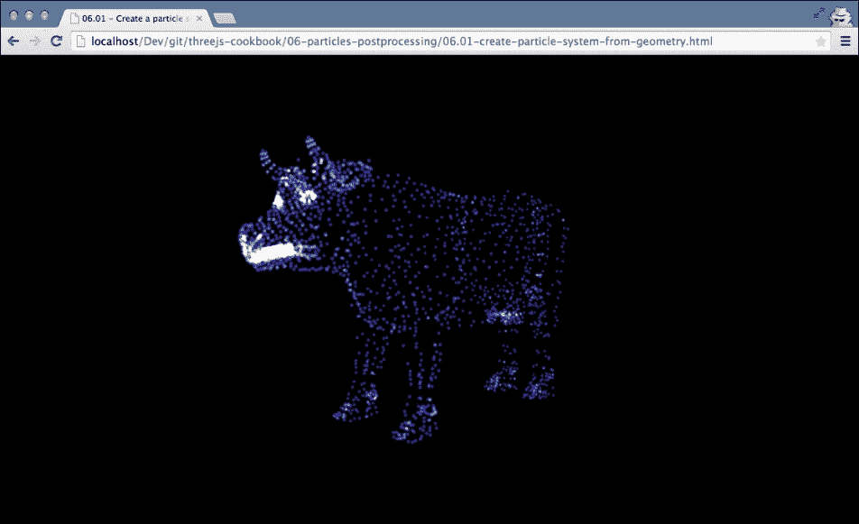

如您在本截图中所见，我们已经加载了一个牛的几何形状，并基于它创建了一个点云。当然，你可以使用任何你想要的几何形状，但特别是复杂模型作为点云渲染时看起来非常棒。

## 如何做...

创建点云与创建简单的 `THREE.Mesh` 对象并没有太大的区别。以下部分解释了你应该采取的步骤：

1.  在这种方法中，你需要的是 `THREE.Geometry`。你可以使用标准几何形状之一，或者加载一个外部几何形状。对于这个食谱，我们将加载一个外部几何形状（本食谱中*准备就绪*部分提到的牛）：

    ```js
      var loader = new THREE.OBJLoader();
      loader.load(
        "../assets/models/cow/cow.obj",
        function(cow) {
          // get the main cow geometry from the 
          // loaded object hierarchy
          var cowGeometry = cow.children[1].geometry;
        }
      );
    ```

    在这个代码片段中，我们加载了外部模型，因此我们有了可以基于它建立点云的几何形状。

1.  在我们创建点云之前，我们首先必须告诉 Three.js 我们想要点云看起来像什么。为此，我们创建 `THREE.PointCloudMaterial`：

    ```js
      var pcMat = new THREE.PointCloudMaterial();
      pcMat.map = THREE.ImageUtils.loadTexture("../assets/textures/ps_smoke.png");
      pcMat.color = new THREE.Color(0x5555ff);
      pcMat.transparent = true;
      pcMat.size = 0.2;
      pcMat.blending = THREE.AdditiveBlending;
    ```

    这种材质定义了每个点的外观。大多数属性都是相当直观的。这里有趣的一个是 `blending` 属性。通过将 `blending` 属性设置为 `THREE.AdditiveBlending`，您可以得到在食谱开头截图中所看到的漂亮的光晕效果。

1.  在这一点上，我们有 `THREE.Geometry` 和 `THREE.PointCloudMaterial`；使用这两个对象，我们可以创建点云：

    ```js
      pc = new THREE.PointCloud(geometry, pcMat);
      pc.sizeAttenuation = true;
      pc.sortPoints = true;
    ```

    如您所见，我们传递 `THREE.Geometry` 和 `THREE.PointCloudMaterial` 来创建 `THREE.PointCloud`。在创建的点云上，我们设置两个额外的属性为 `true`。`sizeAttenuation` 属性确保点的尺寸也取决于与摄像机的距离。因此，远离摄像机的点看起来更小。`sortPoints` 属性确保当您使用透明点时，正如我们在本食谱中所做的那样，它们会被正确渲染。

1.  执行的最后一步是将创建的 `THREE.PointCloud` 对象添加到场景中：

    ```js
      scene.add(pc);
    ```

现在，Three.js 将像渲染任何其他 3D 对象一样渲染点云。

## 它是如何工作的...

当您创建 `THREE.PointCloud` 时，Three.js 会为提供的 `THREE.Geometry` 对象的每个顶点创建一个点。`THREE.Geometry` 中的其他信息不使用。对于 `THREE.WebGLRenderer`，它内部直接使用 `GL_POINTS`，这是一个 WebGL 原语，来渲染单个点（更多信息请参考 [`www.khronos.org/opengles/sdk/docs/man/xhtml/glDrawElements.xml`](https://www.khronos.org/opengles/sdk/docs/man/xhtml/glDrawElements.xml)）。然后，使用自定义片段着色器，它为这些点着色。结果是，当您使用 `THREE.WebGLRenderer` 时，您可以轻松渲染数百万个点，同时保持出色的性能。

## 还有更多...

点是表示各种不同效果的好方法。对于一些有趣的点应用，您可以查看以下示例：

+   在 WebGL 上渲染一百万个点：[`soulwire.github.io/WebGL-GPU-Particles/`](http://soulwire.github.io/WebGL-GPU-Particles/)

+   使用点云从一个几何体转换到另一个几何体：[`oos.moxiecode.com/js_webgl/particles_morph/index.html`](http://oos.moxiecode.com/js_webgl/particles_morph/index.html)

## 相关内容

在这一章中，我们有许多与这个密切相关的食谱：

+   在 *从头创建点云* 食谱中，我们从一个自定义创建的几何体创建点云

+   在 *样式单个点* 食谱中，我们向您展示如何样式点云中的单个点

+   在 *移动点云中的单个点* 和 *爆炸点云* 食谱中，我们向您展示如何移动点

# 从头创建点云

当您想要创建点云时，您可以传入现有的几何体，并将点云基于它创建。在这个菜谱中，我们将向您展示如何从头创建 `THREE.Geometry` 并从它创建点云。

## 准备中

对于这个菜谱，我们不需要任何额外的 JavaScript 库，也不需要加载外部模型，因为我们从头创建我们的几何体。您可以通过在浏览器中打开 `06.02-create-point-system-from-scratch.html` 来查看我们创建的几何体。您将看到以下截图类似的内容：

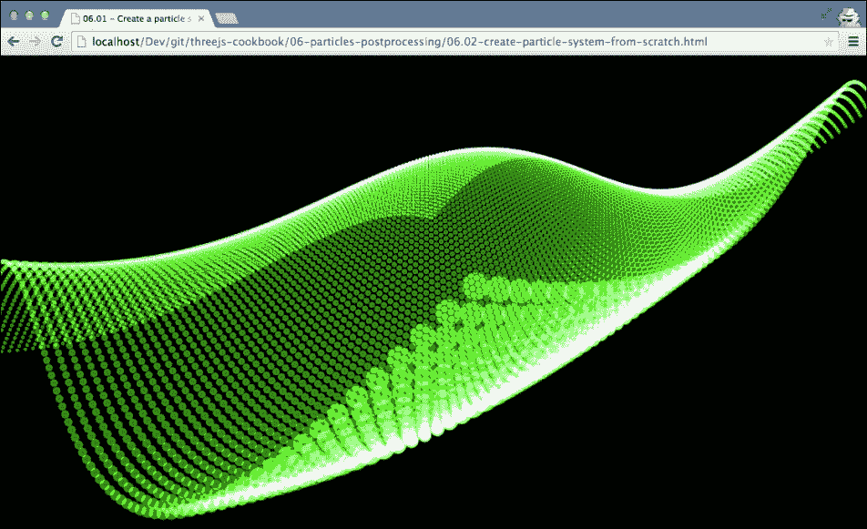

在下一节中，我们将解释如何创建这个自定义几何体并使用它与 `THREE.PointCloud` 一起。

## 如何操作...

步骤基本上与 *基于几何体创建点云* 菜谱中所示相同，除了首先我们需要创建我们自己的自定义几何体：

1.  创建自定义几何体相当简单：

    ```js
      var x = 100;
      var y = 100;
      var geometry = new THREE.Geometry();
      for (var i = 0 ; i < x ; i++) {
        for (var j = 0 ; j < y ; j++) {
          var v = new THREE.Vector3();
          v.x = i / 10;
          v.y = Math.sin(i/100 * Math.PI*2) + Math.cos(j/100 * Math.PI) * 2;
          v.z = j / 10;
          geometry.vertices.push(v);
        }
      }
    ```

    如此代码片段所示，您首先需要实例化 `THREE.Geometry`，然后创建 `THREE.Vector3` 实例并将它们推送到几何体的顶点属性中。

1.  现在我们已经得到了一个几何体，我们只需要 `THREE.PointCloudMaterial`：

    ```js
      var pcMat = new THREE.PointCloudMaterial(geometry);
      pcMat.map = THREE.ImageUtils.loadTexture ("../assets/textures/ps_smoke.png");
      pcMat.color = new THREE.Color(0x55ff55);
      pcMat.transparent = true;
      pcMat.size = 0.2;
      pcMat.blending = THREE.AdditiveBlending;
    ```

1.  使用这种材质与几何体一起创建 `THREE.PointCloud` 并将其添加到场景中：

    ```js
      pc = new THREE.PointCloud(geometry, pcMat);
      pc.sizeAttenuation = true;
      pc.sortPoints = true;
      scene.add(pc);
    ```

如果您已经查看过 *基于几何体创建点云* 的菜谱，您会注意到大多数步骤都是相同的。这两个菜谱之间的唯一区别是创建几何体的方式。

## 它是如何工作的...

关于它是如何工作的解释，请参阅 *基于几何体创建点云* 菜谱中的 *它是如何工作的…* 部分。

## 还有更多...

在 第二章，*几何体和网格* 中，我们展示了如何使用 Three.js 渲染 3D 公式。使用这个菜谱的设置，您也可以创建以点云形式可视化的 3D 公式。例如，以下截图显示了 第二章 中的 3D 公式，渲染为点云：

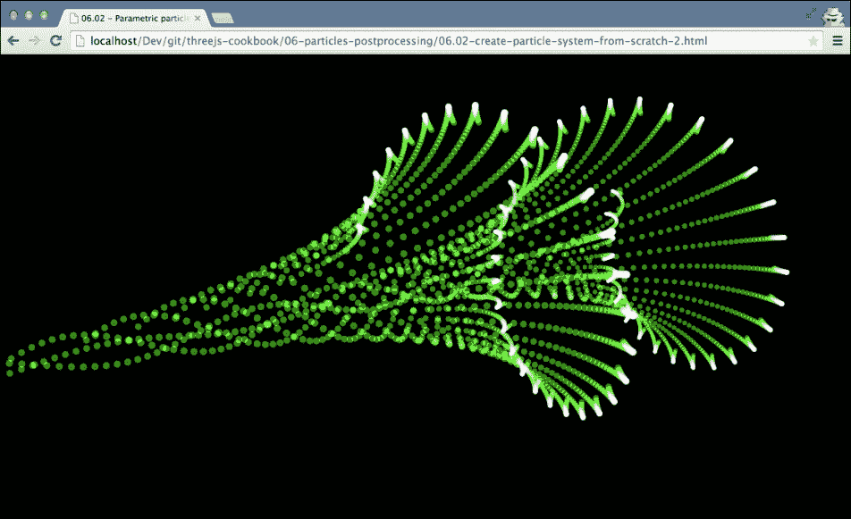

如您所见，您可以通过这种方式非常容易地创建看起来很棒的点云。

## 相关阅读

本章中有几个与这个菜谱相关的菜谱：

+   在 *基于几何体创建点云* 菜谱中，我们使用现有的几何体来创建点云

+   在 *样式单个点* 菜谱中，我们向您展示如何样式化点云中的单个点

+   在 *移动点云中的单个点* 和 *爆炸点云* 的菜谱中，我们向您展示如何移动点

# 为点云中的单个点着色

当您创建点云时，每个点都有相同的颜色和样式，因为每个点都使用相同的 `THREE.PointCloudMaterial` 对象。然而，有一种方法可以为单个点添加颜色。

## 准备中

运行此配方不需要任何额外的步骤。我们将创建一个自定义几何体，就像我们在 *从头创建点云* 配方中所做的那样，这次我们将为每个单独的点着色。此配方的结果可以通过在您的浏览器中打开 `06.03-color-individual-points-in-point-system.html` 来查看。您将看到以下截图类似的内容：

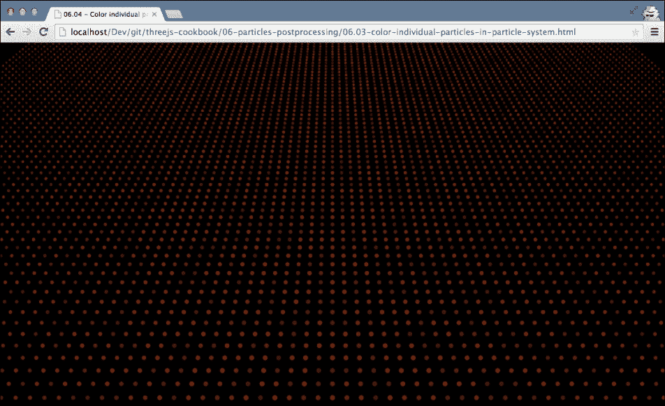

如您所见，我们已经用各种红色的阴影给各个点着色。

## 如何做到这一点...

要实现单个着色点，我们需要在创建 `THREE.Geometry` 时设置一个额外的属性。以下步骤显示了如何做到这一点：

1.  我们首先创建几何体。当我们创建单个顶点时，我们也可以通知 Three.js 我们想要为其使用的颜色：

    ```js
      var x = 100;
      var y = 100;
      var geometry = new THREE.Geometry();
      for (var i = 0 ; i < x ; i++) {
        for (var j = 0 ; j < y ; j++) {
          var v = new THREE.Vector3(i,0,j);
     var rnd = Math.random()/2 + 0.5;
     geometry.colors.push(
     new THREE.Color(rnd, rnd/4, 0));
          geometry.vertices.push(v);
        }
      }
    ```

    在这个代码片段中，我们创建一个随机颜色并将其推送到 `geometry.colors` 数组。在这两个循环结束时，我们将有 `vertices` 数组中的 10000 个顶点和 `colors` 数组中的 10000 个颜色。

1.  现在，我们可以创建 `THREE.PointCloudMaterial` 并与几何体一起使用来创建 `THREE.PointCloud`：

    ```js
      var pcMat = new THREE.PointCloudMaterial(geometry);
      pcMat.vertexColors = true;
      pcMat.map = THREE.ImageUtils.loadTexture("../assets/textures/ps_smoke.png");
      pcMat.transparent = true;
      pc = new THREE.PointCloud(geometry, pcMat);
      scene.add(pc);
    ```

    要使用我们在步骤 1 中创建的颜色，我们需要将 `THREE.PointCloudMaterial` 的 `vertexColors` 属性设置为 `true`。在这个代码片段中，我们还加载了一个纹理并将其分配给 `map` 属性。我们使用单个颜色，因此不需要在需要设置颜色的材质上设置 `color` 属性。我们将在下一步中展示这一点。

1.  如果您已经查看过本配方中 *准备就绪* 部分所示的示例，您会注意到点的颜色发生了变化。我们可以通过只需更改渲染循环中几何体的 `colors` 数组中的颜色来轻松做到这一点：

    ```js
      for (var i = 0 ; i < pc.geometry.colors.length ; i++) {
        var rnd = Math.random()/2 + 0.5;
        pc.geometry.colors[i] = new THREE.Color(rnd, rnd/4, 0);
      }
      pc.geometry.colorsNeedUpdate = true;
    ```

    当您更改颜色时，需要将 `colorsNeedUpdate` 属性设置为 `true`，这样 Three.js 就知道需要更新点的颜色。

## 它是如何工作的...

Three.js 使用 WebGL 来渲染单个点。为此，Three.js 使用顶点着色器和片段着色器（有关此内容的更多配方，请参阅上一章）。为了着色单个点，Three.js 将信息传递到用于确定输出颜色的片段着色器。相应的着色器代码如下：

```js
  gl_FragColor = vec4( psColor, opacity );
```

`psColor` 变量是从 `THREE.Geometry` 的颜色数组传递到用于着色点的着色器的。

## 参见

+   在 Three.js 中着色单个点非常简单直接。然而，如果您想更改点的更多属性，如不透明度或大小，您不能使用标准的 Three.js 来做到这一点。在 *样式化单个点* 配方中，我们将向您展示您如何创建一个自定义着色器来更改点云中点的这些属性。

+   如果您对给点云中的点添加动画感兴趣，可以查看 *移动点云中的单个点* 和 *爆炸点云* 的配方。

# 单个点的样式设置

使用标准的 Three.js 功能，你不能为点云中的单个点进行样式设置。你可以改变它们的颜色，就像我们在 *在点云中为单个点着色* 菜单中所展示的那样，但无法改变点的大小或透明度。在这个菜谱中，我们将向你展示如何创建自定义的顶点和片段着色器，这允许你改变点云中单个点的颜色、透明度和大小，并且你可以轻松扩展以添加更多属性。

## 准备中

在这个菜谱中没有使用外部库。我们将通过创建我们自己的自定义着色器来扩展基本的 Three.js 功能。要查看着色器的效果，请在你的浏览器中打开 `06.04-style-individual-points-in-point-system-with-custom-shader.html` 示例。你将看到以下菜谱类似的内容：

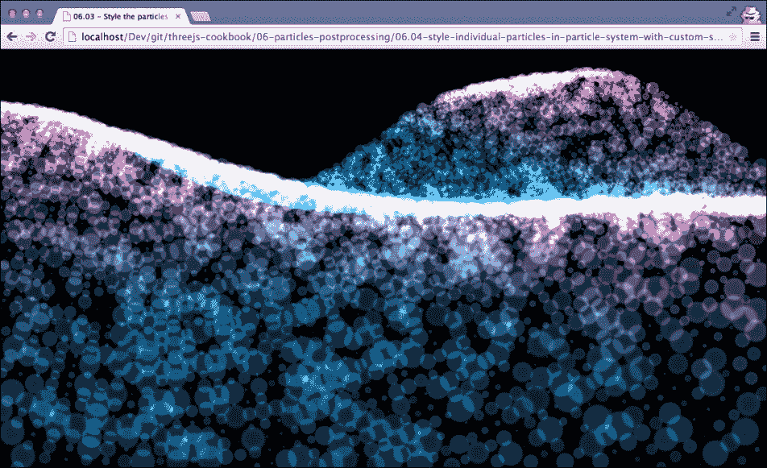

如此截图所示，单个点的尺寸、颜色和透明度各不相同。

## 如何做到这一点……

让我们看看你需要采取的步骤来完成这个任务：

1.  让我们从简单开始，首先创建我们将从中创建点云的几何体：

    ```js
      var geometry = new THREE.Geometry();
     var pSize = [];
     var pOpacity = [];
     var width= 100;
     var height = 100;
      // create the geometry and set custom values
      for (var i = 0 ; i < width ; i++) {
        for (var j = 0 ; height < y ; j++) {
          var v = new THREE.Vector3();
          v.x = i / 10;
          v.y = (Math.sin(i/200 * Math.PI*2) + Math.cos(j/50 * Math.PI) + Math.sin((j+i)/40 * Math.PI))/2;
          v.z = j / 10;
          // add the vertex
          geometry.vertices.push(v);
          // add vertex specific color, size and opacity
     geometry.colors.push(new THREE.Color(v.y,0.5,0.7));
     pSize.push(Math.random());
     pOpacity.push(Math.random()/4+0.5);
        }
      }
    ```

    如你所见，我们从头开始创建 `THREE.Geometry` 并生成 10,000 个顶点。因为我们想改变单个顶点的颜色、大小和透明度，所以我们也为这 10,000 个顶点生成了这些属性的值。颜色存储在 `geometry.colors` 数组中，这是 Three.js 的标准功能。我们将大小存储在 `pSize` 数组中，透明度存储在 `pOpacity` 数组中。

1.  现在我们已经得到了一个几何体和包含预期大小和透明度的单个顶点的几个数组，让我们定义点云的材质：

    ```js
      var attributes = ...; // filled in in next steps
      var uniforms = ...;   // filled in in next steps
      var psMat2 = new THREE.ShaderMaterial({
        attributes: attributes,
        uniforms: uniforms,
        transparent : true,
        blending : THREE.AdditiveBlending,
        vertexShader: document getElementById('pointVertexShader').text,
        fragmentShader: document getElementById('pointFragmentShader').text
      });
    ```

    我们没有使用标准的 `THREE.PointCloudMaterial` 对象，而是使用了 `THREE.ShaderMaterial`。`transparent` 和 `blending` 是标准材质属性，表现如你所预期。我们将在接下来的步骤中解释其他属性。

1.  在步骤 2 中，引用了属性变量。在这个步骤中，我们将配置这个变量：

    ```js
      var attributes = {
        pSize:    { type: 'f', value: pSize },
        pOpacity: { type: 'f', value: pOpacity }
      };
    ```

    我们的 `attributes` 对象包含两个属性。第一个属性指向包含顶点大小的数组，第二个属性指向包含透明度值的数组。类型 `f` 的 `value` 表示它是一个浮点数数组。因为我们从着色器材质中引用了这个属性，所以我们可以在着色器中访问这些单独的值。

1.  在步骤 2 中，我们还定义了一些统一变量。`uniforms` 对象也被传递到着色器中，但对于所有顶点来说都是相同的：

    ```js
      var basicShader = THREE.ShaderLib['point_basic'];
      var uniforms = THREE.UniformsUtils.merge([basicShader.uniforms]);
      uniforms['map'].value = THREE.ImageUtils.loadTexture("../assets/textures/ps_smoke.png");
      uniforms['size'].value = 100;
      uniforms['opacity'].value = 0.5;
      uniforms['psColor'].value = new THREE.Color(0xffffff);
    ```

    在这里，我们重用了 Three.js 在其着色器中使用的标准统一变量，并使用它来进一步配置着色器。

1.  回顾步骤 2，我们只需要定义两个属性：实际的着色器：`document.getElementById('pointVertexShader').text` 和 `document.getElementById('pointFragmentShader').text`。让我们从顶点着色器开始：

    ```js
      <script id="pointVertexShader" type="x-shader/x-vertex">
        precision highp float;
        precision highp int;
        attribute vec3 color;
        attribute float pSize;
        attribute float pOpacity;
        uniform float size;
        uniform float scale;
        varying vec3 vColor;
        varying float vOpacity;
        void main() {
          vColor = color;
          vOpacity = pOpacity;
          vec4 mvPosition = modelViewMatrix * vec4( position, 1.0 );
          gl_PointSize = 2.0 * pSize * size * ( scale / length( mvPosition.xyz ) );
          gl_Position = projectionMatrix * mvPosition;
        }
      </script>
    ```

    顶点着色器用于确定顶点的位置和大小。在这个着色器中，我们设置顶点和点的大小，并使用`pSize`属性进行计算。这样，我们可以控制单个像素的大小。我们还把`color`和`pOpacity`的值复制到一个`varying`值中，这样我们就可以在下一步的片段着色器中访问它。

1.  到目前为止，点的大小可以直接从 Three.js 中配置。现在，让我们看看片段着色器，并对其进行相同的颜色和透明度设置：

    ```js
      <script id="pointFragmentShader" type="x-shader/x-fragment">
        precision highp float;
        precision highp int;
        uniform vec3 psColor;
        uniform float opacity;
        varying vec3 vColor;
        varying float vOpacity;
        uniform sampler2D map;
        void main() {
          gl_FragColor = vec4( psColor, vOpacity );
          gl_FragColor = gl_FragColor * texture2D( map,vec2( gl_PointCoord.x, 1.0 - gl_PointCoord.y ) );
          gl_FragColor = gl_FragColor * vec4( vColor, 1.0 );
        }
      </script>
    ```

    片段着色器只是一个小的程序。我们在这里做的事情如下：

    1.  我们首先将片段（点）的颜色设置为材质上定义的颜色(`psColor`)，透明度设置为点特定的透明度(`vOpacity`)。

    1.  接下来，我们应用提供的纹理(`map`)。

    1.  最后，我们将颜色值(`gl_Fragcolor`)与点特定颜色(`vcolor`)相乘。

1.  到目前为止，我们已经配置了材质并创建了特定的着色器。现在，我们只需创建点云并将其添加到场景中：

    ```js
      ps = new THREE.PointCloud(geometry, psMat2);
      ps.sortPoints = true;
      scene.add(ps);
    ```

    通过这一最后步骤，您就完成了。

如您所见，这不是一个标准的 Three.js 功能，我们需要采取一些额外的步骤来实现我们的目标。

## 它是如何工作的...

在上一节中，我们已经解释了如何对单个点进行样式化的一些内容。这里要记住的主要事情是，在底层，Three.js 为渲染创建顶点和片段着色器。如果您想要的功能在标准着色器中无法配置，您可以使用`THREE.ShaderMaterial`来创建自己的自定义实现。您仍然可以使用 Three.js 来创建您的几何体并处理所有 WebGL 初始化内容，但使用您自己的着色器实现。

## 更多内容...

使用这种设置，您已经有一个基本的框架来创建基于点云的自定义着色器。您现在可以很容易地通过添加更多功能、其他配置选项等来扩展这个设置。

## 参见

+   如果您只想着色单个点，可以参考“*在点云中着色单个点*”食谱，如果您对在点云中添加动画感兴趣，可以参考“*移动点云中的单个点*”和“*爆炸点云*”食谱。

+   此外，还有一些其他使用顶点和片段着色器的食谱。在本章中，您可以找到“*创建自定义后处理步骤*”食谱，它使用着色器作为后处理效果。在第五章“*光和自定义着色器*”，我们有“*创建自定义顶点着色器*”食谱，它使用自定义顶点着色器来改变几何形状，以及“*创建自定义片段着色器*”食谱，它使用自定义片段着色器实现来着色 3D 对象。

# 移动点云中的单个点

当您从几何体创建点云时，点的位置基于提供的几何体的顶点。结果是点云中各个点不会移动。在这个示例中，我们向您展示如何移动点云中的各个点。

## 准备工作

对于这个示例，我们需要一个包含一些点的点云。您可以创建自己的点云（如我们在*从头开始创建点云*和*从现有几何体创建点云*示例中解释的）。我们将使用在*样式化单个点*示例中创建的点云。像往常一样，我们提供了一个示例，您可以在其中看到此示例的最终结果。在您的浏览器中打开`06.05-move-individual-points.html`，您将看到以下截图：

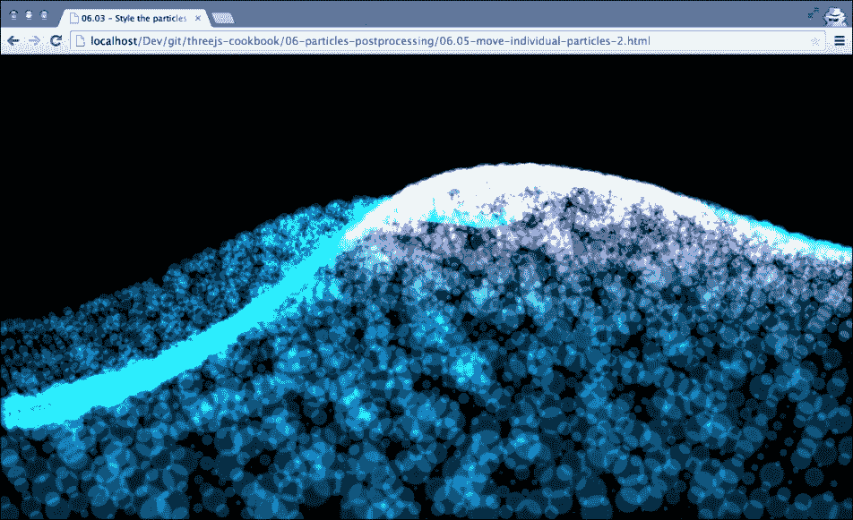

如果您在浏览器中打开它，您将看到所有点在屏幕周围移动。在下一节中，我们将解释您如何做到这一点。

## 如何实现...

要创建移动的点，我们需要执行以下步骤：

1.  确保您有一个包含一些点的点云。查看*从头开始创建点云*和*基于几何体创建点云*示例，了解如何创建此类点云。在这个示例中，我们假设点云可以通过`ps`变量引用。

1.  下一步是更新点云中各个点的位置。我们通过更新`render`循环来完成：

    ```js
      var step = 0;
      function render() {
        renderer.render(scene, camera);
        requestAnimationFrame(render);
        step=0.005;
        var count = 0;
        var geometry = ps.geometry;
        geometry.vertices.forEach(function(v){
          // calculate new value for the y value
          v.y =  ( Math.sin((v.x/20+step) * Math.PI*2) + Math.cos((v.z/5+step*2) * Math.PI) + Math.sin((v.x + v.y + step*2)/4 * Math.PI))/2;
          // and calculate new colors
          geometry.colors[count++]= new THREE.Color(v.y,0.5,0.7);
        });
        geometry.verticesNeedUpdate = true;
        geometry.colorsNeedUpdate = true;
      }
    ```

    在`render`循环中，我们通过`ps`变量访问几何体。接下来，我们根据步进变量的值改变每个点的`y`位置（`v.y`）。通过在每次渲染循环中增加步进值，我们创建了您查看此示例时可以看到的动画。最后，我们需要通过将`geometry.verticesNeedUpdate`设置为`true`来告诉 Three.js 几何体中顶点的位置已更改。

在这个示例中，我们也改变了每个点的颜色，以便通知 Three.js 这些变化，因此我们也设置`geometry.colorsNeedUpdate`为`true`。

## 它是如何工作的...

这个示例以非常简单的方式工作。通过简单地改变可以移动点的顶点位置，基于`THREE.Geometry`的顶点位置创建点云。

## 参考内容

+   在这个示例中，我们以非常简单的方式改变了顶点的位置。我们只是改变了顶点的*y*值。在*爆炸点云*示例中，我们向您展示了一种根据顶点的法向量改变顶点位置的方法。

# 爆炸点云

您可以使用点云创建许多有趣的效果。例如，您可以创建水、烟雾和云效果。在这个示例中，我们向您展示另一种使用点可以创建的有趣效果。我们将向您展示如何根据每个点的法向量爆炸点云。

## 准备工作

对于这个食谱，在我们开始查看食谱之前，不需要采取任何步骤。我们提供了一个示例，你可以看到结果爆炸的效果。在浏览器中打开 `06.06-explode-geometry.html` 示例，你会看到一个类似于以下截图的屏幕：

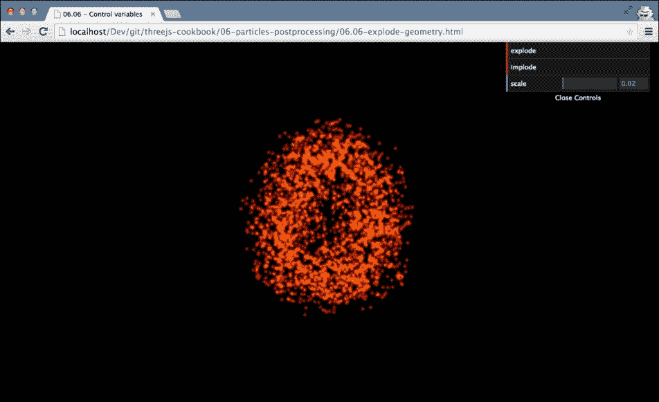

如果你点击 **implode** 按钮，点将移动到屏幕中央；如果你点击 **explode**，它们将向外移动。通过 **speed** 属性，你可以设置点移动的速度。

## 如何做到这一点…

要实现这个效果，你只需要执行几个小步骤：

1.  我们需要做的第一件事是创建几何形状。为了达到最佳效果，我们使用具有许多顶点的几何形状：

    ```js
      cube = new THREE.CubeGeometry(4,6,4,20,20,20);
      cube.vertices.forEach(function(v) {
        v.velocity = Math.random();
      });
      createPointSystemFromGeometry(cube);
    ```

    如你所见，我们不仅创建了几何形状，还向每个顶点添加了一个 `velocity` 参数，并将其设置为随机值。我们这样做是为了确保不是所有点以相同的速度爆炸（这将产生与仅缩放几何形状相同的效果）。

1.  现在，我们可以创建点云了：

    ```js
      var psMat = new THREE.PointCloudMaterial();
      psMat.map = THREE.ImageUtils.loadTexture("../assets/textures/ps_ball.png");
      psMat.blending = THREE.AdditiveBlending;
      psMat.transparent = true;
      psMat.opacity = 0.6;
      var ps = new THREE.PointCloud(cube, psMat);
      ps.sortPoints = true;
      scene.add(ps);
    ```

    这只是一个基于我们在步骤 1 中创建的几何形状的标准点云。

1.  在食谱的介绍中，我们提到我们想要根据每个点的法向量来爆炸点。因此，在我们开始渲染场景和更新单个点的位置之前，我们首先需要计算每个向量的法线：

    ```js
      var avgVertexNormals = [];
      var avgVertexCount = [];
      for (var i = 0 ; i < cube.vertices.length ; i++) {
        avgVertexNormals.push(new THREE.Vector3(0,0,0));
        avgVertexCount.push(0);
      }
      // first add all the normals
      cube.faces.forEach(function (f) {
        var vA = f.vertexNormals[0];
        var vB = f.vertexNormals[1];
        var vC = f.vertexNormals[2];
        // update the count
        avgVertexCount[f.a]+=1;
        avgVertexCount[f.b]+=1;
        avgVertexCount[f.c]+=1;
        // add the vector
        avgVertexNormals[f.a].add(vA);
        avgVertexNormals[f.b].add(vB);
        avgVertexNormals[f.c].add(vC);
      });
      // then calculate the average
      for (var i = 0 ; i < avgVertexNormals.length ; i++) {
        avgVertexNormals[i].divideScalar(avgVertexCount[i]);
      }
    ```

    我们不会详细解释这个代码片段，但在这里我们所做的是根据特定向量所属面的法向量计算每个顶点的法向量。最终的法向量存储在 `avgVertexNormals` 数组中。

1.  接下来，我们看看一个辅助函数，我们将在下一步的 `render` 循环中调用它。这个函数根据我们在步骤 1 中定义的速度函数和步骤 3 中计算的法向量确定每个顶点的新位置：

    ```js
      function explode(outwards) {
        var dir = outwards === true ? 1 : -1;
        var count = 0;
        cube.vertices.forEach(function(v){
          v.x+=(avgVertexNormals[count].x * v.velocity * control.scale)*dir;
          v.y+=(avgVertexNormals[count].y * v.velocity * control.scale)*dir;
          v.z+=(avgVertexNormals[count].z * v.velocity * control.scale)*dir;
          count++;
        });
        cube.verticesNeedUpdate = true;
      }
    ```

    `control.scale` 变量通过 GUI 设置，并决定了我们的几何形状扩展的速度，而 `dir` 属性则基于我们是要将点向外移动还是向内移动。`verticesNeedUpdate` 属性是必需的，用于通知 Three.js 这些变化。

1.  现在剩下的唯一事情就是从 `render` 循环中调用 `explode` 函数：

    ```js
      function render() {
        renderer.render(scene, camera);
        explode(true); // or explode(false)
        requestAnimationFrame(render);
      }
    ```

## 还有更多

在这个例子中，我们使用了一个标准几何形状；当然，你也可以使用外部加载的模型。

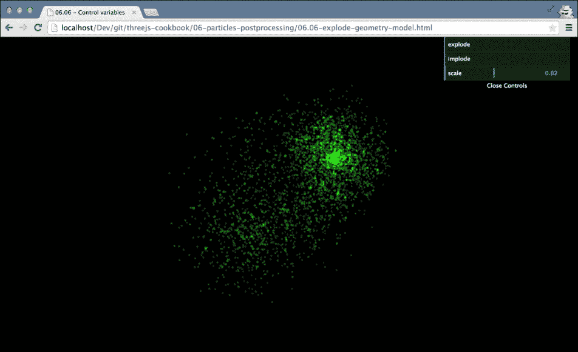

例如，这个截图展示了牛的爆炸模型。

## 参见

+   另一个处理动画和移动单个点的食谱可以在 *移动点云中的单个点* 食谱中找到。

# 设置基本后处理管线

除了在 3D 中渲染场景外，Three.js 还允许您将后处理效果添加到最终输出中。通过后处理，您可以将最终渲染的 2D 图像应用所有不同类型的过滤器。例如，您可以添加特定的模糊效果，锐化特定的颜色，等等。在这个菜谱中，我们将向您展示如何在 Three.js 中设置后处理管道，您可以使用它来向最终渲染的场景添加效果。

## 准备中

要在 Three.js 中使用后处理，您需要包含来自 Three.js 分发的多个额外的 JavaScript 文件。对于这个菜谱，以下 JavaScript 文件应该添加到您的 HTML 页面中：

```js
  <script src="img/CopyShader.js"></script>
  <script src="img/EffectComposer.js"></script>
  <script src="img/RenderPass.js"></script>
  <script src="img/ShaderPass.js"></script>
  <script src="img/MaskPass.js"></script>
```

为了演示后处理是如何工作的，我们将把点屏幕效果应用到 Three.js 场景中。为了这个效果，我们需要一个额外的 JavaScript 文件：

```js
  <script src="img/DotScreenShader.js"></script>
```

我们还提供了一个示例，展示了这个菜谱的最终结果。您可以通过在浏览器中打开`06.07-setup-basic-post-processing-pipeline.html`来查看它。您将看到以下截图类似的内容：

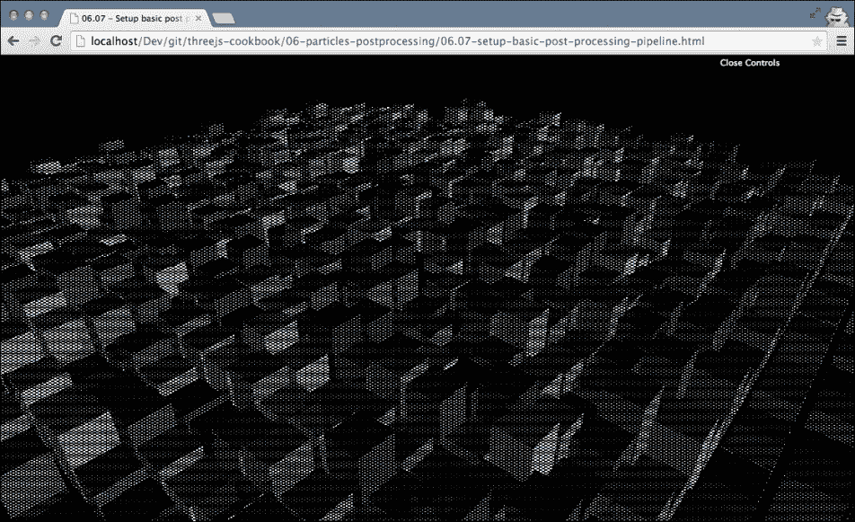

在这个截图中，您可以看到我们已经渲染了一个包含大量立方体的场景，并应用了一个效果将其渲染为一系列点。

## 如何操作...

设置后处理管道只需要几个小步骤：

1.  要设置一个后处理管道，我们需要一个叫做作曲家的东西。我们将在`render`循环中使用这个作曲家来创建最终输出。为此，我们首先需要一个新全局变量：

    ```js
      var composer;
    ```

1.  接下来，我们需要实例化一个作曲家，作为`THREE.EffectComposer`的新实例：

    ```js
      composer = new THREE.EffectComposer( renderer );
    ```

    我们传递`THREE.WebGLRenderer`，这是我们通常用来渲染场景的。

1.  现在，我们需要定义作曲家将要执行的步骤。这些步骤是顺序执行的，我们可以使用它们来对场景应用多个效果。我们始终需要采取的第一步是渲染场景。为此，我们使用`THREE.RenderPass`：

    ```js
      var renderPass = new THREE.RenderPass( scene, camera );
      composer.addPass( renderPass  );
    ```

    渲染过程使用我们在第二步中配置的相机和渲染器渲染场景对象。

1.  现在我们已经渲染了场景，我们可以应用一个后处理效果。对于这个菜谱，我们使用`THREE.DotScreenShader`：

    ```js
      var effect = new THREE.ShaderPass( THREE.DotScreenShader);
      effect.uniforms[ 'scale' ].value = 4;
      effect.renderToScreen = true;
      composer.addPass( effect );
    ```

    在这个代码片段中，我们创建了一个后处理步骤（`THREE.ShaderPass`），将其添加到作曲家（`composer.addPass(effect)`），并告诉效果作曲家通过将`renderToScreen`设置为`true`将此步骤的输出渲染到屏幕上。

1.  我们需要采取的最后一步是修改渲染循环：

    ```js
      function render() {
        composer.render();
        requestAnimationFrame(render);
      }
    ```

    如您所见，我们现在使用在第二步中创建的`composer`对象来渲染最终输出，而不是`THREE.WebGLRenderer`。

在这个菜谱中，我们只使用了一个后处理步骤，但您可以使用任意多的步骤。您只需记住，在最终步骤中，您需要将`renderToScreen`属性设置为`true`。

## 它是如何工作的...

在几个菜谱中，我们已经解释了 Three.js 使用 WebGL 着色器来渲染 3D 场景。`THREE.EffectComposer` 使用相同的方法。您添加的每个步骤都在前一个步骤的输出上运行一个简单的顶点和片段着色器。在 *创建自定义后处理步骤* 菜谱中，我们将深入了解并创建一个自定义后处理步骤。

## 更多内容

Three.js 提供了大量标准着色器和步骤，您可以在 `THREE.EffectComposer` 中使用。为了全面了解可能的着色器和标准步骤，请查看以下目录：

+   [`github.com/mrdoob/three.js/tree/master/examples/js/postprocessing`](https://github.com/mrdoob/three.js/tree/master/examples/js/postprocessing)：此目录包含所有您可以使用 `THREE.EffectComposer` 的标准后处理步骤。

+   [`github.com/mrdoob/three.js/tree/master/examples/js/shaders`](https://github.com/mrdoob/three.js/tree/master/examples/js/shaders)：Three.js 提供了 `THREE.ShaderPass` 后处理步骤，允许您直接使用 WebGL 着色器。在此页面上，您可以找到大量可用于 `THREE.ShaderPass` 对象的着色器。

## 相关内容

+   尽管 Three.js 提供了大量的标准着色器和后处理步骤，但您也可以轻松创建自己的。在 *创建自定义后处理步骤* 菜谱中，我们向您展示了如何创建一个与 `THREE.EffectComposer` 一起工作的自定义顶点和片段着色器。

# 创建自定义后处理步骤

在 *设置基本后处理管道* 菜谱中，我们向您展示了如何使用 `THREE.EffectComposer` 为 Three.js 场景添加后处理效果。在本菜谱中，我们将解释如何创建自定义处理步骤，您可以使用 `THREE.EffectComposer` 来使用这些步骤。

## 准备工作

本菜谱使用 `THREE.EffectComposer`，因此我们需要加载一些包含正确对象的附加 JavaScript 文件。为此，您需要在 HTML 页面的顶部添加以下内容：

```js
  <script src="img/CopyShader.js"></script>
  <script src="img/EffectComposer.js"></script>
  <script src="img/RenderPass.js"></script>
  <script src="img/ShaderPass.js"></script>
  <script src="img/MaskPass.js"></script>
```

在本菜谱中，我们将创建一个使用马赛克效果转换输出的后处理效果。您可以通过在浏览器中打开 `06.08-create-custom-post-processing-step.html` 来查看最终结果。您将看到以下截图类似的内容：

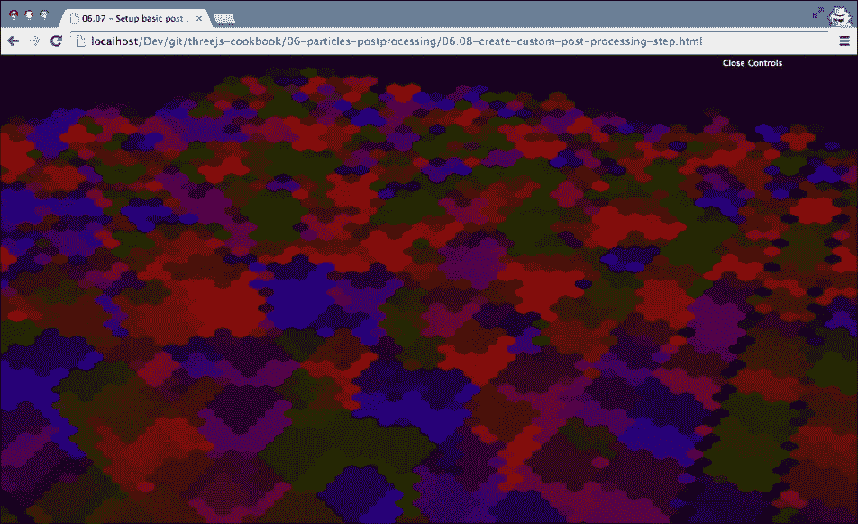

你可能不会认出这个，但你看到的是大量正在旋转的立方体。

## 如何操作...

我们通过使用自定义片段着色器来创建此效果。以下步骤解释了如何设置：

1.  我们首先需要创建 `THREE.EffectComposer` 并配置步骤：

    ```js
      var composer = new THREE.EffectComposer( renderer );
      var renderPass = new THREE.RenderPass( scene, camera );
      composer.addPass( renderPass  );
    ```

    到目前为止，我们只添加了渲染步骤 (`THREE.RenderPass`)，它渲染场景并允许我们添加额外的后处理效果。

1.  要使用自定义着色器，我们需要使用 `THREE.ShaderPass` 对象：

    ```js
      var customShader = {
        uniforms: {
          "tDiffuse": { type: "t", value: null},
          "scale":    { type: "f", value: 1.0 },
          "texSize":  { type: "v2", value: new THREE.Vector2( 50, 50 ) },
          "center":   { type: "v2", value: new THREE.Vector2( 0.5, 0.5 ) },
        },
        vertexShader: document.getElementById('hexagonVertexShader').text,
        fragmentShader: document.getElementById('hexagonFragmentShader').text
      };
      var effect = new THREE.ShaderPass( customShader );
      effect.renderToScreen = true;
      composer.addPass( effect );
    ```

    我们将`customShader`作为参数传递给`THREE.ShaderPass`。这个`customShader`对象包含我们自定义着色器的配置。`uniforms`对象是我们传递给我们的自定义着色器的变量，而`vertexShader`和`fragmentShader`指向我们的着色器程序。

1.  让我们首先看看第 2 步中的`vertexShader`：

    ```js
      <script id="hexagonVertexShader" type="x-shader/x-vertex">
        varying vec2 texCoord;
        void main() {
          texCoord = uv;
          gl_Position = projectionMatrix * modelViewMatrix * vec4( position, 1.0 );
        }
      </script>
    ```

    这是一个简单的顶点着色器，它不会改变与输出相关的任何内容。在这个着色器代码中需要注意的唯一一点是我们将正在处理的坐标（`uv`，由 Three.js 自动传入）作为名为`texCoord`的`varying`值传递给片元着色器。

1.  最后一步是查看第 2 步中的片元着色器：

    ```js
      <script id="hexagonFragmentShader" type="x-shader/x-fragment">
        uniform sampler2D tDiffuse;
        uniform vec2 center;
        uniform float scale;
        uniform vec2 texSize;
        varying vec2 texCoord;
        void main() {
          vec2 tex = (texCoord * texSize - center) / scale;
          tex.y /= 0.866025404;
          tex.x -= tex.y * 0.5;
          vec2 a;
          if (tex.x + tex.y - floor(tex.x) - floor(tex.y) < 1.0)
          a = vec2(floor(tex.x), floor(tex.y));
          else a = vec2(ceil(tex.x), ceil(tex.y));
          vec2 b = vec2(ceil(tex.x), floor(tex.y));
          vec2 c = vec2(floor(tex.x), ceil(tex.y));
          vec3 TEX = vec3(tex.x, tex.y, 1.0 - tex.x - tex.y);
          vec3 A = vec3(a.x, a.y, 1.0 - a.x - a.y);
          vec3 B = vec3(b.x, b.y, 1.0 - b.x - b.y);
          vec3 C = vec3(c.x, c.y, 1.0 - c.x - c.y);
          float alen = length(TEX - A);
          float blen = length(TEX - B);
          float clen = length(TEX - C);
          vec2 choice;
          if (alen < blen) {
            if (alen < clen) choice = a;
            else choice = c;
          } else {
            if (blen < clen) choice = b;
            else choice = c;
          }
          choice.x += choice.y * 0.5;
          choice.y *= 0.866025404;
          choice *= scale / texSize;
          gl_FragColor = texture2D(tDiffuse, choice 
            + center / texSize);
        }
      </script>
    ```

    这是一个相当大的着色器程序，详细解释超出了这个配方的范围。简而言之，这个着色器查看周围像素的颜色，并根据这个信息确定如何绘制这个像素。这里需要注意的重要项是代码顶部的`uniform sampler2D tDiffuse`。这是传递给着色器作为 2D 纹理的前一个渲染步骤的输出。在计算中使用`tDiffuse`，我们可以改变屏幕上渲染的输出。如果我们不想应用效果，我们只需使用`vec4 color = texture2D(tDiffuse, texCoord)`来设置输出颜色。

1.  最后一步是将`render`循环更新为使用 composer 而不是 renderer：

    ```js
      function render() {
        composer.render();
        requestAnimationFrame(render);
      }
    ```

编写着色器是一项困难的工作；然而，这样的设置使得创建你自己的自定义着色器变得容易得多。只需用你的实现替换第 4 步中的片段着色器，你就可以开始实验了。

## 它是如何工作的...

在这个配方中，我们使用了`THREE.EffectComposer`和`THREE.RenderPass`来渲染场景。如果我们向`THREE.EffectComposer`添加更多步骤，我们可以通过访问`tDiffuse`纹理直接从我们的着色器中访问当前渲染。这样，我们只需编写一个使用`tDiffuse`纹理作为其输入的着色器，就可以轻松地添加各种效果。

## 还有更多...

当你编写着色器时，你可以几乎创建任何你想要的东西。然而，着色器的入门可能相当困难。一些应用特定效果的着色器的良好例子可以在[`github.com/evanw/glfx.js`](https://github.com/evanw/glfx.js)找到。我们在这个配方中使用的着色器也是从`hexagonpixalte.js`着色器中采用的，该着色器可以在提到的 GitHub 仓库中的`src/filters/fun/hexagonalpixelate.js`文件夹中找到。

你也可以查看 Three.js 提供的效果的源代码。你可以直接从 GitHub 在[`github.com/mrdoob/three.js/tree/master/examples/js/shaders`](https://github.com/mrdoob/three.js/tree/master/examples/js/shaders)访问它们。

## 参见

在第五章中，我们也创建了两个自定义着色器：

+   在 *创建自定义顶点着色器* 菜谱中，我们解释了您需要采取的步骤来设置自定义顶点着色器

+   在 *创建自定义片段着色器* 菜谱中，我们解释了您需要采取的步骤来设置自定义片段着色器

# 将 WebGL 输出保存到磁盘

在这本书中，我们迄今为止已经创建了一些非常漂亮的可视化效果。然而，问题在于很难将渲染输出保存为图像。在这个菜谱中，我们将向您展示如何从 WebGL 渲染场景中创建一个普通图像，并将其保存到磁盘上。

## 准备工作

为了准备这个菜谱，没有太多的事情要做。我们将使用标准的 HTML5 功能，这些功能不仅适用于基于 Three.js 的输出，还适用于任何 HTML5 画布元素。我们已经准备了一个非常简单的示例页面，您可以测试这个菜谱的结果。为此，在您的浏览器中打开 `06.09-save-webgl-output.html` 示例。您将看到类似于以下截图的内容：

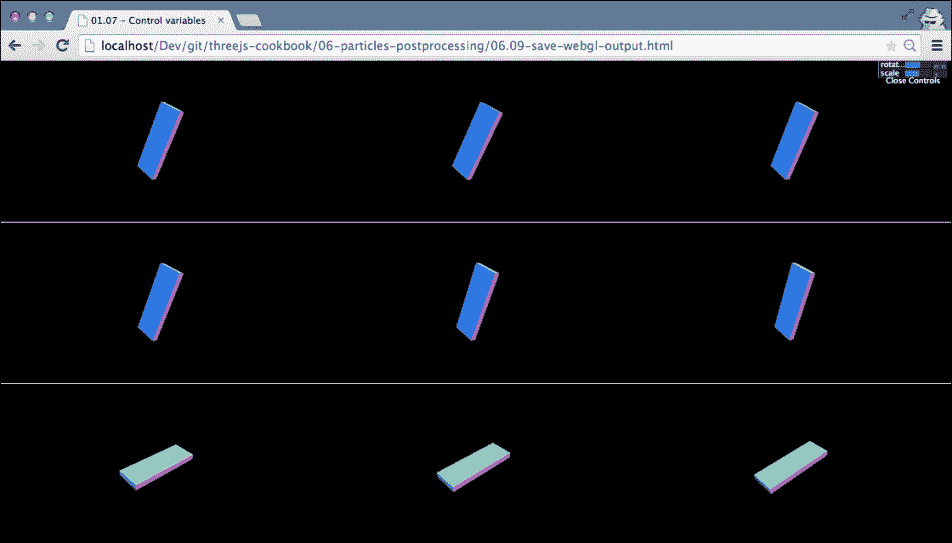

在这个页面上，您将看到一个单独的 Three.js 场景。如果您按下 *p* 键，当前状态将被保存为新的图像，然后您可以正常下载。请注意，在先前的截图中，我们已经缩小了页面。

## 如何做到这一点...

对于这个菜谱，我们只需要采取几个简单的步骤：

1.  我们首先为按键注册一个事件监听器：

    ```js
      window.addEventListener("keyup", copyCanvas);
    ```

    每当按下键时，`copyCanvas` 函数将被调用。

1.  现在让我们看看 `copyCanvas` 函数：

    ```js
      function copyCanvas(e) {
        var imgData, imgNode;
        if (e.which !== 80) {
          return;
        } else {
          imgData = renderer.domElement.toDataURL();
        }
        // create a new image and add to the document
        imgNode = document.createElement("img");
        imgNode.src = imgData;
        document.body.appendChild(imgNode);
      }
    ```

    我们在这里做的第一件事是检查哪个键被按下。如果按下 *p* 键，我们将继续。接下来，我们使用 `toDataURL()` 函数从画布中获取图像数据。我们需要采取的最后一步是创建一个新的 `img` 元素，分配数据（`imgData`），并将其添加到文档中。

1.  这将适用于非 WebGL 画布元素。然而，如果您使用 WebGL，我们需要采取一个额外的步骤。我们需要像这样实例化 `THREE.WebGLRenderer`：

    ```js
      renderer = new THREE.WebGLRenderer({preserveDrawingBuffer: true});
    ```

    如果我们不这样做，您将只看到输出中的黑色屏幕，而不是实际的 WebGL 输出。不过，请注意，这确实会对性能产生不利影响。

## 它是如何工作的...

在 HTML5 中，可以使用以 data 开头的 URL 描述文件或其他资源。因此，而不是通过多个 HTTP 请求获取资源，这些资源可以直接包含在 HTML 文档中。画布元素允许您将其内容复制为符合此方案的 URL。在这个菜谱中，我们使用这个数据 URL 创建一个新的 `img` 元素，它可以像普通图像一样保存。

如果你想深入了解数据 URL 方案的细节，你可以查看描述此方案的 RFC（请求评论）[`tools.ietf.org/html/rfc2397`](http://tools.ietf.org/html/rfc2397)。

## 还有更多

在最新版本的 Chrome 和 Firefox 中，你也可以通过右键点击并选择**另存为图片**来保存 HTML 画布元素的输出。除了使用标准的浏览器功能外，还可以直接开始下载图片。如果你使用以下代码而不是创建和添加新图片，浏览器将自动将画布作为图片下载：

```js
  var link = document.createElement("a");
  link.download = 'capture.png';
  link.href = imgData;
  link.click();
```

最后，如果你有一个想要保存为电影的动画，你也可以做到这一点。你可以在以下链接找到如何操作的说明：[`www.smartjava.org/content/capture-canvas-and-webgl-output-video-using-websockets`](http://www.smartjava.org/content/capture-canvas-and-webgl-output-video-using-websockets)
