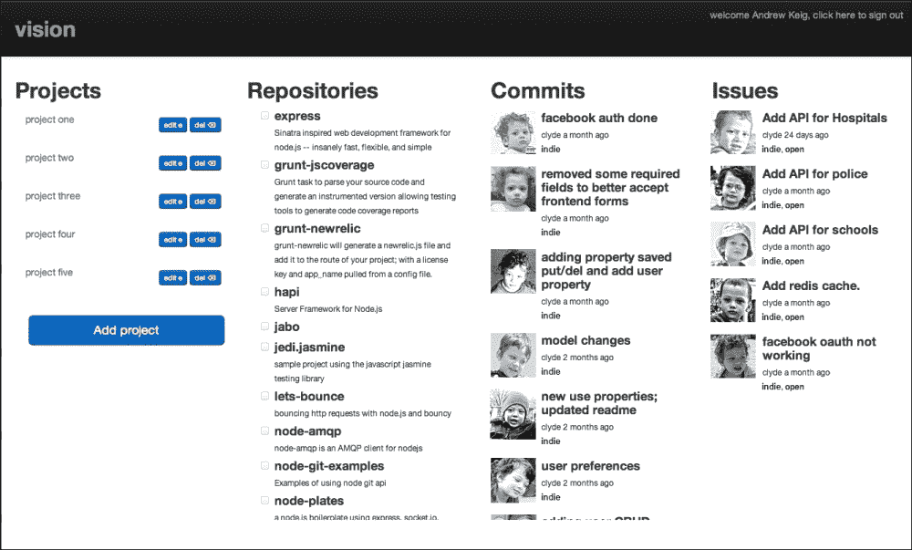
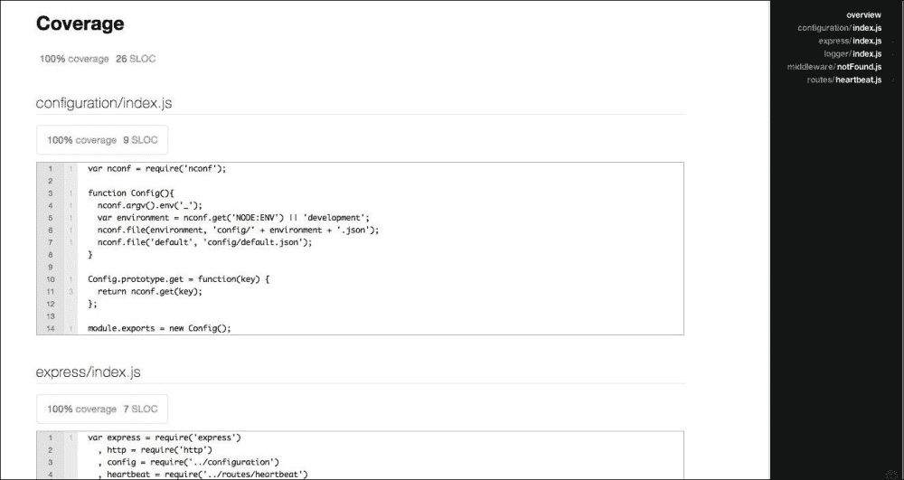

# 第一章. 基础

*高级 Express Web 应用程序开发* 将指导您通过使用 **Express** 构建一个非平凡的单页应用程序的过程。

Express 是由 TJ. Holowaychuk 编写的快速、无偏见、极简和灵活的 Web 应用程序框架，适用于 **Node.js**。它受到了 Ruby 的 Web 框架 **Sinatra** 的启发。Express 提供了一套强大的功能，用于构建单页、多页和混合 Web 应用程序，并迅速成为 node 最受欢迎的 Web 开发框架。Express 是建立在可扩展的 HTTP 服务器框架之上，该框架也由 TJ. Holowaychuk 开发，称为 **Connect**。Connect 提供了一组高性能插件，称为中间件。Connect 包含超过 20 个常用中间件，包括日志记录器、会话支持、cookie 解析器等。

本书将指导您构建一个名为 Vision 的单页应用程序的过程；这是一个软件开发项目的仪表板，与 GitHub 集成，为您提供软件项目问题和提交的单屏快照。此项目将使我们能够展示 Express 提供的高级功能，并为我们提供探索在商业开发和 node/Express 应用程序的生产部署中遇到的问题的机会。

# 功能集

我们现在将开始构建 Vision 应用程序的过程。我们将从零开始，采用先测试后开发的方法。在这个过程中，我们将探讨一些最佳实践，并提供在用 node 和 Express 开发 Web 应用程序时的技巧。

Vision 应用程序将包括以下功能：

```js
Feature: Heartbeat
As an administrator
I want to visit an endpoint
So that I can confirm the server is responding

Feature: List projects
As a vision user
I want to see a list of projects
So that I can select a project I want to monitor

Feature: Create project
As a vision user
I want to create a new project
So that I can monitor the activity of multiple repositories

Feature: Get a project
As a vision user
I want to get a project
So that I can monitor the activity of selected repositories

Feature: Edit a project
As a vision user
I want to update a project
So that I can change the repositories I monitor

Feature: Delete a project
As a vision user
I want to delete a project
So that I can remove projects no longer in use

Feature: List repositories
As a vision user
I want to see a list of all repositories for a GitHub account
So that I can select and monitor repositories for my project

Feature: List issues
As a vision user
I want to see a list of multiple repository issues in real time
So that I can review and fix issues

Feature: List commits
As a vision user
I want to see a list of multiple repository commits in real time
So that I can review those commits

Feature: Master Page
As a vision user  
I want the vision application served as a single page
So that I can spend less time waiting for page loads

Feature: Authentication
As a vision user
I want to be able to authenticate via Github
So that I can view project activity
```

以下截图是我们的 Vision 应用程序；它包含项目列表、仓库、提交和问题。右上角有一个登录链接，我们将用它进行身份验证：



# 安装

如果您尚未安装 node，请访问：[`nodejs.org/download/`](http://nodejs.org/download/)。

如果您不希望或无法使用安装程序，可以在 node GitHub 仓库的 wiki 上找到安装指南：[`github.com/joyent/node/wiki/Installation`](https://github.com/joyent/node/wiki/Installation)。

让我们全局安装 Express：

```js
npm install -g express

```

### 小贴士

您可以在此处下载本书的源代码：[`github.com/AndrewKeig/advanced-express-application-development`](https://github.com/AndrewKeig/advanced-express-application-development)。

如果您已下载源代码，可以通过运行以下命令安装其依赖项：

```js
npm install

```

# package.json

让我们先创建一个名为 `vision` 的根项目文件夹，并向其中添加一个 `package.json` 文件：`./package.json`：

```js
{
  "name": "chapter-1",
  "version": "0.0.0",
  "private": true,
  "scripts": {
    "start": "node app.js"
  }
  "dependencies": {
    "express": "3.x"
  }
}
```

### 小贴士

**下载示例代码**

你可以从你购买的所有 Packt 书籍的账户中下载所有示例代码文件，账户地址为 [`www.packtpub.com`](http://www.packtpub.com)。如果你在其他地方购买了这本书，你可以访问 [`www.packtpub.com/support`](http://www.packtpub.com/support) 并注册以将文件直接通过电子邮件发送给你。

# 使用 Mocha 和 SuperTest 测试 Express

现在我们已经安装了 Express 并设置了 `package.json` 文件，我们可以开始使用测试优先的方法来驱动我们的应用程序。我们现在将安装两个模块来帮助我们：`mocha` 和 `supertest`。

Mocha 是一个针对 node 的测试框架；它灵活，具有良好的异步支持，并允许你以 TDD 和 BDD 风格运行测试。它也可以在客户端和服务器端使用。让我们使用以下命令安装 Mocha：

```js
npm install -g mocha –-save-dev

```

SuperTest 是一个集成测试框架，它将使我们能够轻松地编写针对 RESTful HTTP 服务器的测试。让我们安装 SuperTest：

```js
npm install supertest –-save-dev

```

# 功能：心跳

```js
As an administrator
I want to visit an endpoint
So that I can confirm the server is responding
```

让我们在 `./test/heartbeat.js` 中为我们的 `Heartbeat` 功能添加一个测试。这个资源将从 `/heartbeat` 路由获取状态并返回 `200 Ok` 状态码。让我们使用 Mocha 和 SuperTest 编写我们的第一个集成测试。首先，在你的 `vision` 文件夹内创建一个名为 `/test` 的文件夹。

我们的测试描述了 `heartbeat`；它期望响应具有 `JSON` 内容类型和状态码等于 `200 Ok`。

```js
var app = require('../app')
, request = require('supertest');

describe('vision heartbeat api', function(){
  describe('when requesting resource /heartbeat', function(){
    it('should respond with 200', function(done){
      request(app)
      .get('/heartbeat')
      .expect('Content-Type', /json/)
      .expect(200, done);
    });
  });
});
```

让我们实现 `Heartbeat` 功能；我们首先创建一个简单的 Express 服务器，`./lib/express/index.js`。我们包含 `express` 和 `http` 模块并创建一个 Express 应用程序。然后我们通过 `app.set` 添加一个名为 `port` 的应用程序设置并将其设置为 `3000`。我们通过 `app.get` 定义一个 `/heartbeat` 路由，并传递一个请求处理器 `function`，该处理器接受两个参数：`req`（请求）和 `res`（响应）。我们使用响应对象返回一个 JSON 响应。我们通过将我们的 Express 应用程序传递给 `http.createServer` 创建一个 HTTP 服务器；我们在名为 `port` 的应用程序设置中监听端口 `3000`。然后我们通过 `module.exports` 导出应用程序；导出应用程序允许我们对其进行测试。

```js
var express = require('express')
  , http = require('http')
  , app = express();

app.set('port', 3000);

app.get('/heartbeat', function(req, res){
  res.json(200, 'OK')
});

http.createServer(app).listen(app.get('port'));
module.exports = app;
```

我们现在在项目的根目录下创建 `./app.js` 并导出 `express` 模块：

```js
module.exports = require('./lib/express');
```

要运行我们的测试，执行以下命令：

```js
mocha

```

你应该收到以下响应：

```js
1 tests complete (14 ms)

```

如果成功，尝试通过执行以下命令来运行应用程序：

```js
npm start

```

应用程序运行后，在新的终端中运行以下 `curl` 命令，你可以看到我们的 `heartbeat` JSON 响应返回 `200 Ok` 状态码：

```js
curl -i http://127.0.0.1:3000/heartbeat

HTTP/1.1 200 OK
X-Powered-By: Express
Content-Type: application/json; charset=utf-8
Content-Length: 4
Date: Fri, 14 Jun 2013 08:28:50 GMT
Connection: keep-alive

```

# 使用 Mocha 进行持续测试

与动态语言一起工作的一个优点之一，也是吸引我使用 node 的原因之一，是能够轻松地进行 **测试驱动开发** 和持续测试。只需运行带有 `-w` 监视开关的 Mocha，当我们的代码库发生变化时，Mocha 将做出响应，并自动重新运行测试：

```js
mocha -w

```

# 使用 Mocha 和 JSCoverage 进行代码覆盖率测试

Mocha 能够在 **JSCoverage** 的帮助下生成代码覆盖率报告。从 [`siliconforks.com/jscoverage/`](http://siliconforks.com/jscoverage/) 为您的环境安装 JSCoverage。JSCoverage 将解析源代码并生成一个经过仪器化的版本；这使得 mocha 能够执行此生成的代码并创建报告。我们需要更新 `./app.js`。

```js
module.exports = (process.env['NODE_ENV'] === "COVERAGE")
 ? require('./lib-cov/express')
 : require('./lib/express');
```

JSCoverage 将输入目录和输出目录作为参数：

```js
jscoverage lib lib-cov

```

根据您的 JSCoverage 版本，您可能需要添加 `–no-highlight` 开关：

```js
jscoverage lib lib-cov --no-highlight

```

以下命令将生成覆盖率报告，如下截图所示：

```js
NODE_ENV=COVERAGE mocha -R html-cov > coverage.html

```



# 使用 Nconf 配置 Express

**Nconf** 是一个配置工具，我们将使用它来为我们的应用程序创建分层/环境配置文件。让我们安装 Nconf：

```js
npm install nconf --save

```

我们首先要做的是将以下硬编码的端口号从我们的 Express 应用程序移动到我们的配置中：

```js
app.set('port', 3000);
```

让我们创建模块 `./lib/configuration/index.js`，这将允许我们从 JSON 文件中读取配置数据。我们导入 `nconf` 模块并定义一个构造函数，`Config`。然后根据当前环境加载配置文件，并加载包含非环境配置数据的默认配置。我们还定义了一个函数 `get(key)`，它接受一个键并返回一个值。我们将使用此函数来读取配置数据：

```js
var nconf = require('nconf');

function Config(){
  nconf.argv().env("_");
  var environment = nconf.get("NODE:ENV") || "development";
  nconf.file(environment, "config/" + environment + ".json");
  nconf.file("default", "config/default.json");
}

Config.prototype.get = function(key) {
  return nconf.get(key);
};

module.exports = new Config();
```

让我们为我们的应用程序编写一些配置。将以下默认配置添加到 `./config/default.json`；这将在所有环境中共享：

```js
{
  "application": {
    "name": "vision"
  }
}
```

现在将以下配置添加到开发、测试和覆盖率配置文件中：`./config/development.json`、`./config/test.json` 和 `./config/coverage.json`。

```js
{
  "express": {
    "port": 3000
  }
}
```

让我们更改我们的 Express 服务器 `./lib/express/index.js`，使其从配置中读取 `express:port`：

```js
var express = require('express')
  , http = require('http')
 , config = require('../configuration')
  , app = express();

app.set('port', config.get("express:port"));

app.get('/hearbeat', function(req, res){
  res.json(200, 'OK');
});

http.createServer(app).listen(app.get('port'));

module.exports = app;
```

# 提取路由

Express 支持多种应用程序结构选项。将 Express 应用程序中的元素提取到单独的文件中是一种选择；对于此选项，路由是一个很好的候选者。

让我们将路由心跳提取到 `./lib/routes/heartbeat.js`；以下列表只是将路由作为一个名为 `index` 的函数导出：

```js
exports.index = function(req, res){
  res.json(200, 'OK');
};
```

让我们对 Express 服务器进行修改，并移除我们传递给 `app.get` 的匿名函数，并用以下列表中的函数调用替换它。我们导入路由 `heartbeat` 并传递一个回调函数，`heartbeat.index`：

```js
var express = require('express')
  , http = require('http')
  , config = require('../configuration')
 , heartbeat = require('../routes/heartbeat')
  , app = express();

app.set('port', config.get('express:port'));
app.get('/heartbeat', heartbeat.index);

http.createServer(app).listen(app.get('port'));
module.exports = app;
```

# 404 处理中间件

为了处理 `404 Not Found` 响应，让我们添加一个 404 未找到中间件。让我们编写一个测试，`./test/heartbeat.js`；返回的内容类型应该是 JSON，期望的状态码应该是 `404 Not Found`：

```js
describe('vision heartbeat api', function(){
  describe('when requesting resource /missing', function(){
    it('should respond with 404', function(done){
      request(app)
      .get('/missing')
      .expect('Content-Type', /json/)
      .expect(404, done);
    })
  });
});
```

现在，将以下中间件添加到`./lib/middleware/notFound.js`。在这里，我们导出一个名为`index`的函数并调用`res.json`，它返回 404 状态码和消息`Not Found`。下一个参数没有调用，因为我们的 404 中间件通过返回响应来结束请求；调用 next 将调用我们的 Express 堆栈中的下一个中间件；由于这个原因，我们没有更多的中间件，通常将错误中间件和 404 中间件作为服务器中的最后一个中间件添加：

```js
exports.index = function(req, res, next){
    res.json(404, 'Not Found.');
};
```

现在将 404 未找到中间件添加到`./lib/express/index.js`:

```js
var express = require('express')
  , http = require('http')
  , config = require('../configuration')
  , heartbeat = require('../routes/heartbeat')
 , notFound = require('../middleware/notFound')
  , app = express();

app.set('port', config.get('express:port'));
app.get('/heartbeat', heartbeat.index);
app.use(notFound.index);

http.createServer(app).listen(app.get('port'));
module.exports = app;
```

# 日志中间件

Express 通过 Connect 提供了一个日志中间件；这对于调试 Express 应用程序非常有用。让我们将其添加到我们的 Express 服务器`./lib/express/index.js`:

```js
var express = require('express')
  , http = require('http')
  , config = require('../configuration')
  , heartbeat = require('../routes/heartbeat')
  , notFound = require('../middleware/notFound')
  , app = express();

app.set('port', config.get('express:port'));
app.use(express.logger({ immediate: true, format: 'dev' }));
app.get('/heartbeat', heartbeat.index);
app.use(notFound.index);

http.createServer(app).listen(app.get('port'));
module.exports = app;
```

`immediate`选项将在请求上而不是在响应上写入日志行。`dev`选项提供按响应状态着色的简洁输出。日志中间件被放置在 Express 堆栈的较高位置，以便记录所有请求。

# 使用 Winston 进行日志记录

我们现在将使用**Winston**对我们的应用程序添加日志记录；让我们安装 Winston：

```js
npm install winston --save

```

404 中间件需要记录 404 未找到，因此让我们创建一个简单的日志模块，`./lib/logger/index.js`；我们的日志器配置将与 Nconf 一起进行。我们导入 Winston 和配置模块。我们定义我们的`Logger`函数，它构建并返回一个文件日志器—`winston.transports.File`—我们使用`config`中的值进行配置。我们将日志器的最大大小默认设置为 1 MB，最多三个旋转文件。我们实例化`Logger`函数，将其作为单例返回。

```js
var winston = require('winston')
 , config = require('../configuration');

function Logger(){
  return winston.add(winston.transports.File, {
    filename: config.get('logger:filename'),
    maxsize: 1048576,
    maxFiles: 3,
    level: config.get('logger:level')
  });
}

module.exports = new Logger();
```

让我们将`Logger`配置细节添加到我们的配置文件`./config/development.json`和`./config/test.json`:

```js
{
  "express": {
    "port": 3000
  },
 "logger" : {
 "filename": "logs/run.log",
 "level": "silly",
 }
}
```

让我们修改`./lib/middleware/notFound.js`中间件以记录错误。我们导入我们的`logger`并通过`logger`记录错误信息，当抛出`404 Not Found`响应时：

```js
var logger = require("../logger");

exports.index = function(req, res, next){
 logger.error('Not Found');
  res.json(404, 'Not Found');
};
```

# 使用 Grunt 进行任务自动化

Grunt 是一个任务运行器，是自动化 Node 项目的绝佳方式。让我们向我们的项目添加一个简单的 Grunt 脚本，以自动化运行测试和代码覆盖率。让我们安装 Grunt 和 Grunt CLI：

```js
npm install -g grunt-cli
npm install grunt –-save-dev

```

`grunt-cafe-mocha`是一个用于运行 mocha 的 Grunt 模块；此模块还将允许我们自动化代码覆盖率报告：

```js
npm install grunt-cafe-mocha –-save-dev

```

`grunt-jscoverage`简单地生成我们源代码的仪器版本并将其写入`./lib-cov`:

```js
npm install grunt-jscoverage –-save-dev


```

`grunt-env`允许您设置当前的 Node 环境，`NODE_ENV`:

```js
npm install grunt-env  –-save-dev

```

让我们创建一个 Grunt 文件`./gruntfile.js`。我们加载我们刚刚安装的`grunt`模块，`grunt.initConfig`包含每个 Grunt 模块的配置：

```js
module.exports = function(grunt) {
  grunt.loadNpmTasks('grunt-jscoverage');
  grunt.loadNpmTasks('grunt-cafe-mocha');
  grunt.loadNpmTasks('grunt-env');

  grunt.initConfig({
    env: {
      test: { NODE_ENV: 'TEST' },
      coverage: { NODE_ENV: 'COVERAGE' }
    },
    cafemocha: {
      test: {
        src: 'test/*.js',
        options: {
          ui: 'bdd',
          reporter: 'spec',
        },
    },
    coverage: {
      src: 'test/*.js',
      options: {
        ui: 'bdd',
        reporter: 'html-cov',
        coverage: {
          output: 'coverage.html'
        }
      }
    },
  },
  jscoverage: {
    options: {
      inputDirectory: 'lib',
      outputDirectory: 'lib-cov',
      highlight: false
    }
  }
  });
  grunt.registerTask('test', [ 'env:test', 'cafemocha:test' ]);
  grunt.registerTask('coverage', [ 'env:coverage', 'jscoverage', 'cafemocha:coverage' ]);
};
```

`cafemocha`的配置包含两个部分；一个用于运行我们的测试，另一个用于生成代码覆盖率报告。要从 Grunt 运行我们的测试，请执行以下命令：

```js
grunt test 

```

以下行注册了一个任务，该任务使用`env`设置环境并按顺序运行`jscoverage`和`cafemocha:coverage`任务：

```js
grunt.registerTask('coverage', [ 'env:coverage', 'jscoverage', 'cafemocha:coverage' ]);
```

为了从 grunt 运行我们的覆盖率测试，请执行以下命令：

```js
grunt coverage

```

此命令将生成之前描述的覆盖率报告。

# 摘要

我们为我们的 Vision 项目建立了一个相当稳固的框架；我们实现了一个简单的功能，心跳，当访问时，它只会告诉我们我们的 Express 服务器是否正在运行。我们还自动化了各种开发任务，例如运行测试和创建代码覆盖率报告。我们还使用了 Winston 进行了一些日志记录。在下一章中，我们将实现一个 Web API。
