# 第二章. 跨平台 UI

在本章中，我们将涵盖：

+   跨平台 HUD 进度指示器

+   应用内通知

+   屏幕断点菜单

+   Metro 样式标签控件

+   滑出菜单

# 简介

Titanium 不是一个一次编写到处运行的应用程序框架，而是一个一次编写，针对每个平台修改的框架。现在没有比在应用程序的用户界面中这一点更重要了。出色的用户体验涉及让用户感到熟悉，同时突出显示应用程序运行的设备。Titanium 通过拥抱通用和平台特定的 UI 小部件来实现这一点。

本章中的食谱将演示如何创建有用的 UI 小部件，为您的企业用户提供独特的跨平台体验。每个食谱都设计得易于品牌化和在现有的 Titanium Enterprise 应用程序中使用。

# 跨平台 HUD 进度指示器

**抬头显示**（**HUD**）交互模式，以 UIKit 的`UIProgressHUD`组件命名，是一种向用户提供进度信息的有效方式。这对于企业移动应用尤其如此，因为它们通常与后端系统深度集成。因此，在执行这些调用时，应用程序不会显得缓慢或无响应。建议使用`Waiting`或`Progress`指示器向用户提供反馈。本食谱演示了如何使用`HUD`模块来显示一个`Waiting`指示器，通知您的用户关于应用程序中长时间运行的操作的进度。

## 准备工作

这个可链式 CommonJS `HUD`模块，`hud.js`，提供了原生 iOS 和 Android 进度指示器体验。这是一个简单的食谱，演示了如何使用`HUD`模块。您可以使用此示例轻松地将模块集成到您的 Titanium 项目中。

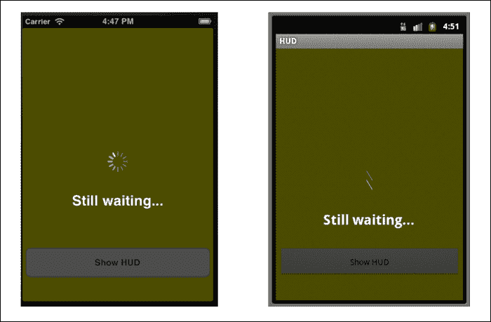

### 将 HUD 模块添加到您的项目中

将`HUD`模块添加到您的项目中非常简单。只需将`hud.js`文件复制到项目中的`Resources`文件夹，如下截图所示：

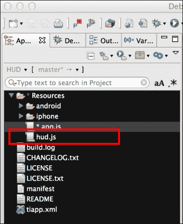

一旦您将`hud.js`文件添加到项目中，您需要使用`require`将模块导入到您的代码中：

```js
//Create our application namespace
var my = {
    hud : require('hud'),
    isAndroid : Ti.Platform.osname === 'android'
};
```

### 创建一个示例窗口

为了演示`HUD`模块，我们创建了一个带有单个按钮的基本窗口。为此，首先我们创建一个`Ti.UI.Window`并附加一个按钮：

```js
var win = Ti.UI.createWindow({
  backgroundColor:'yellow'
});

var hudButton = Ti.UI.createButton({
  title:'Show HUD', height:50, right:5, left:5, bottom: 40
});
win.add(hudButton);
```

### 添加 HUD 监听器

在我们的示例中接下来，我们添加一系列的监听器。以下代码块演示了如何添加一个监听器，当 HUD 窗口关闭时触发：

```js
my.hud.addEventListener('close',function(e){
  Ti.API.info('HUD Window Closed');
});
```

1.  您还可以监听一个`open`事件，当 HUD 窗口打开时将触发：

    ```js
    my.hud.addEventListener('open',function(e){
      Ti.API.info('HUD Window Open');
    });
    ```

1.  当用户在 HUD 窗口上双击时，会触发`dblclick`事件：

    ```js
    my.hud.addEventListener(dblclick,function(e){
      Ti.API.info('HUD Window double clicked');
    });
    ```

1.  当调用`updateMessage`来更新 HUD 窗口消息时，会触发`hudTextChanged`事件：

    ```js
    my.hud.addEventListener('hudTextChanged',function(e){
      Ti.API.info('Text Changed from ' + e.oldValue + ' to ' + e.newValue);
    });
    ```

1.  如果您正在使用 **关闭计时器** 功能，了解您的窗口是因计时器还是其他方法而关闭的很有帮助。为了帮助确定这一点，您可以订阅 `timerClose` 事件，如下面的代码片段所示：

    ```js
    my.hud.addEventListener('timerClose',function(e){
      Ti.API.info('HUD Window Closed by Timer');
    });
    ```

#### 创建 HUD 指示器

我们现在可以使用之前创建的按钮，来演示如何显示 HUD 窗口。我们为按钮的点击处理程序添加了逻辑，以使用消息文本 `请等待...` 加载 `HUD` 模块。然后我们调用 `show` 方法，该方法将 HUD 窗口显示给用户。

```js
hudButton.addEventListener('click',function(e){
  win.navBarHidden=true;
  my.hud.load('Please Wait...').show();
});
```

### 小贴士

在 Android 上，您可能希望隐藏导航栏，以便 HUD 窗口可以占据整个屏幕。如果您不隐藏导航栏，`HUD` 模块将设置窗口标题与提供的 HUD 显示消息相同的文本。

#### 更新 HUD 消息

通过调用 `updateMessage` 函数，您可以在任何时间更新 HUD 窗口的文本。以下行演示了如何将文本从 `请等待...` 更新为 `仍在等待...`。

```js
my.hud.updateMessage('Still waiting...');
```

#### 关闭 HUD 窗口

有两种方法可以关闭 `HUD` 模块窗口。第一种也是最常见的方法是调用 `hide` 函数，如下所示：

```js
my.hud.hide();
```

关闭 HUD 窗口的第二种方法是，在调用 `show` 方法之前，在 `HUD` 模块上使用 `addCloseTimer` 函数，如下面的代码片段所示。在这个例子中，HUD 窗口将在 5,000 毫秒后关闭。

```js
my.hud.load('Please Wait...').addCloseTimer(5000).show();
```

### 小贴士

`addCloseTimer` 函数有助于处理超时情况。例如，在执行网络调用时，您可能希望在五秒后放弃该过程，以免让用户等待过长时间。

## 它是如何工作的...

`HUD` 模块提供了一系列用于创建、更新和维护 HUD 进度窗口的函数。以下列表提供了每个方法的描述以及它们相关的功能：

+   `load` 函数：此函数用于构建 `Ti.UI.Window`、`Ti.UI.ActivityIndicator` 和 `Ti.UI.Label`，这些将在以后用于显示您的进度指示器。请注意，您需要首先调用 `load` 函数，然后调用 `show` 函数，以显示 HUD 窗口。

+   `show` 函数：此函数用于显示 HUD 窗口。请注意，在调用 `show` 之前，您首先需要调用 `load` 方法。如果顺序错误，HUD 窗口将不会显示。

+   `updateMessage` 函数：要更新 HUD 标签，您需要调用此函数，并提供一个包含要显示的更新文本的字符串。

+   `hide` 函数：调用此函数将关闭 HUD 窗口并移除所有创建的 HUD 对象。

+   `addCloseTimer` 函数：您可以使用此函数设置一个计时器，在指定的持续时间（以毫秒为单位）后关闭 HUD 窗口。

+   `removeCloseTimer` 函数：您可以使用此函数关闭使用 `addCloseTimer` 设置的计时器。

+   `addEventListener` 函数：HUD 模块支持下一节中详细说明的几个事件。您可以使用此函数订阅这些事件。

+   `removeEventListener`函数：您订阅的任何事件都可以通过调用此函数来移除。要移除事件，您需要提供与调用`addEventListener`时相同的名称和回调参数。

    ### 小贴士

    HUD 模块中的所有函数都是可链式的，类似于 jQuery 函数。

# 应用内通知

常常需要提醒用户某些事情已经发生。Titanium 允许您使用`alert`函数，就像在网页上做的那样。但是，这种模态警告通常可能限制性较强，不符合您的设计要求。

这个菜谱介绍了如何使用`NotifyUI`模块创建跨平台的、品牌化的通知窗口。

## 准备就绪

`NotifyUI`是一个由单个 JavaScript 文件`notify.js`和一些用于样式的图像资产组成的 CommonJS 模块。您可以通过配置或更新核心图像文件来控制模块的样式，使其容易适应您现有的品牌要求。

这个菜谱是关于如何使用`NotifyUI`模块的一个简单演示。您可以使用这个示例快速将模块集成到您的 Titanium 项目中。

以下截图显示了此菜谱的实际操作：

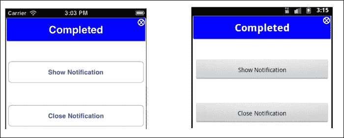

### 将 NotifyUI 模块添加到您的项目中

将`NotifyUI`模块添加到您的项目中非常简单。只需将`NotifyUI`文件夹复制到 Titanium 项目的`Resources`文件夹中，如以下截图所示。这将安装 CommonJS 模块及其所有支持图像。

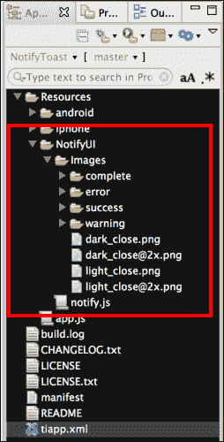

### 小贴士

为了使这个菜谱按预期工作，必须将`NotifyUI`文件夹复制到您的 Titanium 项目的`Resources`文件夹中。

## 如何操作…

一旦您将`NotifyUI`文件夹添加到项目中，您需要使用`require`将模块导入到您的代码中：

```js
//Create our application namespace
var my = {
  notify = require('./NotifyUI/notify'),
  isAndroid : Ti.Platform.osname === 'android'
};
```

### 创建示例窗口

为了演示`NotifyUI`模块，我们创建了一个包含两个按钮的基本窗口：

```js
var win = Ti.UI.createWindow({
  backgroundColor:'#fff'
});

var showNotifyButton = Ti.UI.createButton({
  title:'Show Notification', top: 100, 
  height:50, right:5, left:5
});
win.add(showNotifyButton);

var closeNotifyButton = Ti.UI.createButton({
  title:'Close Notification', top: 200, 
  height:50, right:5, left:5
});
win.add(closeNotifyButton);
```

### 添加 NotifyUI 监听器

在我们的示例中接下来，我们添加了一系列监听器。以下代码块演示了如何添加一个监听器，当`NotifyUI`通知窗口关闭时触发：

```js
my.notify.addEventListener('close',function(e){
  Ti.API.info(Notify Window Closed');
});
```

1.  您还可以监听`open`事件，该事件在通知窗口打开时触发。

    ```js
    my.notify.addEventListener('open',function(e){
      Ti.API.info('Notify Window Open');
    });
    ```

1.  当用户双击通知窗口时，会触发`dblclick`事件。

    ```js
    my.notify.addEventListener('dblclick',function(e){
      Ti.API.info('Notify Window double clicked');
    });
    ```

1.  当调用`updateMessage`来更新通知窗口消息时，`textChanged`事件由`NotifyUI`模块触发。

    ```js
    my.notify.addEventListener('textChanged',function(e){
      Ti.API.info('Text Changed from ' + e.oldValue + ' to ' + e.newValue);
    });
    ```

如果您使用的是关闭计时器功能，了解窗口是通过计时器关闭还是通过其他方法关闭是有帮助的。为了帮助确定这一点，您可以订阅`timerClose`事件，如下面的代码片段所示：

```js
my.notify.addEventListener('timerClose',function(e){
  Ti.API.info('Notify Window Closed by Timer');
});
```

### 显示消息窗口

我们现在可以使用之前创建的按钮来演示如何显示通知窗口。我们为按钮的点击处理程序添加了逻辑来 `load` 模块，包含消息文本 `Hello World` 和样式 `complete`，然后调用 `show` 方法，该方法向用户显示通知窗口。

```js
showNotifyButton.addEventListener('click',function(e){
  win.navBarHidden = true;
  my.notify.load({
    style:'complete',
    message:'Hello World'
  }).show();
});
```

#### 更新消息

通过调用 `updateMessage` 函数，你可以随时更新通知文本。以下演示了如何将文本从 `Hello World` 更新为 `I'm a new message`：

```js
my.notify.updateMessage("I'm a new message");
```

### 关闭消息窗口

有三种方式可以关闭通知窗口。第一种也是最常见的方式是调用 `hide` 函数，如下面的代码片段所示：

```js
my.notify.hide();
```

关闭通知窗口的第二种方式是在调用 `show` 函数之前使用 `addCloseTimer` 函数，如下面的代码块所示。在这个例子中，窗口将在 5,000 毫秒（5 秒）后自动关闭。

```js
my.notify.load({
  style:'complete',
  message:'Hello World'
}).addCloseTimer(5000).show();
```

关闭通知窗口的第三种和最后一种方式是让用户双击消息。这个手势将触发模块内部处理关闭操作。

## 它是如何工作的…

`NotifyUI` 模块提供了一系列用于创建、更新和维护通知窗口的函数。以下列表提供了每种方法的描述，以及它们相关的功能：

+   `load` 函数：此函数用于构建 `Ti.UI.Window`、`Ti.UI.Label` 和相关的通知样式，这些样式将用于稍后显示通知。请注意，你需要首先调用 `load` 函数，然后调用 `show` 函数来显示通知窗口。

+   `show` 函数：此函数用于显示通知窗口。请注意，在调用 `show` 之前，你需要首先调用 `load` 方法。如果顺序错误，通知窗口将不会显示。这些顺序操作提供了分离加载和显示操作的灵活性。如果你有多个连续的通知事件，这可能很重要。

+   `updateMessage` 函数：要更新通知标签，你需要调用此函数，并为其提供一个包含要显示的更新文本的字符串。

+   `hide` 函数：调用此函数将关闭通知窗口并移除所有创建的 `NotifyUI` 对象。

+   `addCloseTimer` 函数：你使用此函数来设置一个计时器，该计时器将在提供的持续时间（以毫秒为单位）后关闭通知窗口。

+   `removeCloseTimer` 函数：使用此函数可以关闭使用 `addCloseTimer` 设置的计时器。

+   `addEventListener` 函数：`NotifyUI` 模块支持下一节中详细说明的几个事件。你可以使用此函数来订阅这些事件。

+   `removeEventListener` 函数：你可以通过调用此函数来移除你已订阅的任何事件。要移除一个事件，你需要提供与调用 `addEventListener` 时相同的参数。

    ### 小贴士

    大多数 `NotifyUI` 函数都是可链式的，提供了一种类似于 jQuery 提供的模式，便于使用。

### 内置消息样式

`NotifyUI` 模块包含以下内置样式：

+   **完成**：这会显示一个带有蓝色背景和默认文本“完成”的窗口

    ```js
    my.notify.load({style:'complete'}).show();
    ```

    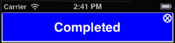

+   **错误**：这会显示一个带有红色背景和默认文本“错误”的窗口

    ```js
    my.notify.load({style:'error'}).show();
    ```

    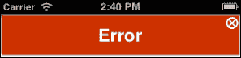

+   **警告**：这会显示一个带有橙色背景和默认文本“警告”的窗口

    ```js
    my.notify.load({style:'warning'}).show();
    ```

    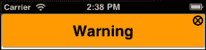

+   **成功**：这会显示一个带有绿色背景和默认文本“成功”的窗口

    ```js
    my.notify.load({style:'success'}).show();
    ```

    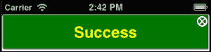

    ### 小贴士

    所有默认消息文本和文本颜色都可以通过向 `load` 函数调用提供 `message` 和 `messageColor` 对象属性来更新。

# 屏幕断点菜单

企业应用程序通常包含许多功能。提供一种引人入胜的方式来显示这些功能和子菜单可能具有挑战性。一个独特的导航选项是实现屏幕断点菜单，类似于 iOS 文件夹的工作方式。这种导航技术允许您仅在用户请求时呈现额外信息。

在本食谱中，我们将演示如何实现跨平台的屏幕断点动画，并将其链接到菜单视图。

## 准备工作

本食谱通过使用屏幕断点交互模式来创建额外的空间，用于“添加笔记”字段。您可以轻松调整此食谱以满足更复杂的菜单需求，例如实现高级选项或交互式帮助菜单。

### 菜单关闭时

当菜单关闭时，所有空间都可以用于其他控件。以下图片显示了屏幕断点菜单在关闭状态下的样子。

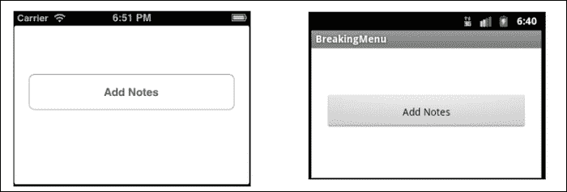

### 菜单打开时

当菜单打开时，屏幕被分割，`Ti.UI.Window` 的底部区域会进行动画处理，暴露出菜单区域。以下示例显示了打开的屏幕断点菜单，并显示了一个 `Ti.UI.TextArea` 用于记笔记：

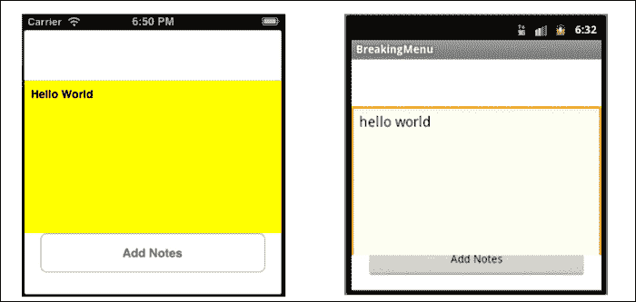

### 将屏幕断点菜单添加到您的项目中

屏幕断点菜单是一个由单个 JavaScript 文件组成的 CommonJS 模块。要安装它，只需将 `breakmenu.js` 文件复制到您的项目中，如下面的截图所示：

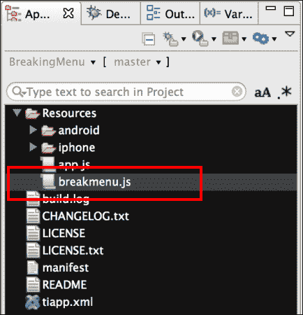

## 如何操作…

一旦将 `breakmenu.js` 文件添加到您的项目中，您需要使用 `require` 将模块导入到您的代码中，如下面的代码片段所示：

```js
//Create our application namespace
var my = {
  breakingMenu : require('breakmenu')
};
```

### 创建示例窗口

为了演示屏幕断点菜单，我们创建了一个带有单个按钮的基本窗口。当点击此按钮时，屏幕断点菜单会被激活。

```js
var win = Ti.UI.createWindow({
  backgroundColor:'#fff'
});

//Create button
var button = Ti.UI.createButton({
  title:'Add Notes', left:20, right:20, height:50, top:150
});
win.add(button);
```

### 添加屏幕断点菜单监听器

在我们的示例中接下来，我们添加了一系列监听器。以下代码块演示了如何添加一个监听器，当屏幕断开菜单开始时触发，以显示菜单。

```js
my.breakingMenu.addEventListener('breaking',function(e){
  Ti.API.info("Screen is breaking");
});
```

1.  当菜单完全显示时，会触发`broken`事件。

    ```js
    my.breakingMenu.addEventListener('broken',function(e){
      Ti.API.info("Screen is broken, menu is visible");
    });
    ```

1.  当菜单开始关闭时，会触发`closing`事件。这将花费一秒钟才能完全关闭。

    ```js
    my.breakingMenu.addEventListener('closing',function(e){
      Ti.API.info('Menu starting to close');
    });
    ```

1.  只有当菜单完全隐藏时，才会触发`closed`事件。

    ```js
    my.breakingMenu.addEventListener('closed',function(e){
      Ti.API.info('Menu is closed');
    });
    ```

### 创建笔记菜单对象

显示`Ti.UI.View`是屏幕断开菜单的核心。在这个例子中，我们创建了一个包含`Ti.UI.View`和`Ti.UI.TextArea`控件的笔记菜单对象。这些控件用于在屏幕断开菜单可见时，向用户提供一个输入笔记的区域。

```js
var notesMenu = {
  value : '', //Our value for the notes screen
  view : function(){
    //Create a view container
    var vwMenu = Ti.UI.createView({
      backgroundColor:'yellow',top:150,
      height:200, width: Ti.UI.FILL
    });
    //Create a textArea for the user to type
    var txtField = Ti.UI.createTextArea({
      width: Ti.UI.FILL,height:Ti.UI.FILL,
      hintText:"Add a note", value : notesMenu.value, backgroundColor:'transparent',font:{fontSize:14,fontWeight:'bold'}
    });
    vwMenu.add(txtField);
    //When text is added, update the menu value
    txtField.addEventListener('change',function(e){
      notesMenu.value = txtField.value; 
    });
    //Return the view so we can later bind for display
    return vwMenu;
  }
};
```

### 显示菜单

当样本按钮被按下时，会调用`breakScreen`函数以显示屏幕断开菜单。

`breakScreen`函数接受以下参数：

+   第一个参数是您希望分割以显示菜单的`Ti.UI.Window`。

+   第二个参数是您希望用作菜单的`Ti.UI.View`。请注意，这只能是一个`Ti.UI.View`对象类型。

+   最后一个参数是`settings`对象。此对象包含以下属性：

    +   `breakStartPoint`：从屏幕顶部测量的位置，表示断开应该开始的位置。

    +   `bottomViewHeight`：此属性决定下半部分的屏幕高度。此值决定了屏幕下半部分的大小，该部分将沿着屏幕向下动画。

    +   `slideFinishPoint`：从屏幕顶部测量的位置，表示底部视图应该滑动到的位置。

        ### 小贴士

        您需要调整这些`settings`属性以满足您的屏幕布局需求。

以下代码块实现了所有三个属性：

```js
button.addEventListener('click',function(e){
  //Options object
  var settings = {};
  //Point of the screen where the screen will separate
  settings.breakStartPoint = 150; 
  //Size of the bottom half of screen, ie the sliding part
  settings.bottomViewHeight = 218, 
  //The bottom point you want the screen to slide to. 
  //Measured from top of screen
  settings.slideFinishPoint = 340;			
  //Call function to split the screen & show our menu
  my.breakingMenu.breakScreen(win,notesMenu.view(),settings);
});
```

# Metro 风格标签控件

分页界面是组织您的企业钛金应用的有效方式。随着智能手机和精心设计、引人入胜的 UI/UX 消费者应用的日益普及，企业用户对 UI 丰富的企业应用的需求水平正在提高。您的普通企业用户现在开始期待比传统分页界面提供更丰富的体验。

本食谱演示了如何使用**Metro 风格标签控件**为您的企业应用创建独特的跨平台体验。此控件允许您以引人入胜的新方式使用分页交互模式，同时满足您的品牌或组织风格要求。

## 准备工作

本食谱通过创建一个用于组织应用导航的 Metro 风格标签控件的过程进行说明。标签控件设计得易于配置，以满足您的企业品牌和显示需求。

下一个示例显示了位于我们跨平台应用顶部的简单 3 标签导航器。以下各节将指导您创建此样本，并演示如何配置控件以满足您的特定需求。

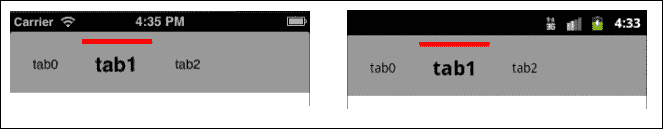

### 将标签控制添加到你的项目中

`Metro Tab Control`是一个 CommonJS 模块，由一个 JavaScript 文件组成。要安装，只需将`tabcontrol.js`文件复制到你的项目中，如下面的屏幕截图所示：

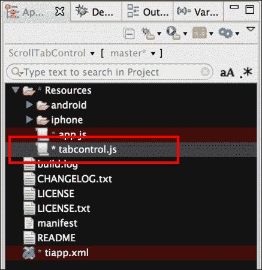

## 如何做到这一点...

一旦你将`tabcontrol.js`文件添加到你的项目中，你需要使用`require`将模块导入到你的代码中，如下面的代码片段所示：

```js
//Create our application namespace
var my = {
  tabControl : require('tabcontrol')
};
```

### 创建示例窗口

要演示 Metro 样式标签控制，创建一个`Ti.UI.Window`来附加这个自定义控制，并带有三个标签。

```js
var win = Ti.UI.createWindow({
  backgroundColor:'#fff',title:"Tab Control Example", 
  fullscreen:false, navBarHidden:true
});
```

### 创建设置对象

当创建标签控制时，你需要一个`tabSettings`对象和一个标签数组。`tabSettings`对象包含创建标签控制所需的所有属性。然后，将这些标签添加到控制中。在创建`tabSettings`对象时，你可以使用任何有效的`Ti.UI.ScrollView`属性，因为标签控制是在 Titanium 原生`Ti.UI.ScrollView`的基础上提供包装的。

`tabSettings`对象还有一个特定于标签控制的名为`selectedCue`的对象。`selectedCue`对象包含`selectedBackgroundColor`和`backgroundColor`属性。`selectedBackgroundColor`属性是在标签被选中时提供视觉提示所使用的颜色。`backgroundColor`属性是用于视觉提示区域的默认背景颜色。

```js
var tabSettings = {
  top:0, //Position the control a top of win
  selectedCue : {
    selectedBackgroundColor:'red',
    backgroundColor:'transparent',
  }
};
```

### 定义标签

你在创建标签控制时定义所有标签。对于这个例子，我们首先创建一个空数组，然后将每个标签定义推入数组中。

```js
var tabs = [];//Create tab collection
```

**标签定义**有两个主要部分，即`Tab`和`Label`部分。在`Tab`部分，你可以使用在创建`Ti.UI.View`对象时有效的任何参数。任何额外的参数将被视为`Tab`对象的自定义属性，一旦标签控制被添加到`Ti.UI.Window`中，这些属性将可用。

在`Label`部分，你可以使用在创建`Ti.UI.Label`对象时有效的任何参数。`Label`部分还有一个特定于标签的属性，称为`selectedFont`。`selectedFont`对象具有与`Ti.UI.Label`字体对象相同的属性，但仅在标签被选中时应用。以下示例用于演示字体大小和字重的增加。

### 小贴士

确保在你的标签定义或`TabStrip`中包含一个`width`属性，否则布局将不正确。

```js
var tab0 = {
  Tab : {
    left:1, width:75, height:50
  },
  Label :{
    text:'tab0',
    selectedFont:{
      fontSize:22, fontWeight:'bold'
    },
    font:{
      fontSize:14
    }
  }
};
tabs.push(tab0); //Add tab to collection
```

要完成这个食谱，使用前面演示的相同模式添加`tab1`和`tab2`。

### 将标签控制添加到窗口中

在这个食谱的下一步中，需要调用`createTabStrip`方法，提供我们的设置对象和标签数组。此方法返回一个自定义标签控制的实例，然后将其添加到示例的`Ti.UI.Window`中，如下面的代码片段所示：

```js
//Create our tab control
var tabControl = my.tabControl.createTabStrip(tabSettings,tabs);
//Add our tab control to the window
win.add(tabControl);
```

### 添加标签监听器

Metro Tab Control 是从`Ti.UI.ScrollView`派生出来的。因此，它继承了其基本监听器，如`pinch`、`scroll`和`click`。还有其他事件可供您订阅。

1.  当用户点击标签时，将触发`tabClick`事件，提供被点击标签的索引。

    ```js
    tabControl.addEventListener('tabClick',function(e){
      Ti.API.info("Tab at Index: " + e.index + " was clicked");
    });
    ```

1.  当选择标签时，将触发`indexChanged`事件，提供当前和之前的索引值。

    ```js
    tabControl.addEventListener('indexChanged',function(e){
      Ti.API.info("Tab Index changed from " + e.oldIndex +" to " + e.index);
    });
    ```

# Slideout Menu

使用 Slideout 菜单进行导航已成为显示导航选项的一种流行方式。这种导航模式由 Facebook 和 Path 应用推广。这种导航模式的优点是它可以有效地展示大量的菜单选项。大多数企业应用都可以从这种类型的导航中受益，因为它增加了功能可发现性。

## 准备中

在这个菜谱中，我们将演示如何使用 Slideout 菜单创建一个示例应用，通过它访问四个应用视图，以及一个注销按钮。`Slideout Menu`模块提供了一个可链式 CommonJS 模块，可以轻松管理您的菜单和视觉资产，这些资产可以轻松地进行品牌化。

以下截图显示了在我们的示例跨平台应用中打开的 Slideout 菜单。以下步骤将指导您创建此示例，并演示如何配置控件以满足您的需求。

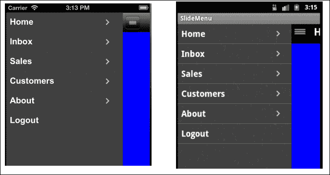

### 安装 Ti.Draggable 模块

在 Android 上运行时，Slideout 菜单使用一个流行的本地模块，称为`Ti.Draggable`。此模块使用户能够轻松地滑动菜单封面。

要安装此模块，您可以轻松地从菜谱的源代码中复制`modules`目录，或者从[`github.com/pec1985/TiDraggable`](https://github.com/pec1985/TiDraggable)下载`Ti.Draggable`项目。一旦您有了解压的模块，您将希望将其内容复制到您的项目`modules`文件夹中，如下面的截图所示：

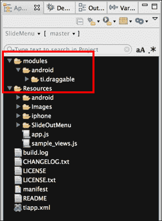

在您将文件复制到`modules`目录后，您需要将模块添加到您的项目中。在 Titanium Studio 中，通过点击`tiapp.xml`文件可以轻松完成此操作。一旦项目配置屏幕加载，点击下面的绿色加号按钮（如下面的截图所示）。

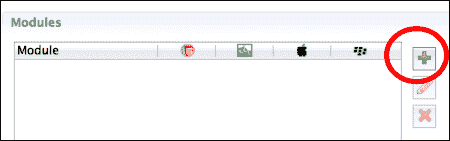

然后，您将看到一个包含您已安装的所有模块的列表。选择**ti.draggable [android]**模块，如下面的截图所示。选择此模块后，点击**OK**将引用模块添加到您的项目中。

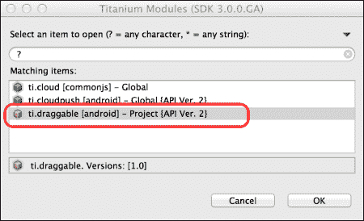

一旦您添加了模块，在运行之前请确保保存您的项目。保存后，您需要清理您的项目。您可以通过在 Titanium Studio 的**项目**工具栏选项下选择**清理…**来完成此操作，如下面的截图所示：

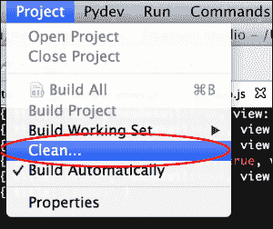

### 将 Slideout Menu 模块添加到您的项目中

将`Slideout Menu`模块添加到您的项目中很简单。只需将`SlideOutMenu`文件夹复制到您的 Titanium 项目中的`Resources`文件夹，如下面的截图所示。这将安装 CommonJS 模块及其所有支持图像。

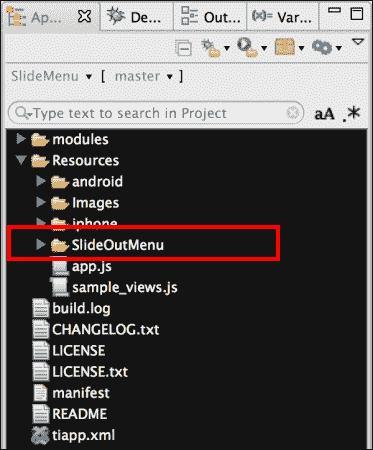

### 小贴士

为了使这个食谱按设计工作，`SlideOutMenu`文件夹必须位于您的 Titanium 项目根目录中。

## 如何做到这一点...

将`SlideOutMenu`文件夹添加到您的项目后，您需要使用`require`将模块导入到您的代码中。

```js
//Create our application namespace
var my = {
  views:{},
  menu : require('./SlideOutMenu/MASlidingMenu')
};
```

### 定义我们的内容视图

对于这个示例，我们创建了一个 CommonJS 模块，它作为一个视图工厂工作。在您的应用程序中，这些视图将是您希望在屏幕上显示的内容。

```js
my.sampleView = require('sample_views');
```

以下代码片段构建了一个包含我们由示例视图工厂创建的占位符视图的`views`对象。

```js
my.views = {
  home : my.sampleView.placeholderView({
    title:'Home',backgroundColor:'blue'}),
  inbox : my.sampleView.placeholderView({
    title:'Home',backgroundColor:'green'}),
  sales : my.sampleView.placeholderView({
    title:'Home',backgroundColor:'yellow'}),
  customers : my.sampleView.placeholderView({
    title:'Home',backgroundColor:'blue'}),
  about : my.sampleView.placeholderView({
    title:'About',backgroundColor:'purple'})	
};
```

### 构建我们的菜单项

我们食谱的下一步是定义我们的菜单项。当菜单打开时，菜单将显示一系列菜单项，如下面的代码片段中的`menuData`所示。

每个菜单项可以包含以下属性：

+   **标题**：此属性用于显示菜单项的文本。

+   **细节提示**：属性`hasDetail`确定是否显示`更多`箭头视觉提示。此属性是可选的，默认为`false`。

+   **视图指针**：可选属性视图用于保存当菜单项被按下时应显示的视图的引用。

    ```js
    var menuData = [
      { title:'Home', hasDetail:true, view: my.views.home },
      { title:'Inbox', hasDetail:true, view: my.views.inbox },
      { title:'Sales', hasDetail:true, view: my.views.sales },
      { title:'Customers', hasDetail:true, 
    view: my.views.customers },
      { title:'About', hasDetail:true, view: my.views.about },
      { title:'Logout' }
    ];
    ```

### 打开应用程序窗口

要打开示例窗口，您首先需要调用`addMenuItems`函数并提供我们之前创建的`menuData`数组。这将创建模块内的菜单对象。接下来，您需要将`addMenuItems`函数的结果传递给`open`方法。这将打开您的主应用程序窗口并显示菜单中的第一个视图。

```js
my.menu.addMenuItems(menuData).open();
```

### 添加菜单监听器

Slideout 菜单提供了对`buttonclick`、`switch`、`open`、`close`和`sliding`事件的监听。以下详细说明了在示例中使用这些事件。

1.  当菜单项被点击时，会触发`buttonclick`事件，提供菜单项的索引。

    ```js
    my.menu.addEventListener('buttonclick', function(e) {
      if (e.index === 2) {
        alert('You clicked on Logout');
      }
    });
    ```

1.  当显示视图切换到另一个视图时，会触发`switch`事件。此事件可用于帮助加载显示视图的内容。

    ```js
    my.menu.addEventListener('switch', function(e) {
      Ti.API.info('menuRow = ' + JSON.stringify(e.menuRow));
      Ti.API.info('index = ' + e.index);
      Ti.API.info('view = ' + JSON.stringify(e.view));
    });
    ```

1.  当用户滑动显示视图以显示菜单时，会触发`sliding`事件。这提供了视图距离。

    ```js
    my.menu.addEventListener('sliding', function(e) {
      Ti.API.info('distance = ' + e.distance);
    });
    ```

1.  当菜单完全显示时，会触发`open`事件。此事件有助于跟踪视觉状态。

    ```js
    my.menu.addEventListener('menuOpened', function(e) {
      Ti.API.info('Menu is open');
    });
    ```

1.  当菜单完全关闭时，会触发`menuClosed`事件。此事件有助于跟踪视觉状态。

    ```js
    my.menu.addEventListener('menuClosed ', function(e) {
      Ti.API.info('Menu is closed');
    });
    ```

### 添加自定义应用程序监听器

我们的示例应用程序还使用了以下自定义应用程序级别事件。这些事件由我们的示例视图触发，用于关闭和切换菜单。

```js
Ti.App.addEventListener('app:toggle_menu',function(e){
  Ti.API.info('App Listener called to toggle menu');
  my.menu.toggle();
});
Ti.App.addEventListener('app:close_menu',function(e){
  Ti.API.info('App Listener called to close menu');
  my.menu.hide();
});
```

## 它是如何工作的…

`Slideout Menu`模块提供了几个函数，帮助您构建应用程序的导航系统。

### 创建菜单

以下代码片段演示了如何使用`addMenuItems`辅助函数通过菜单项列表创建菜单。请参阅本食谱的*如何做…*部分以获取示例。

```js
my.menu.addMenuItems(menuData);
```

### 打开菜单容器

以下行演示了如何打开菜单容器并显示第一个菜单项。请参阅本食谱的*如何做…*部分以获取示例。

```js
my.menu.open();
```

### 小贴士

在菜单容器可以打开之前，需要调用`addMenuItems`函数。

### 显示菜单

以下行演示了如何完全显示菜单：

```js
my.menu.expose();
```

### 切换菜单

在设计您的导航器时，您将希望实现一个按钮，允许用户打开和关闭菜单。以下代码片段显示了`toggle`方法如何执行此操作：

```js
my.menu.toggle();
```

### 关闭菜单

以下行演示了您如何隐藏菜单：

```js
my.menu.hide();
```

### 确定菜单状态

您可以使用以下行来确定菜单是否现在已完全显示：

```js
Ti.API.info("Menu is open " + my.menu.isOpen());
```

### 访问当前视图

您通常会需要访问当前显示的视图以执行输入验证或其他操作。以下行演示了您如何轻松访问当前视图：

```js
var current = my.menu.currentView();
```

### 关闭菜单容器

以下行演示了如何关闭菜单容器及其所有相关显示视图：

```js
my.menu.dispose();
```

### 使用示例的全局事件

我们的每个示例视图都可以触发两个有用的自定义应用程序级事件。第一个事件是`app:toggle_menu`，当您点击菜单图标时被调用。这将根据其当前状态显示或隐藏菜单。

```js
toMenu.addEventListener('click', function(){
  Ti.App.fireEvent('app:toggle_menu');
});
```

通常，用户希望在菜单完全关闭之前就开始使用屏幕。为了方便起见，每个显示视图将在双击时调用`app:close_menu`事件。这将自动关闭视图，并允许用户继续在当前屏幕上工作。

```js
view.addEventListener('dblclick',function(e){
  Ti.App.fireEvent('app:close_menu');
});
```

## 相关阅读

+   本食谱灵感来源于并包含几个优秀的开源项目的分支。本食谱中使用的`MASlidingMenu.js` CommonJS 模块是`MASlidingMenu`项目的分支。

    +   `MASlidingMenu`：可在[`github.com/appersonlabs/MASlidingMenu`](https://github.com/appersonlabs/MASlidingMenu)找到。作者：Matt Apperson。

    +   `TiDraggable`：可在[`github.com/pec1985/TiDraggable`](https://github.com/pec1985/TiDraggable)找到。作者：Pedro Enrique。

    +   `CoverSliderExample`：可在[`github.com/atsusy/CoverSliderExample`](https://github.com/atsusy/CoverSliderExample)找到。作者：Atsushi Kataoka。
