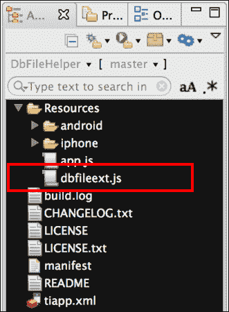
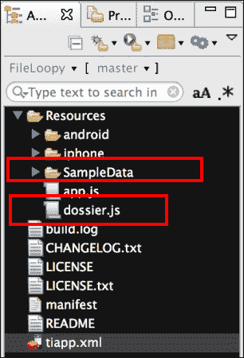
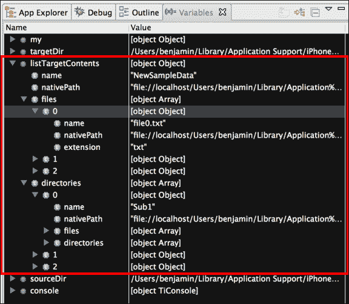
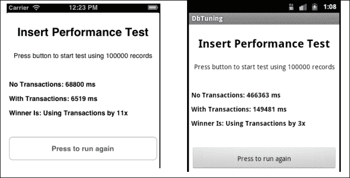
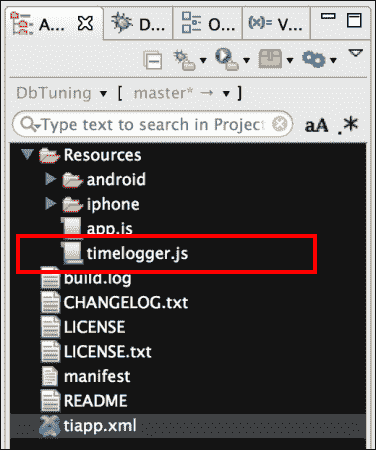
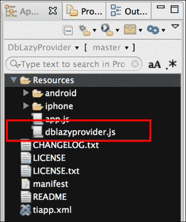
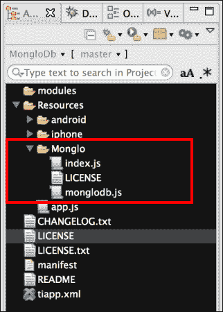

# 第三章：使用数据库和管理文件

在本章中，我们将涵盖：

+   访问您的数据库的 Ti.Filesystem

+   DbTableChecker SQLite 表存在性检查

+   使用 Dossier 递归处理文件

+   对 SQLite 数据库进行调优以获得最佳性能

+   使用 DbLazyProvider 进行数据访问

+   使用 MongloDb 进行 NoSQL

# 简介

Titanium 有几个组件旨在帮助处理您的数据需求。此外，Titanium 开源社区还提供了丰富的替代数据处理选项。

本章中的食谱展示了在设备上处理数据时各种有用的方法。从文件系统管理到 SQLite 调优，无论您首选哪种方法，都将有一个方法来协助您的企业数据需求。

# 访问您的数据库的 Ti.Filesystem

钛金属包含一个强大的数据库 API，它提供了对底层平台 SQLite 实现的便捷访问。通过为您的应用程序的 SQLite 数据库访问`Ti.Filesystem`，您可以更有效地处理更新、迁移和安装。

`DbFileExt`模块提供了对您的 SQLite `Ti.Filesystem`对象的便捷访问。该模块还包括其他方便的方法来帮助处理数据库文件。

## 准备就绪

将`DbFileExt`模块添加到您的项目中很简单。只需将`dbfileext.js`文件复制到您的项目中，如下截图所示：



## 如何操作…

一旦您将`dbfileext.js`文件添加到您的项目中，您需要使用`require`将模块导入到您的代码中：

```js
//Create our application namespace
var my = {
  isAndroid : Ti.Platform.osname === 'android',
  dbfileext : require('dbfileext')
};
```

### 查找我们的数据库 Ti.Filesystem.File

`dbFile`函数提供了对您的数据库`Ti.Filesystem.File`对象的便捷访问。只需提供您希望访问的数据库名称，相关的`Ti.Filesystem.File`对象将被返回：

```js
Var myDbFile = my.dbfileext.dbFile('testdb');
```

### 小贴士

如果向`dbFile`函数提供了无效的数据库名称，将返回一个新的`Ti.Filesystem.File`对象。这允许您稍后添加数据库或文件。建议在执行任何操作时使用`exists`方法。

### 确定数据库目录

确定您的应用程序的数据库文件夹可能具有挑战性，因为它根据平台而异。利用`dbDirectory`函数有助于解决这一挑战，前提是您根据应用程序运行的设备指定适当的目录路径：

```js
my.dbfileext.dbDirectory();
```

### 文件存在性检查

在打开之前，您通常会需要检查数据库是否已安装。`DbFileExt`模块通过`dbExists`函数使这一过程变得简单。只需粘贴数据库名称，就会返回一个布尔值，标识数据库是否已安装：

```js
my.dbfileext.dbExists('testdb');
```

### 远程备份 – iOS 特定的属性

在 iOS 5 中，Apple 包含了将文件备份到 iCloud 服务的功能。您可以通过使用 `dbRemoteBackup` 函数来启用或禁用此功能。当您提供数据库名称和布尔值时，您表示是否希望启用远程备份：

```js
my.dbfileext.dbRemoteBackup('testdb',true);
```

### 小贴士

如果在 Android 平台上调用此函数，则不会执行任何操作，因为这涉及到 iOS 特定的功能。

### 重命名数据库文件

`DbFileExt` 模块允许您重命名数据库文件。这在进行数据库版本控制或备份时非常有用。要重命名数据库，请将当前数据库名称和新名称作为参数传递给 `dbRename` 方法，如下所示：

```js
my.dbfileext.dbRename('current name','new name');
```

### 列出所有数据库

在处理大型应用程序或需要数据库版本控制的应用程序时，您通常会需要列出应用程序沙盒内安装的所有数据库。`dbList` 函数提供了应用程序数据库文件夹中每个 SQLite 数据库的名称和本地路径。然后，您可以使用此数组删除任何不需要的数据库文件：

```js
var installedDatabase = my.dbfileext.dbList();
```

### 删除数据库文件

`dbRemove` 函数提供了一个简单且安全的方法来删除任何不需要的数据库文件。提供您希望删除的数据库名称，`DbFileExt` 模块将文件从您的设备中删除：

```js
my.dbfileext.dbRemove('newtest');
```

## 它是如何工作的...

以下一系列测试演示了 `DbFileExt` 模块在无窗口的 `app.js` 示例中的应用。

### 设置我们的测试

首先，我们使用 `Ti.Database.open` 函数创建一个示例数据库。以下高亮代码演示了如何创建名为 `testdb` 的数据库：

```js
//Create our application namespace
var my = {
    isAndroid : Ti.Platform.osname === 'android',dbfileext : require('dbfileext')
};

var testDb = Ti.Database.open('testdb');

```

接下来，我们创建一个 `Ti.Filesystem` 对象，该对象具有对 `testdb` 数据库的已知引用。这将在以后用于验证 `DbFileExt` 模块是否返回正确的值。

```js
var testFileReference = (function(){
  if(my.isAndroid){
    return Ti.Filesystem.getFile(
  }else{
    return testDb.file;
  }
})();
```

### 小贴士

iOS 的 `Ti.Database` 对象有一个文件属性，可以在您的测试中使用。在 Android 上，您需要使用正确的目录和文件名创建文件对象。

### 查找我们的数据库 Ti.Filesystem

接下来，我们比较 `DbFileExt` 模块返回的 `Ti.Filesystem.File` 对象是否与我们的测试文件匹配。无论平台如何，这些都应该始终匹配。

```js
Ti.API.info("Does the module return the same as our test?");
Ti.API.info((testFileReference.nativePath === my.dbfileext.dbFile('testdb').nativePath) ?
"Test Pass" : "Test Failed");
```

### 确定数据库目录

SQLite 文件安装的目录因平台而异。例如，在 Android 上位于 `data` 目录中，而在 iOS 上位于 `Private Documents` 文件夹中。以下示例演示了如何将设备数据库目录的路径写入 Titanium Studio 的控制台：

```js
Ti.API.info("Your database directory is " + my.dbfileext.dbDirectory());
```

### 文件存在检查

`DbFileExt` 模块最常用的用途是检查数据库是否已经安装。下一个测试比较了 `DbFileExt` 中的 `dbExists` 结果和由我们的测试 `Ti.Filesystem.File` 对象生成的结果：

```js
Ti.API.info("Does the exists test work?");
Ti.API.info((testFileReference.exists() === my.dbfileext.dbExists('testdb')) ? "Both Exist" : "Test Failed");
```

### 重命名数据库文件

你可能会因为各种原因需要重命名数据库，最常见的是存档或版本控制。以下突出显示的代码演示了如何将`testdb`数据库重命名为`oldtest`。然后对新的和旧的名字都调用了`dbExists`方法，以演示重命名功能已正确工作。

```js
my.dbfileext.dbRename('testdb','oldtestdb');
Ti.API.info("Does the test db exist?  " + my.dbfileext.dbExists('testdb'));
Ti.API.info("How about the oldtest one? Does that exist?  " + my.dbfileext.dbExists('oldtest'));
```

### 列出所有数据库

列出应用中所有可用的数据库通常很有帮助，这对于大型应用或包含第三方组件的应用尤其有用。

为了演示此功能，首先在我们的示例应用中创建几个数据库：

```js
Ti.Database.open('test1');
Ti.Database.open('test2');
Ti.Database.open('test3');
```

`DbFileExt`模块的`dbList`函数用于返回安装到我们的应用中的所有数据库：

```js
var installedDb =  my.dbfileext.dbList();
```

以下代码片段将`installedDb`变量提供的数据库列表写入 Titanium Studio 的控制台。这将列出本示例中使用的所有数据库，以及可能也安装在你 Titanium 项目中的任何数据库。

```js
installedDb.forEach(function(db) {
  Ti.API.info("Db Name = " + db.dbName);
  Ti.API.info("nativePath = " + db.nativePath);
});
```

### 删除数据库文件

此配方的最终测试演示了如何使用`dbRemove`函数删除已安装的数据库。以下突出显示的代码片段显示了如何删除我们在示例中之前使用的`oldtest`数据库：

```js
my.dbfileext.dbRemove('oldtest');
Ti.API.info("db still exists?  " + my.dbfileext.dbExists('oldtest'));
```

# DbTableChecker SQLite 表存在性检查

SQLite 和`Ti.Database` API 提供了许多强大的功能。此配方演示了如何使用现有的`Ti.Database` API 和 SQL 语句来检查表是否已经创建。

检查数据库对象是否存在的能力对于企业应用至关重要，用于版本控制和数据迁移目的。此过程的典型用法是在模式迁移期间检查表是否已经存在。例如，如果客户端表在创建表时已经存在，则可能执行特定的数据迁移。 

## 准备工作

此配方依赖于 Titanium 框架的`Ti.Database` API，无需任何依赖。在下一节中，我们将创建一个简单的`app.js`文件，演示如何执行表存在性检查。

## 如何操作…

以下步骤演示了如何在 SQLite 数据库中检查表是否存在。

### 创建我们的模块

在 Titanium Studio 中，创建一个名为`db`的模块，名为`tablechecker.js`。此模块应包含以下代码片段：

```js
exports.tableExists = function (dbName, tableName){
  var conn = Ti.Database.open(dbName);
  var selectSQL ='SELECT name FROM sqlite_master 'selectSQL +=' WHERE type="table" AND name=?';

  var getReader = conn.execute(selectSQL,tableName);
  var doesExist = (getReader.getRowCount() > 0 );

  //Clean-up
  getReader.close();
  conn.close();
  getReader = null;
  conn = null;

  return doesExist;
};
```

### 命名空间和应用设置

接下来，在我们的应用程序的`app.js`文件中，我们创建应用程序命名空间，并使用`require`方法将`CommonJS`模块导入到我们的应用程序中：

```js
//Create our application namespace
var my = {
  dbTableChecker : require('dbtablechecker')
};
```

### 创建我们的窗口

为了帮助演示此配方，创建了一个包含三个按钮的窗口。这些按钮将允许你创建、测试表是否存在，以及删除`myTable`示例表。

```js
var win = Ti.UI.createWindow({
  backgroundColor:'#fff',layout:'vertical'
});
```

### 测试表是否存在

配方中的第一个按钮演示了如何在`dbTableChecker`的`CommonJS`模块中创建的`tableExists`函数中进行调用：

```js
var tableExistsBtn = Ti.UI.createButton({
    title:'Does Table Exist?', height:50, right:5, left:5, top: 20
});
win.add(tableExistsBtn);
```

当按钮被按下时，在 `CommonJS` 模块中调用 `tableExists` 函数以确定指定的表是否存在。下一个突出显示的代码片段演示了检查 `myDatabase` SQLite 数据库中是否存在名为 `myTable` 的表。

```js
tableExistsBtn.addEventListener('click',function(e){
  //Check if our table exists in our database
  var doesExist = my.dbTableChecker.
tableExists('myDatabase','myTable');
  //Alert the user if the table exists or not
  alert('Table "myTable" ' + (doesExist ? ' exists' : "does not exist"));
});
```

### 创建一个表格

下一个按钮在本菜谱中用于创建一个用于测试的示例表。在探索本菜谱时，此按钮将允许您多次删除和重新创建示例表。

```js
var makeTestBtn = Ti.UI.createButton({
  title:'Create Test Table', height:50, right:5, left:5, top: 20
});
win.add(makeTestBtn);
```

以下突出显示的代码演示了调用 `my.testers.makeTable` 函数来在 `myDatabase` 数据库中创建名为 `myTable` 的表：

```js
makeTestBtn.addEventListener('click',function(e){
  //Create a sample table
 my.testers.makeTable('myDatabase','myTable');

  //Alert the user a test table has been created
  alert('Table "myTable" was created.');
});
```

### 小贴士

请参阅本菜谱的 *如何工作…* 部分，以获取有关 `my.testers` 的更多信息。

### 删除一个表

本菜谱中的最后一个按钮用于删除示例表。在探索本菜谱时，此按钮将允许您多次删除和重新创建示例表：

```js
var removeTestBtn = Ti.UI.createButton({
  title:'Remove Test Table', height:50, right:5, left:5, top: 20
});
win.add(removeTestBtn);
```

以下代码片段中突出显示的行演示了如何调用 `my.testers.removeTable` 函数来删除我们数据库中的名为 `myTable` 的表：

```js
removeTestBtn.addEventListener('click',function(e){
  //Create a sample table
  my.testers.removeTable('myDatabase','myTable');
  //Alert the user a test table has been removed
  alert('Table "myTable" was removed');
});
```

### 小贴士

请参阅本菜谱的 *如何工作…* 部分，以获取有关 `my.testers` 的更多信息。

## 如何工作…

本菜谱使用 SQLite 数据字典和几个辅助方法来支持测试。这些方法的函数性和它们的组合方式在此进行讨论。

### 测试辅助工具

本菜谱使用两个辅助函数 `makeTable` 和 `dropTable` 来管理我们的示例表。这些方法允许 `tableExists` 方法在无冲突的情况下重复测试。

```js
my.testers = {
```

1.  `makeTable` 函数使用 `dbName` 打开数据库连接。一旦数据库已打开，就会使用提供的 `tableName` 参数创建一个表（如果不存在）：

    ```js
      makeTable : function(dbName,tableName){
        var conn = Ti.Database.open(dbName);
        var createSql = 'CREATE TABLE IF NOT EXISTS ' 
        createSql += tableName ;
        createSql += '(id INTEGER PRIMARY KEY AUTOINCREMENT,';
        createSql += ' my_column TEXT)';

        conn.execute(createSql);

        //Clean-up
        conn.close();
        conn = null;
      },
    ```

1.  `removeTable` 函数使用 `dbName` 打开数据库连接。一旦数据库已打开，如果提供的 `tableName` 参数中指定的表存在，则将其删除：

    ```js
      removeTable : function(dbName,tableName){
        var conn = Ti.Database.open(dbName);
        var dropSql = 'DROP TABLE IF EXISTS ' + tableName;

        conn.execute(dropSql);

        Conn.close();
        conn = null;
      }
    };
    ```

### `tableExists` 方法

`dbTableCheck` 模块有一个名为 `tableExists` 的单一方法，如果提供的表名存在于数据库中，则返回一个布尔结果。此检查是通过查询 SQLite 数据库的数据字典来执行的。

```js
exports.tableExists = function (dbName, tableName){
  var conn = Ti.Database.open(dbName);
```

1.  以下 SQL 语句将查询 SQLite 数据字典表 `sqlite_master`，以获取具有指定表名的表列表。`?` 字符是一个参数，它将由执行方法替换。

    ```js
      var selectSQL ='SELECT name FROM sqlite_master; selectSQL +=' WHERE type="table" AND name=?';
    ```

1.  然后使用 `tableName` 变量作为其参数执行数据字典查询。返回一个 `Ti.Database.DbResultSet` 并分配给 `getReader` 变量：

    ```js
      var getReader = conn.execute(selectSQL,tableName);
    ```

1.  接下来，使用 `getRowCount` 方法来确定是否有任何行返回。这被转换为一个布尔语句，稍后该方法将返回此语句：

    ```js
      var doesExist = (getReader.getRowCount() > 0 );
    ```

1.  `DbResultSet` 和数据库随后关闭，以减少活动对象的数量：

    ```js
      getReader.close();
      conn.close();
      getReader = null;
      conn = null;
    ```

1.  之前确定的布尔结果由以下方法返回：

    ```js
      return doesExist;
    };
    ```

# 使用 Dossier 递归处理文件

在创建你的 Titanium 企业应用程序时，你通常会需要将目录的内容复制到另一个位置。最常见的两个例子是：实现缓存策略和执行懒加载安装。例如，可以使用 Dossier 创建初始内容缓存，通过将文件从你的应用程序的 `Resources` 目录复制到 `Ti.Filesystem.applicationDataDirectory` 下的工作目录。这将使用户能够在后台刷新数据时看到初始内容。

`Dossier` CommonJS 模块提供了一个跨平台的 API，用于处理这些类型的文件夹操作。下一节将演示如何在你的 Titanium 企业应用程序中安装和使用 `Dossier` 模块。

## 准备工作

`Dossier` CommonJS 模块通过将 `dossier.js` 文件包含到你的项目中来安装。

### 将 Dossier 模块添加到你的项目中

将 `dossier` 模块添加到你的项目中很简单。只需将 `dossier.js` 文件和 `SampleData` 文件夹复制到你的 Titanium 项目中的 `Resources` 文件夹，如下面的截图所示。这将安装此食谱所需的全部文件。



## 如何操作…

一旦你将 `dossier.js` 文件添加到你的项目中，你需要使用 `require` 来将模块导入到你的代码中：

```js
//Create our application namespace
var my = {
  dossier : require('dossier');
};
```

### 创建示例目录

为了演示 Dossier 的复制和移动功能，我们为源目录和目标目录创建了一个 `Ti.Filesystem` 对象。在下一个片段中，`sourceDir` 变量包含一个指向我们作为食谱设置的一部分复制的 `SampleData` 文件夹的目录引用，而 `targetDir` 指向一个名为 `NewSampleData` 的新文件夹，该文件夹将创建在你的设备 `data` 目录下。

```js
var sourceDir = Ti.Filesystem.getFile(Ti.Filesystem.resourcesDirectory, 'SampleData');

var targetDir = Ti.Filesystem.getFile(
  Ti.Filesystem.applicationDataDirectory
  + '/NewSampleData');
```

### 递归列出目录内容

当处理动态或可下载的内容时，你通常会需要列出特定目录下的所有内容。`listContents` 方法允许你递归查询目录的内容，列出目录内的所有文件和子目录。

以下代码片段演示了如何查询我们食谱的 `sourceDir` 以获取所有文件和文件夹的列表：

```js
var listTargetContents = my.dossier.listContents(sourceDir.nativePath);
```

`listContents` 方法返回一个文件浏览器字典对象，以分层格式列出所有文件和子目录，如下面的截图所示：



### 递归复制目录内容

许多企业应用程序都是内容驱动的。为了改善你的首次安装体验，你可能希望在应用程序中捆绑介绍性内容，并在启动时将捆绑的内容复制到本地缓存中。

使用 `dossier` 模块的 `copy` 方法，你可以将一个文件夹的全部内容复制到另一个文件夹。以下代码演示了如何将我们源目录的所有内容复制到我们的新目标目录：

```js
my.dossier.copy(sourceDir.nativePath,targetDir.nativePath);
```

### 小贴士

在复制过程中，目标文件夹中现有的内容将被删除。

### 递归移动目录内容

`move` 方法创建源目录所有内容的副本到目标文件夹。一旦复制过程成功完成，源目录将被删除。

```js
my.dossier.move(sourceDir.nativePath,targetDir.nativePath); 
```

### 小贴士

在移动过程中，目标文件夹中现有的内容将被删除，并替换为源文件夹的内容。此外，在所有文件都已移动后，如果可能，将删除源内容。在源目录为只读的情况下，将保留内容。

## 参考信息

+   在此菜谱中使用的 `Dossier` 模块是一个开源项目，可在 Github 上找到。如果您想了解更多信息或贡献，请访问该项目：[`github.com/benbahrenburg/Dossier`](https://github.com/benbahrenburg/Dossier)。

# 调整 SQLite 数据库以获得最佳性能

数据访问是钛企业开发中的常见瓶颈。通过正确使用 SQLite 事务，您可以体验到批量插入操作高达 10 倍的性能提升。

SQLite 事务提供可靠的工作单元，允许数据恢复并保持数据库的一致性。默认情况下，每次在 SQLite 数据库上执行插入、更新或删除操作时，在您的语句执行前后都会创建一个隐式事务。这有助于保持数据库的一致状态。然而，对于批量操作，这引入了额外的开销，并且可能会大幅降低您的应用程序性能。

此菜谱演示了如何使用 SQLite 事务在执行批量 SQL 操作和处理大量数据时提高应用程序性能。

## 准备工作

此菜谱将使用 100,000 行进行性能比较。其中包括以下基本 UI，允许您基准测试您的不同设备。



### 添加 TimeLogger 模块

此菜谱使用 `TimeLogger` 记录每个性能测试的持续时间。要将 `TimeLogger` 模块添加到您的项目中，将 `timelogger.js` 文件复制到您的项目中，如下截图所示：



## 如何操作…

此菜谱的第一步是创建应用程序命名空间并导入计时器模块，如下代码片段所示：

```js
//Create our application namespace
var my = {
  timer : require('timelogger')
};
```

### 创建我们的测试界面

下一步是创建一个 `Ti.UI.Window` 用于我们的菜谱。这将用于为我们的性能测试提供一个启动点。

```js
var win = Ti.UI.createWindow({
  backgroundColor:'#fff',layout:'vertical'
});
```

1.  现在，创建一个标签来跟踪我们的 `No Transactions` 性能测试的结果：

    ```js
    var noTransactionLabel = Ti.UI.createLabel({
        text: "No Transactions: NA",height:20, right:5, left:5, top: 40, textAlign:'left',color:'#000', font:{fontWeight:'bold',fontSize:14}
    });
    win.add(noTransactionLabel);
    ```

1.  然后，创建一个标签来跟踪我们的 `With Transactions` 性能测试的结果：

    ```js
    var withTransactionLabel = Ti.UI.createLabel({
      text: "With Transactions: NA",
      height:20, right:5, left:5, 
      top: 10, textAlign:'left',
      color:'#000', font:{fontWeight:'bold',fontSize:14}
    });
    win.add(withTransactionLabel);
    ```

1.  我们创建的最后一个 UI 元素是一个按钮，当按下时，将启动我们的测试：

    ```js
    var runTestButton = Ti.UI.createButton({
        title:'Start Performance Test', height:50, right:5, left:5, top: 40
    });
    win.add(runTestButton);
    ```

### 基准测试

当 `runTestButton` 按钮被按下时，执行一个基准测试，插入 100,000 条记录，既有使用事务范围的情况，也有不使用的情况。然后屏幕会更新每个测试的经过的毫秒数。

1.  以下代码演示了当按钮的点击事件被触发时，每个测试是如何运行的：

    ```js
    runTestButton.addEventListener('click',function(e){
    ```

1.  首先，运行一个不显式创建事务的测试。此测试返回运行期间经过的毫秒数，并将结果存储在 `noTransactions` 变量中，如下所示：

    ```js
    var noTransactions = performanceTest.run(false);
    noTransactionLabel.text = "No Transactions: " + noTransactions + ' ms';
    ```

1.  接下来，使用 `BEGIN` 和 `COMMIT` 语句创建一个显式事务，运行相同的测试。此测试返回测试期间经过的毫秒数，并将结果存储在 `withTransactions` 变量中，如下所示：

    ```js
    var withTransactions = performanceTest.run(true);
    withTransactionLabel.text = "With Transactions: " + withTransactions + ' ms';
    });
    ```

## 它是如何工作的...

本食谱使用本节中讨论的辅助对象来执行基准测试操作。

### 数据库设置

`dbTestHelpers` 是在基准测试中首先使用的辅助对象。此对象包含设置、创建和管理我们测试中使用的数据库所需的所有代码：

```js
var dbTestHelpers = {
```

1.  `maxIterations` 属性控制测试中的迭代次数：

    ```js
      maxIterations : 100001,
    ```

1.  `createOrResetDb` 方法用于返回一个已知且一致的数据库以供测试：

    ```js
      createOrResetDb : function(){
        return Ti.Database.open("perf_test");
      },
    ```

1.  然后调用 `resetTestTable` 方法来删除并重新创建我们的测试表。这允许我们多次运行测试，同时保持样本大小一致：

    ```js
      resetTestTable : function(db){
        var dropSql = 'DROP TABLE IF EXISTS TEST_INSERT';
        var createSql = 'CREATE TABLE IF NOT EXISTS ';
        createSql += 'TEST_INSERT ';
        createSql += '(TEST_ID INTEGER, TEST_NAME TEXT, ';
        createSql += 'TEST_DATE DATE)';
        db.execute(dropSql); 
        db.execute(createSql);
      },
    ```

1.  `createSQLStatement` 方法返回用于执行我们插入操作的 SQL 语句：

    ```js
      createSQLStatement : function(){
        var sql = 'INSERT INTO TEST_INSERT ';
        sql += '(TEST_ID, TEST_NAME, TEST_DATE) ';
        sql += 'VALUES(?,?,?)';
        return sql;
      },
    ```

1.  `createDummyObject` 函数创建一个唯一的对象，用于插入到每一行：

    ```js
      createDummyObject : function(iterator){
        var dummy = {
          id:iterator, name : 'test record ' + iterator, date : new Date()
        };

        return dummy;
      }
    };
    ```

### 执行测试

`performanceTest` 对象运行并计时食谱数据库的插入操作。`run` 方法启动基准测试并提供一个指示器，以确定测试是否要使用事务：

```js
var performanceTest = {
  run : function(useTransaction){
```

1.  我们测试的第一步是创建数据库连接并重置我们的表。这是通过调用前面讨论过的 `dbTestHelper` 方法来完成的：

    ```js
        var db = dbTestHelpers.createOrResetDb();
        dbTestHelpers.resetTestTable(db);
    ```

1.  在我们的数据库设置完成后，下一步是创建我们的 `insert` 语句和 `timer` 对象，如下所示：

    ```js
        var dummyObject = null;
        var insertSQL = dbTestHelpers.createSQLStatement();
        var insertTimer = new my.timer("Insert Timer");
    ```

1.  如果已设置 `useTransaction` 标志，我们随后显式开始一个事务：

    ```js
        if(useTransaction){
          db.execute('BEGIN;');
        }
    ```

1.  在本食谱的下一步中，创建一个循环，将特定数量的记录插入测试表。默认情况下，此测试将插入 100,000 条记录，并计时总持续时间。

    ```js
        for (var iLoop = 0; iLoop < dbTestHelpers.maxIterations; iLoop++){
          dummyObject = dbTestHelpers.createDummyObject(iLoop);
          db.execute(insertSQL,dummyObject.id,dummyObject.name,dummyObject.date);
        }
      }
    ```

1.  如果已设置 `useTransaction` 标志，我们随后显式“提交”事务：

    ```js
      if(useTransaction){
        db.execute('COMMIT;');
      }
    ```

1.  此方法的最后一步是从我们的计时器对象中检索执行持续时间。此值（以毫秒为单位）随后返回以供后续比较操作：

    ```js
      var totalInsertTime = insertTimer.getResults().msElapsed;
      db.close();
      //Return total ms elapsed
      return totalInsertTime;
      }
    };
    ```

## 参见

+   要了解更多关于 SQLite 事务及其实现方式的信息，请阅读官方文档，链接为 [`www.sqlite.org/lang_transaction.html`](http://www.sqlite.org/lang_transaction.html)

# 使用 DbLazyProvider 进行数据访问

在构建任何企业应用程序时，数据访问是一个常见的挑战。`DbLazyProvider`模块在`Ti.Database` API 周围提供了一个轻量级的包装器。此模块为常见操作提供辅助器，例如管理事务和懒加载连接。

懒加载是一种常见的效率模式，它将对象的初始化推迟到需要时。通过懒加载应用程序数据库连接，与创建数据库连接相关的任何内存使用或 I/O 操作都将推迟到需要时。

以下部分演示了如何使用`DbLazyProvider`模块在您的应用程序中实现懒加载模式，同时保持对数据库事务的控制。

## 准备工作

将`DbLazyProvider`模块添加到您的项目中很简单。只需将`dblazyprovider.js`文件复制到您的项目中，如下面的截图所示：



## 如何做到这一点…

此菜谱的第一步是创建应用程序命名空间并导入`DbLazyProvider`模块，如下所示：

```js
//Create our application namespace
var my = {
  dbProvider : require('dblazyprovider')
};
```

接下来，创建一个名为`MY_TEST`的示例表。如果表已存在，任何现有记录将被清除，以便我们可以开始新的测试。

```js
var dbSetup = new my.dbProvider("myDb");
var createSql = 'CREATE TABLE IF NOT EXISTS ';
createSql += 'MY_TEST (TEST_ID INTEGER, ';
createSql += 'TEST_NAME TEXT)';
dbSetup.connect().execute(createSql);
dbSetup.connect().execute('DELETE FROM MY_TEST');
dbSetup.close();
```

### 创建我们的测试接口

现在，我们为我们的菜谱创建一个`Ti.UI.Window`。这将用于为我们的测试提供一个启动点。

```js
var win = Ti.UI.createWindow({
  backgroundColor:'#fff',layout:'vertical'
});
```

### 使用事务进行懒加载

`insertDemoBtn`按钮用于触发我们的菜谱，展示了如何使用`DbLazyProvider`进行事务处理：

```js
var insertDemoBtn = Ti.UI.createButton({
  title:'Run Inserts', height:50, right:5, left:5, top: 20;
});
win.add(insertDemoBtn);
```

1.  点击`insertDemoBtn`按钮将向我们的表插入 1,000 行：

    ```js
    insertDemoBtn.addEventListener('click',function(e){
      var maxIteration = 1000;
      var sql = 'INSERT INTO MY_TEST ';
      sql+='(TEST_ID, TEST_NAME) VALUES(?,?)';
      var db = new my.dbProvider("myDb");
      for (var iLoop = 0; iLoop < maxIteration; iLoop++){
    ```

1.  以下代码展示了使用带有`true`事务参数的`connect`方法来获取用于执行 SQL 语句的`Ti.Database`对象。这将自动为您在第一次插入时创建一个事务。

    ```js
       db.connect(true).execute(sql,iLoop,'test ' + iLoop);
    ```

1.  当调用`close`方法时，任何创建的交易将被提交，数据库连接将被关闭：

    ```js
     db.close();
        alert('Test done ' + maxIteration + ' rows inserted');
      });
    ```

### 使用懒加载创建选择语句

并非所有 SQL 语句都从事务中受益。以下代码片段演示了如何在不使用事务的情况下执行选择语句：

```js
  var selectDemoBtn = Ti.UI.createButton({
    title:'Run Select', height:50, right:5, left:5, top: 20
  });
  win.add(selectDemoBtn);
```

1.  点击`selectDemoBtn`按钮创建一个新的`DbLazyProvider`对象，并运行一个选择语句：

    ```js
      selectDemoBtn.addEventListener('click',function(e){
        var db = new my.dbProvider("myDb");
        var selectSQL = 'SELECT * FROM MY_TEST ';
    ```

1.  突出显示的代码展示了如何使用不带任何参数的`connect`方法。这将默认避免使用事务。

    ```js
     var getReader = db.connect().execute(selectSQL);
        var rowCount = getReader.getRowCount();
    ```

1.  在使用`close`方法时，数据库连接将被关闭，所有对象都将设置为 null：

    ```js
        db.close();
        alert('Rows available ' + rowCount);
      });
    ```

## 它是如何工作的…

`DbLazyProvider`模块是`Ti.Database`的一个轻量级但强大的包装器。

### 创建一个新的 DbLazyProvider 对象

要创建一个新的`DbLazyProvider`对象，只需使用`require`方法导入模块，并使用以下突出显示的代码片段中的引用创建一个新的对象。这将创建一个数据库名称的新对象包装器。

```js
//Create our application namespace
var my = {
  dbProvider : require('dblazyprovider')
};
//Create a new dbLazy object
var db = new my.dbProvider("myDb");

```

### 获取连接对象

`DbLazyProvder`最常用的方法是`connect`。此方法将在需要时创建一个新的`Ti.Database`连接，然后返回数据库对象：

```js
db.connect().execute('Your SQL goes here');
```

如果您希望 SQL 语句开始一个事务，您只需在调用`connect`方法时传入一个布尔参数`true`，如下所示：

```js
db.connect(true).execute('Your SQL goes here');
```

创建的事务将一直使用，直到在您的`DbLazyProvider`对象上调用`close`或`commit`方法。

### 开始事务

默认情况下，事务会自动为您处理，使用`connect`和`close`方法。您也可以在任何时候显式创建一个事务，使用`beginTransaction`方法，如下所示：

```js
db.beginTransaction();
```

### 结束事务

默认情况下，事务会自动为您处理，使用`connect`和`close`方法。您也可以在任何时候显式提交或完成事务，使用`commit`方法，如下所示：

```js
db.commit();
```

### 打开数据库连接

默认情况下，模块将在需要数据库连接之前等待，然后打开`Ti.Database`对象。如果需要提前建立连接，您可以在任何时候调用`open`方法：

```js
db.open();
```

### 小贴士

您还可以传入一个新的数据库名称来切换数据库引用。

### 关闭数据库连接

在您的`DbLazyProvider`对象上使用`close`方法很重要，因为它会提交任何挂起的交易并关闭您的数据库连接。应在每个事务分组之后或当数据库连接不再需要时调用`close`方法。

```js
db.close();
```

# 使用 MongloDb 的 NoSQL

NoSQL 数据库通常非常适合管理您的应用程序数据，因为它允许您使用对象而不是表来工作。除了使用对象的优点外，在移动设备上使用 NoSQL 通过消除模式管理、数据迁移和其他与维护关系数据模型相关联的常见维护问题，可以降低复杂性。

MongloDb 是 MongoDb 流行的 NoSQL 解决方案的纯 JavaScript 实现。`MongloDb`模块允许您在 Titanium 应用程序中使用熟悉的 MongoDb 语法查询和持久化对象。本菜谱演示了如何在新的或现有的 Titanium 项目中利用`MongloDb`模块。

## 准备工作

为 Titanium 安装 MongloDb 是一个简单的过程。您可以从菜谱的源代码中复制`Monglo`文件夹，或者自己创建捆绑包。

创建捆绑包是一个三步过程：

1.  使用 Titanium Studio，在项目的`Resources`文件夹中创建一个名为`Monglo`的文件夹。

1.  从[monglodb.com](http://monglodb.com)下载最新的`monglodb.js`文件到之前步骤中创建的`Monglo`文件夹。

1.  从钛存储项目下载最新的`index.js`文件到`Monglo`文件夹，该文件可在[monglodb.com](http://monglodb.com)上找到。

无论您是从食谱源复制了捆绑包还是创建了您自己的，您的 Titanium 项目中`Monglo`文件夹应类似于以下截图的高亮部分：



## 如何操作...

安装 MongloDb 后，您需要使用`require`将模块导入到您的代码中：

```js
//Create our application namespace
var my = {
  monglo : require('./Monglo/monglodb').Monglo
};
```

### 初始化您的数据库

在模块导入之后，需要初始化一个新的数据库实例。以下代码演示了如何创建一个名为`myDb`的`Monglo`新实例：

```js
my.db = my.monglo('myDb');
```

### 添加钛存储提供程序

MongloDb 具有支持广泛存储提供程序的能力。本食谱实现了钛存储提供程序以持久化数据。将存储提供程序与 MongloDb 关联是一个两步过程。首先，我们`require`钛存储提供程序，如下所示：

```js
var tistore = require('./Monglo/index');
```

在创建存储提供程序后，提供程序被传递到`use`方法，如下所示。一旦调用`use`方法，MongloDb 将使用钛存储提供程序执行所有持久化操作。

```js
my.db.use('store', tistore);
```

### 初始化我们的集合

一旦存储提供程序已关联，可以使用`collection`方法创建持久集合。以下行演示了如何创建一个名为`foo`的文档集合：

```js
my.db.someCollection = my.db.collection('foo');
```

当初始化一个命名集合时，任何之前由该集合持久化的文档将自动重新加载。在上一个示例中，当集合初始化时，之前保存在`foo`文档集合中的任何文档都将被重新加载。

### 使用事件

MongloDb 提供了用于监控大多数操作的监听器事件。以下片段演示了如何为每个支持的监听器添加事件：

```js
my.db.someCollection.on('insert', function(){
  Ti.API.info("Document Inserted") ;
});
my.db.someCollection.on('update', function(){ 
  Ti.API.info("Document Updated");
});
my.db.someCollection.on('remove', function(){
  Ti.API.info("Document Removed");
});
my.db.someCollection.on('find', function(){ 
  Ti.API.info("Find Used");
});
my.db.someCollection.on('createCollection', function(){ 
  Ti.API.info("Collection Created");
});
my.db.someCollection.on('removeCollection', function(){
  Ti.API.info("Collection Removed");
});
```

### 插入文档

下一步是插入三个新的文档。以下片段演示了如何将新文档插入到`someCollection`中。`insert`方法有两个参数。第一个参数是要存储的文档对象。第二个参数是一个回调函数，它列出错误并提供文档信息。这在上面的高亮片段中显示：

```js
my.db.someCollection.insert({text: "record 1", 
batchId:'sample_test'}, function ( error, doc )

```

`error`和`doc`对象作为`callback`函数的一部分返回。`error`对象包含在插入操作期间遇到的任何问题，而`doc`对象包含创建的`Monglo`文档的副本。

```js
  Ti.API.info('Error: ' + JSON.stringify(error));
  Ti.API.info('doc: ' + JSON.stringify(doc));
});
//Create second record
my.db.someCollection.insert({text: "record 2", batchId:'sample_test'}, function ( error, doc ){ });
//Create third record
my.db.someCollection.insert({text: "record 3", batchId:'sample_test'}, function ( error, doc ){ });
```

### 使用 find 进行查询

现在已创建三个记录，我们可以使用`find`函数来搜索所有具有批次 ID`sample_test`的文档。

```js
my.db.someCollection.find({batchId:'sample_test'}, 
function ( error, cursor ){
```

`find`方法返回一个`error`对象和一个`cursor`对象。游标的`forEach`迭代器提供了一个方便的方式来检查返回的每个文档。以下片段演示了如何将`cursor`中的每个文档作为 JSON 字符串打印到 Titanium Studio 控制台：

```js
  cursor.forEach(function(doc){ 
    Ti.API.info('doc: ' + JSON.stringify(doc));
  });
});
```

### 更新文档

与传统数据库类似，MongloDb 提供了使用`update`方法更改文档的能力。`update`方法有三个参数。第一个参数用于查找你希望更新的对象。下一个示例展示了如何更新具有等于`record 1`的文本属性的任何对象。第二个参数是更新语句。示例将每个匹配对象的文本属性更新为`updated record 1`。最后一个参数是一个回调，它返回一个`error`和`doc`对象。

```js
my.db.someCollection.update({text: "record 1"}, {$set: {text: 'updated record 1'}}, function ( error, doc ){ 
  Ti.API.info('Error: ' + JSON.stringify(error));
  Ti.API.info('doc: ' + JSON.stringify(doc));
});
```

这演示了如何更新本菜谱中插入的第一个文档的文本属性。

### 使用`findOne`查询单个文档

`findOne`方法提供了查询你的集合以获取特定文档的手段。以下代码片段演示了如何查询`someCollection`以获取我们刚刚更新的文档。然后，单个匹配的文档作为 JSON 字符串打印到 Titanium Studio 控制台。

```js
my.db.someCollection.findOne({text: 'updated record 1'}, function ( error, doc ){ 
  Ti.API.info('Error: ' + JSON.stringify(error));
  Ti.API.info('doc: ' + JSON.stringify(doc));
});
```

### 删除文档

本菜谱的最后一部分演示了如何从集合中删除文档。以下代码片段演示了如何删除所有具有批处理 ID`sample_test`的文档。

```js
my.db.someCollection.remove({batchId:'sample_test'}, function (error) { 
  Ti.API.info('Error: ' + JSON.stringify(error));
});
```

### 小贴士

之前的代码片段删除了在此菜谱中创建的所有记录，允许你多次运行示例而不会创建不想要的记录。

## 参见

本菜谱中展示的所有 NoSQL 示例都使用了 MongloDb 开源项目。请参阅以下内容以了解更多关于此项目的信息：

+   项目网站：[`monglodb.com/`](http://monglodb.com/)

+   Github 项目：[`github.com/Monglo/MongloDB`](https://github.com/Monglo/MongloDB)

+   Titanium Store：[`github.com/Monglo/MongloDB-Titanium-Store`](https://github.com/Monglo/MongloDB-Titanium-Store)

+   Google Groups：[`groups.google.com/forum/#!forum/monglodb`](https://groups.google.com/forum/#!forum/monglodb)
