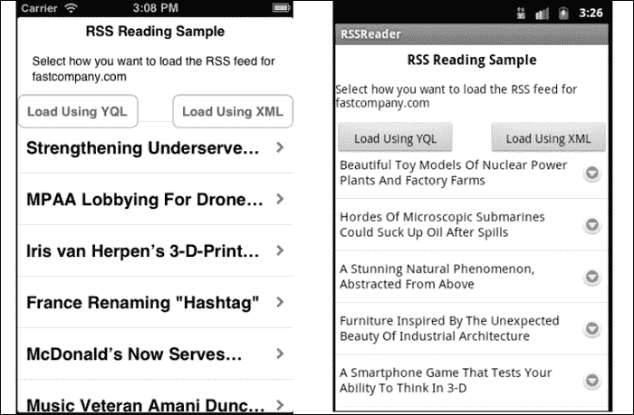
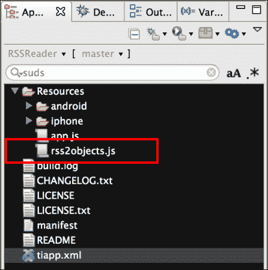
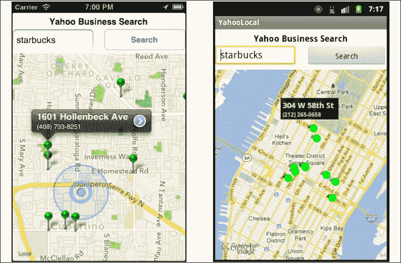
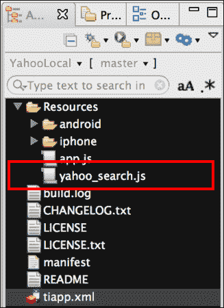
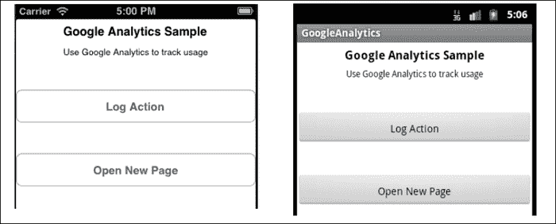
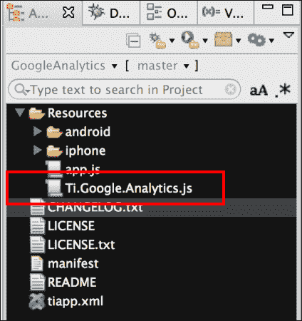
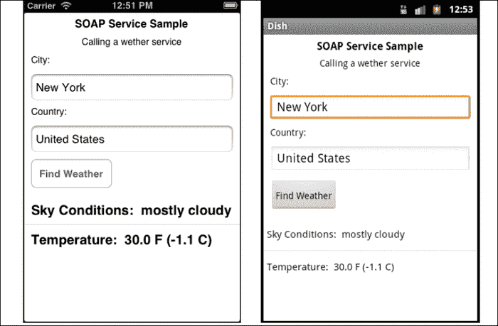
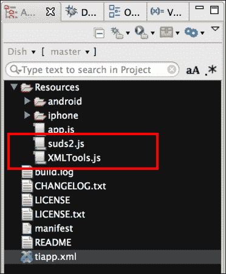
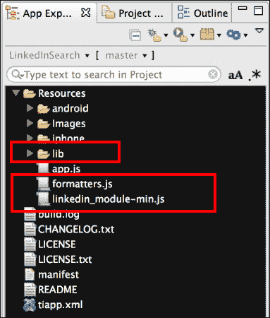

# 第四章. 与 Web 服务交互

在本章中，我们将涵盖：

+   消费 RSS 源

+   使用 Yahoo Local 创建业务位置地图

+   在您的应用中使用 Google Analytics

+   使用 SUDS.js 进行 SOAP 服务调用

+   使用 LinkedIn 联系人 API

# 简介

移动设备一直是企业空间和消费者空间中 Web 服务种类和数量增长的主要推动力。作为最终的断开连接客户端，移动应用重新激发了组织对**面向服务架构**（**SOA**）的兴趣，因为它们希望将现有的系统和功能扩展到移动客户。因此，您很少会找到一个不使用内部或第三方远程服务的企业应用。

本章演示了如何在构建企业应用时使用 SOAP 和 REST 调用与流行的第三方平台进行接口。

# 消费 RSS 源

在定期更新内容的企业应用中，使用 RSS 和 ATOM 源是很常见的。您可以使用本食谱中展示的技术来发布您组织或第三方的内容。许多公司使用这种方法为员工提供有关其组织或行业的最新新闻和更新。

在本食谱中，我们消费了来自[fastcompany.com](http://fastcompany.com)的 RSS 源，并在`Ti.UI.TableView`中显示，供用户查看并启动浏览器阅读详细信息。



## 准备工作

本食谱使用`rss2Objects` CommonJS 模块。此模块和其他代码资源可以从本书提供的源代码中下载。将此模块安装到您的项目中很简单。只需将`rss2objects.js`文件复制到您的项目中，如下面的截图所示：



## 如何操作...

一旦您将`rss2objects.js`文件添加到您的项目中，您需要在`app.js`文件中创建您的应用程序命名空间，并使用`require`将模块导入到您的代码中，如下面的代码块所示：

```js
//Create our application namespace
var my = {
  reader : require('rss2objects'),
  isAndroid : ( Ti.Platform.osname === 'android'),
  rssTestUrl : "http://www.fastcompany.com/rss.xml"
};
```

### 为示例应用创建用户界面

本食谱的演示应用提供了两个`Ti.UI.Button`控件来展示获取 RSS 结果的不同技术，以及一个`Ti.UI.TableView`来显示文章。

1.  首先，我们创建我们的`Ti.UI.Window`来附加所有 UI 元素：

    ```js
      var win = Ti.UI.createWindow({
        backgroundColor:'#fff'
      });
    ```

1.  接下来，创建一个按钮来演示如何使用 YQL 加载 RSS 源：

    ```js
      var yqlButton = Ti.UI.createButton({
        title:"Load Using YQL",left:0 , width: 140, height:40, top:90
      });
      win.add(yqlButton);
    ```

1.  然后添加一个按钮来演示如何使用 XML 解析加载 RSS 源：

    ```js
      var xmlButton = Ti.UI.createButton({
        title:"Load Using XML",right:0 , width: 140,height:40, top:90
      });
      win.add(xmlButton);
    ```

1.  最后，添加一个`Ti.TableView`来显示 RSS 文章：

    ```js
      var tableView = Ti.UI.createTableView({
        top:120, bottom: 0, width:Ti.UI.FILL
      });
      win.add(tableView);
    ```

### 使用 YQL 读取 RSS 源

使用 Yahoo 的 YQL 平台是读取 RSS 流的便捷方式。YQL 相比传统的 XML 解析有两个额外的好处。第一个好处是 YQL 会为您规范化输出。第二个好处是 Yahoo 会将 RSS 流转换为 JSON。YQL 的缺点是它需要通过 Yahoo 的服务器代理流，这会降低下载速度。

此代码片段演示了如何调用 `rss2Objects` 模块的 `yqlQuery` 方法。`yqlQuery` 方法接受两个参数：第一个是要读取的 RSS 流的 URL，第二个是用于提供流项目结果的回调。

```js
  yqlButton.addEventListener('click',function(e){
    my.reader.yqlQuery(my.rssTestUrl,rssResults);
  });
```

### 使用 XML 解析读取 RSS 流

`rss2Objects` 模块还提供了直接使用 XML 解析 RSS 流的能力。此选项为较大 RSS 流提供了最佳的下载性能。

要直接使用 XML 流，只需在 `rss2Objects` 模块上调用 `query` 方法。`query` 方法接受三个参数：

+   您想读取的 RSS 流的 URL。

+   一个可选的点查询语法，允许您提供您想要返回的节点路径。在下一个示例中，提供了 `channel.item`。这告诉 `query` 方法只从 `channel item` 元素列表返回节点。如果您想返回所有对象，只需将一个 null 值作为参数传递。

+   第三个参数是回调方法，模块将在处理完成后发送结果。

    ```js
    xmlButton.addEventListener('click',function(e){
      var queryPath = "channel.item";
      my.reader.query(my.rssTestUrl,queryPath,rssResults);
    });
    ```

### 显示文章

YQL 和 XML 解析演示都使用下面展示的回调方法。这个函数接收由 `rss2objects` 模块提供的对象字典，并为显示创建 `TableView` 行：

```js
  function rssResults(e){
```

1.  此函数中的参数 `e` 提供了来自 `rss2Objects` 模块的结果。第一步是检查是否成功返回了源。这通过检查 `e.success` 属性来完成，如下面的代码块所示：

    ```js
        if(!e.success){
          alert("Sorry we encountered an error");
          tableView.setData([]);
          return;
        };
        var items = e.rssDetails.items;
        var itemCount = items.length;
        var rows = [];
    ```

1.  接下来，所有 RSS 项目都会被循环遍历，并为每个项目构建一个 `Ti.UI.TableViewRow` 定义：

    ```js
        for (var iLoop=0;iLoop<itemCount ;iLoop++){
          rows.push({
            title: items[iLoop].title,
            article : items[iLoop],
            height: 60,
            hasChild:true,
            color:'#000'
          });
        }
    ```

1.  最后，在前面步骤中构建的文章行被添加到 `Ti.TableView` 以供显示：

    ```js
        tableView.setData(rows);
      };
    ```

## 它是如何工作的…

`rss2objects` 模块提供了一个简单的 API 用于读取 RSS 流。`rss2object.js` 模块提供的两个主要方法将在以下章节中详细介绍。

### 使用 yqlQuery 函数

`yqlQuery` 方法使用 Titanium 的内置 YQL 提供者将提供的 RSS 流 URL 解析为对象的字典：

```js
exports.yqlQuery = function(url,callback){
```

1.  `onComplete` 方法用作回调到 `Ti.Yahoo.yql` 函数。此方法将处理 YQL 结果，以供消费的标准格式。

    ```js
      function onComplete(e){
    ```

1.  参数 `e` 是由 YQL 提供的字典（包含 RSS 流查询的结果）。

    ```js
        var results = {
          success:false,
          rssDetails : {
            url: url, full : null, items:null
          }
        };
    ```

1.  检查 `e.success` 属性以确定 YQL 语句是否生成了错误。在 Android 上，您必须检查 `e.data` 属性是否为 `null`，而不是使用 `e.success` 属性。

    ```js
        //Determine if we have an error
        results.success =  !((_isAndroid && e.data == null)||(!_isAndroid && (e.data == null || e.success==false)));
    ```

1.  如果成功，将 `e.data.items` 添加到 `results.rssDetails.items` 数组中，该数组将作为后续的回调方法：

    ```js
        if(results.success){
          results.rssDetails.items = [];
          var itemCount = e.data.item.length;
          for (var iLoop=0;iLoop<itemCount ;iLoop++){
            results.rssDetails.items.push({
              //Add each field in our items
            });
          }
        }
    ```

1.  当调用 `yqlQuery` 模块方法时，将我们的 YQL 解析的 RSS 源的结果提供给最初使用的 `callback` 方法：

    ```js
        callback(results);
      };
    ```

1.  以下代码片段演示了一个 YQL 选择查询，该查询将从提供的 URL 参数的 RSS 源返回标题、链接、描述和其他列出的列：

    ```js
      var yQuery = 'SELECT title, link, description,';
        yQuery += ' pubDate,guid,author,comments,';
        yQuery += ' enclosure,source FROM rss WHERE url =';
        yQuery += '"' + url + '"';
    ```

1.  下面的代码块演示了使用 `Ti.Yahoo.yql` 方法运行查询并将结果发送到提供的 `onComplete` 回调函数：

    ```js
      Ti.Yahoo.yql(yQuery, onComplete);
    };
    ```

### 使用查询函数

`q` `uery` 方法使用 Titanium 的 `HTTPClient` 和 XML 模块来读取提供的 RSS URL，并将提供的 XML 转换为对象的字典：

```js
exports.query = function(url,pathQuery,callback){
  var workers = {
    results : {
      success:false,
      rssDetails : {
        url:url,full : null,items:null
      }
    },
```

1.  当 `query` 方法完成处理或出现错误时，将调用 `whenComplete` 函数。`whenComplete` 方法用于包装 `callback` 参数并提供查询结果。

    ```js
        whenComplete : function(){
         callback(workers.results);
        }
      };
    ```

1.  此部分菜谱采取的操作是创建一个 HTTP 客户端：

    ```js
      var xhr = Ti.Network.createHTTPClient();
    ```

1.  创建一个 `onload` 回调来检索 RSS 源提供的 HTTP 响应：

    ```js
      xhr.onload = function(e) {
    ```

1.  当请求返回时，使用 `responseXML` 属性从 RSS 源中收集 XML 结果：

    ```js
        var xml = this.responseXML;
    ```

1.  然后使用我们的辅助方法将 XML 结果转换为对象：

    ```js
        var objResults = helpers.parseToObjects (xml);
    ```

1.  如果转换的 XML 对象为 `null`，则使用回调方法通知用户该模块无法读取提供的 RSS 源：

    ```js
        if(objResults ==null){
          workers.whenComplete();
          return;
        }
    ```

1.  如果 XML 成功转换为对象，则使用完整的 XML 结果填充查询结果，并创建一个标志表示查询成功执行。

    ```js
        workers.results.rssDetails.full = objResults;
        workers.results.success = true;
        workers.results.rssDetails.items = objResults.item;
    ```

1.  如果提供了 `pathQuery` 字符串，则运行查询并使用 `queryByPath` 方法的输出更新 `results` 对象。

    ```js
        if(pathQuery!=null){
          workers.results.rssDetails.items = helpers.queryByPath(wobjResults,pathQuery);
        }
      };
    ```

1.  提供一个 `onerror` 回调来处理 `HTTPClient` 请求期间生成的错误。

    ```js
      xhr.onerror = function(e) {
        Ti.API.info(JSON.stringify(e));
        workers.whenComplete();
      };
    ```

1.  打开 HTTP 客户端并向提供的 RSS URL 发送一个 `GET` 请求。

    ```js
      xhr.open('GET', url);
      xhr.send();
    };
    ```

    ### 小贴士

    函数调用的顺序很重要。必须先调用 `open` 方法，然后再调用 `send` 方法，如前一个代码部分所示。

## 参见

+   要了解更多关于 YQL 的信息，请访问 Yahoo 开发者网站 [`developer.yahoo.com/yql`](http://developer.yahoo.com/yql)

+   有关 YQL 使用指南和速率信息，请访问 [`developer.yahoo.com/yql/guide/usage_info_limits.html`](http://developer.yahoo.com/yql/guide/usage_info_limits.html)

# 使用 Yahoo Local 创建商业位置地图

为企业应用提供商店、客户或其他位置列表功能是许多应用的一个常见需求。在这个菜谱中，我们将展示如何使用 Yahoo Local 搜索 API 和 `Ti.Map.View` 来提供商店定位器。为了演示目的，这个菜谱使用 Yahoo API 提供了美国流行咖啡连锁店星巴克的定位搜索结果。每个位置的搜索结果随后显示在 `Ti.Map.View` 上，如下面的截图所示：



## 准备工作

此配方使用 Yahoo Search CommonJS 模块。此模块和其他代码资产可以从本书提供的源代码中下载。将此模块安装到您的项目中很简单。只需将 `yahoo_search.js` 文件添加到您的项目中，如下面的截图所示：



## 如何操作...

一旦将 `yahoo_search.js` 文件添加到您的项目中，您需要在 `app.js` 文件中创建您的应用程序命名空间，并使用 `require` 将模块导入到您的代码中，如下面的代码块所示：

```js
//Create our application namespace
var my = {
  search : require('yahoo_search'),
  isAndroid : ( Ti.Platform.osname === 'android')
};
```

### 添加您的 API 密钥

我们配方中的下一步是添加您的 Yahoo 开发者 API 密钥。以下代码片段显示了如何将 API 密钥注册到模块中：

```js
my.search.addAPIKey('YOUR_KEY_GOES_HERE');
```

### 创建示例应用程序的 UI

此配方使用一个简单的用户界面，包含 `Ti.UI.TextField`、`Ti.Map.View` 和 `Ti.UI.Button` 来搜索。在这里，我们展示了这些 UI 元素的创建。

1.  首先，我们创建一个 `Ti.UI.Window` 来附加我们的视觉元素。

    ```js
      var win = Ti.UI.createWindow({
        backgroundColor:'#fff'
      });
    ```

1.  接下来，我们添加一个文本字段，允许用户输入要搜索的业务名称。

    ```js
      var txtSubject = Ti.UI.createTextField({
        left:0, width:150, height:40,top:30,
        hintText:'Enter Business Name',
        borderStyle:Ti.UI.INPUT_BORDERSTYLE_ROUNDED
      });
      win.add(txtSubject);
    ```

1.  接下来，添加一个按钮，允许用户搜索在文本字段中输入的业务名称。

    ```js
      var searchButton = Ti.UI.createButton({
        title:'Search', right:0, width:150, height:40,top:30	
      });
      win.add(searchButton);
    ```

1.  最后，附加一个地图视图来显示我们的搜索结果。

    ```js
      var mapView = Ti.Map.createView({
        mapType: Ti.Map.STANDARD_TYPE, width:Ti.UI.FILL,
        userLocation:true, top:75,bottom:0
      });
      win.add(mapView);
    ```

### 更新地图

`updateMap` 函数是搜索模块的回调方法。`updateMap` 提供搜索结果，并将其转换为用户显示。

```js
  function updateMap(e){
```

1.  搜索结果作为方法的 `e` 参数提供。过程的第一步是检查搜索是否成功，通过检查 `e.success` 属性。

    ```js
        if(!e.success){
          alert("Sorry we encountered an error");
          return;
        }
    ```

1.  在验证搜索成功后，使用循环为结果中提供的每个 `e.item` 创建地图标注。

    ```js
        var points = [], itemCount = e.items.length, rightBtn = Ti.UI.iPhone.SystemButton.DISCLOSURE;
        for (var iLoop=0;iLoop<itemCount;iLoop++){
          points.push(Ti.Map.createAnnotation({
            latitude : e.items[iLoop].Latitude,
              longitude : e.items[iLoop].Longitude,
              title : e.items[iLoop].Address,
              subtitle : e.items[iLoop].Phone,
              pincolor : Ti.Map.ANNOTATION_GREEN,
              ClickUrl : items[iLoop].ClickUrl,
              animate:true, rightButton: rightBtn
          }));
        }

        var currentRegion = { latitude:e.latitude, longitude:e.longitude, latitudeDelta:0.04, longitudeDelta:0.04};
    ```

1.  使用搜索坐标创建新的区域对象，并将其应用于设置地图的查看点。这使用户能够看到添加的所有标记。

    ```js
          mapView.setLocation(currentRegion);
          mapView.regionFit = true;
    ```

1.  最后，将包含所有标注的 points 数组添加到 `mapView`。

    ```js
        mapView.annotations = points;
      };
    ```

### 搜索

当按下 `searchButton` 按钮时，以下代码片段用于使用设备的坐标执行位置搜索。

```js
  searchButton.addEventListener('click',function(e){
```

1.  首先，删除任何现有的地图标记

    ```js
        mapView.removeAllAnnotations();
    ```

1.  如果文本字段的键盘是打开的，则调用 `blur` 方法来关闭它。

    ```js
        txtSubject.blur();
    ```

1.  为了避免空搜索，检查文本字段以确保它包含一个值。

    ```js
        if((txtSubject.value+'').length ===0){
          alert('Enter a business to search');
          return;
        }
    ```

1.  然后调用模块的 `currentLocationQuery` 方法，提供在文本字段中输入的业务名称和用作回调的 `updateMap` 函数。

    ```js
        my.search.currentLocationQuery(txtSubject.value,updateMap);
      });
    ```

## 工作原理...

Yahoo Search CommonJS 模块 (`yahoo_search.js`) 提供以下公共函数，详细说明如下。

### 使用 addAPIKey 为您的 Yahoo 服务密钥

Yahoo Local 搜索 API 需要一个开发者密钥。在使用任何查询方法之前，您必须首先使用 `addAPIKey` 将您的开发者密钥与模块关联。

```js
my.search.addAPIKey('YOUR_KEY_GOES_HERE');
```

### 小贴士

您可以通过访问 [developer.yahoo.com](http://developer.yahoo.com) 并在他们的开发者门户中创建一个项目来获取 Yahoo API 密钥。

### 使用 geoQuery 方法

`geoQuery`函数使用提供的纬度、经度和主题执行 Yahoo Local 搜索。下一个示例演示了如何在纽约市的时代广场附近搜索星巴克的位置。当搜索完成后，结果将提供给`callback`函数。

```js
my.search.geoQuery(40.75773, -73.985708,'starbucks',callback);
```

### 使用 currentLocationQuery 方法

`currentLocationQuery`方法使用您的设备的位置服务来确定您的当前纬度和经度。然后，它为`geoQuery`函数提供所需的搜索详细信息。下一行代码演示了如何搜索您当前位置附近的星巴克分店。一旦搜索完成，结果将提供给`callback`函数。

```js
my.search.currentLocationQuery('starbucks',callback);
```

# 在您的应用中使用 Google Analytics

Google Analytics 是一种流行的服务，用于衡量和记录网站流量和活动。很可能会使用 Google Analytics 或类似的服务来收集您网站访问者的分析数据。通过钛模块，您可以在您的应用中使用相同的 Google Analytics 平台。这种方法允许您在一个易于使用的仪表板中查看您的移动和网页流量。

在本菜谱中，我们将演示如何将“页面查看”和“操作”事件提交到您的 Google Analytics 仪表板。



## 准备工作

本菜谱使用`Ti.Google.Analytics` CommonJS 模块。此模块和其他代码资源可以从本书提供的源代码中下载，或者通过本菜谱末尾的“另请参阅”部分提供的链接单独下载。将此模块安装到您的项目中很简单。只需将`Ti.Google.Analytics.js`文件复制到您的项目中，如下面的截图所示：



## 如何操作…

一旦您将`Ti.Google.Analytics.js`文件添加到您的项目中，您需要在`app.js`文件中创建您的应用程序命名空间，并使用`require`将模块导入到您的代码中，如下面的代码块所示：

```js
//Create our application namespace
var my = {
  gAnalyticsModule : require('Ti.Google.Analytics'),
  isAndroid : (Ti.Platform.osname === 'android'),
  session:{}
};
```

### 创建模块的实例

菜谱的下一步需要您拥有一个 Google Analytics 密钥。要获取密钥，请注册您的应用至 [www.google.com/analytics](http://www.google.com/analytics)。一旦您有了密钥，您需要创建`Analytics`模块的新实例，并提供您的分析密钥，如下所示：

```js
my.session.ga = new my.gaModule('YOUR_KEY_HERE');
```

### 辅助函数

辅助函数有助于提供有关用户设备更有意义的信息。这些函数在每次触发`PageView`操作时都会在整个菜谱中使用。

1.  下面的代码片段演示了如何在启动应用程序时将`isTablet`属性附加到应用程序命名空间。该属性被其他函数用来指示应用程序是在手机还是平板电脑上运行。

    ```js
    my.isTablet = (function() {
      var tabletCheck = Ti.Platform.osname === 'ipad' || 
        (Ti.Platform.osname === 'android' && 
        (!(Math.min(
          Ti.Platform.displayCaps.platformHeight,
          Ti.Platform.displayCaps.platformWidth
        ) < 700)));

      return tabletCheck;
    })();
    ```

1.  `basePage`属性以类似于网站路由的方式工作，并将 URL 的第一部分（发送到 Google）设置为设备指示器。在 Google Analytics 中，这将允许您通过设备更好地细分使用模式。

    ```js
    my.basePage = (function(){
      if(my.isAndroid){
        return ((my.isTablet)? 
        'AndroidTablet' : 'AndroidPhone');
      }else{
        //Return iPhone or iPad
        return Ti.Platform.model;
      }
    })();
    ```

### 开始记录事件

下一步是调用`start`方法。这将使模块开始收集分析请求。`start`方法接受一个整数值，表示您希望模块多久发送一次排队到 Google 的分析请求。这由模块内部使用间隔计时器处理。

```js
my.session.ga.start(10);
```

### 创建我们的示例 UI

本节概述了用于触发和提交 Google Analytics 请求的示例 UI。

1.  首先，创建一个`Ti.UI.Window`来锚定所有 UI 控件。

    ```js
      var win = Ti.UI.createWindow({
        backgroundColor:'#fff', layout:'vertical'
      });
    ```

1.  在创建我们的窗口后，添加了两个`Ti.UI.Button`控件。这些按钮将在后面的菜谱中用于演示如何创建`trackEvent`或`Pageview`事件。

    ```js
      var button1 = Ti.UI.createButton({
          title: 'Log Action', top:40, height:45, width:Ti.UI.FILL
      });
      win.add(button1);

      var button2 = Ti.UI.createButton({
        title: 'Open New Page', top:40, height:45, width:Ti.UI.FILL
      });
      win.add(button2);
    ```

### 记录一个动作

`trackEvent`函数允许您向 Google Analytics 发布细粒度的事件跟踪。此方法需要以下参数，这些参数将用于将操作发布到您的 Google Analytics 仪表板：

+   **类别**：通常是与之交互的对象（例如，按钮）

+   **动作**：交互类型（例如，点击）

+   **标签**：用于对事件进行分类（例如，导航按钮）

+   **值**：值必须是非负数。用于传递计数（例如，四次）

下一个片段演示了在按下`button1`时如何调用`trackEvent`方法。当按钮的点击事件触发时，`trackEvent`方法会以`button`类别、`click`动作、`recipe_button`标签和`trigger_event`值被调用。

```js
  button1.addEventListener('click',function(e){
    my.session.ga.trackEvent('button','click', 'win_button', 'trigger_event');
  });
```

### 打开窗口时的 Pageview 函数

使用`trackPageview`函数来模拟在您的 Google Analytics 仪表板中显示的页面流量或查看次数。使用之前创建的`basePage`属性，您可以通过以下代码块中显示的约定创建特定于设备的窗口跟踪：

```js
  win.addEventListener('open',function(e){
    my.session.ga.trackPageview(my.basePage + "/Main");
  });
  win.open();
```

### 子窗口上的 Pageview 函数

本菜谱的以下部分演示了如何使用`trackPageview`和`trackEvent`方法记录何时以及如何打开子窗口或视图。当用户按下`button2`并触发点击事件时，Google Analytics 模块用于记录导航过程的每个步骤。

```js
  button2.addEventListener('click',function(e){
```

1.  使用`trackEvent`方法记录按下打开子窗口的按钮：

    ```js
      my.session.ga.trackEvent('button','click', 'win_button', 'open_win2');
    ```

    您需要向`trackEvent`方法提供以下参数：

    +   **类别**：本示例中提供了`button`类别值

    +   **动作**：本示例中提供了`click`动作值

    +   **标签**：本示例中提供了`win_button`标签值

    +   **值**：本示例中提供了`open_win2`值

1.  创建一个新的窗口来演示在子窗口上`trackPageview`功能。

    ```js
        var win2 = Ti.UI.createWindow({
          backgroundColor:'yellow', layout:'vertical'
        });
    ```

1.  在`win2`窗口加载时，会调用`trackPageview`方法，记录个人已查看该页面。`my.basePage`用于创建一个路由，显示哪种类型的设备访问了`/win2`窗口。

    ```js
        win2.addEventListener('open',function(e){
          my.session.ga.trackPageview(my.basePage + "/win2");
        });
        win2.open({modal:true});
      });
    ```

## 参见

+   这个配方使用 Roger Chapman 的 Titanium Mobile Google Analytics 模块的修改版本。要了解更多关于这个模块的信息，请访问[`github.com/rogchap/Titanium-Google-Analytics`](http://github.com/rogchap/Titanium-Google-Analytics)。

+   关于检测不同设备特性的更多信息，请参阅第一章中的*使用平台指示器*配方，*模式和平台工具*。

# 使用 SUDS.js 调用 SOAP 服务

在许多企业市场细分领域，SOAP 服务仍然是主导的 Web 服务协议。由于 SOAP 通常通过 HTTP 实现，大多数网络客户端，包括 Titanium 的`Ti.Network`，都可以有效地与该协议交互。

即使使用 Titanium 的`Ti.Network`模块与 SOAP 一起工作，信封和 XML 结果也可能具有挑战性，通常需要创建一个 SOAP 信封和大量的 XML 操作。这个配方演示了几个开源模块如何提高你与 SOAP 服务和它们的 XML 结果交互时的生产力。

为了帮助说明如何与 SOAP 服务交互，这个配方使用[www.webserviceX.NET](http://www.webserviceX.NET)天气 SOAP 服务来返回在**城市：**字段中输入的城市天气结果，如下面的截图所示：



## 准备中

这个配方使用`SUDS`和`XMLTools`CommonJS 模块。这些模块和其他代码资产可以从本书提供的源代码中下载，或者通过此配方末尾的*参见*部分提供的链接单独下载。安装这些模块很简单，只需将`suds2.js`和`XMLTools.js`文件复制到你的 Titanium 项目中，如下面的截图所示：



## 如何做到这一点…

一旦你将`suds2.js`和`XMLTools.js`模块添加到你的项目中，你需要在`app.js`文件中创建你的应用程序命名空间，并使用`require`将模块导入到你的代码中，如下面的代码片段所示：

```js
//Create our application namespace
var my = {
  suds : require('suds2'),
  xmlTools : require("XMLTools"),
  isAndroid : (Ti.Platform.osname === 'android')
};
```

### SOAP 辅助方法

除了之前导入的两个 CommonJS 模块之外，这个配方还使用`soapHelper`对象来处理格式化和配置活动。

```js
var soapHelper = {
```

1.  配置对象包含`suds.js`返回 XML 结果所需的所有配置细节：

    ```js
      config : {
        endpoint:"http://www.webservicex.com/globalweather.asmx";  targetNamespace: 'http://www.webserviceX.NET/',
        includeNS : false,
        addTargetSchema : true 
      },
    ```

1.  `resultParser`对象用于将返回的 XML 结果格式化为 JavaScript 对象：

    ```js
      resultParser : {
    ```

1.  `removeHeader`对象用于删除 XML 头节点。Android 要求在`parseString`函数正确创建 XML 文档对象之前删除头。

    ```js
        removeHeader : function(text){
          return text.replace(
            '<?xml version="1.0" encoding="utf-16"?>',''); 
        },
    ```

1.  `xmlToObject` 函数将 `Ti.XML.Document` 对象转换为 JavaScript 对象。

    ```js
        xmlToObject : function(doc){
    ```

1.  第一步是获取 `GetWeatherResponse` 标签的 `Ti.XML.Nodelist`。

    ```js
    var results = doc.documentElement.getElementsByTagName(
     'GetWeatherResponse');
    ```

1.  Android 和 iOS 处理转换过程的方式不同。使用 `my.isAndroid` 属性来分支转换逻辑。

    ```js
    if(my.isAndroid){
    ```

1.  天气服务结果包含一个嵌套的 XML 文档。以下示例演示了如何从 `GetWeatherResponse` 节点读取嵌入的 XML 文档到新的 `Ti.XML.Document`。使用 `removeHeader` 函数来修复 `textContent` 值，以符合 Android 的 `XML Document` 格式。

    ```js
    var docCurrent =Ti.XML.parseString(
      soapHelper.resultParser.removeHeader(
      results.item(0).textContent));
    ```

1.  接下来，将 `Ti.XML.Document` 对象提供给 `XMLTools` 模块的构造函数，然后使用 `toObject` 方法将其转换为 JavaScript 对象，如下面的代码片段所示：

    ```js
          return new my.xmlTools(docCurrent).toObject();
        }else{
    ```

1.  在 iOS 上，我们使用 `getChildNodes` 函数来获取天气子节点：

    ```js
        var weather =results.item(0).getChildNodes()
          .item(0).getChildNodes();
    ```

1.  将天气节点的 XML 字符串加载到 `XMLTools` 模块的构造函数中，然后使用 `toObject` 方法将其转换为 JavaScript 对象，如下面的代码块所示：

    ```js
            var docCurrentFromString = Ti.XML.parseString(soapHelper.resultParser.removeHeader(weather.item(0).textContent));
            return new my.xmlTools(docCurrentFromString).toObject();
          }
        }
      }
    };
    ```

### 创建 UI

本节概述了用于调用和显示天气 SOAP 服务结果的示例 UI。

1.  为所有 UI 元素创建一个新的 `Ti.UI.Window`。

    ```js
      var win = Ti.UI.createWindow({
        backgroundColor:'#fff', layout:'vertical'
      });
    ```

1.  文本字段 `txtCity` 允许用户输入他们希望显示天气的城市。

    ```js
      var txtCity = Ti.UI.createTextField({
          value:'New York', hintText:'Enter city',top:10, height:40, left:10, right:10,textAlign:'left', borderStyle:Ti.UI.INPUT_BORDERSTYLE_ROUNDED 
      });
      win.add(txtCity);
    ```

1.  文本字段 `txtCountry` 允许用户输入城市所属的国家名称。

    ```js
      var txtCountry = Ti.UI.createTextField({
        value:'United States', hintText:'Enter country',top:10, height:40, left:10, right:10, textAlign:'left', borderStyle:Ti.UI.INPUT_BORDERSTYLE_ROUNDED 
      });
      win.add(txtCountry);
    ```

1.  `goButton` 是一个 `Ti.UI.Button`，用于调用天气 SOAP 服务。

    ```js
      var goButton = Ti.UI.createButton({
        title:'Find Weather', left:10, top:10
      });
      win.add(goButton);
    ```

1.  `tableView` 是一个 `Ti.UI.TableView`，用于显示 SOAP 服务的输出结果。

    ```js
      var tableView = Ti.UI.createTableView({
        visible : false, top:10, height:100, width:Ti.UI.FILL
      });
      win.add(tableView);
    ```

### `uiHelpers` 对象

`uiHelpers` 对象用于根据应用的不同状态更新 UI 对象，以及使用 SOAP 服务的结果加载 `tableView`。

```js
var uiHelpers = {
```

`updateUI` 用于格式化 SOAP 服务返回的对象结果以进行显示。

```js
  updateUI : function(weather){
    var data = [];
    tableView.visible = true;
    data.push({title: "Sky Conditions: " + weather.SkyConditions, color:'#000'});
    data.push({title: "Temperature: " + weather.Temperature, color:'#000'});
    data.push({title: "Time: " + weather.Time});
    tableView.setData(data);	
  };
```

`resetUI` 方法用于在 `SUDS` 调用 web 服务时隐藏 `tableView` 对用户可见。此方法还用于在 `SUDS` 调用导致错误时隐藏 `tableView`。

```js
  resetUI :function(){
    tableView.visible = false;
  };
};
```

### 调用 SOAP 服务

在 `goButton` 上的点击事件用于执行天气 SOAP 服务调用。

```js
goButton.addEventListener('click',function(e){
```

1.  首先调用 `resetUI` 方法来隐藏 `tableView`，在调用服务的过程中。

    ```js
      uiHelpers.resetUI()
    ```

1.  使用之前在 `soapHelper.config` 对象中定义的配置信息创建一个新的 `sudsClient` 实例。

    ```js
      var sudsClient = new my.suds(soapHelper.config);
    ```

1.  然后在 `sudsClient` 上调用 `invoke` 方法。提供的第一个参数是 `suds` 应该调用的 SOAP 方法。

    ```js
      sudsClient.invoke('GetWeather', 
    ```

1.  提供给 `sudsClient` 的第二个参数是用户请求的城市和国家名称，以检索天气信息。

    ```js
      {
        CityName: txtCity.value,
        CountryName: txtCountry.value
      }, 
    ```

1.  `invoke` 方法的最后一个参数是回调方法 `SUDS`。此回调方法将提供一个包含服务结果的 `Ti.XML.Document`。以下示例演示了使用内联函数作为回调方法：

    ```js
      function(xml) {
    ```

1.  内联回调方法将在服务完成后接收一个`Ti.XML.Document`。一旦接收，结果将使用前面在菜谱中详细说明的`resultParser`对象解析为 JavaScript 对象。

    ```js
        var weather = soapHelper.resultParser.xml2Object(xml);
    ```

1.  将`Status`属性更改在解析的对象上，以确定是否已成功创建了天气对象。

    ```js
        if(weather.Status==='Success'){
    ```

1.  如果服务结果已成功转换为对象，它们将被提供给`updateUI`方法，以向用户显示。

    ```js
          uiHelpers.updateUI(weather);
        }else{
    ```

1.  如果在调用服务或处理结果时发生错误，我们将向用户发出警报，然后隐藏`tableView`显示对象。

    ```js
          alert("Sorry a problem happened");
          uiHelpers.resetUI();
        }
      });
    });
    ```

## 参考信息

+   请查看以下链接，以了解更多关于本菜谱中使用的开源项目的信息：

    +   **SUDS.js**：有关 SUDS.js 的更多信息，请访问[`github.com/kwhinnery/Suds`](http://github.com/kwhinnery/Suds)。

    +   **SUDS2.js**：有关本菜谱中使用的 SUDS.js 版本的更多信息，请访问[`github.com/benbahrenburg/Suds2`](http://github.com/benbahrenburg/Suds2)。

    +   **XMLTools**：本菜谱使用了 David Bankier 创建的 XMLTools 模块。有关此模块的更多信息，请访问[`github.com/dbankier/XMLTools-For-Appcelerator-Titanium`](http://github.com/dbankier/XMLTools-For-Appcelerator-Titanium)。

# 使用 LinkedIn 联系人 API

LinkedIn 是一个流行的专业社交网络网站。LinkedIn API 为你的应用程序提供了丰富的集成服务。对于面向企业的应用程序，LinkedIn 的某些功能，如消息和联系人，可能至关重要。常见的例子包括为销售代表提供访问应用程序内联系人的权限。

本菜谱演示了如何以可搜索的方式将 LinkedIn 联系人 API 集成到你的 Titanium 应用程序中。


## 准备工作

本菜谱使用了几个模块，包括创新的 LinkedIn 模块`linkedin_module-min.js`。此模块和其他代码资产可以从本书提供的源代码中下载，或者通过本菜谱末尾的“参考信息”部分提供的链接单独下载。设置本菜谱的依赖项很简单。首先，将`lib`文件夹复制到你的 Titanium 项目的`Resources`文件夹中，然后，将`copy formatters.js`和`linkedin_module-min.js`文件复制到`Resources`文件夹中，如下面的截图所示：



## 如何操作…

在设置好菜谱的依赖项之后，下一步是在`app.js`文件中创建你的应用程序命名空间，并使用`require`将模块导入到你的代码中，如下面的代码片段所示：

```js
//Create our application namespace
var my = {
  isAndroid : (Ti.Platform.osname === 'android'),
  linkedMod: require('linkedin_module-min'),
  formatters : require('formatters')
};
```

### 添加你的 API 密钥和密钥

使用 LinkedIn 模块的第一步是在 [`www.linkedin.com/secure/developer`](https://www.linkedin.com/secure/developer) 创建 LinkedIn 应用程序。一旦注册了您的应用程序，LinkedIn 将为您提供与他们的 API 交互所需的 API 和认证密钥。本食谱中使用的所有 API 都需要 `OAuth 1.0a` 认证来连接。LinkedIn 模块将通过使用 `init` 方法注册您的密钥和 API 密钥来为您处理此操作，如下面的示例所示：

```js
my.linkedMod.init('YOUR_SECRET_KEY', 'YOUR_API_KEY');
```

### 小贴士

在使用模块的任何功能之前，您必须使用 `init` 方法设置您的密钥和 API 密钥。

### 添加权限

默认情况下，如果没有指定权限，您的应用程序将只有读取当前用户基本“数字名片”信息的权利。由于本食谱需要访问用户的联系人信息，我们必须调用 `addPermission` 方法来请求 `r_network` 权限，如下面的代码片段所示：

```js
my.linkedMod.addPermission('r_network');
```

要添加多个权限，只需多次调用 `addPermission` 方法。以下代码片段显示了如何将完整配置文件访问权限添加到应用程序中：

```js
my.linkedMod.addPermission('r_fullprofile');
```

### 小贴士

要查看所有权限的完整列表，请访问 [`developer.linkedin.com/documents/authentication`](https://developer.linkedin.com/documents/authentication)。

### 创建 UI

本食谱的这一部分概述了如何创建用于显示和搜索 LinkedIn 联系人的 UI。

1.  首先，创建一个 `Ti.UI.Window`。这将用于附加所有我们的视觉元素，并在打开事件触发时调用 LinkedIn API。

    ```js
      var win = Ti.UI.createWindow({
        backgroundColor:'#fff'
      });
    ```

1.  然后创建一个 `Ti.UI.SearchBar`。搜索栏控件提供了一个搜索框，可以过滤 `Ti.UI.TableView` 的内容。在本食谱中，我们使用搜索栏控件按姓氏过滤用户的 LinkedIn 联系人。

    ```js
      var search = Ti.UI.createSearchBar({
        barColor:'#385292', showCancel:true, hintText:'Search'
      });
    ```

1.  最后添加到 `Ti.UI.Window` 的 UI 组件是 `Ti.UI.TableView`，它将用于显示用户的 LinkedIn 联系人。

    ```js
      var tableView = Ti.UI.createTableView({
        height:Ti.UI.FILL, width:Ti.UI.FILL, search:search, filterAttribute:'lastName'
      });
      win.add(tableView);
    ```

### 加载您的 LinkedIn 联系人

下一个代码片段演示了如何使用 LinkedIn 模块在 `Ti.UI.Window` 窗口加载时加载联系人列表。

```js
  win.addEventListener('open',function(e){
```

1.  使用 `uiHelper.createWaitMsg` 方法向用户显示加载信息。

    ```js
        uiHelpers.createWaitMsg('Loading please wait...');
    ```

1.  使用模块的 `getConnections` 方法从 LinkedIn API 中查询用户的联系人。在下一个示例中，使用内联函数作为回调，将用户联系人作为 `_e` 变量返回。

    ```js
        my.linkedMod.getConnections(function(_e) {
    ```

1.  使用 `uiHelpers.displayContacts` 方法来格式化和应用返回的联系人以进行显示。

    ```js
          uiHelpers.displayContacts(_e);
        });
      });

      win.open();
    ```

### 使用 uiHelpers 对象格式化结果

`uiHelpers` 对象用于格式化 LinkedIn 联系人 API 的结果以进行显示。

```js
var uiHelpers = {
```

1.  `createWaitMsg` 函数用于在调用 LinkedIn API 时在 `tableView` 中显示等待信息。

    ```js
      createWaitMsg : function(msg){
        tableView.setData([{title:msg}]);
      },
    ```

1.  `displayContacts` 方法是用于转换和显示 API 结果的主要方法。

    ```js
      displayContacts : function(apiResults){
    ```

1.  更新 `tableView` 以提醒用户我们现在正在加载他们的联系人。

    ```js
        uiHelpers.createWaitMsg('Loading contacts please wait...');
    ```

1.  调用`convertToObject`方法将 LinkedIn XML 结果转换为更易于管理的 JavaScript 对象。

    ```js
        var resultAsObjects =  my.resultParser.convertToObjects(apiResults);
    ```

1.  如果转换结果为`null`，向用户显示错误消息。

    ```js
        if(resultAsObjects == null){
          alert('Sorry we ran into an error');
          return;
        }
    ```

1.  使用`formatter.createContactTableRows`函数，将 JavaScript 对象格式化为本食谱截图 earlier 中显示的`Ti.UI.TableViewRow`布局。然后，使用格式化后的行更新`tableView`。

    ```js
        tableView.setData(my.formatters.createContactTableRows( resultAsObjects)
        );
      }
    };
    ```

### 解析 LinkedIn API 结果

使用`resultParser`对象将 LinkedIn API 提供的 XML 解析为更易于管理的 JavaScript 对象。

```js
my.resultParser = {
```

1.  使用`getText`函数从提供的`Ti.XML.Element`返回一个特定键。如果没有找到键，则返回一个 null 值。

    ```js
      getText : function(item, key) {
        var searchItem = item.getElementsByTagName(key).item(0);
        return ((searchItem == null)? null : searchItem.textContent);
      },
    ```

1.  使用`getQueryParams`函数来返回一个包含提供 URL 的所有查询字符串参数的对象。

    ```js
      getQueryParams : function(url){
        var params = {};
        url = url.substring(url.indexOf('?')+1).split('&');
        var pair, d = decodeURIComponent;
        for (var i = url.length - 1; i >= 0; i--) {
          pair = url[i].split('=');
          params[d(pair[0])] = d(pair[1]);
        }
        return params;
      },
    ```

1.  `formatUrl`函数返回联系人的个人资料 URL。如果无法确定 URL，则提供一个到[linkedin.com](http://linkedin.com)的链接。

    ```js
      formatUrl : function(findKey){
        return ((findKey.hasOwnProperty("key")) ? ("http://www.linkedin.com/profile/view?id=" + findKey.key) : "http://www.linkedin.com");
      },
    ```

1.  使用`getProfileUrl`函数来返回联系人的个人资料 URL。由于 LinkedIn API 不提供此信息，通过解析`site-standard-profile-request`节点以获取关键细节来生成一个 URL。以下代码片段展示了如何构建此 URL：

    ```js
      getProfileUrl : function(item) {
        var searchItem = item.getElementsByTagName("site-standard-profile-request").item(0);
        if(searchItem == null){
          return null;
        }
        if(searchItem.hasChildNodes()){
          var findKey = my.resultParser.getQueryParams(searchItem.getElementsByTagName('url').item(0).textContent);
          return my.resultParser.formatUrl(findKey);
        }else{
          return null;
        }
      },
    ```

1.  使用`isPublic`函数来确定联系人的信息是否公开。如果个人资料不是公开的，我们不会将其添加到显示的联系人列表中。

    ```js
      isPublic : function(item){
        return !((my.resultParser.getProfileUrl(item)==null));
      },
    ```

1.  `convertToObjects`是负责将 LinkedIn 联系人 XML 转换为 JavaScript 对象的主要方法。

    ```js
      convertToObjects : function(xmlString){
        var contacts = [];
    ```

1.  首先，将 API 提供的 XML 字符串加载到`Ti.XML.Document`中。

    ```js
        var doc = Ti.XML.parseString(xmlString);
    ```

1.  获取所有在`person`标签下的 XML 节点。

    ```js
        var items = doc.documentElement.getElementsByTagName("person");
    ```

1.  开始遍历`person`标签下的每个节点。

    ```js
        for (var i = 0; i < items.length; i++) {
    ```

1.  检查个人资料是否公开。

    ```js
          if(my.resultParser.isPublic(items.item(i))){
    ```

1.  如果个人资料是公开的，则使用来自`Ti.XML.Node`的属性创建一个 JavaScript 对象。

    ```js
            contacts.push({
              id : my.resultParser.getText(items.item(i), 'id'), headLine : my.resultParser.getText(items.item(i), 'headline'),
              firstName : my.resultParser.getText(items.item(i), 'first-name'),
              lastName : my.resultParser.getText(items.item(i), 'last-name'),
              pictureUrl : my.resultParser.getText(items.item(i), 'picture-url'),
              profileUrl : my.resultParser.getProfileUrl(items.item(i))
            });
          }
        }
    ```

1.  对于拥有大量联系人的个人来说，这个转换过程可能会消耗大量内存。为了帮助减少内存中变量的数量，我们在返回转换后的结果之前将所有临时对象设置为`null`。

    ```js
        doc = null, xmlString = null;
        return contacts;
      }
    };
    ```

## 参见

+   本食谱使用由 Aaron Saunders 在[clearlyinnovative.com](http://clearlyinnovative.com)创建的`clearlyinnovative.linkedIn`模块。有关模块的附加文档、示例和指导，请访问[`www.clearlyinnovative.com/blog/post/12521419647/titanium-appcelerator-quickie-linkedin-api-integration`](http://www.clearlyinnovative.com/blog/post/12521419647/titanium-appcelerator-quickie-linkedin-api-integration)。要下载模块的源代码，请访问 GitHub 上的项目，在[`github.com/aaronksaunders/clearlyinnovative.linkedIn`](http://github.com/aaronksaunders/clearlyinnovative.linkedIn)。
