# 第六章 使用位置服务

在本章中，我们将涵盖：

+   使用 basicGeo 进行原生地理位置

+   使用 Ti.GeoProviders 框架进行地理位置

+   多租户地理位置

+   计算地址之间的距离

+   背景地理位置管理

# 简介

在移动设备普及之前，往往很难确定用户的位置，这使得提供基于位置的服务变得困难。现在，几乎每个应用开发者都可以直接从用户的设备中获取实时地理位置信息。

由于当今员工的全局移动性，为您的企业提供具有位置感知的应用程序与消费市场一样重要，甚至更为重要。地理位置在包括车队管理、货物运输跟踪、销售路线规划或为移动员工提供实时相关资源信息在内的多个领域的企业组织中发挥着重要作用。

通过一系列位置服务示例，本章概述了您可以在您的企业钛金应用中利用的各种不同方法。

# 使用 basicGeo 进行原生地理位置

安卓和 iOS 都提供了强大的地理位置平台 API，用于查找给定地址的地理纬度和经度。您可以使用`basicGeo`模块在您的钛金模块中访问这些平台 API。

本食谱讨论了如何在您的钛金应用中利用此模块执行正向和反向地理位置操作。以下截图展示了此食谱在 iPhone 和安卓设备上的运行情况：

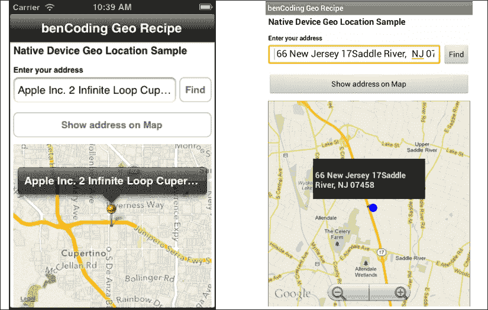

## 准备工作

本食谱使用`benCode.basicGeo`原生模块。此模块可以从本书提供的源代码中下载，或者通过本食谱末尾的“另请参阅”部分提供的链接单独下载。将这些模块安装到您的项目中很简单。只需将`modules`文件夹复制到您的项目中，如以下截图所示：

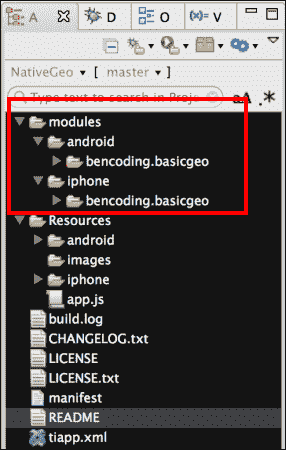

在复制`modules`文件夹后，您需要在 Titanium Studio 中单击您的**tiapp.xml**文件，并添加对`bencoding.basicgeo`模块的引用，如下截图所示：

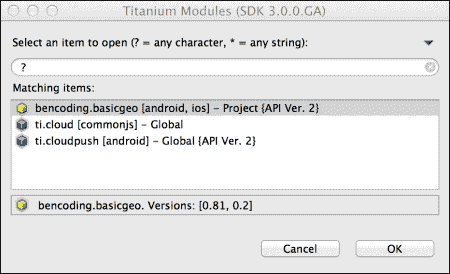

## 如何操作...

一旦您将`bencoding.basicgeo`模块添加到您的项目中，接下来您需要在`app.js`文件中创建您的应用程序命名空间，并使用`require`将模块导入到您的代码中，以下代码片段展示了如何进行：

```js
//Create our application namespace
var my = {
  basicGeo : require('bencoding.basicgeo'),
  isAndroid : Ti.Platform.osname === 'android'
};
```

### 添加可用性助手

随着设备数量的不断增加，每个设备都有不同的功能，根据传感器的能力提供渐进式增强是一个常见需求。`basicGeo`模块中的可用性功能提供了一系列属性，可以用来确定设备的功能。以下代码片段展示了如何创建`Availability`代理，以便在后面的食谱中使用：

```js
my.available = my.basicGeo.createAvailability();
```

### 添加位置服务目的

在 iOS 上，Apple 要求应用程序访问 GPS 有一个目的或原因。在首次请求时，此消息将用于向用户展示的消息中，以获得使用其设备位置服务的批准。以下代码片段演示了如何将此目的添加到 `basicGeo` 模块。

```js
my.basicGeo.purpose = 'Demo of basicGeo';
```

### 构建菜谱 UI

下面的代码片段描述了如何创建本菜谱早期截图所示的 UI：

1.  第一步是创建一个 `Ti.UI.Window`，所有视觉元素都将附加到该窗口。

    ```js
    var win = Ti.UI.createWindow({
      backgroundColor: '#fff', title: 'benCoding Geo Recipe', 
      barColor:'#000',fullscreen:false
    });
    ```

1.  接下来，将一个 `Ti.UI.TextField` 添加到菜谱的 `Ti.UI.Window` 中。这个 `Ti.UI.TextField` 的内容将在稍后本菜谱中详细描述的前向地理定位查找过程中使用。

    ```js
    var txtAddress = Ti.UI.createTextField({
      hintText:'enter address', height:40, 
      left:5, right:60, top:55
    });
    win.add(txtAddress);
    ```

1.  本菜谱的下一步是向菜谱的 `Ti.UI.Window` 添加一个 `Ti.Map.View`。这个 UI 组件将用于显示在 `txtAddress Ti.UI.TextField` 中输入的地址。

    ```js
    var mapView = Ti.Map.createView({
      top:160, bottom:0, left:5, right:5, 
      userLocation:false
    });
    win.add(mapView);
    ```

### 处理地点对象

在执行地理定位查找时，`basicGeo` 模块返回一个与提供的地址匹配的地点集合。`placeHelpers` 对象提供了方便的函数来处理从 `basicGeo` 模块返回的结果。

```js
var placeHelpers = {
```

1.  `address` 函数提供了一个从 `basicGeo` 地点对象中格式化的地址。这在本菜谱的“查找当前位置”功能中使用。

    ```js
      address :function(place){
        if(my.isAndroid){
    ```

1.  Android 反向地理定位 API 已经提供了一个格式化的 `address` 字段。

    ```js
          return place.address;
        }else{
    ```

1.  在 iOS 上，地址信息以行数组的形式提供。以下方法将这些地址行转换为格式化字符串：

    ```js
          var lines = place.addressDictionary
          .FormattedAddressLines;
          var iLength = lines.length, address = '';
          for (iLoop=0;iLoop < iLength;iLoop++){
            if(address.length>0){
              address += ' ' + lines[iLoop];
            }else{
              address = lines[iLoop];
            }
          }
          return address;
        }
      },
    ```

1.  `addToMap` 方法将 `basicGeo` 反向地理定位提供的地点信息添加到本菜谱中之前创建的 `Ti.Map.View`。

    ```js
      addToMap: function(place){
        var lat = place.latitude, 
        lng = place.longitude, 
        title = placeHelpers.address(place);
        var pin = Ti.Map.createAnnotation({
          latitude:lat,longitude:lng,
          title:title
        });
        mapView.addAnnotation(pin);
    ```

1.  使用 `basicGeo` 模块的纬度和经度信息创建一个区域。然后调用 `setLocation` 方法将 `Ti.Map.View` 缩放到图钉的坐标。

    ```js
        var region = {latitude:lat,
         longitude:lng,animate:true,
         latitudeDelta:0.04, longitudeDelta:0.04};
         mapView.setLocation(region);
      }
    };
    ```

### 查找当前位置

执行以下步骤以查找当前位置：

1.  `findButton` 展示了如何使用设备的当前坐标执行反向地理定位查找。然后使用这些坐标找到用户的当前地址。

    ```js
    var findButton = Ti.UI.createButton({
      right:5, top:55, height:40, width:50, title:'Find'
    });
    win.add(findButton);
    ```

1.  在 `findButton` 的点击事件中，在 `basicGeo` 模块的 `currentGeoLocation` 代理上调用 `getCurrentPlace` 方法。

    ```js
    findButton.addEventListener('click',function(e){
    ```

1.  创建了 `resultsCallback` 方法来处理 `getCurrentPlace` 方法返回的结果。`getCurrentPlace` 方法的结果提供给 `e` 参数。

    ```js
      function resultsCallback(e){
    ```

1.  `e.success` 属性提供了一个标志，用于确定地理定位操作是否遇到错误。

    ```js
        if(!e.success){
          alert('Sorry we encountered an error.');
          return;
        }
    ```

1.  `e.placeCount` 属性提供了返回的地点对象的数量。通常，这取决于准确性，是一个介于 `0` 和 `12` 之间的数字。如果没有返回地点，则向用户提醒地址未找到。

    ```js
        if(e.placeCount === 0){
          alert('Unable to find your address.');
          return;
        }
    ```

1.  将地点集合中的第一个地点提供给`placeHelpers.address`方法。此方法提供了一个格式化的地址字符串，然后将其呈现给用户在`Ti.UI.TextField txtAddress`中。

    ```js
        txtAddress.value = 
        placeHelpers.address(e.places[0]);
      };
    ```

1.  创建了一个新的`CurrentGeoLocation`代理实例。此代理包含使用设备当前坐标执行地理定位操作的方法。

    ```js
      var currentGeo = my.basicGeo.createCurrentGeolocation();
    ```

1.  如果菜谱在 Android 设备上运行，可以调用`setCache`方法。这使`basicGeo`模块能够使用设备缓存的最后最佳位置。这提供了更快的查找速度，但可能导致位置信息不够准确。

    ```js
      if(my.isAndroid){
        currentGeo.setCache(true);
      }
    ```

1.  返回设备当前地址的最终步骤是调用`getCurrentPlace`方法。此方法使用设备的坐标执行反向地理定位查找，并将地点集合提供给`provide`回调方法。以下代码片段演示了如何使用`resultsCallback`作为回调参数调用此方法。

    ```js
      currentGeo.getCurrentPlace(resultsCallback);
    });
    ```

### 前向位置查找

1.  `searchTextAddressButton Ti.UI.Button`使用原生设备 API 执行前向地理定位查找。

    ```js
    var addressOnMapButton = Ti.UI.createButton({
      right:5, left:5, height:40, 
      title:'Show address on Map',top:110
    });
    win.add(searchTextAddressButton);
    ```

1.  当点击`searchTextAddressButton Ti.UI.Button`时，会使用在`txtAddress Ti.UI.TextField`中输入的地址执行前向地理定位查找。

    ```js
    searchTextAddressButton.addEventListener('click',function(e){
    ```

1.  前向地理定位查找的第一步是验证用户是否在`txtAddress Ti.UI.TextField`中输入了地址。

    ```js
      if(txtAddress.value.length==0){
        alert('Please enter an address to display');
      }
    ```

1.  创建`forwardGeoCallback`方法来处理`forwardGeocoder`方法返回的结果。`forwardGeocoder`方法的结果提供给`e`参数。

    ```js
      function forwardGeoCallback(e){
        if(!e.success){
          alert('Sorry we encountered an error.');
          return;
        }
        if(e.placeCount === 0){
          alert('Unable to find address entered.');
          return;
        }
    ```

1.  `addToMap`方法正在使用地点集合中的第一个地点创建一个调用。此方法将在`Ti.Map.View`上创建一个带有地点对象详细信息的标记。

    ```js
        placeHelpers.addToMap(e.places[0]);
      };
    ```

1.  执行前向地理定位查找的下一步是调用`forwardGeocoder`方法并提供一个回调方法，如下所示：

    ```js
      var geoCoder = my.basicGeo.createGeocoder();
    ```

1.  在示例中，将`txtAddress.value`和`forwardGeoCallback`提供给`forwardGeocoder`方法。前向地理定位查找的结果将如在此菜谱中之前所述提供给`forwardGeoCallback`函数。

    ```js
      geoCoder.forwardGeocoder(txtAddress.value,
      forwardGeoCallback);
    });
    ```

### 设备能力检查

按照以下步骤执行设备能力检查：

1.  此菜谱要求设备支持反向和前向地理定位操作。在加载主菜谱的`Ti.UI.Window`时，会使用在此菜谱中之前创建的`Availability`对象来提醒用户其设备是否支持运行此菜谱。

    ```js
    win.addEventListener('open',function(e){
    ```

1.  检查`reverseGeoSupported`属性以确定运行菜谱的设备是否可以支持运行该菜谱。

    ```js
      if(!my.available.reverseGeoSupported){
    ```

1.  如果设备不支持反向地理定位，会提醒用户可能存在的问题。

    ```js
        if(my.isAndroid){
          alert("Configuration isn't supported.");
        }else{
          alert('iOS 5 or greater is required');
        }
      }	
    });	
    win.open({modal:true});
    ```

    ### 小贴士

    由于 Android 模拟器缺陷，此菜谱在模拟器中运行时需要 Android 4.0 或更高版本。

## 参见

+   此食谱使用 `basicGeo` 模块执行本地地理定位。有关许可、源代码以及了解更多关于此项目的信息，请访问 [`github.com/benbahrenburg/benCoding.BasicGeo`](https://github.com/benbahrenburg/benCoding.BasicGeo)。

# 使用 Ti.GeoProviders 框架进行地理定位

`Ti.GeoProviders` 框架提供了一种多提供程序方法来进行反向地理定位。通过多种提供商，`Ti.GeoProviders` 框架提供了一个通用的 API 来处理 GeoNames.org、Google 和 basicGeo 的地理定位操作。

以下食谱演示了如何使用 `Ti.GeoProviders` 框架及其相关提供商。以下截图展示了此食谱在 iPhone 和 Android 设备上的运行情况：

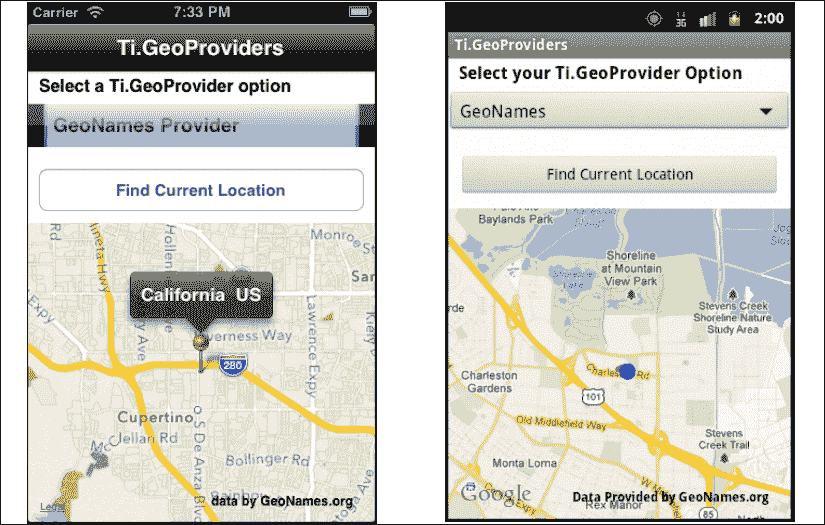

## 准备就绪

这个食谱同时使用了 CommonJS 和本地模块。这些可以从本书提供的源代码中下载，或者通过此食谱末尾的 *也见* 部分提供的链接单独下载。只需将 `Ti.GeoProviders` 文件夹复制到你的项目 `Resources` 文件夹中，然后将 `modules` 文件夹复制到你的项目中，如图所示。最后，将 `provider_picker.js` 文件复制到 Titanium 项目的 `Resources` 文件夹中，如图所示：

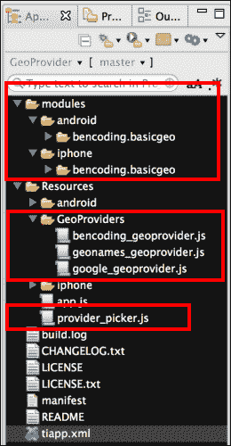

在复制此处提到的文件和文件夹后，你需要在 Titanium Studio 中点击你的 **tiapp.xml** 文件，并添加对 `bencoding.basicgeo` 模块的引用，如图所示：


## 如何操作...

一旦你将本地和 CommonJS 模块添加到你的项目中，你需要在 `app.js` 文件中创建你的应用程序命名空间，并使用 `require` 将模块导入到你的代码中，如下代码片段所示：

```js
//Create our application namespace
var my = {
  picker : require('provider_picker'),
  currentProvider:null,
  providers:[
    require('./GeoProviders/geonames_geoprovider'),
    require('./GeoProviders/bencoding_geoprovider'),
    require('./GeoProviders/google_geoprovider')
  ]
};
```

### 添加你的 API 密钥

许多地理信息提供商需要 API 密钥。`Ti.GeoProvider` 包含 `addKey` 方法，允许你在进行服务调用之前关联你的 API 密钥。以下代码片段演示了如何将 API 密钥 `demo` 添加到你的服务调用中。

```js
my.currentProvider.addKey('demo');
```

### 添加你的目的

要在 iOS 中使用位置服务，需要提供应用访问 GPS 的目的或原因。在第一次请求时，此消息将显示给用户。以下代码演示了如何使用 `addPurpose` 方法将此目的添加到 `Ti.GeoProviders`：

```js
my.currentProvider.addPurpose('Demo of Geo Provider');
```

### 注意

Android 不需要提供目的；在这种情况下，定义的目的在访问 GPS 时不会被使用。

### 构建食谱 UI

以下代码片段描述了如何创建此食谱早期截图所示的 UI：

1.  第一步是创建一个 `Ti.UI.Window`，所有视觉元素都将附加到这个窗口上。

    ```js
    var win = Ti.UI.createWindow({
      backgroundColor: '#fff', title: 'Ti.GeoProviders', 
      barColor:'#000',fullscreen:false
    });
    ```

1.  接下来，将一个 `Ti.Map.View` 添加到 `Ti.UI.Window` 中。这用于绘制 GeoProvider 提供的位置信息。

    ```js
    var mapView = Ti.Map.createView({
      top:140, bottom:0, width:Ti.UI.FILL,
      userLocation:false	
    });
    win.add(mapView);
    ```

1.  然后在 `Ti.UI.Window` 中添加了一个 `picker` 控件。此控件包含一个提供者列表和一个回调方法，用于在它们之间切换。当用户更新所选的 `picker` 时，会调用 `lookup.updateProvider` 方法来切换活动的 `Ti.GeoProvider`。有关更多详细信息，请参阅本食谱中的 *查找函数* 部分。

    ```js
    var picker = my.picker.createPicker({
      top:30, height:40},lookup.updateProvider
    });
    win.add(picker);
    ```

1.  `findButton` 按钮是最后添加到食谱的 `Ti.UI.Window` 中的 UI 组件。此 `Ti.UI.Button` 用于运行食谱的反向地理定位查找。

    ```js
    var findButton = Ti.UI.createButton({
      title:'Find Current Location', 
      left:10, right:10,top:30,height:40
    });
    win.add(findButton);
    ```

### 运行反向地理定位

要运行反向地理定位，请执行以下步骤：

1.  当用户按下 `findButton` 时，会触发点击事件并运行以下代码片段：

    ```js
    findButton.addEventListener('click',function(e){
    ```

1.  本食谱本部分的第一个步骤是检查网络连接是否可用。需要网络连接来联系 `Ti.GeoProvider` 网络服务以执行反向地理定位查找。

    ```js
      if(!Ti.Network.online){
    ```

1.  如果没有网络连接可用，用户会收到此要求的提醒，并且查找过程会停止。

    ```js
        alert("You must be online to run this recipe");
        return;
      }
    ```

1.  本食谱本部分的最后一步是调用 `Ti.GeoProviders` 的 `getCurrentAddress` 方法。该方法将使用 `Ti.Geolocation` API 获取设备的坐标，然后使用 `Ti.GeoProviders` 的特定逻辑将地址对象返回给提供的 `onSuccess` 回调方法。如果在地理定位过程中发生错误，将调用 `onError` 回调方法并提供错误详情。以下代码片段演示了如何调用 `getCurrentAddress` 方法：

    ```js
      my.currentProvider.getCurrentAddress(
      lookup.onSuccess,lookup.onError);
    });
    ```

### 查找函数

现在执行以下步骤：

1.  在本食谱中，使用 `lookup` 对象来显示 GeoProvider 返回的结果。

    ```js
    var lookup = {
    ```

1.  使用前面讨论的 `picker` 控件，用户可以更改食谱的 `Ti.GeoProvider`。当提供者更改时，会使用要加载的新提供者详细信息调用 `updateProvider` 方法。

    ```js
      updateProvider : function(providerKey){
    ```

1.  根据提供的 `providerKey`，`updateProvider` 方法将切换 `my.currentProvider` 对象引用。作为此方法的一部分，还将处理特定于提供者的详细信息，例如 API 密钥详情。GeoNames 提供者代码片段演示了在本食谱中如何执行提供者切换。

    ```js
        my.currentProvider = my.providers[providerKey];

        if(my.currentProvider.providerName == 'geonames'){
          my.currentProvider.provider.addKey('demo');
        }
    ```

1.  `addPurpose` 等跨提供者方法在 `updateProvider` 方法的末尾执行，因为它们被所有 `Ti.GeoProviders` 利用。

    ```js
        my.currentProvider.addPurpose('Geo Demo');
      },
    ```

1.  使用 `GeoNames Ti.GeoProvider` 提供的纬度、经度和地址信息，使用 `addToMap` 方法创建一个地图图钉。

    ```js
      addToMap: function(lat,lng,title){
        var pin = Ti.Map.createAnnotation({
          latitude:lat,longitude:lng,
          title:title
        });
        mapView.addAnnotation(pin);
    ```

1.  使用 `Ti.GeoProvider` 的纬度和经度信息创建一个区域。然后调用 `setLocation` 方法将 `Ti.Map.View` 缩放到图钉的坐标。

    ```js
        var region = {latitude:lat,
        longitude:lng,animate:true,
        latitudeDelta:0.04,
        longitudeDelta:0.04};
        mapView.setLocation(region);
      },
    ```

1.  使用 `onSuccess` 方法来处理来自 `Ti.GeoProviders` 的成功返回。此方法用于在 `Ti.GeoProviders` 成功返回后协调所有用户交互。

    ```js
      onSuccess : function(e){
        if(!e.found){
          alert("Unable to find your location");
          return;
        }
    ```

1.  使用`generateAddress`方法为`title`变量创建一个值。然后，`title`变量用于创建地图针。由于`Ti.GeoProviders`可以包含不同的格式，因此使用`generateAddress`函数创建用于显示的格式化地址。

    ```js
        var title = my.currentProvider.generateAddress(e);
        lookup.addToMap(e.latitude,e.longitude,title);
      },
    ```

1.  如果在反向地理编码过程中出现问题时，`Ti.GeoProviders`会使用`onError`方法返回错误信息。所有错误详情都可以在`e`参数中访问。

    ```js
      onError: function(e){
        alert("Error Details:" JSON.stringify(e));
      }
    };
    ```

## 参见

要了解更多关于此配方中使用的`basicGeo` Titanium 模块的信息，您可以查看以下链接：

+   **Ti.GeoProvider 框架**：有关许可、源代码以及了解更多关于此项目的信息，请访问[`github.com/benbahrenburg/Ti.GeoProviders`](https://github.com/benbahrenburg/Ti.GeoProviders)。

+   **基本地理模块**：有关许可、源代码以及了解更多关于此项目的信息，请访问[`github.com/benbahrenburg/benCoding.BasicGeo`](https://github.com/benbahrenburg/benCoding.BasicGeo)。

+   **GeoNames GeoProvider**：GeoNames 提供者使用`GeoNames.org`网络服务。有关许可、使用、费率和文档，请访问[`www.geonames.org/`](http://www.geonames.org/)。

+   **Google GeoProvider**：Google 提供者使用 Google Geocoding API。有关许可、使用、费率和文档，请访问[`developers.google.com/maps/documentation/geocoding/`](https://developers.google.com/maps/documentation/geocoding/)。

# 多租户地理定位

如本章前面所述，`Ti.GeoProviders`框架提供了一种多提供者方法来处理反向地理编码。多租户组件包括`Ti.GeoProviders`框架在提供者无法找到合适位置时进行故障转移的能力。这种多租户方法有助于确保您的地理定位功能适用于您的全球移动员工。

以下配方演示了如何使用多租户`Ti.GeoProviders`框架通过故障转移方法执行反向位置查找。以下截图展示了此配方在 iPhone 和 Android 设备上的运行情况：

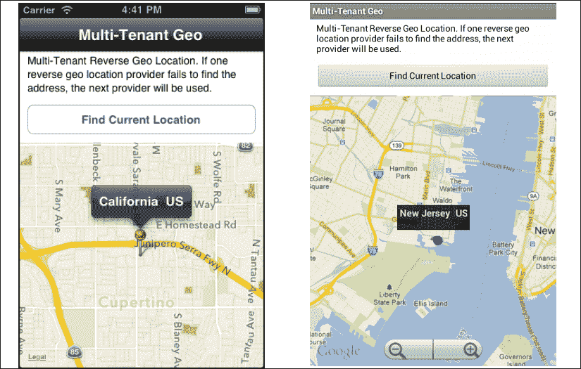

## 准备就绪

此配方同时使用 CommonJS 和本地模块。这些模块可以从本书提供的源代码中下载，或者通过此配方末尾的“参见”部分提供的链接单独下载。只需将`GeoProviders`文件夹复制到您的项目中的`Resources`文件夹，然后将`modules`文件夹复制到您的项目中，如下面的截图所示：

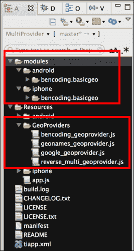

复制提到的文件夹后，您需要在 Titanium Studio 中点击您的`tiapp.xml`文件，并添加对`bencoding.basicgeo`模块的引用，如下面的截图所示：

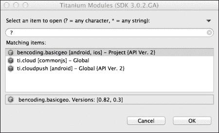

## 如何操作...

一旦您已将原生和 CommonJS 模块添加到您的项目中，接下来您需要在 `app.js` 文件中创建您的应用程序命名空间，并使用 `require` 将模块导入到您的代码中，如下代码片段所示：

```js
//Create our application namespace
var my = {
  multiProvider : 
  require('./GeoProviders/reverse_multi_geoprovider')
};
```

### 添加提供者

以下代码片段演示了如何通过调用 `addProvider` 方法将不同的 GeoProviders 添加到 `multiProvider` 模块中。建议首先添加您认为最能满足您需求的 GeoProviders，因为 `multiProvider` 将按添加的顺序执行它们。

```js
my.multiProvider.addProvider({
  key : 'demo',
  providerString:'GeoProviders/geonames_geoprovider'
});

my.multiProvider.addProvider({
  providerString:'GeoProviders/bencoding_geoprovider'
});
my.multiProvider.addProvider({
  providerString:'GeoProviders/google_geoprovider'
});
```

### 添加目的

在 iOS 上使用位置服务需要提供目的或原因，以便应用程序访问 GPS。在第一次请求时，此消息将展示给用户。以下代码演示了如何使用 `addPurpose` 方法将此目的添加到多租户提供者：

```js
my.multiProvider.addPurpose('Demo of Geo Provider');
```

### 注意

Android 不需要提供目的；在这种情况下，当访问 GPS 时，定义的目的不会被使用。

### 构建食谱 UI

以下代码片段描述了如何创建在此食谱早期屏幕截图中所显示的 UI。第一步是创建 `Ti.UI.Window`，所有视觉元素都将附加到该窗口。

```js
var win = Ti.UI.createWindow({
  backgroundColor: '#fff', title: 'Multi-Tenant Geo', 
  barColor:'#000',fullscreen:false
});
```

接下来，将 `Ti.Map.View` 添加到 `Ti.UI.Window` 中；这将用于显示带有设备当前位置和地址详情的地图标记。

```js
var mapView = Ti.Map.createView({
  top:120, bottom:0,width:Ti.UI.FILL,
  userLocation:false	
});
win.add(mapView);
```

### 查找辅助方法

现在执行以下步骤：

1.  `lookup` 对象旨在帮助格式化多租户反向地理编码组件的结果，并以图形方式向食谱用户展示地址信息。

    ```js
    var lookup = {
    ```

1.  `addToMap` 方法创建一个地图标记并添加信息到 `Ti.Map.View`。

    ```js
      addToMap: function(lat,lng,title){
        var pin = Ti.Map.createAnnotation({
        latitude:lat,longitude:lng,
        title:title	
      });
      mapView.addAnnotation(pin);
    ```

1.  使用地图标记坐标创建一个区域，然后调用 `Ti.Map.View` 的 `setLocation` 函数。这将使地图缩放到最近添加的标记的坐标。

    ```js
      var region = {latitude:lat,longitude:lng,
        latitudeDelta:0.04,   
        longitudeDelta:0.04};
        mapView.setLocation(region);
      },
    ```

1.  当调用 `getCurrentAddress` 方法时，提供 `onSuccess` 方法作为成功回调。`getCurrentAddress` 方法的结果提供给了 `e` 参数。

    ```js
      onSuccess : function(e){
        if(!e.found){
          alert("Unable to find your location");
          return;
        }
    ```

1.  调用 `getProvider` 方法以创建一个引用，用于返回位置结果的提供者。这允许使用特定于提供者的 `generateAddress` 方法。

    ```js
        var provider = my.multiProvider.getProvider(
        e.provider.name);
        var title = provider.generateAddress(e);
        lookup.addToMap(e.latitude,e.longitude,title);
      },
    ```

1.  当调用 `getCurrentAddress` 方法时，提供 `onError` 方法作为错误回调。错误详情提供给了 `e` 参数。

    ```js
      onError: function(e){
        alert("Error finding your location");
      }
    };
    ```

### 执行多租户反向地理编码查找

现在执行以下步骤：

1.  本食谱的最后一部分是使用 `multiProvider` 模块的 `getCurrentAddress` 方法执行多租户查找。

    ```js
    var findButton = Ti.UI.createButton({
      title:'Find Current Location', 
      left:10, right:10,top:70,height:40
    });
    win.add(findButton);
    ```

1.  在 `findButton` 的点击事件上执行 `multiProvider` 查找。

    ```js
    findButton.addEventListener('click',function(e){
    ```

1.  由于反向地理编码需要网络连接，因此反向地理编码过程的第一步是验证网络连接。

    ```js
      if(!Ti.Network.online){
        alert("You must be online to run this recipe");
        return;
      }	
    ```

1.  接着调用`getCurrentAddress`方法，并提供了成功和错误回调方法。以下代码片段展示了如何使用前面在本食谱中讨论过的`lookup.onSuccess`和`lookup.OnError`回调方法调用此方法。

    ```js
      my.multiProvider.getCurrentAddress(
      lookup.onSuccess,lookup.onError);
    });	
    ```

# 计算地址之间的距离

在企业应用程序中，使用地理定位服务是很常见的。最常见的地理定位需求之一是计算两点之间的距离。这在规划路线、确定里程、预测配送时间表等方面非常有用。

以下食谱演示了如何计算两个地址之间的距离。这种距离测量使用的是直接距离，而不是像步行或驾驶那样使用的路线计算。以下截图展示了此食谱在 iPhone 和 Android 设备上的运行情况。

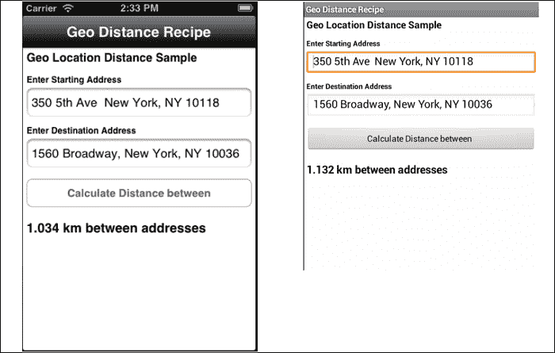

## 准备工作

本食谱同时使用 CommonJS 和本地模块。这些可以从本书提供的源代码中下载，或者通过本食谱末尾的“也见”部分提供的链接单独下载。只需将`forwardGeo.js`文件复制到项目的`Resources`文件夹中，然后将`modules`文件夹复制到项目中，如图所示：

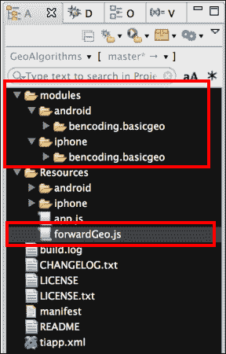

在复制此处提到的文件和文件夹后，您需要在 Titanium Studio 中点击您的**tiapp.xml**文件，并添加对`bencoding.basicgeo`模块的引用，如图所示：


## 如何操作...

在您的项目中添加了本地和 CommonJS 模块之后，接下来需要在`app.js`文件中创建您的应用程序命名空间，并使用`require`将模块导入到代码中，如下面的代码片段所示：

```js
//Create our application namespace
var my = {
  forward : require('forwardGeo')
};
```

### 添加地址信息

在应用程序命名空间中添加了以下`startAddress`和`endAddress`对象。这些对象将用于创建本食谱的地址信息和坐标状态。

```js
my.startAddress  = {
  needRefresh:true,lat:40.748433, lng:-73.985656,
  address:'350 5th Ave  New York, NY 10118'
};

my.endAddress = {
  needRefresh:false, lat:40.75773, lng:-73.985708,
  address:'1560 Broadway, New York, NY 10036'
};
```

### 构建食谱 UI

以下代码片段描述了如何创建本食谱早期截图所示的 UI：

1.  第一步是创建`Ti.UI.Window`，所有视觉元素都将附加到该窗口。

    ```js
    var win = Ti.UI.createWindow({
      backgroundColor: '#fff', title: 'Geo Distance Recipe', 
      barColor:'#000',fullscreen:false
    });
    ```

1.  接下来创建`txtStartAddress Ti.UI.TextField`，允许用户输入起始地址。

    ```js
    var txtStartAddress = Ti.UI.createTextField({
      hintText:'enter starting address', 
      value: my.startAddress.address,
      height:40, left:5, right:5, top:55,
      borderStyle:Ti.UI.INPUT_BORDERSTYLE_ROUNDED
    });
    win.add(txtStartAddress);
    ```

1.  接下来创建`txtEndAddress Ti.UI.TextField`，允许用户输入目的地地址。

    ```js
    var txtEndAddress = Ti.UI.createTextField({
      hintText:'enter destination address', 
      value: my.endAddress.address,
      height:40, left:5, right:5, top:125,
      borderStyle:Ti.UI.INPUT_BORDERSTYLE_ROUNDED
    });
    win.add(txtEndAddress);
    ```

1.  在本食谱的后续步骤中，将`findButton Ti.UI.Button`添加到`Ti.UI.Window`。此按钮将用于执行距离计算。

    ```js
    var findButton = Ti.UI.createButton({
      title:'Calculate Distance between', height:40,
      left:5, right:5, top:180
    });
    win.add(findButton);
    ```

### 距离和地址方法

本食谱使用`geo`对象执行距离和地址查找操作。

```js
var geo ={
```

1.  `distanceInUnits`使用哈夫曼公式，并计算两组坐标之间直接距离的千米或米。

    ```js
    distanceInUnits: function(lat1, lng1, lat2, lng2){
      var rOfEarth = 6371; 
      var dLat = (lat2-lat1)*Math.PI/180;  
      var dLon = (lng2-lng1)*Math.PI/180;   
      var a = Math.sin(dLat/2) * Math.sin(dLat/2) +  
      Math.cos(lat1*Math.PI/180) *
      Math.cos(lat2*Math.PI/180) *   
      Math.sin(dLon/2) * Math.sin(dLon/2);   
      var c = 2 * Math.asin(Math.sqrt(a));   
      var distance = rOfEarth * c;
    ```

1.  如果距离小于 1 公里，则返回的单位将转换为米。

    ```js
      return {
        distance: ((distance < 1) ? 
        (distance * 1000) : distance),
        unit: ((distance < 1) ? 'm' : 'km')
      };
    },
    ```

1.  使用 `findLocations` 方法来获取提供的地址的坐标。

    ```js
    findLocations : function(callback){
    ```

1.  `onFinish` 函数是提供给 `forwardGeo` 函数的回调方法。`e` 参数提供了起始和结束地址的坐标。

    ```js
      function onFinish(e){
        if(!e.success){
          alert(e.message);
          return;
        }
    ```

    将 `forwardGeo e.start` 和 `e.end` 结果分配给 `my.startAddress` 和 `my.endAddress` 属性。然后执行回调方法，以便执行距离计算。

    ```js
        my.startAddress = e.start;
        my.endAddress = e.end;
        callback();
      };
    ```

1.  调用 `forwardGeo` 方法来获取 `my.startAddress` 和 `my.endAddress` 对象的坐标。如前所述，地理位置结果作为以下代码片段所示提供给了 `onFinish` 回调方法：

    ```js
        my.forward.forwardGeo(my.startAddress,
        my.endAddress,onFinish);
      }	
    };
    ```

### 查找两个地址之间的距离

当用户按下 `findButton` 并触发点击事件时，食谱将执行两个输入地址之间的距离计算。

```js
findButton.addEventListener('click',function(e){
```

1.  此过程的第一个步骤是确定是否支持正向地理位置。距离计算需要每个地址的坐标。执行正向地理位置查找以获取此信息。

    ```js
      if(!my.forward.isSupported()){
        alert('Forward Geocoding is not supported');
        return;
      }	
    ```

1.  使用 `findDistance` 方法来调用距离计算方法并格式化提供的结果。

    ```js
      function findDistance(){
    ```

1.  本食谱本部分的第一个步骤是使用每个地址的经纬度信息调用 `distanceInUnits` 方法。

    ```js
        var result = geo.distanceInUnits(
        my.startAddress.lat,my.startAddress.lng,
        my.endAddress.lat,my.endAddress.lng);
    ```

1.  接下来需要格式化距离计算结果。如果结果是以公里为单位，则 `distance` 变量将被四舍五入到小数点后三位。如果是米，则将显示完整值。

    ```js
        if(result.unit=='km'){
          result.distance = 	
          result.distance.toFixed(3);
        }
        distanceLabel.text = result.distance + " " + 
        result.unit + " between addresses";
      };
    ```

1.  如果任一地址信息对象需要刷新，则调用 `geo.findLocation` 方法。`findDistance` 方法作为回调方法提供给 `findLocations` 函数，以便在获取坐标后执行距离计算。

    ```js
      if(my.startAddress.needRefresh || 
      my.endAddress.needRefresh){
        geo.findLocations(findDistance);
      }else{
    ```

1.  如果地址信息对象不需要刷新，则直接调用 `findDistance` 方法来执行距离计算。

    ```js
        findDistance();
      }	
    });
    ```

# 后台地理位置管理

后台地理位置是许多企业应用的重要功能。在后台监控设备位置的能力是一个强大的功能，可用于从个人安全到里程追踪的广泛活动。

以下食谱演示了如何使用 `Ti.Geo.Background` 框架来启用后台地理位置监控。以下截图展示了该食谱在 iPhone 和 Android 设备上运行的情况。

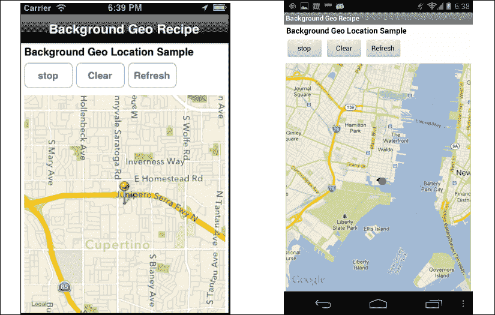

## 准备就绪

该食谱使用了一系列 CommonJS 模块。这些模块可以从本书提供的源代码中下载，或者通过本食谱末尾的 *另请参阅* 部分提供的链接单独下载。只需将 `bGeo` 文件夹复制到项目中的 `Resources` 文件夹，如图所示：

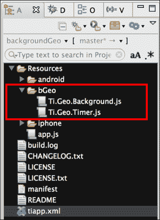

### 更新你的 tiapp.xml 文件

此 recipe 需要更新你的项目 `tiapp.xml` 文件。第一次更新是为 iOS 设备提供背景地理定位支持。以下突出显示的 `UIBackgroundModes` 部分说明了此 recipe 所需的条目：

```js
<ios>
  <min-ios-ver>5.0</min-ios-ver>
  <plist>
    <dict>
 <key>UIBackgroundModes</key>
 <array>
 <string>location</string>
 </array>
      <key>NSLocationUsageDescription</key>
      <string>Demo Geo App</string>
    </dict>
  </plist>
</ios>
```

此 recipe 使用 Android 服务作为保持活跃。以下突出显示的部分是 recipe 创建内部服务所必需的：

```js
<android xmlns:android=
"http://schemas.android.com/apk/res/android">
 <services>
 <service url="bGeo/Ti.Geo.Timer.js" type="interval"/>
 </services>
</android>
```

## 如何操作...

The `Ti.Geo.Background` CommonJS 模块同时利用了位置管理器距离过滤和保持活跃的地理定时器。这确保了当设备移动特定距离或经过指定时间段时，都会记录位置。`Ti.Geo.Background` 模块管理所有地理定位操作，并维护一个距离过滤器，以便在设备移动超过特定阈值距离时记录坐标。

`Ti.Geo.Timer` 执行两项活动。首先提供保持 iOS 应用程序活跃所需的保持活跃循环，其次，在预定的时间间隔内，服务记录设备的当前坐标。这确保了即使个人没有移动，也会记录坐标。

以下图表说明了不同 `Ti.Geo.Background` 组件之间的交互：

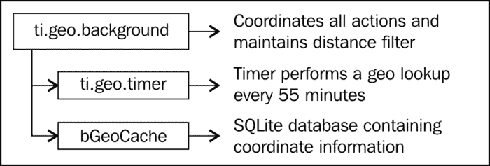

### 命名空间和应用程序设置

一旦你将原生和 CommonJS 模块添加到你的项目中，你需要在 `app.js` 文件中创建你的应用程序命名空间，并使用 `require` 将模块导入到你的代码中，如下代码片段所示：

```js
var my = {
  bGeo : require('bGeo/Ti.Geo.Background'),
  isAndroid : Ti.Platform.osname === 'android',
  session:{started:false}
};
```

### 背景位置选项

`Ti.Geo.Background` 模块提供了一系列可选的配置参数，允许你根据需要调整模块。第一个配置参数是 `purpose`。当 iOS 向用户展示位置服务访问提示时，会使用此参数。

```js
my.bGeo.purpose = "Demo Background Recipe";
```

1.  `distanceFilter` 是一个以米为单位的值，表示你希望位置管理器多久触发一次位置变更的警报。以下示例设置为 `100`，将在用户移动超过 100 米时触发位置变更事件。

    ```js
    my.bGeo.distanceFilter = 100;
    ```

1.  `trackSignificantLocationChange` 设置表示在 iOS 上应使用显著位置变更跟踪。这种地理定位方法通过仅在执行网络更改（如切换蜂窝塔）时触发事件来减少电池影响。

    ```js
    my.bGeo.trackSignificantLocationChange = true; 
    ```

1.  `minAge` 配置是你希望接收位置更新的最小频率阈值，以分钟为单位。在以下示例中，无论个人移动的距离如何，你将不会以每 3 分钟一次的频率接收更新。

    ```js
    my.bGeo.minAge = 3;
    ```

1.  `maxAge` 配置是你希望在没有收到更新时，你希望达到的最大时间阈值（以分钟为单位）。这也是 `Ti.Geo.Timer` 执行坐标查找时使用的阈值。

    ```js
    my.bGeo.maxAge = 30;
    ```

### 构建 recipe 的 UI

以下代码片段描述了如何创建此 recipe 早期截图所示的 UI：

1.  第一步是创建 `Ti.UI.Window`，所有视觉元素都将附加到该窗口上。

    ```js
    var win = Ti.UI.createWindow({
      backgroundColor: '#fff', title: 'Background Geo Recipe', 
      barColor:'#000',fullscreen:false
    });
    ```

1.  下一步是向配方的 `Ti.UI.Window` 添加 `Ti.Map.View`。这将用于显示 `Ti.Geo.Background` 运行期间收集的坐标。

    ```js
    var mapView = Ti.Map.createView({
      top:80, bottom:0, left:5, right:5, userLocation:false
    });
    win.add(mapView);
    ```

1.  `startStopButton` 被添加到 `Ti.UI.Window` 中。此按钮将用于启动和停止 `Ti.Geo.Background` 进程。

    ```js
    var startStopButton = Ti.UI.createButton({
      title:((my.bGeo.active()) ? 'stop' :'start'),
      top:30, height:40,left:5, width:75
    });
    win.add(startStopButton);
    ```

1.  `clearButton` 被添加到 `Ti.UI.Window` 中。此按钮将用于删除 `Ti.Geo.Background` 进程记录的所有坐标信息。

    ```js
    var clearButton = Ti.UI.createButton({
      title:'Clear', top:30, height:40,left:85, width:75
    });
    win.add(clearButton);
    ```

1.  `refreshButton` 被添加到 `Ti.UI.Window` 中。此按钮将用于使用 `Ti.Geo.Background` 进程记录的坐标刷新 `Ti.Map.View`。

    ```js
    var refreshButton = Ti.UI.createButton({
      title:'Refresh', top:30, height:40,left:165, width:75
    });
    win.add(refreshButton);
    ```

### 配方的 `assistant` 方法

此配方实现了一个 `assistant` 对象，其中包含用于处理和显示 `Ti.Geo.Background` 模块收集的坐标的辅助函数。

```js
var assistant = {
```

1.  `addToMap` 是 `assistant` 对象中的第一个方法。此方法为 `Ti.Geo.Background` 模块收集的每个坐标点添加一个地图标记。

    ```js
      addToMap : function(e){
        var pin = Ti.Map.createAnnotation({
          latitude:e.latitude,
          longitude:e.longitude	
        });
        mapView.addAnnotation(pin);
        var region = {latitude:e.latitude,
        longitude:e.longitude,
        latitudeDelta:0.04, longitudeDelta:0.04};
        mapView.setLocation(region);
      },
    ```

1.  `assistant` 对象中的下一个方法是 `locationChangeCallback` 方法。此方法作为 `Ti.Geo.Background` 模块 `change` 事件的回调方法。变化坐标被提供给方法的 `e` 参数。然后 `locationChangeCallback` 方法调用 `addToMap` 方法以显示新收集的坐标信息。

    ```js
      locationChangeCallback : function(e){
        assistant.addToMap(e);
      },
    ```

1.  `assistant` 对象中的最后一个方法是 `locationErrorCallback` 方法。此方法作为 `Ti.Geo.Background` 模块 `error` 事件的回调方法。错误信息被提供给方法的 `e` 参数。

    ```js
      locationErrorCallBack : function(e){
        alert('Error due to ' + e.message);
      }
    };
    ```

### 地理位置事件

`Ti.Geo.Background` 模块有多个事件。在此配方中使用的事件在本节中详细说明。`change` 事件是本配方中使用的首选方法。每当生成位置变化时，都会触发此事件。以下示例演示了如何订阅此 `change` 事件，提供回调方法 `assistant.locationChangeCallback`：

```js
my.bGeo.addEventListener('change',
assistant.locationChangeCallback);
```

在此配方中，`error` 事件也被用于在模块发生错误时向用户提供警报。以下示例演示了如何订阅 `error` 事件，提供回调方法 `assistant.locationErrorCallback`：

```js
my.bGeo.addEventListener('error',
assistant.locationErrorCallBack);
```

### 背景按钮事件

此配方使用一系列按钮来演示如何调用 `Ti.Geo.Background` 模块的方法。`startStopButton` 的点击事件演示了如何启动和停止 `Ti.Geo.Background` 进程。

```js
startStopButton.addEventListener('click',function(e){
```

1.  如果模块已经处于活动状态，则配方将切换状态为 `off` 并停止模块以记录坐标。

    ```js
      if(my.bGeo.active(){
        my.bGeo.stop();
      }else{
    ```

1.  如果模块处于关闭状态，则配方将切换状态为 `on` 并启动模块以记录坐标。

    ```js
        my.bGeo.start();
      }
    ```

1.  `startStopButton` 的标题被更新以刷新模块的当前状态。

    ```js
      startStopButton.title=((my.bGeo.active()) ? 
      'stop' :'start');
    });
    ```

1.  使用`refreshButton`的`click`事件来重新加载记录的坐标以在`Ti.Map.View`中显示。

    ```js
    refreshButton.addEventListener('click',function(e){
    ```

1.  首先移除所有地图标注。

    ```js
      mapView.removeAllAnnotations();
    ```

1.  然后调用`readCache`方法来返回包含所有记录坐标的数组。

    ```js
      var results = my.bGeo.readCache();
    ```

1.  然后使用`assistant.addToMap`方法遍历坐标数组，在食谱的`Ti.Map.View`上创建地图标记。

    ```js
      for (iLoop=0;iLoop < results.length;iLoop++){
        assistant.addToMap(results[iLoop]);
      }
    });
    ```

1.  使用`clearButton`的`click`事件来移除所有记录的坐标信息，并如以下代码片段所示清除`Ti.Map.View`上的所有标注：

    ```js
    clearButton.addEventListener('click',function(e){
      my.bGeo.clearCache();
      mapView.removeAllAnnotations();
    });
    ```

### iOS 应用级别事件

iOS 平台不允许在应用处于前台时运行后台服务。以下代码块演示了如何处理这个 iOS 特定场景：

1.  首先检查确保食谱在 iOS 设备上运行。

    ```js
    if(!my.isAndroid){
    ```

1.  接下来在`resumed`事件上创建一个应用级别的监听器。这将当应用被置于前台时触发。

    ```js
      Ti.App.addEventListener('resumed',function(e){
    ```

1.  当应用被移入前台时，食谱会检查`Ti.Geo.Background`模块是否活跃。如果活跃，必须调用模块的`paused`方法来禁用`Ti.App.iOS.BackgroundService`，同时保持位置管理器活跃。

    ```js
        if(my.bGeo.active()){
          my.bGeo.paused();
        }
      });
    ```

1.  在 iOS 上管理后台服务的下一步是向`paused`事件添加一个应用级别的监听器。当应用被置于后台时，将触发`paused`事件。

    ```js
      Ti.App.addEventListener('paused',function(e){
    ```

1.  以下代码片段演示了如果`Ti.Geo.Background`模块活跃，如何重启后台服务。

    ```js
        if(my.bGeo.active()){
          my.bGeo.restart();
        }
      });
    ```

    ### 小贴士

    如果你想在应用暂停时继续收集坐标，必须在应用暂停时调用重启方法。

1.  以下代码片段演示了如何在应用关闭时停止`Ti.Geo.Background`模块。这也会为后台进程提供一个干净的关闭，避免 iOS 在约 10 分钟后终止它们。

    ```js
      Ti.App.addEventListener('close',function(e){
        my.bGeo.stop();
      });
    }
    ```

## 参见

+   在这个食谱中使用了`Ti.Geo.Background`模块来提供跨平台的背景位置服务。有关许可、源代码以及了解更多关于这个项目的信息，请访问[`github.com/benbahrenburg/Ti.Geo.Background`](https://github.com/benbahrenburg/Ti.Geo.Background)。
