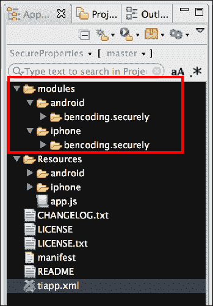
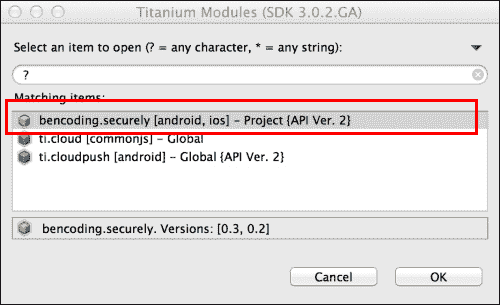
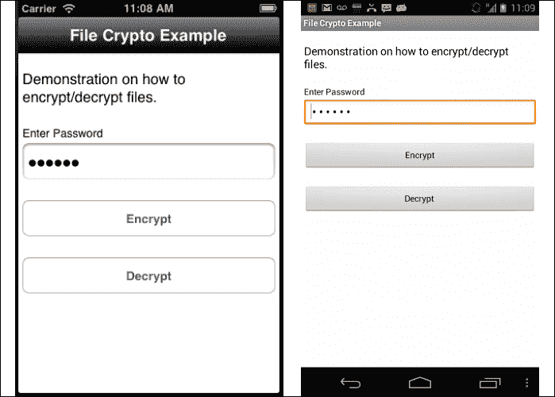
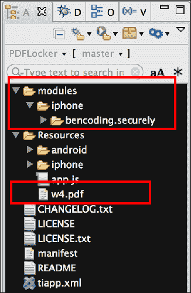
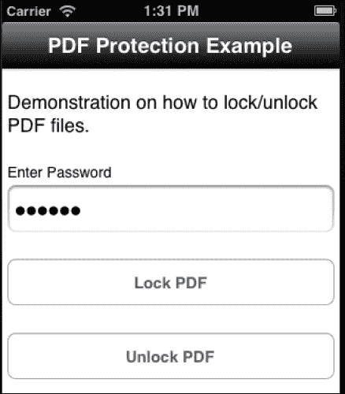
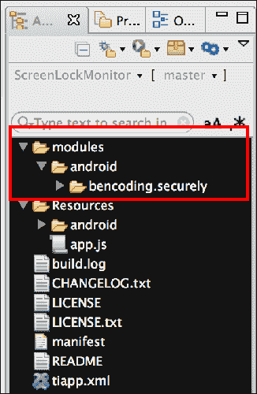

# 第九章：使用加密和其他技术进行应用程序安全

在本章中，我们将介绍：

+   使用安全属性

+   对象和字符串加密

+   处理加密文件

+   在 iOS 上处理受保护的 PDF 文件

+   Android 锁屏监控

# 简介

企业应用程序通常包含私有或机密信息。因此，在开发企业级 Titanium 应用程序时，加密、文件锁定和安全应用程序生命周期管理是基本要求。核心 Titanium SDK 在此领域提供了有限的功能，例如单向哈希和基本应用程序事件，但要完全满足安全要求，需要第三方模块，如 `Securely`。

在本章中，我们将讨论如何使用 `Securely` 框架来处理常见的安全编程任务，例如文件和字符串加密。`Securely` 以跨平台和 Titanium 友好的方式提供对每个平台的安全 API 的访问。通过一系列食谱，我们将演示如何在现有的 Titanium 企业应用程序中利用 `Securely` 框架。

# 使用安全属性

Titanium SDK 提供了一个 `Ti.App.Properties` 对象，它提供了一种方便的方式来持久化用户和应用程序信息。`Securely` 框架提供了一个熟悉的 API，旨在镜像 `Ti.App.Properties`，允许您以安全的方式持久化这些信息。本食谱描述了如何使用 `Securely.Properties` 对象以加密和安全的方式存储、读取和删除数据。

## 准备工作

本食谱使用 `Securely` 原生模块。此模块和其他代码资源可以从本书提供的源代码中下载，或者通过本食谱末尾的 *另请参阅* 部分的链接单独下载。将这些安装到您的项目中很简单。只需将 `modules` 文件夹复制到您的项目中，如下截图所示：



### 添加模块引用

在复制提到的文件夹后，您需要点击 Titanium Studio 中的 **tiapp.xml** 文件，并添加对 `bencoding.securely` 模块的引用，如下截图所示：



## 如何操作...

本食谱旨在在 `Ti.UI.Window` 或单个 Titanium 上下文中的其他组件的上下文中运行。本节中的代码示例演示了如何使用 `Securely` 的安全属性，使用与 Appcelerator 为 Titanium SDK 的 `Ti.App.Properties` 类使用的相同测试。有关更多信息，请参阅食谱源代码中包含的 `app.js`。

### 创建命名空间

在您将 `Securely` 模块添加到您的项目后，您需要在 `app.js` 文件中创建您的应用程序命名空间，并使用 `require` 将模块导入到您的代码中，如下代码片段所示：

```js
//Create our application namespace
var my = {
  secure : require('bencoding.securely'),
  isAndroid : Ti.Platform.osname === 'android',
  testObjects:{
    testList : [
      {name:'Name 1', address:'1 Main St'},
      {name:'Name 2', address:'2 Main St'}	
    ]
  }
};
```

### 创建安全属性对象

在创建应用命名空间之后，下一步是创建一个新的属性对象。此对象包含以下属性值，这些值必须在创建时设置：

+   `secret`：这是一个必需的参数。`secret` 是用于加密和解密所有属性值的密码。在加密过程中使用的相同 `secret` 必须在解密过程中使用，否则将返回 `null` 值。

+   `identifier`：此参数是可选的。如果没有提供值，iOS 上的捆绑名称或 Android 上的 `PackageName` 将被使用。`identifier` 允许您在需要时使用标识符对每个属性进行分段。

+   `accessGroup`：此参数是仅在 iOS 平台上使用的可选值。访问组可用于在两个或多个应用程序之间共享密钥链项。如果没有提供访问组，密钥链值将仅限于保存值的该应用内部访问。

+   `encryptFieldNames`：此参数是仅在 Android 平台上使用的可选值。当设置为 `true` 时，`Securely` 将使用提供的 `secret` 对所有属性名称创建 MD5 哈希。

    ```js
    var properties = my.secure.createProperties({
      secret:"sshh_dont_tell",
      identifier:"myPropertyIdentifier",
      accessGroup:"myAccessGroup",
      encryptFieldNames:false
    });
    ```

### 结果比较辅助工具

以下代码片段中显示的 `displayResults` 函数用于将测试结果与预期值进行比较。根据比较结果，生成适当的消息以呈现给用户。

```js
function displayResults(result, expected) {
  if (result instanceof Array) {
    return displayResults(JSON.stringify(result), 
    JSON.stringify(expected));
  }else{
    if (result === expected) {
      return "Success ("+result+"=="+expected+")";
    } else {
      return "Fail: " + result + "!=" + expected;
    }
  }
};
```

### 读取不带默认值的安全属性

每种支持的属性类型都有一个 `get` 方法。例如，要读取布尔属性，可以调用 `getBool` 方法并提供一个名称。此 API 与 Titanium SDK 中的 `Ti.App.Properties` 对象类似，增加了读取和解密安全属性的支持。如果没有存储值可用，将提供 null 或默认值类型。以下代码片段演示了如何读取已保存的安全属性值：

```js
Ti.API.info('Bool: ' + displayResults(properties.getBool('whatever'),
(my.isAndroid ? false : null)));

Ti.API.info('Double: ' + 
displayResults(properties.getDouble('whatever'),
(my.isAndroid ? 0: null)));

Ti.API.info('int: ' + displayResults(properties.getInt('whatever'),
(my.isAndroid ? 0 : null)));

Ti.API.info('String: ' + 
displayResults(properties.getString('whatever'),null));

Ti.API.debug('StringList: ' + 
displayResults(properties.getList('whatever'),null));
```

### 注意

在 iOS 上，任何没有保存值的属性都将返回 null 值。由于 Android 的类型系统，如果没有存储值，布尔值将返回 `false`，数值将返回零。所有其他 Android 值将返回 null，类似于 iOS。

### 读取带默认值的安全属性

同样，与 `Ti.App.Properties` 类似，`Securely` 提供了读取和解密安全属性的能力，并在请求的安全属性没有存储值时提供默认值。

```js
Ti.API.info('Bool: ' + 
displayResults(properties.getBool('whatever',true),true));

Ti.API.info('Double: ' + 
displayResults(properties.getDouble('whatever',2.5),2.5));

Ti.API.info('int: ' + 
displayResults(properties.getInt('whatever',1),1));

Ti.API.info('String: ' + 
displayResults(properties.getString('whatever',"Fred"),"Fred"));

Ti.API.debug('StringList: ' + 
displayResults(properties.getList('whatever'),testList));
```

### 注意

默认值在读取过程中不会被加密或持久化。

### 设置安全属性值

每种支持的属性类型都有一个 `set` 方法，用于加密和持久化值。例如，要保存和加密布尔属性，可以使用 `setBool` 方法，并提供属性名称和布尔值。此 API 与 Titanium SDK 中的 `Ti.App.Properties` 对象类似。`Securely` 支持直接加密并将值写入安全属性。以下代码片段演示了如何将以下值保存到安全和加密的存储中：

```js
properties.setString('MyString','I am a String Value ');
properties.setInt('MyInt',10);
properties.setBool('MyBool',true);
properties.setDouble('MyDouble',10.6);
properties.setList('MyList',my.testObjects.testList);
```

为了演示属性是否正确保存，对每个文件调用`get`方法，并将结果打印到 Titanium Studio 控制台。

```js
Ti.API.info('MyString: '+ properties.getString('MyString'));
Ti.API.info('MyInt: '+ properties.getString('MyInt'));
Ti.API.info('MyBool: '+ properties.getString('MyBool'));
Ti.API.info('MyDouble: '+ properties.getString('MyDouble'));
var list = properties.getList('MyList');
Ti.API.info('List: ' + JSON.stringify(list));
```

### 列出安全属性字段名称

可以通过在`Securely`属性对象上调用`listProperties`方法来返回属性名称数组。以下代码片段演示了如何使用此方法在 Titanium Studio 控制台中打印`names`数组的 JSON 表示形式。

```js
if(!properties.hasFieldsEncrypted()){
  var allProperties = properties.listProperties();
  Ti.API.info(JSON.stringify(allProperties));
}
```

### 注意

如果启用了字段名称加密，则`listProperties`方法将返回`null`。因为字段名称使用单向哈希加密，原始名称不再可用。

### 删除安全属性

您可以使用`Securely`属性对象的两种方法来删除属性。`removeProperty`和`removeAllProperties`旨在易于使用，并且与 Titanium SDK 的`Ti.App.Properties`对象上具有相同名称的方法类似。

`removeProperty`方法将删除提供的存在的安全属性名称。

```js
properties.removeProperty('MyInt');
```

`removeAllProperties`方法将删除在创建属性对象时提供的标识符内的所有属性。

```js
properties.removeAllProperties();
```

### 注意

在我们的食谱中，`remove`属性函数在测试结束时被调用，以便每次都能可靠地重现结果。

### 检查是否存在安全属性

`Securely`属性对象提供了`hasProperty`方法，以提供检查安全属性是否存在的能力。如果属性存在，则返回布尔值`true`，否则提供结果`false`。此 API 旨在易于使用，因为它与核心 Titanium SDK 中的`Ti.App.Properties.hasProperty`函数类似。

```js
Ti.API.info("Does MyInt property exist? " + 
properties.hasProperty('MyInt'));
```

## 它是如何工作的...

安全属性的基础设施实现方式取决于运行应用程序的平台。尽管`Securely`提供了一个跨平台 API，但了解每个平台是如何实现及其相关的安全考虑是很重要的。

### iOS 上的安全属性

`Securely`框架将所有属性值作为序列化字符串保存在 iOS Keychain 中。这提供了安全存储，并且由于它是 iOS 的一部分，因此不需要任何依赖项。由于`Securely`使用 iOS 密钥链服务，建议在将敏感数据存储在安全管理的容器中之前，您的组织审查 Apple 的密钥链文档。

### 注意

由于使用了 iOS Keychain 服务，因此需要记住，在您的应用程序卸载后，您的安全属性值仍然会在 iOS Keychain 中可用。如果您希望在删除应用程序之前删除所有密钥链项，则必须调用`removeAllProperties`方法。

### Android 上的安全属性

`Securely` 框架将所有属性值以序列化和 AES 加密字符串的形式保存到 Android 的 `SharedPreferences` 中。尽管 Android 在 API 级别 14 中引入了原生密钥链支持，但 `Securely` 模块旨在适应更多设备，并针对 API 级别 8 和更高版本。建议您的企业审查 `Securely` 中的安全属性实现，以确保其符合您的企业或行业标准与要求。

### 安全属性考虑事项

默认情况下，在 Android 上，属性名称不会被加密。这可以通过在创建 `properties` 对象时设置 `encryptFieldNames` 来启用。由于需要加密所有属性名称，此属性只能在创建新的 `properties` 对象时设置。当启用字段名称加密时，`Securely` 将使用提供的 `secret` 属性值对每个字段名称创建一个 SHA-1 哈希。启用此功能会带来性能考虑。在实现现有的 Titanium 应用程序之前，建议进行回归和性能测试。

## 参见

+   要了解更多关于 iOS Keychain 的信息，请查阅 Apple 提供的文档，可在以下网址找到：[`developer.apple.com/library/mac/#documentation/security/Conceptual/keychainServConcepts/01introduction/introduction.html`](https://developer.apple.com/library/mac/#documentation/security/Conceptual/keychainServConcepts/01introduction/introduction.html)。

+   要了解更多关于 Android 的 SharedPreferences 的信息，请查阅以下网址提供的文档：[`developer.android.com/reference/android/content/SharedPreferences.html`](http://developer.android.com/reference/android/content/SharedPreferences.html)。

# 对象和字符串加密

在企业级 Titanium 开发周期中，通常需要加密进程中的或持久化的 JavaScript 对象或变量。`Securely` 框架提供了一个 `StringCrypto` 代理，它提供了 AES 和 DES 双向加密的便捷方法。

本食谱描述了如何使用 `Securely.StringCrypto` 对象以安全的方式加密和解密 JavaScript 对象。

### 注意

`Securely` 的 AES 和 DES 实现旨在针对特定设备平台。如果需要交换 AES 或 DES 加密数据，访问设备、平台或第三方服务，建议进行测试以验证实现是否匹配。

## 准备工作

本食谱使用 `Securely` 原生模块。此模块和其他代码资源可以从本书提供的源代码中下载。将这些安装到您的项目中很简单。只需将 `modules` 文件夹复制到 Titanium 项目的根目录中。请参阅 *Using secure properties* 食谱中的 *准备工作* 部分，了解在继续之前如何设置模块的说明。

## 如何操作...

此示例设计为在 `Ti.UI.Window` 或单个 Titanium 上下文中的其他组件的上下文中运行。本节演示了如何使用 `Securely` 的 `StringCrypto` 方法加密 JavaScript 对象。有关更多信息，请参阅食谱源代码中包含的 `app.js`。

### 创建命名空间

一旦将 `Securely` 模块添加到您的项目中，您需要在 `app.js` 文件中创建您的应用程序命名空间，并使用 `require` 将模块导入到您的代码中，如下面的代码片段所示：

```js
//Create our application namespace
var my = {
  secure : require('bencoding.securely'),
  isAndroid : Ti.Platform.osname === 'android'
};
```

### 生成密钥

密钥生成是密码学的一个重要部分，为了帮助这个过程，`Securely` 有两个内置的便捷方法。

#### 生成派生密钥

第一种密钥生成便捷方法是称为 `generateDerivedKey`。该方法包括用户提供的字符串输入到用于确定密钥的盐算法中。如果需要知道或由另一个访问系统导出种子值，这种方法是有帮助的。以下步骤演示了为 `generateDerivedKey` 方法提供种子值的两种常见方法：

+   一种常见的方法是从新的 GUID 创建种子，从中生成密钥。以下代码片段演示了使用 `Ti.Platform.createUUID` 方法生成 GUID 来实现这一方法：

    ```js
    var usingGUID = 
    my.secure.generateDerivedKey(Ti.Platform.createUUID());
    ```

    ### 注意

    `generateDrivedKey` 方法将使用提供的参数在每次调用时创建一个新的密钥。

+   另一种不那么随机的密钥生成方法是提供 Titanium 应用程序 GUID 作为种子值。以下代码片段演示了如何使用 `Ti.App.guid` 从项目的 `tiapp.xml` 文件中的 GUID 创建派生密钥。

    ```js
    var usingAppID = my.secure.generateDerivedKey(Ti.App.guid);
    ```

#### 生成随机密钥

第二种密钥生成便捷方法称为 `generateRandomKey`。正如其名称所示，生成一个随机的字母数字字符串并将其用作种子值。以下代码片段演示了如何使用 `generateRandomKey` 方法创建密钥值。

```js
var randomKey = my.secure.generateRandomKey();
```

#### 创建 stringCrypto 对象

字符串和对象的加密过程中的下一步是创建一个新的 `stringCrypto` 代理实例。以下代码片段显示了如何创建一个名为 `stringCrypto` 的新代理对象。

```js
var stringCrypto = my.secure.createStringCrypto();
```

### 使用 DES 加密

`Securely` 支持较旧的 **数据加密标准** (**DES**) 加密算法。对这种算法的支持主要是为了与旧系统进行交互。 wherever possible, the stronger AES encryption should be used instead.

### 使用 DES 加密

`DESEncrypt` 方法需要一个密钥和一个要加密的字符串。然后该方法将返回一个 DES 加密字符串。如果在加密过程中生成错误，则返回 null 值。以下演示了如何使用此方法加密 JavaScript 字符串和对象。

```js
var desEncryptedString = stringCrypto.DESEncrypt
(usingGUID,
plainTextString);
var desEncryptedObject = stringCrypto.DESEncrypt
(usingGUID,
JSON.stringify(plainObject));
```

任何非 JavaScript 字符串元素必须在提供给 `DESEncrypt` 函数之前首先转换为 JavaScript 字符串。

### 使用 DES 解密

`DESDecrypt` 方法用于解密使用 DES 算法加密的字符串。此方法需要一个密钥和一个包含加密值的字符串。`DESDecrypt` 方法将返回一个包含解密值的字符串。以下代码片段演示了如何使用 `DESDecrypt` 方法解密字符串和对象。

```js
var desDecryptedString = stringCrypto.DESDecrypt
(usingGUID,
desEncryptedString);
```

以下代码片段演示了如何使用 `JSON.parse` 从解密后的 JSON 字符串中重建 JavaScript 对象。

```js
var desDecryptedObject = JSON.parse
(stringCrypto.DESDecrypt(usingGUID,
desEncryptedObject));
```

### 使用 AES 加密

`AESEncrypt` 方法需要一个密钥和一个字符串来进行加密。此方法将返回一个 AES 加密的字符串。如果在加密过程中生成错误，则返回一个 null 值。以下代码片段演示了如何使用此方法加密 JavaScript 字符串和对象。

```js
var aesEncryptedString = stringCrypto.AESEncrypt
(usingGUID,
plainTextString);
var aesEncryptedObject = stringCrypto.AESEncrypt
(usingGUID,
JSON.stringify(plainObject));
```

### 注意

任何非 JavaScript 字符串元素必须在提供给 `AESEncrypt` 函数之前首先转换为 JavaScript 字符串。

### 使用 AES 解密

`AESDecrypt` 方法用于解密使用 AES 算法加密的字符串。此方法需要一个密钥和一个包含加密值的字符串。`AESDecrypt` 方法将返回一个包含解密值的字符串。以下代码片段演示了如何使用 `AESDecrypt` 方法解密字符串和对象。

```js
var aesDecryptedString = stringCrypto.AESDecrypt
(usingGUID,
aesEncryptedString);
```

以下代码片段演示了如何使用 `JSON.parse` 从解密后的 JSON 字符串中重建 JavaScript 对象。

```js
var aesDecryptedObject = JSON.parse
(stringCrypto.AESDecrypt(usingGUID,
aesEncryptedObject));
```

### 钛金属对象加密

钛金属 SDK 对象，如 `Ti.UI.View`，不是真正的 JavaScript 对象，因此无法有效地序列化和加密。要加密钛金属对象，您必须首先将钛金属对象的全部属性复制到一个纯 JavaScript 对象中，然后将 JavaScript 对象转换为 JSON 字符串，如前所述。在解密过程中，可以采取相反的方法来重新创建钛金属对象。

## 参见

+   此配方使用 `Securely` 模块，有关安装详情，请参阅 *Using secure properties* 配方的 *准备就绪* 部分

+   要了解更多关于 DES 加密的信息，请查阅由 **国家标准与技术研究院**（**NIST**）发布的处理标准出版物，可在[`www.itl.nist.gov/fipspubs/fip46-2.htm`](http://www.itl.nist.gov/fipspubs/fip46-2.htm)找到

+   要了解更多关于 AES 加密的信息，请查阅 NIST 发布的处理标准出版物，可在[`csrc.nist.gov/publications/fips/fips197/fips-197.pdf`](http://csrc.nist.gov/publications/fips/fips197/fips-197.pdf)找到

+   要了解更多关于 iOS 实现中使用的加密服务，请查阅苹果的文档，可在[`developer.apple.com/library/mac/#documentation/security/Conceptual/cryptoservices/Introduction/Introduction.html#//apple_ref/doc/uid/TP40011172-CH1-SW1`](https://developer.apple.com/library/mac/#documentation/security/Conceptual/cryptoservices/Introduction/Introduction.html)找到

+   要了解更多关于 Android 实现中使用的加密算法，请查阅位于[`developer.android.com/reference/javax/crypto/Cipher.html`](http://developer.android.com/reference/javax/crypto/Cipher.html)的 Android 文档。

# 处理加密文件

文件加密是企业移动开发的基本构建块。由于大多数企业应用收集的数据敏感性，建议所有持久化文件都进行加密。

本食谱演示了如何使用`Securely`框架对文件进行加密和解密。通过使用文件加密示例，我们将提供逐步说明，说明如何在 Titanium 应用程序内部处理本地加密文件。

## 准备就绪

本食谱使用`Securely`原生模块。此模块和其他代码资源可以从书中提供的源代码中下载。只需将`modules`文件夹复制到您的 Titanium 项目根目录。在继续之前，请查阅*使用安全属性*食谱中的*准备就绪*部分，了解模块设置说明。

安装`Securely`模块后，您需要将`PlainText.txt`文件复制到项目的`Resources`文件夹中。此文件将由食谱用于创建初始加密文件。

## 如何做...

一旦将`module`文件夹和`PlaintText.txt`示例文件添加到您的项目中，您需要在`app.js`文件中创建您的应用程序命名空间，并使用`require`将模块导入到您的代码中，如下代码片段所示：

```js
//Create our application namespace
var my = {
  secure : require('bencoding.securely'),
  isAndroid : Ti.Platform.osname === 'android'
};
```

### 创建 UI

本食谱通过`Securely`模块和 Titanium 的`Ti.Filesystem`命名空间，逐步说明如何加密和解密文件。以下截图中的测试框架用于演示如何执行这些加密操作：



现在执行以下步骤：

1.  创建测试框架的第一步是创建一个`Ti.UI.Window`，它用于附加所有 UI 元素。

    ```js
    var win = Ti.UI.createWindow({
      backgroundColor: '#fff', title: 'File Crypto Example', 
      barColor:'#000',layout:'vertical',fullscreen:false
    });
    ```

1.  创建测试框架 UI 的下一步是添加一个名为`txtPassword`的`Ti.UI.TextField`。此控件用于获取加密和解密操作中使用的密码。

    ```js
    var txtPassword = Ti.UI.createTextField({
      value:'foo123',hintText:'Enter Password',
      height:45, left:5, right:5, passwordMask:true
    });
    win.add(txtPassword);
    ```

1.  创建测试框架 UI 的下一步是添加一个名为`btnEncrypt`的`Ti.UI.Button`。此控件将用于启动文件加密过程。

    ```js
    var btnEncrypt = Ti.UI.createButton({
      title:'Encrypt', top:25, height:45, left:5, right:5	
    });
    win.add(btnEncrypt);
    ```

1.  创建测试框架 UI 的最后一步是添加一个名为`btnDecrypt`的`Ti.UI.Button`。此控件将用于启动文件解密过程。请注意，当`btnEncrypt`按钮被点击时启动的加密过程必须首先运行。

    ```js
    var btnDecrypt = Ti.UI.createButton({
      title:'Decrypt', top:25, height:45, left:5, right:5	
    });
    win.add(btnDecrypt);
    ```

### 加密文件

使用`btnEncrypt Ti.UI.Button`的`click`事件演示文件加密过程。本节描述了如何使用`Securely`的`AESEncrypt`方法，通过 AES 加密算法进行文件加密。

```js
btnEncrypt.addEventListener('click',function(x){
```

1.  文件加密过程的第一步是创建一个回调方法以接收`AESEncrypt`方法的结果。以下`onEncryptCompleted`方法演示了如何在回调过程中检查提供的结果。

    ```js
      function onEncryptCompleted(e){
        if(e.success){
          var test = Ti.Filesystem.getFile(e.to);
          Ti.API.info("Test file contents:\n" + 
          (test.read()).text);
        }else{
          alert('failed due to: ' + e.message);
        }
      };
    ```

1.  接下来必须创建`Securely`框架的`FileCrypto`对象的新实例。

    ```js
      var fileCrypto = my.secure.createFileCrypto();
    ```

1.  然后为输入和输出文件创建`Ti.FileSystem.File`对象。

    ```js
      var plainTextFile = Ti.Filesystem.getFile(
      Ti.Filesystem.resourcesDirectory, 
      'PlainText.txt'),
      futureEncrypted = Ti.Filesystem.getFile(
      Ti.Filesystem.applicationDataDirectory, 
      'encryptedFile.txt');
    ```

1.  最后，使用以下参数调用`AESEncrypt`方法：

    +   `password`: `password`参数是在文件加密过程中使用的密钥。如果您希望解密文件，则必须在稍后提供相同的密码。

    +   `from`: `from`参数提供了将要加密的文件的`nativePath`引用。请注意，文件本身不会被加密，而是作为源在`to`参数提供的路径上生成加密文件的依据。

    +   `to`: `to`参数提供了生成加密文件的`nativePath`引用。应用程序必须能够写入此文件路径，否则将生成 IO 异常。

    +   `completed`: `completed`参数提供了在`AESEncrypt`方法执行完成后要使用的回调方法的引用。

        ```js
          fileCrypto.AESEncrypt({
            password:txtPassword.value,
            from:plainTextFile.nativePath,
            to:futureEncrypted.nativePath,
            completed:onEncryptCompleted
          });
        });
        ```

### 解密文件

使用`btnDecrypt Ti.UI.Button`的`click`事件演示文件解密过程。以下部分描述了如何使用`Securely`的`AESDecrypt`方法，通过 AES 加密算法进行文件解密。请注意，用于加密文件的相同密码必须在解密过程中提供。

```js
btnDecrypt.addEventListener('click',function(x){
```

1.  文件解密过程的第一步是创建一个回调方法以接收`AESDecrypt`方法的结果。以下`onDecryptCompleted`方法演示了如何在回调过程中检查提供的结果：

    ```js
      function onDecryptCompleted(e){
        if(e.success){
          var test = Ti.Filesystem.getFile(e.to);
          Ti.API.info("Test file contents:\n" + 
          (test.read()).text);
        }else{
          alert('failed due to: ' + e.message);
        }
      };
    ```

1.  接下来为输入和输出文件创建`Ti.FileSystem.File`对象。

    ```js
      var encryptedFile = Ti.Filesystem.getFile(
      Ti.Filesystem.applicationDataDirectory, 
      'encryptedFile.txt'),
      futureDecrypted = Ti.Filesystem.getFile(
      Ti.Filesystem.applicationDataDirectory, 
      'decryptedFile.txt');
    ```

1.  然后创建`Securely`的`FileCrypto`对象的新实例。

    ```js
      var fileCrypto = my.secure.createFileCrypto();
    ```

1.  最后，使用以下参数调用`AESDecrypt`方法：

    +   `password`: `password`参数是在文件解密过程中使用的密钥。此密码必须与文件加密过程中提供的密钥匹配。如果密码不同，将向回调方法提供错误。

    +   `from`: `from`参数提供了将要解密的文件的`nativePath`引用。请注意，文件本身不会被解密，而是作为源在`to`参数提供的路径上生成解密文件的依据。

    +   `to`: `to`参数提供了生成解密文件的`nativePath`引用。应用程序必须能够写入此文件路径，否则将生成 IO 异常。

    +   `completed`: `completed`参数提供了在`AESDecrypt`方法执行完成后要使用的回调方法的引用。

        ```js
          fileCrypto.AESDecrypt({
            password:txtPassword.value,
            from:encryptedFile.nativePath,
            to:futureDecrypted.nativePath,
            completed:onDecryptCompleted
          });
        });
        ```

## 参见

+   此配方使用`Securely`模块，有关安装详情，请参阅*准备就绪*部分中的*使用安全属性*配方。

+   `Securely`在 iOS 上使用`RNCryptor`库进行文件加密。有关文档、许可和源代码，请访问[`github.com/rnapier/RNCryptor`](https://github.com/rnapier/RNCryptor)

# 在 iOS 上处理受保护的 PDF 文件

在大多数组织中，处理和交换 PDF 文件是常见的做法。苹果在 iOS 原生访问中提供了 API，用于锁定和解锁 PDF 文档，这使得为该文件格式实现安全实践变得容易得多。`Securely`模块公开了这些原生 iOS API，以便您的 Titanium 应用程序可以利用。

此配方演示了如何使用`Securely`框架来锁定和解锁 PDF 文件。通过使用 PDF Locker 示例，我们将提供逐步说明，说明如何在您的 Titanium 应用程序中从本地设备保护并处理 PDF 文件。

## 准备就绪

此配方使用`Securely`原生模块。此模块和其他代码资源可以从本书提供的源代码中下载。在项目中安装这些资源很简单。只需将`modules`文件夹复制到您的项目中，如图所示。然后，将`w4.pdf`文件复制到您的项目中的`Resources`文件夹。此文件将由配方用于创建初始加密文件：



在复制`modules`文件夹后，您需要更新`tiapp.xml`引用，如*准备就绪*部分中的*使用安全属性*配方中所示。

## 如何操作...

一旦将`module`文件夹和`w4.pdf`样本文件添加到您的项目中，您需要在`app.js`文件中创建您的应用程序命名空间，并使用`require`将模块导入到您的代码中，如下代码片段所示：

```js
//Create our application namespace
var my = {
  secure : require('bencoding.securely')
};
```

### 创建配方的 UI

此配方介绍了如何使用`Securely`模块以及 Titanium 的`Ti.FileSystem`命名空间来锁定或解锁 PDF 文件。以下屏幕截图中的测试工具用于演示如何执行这些安全的 PDF 操作：



现在执行以下步骤：

1.  创建此测试工具的第一步是创建一个`Ti.UI.Window`，用于附加所有 UI 元素。

    ```js
    var win = Ti.UI.createWindow({
      backgroundColor: '#fff', title: 'PDF Protection Example', 
      barColor:'#000',layout:'vertical'
    });
    ```

1.  创建测试工具 UI 的下一步是添加一个名为`txtPassword`的`Ti.UI.TextField`。此控件用于获取加密和解密操作中使用的密码。

    ```js
    var txtPassword = Ti.UI.createTextField({
      value:'foo123',hintText:'Enter Password',
      height:45, left:5, right:5, passwordMask:true
    });	
    win.add(txtPassword);
    ```

1.  创建测试工具 UI 的下一步是添加一个名为`btnLock`的`Ti.UI.Button`。此控件将用于启动 PDF 锁定/保护过程。

    ```js
    var btnLock = Ti.UI.createButton({
      title:'Lock PDF', top:25, height:45, left:5, right:5
    });
    win.add(btnLock);
    ```

1.  创建测试工具 UI 的下一步是添加一个名为`btnUnlock`的`Ti.UI.Button`。此控件将用于启动 PDF 解锁或密码删除过程。

    ```js
    var btnUnlock = Ti.UI.createButton({
      title:'Unlock PDF', top:25, height:45, left:5, right:5
    });
    win.add(btnUnlock);
    ```

### 保护 PDF 文件

使用 `btnLock Ti.UI.Button` 的 `click` 事件演示了 PDF 保护或锁定过程。以下部分描述了如何使用 `Securely` 的 `protect` 方法进行 PDF 锁定：

```js
btnLock.addEventListener('click',function(x){
```

1.  文件解密过程的第一步是创建一个回调方法以接收 `AESDecrypt` 方法的返回结果。以下 `onProtected` 方法演示了如何在回调过程中检查提供的不同结果。

    ```js
      function onProtected(e){
        if(e.success){
          alert('Protected PDF file created at: ' + e.to);
        }else{
          alert('failed due to: ' + e.message);
        }
      };
    ```

1.  接下来创建 `Ti.FileSystem.File` 对象用于输入和输出文件。

    ```js
      var inputFile = Ti.Filesystem.getFile(
      Ti.Filesystem.resourcesDirectory, 
      'w4.pdf'),
      outputFile = Ti.Filesystem.getFile(
      Ti.Filesystem.applicationDataDirectory, 
      'locked.pdf');
    ```

1.  然后，必须创建 `Securely` 的 `PDF` 对象的新实例。

    ```js
      var pdf = my.secure.createPDF();
    ```

1.  最后调用 `protect` 方法时，使用以下参数：

    +   `userPassword`: `userPassword` 参数是 PDF 的用户级密码。此字段是必需的。

    +   `ownerPassword`: `ownerPassword` 参数是 PDF 的所有者级密码。尽管这是可选的，但必须设置此值以对文档进行密码保护。

    +   `from`: `from` 参数提供了要保护的 PDF 文件的 `nativePath` 引用。请注意，文件本身并未锁定，而是作为在 `to` 参数提供的路径生成受保护 PDF 文件的数据源。

    +   `to`: `to` 参数提供了受保护 PDF 文件应生成的 `nativePath` 引用。应用程序必须能够写入此文件路径，否则将生成 IO 异常。

    +   `allowCopy`: `allowCopy` 是一个布尔参数，表示文档在用户密码解锁时是否允许复制。此参数默认为 `true`，且为可选参数。

    +   `completed`: `completed` 参数提供了一个回调方法的引用，用于在 `protect` 方法的执行完成后使用。

        ```js
          pdf.protect({
            userPassword:txtPassword.value,
            ownerPassword:txtPassword.value,
            from:inputFile.nativePath,
            to:outputFile.nativePath,
            allowCopy:false,
            completed:onProtected
          });
        });
        ```

### 解锁 PDF 文件

使用 `btnUnlock Ti.UI.Button` 的 `click` 事件演示了解锁或从现有 PDF 文件中移除 PDF 保护的过程。以下步骤描述了如何使用 `Securely` 的 `unprotect` 方法进行 PDF 解锁：

```js
btnUnlock.addEventListener('click',function(x){
```

1.  解锁受保护 PDF 文件的第一步是创建一个回调方法以接收 `unprotect` 方法的返回结果。以下 `onUnlock` 方法演示了如何在回调过程中检查提供的不同结果。

    ```js
      function onUnlock(e){
        if(e.success){
          alert('Unlocked PDF file created at: ' + e.to);
        }else{
          alert('failed due to: ' + e.message);
        }
      };
    ```

1.  接下来创建 `Ti.FileSystem.File` 对象用于输入和输出文件。

    ```js
      var protectedFile = Ti.Filesystem.getFile(
      Ti.Filesystem.applicationDataDirectory, 
      'locked.pdf'),
      unlockedFile = Ti.Filesystem.getFile(
      Ti.Filesystem.applicationDataDirectory, 
      'unlocked.pdf');
    ```

1.  然后，必须创建 `Securely` 的 `PDF` 对象的新实例。

    ```js
      var pdf = my.secure.createPDF();
    ```

1.  最后，使用以下参数调用 `unprotect` 方法：

    +   `password`: 密码参数是解锁受保护 PDF 文件使用的密钥。此密码必须与锁定文档时使用的所有者密码匹配。

    +   `from`: `from` 参数提供了受保护 PDF 文件的 nativePath 引用。请注意，PDF 文件本身并未解锁，而是作为在 `to` 参数提供的路径生成新解锁 PDF 文件的数据源。

    +   `to`：`to` 参数提供了解锁 PDF 文件应生成的 nativePath 引用。应用程序必须能够写入此文件路径，否则将生成 IO 异常。

    +   `completed`：`completed` 参数提供了对在执行 `unprotect` 方法完成后要使用的回调方法的引用。

        ```js
          pdf.unprotect({
            password:txtPassword.value,
            from:protectedFile.nativePath,
            to:unlockedFile.nativePath,
            completed:onUnlock
          });
        });
        ```

## 参见

+   此菜谱使用 `Securely` 模块。有关安装详情，请参阅 *使用安全属性* 菜谱中的准备就绪部分。

# Android 锁屏监控

由于钛金 Android 架构的固有性质，确定应用何时被置于后台或锁屏被激活可能具有挑战性。这些动作是跟踪密码和应用程序访问的重要生命周期事件。例如，如果您希望用户在最后进入您的应用后锁定了设备，您可能希望在您的应用中显示登录界面。

以下菜谱演示了如何使用 `Securely` 框架检查用户是否启用了锁屏图案，并在屏幕锁定或解锁时触发事件。

## 准备就绪

此菜谱使用 `Securely` 原生模块。此模块和其他代码资源可以从书籍提供的源中下载。在项目中安装这些资源非常简单。只需将 `modules` 文件夹复制到您的项目中，如下面的屏幕截图所示：



在复制 `modules` 文件夹后，您需要更新 `tiapp.xml` 引用，如 *使用安全属性* 菜谱中的准备就绪部分所示。

## 如何操作...

一旦您将 `module` 文件夹添加到项目中，您需要在 `app.js` 文件中创建您的应用程序命名空间，并使用 `require` 将模块导入到您的代码中，如下面的代码片段所示：

```js
//Create our application namespace
var my = {
  secure : require('bencoding.securely')
};
```

### 创建菜谱的 UI

此菜谱使用单个 `Ti.UI.Window` 对象来托管和演示不同的可用锁屏方法和事件。以下代码片段显示了如何创建此对象。

```js
var win = Ti.UI.createWindow({
  backgroundColor: '#fff', title: 'Lock Screen Monitor', 
  fullscreen:false, exitOnClose:true
});
```

### 验证是否启用了锁屏图案

此菜谱依赖于用户启用密码或锁屏图案。如果此功能未启用，菜谱将通过简单地提供屏幕从功耗角度被禁用的时刻来继续工作。

以下步骤讨论了如何验证用户是否启用了锁屏功能：

1.  第一步是创建一个新的 `Securely.Platform` 代理，如下面的代码片段所示：

    ```js
      var platform = my.secure.createPlatform();
    ```

1.  `Securely.Platform` 代理提供了许多与安全相关的函数。当调用 `lockPatternEnabled` 方法时，会提供一个布尔值，表示用户是否已在他们的设备上启用了此功能。

    ```js
      if(!platform.lockPatternEnabled()){
        alert('lock screen is not enabled on this device');
      }
    ```

    ### 注意

    根据您组织的密码策略，您可能希望如果未实现锁屏，则禁用应用程序。

### 创建锁屏助手

`Securely.LockScreenHelper` 代理对象提供了启动监控锁屏活动所需的初始化方法。以下代码片段展示了如何使用此代理来启动监控过程：

1.  锁屏监控过程的第一步是创建一个新的 `Securely.LockScreenHelper` 代理，如下面的代码片段所示：

    ```js
    var lockHelper = my.secure.createLockScreenHelper();
    ```

1.  然后调用 `startMonitorForScreenOff` 方法。这注册了一个广播接收器来监听 `ACTION_SCREEN_OFF` 广播。

    ```js
    lockHelper.startMonitorForScreenOff();
    ```

1.  然后调用 `startMonitorForScreenOn` 方法。这注册了一个广播接收器来监听 `ACTION_SCREEN_ON` 广播。

    ```js
    lockHelper.startMonitorForScreenOn();
    ```

### 屏幕锁定事件

之前描述的 `startMonitorScreenOff` 和 `startMonitorScreenOn` 方法在接收到它们订阅的广播时都会触发全局事件。以下代码片段展示了如何创建应用程序监听器来订阅这些事件：

```js
Ti.App.addEventListener('BCX:SCREEN_OFF',function(e){
  Ti.API.info('Last locked at ' + 
  String.DateFormat(new Date(e.actionTime)));
});

Ti.App.addEventListener('BCX:SCREEN_ON',function(e){
  Ti.API.info('Last unlocked at ' + 
  String.DateFormat(new Date(e.actionTime)));
});
```

每个事件都提供了信息以帮助管理您的应用程序状态。使用先前的示例代码片段，`e` 参数由 Securely 提供了两个属性。

+   `actionName`：这是完整的 Android 意图动作名称。

+   `actionTime`：这提供了最后事件被调用时的日期/时间，以秒格式。这可以通过 `new Date(e.actionTime)` 转换为 JavaScript 日期。

### 使用窗口焦点进行监控

此配方使用示例 `Ti.UI.Window` 上的 `focus` 事件来演示如何检查自 `Ti.UI.Window` 上次获得焦点以来设备是否已被锁定。此模式的一个用途可能是检查是否应该展示内部密码屏幕，或者检查是否需要重新建立会话。

```js
win.addEventListener('focus',function(e){
```

1.  调用 `wasLocked` 方法来确定设备是否已被锁定。

    ```js
      if(lockHelper.wasLocked()){
    ```

1.  `isShowingLockScreen` 方法也可以用来确定设备是否当前向用户展示锁屏界面。

    ```js
        if(!lockHelper.isShowingLockScreen()){
    ```

1.  `resetMonitorForScreenOff` 方法也可以用来重置 `wasLocked` 返回的值。这在跟踪设备在应用程序会话之间是否被锁定时很有帮助。

    ```js
          lockHelper.resetMonitorForScreenOff();

        }
      }	
    });
    ```

### 停止监控

当应用程序不再需要此功能时，重要的是停止监控并移除全局监听器。以下代码片段展示了如何使用 `Ti.UI.Window` 的 `close` 事件来完成此操作。

```js
win.addEventListener('close',function(e){
  lockHelper.stopMonitoring();
  Ti.App.removeEventListener('BCX:SCREEN_ON',screenON);
  Ti.App.removeEventListener('BCX:SCREEN_OFF',screenOFF); 
});	
```

### 注意

可以通过使用 `stopMonitorForScreenOff` 或 `stopMonitorForScreenOn` 单独停止监控。要停止所有监控，可以使用 `stopMonitoring` 便利方法来移除两个接收器。

## 参见

+   要了解更多关于 `android.intent.action.SCREEN_ON` 和 `android.intent.action.SCREEN_OFF` 意图的信息，请访问官方 Android 文档，网址为 [`developer.android.com/reference/android/content/Intent.html`](http://developer.android.com/reference/android/content/Intent.html)。

+   此配方使用 `Securely` 模块。有关安装详情，请参阅 *Using secure properties* 配方的 *准备就绪* 部分。
