# 第一章. 入门

*Aptana Studio 3 基于知名的 Java 集成开发环境 Eclipse；这意味着可以将 Aptana Studio 作为 Eclipse 插件或作为独立版本安装。在本入门指南中，我们将使用独立版本，因为它安装起来更容易，而且可以立即使用。*

在本章中，我们将涵盖：

+   系统要求

+   从哪里获取 Aptana Studio

+   在您的系统上安装 Aptana Studio

+   如何增加 Java 的内存

+   保持 Aptana Studio 更新

+   安装第三方插件

+   卸载 Aptana Studio

# 系统要求

Aptana Studio 支持以下常见操作系统的 32 位和 64 位架构：

+   **Linux**: x86 架构，GTK 窗口系统

+   **Mac OS**: OS X/Intel 架构，OS X 10.5 或更高版本

+   **Windows**: x86 架构

最小要求：

+   **Linux**: 1 GB RAM，奔腾 4 级处理器

+   **Mac OS**: 1 GB RAM，G5 或基于 Intel 的机器

+   **Windows**: 1 GB RAM，奔腾 4 级处理器

对于较大的项目和工作区，建议使用更好的硬件。

Aptana Studio 需要你在 Mac OS-X 或 Linux 系统上安装 Sun/Oracle Java 运行时环境 JRE 1.5.x（注意，OpenJDK 尚不支持）。Windows 安装程序包含兼容版本的 Java。

# 下载和安装 Aptana Studio

首先，我们必须下载当前版本的 Aptana Studio。本节将教您如何完成此操作。

### 小贴士

**下载示例代码**

您可以从您在 [`www.packtpub.com`](http://www.packtpub.com) 购买的所有 Packt 书籍的账户中下载示例代码文件。如果您在其他地方购买了此书，您可以访问 [`www.packtpub.com/support`](http://www.packtpub.com/support) 并注册，以便将文件直接通过电子邮件发送给您。

# 操作时间 - 在 Linux 上下载和安装 Aptana Studio

1.  为了下载当前版本的 Aptana Studio，请导航到 Aptana 主页 [`www.aptana.com/products/studio3/download`](http://www.aptana.com/products/studio3/download)。

1.  简单选择您的系统环境，然后在网站上下载 Aptana Studio 软件包到您的 `~/Downloads` 文件夹。您也可以通过命令行上的 `wget` 快速完成此操作（只需将 `*version*` 替换为您使用的版本），如下所示：

    ```js
    wget http://download.aptana.com/studio3/standalone/*version*/linux/Aptana_Studio_3_Setup_Linux_x86_64_*version*.zip -P ~/Downloads
    ```

1.  下载完 Aptana Studio 软件包后，我们只需将其解压。为此，我们使用 `unzip` 命令，该命令还将解压的文件重定向到 `/opt` 文件夹。

    ```js
    sudo unzip ./Aptana_Studio_3_Setup_Linux_x86_64_*version*.zip -d /opt/
    ```

    ### 小贴士

    **为什么要在 /opt 文件夹中安装 Aptana？**

    `/opt` 文件夹是为操作系统默认安装之外的软件和附加包保留的。例如，在 Linux Mint 中，Adobe Reader、Google Chrome 和一些其他软件包通常在这里找到。

1.  我们只需创建一个符号链接，这样我们就可以在命令行上不输入完整路径即可启动 Aptana Studio。

    ```js
    sudo ln -s /opt/Aptana\ Studio\ 3/AptanaStudio3 /usr/bin/AptanaStudio3
    ```

1.  最后，你必须更改安装文件的拥有者或组；这将允许 Aptana Studio 修改其文件并执行更新。

    ```js
    sudo chown thomas:thomas ./Aptana\ Studio\ 3 -R
    ```

1.  现在，你只需在命令行上执行以下指令即可启动 Aptana Studio：

    ```js
    AptanaStudio3
    ```

## *发生了什么？*

我们在基于 Linux 的操作系统上安装了 Aptana Studio。

在 Windows 上安装 Aptana Studio 要容易得多；你只需遵循 Windows 安装程序。

# 动手实践 – 在 Windows 上下载和安装 Aptana Studio

1.  为了下载 Aptana Studio 的当前版本，请导航到 Aptana 主页[`www.aptana.com/products/studio3/download`](http://www.aptana.com/products/studio3/download)。

1.  简单地在网站上选择你的系统环境，并将 Aptana Studio 包下载到你的工作站上。

1.  双击下载的`.exe`文件以启动安装过程。

1.  现在，你必须遵循安装说明；点击**下一步**。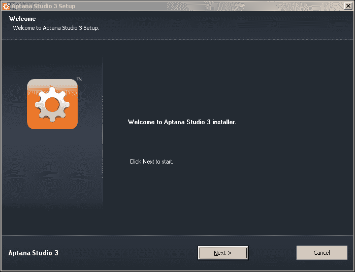

1.  点击**我同意**按钮以接受协议条款。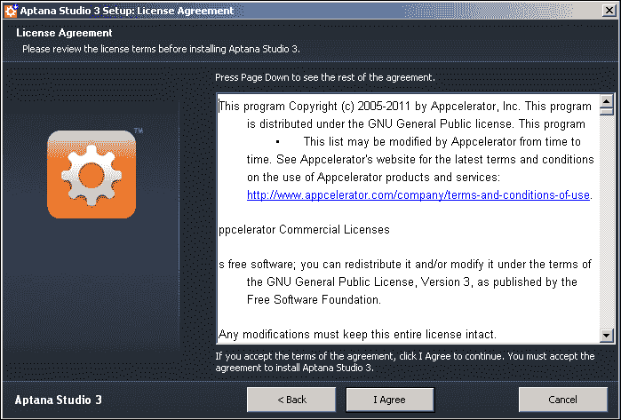

1.  选择 Aptana Studio 要安装的文件夹。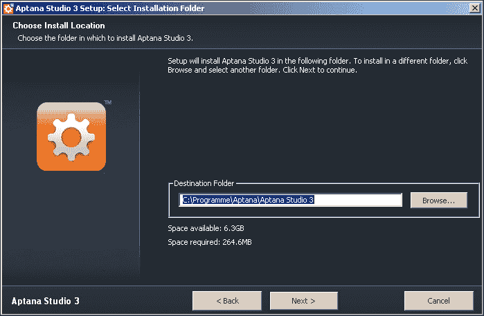

1.  现在，选择一个`开始`菜单文件夹。

1.  最后但同样重要的是，选择要关联到 Aptana Studio 的文件扩展名。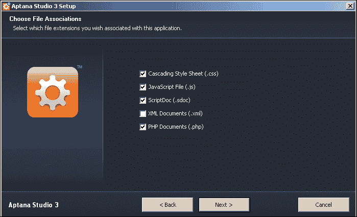

1.  现在，点击**安装**按钮以开始安装。

1.  安装过程完成后，只需点击**关闭**按钮即可完成安装。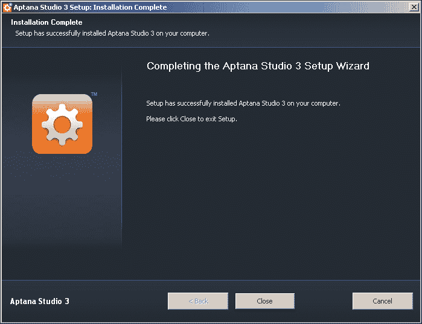

## *发生了什么？*

我们刚刚在一台运行 Windows 操作系统的机器上安装了 Aptana Studio。

# 动手实践 – 在 Mac 上下载和安装 Aptana Studio

1.  为了下载 Aptana Studio 的当前版本，请导航到 Aptana 主页[`www.aptana.com/products/studio3/download`](http://www.aptana.com/products/studio3/download)。

1.  简单地在网站上选择你的系统环境，并将 Aptana Studio 包下载到你的工作站上。

1.  双击下载的`.dmg`文件以提取安装文件。

1.  之后，你只需将 Aptana Studio 拖到你的**应用程序**文件夹中。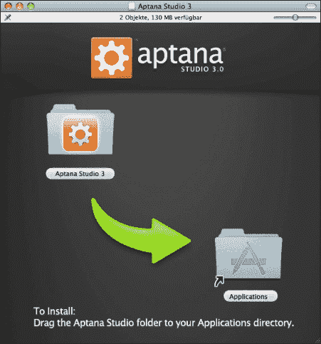

1.  就这样！

## *发生了什么？*

我们在 Mac 操作系统上安装了 Aptana Studio。

首次启动后，Aptana Studio 看起来如下截图所示：

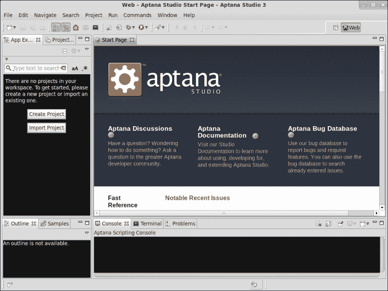

## 如何为 Java 增加内存

因为 Aptana Studio 是基于 Java 的，确保您允许 Java 分配所需的内存量。在 Aptana Studio 的默认配置中，内存参数已针对常见的大型项目和工 作空间进行调整。Aptana Studio 提供了两个参数来处理这种内存使用：

+   `-Xms` 参数定义了 Aptana Studio 在启动时应分配多少内存

+   `-Xmx` 参数定义了 Aptana Studio 被允许分配的最大内存量（Java 堆内存）

但有时，当你有很多大型项目时，例如，通过增加最大堆内存，你可能可以获得更好的性能。

### 小贴士

**如何显示当前使用的内存？**

为了查看当前的内存使用情况，您必须启用堆状态指示器。为此，导航到 **窗口** | **首选项** 并在左侧树中选择 **常规** 项。在那里，您将找到右侧的复选框，**显示堆状态**；选中它，然后单击 **应用**。现在，内存显示出现在主窗口的右下角。还有一个可用的垃圾箱按钮，可以运行垃圾收集器，该垃圾收集器可以释放不再需要的内存。

# 实践时间 – 增加 Java 内存

1.  为了增加内存，您必须编辑 `AptanaStudio3.ini` 文件，该文件位于安装文件夹中。您可以通过使用纯文本编辑器并调整内存参数来完成此操作。

    ```js
    nano /opt/Aptana\ Studio\ 3/AptanaStudio3.ini
    ```

    在我们的案例中，因为我们使用的是 Linux 系统，`.ini` 文件看起来像这样：

    ```js
    --launcher.XXMaxPermSize

    256m

    --launcher.defaultAction

    openFile

    -vmargs

    -Xms40m

    -Xmx512m

    -Declipse.p2.unsignedPolicy=allow

    -Declipse.log.size.max=10000

    -Declipse.log.backup.max=5

    -Djava.awt.headless=true
    ```

    在这里，您可以调整 `Xms` 和 `Xmx` 的值，并将它们更改为所需的兆字节数量。

1.  最后，Aptana Studio 需要重新启动才能使更改生效。

## *发生了什么？*

我们增加了 Java 的内存，以便 Aptana Studio 能够处理大型项目和工作空间。

# 升级系统

我们强烈建议保持系统更新。Aptana Studio 很可能包含一些需要修复的小错误，以便您可以尽可能有效地工作，而不会出现错误或可能的数据丢失。

### 小贴士

**您是否发现了一个可能的错误？**

如果您认为您发现了一个错误，请帮助 Aptana 开发团队尽快修复它，并在 [`jira.appcelerator.org/browse/APSTUD`](http://jira.appcelerator.org/browse/APSTUD) 上报告。在那里，您还可以了解您发现的错误是否已被开发团队跟踪。您也可以在 Aptana Studio 内部报告错误。我们将在 第十二章 *故障排除* 中探讨这一点。

在更新后看到总是有新的和有用的功能出现也是很令人高兴的。我个人总是使用更新站点来下载最新的测试版本。如果你更喜欢使用更稳定的版本，最好使用 Aptana Studio 3 发布更新站点。总的来说，有三种更新类型可供选择：

+   **稳定版本**：这些是最经过测试的。它们与从 Aptana 网站下载的版本相同。

+   **Beta 版本**：这些版本已经经过一定程度的测试，仍在为发布做准备。

+   **夜间更新**：这些直接来自开发者的服务器。这是可以找到最新功能和修复的 bug 的第一个地方。这些版本可能包含渐进式 bug。使用时请自行承担风险！

    ### 小贴士

    **什么是更新站点？**

    更新站点是一个简单的 HTTP 链接，其中包含更新 Aptana Studio 以及安装和更新插件所需的所有相关数据。

现在我们第一次运行 Aptana Studio，我们想检查是否有可用的更新。为此，我们只需在主菜单中导航到**帮助** | **检查更新**。

如果你收到以下消息，可能是因为你的系统用户在没有更改 Aptana Studio 文件权限的情况下打开了 Aptana Studio：

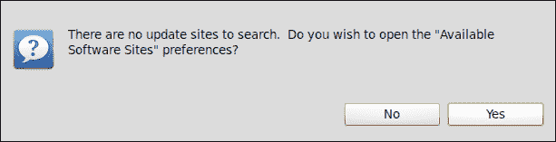

### 注意

确保启动 Aptana Studio 的用户拥有更新 Aptana Studio 文件的所需权限！我们已经在本章中看到过的以下命令调整了所需的权限：

```js
sudo chown thomas:thomas /opt/Aptana\ Studio\ 3 -R
```

如果用户拥有所需的权限，Aptana Studio 会检查所有已启用的可用更新站点，与他们联系，并检查是否有可用的更新。

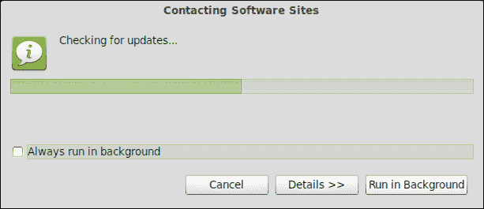

如果在你的任何启用的更新站点上都没有可用的更新，Aptana Studio 会显示消息**没有找到更新**。

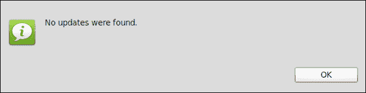

然而，如果有可用的更新，会出现一个窗口，显示你可以安装的所有更新。

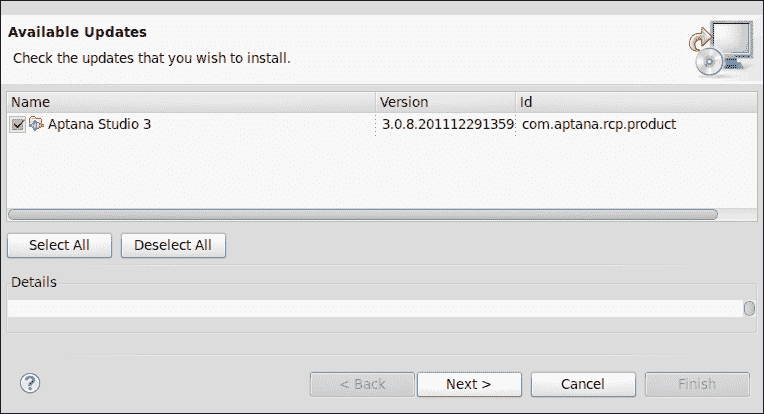

只需选择你想要更新的包，然后点击**下一步**。在确认页面上也点击**下一步**按钮。最后，确认**我接受许可协议条款**，通过点击**完成**来启动更新。

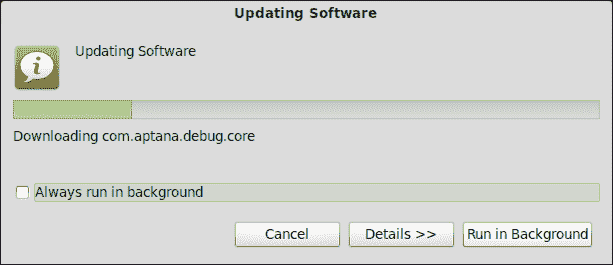

现在，Aptana Studio 连接到所有相关的更新站点，下载当前包并安装它们。完成此过程后，Aptana Studio 会询问你是否想要应用更改或重启 Aptana Studio。在这里，我强烈建议始终选择重启 Aptana。不幸的是，Aptana 重启需要一点时间，但你可以确信所有库都将成功加载。

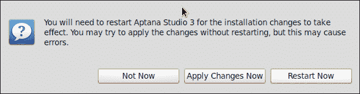

在这次重启后，你已经完成了你的第一个 Aptana Studio 更新。

### 小贴士

**如何确定已安装的 Aptana Studio 版本？**

要确定已安装的 Aptana Studio 版本，只需在主菜单中导航到**帮助** | **关于 Aptana Studio 3**。如果你还需要知道插件版本和更多信息，只需点击**安装详情**。

但是，在日常项目工作中，我们通常没有时间去考虑更新。因此，Aptana Studio 为您提供了一个更新提醒。

默认情况下，更新提醒会在每次 Aptana Studio 启动后检查是否有可用的更新。如果有更新，一个类似这样的弹出窗口会出现在主窗口的右下角：

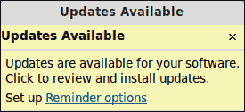

如果您想安装更新，只需在窗口内点击，更新管理器就会出现；它会显示可用的更新。

### 小贴士

**提醒选项**

您还可以通过点击**更新可用**通知中的**提醒选项**来更改自动更新的处理方式。您将被重定向到带有**自动更新**区域已选择的偏好设置。在这里，您可以选择 Aptana Studio 应该何时检查更新以及 Aptana Studio 应该如何处理下载和更新。

# 如何安装第三方插件

如果您想使用 Aptana Studio 与其他编程语言一起使用，这些语言是 Aptana Studio 自然支持的，您必须安装第三方插件。由 Eclipse 提供的插件系统是一项非常复杂的技术，使得安装额外的插件并保持它们更新变得非常容易。作为一个插件安装的例子，我们将从 Tigris 安装 Subversion 插件，我们将在后面的章节中看到。

# 操作时间 – 安装第三方插件

1.  在我们开始安装 Subversion 插件之前，我们必须检查 Aptana Studio 的更新并安装它们。强烈建议在安装每个插件之前都这样做。

1.  如果您的系统已更新，请打开**可用软件**窗口，您可以在**帮助** | **安装新软件...**下找到它。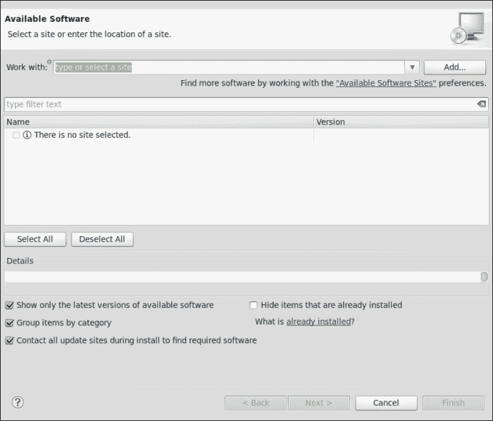

1.  在这里，您需要添加插件应从中安装的更新站点的 URL。

1.  但是，您从哪里可以获得插件所需的更新站点 URL 呢？

    大多数插件开发者通常会在他们的网站上提供这个更新站点 URL。有时，他们也会提供用于手动安装的附加包。但建议您使用更新管理器安装插件，因为管理器会检查所需的依赖项，如果依赖项不存在，则会阻止安装。

1.  因此，只需快速浏览到 Tigris Subclipse 网站，[`subclipse.tigris.org`](http://subclipse.tigris.org)，并确定当前可用的所需更新站点的 URL，即[`subclipse.tigris.org/update_1.6.x`](http://subclipse.tigris.org/update_1.6.x)。

1.  现在，我们回到 Aptana Studio，并点击**添加...**按钮以添加我们插件的新位置。

1.  对于**名称**，只需输入一个标签，例如`Subclipse 1.6.x`。但不要忘记添加插件的版本号。随着时间的推移，您可能需要为同一插件添加越来越多的更新站点。如果 Subclipse 插件有新的主要版本，也会有新的更新站点位置需要添加。因此，为了避免类似插件的混淆，始终指定一个能够清楚地识别您的更新站点的名称。您甚至可以使用 URL 直接作为标签。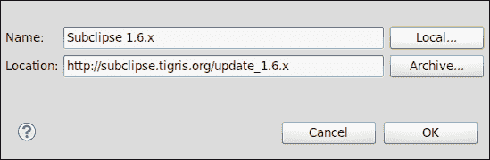

    ### 小贴士

    **从存档安装或更新**

    通常，您可能找不到您当前需要的插件的更新站点，但您找到了插件的`.jar`或`.zip`文件。没问题！只需下载它，然后点击**存档...**而不是填写位置链接，选择您的本地文件，然后安装即可。

1.  最后，您必须在**位置**字段中添加 URL，然后点击**确定**。

    ### 小贴士

    **更新站点**

    总是确保您有一个当前的更新站点。大多数插件开发者为他们每个主要版本的插件都有几个更新站点。

    现在，您需要稍等片刻，直到表格刷新。之后，您应该看到一个名为**Subclipse**的条目，您可以展开它。展开**Subclipse**节点，选择我们需要的包。在下面的截图中，您将看到我们需要为我们的**Subclipse**插件选择的包：

    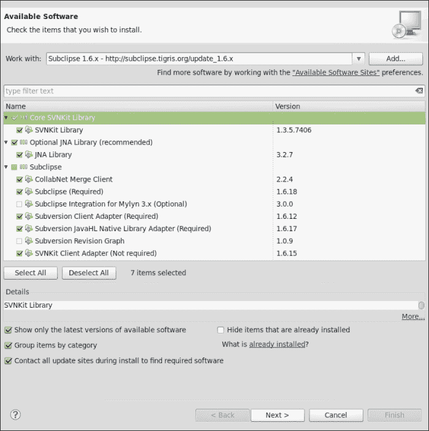

1.  点击**下一步**按钮，Aptana Studio 将检查所有依赖项是否满足，这应该是满足的。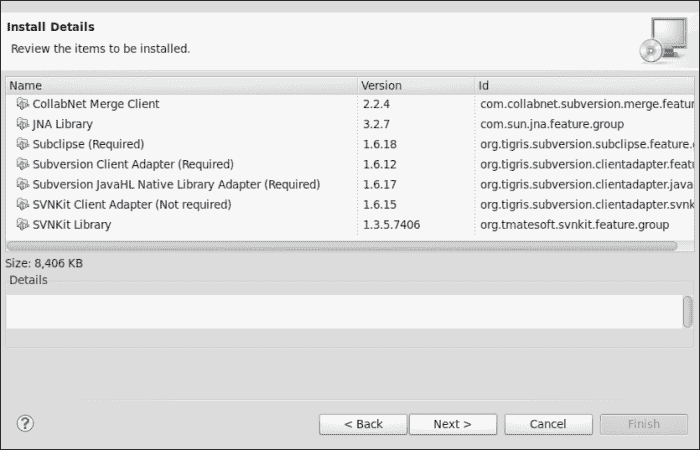

1.  如前一个截图所示，所有依赖项都已满足。因此，我们可以第二次点击**下一步**，在安装开始之前，您只需确认条款和条件即可。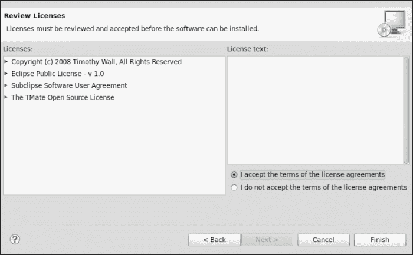

1.  当您点击**完成**时，Aptana Studio 会连接到更新站点，下载所需的包，并安装它们。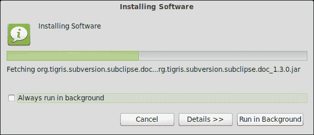

1.  当 Aptana Studio 完成插件的安装后，会出现一个对话框，建议您重新启动 Aptana Studio。我们也建议这样做；因此，您应该点击**立即重启**。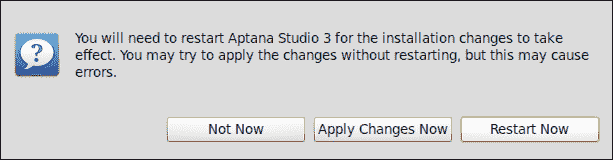

1.  当 Aptana Studio 再次启动时，插件会询问您是否想向 Subclipse 团队发送匿名使用统计信息。

1.  我认为通常支持开发者使用匿名数据是可行的，因为他们也使我们能够免费使用许多优秀的插件和软件。此外，我们通过我们的统计数据帮助他们优化插件，并帮助整合用户的新需求。

1.  因此，我们点击**确定**。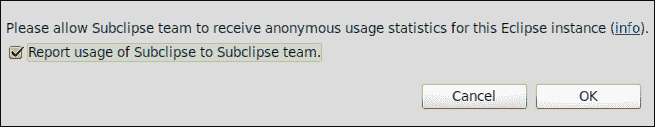

    如果您以后想改变您的决定，您可以在**窗口** | **首选项**下进行操作。在那里，您需要导航到**团队** | **SVN** | **使用报告**。

## *刚才发生了什么？*

我们刚刚安装了我们的第一个第三方插件。

安装成功后，您将在**窗口** | **打开透视图** | **其他…**下找到**SVN 仓库探索**。现在您能够添加一些仓库位置并在这里检出。我们将在第九章协同工作与 SVN 和 Git 中详细说明。

### 小贴士

**保持插件更新**

还需要经常检查您安装的插件是否有更新可用。因此，请确保在 Aptana Studio 更新管理器中选择所需的更新站点。

# 卸载 Aptana

在 Linux 上卸载 Aptana Studio 非常简单。只需从`opt`文件夹中删除 Aptana Studio 目录：

```js
sudo rm -r /opt/Aptana\ Studio\ 3
```

删除 Aptana Studio 软件文件夹后，您可以删除现在无用的符号链接：

```js
sudo rm /usr/bin/AptanaStudio3
```

但不仅如此。在安装过程中，Aptana Studio 创建的数据比你第一眼看到的多。会有用于工作区的文件夹。工作区的默认文件夹位于您的家目录中，`~/Aptana Studio 3 Workspace`。当您的项目和源代码备份完成后，您可以将其删除。

此外，还有一个在安装过程中创建的 Aptana ruble 文件夹。此文件夹包含您自定义和下载的 ruble。

### 小贴士

**什么是 Aptana ruble？**

Ruble 是 Ruby bundle 的简称，是一个允许通过 Ruby 扩展 Aptana Studio 编辑器的运行时环境。Rubles 与 TextMate bundles 兼容，因此您应该能够轻松地将它们转换为 Aptana ruble。

要在 Windows 上卸载 Aptana，只需使用**所有程序**菜单中的卸载程序。因为这样很简单——就像卸载大多数其他软件一样——我们不想在这里介绍。

Mac OS-X 用户只需将`Aptana`文件夹从`程序`文件夹拖到废纸篓中。

注意，在 Mac OS-X 和 Windows 上，还可能有用于 ruble 和工作区的单独文件夹。如果您不再需要它们，也请务必删除。

## 快速问答 – 测试您的安装知识

Q1. Aptana Studio 3 基于哪个软件框架？

1.  圆形

1.  Eclipse

1.  正方形

Q2. 在哪个 Aptana 文件中您可以调整内存参数？

1.  `AptanaStudio3.ini`

1.  `AptanaStudio3.pdf`

1.  `AptanaStudio3.conf`

Q3. 用于调整内存设置的参数名称是什么？

1.  `Xls`和`Xml`

1.  `Xtc`和`Xol`

1.  `Xms`和`Xmx`

# 摘要

在本章中，我们探讨了安装 Aptana Studio IDE 的要求。之后，我们安装了 Aptana Studio，检查了可用的更新，并安装了这些更新。我们学习了如何增加 IDE 的内存，并在后续章节中安装了 Subversion 插件。最后，我们了解了当不再需要 Aptana Studio 时如何卸载它。

现在，你已经准备好配置你的 Aptana Studio 安装，并了解更多关于视角和视图的信息。
