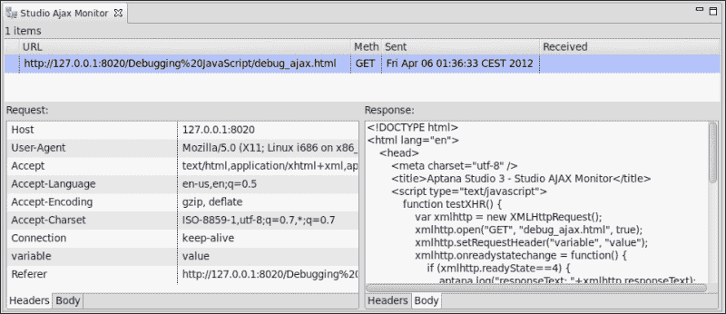

# 第四章 调试 JavaScript

*现在，当我们已经创建了我们的工作空间和项目后，我们可以开始使用 Aptana Studio。当然，您已经创建了自己的项目，其中包含一些用于您的 Web 应用程序或网站的文件。*

因此，在本章中，我们将查看以下内容：

+   安装 Aptana Studio 调试器扩展

+   使用调试控制台

+   使用断点

+   监控 AJAX 请求

+   卸载调试器扩展

# 调试视角

在我们开始调试应用程序之前，我们必须做的第一件事是切换到 **Window** | **Open Perspective** | **Debug** 下的 **Debug** 视角。**Debug** 视角包含几个有用的视图，如 **Console** 视图、**Debug** 视图、**Breakpoints** 视图等，这些对于 JavaScript 调试来说非常完美。

但首先，让我们从安装调试器扩展开始，这对于调试是绝对必要的。

## 安装 JavaScript 调试器

为了使用 Aptana Studio 调试一些 JavaScript 代码，我们需要为我们的浏览器安装所需的扩展。调试器扩展目前仅适用于 Firefox 和 Internet Explorer。

我们想要安装用于 Firefox 浏览器的 Debugger 扩展 **程序**。

# 安装 Aptana Debugger for Firefox 的行动时间

1.  启动您的 Firefox 浏览器。如果您还没有安装 Firefox，请现在安装。

1.  安装 Firefox 的 Aptana Debugger 扩展。您可以在 [`firefox.aptana.com/update/aptanadebugger.xpi`](http://firefox.aptana.com/update/aptanadebugger.xpi) 找到它。点击此链接，Firefox 将自动开始安装。只需您的确认和重新启动 Firefox 即可。

1.  安装扩展后，导航到 **Firefox** | **Add-ons** 并查看您的 **Aptana Debugger** 版本的要求数据。

1.  在我们的案例中，Aptana Debugger 1.7.2 需要 Firebug 1.2 到 1.8。现在导航到 [www.getfirebug.com](http://www.getfirebug.com) 并安装根据您当前安装的 Firefox 版本所需的 Firebug 扩展。我们导航到网站 [`getfirebug.com/releases/firebug/1.8/`](https://getfirebug.com/releases/firebug/1.8/) 并安装最高要求的 Firebug 版本 1.8。

    ### 小贴士

    **已经安装了 Firebug 的新版本？**

    如果您已经安装了 Firebug 的新版本，您需要卸载它并安装所需的版本之一。这可能是意外的，因为 Firebug 的新版本提供了许多很好的功能。在这种情况下，您可能需要安装第二个（较旧）版本的 Firefox，您只使用它进行 Aptana Studio 调试。

1.  安装完两个扩展后，重新启动 Firefox 以完成安装。

## *刚才发生了什么？*

你已经为使用它来调试 Aptana Studio 项目准备了 Firefox 浏览器。具体来说，这意味着你已经集成了 Aptana 调试扩展和所需的 Firebug 扩展。

### 注意

强烈建议 Firebug 扩展与 Aptana 调试扩展兼容。

# 配置调试器

Aptana Studio 为你提供了配置许多不同调试配置的选项。例如，如果你安装了不同版本的 Firefox 或 Internet Explorer 的本地版本，你可以为这些浏览器中的每一个创建一个调试配置，这样你只需在工具栏上单击一次即可开始在这些浏览器中调试你的代码。

# 执行动作 – 创建调试配置

1.  为了创建调试配置，我们点击**调试**工具栏按钮右侧的小三角形，以展开**调试**菜单并选择条目**调试配置…**。

1.  点击配置窗口左上角的**新建启动配置**按钮（一个白色纸张符号）。

1.  当 Studio 在左侧树中的**Web 浏览器**节点下方插入配置条目后，将调试配置的名称输入到右上角的**名称**字段中。例如，我们输入名称`Firefox - 内部服务器`。![执行动作 – 创建调试配置]

1.  在**主**标签页中选择一个浏览器，我们的调试功能将在其中运行。例如，我们输入 Firefox 的路径，`/usr/bin/firefox`。

1.  此外，我们希望开始在当前页面上启动调试器；因此，我们在**启动操作**部分选择**使用当前页面**选项。

1.  我们选择**使用内置 Web 服务器**条目，因为我们的第一个简单调试配置应该使用内部 Web 服务器。

1.  之后，只需点击**应用**以保存配置的第一个设置。

1.  此外，我们希望我们的调试配置应出现在工具栏中的**调试**菜单下。因此，我们在**常用**选项卡和**显示在收藏夹菜单中**列表中的**调试**条目中选择。

1.  最后，点击**应用**以保存更改，然后点击**关闭**以完成创建。

## *发生了什么？*

我们已经创建了一个调试配置，此外还可以直接在工具栏中选择它。当你选择此配置时，Aptana Studio 将打开相关的浏览器并开始调试。


# 调试 JavaScript

在我们创建了 JavaScript 调试所需的配置后，让我们继续看看我们如何调试 JavaScript 文件。

# 执行动作 – 调试 JavaScript

1.  首先，点击**调试**工具栏按钮，以便调试当前打开的文件。

1.  如果你还没有安装调试器扩展，你会收到以下消息：

1.  在这种情况下，只需点击**是**，Aptana Studio 就会在后台直接安装它。快速且成功安装后，你会收到相应的消息，点击**确定**后可以继续。

    ### 注意

    如果在调试器扩展安装期间 Firefox 正在运行，你可能需要重新启动 Firefox。如果在安装期间 Firefox 正在运行，并且你没有重启就继续，你会收到一个**套接字连接错误**的错误消息。请尝试关闭并重新启动你的网络浏览器，然后再次运行**调试**。

1.  现在，下次 Firefox 启动时，你会收到**另一个程序想要使用以下插件修改 Firefox**的消息。在这里，我们必须选择**允许此安装**并点击**继续**。

1.  为了完成 Firefox Aptana 调试器扩展的安装，你必须再次重新启动 Firefox。

1.  最后，调试过程应该在简单的浏览器中运行你的脚本。

## **发生了什么？**

我们已经调试了第一个 JavaScript 代码。但在这一过程中，我们没有看到任何引人注目的变化——一切行为都像往常一样。

这是因为我们还没有设置断点或任何其他调试操作。但因为我们确实想这么做，让我们看看调试器为我们提供的调试代码的选项。

在我们继续前进之前，我们必须停止当前的调试过程。因此，我们点击**终止**视图按钮，它显示为一个红色方块，你可以在**调试**视图和**控制台**视图中找到它。或者，你也可以直接关闭运行调试过程的浏览器窗口。

# 控制台视图

**控制台**视图允许你在程序处理时打印一些日志条目。你可以在处理过程中直接打印值、类型等。

例如，以下操作仅在**控制台**视图中打印一条简单的消息：

```js
// Just print a string
aptana.log('something to print');

// Print a string with some variable
aptana.log('this is the value: ' + variable);
```

这两个动作的输出看起来如下：

```js
something to print
this is the value: helloWorld
```

**控制台**视图的另一种方法是`trace`方法。`trace`方法将在**控制台**视图中打印完整的回溯，这样你可以快速定位问题的位置。

```js
aptana.trace(someVariable);
```

# 行动时间 - 使用控制台视图

1.  准备一个包含以下 JavaScript 代码的 HTML 文件：

    ```js
    <script type="text/javascript">
        function someLoopWithinAFunction(loopEnd) {
            try {
                var someResult = 0;
                for(var i=1 ; i<=loopEnd ; i++) {

                    // Logging some variable value 
                    aptana.log(someResult + "+" + i);
                    someResult += i;
                }

                // Logging a simple variable by using backtrace
                aptana.trace("Backtrace a variable: " + someResult);

                // Logging an exception by using backtrace
                throw new Error("Some error happens");

            } catch(exception) {

                // Execute some backtrace
                aptana.trace(exception);
            }
            return someResult;
        }
        var result = someLoopWithinAFunction(5);

        // The finishing result
        aptana.log("The result is: " + result);
    </script>
    ```

1.  切换到**调试**视角。

1.  通过点击**调试**工具栏按钮来启动调试过程。

1.  一个 Firefox 窗口会自动打开并执行我们的 JavaScript 代码。

1.  现在，**控制台**视图包含所有日志值和回溯信息。

## **发生了什么？**

我们刚刚执行了一些包含一个`aptana.log`和两个不同`aptana.trace`的 JavaScript 代码。**控制台**视图现在显示所有记录的值。


在前五行中，我们看到`aptana.log`的结果，这是在循环中调用的。这五个条目只记录计算。

接下来是第一个带有简单变量的回溯。这是一个非常有用的功能。正如你所看到的，变量的值被打印出来，后面跟着程序过程的完整回溯。你可以看到所有依次调用的函数，并在**控制台**视图中列出。在这种情况下，每个函数调用都显示文件名和相关的行号，这样你可以快速找到它们的位置。此外，你还可以双击这个文件名，编辑器会自动跳转到该函数。

第二个回溯显示了如何将回溯与异常结合起来，这样在出现问题时你总是能得到足够的信息。

最后，如果你经常使用`aptana.log`和`aptana.trace`，这里有一个警告。最常出现的错误之一是，在 JavaScript 代码中忘记调用`aptana.log()`或`aptana.trace()`。在正常的调试过程中，这并不总是显而易见的——但是如果你直接在浏览器中执行 JavaScript 代码（没有调试控制台），你会得到一个“**Aptana 未定义**”的错误信息。

这是正确的，因为 Aptana Studio 的库不再包含在内。所以为了优化你的代码并防止这种错误，你可以在一个单独的函数中包装 Aptana 函数，该函数检查 Aptana 的库是否可用。这可以像以下代码那样：

```js
<script type="text/javascript">
    function myLog(value) {
        if(typeof aptana != "undefined") {
            aptana.log(value);
        }
    }
    function myTrace(value) {
        if(typeof aptana != "undefined") {
            aptana.trace(value);
        }
    }
    var logValue = new Date();
    myLog(logValue);
    myTrace(logValue);
</script>
```

# 使用断点

**断点**视图会给你一个关于你在当前工作区中设置的断点的概述。在下面的屏幕截图中，你可以看到**断点**视图，代码的第 11 行有一个断点：


但是，什么是断点，为什么你应该设置它？

断点是在你的源代码中的一个确切位置，调试器应该在这里停止执行。例如，如果你的代码中有一个动作循环，但代码中的某个地方出了问题（可能是你的变量；它们得到坏值或不正确的类型）。在这种情况下，你可以在循环中设置一个断点，并精确地查看所有变量值以及它们在每个周期中的变化。

### 注意

如果你在一个行上设置断点，执行总是在该行本身执行之前停止。

对于“动作时间 - 添加断点”部分，我们需要以下 JavaScript 代码：

```js
function someLoopWithinAFunction(loopEnd) {
    var someResult = 0;
    for(var i=0 ; i<loopEnd ; i++) {
        someResult += i;
        aptana.log("i: " +i); // Add a breakpoint here
    }
    return someResult;
}
var result = someLoopWithinAFunction(5);
aptana.log("result: " +result);
```

# 动作时间 - 添加断点

1.  打开一个包含 JavaScript 标签的 JavaScript 文件或 HTML 文件，并复制其中的 JavaScript 代码。

1.  搜索**在此处添加断点**行，并在行号左侧单击鼠标右键。

1.  选择**切换断点**以设置断点。

1.  或者，您也可以在您右键单击的位置双击。

1.  在调试器中执行文件。

## *发生了什么？*

我们刚刚手动在循环中的一行上设置了断点，调试器应该在每次循环中停止，这样您就可以检查脚本环境的当前状态。

### 提示

**恢复断点**

如果您想恢复断点，您可以简单地按*F8*。

如果您查看**控制台**视图，您会看到以下输出：

```js
i: 0
i: 1
i: 2
i: 3
i: 4
result: 10
```

如您所见，调试器在每个循环周期中打印`i`变量的当前值，以及计算结果的最终结果。

### 注意

调试器仅在放置在具有可执行源代码的行上的断点处停止。如果您在空行上设置断点，调试器将忽略它。

如果您在脚本中放置了多个断点，而在脚本的实际执行中不需要其中一些，您可以选择禁用您的断点。

# 操作时间 – 禁用断点

1.  打开**断点**视图并搜索不必要的断点。

1.  取消选中断点条目左侧的复选框。

1.  或者，您也可以在编辑器中搜索断点行。

1.  在行号旁边的蓝色断点上单击鼠标右键。

1.  选择**断点属性…**并取消选中**启用**复选框。

1.  最后，单击**确定**。

## *发生了什么？*

您通过使用**断点**视图并在编辑器的行号旁边选择**断点属性…**来禁用断点。

### 提示

**识别禁用断点**

要在整个 IDE 中识别禁用和启用断点非常容易。禁用断点始终以白色点显示，启用断点始终以蓝色点显示。

# 操作时间 – 在断点上设置命中次数

1.  搜索我们当前放置断点的行。

1.  在相关行号左侧的蓝色断点上单击鼠标右键。

1.  选择**断点属性…**条目。

1.  选择**命中次数**复选框并输入数字`3`。

1.  在调试器中执行文件。

## *发生了什么？*

现在我们调整了断点，使其不仅仅在第三次到达时停止。

如果您已经知道您循环中的问题在第三次循环时首次发生，这将非常有用。现在调试器也会在您想要查找问题的循环中停止。

### 提示

**使用命中次数或条件来识别断点**

通过与**断点**视图和编辑器一起工作，您可以通过点左侧的小问号始终使用命中次数或条件来识别断点。

如果您想查找错误，**变量** 视图非常有用。**变量** 视图显示所有变量及其值，以及变量定义的类型和变量在当前断点作用域中的实际类型。为了选择显示的列，您可以导航到 **视图菜单** 中的 **布局** | **显示列**。


### 注意

**变量** 视图仅在断点停止您的 JavaScript 时显示信息。

# 行动时间 – 在断点处检查变量并更改它们的值

1.  执行最后调试的 JavaScript 代码，并设置 Hit Count 断点。

1.  当脚本在断点处停止时，在 Aptana Studio 中打开 **变量** 视图。

1.  查看变量列表并检查它们是否正确。

1.  双击 `loopEnd` 变量的值，将其从 `5` 更改为 `7`。

1.  按 *Enter* 键以接受新值。

1.  之后，按 *F8* 键以继续调试过程。

## *发生了什么？*

现在您已检查了断点处的当前变量，并将 `loopEnd` 变量更改为新值。通过完成脚本，**控制台** 视图应该有如下输出：

```js
i: 0
i: 1
i: 2
i: 3
i: 4
i: 5
i: 6
result: 21
```

如您所见，脚本直接假设新的变量值，并现在执行了七个循环。

# Studio AJAX 监视器

如果您正在开发一个在整个执行过程中发送大量 AJAX 请求的应用程序，了解返回的数据类型通常是必要的。为此，Aptana Studio 提供了 **Studio AJAX 监视器**，在其中您可以跟踪所有 AJAX 请求及其响应。

**Studio AJAX 监视器** 由三部分组成。首先，是所有请求的概述。在这里，您可以查看哪个 URL 使用哪种方法请求，以及请求的时间。

另外两部分分别是请求信息和响应信息的一部分。它们都分别位于 **头部** 区域和 **主体** 区域，您可以在这里详细检查 AJAX 请求。


对于 *行动时间 – 安装调试器扩展* 部分，我们需要一个像以下这样的小脚本：

```js
function testXHR() {
    var xmlhttp = new XMLHttpRequest();
    xmlhttp.open("GET", "debug_ajax.html", true);
    xmlhttp.setRequestHeader("variable", "value");
    xmlhttp.onreadystatechange = function() {
        if (xmlhttp.readyState==4) {
            aptana.log("responseText: "+xmlhttp.responseText);
        }
    }
    try {
        xmlhttp.send("Debug AJAX");
    } catch(exc) {
        dump("XMLHttpRequest exception: " + exc);
    }
}
testXHR();
```

# 行动时间 – 卸载 Aptana 调试器扩展

1.  打开一个包含 JavaScript 标签的 JavaScript 文件或 HTML 文件，并将 JavaScript 代码放置在其中。

1.  执行调试并打开 **Studio AJAX 监视器** 视图。

1.  现在浏览器执行 AJAX 请求，我们能够在 **Studio AJAX 监视器** 视图中检查它们。

1.  查看视图中列出的 AJAX 请求。

## *发生了什么？*

您已发送了一个简单的 AJAX 请求，该请求直接列在 **Studio AJAX 监视器** 视图中。在这里，您可以检查请求，它在何时开始，发送了什么类型的头部，以及响应中包含哪些数据。



# 卸载调试器

也许你想卸载 Aptana Studio 或其他软件，并且你也想卸载 Aptana 调试器。

让我们看看如何卸载 Aptana Firefox 扩展。

# 行动时间 - 卸载 Aptana 调试器扩展

1.  打开 Firefox 并导航到 **工具** | **附加组件**。

1.  选择 **扩展** 部分。

1.  选择 **Aptana 调试器** 扩展，然后点击 **移除**。

1.  最后重新启动 Firefox。

## *刚才发生了什么？*

我们刚刚从你的 Firefox 中移除了 Aptana 调试器扩展。现在该扩展不再可用。

## 尝试一下英雄 - 选择一个你未编写的 JavaScript 文件，并使用调试器检查其功能

现在你的任务是前进并选择一个由其他开发者编写的 JavaScript 文件。将其集成到一个简单的 HTML 包装文件中，并尝试检查其功能。使用 **断点** 和 **日志** 函数来学习脚本是如何工作的。

## 快速问答

Q1. 如果你想在 **控制台** 视图中打印回溯，你必须调用哪个函数？

1.  `aptana.log()` 函数。

1.  `aptana.print()` 函数。

1.  `aptana.trace()` 函数。

Q2. 为什么当你的应用程序进入公共使用时，有必要移除所有 Aptana 函数？

1.  因为所有使用你应用程序的用户都收到了你的调试消息。

1.  因为所有使用你应用程序的用户都收到了错误消息，因为在非调试器使用情况下，Aptana 对象不可用。

1.  没有必要移除 Aptana 函数。脚本有或没有它都能正常工作。

Q3. 为什么你不在空行内放置断点？

1.  因为调试器会在此行停止调试。

1.  因为调试器会忽略断点，脚本将继续执行。

1.  没有理由。在空行上放置断点也能正常工作。

Q4. 禁用的断点是什么颜色？

1.  禁用的断点是红色。

1.  禁用的断点是蓝色。

1.  禁用的断点是白色。

# 摘要

到本章结束时，你应该能够调试你的 JavaScript 代码。这意味着，你应该知道如何设置和移除断点，以及如何找到可用的断点。

如果断点在代码中停止执行，你应该知道如何检查你应用程序当前状态下的变量。

现在，我们准备开始下一章，我们将探讨如何记录我们的 JavaScript 文件和项目。
