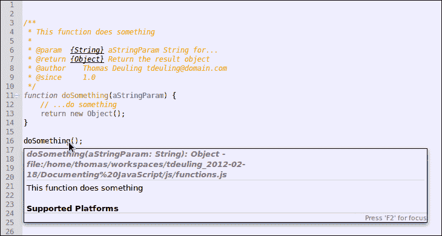
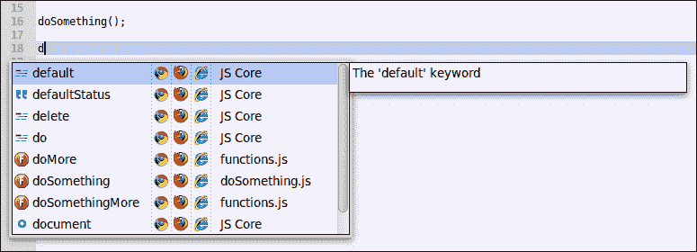
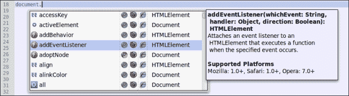

# 第五章：代码文档和内容辅助

*编写代码文档非常重要。众所周知，当接手扩展或修改其他开发者的脚本任务时，在开始工作之前，他们必须理解脚本的流程并了解开发者的思路。当其他开发者的源代码有良好的文档时，这将变得容易得多。*

*但有时也会发生这样的情况，您必须处理的是自己开发的脚本，但这已经是很久以前的事情了，所以您已经不再详细记得功能了。*

*因此，建议您始终在开发阶段对脚本（文件、类、属性、方法、函数）进行文档记录。在这个阶段，您对功能有最深入的了解。因此，Aptana Studio 理解 ScriptDoc 并使用它与内容辅助功能结合使用。*

在本章中，我们将探讨以下内容：

+   ScriptDoc 是什么以及它提供的标签

+   创建通用文档注释

+   使用内容注释片段并使用内容辅助功能结合使用

# ScriptDoc

ScriptDoc 是一个工具，它从 JavaScript 文件中提取所有文档，并将这些信息提供给 Aptana Studio，以便它可以生成内容辅助功能的内容。ScriptDoc 自动扫描您的项目以查找 ScriptDoc 文档块，并使用内容辅助功能显示信息提示。例如，一旦为函数创建了一个 ScriptDoc 注释，内容辅助功能就会知道您的新函数，并在您在项目中的某个地方使用该函数时向您显示信息。

但这样的注释究竟应该是什么样子呢？

ScriptDoc 注释以 `/**` 开始，并以正常的多行注释 `*/` 结束。在这两个标记之间，您可以插入一些标签来描述您的文档注释。

以下表格为您提供了一个可用标签的小概览，您可以使用这些标签来记录您的代码：

| 标签 | 定义和示例 | 适用范围 |
| --- | --- | --- |
| `@alias` | 定义类或函数的 ID。示例：`* @alias aliasName` | 任何 |
| `@author` | 定义类的描述。示例：`* @author Thomas Deuling tdeuling@domain.com` | 任何 |
| `@classDescription` | 定义类的描述。示例：`* @classDescription Description ...` | 函数 |
| `@constructor` | 定义一个函数是一个类的构造函数。示例：`* @constructor` | 函数 |
| `@deprecated` | 定义一个函数或属性已弃用。示例：`* @deprecated` | 函数和属性 |
| `@example` | 定义一个示例。示例：`* @example Example code` | 任何 |
| `@exception` | 定义一个函数抛出的异常。示例：`* @exception {TestException} ThrowDescription` | 函数 |
| `@id` | 允许您将函数或属性的文档链接到外部 ScriptDoc 文件。例如：`/** @id */` | 任何 |
| `@inherits` | 定义一个函数继承自另一个函数。例如：`* @inherits functionNameA, functionNameB` | 函数 |
| `@internal` | 定义一个函数或属性不应在内容辅助功能中可见。例如：`* @internal` | 函数和属性 |
| `@memberOf` | 定义一个函数是某个类的成员。例如：`* @memberOf className` | 函数和属性 |
| `@method` | 定义一个函数是一个类的成员方法。例如：`* @method` | 函数 |
| `@namespace` | 为文件定义一个命名空间。例如：`* @namespace coding.ms` | 文件 |
| `@param` | 定义函数的参数。例如：`* @param {String} paramName 描述` | 函数 |
| `@private` | 定义一个函数或属性是私有的。例如：`* @private` | 函数和属性 |
| `@projectDescription` | 定义文件描述。它必须是第一个文档块中的第一个标签。例如：`* @projectDescription 描述文本 ...` | 文件 |
| `@property` | 定义类的属性。例如：`* @poperty {Array} 数组用于 ...` | 文件 |
| `@return` | 定义返回值的类型和描述。例如：`* @return {Object} 返回描述` | 函数 |
| `@see` | 链接到相关的类或函数。示例链接到函数：`* @see #functionName`示例链接到类：`* @see className`示例链接到方法：`* @see className#methodName` | 任何 |
| `@since` | 定义主题是在哪个版本中创建的。例如：`* @since 1.0` | 文件、函数和属性 |
| `@type` | 定义属性的 数据类型。例如：`* @type {Object} 对象描述` | 属性 |
| `@version` | 定义文件或类的版本。例如：`* @version 1.1` | 任何 |

这些 ScriptDoc 标签为您提供了良好的代码文档基础，这样几乎所有的其他开发者都能理解您的脚本有什么用途。

在以下部分，我们将查看文件、函数和属性的注释看起来是什么样子的。

## JavaScript 文件注释

首先，我们将查看文件注释。文件注释应包含 `@projectDescription` 和 `@author` 标签，这些标签描述了文件中的源代码类型以及谁编写了它。此外，还可以有 `@namespace`、`@since` 和 `@version` 标签，这样每个人都知道代码在哪个命名空间中可访问，以及文件自哪个版本以来存在，以及当前版本是什么。

`@property` 标签也很有用，应该为每个显著的属性添加。

以下是一个常见的文件注释：

```js
/** 
 * @projectDescription File description
 *
 * @author    Thomas Deuling tdeuling@domain.com
 * @namespace coding.ms
 * @version   1.1 
 * @since     1.0
  *
 * @property  {String} 
 */
```

### 注意

不要忘记，带有 `@projectDescription` 标签的文件注释必须是 JavaScript 文件中第一行内的第一个文档块。

## JavaScript 属性注释

接下来是属性注释，它描述了一个类的属性。因此，如果您正在编写包含一些属性的类，您应该用描述其目的的描述来记录它们。如果属性是类的私有属性，您应该使用`@private`标签。但`@since`和`@type`标签也很有用，并帮助每个人了解类有多少时间有这个属性以及它的类型。

这里是一个常见的属性注释：

```js
/**
 * Property description
 * @type {Object}
 * @private
 * @since     1.0
 */
```

# JavaScript 函数注释

现在，最后，是函数注释。

它可以用于函数或方法。如果函数是方法，则注释包含`@method`标签。此外，还可能有`@constructor`标签，它定义了该方法是该类的构造函数。但在任何情况下，注释都应该包含`@author`和`@since`标签，以便清楚地知道谁编写了该函数以及为您的应用程序的哪个版本。此外，您应该为每个函数参数创建一个`@param`标签。这些`@param`标签包含参数的类型、变量名以及用例描述。最后，如果有，`@return`标签（如果有的话）描述了函数返回的数据类型。

最后，一个常见的函数注释示例：

```js
/**
 * Function description
 *
 * @param  {String} paramName Description
 * @return {Object} Return description 
 * @author    Thomas Deuling tdeuling@domain.com
 * @since     1.0
 */
```

# 操作时间 - 显示函数注释

现在，让我们看看如何显示这些函数注释。

1.  创建一个包含以下内容的 JavaScript 文件：

    ```js
    /**
     * This function does something
     *
     * @param  {String} aStringParam String for...
     * @return {Object} Return the result object
     * @author    Thomas Deuling aptana@coding.ms
     * @since     1.0
     */
    function doSomething(aStringParam) {
        // ...do something
        return new Object();
    }
    doSomething();
    ```

1.  保存文件。

1.  将鼠标悬停在函数调用上。

## *发生了什么？*

我们刚刚创建了一个带有 ScriptDoc 注释的函数。通过将鼠标悬停在以下截图中的该函数的函数调用上，如第 16 行，Aptana Studio 会显示一个包含 ScriptDoc 注释信息的工具提示：



### 小贴士

**信息工具提示在哪里？**

如果在将鼠标悬停在函数调用上时没有出现信息工具提示，请转到**窗口** | **首选项**，然后转到**Aptana Studio** | **内容辅助**。在这个区域，您必须选择**悬停时显示信息**选项。

# 内容辅助功能

内容辅助功能为您提供有关属性、方法和函数的信息。相关信息以工具提示的形式显示，正如我们在“操作时间 - 显示函数注释”部分中看到的那样。当工具提示中的信息大于可用的工具提示空间时，只需在光标位于函数或对象上时按*F2*键，工具提示就会变得粘性，这样您就可以在工具提示内滚动。

# 操作时间 - 使用内容辅助功能

内容辅助功能会自动弹出，并提供一个上下文菜单，其中您可以查看当前作用域中可用的对象、函数等。

1.  按照在“操作时间 - 显示函数注释”部分中提到的步骤打开 JavaScript 文件。

1.  将光标放在文件中的任何位置。

1.  开始输入一个函数或对象名称。例如，我们想使用**文档**对象，因此我们按下字母*D*。

1.  现在，内容辅助功能为你提供了一个上下文菜单，列出了所有以字母“d”开头的可用对象和函数。

    ### 小贴士

    **手动触发内容辅助功能**

    如果你需要内容辅助功能但它没有自动出现，你可以通过使用快捷键*Ctrl* + 空格键手动触发它。

1.  使用上箭头和下箭头键选择所需的条目，或者输入更多字母以获得更精确的结果列表。我们选择了**文档**对象。

1.  如果你已选择了所需的条目或只剩下一个条目待选，只需按下*Tab*键插入所需的代码。

1.  在将**文档**对象插入并输入点以从**文档**对象调用方法之后，内容辅助功能重新出现，这次它为你提供了对象的所有可用方法。

## *发生了什么？*

我们已经使用内容辅助功能完成了所需的语句，即使我们不知道相关对象上可用的属性细节。下面的截图显示了与*Time for action – using the Content Assist*部分相关的内容辅助功能。



## 浏览器功能

但内容辅助功能可以做更多。如果你必须为不同的浏览器编写代码，而这些浏览器你知道它们的功能非常不同，你需要知道哪个浏览器提供了哪些功能。如果你不知道，它会导致许多开发错误，仅仅因为你不知道特定的浏览器不支持某个功能。

对于这个问题，Aptana Studio 提供了一个额外的有用功能。如果你开始编写浏览器提供的对象（如**文档**对象）的语句，代码辅助会为你提供一个可用功能的列表。但如果你仔细观察，你会在每个条目的右侧看到很多浏览器图标。每个图标表示相关的浏览器是否理解该功能。当图标是全色的，表示该浏览器支持该功能；否则图标是灰色的，表示浏览器不支持该功能。如果没有可用的信息，内容辅助功能假定该属性是可用的。

# 动手实践 – 更改内容辅助功能使用的用户代理

1.  导航到**窗口** | **首选项**。

1.  在左侧树形结构中的**Aptana Studio**选项卡下选择**内容辅助**条目。

1.  在右上角选择你将设置提供用户代理的项目类型。

1.  在我们的例子中，选择**Web**条目。

1.  检查所需的浏览器并点击**确定**接受选择。我们选择了 Chrome、Firefox 和 Internet Explorer。

## *发生了什么？*

我们选择了项目必须支持的网络浏览器。为了测试当前选择的浏览器，只需打开一个 JavaScript 文件并输入 `document`。查看内容辅助功能；现在它应该只显示列表中选定浏览器的图标。



另一个不错的功能是，你可以使用自己的代码使用内容辅助功能。如果你想使用自己的代码使用内容辅助功能，你必须文档化你的对象、方法和函数。

你还可以通过为每个注释创建代码片段来优化编写代码文档的过程。这些代码片段很容易通过使用内容辅助功能插入。

## 尝试一下英雄——为包含 JavaScript 代码的项目编写文档

现在，自己选择一个目前正在构建的小型 JavaScript 项目，并为所有对象、方法、函数和属性添加文档。完成后，检查内容辅助功能如何为你提供有关自己代码的信息。

## 快速问答

Q1. 如何编写文档注释块，以便 ScriptDoc 解析器能够解析它？

1.  `/**`

1.  `/*`

1.  `//`

Q2. 带有 `@projectDescription` 标签的文件注释在 JavaScript 文件中必须位于何处？

1.  带有 `@projectDescription` 标签的文件注释必须是你的 JavaScript 文件中的最后一个文档块。

1.  带有 `@projectDescription` 标签的文件注释必须是你的 JavaScript 文件第一行的第一个文档块。

1.  位置无关紧要。

Q3. 显示函数注释需要采取什么行动？

1.  将鼠标悬停在函数调用上方。

1.  点击函数调用。

1.  右键点击函数调用。

Q4. 哪个快捷键使信息工具提示保持粘性，以便在工具提示内容不适合时，你可以阅读完整信息？

1.  *F2*

1.  *Ctrl* + *S*

1.  *F1*

Q5. 哪个快捷键触发内容辅助功能？

1.  *Ctrl* + *Alt* + *Delete*

1.  *Ctrl* + *F2*

1.  *Ctrl* + 空格键

# 摘要

到本章结束时，你应该能够编写你的 JavaScript 代码的文档，使其符合 ScriptDoc。此外，你应该详细了解如何编写 JavaScript 代码的文档，以便每个开发者都能理解你的脚本及其功能。

现在我们向前迈进，看看我们如何与 HTML 和 CSS 一起工作，并检查它们。
