# 第九章. 使用 SVN 和 Git 进行协作工作

*协作工作是目前的一个重要话题。现在许多大型项目都是以协作方式进行开发的。但这对开发者来说并不总是容易。当许多开发者共同在大项目上工作时，每个开发者都必须有一个公认的工作区域，并且每个开发者都必须确保他不会干扰其他开发者的工作。*

*如果没有像 SVN 或 Git 这样的工具，像 jQuery 或 Linux Mint 这样的大型项目将无法实现。所有这些项目的开发者分布在世界各地，他们经常在不同的时区工作，有不同的工作方式，但最终所有部分都合并到一个伟大的 SVN 或 Git 项目中。*

*因此，SVN 和 Git 对所有开发者来说都是一项巨大的财富，对于大型网络项目的快速进展至关重要。*

*让我们看看在 Aptana Studio 中使用 SVN 和 Git 是多么简单。*

在本章中，我们将涵盖以下主题：

+   **SVN** 视角提供了哪些视图

+   检出 SVN 仓库

+   在项目资源管理器中识别不同状态下的文件

+   更新和提交 SVN 项目

+   如何读取 SVN 历史、比较版本和恢复旧版本

+   克隆 Git 仓库以接收项目

+   使用本地 Git 仓库

+   如何在 Git 仓库中暂存、取消暂存、还原和提交

+   推送和拉取远程 Git 仓库

# 使用 SVN

首先，我们将查看 **SVN** 视角。我们已经在 第二章 中检查了如何安装 SVN 插件，*基础和如何使用视角和视图*。如果您还没有安装，请切换回 第二章 并安装它。

**SVN** 视角提供了一组视图，帮助我们与 Subversion 服务器一起工作。您可以通过在 Aptana Studio 窗口的右上角使用视角菜单来打开此视角。

与 SVN 相关的重要且最常用的视图，我们将要查看的，包括 **SVN 仓库** 视图、**团队** | **历史** 视图和 **SVN** | **控制台** 视图。这些视图被归类为选择进入 **SVN** 和 **团队** 文件夹的视图，如下面的截图所示：

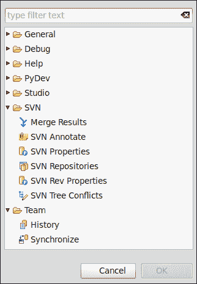

**SVN 仓库** 视图允许您添加新的仓库并管理所有可用的仓库。此外，您还有创建仓库的新标签或分支的选项。这些视图属于 **SVN** 视图，如下面的截图所示：

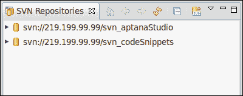

**历史** 视图允许你了解项目及其修订历史的大致情况。这个视图被 SVN 和 Git 项目使用；因此，这个视图被存储在 **团队** 视图组中。可以通过 **窗口** | **显示视图** | **历史** 菜单打开 **历史** 视图。在这里，你可以看到所有带有其注释和数据创建时间的修订。此外，你可以查看文件的所有修订版本，并且还有比较所有修订版本的能力。以下截图显示了 **历史** 视图：

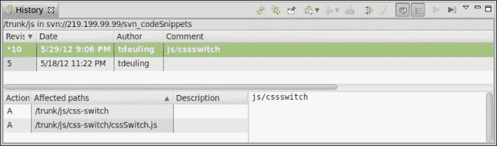

在 SVN **控制台** 视图中，你可以找到由 Aptana Studio 执行的所有 SVN 操作的输出。因此，如果你遇到 SVN 冲突或其他问题，你可以查看这个 **控制台** 视图的输出，可能会更快地定位到问题。当安装了 SVN 插件时，SVN **控制台** 视图会自动集成到 Aptana Studio 控制台中。所以，如果你需要 SVN **控制台** 视图，只需从 **窗口** | **显示视图** | **控制台** 打开常规 **控制台** 视图。如果 **控制台** 视图已经打开，只需使用视图菜单选择 **控制台** 类型，在这种情况下是 **SVN 控制台** 项。

以下截图显示了 **控制台** 视图以及如何选择 **SVN 控制台**：

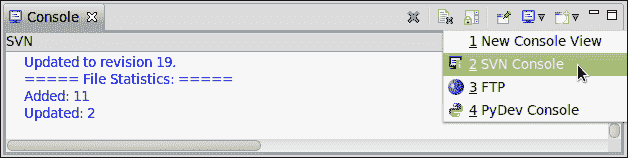

然而，在我们开始使用 SVN 之前，我们必须添加相关的 SVN 仓库。

# 执行动作 – 添加 SVN 仓库

1.  通过使用 Aptana Studio 窗口右上角的视角菜单打开 **SVN** 视角。

1.  现在，你应该能在 Aptana Studio 窗口的左侧看到 **SVN 仓库** 视图。如果它没有自动打开，可以通过选择导航菜单中的视图来打开它：**窗口** | **显示视图** | **SVN 仓库**。

1.  为了添加新的 SVN 仓库，点击 **SVN 仓库** 视图顶部的带有加号的小 SVN 图标。

1.  你现在需要在弹出的窗口中输入 Subversion 服务器的地址，例如，`svn://219.199.99.99/svn_codeSnippets`。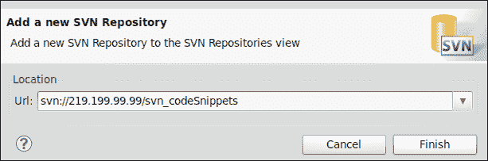

1.  点击 **完成** 按钮后，Aptana Studio 将尝试连接到 Subversion 服务器，以完成添加新仓库的过程。

1.  如果连接到 Subversion 服务器并且 SVN 仓库受密码保护，你必须输入读取 SVN 数据的访问数据。

1.  如果您目前没有可用的所需访问数据，您可以中止进程，Aptana Studio 将询问您是否想要保留位置。如果您点击 **否**，新添加的 SVN 仓库将被删除，但如果您点击 **是**，位置将保持不变。这允许您稍后检索所需的访问数据，输入它们，并开始使用 SVN 仓库。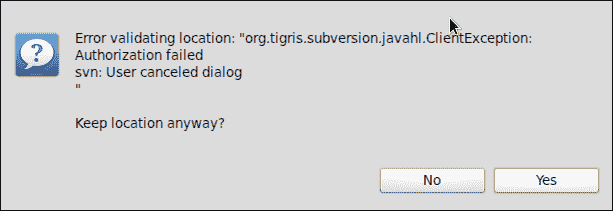

1.  无论您是保留位置还是输入所需的访问数据，新的 SVN 仓库都将列在 SVN 仓库视图中。

## *发生了什么？*

我们已将一个新的 SVN 仓库添加到 Aptana Studio 中。新的仓库现在列在我们的 **SVN 仓库** 视图中，我们可以从这里检出，或者创建新的标签或分支。

## 检出 SVN 仓库

在我们了解了如何将新的 SVN 仓库添加到 Aptana Studio 后，我们还想知道如何检查这个仓库以便与包含的源代码一起工作。

您可以像在 Aptana Studio 中做许多其他事情一样，以不同的方式完成此操作。我们将查看如何直接从 **SVN 仓库** 视图中完成此操作，因为每次我们将新的仓库添加到 Aptana Studio 中，我们都会想要检查它并使用它作为项目。

# 操作时间 – 检出 SVN 仓库

1.  打开 **SVN 仓库** 视图。

1.  扩展您希望检出的 SVN 仓库。我们这样做是因为我们想要从仓库中检出 trunk 目录，而不是 tags 和 branches 目录。

1.  现在，右键单击 trunk 目录并选择 **检出...** 选项。

1.  Aptana Studio 现在将从 Subversion 服务器直接读取 SVN 仓库的属性。当收到所有所需的属性后，以下窗口将出现在您的屏幕上：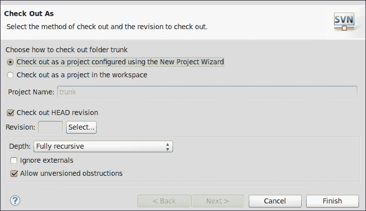

1.  首先，我们选择 **在工作区中检出为项目** 选项，并输入新 SVN 项目的名称。

1.  然后，我们选择我们想要检出的修订版本。这通常是头修订版本。这意味着您想要检出最后提交的版本——称为头修订版本。但您可以从过去检查任何想要的修订版本号。如果是这样，只需取消选择 **检出 HEAD 修订版本** 复选框，并输入您想要检出的修订版本号。

1.  在最后一部分，我们在 **深度** 下拉列表中选择 `完全递归` 选项，取消选择 **忽略外部** 复选框，但选择 **允许未版本化障碍** 复选框。

1.  在您选择了这些设置后，点击 **下一步** 按钮。

1.  最后，你可以选择项目应该创建的位置。通常，这是当前工作区，但有时位置可能不同。也许你已经安装了 Web 服务器，并希望将源代码直接放置在 Web 根目录中，以便在本地机器上直接运行 Web 应用程序。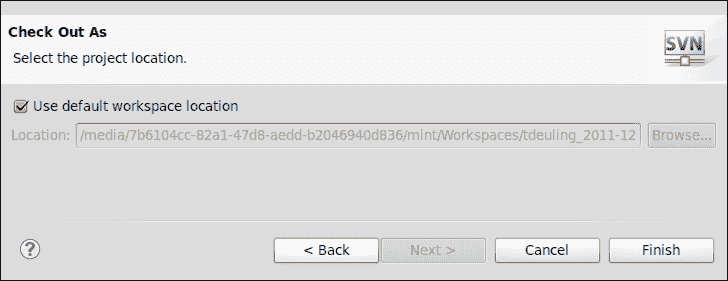

1.  最后，无论你是否为项目选择不同的位置，你都必须点击**完成**按钮以最终将“检出”到新项目。

## *发生了什么？*

我们已从**SVN 仓库视图**检出 SVN 仓库。除此之外，我们还看到了如何将仓库源代码检出到工作区以外的其他位置。最后，你现在应该有一个准备好的 SVN 项目，你可以开始工作了。

## 文件状态

如果你现在正在修改源代码文件中的某些行，**项目资源管理器**视图和**应用程序资源管理器**视图会更改文件的图标，使你看到一个黑色背景上的小白色星号。这意味着自上次提交/更新以来文件已更改。

还有一些其他的小图标，它们提供了有关相关文件和目录的信息。让我们更仔细地看看以下截图所示的**标签装饰**选项卡：

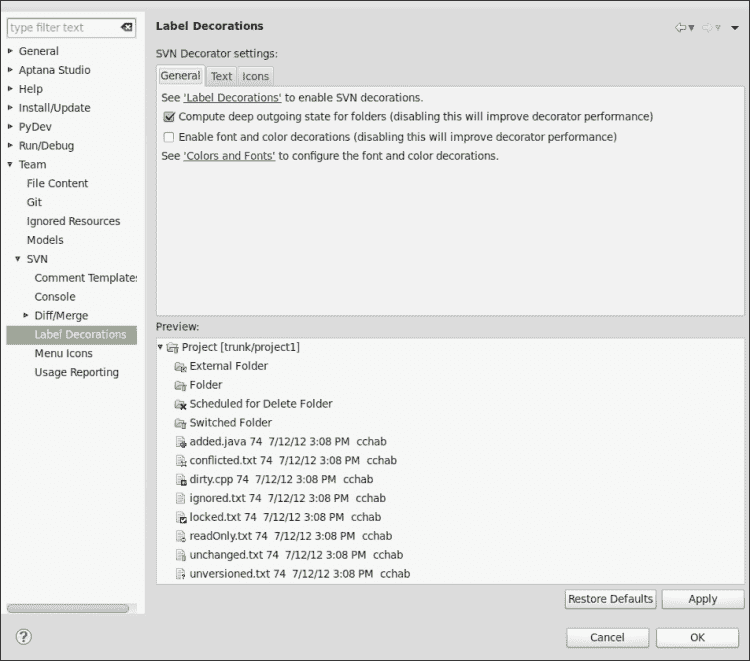

现在，我们将按之前截图所示的顺序讨论这些符号：

+   小上升箭头表示这个文件或目录是外部文件。

+   小黄色圆柱形符号表示这个文件或目录已经处于版本控制之下。

+   红色**X**符号表示这个文件或目录被标记为删除。下次你提交更改时，该文件将被删除。

+   小蓝色圆柱形符号表示文件或目录已被切换。这些是除了其本地父目录之外属于不同工作副本的文件或目录。

+   小蓝色加号符号表示这个已经版本化的文件或目录需要添加到仓库中。这些可能是你重命名或移动到不同目录的文件或目录。

+   小角形方块表示这些文件与仓库存在冲突。

+   黑色背景上的小白色星号表示这些文件或目录自上次提交以来已更改。

+   如果文件或目录的图标没有小符号，这意味着该文件被 SVN 仓库忽略。

+   黑色背景上的小白色钩子表示这个文件或目录已被锁定。

+   小红色停止标志表示这个文件或目录是只读的。

+   小黄色圆柱形符号表示这个文件或目录已经处于版本控制之下，并且自上次提交以来没有更改。

+   小问号表示这个新文件或目录目前未处于版本控制之下。

如果你在这份列表中没有找到你的图标，或者你的图标看起来不同，没有问题。只需导航到**窗口** | **首选项**，然后在树中的**团队** | **SVN**下选择**标签装饰**条目。在这里，你可以找到所有使用的图标。

## 提交 SVN 仓库

如果你已经通过一些新功能扩展了你的网络应用程序，你现在可以提交这些更改，以便更改被存储在仓库中，其他开发者也可以更新他们的工作副本并获取新功能。

但你如何简单地提交更改的文件？

与 Git 仓库不同，SVN 允许你从仓库提交树中的更改。通过使用 Git，你只能一次性提交整个仓库的更改。但到目前为止，我们想要提交我们的 SVN 仓库更改，因此只需遵循以下 *行动时间 – 更新和提交 SVN 仓库* 部分中提到的步骤。

# 行动时间 – 更新和提交 SVN 仓库

1.  在执行提交之前的第一步是更新你的工作副本。因此，我们将首先这样做，Aptana Studio 从 Subversion 服务器读取所有新修订版本并将它们与你的本地工作副本合并。为了进行此更新，右键单击你的项目根目录，然后选择**团队** | **更新到 HEAD**。

1.  当你的工作副本是最新的时，导航到**应用资源管理器**视图或**项目资源管理器**视图，然后右键单击你想要提交的文件或目录，然后在**团队**选项中选择**提交...**条目。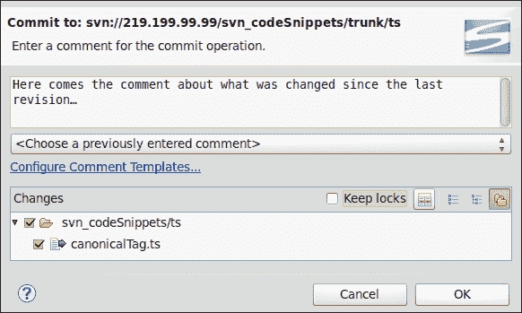

1.  如果你选择了一些目录或整个项目，**提交**窗口只会列出自上次提交以来发生变化的那些选择中的文件。因此，你可以只选择你想要提交的文件和目录。按照你的需要组合选定的文件和目录，并在窗口顶部输入注释。

    ### 提示

    **为什么提交更改时必须输入注释？**

    因为，通过提交 SVN 仓库，它会自动保存日期、时间和你的用户名；有了这些数据，修订历史记录会存储有关 *谁在何时更改了哪个文件* 的信息。除此之外，还有注释部分。注释应该描述所做的更改及其目的。

1.  要完成提交，你只需单击**确定**按钮，提交过程就会开始。

1.  如前所述，你可以在 SVN **控制台**视图中看到所有你的 SVN 进程的输出。在下面的屏幕截图中，你可以看到我们的提交过程的结果：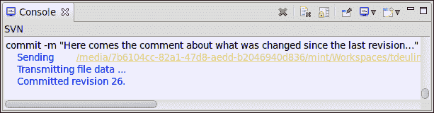

## *刚才发生了什么？*

我们已经更新了我们的工作副本以提交我们的更改。现在其他开发者也可以更新他们的工作副本，然后可以与你一起工作。

### 提示

请参考第十一章，*优化工作和提高协作*，了解如何优化此过程。

再次需要注意的是，建议在每次提交之前执行更新。您可以在单个文件树节点中执行更新。您不必每次都更新整个项目，单个节点也可以提交。

## 更新 SVN 存储库

此外，类似于 SVN 检出，您还有选项将工作副本更新到 Head 修订版本，也可以更新到特定的修订版本号。为了做到这一点，在**项目资源管理器**视图中右键单击项目根目录，并选择**更新到 Head...**选项或**团队**选项卡下的**更新到版本...**选项。选择这些条目之一后，Aptana Studio 确定所有新文件和要更新的文件，从存储库下载它们，并将它们与您的本地工作副本合并。

现在，您应该已经拥有了当前项目的所有源代码。但是，您如何识别文件中哪些部分是新的或已更改的？

没问题！Aptana Studio 不仅允许您比较两个不同的本地文件，您还可以比较存储库中不同修订版本的文件。请参考以下*操作时间*部分了解这是如何工作的：

# 操作时间 - 使用 SVN 历史和比较文件

1.  首先，我们将查看单个文件的 SVN 历史记录。您也可以在整个目录或项目中这样做；现在我们将对单个文件进行操作，但步骤是相同的。在**App 资源管理器**或**项目资源管理器**视图中导航到您的 SVN 项目。

1.  选择您想要检查的文件或目录，右键单击它，并在**团队**选项卡中选择**显示历史记录**条目。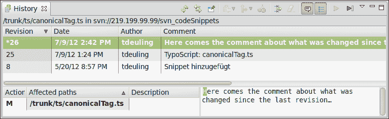

1.  在 SVN **历史**视图中（如图中所示），顶部列出了所有修订版本，以及所选文件更改和提交的位置。在我们的例子中，文件最初是在修订版本**8**中提交的，然后在修订版本**25**和**26**中进行了更新。此外，您还可以看到修订版本的日期和提交该修订版本的用户名称。最后一列是**注释**列，其中包含有关提交中更改的更多信息。

    SVN **历史**视图底部区域中的列表取决于顶部区域中选择的修订版本，并显示在**历史**视图当前所选范围内受影响的文件。

1.  如果您在底部列表中双击单个文件，Aptana Studio 将从 Subversion 服务器加载所选修订版本的文件，并在相关编辑器中打开它。在编辑器的头部，您可以看到附加到文件名的打开修订版本的编号，如图中所示：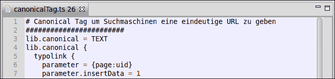

    文件以只读模式打开，仅因为它是已提交的文件。

1.  现在您已经知道如何从您的 SVN 项目中检查文件的旧版本，但了解文件在不同版本之间哪些部分发生了变化也同样有趣。

    为了此目的，您可以使用 **比较...** 功能。在底部区域选择您想要比较的文件，右键单击它，然后选择 **比较...** 选项。

    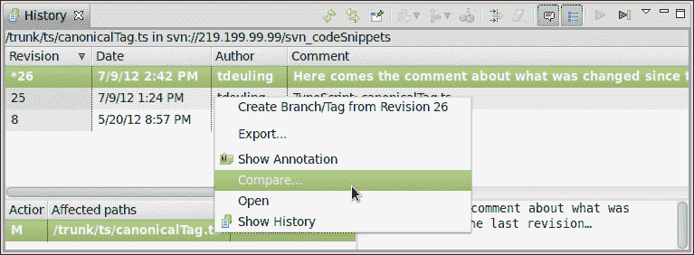

1.  如下截图所示，窗口允许您选择您想要比较的两个文件。我们已经通过右键单击它来选择了第一个文件。此文件将自动输入到 **比较来源** 字段中。**比较目标** 字段将由 Aptana Studio 自动输入。在这里，Aptana Studio 只倒数一个数字。但在我们的案例中（如前一个截图所示），有一个修订 **25**。在这种情况下，由于没有修订 **25**，Aptana Studio 选择修订 **8** 进行比较，因为它是在修订 **25** 之后最后检查的一个。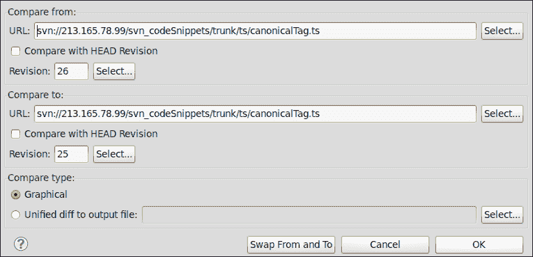

1.  选择您想要比较的两个文件修订后，只需单击 **确定** 以加载 **比较** 视图。

    ### 小贴士

    **在比较来源和目标字段之间切换**

    如果比较修订字段已按相反顺序输入，只需单击 **交换来源和目标** 按钮，Aptana Studio 将交换这两个字段。

1.  Aptana Studio 打开这两个文件修订版本的 **比较** 视图，您可以检查差异。在我们的案例中（如下面的截图所示），我们比较修订 **27** 和 **26**，正如您从文件名顶部的修订号后缀中可以看到，修订 **27** 在左侧，修订 **26** 在右侧。

    从左到右，您可以查看所有差异。这里很明显，只有三行注释被插入。您可以看到第 19 行上的水平线，它表示一个差异。它也在第 21 行结束，其中包含差异的行结束。在中间的空间中，在两个文本区域之间有一个灰色列。在这个列中，显示了视觉行，显示了新行被添加的确切行。在左侧的行中，第 19 行到第 21 行通过一行视觉线与第 18 行和第 19 行之间的右侧水平线相连。这表明新行是在第 19 行添加的。

    一个很好的功能是，当您将编辑器向左滚动时，右侧编辑器会自动与左侧编辑器同步滚动。

    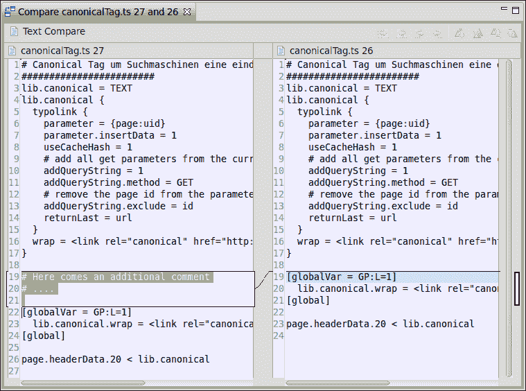

1.  但是，当你想要比较一些文件时，你不必总是通过 SVN **历史**视图的长路径。你也可以导航到**应用程序资源管理器**视图或**项目资源管理器**视图，选择你想要比较的文件，然后右键单击它。在上下文菜单（如以下截图所示）中，选择**与...比较**条目，你将得到一个包含最常用比较选项的子菜单。

如果你想要比较两个都不在子版本控制中，甚至可能在不同的项目中，只需在**项目资源管理器**视图中按住**Ctrl**键选择这两个文件，然后右键单击其中一个文件，在**与...比较**选项中选择**彼此**条目。比较视图的**比较**将类似于以下截图：

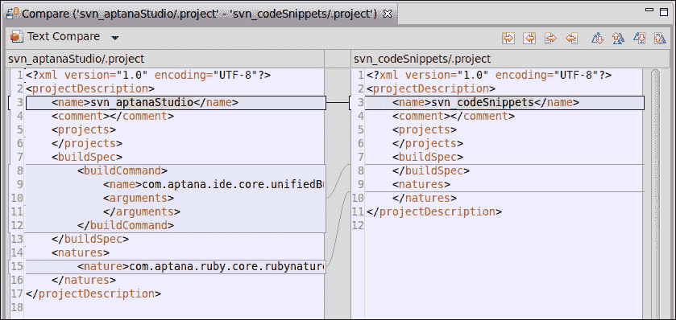

## *发生了什么？*

我们已经看到，通过使用 SVN **历史**视图，检查文件在先前版本中哪些部分发生了变化是多么容易。从列出文件的所有可用版本开始，我们还讨论了如何将这些版本相互比较。本节还讨论了比较来自其他项目的不同文件。

## 动手实践英雄——检出 SVN 仓库并与之工作

现在，你的任务是向 Aptana Studio 仓库视图添加一个 SVN 仓库，并将其直接检出到一个项目中。在你创建了 SVN 项目之后，继续在其中工作。更改一些文件并提交更改。当你提交了一些文件后，查看 SVN **历史**视图，看看更改是如何显示的。最后，从 SVN **历史**视图中选择一个文件，并将其与主修订版本的文件进行比较。

## 快速问答——测试你新获得的 SVN 知识

Q1. 在每次提交之前推荐做什么？

1.  检出新的工作副本

1.  执行更新

1.  执行清理操作

Q2. 如何识别项目内文件的状态？

1.  右键单击文件，选择**属性**条目，然后在打开的窗口中选择**子版本控制**部分。

1.  文件没有不同的状态。

1.  你可以通过文件图标上的小符号来识别文件的状态。

Q3. 当你在进行项目工作时，注意到所做的更改不是你想要的，并且你想恢复到原始状态，应该怎么做？

1.  删除完整的工作副本并再次检出。

1.  尝试使用**Ctrl** + **Z**快捷键撤销所有更改。

1.  选择相关的文件和目录，并在**项目资源管理器**视图中的上下文菜单中使用它来撤销更改。

Q4. 如何比较来自两个不同项目的两个文件？

1.  您必须选择**项目资源管理器**视图中的两个文件，右键单击其中一个文件，然后在**与...比较**选项下选择**彼此**。

1.  在**项目资源管理器**视图中选择第一个文件，打开它，并将第二个文件拖放到同一个编辑器中。

1.  您必须选择**项目资源管理器**视图中的两个文件，并将这些文件拖放到编辑器区域。

# 使用 Git

就像 SVN 一样，Git 是一个版本控制和源代码管理系统，最初由林纳斯·托瓦兹（Linus Torvalds）开发。SVN 和 Git 之间的区别在于 Git 是一个分布式版本控制系统，而 SVN 是一个集中式版本控制系统。

Aptana Studio 自带对 Git 源代码管理的内置支持。但是，如果您使用的是基于 Linux 的操作系统，您必须手动安装 Git 包。您可以使用以下命令来完成此操作：

```js
apt-get install git
```

如果您使用的是基于 Windows 的操作系统，您不需要安装任何额外的组件。Aptana Studio 预包装了便携式 Git，因此您可以直接使用 Aptana Studio 使用 Git。

克隆 Git 仓库并使用此克隆创建新项目的方法有多种。在此阶段，我们将查看完成此操作的最快方法。

### 提示

**发生了什么？**

与 SVN 流程一样，Git 流程也是在控制台执行的。因此，每次操作后都会有一些输出，只有一个小的区别；Git 使用 Aptana Studio 的系统控制台。

# 操作时间 - 克隆远程 Git 仓库

1.  导航到**应用资源管理器**视图或**项目资源管理器**视图。在视图的背景上右键单击，从上下文菜单中选择**导入...**选项。

1.  在打开的窗口中（如下面的截图所示），展开`Git`文件夹。选择**将 Git 仓库作为新项目**选项，然后单击**下一步**。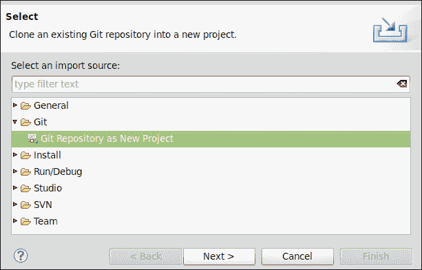

1.  现在我们必须确定我们希望克隆的 Git 仓库的**URI**。在此示例中，我们将选择具有以下 URI 的**Less Css**项目[`github.com/cloudhead/less.js.git`](https://github.com/cloudhead/less.js.git)

1.  接下来，选择克隆文件应存储的项目**目标**目录。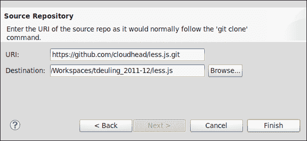

1.  最后，您可以通过单击**完成**按钮来完成此过程。

## *发生了什么？*

我们已经克隆了 Git 仓库，并在同一过程中创建了一个新的 Aptana Studio 项目，其中源代码被复制。现在我们可以扩展此项目。以下截图显示了**项目资源管理器**视图，您可以在其中找到您的 Git 项目：

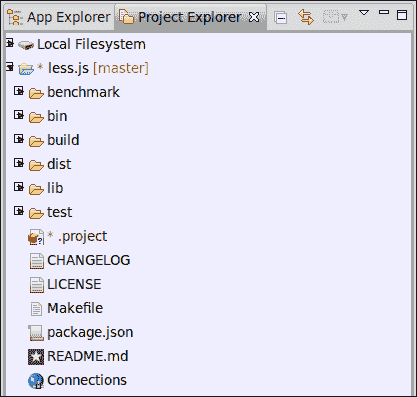

有时候，有些文件不应该添加到仓库中。在这种情况下，你可以将这些文件添加到一个类似于 SVN 的忽略列表中。只需选择相关的文件，右键单击它，然后在**团队**条目下选择**添加到 .gitignore**条目。如果是第一个被添加到忽略列表的文件，Git 仓库会在与被忽略文件相同的目录中创建一个额外的 `.gitignore` 文件。

## 创建 Git 仓库

创建 Git 仓库既快又简单。参考以下**行动时间**部分，了解如何进行此操作。

# 行动时间 – 为新或现有项目创建新的本地 Git 仓库

1.  首先，如果你想为新的项目创建本地 Git 仓库，请创建一个项目。

1.  现在，在**项目资源管理器**视图中导航到你的项目，右键单击它，然后在**团队**选项卡下选择**共享项目...**条目。

1.  在随后打开的窗口中，如图所示，你必须选择你想要使用的仓库类型。选择**Aptana Git**并点击**下一步**。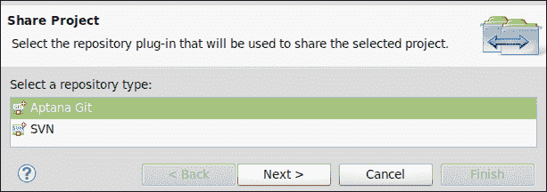

1.  配置新的 Git 仓库。Aptana Studio 创建所需的基础设施并将它们保存在 `.git` 目录中。

    在列表中选择你的项目条目，点击**创建...**，然后就可以了。Aptana Studio 创建了本地仓库并禁用了**创建...**按钮，因为项目现在是一个 Git 仓库项目。

    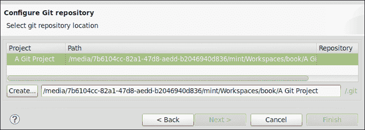

1.  最后，你可以通过点击**完成**按钮来关闭窗口。

## **发生了什么？**

我们已经创建了一个新项目（以防项目之前不可用），并将这些项目集成到一个新的 Git 仓库中。现在，让我们在我们的新 Git 仓库中管理我们的源代码版本做一些工作。

# 行动时间 – 使用新的本地 Git 仓库

1.  导航到**应用资源管理器**视图，创建一个新文件，例如，创建一个名为 `hello.php` 的文件，并在其中编写一些 PHP 代码。现在我们的 `Git` 项目和新文件将看起来像以下截图所示：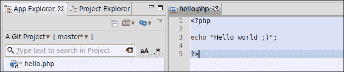

1.  文件图标上的小问号告诉你，这个新文件目前还没有处于版本控制之下。为了标记这个文件以供下一次提交，右键单击新文件并选择**暂存**条目。之后，小问号应该会变成一个绿色的加号。

1.  现在你已经创建了一个新文件，向其中写入了一些代码，并标记了这个文件以供下一次提交。

1.  为了将新文件提交到本地仓库，右键单击文件并选择**提交...**条目。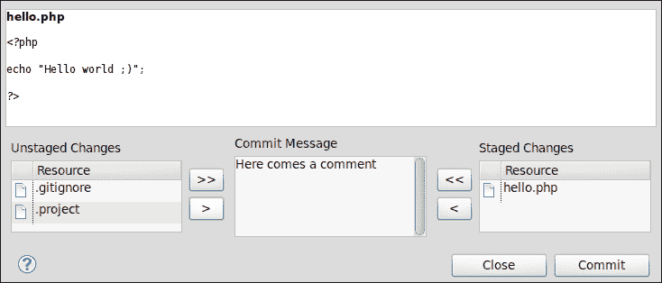

1.  提交窗口，类似于前面的截图，包含四个区域。在顶部，您将找到当前选定文件的内容。在左下角，您将找到所有未暂存的文件；这包括您不想提交的所有文件。在右下角，您将找到所有已暂存的文件，也包括您想要提交的文件。最后，在底部中间，您将找到一个用于提交注释的区域。填写一个简短的注释，说明您在更改的文件中做了什么，然后点击**Commit**。

1.  Git 完成提交操作后，右下角的暂存文件区域将被清除。现在您可以通过点击**Close**按钮关闭窗口。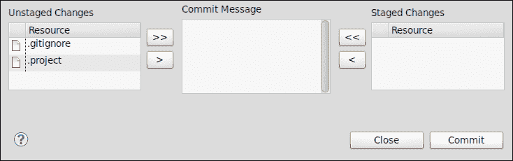

1.  现在我们已经将第一个文件检入 Git 仓库，我们可以继续在文件中添加一些新行。之后，我们可以保存这些更改并更仔细地查看**App Explorer**视图（如下面的截图所示）。我们会看到在文件图标和文件名之间有一个*****符号。这表明该文件是“脏的”（这意味着自上次提交以来该文件已更改）。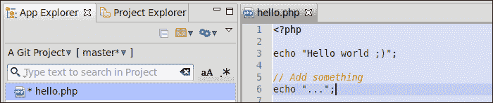

1.  在扩展了您的 Web 应用并且对结果满意之后，您可能希望提交这些更改。您可以通过类似的方式执行此操作。首先，您必须暂存想要提交的文件，然后点击**Commit...**按钮。

    在提交窗口的顶部（如下面的截图所示），显示当前选定的提交文件的地方，您现在可以看到自上次提交以来发生了什么变化。

    绿色行表示已添加的行，红色行表示已删除的行。

    存储行号的左侧列已被复制。左侧包含上一个提交文件的行号，右侧包含当前文件版本的新的行号。

    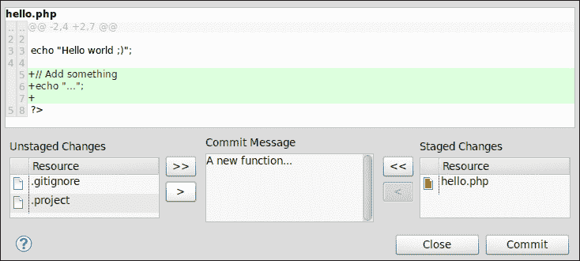

1.  为了完成提交过程，点击**Commit**按钮，然后点击**Close**按钮。

1.  如果您对某些更改想要撤销，没问题。右键单击相关文件并选择**Revert...**条目。现在，Aptana Studio 将文件恢复到最后提交的状态。

    如果**Revert...**条目变灰，可能意味着您已经暂存了想要撤销的文件。首先选择**Unstage...**条目，然后撤销您的更改。

## *发生了什么？*

我们已经与本地 Git 仓库项目进行了操作。简而言之，我们创建了新文件，填充了代码，并将第一个版本提交到 Git 仓库。之后，我们扩展了文件并提交了这些更改。此外，我们还看到了如果你想要撤销所做的更改应该怎么做。

## 拉取和推送 Git 远程项目

如果你已经完成了对本地克隆项目扩展的工作，或者如果你想将本地克隆与远程克隆合并以获取新扩展，你将到达需要使用**推送**和**拉取**功能的地步。

首先，我们需要了解**推送**和**拉取**功能的意义是什么？

**推送**功能将本地 Git 仓库的所有更改发送到远程仓库，并在远程端合并，而**拉取**功能则是从远程 Git 仓库拉取所有更改，并与本地仓库合并。

# 行动时间 - 拉取和推送 Git 远程项目

1.  在**项目资源管理器**视图中，导航到你想要推送的项目。

1.  确保你想要推送的所有文件都已经提交到本地 Git 仓库，否则你可能会收到**一切更新**的消息。

1.  右键单击项目根目录，在**团队**选项卡中选择**推送...**条目。

1.  如果需要远程 Git 仓库的授权，你将看到以下窗口，你可以在此输入用户名和密码：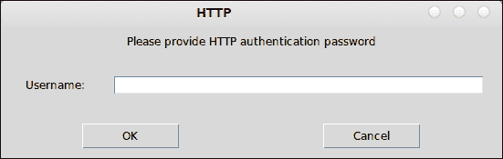

1.  在推送过程完成后，可以在**控制台**视图中看到 Git 仓库的日志，如下截图所示：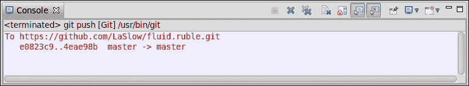

1.  拉取过程也很简单，可以快速完成。在**项目资源管理器**视图中，导航到你想要通过拉取远程 Git 仓库进行合并的项目。右键单击它，然后选择**团队**|**拉取...**。

1.  在后台，Aptana Studio 加载远程仓库并将其与你的本地仓库合并。

    在此过程完成后，如果没有发生冲突，控制台会显示所有新文件或已更改文件的列表，如下截图所示：

    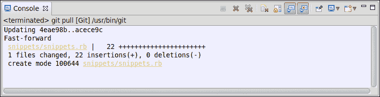

## *发生了什么？*

我们已经看到推送和拉取远程 Git 仓库是多么容易。在拉取远程仓库后，远程端的所有新文件和更改文件都会与你本地的仓库合并。而在推送本地仓库时，你将本地扩展与远程仓库合并，以便其他开发者可以拉取这些新功能。

## 英雄之旅 - 检出 Git 仓库

现在的任务是创建你自己的远程 Git 仓库（可能通过 GitHub 或类似的服务），并在 Aptana Studio 中将其克隆到本地项目中。如果项目已准备就绪，开始在其中工作，创建源代码文件，暂存它们，并在你的工作中提交进度。

## 快速问答——测试你新获得的 Git 知识

Q1. Git 版本控制和 SVN 版本控制之间的区别是什么？

1.  没有差异。两者都包含相同的逻辑，只是实现方式不同。

1.  Git 是一个分布式版本控制系统，而 SVN 是一个集中式版本控制系统。

1.  Git 是一个集中式版本控制系统，而 SVN 是一个分布式版本控制系统。

Q2. 你可以用什么方法处理未插入到 Git 仓库中的文件？

1.  简单地将它们从你的项目中删除。

1.  将文件重命名，使文件名以点开头。

1.  将这些文件添加到 `.gitignore` 文件中。

# 摘要

到本章结束时，你应该熟悉 SVN 和 Git 仓库。通过使用 SVN 仓库，你应该详细了解如何添加一个新的仓库，以及如何将仓库检出到一个项目中。在添加和检出之后，你应该知道如何与 SVN 项目一起工作。这意味着你必须知道如何提交你的本地更改，更新你的本地工作副本，以及如何使用 SVN 历史记录来辅助你的工作。

在使用 Git 的过程中，你不仅看到了如何克隆远程 Git 仓库并在本地项目中与之工作，还看到了如何创建你自己的本地 Git 仓库。在你的本地 Git 仓库中，我们查看了一下提交过程以及如何暂存、取消暂存和撤销文件。最后，我们查看了一下如何推送和拉取 Git 仓库。

在下一章中，我们将学习如何在 Aptana Studio 中以最佳方式使用 PHP。
