# 第十章。PHP 项目

***PHP** 是一种用于开发网站和 Web 应用的脚本语言。PHP（代表 **Personal Home Page**）用于在客户端调用脚本时在服务器端编译源代码，并将结果发送到浏览器。*

*PHP 用于从小型到大型网站和 Web 应用。大型框架、内容管理系统和网店（如 ZendFramework、Symphony、XT-Commerce、WordPress 等）都是使用 PHP 开发的。尽管 PHP 对于需要通过 Web 服务器发送、接收和持久化数据的 JavaScript AJAX Web 应用也非常有用。*

*在本章中，您将更深入地了解 PHP 以及如何使用 Aptana Studio 3 轻松开发 PHP。*

在本章中，您将涵盖：

+   创建和配置 PHP 项目

+   将现有项目配置为 PHP 项目

+   与外部 PHP 库一起工作并包含它们

+   使用 PHPDoc 记录项目

+   使用和配置 PHP 代码格式化器

# 创建和配置 PHP 项目

编辑单个 PHP 文件非常简单。如果您必须编辑一个或多个 PHP 文件，只需将文件拖放到 Aptana Studio 3 编辑器中。Aptana Studio 会自动在 PHP 编辑器中打开文件；这提供了语法高亮、代码补全等功能，让您可以立即开始编辑。然而，您只有在将 PHP 文件作为 PHP 本质、Aptana Studio 3 项目编辑时，才能完全了解 Aptana Studio PHP 编辑器的强大功能。

# 动手实践 – 创建 PHP 项目

可以通过以下几个步骤快速创建 PHP 项目：

1.  从 **文件** | **新建**（或直接按快捷键 *Alt* + *Shift* + *N*）选择菜单项，然后选择 PHP 项目。

1.  在以下截图所示的打开窗口中，输入项目名称并选择项目源代码应存储的位置：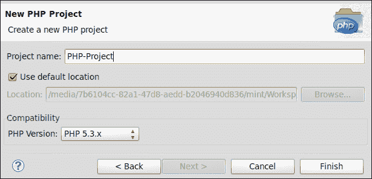

1.  之后，您必须选择 PHP 项目的兼容性。这意味着您将选择最终用于您的 Web 应用的 PHP 版本。当 Aptana Studio 知道您项目的相关 PHP 版本时，它能够调整语法高亮、代码辅助和错误检测（通过解析 PHP 文件）。例如，如果您选择 PHP 4 作为版本，并且有 PHP 5 代码，您将在代码中看到 PHP 5 内容的错误标记。内容辅助功能将不会对命名空间等起作用，并且您也不会获得类、函数和常量的建议内容辅助功能，因为它们仅在 PHP 5 API 中定义。因此，确定您的 Web 应用的需求，并选择您需要的 PHP 版本。

1.  最后，您必须单击 **完成** 按钮。

1.  或者，如果你想使用现有的源代码库，你可以导航到**项目浏览器**视图，并在**本地文件系统**节点中搜索源代码目录。

1.  如果你已定位到源代码目录，右键单击此目录并选择**提升为项目...**选项，如下面的截图所示：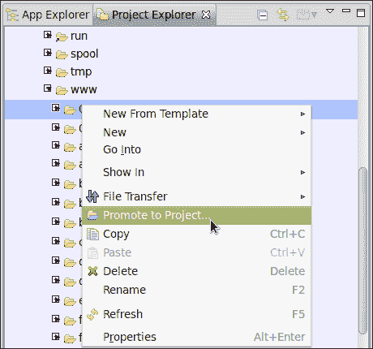

1.  你必须使用这种方法选择项目类型，因此选择**项目类型**选项为**PHP-主要**。作为二级**项目类型**，你可以选择**Web**，例如，但请确保 PHP 条目被标记为主要，如下面的截图所示：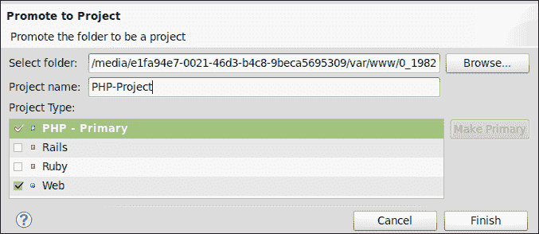

    ### 小贴士

    **项目性质**

    当你在项目浏览器中查看项目时，你可能会在右上角的一些项目图标上看到一个小的符号，这个符号会显示这些项目的首要性质（或命名类型）。一个蓝色的**P**表示这是一个 PHP 性质的项目。

1.  使用这两种方法，你最终应该会收到一个 PHP 项目，你将使用它作为本章其余部分的基础。

## *发生了什么？*

你刚刚创建了一个 PHP 性质的项目。该项目为你提供了开发 PHP 网络应用程序的特定功能。这意味着你也有能力选择使用的 PHP 版本，因此调整一些功能，例如语法高亮、代码辅助和错误检测（通过解析 PHP 文件的结果）。

你还看到你可以将你的 PHP 项目的性质与 Web 项目结合起来，这将允许你将 Aptana Studio 项目专门化以满足你的项目需求。

# 配置 PHP 项目

但当你有一个现有的项目，你想要为 PHP 开发配置时，你应该怎么做？没问题，你可以根据需要配置每个项目。接下来的*操作时间*部分将向你展示如何调整你的 PHP 项目。

# 操作时间 – 配置 PHP 项目

对于本节，你将从没有分配性质的项目开始。现在我们将使用以下步骤将此项目配置为 PHP 项目：

1.  导航到**项目浏览器**视图，右键单击你想要配置的项目，并选择**属性**选项。

1.  在出现的**属性**窗口中，你可以配置一些你希望查看的与 PHP 相关的属性。在窗口的左侧，你会找到一个属性页面的列表。你可以在窗口右侧更大的区域中找到每个属性页的内容，如下面的截图所示：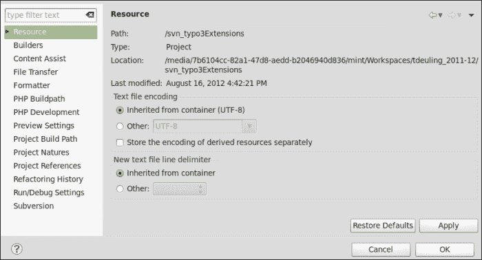

1.  你可以从顶部开始逐页滚动，从**构建器**页面开始。你将在该页面上找到你的项目的构建器。如果你在这里添加网络项目性质，**Studio 统一构建器**选项将出现在列表中。对于选定的 PHP 项目性质，PHP 构建器被添加到该列表中，因此你不需要手动选择这些条目。如果你选择或取消选择项目性质，这会自动发生。**构建器**页面可以在以下屏幕截图中看到：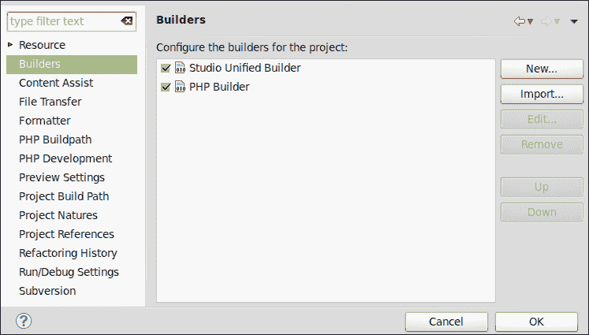

1.  下一个相关的部分是**格式化器**页面。在这里，你将了解如何选择一个自定义格式化器。在本章的后面，我们将探讨如何创建你自己的格式化器。在选择你自己的格式化器的第一步中，你必须勾选**启用项目特定设置**复选框。之后，以下屏幕截图中**格式化器**页面显示的字段将失去只读状态，然后你将能够选择一个格式化器配置文件：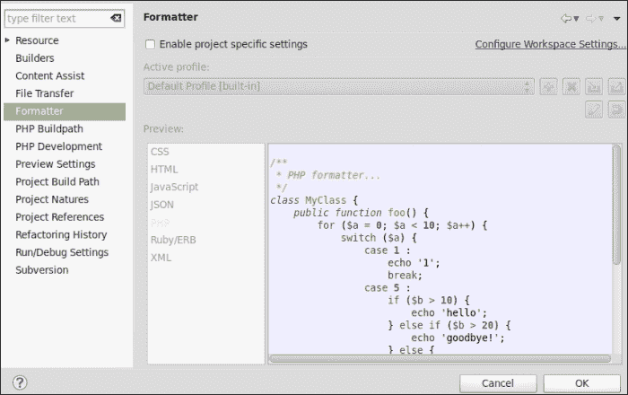

1.  **PHP 构建路径**页面允许你在你的工作空间中包含来自另一个项目的库，甚至是从外部目录中。你将在这个章节的后面看到如何使用此功能的示例。**PHP 构建路径**页面可以在以下屏幕截图中看到：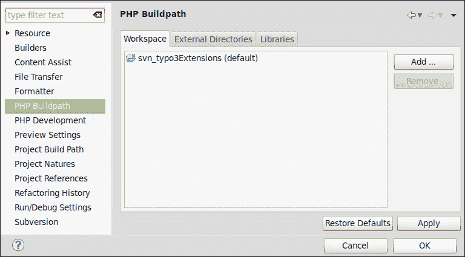

1.  **PHP 开发**部分允许你更改项目的兼容性。只需选择所需的 PHP 版本。这意味着，正如你在前面的*操作时间*部分所学到的，你需要选择最终将用于你的网络应用程序的 PHP 版本。当 Aptana Studio 知道你的项目的相关 PHP 版本时，它能够调整语法高亮、代码辅助和错误检测（这是解析 PHP 文件的结果）。**PHP 开发**部分可以在以下屏幕截图中看到：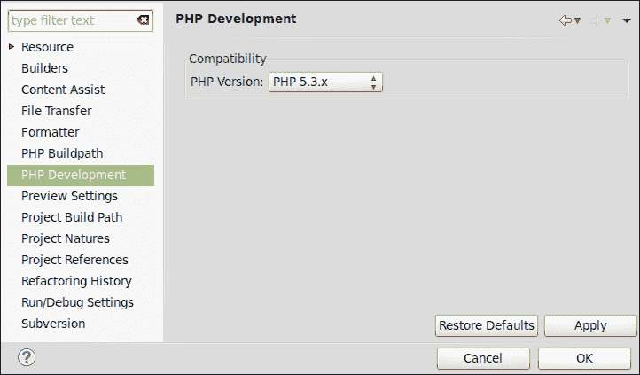

1.  下一个和最后一个相关的部分是**项目性质**部分。这个部分允许你更改项目的性质。只需勾选你的项目应支持的性质的复选框。通过选择一个性质并按下**设为首选**按钮，你可以切换项目的首选性质。由于你打算开发一个网络应用程序，你需要选择**PHP**作为首选性质，并将**Web**作为附加性质。**项目性质**部分可以在以下屏幕截图中看到：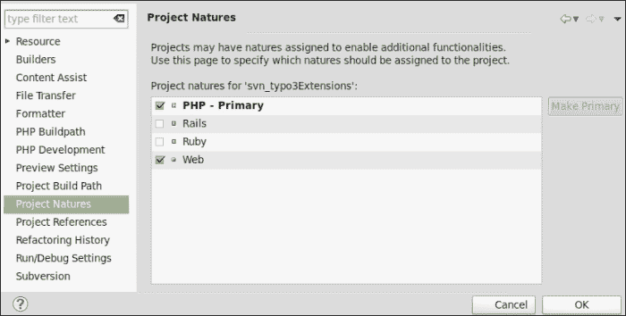

## *发生了什么？*

你选择了一个没有分配项目性质的现有项目，目的是将其配置为 PHP 开发。在这个*行动时间*部分，你看到了如何选择项目构建器，在哪里可以选择特定于项目的代码格式化程序，以及如何从你的工作空间中包含额外的库或外部目录。除此之外，你还学会了如何更改项目性质或所需的 PHP 版本。

# 在 PHP 项目中使用 PHPDoc

PHPDoc 是 phpDocumentor 的简称，它是一个用于自动生成项目文档的工具。你可以在其网站上获取有关 phpDocumentor 及其更多信息，[`www.phpdoc.org/`](http://www.phpdoc.org/)。

PHPDoc 提供了一种结构和固定属性的约定，通过它可以创建文件、类、函数和属性的源代码注释。这些注释中指定的属性有助于以标准化的方式定义源代码文件中的信息（如类型和描述），并针对进一步处理进行了优化。

但为什么 PHPDoc 的使用如此重要？

首先，每个开发者都应该知道，对源代码本身进行文档化非常重要。如果你必须扩展另一个开发者的代码，有时并不容易理解开发者为什么在他的代码中编写了某些部分。但有时也可能发生，你必须扩展你过去编写的自己的代码，而你并不记得为什么你以这种方式做了某些事情。至少在这个时候你知道了，因此将代码进行文档化被认为是良好的实践。

但这还不是全部。如果你总是使用良好格式化和有效的 PHPDoc 样式，你可以从你的代码中获得更多。例如，你可以使用 phpDocumentor 自动创建一个完整的 HTML 文档页面。然而，对我们来说，此刻的重要点是 Aptana Studio 会读取我们的 PHPDoc 注释并将信息输入到内容辅助中。

利用这种能力，你可以在编写代码的同时为所有的类、常量和函数创建自动完成。

# 使用预定义的 PHPDoc 注释

Aptana Studio 3 附带一些预定义的 PHPDoc 注释，可以从 PHP Bundle 片段中包含。这些可以像我们在本章前面提到的那样使用，借助内容辅助功能。接下来的简短*行动时间*部分将更详细地介绍这一点。

# 行动时间 – 使用 PHP Bundle 中的 PHPDoc 注释

1.  从 PHP 性质的项目中打开一个 PHP 文件。

1.  将光标放在你想要编写函数或方法的空行上。

1.  输入字符`doc`并按*Ctrl* + 空格键触发内容辅助功能。你应该得到类似于以下截图的结果：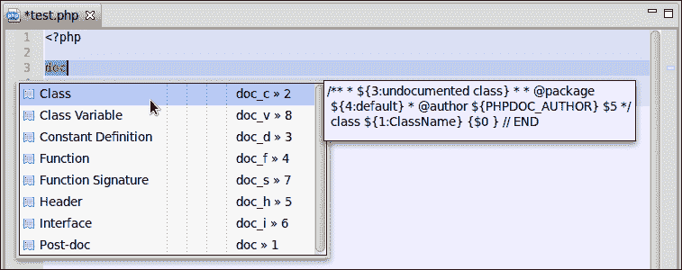

1.  内容辅助功能随后建议所有以`doc`开头的触发代码片段，您可以从列表中选择所需的代码片段。

1.  您可以选择**函数**条目，并通过按*Enter*键插入它。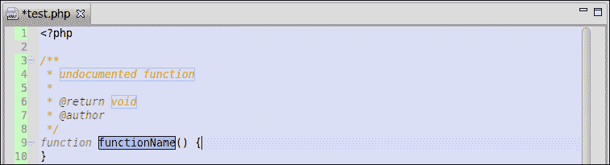

1.  如前一张截图所示，内容辅助功能插入了一个由 PHPDoc 函数注释引入的完整函数体。代码片段插入后，函数名在边框内显示（如前一张截图所示）。这表明该名称可以直接编辑，只需开始输入您新函数的名称。如果您准备好了，可以使用*Tab*键跳转到代码片段允许您调整的下一个位置。所以如果这种情况，您可以跳转到每个参数，即注释中的函数描述、返回值、作者姓名，最后进入函数体，逐步进行，在那里您可以立即开始编写函数本身。您最终的代码现在应该类似于以下截图：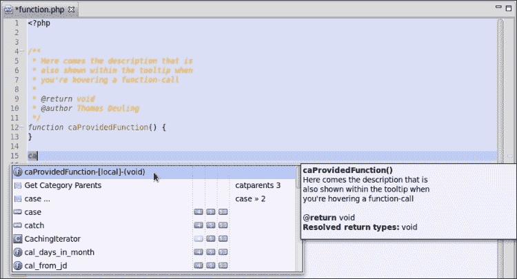

1.  保存您的文件后，将光标放在新函数下方几行处，并开始输入函数名。如您所见，内容辅助功能已经索引了该函数，现在为您提供轻松插入它的能力。

1.  您可以从内容辅助功能的建议行中读取大量信息。首先，有一个图标显示建议的类型。类型可以是函数、类、代码片段等。此外，建议所在的位置用方括号表示。在我们的例子中，建议是局部的；这意味着它在同一文件中。在其他情况下，建议包含的文件名将显示在建议的位置。如果建议是 PHP-API 条目，它还会显示它可用的是哪个 PHP 版本。最后一列是为代码片段条目保留的，其中显示触发名称。

## *发生了什么？*

您已插入由 PHP Bundle 代码片段提供的 PHPDoc 符合函数注释。这些代码片段使我们能够快速填写预结构化注释中所需的信息。

# Aptana Studio 的 PHP Bundle PHPDoc 注释代码片段

Aptana Studio 的标准 PHP Bundle 为我们提供了一些最常用 PHPDoc 注释的代码片段。然而，正如我们之前提到的，您还可以扩展代码片段并创建一些更专门针对您需求的 PHPDoc 注释。

这里是预定义的 PHPDoc 注释及其触发关键词的完整列表：

| 触发器 | 标题 |
| --- | --- |
| doc_c | 类 |
| doc_v | 类变量 |
| doc_d | 常量定义 |
| doc_f | 函数 |
| doc_s | 函数签名 |
| doc_h | 标题 |
| doc_i | 接口 |

然而，必须指出，在非常动态的 PHP 代码中，内容辅助功能并不总是容易工作。在某些情况下，可能无法确定变量的类型，因此内容辅助功能无法为其提供正确的建议。在这种情况下，您需要支持内容辅助功能，并使用小的 PHPDoc 注释声明类型。在下面的屏幕截图中，您将看到这个例子的一个简要示例：

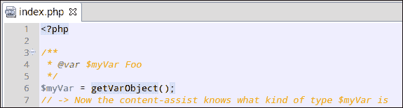

现在，您可以继续查看如何在 PHP 项目中包含和使用外部库。

# 使用 PHP 库

大多数大型 PHP 项目都附带活跃的附加外部库。通常，这些库并不位于 PHP 项目本身中。例如，您可以将 ZendFramework 直接放置在您的项目中，但您也可以将其放置在 PHP-API 目录或其他位置。

但是，您可能会想知道，这两个过程之间有什么区别？

如果您的 ZendFramework 位于项目中，该项目的内容辅助功能将自动知道所有 PHPDoc 标记的元素。如果是这种情况，项目构建过程可能会变慢，项目大小会大幅增加。在首次包含 ZendFramework 库之后，Aptana Studio 将索引所有 ZendFramework 文件并评估包含的 PHPDoc。然后，每次 Aptana Studio 触发此项目的构建过程时，它也会检查所有 ZendFramework 文件的最后修改时间戳，以确定需要重新索引的已更改文件。

如果您将 ZendFramework 放置在项目外部，您必须将其作为库集成到项目中。否则，Aptana Studio 将无法为您提供 ZendFramework 的信息内容辅助功能。在这种情况下，Aptana Studio 将在创建 Aptana Studio 库时仅索引所有 ZendFramework 文件。之后，只有在 Aptana Studio 启动时，它才会检查每个文件的最后修改时间戳，以识别需要重新索引的已更改文件。如果您想集成在大多数项目中使用的库，您还有额外的优势，即只需包含一次库。包含后，Aptana Studio 将为每个具有 PHP 特性的项目提供该库。

在这两种情况下，内容辅助功能都会学习库中包含的所有可用类、常量和函数，并使用它们进行检查。

### 注意

您必须记住，所有希望作为内容辅助功能工作目标的一部分包含的库都必须配备 PHPDoc 注释。

在 Aptana Studio 的内容辅助功能的情况下，PHPDoc 注释被确定并用于在开发时为开发者提供更多信息和可用环境的代码建议。

PHP-API 文件默认支持内容辅助功能。当您已选择 PHP 兼容性版本（通过创建或配置您的项目）时，您已调整内容辅助功能，使其仅建议与 PHP 版本相等的类、函数和文档条目。

例如，如果您使用了 PHP-API 函数，如`substr`，并且不记得哪个参数号有什么功能。没问题，只需将鼠标光标悬停在 PHP 编辑器中的函数调用上，它就会显示一个包含此函数 PHP 文档的工具提示，如图所示：.

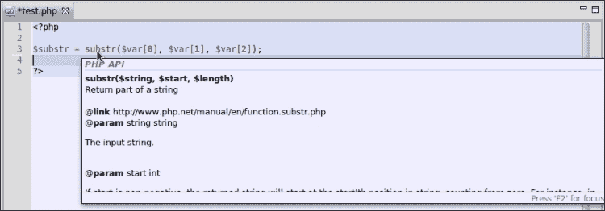

在这里，您将获得所需的所有信息，例如，哪个参数需要什么类型的变量，哪些参数是可选的，等等。

### 小贴士

**信息过多！**

如果 PHP 文档太大，无法适应工具提示，只需按*F2*键即可使工具提示粘性。现在您可以在工具提示内滚动并轻松阅读。

# 使用外部库的行动时间

现在，您将了解如何将外部库添加到您的 PHP 项目中，以便内容辅助功能知道这些附加库中所有可用的类、常量和函数。

1.  首先，您必须添加一个新的用户库。因此，您需要打开**窗口**下的**首选项**，在树中导航到**Aptana Studio** | **编辑器** | **PHP** | **库**。下面的截图显示了**库**对话框：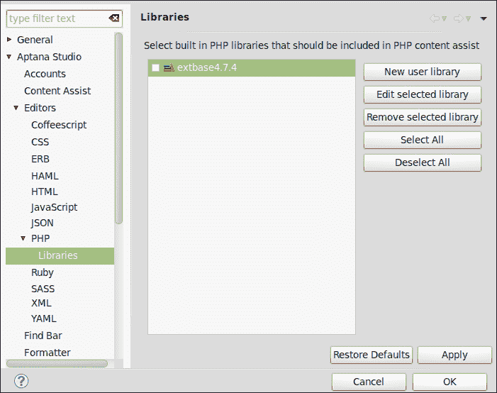

1.  然后，点击**新建用户库**按钮以打开以下截图所示的创建窗口：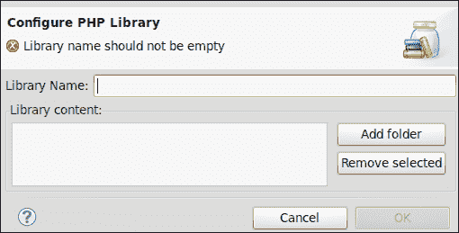

1.  在这里，您需要为您的用户库输入一个名称。您将使用 ZendFramework，因此您需要输入此库的名称，该名称由版本号扩展。

1.  然后，您需要选择至少一个或多个包含您库的目录。当您已选择所有必需的库后，点击**确定**以完成此步骤，如图所示：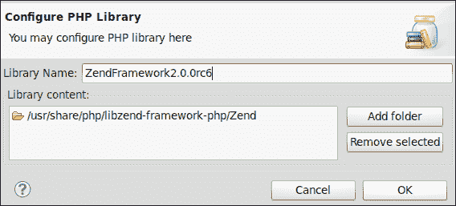

1.  现在，您的新库应该列在库列表中。确保您要在 PHP 项目中使用的所有库的相关复选框默认启用，如图所示：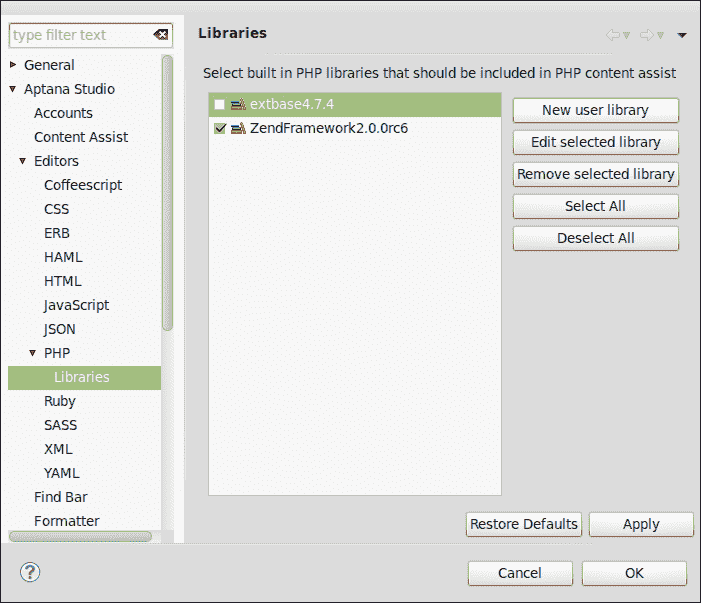

    ### 小贴士

    **添加新的 PHP 库时内部会发生什么**

    当你添加一个新的库时，Aptana Studio 将索引所有包含的文件。在索引过程中，它会记住每个文件的时间戳，因此每次启动时都可以检查文件是否已更改。如果在启动过程中检测到已更改的文件，Aptana Studio 将重新索引这些文件。因此，你可以确信你总是从内容辅助功能中获得最新的信息。

1.  最后，点击 **应用** 然后点击 **确定** 以完成库的创建，并等待它完成库的索引。进度会在一个对话框中显示，如下面的截图所示：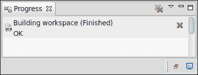

## *刚才发生了什么？*

你已经将 PHP 库如 ZendFramework 集成到 Aptana Studio 中。在你将库添加到首选项中之后，默认情况下，该库将在所有 PHP 项目中使用。

现在你正在开发 PHP 项目时，内容辅助功能将为你提供来自这个库的可用类、常量和函数。

让我们快速测试一下内容辅助功能。在 PHP 项目中打开一个 PHP 文件，并开始输入字符 `Zend`，如下面的截图所示：

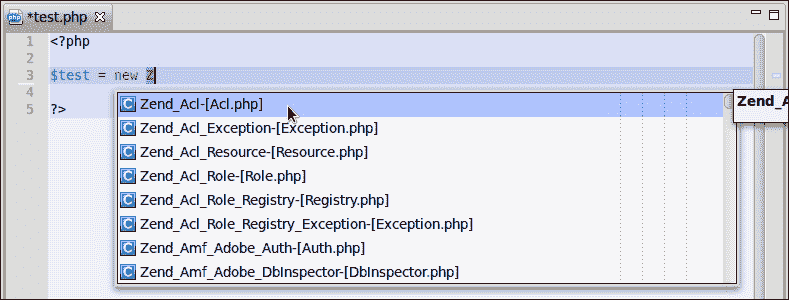

如你所见，Aptana Studio 识别出你想要创建一个类的实例，因此只为你提供以 `Zend` 开头的那些类。

或者，如果你记不起你的库函数中可用哪些参数，只需将鼠标光标悬停在函数调用上，就会出现一个包含 PHPDoc 注释的工具提示。如果 PHPDoc 注释质量良好，所有问题都会迅速得到解答。以下截图显示了这样一个例子：

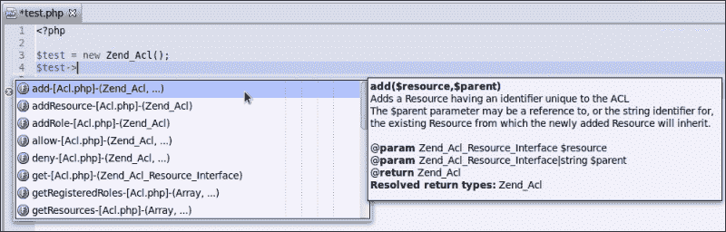

# 配置项目特定库

现在你已经知道如何为所有 PHP 项目提供库，但以下问题仍然存在；如果你不需要或不想在 PHP 项目中使用库，你应该怎么办？可能发生的情况是，你有一个不使用 ZendFramework 的 PHP 项目。在这种情况下，内容辅助功能提供的有关 ZendFramework 的信息可能会在你寻找真正需要的内容辅助信息时打扰你。

此外，这个项目可能是一个 Flow3 项目，但这是你正在开发的唯一一个 Flow3 项目，因此你不想在每个 PHP 项目中都有 Flow3 的内容辅助信息。这并不是问题，因为你可以覆盖每个项目中的库。

# 操作时间 – 配置项目特定库

让我们看看使用以下步骤配置项目特定库有多简单：

1.  导航到 **项目资源管理器** 视图中你想要调整使用的库的 PHP 项目。右键单击它并选择 **属性** 选项。

1.  在打开窗口中，选择**PHP Buildpath**部分。在这个部分，您将找到三个选项卡，允许您调整使用的库。

1.  **工作区**选项卡允许您将已包含在您工作区中另一个项目中的库添加到您的项目中。只需单击**添加...**按钮，然后在弹出窗口中选择一个 PHP 项目。此选项卡在以下屏幕截图中显示：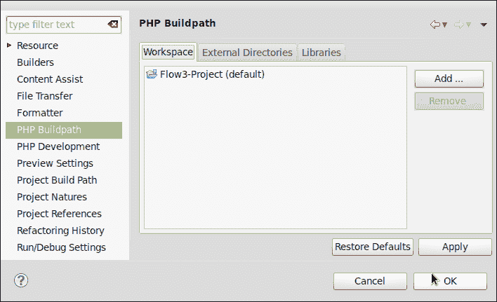

    ### 小贴士

    **工作区选项卡中的默认选择**

    默认情况下，您将在**工作区**选项卡上的列表中找到 PHP 项目。这也是为什么项目内容辅助功能已经知道它自己的类、常量和函数的原因。

1.  **外部目录**选项卡允许您添加位于您磁盘上某个外部目录中的库。只需单击**添加...**按钮，然后从弹出窗口中选择一个目录。此选项卡在以下屏幕截图中显示：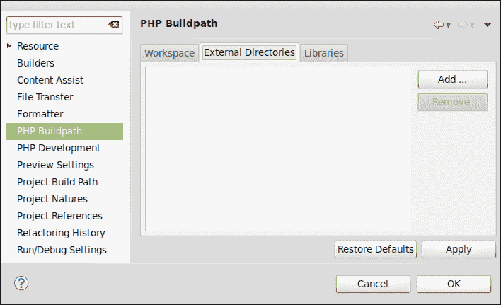

1.  **库**选项卡允许您覆盖 Aptana Studio 的全局首选项中的设置。首先，您必须选中**使用项目特定设置**复选框。之后，您可以取消选中在全局首选项中配置的条目，这样内容辅助功能就不再提供关于这些库的信息了。**库**选项卡在以下屏幕截图中显示：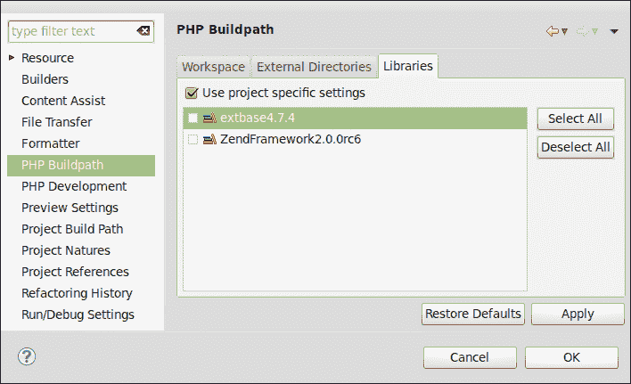

1.  最后，当您完成自定义项目库后，只需单击**应用**，然后单击**确定**，以应用这些更改。

## *发生了什么？*

您已经更改了 PHP 项目的默认库，以便内容辅助功能只提供您在这个项目中真正需要的信息。

# 使用和配置代码格式化器

每个开发者都知道这个问题，例如，假设您想处理另一个开发者的源代码文件，而这个开发者以不同的、难以阅读的风格格式化了代码。如果代码以您喜欢的风格格式化，那该有多好。

如果是这样，那就没问题，因为 Aptana Studio 3 提供了一个易于使用的源代码格式化器。

# 行动时间 – 使用和配置 PHP 代码格式化器

以下步骤展示了您如何使用代码格式化器：

1.  首先，在 Aptana Studio 3 编辑器中打开您想要格式化的 PHP 文件。

1.  格式化文件是本节“行动时间”中最简单的一部分。只需在编辑器内的任何位置右键单击，然后选择**源** | **格式化**。或者，您可以使用快捷键 *Ctrl* + *Shift* + *F*。此选择在以下屏幕截图中显示：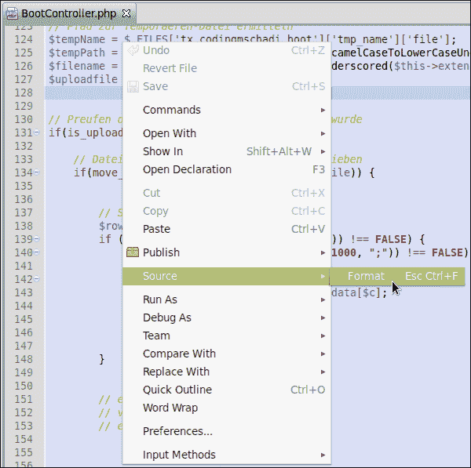

1.  执行此操作后，Aptana Studio 代码格式化工具会将您的 PHP 文件格式转换为与代码格式化工具配置一致。然而，这可能不是您喜欢的格式。如果是这种情况，您可以继续查看如何配置代码格式化工具。

1.  要这样做，请转到**窗口** | **首选项**，然后在树中选择**Aptana Studio** | **格式化器**。**格式化器**对话框如图下截图所示：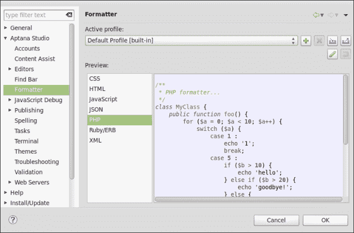

1.  在右上角，您可以创建格式化器的新的配置文件。如果您还没有配置文件，请点击绿色的加号（**+**）按钮以创建自己的配置文件。这是推荐的，因为这样您可以切换回默认配置。

1.  为您的新配置文件输入一个名称，并选择从哪个配置文件初始化新配置文件。您需要选择**默认配置文件**选项，如图下截图所示，因为这是您唯一拥有的：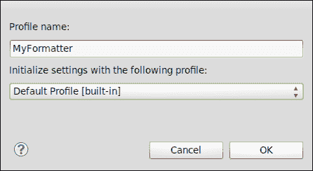

    ### 小贴士

    **使用代码格式化器配置文件**

    如果您为不同的开发团队或可能不同的客户工作，可能会发生这些开发团队或客户有不同的格式化约定。配置文件允许您为每个创建一个专门的格式化器配置。关于如何将不同的项目与所需的格式化器配置文件结合的信息已在本章中介绍。

1.  点击**确定**按钮以创建新配置文件。

1.  您将开始自定义新配置文件，该配置文件将保存您旧的配置文件。从窗口顶部选择您的新配置文件，然后在列表中选择 PHP 条目，通过点击铅笔按钮开始编辑功能。

1.  **格式化器**编辑窗口分为不同的选项卡，您可以在左侧调整许多设置，并立即在右侧看到预览。第一个选项卡包含**新行**的选项。在这里，您可以设置格式化器应插入新行的位置。此选项卡如图下截图所示：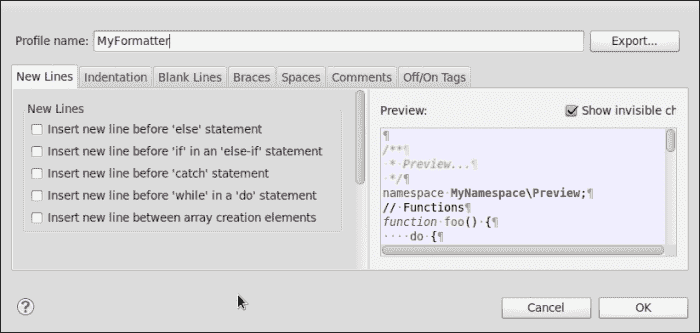

1.  在第二个选项卡，**缩进**，您可以调整源代码的缩进类型。这里您可以选择从常规设置继承制表符策略或覆盖它们。此选项卡如图下截图所示：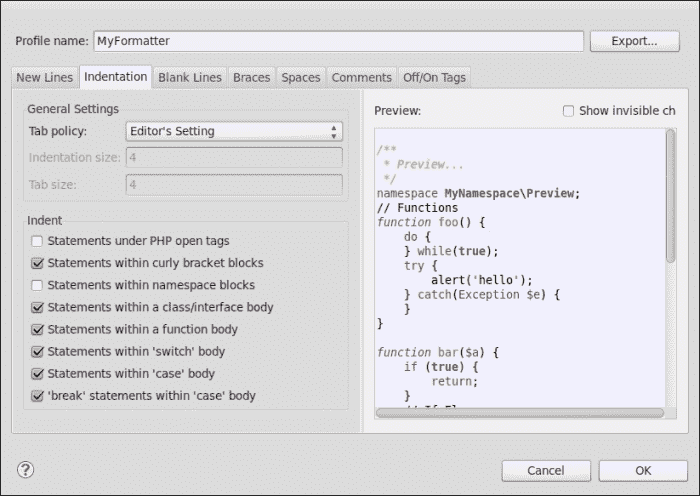

1.  第三个选项卡，**空白行**，允许您调整类和函数中空白行的行为。此选项卡如图下截图所示：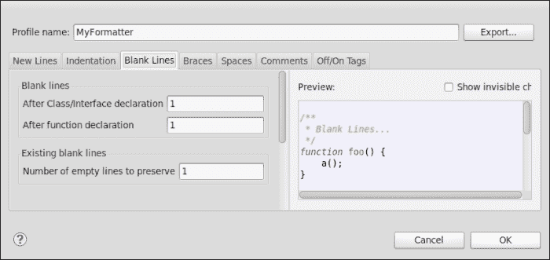

1.  第四个标签页，**花括号**，包含花括号的行为。在这里，你可以选择不同行中应该出现不同花括号。此标签页如图所示：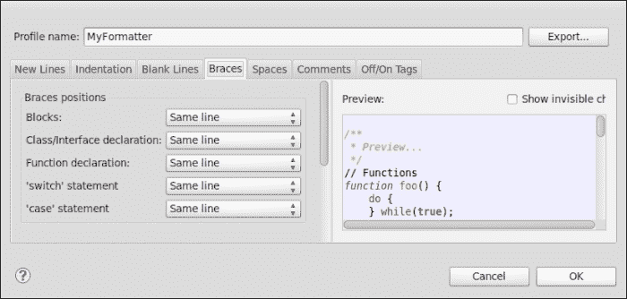

1.  **空格**标签页为你提供了 20 多个选项来自定义空格的行为。这些空间设置被分组在**括号**、**标点符号元素**和**运算符**区域。对于每个这些设置，你都可以选择在出现前后有多少个空格。此标签页如图所示：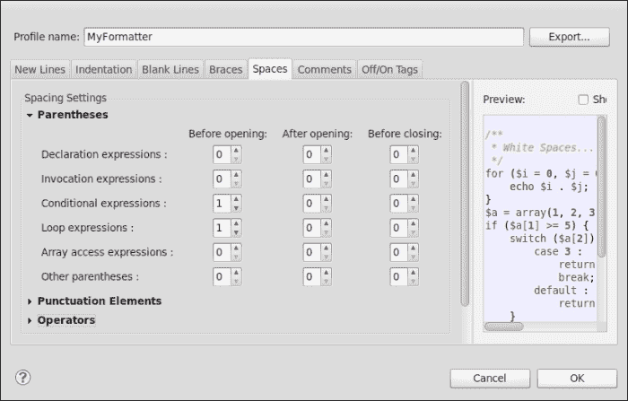

1.  第六个标签页，**注释**，提供了注释行为的设置。在这里，你可以格式化源代码中的注释。此标签页如图所示：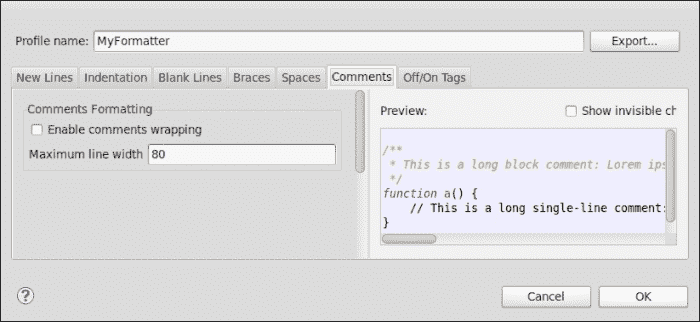

1.  最后一个标签页，**开/关标签**，自定义开/关标签的行为。`@formatter:off`和`@formatter:on`标签可以用作 PHPDoc 函数。因此，使用这些标签，你可以标记一个格式化器不应格式化源代码的部分。如果你想使用这些标签，只需启用功能并使用输入的标签从源代码中启用和禁用格式化器。此标签页如图所示：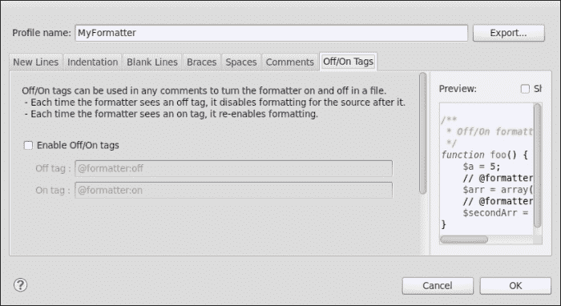

1.  最后，你只需通过点击**确定**按钮来确认更改。

### 小贴士

**导入和导出格式化设置**

如果你已经完成了代码格式化器的配置，你可能想要保存这些设置以便将来恢复，或者你可能想要在开发团队中分发这些约定，以便每个开发者都能以相同的风格格式化他的代码。为此，你可以在格式化器配置部分使用导入和导出功能。

## *刚才发生了什么？*

你已经创建了自己的格式化器配置文件，并调整了格式化器以满足你的要求。你还查看了一些丰富的自定义可能性，以确保你能够获得所需的源代码风格，以便更容易阅读。

现在你可以格式化你将要处理的每个文件，无论是你自己的还是其他开发者的。但这还不是全部。正如你可能已经注意到的，你可以将此操作应用于其他编程语言。Aptana Studio 目前允许你格式化 CSS、HTML、JavaScript、JSON、PHP、Ruby/ERB 和 XML 文件。

这很简单，而且非常有用，不是吗？

## 英雄之旅 - 配置你自己的 PHP 项目

现在的任务是选择你自己的位于磁盘某个位置的 PHP 项目。在项目资源管理器中搜索它，并将其提升为项目。继续配置这个新项目以实现最佳的 PHP 开发。

你应该调整 PHP 版本，包含所需的库，并给你的源代码配备有效的 PHPDoc 注释。

此外，你应该创建自己的代码格式化配置文件，这有助于你格式化源代码。将其保存在你的配置文件中，不要覆盖现有的配置文件。创建后，格式化一个格式不同的 PHP 文件，看看结果。

## 突击测验

Q1. 为什么项目性质对于一个 PHP 项目来说如此重要？

1.  项目性质为具有特定专长的项目添加了额外的功能。

1.  性质对于项目来说并不重要。

1.  性质是每个位于项目中的文件应使用哪种编辑器的提醒。

Q2. 代码格式化工具可以与哪些语言一起工作？

1.  代码格式化工具仅与 PHP 文件一起工作。

1.  代码格式化工具与所有基于 XML 的文件一起工作，例如 HTML 和 XML。

1.  代码格式化工具目前与 CSS、HTML、JavaScript、JSON、PHP、Ruby/ERB 和 XML 一起工作。

Q3. 当你有一个不应该由代码格式化工具格式化的源代码部分时，你会做什么？

1.  在格式化之前剪切该部分，格式化后再粘贴回来。

1.  你必须将部分包裹在 PHP 注释中。

1.  你必须使用 `@formatter:on` 和 `@formatter:off` 这两个关键字。

Q4. 为了使用内容辅助功能使用用户库，必须满足哪些标准？

1.  类、常量和函数必须配备 JavaDoc 注释。

1.  类、常量和函数必须配备 PHPDoc 注释。

1.  类、常量和函数需要命名清晰。

Q5. 为什么内容辅助功能默认提供所有项目自有的类、常量和函数？

1.  在项目属性中，PHP 构建路径部分默认包含项目。

1.  项目不知道其项目自有的类、常量和函数。

1.  项目只知道没有 PHPDoc 注释的项目自有的类、常量和函数。

# 摘要

到本章结束时，你应该能够在 Aptana Studio 中创建和管理自己的 PHP 项目。除此之外，你还应该知道如何使用所有 PHP 特定功能，以充分利用你的 PHP 项目。

你也看到了如何选择你使用的 PHP 版本，以及如何通过 PHPDoc 注释扩展你的代码，使其对内容辅助功能可读，并且你能够从中创建一些 PHP 文档。你还看到了如何配置代码格式化工具并使用它。此外，你还看到了如何包含外部库，例如 ZendFramework，以便内容辅助功能可以为你提供有关库的信息。
