# 第十一章。优化工作和提高协作

*Aptana Studio 可以在更多方面优化您在开发团队中的协作工作，这可能会超出您的想象。如您所知，Aptana Studio 不仅仅是一个源代码编辑器。在本章中，我们不仅将探讨如何改进我们自己的工作，还将探讨整个开发团队的有效性。*

在本章中，我们将涵盖：

+   自定义语法高亮和共享创建的主题

+   导入和导出设置以与其他开发者共享

+   导入和导出代码格式化配置文件

+   使用书签组织工作

+   使用任务组织工作

+   使用任务视图工作

+   在源代码注释中使用任务

# 创建语法高亮主题

在本章的第一节中，我们将探讨如何创建我们自己的语法高亮主题。每个人都知道如何使用他们最喜欢的编辑器，因为他们经常使用它，但现在到了切换到 Aptana Studio 并开始使用它的时候了。不幸的是，一开始很难适应 IDE 的新语法高亮，但希望到本章结束时您会发现它很容易。

Aptana Studio 为您提供了一个主题编辑器，您可以在其中调整语法高亮。让我们看看创建自己的语法高亮主题有多简单。

# 动手时间 - 创建语法高亮主题

1.  导航到**窗口** | **首选项**，然后在树中转到**Aptana Studio** | **主题**。

1.  在我们开始调整主题之前，我们需要创建自己的主题。因此，我们点击**主题**窗口顶部的**+**按钮。

1.  在出现的窗口中，我们需要输入我们主题的名称，如下面的截图所示：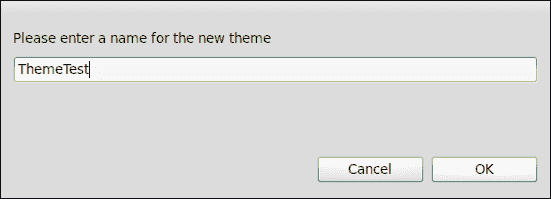

1.  接下来，使用我们之前创建的主题，我们开始自定义新的主题。在**主题**窗口的顶部，您可以更改前景、背景、光标、选择和行高亮的颜色。只需单击所需的彩色方块即可更改这些颜色。

1.  您可以使用一系列元素来调整前景和背景颜色，以及字体样式。自己尝试一下，更改一些颜色和样式以适应您的偏好。

1.  在**字体**行中，您可以更改编辑器使用的字体。首先单击**选择...**按钮，然后选择您喜欢的字体、字体样式和字体大小，如下面的截图所示：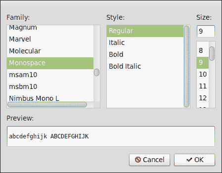

1.  在**主题**窗口的底部区域，您可以选择在哪些视图和编辑器中使用该主题。只需选择满足您要求的复选框组合即可。

1.  当您完成自定义自己的主题后，点击**应用**然后**确定**以完成此过程。

## *发生了什么？*

我们刚刚创建了自己的主题。简而言之，我们已经看到了我们可以创建自己的主题，以及自定义它是多么容易。此外，我们还可以选择我们的主题应该在哪里使用。

# 分享或恢复您的配置

如您所知，配置 Aptana Studio 可能是一个非常漫长的过程。您可能已经调整了很多设置，但仍有大量设置您可以进行调整。幸运的是，您不必两次都选择所有这些设置，因为 Aptana Studio 提供了许多导入和导出功能。如果您必须重新安装一个新的 Aptana Studio 实例或设置一个新的实例，您可以轻松地导入所有设置，而无需重新配置它们。

这个功能对开发团队来说非常有用，尤其是在项目初期，当项目负责人详细阐述基本配置时。这项任务应该由少数高级或资深开发者来完成，而不是太多（如果团队太大，这个过程可能会不必要地花费很长时间）。制定基本配置的重要点如下：

+   基本配置：我们从基本配置开始。我们已经在第三章中介绍了这个基本配置，*使用工作空间和项目*。在那里，我们检查了当创建一个新的工作空间时，所有设置都会丢失的行为。然而，当我们设置一个全新的 Aptana Studio 实例时，我们也需要这个功能。如您所记得，我们通过转到**文件** | **导入**并在树中导航到**通用** | **首选项**来找到这个导入/导出功能。有关执行导入或导出的更多信息，请参阅第三章中的*导入和导出首选项*部分，*使用工作空间和项目*。在许多通用设置中，还有一些设置，例如书签视图配置、键首选项、任务视图配置等。

+   连接设置：连接设置的导出，正如我们在第八章，“使用 FTP 远程工作”中已经学到的，包含了来自连接管理器的所有配置连接。如果开发团队经常与不同服务器的连接进行工作，创建一个包含所有所需连接的导出文件非常有用。导入连接后，用户可能只需更改每个连接的用户名，并输入他们的密码（注意，连接设置导出不会导出密码）。如您所记得，此导入/导出功能可以通过转到**文件** | **导入**，并在树中导航到**Aptana Studio** | **连接设置**来找到。有关执行导入或导出的更多信息，请参阅第八章，“使用 FTP 远程工作”部分的“导入和导出 FTP 设置”部分。

+   语法高亮：团队应共同努力为最常用的编程语言创建语法高亮配置。这将在团队成员需要从其他团队成员那里寻求帮助时给你带来优势。帮助他人的人能够更快地熟悉其他团队成员的源代码。他们可以迅速识别所有重要的关键词和代码结构。我们已经在本章中介绍了创建和配置语法高亮主题的话题。我们还在“动手实践 - 更改颜色主题”部分中看到了如何在第二章，“基础和如何使用视角和视图”部分的“Aptana Studio 3 自定义”部分中更改主题。接下来几页我们将探讨如何导入和导出主题，但在此之前，我们将完成这个列表。

+   代码格式化：正如之前所述，团队应将所有项目源代码格式化成相同的方式。因此，他们应共同努力配置一个代码格式化配置文件，每个开发者都必须使用。这样做的一个好处是，当开发者需要在其他团队成员的工作站上阅读代码时，他们可以更快地阅读代码，而且当他们在开始工作之前不需要格式化每个文件时，这将节省大量时间和压力。在第十章，“PHP 项目”部分的“使用和配置代码格式化器”部分中，我们已经看到了如何创建一些配置文件。我们将在本章的后面部分看到如何导入和导出这些配置文件。

这些是从 Aptana Studio 导入和导出大量设置的重要要点。导入和导出基本配置和连接设置已在之前的章节中介绍过。然而，导入和导出语法高亮主题和代码格式化配置文件是我们将在下一节中探讨的内容。

如果您已经创建了自己的语法高亮主题，现在您肯定想知道如何导出它并在稍后恢复它。那么，让我们来看看这个。

# 操作时间 – 导入和导出语法高亮主题

1.  导航到 **窗口** | **首选项** 并在树中转到 **Aptana Studio** | **主题**。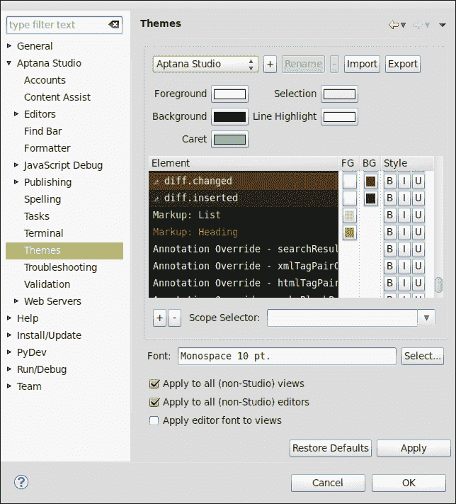

1.  在您的 **主题** 窗口的右上角，您将找到 **导出** 按钮。首先，我们想要导出当前的主题，然后稍后将其导入回来。因此，我们需要选择我们想要导出的主题，然后点击 **导出** 按钮。

1.  在打开的窗口中，我们将必须选择我们想要保存主题文件的存储位置。只需选择您首选的目录并为主题输入一个名称。此主题文件包含主题信息，以 XML 结构存储，并且必须以 **.tmTheme** 结尾，如图下所示：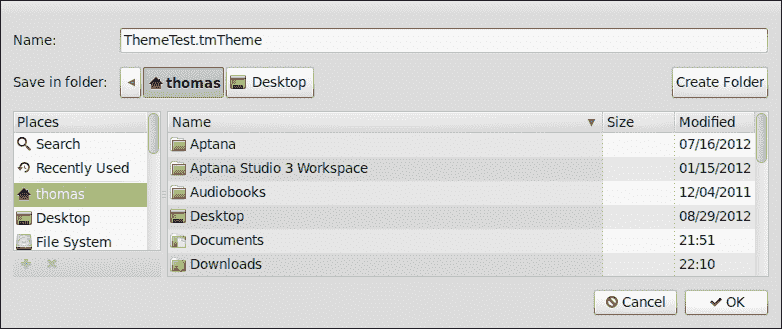

1.  在您选择了文件名和目录后，只需点击 **保存** 按钮即可完成导出过程。

1.  现在，我们将尝试从我们导出它的位置重新导入配置文件。在这里，我们将从步骤 1 开始的主题设置部分再次开始。

1.  在 **主题** 页面的右上角，您将在 **导出** 按钮的左侧找到 **导入** 按钮——点击它。

1.  打开的窗口允许您从文件系统中选择一个主题文件。导航到您保存导出主题的目录并选择它，如图下所示：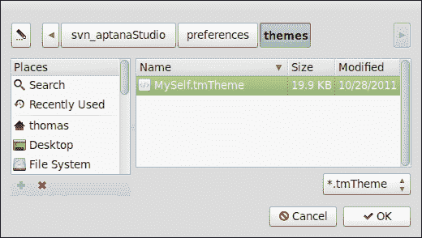

1.  最后，点击 **打开** 按钮以完成导入过程。

1.  现在创建的主题已在 Aptana Studio 中可用。

## *发生了什么？*

我们刚刚导航到首选项并导出现有的语法高亮主题到我们的本地文件系统。然后我们回到首选项并将主题重新导入到 Aptana Studio。通过这个过程，您可以恢复您的语法高亮主题到其他 Aptana Studio 实例，或者与其他开发者的代码格式化配置文件共享。

在第十章中，*PHP 项目*，我们看到了如何创建自己的代码格式化配置文件。然而，就像语法高亮主题一样，最好将代码格式化配置文件导出，以创建这些设置的备份或与其他开发者共享。这和导入导出语法高亮主题一样简单。让我们试试！

# 操作时间 – 导入和导出代码格式化器配置文件

1.  导航到**窗口** | **首选项**，然后在树结构中进入**Aptana Studio** | **格式化器**，如图所示：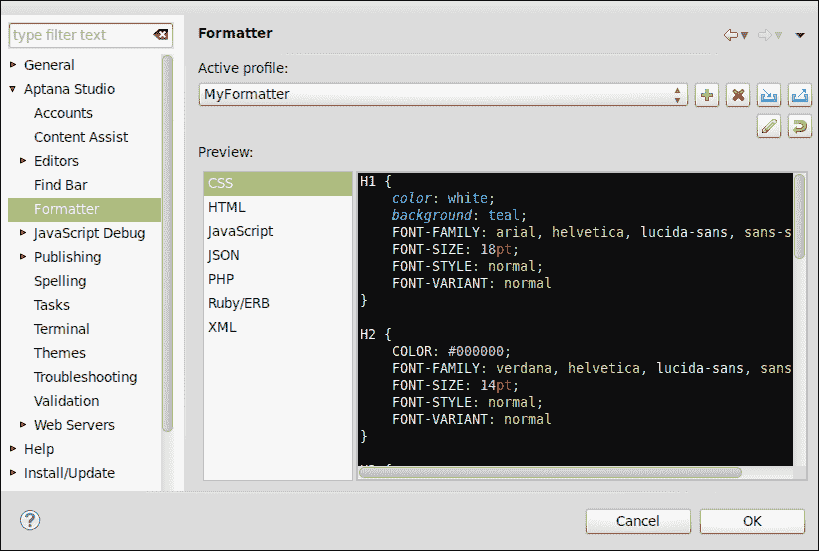

1.  在**主题**页面的右上角，您将找到**导出**按钮。在此视图中，**导入**和**导出**按钮显示为蓝色图标。最初，我们想要导出当前主题，并可能希望在以后导入它。因此，我们选择要导出的配置文件，然后点击**导出**按钮。

1.  在出现的窗口中，我们必须选择要保存配置文件的存储位置。只需选择您首选的目录并为配置文件输入一个名称。此配置文件包含格式化信息，以 XML 结构存储，并且必须以`.xml`扩展名结尾，如图所示：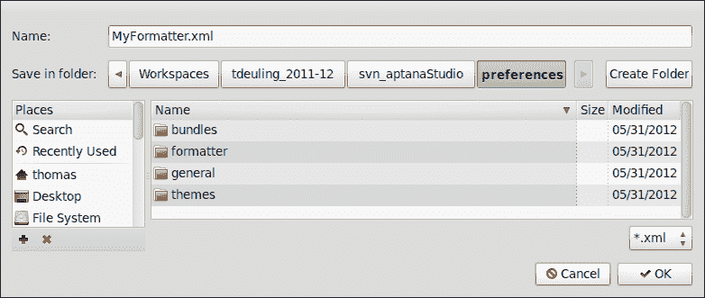

1.  在选择文件名和目录后，只需点击**保存**按钮即可完成导出过程。

1.  现在，我们将尝试从导出配置文件的同一路径重新导入配置文件。这里我们从步骤 1 的格式化器设置部分重新开始。

1.  在右上角，您将在**导出**按钮的左侧找到**导入**按钮——点击它。

1.  出现的窗口允许您从文件系统中选择配置文件。导航到您刚刚保存导出配置文件的目录，并按以下截图所示选择它：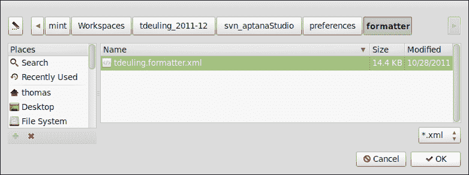

1.  最后，点击**打开**按钮以完成导入过程。

1.  现在导入的配置文件已在 Aptana Studio 中可用。

## *发生了什么？*

我们刚刚在首选项中导航，并将现有的代码格式化器配置文件导出到本地文件系统。之后，我们回到首选项并将配置文件重新导入到 Aptana Studio 中。使用此过程，您可以恢复代码格式化器配置文件到其他 Aptana Studio 实例，或与其他开发者共享。

# 分享 Aptana Studio 首选项

在上一节中，我们看到了如何导出 Aptana Studio 的大量设置和首选项。如果您的团队现在开始开发过程并需要配置每个工作站的 Aptana Studio 工作空间，他们可以通过简单地导入设置来节省大量时间。当新开发者加入您的团队时，他们可以在几分钟内启动并运行一个完全配置的 Aptana Studio 版本，而无需进行无尽的配置。

下面是几个步骤再次说明这个过程：

1.  创建您的第一个 Aptana Studio 实例，并将其完全配置为即将到来的项目的需求。

1.  导出所有设置并与其他团队成员共享。

1.  现在，每个团队成员都在他们的工作站上安装 Aptana Studio 的当前版本，并导入共享的设置。

团队设置、模板以及更多内容可以通过集成源控制，如 SVN 来处理。团队领导只需创建一个新的仓库，并定义可以处理文件和提交的团队成员。这个小圈子现在可以将团队设置和模板基础扩展到其他团队成员，他们只需从 SVN 检出每个新项目约定即可立即使用。使用版本控制的另一个优点是配置和模板使用的开发历史。

分享一个完全配置好的 Aptana Studio 实例的另一种解决方案是复制这个 Aptana Studio 的基本安装。这个过程的缺点是您必须为每个操作系统创建一个基本安装。尽管如此，另一个优点是团队成员已经安装了所需的插件。在安装基本安装的副本后，开发者只需更新 IDE 即可。

### 小贴士

**想法和讨论**

如果您对优化 Aptana Studio 有任何想法，或者想要讨论我们检查的一些主题，请访问我们的页面[`www.coding.ms/aptana-studio-3/`](http://www.coding.ms/aptana-studio-3/)。

# 使用书签

如果您正在处理不同的源代码部分，因此需要频繁地在不同的源代码文件之间跳转，使用书签标记当前使用的源代码区域可以节省大量时间。幸运的是，Aptana Studio 提供了这样的功能。您可以在任何源代码文件的任何一行上放置书签，而无需更改其内容。然后 Aptana Studio 会记住项目中的所有书签。

### 小贴士

**在库中使用书签**

如果您使用外部库并且经常需要在其他文件中查找功能，使用书签快速轻松地跳转到所需位置是值得的。唯一的要求是外部库必须在 Aptana Studio 项目中。

# 行动时间 - 设置书签

1.  在编辑器中打开您想要设置新书签的源代码文件。

1.  在你想要放置书签的行号的左侧边缘右键单击，并选择**添加书签...**选项，如下截图所示：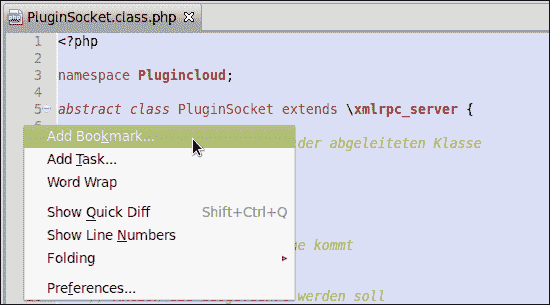

1.  在出现的窗口中，你可以输入书签名称。如果你试图在已经包含一些代码的行上设置书签，Aptana Studio 会将此代码预先填充到名称字段中。请注意，你不必使用此预填充的名称，你可以在以下对话框中为你的书签命名任何你想要的名称：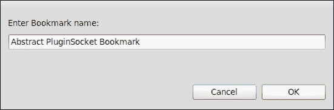

1.  最后，点击**确定**以完成设置新的书签。

## *发生了什么？*

我们刚刚在文件中的一行设置了新的书签，这行可能是你需要频繁跳转以查看或更改内容的地方。通过以下截图可以看到，你可以通过行号左侧的小蓝色书签标签来轻松识别哪一行有书签：

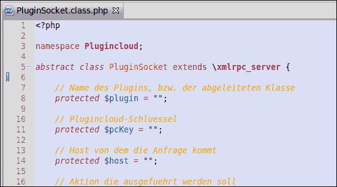

然而，通过完成这个过程并设置一个书签，这并没有告诉我们如何跳转到它。为了使我们能够做到这一点，Aptana Studio 提供了一个书签视图。让我们看看如何使用这个视图。

## 书签视图

书签视图是一个包含你当前打开的项目中所有可用书签的列表。你可以通过导航到**窗口** | **显示视图** | **书签**来打开这个视图。以下截图显示了**书签**视图：

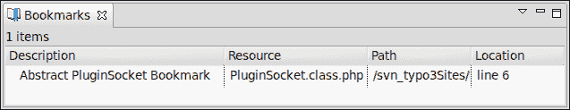

如果你想要从列表中跳转到书签，只需双击相关的书签，Aptana Studio 就会在编辑器中打开书签文件。然后，它将光标放置在书签所在的行上。

不幸的是，随着时间的推移，你的书签列表可能会变得相当杂乱，你可能需要清理或过滤书签视图。现在我们将看看如何做到这一点。在下一个**操作时间**部分，我们将给自己一个任务，过滤所有可用的 ZendFramework 书签。

# 操作时间 - 配置书签视图

1.  打开书签视图。

1.  点击**视图**菜单并选择**配置内容...**选项。

1.  在你开始创建和使用自己的过滤器之前，你必须取消选择以下截图所示的**显示所有项目**复选框：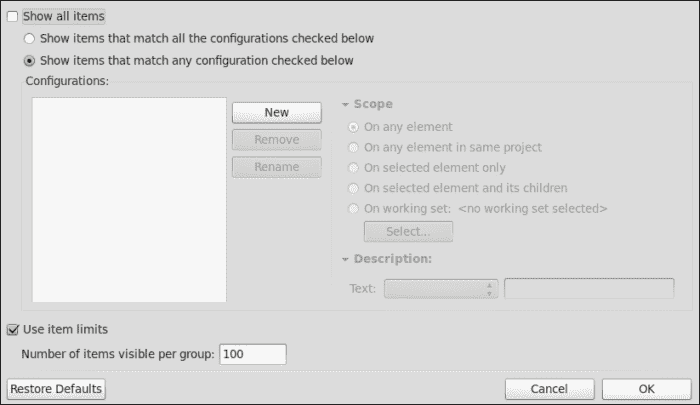

1.  现在，你可以创建一个新的配置。只需点击**新建**按钮来创建一个新的过滤器。

1.  点击**新建**按钮后，在左侧列表中会出现一个名为**新建配置**的新配置条目。我们现在需要配置这个新条目，以便我们可以使用它。以下截图显示了这些操作：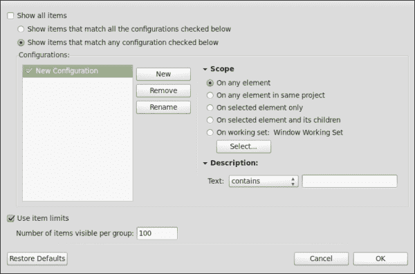

1.  我们现在将使用比“新配置”更描述性的名称重命名此条目。为此，只需点击 **重命名** 按钮，然后输入一个名称，例如，`ZendFramework`。下面的对话框，如以下屏幕截图所示，可以用于重命名：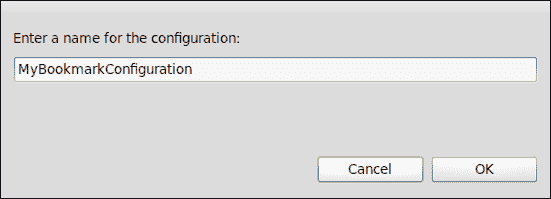

1.  接下来，我们可以选择过滤器将工作的范围。在这个简单的例子中，我们将范围保留在任何元素上。

1.  最后，我们可以输入一些应该或不应该包含在书签名称中的文本。对于这个例子，输入 `ZF` 作为 ZendFramework 的简称，并在文本选择框中选择 **包含**。

1.  最后，我们可以通过点击 **确定** 来完成配置。

## *刚才发生了什么？*

我们刚刚为书签视图创建了一个过滤器。现在，**视图** 菜单为我们提供了一个名为 **显示** 的新条目。这个小子菜单包含所有可用的过滤器，并使我们能够快速过滤书签视图。

作为快速测试，我们将创建两个书签。第一个包含关键字 **ZF**，第二个将包含一些其他关键字。之后，只需稍微玩一下 **显示** 子菜单中的 **ZendFramework** 条目。正如你将看到的，列表将显示和隐藏没有 **ZF** 关键字的条目。这些操作在下面的屏幕截图中显示：

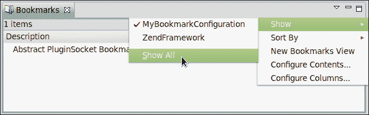

### 小贴士

**收集显示的列表列**

如果你无法看到书签中的一些信息，或者如果你有一些不需要的列表列，请使用 **视图** 菜单中的 **配置列…** 项来自定义所需的列。

如果你大量使用书签并且已经有很多书签和过滤器，而且你不想每次都更改过滤器——没问题，只需继续在当前书签视图菜单中创建一个额外的书签视图。你可以给你的新书签视图起任何你喜欢的名字，以描述配置的列表。

# SVN 提交评论模板

如果你大量使用基于 SVN 的项目，通常情况下，你必须提交你的当前源代码。如前所述，始终建议你为你的提交提供关于你所做的详细评论。因此，当你经常进行类似更改时，为这些评论创建一个模板是个好主意。

许多开发团队也使用 SVN 仓库的 post-commit 钩子，以便以其他方式进一步处理提交的数据。因此，每个团队成员以相同风格和结构编写评论可能是有益的，这样就可以实现自动处理。

为了使这更容易，你可以为你的 SVN 评论创建模板。

# 动手时间——创建 SVN 提交评论模板

1.  导航到 **窗口** | **首选项**。

1.  在树中转到**团队** | **SVN** | **评论模板**。您将在这里找到所有可用的评论模板的完整列表，如下面的截图所示：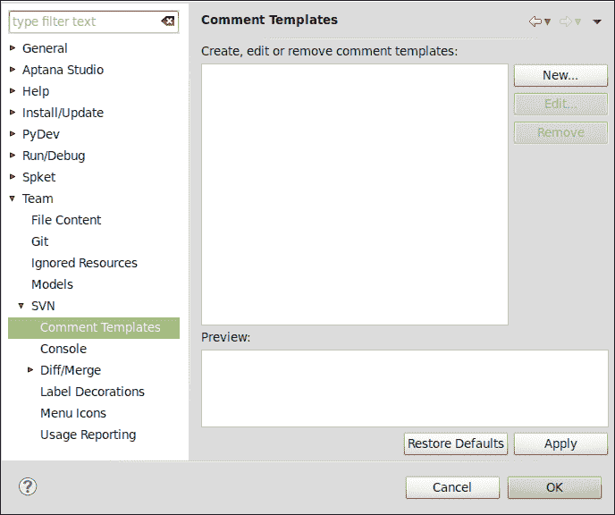

1.  点击列表右侧的**新建...**按钮，以创建一个新的模板。

1.  在此处，您可以输入您新评论的完整文本，如下面的截图所示：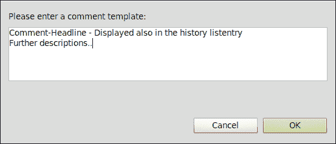

1.  最后，点击**确定**按钮以保存您的新评论。

## *发生了什么？*

您刚刚为 SVN 提交过程创建了一个评论模板。如果您现在正在进行 SVN 提交，并且 SVN 插件要求您输入注释，您可以选择您的其中一个评论模板，如下面的截图所示：

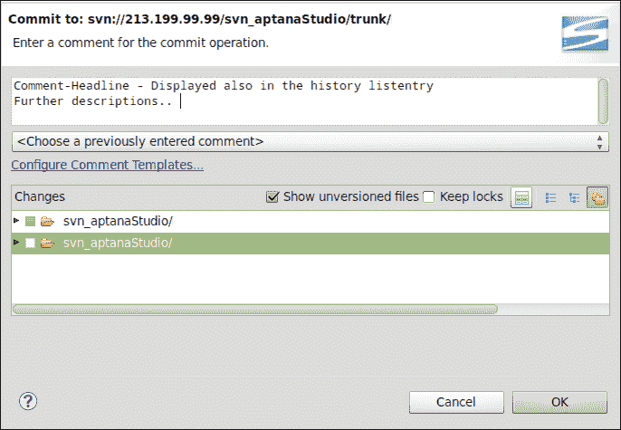

选择必要的模板后，您可以调整或扩展模板文本，并完成提交。

# 与任务一起工作

在开发网络应用程序时，您可能经常需要处理目前不是高优先级或尚未完全编码的部分，并且希望在稍后完成这部分。遗憾的是，随着项目越来越大，您可能会忘记源代码中的这些部分，留下代码中的空白。最好的解决方案是什么，以便您能够记住这些位置？

如果有一个包含待办事项和修复事项等点的自组织待办事项列表，并且条目也可以有不同的优先级，那会多么好。因此，Aptana Studio 为您提供了一个任务视图。此视图帮助您记住所有需要做或修复的位置。在编码项目时，列表中的所有条目都会自动添加。Aptana Studio 默认理解用于标记任务条目的 `@TODO` 和 `@FIXME` 标签。

Aptana Studio 通常理解的标签可以在首选项中进行配置。让我们看看这是如何工作的。

# 动手实践 – 配置任务和管理任务标签

1.  首先导航到**窗口** | **首选项**，然后转到**Aptana Studio** | **任务**。**任务**窗口如下面的截图所示：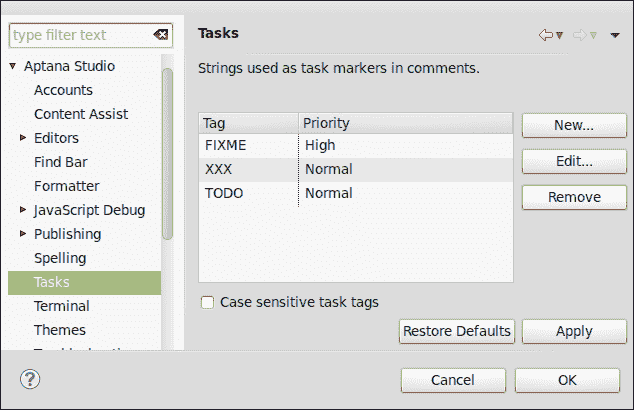

1.  在此首选项窗口中，我们首先需要决定是否想要使用区分大小写的任务标签，通过窗口底部的**区分大小写任务标签**复选框。基于这个决定，我们选择区分大小写的任务标签或不选择。通常使用区分大小写的任务标签是一个不错的选择，因为如果您在注释中包含标签名称，注释将被标记为任务。

1.  复选框上方的列表使我们能够了解当前可用的任务标签概览。在左侧，我们看到标签名称本身；在右侧，我们看到每个标签的相关优先级。要编辑条目，选择要更改的条目并点击**编辑...**按钮。

1.  在编辑窗口中，您可以更改任务的标签名称或优先级。调整任务标签以符合您的要求后，点击**确定**以保存更改，如图所示：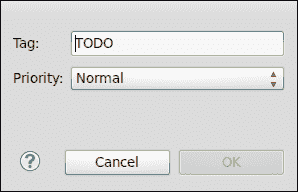

1.  现在我们可以通过点击**新建...**按钮来添加一个新的任务标签，以打开创建窗口。这个窗口的结构与编辑窗口相同。您只需要输入新任务标签的名称和所需的优先级，这样就完成了。在这个阶段，您可以创建一个名为`OPTIMIZE`的任务标签，用于那些功能良好的源代码部分，但它们可能需要在以后进行优化。以下是一个任务创建的示例，如图所示：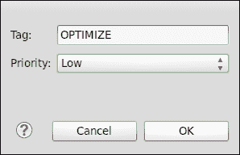

1.  现在点击**应用**，然后点击**确定**按钮以完成任务的配置。

## *发生了什么？*

我们刚刚配置了 Aptana Studio 用于填充任务列表的任务行为和管理任务标签。我们看到了如何添加新的任务标签，以及如何编辑或删除可用的任务标签。

如果您在一个开发团队中工作，可能需要添加更多标签，但多亏了标签的管理，这并不是问题，您可以创建您需要的任意数量的标签。

现在我们将看到如何使用任务标签。

# 创建任务

创建任务可以通过两种不同的方式完成。一种方式是在行号上创建任务，另一种方式是在源代码注释中编写任务。在下一节中，我们将探讨如何创建这样的任务以及创建过程之间的区别。

# 操作时间 – 在行号上创建任务

1.  在编辑器中打开一个 PHP 文件。

1.  在您想要创建任务的行号左侧单击鼠标右键。

1.  选择如图所示的**添加任务...**选项：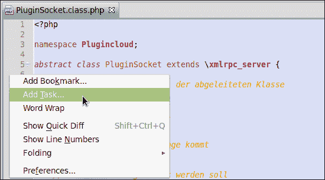

1.  在出现的窗口中，最重要的信息已经填写好了。您只需要输入新任务的描述。尽管如此，您必须确保描述中包含任务标签，以便任务列表能够过滤这些任务。如图所示：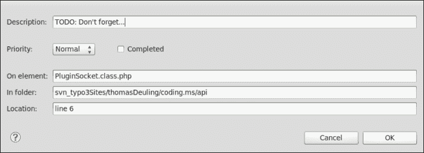

1.  最后，点击**确定**按钮，这样就完成了。

## *发生了什么？*

我们刚刚使用行号的帮助创建了我们的第一个任务。任务视图应该立即列出它们。除此之外，你还可以通过以下截图中的小任务图标识别带有链接的任务行：

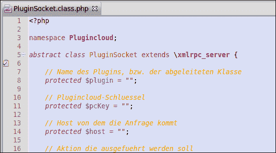

正如我们已经提到的，创建任务还有第二种方法；我们现在就来看看这个方法。

# 行动时间 – 使用注释创建任务

1.  在编辑器中打开一个 PHP 文件。

1.  查找你想要放置任务的那一行。

1.  现在，开始输入一个符合 PHPDoc 的注释。这个注释应该包含 PHPDoc 属性 `@TODO`，后面跟着任务描述文本。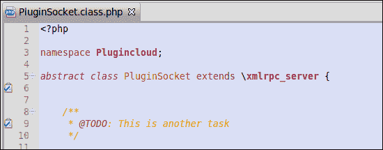

1.  保存你的文件后，任务应该出现在任务列表中。

## *发生了什么？*

我们刚刚使用 PHPDoc 注释的帮助创建了一个任务。在保存包含新任务的文件后，任务列表将包括这个新任务。

### 小贴士

**我的任务在哪里？**

如果你已经按照这里描述的方式创建了任务，但它们没有出现在任务列表中，请确保你的项目有一个自然类型，否则构建过程将不会读取任务注释。

但是，你可能会想知道，我应该选择哪种方法？好吧，结果是，基于注释的创建任务方法有更多的优势。首先，任务可以与 Git 和 SVN 共享；其次，如果注释符合 PHPDoc，你还可以将这些任务填写到你的 PHPDoc 文档中。创建任务的这种后一种方法可能更适合单个开发者，他们不想在代码中添加他们仍然需要创建的所有内容。

### 小贴士

**开发团队内的任务**

当处理大型项目时，如果所有团队成员都标记了他们的任务、错误和优化，这将非常有优势。当所有发生的情况都相应地标记后，项目经理可以很容易地大致了解还有多少问题需要解决，而无需与每个开发者联系。

## 尝试一下你学到的内容

你的任务现在是要创建一个你喜欢的语法高亮主题。

然后，导出你所有的 Aptana Studio 设置、主题、代码格式化器等等，以便你以后可以恢复它们。在你完成导出数据后，尝试将文件导入回来。

最后，当你尝试了导入和导出功能后，熟悉书签和任务。为此，打开你的一个项目，浏览包含的文件，然后在经常使用的行上放置书签。如果你发现一行不完整或需要优化，就在那行上放置一个任务。

## 快速问答

Q1. 你可以在哪里导出主题和代码格式化器？

1.  **Aptana Studio** 中的 **首选项** 窗口。

1.  **文件** 窗口中的 **导出** 按钮。

1.  这些设置无法导出。

Q2. 我们学习到的创建任务的两种方法之间有什么区别？

1.  基于注释的任务位于相关文件中，其他任务位于项目内部。

1.  基于注释的任务位于项目内部，其他任务位于相关文件中。

1.  没有区别。

Q3. Aptana Studio 预定义了哪些任务标签？

1.  `OPTIMIZE` 和 `TODO`。

1.  `TODO` 和 `FIXME`。

1.  `FIXME` 和 `OPTIMIZE`。

# 摘要

到本章结束时，你应该能够创建和管理自己的语法高亮主题。此外，你应该能够导入和导出 Aptana Studio 最重要的设置和配置。你还应该能够通过使用书签和任务来管理和优化你的工作。

然而，Aptana Studio 可以做的不仅仅是我们在这里所涵盖的内容。例如，你可以扩展可用的捆绑包、模板和代码片段，或者根据项目需要创建新的，此外，还有可能在你自己的开发团队中共享它们，就像 Aptana Studio 团队所做的那样。

当你的项目环境达到这种程度时，捆绑包会随着你项目规模的增加而不断学习。将所有常用的代码结构集成到代码片段中，然后创建具有项目基础结构的文件模板，其中已包含所有标题和页脚，扩展捆绑包的菜单功能，以便所有开发者都能通过菜单使用捆绑包功能（编写他们将在编辑器中直接执行的命令），以及更多。

在下一章和最后一章中，我们将探讨当出现错误时我们必须要做什么。
