# 第十二章. 故障排除

*有时我们在使用 Aptana Studio 时可能会遇到问题。这些问题通常取决于所使用的操作系统、Aptana Studio 插件或 Aptana Studio 配置。了解如何从 Aptana Studio 中获取所需信息以解决问题很重要。但可能的问题可能非常多样。*

*因此，我们无法轻松或以相同的方式解决所有这些可能的问题。此外，你可能会在 Aptana Studio 中找到一个全新的问题或错误。因此，我们将查看一些最常见的问题，以及你可以做什么来解决这些问题。我们还将讨论你需要遵循的程序来解决那些你自己无法解决的问题。*

因此，在本章中，我们将涵盖以下内容：

+   当问题发生时应该做什么

+   如何配置系统错误级别

+   你在哪里可以找到日志文件内容

+   你可以从哪里获得额外的支持

+   如何报告错误报告

# 当问题发生时应该做什么

首先，我们将看看你可以在哪里找到一些额外的信息或帮助，以防你有一些问题或需要帮助。

## 系统帮助

如果你对 Aptana Studio 的主要功能有任何疑问，首先查看**帮助内容**菜单。你可以通过访问**帮助** | **帮助内容**来找到它。出现的窗口为你提供左侧的帮助内容树，帮助内容在右侧显示。

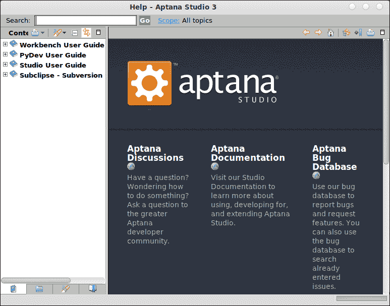

+   **内容**树包含**工作台用户指南**选项，它提供了关于 Aptana Studio 一般基础功能的帮助主题。这些帮助主题由位于底下的 eclipse 框架提供。另一个重要的条目是**工作室用户** **指南**选项。在这里，你可以找到关于 Aptana Studio 提供的特定功能的帮助。此外，还可能有更多与已安装的系统插件相关的条目。

## 你有问题吗？

假设你已经到达了一个点，你在 Aptana Studio 中遇到了一些问题。正如你所阅读的，你可以尝试通过写一个论坛帖子或创建一个错误报告来解决这些问题。但是，停止！

在你继续在论坛上发帖或报告错误之前，你应该尝试自己解决问题。

解决你问题的可能过程可能是执行系统更新。也许你的问题是由 Aptana Studio 或集成插件中的错误引起的。在系统更新后，整个 IDE 应该使用最新的源代码工作——也许你的问题与旧版本有关，现在已经被解决了。如何在第一章“入门”中运行系统更新已经讨论过了。

如果问题仍然存在，你应该开始搜索这个问题。看看是否有错误消息？你能用文字描述你的问题吗？将所有这些信息输入你喜欢的搜索引擎。这次搜索肯定会给你一些解决问题的提示。

如果你的问题仍然存在，搜索也没有给出有效的结果，尝试向你的搜索提供来自 Aptana Studio 的版本和系统信息。我们现在将看看如何从 Aptana Studio 中获取这些信息。

## 你安装了哪个版本的 Aptana Studio

为了使你的问题搜索更加精确，向你的搜索提供你的 Aptana Studio 版本和其他与你的问题相关的详细信息。

# 执行操作 – 显示安装详情

在接下来的几个步骤中，你将看到如何检索有关你的安装的大量信息：

1.  导航到**帮助** | **关于 Aptana Studio 3**。

1.  结果窗口没有提供太多信息。它将简单地为你提供使用的版本/构建号以及一些关于 Aptana Studio 的一般信息。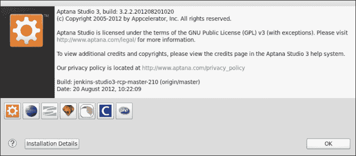

1.  然而，你可以从这个区域获取更多信息。左下角的小图标按钮为你提供有关你已集成的插件的过滤信息。所以，如果你有一个插件的问题，你需要知道你正在使用哪个版本，导航到这个区域，你将找到你需要的信息。

1.  但这还不是全部，如果你点击**安装详情**按钮（见前面的截图）。点击它，你将获得 Aptana Studio 安装详情的概览。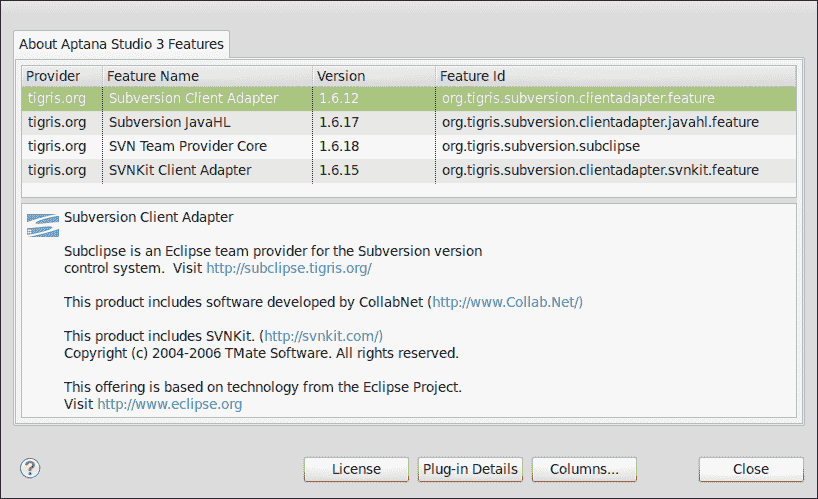

1.  在第一个标签页上，你可以找到一个集成在系统中的已安装软件的完整列表。

1.  第二个标签页为你提供安装历史记录。这非常有用！每次你安装新的插件或运行更新时，安装历史记录都会增加一个条目。在上面的区域，你可以找到执行某些活动时的日期和时间。如果你点击这些条目之一，下面出现的列表将显示你当时拥有的安装和插件类型。你还可以在这里选择撤销你之前所做的更改。以下截图显示了**安装历史记录**标签页：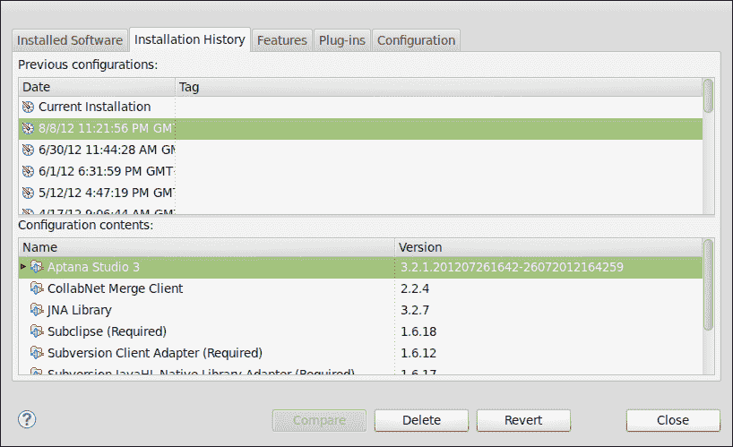

1.  下一页是**功能**标签页，为你提供已安装功能的概览。**功能**标签页显示了所有已安装的插件。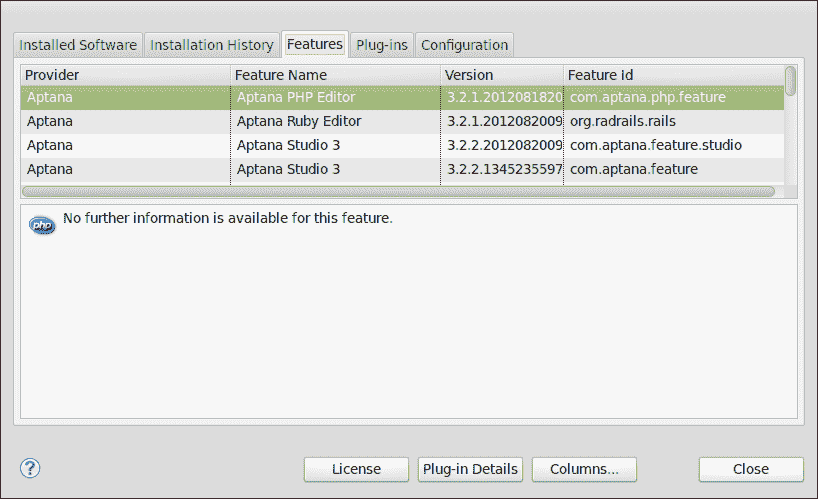

1.  接下来是**插件**标签页。插件是最小的可安装软件组件。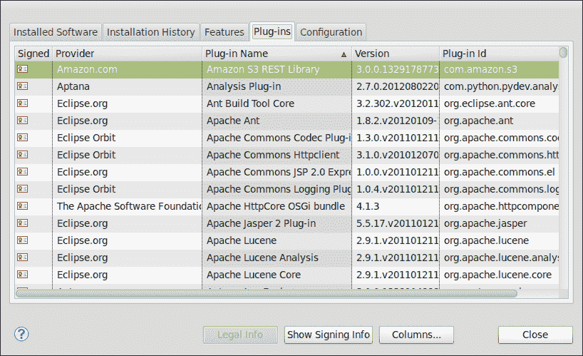

1.  最后一个标签是 **配置** 标签。在这个标签中，你可以找到关于 Aptana Studio 整体配置的信息。当你需要报告错误时，这些信息对 Appcelerator 团队非常有用。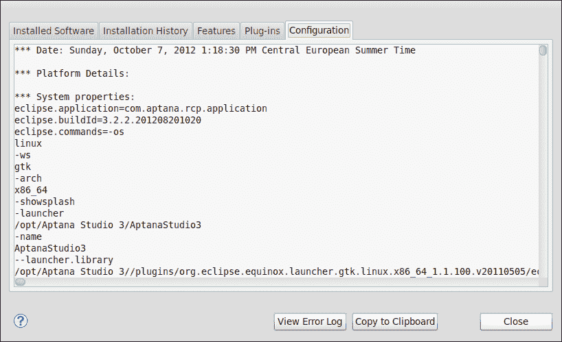

## 运行诊断测试

诊断测试只是提供了对我们调试问题时有用的系统信息的一些片段。目前它没有做更多的事情，但这些信息通常非常有用。

为了运行诊断测试，完成以下步骤：

1.  导航到 **帮助** | **Aptana** | **运行诊断测试...**。

1.  就这样！在出现的窗口中，你可以看到关于你的 Aptana Studio 安装的最重要信息。

    我们刚刚创建了诊断测试的输出。

    你的诊断测试结果看起来像以下截图：

    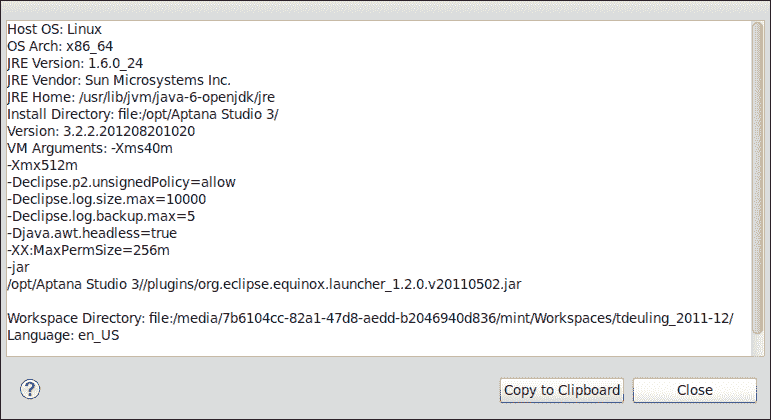

    在这里，你可以直接将结果复制到剪贴板，以便粘贴到你需要的地方。也许是在论坛或错误报告单上。

## 查看和清除日志文件

Aptana Studio 有一个日志文件，其中记录了启动和运行 IDE 时的所有警告和错误。有时，如果你遇到 Aptana Studio 的问题，阅读日志文件非常有用。

这将允许你（借助记录的警告和错误）确定问题的来源。

# 查看和清除日志文件的行动时间

1.  导航到 **帮助** | **Aptana** | **查看日志文件**。

1.  就这样！日志文件（它是一个简单的文本文件）在文本编辑器中加载，你现在可以检查它。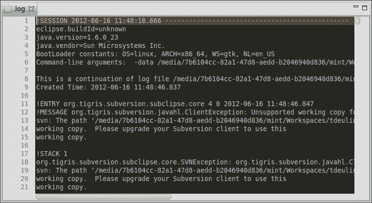

1.  如前一个截图所示，从行号列中可以明显看出，这个文件非常大，因为在启动和运行 IDE 时在其中记录了大量的信息。通常，当你搜索日志文件中的问题时，由于信息量很大，可能很难找到与你的问题相关的条目。如果这种情况发生，你应该清除当前的日志文件，再次运行出现问题的部分，然后再次查看日志文件。

1.  清除日志文件就像上一步一样简单。只需导航到 **帮助** | **Aptana** | **清除日志文件**，日志文件就会被清除。

## *发生了什么？*

我们刚刚查看了日志文件。日志文件通常非常大，因此阅读相关的信息并不容易。Aptana Studio 3 提供了一个清除日志文件的功能，我们之前也查看过。

如果日志文件不包含你需要的信息，导航到 **窗口** | **首选项**，然后在 **Aptana Studio** 下选择 **故障排除** 项。在这里，你可以选择哪些类型的错误和警告应该记录到日志文件中。

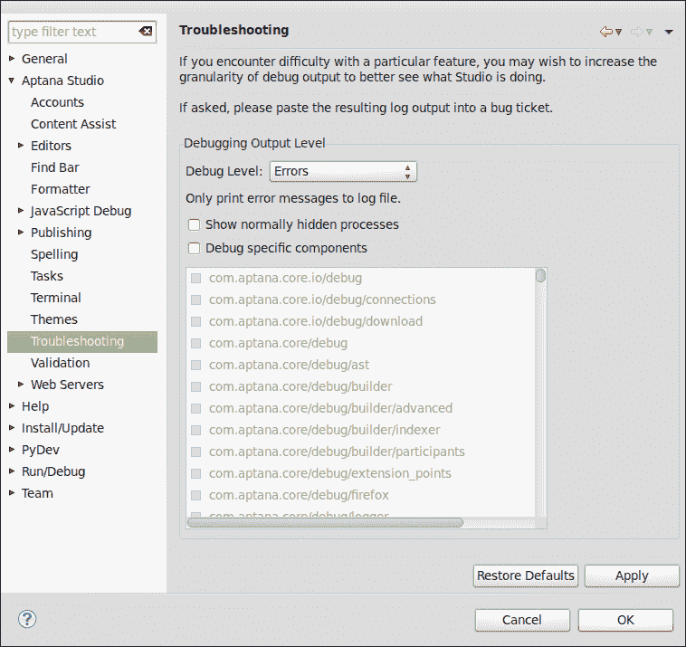

# 论坛

如果你的问题仍然存在，并且你在互联网上搜索后没有找到解决方案，你的下一步可能是在论坛中发帖。

如果你需要来自 Aptana 社区的帮助，你应该参考以下网站：

[`aptana.com/support`](http://aptana.com/support)

在这里，你可以找到不同支持方式的概述。在这种情况下，我们想要与其他 Aptana Studio 用户取得联系，以便交换有关你问题的信息。Aptana 有自己的讨论论坛，名为 *Tender app*，可以在其网站上找到，但团队已决定将论坛迁移到 [stackoverflow.com](http://stackoverflow.com)。StackOverflow 拥有一个非常庞大的知识渊博的个人社区，他们通常比 Appcelerator 团队响应得更快。

在 StackOverflow 上，你可以创建一个新的问题，并给它加上 **aptana** 标签。**aptana** 标签允许 StackOverflow 通知所有订阅了带有 Aptana 标签的问题的用户，并且还可以将问题分类到其他 Aptana Studio 问题中。

不要忘记在你的帖子中提及你的 Aptana Studio 版本和其他与问题相关的信息。

祝你在与其他 Aptana Studio 用户以及一些 Appcelerator 团队成员的发布和讨论中好运，他们经常在那里提供帮助。

# 报告错误

当你与问题作斗争，并认为你已经发现了一个可能的错误时，如果是这样，继续向 Appcelerator 团队报告它。在错误被跟踪后，团队将尽快检查并解决这个问题。

在你创建新的错误票据之前，查看当前跟踪的问题是有价值的。也许已经有了一个针对你问题的票据。只需在你的首选浏览器中导航到 [`jira.appcelerator.org`](http://jira.appcelerator.org)，并使用 **问题跟踪器** 选项浏览当前问题。

你没有找到你的问题？没有？那么你需要报告一个错误。

# 行动时间 – 报告错误

让我们看看我们如何报告一个错误。

1.  导航到 **帮助** | **Aptana** | **提交票据...** 以打开报告错误的窗口。

1.  在你开始填写你的错误详情之前，我们需要登录到 JIRA 错误跟踪器。如果你没有账户，只需点击**注册...**，注册表单将在你的默认浏览器中打开。按照要求步骤完成账户注册。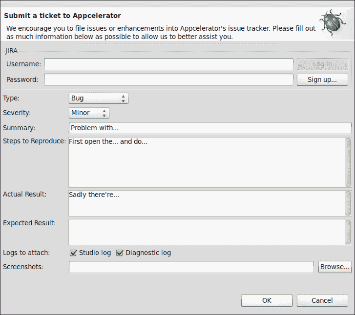

1.  登录到 JIRA 后，你可以填写票据信息。我们从第一个选择开始。**类型**字段已经正确选中，因为我们想要提交一个可能的错误。然后选择**严重性**字段，之后你会找到每个选项的简要描述：

    +   **阻止器**：问题阻止了我们的项目

    +   **主要**：可能存在解决方案的崩溃或行为不正确问题

    +   **轻微**：崩溃或行为不正确，但没有合理的解决方案

    +   **微不足道**：功能正常，但外观/功能需要改进

    +   **无**：默认

1.  **摘要**字段就像电子邮件的主题字段一样，保持其内容简短但清晰。

1.  这是最重要的步骤。在**重现步骤**字段中，你需要非常清楚地描述 Appcelerator 团队必须执行的操作以强制执行故障。在逐步程序中提及这一点——每一点信息都可以帮助解决这个问题。

1.  在**实际结果**字段中，你必须描述动作的结果。如果描述行为太难，请随意附加一个截图，这将有助于理解问题。

1.  然后，在**预期结果**字段中，描述你认为在此操作后应该出现的正确行为。

1.  接下来，检查两个**要附加的日志**复选框。这些信息对 Appcelerator 团队在重现和解决问题时非常有帮助。这些文档中都不包含任何敏感数据。你已经在本章中详细看到了包含的数据。

1.  最后，点击**确定**按钮以完成报告错误工单的过程。

## *刚才发生了什么？*

我们刚刚导航到错误报告窗口，登录到 JIRA，并开始填写错误工单。在这里，我们必须尽可能清晰地描述问题并将其提交给 JIRA 错误跟踪器。

Appcelerator 团队现在将在错误跟踪器中查找新的工单，阅读它，然后决定如何处理这个工单。

使用你的 JIRA 账户，你可以登录到错误跟踪器并找出你的问题在解决过程中的位置。错误跟踪器可在[`jira.appcelerator.org/`](http://jira.appcelerator.org/)找到。

在这里，你可以识别工单的当前状态并阅读现有解决方案过程的评论。你还可以提供更多信息以支持团队。

如果你已经到了这一步，是时候说：感谢你为使 Aptana Studio 变得更好、更稳定所提供的所有支持！

如果你有一个关于 Aptana Studio 新功能或改进的想法，那太好了！请随意使用工单功能并将想法发送给 Appcelerator 团队。只需选择改进或功能的类型，并尽可能准确地描述你的想法。

### 备注

注意：请不要用你可以自己解决的问题和问题向 Appcelerator 团队发送垃圾邮件！首先尝试本章中提供的解决方案提示。

# 修复已移动的工作空间目录

当你与许多不同的工作空间一起工作时，有可能你启动了 Aptana Studio，但你的最后一个使用的工作空间目录已不再可用。这可不是什么好事！如果你没有以每次启动时都询问你想要使用哪个工作空间的方式来配置 Aptana Studio，Aptana Studio 将无法启动，并会显示以下信息：

**无法启动产品，因为指定的 workspace 无法创建。指定的 workspace 目录无效或只读。**

在接下来的 *行动时间* 部分，我们将讨论如何解决这个问题。

# 行动时间——在 config.ini 中更改 workspace 目录

1.  使用您的系统文件浏览器并导航到您的 Aptana Studio 安装目录。

1.  在安装目录中，选择位于配置目录中的 `config.ini` 文件，并在编辑器中打开它。

1.  查找以 `osgi.instance.area.default` 开头的行。这一行包含当前使用的 workspace 的路径。

1.  调整路径，以便 Aptana Studio 可以找到有效的 workspace。

1.  最后，保存文件并启动 Aptana Studio。

## *发生了什么？*

您刚刚直接在 `config.ini` 文件中更改了 workspace 路径。之后，Aptana Studio 将能够找到有效的 workspace。

## 大胆尝试吧——收集有关 Aptana Studio 的信息

现在您的任务是确定您安装了哪个版本的 Aptana Studio，以及该版本中集成了哪些功能和插件。

在我们了解当前环境之后，我们将查看日志文件并尝试清除它。

最后，尝试运行诊断测试。

## 突击测验

Q1. 如果您遇到 Aptana Studio 的问题，您应该怎么做？

1.  首先，报告您的问题的 bug。

1.  在您做任何事情之前，尝试重新安装 Aptana Studio。

1.  首先，尝试自己解决问题。在互联网上搜索，如果找不到解决方案，尝试在论坛中寻求帮助。

# 摘要

到本章结束时，您应该知道当 Aptana Studio 3 发生问题时应该做什么。我们已经看到了解决在 Aptana Studio 中发生的问题的程序，从确定当前可用的环境开始，执行诊断测试，到阅读日志文件。
