# 第四章：使用材料定制 3D 对象外观

我们称之为*材料*的对象在 3D 渲染中至关重要。它们被用来在屏幕上渲染对象以及它们的渲染方式。这意味着材料被用来应用纹理和变换，例如波浪，例如管理透明度等等。换句话说，材料是用于轻松定制 3D 对象外观的接口。

以下是一个使用 Babylon.js 的示例：

```js
myMesh.material = new BABYLON.StandardMaterial("material", scene); 
// Done! Now customize everything you want here 
myMesh.material.diffuseTexture = diffuseTexture; 
myMesh.material.transparency = 0.5; 
// Etc. 

```

我们在本章中将涵盖以下主题：

+   讨论材料背后的神奇理论

+   使用 Babylon.js 标准材料

+   使用材料与纹理

# 讨论材料背后的神奇理论

材料被用来定制 3D 对象的外观；然而，在其背后隐藏着两个被称为**着色器**的程序。材料的目标是隐藏这种着色器的概念，并简单地与材料对象中的值一起工作。换句话说，材料中的值可以是物体的发射颜色、漫反射颜色、透明度等级等等。

事实上，要进一步探讨理论，有几种类型的着色器，如下列所示：

+   **顶点着色器**：这直接作用于 3D 对象几何形状。

+   **像素着色器**：这直接作用于屏幕上的像素。

+   **几何着色器**（在 WebGL 中不可用）：这作用于 3D 对象几何形状；然而，在这里它能够根据顶点着色器的输出直接向 3D 对象的几何形状中添加多边形。

+   **计算着色器**（在 WebGL 中不可用）：这不能直接在 3D 对象和像素上工作。它只是用来使用 GPU 而不是 CPU 计算一些用户定义的数据。例如，计算着色器将一个纹理作为输入（你可以将其视为一个大矩阵）并将程序的输出结果输出到另一个纹理中。计算着色器被高度用于计算逼真的海洋波浪或神经网络。

+   **细分着色器**（在 WebGL 中不可用）：这允许我们在 GPU 上直接计算**细节级别**（**LOD**），而不是在 CPU 上（在现代渲染管线中如 Direct3D 11 和 OpenGL 4.0 中相对较新）。

在我们的案例和 WebGL 中，只有顶点和像素着色器被用来在屏幕上渲染 3D 场景；然而，在将来看到其他类型的着色器在 WebGL 中实现并不会令人惊讶。

## 理论

我们在前几章中创建的网格包含顶点缓冲区和索引缓冲区。顶点缓冲区描述了顶点的 3D 位置。主要问题是如何将 3D 空间中的顶点投影到 2D 空间，即屏幕空间。实际上，为了在屏幕上绘制元素，GPU 通过程序将顶点位置转换成屏幕上的 2D 位置。这些程序是顶点着色器和像素着色器。它们是用一种名为 GLSL 的语言编写的，这是与 WebGL 一起使用的 OpenGL 着色语言。

## 顶点着色器

顶点着色器用于转换顶点位置。它由 GPU 为每个顶点执行，可以用于无限数量的功能。例如，为了在大型海洋平面上创建波浪，我们将使用顶点着色器计算每个顶点的波浪函数，而不是使用在 CPU 端执行的 TS 代码——把工作留给真正的工人。

一旦顶点着色器在屏幕上计算出一个三角形（一个面），多亏了索引缓冲区，像素着色器就会被调用，以照亮当前渲染的当前网格（当前面）当前三角形（当前面）使用的像素。

## 像素着色器

像素着色器具有与顶点着色器相同的结构；它使用相同的语言（GLSL）编写，并且为屏幕上当前三角形使用的每个像素调用。像素着色器的主要功能是返回一个以 RGBA 格式计算的颜色，该颜色可以从用户定义的值或直接从纹理中确定。

# 使用 Babylon.js 标准材质

Babylon.js 允许你创建材质，这意味着它可以创建具有自定义着色器的自定义材质；然而，它提供了一个已经开发好的标准材质，该材质设计为可以通过许多自定义来适应。

实际上，当你向 Babylon.js 场景添加灯光时，灯光属性，如漫反射颜色，会被发送到场景的材质中，以计算网格上的光贡献。

## 标准材质及其常见属性

在 Babylon.js 中，每个网格都有一个材质，网格可以共享相同的材质。使用 Babylon.js 创建标准材质并将其分配给网格，就像编写以下代码一样简单：

```js
myMesh.material = new BABYLON.StandardMaterial("materialName", scene); 

```

通过给材质命名以及指定你想要添加材质的场景，简单地创建一个新的`StandardMaterial`对象，并将它分配给网格的`the.material`属性。一旦材质创建完成，你就可以开始修改值并自定义网格外观。默认材质默认看起来类似于以下图像：

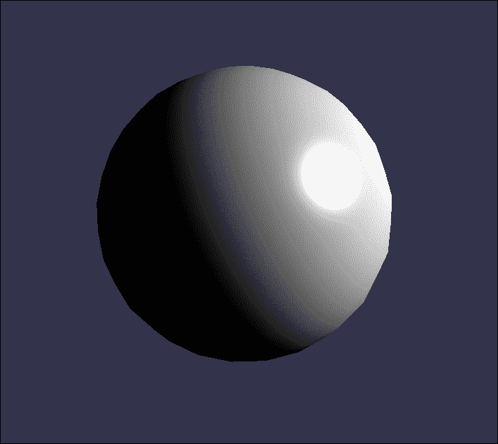

+   漫反射颜色：漫反射颜色表示物体的颜色，如下所示：

```js
    myMaterial.diffuseColor = new BABYLON.Color3(0, 0, 1); // Blue 

```

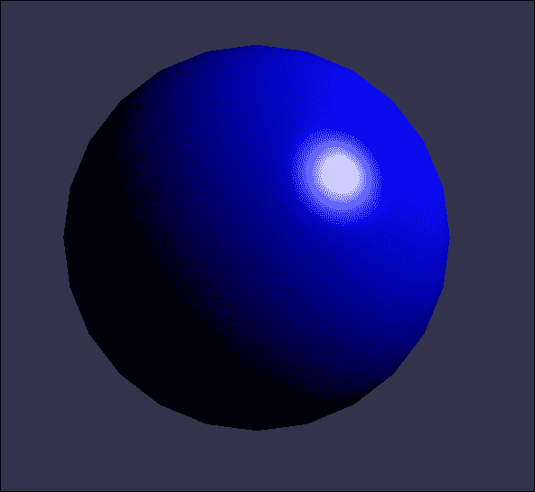

+   镜面颜色：镜面颜色表示物体反射的光的颜色（这与漫反射颜色混合），如下所示：

```js
    myMaterial.specularColor = new BABYLON.Color3(1, 0, 0); // Red 

```


+   发光颜色：发光颜色表示物体发出的颜色（这与镜面颜色和漫反射颜色混合），如下所示：

```js
    myMaterial.emissiveColor = new BABYLON.Color3(0, 1, 0); // Gre      en 

```

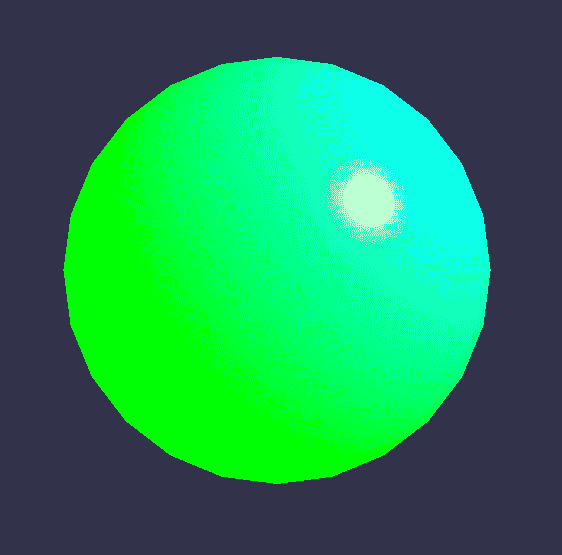

+   管理透明度：为了管理透明度，标准材质在[0, 1]区间提供了一个.alpha 属性，如下所示：

```js
myMaterial.alpha = 0.2; // 80% transparent 

```

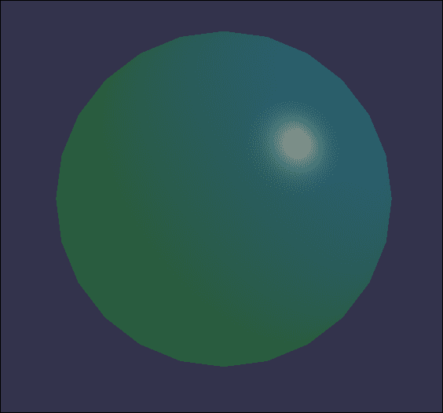

## 使用雾效

标准材质允许你应用与当前渲染场景相关的雾效。要在一个对象上启用雾，只需在材质和场景上设置 `the.fogEnabled` 属性为 true，如下所示：

```js
myMaterial.fogEnabled = true; 
scene.fogEnabled = true; 

```

让我们从以下场景开始：

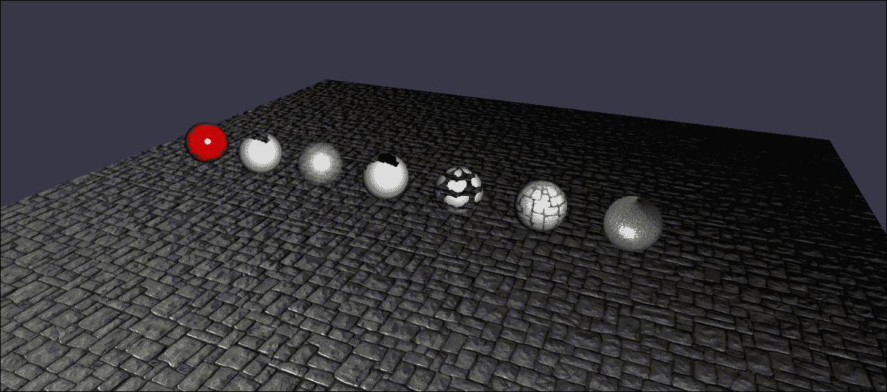

场景中的雾可以自定义。以下列出了几种雾的类型：

+   线性雾 (`BABYLON.Scene.FOGMODE_LINEAR`)

+   指数 (`BABYLON.Scene.FOGMODE_EXP`)

+   指数 2（比之前更快）(`BABYLON.Scene.FOGMODE_EXP2`)

在线性模式下，可以设置两个属性——`scene.fogStart` 和 `scene.fogEnd`。以下是一个示例：

```js
scene.fogMode = BABYLON.Scene.FOGMODE_LINEAR; 
scene.fogStart = 10; 
scene.fogEnd = 100; 

```

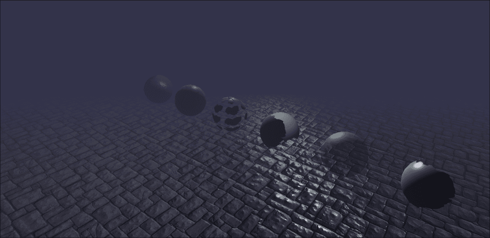

使用以下方法更改雾的颜色：

```js
scene.fogColor = new BABYLON.Color3(1, 1, 1); // White 

```

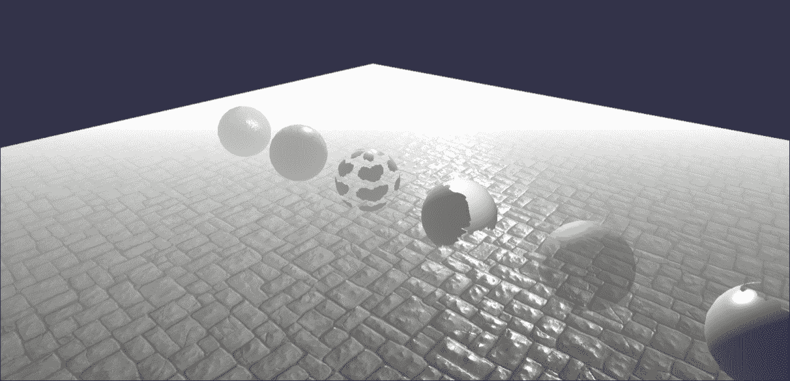

在指数模式下，可以设置 `scene.fogDensity` 属性。

以下是一个示例：

```js
scene.fogMode = BABYLON.Scene.FOGMODE_EXP; 
scene.fogDensity = 0.02; 

```

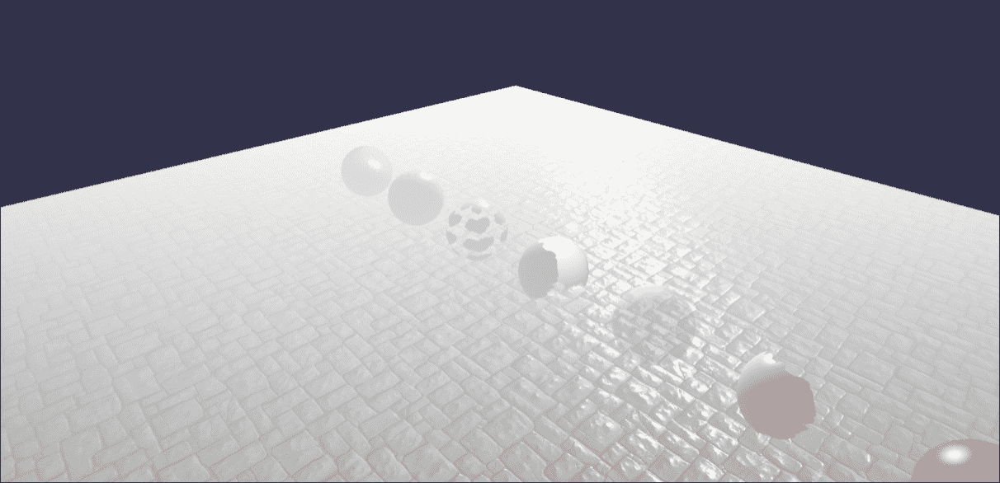

# 使用材质使用纹理

本章是介绍纹理使用的合适位置。纹理是图像（`.png`、`.jpeg` 等），图形库能够将其应用到网格上。Babylon.js 处理了多种纹理方法，例如视频纹理、立方体纹理等。现在，让我们解释如何使用材质来使用纹理。

## 加载并应用纹理

如你可能已经猜到的，使用 Babylon.js 加载并将纹理应用到网格上可以很容易。标准材质提供了一种方法，就像颜色一样，可以应用漫反射纹理（例如，镜面、发射和环境纹理）。只需将 `.diffuseTexture` 属性设置为纹理的引用，如下所示：

```js
myMaterial.diffuseTexture = myTexture; 

```

要创建 `myTexture` 对象，让我们看看以下所示的 `BABYLON.Texture` 类：

```js
var myTexture = new BABYLON.Texture("path_to_texture.png", scene); 

```

现在已经完成了。漫反射纹理现在将被应用到网格上。以下是一个示例，考虑示例文件中的 `floor_diffuse.png` 图像：

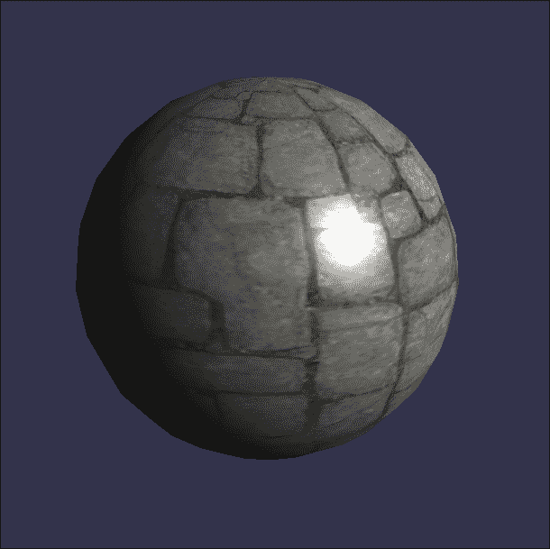

现在，让我们玩一下纹理的属性。在示例文件中，有一个包含 alpha 通道（透明度）的 `cloud.png` 纹理。如果你应用云纹理，结果如下所示：

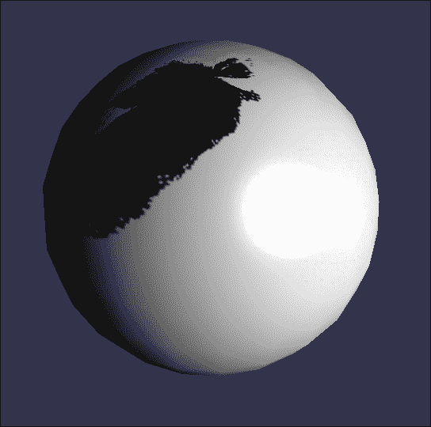

黑色部分代表 alpha 通道，看起来像污染球体渲染部分的伪影。实际上，纹理是通过像素着色器应用到网格上的，你必须告诉着色器纹理可以包含 alpha 通道。这项工作可以通过纹理的 `.hasAlpha` 属性来完成，如下所示：

```js
cloudTexture.hasAlpha = true; 

```

结果如下所示：

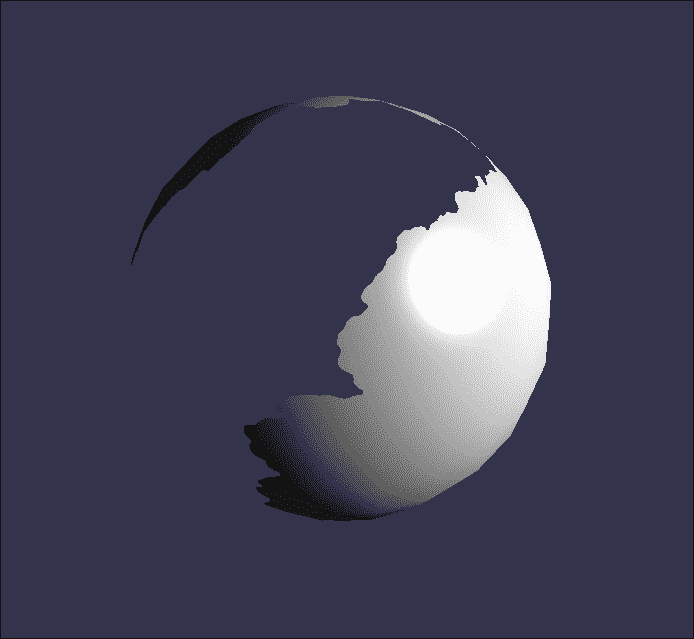

你可以看到球体的背面没有被渲染。这是由于图形库的优化，因为在大多数情况下，渲染摄像机看不到的背面三角形的三角形并不是必需的。这被称为“背面裁剪”。

要禁用`背面裁剪`，只需将材质的`.backFaceCulling`属性设置为 false，如下所示：

```js
myMaterial.backFaceCulling = false; 

```

结果如以下图像所示：


由于纹理是通过像素着色器应用的，因此可以通过材质设置许多参数，例如纹理的垂直和水平缩放。让我们从以下纹理开始：


纹理的`.uScale`和`.vScale`属性允许我们向网格应用重复图案。1.0 的默认值意味着纹理在网格上重复一次。让我们看看以下`5.0`的结果：

```js
myTexture.uScale = 5.0; 
myTexture.vScale = 5.0; 

```


至于纹理缩放，你可以创建一个偏移量来根据`.uScale`和`.vScale`属性调整纹理在网格上的位置，如下所示：

```js
myTexture.vScale = 0.2; 
myTexture.uScale = 0.2; 

```

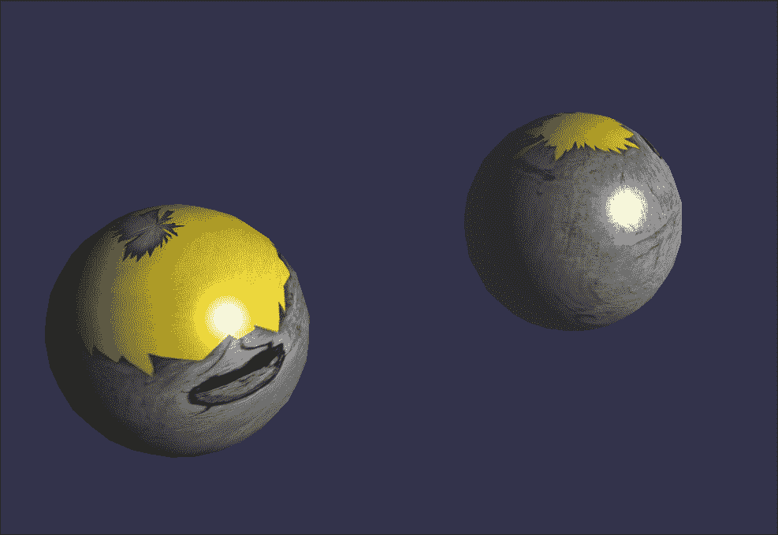

## 凹凸贴图

在 Babylon.js 处理的纹理方法中，我们可以找到凹凸贴图技术。这项技术用于在表面上创建凸起，并使用两种不同的纹理（漫反射纹理和法线纹理）创建更逼真的表面。这项技术因其不修改网格的原始几何形状，而仅通过着色器使用两种纹理进行计算而闻名。

漫反射纹理和法线纹理由艺术家提供，并由一些艺术家工具构建，以帮助生产。以下是一个法线纹理的示例：

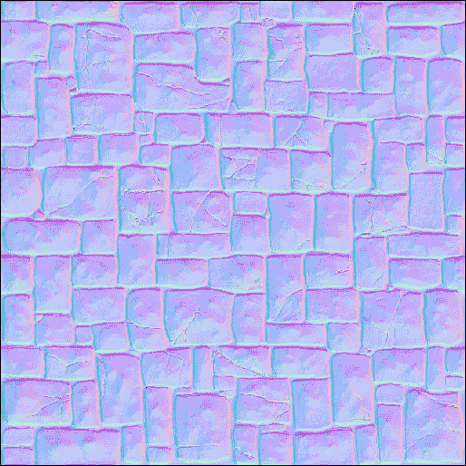

实际上，像素着色器应用漫反射纹理并修改根据法线纹理的像素。

让我们看看法线贴图效果。这是没有法线贴图的情况：

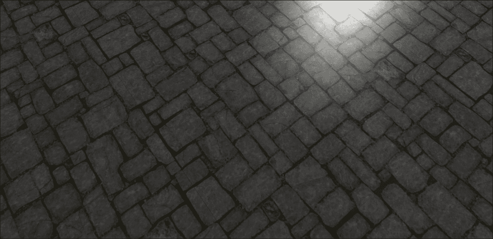

使用法线贴图，图像将类似于以下：

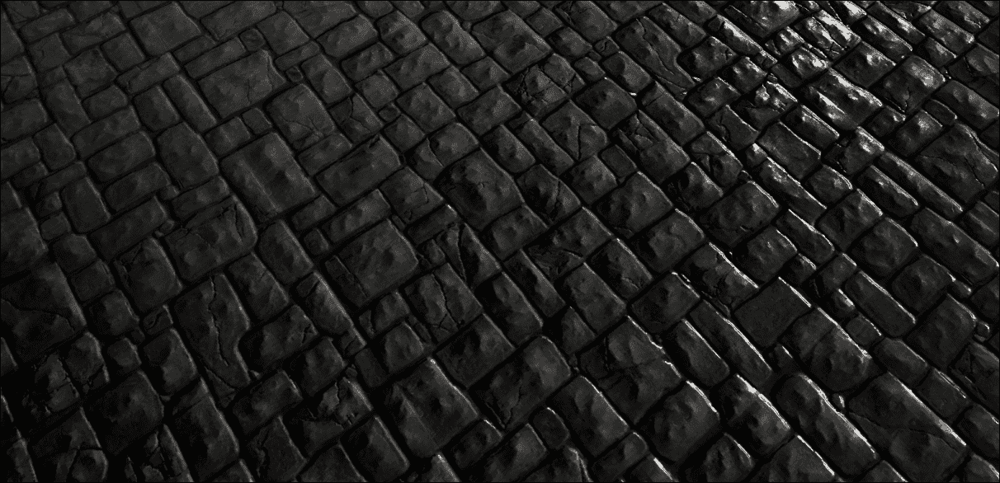

使用 Babylon.js 应用法线贴图效果与应用漫反射纹理一样简单。让我们用以下两行代码来解释：

```js
myMaterial.diffuseTexture = new BABYLON.Texture("diffuse.png", scene); 
myMaterial.bumpTexture = new BABYLON.Texture("normal.png", scene); 

```

材料内部效果能够根据属性来调整渲染。然后，如果设置了`.bumpTexture`属性，效果将计算凹凸贴图技术。

## 高级纹理

Babylon.js 的标准材质允许我们应用反射纹理。如果设置了此纹理，材质的内部效果将使用此纹理创建反射效果。

### 立方体贴图

立方体贴图是特殊的。使用立方体贴图和反射纹理的一个有趣用途是天空盒网格。天空盒由六个面组成，通常用于重现场景周围的环境，通常是天空。为了处理六个面，立方体贴图将加载六个纹理并将它们应用到网格上。

让我们使用 Babylon.js 加载一个立方体贴图，如下所示：

```js
var cubeTexture = new BABYLON.CubeTexture("skybox/TropicalSunnyDay", scene); 

```

参数如下所示：

+   六个纹理的路径。在这个例子中，每个纹理名称必须以`TropicalSunnyDay`开头，后跟立方体的六个方向：`nx`、`ny`、`nz`、`px`、`py`和`pz`。

+   添加立方体纹理的场景。

### 注意

注意：立方体纹理的默认扩展名是 .jpg。您可以通过传递一个包含字符串的数组作为第三个参数来了解确切的扩展名。以下是一个例子：

```js
var cubeTexture = new BABYLON.CubeTexture("skybox/TropicalSunnyDay", scene, ["_px.png", "_py.png", "_pz.png", "_nx.png", "_ny.png", "_nz.png"]); 

```

现在，让我们创建一个天空盒。天空盒是一个立方体，其背面裁剪被禁用，因为摄像机将在立方体内，如下所示：

```js
var skybox = BABYLON.Mesh.CreateBox("skybox", 300, scene); 
var skyboxMaterial = new BABYLON.StandardMaterial("skyboxMaterial", scene); 
skyboxMaterial.backFaceCulling = false; 
skyboxMaterial.reflectionTexture = 
  new BABYLON.CubeTexture("skybox/TropicalSunnyDay", scene); 

```

在结果中，立方体纹理被应用于立方体；然而，我们可以在立方体纹理部分之间找到一些伪影：


这些伪影是由于纹理的坐标模式引起的。实际上，纹理是通过网格几何体提供的 2D 坐标应用于网格的。至于顶点缓冲区和索引缓冲区，几何体包含一个通常称为 **UVs 缓冲区的坐标缓冲区**，存在几种方法来应用特定的坐标模式。在这种情况下，应该应用天空盒坐标模式。这可以通过`the.coordinatesMode`属性实现，如下所示：

```js
myTexture.coordinatesMode = BABYLON.Texture.SKYBOX_MODE;
```

一旦设置坐标模式，结果看起来很棒，如下面的图像所示：

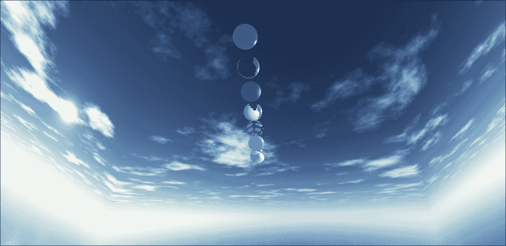

天空盒外部的结果如下所示：

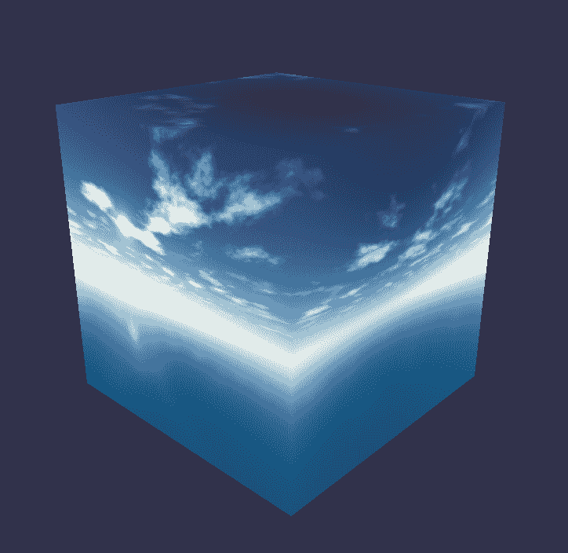

### 镜面纹理

让我们用一个新的纹理类型**镜面纹理**来解释反射纹理的使用。使用 Babylon.js，可以使用镜面纹理来反射世界。镜面纹理是特别的，因为它是由 Babylon.js 创建的，可以将场景渲染成纹理。在反射纹理后面，使用了一种新的纹理类型：渲染目标纹理。渲染目标纹理用于直接将网格渲染到纹理中，以便进一步使用。现在，让我们创建一个镜面纹理，如下所示：

```js
var mirror = new BABYLON.MirrorTexture("mirror", 512, scene); 

```

参数如下所示：

+   纹理名称：Babylon.js 创建的纹理的名称。

+   纹理大小：纹理越大，镜面纹理越清晰。不幸的是，纹理越大，对性能的影响也越大。512 或 1024（512 x 512 或 1024 x 1024 像素）是镜面纹理的好大小。

+   添加纹理的场景。

现在，为了反射世界，镜面纹理需要一个最后一个参数：镜面平面。以地面为例，我们希望地面反射其自身之上的世界：

```js
mirror.mirrorPlane = BABYLON.Plane.FromPositionAndNormal( 
  new BABYLON.Vector3(0, 0, 0), new BABYLON.Vector3(0, -1, 0)); 

```

一个平面有四个属性：`a`、`b`、`c`和`d`。前三个属性代表法向量，其中`d`是到原点的距离。`FromPositionAndNormal`静态方法是一个辅助方法来创建一个平面。参数如下：

+   平面的位置向量。在这里，原点（`x=0`、`y=0`、`z=0`）。

+   在示例文件中，平面的位置是（`x=0`、`y=-5`、`z=0`）。因此，平面的位置必须是（`x=0`、`y=5`、`z=0`）。

+   平面的法向量。在这里，原点是(`x=0`，`y=-1`，`z=0`)。

然后，代码行变成了以下内容：

```js
var mirror = new BABYLON.MirrorTexture("mirror", 512, scene); 
mirror.mirrorPlane = BABYLON.Plane.FromPositionAndNormal( 
  new BABYLON.Vector3(0, 0, 0), 
new BABYLON.Vector3(0, -1, 0)); 
myMaterial.reflectionTexture = mirror; 

```

要在镜面纹理中配置渲染目标纹理，我们必须提供一个`BABYLON.AbstractMesh`数组。这个数组用于仅渲染数组中索引的网格。这个数组已经由镜面纹理创建，属性名为`.renderList`。然后，镜面纹理将仅暴露数组中添加的网格，如下所示：

```js
mirror.renderList.push(myMesh1); 
mirror.renderList.push(myMesh2); 
// Etc.
```

在地面上（与平面处于相同位置）和反射球体上的结果如下所示：

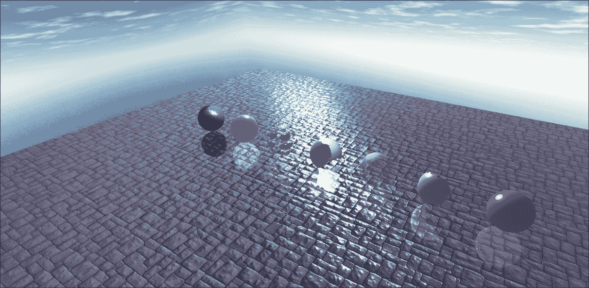

# 总结

在本章中，你了解了材质是什么，后台发生的理论，以及如何使用 Babylon.js 的标准材质。你看到在 Babylon.js 中使用材质也很简单。

示例文件倾向于重现本章中看到的概念：颜色、透明度、纹理、雾效、背面裁剪等。现在，你可以使用材质并自定义网格的外观。

作为具体例子，材质在所有 3D 场景中都被高度使用，并由 3D 艺术家配置：如果我们以 Michel Rousseau 制作的 Babylon.js 场景为例，他在其中使用了两个网格和两种不同的材质来重现以下图像：

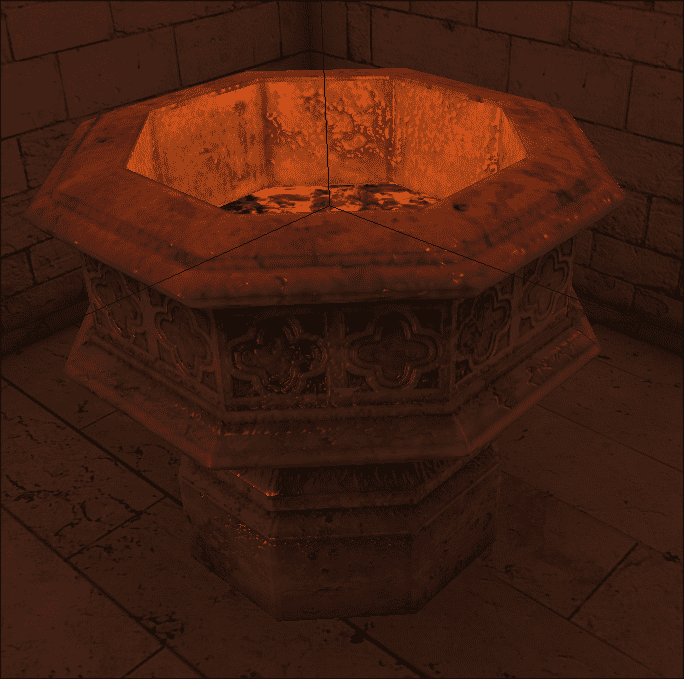

第一个网格是花瓶的主体，应用了标准材质，第二个网格代表余烬，应用了另一种标准材质。每个材质都配置了不同的漫反射纹理。如果我们设置主体为`isVisible = false`，我们可以看到余烬在现实中的样子，如下所示：

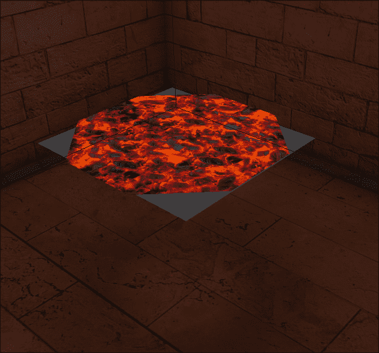

最后，在这个场景中渲染的所有网格都使用标准材质，配置了不同的值和纹理，最终看起来类似于以下图像：

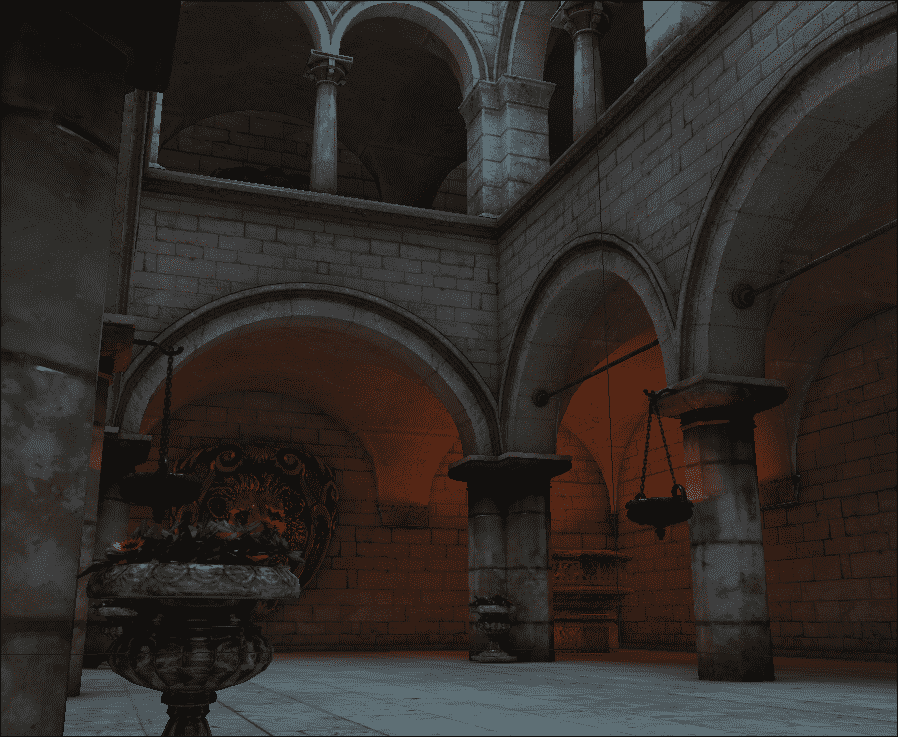

在下一章中，你将使用 FPS 相机和碰撞管理创建你的第一个场景。你将学习如何管理对象之间的碰撞以及如何使用 Babylon.js 管理物理。
