# 第一章：机器人的兴起——传达信息

现在，客户要求与品牌、公司和组织以他们与朋友交谈的方式轻松沟通，并期望立即得到回应。如果不使用某种形式的自动化，提供这种水平的服务对于大多数组织来说相当不切实际，甚至从物流上讲几乎不可能实现。

直到最近，自动技术的局限性意味着要牺牲那种已被证明能创造忠实客户的无缝、稳健的体验。运营呼叫中心是一项昂贵的任务，然而为了能够向客户提供那种即时通信渠道，大多数品牌和公司选择这样做，以便提供即时响应。

随着人工智能（AI）、自然语言处理（NLP）、机器学习（ML）和情感分析 API 和框架的出现，半自动化或全自动化代理，即机器人，正在彻底改变我们关于客户沟通的一切认识，引发了一场客户互动方式的革命。

随着越来越少的人用手机打电话，而是用手机做其他任何事情，除了说话，消息已经成为事实上的通信方式。

许多智能手机用户使用他们的设备打电话，但大多数人使用它们进行基于文本的通信（短信/SMS、消息或聊天）。平均成年人每周花费 23 小时发短信。此外，在一生中，平均千禧一代将花费惊人的 12 年时间发短信。

文本信息作为通信平台兴起的原因是电话通话具有干扰性、不便和不高效。它们不允许进行多任务处理——当你用智能手机打电话时，就不能做其他任何事情。在过去，我们只是拿起电话解决问题，而现在我们首先从基于文本的消息开始，然后升级到语音。

消息采用的一个重要且显著的原因是客户要求在他们在的地方进行互动。

消息和聊天相关的应用程序在短信之上迅速获得人气，尤其是在年轻人中。全球前 10 大应用程序中有 6 个是消息应用程序，如 Facebook Messenger、WhatsApp、Telegram 和微信。

这种消息应用使用量增加的主要原因是因为这些应用不计入每月的短信限额，而且如果你连接到 Wi-Fi，这些应用也不会消耗任何数据。更进一步的是，还有一个情感因素，它增强了整体对话。消息有一种实时对话的感觉。你知道你的朋友何时在应用中活跃，甚至当他们正在回复时，这使得它成为一种上瘾且高度吸引人的通信媒介。

在这种情况下，创建与客户进行有意义互动的消息机器人，可以为任何企业带来前沿优势，通过使用今天最常用的通信媒介，并且就在客户已经所在的地方——他们的消息应用中。

在这本书中，我们将探讨如何使用各种平台、API 和 SDK 编写机器人，以便以易于遵循的步骤解决当今一些最有趣的企业问题，同时实施起来也很有趣。具体来说，这一章将深入探讨：

+   为什么机器人很重要，以及为什么你应该上车

+   为什么短信仍然重要

+   Twilio 作为短信平台：

    +   为 Node.js 安装 Twilio

    +   设置 Twilio 账户

    +   简洁的 Twilio Node.js 模板

+   Azure 上的核心机器人功能

+   接收短信机器人逻辑

我们不再等待，让我们深入了解细节。享受乐趣！

# 为什么机器人很重要，以及为什么你应该上车

在广义的定义上，机器人是一种利用人工智能窄域来执行特定任务以替代人类的软件。机器人理解语言到一定程度，而不仅仅是命令。最终，它们可以从它们的互动中学习，变得更聪明、更好。

大约两年后，预计将有 36 亿人（是的，36 亿人）使用消息应用——这是总互联网用户的 90%，比传统平台如电子邮件能够服务的人数还要多。有关更多信息，请参阅以下链接：[`hbr.org/2016/09/messaging-apps-are-changing-how-companies-talk-with-customers`](https://hbr.org/2016/09/messaging-apps-are-changing-how-companies-talk-with-customers)。

在全球范围内，消费者现在要求将短信作为客户服务选项。仅仅有一个客户服务电话号码，让客户可以打电话给你是不够的，但几乎成为了一种必须，即客户应该能够通过某种实时消息平台联系到你。用户要求快速互动和快速回答。

最近的研究发现，短信和聊天是客户满意度最高的联系方式。请参阅 [`onereach.com/blog/45-texting-statistics-that-prove-businesses-need-to-start-taking-sms-seriously/`](https://onereach.com/blog/45-texting-statistics-that-prove-businesses-need-to-start-taking-sms-seriously/)。

根据最近的民意调查（[`customerthink.com/7-data-backed-reasons-why-you-should-let-customers-text-customer-service/`](http://customerthink.com/7-data-backed-reasons-why-you-should-let-customers-text-customer-service/)），几乎三分之二的患者可能对提供消息或聊天作为服务渠道的组织持积极看法。然而，到 2016 年底，大约 40%的客户服务中心仍将错失给客户留下深刻印象的机会。这不仅意味着未能给客户留下深刻印象，还意味着失去了商业机会。客户更有可能对那些能够以更快、更智能的方式与他们互动和参与的组织保持忠诚。请参阅[`blog.kissmetrics.com/live-chat/`](https://blog.kissmetrics.com/live-chat/)。

假设您的组织（企业）有一个消息应用，允许您的客户与您互动。尽管您的应用可能是一个出色的通信网关，但这个通信渠道仍然不能丢失。比如说，一个用户忘记开启通知或意外删除了应用。突然之间，无缝和轻松沟通的能力就消失了。

然而，使用个人消息应用（如 Skype、Facebook Messenger、WhatsApp 等）消除了大多数障碍，使公司能够成为用户已经熟悉和喜爱的通信框架的一部分。

在消息应用中，没有表格，没有下载，没有新的平台。客户可以使用他们已经熟悉的界面立即与您的组织互动。用户可以使用自然语言购买票务、下载登机牌或提出问题。此外，鉴于用户不太可能停止使用消息应用，您的组织可以通过用户已经熟悉和喜爱的消息应用跟进更新、调查和其他通知。

为了更好地理解这一点，假设消费者提出一个问题，机器人应该能够：

+   使用自然语言处理来理解问题的意图

+   从公司的网站、常见问题解答（FAQs）或知识库中收集相关细节，或者甚至是从受信任的外部网站

+   从这些信息中筛选出最可能符合客户提问意图的答案

+   以类似于人类的方式回应客户

肯定会有一些情况，机器人可能会遇到需要人类细微差别和逻辑分析能力的情况。当这种情况发生时，它们可以将问题升级给客服代表，并将它们在互动过程中收集到的上下文传递过去，以确保客户体验的连贯性。原则上，这应该对最终用户是完全透明的。

随着技术的不断进步，Gartner 预测，到 2018 年，机器人应该能够非常顺畅地通过面部和声音识别客户。

机器人也可能能够：

+   允许客户在消息应用内完成购买

+   提供个性化的产品建议

+   将用户链接到相关的网页，如客户产品评论

+   启动新的互动以重新吸引用户

+   通过购物车提醒和客户案例进行跟进

+   总体而言，通过提供强大的数据和可操作见解，帮助您的组织创造卓越的客户体验

# 为什么短信仍然很重要

智能手机在当今世界变得越来越重要。可以说，它们几乎是你自己的延伸。如果你今天失去了手机，那你就麻烦了。从电子邮件、日历、消息、银行到甚至钱包，所有这些都与你的手机有关联。

在今天这个充满活力、动态且始终连接的社会中，通过手机随时随地获取大量信息可能是一种祝福，但也可能成为一种诅咒。

现在的忙碌专业人士每天或每周必须处理数百封电子邮件，以及来自 Twitter 和 LinkedIn 等社交网络的许多消息和通知。跟上如此大量的消息可能会让人感到压倒。

但如果手机能够通过通知我们重要事项或允许我们根据短信或语音命令执行自定义操作来帮助我们减轻信息过载，那会怎么样呢？想象一下，如果我们能够通过消息或语音自动化某些流程，那岂不是太棒了？

在社交网络兴起之前，**短消息服务**（SMS）是人们在之间交换短消息最常见的方式。

根据维基百科，尽管短信仍然强大且在增长，但智能手机上的社交网络消息服务，如 Facebook Messenger、WhatsApp、Skype 和 Viber，越来越多地被用来交换短消息。

一般而言，短信和语音启用解决方案是平台特定的，无法定制；然而，有一个从底层设计时就考虑到开发者的平台，它允许任何具有开发技能的人创建自定义的消息和语音启用解决方案。欢迎来到 Twilio！请参阅 [`www.twilio.com/`](https://www.twilio.com/) 。

# Twilio 作为一个短信平台

Twilio 为每个应用程序提供消息、语音、视频和身份验证 API。它拥有许多不同编程语言的辅助库或 SDK，帮助开发者创建可以利用语音和消息功能的应用程序。

尽管如此，短信仍然非常强大且在企业发展中广泛使用，用于市场营销、**客户关系管理**（CRM）自动化、实时警报通知和用户身份验证的两步验证。

考虑到这项技术被认为是成熟的、广泛传播的、经过验证的且可靠的，短信在商业世界中的使用具有极其重要的意义。

Twilio 的服务通过 HTTP(S) 通过 RESTful API 或辅助库进行访问。其服务根据使用情况进行计费。该平台基于 **Amazon Web Services**（**AWS**）来托管其电话基础设施，并通过其 API 在 HTTP 和 **公共交换电话网络**（**PSTN**）之间提供连接性。

Twilio 最近扩展了其 API 对 Facebook Messenger 的支持，这与社交网络公司在其 Messenger 平台上推出对机器人支持的时间相吻合。

在本章中，我们将探讨如何使用 Node.js 辅助库与 Twilio 的 REST API 交互，以构建一个 SMS 消息机器人。

## 安装 Node.js 的 Twilio

Twilio 提供了一个 REST API，允许开发者与其平台服务（如短信）进行交互。尽管 REST API 是与 Twilio 服务交互的好方法，但今天最常用的编程语言（如：PHP、ASP.NET（C#）、Ruby、Python、Java、Salesforce（Apex）以及最后但同样重要的是，Node.js）都有官方的辅助库。

Twilio Node.js 辅助库可以从 [`www.twilio.com/docs/libraries/node`](https://www.twilio.com/docs/libraries/node) 获取。为了开始，让我们安装 Node.js。

打开您的浏览器并导航到 [`nodejs.org`](https://nodejs.org)，您可以在主页上下载与您的平台相对应的 Node.js 版本。

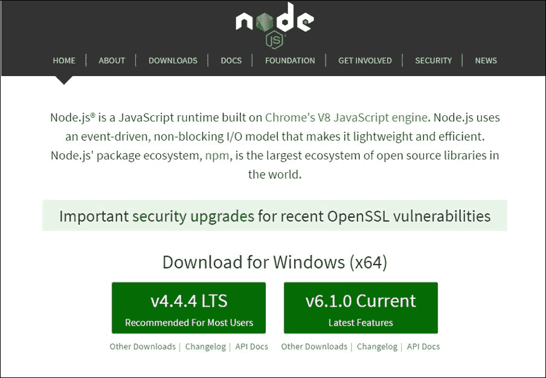

下面的步骤将基于在 Windows 64 位操作系统上安装 Node.js。

选择版本后，只需运行安装程序并按照安装步骤进行。您首先会看到一个欢迎屏幕，然后可以点击 **下一步** 按钮。

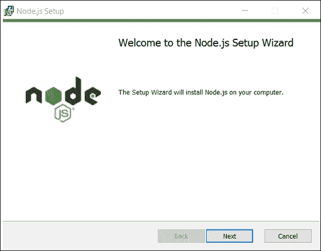

您将被要求接受许可条款，然后再次点击 **下一步** 按钮。


在此之后，安装程序将显示默认的安装路径，您可以选择更改或不更改。

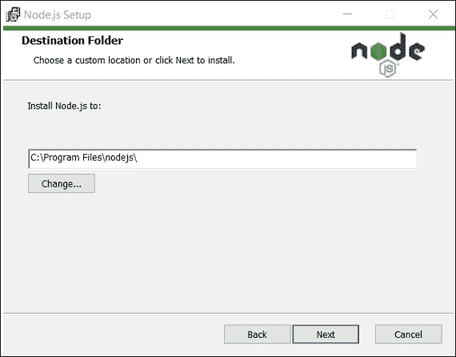

一旦定义了安装路径，只需点击 **下一步** 按钮。下一步是选择要安装的功能。

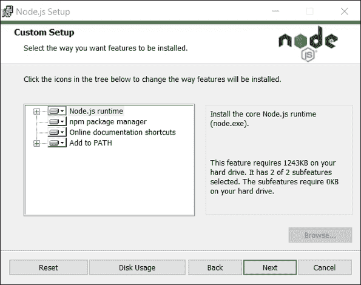

强烈建议选择所有功能以便安装所有内容。稍后您将需要 npm 软件包管理器来安装 Twilio Node.js 辅助库。

最后，点击 **下一步** 按钮，然后点击 **安装** 按钮，以完成安装过程。

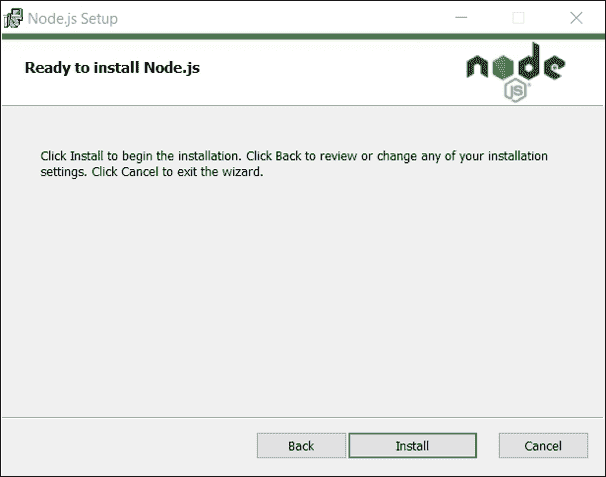

如果您的系统上安装了 Node.js 的先前版本，安装程序将删除旧文件，然后使用最新文件更新系统。

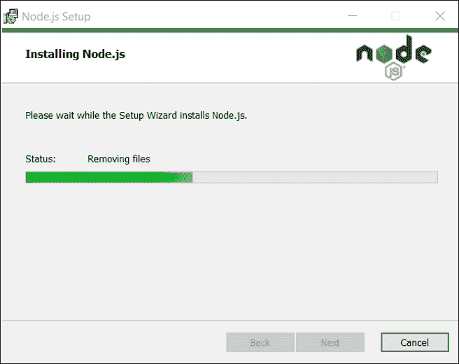

请注意，在其他平台（[`nodejs.org/en/download/package-manager/`](https://nodejs.org/en/download/package-manager/)）上，安装过程和屏幕可能有所不同（例如在 Mac 上）；然而，通过遵循安装步骤，它应该相当简单，易于遵循。

在安装 Node.js 之后，接下来要做的事情是安装 Twilio Node.js 辅助库。

为了做到这一点，在你的 PC 上的任何位置创建一个用于此项目的文件夹，浏览到该文件夹，然后在命令提示符或 shell 中输入以下命令：

```js
npm init

```

只需按照要求的步骤操作。这将创建我们项目所需的`package.json`文件（你可以参考[`docs.npmjs.com/files/package.json`](https://docs.npmjs.com/files/package.json)）。

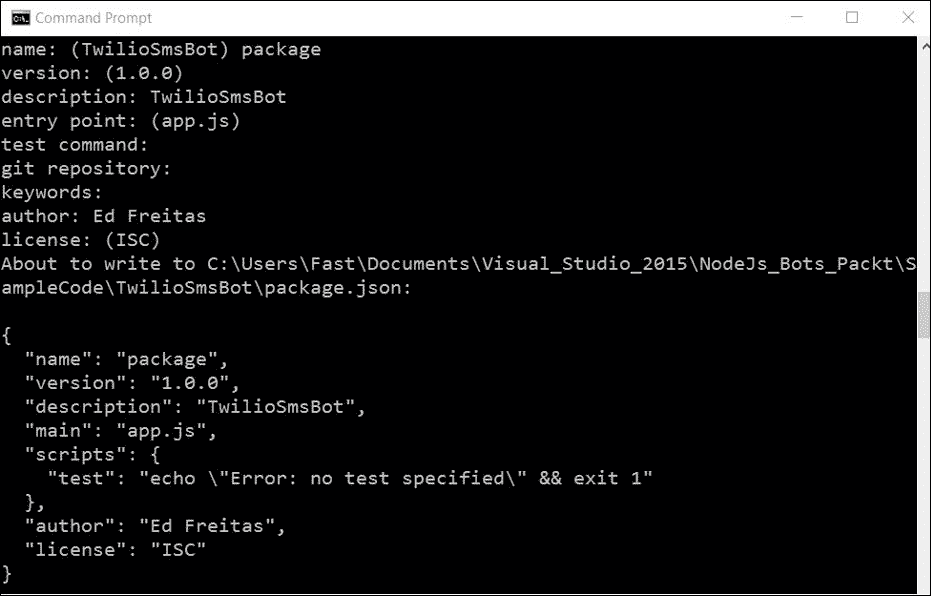

一旦创建了`package.json`文件，输入以下命令：

```js
npm install twilio --save

```

这将安装 Twilio Node.js 辅助库及其所有依赖项，并在我们的`package.json`文件上保存引用。Twilio 库将安装在你`package.json`文件所在的文件夹中的`node_modules`文件夹下。在这本书中，我们将使用出色的 Atom 编辑器（[`atom.io/`](https://atom.io/)）。你也可以使用你选择的任何其他编辑器，例如 Sublime 或 Visual Studio Code。

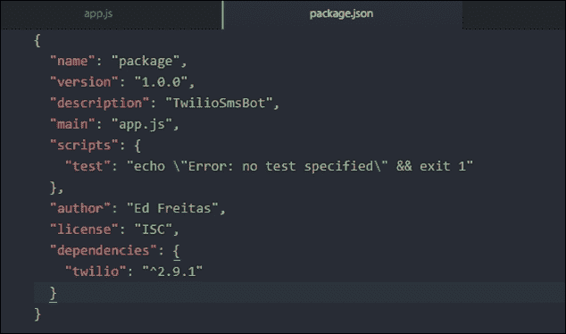

在此设置完成后，我们可以从技术上开始编写代码。然而，在我们发送第一条短信之前，我们首先需要注册一个 Twilio 账户，并使用 Twilio 设置好一切。让我们来看看如何完成这项工作。

## 设置 Twilio 账户

为了能够使用 Twilio API 和 Node.js 辅助库发送短信，我们需要设置一个 Twilio 账户，并购买一个可丢弃的 Twilio 号码。

Twilio 是一种按使用付费的服务，这意味着你需要设置一个账户并提供你的信用卡详细信息，以便有足够的信用额度，这些信用额度将用于支付你发送的每条短信。

你还需要购买一个 Twilio 号码，这是一个普通但可丢弃的电话号码，将用于发送你的消息。

Twilio 号码在许多国家都有可用。它们看起来像任何其他你可以想到的有效电话号码。它们是真实的电话号码，当你不再需要它们时可以丢弃。

为了设置 Twilio 账户，从你的浏览器访问以下网站 [`www.twilio.com/`](https://www.twilio.com/)。然后，点击**注册**按钮。

注册过程相当简单，非常容易遵循和完成。只需填写一些必填字段，然后你就完成了。

一旦你的 Twilio 账户有资金，你需要购买一个可丢弃的电话号码。

你需要前往这个位置，[`www.twilio.com/user/billing`](https://www.twilio.com/user/billing)，以便给你的账户充值。为了做到这一点，请点击红色的**广告资金**链接。确保在访问此 URL 之前你已经登录了 Twilio。

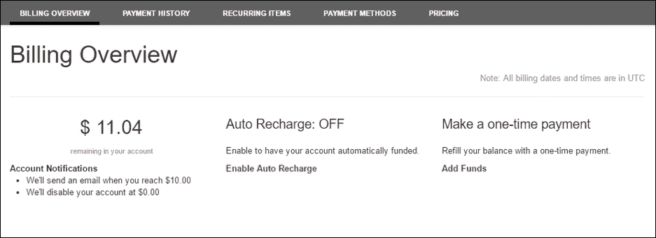

在你的账户中有资金的情况下，让我们设置一个 Twilio 号码。这将是一个真实的电话号码，你可以随时删除。你可以选择你的号码属于哪个国家和城市。

然后点击**购买号码**按钮。

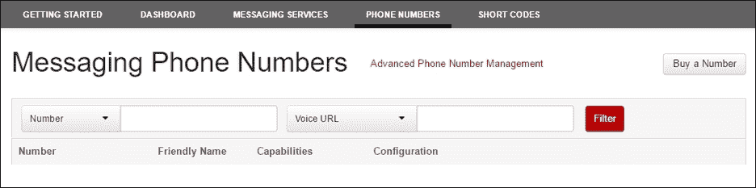

一旦你点击了**购买号码**按钮，将显示以下弹出屏幕：

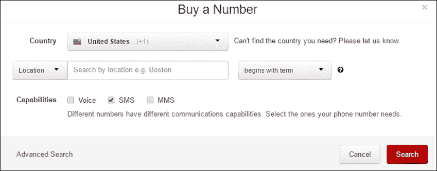

在这个屏幕上，你可以选择你想要获取号码的国家和地理位置。

这个号码可以用于**语音**、**短信**，甚至**彩信**。目前，我们只是想确保**短信**选项被勾选。

一次你购买了 Twilio 号码，你将看到以下屏幕：

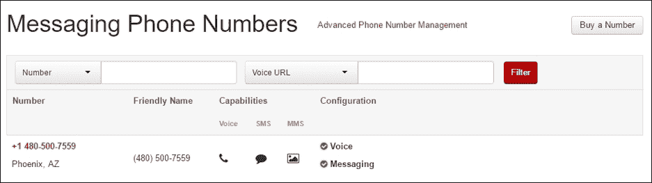

在此设置就绪后，我们就可以开始编写我们的 Node.js 代码了。

## 简洁的 Twilio Node.js 模板

为了开始编写我们的代码，让我们在`package.json`文件相同的目录下创建一个名为`app.js`的新文件。你可以直接从你使用的编辑器中创建这个新文件。

文件创建完成后，我们需要包含一个引用我们通过 npm 安装的 Twilio Node.js 库：

```js
var twilio = require("twilio"); 

```

在 Node.js 的世界里，这相当于 Java 中的导入或 C#中的使用语句。现在让我们看看我们如何实际使用 Twilio Node.js 辅助库发送短信：

```js
var accountSid = '<< your twilio account sid >>';  
// Your Account SID from www.twilio.com/console 

var authToken = '<< your twilio auth token >>';    
// Your Auth Token from www.twilio.com/console 

```

我们需要两个变量来存储我们的 Twilio **Account SID**和**Auth token**。这两个值可以在你登录 Twilio 账户并浏览到开发者控制台时获取：[`www.twilio.com/console`](https://www.twilio.com/console)。

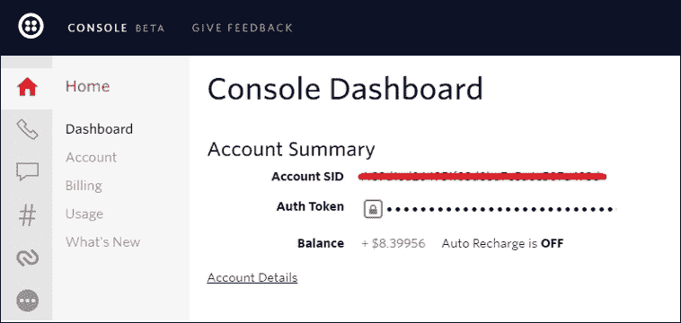

一旦我们为`accountSid`和`authToken`变量提供了正确的值，我们就需要创建`twilio.RestClient`类的实例，以便能够发送短信：

```js
var client = new twilio.RestClient(accountSid, authToken); 

```

实例创建后，我们可以继续使用 Twilio 发送我们的短信：

```js
client.messages.create({ 
    body: 'Greetings earthling, this is the TwilioSmsBot ;)', 
    to: '+12345678901',  // Number that receives the SMS 
    from: '+12345678901' // Purchased Twilio number that send the SMS 
}, 
function(err, message) { 
    console.log(message.sid); 
}); 

```

基本上，短信是通过调用 Twilio `client`实例中的`messages.create`方法来发送的。

此方法期望一个对象，该对象描述了短信的属性，例如`body`（正文）、`to`（接收者号码）、`from`（发送者号码）、回调函数描述错误`err`（如果实际发生错误），以及已发布的`message`的内容。

使用 Twilio 发送短信所需的所有内容都在这里。现在让我们看看所有的代码：

```js
var twilio = require("node_modules/twilio/lib"); 

var accountSid = '<< your twilio account sid >>';  
var authToken = '<< your twilio auth token >>';    

var client = new twilio.RestClient(accountSid, authToken); 

client.messages.create({ 
    body: 'Hello from Node', 
    to: '+12345678901',       
    from: '+12345678901' 
}, 
function(err, message) { 
    console.log(message.sid); 
}); 

```

为了执行此代码，请在命令提示符中执行以下命令：

```js
node app.js

```

这将发送短信到指定的号码。我们可以通过查看命令提示符来查看发送的短信的 `message.sid`（这是 Twilio 服务返回的响应）。

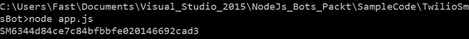

请注意，如果要将短信发送到的目标号码是国际（非美国）号码，您需要启用某些权限以允许 Twilio 执行该操作。

这些权限可以在以下 URL 检查和配置：[`www.twilio.com/console/voice/settings/geo-permissions`](https://www.twilio.com/console/voice/settings/geo-permissions)。

# Azure 上的核心机器人功能

现在我们已经实现了 Twilio Node.js 模板，并且它能够发送短信，让我们看看如何扩展我们的代码以实现更多功能。

我们需要能够以某种方式连接并监听接收到的短信，并有一些非常基本的 **自然语言处理 (NLP**)，以便根据接收到的输入发送答案。

监听接收到的短信需要在我们的 Node.js 应用中设置一个 URL，该 URL 可以在您的 Twilio 账户中配置为请求 URL。这个请求 URL 将由 Twilio 使用，将接收到的短信推送到您购买的 Twilio 号码，到我们的 Node.js 机器人应用。

要使我们的机器人公开可用，我们将在 Azure 网站上发布它。让我们为我们的 Node.js 应用创建一个 REST 端点，我们将使用它来监听新消息。我们将使用 Express 框架 ([`expressjs.com/`](http://expressjs.com/)) 来完成这项工作。

Express 是一个最小化和灵活的 Node.js 网络应用程序框架，为网络和移动应用程序提供了一组强大的功能。它提供了一个薄层的基本网络应用程序功能，如路由和中间件。

首先，我们从命令行提示符运行以下命令来安装 Express 框架：

```js
npm install express --save

```

安装一个实用的工具是 Nodemon ([`nodemon.io/`](http://nodemon.io/))。这允许您更改代码，并且它将自动重新启动 Node.js 应用。您可以通过在提示符中运行以下命令来安装 Nodemon：

```js
npm install nodemon --save

```

您现在可以按照以下方式运行应用程序，而不是使用 node 运行应用程序：

```js
nodemon app.js

```

在安装了 Express 框架之后，让我们扩展我们当前的代码以创建一个 REST 端点，然后我们可以将其用于将 Twilio 连接到推送接收到的消息：

```js
var express = require('express'); 

var app = express(); 

app.get('/receive', function (req, res) { 
  res.send('Hi, this is the TwilioBot listening endpoint!'); 
}); 

app.listen(8080, function () { 
  console.log('TwilioBot listening on port 8080.'); 
}); 

```

在我们将机器人应用连接到 Twilio 以处理接收到的消息之前，让我们首先设置所有工具，这样我们就可以将我们的应用程序以当前状态发布到 Azure 网站。

我们需要安装 Azure **命令行界面 (CLI**) ([`azure.microsoft.com/en-us/documentation/articles/xplat-cli-install/`](https://azure.microsoft.com/en-us/documentation/articles/xplat-cli-install/)) 以将我们的应用程序推送到 Azure。如果我们没有账户，我们还需要注册 Azure。

您可以通过访问：[`azure.microsoft.com`](https://azure.microsoft.com) 来做到这一点。

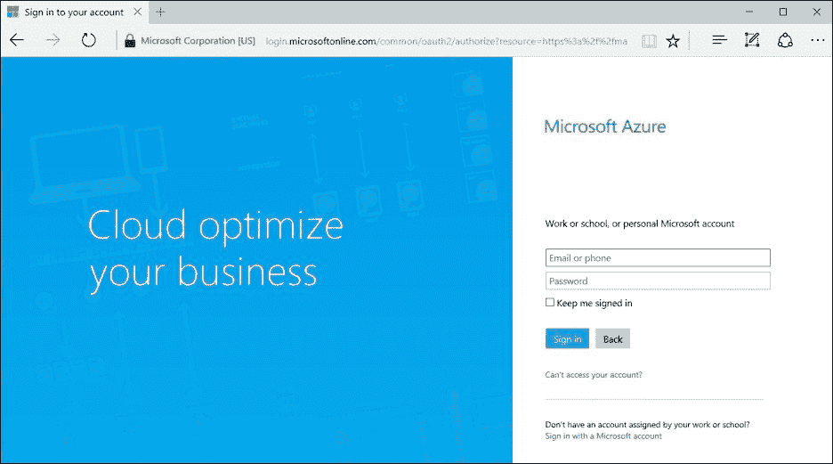

一旦你在 Azure 上设置了账户，你可以使用相应平台的安装程序或按照以下说明将 Azure CLI 作为 npm 包安装。

使用 npm，可以按照以下方式安装 Azure CLI：

```js
npm install azure-cli -g

```

一旦你安装了 Azure CLI，让我们将应用直接部署到 Azure，以确保所有我们的工具都已正确连接。

为了做到这一点，运行 Azure CLI 并`login`到 Azure：

```js
azure login

```

一旦执行了命令，你将看到以下欢迎信息，其中会要求你启用数据收集：

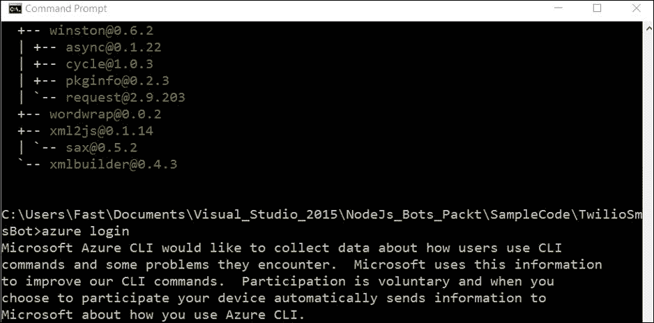

你可以选择是否启用，选择权在你，这根本不影响你的机器人应用开发或 Azure 的使用。

一旦你选择了你的选项，你将被提示在以下 URL 上输入命令行上显示的代码，[`aka.ms/devicelogin`](http://aka.ms/devicelogin)，然后使用你的 Microsoft 账户进行身份验证，如下所示：

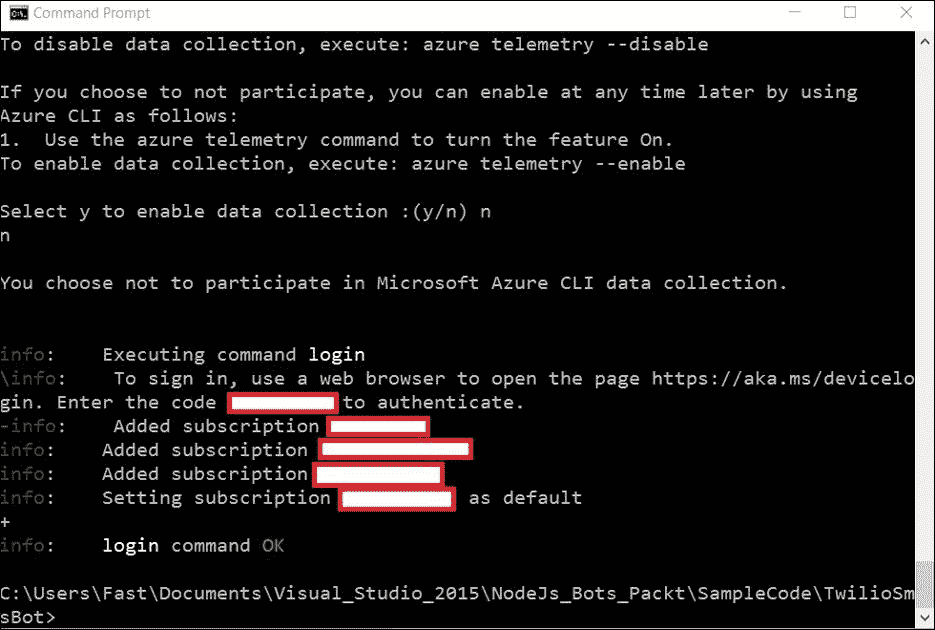

在前面的屏幕截图中，我已经将与我 Azure 账户相对应的 Azure 订阅密钥和信息抹去。

这样一来，你的 Azure CLI 就设置好了。接下来要做的事情是使用 CLI 将应用部署到 Azure。让我们看看如何做到这一点。

运行此命令以在 Azure 上创建网站。确保你仍然位于你的应用根目录中。使用以下命令在 Azure 中创建具有唯一应用名称的 App Service 应用资源。你的 Web 应用 URL 将是`http://<appname>.azurewebsites.net`。

在这种情况下，我们将我们的 Azure App Service 应用命名为`NodeBotSite`（如果你选择的名称已被占用，你可以自由选择其他名称）。让我们输入以下命令：

```js
azure site create --git nodebotsite

```

你将被提示选择你的网站将要托管在其上的 Azure 区域。请随意选择离你最近的一个。

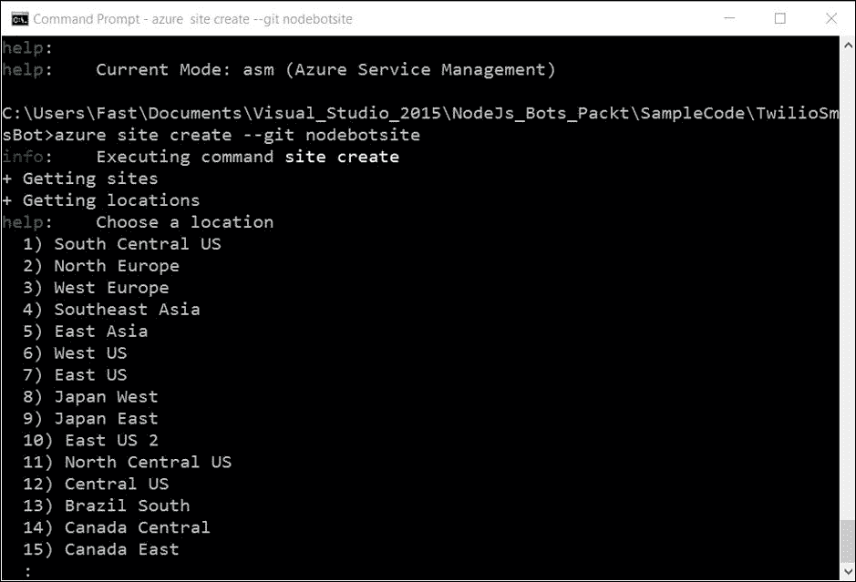

一旦你选择了区域，Azure 将创建你的网站，你将通过命令行看到以下详细信息：

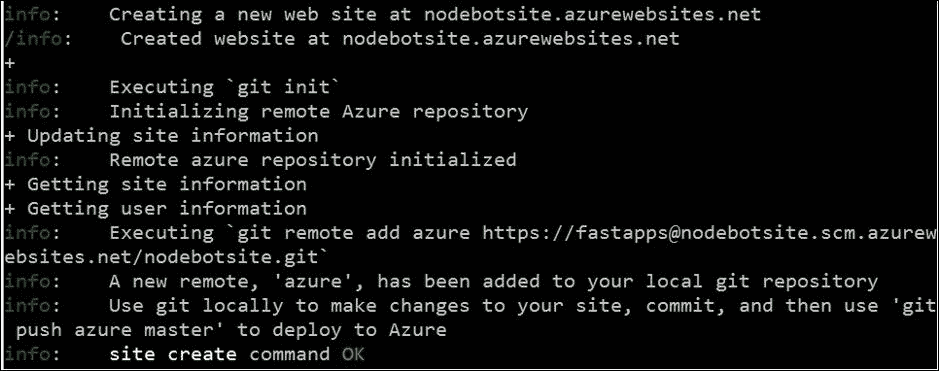

将应用内的端口从`8080`更改为`process.env.port`，如下所示：

```js
app.listen(process.env.port, function () { 
  console.log('Hi, this is the TwilioBot listening endpoint!'); 
}); 

```

### 注意

Nodemon 似乎与 Azure 不太兼容；因此，如果你将 Nodemon 作为`package.json`文件中的依赖项，在将应用部署到 Azure 时可能会遇到问题。鉴于这一点，在部署到 Azure 之前，请从你的`package.json`文件中删除引用 Nodemon 的依赖项。

在你的`package.json`和`app.js`文件上保存你的更改，然后使用 git 命令将你的应用到 Azure 部署，如下所示：

```js
git add .
git commit -m "TwilioNodeBot first commit"
git push azure master

```

在你输入这些命令后，如果你从未为你的 Azure 订阅设置过 git/FTP 部署凭据，你将被提示创建它们。你也可以在 Azure 门户中输入这些凭据。

一旦 git push 命令完成，你的应用将在 Azure 上发布，并且已经准备好使用。

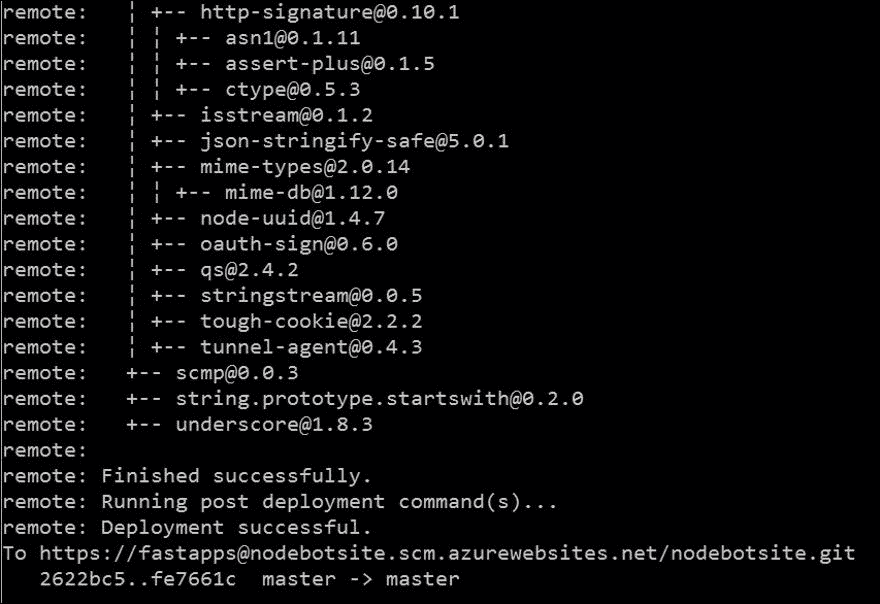

为了查看它，打开您的浏览器并导航到该网站，接收此 URL：[`nodebotsite.azurewebsites.net/receive`](http://nodebotsite.azurewebsites.net/receive)。您应该看到以下内容：


要更新您在 Azure 上运行的 Node.js Web 应用，只需运行`git add`、`git commit`和`git push`，就像您第一次部署它时做的那样。

在 Azure 配置完成后，下一步是配置此 URL：[`www.twilio.com/console/phone-numbers/incoming`](https://www.twilio.com/console/phone-numbers/incoming)，在你的 Twilio 账户中语音号码的仪表板上，然后点击你购买的 Twilio 号码。编辑你的 Twilio 号码的**消息** | **请求 URL**，然后点击**保存**按钮。

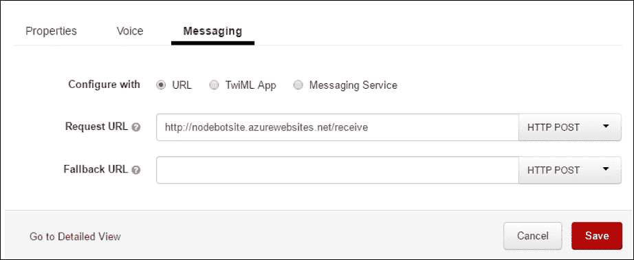

现在您的 Twilio 已与您的 Azure 应用绑定，接收 URL，它将用于接收 incoming 短信。

在所有这些设置步骤就绪后，我们现在可以专注于为我们的 Twilio 机器人应用添加接收逻辑。

# 接收短信机器人逻辑

到目前为止，我们已经实现了我们的 Twilio 机器人应用的基本裸骨模板，并在 Twilio 和 Azure 之间配置了所有必要的设置，以便我们的解决方案易于部署。

现在我们来探讨如何让我们的机器人回复 incoming 消息。为了做到这一点，我们需要在我们的 Node/Express 应用上有一个 POST 端点。让我们检查以下代码：

```js
app.post('/receive', function (req, res) { 
  var twiml = new twilio.TwimlResponse(); 
  twiml.message('Hi, this is TwilioBot'); 

  res.writeHead(200, {'Content-Type': 'text/xml'}); 
  res.end(twiml.toString()); 
}); 

```

我们可以看到，为了回复，我们创建了一个**TwiML**响应，并将其作为 POST / 接收 HTTP 端点的响应发送。

TwiML 是一种 XML 标记语言，它是一组你可以用来告诉 Twilio 在接收到来电或短信时该做什么的指令。

Twilio 就像一个普通的网络浏览器一样向您的应用程序发送 HTTP 请求。通过在其请求中包含参数和值，Twilio 将数据发送到您的应用程序，您可以在响应之前采取行动。这正是我们在接收端点实际所做的。

Twilio 会根据你配置的 HTTP 方法，以 POST 参数或 URL 查询参数的形式发送以下参数。

当我们在 Twilio 号码上收到短信或电话时，Twilio 将获取与该电话号码关联的 URL，并向该 URL 执行 HTTP 请求。此 URL 将包含一个带有标记指令的 XML 响应，指示 Twilio 需要执行的任务。这些任务中的一些可以是记录通话、播放消息、提示呼叫者输入一些数字等等。

在这种情况下，我们的机器人所做的只是返回一个单行句子。简而言之，前面的示例代码只是将这个 XML 返回给 Twilio 作为响应，这样 Twilio 就可以从中生成一个短信响应，并将其发送回发送者的手机：

```js
<?xml version="1.0" encoding="UTF-8"?> 
<Response> 
<Say> Hi, this is TwilioBot.</Say> 
</Response> 

```

如您所见，告诉 Twilio 执行特定操作非常简单，使用 TwiML。标记语言由蓝色突出显示的动词组成，这些动词代表 Twilio 将执行的操作。

在编写时可用的一些 TwiML 动词包括：Say、Play、Dial、Record、Gather、Sms、Hangup、Queue、Redirect、Pause、Conference、Reject 和 Message。

如何使用这些 TwiML 动词的完整细节可以在以下位置找到：[`www.twilio.com/docs/api/twiml`](https://www.twilio.com/docs/api/twiml)。

通过代码，我们已经使用 Twilio Node.js 辅助库生成 TwiML 作为响应，而没有明确创建 XML 响应本身。

因此，我们的机器人开始最终成形。它可以监听消息并发送响应。但是，机器人如何知道如何对某些输入采取行动？为了实现这一点，机器人需要能够理解传入消息的参数，并能够对其采取行动。

Twilio 会根据你在 Twilio 号码仪表板上为传入的 SMS 配置的 HTTP 方法，以 POST 参数或 URL 查询参数的形式发送多个参数。请花点时间仔细阅读并理解此列表。

这里有一些 Twilio 在编写时使用的突出属性：

+   **From**：发送此消息的电话号码。

+   **To**：收件人的电话号码。

+   **Body**：消息的文本正文。它可以长达 1,600 个字符。

+   **MessageSid**：消息的 34 个字符唯一标识符。它可以用于稍后从 REST API 检索此消息。

+   **SmsSid**：与 MessageSid 相同的值。它已弃用，但包含以保持向后兼容性。

参数的完整列表可以在以下位置找到：[`www.twilio.com/docs/api/twiml/sms/twilio_request`](https://www.twilio.com/docs/api/twiml/sms/twilio_request)。

因此，为了编写一些基于接收到的消息性质的输入执行的逻辑，有必要检查作为`request.body`对象一部分接收到的参数的值。这些参数将具有此对象上的属性。

例如，如果我们想知道消息是从哪个号码发送的，我们可能需要做如下操作：

```js
var from = req.body.From; 

```

实际接收到的文本消息本身可以通过以下方式获得：

```js
var body = req.body.Body; 

```

了解消息的来源和实际内容后，我们可以构建一些逻辑，使机器人对收到的输入有某种感觉，并对其采取行动。

因此，让我们添加一些核心功能，目前我们将其称为`BotBrain`，我们实际上并不知道它将做什么。这将根据我们提供给它的输入给出答案，而不论我们将构建哪个机器人。

在下一章中，我们将创建`BotBrain`的逻辑，并在整个章节中继续添加后续和附加功能，但就目前而言，让我们假设这个`BotBrain`根据接收到的输入提供所需的答案：

```js
app.post('/receive', function (req, res) { 
  var twiml = new twilio.TwimlResponse(); 
  var feedback = BotBrains(req.body); 
  twiml.message(feedback); 

  res.writeHead(200, {'Content-Type': 'text/xml'}); 
  res.end(twiml.toString()); 
}); 

```

如我们所见，机器人将根据`BotBrains`确定的结果，通过分析`request.body`对象的属性来响应传入的请求。

# 摘要

在本章中，我们为我们的机器人部署、配置和设置奠定了基础。我们还创建了一个基本的模板，我们将在此书的其余章节中使用它，以便添加更多令人兴奋的功能。

我们还探索了一些关键组件，这些组件将使其从基础设施的角度工作，以及我们如何在微软的出色云平台 Azure 上托管它。

此外，我们解释了为什么机器人很重要，以及为什么它们是您业务需要了解和考虑的关键组成部分。

此外，我们已经探讨了 Twilio 作为消息平台的基础知识，并开始探索使用它所能实现的可能性。

在接下来的章节中，我们将添加更多层次，并与其他 API 和服务进行交互；然而，我们仍然会使用 Twilio 作为备用消息提供商，同时使用短信。

希望你已经对即将发生的事情有了想法，并且这也让你对我们的机器人添加更多层次和逻辑的探索感到兴奋。

感谢阅读！
