# 第三章：Twitter 作为航班信息代理

**Twitter**是一个在线社交网络服务，允许用户发送和阅读称为*tweets*的短 140 字符消息，并已成为人们在全球范围内交换新闻和信息最显著的方式之一。

自从 Twitter 创建以来，其受欢迎程度已经爆炸式增长，现在它被用于各种事情，如客户服务、营销、新闻报道等。它是现存最受欢迎的网站之一，被认为是互联网的*短信网关*。

Twitter 的主要用途之一是公司向其关注者传达信息。例如，航空公司通常会发布与公司相关的事件，以及可能影响乘客或其计划的事件。

在本章中，我们将专注于创建一个能够为乘客提供航班信息的 Twitter 机器人，它将充当自动化的航班信息代理。

这些示例应该非常有趣，同时也容易跟随，所以我们不再等待，开始吧！

# Twitter 机器人的工作原理

就像任何其他机器人一样，Twitter 机器人在本质上只是另一个 Twitter 用户账户——区别在于，它不是由另一个人操作，而是由一个知道如何回复您提供的输入的自动化过程控制。这是因为 Twitter 提供了一个 API，允许您通过代码以编程方式与服务进行交互。

从本质上讲，任何可以转化为服务的东西都可以通过使用机器人转化为自动对话，Twitter 也不例外。机器人几乎可以在任何平台上进行交互式对话，在任何时间，从任何地方。

Twitter 机器人通常是一个您编写的应用程序，它会监听 Twitter 上发生的事情，然后做出响应。在我们的案例中，我们将监听有人使用特定标签发推文，然后当这种情况发生时发推文。这个标签将是航班号，机器人将能够根据它提供一些反馈。

因此，让我们脚踏实地，开始构建我们的 Twitter 机器人。

# 创建 Twitter 应用程序

创建 Twitter 机器人的首要步骤是实际上创建一个 Twitter 应用程序。机器人只是一个我们将使用的名称，但实际上它是一个后台的 Twitter 应用程序，能够与 Twitter API 进行交互。

为了能够与 Twitter API 进行交互，必须拥有一个注册的 Twitter 账户。如果您还没有账户，请访问 Twitter 网页并注册。如果您已经有了账户，请登录。

登录后，导航到[`apps.twitter.com/`](https://apps.twitter.com/)。这是我们注册 Twitter 应用程序的地方。您将看到 Twitter**应用程序管理**欢迎页面，上面有一个创建新应用程序的按钮。

要创建 Twitter 机器人，请点击**创建新应用**按钮。参考以下截图：

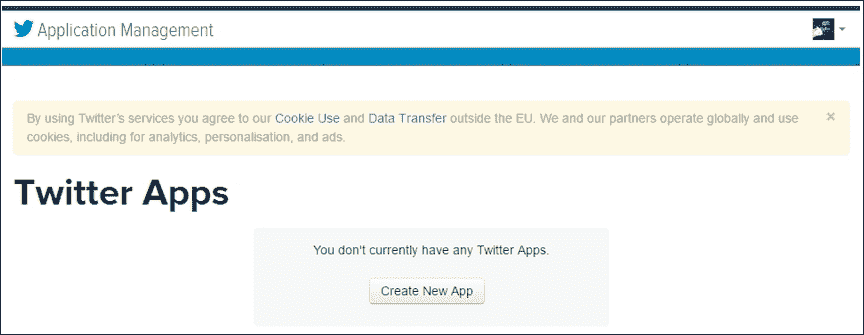

完成上述操作后，以下屏幕将出现：

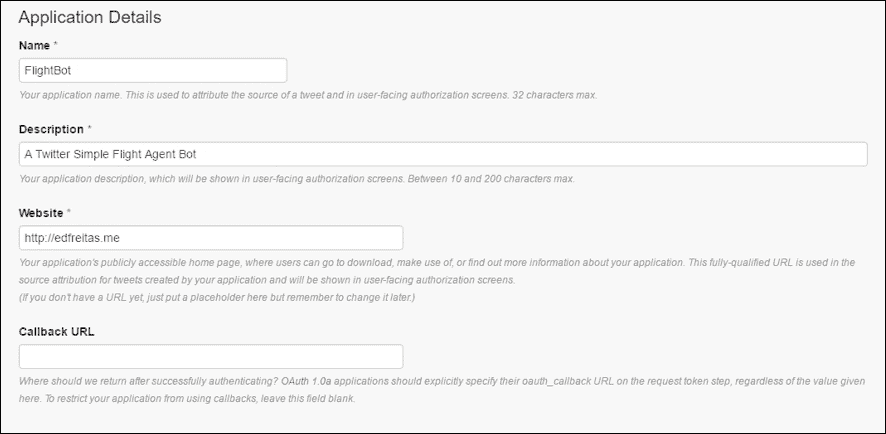

填写所需信息。为应用程序起一个独特的名字和描述。你还需要输入一个将用作机器人公开可访问主页的网站。一旦输入了这些数据，向下滚动并接受 Twitter **开发者协议**：


读取开发者协议后，你可以点击**创建你的 Twitter 应用**以继续。这将允许 Twitter 创建你的应用程序，一旦创建过程完成，你将看到以下屏幕：

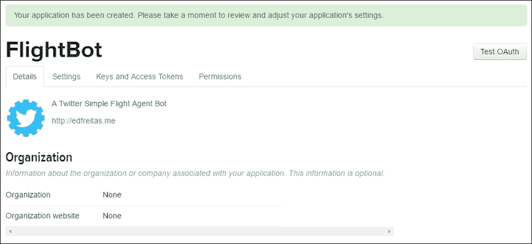

如果你向下滚动一点，还有提供了一些应用程序设置，一旦我们开始编码就需要使用。Twitter 应用创建后，让我们专注于编写一些代码。到目前为止，我们一直在使用 Atom 编辑器；然而，你可以自由使用任何你可能更熟悉的编辑器。

打开编辑器，在你的驱动器上的任何位置创建一个名为 `FlightBot` 的文件夹内的新 `app.js` 文件。现在，只需添加以下指令：

```js
console.log('Hi, this is FlightBot');

```

假设我们已经安装了 Node.js 和 npm（如果没有，请参阅第一章[第 1. 机器人的崛起 – 传递信息]中的步骤），让我们安装一些必要的依赖项。

现在，让我们复制上一章中使用的 `package.json` 并将其放置在 `FlightBot` 文件夹中。然后让我们按以下方式修改它：

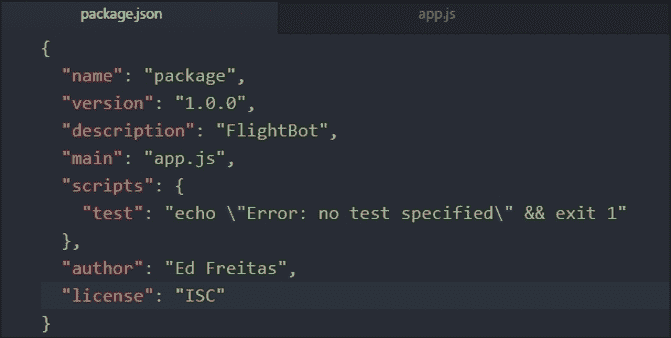

现在让我们安装必要的依赖项，以便我们可以在 `app.js` 文件中开始编码：

```js
npm install twitter --save

```

这将安装 Twitter Node.js SDK，我们将使用它来编写我们的应用程序。这将安装在与以下截图所示的 `FlightBot` 文件夹中：

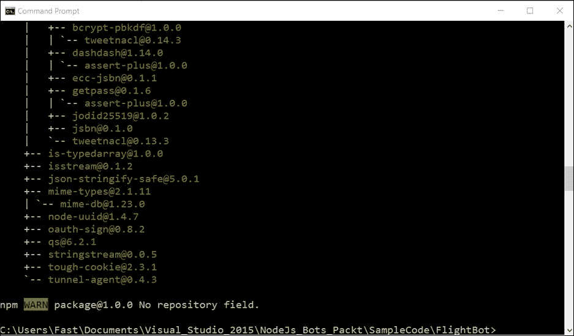

你将在你的项目文件夹中看到更新的 `package.json` 文件：

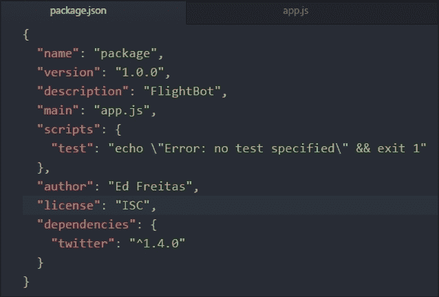

我们现在准备好在我们的 `app.js` 文件中添加一些代码：

```js
var TwitterPackage = require('twitter'); 

```

我们在这里所做的是加载并导入 Twitter 包。首先，让我们从 Twitter **应用管理**屏幕获取这些消费者密钥和令牌：

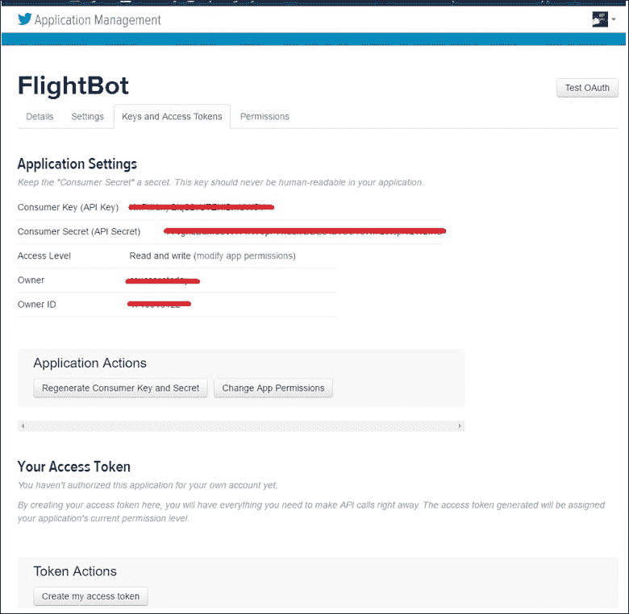

注意默认情况下**消费者密钥**和**消费者密钥**是可用的，但**你的访问令牌**不可用。

为了获取**你的访问令牌**，点击屏幕底部的**创建我的访问令牌**按钮。一旦完成，你将看到以下屏幕：

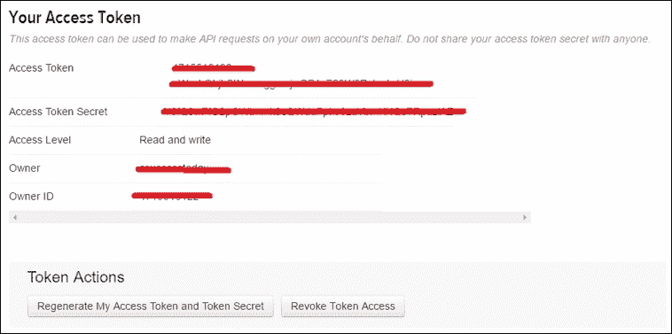

完成此操作后，你现在可以将消费者和访问令牌添加到代码中的秘密对象变量中。

我们可以通过定义一个包含消费者密钥和密钥对象以及访问令牌的对象变量来完成这项工作，如下面的代码片段所示：

```js
var secret = { 
  consumer_key: 'PUT YOURS', 
  consumer_secret: 'PUT YOURS', 
  access_token_key: 'PUT YOURS', 
  access_token_secret: 'PUT YOURS' 
} 

var Twitter = new TwitterPackage(secret); 

```

之后，我们将它们存储在单独的`.json`文件中，但现在是让我们将它们保持在`app.js`文件中。这些将用于验证 Twitter。

因此，到目前为止，我们已经在 Twitter 上基本创建了这个应用，并有一个非常基本的带有令牌和访问代码的结构，我们可以使用这些代码来验证 Twitter 服务并开始使用 API。

在处理完这些之后，让我们继续添加一些逻辑到我们的应用中。

# 发布到 Twitter

为了添加我们自己的自定义逻辑，我们需要使用 Twitter 的`REST` API，这将允许我们做很多事情。它可以做的事情之一是允许我们发布一条推文。

这可以通过以下方式实现：

```js
Twitter.post('statuses/update', {status: 'This is a sample automated Tweet'},  function(error, tweet, response){ 
  if(error){ 
    console.log(error); 
  } 
  console.log(tweet);  // Tweet body. 
  console.log(response);  // Raw response object. 
}); 

```

让我们花点时间来检查这个。`Twitter.post`意味着我们正在调用 Twitter 对象中的`post`函数。我们向`post`函数传递了几件事情 - `'statuses/update'`意味着我们想要发布一个状态更新（一条推文）。

`{status: '这是一条示例自动推文'}`是我们传递给这个函数的 JavaScript 对象，我们在这个对象中设置了要发送的推文的状态。

虽然这仅仅包含了我们想要发送的推文文本，但还有许多其他选项可以设置，具体取决于我们想要发布到 Twitter 的内容（例如图片、位置等）。在这种情况下，我们只是对设置状态属性有所了解。

最后，我们传递一个函数。在 JavaScript 中，你实际上可以将函数传递给其他函数；这是 JavaScript 作为函数式编程语言的特点之一。

在`Twitter.post`函数中，你被期望传递一个函数，该函数将在 Twitter 尝试发布推文后被执行。这被称为回调函数。在这个函数中，你会注意到三个参数：

+   `error`：这表示在发布推文的过程中是否有错误，如果有，这个变量将包含有关发生错误的信息的对象

+   `tweet`：一个包含所有推文数据的对象

+   `response`：Twitter 在发布推文时发送的实际响应的对象

在我们的代码中，我们只需发布我们的推文，然后在控制台打印出来。现在，请删除`'Hi, this is FlightBot'`这一行。我们不再需要它了。

现在，保存修改后的`app.js`文件。它应该看起来像这样：

```js
var TwitterPackage = require('twitter'); 

var secret = { 
  consumer_key: 'PUT YOURS', 
  consumer_secret: 'PUT YOURS', 
  access_token_key: 'PUT YOURS', 
  access_token_secret: 'PUT YOURS' 
} 

var Twitter = new TwitterPackage(secret); 

Twitter.post('statuses/update', {status: 'This is a sample automated Tweet'},  function(error, tweet, response){ 
  if(error){ 
    console.log(error); 
  } 
  console.log(tweet);  // Tweet body. 
  console.log(response);  // Raw response object. 
}); 

```

现在让我们去运行这个应用：

```js
node app.js

```

这将在命令行控制台产生以下结果：

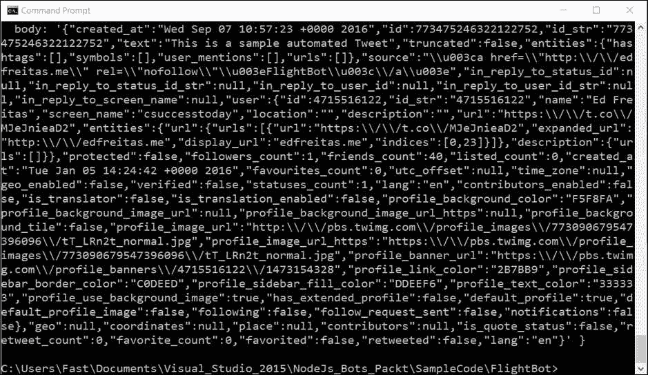

如果我们检查 Twitter 本身，我们可以看到以下内容：

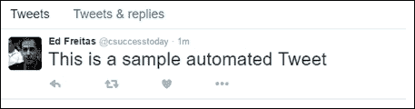

真的很酷！我们现在有了一种发送自动推文的方法。然而，我们还没有一个完整的机器人。让我们探索如何实现这一点。

# 监听推文

为了创建一个功能齐全的 Twitter 机器人，仅仅能够向 Twitter 发布内容是不够的。我们还需要能够监听 Twitter 上发布的内容。

Twitter 有一个非常有用的 API，称为 `Streaming`，它为我们提供了关于推文的实时信息。换句话说，当有人发布我们关心的内容时，我们就会得到关于那条推文的全部数据。这既非常实用，又非常酷。

因此，让我们重新实现一部分代码，如下所示：

```js
Twitter.stream('statuses/filter', {track: '#FlightBot'}, function(stream) { 
  stream.on('data', function(tweet) { 
    console.log(tweet.text); 
  }); 

  stream.on('error', function(error) { 
    console.log(error); 
  }); 
}); 

```

让我们分析一下。`Twitter.stream` 函数接受三个参数：

+   第一个参数是一个字符串，告诉 Twitter 我们想监听具有特定过滤器的状态。在这种情况下，我们正在使用标签进行过滤。

+   第二个参数是我们定义过滤器的位置。该对象包含一个名为 `track` 的属性，它允许我们定义我们想要监听的一个单词、标签或短语。为此，我们将跟踪有人使用 `'#FlightBot'` 标签发推文的情况。

+   最后一个参数是一个函数，当 Twitter 完成设置我们的流时被调用。当它完成设置流后，它将流对象传递给该函数。在这个函数中，我们可以设置当我们收到推文时会发生什么，以及其他事情，例如错误处理等。

现在让我们更仔细地看看当我们接收数据时会发生什么：

```js
stream.on('data', function(tweet) { 
  console.log(tweet.text); 
}); 

```

因此，使用 `stream` 对象，它调用 `on` 函数。现在，使用 `on` 函数，你传递一个字符串和一个函数。这意味着当发生推文时，我们用这些数据调用这个函数。目前，我们只是打印出 `tweet.text`，这是访问接收到的使用 `'#FlightBot'` 标签的推文实际文本的方式。

现在我们来注释掉 `Twitter.post` 代码，这样我们就不会两次发布相同的推文。然后，如果我们保存 `app.js` 文件，并在命令行中调用 `node app.js`，您会注意到命令行不再显示提示符。

这是因为它在运行并监听从该流中传入的一些数据。如果您需要停止它，请多次按下 ***Ctrl*** + ***C*** 返回到提示符。

为了测试这个，请转到 Twitter 并发布一条带有 `'#FlightBot'` 的推文，如下面的截图所示：


现在检查您的运行命令行。您应该看到打印出您的推文文本：

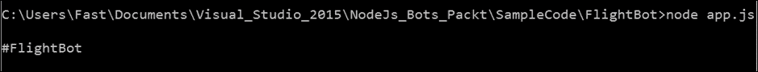

太棒了！我们现在实现了一个可以监听推文的机制。

更新后的 `app.js` 代码现在看起来是这样的：

```js
var TwitterPackage = require('twitter'); 

var secret = { 
  consumer_key: 'PUT YOURS', 
  consumer_secret: 'PUT YOURS', 
  access_token_key: 'PUT YOURS', 
  access_token_secret: 'PUT YOURS' 
} 

var Twitter = new TwitterPackage(secret); 

Twitter.stream('statuses/filter', {track: '#FlightBot'}, function(stream) { 
  stream.on('data', function(tweet) { 
    console.log(tweet.text); 
  }); 

  stream.on('error', function(error) { 
    console.log(error); 
  }); 
}); 

```

# 回复谁发的推文

到目前为止，我们已经编写了一些代码来发布推文，我们也编写了处理已发布推文的代码。那么接下来是什么？

下一步要做的事情是将这两部分基本合并成一个单一的代码库，因为这将是我们机器人的基本层。

你可能想要做的事情之一是让机器人能够回复使用你的标签推文的人。为了做到这一点，机器人需要提及他们。

你可以通过使用`tweet.user.screen_name`来访问使用你的标签推文的人的用户名。

为了提及它们，通过这样做在开头添加一个`'@'`符号：

```js
var mentionString = '@' + tweet.user.screen_name; 

```

然后将它连接到你想推文的字符串中。我们现在正在回复推文的人。酷！

因此，现在让我们看看完整的源代码，以获得全面的了解：

```js
var TwitterPackage = require('twitter'); 

var secret = { 
  consumer_key: 'PUT YOURS', 
  consumer_secret: 'PUT YOURS', 
  access_token_key: 'PUT YOURS', 
  access_token_secret: 'PUT YOURS' 
} 

var Twitter = new TwitterPackage(secret); 

Twitter.stream('statuses/filter', {track: '#FlightBot'}, function(stream) { 
  stream.on('data', function(tweet) { 
    console.log(tweet.text); 
    var statusObj = {status: "Hi @" +  
    tweet.user.screen_name + ", Thanks for reaching out. How are you?"} 

    Twitter.post('statuses/update', statusObj, function(error,  
    tweetReply, response){ 

      if(error){ 
        console.log(error); 
      } 

      console.log(tweetReply.text); 
    }); 
  }); 

  stream.on('error', function(error) { 
    //print out the error 
    console.log(error); 
  }); 
}); 

```

如果我们现在用`node app.js`执行应用程序，我们应该能够抓取任何包含关键词`'#FlightBot'`的标签。让我们看看：


我们现在得到以下结果：


这真的很棒。仅仅用几行代码，我们就能够创建一个简单的 Twitter 机器人。但我们还没有完成。我们还没有添加任何关于如何提供基本的航班详情或数据的逻辑。

但在我们这样做之前，让我们将`secret`变量对象放入一个`secret.json`文件中，这样我们就可以避免在代码中包含访问代码和令牌。

创建一个新的`secret.json`文件，并将其保存在与`app.js`文件相同的文件夹中。`secret.json`文件现在应该看起来像这样：

```js
{ 
  "consumer_key": "PUT YOURS", 
  "consumer_secret": "PUT YOURS", 
  "access_token_key": "PUT YOURS", 
  "access_token_secret": "PUT YOURS" 
} 

```

这个`secret.json`文件随后被代码引用，现在看起来如下所示：

```js
var TwitterPackage = require('twitter'); 
var secret = require("./secret"); 
var Twitter = new TwitterPackage(secret); 

Twitter.stream('statuses/filter', {track: '#FlightBot'}, function(stream) { 

  stream.on('data', function(tweet) { 
    console.log(tweet.text); 
    var statusObj = {status: "Hi @" + tweet.user.screen_name +  
    ", Thanks for reaching out. How are you?"} 

    Twitter.post('statuses/update', statusObj,   
      function(error, tweetReply, response){ 
      if(error){ 
        console.log(error); 
      } 
      console.log(tweetReply.text); 
    }); 
  }); 

  stream.on('error', function(error) { 
    console.log(error); 
  }); 
}); 

```

现在我们有了更新的代码，让我们添加必要的逻辑来发送有关航班状态和信息的消息。

# 航班 API

为了获取一些航班信息，我们将不得不依赖航班 API。一个免费且非常有用的是来自**Air France-KLM**的 API，它可在[`developer.airfranceklm.com/`](https://developer.airfranceklm.com/)找到。


所以，让我们注册并创建一个账户。Air France-KLM 提供了几个 API（可在[`developer.airfranceklm.com/Our_Apis`](https://developer.airfranceklm.com/Our_Apis)找到），例如预订、订单、航班优惠、航班状态、位置、联系方式、附属商店和登机。

我们对使用**Flight Status API**（[`developer.airfranceklm.com/page/Flight_status_API`](https://developer.airfranceklm.com/page/Flight_status_API)）感兴趣，它将提供关于特定航班号的最新和准确信息。让我们来探索一下这个 API。

航班状态 API 提供由 KLM 运营的航班或与 KLM 代码共享的 Delta 和 Air France 运营的航班的状态信息，包括飞往和离开阿姆斯特丹的 Air France-KLM 枢纽的航班，如预定和实际到达和出发时间。

该 API 支持运营决策，例如在极端天气条件等异常情况下发出通知。

这个 API 的好处是它不需要 API 密钥，并且免费提供。但是，它只返回你执行查询当天的数据——也就是说，它只返回今天的数据，不会返回任何过去的航班状态信息。

使用此 API 有两种搜索方式。一种是通过航班号搜索，另一种是使用路线。

## 航班状态 API

当使用航班号搜索时，REST 端点将提供给定航班的航班状态，并且你必须指定日期；例如，2016 年 9 月 16 日的 KL1699 航班。请求看起来像这样：

[`fox.klm.com/fox/json/flightstatuses?flightNumber=KL1699&departureDate=2016-09-16`](http://fox.klm.com/fox/json/flightstatuses?flightNumber=KL1699&departureDate=2016-09-16)

这将返回以下 JSON 响应：

```js
{ "flights" : [ { "@type" : "OperatingFlight", 
        "aircraft" : { "registrationCode" : "PH-BGT" }, 
        "carrier" : { "code" : "KL" }, 
        "flightNumber" : "1699", 
        "marketingFlights" : [ { "carrier" : { "code" : "KQ" }, 
              "flightNumber" : "1699" 
            }, 
            { "carrier" : { "code" : "DL" }, 
              "flightNumber" : "9605" 
            } 
          ], 
        "operatingFlightLeg" : { "arrivesOn" : { "@type" : "Airport", 
                "IATACode" : "MAD" 
              }, 
            "departsFrom" : { "@type" : "Airport", 
                "IATACode" : "AMS" 
              }, 
            "flightStatus" : "ARRIVED", 
            "legs" : [ { "actualArrivalDateTime" : "2016-09-16T09:26+02:00", 
                  "actualDepartureDateTime" : "2016-09-16T06:59+02:00", 
                  "arrivesOn" : { "@type" : "Airport", 
                      "IATACode" : "MAD" 
                    }, 
                  "departsFrom" : { "@type" : "Airport", 
                      "IATACode" : "AMS" 
                    }, 
                  "scheduledArrivalDateTime" : "2016-09-16T09:35+02:00", 
                  "scheduledDepartureDateTime" : "2016-09-16T07:00+02:00", 
                  "status" : "ARRIVED" 
                } ], 
            "scheduledArrivalDateTime" : "2016-09-16T09:35+02:00", 
            "scheduledDepartureDateTime" : "2016-09-16T07:00+02:00" 
          }, 
        "remainingFlyTime" : "PT0.000S" 
      } ]  
} 

```

这很简单，也很有趣！现在让我们探索路线搜索 API。

## 路线搜索 API

路线搜索 REST 端点提供了给定路线（例如阿姆斯特丹（AMS）和巴黎查尔斯·戴高乐（CDG））中所有适用航班的航班状态摘要。

请求看起来像这样：

[`fox.klm.com/fox/json/flightstatuses?originAirportCode=AMS&destinationAirportCode=CDG`](http://fox.klm.com/fox/json/flightstatuses?originAirportCode=AMS&destinationAirportCode=CDG)

JSON 结果如下。

```js
{ "flights" : [ { "@type" : "OperatingFlight", 
        "_links" : { "detailedInfoLink" :     "http://fox.klm.com/fox/json/flightstatuses flightNumber=KL1223&departureDate=2016-09-15&originAirport=AMS&destinationAirport=CDG" }, 
        "carrier" : { "code" : "KL" }, 
        "flightNumber" : "1223", 
        "operatingFlightLeg" : { "arrivesOn" : { "@type" : "Airport", 
                "IATACode" : "CDG" 
              }, 
            "departsFrom" : { "@type" : "Airport", 
                "IATACode" : "AMS" 
              }, 
            "flightStatus" : "ARRIVED", 
            "scheduledArrivalDateTime" : "2016-09-15T08:00+02:00", 
            "scheduledDepartureDateTime" : "2016-09-15T06:45+02:00" 
          } 
      }, 
      { "@type" : "OperatingFlight", 
        "_links" : { "detailedInfoLink" : "http://fox.klm.com/fox/json/flightstatuses?flightNumber=KL1227&departureDate=2016-09-16&originAirport=AMS&destinationAirport=CDG" }, 
        "carrier" : { "code" : "KL" }, 
        "flightNumber" : "1227", 
        "operatingFlightLeg" : { "arrivesOn" : { "@type" : "Airport", 
                "IATACode" : "CDG" 
              }, 
            "departsFrom" : { "@type" : "Airport", 
                "IATACode" : "AMS" 
              }, 
            "flightStatus" : "ARRIVED", 
            "scheduledArrivalDateTime" : "2016-09-16T08:40+02:00", 
            "scheduledDepartureDateTime" : "2016-09-16T07:15+02:00" 
          } 
      }, 
      { "@type" : "OperatingFlight", 
        "_links" : { "detailedInfoLink" : "http://fox.klm.com/fox/json/flightstatuses?flightNumber=GA9240&departureDate=2016-09-16&originAirport=AMS&destinationAirport=CDG" }, 
        "carrier" : { "code" : "GA" }, 
        "flightNumber" : "9240", 
        "operatingFlightLeg" : { "arrivesOn" : { "@type" : "Airport", 
                "IATACode" : "CDG" 
              }, 
            "departsFrom" : { "@type" : "Airport", 
                "IATACode" : "AMS" 
              }, 
            "flightStatus" : "ARRIVED", 
            "scheduledArrivalDateTime" : "2016-09-16T09:25+02:00", 
            "scheduledDepartureDateTime" : "2016-09-16T07:55+02:00" 
          } 
      } 
    ]  
} 

```

响应包括以下信息——计划出发日期时间、计划到达日期时间、航班状态、营销航班、剩余飞行时间、到达和出发信息。

既然我们已经有了查询 API，那么让我们让我们的机器人变得更聪明一些，允许它检索航班状态和路线详情。

## 添加 REST 客户端库

使用我们已有的代码，它能够响应实际使用了 `'#FlightBot'` 标签的人，让我们做一些修改，以便它可以使用 Air France-KLM API 提供航班和路线的状态详情。

为了与 Air France-KLM 端点通信，我们需要做的第一件事是在我们的应用程序中包含一个 Node.js 的 REST 客户端库。

现在有各种 Node.js REST 客户端库，你可以选择让你感觉更舒适的任何一个。然而，在我们的例子中，我们将使用位于 [`www.npmjs.com/package/request`](https://www.npmjs.com/package/request) 的库。

我们需要做的第一件事是安装它。我们可以通过在命令行中执行以下指令来完成：

```js
npm install request --save

```

完成这些操作后，我们的 `package.json` 文件将更新如下：

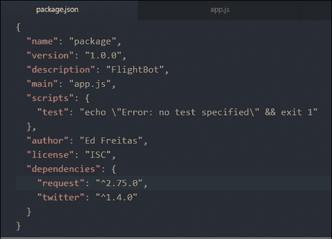

注意到我们添加了对 `request` 的引用。这是因为我们在执行前面的指令时使用了保存选项。

# 让机器人变得更聪明

现在我们已经添加了 REST 客户端库，是时候在我们的应用程序中添加一些逻辑，以便与 Air France-KLM API 进行交互。

我们的机器人应该能够使用之前描述的 API 端点提供有关航班和路线的反馈。

让我们对我们的代码进行一些修改以适应这一点。为了做到这一点，让我们添加一些逻辑以确保机器人能够处理 Twitter 标签以及航班号。

因此，我们将基本上自动化对 REST 端点的调用并解析与之相关的响应，只返回一些基本的数据，而不是全部。听起来很令人兴奋，所以让我们开始吧。

我们需要通过`REST`调用自动化此端点。我们需要确保除了标签之外，消息中还应传递航班号：

[`fox.klm.com/fox/json/flightstatuses?flightNumber=KL1699&departureDate=2016-09-16`](http://fox.klm.com/fox/json/flightstatuses?flightNumber=KL1699&departureDate=2016-09-16)

这里是完整的更新后的代码。让我们完整地看看它，然后逐个分析所做的更改：

```js
var TwitterPackage = require('twitter'); 
var secret = require("./secret"); 
var Twitter = new TwitterPackage(secret); 
var request = require('request'); 

padLeft = function (str, paddingChar, length) { 
  var s = new String(str); 

  if ((str.length < length) && (paddingChar.toString().length > 0)) 
  { 
      for (var i = 0; i < (length - str.length) ; i++) 
        s = paddingChar.toString().charAt(0).concat(s); 
  } 

  return s; 
}; 

GetDate = function() { 
  var dateObj = new Date(); 
  var month = dateObj.getUTCMonth() + 1; //months from 1-12 
  var day = dateObj.getUTCDate(); 
  var year = dateObj.getUTCFullYear(); 

  return year + '-' + padLeft(month.toString(), '0', 2) + '-' +  
    padLeft(day.toString(), '0', 2); 
}; 

FlightNumberOk = function(str) { 
  var posi = str.indexOf('KL'); 
  var fn = str.substring(posi); 
  return (posi >= 0 && fn.length === 6) ? fn : ''; 
}; 

var fd = ''; 

GetFlightDetails = function(fn) { 
  var dt = GetDate(); 
  var rq = 'http://fox.klm.com/fox/json/flightstatuses?flightNumber=' + fn +  
    '&departureDate=' + dt; 

  request(rq, function (error, response, body) { 
    if (!error && response.statusCode == 200) { 
      fd = body; 
    } 
  }) 
}; 

Twitter.stream('statuses/filter', {track: '#FlightBot'}, function(stream) { 

  stream.on('data', function(tweet) { 
    var statusObj = {status: "Hi @" + tweet.user.screen_name +  
      ", Thanks for reaching out. We are missing the flight number."}; 

    var fn = FlightNumberOk(tweet.text); 

    if (fn !== '') { 
      GetFlightDetails(fn); 
    } 

    setTimeout(function() { 
      console.log ('fd: ' + fd); 

      if (fd !== undefined) { 
        var ff = JSON.parse(fd); 
        statusObj = {status: "scheduledArrivalDateTime: "  +  
          ff.flights[0].operatingFlightLeg.scheduledArrivalDateTime}; 
      } 

      Twitter.post('statuses/update', statusObj,  function(error, tweetReply,  
      response) { 
        if (error){ 
          console.log(error); 
        } 
        console.log(tweetReply.text); 
      }); 
    }, 1500); 
  }); 

  stream.on('error', function(error) { 
    console.log(error); 
  }); 
}); 

```

好的，所以有一些更改。第一个更改是我们添加了对`request`库的引用，我们将使用它来向 REST API 发出请求：

```js
var request = require('request'); 

```

随后，我们添加了一个`GetDate`函数，该函数将返回今天的日期，以便将其作为`departureDate`参数传递到`REST`端点：

```js
GetDate = function() { 
  var dateObj = new Date(); 
  var month = dateObj.getUTCMonth() + 1; //months from 1-12 
  var day = dateObj.getUTCDate(); 
  var year = dateObj.getUTCFullYear(); 

  return year + '-' + padLeft(month.toString(), '0', 2) + '-' +  
    padLeft(day.toString(), '0', 2); 
}; 

```

这个`GetDate`函数使用一个`padLeft`函数，该函数负责正确格式化以下代码片段中显示的日期的每个部分：

```js
padLeft = function (str, paddingChar, length) { 
  var s = new String(str); 

  if ((str.length < length) && (paddingChar.toString().length > 0)) 
  { 
      for (var i = 0; i < (length - str.length) ; i++) 
        s = paddingChar.toString().charAt(0).concat(s); 
  } 

  return s; 
}; 

```

这两个函数涵盖了 REST 端点的`departureDate`部分。因此，现在让我们专注于`flightNumber`部分。

为了这个，我们编写了一个名为`FlightNumberOk`的函数，它进行快速检查以确保航班号是正确的：

```js
FlightNumberOk = function(str) { 
  var posi = str.indexOf('KL'); 
  var fn = str.substring(posi); 
  return (posi >= 0 && fn.length === 6) ? fn : ''; 
}; 

```

航班号正确后，我们可以使用另一个名为`GetFlightDetails`的函数来实际调用`REST`端点。JSON 响应由变量`body`表示，然后分配给`fd`变量，该变量随后用于向用户发送推文响应。请参考以下代码：

```js
GetFlightDetails = function(fn) { 
  var dt = GetDate(); 
  var rq = 'http://fox.klm.com/fox/json/flightstatuses?flightNumber=' + fn +  
    '&departureDate=' + dt; 

  request(rq, function (error, response, body) { 
    if (!error && response.statusCode == 200) { 
      fd = body; 
    } 
  }) 
}; 

```

由于`GetFlightDetails`使用请求库对`REST`端点执行异步请求，我们无法在获得 JSON 响应之前发送推文，并且为了确保这一点，推文响应在`GetFlightDetails`执行后 1,500 毫秒内在`setTimeout`JavaScript 函数中执行。

因此，基本上我们的`Twitter.stream`函数现在看起来是这样的：

```js
Twitter.stream('statuses/filter', {track: '#FlightBot'}, function(stream) { 

  stream.on('data', function(tweet) { 
    var statusObj = {status: "Hi @" + tweet.user.screen_name + ", Thanks for  
      reaching out. We are missing the flight number."}; 

    var fn = FlightNumberOk(tweet.text); 

    if (fn !== '') { 
      GetFlightDetails(fn); 
    } 

    setTimeout(function() { 
      console.log ('fd: ' + fd); 

      if (fd !== undefined) { 
        var ff = JSON.parse(fd); 
        statusObj = {status: "scheduledArrivalDateTime: "  +  
          ff.flights[0].operatingFlightLeg.scheduledArrivalDateTime}; 
      } 

      Twitter.post('statuses/update', statusObj,  function(error, tweetReply,  
      response) { 
        if (error){ 
          console.log(error); 
        } 
        console.log(tweetReply.text); 
      }); 
    }, 1500); 
  }); 

  stream.on('error', function(error) { 
    console.log(error); 
  }); 
}); 

```

注意在`setTimeout`函数调用`Twitter.Post`之前，如何调用`FlightNumberOk`和`GetFlightDetails`。这是为了确保航班号是正确的，并且包含航班详细信息的 JSON 响应存在，然后再向用户发送推文。

推文响应基本上会发送`scheduledArrivalDateTime`，这是通过使用`JSON.parse`解析 JSON 响应获得的。它可以通过以下方式访问：

```js
ff.flights[0].operatingFlightLeg.scheduledArrivalDateTime 

```

如果我们现在运行程序并推文`#FlightBot KL1699`，我们会得到以下结果：

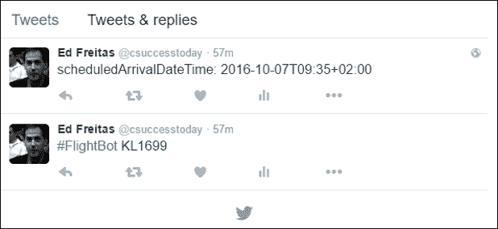

所以这很酷，不是吗？真的很酷！

# 摘要

在本章中，我们看到了如何与 Twitter 互动，以及如何查询法航-荷兰航空 API 以检索航班详情和回复推文。

我们对使用这些 API 可以做到的事情只是触及了皮毛；坦白说，可能性几乎是无限的。您需要的只是时间和丰富的想象力！

鼓励您继续探索 Twitter、法航-荷兰航空 API 以及其他可用的航班数据 API。这绝对是一个有趣且值得进一步探索的领域。

希望您喜欢跟随这些示例。接下来的章节将探讨其他有趣的主题。祝您玩得开心！
