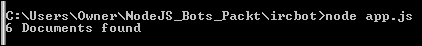
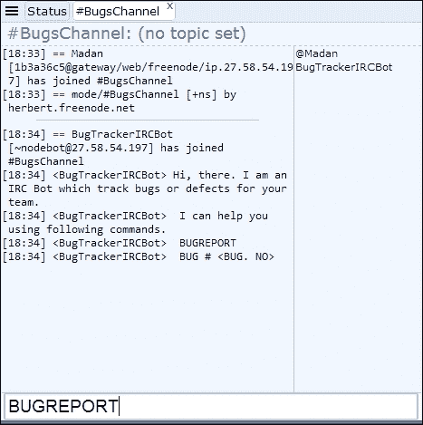

# 第八章. 团队用的缺陷跟踪代理

**InternetRelayChat** (**IRC**) 允许我们以文本形式进行实时通信。这种聊天在客户端-服务器模型中运行，基于 TCP 协议。IRC 支持群组消息，这被称为频道，同时也支持私密消息。

IRC 被组织成许多网络，具有不同的受众。作为客户端-服务器架构，用户需要使用 IRC 客户端连接到 IRC 服务器。IRC 客户端软件可以是打包软件，也可以是基于 Web 的客户端。一些浏览器也提供作为附加组件的 IRC 客户端。用户可以在他们的系统上安装它们，然后可以使用它们连接到 IRC 服务器或网络。在连接到这些 IRC 服务器时，用户将必须提供一个唯一的昵称并选择一个现有的通信频道，或者用户可以在连接到这些服务器时创建一个新频道。

在本章中，我们将开发一个用于缺陷跟踪目的的此类 IRC 机器人。这个缺陷跟踪机器人将提供有关缺陷的详细信息以及特定缺陷的细节。所有这些都将无缝地在 IRC 频道内完成。对于团队来说，在了解他们的缺陷或缺陷时，这将是一个窗口操作。

太棒了！！

# IRC 客户端和服务器

如介绍中所述，要启动 IRC 通信，我们需要一个 IRC 客户端和一个服务器或网络，我们的客户端将连接到该网络。我们将使用 freenode 网络让我们的客户端连接。Freenode 是最大的免费、开源、以软件为中心的 IRC 网络。

## 基于 Web 的 IRC 客户端

我们将通过 URL 使用基于 Web 的 IRC 客户端（[`webchat.freenode.net/`](https://webchat.freenode.net/)）。打开 URL 后，您将看到以下屏幕：


如前所述，在连接时，我们需要提供 **昵称** 和 **频道**。

我已提供 **昵称** 为 `Madan`，在 **频道** 中为 `#BugsChannel`。在 IRC 中，频道总是以 # 开头，所以我用 # 开头命名我的缺陷频道。这是我们为通信开始的新频道。所有开发者或团队成员都可以提供他们的昵称和这个频道名称来加入通信。现在让我们通过选择 **我不是机器人** 并点击 **连接** 按钮来证明 **人性**。


连接成功后，您将看到以下屏幕：


通过这种方式，我们的 IRC 客户端已连接到 freenode 网络。您也可以看到右侧的用户名是 `@Madan`，在 **#BugsChannel** 内。任何使用这个频道名称和网络加入该频道的人都会显示在右侧。

在下一节中，我们将让我们的机器人加入这个频道和相同的网络，并查看它如何在频道中显示。

# IRC 机器人

IRC 机器人是一种连接到 IRC 作为客户端之一并出现在 IRC 频道中的用户的程序。这些 IRC 机器人用于提供 IRC 服务或托管基于聊天的自定义实现，这将帮助团队高效协作。

## 使用 IRC 和 Node.js 创建我们的第一个 IRC 机器人

让我们从在本地驱动器上创建一个文件夹开始，以便存储我们的机器人程序，从命令提示符中执行：

```js
mkdir ircbot
cd ircbot

```

假设我们已经安装了 Node.js 和 npm，让我们创建并初始化我们的`package.json`，它将存储我们的机器人依赖项和定义：

```js
npm init

```

一旦你通过了`npm init`选项（这些选项非常容易遵循），你会看到类似以下的内容：


在你的项目文件夹中，你会看到结果，即你的`package.json`文件：


让我们从 npm 安装`irc`包开始。这个包可以在[`www.npmjs.com/package/irc`](https://www.npmjs.com/package/irc)找到。

为了安装它，运行以下 npm 命令。

```js
npm install --save irc

```

你应该会看到类似以下的内容：


完成此操作后，接下来要做的事情是更新你的`package.json`以包括`"engines"`属性。使用文本编辑器打开`package.json`文件，并按以下方式更新它：

```js
"engines": { 
    "node": ">=5.6.0" 
} 

```

然后，你的`package.json`应该看起来像这样：


让我们创建我们的`app.js`文件，这是我们机器人的入口点，正如在设置我们的 node 包时提到的。

我们的`app.js`应该看起来像这样：

```js
var irc = require('irc'); 
var client = new irc.Client('irc.freenode.net', 'BugTrackerIRCBot', { 
  autoConnect: false 
}); 
client.connect(5, function(serverReply) { 
  console.log("Connected!\n", serverReply); 
  client.join('#BugsChannel', function(input) { 
    console.log("Joined #BugsChannel"); 
    client.say('#BugsChannel', "Hi, there. I am an IRC Bot which track bugs or defects for your team.\n I can help you using following commands.\n BUGREPORT \n BUG # <BUG. NO>"); 
  }); 
}); 

```

现在，让我们运行我们的 Node.js 程序并看看我们的控制台看起来如何。如果一切顺利，我们的控制台应该显示我们的机器人已连接到所需的网络，并且已加入一个频道。控制台看起来应该是这样的：


现在，如果你在 Web 客户端中查看我们的频道**#BugsChannel**，你应该能看到我们的机器人已经加入并也发送了欢迎信息。请参考以下屏幕截图：


如果你查看前面的屏幕，我们的机器人程序已成功执行。我们的机器人`BugTrackerIRCBot`已加入频道**#BugsChannel**，并且机器人还向频道中的所有人发送了介绍信息。如果你查看屏幕右侧的用户名下，我们会看到`BugTrackerIRCBot`位于`@Madan`下方。

## 对我们基本机器人的代码理解

在看到我们的机器人在 IRC 客户端中的样子后，让我们看看`app.js`中的基本代码实现。

我们使用了以下行中的`irc`库：

```js
var irc = require('irc'); 

```

使用`irc`库，我们实例化了客户端，使用以下代码片段连接到 IRC 网络之一：

```js
var client = new irc.Client('irc.freenode.net', 'BugTrackerIRCBot', { 
  autoConnect: false 
}); 

```

在这里，我们连接到了网络`irc.freenode.net`，并提供了昵称`BugTrackerIRCBot`。这个名字的由来是因为我希望我的机器人能够追踪和报告未来发现的任何错误。现在，我们要求客户端连接并使用以下代码片段加入一个特定的频道：

```js
client.connect(5, function(serverReply) { 
  console.log("Connected!\n", serverReply); 
  client.join('#BugsChannel', function(input) { 
    console.log("Joined #BugsChannel"); 
    client.say('#BugsChannel', "Hi, there. I am an IRC Bot which track bugs or defects for your team.\n I can help you using following commands.\n BUGREPORT \n BUG # <BUG. NO>"); 
  }); 
}); 

```

在前面的代码片段中，一旦客户端连接，我们会从服务器收到回复。这个回复会在控制台上显示。一旦成功连接，我们要求机器人使用以下代码行加入一个频道：

```js
client.join('#BugsChannel', function(input) { 

```

记住，`#BugsChannel`是我们从 Web 客户端开始加入的。现在，使用`client.join()`，我要求我的机器人加入相同的频道。一旦机器人加入，机器人将使用`client.say()`函数在同一个频道发送欢迎信息。

希望这已经给了你对我们机器人和其代码实现的一些基本理解。

在下一节中，我们将增强我们的机器人，以便我们的团队在聊天时能够有一个有效的沟通体验。

## 增强我们的 BugTrackerIRCBot

在构建了一个非常基础的 IRC 机器人之后，让我们增强我们的 BugTrackerIRCBot。

作为开发者，我们总是想了解我们的程序或系统是如何运行的。为了做到这一点，通常，我们的测试团队会对系统或程序进行测试，并在 bug 跟踪软件包或系统中记录错误或缺陷。我们开发者可以在开发周期中稍后查看这些错误，并作为我们开发周期的一部分来解决它们。在这个过程中，开发者将通过像 IRC 这样的消息平台进行协作和沟通。我们希望通过利用 IRC 机器人为他们提供独特的开发体验。

所以，这正是我们正在做的事情。我们正在创建一个用于通信的频道；所有团队成员都将加入该频道，我们的机器人也将在那里。在这个频道中，根据开发者的请求，将报告和沟通错误。此外，如果开发者需要有关错误的额外信息，聊天机器人可以通过提供 bug 跟踪系统的 URL 来帮助他们。

太棒了！！

但是，在深入探讨之前，让我总结一下我们将如何使用以下步骤来完成这项工作：

+   增强我们的基本机器人程序，以获得更自然的对话体验

+   创建一个错误跟踪系统或错误存储，其中将存储和跟踪开发者的错误

在这里，我们提到了一个错误存储系统。在本章中，我想解释**DocumentDB**，这是一个基于 NoSQL JSON 的云存储系统。在前面的章节中，我们看到了 MongoDB。现在我们将查看 DocumentDB 来构建我们的错误系统。

### 什么是 DocumentDB？

在前面的章节中，我已经解释了 NoSQLs。DocumentDB 就是这样一种 NoSQL，其中数据存储在 JSON 文档中，并且提供在 Microsoft Azure 平台上。

DocumentDB 的详细信息可以在[`azure.microsoft.com/en-in/services/documentdb/`](https://azure.microsoft.com/en-in/services/documentdb/)查看。

### 为我们的 BugTrackerIRCBot 设置 DocumentDB

假设您已经拥有一个 Microsoft Azure 订阅，请按照以下步骤配置 DocumentDB 以供您的机器人使用。

#### 为 DocumentDB 创建账户 ID

使用以下从 Azure 门户的截图创建一个名为`botdb`的新账户。选择 NoSQL API 作为**DocumentDB**。选择合适的订阅和资源。我正在使用此账户的现有资源。您也可以为该账户创建一个新的专用资源。一旦输入所有必要的信息，点击底部的**创建**按钮以创建新的 DocumentDB 账户。


新创建的账户`botdb`如下所示：


#### 创建集合和数据库

从之前显示的账户列表中选择一个`botdb`账户。这将显示各种菜单选项，如**属性**、**设置**、**集合**等。

在此账户下，我们需要创建一个集合来存储 bug 数据。要创建一个新的集合，请点击以下截图所示的**添加集合**选项：


点击**添加集合**选项后，屏幕右侧将显示以下屏幕。请按照以下截图输入详细信息：


在前面的屏幕中，我们正在创建一个新的数据库以及我们的新集合**Bugs**。这个新数据库将被命名为`BugDB`。一旦这个数据库被创建，我们可以在未来将其他与 bug 相关的集合添加到同一个数据库中。这可以通过使用前面的屏幕中的**使用**现有选项来完成。一旦输入所有相关数据，点击**确定**以创建数据库以及集合。请参考以下截图：


从前面的屏幕，将使用显示的**集合 ID**和**数据库**来增强我们的机器人。

#### 为我们的 BugTrackerIRCBot 创建数据

现在我们有了包含 bug 集合的`BugsDB`，它将保存所有 bug 数据。让我们向我们的集合添加一些数据。要添加数据项，让我们使用以下截图所示的菜单选项**文档资源管理器**：


这将打开一个显示迄今为止创建的**数据库**和**集合**列表的屏幕。从可用列表中选择我们的`BugDB`数据库和`Bugs`集合。请参考以下截图：


要为我们的 bug 集合创建一个 JSON 文档，请点击**创建**选项。这将打开一个**新建文档**屏幕，用于输入基于 JSON 的数据。请按照以下截图输入数据项：


我们将为单个错误文档存储`id`、`status`、`title`、`description`、`priority`、`assignedto`和`url`属性，这些文档将存储在错误集合中。要保存集合中的 JSON 文档，请点击**保存**按钮。参考以下截图：


这样我们就可以在错误集合中创建示例记录，这些记录将在 Node.js 程序中连接。以下截图显示了示例错误列表：


总结到目前为止的章节，我们已经确定了如何使用微软 Azure 的 DocumentDB。使用 DocumentDB，我们创建了一个新的集合以及新的数据库来存储错误数据。我们还在错误集合中添加了一些示例 JSON 文档。

现在，让我们看看我们如何将我们的 DocumentDB 与 Node.js 连接起来。

### 连接 DocumentDB 和 Node.js

让我们回到我们的`ircbot`目录，并从 npm 安装`documentdb`包。这仅仅是微软 Azure DocumentDB 的 Node.js SDK。它位于 URL [`www.npmjs.com/package/documentdb`](https://www.npmjs.com/package/documentdb) 。

为了安装它，运行以下 npm 命令：

```js
npm install documentdb --save

```

您应该会看到类似以下的内容：


让我们修改我们的`app.js`文件，以便我们可以使用 DocumentDB API 访问基于 DocumentDB 的数据。

要将 DocumentDB 与 Node.js 连接起来，我们将使用以下代码：

```js
var DocumentClient = require('documentdb').DocumentClient; 
var host = "https://botdb.documents.azure.com:443/";                      
var masterKey = "<YOUR PRIMARY KEY>";  
var docclient = new DocumentClient(host, {masterKey: masterKey}); 

docclient.readDocuments('dbs/BugDB/colls/Bugs').toArray(function (err, docs) { 
    console.log(docs.length + ' Documents found');     
}); 

```

在前面的代码中，我们正在尝试从我们的 DocumentDB 中读取文档。现在，为了实例化`DocumentClient`，我们需要我们的 DocumentDB 账户的`host`和`masterkey`。参考以下截图以定位`host`，它只是一个**URL**，而`masterkey`是一个**主键**。


要读取我们集合中的所有文档，我们使用以下代码行：

```js
docclient.readDocuments('dbs/BugDB/colls/Bugs').toArray(function (err, docs) { 
    console.log(docs.length + ' Documents found');     
}); 

```

`readDocuments()`需要一个集合链接的参数。这个集合链接简单来说就是我们的集合路径。它如下所示：

`dbs/<您的数据库>/colls/<您的集合 ID>`

我们的`app.js`现在应该看起来像这样：

```js
var irc = require('irc'); 
var client = new irc.Client('irc.freenode.net', 'BugTrackerIRCBot', { 
  autoConnect: false 
}); 
client.connect(5, function(serverReply) { 
  console.log("Connected!\n", serverReply); 
  client.join('#BugsChannel', function(input) { 
    console.log("Joined #BugsChannel"); 
    client.say('#BugsChannel', "Hi, there. I am an IRC bot which track bugs or defects for your team.\n I can help you using following commands.\n BUGREPORT \n BUG # <BUG. NO>"); 
  }); 
}); 

var DocumentClient = require('documentdb').DocumentClient; 
var host = "https://botdb.documents.azure.com:443/";                      
var masterKey = "<YOUR PRIMARY KEY>";   
var docclient = new DocumentClient(host, {masterKey: masterKey}); 

docclient.readDocuments('dbs/BugDB/colls/Bugs').toArray(function (err, docs) { 
    console.log(docs.length + ' Documents found');     
}); 

```

让我们使用命令提示符回到我们的`ircbot`目录，并运行我们的 Node.js 程序。一旦运行，程序将使用微软 Azure DocumentDB Node.js SDK 连接到我们的集合。在读取文档后，在命令提示符中我们将看到读取的文档数量。有关详细信息，请参考以下截图：



由于我们的 IRC 客户端是异步连接的，所以一旦收到回复，我们将看到来自 IRC 服务器的回复。在这种情况下，我们提前收到了 DocumentDB 的响应，因此在控制台上看到“找到 6 个文档”。

到目前为止，我们已经能够连接到 DocumentDB 并从同一数据库中检索文档。现在，在下一节和最后一节中，我们将将这些连接起来，并增强我们机器人的对话体验。

### 将所有这些连接起来

为了将这些事物连接起来，让我们修改我们早期的`app.js`，如下所示：

```js
var irc = require('irc'); 

var client = new irc.Client('irc.freenode.net', 'BugTrackerIRCBot', { 
    autoConnect: false 
}); 

client.connect(5, function(serverReply) { 
    console.log("Connected!\n", serverReply); 

    client.join('#BugsChannel', function(input) { 
        console.log("Joined #BugsChannel"); 
        client.say('#BugsChannel', "Hi, there. I am an IRC Bot which track bugs or defects for your team.\n I can help you using following commands.\n BUGREPORT \n BUG # <BUG. NO>"); 
    }); 
}); 

var DocumentClient = require('documentdb').DocumentClient; 
var host = "https://botdb.documents.azure.com:443/"; 
var masterKey = "<PRIMARY KEY>"; 
var docclient = new DocumentClient(host, {masterKey: masterKey}); 

client.addListener('message', function (from, to, text) { 
    var str = text; 

    if (str.indexOf('BUGREPORT') === -1){ 
        if (str.indexOf('BUG #') === -1){ 
            client.say('#BugsChannel', "I could not get that!\n Send me commands like,\n BUGREPORT \n BUG # <BUG. NO>"); 
        } 
        else { 
            client.say('#BugsChannel', "So you need info about "+text); 
            client.say('#BugsChannel', "Wait for a moment!"); 
            var t= text.substring(6,text.length); 
            var temp = t.trim(); 

            var querySpec = { 
                query: 'SELECT * FROM Bugs b WHERE b.id= @id', 
                parameters: [ 
                { 
                    name: '@id', 
                    value: temp 
                } 
                ] 
            }; 
            docclient.queryDocuments('dbs/BugDB/colls/Bugs', querySpec).toArray(function (err, results) { 
                if (results.length>0){ 
                    client.say('#BugsChannel', "["+ results[0].url+"] [Status]: "+results[0].status+" [Title]:"+results[0].title); 
                }
                else{ 
                    client.say('#BugsChannel', 'No bugs found.'); 
                } 
            }); 
        } 
    } 
    else{ 
        client.say('#BugsChannel', "So you need a Bug Report!"); 
        client.say('#BugsChannel', "Wait for a moment!"); 
        var querySpec = { 
            query: 'SELECT * FROM Bugs b WHERE b.status= @status', 
            parameters: [ 
            { 
                name: '@status', 
                value: 'Open' 
            } 
            ] 
        }; 

        docclient.queryDocuments('dbs/BugDB/colls/Bugs', querySpec).toArray(function (err, results) { 
            client.say('#BugsChannel','Total Open Bugs:'+results.length); 
        }); 
        var querySpec = { 
            query: 'SELECT * FROM Bugs b WHERE b.status= @status', 
            parameters: [ 
            { 
                name: '@status', 
                value: 'Closed' 
            } 
            ] 
        }; 

        docclient.queryDocuments('dbs/BugDB/colls/Bugs', querySpec).toArray(function (err, results) { 
            client.say('#BugsChannel','Total Closed Bugs:'+results.length); 
        }); 
    } 
}); 

```

### 代码理解

我已经解释了如何使用**URI**和**PRIMARY KEY**连接到 DocumentDB。现在让我们关注我们是如何实现对话体验的，以及我们如何在 BugTrackerIRCBot 中根据这些信息获取错误信息。

```js
client.addListener('message', function (from, to, text) { 
    var str = text; 
    if (str.indexOf('BUGREPORT') === -1){ 
     if (str.indexOf('BUG #') === -1){ 
        client.say('#BugsChannel', "I could not get that!\n Send me commands like,\n BUGREPORT \n BUG # <BUG. NO>"); 
     } 

```

在前面的代码中，我们的 IRC 客户端已经添加了一个监听器，该监听器监听频道内的所有消息。因此，当我们的机器人加入频道时，它会提及可以使用哪些命令。这些命令是`BUGREPORT`和`BUG # <错误编号>`。

了解这一点后，当我们的传入消息包含像`BUGREPORT`和`BUG #`这样的单词时，我们的机器人 BugTrackerIRCBot 将根据这些命令收集信息。如果消息不匹配，则机器人将回复适当的消息，并提供可用的命令。

假设一位开发者正在寻找缺陷的总数，因此开发者输入了`BUGREPORT`命令，然后我们的机器人将查询 DocumentDB 数据库，并从我们的错误集合中获取开放和关闭错误的报告。此代码如下：

```js
client.say('#BugsChannel', "So you need a Bug Report!"); 
client.say('#BugsChannel', "Wait for a moment!");            
var querySpec = { 
    query: 'SELECT * FROM Bugs b WHERE  b.status= @status', 
    parameters: [ 
       { 
           name: '@status', 
           value: 'Open' 
       } 
    ] 
}; 
docclient.queryDocuments('dbs/BugDB/colls/Bugs', querySpec).toArray(function (err, results) {     
    client.say('#BugsChannel','Total Open Bugs:'+results.length); 
}); 

```

在前面的代码中，一旦开发者的报告意图明确，我们的机器人将使用`client.say()`函数进行确认回复。机器人交互式地要求开发者稍等片刻，同时使用`docclient.queryDocuments()`函数查询 DocumentDB。一旦收到数据，机器人再次使用`client.say()`函数，并在聊天窗口中返回信息。在前面的代码中，机器人首先返回`Total Open Bugs`（总开放错误），然后是`Total Closed Bugs`（总关闭错误）。

现在你可能会问，为什么对`Open`和`Closed`错误使用不同的调用；原因是，目前，DocumentDB 中没有对 AGGREGATE 函数的原生支持。我们只需要知道错误的`Open`和`Closed`数量，所以我们使用`docclient.queryDocuments()`函数两次来获取数据。

BugTrackerIRCBot 也可以使用`BUG #`命令提供有关单个错误的详细信息。相同的实现可以在以下代码片段中看到：

```js
client.say('#BugsChannel', "So you need info about "+text);               
client.say('#BugsChannel', "Wait for a moment!");          
var t= text.substring(6,text.length); 
var temp = t.trim();  
var querySpec = { 
    query: 'SELECT * FROM Bugs b WHERE  b.id= @id', 
    parameters: [ 
    { 
        name: '@id', 
        value: temp 
    } 
    ] 
};           
docclient.queryDocuments('dbs/BugDB/colls/Bugs', querySpec).toArray(function (err, results) {     
    if (results.length>0){ 
        client.say('#BugsChannel', "["+ results[0].url+"] [Status]: "+results[0].status+" [Title]:"+results[0].title);            
    }
    else{ 
        client.say('#BugsChannel', 'No bugs found.');       
    } 
}); 

```

在前面的代码中，当开发者聊天时给出`BUG #`命令，我们的代码将提取符号`#`之后的错误编号。然后我们的机器人将回复从数据库中检索哪些错误详情。如果没有找到记录，我们的机器人也将回复适当的消息。

变量`querySpec`将根据开发者在一个聊天窗口中输入的 bug 编号来构建一个查询，然后使用`docclient.queryDocuments()`函数进行处理。一旦函数检索到指定 bug 编号的数据，我们的机器人将构建以下响应：

```js
client.say('#BugsChannel', '[http://mybugsystem.net/'+ results[0].id +"] [Status]: "+results[0].status+" [Title]:"+results[0].title); 

```

对于最终用户或开发者，我们显示了 bug 跟踪系统的 bug URL，以及 bug 的状态和标题。

到目前为止，有很多代码需要理解！！

让我们现在运行我们的机器人，看看它是如何互动并提供给我们一个极好的对话体验的。

## 运行我们的增强版 BugTrackerIRCBot

让我们回到我们的`ircbot`目录，在命令提示符下运行我们的修改后的`app.js`。一旦代码成功运行，你应该在命令提示符下看到以下内容：


这是在假设你已经按照前面所述连接到了 IRC 客户端的情况下。现在让我们从 IRC 客户端的角度来看我们的频道#BugsChannel。我们应该看到我们的机器人如下所示：



在前面的截图中，你可以看到机器人已经加入了频道，并且还向我们介绍了可用的命令。

让我们输入命令`BUGREPORT`并查看机器人对我们回复了什么。在这里，机器人正在获取 bug 报告，正如前面在代码描述中解释的那样。看到的回复如下：


现在我们确保我们的其他命令也能正常工作。所以，现在我们感兴趣的是关于单个 bug 的信息，输入命令`BUG # 125`并查看我们的机器人如何回复：


机器人回复了 bug 跟踪系统的 URL，以及**状态**和**标题**信息。

让我们在 DocumentDB 中交叉检查机器人是否提供了正确的信息。

在 DocumentDB 中，对于`Bug # 125`，可以看到以下数据：


如果你输入的 bug 编号在 DocumentDB 中不存在，那么机器人会相应地回复；参考以下截图：


我输入了`BUG # 12345`，机器人搜索后没有找到该 bug，因此它回复了`No bugs found`。

因此，我们能够扩展我们的机器人以满足我们的需求。BugTrackerIRCBot 可以通过使用适当的命令如`ASSIGNBUG`、`NEWBUG`等进一步扩展，以分配 bug 或创建新的 bug。我将把这种方式扩展我们的 BugTrackerIRCBot 的决定权留给用户。

希望你现在已经足够了解我们如何在开发过程中利用 IRC 机器人，以及我们如何为通过 IRC 客户端协作和沟通的开发者提供有效和高效的对话体验。

# 摘要

每个开发团队都需要错误跟踪和报告工具。通常需要错误报告和错误分配。在关键项目中，这些需求对于项目时间表变得非常关键。这一章节向我们展示了我们如何为开发者在频道内与同行交流时提供无缝体验。

首先，我们使用 Node.js 创建了一个非常简单的 IRC 机器人，并验证了它如何使用基于 Web 的 IRC 客户端在频道内进行通信。然后，我们扩展了我们的基本机器人，使其能够根据用户的请求，在聊天的同时快速、轻松地提供信息。我们还利用基于 Azure 的云存储来存储错误数据库。这次我们使用了 DocumentDB - 来自微软 Azure 平台的 NoSQL JSON 数据库。我们在 Node.js 中连接了 DocumentDB 库和 IRC 库，以便我们的机器人能够运行，并获得了极佳的对话体验。

在当今的协作世界中，使用此类集成和自动化的开发团队将高效且有效地交付高质量的产品。

在下一章中，你将学习如何集成 Salesforce API 和 Kik 的聊天平台，以用于 Salesforce CRM 机器人。
