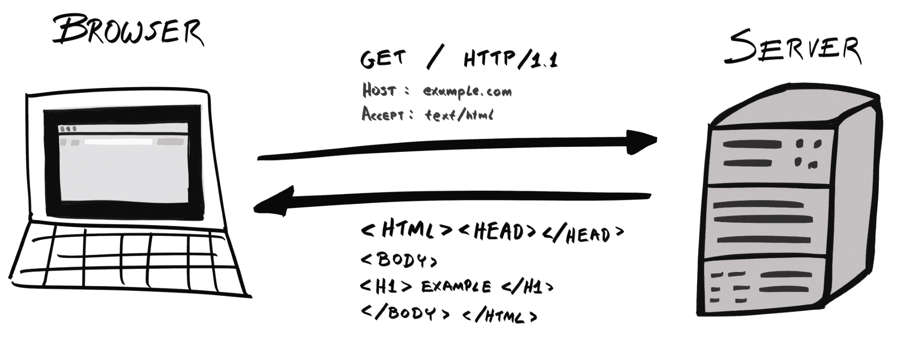
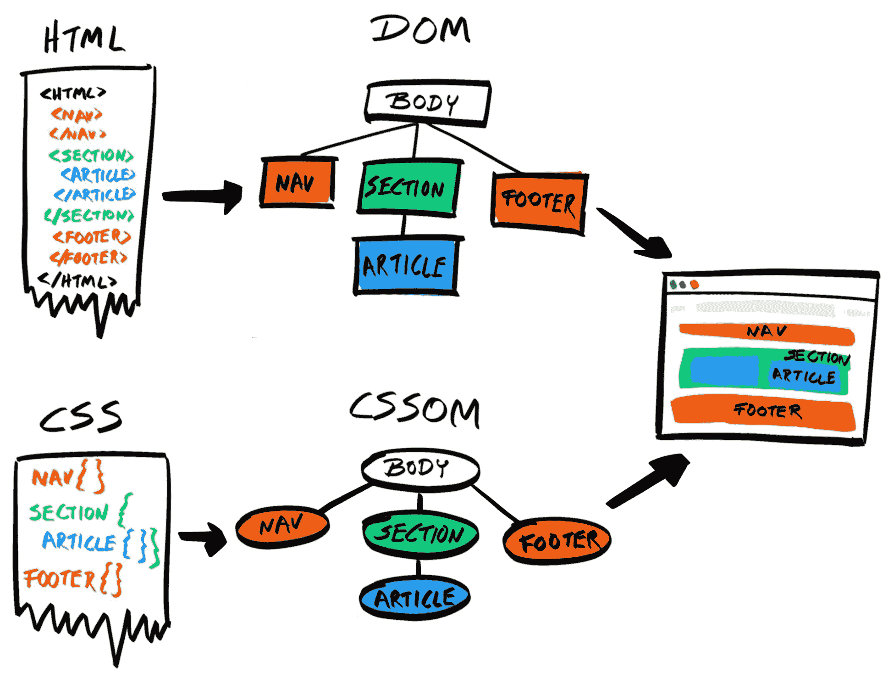
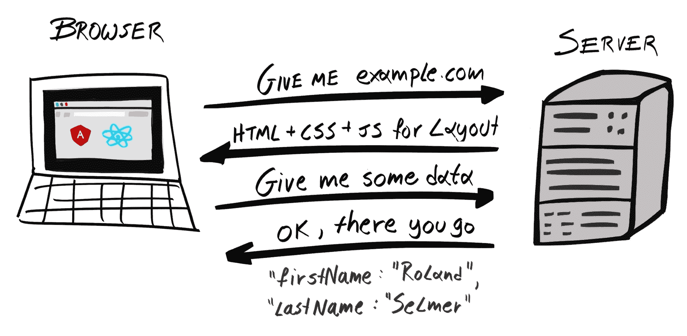

# JavaScript 的现状

JavaScript 一直未被传统地视为后端语言；那个领域属于 Java、Python、C/C++、C#/.NET、PHP、Ruby 等语言。JavaScript 只是一个允许网页开发者添加动画以改善其美学的“玩具语言”。但随着 **Node.js** 的出现，这一切都改变了。有了 Node.js，开发者现在可以编写在服务器端以及客户端执行的 JavaScript 代码。换句话说，开发者现在可以使用 *同一种语言* 编写前后端代码！

这提供了巨大的生产力优势，因为现在可以跨整个技术栈共享通用代码。此外，开发者可以避免在不同语言之间切换上下文，这通常会导致注意力分散并降低产出。

这也导致了 **同构** 或 **通用** JavaScript 框架（如 *Meteor*）的兴起。这类框架允许你完全使用 JavaScript 编写在客户端和服务器上运行的应用程序。

本章我们将涵盖以下内容：

+   检视网络应用程序的演变简史及其从 **客户端-服务器模型** 向 **单页应用程序 (SPAs**) 的转变

+   解释同构 JavaScript 的概念

+   探索在整个技术栈中使用 JavaScript 的好处

# 网络应用程序的演变

当你在浏览器中输入一个 URL，例如 `www.example.com`，实际上会发生什么？首先，浏览器会向 Example Corp 的服务器之一发送请求，该服务器检索请求的资源（例如，一个 HTML 文件），并将其发送回客户端：

浏览器随后解析 HTML，检索网页所依赖的所有文件，例如 CSS、JavaScript 和媒体文件，并将它们渲染到页面上。

浏览器消耗平面、一维文本（HTML、CSS），并在将其渲染到页面上之前将它们解析成树状结构（DOM、CSSOM）。

这种方案被称为 *客户端-服务器模型*。在这个模型中，大部分处理都在服务器端进行；客户端的角色仅限于简单的表面用途，例如渲染页面、动画菜单和图片轮播，以及提供基于事件的交互性。

这种模型在 1990 年代和 2000 年代非常流行，当时网络浏览器的功能并不强大。在客户端使用 JavaScript 创建整个应用程序是闻所未闻的，那些有这种需求的人求助于 Java 小程序和 Adobe Flash（以及在一定程度上，Microsoft Silverlight）。然而，随着时间的推移，个人设备（如台式电脑、笔记本电脑和智能手机）的计算能力大幅提升，这使得浏览器能够处理更复杂的操作。

# 实时 (JIT) 编译器

在 2008 年至 2009 年之间，Firefox 背后的公司 Mozilla，在 Firefox 3.x 的不同版本中缓慢引入了*TraceMonkey*，这是 JavaScript 的第一个**即时编译器（JIT**），从 3.1 版本开始。同样，Chrome 和 Safari 背后的*V8* JavaScript 引擎，以及为 Internet Explorer 和 Edge 提供动力的*Chakra*，也包含了 JIT 编译器。

传统上，JavaScript 引擎使用**解释器**，它将 JavaScript 源代码翻译成计算机可以运行的**机器代码**。JIT 编译器通过识别频繁运行的代码块，编译它们并将它们添加到缓存中，从而提高了引擎的性能。当同一代码块需要在以后的时间再次运行时，JavaScript 引擎可以简单地运行缓存的预编译机器代码，完全跳过解释器。不用说，这要快得多，JavaScript 引擎可以在单位时间内执行更多的操作，从而大大提高性能。

# 单页应用程序（SPAs）

由于这种性能的提升，开发者现在可以构建运行在浏览器上的功能丰富的 JavaScript 应用程序。谷歌是第一个利用这一优势的主要公司，他们在 2010 年 10 月 20 日发布了第一个**客户端 Web 应用程序框架**——*Angular*。从那时起，许多竞争对手相继出现，包括*Ember*、*React*和*Vue.js*，但 Angular 至今仍具有相关性。

Angular 是一个用于构建 SPAs 的框架。它不像将大部分处理委托给服务器，而是客户端承担了大部分责任。

以一个电子商务 Web 应用程序为例。在客户端-服务器模型中，当服务器收到客户端的请求时，它将组合一个完整的 HTML 并将其作为响应的有效负载附加。如果它需要从数据库中获取数据，它将查询数据库并将数据注入 HTML 模板以生成完整的 HTML。然后，客户端，通常是一个浏览器，被委托执行简单的任务，将 HTML 渲染到屏幕上。

在 SPA 模型中，服务器最初会将整个应用程序发送给客户端，包括任何 HTML、CSS 和 JavaScript 文件。所有应用程序逻辑，包括路由，现在都驻留在客户端。正因为如此，客户端可以非常快速地更新应用程序的用户界面，因为它不需要等待服务器的响应。每当客户端需要它没有的信息，例如数据库中的某些条目时，它将向服务器发送请求。然后服务器会以原始数据的形式响应，通常是 JSON 格式，不再发送其他内容。然后客户端的任务就是处理这些信息并适当地更新用户界面。在 SPAs 中，大部分逻辑都在客户端处理；服务器的任务仅仅是检索并发送数据：

与客户端-服务器模型相比，SPA 模型有许多优点：

+   它释放了服务器以处理更多请求，因为请求更容易处理。

+   这使得应用程序的 UI 能够更快地响应用户交互，因为 UI 不需要等待服务器响应才能更新自己。

现在，大多数 Web 应用程序都是使用 SPA 框架构建的。Tesla、Sony、Microsoft Support、Genius、Renault、Staples、Udemy 和 Healthcare.gov 都是使用 Angular 构建的网站；Airbnb、Asana、BBC、Dropbox、Facebook、Lyft、Netflix、PayPal 和 Uber 都在他们的网站上使用 React；尽管 Vue.js 相对较新，但一些主要亚洲公司已经采用了它，例如阿里巴巴、百度、腾讯、小米和 Line。

# 同构 JavaScript 应用

然而，任何事物都有其缺点，SPA 也不例外。SPA 最明显的缺点是需要传输更多的代码，这可能会增加页面的初始加载时间。为了克服这一缺陷，可以采用称为**服务器端渲染**（**SSR**）的技术。

使用 SSR（服务器端渲染），初始页面以与传统客户端-服务器模型相同的方式在服务器上处理和渲染。然而，返回的 HTML 包含一个标签，将在稍后时间请求下载应用程序的其余部分，在初始页面成功渲染之后。这使我们能够提高初始页面加载速度，同时保持所有 SPA（单页应用）的优点。此外，SSR 对于确保**搜索引擎优化**（**SEO**）性能也非常有用，因为它帮助网络爬虫快速解析页面应该如何显示，而无需下载所有资源。

SSR 可以与其他技术（如**代码拆分**和**树摇**）结合使用，以减小初始响应负载的大小，从而减少**首次渲染时间**（**TTFR**）并提高用户体验。

这就是当今 Web 应用程序的状态。新的 Web 标准，如**HTTP/2**和**WebAssembly**（又称*Wasm*），可能会在不久的将来改变我们构建 Web 应用程序的方法。在前端开发快速发展的世界中，这种 SPA + SSR 模型可能会很快被新的范式所取代。

# Node.js 的优点

JavaScript 是浏览器的语言。这一点无可否认。接下来，让我们探讨为什么开发者应该选择 Node.js 作为他们应用程序的后端语言。尽管有许多原因，但在这里我们将其归结为两个因素——**上下文切换**和**共享代码**。

# 上下文切换

上下文切换，或称*任务切换*，是指开发者同时处理多个项目或在不同的语言中工作，并需要定期在这之间切换。

“同时做多项任务，尤其是同时做多项复杂任务，会对生产力造成影响。”

– 多任务：切换成本（美国心理学会）

([`www.apa.org/research/action/multitask.aspx`](http://www.apa.org/research/action/multitask.aspx))

# 项目间的切换

编程是一项需要你同时记住许多变量的活动——变量名、不同模块的接口、应用程序结构等等。如果你切换到另一个项目，你将不得不丢弃当前项目的上下文并加载新项目的上下文。这种切换所需的时间会随着项目的复杂性而增加，并且因人而异，但可能从几分钟到几小时不等。这使得开发过程极其低效。

这就是为什么，你应该在开始另一个项目之前先完成一个项目，而不是同时处理多个任务。

# 语言间的切换

在不同编程语言之间切换时，同样适用这个原则。在项目间切换时，你需要在不同上下文之间切换；在语言间切换时，你需要在不同语法、数据结构和生态系统之间切换。为了说明，以下表格展示了 Python 和 JavaScript 之间的一些关键差异：

| **Python** | **JavaScript** |
| --- | --- |
| 有许多数据类型，包括 `None`，布尔型，`int`，`float`，`complex`，`list`，`tuple`，`range`，`str`，`bytes`，`bytearray`，`memoryview`，`set`，`frozenset`，`dict` 等等 | 有七个数据类型： `undefined`，`null`，布尔型，`number`，`string`，`symbol` 和 `object` |
| 语句通过缩进来分组 | 语句通过使用括号（`{}`）表示的块来分组 |
| 使用 [`virtualenv`](https://virtualenv.pypa.io/en/stable/) 来创建隔离环境 | 使用 **Node 版本管理器** ([`github.com/creationix/nvm`](https://github.com/creationix/nvm)) （**nvm**），`package.json` 和本地的 `node_modules` 目录来创建隔离环境 |
| 使用基于类的继承模型 | 使用基于原型的继承模型 |

除了语法上的差异，不同的语言可能还会遵循不同的范式——Elixir 是一种函数式语言，而 Java 是一种**面向对象**（**OO**）的**语言**。

因此，在不同语言之间进行上下文切换也会使开发过程非常低效。

# 商业视角

从商业角度来看，前端和后端使用不同的语言意味着他们需要雇佣两种不同类型的开发者：前端使用 JavaScript 开发者，后端可以使用 Python 开发者。如果后端任务有大量积压，前端开发者就无法提供帮助（除非他们也了解 Python）。这使得项目经理的资源分配更加困难。但如果每个人都使用 JavaScript 进行开发，那么这个问题就消失了。

此外，使用 JavaScript 整个栈可以使开发过程更加高效。除了避免上下文切换带来的效率提升外，现在单个开发者可以从头到尾开发一个完整的功能，因为他们可以编写前端和后端。

# 共享代码

随着 Node.js 和 SPAs 变得越来越受欢迎，每天都有越来越多的 JavaScript 库被编写。在撰写本文时，超过 775,000 个包列在[npmjs.com](http://npmjs.com)，这是 JavaScript 的*事实上的*包管理器。这些包括处理时间和日期的库（`moment.js`）、实用库（`lodash`），甚至深度学习库（`convnetjs`）。

**npm 包**最初仅意味着由服务器端 Node.js 安装和运行；然而，像**Browserify**和**Webpack**这样的工具允许我们将这些依赖项打包并发送到客户端。现在，许多 npm 包可以在前端和后端同时使用。

同样，通过在整个堆栈中使用 JavaScript，你可以封装通用逻辑并在两个环境中使用它。例如，身份验证检查应在服务器（出于安全原因）以及客户端（通过防止不必要的请求来确保性能）上执行。

如果 JavaScript 用于前端和后端代码，那么代码可以共享和重用。然而，如果我们使用 Python 作为后端，那么相同的逻辑必须在 JavaScript 中重复。这违反了**不要重复自己**（DRY）原则，并使我们的开发过程变得更慢且更容易出错。

项目也变得更加难以维护。现在，当我们需要修改代码时，我们必须在两种不同的语言中更新两次，可能是在两个不同的项目中；这两个项目可能还需要同时部署。

因此，在前端使用 JavaScript，在后端使用 Node.js，可以使你提高可维护性，减少兼容性问题，并节省人力和开发时间。

# 摘要

在本章中，我们描述了从使用客户端-服务器模型到单页应用（SPAs）的演变过程，以及 JavaScript 引擎的进步如何促进了这一转变。然后，我们讨论了在堆栈中使用 JavaScript 的好处，重点关注上下文切换和共享代码的话题。
