# 使用 Git 管理版本历史。

在本书中，从第四章“设置开发工具”开始，我们将构建一个非常简单的用户目录，我们随机命名为**hobnob**。我们需要一种方法来保存我们代码的版本历史，这样如果我们沿途犯了一些错误，我们可以简单地回滚到最后已知的好版本，并从这里重新开始。这被称为**版本控制**（**VC**）。

实现版本控制的最简单方法是将整个代码库复制到带日期的目录中；然而，这很繁琐，可能会占用大量磁盘空间。相反，我们可以使用一种**版本控制系统**（**VCS**）来为我们管理这些版本。我们只需指示 VCS 何时创建代码的快照，它就会保留该版本。

从 1972 年开始，出现了许多版本控制系统（VCS）的实现，最初是**源代码控制系统**（**SCCS**），后来被**修订控制系统**（**RCS**，于 1982 年发布）取代，然后是**并发版本系统**（**CVS**，于 1990 年发布），以及**Apache Subversion**（**SVN**，于 2000 年发布）。如今，我们主要使用**Git**（于 2005 年发布），这是一种称为**分布式版本控制系统**（**DVCS**）的 VCS。

Git 是由 Linux 内核的创造者林纳斯·托瓦兹（Linus Torvalds）创建的。它用于跟踪 Linux 内核的开发变化，以及目前在 GitHub 上数千万个仓库。在本章中，我们将指导您设置和配置 Git，并解释基本 Git 概念，例如：

+   Git 的不同状态。

+   基本的 Git 操作，如**暂存**、**提交**、**合并/变基**、**推送**和**拉取**。

+   使用 Vincent Driessen 提出的分支模型实现并行开发工作流程，通常称为**Git flow**。

+   设置**GitHub**账户以远程托管我们的代码。

+   理解与他人协作时的工作流程。

# 设置 Git。

首先，我们必须安装 Git。

大多数安装说明取决于您的硬件架构和操作系统。为我们所有这些列出说明是不切实际的。因此，对于本书，我们假设您正在 64 位机器上运行 Ubuntu 16.04/18.04，使用具有`sudo`权限的用户。

我们将在可能的情况下提供 URL 链接到文档，这样您就可以找到针对您机器的特定安装说明。然而，由于互联网的动态性，URL 地址会发生变化，页面可能会被移动。如果提供的链接看起来是无效的，只需使用搜索引擎搜索说明。

Git 可用于 macOS、Windows 和 Linux。您可以在[`git-scm.com/downloads`](https://git-scm.com/downloads)找到 Git 的下载说明。由于我们使用 Ubuntu，`git` 软件包将从我们的发行版的软件包管理器 **高级包装工具**（APT）提供。在安装 `git` 软件包之前，我们应该运行 `sudo apt update` 以确保 APT 可用的仓库列表是最新的：

```js
$ sudo apt update
$ sudo apt-get install git
```

Git 现在作为 `git` **命令行界面**（CLI）提供。

# 创建新的仓库

接下来，创建一个名为 `hobnob` 的目录来存放我们的项目。然后，进入该目录并运行 `git init`。这将允许 Git 开始跟踪我们项目的更改；由 Git 跟踪的项目也称为 **仓库**：

```js
$ mkdir -p ~/projects/hobnob
$ cd ~/projects/hobnob/
$ git init
Initialised empty Git repository in ~/projects/hobnob/.git/
```

随着我们介绍新的 Git 命令，我鼓励您阅读它们的完整文档，您可以在[`git-scm.com/docs`](https://git-scm.com/docs)找到。

运行 `git init` 创建一个 `.git` 目录，该目录包含关于项目所有版本控制相关的信息。当我们使用 CLI 与 Git 交互时，它所做的只是操作这个 `.git` 目录的内容。我们通常不需要关心 `.git` 目录的内容，因为我们可以通过 CLI 纯粹地与 Git 交互。

因为 Git 将所有文件都保存在 `.git` 目录下，删除 `.git` 目录将删除仓库，包括任何历史记录。

# 配置 Git

我们可以使用 `git config` 命令来配置 Git。此命令将代表我们操作 `.git/config` 文件。实际上，如果我们打印 `.git/config` 文件的内容，您会看到它与 `git config` 命令的输出类似：

```js
$ cd ~/projects/hobnob/
$ cat .git/config
[core]
 repositoryformatversion = 0
 filemode = true
 bare = false
 logallrefupdates = true

$ git config --list --local
core.repositoryformatversion=0
core.filemode=true
core.bare=false
core.logallrefupdates=true
```

您可以使用像 `tree` 这样的工具随意检查 `.git` 目录。首先，通过运行 `sudo apt install tree` 来安装 `tree`。然后，运行 `tree ~/projects/hobnob/.git`。

要配置 Git，我们首先需要了解存在三个配置范围或级别，每个级别都有一个相应的配置文件，存储在不同的位置：

+   **本地**：仅适用于当前仓库；配置文件存储在 `<repository-root>/.git/config`。

+   **全局**：适用于用户主目录下的所有仓库；配置文件存储在 `$HOME/.config/git/config` 和/或 `$HOME/.gitconfig`，后者仅在新版本的 Git 中可用。`$HOME/.gitconfig` 将覆盖 `$HOME/.config/git/config`。

+   **系统**：适用于您机器上的所有仓库；配置文件存储在 `/etc/gitconfig`。

本地配置设置将覆盖全局设置，而全局设置又覆盖系统设置。

# 配置用户

当我们要求 Git 对我们的代码进行快照（也称为 **提交**）时，Git 将记录一些信息，例如提交的时间作者。关于作者的信息被保存为 Git 配置，这样我们每次提交时就不必重新输入它们。

默认情况下，添加/更新配置将写入本地配置文件。然而，由于你将是唯一使用你机器上用户账户的人，因此最好在全局配置文件中设置用户设置：

```js
$ git config --global user.name "Daniel Li"
$ git config --global user.email "dan@danyll.com"
```

这将导致未来的提交默认被标识为`"Daniel Li"`，其电子邮件地址为`"dan@danyll.com"`。

如果你有一个 GitHub 账户（如果没有，我们稍后会创建一个），你应该为 Git 使用相同的电子邮件地址。当你推送提交时，GitHub 会自动将你的提交关联到你的账户。

我们现在已经成功设置了 Git 并配置了我们的用户。

在本章剩余部分，我们将使用虚拟文件来展示 Git 的工作原理以及我们将遵循的工作流程。本章剩余部分你所做的所有操作都应被视为一个教育练习，之后可以丢弃。在下一章的开始，我们将从头开始我们的项目，并使用本章学到的知识来保持代码库的历史有序！

# 学习基础知识

Git 的主要目的是保持更改的历史记录或版本。为了说明这一点，让我们创建一个简单的文件并将其提交到仓库的历史记录中。

# 提交到历史记录

首先，让我们通过运行`git log`来确认我们的仓库 Git 历史记录，它显示了过去提交的历史：

```js
$ git log
fatal: your current branch 'master' does not have any commits yet
```

错误信息正确地通知我们目前没有提交。现在，让我们创建一个简短的`README.md`文件，它代表我们想要提交的第一个更改：

```js
$ cd ~/projects/hobnob/
$ echo -e "# hobnob" >> README.md
```

我们已经创建了第一个文件，因此做出了第一个更改。现在我们可以运行`git status`，它将输出有关我们仓库当前状态的信息。我们应该看到 Git 已经抓取了我们的`README.md`文件：

```js
$ git status
On branch master
Initial commit
Untracked files: (use "git add <file>..." to include in what will be committed)
 README.md
nothing added to commit but untracked files present (use "git add" to track)
```

输出告诉我们我们位于默认的`master`分支（稍后关于分支的更多内容），这是我们**初始提交**——我们还没有将任何内容提交到仓库。然后它说我们有未跟踪的文件。要理解这意味着什么，我们必须了解文件在 Git 中可能处于的不同状态。

到目前为止，我们已经使用了`git log`和`git status`，但还有许多更多的 CLI 命令；要查看完整列表，请运行`git help`。要获取特定命令的详细信息，请运行`git help [command]`；例如，`git help status`。

# 理解 Git 中的文件状态

在 Git 中，每个文件都可以处于两种通用状态之一：**跟踪**和**未跟踪**。

初始时，所有文件都存在于**工作区**（也称为**工作树**或**工作目录**）中，并且处于**未跟踪**状态。这些未跟踪的文件不是仓库的一部分，Git 不会抓取对它们的更改。当我们运行`git status`时，Git 会看到我们的工作区中有未跟踪的文件（不属于仓库），并询问我们是否要将它们添加到仓库中。当我们使用`git add`和`git commit`将新文件提交到仓库时，它将从未跟踪状态转换为跟踪状态：

```js
$ git add README.md
$ git commit -m "Initial commit"
[master (root-commit) 6883f4e] Initial commit
 1 file changed, 1 insertion(+)
 create mode 100644 README.md
```

`README.md`现在是存储库的一部分，并且处于跟踪状态。

我们传递`"Initial commit"`作为注释来描述提交。每个提交都应该有一个伴随的消息来描述所做的更改。它应该是信息性和具体的；例如，`"Fixed rounding error bug in calculateScore"`比`"fixed bugs"`更好的提交信息。

然而，由于我们的提交除了初始化存储库之外几乎没有做其他事情，所以这个消息就足够了。

我们可以通过查看存储库的 Git 提交历史来确认这一点，使用`git log`命令：

```js
$ git log
commit 9caf6edcd5c7eab2b88f23770bec1bd73552fa4a (HEAD -> master)
Author: Daniel Li <dan@danyll.com>
Date: Fri Dec 8 12:29:10 2017 +0000
 Initial commit
```

# 跟踪的三个状态

更精确地说，跟踪状态可以进一步细分为三个子状态：**修改的**、**暂存的**和**已提交的**。我们的`README.md`文件处于已提交状态。

Git 会关注所有跟踪的文件；如果我们修改了其中任何一个（包括删除和重命名），它们的状态将从已提交变为修改的：

```js
$ echo "A very simple user directory API with recommendation engine" >> README.md
$ git status
On branch master
Changes not staged for commit:
  modified: README.md
```

当我们运行`git status`时，修改的文件以及任何未跟踪的文件都会被列出。修改的文件可以像未跟踪的文件一样提交：

```js
$ git add README.md
$ git commit -m "Update README.md"
[master 85434b6] Update README.md
 1 file changed, 1 insertion(+)
```

你可能想知道为什么我们运行`git commit`之前必须运行`git add`。`git add`将未跟踪或修改的文件放入称为**暂存区**的地方，这也被称为**索引**或**缓存**。当文件放入暂存区时，它处于暂存状态。当我们提交时，只有暂存区中的更改会被添加到存储库中；而留在工作区中的更改则不会被提交。

# 暂存我们的更改

通过拥有暂存区，我们可以`git add`多个相关的更改，并一次性将它们`git commit`——作为一个单独的提交。

在这里，暂存区充当一个临时环境，用于收集这些相关的更改。例如，如果我们向我们的应用程序添加一个新特性，我们也应该在`README.md`中记录这一点。这些更改相互关联，应该一起提交：

```js
$ echo "console.log('Hello World')" >> index.js
$ echo -e "# Usage\nRun \`node index.js\`" >> README.md
$ git add index.js README.md
$ git commit -m "Add main script and documentation"
[master cf3221a] Add main script and documentation
 2 files changed, 3 insertions(+)
 create mode 100644 index.js
```

# 快速回顾

让我们快速总结一下到目前为止我们已经学到的内容：

+   **工作区/工作目录**：当前在文件系统中的所有文件和目录

+   **索引/暂存区/缓存**：您想要提交的所有修改

+   **存储库**（`.git`目录）：存储所有已提交和跟踪的文件的历史记录

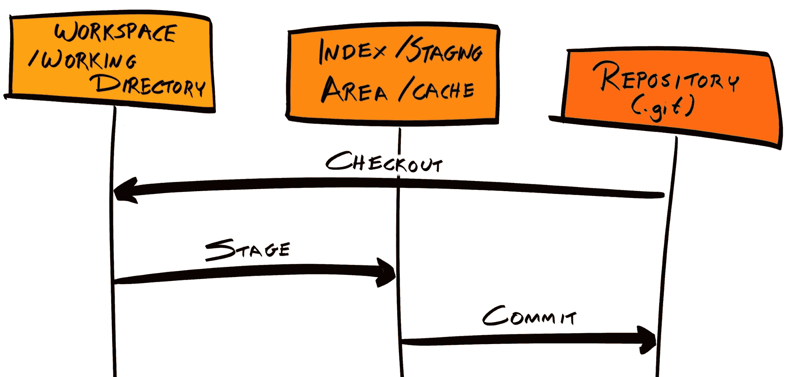

# 分支和合并

到目前为止，我们一直是按顺序将更改添加到存储库中，从而产生了一个具有线性结构的记录。但如果你或你的团队想要同时处理不同的特性/多个任务，会怎样呢？如果我们继续使用当前的流程，Git 提交历史将看起来是断开的：


在这里，我们有一些与错误修复相关的提交穿插在有关特性的提交之间。这不是理想的。Git **分支**是为了处理这个问题而创建的。

# Git 分支

正如我们简要提到的，默认分支被称为`master`，并且我们一直在这个分支上添加提交，直到现在。

现在，当我们开发一个新功能或修复特定错误时，我们不再直接将这些提交添加到`master`分支，而是可以从`master`分支的某个提交创建一个分支。对这些错误修复和/或功能分支的任何新提交都将单独在历史树中的另一个分支中分组，这不会影响`master`分支。如果和当修复或功能完成时，我们可以将这个分支合并回`master`。

最终结果是一样的，但现在 Git 历史记录要容易阅读和理解得多。此外，分支允许您在仓库的隔离部分编写和提交实验性代码，因此您的更改，可能会引入新的错误和回归，在经过测试和同行评审之前不会影响其他人。

# 分支模型

我们所描述的工作流程是一个**分支模型**的例子，这个术语只是描述了您如何构建分支的方式。正如您所想象的那样，存在许多分支模型，并且大多数都比我们概述的模型复杂。

对于这本书，我们将遵循 Vincent Driessen 在他的文章 *A successful Git branching* *mode**l* 中提出的分支模型，但您可以自由探索其他模型并使用对您有意义的模型。最重要的是，您和您的团队要始终如一地坚持这个模型，这样团队中的每个人都知道对他们有什么期望。

您可能已经听说过 Driessen 的模型被描述为 *Git Flow*，但 `gitflow` ([`github.com/nvie/gitflow`](https://github.com/nvie/gitflow)) 实际上是一组 Git 扩展，它提供了一套遵循 Driessen 模型的高级操作。

您可以在 Driessen 提出此模型的原始帖子中找到[`nvie.com/posts/a-successful-git-branching-model/`](http://nvie.com/posts/a-successful-git-branching-model/)。

# Driessen 模型

Driessen 提供了一个详细图解说明他的模型是如何工作的：

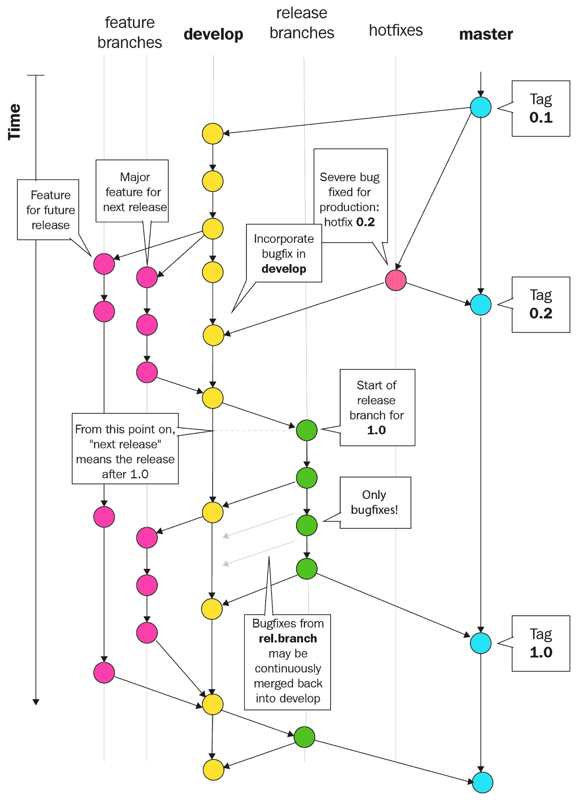

在 Driessen 的模型中，有两个永久分支：

+   `dev`（或`develop`，或`development`）：开发者工作的主要分支。

+   `master`：只有经过测试和利益相关者批准的生产就绪代码可以提交到这个分支。这里的“生产就绪”意味着代码已经过测试并获得批准。

此外，还有一些非永久分支：

+   **功能分支**：从`dev`分支进行分支，功能分支用于开发新功能或修复非关键错误。功能分支最终将被合并回`dev`分支。

+   **发布分支**：一旦足够的功能或错误修复已实现并合并到 `dev` 分支，就可以从 `dev` 分支创建发布分支，在发布之前进行更多审查。例如，可以将应用程序部署到预发布服务器进行 UI 和手动测试。在此过程中发现的任何错误都会被修复并直接提交到发布分支。一旦发布分支“无错误”，就可以将其合并到 `master` 分支并发布到生产环境中。这些修复也应该合并回 `dev` 分支和任何其他发布分支。

+   **热修复（或补丁）分支**：热修复是生产中必须尽快修复的问题（不一定是错误），在下一个计划发布之前必须解决。在这种情况下，开发者会从 `master` 分支创建一个分支，进行必要的更改，然后直接合并回 `master`。这些热修复分支也应该合并回 `dev` 分支和任何其他发布分支。

# 创建开发分支

要实现 Driessen 模型，我们首先必须从主分支创建 `dev` 分支。要检查我们当前所在的分支，我们可以运行 `git branch --list` 或简单地运行 `git branch`：

```js
$ git branch
* master
```

这将返回所有分支的列表，当前活动分支旁边有一个星号（`*`），当前是 `master`。要从一个当前分支创建新的 `dev` 分支，我们可以运行 `git branch dev`。

然而，我们将运行 `git checkout -b dev master`，这会创建一个新的分支并将其同时设置为活动分支：

```js
$ git checkout -b dev master
Switched to a new branch 'dev'
$ git branch
* dev
 master
```

# 创建功能分支

任何新功能都应该从 `dev` 分支分支开发。确保将功能分支命名为清楚地表明正在工作的功能。例如，如果您正在处理社交登录功能，请将您的分支命名为 `social-login`：

```js
$ git branch
* dev
 master
$ git checkout -b social-login dev
Switched to a new branch 'social-login'
```

如果该功能有子功能，您可以从主功能分支创建子分支。例如，`social-login` 分支可能包括 `facebook-login` 和 `twitter-login` 子分支。

# 子分支命名

命名这些子分支有多种有效的方法，但最流行的约定使用 **分组令牌**，以及各种 **分隔符**。例如，我们的 Facebook 和 Twitter 登录子分支可以分组在 `social-login` 分组令牌下，使用点（`.`）作为分隔符，以及一个 **子令牌**，如 `facebook` 或 `twitter`：

```js
$ git checkout -b social-login.facebook social-login
Switched to a new branch 'social-login.facebook'
$ git branch
 dev
 master
 social-login
* social-login.facebook
```

您可以使用几乎任何东西作为分隔符；逗号（`,`）、井号（`#`）和大于号（`>`）都是有效的分隔符。然而，文档的 `git-check-ref-format` 部分中概述了几个规则，给出了有效的引用名称。例如，以下字符不可用：空格、波浪号（`~`）、 caret（`^`）、冒号（`:`）、问号（`?`）、星号（`*`）和开方括号（`[`）。

想要查看所有规则，请访问 `git-check-ref-format` 的文档，网址为 [`git-scm.com/docs/git-check-ref-format`](https://git-scm.com/docs/git-check-ref-format)。

我遇到的大多数约定都使用正斜杠 (`/`) 作为分隔符，所以我们在这里也这样做。然而，这会带来一个问题，因为分支存储在 `.git/refs/heads` 下的文本文件中。如果我们创建一个名为 `social-login/facebook` 的子分支，那么它需要创建在 `.git/refs/heads/social-login/facebook`，但在我们这个例子中这是不可能的，因为 `social-login` 名称已经被用作文件名，因此不能同时作为目录：

```js
$ git checkout -b social-login/facebook social-login
fatal: cannot lock ref 'refs/heads/social-login/facebook': 'refs/heads/social-login' exists; cannot create 'refs/heads/social-login/facebook'
```

因此，当我们创建一个新的功能分支时，我们需要提供一个 *默认* 子令牌，例如 `main`。考虑到这一点，让我们删除我们当前的特性分支，并使用 `main` 子令牌重新创建它们：

```js
$ git checkout dev
$ git branch -D social-login social-login.facebook
$ git checkout -b social-login/main dev
$ git branch
 dev
 master
* social-login/main
```

我们现在位于 `social-login/main` 特性分支上，可以开始开发我们的社交登录功能。

我们实际上不会编写任何代码；我们只是将文本添加到文件中，以模拟新功能的添加。这使我们能够专注于 Git，而不会被实现细节所困扰。

首先，让我们创建该文件并将其提交到 `social-login/main` 分支：

```js
$ touch social-login.txt
$ git add -A && git commit -m "Add a blank social-login file"
```

我们在这里使用 `git add -A` 来将所有更改添加到暂存区。

现在，我们将创建一个子特性分支并开发我们的 Facebook 登录功能：

```js
$ git checkout -b social-login/facebook social-login/main
$ echo "facebook" >> social-login.txt
$ git add -A && git commit -m "Implement Facebook login"
```

现在，为 Twitter 登录功能做同样的事情，确保从主功能分支进行分支：

```js
$ git checkout -b social-login/twitter social-login/main
$ echo "twitter" >> social-login.txt
$ git add -A && git commit -m "Implement Twitter login"
```

现在我们有两个子特性分支，一个主特性分支，一个 `dev` 分支，以及我们的原始 `master` 分支：

```js
$ git branch
 dev
 master
 social-login/facebook
 social-login/main
* social-login/twitter
```

即使你是在独立工作，创建分支也是有用的，因为它可以帮助你组织代码，并能快速地在不同的特性之间切换。

还要注意，没有“正确”的方式来命名分支，只有错误的方式。例如，你可能会选择为你的分支使用额外的分组，例如 `feature/social-login/facebook`。如果你使用像 JIRA 这样的问题跟踪工具，你也可能希望将问题 ID 添加到分支中，例如 `fix/HB-593/wrong-status-code`。重要的是要选择一个灵活的方案，并保持一致性。

# 合并分支

我们已经在两个单独的特性子分支上开发了 Facebook 和 Twitter 登录功能；我们如何将这些更改放回 `master` 分支上？按照 Driessen 模型，我们必须将两个子特性分支合并到主特性分支上，然后将特性分支合并到 `dev` 分支上，最后从 `dev` 分支创建一个发布分支并将其合并到 `master` 分支上。

要开始，让我们使用 `git merge` 将 `social-login/facebook` 分支合并到 `social-login/main` 分支：

```js
$ git checkout social-login/main
$ git merge social-login/facebook
Updating 8d9f102..09bc8ac
Fast-forward
 social-login.txt | 1 +
 1 file changed, 1 insertion(+)
```

Git 将尝试自动将 `social-login/facebook` 分支的更改合并到 `social-login/main` 分支。现在，我们的分支结构看起来是这样的：

```js
$ git log --graph --oneline --decorate --all
* 9204a6b (social-login/twitter) Implement Twitter login
| * 09bc8ac (HEAD -> social-login/main, social-login/facebook) Implement Facebook login
|/ 
* 8d9f102 Add a blank social-login file
* cf3221a (master, dev) Add main script and documentation
* 85434b6 Update README.md
* 6883f4e Initial commit
```

接下来，我们需要为我们的 Twitter 登录子功能做同样的事情。然而，当我们尝试合并时，由于**合并冲突**而失败：

```js
$ git checkout social-login/main
$ git merge social-login/twitter
Auto-merging social-login.txt
CONFLICT (content): Merge conflict in social-login.txt
Automatic merge failed; fix conflicts and then commit the result.
```

当两个正在合并的分支的更改重叠时，会发生合并冲突；Git 不知道哪个版本是最合适的版本来继续前进，因此它不会自动合并它们。相反，它在发生合并冲突的文件中添加特殊的 Git 标记，并期望你手动解决它们：

```js
<<<<<<< HEAD
facebook
=======
twitter
>>>>>>> social-login/twitter
```

`<<<<<<< HEAD`和`=======`之间的部分是我们当前分支的版本，即`social-login/main`；`=======`和`>>>>>>> social-login/twitter`之间的部分是`social-login/twitter`分支的版本。

在合并完成之前，我们必须解决这个合并冲突。为此，我们只需编辑文件到我们想要的版本，并移除 Git 特定的序列。在我们的例子中，我们想在`facebook`之后添加`twitter`的文本，因此我们会编辑文件使其变为以下内容：

```js
facebook
twitter
```

现在冲突已解决，我们需要通过将`social-login.txt`添加到暂存区域并提交来完成合并：

```js
$ git status
On branch social-login/main
You have unmerged paths.
Unmerged paths:
 both modified: social-login.txt

$ git add -A && git commit -m "Resolve merge conflict"
[social-login/main 8a635ca] Resolve merge conflict
```

现在，如果我们再次查看我们的 Git 历史，我们可以看到我们已经实现了 Facebook 和 Twitter 登录功能，并在两个单独的分支上实现了它们，然后在一个单独的提交（带有哈希`37eb1b9`）中合并了它们：

```js
$ git log --graph --oneline --decorate --all
* 37eb1b9 (HEAD -> social-login/main) Resolve merge conflict
|\ 
| * 9204a6b (social-login/twitter) Implement Twitter login
* | 09bc8ac (social-login/facebook) Implement Facebook login
|/ 
* 8d9f102 Add a blank social-login file
* cf3221a (master, dev) Add main script and documentation
* 85434b6 Update README.md
* 6883f4e Initial commit
```

# 检查更实际的例子

我们之前讨论的例子非常简单，有点人为。在一个更现实的开发环境中，`dev`分支将会非常活跃：会有许多从`dev`分支衍生出来的功能/错误修复分支，最终合并回它。为了说明这可能会引起的问题，并展示如何缓解这些问题，我们将回到`dev`分支来创建另一个功能分支；让我们称它为`user-schema/main`：

```js
$ git checkout -b user-schema/main dev
Switched to a new branch 'user-schema/main'
```

现在，让我们添加一个文件，`user-schema.js`，它代表了我们用户模式功能的全部：

```js
$ touch user-schema.js
$ git add -A && git commit -m "Add User Schema"
[user-schema/main 8a31446] Add User Schema
 1 file changed, 0 insertions(+), 0 deletions(-)
 create mode 100644 user-schema.js
```

现在，我们可以将这个功能分支合并回`dev`：

```js
$ git checkout dev
Switched to branch 'dev'
$ git merge user-schema/main 
Updating cf3221a..8a31446
Fast-forward
 user-schema.js | 0
 1 file changed, 0 insertions(+), 0 deletions(-)
 create mode 100644 user-schema.js
```

我们现在的 Git 历史树看起来是这样的：

```js
$ git log --graph --oneline --decorate --all
* 8a31446 (HEAD -> dev, user-schema/main) Add User Schema
| * 37eb1b9 (social-login/main) Resolve merge conflict
| |\ 
| | * 9204a6b (social-login/twitter) Implement Twitter login
| * | 09bc8ac (social-login/facebook) Implement Facebook login
| |/ 
| * 8d9f102 Add a blank social-login file
|/ 
* cf3221a (master) Add main script and documentation
* 85434b6 Update README.md
* 6883f4e Initial commit
```

如果你发现可视化历史很难，尝试使用一个为你可视化分支的 Git 客户端。对于 Mac 和 Windows，有一个由 Atlassian 提供的免费客户端，名为 Sourcetree。如果你使用 Linux，你可能想尝试 GitKraken。我们将从现在开始使用 GitKraken 来展示 Git 分支结构。例如，前面的图在 GitKraken 上看起来是这样的：

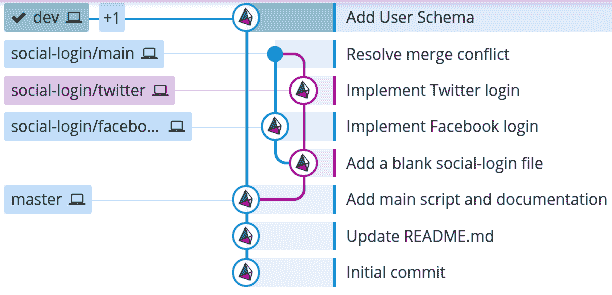

现在，我们可以将我们的`social-login/main`分支合并回`dev`，这将产生以下分支结构：

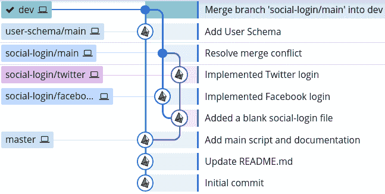

然而，我们不应该这样做，因为：

+   **破坏性更改**：社交登录功能的实现可能取决于用户的模式具有特定的形状。因此，盲目合并`social-login/main`分支可能会导致平台崩溃。`dev`分支是其他人将开发新功能的地方，因此它应该始终保持无错误。

+   **复杂的 Git 历史**：历史树已经很难阅读，而我们只实现了两个功能！

# 保持 dev 分支无错误

第一个问题可以通过将`dev`分支合并到`social-login/main`，测试一切是否正常工作，然后将其合并回`dev`来解决：

```js
$ git checkout social-login/main
$ git merge dev
$ git checkout dev
$ git merge social-login/main
```

这样，由于分支不兼容而产生的任何错误将保留在功能分支上，而不是在`dev`分支上。这给了我们在将它们合并回`dev`之前修复这些错误的机会。

虽然这解决了一个问题，但它加剧了另一个问题。我们的 Git 历史现在看起来是这样的：

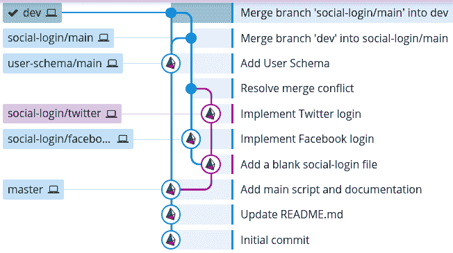

对于子功能分支来说，首先合并主分支并不那么重要，因为功能分支并不总是期望没有错误。我会让负责功能分支的开发者决定他们如何想要在他们的功能分支上工作。

# 保持我们的历史清洁

我们 Git 历史看起来如此复杂的原因是`git merge`为合并创建了一个单独的提交。这是好的，因为它不会改变任何分支的历史；换句话说，它是非破坏性的：

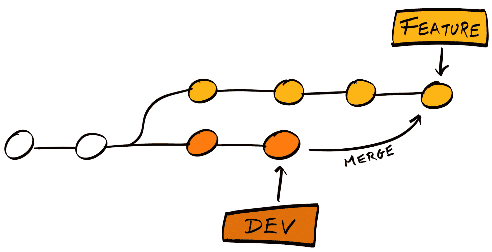

为了防止我们这里复杂的分支树，Git 提供了一个替代命令`rebase`，它允许我们合并更改，同时保持我们的历史清洁。

# 使用 git rebase 保持我们的历史清洁

使用`git rebase`，而不是为合并创建一个新的提交，它将尝试将更改放置在功能分支上，就像它们是在主分支上的最后一个提交之后直接做出的：

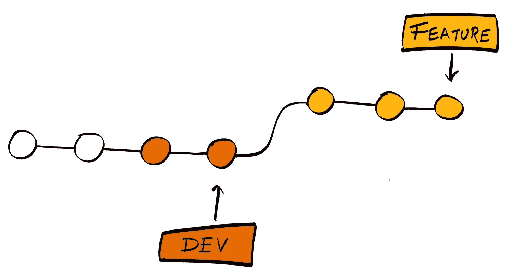

要了解我们如何使用`rebase`，让我们重复到目前为止所做的一切，但使用`rebase`而不是`merge`。创建一个新的目录，然后在终端中打开，然后复制并粘贴以下命令（这些命令将复制我们到目前为止所做的一切）：

```js
git init &&
echo -e "# hobnob" >> README.md &&
git add README.md && git commit -m "Initial commit" &&
echo "A very simple user directory API with recommendation engine" >> README.md &&
git add README.md && git commit -m "Update README.md" &&
echo "console.log('Hello World')" >> index.js &&
echo -e "# Usage\nRun \`node index.js\`" >> README.md &&
git add -A && git commit -m "Add main script and documentation" &&
git checkout -b dev master &&
git checkout -b social-login/main dev &&
touch social-login.txt &&
git add -A && git commit -m "Add a blank social-login file" &&
git checkout -b social-login/facebook social-login/main &&
echo "facebook" >> social-login.txt &&
git add -A && git commit -m "Implement Facebook login" &&
git checkout -b social-login/twitter social-login/main &&
echo "twitter" >> social-login.txt &&
git add -A && git commit -m "Implement Twitter login" &&
git checkout -b user-schema/main dev &&
touch user-schema.js &&
git add -A && git commit -m "Add User Schema" &&
git checkout dev &&
git merge user-schema/main
```

我们的 Git 历史树现在看起来是这样的：

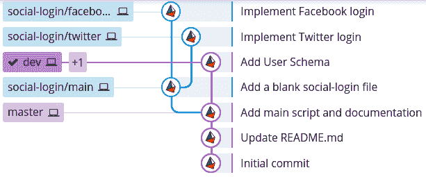

首先，我们可以将`social-login/facebook`合并到`social-login/main`。由于自分支创建以来`social-login/main`上没有进行任何更改，因此使用`git merge`或`git rebase`没有区别：

```js
$ git checkout social-login/main
$ git merge social-login/facebook
```

在我们的合并之后，`social-login/main`分支上现在有一个更改，因为`social-login/twitter`是从它分支出来的：

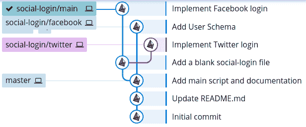

这就是`rebase`有用的地方：

```js
$ git checkout social-login/twitter
$ git rebase social-login/main
...
Auto-merging social-login.txt
CONFLICT (content): Merge conflict in social-login.txt
error: Failed to merge in the changes.
Patch failed at 0001 Implement Twitter login
The copy of the patch that failed is found in: .git/rebase-apply/patch
```

仍然可能会出现合并冲突，你应该像以前一样解决它。但这次，使用`git rebase --continue`而不是`git commit`：

```js
# Resolve merge conflict before continuing #

$ git add -A
$ git rebase --continue
Applying: Implement Twitter login
```

不同之处在于，这次，社交登录功能的`git`历史是线性的，就像`social-login/twitter`分支上的更改是在`social-login/main`分支上的更改之后直接进行的：

```js
$ git log --graph --oneline --decorate --all
* da47828 (HEAD -> social-login/twitter) Implement Twitter login
* e6104cb (social-login/main, social-login/facebook) Implement Facebook login
* c864ea4 Add a blank social-login file
| * 8f91c9d (user-schema/main, dev) Add User Schema
|/ 
* d128cc6 (master) Add main script and documentation
* 7b78b0c Update README.md
* d9056a3 Initial commit
```

接下来，我们需要将`social-login/main`分支快进到跟随`social-login/twitter`分支：

```js
$ git checkout social-login/main
$ git merge social-login/twitter
```

这应该会产生一个更加干净的分支结构：

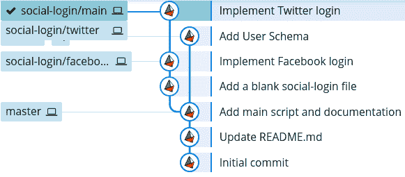

最后，我们可以将`social-login/main`分支重置到`dev`分支上：

```js
$ git checkout social-login/main
$ git rebase dev
```

现在，我们在`social-login/main`分支上有一个完全线性的提交历史，尽管它们都源自不同的分支：

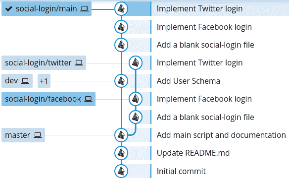

最后一步是将`dev`分支转发到`social-login/main`分支所在的位置：

```js
$ git checkout dev
$ git merge social-login/main
```

# 使用合并和重置结合

我可能给人留下了这样的印象，即`git rebase`比`git merge`更干净，因此更好。事实并非如此；每种方法都有其优缺点。

`git rebase`通过尝试在主分支的末尾复制子分支的更改来重写或更改存储库的现有历史。这使得历史看起来更干净、更线性，但失去了更改集成的时间和地点的上下文——我们失去了`social-login/twitter`最初是从`social-login/main`分支分叉出来的信息。

因此，我建议对于功能/错误修复分支使用`git rebase`。这允许你频繁地提交小的更改，进行**工作进度（WIP）提交**，而不必过于关心整洁性。在功能完成之后，你可以使用`git rebase`清理你的提交历史，然后再合并到永久分支中。

另一方面，当将功能分支的更改集成到`dev`分支中，或者从`dev`分支集成到`master`分支时，使用`git merge`，因为它提供了关于这些功能何时何地被添加的上下文。此外，我们应该在`git merge`中添加`--no-ff`标志，这确保合并将**始终**创建一个新的提交，即使可能进行快速前进。

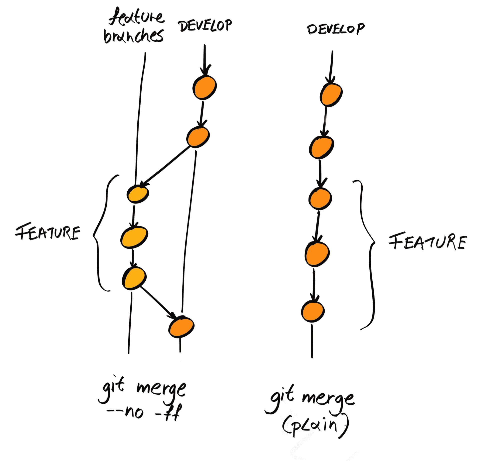

通过结合使用`git merge`和`git rebase`，可以得到一个很好的 Git 历史：

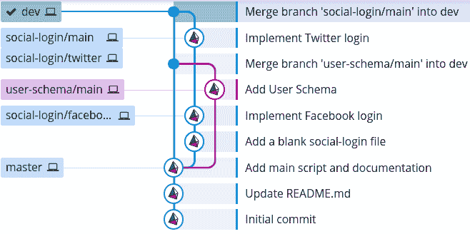

我们甚至可以删除一些分支，使历史更加干净：

```js
$ git branch -D social-login/facebook social-login/twitter
```

分支结构现在更容易理解：

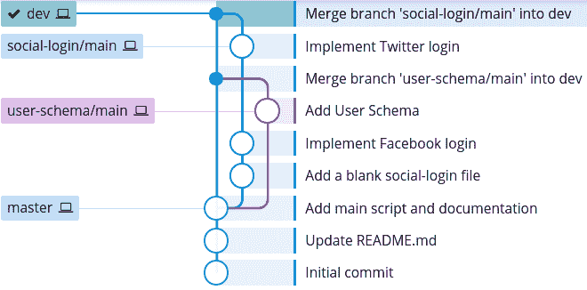

# 发布代码

现在我们有一块相当大的功能块可以发布。我们应该从`dev`分支创建一个发布分支。这个发布分支应该以发布版本命名，前面加上`release/`前缀，例如`release/0.1.0`。要发布的代码应部署到预发布服务器上，在那里应进行自动化的 UI 测试、手动测试和验收测试（稍后详细介绍）。任何错误修复都应提交到发布分支并合并回`dev`分支。当发布分支准备就绪后，它可以合并到`master`分支。

除了错误修复和热修复之外，不应在发布分支中添加新功能。任何新功能、非关键错误修复或与发布无关的错误修复都应提交到错误修复分支。

因此，第一个问题是我们的发布如何命名/版本化？对于这个项目，我们将使用**语义版本化**，或**semver**。

# 语义版本化

在 semver 中，所有内容都使用三个数字进行版本控制，`MAJOR.MINOR.PATCH`，起始版本为`0.1.0`，按照以下方式递增：

+   **补丁版本更新**：在向后兼容的热修复之后

+   **小版本更新**：在实现了一组向后兼容的功能/错误修复之后

+   **主版本更新**：在向后不兼容的更改之后

我们将为我们的发布遵循语义版本化。

与命名功能分支一样，发布分支的命名也没有“正确”的方式。例如，你可以在发布版本后加上对本次发布包含内容的简要描述，如`release/0.1.0-social-login`或`release/0.1.0__social-login`。再次强调，最重要的是制定一个规则并保持一致性。

# 创建发布分支

现在，让我们创建我们的发布分支并将其命名为`release/0.1.0`：

```js
$ git checkout dev
$ git checkout -b release/0.1.0
```

如果这是一个真实场景，我们会将分支部署到预发布服务器上进行更彻底的测试。现在，让我们假设我们找到了一个错误：`social-login.txt`中`facebook`和`twitter`的文本应该大写为`Facebook`和`Twitter`。所以，让我们修复这个错误并直接在发布分支上提交：

```js
$ git checkout release/0.1.0
$ echo -e "Facebook\nTwitter" > social-login.txt
$ git add -A && git commit -m "Fix typo in social-login.txt"
```

现在，我们将再次测试修改后的代码，假设没有发现更多错误，我们可以将其合并到`master`分支：

```js
$ git checkout master
Switched to branch 'master'
$ git merge --no-ff release/0.1.0
```

当我们合并时，它会要求我们输入提交信息；我们可以直接使用默认信息，`Merge branch 'release/0.1.0'`：

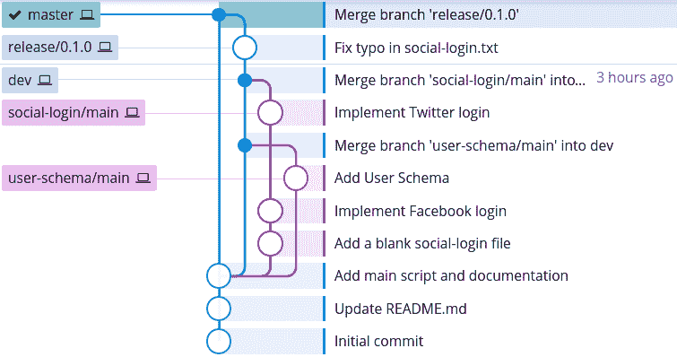

最后，我们应该记得将发布分支上所做的错误修复应用到`dev`分支；如果我们有任何其他活动的发布分支，我们也应该将其应用到这些分支上：

```js
$ git checkout dev
$ git merge --no-ff release/0.1.0
```

我们最终得到的 Git 分支结构类似于以下这样：

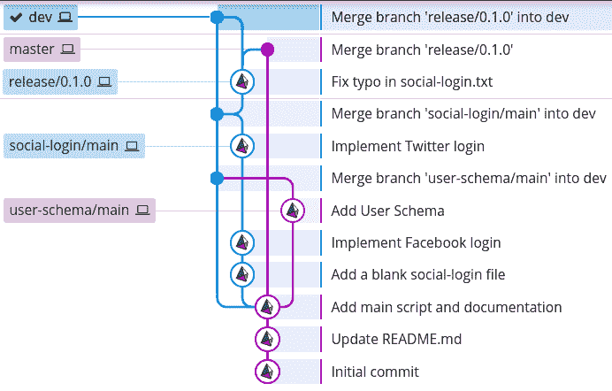

# 标记发布

最后，我们应该标记我们的发布。在 Git 中，**标签**是标记某些提交历史点为重要的标记。发布很重要，因此惯例是在`master`分支上表示发布为标签。

有两种类型的标签：**轻量级**和**注解**标签。轻量级标签只是指向特定提交的指针。另一方面，注解标签是 Git 数据库中的完整对象，类似于提交。注解标签包含有关标记者、日期和可选消息的信息。我们应该使用注解标签来标记发布。

Git 手册（当你运行 `git tag --help` 时可访问）指出：“*注解标签旨在用于发布，而轻量级标签旨在用于私有或临时对象标签。”

检出 `master` 分支，并运行带有 `-a` 标志的 `git tag` 命令来添加一个注解标签。标签的名称应该是 semver 版本，你还应该添加一个描述发布的消息：

```js
$ git checkout master
$ git tag -a 0.1.0 -m "Implement social login. Update user schema."
$ git show 0.1.0
tag 0.1.0
Tagger: Daniel Li <dan@danyll.com>
Date: Fri Dec 8 21:11:20 2017 +0000
Implement social login. Update user schema.

commit 6a415c24ea6332ea3af9c99b09ed03ee7cac36f4 (HEAD -> master, tag: 0.1.0)
Merge: b54c9de 62020b2
Author: Daniel Li <dan@danyll.com>
Date: Fri Dec 8 18:55:17 2017 +0000
 Merge branch 'release/0.1.0'
```

# 热修复

我们需要覆盖的最后一个关于 Git 工作流程的内容是如何处理在生产环境中（在我们的 `master` 分支上）发现的错误。尽管我们的代码在添加到 `master` 之前应该已经经过了彻底的测试，但细微的错误难免会漏网，我们必须迅速修复它们。这被称为**热修复**。

在热修复分支上工作与在发布分支上工作非常相似；唯一的区别是我们是从 `master` 而不是 `dev` 分支进行分支。就像发布分支一样，我们会进行更改，测试，将更改部署到预发布环境中，并进行更多测试，然后再将其合并回 `master`，`dev` 和任何当前发布分支：

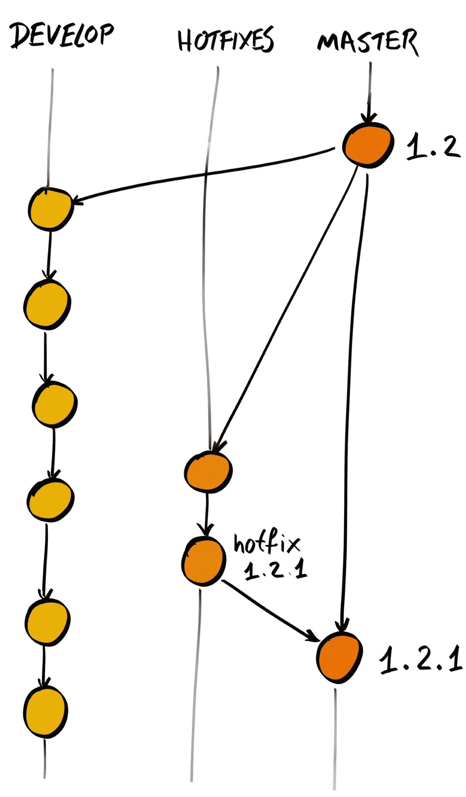

因此，首先我们进行修复：

```js
$ git checkout -b hotfix/user-schema-incompat master
$ touch user-schema-patch.txt # Dummy hotfix
$ git add -A
$ git commit -m "Patch user schema incompatibility with social login"
```

然后，我们将其合并到 `master`：

```js
$ git checkout master
$ git merge --no-ff hotfix/user-schema-incompat
```

由于我们在 `master` 上添加了新内容，它本质上成为了一个新的发布版本，因此我们需要增加版本号并标记这个新的提交。由于这是一个错误修复，并没有向平台添加新功能，我们应该将补丁版本增加到 `0.1.1`：

```js
$ git tag -a 0.1.1 -m "Patch user schema incompatibility with social login"
```

最后，别忘了将热修复更改合并回 `dev` 分支，如果相关的话，还可以合并到其他发布分支：

```js
$ git checkout dev
$ git merge --no-ff hotfix/user-schema-incompat
```

我们的 Git 历史树现在看起来像这样：

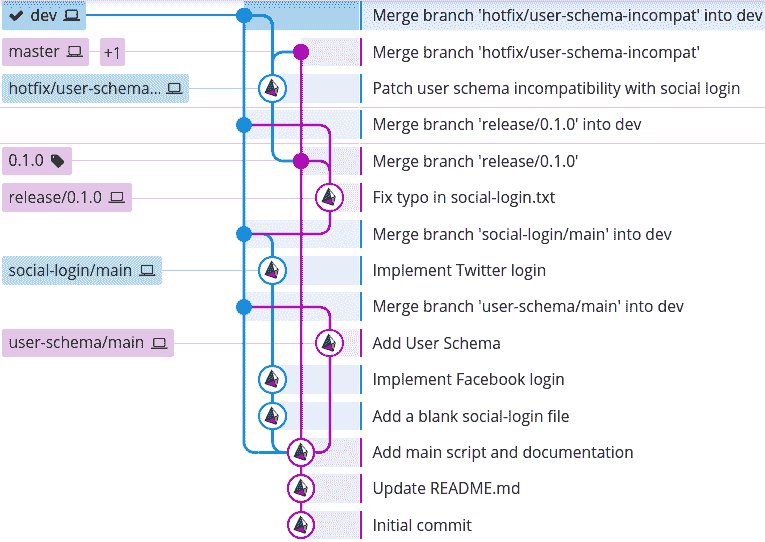

你可以清楚地区分两个永久分支，`master` 和 `dev`，因为似乎所有事情都围绕着它们。然而，也很清楚，添加热修复会使 Git 历史比以前更复杂，因此只有在绝对必要时才应进行热修复。

# 与他人协作

到目前为止，我们已经概述了在独自开发时如何管理我们的 Git 仓库；然而，更常见的情况是，你将作为团队的一部分工作。在这些情况下，你的团队必须以一种方式工作，使得你的同事能够获取你已完成的所有更新，同时也能更新他们自己的更改。

幸运的是，Git 是一个**分布式**版本控制系统，这意味着任何本地仓库都可以作为其他人的远程仓库。这意味着你的同事可以将你的更改拉到他们的机器上，你也可以将他们的更改拉到你的机器上：

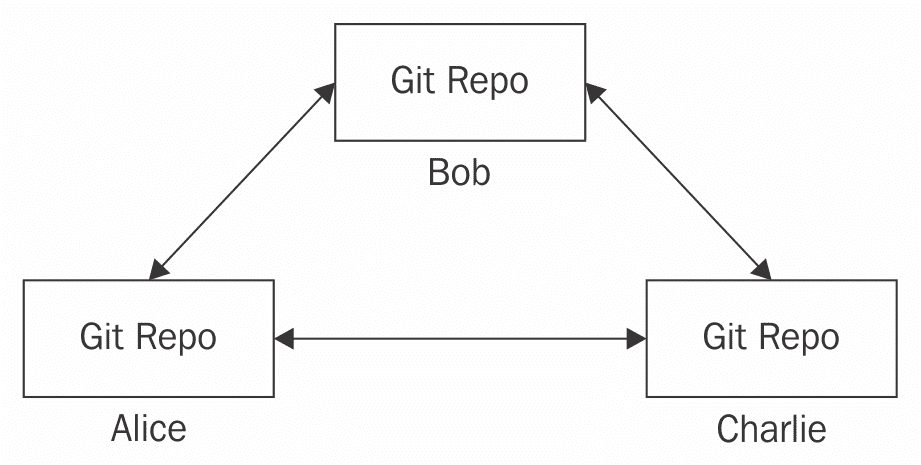

然而，这意味着您需要定期从每个人的机器上拉取，以获取所有最新的更改。此外，当存在合并冲突时，一个人可能以不同的方式解决它们。

因此，虽然从技术上讲可以遵循这个分布式工作流程，但大多数团队会选择一个他们认为的中央仓库。

按照惯例，这个远程仓库被称为`origin`：

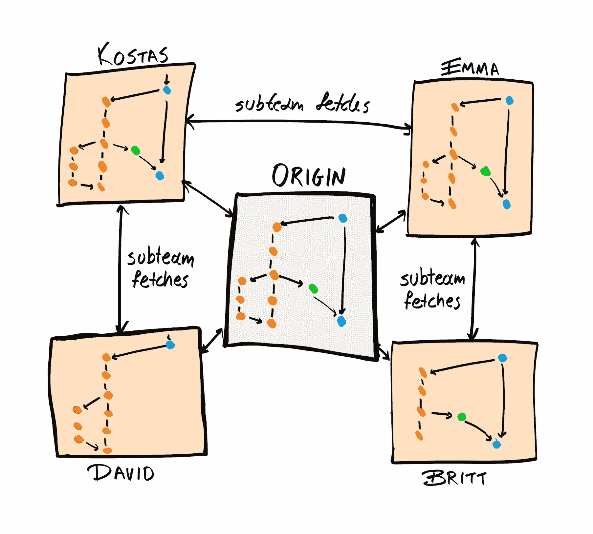

当您想将同事所做的更改更新到您的本地仓库时，您从`origin`仓库中*拉取*。当您认为更改已经准备好可以合并时，您将它们推送到`origin`。

# 创建远程仓库

存储远程仓库有许多方式。您可以设置自己的服务器，或者可以使用像 Bitbucket 或 GitHub 这样的托管服务。我们将使用 GitHub，因为它是最受欢迎的，并且公共仓库免费。

如果您想保持您的仓库私有，您可以选择从 GitHub 购买个人计划，目前每月价格为 7 美元；或者您可以使用 Bitbucket，它对公共和私有仓库都是免费的（尽管适用其他限制）。

1.  前往[`github.com/`](https://github.com/)并点击“注册”按钮

1.  填写您的详细信息以创建账户

1.  登录后，点击“新建仓库”按钮或前往[`github.com/new`](https://github.com/new)

1.  填写有关仓库的详细信息，但不要勾选“使用 README 初始化此仓库”或添加许可证：

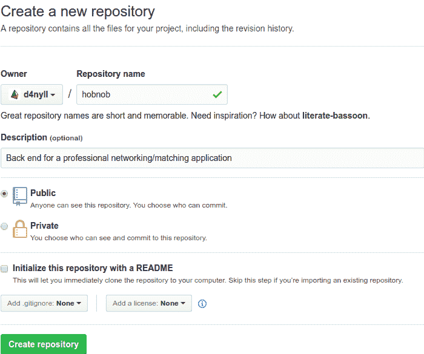

1.  在您点击创建仓库后，GitHub 应该会显示一个快速设置提示。这表明我们已经成功创建了我们的仓库：

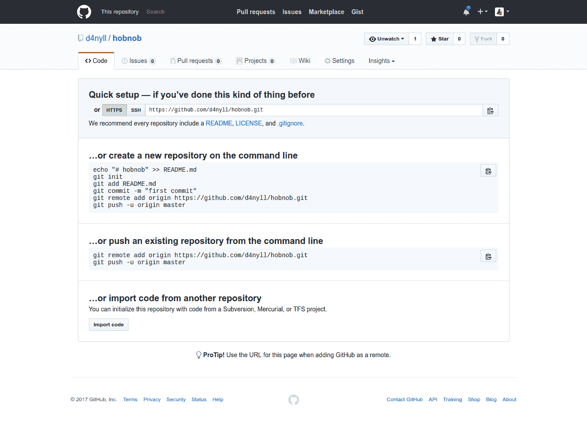

# 拉取和推送

接下来，我们需要更新我们的本地仓库，使其知道远程仓库的地址：

```js
$ git remote add origin https://github.com/d4nyll/hobnob.git $ git push -u origin master

```

不要使用`https://github.com/d4nyll/hobnob.git`；而是创建自己的远程仓库。

如果您收到`fatal: Authentication failed for https://github.com/d4nyll/hobnob.git/`错误，请检查您的 GitHub 用户名和密码是否输入正确。如果您在 GitHub 账户上使用了两步验证（2FA），则需要使用 SSH 密钥来推送远程仓库。

`-u`标签将上游仓库设置为`origin`。如果没有它，每次运行`git push`和`git pull`时，我们都需要指定我们想要推送或拉取的远程仓库；使用`-u`标签将节省我们未来的很多时间。后续的推送和拉取可以省略`-u`标签。

默认情况下，`git push`不会将标签推送到远程仓库。因此，我们不得不手动推送标签。推送标签的语法与推送分支的语法类似：

```js
$ git push origin [tagname]
```

或者，如果您想推送所有标签，可以运行以下命令代替：

```js
$ git push origin --tags
```

# 克隆仓库

我们的项目代码现在在 GitHub 上是公开可用的。我们的同事和/或合作者现在可以使用`git clone`命令下载代码：

```js
$ git clone https://github.com/d4nyll/hobnob.git
```

这将在运行`git clone`命令的目录内创建一个新的目录，并将远程仓库的内容复制到其中。

你的合作者可以随后在这个仓库的本地副本上工作，提交更改，并添加新的分支。一旦他们准备好将他们的更改提供给他人，他们可以从远程仓库拉取，解决合并冲突，然后将他们的更改推回到`origin`：

```js
$ git pull
# Resolves any conflicts
$ git push
```

# 通过拉取请求进行同行评审

大多数情况下，允许任何人向仓库推送或从仓库拉取是没问题的。然而，对于更重要的项目，你可能希望阻止新或初级开发者向重要的分支，如`dev`和`master`，进行推送。在这些情况下，仓库的所有者可能会限制推送权限，仅允许一小部分受信任的开发者。

对于不受信任的开发者来说，为了对`dev`或`master`进行更改，他们必须创建一个新的分支（例如功能或错误修复分支），将该分支推送到该分支，并创建一个**拉取请求**（**PR**）。这个 PR 是一个将他们的分支合并回`dev`或`master`的正式请求。

拉取请求是 GitHub 和 BitBucket 等平台的一个功能，而不是 Git 本身的功能。

接收拉取请求后，所有者或维护者将审查你的工作并提供反馈。在 GitHub 上，这是通过评论来完成的。贡献者随后将与维护者合作，对代码进行更改，直到双方都对更改满意。此时，维护者将接受你的拉取请求并将其合并到目标分支：

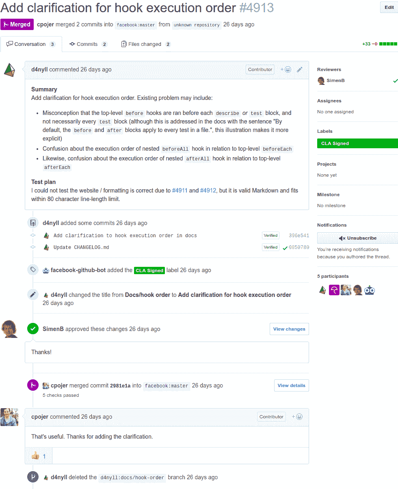

相反，如果维护者认为更改不符合项目的目标，他们可以拒绝这些更改。

在你的开发流程中实施拉取请求有几个好处：

+   你可以通知你的同事一个功能/错误修复已经完成。

+   这是一个正式的过程，其中所有评论和讨论都被记录下来。

+   你可以邀请审阅者对所做的更改进行同行评审。这允许他们帮助发现明显的错误，并提供关于你代码的反馈。这不仅确保了源代码的代码质量高，还有助于开发者从他人的经验中学习。

# 摘要

在本章中，我们概述了如何使用 Git 管理你项目的版本历史。我们首先理解 Git 中的不同状态，并练习一些基本的 Git 命令，然后使用它们来提交、分支和合并我们的更改。然后我们在 GitHub 上设置了一个远程仓库，这使得我们可以共享我们的代码并与他人协作。

这里使用的流程和约定是具有主观性的，你可能在你的工作场所遇到不同的模式。使用 Git 没有正确的方式，只有错误的方式，我们在这里使用的规则并不完美。例如，在 Driessen 模型中，一旦一个特性被合并到 `dev`，就很难将其提取出来。因此，我们必须小心不要合并那些不适合当前发布的特性。因此，本章最重要的收获是与你的团队建立一套约定，并始终如一地坚持它。

在下一章中，我们将开始编写我们的第一行代码，设置我们的开发环境和工具，并集成 JavaScript 特定的工具，如 `npm`、`yarn`、Babel 和 `nodemon`。在本书的剩余部分，当你完成练习并构建应用程序时，我们期望你使用这里概述的流程来保持代码的版本历史。
