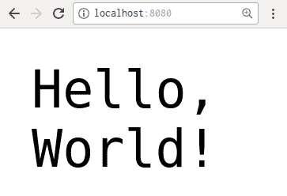
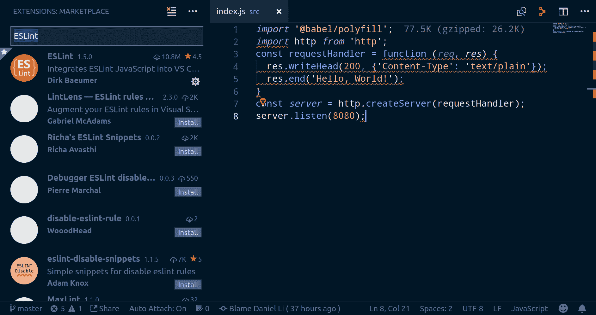

# 第四章：设置开发工具

本书的第一部分（第 1-3 章）是为了提供足够的背景知识，以便我们能够不间断地编码。在这一章中，我们将通过设置我们的本地开发环境，开始构建我们的用户目录应用程序，称为 'hobnob'。

本章的目的是帮助你理解 Node.js 生态系统中的不同工具和标准是如何协同工作的。具体来说，我们将涵盖以下内容：

+   什么是 **Node.js**？

+   JavaScript **模块**的不同格式/标准

+   使用 `npm` 和 `yarn` 管理模块

+   使用 **Babel** 转译代码

+   使用 `nodemon` 监视更改

+   使用 **ESLint** 检查我们的代码

# 什么是 Node.js？

如你在 第二章 中所学到的，《JavaScript 的状态》，Node.js 是“服务器上的 JavaScript”。在我们继续前进之前，让我们更深入地了解这意味着什么。

传统上，JavaScript 由一个 JavaScript 引擎解释，该引擎将 JavaScript 代码转换为更优化的、机器可执行的代码，然后执行。该引擎在运行时解释 JavaScript 代码。这与 **编译型语言**（如 C#）不同，编译型语言必须首先编译成 **中间语言**（**IL**），然后由 **公共语言运行时**（**CLR**）执行，这种软件与 JavaScript 引擎功能相似。

从技术上讲，将一种语言分类为解释型或编译型是不准确的——语言的处理方式取决于实现。有人可以构建一个将 JavaScript 转换为机器代码的编译器并运行它；在这种情况下，JavaScript 将是一种编译型语言。

然而，由于 JavaScript 几乎总是由 JavaScript 引擎进行解释，你经常会听到人们将 JavaScript 称为解释型语言。

不同浏览器使用不同的 JavaScript 引擎。Chrome 使用 V8，Firefox 使用 SpiderMonkey，WebKit 浏览器（如 Safari）使用 JavaScriptCore，而 Microsoft Edge 使用 Chakra。Node.js 使用 V8 作为其 JavaScript 引擎，并添加了 C++ 绑定，使其能够访问操作系统资源，如文件和网络。

# 术语

由于 JavaScript 通常是运行时进行解释，并且由于其他语言的运行时（如之前提到的 C#）实际上执行代码，许多人错误地将 JavaScript 引擎称为 JavaScript 运行时。

但是，它们是不同的事物——引擎是将高级 JavaScript 代码转换为机器可执行代码的软件，然后执行它。JavaScript 引擎然后将从解析代码中获取的所有对象暴露给 JavaScript 运行时环境，然后它可以使用它们。

因此，浏览器中的 JavaScript 和 Node.js 都使用相同的 V8 引擎，但运行在不同的运行时环境中。例如，浏览器运行时环境提供了`window`全局对象，这在 Node.js 运行时中不可用。相反，浏览器运行时缺少`require`全局，并且无法对系统资源（如文件系统）进行操作。

# 模块

如第一章“好代码的重要性”中提到的，干净的代码应该以模块化的方式进行结构化。在接下来的几节中，我们将向您介绍模块化设计的概念，然后解释不同的模块格式。然后，在本章的剩余部分，我们将通过整合现有的 Node 模块来开始构建我们的项目。

但首先，让我们提醒自己模块化设计的重要性。没有它，以下情况适用：

+   一个业务领域的逻辑可以很容易地与另一个交织在一起

+   当调试时，很难确定错误在哪里

+   很可能存在重复的代码

相反，编写模块化代码意味着以下内容：

+   模块是领域的逻辑分离——例如，对于一个简单的社交网络，你可能有一个用户账户模块，一个用户资料模块，一个帖子模块，一个评论模块，等等。这确保了清晰的**关注点分离**。

+   每个模块都应该有一个非常具体的目的——也就是说，它应该是细粒度的。这确保了尽可能多的**代码复用性**。代码复用性的一个副作用是**一致性**，因为对代码在一个位置的更改将应用到每个地方。

+   每个模块为其他模块提供交互的 API——例如，评论模块可能提供允许创建、编辑或删除评论的方法。它还应该隐藏内部属性和方法。这使得模块成为一个黑盒，封装内部逻辑以确保 API 尽可能最小化。

通过以模块化的方式编写我们的代码，我们最终会得到许多小而可管理的模块，而不是一个无法控制的混乱。

# 模块的时代

JavaScript 直到 ECMAScript 2015 才支持模块，因为 JavaScript 最初是为了向网页添加小块交互性而设计的，而不是为了构建完整的应用程序。当开发者想要使用库或框架时，他们只需在 HTML 中某个地方添加`<script>`标签，该库就会在页面加载时被加载。然而，这并不理想，因为脚本必须按正确的顺序加载。例如，Bootstrap（一个 UI 框架）依赖于 jQuery（一个实用库），因此我们必须手动检查 jQuery 脚本是否首先添加：

```js
<!-- jQuery - this must come first -->
<script src="img/jquery-3.2.1.min.js"></script>

<!-- Bootstrap's JavaScript -->
<script src="img/bootstrap.min.js"></script>
```

这在依赖树相对较小且较浅的情况下是可以的。然而，随着**单页应用程序**（**SPAs**）和 Node.js 应用程序变得越来越流行，应用程序不可避免地变得更加复杂；手动排列数百个模块的正确顺序既不实际又容易出错：


Cordova npm 包的依赖树，其中每个节点代表一个独立的模块

此外，许多这些脚本都会向全局命名空间添加变量，或者扩展现有对象的原型（例如，`Object.prototype`或`Array.prototype`）。由于它们通常没有命名空间，这些脚本可能会相互冲突/干扰，或者与我们的代码冲突。

由于现代应用程序的复杂性不断增加，开发者开始创建**包管理器**来组织他们的模块。此外，标准格式也开始出现，以便模块可以与更广泛的社区共享。

在撰写本文时，有三个主要的包管理器——**npm**、**Bower**和**yarn**——以及四个主要的定义 JavaScript 模块的标准——**CommonJS**、**AMD**、**UMD**和**ES6 模块**。每种格式也有相应的工具，使它们能够在浏览器上工作，例如**RequireJS**、**Browserify**、**Webpack**、**Rollup**和**SystemJS**。

在下一节中，我们将简要介绍不同类型的包管理器、模块及其工具。在本节的末尾，我们将更具体地探讨 ES6 模块，这是我们将在本书的其余部分使用的。

# Node.js 模块的诞生

在客户端使用模块不可行，因为一个应用程序可能有数百个依赖和子依赖；当有人访问页面时必须下载所有这些，这将增加**首次渲染时间**（**TTFR**），极大地影响用户体验（UX）。因此，我们今天所知道的 JavaScript 模块，是从 Node.js 模块在服务器上开始发展的。

在 Node.js 中，一个文件对应一个模块：

```js
$ tree
.
├── greeter.js
└── main.js
0 directories, 2 files
```

例如，前面提到的两个文件——`greeter.js`和`main.js`——每个都是它们自己的模块。

# 采用 CommonJS 标准

在 Node.js 中，模块是以 CommonJS 格式编写的，它提供了两个全局对象，`require`和`exports`，开发者可以使用它们来封装他们的模块。`require`是一个函数，允许当前模块导入并使用在其他模块中定义的变量。`exports`是一个对象，允许模块使其某些变量对其他`require`它的模块公开。

例如，我们可以在`greeter.js`中定义两个函数，`helloWorld`和`internal`：

```js
// greeter.js
const helloWorld = function (name) {
  process.stdout.write(`hello ${name}!\n`)
};
const internal = function (name) {
  process.stdout.write('This is a private function')
};
exports.sayHello = helloWorld;
```

默认情况下，这两个函数只能在文件内（在模块内）使用。但是，当我们把`helloWorld`函数赋值给`exports`的`sayHello`属性时，它使得`helloWorld`函数可以被其他`require``greeter`模块的模块访问。

为了演示这一点，我们可以在`main.js`中`require` greeter 模块，并使用其`sayHello`导出向控制台打印一条消息：

```js
// main.js
const greeter = require('./greeter.js');
greeter.sayHello("Daniel");
```

要`require`一个模块，你可以指定其名称或其文件路径。

现在，当我们运行`main.js`时，我们在终端中会得到一条打印的消息：

```js
$ node main.js 
hello Daniel!
```

# 满足封装要求

你可以通过将它们作为属性添加到`exports`对象中来从单个模块导出多个构造函数。未导出的构造函数在模块外部不可用，因为 Node.js 在其模块内部包装了一个**模块包装器**，它只是一个包含模块代码的函数：

```js
(function(exports, require, module, __filename, __dirname) {
  // Module code
});
```

这满足了模块的封装要求；换句话说，模块限制了直接访问模块的某些属性和方法。请注意，这是一个 Node.js 的特性，而不是 CommonJS。

# 标准化模块格式

自从 CommonJS 以来，客户端应用程序出现了多种模块格式，例如 AMD 和 UMD。AMD，或称**异步模块定义**，是 CommonJS 格式的早期分支，支持**异步模块加载**。这意味着不相互依赖的模块可以并行加载，这在一定程度上缓解了如果客户端在浏览器中使用 CommonJS 时遇到的缓慢启动时间。

每当存在多个非官方标准时，通常有人会提出一个**新的**标准来统一它们：


来自 XKCD 漫画标题为“Standards”的图片([h](https://xkcd.com/927/)[ttps://xkcd.com/927/](https://xkcd.com/927/))；在 Creative Commons Attribution-NonCommercial 2.5 许可下使用([`creativecommons.org/licenses/by-nc/2.5/`](http://creativecommons.org/licenses/by-nc/2.5/))

这就是 UMD，或称**通用模块定义**的情况。UMD 模块与 AMD 和 CommonJS 都兼容，并且如果你想在网页上作为`<script>`标签包含它，它也会暴露一个全局变量。但是，因为它试图与所有格式兼容，所以有很多样板代码。

最终，统一 JavaScript 模块格式的任务由**Ecma International**承担，它在 JavaScript 的 ECMAScript 2015（ES6）版本中标准化了模块。这种模块格式使用两个关键字：`import`和`export`。使用 ES6 模块的相同`greeter`示例将如下所示：

```js
// greeter.js

const helloWorld = function (name) {
  process.stdout.write(`hello ${name}!\n`)
};
const privateHellowWorld = function (name) {
  process.stdout.write('This is a private function')
};
export default helloWorld;

// main.js

import greeter from "./greeter.js";
greeter.sayHello("Daniel");
```

你仍然会有两个文件——`greeter.js`和`main.js`；这里唯一的区别是`exports.sayHello = helloWorld;`被替换为`export default helloWorld;`，而`const greeter = require('./greeter.js');`被替换为`import greeter from "./greeter.js";`。

此外，ES6 模块是**静态的**，这意味着它们在运行时不能被更改。换句话说，你无法在运行时决定是否导入一个模块。这样做的原因是允许在之前分析模块并构建依赖图。

Node.js 和流行的浏览器正在快速添加对 ECMAScript 2015 特性的支持，但目前它们中没有一个完全支持模块。

你可以在 Kangax 兼容性表（[kangax.github.io/compat-table/](http://kangax.github.io/compat-table/es6/)）中查看 ECMAScript 特性的完整兼容性表。

幸运的是，有一些工具可以将 ECMAScript 2015 模块转换为普遍支持的 CommonJS 格式。最受欢迎的是 **Babel** 和 **Traceur**。在这本书中，我们将使用 Babel，因为它是 *de facto* 标准。

# 安装 Node

在模块的背景知识已经解决之后，让我们通过在我们的本地机器上安装 Node.js 来开始我们的应用程序开发。就像俗语所说“条条大路通罗马”，安装 Node.js 到你的机器上有许多方法。你可以做以下之一：

+   访问 [`nodejs.org/`](https://nodejs.org/en/download/) 并下载其源代码（以 `*.tar.gz` 归档的形式）

+   访问 [`nodejs.org/`](https://nodejs.org/en/download/) 并下载安装程序

+   访问 [`nodejs.org/en/download/package-manager/`](https://nodejs.org/en/download/package-manager/) 并下载你操作系统包仓库上列出的 Node 版本

但最简单的方法是使用 **Node 版本管理器**（**nvm**），它还有一个额外的优点，就是允许你下载和切换不同版本的 Node。如果你同时在不同版本的 Node 项目上工作，这尤其方便，每个项目使用不同的版本。

有几种流行的程序可以为你管理 Node 版本。`nvm` 和 `nave` 按用户/shell 管理节点版本，这意味着同一台机器上的不同用户可以使用不同的 Node 版本。还有 `n`，它管理全局/系统范围内的 Node 版本。最后，`nodenv` 也可以很有用，因为它可以自动检测用于你的项目的正确 Node 版本。

# 使用 nvm 安装 Node

你可以使用它提供的 shell 脚本来安装 nvm：

```js
$ curl -o- https://raw.githubusercontent.com/creationix/nvm/v0.33.2/install.sh | bash
$ source ~/.nvm/nvm.sh
```

注意，在没有首先检查内容的情况下直接从互联网上运行 shell 脚本从来不是一个好主意。因此，你应该首先访问 [`raw.githubusercontent.com/creationix/nvm/v0.33.2/install.sh`](https://raw.githubusercontent.com/creationix/nvm/v0.33.2/install.sh) 并检查在真正运行之前将要运行的命令。

这将克隆 nvm 仓库到 `~/.nvm` 并在你的配置文件（`~/.bash_profile`、`~/.zshrc`、`~/.profile` 或 `~/.bashrc`）中添加一行，以便在用户登录时加载 nvm。

现在，我们可以使用 nvm 来安装 Node。首先，让我们使用 `nvm ls-remote` 命令检查可用的 Node 版本：

```js
$ nvm ls-remote
 ...
 v0.12.17
 v0.12.18
 ...
 v8.11.3 (LTS: Carbon)
 v8.11.4 (Latest LTS: Carbon)
 ...
 v10.8.0
 v10.9.0
```

它会返回一个包含每个 Node.js 版本的巨大列表，我们可以通过运行 `nvm install <version>` 来安装特定版本，其中版本是版本号（例如，`6.11.1`）或长期支持（LTS）版本的名称（例如，`lts/boron`）：

```js
$ nvm install 6.11.1
$ nvm install lts/boron
```

我们希望使用 Node 的最新 LTS 版本。在撰写本文时，那是 `8.11.4`，因此我们可以运行 `nvm install 8.11.4`。更好的是，我们可以使用简写 `nvm install lts/*`，这将默认为 Node 的最新 LTS 版本：

```js
$ nvm install lts/*
Downloading and installing node v8.11.4...
Downloading https://nodejs.org/dist/v8.11.4/node-v8.11.4-linux-x64.tar.xz...
######################################################################### 100.0%
Computing checksum with sha256sum
Checksums matched!
Now using node v8.11.4 (npm v5.6.0)
```

我们可以通过运行 `node -v` 来检查 Node 是否已成功安装：

```js
$ node -v
v8.11.4
```

当我们安装 Node 时，我们也自动安装了 npm CLI，这是 Node.js 的包管理器：

```js
$ npm -v
5.5.1
```

# 记录 Node 版本

我们应该记录我们使用哪个版本的 Node 运行我们的 API 服务器。为此，使用 nvm，我们只需在我们的项目根目录中定义一个 `.nvmrc` 文件。然后，任何正在开发 API 的开发者都可以通过运行 `nvm use` 来使用正确的 Node 版本。因此，创建一个新的项目目录并运行 `git init` 以创建一个新的 Git 仓库。一旦完成，创建一个新的 `.nvmrc` 文件，其中包含一个读取为 `8.11.4` 的单行：

```js
$ mkdir hobnob && cd hobnob
$ git init
$ echo "8.11.4" > .nvmrc
```

# 使用 npm 开始项目

对于 Node.js 项目，设置和配置存储在一个名为 `package.json` 的文件中，位于仓库的根目录。npm CLI 工具提供了一个 `npm init` 命令，该命令将启动一个迷你向导，帮助您创建 `package.json` 文件。因此，在我们的项目目录中，运行 `npm init` 以启动向导。

向导将提出一系列问题，但也提供了合理的默认值。让我们逐个过一遍这些问题：

1.  包名：我们对默认的 `hobnob` 名称（来自目录名）感到满意，因此我们可以直接按回车键继续。

1.  版本：我们将遵循语义化版本控制（semver），并使用主版本 0（`0.y.z`）来表示我们的代码库处于初始开发阶段，API 不可稳定。Semver 还建议我们的初始版本为 `0.1.0`。

1.  描述：对您的项目的简要描述；如果我们将应用程序公开在 [npmjs.com](http://npmjs.com)，此描述将出现在搜索结果中。

1.  入口点：这应该指向模块的根目录，并且是其他模块需要您的模块时运行的文件。我们尚未决定应用程序的结构，所以先将其留为 `index.js`，我们可能稍后会更改它。

1.  测试命令：当我们运行 `npm run test` 时，将会执行此命令。我们稍后会集成 Cucumber 和 Mocha 测试框架；目前，只需将其留空即可。

1.  Git 仓库：使用我们之前创建的远程仓库，例如，`git@github.com:d4nyll/hobnob.git`。

1.  关键词：这些是逗号分隔的关键词，有助于他人搜索 [npmjs.com](https://www.npmjs.com/) 上的您的包。

1.  作者：请在此处以 `FirstName LastName <e@ma.il> (http://web.site/)` 的格式填写您的详细信息。

1.  许可证：许可证告诉其他人他们如何使用我们的代码。它应该是 SPDX 许可证列表中的一个标识符（[`spdx.org/licenses/`](https://spdx.org/licenses/)）。例如，MIT 许可证将是 `MIT`，GNU 通用公共许可证 v3.0 将是 `GPL-3.0`。

有两种主要的开源许可证类型——**宽松**许可证侧重于允许他人对你的代码做任何他们想做的事情；而**版权左**许可证促进共享，并要求在相同条款下共享衍生代码。如果你不确定选择哪个许可证，请查看 [choosealicense.com](https://choosealicense.com/)。

完成向导后，它将显示 `package.json` 文件的预览；按 Return 键确认。你还可以查看新创建的 `package.json` 文件以进行检查：

```js
$ cat package.json 
{
 "name": "hobnob",
 "version": "0.1.0",
 "description": "Back end for a simple user directory API with 
   recommendation engine",
 "main": "index.js",
 "scripts": {
 "test": "echo \"Error: no test specified\" && exit 1"
 },
 "repository": {
 "type": "git",
 "url": "git+https://github.com/d4nyll/hobnob.git"
 },
 "author": "Daniel Li <dan@danyll.com>",
 "license": "MIT",
 "bugs": {
 "url": "https://github.com/d4nyll/hobnob/issues"
 },
 "homepage": "https://github.com/d4nyll/hobnob#readme"
}
```

`package.json` 文件包含有关你的项目的信息，以及项目所依赖的包列表。拥有 `package.json` 文件，它允许协作者快速在本地环境中设置项目——他们只需运行 `npm install`，项目所有依赖项就会被安装。

# 使用 yarn 代替 npm

`npm` 是默认的包管理器，但 Facebook 与 Exponent、Google 和 Tilde 合作，已经开发了一个更好的替代品，称为 `yarn`，我们将使用它。

`yarn` ([`yarnpkg.com/en/`](https://yarnpkg.com/en/)) 使用与 `npm` CLI 相同的 [`www.npmjs.com/`](https://www.npmjs.com/) 注册表。由于它们两者都在 `node_modules` 目录中安装包并写入 `package.json`，因此你可以互换使用 `npm` 和 `yarn`。它们之间的区别在于解决和下载依赖项的方法。

# 软件包版本锁定

当我们在 `package.json` 文件中指定依赖项时，我们可以使用符号来表示可接受版本的范围。例如，`>version` 表示安装的版本必须大于某个版本，`~version` 表示大约等效（这意味着它可以达到下一个次版本），而 `^version` 表示兼容（通常意味着最高版本且主要版本没有变化）。这意味着，给定相同的 `package.json` 文件，你安装的包版本集可能与同事不同。

`yarn` 默认创建一个锁文件，即 `yarn.lock`。锁文件确保记录了每个包的确切版本，因此使用锁文件安装的人将拥有每个包的完全相同的版本。

另一方面，`npm` 在 5.0.0 版本中将锁文件作为默认设置，即 `package-lock.json`。在此之前，开发者必须手动运行 `npm shrinkwrap` 来生成 `npm-shrinkwrap.json` 文件——这是 `package-lock.json` 的前身。

# 离线缓存

当你使用 `yarn` 安装一个包时，它会在 `~/.yarn-cache` 中保存一个副本。因此，下次你需要在你项目中的一个包中安装包时，`yarn` 会检查这个缓存，并在可能的情况下使用本地副本。这每次都节省了往返服务器的行程，并允许你离线工作。

# 速度

当你安装一个包及其依赖项时，`npm` 会按顺序安装它们，而 `yarn` 会并行安装它们。这意味着使用 `yarn` 安装始终更快。

# 安装 yarn

你可以通过许多方法安装 `yarn`。最简单的一种是通过 npm 安装它（是的，这相当讽刺）：

```js
$ npm install --global yarn
```

然而，这并不推荐，因为包没有被签名，这意味着你无法确定它来自一个可信的来源；这构成了安全风险。因此，建议遵循在 [`yarnpkg.com/en/docs/install#windows-stable`](https://yarnpkg.com/en/docs/install#windows-stable) 中概述的官方安装说明。对于 Ubuntu 机器，我们应该运行以下命令：

```js
curl -sS https://dl.yarnpkg.com/debian/pubkey.gpg | sudo apt-key add -
echo "deb https://dl.yarnpkg.com/debian/ stable main" | sudo tee /etc/apt/sources.list.d/yarn.list
sudo apt-get update && sudo apt-get install yarn
```

# 熟悉 yarn CLI

`yarn` 拥有 `npm` CLI 的大多数功能。以下表格比较了相应的命令：

| **Yarn 0.24.5** | **npm CLI 5.0.0** | **描述** |
| --- | --- | --- |
| `yarn` | `npm` | `yarn install` 的别名 |
| `yarn install` | `npm install` | 安装 `yarn.lock` 和 `package.json` 中指定的依赖项 |
| `yarn add <package>` | `npm install <package>` | 安装包，将其添加到依赖列表，并生成锁文件（在 5.0.0 之前，npm CLI 需要一个 `--save` 标志） |
| `yarn remove <package>` | `npm uninstall <package>` | 卸载指定的包 |
| `yarn global add <package>` | `npm install <package> --global` | 在全局范围内安装包 |
| `yarn upgrade` | `rm -rf node_modules && npm install` | 将所有包升级到 `package.json` 允许的最新版本 |
| `yarn init` | `npm init` | 通过简短的向导初始化包的开发 |

除了基本功能外，`yarn` 还有一些非基本但实用的功能，可以帮助你在工作流程中：

+   `yarn licenses ls`：在控制台上打印出包列表、它们的 URL 和它们的许可证

+   `yarn licenses generate-disclaimer`：生成包含所有依赖项许可证的文本文件

+   `yarn why`：生成依赖图以确定为什么下载了某个包——例如，它可能是我们应用程序依赖项的依赖项

+   `yarn upgrade-interactive`：提供一个交互式向导，允许你选择性地升级过时的包

你可以在 [`yarnpkg.com/en/docs/cli/`](https://yarnpkg.com/en/docs/cli/) 获取完整的 CLI 命令列表，或者通过在终端运行 `yarn help` 来获取。

# npm 和 yarn，共同

`yarn` 是对 `npm` 的改进，在速度、一致性、安全性以及控制台输出的整体美观性方面。这使得 `npm` 更好——`npm` v5.0.0 引入了以下变更，这些变更来自 npm 博客的官方公告：

+   `npm` 现在默认使用 `--save`。此外，如果不存在 `npm-shrinkwrap.json` 实例，将自动创建 `package-lock.json`。

+   包的元数据、包下载和缓存基础设施已被替换。新的缓存非常容错，并支持并发访问。

+   在离线状态下运行 `npm` 将不再坚持重试网络请求。如果可能，`npm` 现在将立即回退到缓存，或者失败。

# 创建 HTTP 服务器

接下来，我们需要设置我们的项目，使其能够运行 ES6 代码，特别是 ES6 模块功能。为了演示这一点，并展示如何调试你的代码，我们将创建一个简单的 HTTP 服务器，该服务器总是返回字符串 Hello, World!。

通常，当我们遵循 TDD 工作流程时，我们应该在我们编写应用程序代码之前编写测试。然而，为了演示这些工具，我们将在这里稍作例外。

Node.js 提供了 HTTP 模块，其中包含一个 `createServer()` 方法 ([`nodejs.org/api/http.html#http_http_createserver_requestlistener`](https://nodejs.org/api/http.html#http_http_createserver_requestlistener))，允许你配置 HTTP 服务器。在你的项目目录根目录下创建一个 `index.js` 文件，并添加以下内容：

```js
const http = require('http');
const requestHandler = function (req, res) {
  res.writeHead(200, {'Content-Type': 'text/plain'});
  res.end('Hello, World!');
}
const server = http.createServer(requestHandler);
server.listen(8080);
```

我们能够在这里使用 ES6 语法（如 `const`），因为自 Node 版本 6 以来对 ES2015 的支持已经很好。但 ES6 模块仍然不受支持，即使在 Node 的最新版本中也是如此。因此，我们使用 CommonJS 的 `require` 语法。

在本章的后面部分，我们将演示如何使用 Babel 将源代码转换为使用 ES6 模块功能编写的代码，并将其转译回广泛支持的 CommonJS 语法。

要查看不同版本的 Node 对 ES2015+ 特性的支持程度，请访问 [node.green](http://node.green/)。

完成这些后，打开一个终端并运行 `node index.js`。这应该在 `localhost:8080` 上启动了一个服务器。现在，如果我们向 `localhost:8080` 发送请求，例如通过使用网页浏览器，它将返回文本 `Hello, World!`：



如果你得到 `Error: listen EADDRINUSE :::8080` 错误，这意味着其他东西正在使用端口 `8080`；在这种情况下，要么终止绑定到端口 `8080` 的进程，要么通过更改传递给 `server.listen()` 的数字来选择不同的端口。

`node` 进程目前处于 **前台** 运行，并将继续监听进一步的请求。要停止 `node` 进程（以及我们的服务器），请按 Ctrl + C。

按 Ctrl + C 会向 Node 程序发送一个 **中断信号** (`SIGINT`)，程序会处理该信号并终止服务器。

# 我们详细探讨 HTTP 服务器

让我们分解我们的 HTTP 服务器代码，看看实际上发生了什么。首先，我们 `require` 了 `http` 包，以便我们可以访问 HTTP 模块的方法：

```js
const http = require('http');
```

接下来，我们使用 `createServer` 方法创建一个服务器实例，该实例监听传入的请求。在其内部，我们传入一个 **请求处理器** 函数，该函数接受 `req` 和 `res` 参数。

大多数开发者使用 `req` 和 `res` 作为“请求”和“响应”参数名称的缩写，但您可以使用您喜欢的任何变量名。

`req` 参数是一个包含有关请求信息的对象，例如其原始 IP、URL、协议、正文负载（如果有）等。`res` 对象提供了帮助您准备响应消息并发送回客户端的方法；例如，您可以设置标题、添加响应正文、指定正文的内容类型等。

当我们运行 `res.end()` 时，它完成响应的准备并将其发送回客户端。在这里，我们忽略请求的内容，它简单地返回 `Hello, World!`：

```js
const requestHandler = function (req, res) {
  res.writeHead(200, {'Content-Type': 'text/plain'});
  res.end('Hello, World!');
}
const server = http.createServer(requestHandler);
```

现在我们已经创建了一个服务器实例并配置了其响应，最后一步是为它指定一个端口并指示它在该端口上监听请求。

```js
server.listen(8080);
```

# 使用 Babel 转译 ES6

我们一直使用 CommonJS 的 `require` 语法来处理模块；让我们改为使用 ES6 模块语法（使用 `import`）。

在您的代码中，更新第一行以使用 `import`：

```js
const http = require('http'); // CommonJS syntax
import http from 'http'; // ES6 syntax
```

当我们尝试通过执行 `node index.js` 来运行我们的服务器时，它将抛出 `SyntaxError: Unexpected token import` 错误。这是因为 Node.js 对模块的支持仍然是实验性的，并且在没有 `--experimental-modules` 标志的情况下，可能直到 2018 年晚些时候才可能得到支持。

这意味着为了我们能够使用 ES6 模块编写源代码，我们需要添加一个额外的步骤，该步骤将不支持的语法转译为支持的语法。我们有几个编译器/转译器可供选择：

+   **Babel**：JavaScript 编译器/转译器的最受欢迎和事实上的标准。

+   **Traceur**：Google 另一个编译器。

+   **TypeScript 编译器**：TypeScript 是 JavaScript 的超集，它提供了静态类型。由于有效的 JavaScript 也是有效的 TypeScript，TypeScript 编译器也可以作为 ES6 到 ES5 的转译器。

+   **Closure 编译器**：一种通过解析和分析您的 JavaScript 来优化它的编译器，移除死代码，重构现有代码，并最小化最终结果。它还会警告用户常见的错误。Closure 编译器支持 ES6 语法，但将所有内容转译为 ES5。

虽然 TypeScript 和 Closure 编译器能够将 ES6 转换为 ES5，但这不是它们的主要功能；因此，这些功能在这里的使用有限。Babel 和 Traceur 是专门用于将 ES6/7/8/9 和 **ESNext** 语法转换为环境支持的 JavaScript 的工具，因此更适合我们的使用。在这两个工具中，Babel 是最受欢迎和最活跃的，我们将在这个项目中使用它。

ESNext 是一个集合术语，用于指代由社区成员提交但尚未通过 Ecma 的审查过程（T39 流程）的功能，因此尚未纳入 ECMAScript 标准。

T39 流程有 5 个阶段：草稿（阶段 0）、提案（阶段 1）、草案（阶段 2）、候选（阶段 3）和完成（阶段 4）。你可以通过访问 [`tc39.github.io/process-document/`](https://tc39.github.io/process-document/) 获取每个阶段的更详细描述。

# Babel 是一个转换器……还有更多！

Babel 可以将 ES6/7/8/9 和 ESNext 语法转换为在目标环境中工作的语法。例如，假设我们有一个使用箭头函数的模块：

```js
double = a => a * 2
```

如果我们想让它在浏览器上可用，Babel 可以将其转换为 ES5：

```js
double = function double(a) {
  return a * 2;
};
```

然而，如果我们正在运行 Node v8.11.4，它原生支持箭头函数，它将不会修改该函数。

除了支持新的 ECMAScript 版本外，它还支持常用的语法，如 JSX（由 React 使用）和 Flow 静态类型注解。

# Babel 的不同方面

Babel 是一系列工具——它既是命令行工具，也是 polyfill，并且这些包被拆分为许多部分，如 `@babel/cli`、`@babel/register`、`@babel/node` 和 `@babel/core`，所有这些都可以让你运行 ESNext 代码。

因此，首先，让我们了解 Babel 的不同部分实际上是什么，以及我们如何在我们的应用程序中使用 Babel。

# @babel/cli

Babel CLI 是运行 Babel 最常见（也是最容易）的方式。它提供了一个可执行文件（`babel`），你可以在终端中使用它来转换文件和目录。它可在 [npmjs.com](http://npmjs.com) 上找到，因此我们可以使用 yarn 安装它：

```js
# Install @babel/cli as a development dependency
$ yarn add @babel/cli --dev

# transpile a single file
$ babel example.js -o compiled.js

# transpile an entire directory
$ babel src -d build
```

# @babel/register

`@babel/cli` 包允许你预先转换源代码；另一方面，`@babel/register` 在运行时进行转换。

# 使用 @babel/register 进行测试

`@babel/register` 在测试期间非常有用，因为它允许你在测试中编写 ESNext 代码，因为它们将在测试运行之前被转换。

替代方案是使用 `babel` CLI 手动转换，并在转换后的代码上执行测试。这是可以接受的；然而，转换代码的行号将不会与源代码中的行号匹配，这使得识别失败的测试变得困难。此外，由于转换代码中可能包含更多的样板代码，测试覆盖率统计可能不准确。

因此，建议使用 `@babel/register` 来运行用 ES6 编写的测试。

# @babel/node

虽然 `@babel/register` 钩子可以与其他工具（如 `mocha` 和 `nyc`）集成并充当中间步骤，但 `@babel/node` 是 `node` 的替代品并支持 ESNext 语法：

```js
# install @babel/node
$ yarn add @babel/node --dev

# instead of this
$ node main.js

# you'd run
$ babel-node main.js
```

这是为了方便，帮助你开始。它不打算在生产环境中使用，因为，就像 `@babel/register` 一样，它会在运行时转换源代码，这非常低效。

# @babel/core

`@babel/cli`、`@babel/register`、`@babel/node` 以及其他几个包都依赖于 `@babel/core`，正如其名称所暗示的，它包含 Babel 的核心逻辑。此外，`@babel/core` 包公开了你可以用于代码中的 API 方法：

```js
import * as babel from '@babel/core';
var result = babel.transform("code();", options);
result.code;
result.map;
result.ast;
```

# @babel/polyfill

ECMAScript 的新版本提供了新的、更简洁的语法，Babel 将新语法转换为旧版本的 ECMAScript。然而，如果你使用的是新的 JavaScript *APIs*，这样做可能更困难（甚至不可能）。

例如，如果你正在使用新的 `fetch` API 而不是 `XMLHttpRequest`，Babel 将无法将其转换为旧版本。对于 APIs，我们必须使用 polyfill；幸运的是，Babel 提供了 `@babel/polyfill` 包。

Polyfill 是一种代码，它会检查环境是否支持某个功能，如果不支持，则提供模拟原生实现的方法。

要使用 polyfill，你必须首先将其作为依赖项（而不是开发依赖项）安装：

```js
$ yarn add @babel/polyfill
```

然后，在代码顶部导入 `@babel/polyfill` 包，它将修改现有的全局变量以 polyfill 尚未支持的方法：

```js
require("@babel/polyfill"); # ES5
import "@babel/polyfill"; # ES6
```

`@babel/polyfill` 使用 `core-js` 作为其底层的 polyfill。

# 添加 Babel CLI 和 polyfill

我们将使用 Babel CLI 来转换我们的代码，同时添加 Babel polyfill 以利用新的 JavaScript APIs。因此，尽管你仍然在项目目录内，但请运行以下两个命令：

```js
$ yarn add @babel/core @babel/cli --dev
$ yarn add @babel/polyfill
```

当我们运行 `yarn add @babel/core @babel/cli` 时，我们使用了 `--dev` 标志，这是因为我们希望将它们包括为 **开发依赖项**。开发依赖项可能包括构建工具、测试运行器、文档生成器、linters 以及在开发期间使用但应用程序本身不使用的任何其他工具。

这样做是为了如果有人想在他们的项目中使用我们的包，他们只需 `npm install` 我们包及其依赖项，而无需也下载开发依赖项。

# 使用 Babel CLI 转换我们的代码

现在，让我们使用 Babel CLI 来转换我们的代码：

```js
$ npx babel index.js -o compiled.js
```

上述命令使用了 `npx`，这是一个与 `npm` v5.2.0 一起引入的工具。`npx` 允许你使用非常整洁的语法在本地运行二进制文件（在你的项目的 `node_modules` 目录内，而不是全局），例如，你可以将 `./node_modules/.bin/babel index.js -o compile.js` 简化为 `npx babel index.js -o compile.js`。

在这里，我们使用 npx 运行本地的`babel`可执行文件，它将转换我们的`index.js`文件并将其输出为`compiled.js`。

如果您比较这两个文件，您会看到除了格式更改（如空白）之外，这两个文件应该是相同的。这是因为 Babel CLI 默认情况下将简单地从一处复制文件到另一处。为了给它添加功能，我们必须添加插件并在配置文件中指定它们。所以接下来，让我们创建那个配置文件。在项目目录的根目录下，创建一个名为`.babelrc`的新文件，并添加以下行：

```js
{
 "presets": [],
 "plugins": []
}
```

# 插件和预设

**插件**告诉 Babel 如何转换您的代码，而**预设**是预定义的插件组。例如，您有`es2017`预设，它包括`syntax-trailing-function-commas`和`transform-async-to-generator`插件，这些插件是支持 ECMAScript 2017 语法的必需品。还有一个`react`预设，它包括`transform-react-jsx`插件（以及其他插件），允许 Babel 理解 JSX。

要使用插件或预设，您可以将其作为开发依赖项安装，并在`.babelrc`中指定它。例如，如果我想支持 ECMAScript 2017 语法，同时支持对象的`rest`和`spread`操作符（ES2018 的功能），我可以运行以下命令：

```js
$ yarn add @babel/preset-es2017 @babel/plugin-syntax-object-rest-spread --dev
```

然后，将设置添加到`.babelrc`中：

```js
{
  "presets": ["@babel/es2017"],
  "plugins": ["@babel/syntax-object-rest-spread"]
}
```

# env 预设

然而，在先前的方法中，您必须手动跟踪您使用了哪些 ECMAScript 功能，并确定它们是否与您在机器上安装的 Node.js 版本兼容。Babel 提供了一个更好的替代方案，即`env`预设，它作为`@babel/preset-env`包提供。此预设将使用 kangax ECMAScript 兼容性表([kangax.github.io/compat-table/](http://kangax.github.io/compat-table/))来确定哪些功能不受您的环境支持，并下载适当的 Babel 插件。

这对我们用例来说很棒，因为我们不希望将所有内容都转换为 ES5，只转换`import`/`export`模块语法。使用`env`预设将确保对我们的代码只进行最小数量的转换。

事实上，如果您访问`npmjs.com`页面上的`@babel/preset-es2017`或类似包，您会看到它们已经被废弃，转而使用`@babel/preset-env`包。因此，我们应该删除之前的插件和预设，并使用`env`预设：

```js
$ yarn remove @babel/preset-es2017 @babel/plugin-syntax-object-rest-spread
$ yarn add @babel/preset-env --dev
```

接下来，将我们的`.babelrc`内容替换为以下内容：

```js
{
  "presets": ["@babel/env"]
}
```

如果您没有指定目标环境，`env`预设将默认使用最新的官方 ECMAScript 版本，不包括 stage-x 提案。

我们正在编写的 API 旨在仅在服务器上运行，使用 Node，因此我们应该在配置中指定这一点。我们可以指定我们想要支持的 Node 的确切版本，但更好的是，我们可以让 Babel 使用 target 选项`"node": "current"`为我们检测它。

因此，将`.babelrc`替换为以下内容：

```js
{
  "presets": [
    ["@babel/env", {
      "targets": {
        "node": "current"
      }
    }]
  ]
}
```

太好了！现在我们可以继续用 ES6 编写了。当我们想要运行我们的程序时，我们可以简单地使用 Babel 转换它，然后运行编译后的脚本：

```js
$ npx babel index.js -o compiled.js
$ node compiled.js
```

再次提醒，当你向`localhost:8080`发送`GET`请求时，你应该会收到`'Hello World!'`文本作为响应。

# 分离源代码和发布代码

通常，源代码由许多文件组成，嵌套在多个目录中。我们可以转换每个文件并将它们放置在相应的源文件旁边，但这并不是最佳做法，因为很难将发布代码与源代码分开。因此，最好将源代码和发布代码分别放在两个不同的目录中。

因此，让我们删除现有的 `compiled.js`，并创建两个新的目录，分别称为 `src` 和 `dist`。同时，将 `index.js` 文件移动到 `src` 目录中：

```js
$ rm compiled.js
$ mkdir src dist
$ mv index.js src/
```

现在，我们应该再次构建我们的项目，但这次向 Babel CLI 提供一个 `-d` 标志，它将编译我们`src`目录中的文件到输出目录。在构建之前，我们应该删除现有的`dist`目录，以确保没有留下前一次构建的任何工件：

```js
$ rm -rf dist/ && npx babel src -d dist
$ node dist/index.js
```

# 导入 Babel polyfill

最后，在`src/index.js`文件中，将 polyfill 导入到文件顶部：

```js
import "@babel/polyfill";
...
```

这将使我们能够使用新的 JavaScript API，例如`fetch`。再次，通过执行`rm -rf dist/ && npx babel src -d dist`来转换修改后的源代码。

# 使用 npm 脚本合并命令

每次想要构建项目时，都必须手动输入`rm -rf dist/ && npx babel src -d dist`命令，这实在麻烦。相反，我们应该使用**npm 脚本**将这个命令合并成一个更简单的命令。

在你的`package.json`文件中，向`scripts`属性添加一个新的`build`子属性，并将其设置为表示我们想要运行的命令的字符串：

```js
"scripts": {
 "build": "rm -rf dist/ && babel src -d dist",
 "test": "echo \"Error: no test specified\" && exit 1"
}
```

现在，你不再需要输入`rm -rf dist/ && npx babel src -d dist`，你只需输入`yarn run build`或`npm run build`——这样就不那么麻烦了！通过将此脚本添加到`package.json`中，它允许你与其他开发者共享，这样每个人都可以从中受益。

我们还可以创建一个 `serve` 脚本，它将构建我们的应用程序然后运行它：

```js
"scripts": {
  "build": "rm -rf dist/ && babel src -d dist",
  "serve": "yarn run build && node dist/index.js",
  "test": "echo \"Error: no test specified\" && exit 1"
}
```

在随后的章节中，当我们与测试框架和文档工具集成时，我们将在其中添加更多的脚本。

# 确保跨平台兼容性

在我们继续之前，我们应该尝试确保我们的 npm 脚本在多个平台上都能工作。所以，如果我们有一个开发者在使用 Mac，另一个在使用 Linux 机器，脚本将适用于他们两个。

例如，如果你想在 Windows 上使用 `cmd` 删除 `dist` 目录，你需要运行`rd /s /q dist`；而使用 Ubuntu 的默认 shell（Bash），你会运行`rm -rf dist`。为了确保我们的 npm 脚本在所有地方都能工作，我们可以使用一个名为 `rimraf` 的 Node 包（[`www.npmjs.com/package/rimraf`](https://www.npmjs.com/package/rimraf)）。首先，安装它：](https://www.npmjs.com/package/rimraf)

```js
$ yarn add rimraf --dev
```

现在更新我们的`build`脚本以使用`rimraf`：

```js
"build": "rimraf dist && babel src -d dist",
```

# 使用 nodemon 自动化开发

目前，为了看到最终产品，我们必须在每次修改源代码后运行`build`脚本。虽然这没问题，但可能会很烦人且浪费时间。`nodemon`是一个工具，它监视代码中的变更，并在检测到变更时自动重启`node`进程。这可以加快开发和测试的速度，因为我们不再需要手动运行`build`和`serve`脚本。此外，从我们的机器上提供的 API 将始终是最新的版本。

首先，让我们安装`nodemon`：

```js
$ yarn add nodemon --dev
```

接下来，添加一个使用`nodemon`而不是`node`的`watch`脚本：

```js
"scripts": {
  "build": "rimraf dist && babel src -d dist",
  "serve": "yarn run build && node dist/index.js",
  "test": "echo \"Error: no test specified\" && exit 1",
  "watch": "nodemon -w src --exec yarn run serve"
},
```

此命令指示 nodemon 监视`src`目录中的文件变更，并在检测到变更时执行`yarn run serve`并重启我们的服务器。

现在，运行`yarn run watch`，并在`src/index.js`（例如，更改响应中返回的文本）中进行小的文件更改。注意控制台，你会看到 nodemon 检测到变更并重启我们的服务器：

```js
[nodemon] restarting due to changes...
[nodemon] starting `yarn run serve`
```

# 使用 ESLint 进行代码检查

最后，我们应该注意在整个项目中保持一致的代码风格。代码风格是主观的，是风格选择，不会改变程序的功能，例如，是否使用空格或制表符，或者命名变量时是否使用`camelCase`或`underscore_case`。

保持一致的代码风格对于以下原因很重要：

+   它使代码更易读。

+   当与他人合作时，贡献者可能会覆盖彼此的风格变更。例如，贡献者 A 可能会将所有字符串字面量更改为使用单引号，而贡献者 B 可能会在后续提交中将其改回双引号。这是一个问题，因为：

    +   浪费时间和精力

    +   这可能会导致不良情绪，因为没有人喜欢自己的工作被覆盖

    +   变更变得难以审查，相关的变更可能会被风格变更所淹没。

一旦定义了一套代码风格规则，就可以使用**代码检查器**来强制执行这些规则。代码检查器是一个静态分析工具，它扫描你的代码并识别不符合这些规则的代码风格，以及由于语法错误而产生的潜在错误。

*ESLint*是一个开源的 JavaScript 代码检查工具。要使用它，你首先需要在名为`.eslintrc`的配置文件中记录你的规则。它被设计为可插拔的，这意味着开发者可以覆盖默认规则并组合自己的代码风格规则集。任何违规也可以被赋予警告或错误的严重级别。它还提供了有用的功能，例如`--init`标志，它启动一个向导来帮助你创建配置文件，以及`--fix`标志，它可以自动修复不需要人工干预的任何违规。

# 安装 ESLint

让我们安装 ESLint 并运行其初始化向导：

```js
$ yarn add eslint --dev
$ npx eslint --init
? How would you like to configure ESLint?
 Use a popular style guide
 Answer questions about your style
 Inspect your JavaScript file(s)
```

对于这个项目，我们将使用 Airbnb 的 JavaScript 风格指南，您可以在[`github.com/airbnb/javascript`](https://github.com/airbnb/javascript)找到它。因此，使用你的箭头键选择“使用流行的风格指南”选项，并按回车键。在下一个问题中，选择 Airbnb 选项：

```js
? Which style guide do you want to follow? (Use arrow keys)
 Airbnb (https://github.com/airbnb/javascript)
 Standard (https://github.com/standard/standard)
 Google (https://github.com/google/eslint-config-google)
```

接下来，它将询问有关 React 和配置格式的问题；分别选择“否”和 JSON 选项：

```js
? Do you use React? No
? What format do you want your config file to be in? JSON
```

最后，它将检查我们是否安装了所需的依赖项，如果没有，会提示我们安装它们。在这里选择“是”选项：

```js
Checking peerDependencies of eslint-config-airbnb-base@latest
The config that you've selected requires the following dependencies:

eslint-config-airbnb-base@latest eslint@⁴.19.1 || ⁵.3.0 eslint-plugin-import@².14.0
? Would you like to install them now with npm? Yes
```

这完成了向导，现在你应该在你的仓库根目录下看到一个`.eslintrc.json`文件，它简单地如下所示：

```js
{
    "extends": "airbnb-base"
}
```

# 检查我们的代码

现在，让我们在`src/index.js`上运行`eslint`以发现我们代码中的问题：

```js
$ npx eslint src/index.js

/home/dli/.d4nyll/.beja/final/code/6/src/index.js
 1:8 error Strings must use singlequote quotes
 2:1 error Expected 1 empty line after import statement not followed by another import import/newline-after-import
 3:24 warning Unexpected unnamed function func-names
 4:22 error A space is required after '{' object-curly-spacing
 4:51 error A space is required before '}' object-curly-spacing
 6:2 error Missing semicolon semi
 8:21 error Newline required at end of file but not found eol-last

 8 problems (7 errors, 1 warning)
 6 errors and 0 warnings potentially fixable with the `--fix` option.
```

按照说明修复这些问题，或者传递`--fix`标志让 ESLint 自动为您修复问题。最后，你应该得到一个看起来像这样的文件：

```js
import '@babel/polyfill';
import http from 'http';

function requestHandler(req, res) {
  res.writeHead(200, { 'Content-Type': 'text/plain' });
  res.end('Hello, World!');
}
const server = http.createServer(requestHandler);
server.listen(8080); // Note that there is a newline below this line
```

# 在 package.json 中添加 lint 脚本

就像我们对`build`、`serve`和`watch`npm 脚本所做的那样，我们可以在`package.json`中添加一个`fix`和`lint`脚本：

```js
"scripts": {
    ...
    "fix": "eslint src --fix",
    "lint": "eslint src",
    ...
```

现在，我们可以运行`yarn run lint`来检查我们的整个项目。

# 安装 ESLint 扩展

虽然我们可以手动运行 ESLint，但如果这些错误在我们开发时就被指出，那么开发者的体验会更好。为了做到这一点，我们可以在代码编辑器或 IDE 中安装 ESLint 扩展。例如，Visual Studio Code ESLint 扩展将在任何违规下添加红色和黄色的波浪线：



可用于编辑器和构建工具的集成有很多；您可以在[`eslint.org/docs/user-guide/integrations`](https://eslint.org/docs/user-guide/integrations)找到一份完整的列表。

# 添加 pre-commit 钩子

然而，我们还没有完全完成。许多开发者粗心大意，容易忘记。即使安装了`eslint`并配置了扩展，他们也可能在提交格式不良的代码前忘记运行 lint 命令。为了帮助他们，我们可以实现**Git 钩子**，这些是触发在 Git 执行过程中定义点的程序。

默认情况下，Git 钩子存储在`.git/hooks`目录中。如果你查看该目录，你会找到许多具有`.sample`文件扩展名的示例钩子。我们感兴趣的是`pre-commit`钩子，它在`git commit`命令发出后执行，但在实际提交之前。

钩子是用外壳脚本编写的。对于`pre-commit`钩子，我们可以通过返回非零退出码来终止提交。方便的是，当 ESLint 检测到代码风格违规时，它将以状态码`1`退出；因此，在我们的脚本中，我们可以简单地返回`eslint`返回的退出码。当手动编写钩子时，你应该注意只使用遵循 POSIX 标准的语法，因为其他开发者可能使用与你不同的外壳类型。

然而，如果你觉得手动编写外壳脚本工作量太大，有一个名为**Husky**的工具，它可以大大简化这个过程。让我们安装它：

```js
$ yarn add husky --dev
```

Husky 将插入它自己的 Git 钩子到我们的项目中。在这些钩子中，它将检查`package.json`中具有特殊名称的脚本并运行它们。例如，我们的`pre-commit`钩子将检查名为`precommit`的脚本。因此，要使用 Husky 运行我们的 lint 命令，我们只需添加一个名为`precommit`的新 npm 脚本：

```js
"scripts": {
    ...
    "precommit": "yarn run lint",
    ...
```

现在，如果我们尝试提交格式错误的代码，它将抛出错误并终止：

```js
...
error Command failed with exit code 1.
husky > pre-commit hook failed (add --no-verify to bypass)
```

# 将我们的代码提交到 Git

我们通过设置 HTTP 服务器并使我们能够使用 ES6 来完成了项目的初始化。因此，让我们实际上将这一块代码提交到 Git 中。

注意，我们本可以在每次添加新脚本或集成新工具时创建一个新的提交，但因为我们认为项目的初始化可以被视为一个逻辑单元，所以我们把这些都提交到一个提交中。

此外，请注意，我们目前不会创建一个`dev`分支，因为项目的初始化不被视为一个“功能”。记住，分支是用来帮助我们根据业务领域分离提交的；如果我们从分支中得不到任何好处，那么务实比教条更好。

让我们运行`git status`来查看我们可以在 Git 仓库中跟踪哪些文件：

```js
$ git status
Untracked files:
 .babelrc
 .eslintrc.json
 .nvmrc
 dist/
 node_modules/
 package.json
 src/
 yarn.lock
```

`git status`命令列出的文件列表包括`node_modules/`和`dist/`目录，这两个目录都不构成我们应用程序的核心逻辑。此外，它们可以从我们的源代码中重新生成——`node_modules/`来自`package.json`和`yarn.lock`文件，而`dist/`来自`src/`目录。此外，`node_modules/`目录可能非常大，因为它包含了我们在应用程序中依赖的所有第三方库的副本。因此，让我们确保`node_modules/`和`dist/`目录不被跟踪在我们的 Git 仓库中。

# 使用`.gitignore`忽略文件

Git 允许一个特殊的`.gitignore`文件，允许我们指定 Git 应该忽略哪些文件。因此，在项目根目录下创建一个`.gitignore`文件，并添加以下行：

```js
node_modules/
dist/
```

现在，当我们再次运行`git status`时，`node_modules/`和`dist/`已从我们的列表中消失，而`.gitignore`被添加：

```js
$ git status
Untracked files:
 .babelrc
 .eslintrc.json
 .gitignore
 .nvmrc
 package.json
 src/
 yarn.lock
```

除了 `node_modules/` 和 `dist/` 目录外，我们最终还希望 Git 忽略许多其他文件；例如，每当 `yarn` 遇到错误时都会生成一个 `yarn-error.log` 文件。它仅用于我们的信息，不应在 Git 上跟踪。虽然我们可以根据需要继续向 `.gitignore` 文件中添加更多行，但许多使用 Node.js 的人已经共同工作，编制了一份大多数项目应忽略的常见文件和目录列表；我们可以以此为基础，并根据需要进行修改。

前往 [github.com/github/gitignore/blob/master/Node.gitignore](https://github.com/github/gitignore/blob/master/Node.gitignore) 并将我们的 `.gitignore` 文件替换为 `Node.gitignore` 文件的内容；但请记住在最后添加回 `dist/` 条目。

现在，让我们将所有内容添加到暂存区并提交：

```js
$ git status
Untracked files:
 .babelrc
 .eslintrc.json
 .gitignore
 .nvmrc
 package.json
 src/
 yarn.lock
$ git add -A
$ git commit -m "Initial project setup"
```

# 摘要

在本章的开头，我们探讨了 CommonJS 和 ES6 模块之间的区别，并决定使用新的 ES6 模块语法，该语法使用 `import` 和 `export` 关键字。

接下来，我们使用 nvm 在我们的机器上安装了 Node，并熟悉了 `npm` 和 `yarn` 包管理器。然后，我们使用原生的 `http` Node 模块设置了一个简单的 HTTP 服务器。之后，我们使用 Babel 将我们的 ESNext 代码转换为本地环境支持的语法。我们还设置了 `nodemon` 来监视代码中的更改，并在检测到更改时重新启动服务器。最后，我们引入了 ESLint 来查找代码中的问题，并使用 `pre-commit` Git 钩子在每次提交前自动运行代码检查器。

在下一章中，我们将采用 **测试驱动开发**（**TDD**）的方法来开发我们的 API 服务器，为客户端提供在数据库中创建、读取、更新和删除（**CRUD**）用户对象的功能，使用 **ElasticSearch** 作为我们的数据存储解决方案。

通常，每一章都会将一组新的工具集成到应用程序中。本书将首先关注后端、服务器端代码，然后转向前端、客户端代码，最后通过查看实现自动化部署过程来结束全书。
