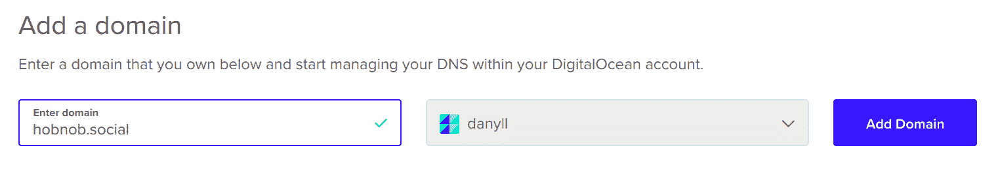

# 在 VPS 上部署我们的应用程序

在最后几章中，我们创建了一个健壮的用户目录 API，现在它已经准备好面对外部世界。因此，在本章中，我们将学习如何将我们的 API 暴露给**万维网**（**WWW**）。首先，我们需要设置一个**虚拟专用服务器**（**VPS**）来托管和提供我们的 API，并将其与一个公共的、**静态 IP 地址**关联；我们将使用流行的云服务提供商**DigitalOcean**（**DO**）来实现这两个目标。然后，为了使 API 消费者更容易使用，我们将从一个**域名注册商**购买一个**域名**，并配置其**域名系统**（**DNS**）记录以解析域名到静态 IP 地址。

通过遵循本章内容，您将：

+   学习如何设置和保障虚拟专用服务器（VPS）

+   了解**特权端口**

+   使用**PM2**保持进程活跃

+   将**NGINX**配置为我们的 API 的**反向代理**

+   理解 DNS 的架构

+   购买和配置域名

# 获取 IP 地址

互联网是一个由相互连接的机器组成的巨大网络。为了这些机器能够相互通信，每台机器都必须有一个唯一的标识符。互联网使用**TCP/IP 协议**进行通信，该协议反过来使用**IP 地址**作为其唯一的标识符。因此，将我们的 API 暴露给互联网的第一个要求是拥有一个 IP 地址。

如果您在家支付互联网费用，您也将获得由您的**互联网服务提供商**（**ISP**）提供的 IP 地址。您可以通过使用外部服务（如 [ipinfo.io](https://ipinfo.io/)）来检查您的 IP 地址：

```js
$ curl ipinfo.io/ip
146.179.207.221
```

这意味着理论上您可以使用您的家用电脑，甚至笔记本电脑来托管您的 API。然而，这样做存在以下问题：

+   大多数消费级互联网套餐提供**动态 IP 地址**，而不是静态的，这意味着您的 IP 地址可能每隔几天就会改变

+   许多互联网服务提供商（ISP）阻止端口`80`的入站流量，这是默认的 HTTP 端口

+   您需要维护自己的硬件

+   互联网连接速度可能较慢

# 管理 DNS

第一个问题可以通过使用**管理 DNS**服务（如**No-IP** ([noip.com](https://www.noip.com/)) 和 **Dyn** ([dyn.com](https://dyn.com/)))来解决，这些服务提供**动态 DNS**服务。这些服务将为您提供主机名（例如，`username.no-ip.info`）并更新主机名的 DNS **A 记录**以指向您的机器的 IP 地址（关于 DNS 记录的更多内容将在后面介绍）。这意味着任何针对该主机名的请求都将到达您关联的设备。为了使这生效，您还必须在您的设备上安装一个客户端，该客户端会频繁检查其自身的 IP 地址，并在 IP 地址更改时更新管理 DNS 服务。

第二个问题可以通过使用 **端口重定向** 来缓解，这是一种大多数托管 DNS 服务也提供的服务。首先，就像之前一样，您必须下载客户端来更新托管 DNS 服务并使用您的动态 IP。然后，将您的应用程序绑定到机器上的一个端口，该端口不会被您的 ISP 封锁。最后，您需要前往托管 DNS 服务并将到达主机名的所有流量重定向到您的设备指定的端口。

动态 DNS 只简单地更改 DNS 记录；实际上没有任何应用程序流量到达托管 DNS 服务器。另一方面，使用端口重定向时，托管 DNS 服务充当一个代理，将 HTTP 数据包重定向。如果您想尝试它们，No-IP 提供了免费的动态 DNS 服务，您可以在 [noip.com/free](https://www.noip.com/free) 上注册。

虽然对于个人使用来说，使用动态 IP 和动态 DNS 可以接受，但它远不足以可靠地用于企业。您的 IP 地址可以随时更改，这可能导致连接中断和数据丢失。在 IP 地址更新和托管 DNS 提供商意识到这一变化之间，也会存在一定的延迟，因此您永远无法实现 100% 的正常运行时间。

自行托管服务器的企业通常需要向他们的 ISP 支付静态 IP 和增强的连接速度费用。然而，这可能是昂贵的。以美国最受欢迎和最受喜爱的宽带提供商康卡斯特为例：他们最基础的消费级产品 XFINITY 性能互联网支持高达 60 Mbps 的下载速度，每月费用为 $39.99。然而，为了康卡斯特为您分配静态 IP，您必须订阅他们的企业级计划。最基础的计划——入门级互联网——支持高达 25 Mbps 的速度，每月费用为 $69.95，如果您想包括静态 IP，则为 $89.90。这显然不是性价比高的选择。

一个更好的选择是注册一个云服务提供商的账户，并在 VPS 上部署我们的应用程序。VPS 实质上是一个连接到互联网的 **虚拟机 (VM**)，并分配了自己的静态 IP 地址。在成本方面，VPS 的价格可以低至每月 $0.996！

您可以在 [lowendbox.com](https://lowendbox.com/) 找到一系列便宜的 VPS 托管提供商。

# 设置虚拟专用服务器 (VPS)

有许多 VPS 提供商，例如以下这些：

+   亚马逊弹性计算云 (Amazon EC2)：[aws.amazon.com/ec2](https://aws.amazon.com/ec2/)

+   国际商业机器公司虚拟服务器：[ibm.com/cloud/virtual-servers](https://www.ibm.com/cloud/virtual-servers)

+   谷歌云计算引擎：[cloud.google.com/compute](https://cloud.google.com/compute/)

+   微软 Azure 虚拟机：[azure.microsoft.com/services/virtual-machines](https://azure.microsoft.com/services/virtual-machines/)

+   Rackspace 虚拟云服务器：[rackspace.com/cloud/servers](https://www.rackspace.com/cloud/servers)

+   Linode：[linode.com](https://www.linode.com/)

对于这本书，我们将使用**DigitalOcean**（**DO**，[digitalocean.com](https://www.digitalocean.com/)）。我们选择 DO 是因为它有一个非常直观的用户界面（UI），在这里可以管理所有内容（VPS、DNS、块存储、监控、Kubernetes），所有这些都可以在同一个仪表板上完成。这与 AWS 不同，AWS 的用户界面过时且繁琐。

现在，前往 DO 网站 ([digitalocean.com](https://m.do.co/c/5cc901594b32)) 并创建一个账户。

你应该使用这个推荐链接：[m.do.co/c/5cc901594b32](https://m.do.co/c/5cc901594b32)；这将为你提供 10 美元的免费信用额度！

DO 将会要求你提供账单详情，但直到你使用他们的服务之前，你不会产生费用。你还应该在你的账户上设置**双因素认证**（**2FA**）以保持账户安全。

# 创建 VPS 实例

在你成功创建账户后，登录到 [cloud.digitalocean.com](https://cloud.digitalocean.com/)，点击显示创建的下拉按钮，然后选择 Droplet。

在 DO 术语中，droplet 与 VPS 相同。

# 选择镜像

你将看到一个屏幕，我们可以配置 VPS。屏幕上的第一个部分是“选择镜像”，这是我们选择 VPS 要运行的 Linux 发行版的地方。我们将为我们的 VPS 选择 Ubuntu 18.04 x64 选项。

我们选择 18.04 是因为它是一个**长期支持**（**LTS**）版本，这意味着它将在五年内接收硬件和维护更新，而标准的 Ubuntu 发布版仅支持九个月。这对于企业级服务来说很重要，因为它确保任何安全漏洞或性能更新都优先于其他标准发布版：


此图是从 Ubuntu 网站上的 Ubuntu 生命周期和发布周期页面复制的（ubuntu.com/about/release-cycle[)](https://www.ubuntu.com/about/release-cycle)

# 选择大小

接下来，我们必须选择我们的 VPS 的大小。这决定了我们可用的资源量（CPU、内存、存储和带宽）。

Elasticsearch 非常占用内存，他们的官方指南建议使用具有 16-64 GB 内存的服务器。然而，这非常昂贵。对于这本书，选择至少具有 4 GB RAM 的 VPS 应该足够了。

我们可以忽略备份和块存储选项。

块存储是与我们的 VPS 关联的额外磁盘空间。例如，如果我们托管文件服务器或 Image API，我们可能希望添加额外的磁盘空间来存储这些文件/图片；购买纯磁盘空间比运行带有操作系统的 VPS 更便宜。

# 选择数据中心区域

接下来，我们必须选择我们的 VPS 将驻留的数据中心。

互联网上的不同机器通过相互发送消息进行通信。一条消息必须在到达接收者机器之前“跳跃”通过一系列代理服务器，这需要时间。一般来说，消息必须进行的跳跃越多，延迟越长。

因此，您应该选择离您的目标用户最近的数据中心。例如，如果您的目标受众主要基于英国，那么您会选择伦敦数据中心。

# 选择附加选项

接下来，选择以下附加选项：

+   **私有网络**：这为每个 VPS 实例提供了一个内部 IP 地址，允许同一数据中心部署的服务相互通信。在撰写本文时，此选项是免费的，并且不计入您的月度带宽配额。

+   **IPv6**：IPv4 可以支持高达 4,294,967,296 个唯一的 IP 地址。互联网的增长如此之快，以至于我们接近了这一限制。因此，IPv6 将 IP 地址的位数从 32 位增加到 128 位，产生了 340,282,366,920,938,463,463,374,607,431,768,211,456 个地址。通过选择此选项，我们允许用户使用 IPv6 地址来定位我们的服务器。

+   **监控**：收集服务器上的系统指标，如 CPU、内存、磁盘 I/O、磁盘使用率、公共/私有带宽，并在服务器运行接近限制时发出警报：


# 命名您的服务器

最后，为您的服务器选择一个主机名。这将在 DigitalOcean 的管理面板中显示，因此请选择一个您容易记住的名称。

当您有大量机器时，设置一个命名约定可能值得考虑，其中机器的名称本身传达了有关其用途的信息。例如，您的命名约定可能如下所示：

```js
[environment].[feature].[function][replica]
```

例如，如果我们有一台机器在预发布环境中作为授权服务的负载均衡器，其主机名可能为 `staging.auth.lb1`。

这在您使用终端登录多个服务器时非常有用——它们看起来都一样！您确定正在操作哪台机器的唯一方法是通过查看提示中打印的主机名：

```js
hobnob@staging.auth.lb1:~$
```

如果您只为个人使用设置服务器，请随意发挥创意命名。流行的惯例包括使用行星、周期性元素、动物和汽车型号的名称。我个人会根据细胞中不同的组成部分来命名我的机器：细胞核、核仁、囊泡、细胞质、溶酶体和核糖体。

另一篇值得阅读的文章是 *为您的计算机命名* ([ietf.org/rfc/rfc1178](https://www.ietf.org/rfc/rfc1178))。

目前，因为我们只有一台机器，让我们指定一个简单的名称，`hobnob`，然后点击创建！

# 连接到 VPS

点击创建后，DigitalOcean 将为您配置一个新的 VPS。您还将收到一封包含登录说明的电子邮件：

```js
From: DigitalOcean <support@support.digitalocean.com>
Subject: Your New Droplet: hobnob
Your new Droplet is all set to go! You can access it using the following credentials:

Droplet Name: hobnob
IP Address: 142.93.241.63
Username: root
Password: 58c4abae102ec3242ddbb26372

Happy Coding,
Team DigitalOcean
```

使用这些凭证，通过 SSH 以`root`管理员用户连接到您的服务器：

```js
$ ssh root@<server-ip>
```

在这里，`<server-ip>`是您服务器的 IP 地址（在我们的示例中为`142.93.241.63`）。这将提示您输入密码；输入您在电子邮件中收到的密码。登录后，服务器将要求您更改 root 密码：

```js
$ ssh root@142.93.241.63
The authenticity of host '142.93.241.63 (142.93.241.63)' can't be established.
ECDSA key fingerprint is SHA256:AJ0iVdifdlEOQNYvvhwZc0TAsi96JtWJanaRoW29vxM.
Are you sure you want to continue connecting (yes/no)? yes
root@142.93.241.63's password: 58c4abae102ec3242ddbb26372
You are required to change your password immediately (root enforced)
...
Changing password for root.
(current) UNIX password: 58c4abae102ec3242ddbb26372
Enter new UNIX password: <your-new-password>
Retype new UNIX password: <your-new-password>
root@hobnob:# 
```

太好了！您已成功创建虚拟服务器并登录到其中。

对于本章中的代码块，我们将在任何旨在在远程虚拟服务器上运行的命令之前添加`<user>@hobnob:`提示，对于应在本地运行的命令，我们将使用正常的提示`$`。

# 设置用户账户

目前，我们是以`root`身份登录的，这是具有所有权限的机器的管理用户。这意味着`root`用户可以执行危险的操作，例如使用`rm -rf /`删除系统中的所有文件。如果恶意用户获得了您的`root`账户访问权限，或者您不小心发出了错误的命令，那么就无法回头了；大多数这些操作都是不可逆的。

因此，为了保护我们的服务器免受恶意行为和人为错误的侵害，建议不要在日常使用中频繁使用`root`。相反，我们应该设置一个具有降低权限的账户，并且只有在需要时（例如，安装系统级软件时）才使用 root 权限。

# 创建新用户

首先，我们必须创建一个新用户。在仍然以`root`身份登录的情况下，运行`adduser <username>`，将`<username>`替换为您的用户名（我们将使用`hobnob`作为用户名）。这将启动一个向导，要求您提供有关用户的信息，并输入密码。之后，将创建一个名为`hobnob`的新用户，其主目录位于`/home/hobnob`：

```js
root@hobnob:# adduser hobnob
Adding user `hobnob' ...
Adding new group `hobnob' (1000) ...
Adding new user `hobnob' (1000) with group `hobnob' ...
Creating home directory `/home/hobnob' ...
Copying files from `/etc/skel' ...
Enter new UNIX password: <your-password>
Retype new UNIX password: <your-password>
passwd: password updated successfully
Changing the user information for hobnob
Enter the new value, or press ENTER for the default
  Full Name []: Daniel Li
  Room Number []: 
  Work Phone []: 
  Home Phone []: 
  Other []: 
Is the information correct? [Y/n] Y
```

现在我们有一个具有降低权限的用户，我们可以使用它来执行日常命令。尝试使用不同的终端，使用您新用户的用户名和密码登录：

```js
$ ssh hobnob@142.93.241.63
hobnob@142.93.241.63's password: <your-hobnob-user-password>
hobnob@hobnob:$ 
```

太好了！我们已经创建了一个具有降低权限的用户账户，并且能够使用这个新账户访问服务器。但是，由于权限有限，我们甚至无法执行简单的管理任务。尝试通过运行 `apt update` 来更新软件包列表；这将产生一个错误，显示 `Permission denied`，因为这个操作需要 root 权限：

```js
hobnob@hobnob:$ apt update
Reading package lists... Done
E: Could not open lock file /var/lib/apt/lists/lock - open (13: Permission denied)
E: Unable to lock directory /var/lib/apt/lists/
W: Problem unlinking the file /var/cache/apt/pkgcache.bin - RemoveCaches (13: Permission denied)
W: Problem unlinking the file /var/cache/apt/srcpkgcache.bin - RemoveCaches (13: Permission denied)
```

然而，如果我们用我们的`root`用户运行相同的命令，它将成功执行：

```js
root@hobnob:# apt update
Hit:1 https://repos.sonar.digitalocean.com/apt main InRelease
...
Hit:5 http://nyc2.mirrors.digitalocean.com/ubuntu bionic-backports InRelease
Reading package lists... Done
Building dependency tree 
Reading state information... Done
```

# 将用户添加到 sudo 组

如果我们打算在日常使用中经常使用`hobnob`账户，每次想要安装东西时都需要切换到`root`账户将会很烦人。幸运的是，在 Linux 中，可以为每个用户以及命名的用户组分配权限。Linux 提供了一个`sudo`组，允许该组内的用户通过在命令前加上`sudo`关键字并输入他们的密码来运行需要`root`权限的命令。因此，我们应该将我们的`hobnob`用户账户添加到`sudo`组中。

在仍然以 `root` 身份登录的情况下，运行以下命令：

```js
root@hobnob:# usermod -aG sudo hobnob
```

`-G` 选项指定我们将用户添加到的组，而 `-a` 标志会将用户添加到该组中，而不会从其他组中删除他们。

现在，尝试以 `hobnob` 账户运行 `sudo apt update`；它将提示您输入密码，然后它将像 `root` 用户一样执行该命令！

# 设置公钥认证

到目前为止，我们一直使用基于密码的认证来访问我们的服务器；这既麻烦又不安全，因为恶意方只需猜测您的密码即可访问您的服务器。最好使用公钥认证，它有以下好处：

+   不可猜测：密码往往有几种常见的模式（例如，`abcd1234` 或 `password`），而 SSH 密钥看起来像是乱码，难以暴力破解

+   可管理性：`ssh-agent` 是一个程序，它可以保存私钥，这样您就不必记住密码

# 检查现有的 SSH 密钥

首先，检查您是否已经在本地机器上设置了 SSH 密钥对。通常，SSH 密钥存储在您家目录下的 `.ssh` 目录中：

```js
$ cd ~/.ssh/ && ls -ahl
total 116K
drwx------  2 dli dli 4.0K Jul 10 10:39 .
drwxr-xr-x 94 dli dli  16K Sep 12 18:59 ..
-rw-r--r--  1 dli dli  151 Mar  6  2018 config
-rw-------  1 dli dli 3.2K Oct  2  2017 id_rsa
-rw-r--r--  1 dli dli  740 Oct  2  2017 id_rsa.pub
-rw-r--r--  1 dli dli  80K Sep 12 19:08 known_hosts
```

如果您看到类似以下内容的输出，则您已经有一个 SSH 密钥，可以跳到 *将 SSH 密钥添加到远程服务器* 部分；否则，继续创建 SSH 密钥。

密钥基本上是一个非常长、随机的字符串，它代替了您的密码。当您将密钥与服务器关联时，您可以使用该密钥对该服务器进行身份验证。因此，您可能有多个密钥，每个密钥都与不同的服务器关联。

这也意味着即使您已经有了密钥，您也可以为这次练习创建一个新的密钥。但通常，大多数开发者为每台开发机器有一个密钥。

# 创建 SSH 密钥

我们将使用名为 `ssh-keygen` 的程序来生成我们的 SSH 密钥。运行以下命令：

```js
$ ssh-keygen -t rsa -b 4096 -C <your-email-address>
```

在这里，我们向 `ssh-keygen` 传递了一些参数，指示它使用 **Rivest-Shamir-Adleman**（**RSA**）加密算法生成长度为 4,096 位的密钥对。默认情况下，`ssh-keygen` 使用 2,048 位的密钥长度，这应该足够了，但既然 4,096 位更难暴力破解，为什么不享受那一点额外的安全性呢？

可以使用许多算法来生成密钥对。`ssh-keygen` 接受 **DSA**、**RSA**、**Ed25519** 和 **ECDSA**。

DSA 是一种过时的算法，已被 RSA 取代，不应使用。Ed25519 和 **椭圆曲线数字签名算法**（**ECDSA**）是新一代的加密算法，依赖于某些非常特定的椭圆曲线的数学性质。它们可能最终会取代 RSA，因为它们可以提供相同级别的安全性，但密钥更短。

您可以通过运行 `ssh-keygen -t ecdsa -b 521`（注意 `521` 不是一个打字错误）来使用 ECDSA 替代 RSA，或者通过运行 `ssh-keygen -t ed25519` 来使用 Ed25519。

执行命令后，向导将询问您几个问题：

+   `输入保存密钥的文件`：默认情况下，密钥将被保存在您家目录下的`.ssh`目录下。

+   `输入密码`/`再次输入相同的密码`：任何有权访问您的私钥的人都能登录到您的服务器。如果您想采取额外的安全措施来保护您的私钥，您可以在其上设置密码。这样做意味着只有拥有您的私钥和密码的人才能登录。

在无法进行用户输入的环境中运行的程序可能必须使用不带密码的 SSH 密钥；否则，建议设置密码。

在回答了这些问题后，`ssh-keygen`将生成一个私钥（`id_rsa`）/公钥（`id_rsa.pub`）对，并将它们保存在`~/.ssh`目录下：

```js
Your identification has been saved in $HOME/.ssh/id_rsa.
Your public key has been saved in $HOME/.ssh/id_rsa.pub.
```

如果您没有在您的私钥上设置密码，任何拥有您的私钥的人都能访问使用相应公钥来验证您的任何服务器。因此，一般来说，**永远不要共享您的私钥**。

# 将 SSH 密钥添加到远程服务器

现在我们有了 SSH 密钥对，我们需要设置我们的虚拟服务器以接受这个密钥。

在您的本地机器上，使用`cat`命令将您的公钥内容打印到终端并复制到剪贴板（例如，使用*Ctrl* + *Shift* + *C*）：

```js
$ cat ~/.ssh/id_rsa.pub
ssh-rsa AAAAB3NzaC1yc2EAAAADAQABAAACAQC0TG9QcuUeFFtcXLqZZNO6/iggvuoLkQzlZQGbnSd39M+kLjRii+ziMBq8gL1pZUOBLWZUr6c+5DiCSOQCWtduTnHq6hR7/XkRthoS3bsdplr/6SHdxW/GTkVUjAv/DWcdJ93tx5ErkFsGsWklKM2U5wRMNA1g6k3ooc1N21zftBQKp9K+vrUW/iporjvy2Y8Dicp2VRUiOZIediDLYSZUXI/mc9eLziZivhsQtFYOZQSFMuBRBX7q4RA6XTBdnjORac1oVhVHi1NlU7ZmkWeJUECEFxncrYsp976p4tAKNOijpQMDhpKYdZT4OS83r33cIA2mdnNfK1SL1zntfoYYh+s3KODbnvoZcqCn4oar6ZPxgL9E4oqOF5Td+VQv8yRdxKstwQAgV6Yu0Ll/gJ0Z0k5xxw6SS3u/9J6Wx2q85eZLJl0o1dxHcofhQ1UZrJOZ23YnUsrDhHvqZRpHjkfXCPgDOWVNzdpTQPYbUttVuHsFw5HqjfVb5Pco4HlzhS4qCG91UkC7+tDMc6zXsaal9Sh4YIQE0RDDkRV3k3fFLYLMnxK4NCydPX9E9Fcaneopr+o1mauiNvdQLjALL4t8Bz8P0KSvfIGhu0suaQEIJamrdzPFcXigQn2IK719Ur8/0sxqbXAblzRauJ0qrYyvOXx3/1G+4VywN40MyY7xdQ== dan@danyll.com
```

或者，您可以使用`xclip`将您的公钥内容直接复制到剪贴板。

`$ xclip -selection clipboard < ~/.ssh/id_rsa.pub`

现在，如果您还没有这样做，请使用您的密码以`root`身份登录到远程服务器。接下来，如果它们尚未存在，创建`~/.ssh`目录和`~/.ssh/authorized_keys`文件。`authorized_keys`文件列出了服务器接受的有效凭据的密钥：

```js
root@hobnob:# mkdir ~/.ssh
root@hobnob:# touch ~/.ssh/authorized_keys
```

接下来，设置文件的权限，以确保只有当前用户（`root`）可以读取该文件：

```js
root@hobnob:# chmod 700 ~/.ssh
root@hobnob:# chmod 600 ~/.ssh/authorized_keys
```

然后，将您刚刚复制的公钥追加到`authorized_keys`文件的末尾（例如，使用`vim`或`nano`）：

```js
root@hobnob:# vim ~/.ssh/authorized_keys
```

最后，我们需要重新加载 SSH 守护进程以确保我们的更改已更新：

```js
root@hobnob:# systemctl reload ssh.service
```

为了测试这是否正常工作，打开一个新的终端窗口并运行`ssh root@<remote-ip>`：

```js
$ ssh root@142.93.241.63
root@hobnob:# 
```

这次，服务器不再要求您输入密码，因为它正在使用我们的 SSH 密钥进行验证。

# 使用 ssh-copy-id

接下来，我们需要为我们的`hobnob`用户做同样的事情。但这次，我们将使用一个方便的命令行工具`ssh-copy-id`，它将执行之前描述的所有操作，但只需一个命令：

```js
$ ssh-copy-id hobnob@142.93.241.63
```

# 提供额外的安全

在我们继续之前，我们可以采取一些额外的措施来使我们的设置更加安全。

# 禁用基于密码的认证

尽管我们现在可以使用 SSH 密钥登录，但我们仍然允许通过密码登录。一个链条的强度取决于其最薄弱的环节，一个系统的安全性也取决于其最不安全的组件。因此，既然我们可以使用 SSH 登录，最好是禁用密码登录。

在禁用基于密码的认证之前，请务必确认您可以使用 SSH 密钥登录到您的服务器；否则，您将被锁定在服务器之外。

在远程虚拟服务器上，打开 SSH 守护进程的配置文件`/etc/ssh/sshd_config`（请注意，这不同于`/etc/ssh/ssh_config`，后者是*SSH 客户端*的配置文件）。搜索名为`PasswordAuthentication`的条目并将其设置为`no`：

```js
PasswordAuthentication no
```

再次，重新加载 SSH 守护进程以确保它已更新我们的更改：

```js
root@hobnob:# systemctl reload ssh.service
```

# 禁用 root 登录

我们不应该就此止步。现在我们已经可以访问具有`sudo`权限的用户，我们不再需要以`root`身份登录。因此，我们应该通过`sshd_config`中的另一个配置条目禁用 root 登录。

找到`PermitRootLogin`条目并将其设置为`no`：

```js
PermitRootLogin no
```

重新加载 SSH 守护进程以确保此更改生效：

```js
root@hobnob:# systemctl reload ssh.service
```

现在，从你的本地机器尝试以`root`身份登录；你应该会收到一个错误：

```js
$ ssh root@142.93.241.63
Permission denied (publickey).
```

# 防火墙

保障我们服务器安全性的最后一步是安装防火墙。防火墙背后的理念是每个暴露的端口都是一个潜在的安全漏洞。因此，我们希望尽可能少地暴露端口。

所有 Linux 发行版都自带一个名为`iptables`的防火墙，默认情况下允许所有流量通过。手动配置`iptables`可能具有挑战性，因为其格式不是最直观的。例如，一个非活动的`iptables`配置看起来像这样：

```js
$ sudo iptables -L -n -v
Chain INPUT (policy ACCEPT 0 packets, 0 bytes)
 pkts bytes target     prot opt in     out     source               destination 

Chain FORWARD (policy ACCEPT 0 packets, 0 bytes)
 pkts bytes target     prot opt in     out     source               destination 

Chain OUTPUT (policy ACCEPT 0 packets, 0 bytes)
 pkts bytes target     prot opt in     out     source               destination 
```

为了帮助系统管理员更容易地管理`iptables`防火墙，Ubuntu 发行版附带了一个名为`ufw`的命令行程序（简称为**u**ncomplicated **f**ire**w**all），我们将在这里使用它。

`ufw`默认情况下是禁用的，但在我们启用它之前，让我们为它添加一些规则来强制执行：

```js
hobnob@hobnob:$ sudo ufw status
Status: inactive
```

目前我们只需要暴露一个端口，那就是 SSH 端口`22`。我们可以通过直接添加单个端口来实现这一点：

```js
hobnob@hobnob:$ sudo ufw allow 22
```

然而，有一个更简单的方法：服务可以将其*配置文件*注册到`ufw`，允许`ufw`通过名称管理它们的端口。您可以通过运行`ufw app list`来查看已注册应用程序的列表：

```js
hobnob@hobnob:$ sudo ufw app list
Available applications:
 OpenSSH
```

因此，我们不必指定端口`22`，我们可以指定应用程序的名称：

```js
hobnob@hobnob:$ sudo ufw allow OpenSSH
Rules updated
Rules updated (v6)
```

现在规则已经就位，我们可以启用`ufw`：

```js
hobnob@hobnob:$ sudo ufw enable
Command may disrupt existing ssh connections. Proceed with operation (y|n)? y
Firewall is active and enabled on system startup
```

现在，当我们再次检查时，只有 OpenSSH 端口（`22`）是开放的：

```js
hobnob@hobnob:$ sudo ufw status
Status: active

To            Action   From
--            ------   ----
OpenSSH       ALLOW    Anywhere
OpenSSH (v6)  ALLOW    Anywhere (v6)
```

# 配置时区

最后，我们应该将所有服务器配置为使用协调世界时（UTC）时区。使用单一时区可以防止我们在同时访问多个服务器时需要跟踪每个服务器所在的时区：

```js
hobnob@hobnob:$ sudo dpkg-reconfigure tzdata
```

在运行命令后，你会看到以下屏幕。使用你的上/下箭头键选择“以上皆不是”。然后，使用你的左/右箭头键选择“确定”并按回车键：


在下一个屏幕上，选择 UTC，代表**协调世界时**：


您应该在终端上获得确认：

```js
Current default time zone: 'Etc/UTC'
Local time is now:      Wed Sep 12 18:54:39 UTC 2018.
Universal Time is now:  Wed Sep 12 18:54:39 UTC 2018.
```

我们已经设置了时区，但为了确保时钟准确，我们需要执行一个额外的步骤，使其与全球 NTP 服务器保持同步：

```js
hobnob@hobnob:$ sudo apt update
hobnob@hobnob:$ sudo apt install ntp
```

这将安装并运行 `ntp` 守护进程，它将在启动时自动启动，与这些全球 NTP 服务器同步，并在必要时更新系统时间。

恭喜！您现在已成功设置并保护了一个 VPS！我们现在可以继续部署我们的 API 到上面。

# 运行我们的 API

在我们可以在 VPS 上运行我们的 API 之前，我们需要安装它所依赖的软件和库，包括 Git、Node、yarn、**Java 开发工具包**（**JDK**）和 Elasticsearch：

```js
hobnob@hobnob:$ curl -sS https://dl.yarnpkg.com/debian/pubkey.gpg | sudo apt-key add -
hobnob@hobnob:$ echo "deb https://dl.yarnpkg.com/debian/ stable main" | sudo tee /etc/apt/sources.list.d/yarn.list
hobnob@hobnob:$ sudo apt update && sudo apt install yarn git default-jdk
hobnob@hobnob:$ curl -o- https://raw.githubusercontent.com/creationix/nvm/v0.33.11/install.sh | bash
hobnob@hobnob:$ echo 'JAVA_HOME="/usr/lib/jvm/java-8-openjdk-amd64"' | sudo tee --append /etc/environment > /dev/null
hobnob@hobnob:$ cd && wget https://artifacts.elastic.co/downloads/elasticsearch/elasticsearch-6.3.2.deb
hobnob@hobnob:$ sudo dpkg -i elasticsearch-6.3.2.deb
hobnob@hobnob:$ rm elasticsearch-6.3.2.deb
hobnob@hobnob:$ sudo systemctl start elasticsearch.service
hobnob@hobnob:$ sudo systemctl enable elasticsearch.service
```

为了防止权限问题，我们将把我们的应用程序代码放在 `/home/hobnob/` 目录下，并以 `hobnob` 用户身份运行。因此，创建一个新的项目目录，从远程仓库克隆我们的 API 仓库，安装所需的 Node.js 版本，使用 `yarn` 安装所有依赖项，并运行应用程序：

```js
hobnob@hobnob:$ cd && mkdir projects && cd projects
hobnob@hobnob:$ git clone https://github.com/d4nyll/hobnob.git
hobnob@hobnob:$ cd hobnob && nvm install && yarn
```

如果您想将 API 放置在用户主目录之外的目录中，例如 `/srv/` 或 `/var/www/`，那么您不能使用 nvm，因为 nvm 会将 Node.js 二进制文件安装到安装者的主目录下。相反，您需要使用名为 `n` 的 npm 包全局安装 Node.js ([github.com/tj/n](https://github.com/tj/n))。

您绝对不能做的事情是作为 `root` 用户运行 API，因为这会带来巨大的安全风险。

接下来，我们需要设置正确的环境变量。`*.env.example` 文件中的设置应该直接可用，因此我们可以直接复制它们：

```js
hobnob@hobnob:$ cd env/
hobnob@hobnob:$ cp .env.example .env
hobnob@hobnob:$ cp test.env.example test.env
hobnob@hobnob:$ cd ../ && yarn run serve
```

网站现在将运行在我们 `.env` 文件中指定的端口上，即 `8080`。为了使其对外可用，我们必须更新我们的防火墙，允许进入端口 `8080` 的流量。打开一个新的终端并运行以下命令：

```js
hobnob@hobnob:$ sudo ufw allow 8080
```

在您的浏览器中，导航到 `http://<vps-ip-address>:8080/`，您应该会看到一个错误，内容如下：

```js
Cannot GET /
```

这意味着 Express 正在工作；错误响应正确地告诉我们端点不存在。您可以随意尝试部署的 API。它应该与之前一样工作。

# 使用 PM2 保持我们的 API 运行

我们正在一个短暂的 SSH 会话中运行我们的 Node.js 进程。当我们登出时，主机机将杀死在该会话期间启动的所有进程。因此，我们需要想出一个方法，即使在登出后也能让我们的进程保持运行。

此外，无论我们的代码库有多好，或者我们的测试计划有多完整，在任何一个大型应用程序中，都难免会有错误。有时，这些错误是致命的，会导致应用程序崩溃。在这些情况下，我们应该记录错误并通知开发者，但最重要的是，我们应该在应用程序崩溃后立即重启它。

Ubuntu 提供了 `upstart` 守护进程（[upstart.ubuntu.com](http://upstart.ubuntu.com/)），它可以监控一个服务，并在服务意外死亡时重新启动它。同样，还有一个流行的 npm 包名为 `forever`（[github.com/foreverjs/forever](https://github.com/foreverjs/forever)），它执行类似的任务。然而，我发现 PM2（[pm2.keymetrics.io](http://pm2.keymetrics.io/)）是市面上最好的进程管理器，因此我们将在本书中使用它。

首先，将 PM2 安装为开发依赖项：

```js
$ yarn add pm2 --dev
```

然后，更新我们的 `serve` npm 脚本来执行 `pm2 start` 而不是 `node`：

```js
"serve": "yarn run build && dotenv -e envs/.env pm2 start dist/index.js"
```

现在，将这些更改从您的本地机器推送到虚拟服务器。再次运行 `yarn` 以安装 `pm2`，然后运行 `yarn run serve`；现在，我们的进程由 PM2 而不是 `hobnob` 用户管理。这意味着即使您注销或断开连接，我们的 Node.js 进程仍然会继续运行：

```js
hobnob@hobnob:$ yarn run serve
...
[PM2] Starting /home/hobnob/projects/hobnob/dist/index.js in fork_mode (1 instance)
[PM2] Done.
┌──────────┬────┬───────┬────────┬─────────┬────────┬─────┬─────────┐
│ App name │ id │ pid   │ status │ restart │ uptime │ cpu │ mem     │
├──────────┼────┼───────┼────────┼─────────┼────────┼─────┼─────────┤
│ index    │  0 │ 15540 │ online │ 0       │ 0s     │ 1%  │ 21.9 MB │
└──────────┴────┴───────┴────────┴─────────┴────────┴─────┴─────────┘
 Use `pm2 show <id|name>` to get more details about an app
```

PM2 的好处之一是其用户界面对于 CLI 工具来说非常出色。如果我们运行 `npx pm2 monit`，您将获得一个包含所有运行进程的仪表板，并且您可以使用鼠标实时查看状态、资源使用情况和其他统计数据：

```js
┌─ Process list ────┐┌─ Global Logs ──────┐
│[ 0] index         ││                    │
└───────────────────┘└────────────────────┘
┌─ Custom metrics  ─┐┌─ Metadata ─────────┐
│ Loop delay      o ││ App Name     index │
│ de-metrics)       ││ Restarts     0     │
│                   ││ Uptime       10m   │
└───────────────────┘└────────────────────┘
```

# 终止进程

要查看 PM2 的实际运行情况，我们将手动终止 Node.js 进程，并观察 PM2 是否会自动重启它。我们将使用 `npx pm2 list` 命令，该命令以静态表格的形式列出所有进程：

```js
hobnob@hobnob:$ npx pm2 list
┌───────┬────┬───────┬────────┬───┬────────┬─────┬─────────┐
│ Name  │ id │ pid   │ status │ ↺ │ uptime │ cpu │ mem     │
├───────┼────┼───────┼────────┼───┼────────┼─────┼─────────┤
│ index │ 0  │ 15540 │ online │ 0 │ 20m    │ 0%  │ 40.8 MB │
└───────┴────┴───────┴────────┴───┴────────┴─────┴─────────┘
hobnob@hobnob:$ kill 15540
hobnob@hobnob:$ npx pm2 list
┌───────┬────┬───────┬────────┬───┬────────┬─────┬─────────┐
│ Name  │ id │ pid   │ status │ ↺ │ uptime │ cpu │ mem     │
├───────┼────┼───────┼────────┼───┼────────┼─────┼─────────┤
│ index │ 0  │ 16323 │ online │ 1 │ 2s     │ 0%  │ 47.9 MB │
└───────┴────┴───────┴────────┴───┴────────┴─────┴─────────┘
```

如您所见，当旧进程死亡后，`pm2` 启动了一个新的进程，具有不同的 **进程 ID**（**PID**），并且重启次数也增加到了 1。

# 保持 PM2 运行

只要 PM2 本身正在运行，它就会保持应用程序的运行。但是，如果 PM2 本身被终止（例如，由于重启），那么我们还必须配置 PM2 以自动重启。非常方便的是，PM2 提供了一个 `startup` 命令，它会为您在终端上运行输出一个脚本：

```js
hobnob@hobnob:$ npx pm2 startup
[PM2] Init System found: systemd
[PM2] To setup the Startup Script, copy/paste the following command:
sudo env PATH=$PATH:/home/hobnob/.nvm/versions/node/v8.11.4/bin /home/hobnob/projects/hobnob/node_modules/pm2/bin/pm2 startup systemd -u hobnob --hp /home/hobnob
```

运行脚本以确保 PM2 在启动时启动。现在，当您从终端会话注销，或者应用程序意外崩溃，甚至整个机器重启时，您可以有信心应用程序会尽快自动重启。

# 在端口 80 上运行我们的 API

我们目前将 API 服务器运行在端口 `8080` 上，而 HTTP 请求的标准端口是端口 `80`。要求 API 的消费者为每个请求将端口号附加到 URL 上将非常不方便，这对用户体验来说也是不利的。

因此，让我们将 Express 监听的端口从 `8080` 更改为 `80`，看看会发生什么。将 `SERVER_PORT` 环境变量更改为 `80`：

```js
SERVER_PORT=80
```

然后，停止并删除 PM2 应用程序，再次运行 `serve` 脚本。当我们再次运行它时，它最初会成功：

```js
hobnob@hobnob:$ npx pm2 delete 0; yarn run serve
...
[PM2] Done.
┌───────┬──────┬────────┬───┬─────┬─────────┐
│ Name  │ mode │ status │ ↺ │ cpu │ memory  │
├───────┼──────┼────────┼───┼─────┼─────────┤
│ index │ fork │ online │ 0 │ 0%  │ 16.9 MB │
└───────┴──────┴────────┴───┴─────┴─────────┘
```

然而，当我们再次检查其状态时，PM2 将显示应用程序已出现错误，并且在放弃之前尝试重启了 15 次：

```js
hobnob@hobnob:$ npx pm2 status
┌───────┬──────┬─────────┬────┬─────┬────────┐
│ Name  │ mode │ status  │ ↺  │ cpu │ memory │
├───────┼──────┼─────────┼────┼─────┼────────┤
│ index │ fork │ errored │ 15 │ 0%  │ 0 B    │
└───────┴──────┴─────────┴────┴─────┴────────┘
```

我们可以使用 `pm2 show <name>` 命令来获取特定进程的信息：

```js
hobnob@hobnob:$ npx pm2 show index
```

从输出中，我们可以看到应用程序产生的错误存储在 `/home/hobnob/.pm2/logs/index-error.log`，因此让我们看看它说了什么：

```js
hobnob@hobnob:$ tail -n11 /home/hobnob/.pm2/logs/index-error.log
Error: listen EACCES 0.0.0.0:80
 at Object._errnoException (util.js:1031:13)
    ...
```

`EACCES 0.0.0.0:80` 错误意味着我们的 Node.js 进程没有权限访问端口 `80`。这是因为，在 Linux 中，低于 `1024` 的端口被认为是 **特权端口**，这意味着它们只能被由 `root` 用户启动的进程绑定。

# 特权端口

除了对开发者体验不好之外，还有一个更重要理由说明为什么我们的 API 应该在 **特权端口** 上提供服务：当 API 的消费者向我们发送数据时，他们需要信任他们发送的信息只由服务器管理员（通常是 `root`）处理，而不是由某个恶意方处理。

假设一个恶意方以某种方式成功入侵我们的服务器并获得了普通用户账户的访问权限。如果我们已经将我们的 API 端口设置为非特权端口，那么那个恶意用户可以启动一个修改过的、恶意的 API 服务，并将其绑定到该端口，并使用它来提取敏感信息，例如用户密码。现在，任何客户端发送到该端口的任何信息都将暴露给恶意方。

然而，特权端口只能由 `root` 用户绑定，因此恶意用户将无法再执行攻击。

# 可能的解决方案

然而，我们控制着服务器，那么我们如何允许我们的 API 服务在端口 `80` 上运行呢？我们将在稍后概述一些解决方案，但要看到它们的工作情况，我们首先应该禁用端口 `8080` 并启用端口 `80`：

```js
hobnob@hobnob:$ sudo ufw allow 80
hobnob@hobnob:$ sudo ufw delete allow 8080
```

# 以 root 运行

最直接的方法是将我们的 Node 进程作为 `root` 运行；换句话说，类似于 `sudo node src/index.js`。然而，这是一个非常糟糕的想法，因为它存在很大的安全风险。如果有人发现了你应用程序中的漏洞或漏洞，他/她可以利用它，因为服务器进程是以 `root` 权限运行的，黑客可以潜在地做 `root` 用户能做的任何事情，包括清除你的整个机器或窃取数据。以普通用户身份运行 API 服务器将限制任何潜在损害到该用户通常可接受的范围。

# 降低权限

然而，有一个技巧允许你使用 `sudo` 以 `root` 权限启动进程，但随后可以通过将进程的用户和组身份设置为发出 `sudo` 命令的用户/组来降低权限。我们通过使用环境变量 `SUDO_UID` 和 `SUDO_GID` 并使用 `process.setgid` 和 `process.setuid` 来设置它们来完成此操作：

```js
app.listen(process.env.SERVER_PORT, async () => {
  const sudoGid = parseInt(process.env.SUDO_GID);
 const sudoUid = parseInt(process.env.SUDO_UID);
 if (sudoGid) { process.setuid(sudoGid) }
 if (sudoUid) { process.setuid(sudoUid) }
  ...
});
```

# 设置能力

另一个解决方案是设置 **能力**。

在 Linux 上，当线程或进程需要某些权限来执行操作时，例如读取文件或绑定到端口，它会检查权限列表。如果它具有该权限，它将能够执行该功能；否则，它不能。默认情况下，`root` 用户具有所有权限，例如，`CAP_CHOWN` 权限，它允许它更改文件的 UID 和 GID。

因此，我们不必以 `root` 身份运行进程，而可以简单地授予我们的 Node 进程绑定到专用端口的权限：

```js
hobnob@hobnob:$ sudo setcap CAP_NET_BIND_SERVICE=+ep $(which node)
```

您可以通过运行 `getcap` 来检查此进程是否设置了权限：

```js
hobnob@hobnob:$ sudo getcap $(which node)
~/.nvm/versions/node/v8.9.0/bin/node = cap_net_bind_service+ep
```

现在，当我们运行 `npx pm2 delete 0; yarn run serve` 时，它将成功绑定到端口 `80`。

然而，如果我们使用 nvm 更新 Node.js 版本，我们就必须为这个新版本的 Node 设置权限。此外，这个权限不仅限于绑定到端口 `80`；它是用于绑定到 **所有** 专用端口的。这是一个潜在的安全漏洞。因此，最好不使用这种方法，我们应该取消设置权限：

```js
hobnob@hobnob:$ sudo setcap -r $(which node)
hobnob@hobnob:$ sudo getcap $(which node)
[No output]
```

# 使用 authbind

使用 `authbind` 作为替代方案可能比设置权限更可取。`authbind` 是一个系统实用程序，允许没有超级用户权限的用户访问特权网络服务，包括绑定到特权端口：

```js
hobnob@hobnob:$ sudo apt install authbind
```

与设置权限相比，`authbind` 在端口和权限方面提供了更细粒度的控制。`authbind` 的配置文件位于 `/etc/authbind`。简而言之，如果用户有权访问 `/etc/authbind/byport/<port>` 文件，则该用户能够绑定到该端口：

```js
hobnob@hobnob:$ sudo touch /etc/authbind/byport/80
hobnob@hobnob:$ sudo chown hobnob /etc/authbind/byport/80
hobnob@hobnob:$ sudo chmod 500 /etc/authbind/byport/80
```

在这里，我们正在为端口 `80` 创建一个配置文件，将其所有者更改为运行 API 服务器用户，并设置权限，以便只有 `hobnob` 可以读取它。现在，我们可以使用 `authbind` 运行我们的启动脚本，并且它应该可以工作：

```js
hobnob@hobnob:$ npx pm2 delete 0; authbind --deep yarn run serve
```

# 使用 iptables

另一种解决方案是使用 `iptables`，这是我们之前使用的同一防火墙。除了阻止来自某些端口的流量外，`iptables` 还允许您将流量从一个端口重定向到另一个端口。因此，我们可以简单地将所有进入端口 `80` 的流量路由到端口 `8080`：

```js
hobnob@hobnob:$ sudo iptables -t nat -I PREROUTING -p tcp --dport 80 -j REDIRECT --to-port 8080
```

# 使用反向代理

如您所欣赏的，作为非 root 用户绑定到端口 `80` 的方法有很多，而且我们的列表甚至不是详尽的！然而，最流行的方法是使用 **反向代理** 服务器将流量从一个端口重定向到另一个端口。

# 什么是代理？什么是反向代理？

**代理** 是客户端用于间接访问其他服务器的服务器。从服务器的角度来看，它将把代理服务器视为客户端，而不会意识到原始客户端。代理服务器是您请求在从您的机器到远程服务器时经过的中介服务器。

**反向代理**与此类似，但方案是颠倒的。这是反向代理的工作原理：

1.  反向代理接收请求

1.  它将请求转发到代理服务（例如，一个应用程序服务器，如我们的 Express 应用程序）

1.  它从服务接收响应

1.  它将响应发送回客户端（们）

客户端对内部服务的存在一无所知；在客户端看来，响应是直接从反向代理返回的。

今天的最流行的反向代理是 NGINX，这正是我们在本书中要使用的。NGINX 也是一个通用的 Web 服务器，它提供了以下好处：

+   我们可以在同一台服务器上托管多个服务；如果我们以后要添加在同一台服务器上运行的其他服务，这将提供更大的灵活性。

+   它可以处理 SSL 加密，这是设置 HTTPS 所必需的。

+   它支持诸如缓存和 GZIP 压缩等特性。

+   它还可以充当负载均衡器；这允许我们在不同的端口上运行我们的 Node 应用程序的多个实例，并且让 NGINX 在这些进程之间分配请求。它将以最小化特定进程负载的方式这样做，从而最大化响应生成的速度。

+   配置为代码；由于所有 HTTP 流量都通过 NGINX 转发，因此只需阅读 NGINX 的配置，就可以轻松看到我们向外部世界公开的所有服务的列表。

+   它有一个额外的抽象层；我们可以更改应用程序内部的架构，我们只需要更新 NGINX 设置。例如，我们可以让服务在私有网络中的另一台机器上运行，而外部用户不会察觉到任何区别。

# 设置 NGINX

那么，让我们在我们的机器上安装 NGINX 吧！

我们将概述在 Ubuntu 上安装 NGINX 的说明。其他平台的安装说明可以在[nginx.com/resources/wiki/start/topics/tutorials/install/](https://www.nginx.com/resources/wiki/start/topics/tutorials/install/)找到。

默认情况下，`nginx`软件包应该已经包含在 Ubuntu 的默认仓库中：

```js
hobnob@hobnob:$ apt-cache show nginx
Package: nginx
Architecture: all
Version: 1.14.0-0ubuntu1
...
```

然而，我们应该使用官方的 NGINX 仓库以确保我们*始终*获取最新版本。为此，我们需要将 NGINX 的软件包仓库添加到 Ubuntu 在尝试下载软件包时搜索的仓库列表中。

默认情况下，Ubuntu 会搜索两个地方：在`/etc/apt/sources.list`文件内部以及`/etc/apt/sources.list.d/`目录下的文件中。我们不应该直接写入`/etc/apt/sources.list`文件，因为当我们升级我们的发行版时，此文件将被覆盖。相反，我们应该在`/etc/apt/sources.list.d/`目录内创建一个具有唯一名称的新文件，并添加 NGINX 仓库的条目：

```js
hobnob@hobnob:$ echo "deb http://nginx.org/packages/ubuntu/ bionic nginx" | sudo tee -a /etc/apt/sources.list.d/nginx.list
hobnob@hobnob:$ echo "deb-src http://nginx.org/packages/ubuntu/ bionic nginx" | sudo tee -a /etc/apt/sources.list.d/nginx.list
```

如果你意外删除了`/etc/apt/sources.list`文件，你可以使用 Ubuntu 源列表生成器([repogen.simplylinux.ch](https://repogen.simplylinux.ch/))重新生成它。

为了确保他们下载的软件包的完整性和真实性，Ubuntu 软件包管理工具（`dpkg` 和 `apt`）要求软件包分发商使用公开可用的 GPG 密钥对他们的软件包进行签名。因此，我们必须将此密钥添加到 APT 中，以便它知道如何检查软件包的完整性和真实性：

```js
hobnob@hobnob:$ sudo apt-key adv --keyserver keyserver.ubuntu.com --recv-keys ABF5BD827BD9BF62
hobnob@hobnob:$ sudo apt update && sudo apt install nginx
```

NGINX 现已安装，但尚未运行：

```js
hobnob@hobnob:$ sudo systemctl status nginx.service
● nginx.service - nginx - high performance web server
 Loaded: loaded (/lib/systemd/system/nginx.service; enabled; vendor preset: enabled)
 Active: inactive (dead)
 Docs: http://nginx.org/en/docs/
```

# 配置 NGINX

在我们开始配置 NGINX 之前，我们需要对其进行配置。和其他系统级服务一样，NGINX 的配置文件存储在 `/etc/` 目录下。导航到 `/etc/nginx/` 并查看那里的文件：

```js
hobnob@hobnob:$ cd /etc/nginx/
hobnob@hobnob:$ ls
conf.d fastcgi_params koi-utf koi-win mime.types modules nginx.conf scgi_params uwsgi_params win-utf
```

主要配置定义在 `nginx.conf` 文件内，其结构如下（一旦移除注释）：

```js
user nginx;
worker_processes 1;
error_log /var/log/nginx/error.log warn;
pid /var/run/nginx.pid;
events {
    worker_connections 1024;
}
http {
    include /etc/nginx/mime.types;
    default_type application/octet-stream;
    log_format main '$remote_addr - $remote_user [$time_local] "$request" '
                      '$status $body_bytes_sent "$http_referer" '
                      '"$http_user_agent" "$http_x_forwarded_for"';
    access_log /var/log/nginx/access.log main;
    sendfile on;
    keepalive_timeout 65;
    include /etc/nginx/conf.d/*.conf;
}
```

# 理解 NGINX 的配置文件

NGINX 服务器由**模块**组成，这些模块由 `nginx.conf` 配置文件内定义的**指令**控制。例如，HTTP 模块是通过 `nginx.conf` 中的 `http` 指令进行配置的。指令基本上是一个指令/设置的单元。有两种类型的指令：**简单**和**块**。

简单指令由一个名称和一个或多个参数组成，每个参数由空格分隔，并以分号结尾。例如，`pid /var/run/nginx.pid;` 就是一个简单指令的例子。另一方面，块指令由一个名称后跟一对大括号（`{}`）组成，其中可以包含额外的指令。

还有**上下文**的概念。顶级指令存在于 `main` 上下文中。每个块指令都包含在其自己的上下文中包含的指令。例如，在 `nginx.conf` 文件中，`worker_connections` 指令将位于 `events` 上下文中，而 `events` 上下文本身又位于 `main` 上下文中。

# 配置 HTTP 模块

为了允许 NGINX 路由特定服务的请求，我们必须在 `http` 上下文中定义一个 `server` 块指令：

```js
http {
    server {
        ...
    }
}
```

在 `server` 块内，我们可以定义仅在 `server` 上下文中可用的某些指令。以下是一些最常见的指令列表：

+   `listen`：此服务应监听哪个端口。如果没有设置，它将默认为端口 `80`。

+   `server_name`：应将哪些域名应用于此服务器块。

+   `location`：如何根据 URL 路径处理请求。`location` 指令通常有两个参数。第一个参数是**前缀**，第二个是另一个指令块，指定如何处理该请求。内部块可以包含以下指令：

    +   `root`：用于服务静态文件。它告诉 NGINX 在我们的服务器上可以找到请求的资源的位置。

    +   `proxy_pass`：用于反向代理。它告诉 NGINX 应将请求转发到哪个 URL。

当 NGINX 收到与服务器块的`listen`和`server_name`指令匹配的请求时，它将传递给`server`块。然后，提取请求的 URL 路径，并尝试与每个`location`指令的前缀匹配。如果找到匹配项，请求将根据该`location`块中指定的指令进行处理。如果有多个`location`前缀与 URL 匹配，将使用具有最长（因此最具体）前缀的`location`块。

打开`/etc/nginx/nginx.conf`文件，并添加以下服务器块以反向代理请求到我们的 API 服务器：

```js
...
http {
    ....
    server {
        listen 80 default_server;
 location / {
 proxy_pass http://localhost:8080;
 }
    }
}
```

当 NGINX 收到一个`http://142.93.241.63/`的请求时，URL 路径（`/`）与第一个`location`块的路径前缀匹配。然后，`proxy_pass`指令将请求导向我们的 API，该 API 将在端口`8080`上运行。NGINX 还将 API 的响应回传给客户端。

因此，让我们通过编辑`envs/.env`文件来撤销对`SERVER_PORT`环境变量的更改：

```js
SERVER_PORT=8080
```

然后，启动我们的 API 服务器和 NGINX 服务，在`http://142.93.241.63/`上测试我们的 API，并检查一切是否仍然正常工作：

```js
hobnob@hobnob:$ npx pm2 delete 0; yarn run serve
hobnob@hobnob:$ sudo systemctl reload nginx.service
```

# 将 nginx.conf 拆分为多个文件

然而，直接写入`/etc/nginx/nginx.conf`不是一个好主意，因为如果我们升级 NGINX，`nginx.conf`文件可能会被替换。此外，如果服务器需要处理许多服务，文件中的大量`server`块将使其难以阅读和维护。因此，从一开始就将不同服务的配置拆分到不同的文件中是一种良好的做法。

一种常见的做法是使用两个目录：`/etc/nginx/sites-available`和`/etc/nginx/sites-enabled`。您将每个服务的配置作为单独的文件放置在`sites-available`目录下。然后，为了启用一个服务，您将从`sites-enabled`目录创建一个**符号链接**到`sites-available`目录中的一个文件。最后，您将通过在配置中添加一个`include`条目将`/etc/nginx/sites-available`目录链接到主配置。

首先，添加两个目录：

```js
hobnob@hobnob:$ sudo mkdir /etc/nginx/sites-available /etc/nginx/sites-enabled
```

然后，在`/etc/nginx/nginx.conf`文件中，在`include /etc/nginx/conf.d/*.conf;`之后添加一个`include`指令：

```js
...
include /etc/nginx/conf.d/*.conf;
include /etc/nginx/sites-enabled/*; ...
```

然后，从`http`上下文中提取每个`server`块，并将它们作为单独的文件放置在`/etc/nginx/sites-available/`目录内。按照惯例，文件名应与域名对应，但由于我们还没有域名，我们可以将其命名为`api`。

为了澄清，`/etc/nginx/sites-available/api`应该是一个包含以下内容的文件：

```js
server {
    listen 80 default_server;
    location / {
        proxy_pass http://localhost:8080;
    }
}
```

现在，为了启用站点，我们必须在`/etc/nginx/sites-enabled`目录中添加符号链接：

```js
hobnob@hobnob:$ sudo ln -s /etc/nginx/sites-available/api /etc/nginx/sites-enabled/
```

在创建符号链接时使用完整的绝对路径非常重要；否则，您可能会链接到错误的位置。

这种方法的另一个好处是关注点的分离：通用配置位于 `nginx.conf` 文件中，而特定于站点的设置（例如，SSL 证书）位于它们自己的文件中。最后，这与 Apache HTTP 服务器上设置虚拟主机的方式相似；因此，采用这种方法将使习惯于 Apache HTTP 服务器的管理员迁移变得更加容易。

现在，我们需要再次重新加载配置：

```js
hobnob@hobnob:$ sudo systemctl reload nginx.service
```

如果你想了解更多关于 NGINX 的信息，请查看 nginx.org 上的 NGINX 文档 [nginx.org/en/docs/](http://nginx.org/en/docs/).

# 从 IP 到域名

目前，我们可以使用 IP 地址访问我们的 API。但如果我们希望开发者使用我们的 API，我们不应该期望他们记住一串随机的数字！相反，我们希望给他们一个容易记住的域名，例如 `api.hobnob.social`。

要做到这一点，我们首先必须购买域名，然后配置其域名系统（DNS）设置，使其解析到我们的服务器的 IP 地址。

# 购买域名

虽然 DNS 负责将域名解析为 IP 地址，但**域名注册商**是为你注册域名（们）的实体/业务。有许多注册商可供选择；我们将使用的是**Namecheap**。

首先，我们必须在 Namecheap 网站上搜索我们想要的域名。虽然注册商是一个可以为许多顶级域名注册域名的实体，但它必须先与一个或多个**域名注册机构**联系，以查看域名是否可用。域名注册机构共同持有所有域名及其可用性的列表，而域名注册商是那些以一定价格向您出租可用域名的实体。

前往 [namecheap.com](https://www.namecheap.com/) 并搜索您想要注册的域名（许多域名的年费低于 1 美元）；我们将使用 `hobnob.social`。然后，按照屏幕上的说明完成订单。

# 理解 DNS

现在，我们有一个域名和一个 VPS，所以是时候将它们关联起来了。但首先，我们需要简要解释 DNS 的工作原理。

以下概述是对域名解析过程的简化。为了简洁起见，省略了许多细节。对于过程的全面了解，请查看我的博客文章，*解析域名*，您可以在 [blog.danyll.com/resolving-domain-names/](http://blog.danyll.com/resolving-domain-names/) 找到。

DNS 的职责是将**完全限定域名**（**FQDNs**）解析为 IP 地址。当你你在浏览器中输入一个 URL 时，你的电脑会首先检查你的`/etc/hosts`文件以本地解析 IP。如果找不到，它将请求一个**解析域名服务器**，这通常由你的**互联网服务提供商**（**ISP**）提供。解析域名服务器会首先检查其内部缓存，如果可用则使用缓存条目。如果找不到你的 FQDN 的条目，它将查询**顶级域名**（**TLD**）域名服务器。它们将返回一个**域名级域名服务器**（也称为**域名服务器**或**授权域名服务器**）的 IP 地址，这是实际持有该域名的 DNS 记录（`A`、`CNAME`、`NS`等）的区域文件的服务器。

域名服务器通常由注册该域名的注册商控制（在我们的例子中是 Namecheap）。最后，域名服务器将返回 FQDN 的实际 IP 地址给我们的解析域名服务器，然后它将信息转回给我们。

# 更新域名服务器

因此，为了将我们的域名配置为解析到服务器的 IP 地址，我们需要更新域名服务器的区域文件。目前，我们的域名正在使用 Namecheap 的域名服务器，我们可以通过 Namecheap 的管理 UI 来更新区域文件。

然而，这种方法意味着我们不得不使用 DigitalOcean 来管理我们的服务器，使用 Namecheap 来管理我们的域名。如果能在一个平台上完成所有日常管理任务会更容易。幸运的是，DigitalOcean 也有自己的域名服务器，我们可以使用。

现在，我们只需要在 Namecheap 的管理 UI 中更新 TLD 服务器以使用 DigitalOcean 的域名服务器，并使用 DO 的管理 UI 更新区域文件。

前往你的 Namecheap 控制台([ap.www.namecheap.com](https://ap.www.namecheap.com/))并选择你的域名。在域名选项卡中，应该有一个名为“Nameservers”的部分。选择自定义 DNS 部分，并添加 DigitalOcean 的域名服务器，它们是`ns1.digitalocean.com`、`ns2.digitalocean.com`和`ns3.digitalocean.com`。然后，确保按下绿色的勾号以保存你的更改：


由于解析域名服务器会缓存结果，我们的更改可能需要长达 48 小时才能传播到所有域名服务器。你可以使用如[whatsmydns.net](https://www.whatsmydns.net/)这样的服务来检查全球不同域名服务器的传播进度。最初，你会看到它们都指向原始域名服务器（`dns1.registrar-servers.com`），但几分钟后，其中许多已经改为使用 DigitalOcean 服务器（`nsx.digitalocean.com`）：


当我们等待 DNS 更改传播时，我们可以访问 DigitalOcean 并使用 DigitalOcean 的 UI 构建我们的区域文件。

# 构建我们的区域文件

区域文件是一个文本文件，它描述了一个**DNS 区域**，即由单个实体管理的域名空间中的任何独立、连续的部分。在大多数情况下，DNS 区域的边界局限于单个域名；因此，**就我们的目的而言**，DNS 区域与域名相同。

区域文件由许多**记录**组成。每个记录都是**主机名**和**资源**之间的映射。让我们使用 DigitalOcean 管理 UI 来可视化这些记录并构建我们的区域文件。

我们正在使用 DigitalOcean 提供的管理 UI 来管理我们的 DNS 设置。如果您选择了不同的托管提供商，UI 可能会有所不同，但原则是相同的。例如，亚马逊网络服务（AWS）有一个等效的服务，称为 Route 53。

确保您已登录到 DigitalOcean 的控制面板，然后转到网络选项卡（[cloud.digitalocean.com/networking/domains](https://cloud.digitalocean.com/networking/domains)）。在“添加域名”处输入您的域名，然后点击“添加域名”按钮：



接下来，您将看到一个屏幕，我们可以添加和更新`hobnob.social`的区域文件记录：


NS 记录已经为您设置好了，所以我们首先来谈谈这个问题。

# NS 记录

NS 记录指定了解析主机名到 IP 地址所使用的域名服务器。您可能会问为什么区域文件需要 NS 记录？因为它基本上是引用自身的。这是因为 NS 记录可能会发生变化，其他服务器需要更新为新域名服务器的 IP/主机名。

之前，它指向`dns1.registrar-servers.com`，并在许多解析名称服务器中被缓存。当这些解析名称服务器查询`dns1.registrar-servers.com`以获取`hobnob.social`的 IP 地址时，它们看到 NS 记录已更新为`ns1.digitalocean.com`，并将请求发送到 DigitalOcean 的域名服务器。

我们可以使用名为`dig`的程序从区域文件中获取我们域的记录：

```js
$ dig NS hobnob.social
hobnob.social. 1799 IN NS ns1.digitalocean.com.
hobnob.social. 1799 IN NS ns2.digitalocean.com.
hobnob.social. 1799 IN NS ns3.digitalocean.com.
```

第一个值是域名；第二个是**生存时间**（**TTL**）值，即此记录应缓存多长时间（以秒为单位）。第三个值`IN`代表“互联网”，几乎在所有记录中都会出现。第四个值`NS`表示此记录应被视为 NS 记录。最后，记录的最后一部分是记录的值；在这种情况下，它是 DigitalOcean 域名服务器的主机名。

有多个 NS 记录（和多个域名服务器），这样如果其中一个服务器宕机或过载，它可以使用其他域名服务器。

# A 和 AAAA

下一个最重要的记录类型是 `A` 和 `AAAA` 记录，它们将主机名映射到 IP 地址。`A` 记录将主机映射到 IPv4 地址，而 `AAAA` 记录将其映射到 IPv6 地址。

我们希望将 `api.hobnob.social` 指向运行我们服务器（`142.93.241.63`）的服务器，因此我们需要创建以下 `A` 记录：

```js
api    IN    A    142.93.241.63
```

我们还可以将前往 `hobnob.social` 的流量定向到相同的 IP 地址。但我们可以用 `@` 符号代替完整的域名（`hobnob.social`）：

```js
@    IN    A    142.93.241.63
```

你可以在区域文件顶部设置两个参数：`$ORIGIN` 和 `$TTL`。`$ORIGIN` 应设置为 DNS 区域的最高级别权限，在大多数情况下是域名。`$TTL`（生存时间）参数指示名称服务器应缓存此区域文件多长时间。

在我们的记录中，我们可以使用 `@` 符号作为 `$ORIGIN` 参数的占位符/替代符。

由于这些设置通常不需要更改，DigitalOcean 已为我们设置它们，但未在管理界面中公开。

许多域名也有一个 **通配符** 记录，它将所有未指定记录的流量定向到 IP 地址：

```js
*    IN    A    142.93.241.63
```

然而，使用通配符（`*`）并不是一个好的做法，因为恶意方可以使用子域（如 `scam.hobnob.social`）链接到你的域名。如果我们没有通配符记录，当谷歌爬取该链接时，它将收到一个错误，表示无法到达该主机。但是，如果你有通配符记录，请求将被定向到你的服务器，并且你的网络服务器可以选择提供默认服务器块。这可能会使 `scam.hobnob.social` 成为人们搜索 `hobnob.social` 时的顶级结果，这并不理想。

# 权威开始（SOA）

你需要了解的最后一条记录是 SOA 记录，这是所有区域文件中的强制记录，用于描述区域并配置名称服务器应多久更新此域的区域文件。它还有一个版本计数器，确保只有区域文件的最新版本被传播：

```js
hobnob.social.  IN  SOA  ns1.digitalocean.com.  dan.danyll.com  ( <serial>, <refresh>, <retry>, <expiry>, <negativeTTL> )
```

前几个值与 NS 记录中的值类似。其余的如下：

+   `ns1.digitalocean.com` 是 **主主名称服务器**，它保存最新的区域文件。可能有 **从属名称服务器**，它们镜像主名称服务器以减少其负载。

+   `dan.danyll.com` 是负责此 DNS 区域的管理员的电子邮件地址。`@` 符号已被点号（`.`）替换；如果你的电子邮件地址中包含点号，它将被反斜杠（`\`）替换。

+   `<serial>` 是区域文件的序列号，本质上是一个版本计数器。每次你的区域更新时，你也应该将序列号增加 `1`。从属名称服务器将检查此序列号以确定它们的区域文件是否过时。

+   `<refresh>` 是从属名称服务器在 ping 主服务器以查看是否需要更新其区域文件之前将等待的时间。

+   `<retry>`是从属域名服务器在再次 ping 主服务器之前将等待的时间长度，如果之前的连接尝试失败。

+   `<expiry>`是区域文件仍然被认为是有效的时间长度，即使它已经无法连接到主服务器来更新它。

+   `<negativeTTL>`是域名服务器缓存失败的查找的时间长度。

再次，由于这些值不需要经常更改，并且由于每次我们更新区域文件时都必须手动更新序列号既麻烦又容易出错，DigitalOcean 已经为我们预设并隐藏了这些值。当我们在 DigitalOcean 的 Web 控制台中更新记录时，DigitalOcean 会为我们更新 SOA 记录。

现在，请确保你已经为`api.hobnob.social`子域名设置了 A 记录，然后继续到下一节。

# 更新 NGINX

现在我们已经配置了子域名的 DNS 设置，我们可以更新我们的 NGINX 配置文件，使其以我们的域名命名。

在`/etc/nginx/sites-available`和`/etc/nginx/sites-enabled`目录中，更新文件的名称为相应的 FQDN（不包括尾随的点）：

```js
hobnob@hobnob:$ cd /etc/nginx/sites-available/
hobnob@hobnob:$ sudo mv api api.hobnob.social
hobnob@hobnob:$ cd /etc/nginx/sites-enabled/
hobnob@hobnob:$ sudo rm api
hobnob@hobnob:$ sudo ln -s /etc/nginx/sites-available/api.hobnob.social \
 /etc/nginx/sites-enabled/
```

最后，更新配置文件以包含`server_name`指令。例如，`api.hobnob.social`服务器块现在看起来像这样：

```js
server {
    listen 80 default_server;
    server_name api.hobnob.social
    location / {
        proxy_pass http://localhost:8080;
    }
}
```

现在，重新加载我们的 NGINX 配置以确保更改生效：

```js
$ sudo systemctl reload nginx.service
```

现在，尝试向`api.hobnob.social`发送请求，你应该看到 API 服务器正确响应！

# 摘要

在本章中，我们已经将我们的代码部署到 VPS 上，并将其暴露给外部世界——首先是通过静态 IP 地址，然后是通过域名。

在下一章中，我们将探讨**持续集成**（**CI**）和**持续部署**（**CD**），看看我们如何自动化在上一章中引入的测试和部署步骤。你将有机会与**Travis CI**和**Jenkins**（一个**构建自动化**工具）一起工作。

看得更远一些，在第十七章，*迁移到 Docker*和第十八章，*使用 Kubernetes 构建健壮的基础设施*中，我们将使用**Docker 容器**和**Kubernetes**来使我们的部署更具可扩展性和可靠性。
